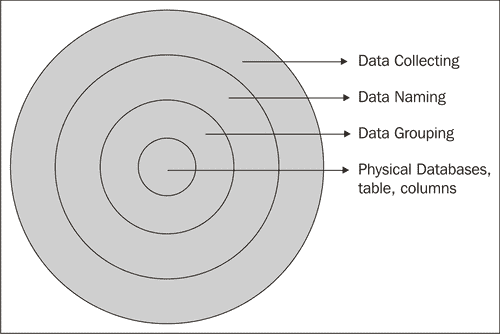
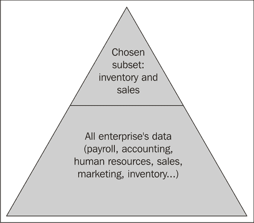
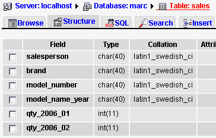
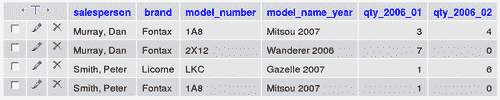
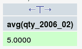
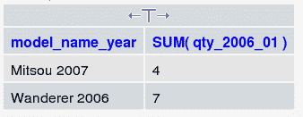

# 第一章：介绍 MySQL 设计

数据设计是应用开发周期中的关键环节。类比建筑，构建应用如同建造房屋，拥有合适的工具固然重要，但我们更需要一个坚实的基础：数据结构。然而，创造一个良好的数据结构是一项艰巨的挑战；追求完美的数据结构可能引领我们进入新领域，那里有众多方法可供选择。哪种方法最佳？我们如何保持目标明确，避免浪费时间？

MySQL 数据库的数据设计既是科学也是艺术，必须在科学和经验方法之间取得良好平衡。科学方面涉及信息技术（IT）原则，而经验方面主要基于直觉和经验。

本书主要面向 MySQL 数据库，教授如何规划数据结构并利用 MySQL 模型实际实施。规划阶段有时被称为*逻辑设计*，但更理想的是将逻辑/物理过程视为一体。

# MySQL 的普及与影响

MySQL（[www.mysql.com](http://www.mysql.com)）自 1995 年推出以来，已成为最受欢迎的开源数据库系统。几乎所有网络服务提供商都将 MySQL 作为其托管计划的一部分，通常在无处不在的 LAMP（Linux、Apache、MySQL、PHP）平台上。MySQL 普及的另一根源是其持续成功的 phpMyAdmin（www.phpmyadmin.net），这是一个成熟的基于 Web 的 MySQL 界面。因此，许多网站都采用 MySQL 作为其后端数据存储库。

## 对 MySQL 设计的需求

总体而言，MySQL 的普及吸引了众多网页开发者，其中一些并无 IT 背景。面对将静态网站转变为动态/交易型网站，或整合企业数据至网站的任务时，开发者有时倾向于即兴构建数据结构。这种结构（或缺乏结构）可能在一段时间内有效，但最终因缺乏深度而失败。或许系统起初因规模小、功能有限而运行良好，但当用户需求增加时便崩溃。设计不佳的数据结构只能修补到一定程度，也可能在初始测试仅涉及少量数据行时出现扩展问题。

使用工具的便捷性可能掩盖了数据库设计依赖于基本原则的事实。忽视这些原则可能导致应用程序维护成本高昂，因为在应用编码开始后纠正数据结构错误耗时费力。

## "接下来我该做什么？"

这里有一个 MySQL 在非 IT 人群中影响的例子。我曾在 phpMyAdmin 讨论论坛上看到这个问题——我是凭记忆引用的：“我安装了 MySQL 和 phpMyAdmin，现在我需要指导：接下来我该做什么？”我回答说：“也许你可以创建一个表，然后插入一些数据。接下来你可以浏览你的数据。”

显然，这些工具被此人视为有趣，但我只能好奇在这次论坛对话后形成了什么样的表结构。

## 数据设计步骤

我们可以将数据设计视为一系列步骤，其目标是生成支持应用程序所需的物理 MySQL 数据库、表和列。



从外壳开始，我们首先需要通过收集数据来了解我们的数据。然后，我们开始通过适当地命名这些数据元素来组织它们。接下来，我们将数据元素重新组合成表格，考虑到所需的关键字。虽然之前的步骤可能只在纸上完成，但最后一步是在 MySQL 的结构中实现模型。

所有这些步骤都在本书的不同章节中有所涉及。

# 数据作为一种资源

在探讨各种可用设计技术之前，我们先来思考数据本身的概念。

组织和企业使用许多资产，例如建筑、家具、智慧，但或许最有价值的资产是信息或数据。我们注意到，数据记录了企业的流程，并将人们绑定到一个持续的信息交换中，称为信息流。计算机有助于规范这些数据，但我们必须记住，数据本身就存在。

## 但这是我的数据！

在构建数据设计时，我们必须与用户会面并了解企业的数据流。在理想情况下，每个部门，包括 IT 部门，以及每位用户都会协作，以便数据能在部门间轻松流动。然而，不时地，人们会目睹两种态度阻碍企业内正常的数据流动。第一种是某些 IT 部门，由于负责存储数据的计算机，开始认为数据属于他们。这导致一定程度的保密性，隐藏数据并可能阻断数据设计过程。第二种是第一种的变体，这次是由用户引起的——数据源自该用户，他有不愿分享的倾向。

以这种后一种态度为例，让我们考虑会计数据。在个人电脑时代之前，会计系统存在于大型机或小型机中，IT 部门管理所有数据，包括会计数据。自从微型计算机和电子表格应用程序出现以来，一名会计文员就能管理大量数据，并生成高质量的报告。然而，这些数据通常存储在他的电脑上；他输入数据，他制作报告，并因此从上司那里获得赞誉。所以，数据属于会计文员，对吧？这种思维方式阻碍了个人和部门之间的数据流动，并有可能导致整个组织中出现冗余、不连贯的数据。

数据设计过程之后，会在用户或部门创建的这些孤立数据岛之间建立桥梁，以便数据能够惠及整个企业。也可能出现岛屿减少和冗余数据被消除的情况。

# 数据建模

数据通常被组织成信息系统。这个系统可以与简单的活页夹相比较，但这本书描述了基于计算机的信息系统或数据库中的数据设计过程。此外，数据库遵循一种设计模型，我们将使用最流行的模型——**关系模型**。

企业的完整数据集合超出了我们模型的涵盖范围。



我们将构建一个仅表示数据频谱子集的模型。问题在于选择哪个子集？我们将在第二章中看到，我们必须为分析系统的数据范围设定边界。

要构建持久的信息系统，数据必须被驯服和塑造，以正确地反映现实。*正确*在这里意味着：

+   遵循组织的需求，包括系统的边界

+   符合所选的数据设计模型（这里指关系模型）

+   具有高度的适应性，以调整自身以适应不断变化的环境

## 关系模型概述

我们要感谢埃德加·F·科德博士提出了关系模型的概念，源自他 1970 年的论文《大型共享数据库的关系数据模型》（[`www.acm.org/classics/nov95/toc.html`](http://www.acm.org/classics/nov95/toc.html)）。科德博士后来通过定义一组规则——所谓的科德十二条规则（[`en.wikipedia.org/wiki/Codd%27s_12_rules`](http://en.wikipedia.org/wiki/Codd%27s_12_rules)）来解释他的模型。理想的数据库管理系统（DBMS）会实现所有这些规则，但很少有能做到的。但在实践中，这并不是问题，因为即使在不完全应用所有规则的产品中，关系模型的优势也能实现。我们完全有能力使用 MySQL 等现有数据库产品构建高效的关系数据设计。

在处理数据设计时，我认为最重要的规则是第 1 条和第 2 条。以下是这两条 Codd 规则的摘要。

### **规则 #1**

本规则指出，数据包含在**表**中。表逻辑上汇总了关于某个主题的信息，例如，汽车。表格格式——行和列——是这里的重要概念。一行描述关于单个项的信息，例如，特定汽车，而一列描述每个项的单一特征（或属性），例如，其颜色。我们将在第三章中看到，将数据分解成适当调整的列对于拥有一个灵活且有用的结构至关重要。

行与列的交点包含单个项的特定属性的值。我们有时将这个交点称为包含我们数据的单元格——这与电子表格中的概念相同。

### **规则 #2**

数据不是通过物理位置检索或引用——*查找此文件中的第三个记录*。相反，数据必须通过引用表、唯一键——**主键**——以及一个或多个列名来获取。例如，在`cars`表中，我们使用车辆序列号来检索该车的颜色。

本规则将在第四章中进行研究，其中我们将描述数据分组和选择键的概念。正确选择键至关重要。

## 简化设计技术

多年前，我开始使用关系模型来详细阐述数据结构。我使用的方法可以概括为这句话：“确定数据最适合放置在结构中的位置”。然后我了解到教授给 IT 专家的设计技术，这些技术从关系模型演变而来。

经常教授的技术包括构建一个**实体-关系图**。在这种图中，我们用实体表示名词，例如，一辆车、一个客户，并用动词表达它们之间的关系。两个实体之间关系的一个例子是“客户购买汽车”。完成图后，必须将其转换为包含表和列的模型，使用一种称为**规范化**的技术，该技术通过多个步骤将模型精炼成有效的数据结构。

这些技术产生报告、图表，并最终形成一个理论上可以在 DBMS 中物理实现的数据设计。

当我熟悉了那些传统技术后，我认为至少对我来说，它们是在浪费时间。这些方法教授了一种方式，但最终目标——一个可运行的关系数据库及其相关文档——可以通过更直接的方式实现。此外，这些技术存在一个问题：它们不能盲目且机械地应用。开发人员总是需要**思考**数据命名、数据分组以及选择键，同时试图平衡用户需求和以下约束：

+   **硬件**

+   选定的数据库管理系统

+   计划增长

+   时间

+   预算

我意识到传统技术无处不在地被教授，我尊重那些教授它们的老师。但请相信我，当需要交付一个应用程序时，无论其界面如何，重要的是避免浪费时间在中间产物上，而是直接开发一个工作原型。在数据设计阶段采用更直接的方法可以腾出更多时间来完善界面，捕捉未预见的需要并解决它们。

本书的目标是教授构建有效数据结构所需应用的最基本原则。

# 案例研究

通过两个案例研究，可以非常实际地解释数据设计的各个步骤。案例研究是解释那些没有真实例子就可能变得过于抽象的概念的最佳方式。第 1 至 5 章基于一个案例研究：“汽车经销商”。第六章则包含另一个案例研究，总结了前几章中提到的所有概念。

## 我们的汽车经销商

假设我们已与一家希望将其业务部分计算机化的汽车经销商联系。让我们简要描述一下这家企业。在第二章中，我们将更正式地检查我们系统的数据收集阶段。

这家汽车经销商仅在一个地址运营。他们雇佣了九名销售人员，这些销售人员尽职尽责地迎接潜在客户，并向他们展示展厅内可用的车型。此外，两名店铺助理负责车辆移动，一名办公室文员记录客户的预约情况。Fontax 和 Licorne 是该经销商提供的两个虚构品牌。每个品牌都有多种车型，例如 Mitsou、Wanderer 和 Gazelle。

## 系统的目标

我们希望保留有关汽车库存和销售的信息。以下是一些示例问题，展示了我们的系统将需要处理的信息类型：

+   我们库存中有多少辆 Fontax Mitsou 2007 款汽车？

+   去年有多少访客试驾了 Wanderer？

+   在某一特定时期内，我们售出了多少辆 Wanderer 汽车？

+   2007 年，谁是我们 Mitsou、Wanderer 或整体销售业绩最佳的销售人员？

+   购买者主要是男性还是女性（按车型划分）？

以下是这家汽车经销商所需的一些报告的标题：

+   每月详细销售额：销售人员、汽车数量、收入

+   每位销售人员的年度销售额

+   库存效率：汽车交付给经销商或客户的平均延迟时间

+   访客报告：尝试驾驶汽车的访客百分比；导致销售的试驾百分比

+   客户对销售人员的满意度

+   销售合同

除此之外，还需要构建屏幕应用程序以支持库存和销售活动。例如，能够查阅和更新预约日程；查阅下周的汽车交付日程。

在此数据模型构建完成后，应用程序开发周期的剩余阶段，如屏幕和报告设计，将为这家汽车经销商提供报告，以及在线应用程序以更好地管理汽车库存和销售。

# *过宽表格*的故事

本书专注于在 MySQL 中表示数据。MySQL 及其他产品中表格的容器是数据库。在数据库中仅包含一张表，从而避免完全应用关系模型概念（其中表格通过共同值相互关联）是完全可能的；然而我们将按常规方式使用模型：拥有多张表并建立它们之间的关联。

### 注意

本节描述了一个数据被塞进一张巨大表格的例子，也称为*过宽表格*，因为它由太多列组成。这种*过宽表格*本质上*是非关系型的*。

有时需要对数据结构进行审查或评估，因为它可能基于数据命名约定、键选择和表数量方面的错误决策。最常见的问题可能是将所有数据放入一张大而宽的表格中。

这种常见结构（或缺乏结构）的原因是许多开发者从结果甚至打印结果的角度思考。也许他们知道如何构建电子表格，并试图将电子表格原则应用于数据库。假设构建数据库的主要目标是生成这份销售报告，该报告展示了每个月每位销售人员销售的汽车数量，描述品牌名称、汽车型号编号和名称。

| Salesperson | Period | Brand Name | Car model number | Car model name and year | Quantity sold |
| --- | --- | --- | --- | --- | --- |
| Murray, Dan | 2006-01 | Fontax | 1A8 | Mitsou 2007 | 3 |
| Murray, Dan | 2006-01 | Fontax | 2X12 | Wanderer 2006 | 7 |
| Murray, Dan | 2006-02 | Fontax | 1A8 | Mitsou 2007 | 4 |
| Smith, Peter | 2006-01 | Fontax | 1A8 | Mitsou 2007 | 1 |
| Smith, Peter | 2006-01 | Licorne | LKC | Gazelle 2007 | 1 |
| Smith, Peter | 2006-02 | Licorne | LKC | Gazelle 2007 | 6 |

在不深入考虑这种结构的影响的情况下，我们可以仅构建一张表，`sales:`

| salesperson | brand | model_number | model_name_year | qty_2006_01 | qty_2006_02 |
| --- | --- | --- | --- | --- | --- |
| Murray, Dan | Fontax | 1A8 | Mitsou 2007 | 3 | 4 |
| Murray, Dan | Fontax | 2X12 | Wanderer 2006 | 7 |   |
| Smith, Peter | Fontax | 1A8 | Mitsou 2007 | 1 |   |
| Smith, Peter | Licorne | LKC | Gazelle 2007 | 1 | 6 |

乍看之下，我们已经将报告中所需的所有信息进行了表格化。

### 注意

本书中的示例可通过`mysql`命令行工具或更直观的网页界面 phpMyAdmin 进行复现。您可以参考 Packt 出版社的《Mastering phpMyAdmin 2.8 for Effective MySQL Management》（ISBN 1-904811-60-6）。在 phpMyAdmin 中，可以在 SQL 查询窗口中键入确切命令，或者利用菜单和图形对话框。本书将展示这两种方法。

以下是我们使用`mysql`命令行工具创建`sales`表的语句：

```
CREATE TABLE sales (
salesperson char(40) NOT NULL,
brand char(40) NOT NULL,
model_number char(40) NOT NULL,
model_name_year char(40) NOT NULL,
qty_2006_01 int(11) NOT NULL,
qty_2006_02 int(11) NOT NULL
) ENGINE=MyISAM DEFAULT CHARSET=latin1;

```

在前述声明中，`char(40)`表示一个包含 40 个字符的列，而`int(11)`在 MySQL 中表示一个显示宽度为 11 的整数。

使用 phpMyAdmin 网页界面，我们将得到：



这里我们已将示例数据输入到我们的`sales`表中：

```
INSERT INTO sales VALUES ('Murray, Dan', 'Fontax', '1A8', 'Mitsou 2007', 3, 4);
INSERT INTO sales VALUES ('Murray, Dan', 'Fontax', '2X12', 'Wanderer 2006', 7, 0);
INSERT INTO sales VALUES ('Smith, Peter', 'Licorne', 'LKC', 'Gazelle 2007', 1, 6);
INSERT INTO sales VALUES ('Smith, Peter', 'Fontax', '1A8', 'Mitsou 2007', 1, 0);

```



然而，这种结构存在许多维护问题。例如，我们应将 2006 年 3 月的数据存储在哪里？为了发现其他问题，让我们检查一下可以针对此表使用的示例 SQL 语句，以查询特定问题，以及这些语句的结果：

```
/* displays the maximum number of cars of a single model sold by each vendor in January 2006 */
SELECT salesperson, max(qty_2006_01)
FROM sales
GROUP BY salesperson

```


```
/* finds the average number of cars sold by our sales force taken as a whole, in February 2006 */
SELECT avg(qty_2006_02)
FROM sales
WHERE qty_2006_02 > 0

```



```
/* finds for which model more than three cars were sold in January */
SELECT model_name_year, SUM(qty_2006_01)
FROM sales
GROUP BY model_name_year
HAVING SUM(qty_2006_01) > 3

```



我们注意到，尽管上述 SQL 查询得到了我们寻找的答案，但为了获取其他月份的结果，我们不得不在查询中修改列名。此外，如果我们想知道哪个月份的销售额超过了年平均水平，情况会变得复杂，因为我们可能需要处理十二个列名。当尝试报告不同年份的数据，或比较两个年份时，还会出现另一个问题。

此外，需要新报告的情况可能揭示了这种结构的糟糕状态。一个过于依赖单一报告而非基于数据元素间内在关系的结构，其扩展性不佳，无法满足未来需求。

第四章将展开这些问题。

# 总结

我们看到，MySQL 的普及为许多用户提供了强大的工具；其中一些用户在设计技巧上并不匹配。数据是一项重要资源，我们必须将组织的数据视为整体。强大的关系模型可以帮助我们进行结构化活动。本书避免使用关于关系模型的专业学术词汇，而是专注于重要原则和构建良好结构所需的最少任务。随后，我们看到了主要案例研究，并注意到不幸的是，构建宽大低效的表是多么容易。
