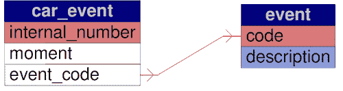
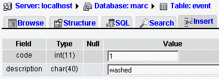
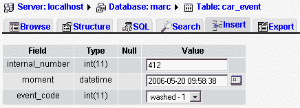
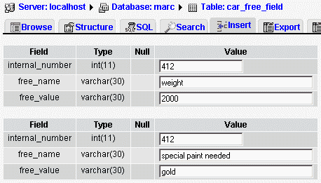

# 第三章：数据命名

在本章中，我们专注于将收集过程中获取的数据元素转化为一组连贯的列名。尽管本章有针对各个步骤的节，以实现高效的数据命名，但这些步骤的实际应用顺序并不固定。事实上，整个过程被分解为步骤，以便逐一阐明每个步骤，但实际的命名过程同时应用了所有这些步骤。此外，命名和分组过程之间的划分在某种程度上是人为的——你会看到，关于命名的某些决策会影响分组阶段，这是下一章的主题。

# 数据清理

从各种来源收集信息元素后，进行一些清理工作以提高这些元素的重要性是恰当的。每位受访者命名元素的方式可能不一致；此外，一个术语的重要性可能因人而异。因此，进行同义词检测是必要的。

鉴于我们已注意到样本值，现在是时候将我们的元素列表与这些样本值进行交叉参考了。以下是一个实际例子，使用车辆识别号。

当决定订购一辆车——比如 2007 年的 Mitsou——办公室职员会打开一个新文件，并给文件分配一个称为`car_id number`的序号，例如 725。此时，尚未从任何汽车供应商处收到确认，因此职员不知道未来车辆的序列号——一个在发动机和其他关键部件上压印的唯一号码。

办公室职员将这辆车的识别号称为`car_number`。注册车辆移动的商店助理使用名称`stock_number`。但使用这个车辆号码或库存号码对于融资和保险目的并不具有意义；相反，车辆的序列号用于这些目的。

此时，必须通过说服用户认识到标准术语的重要性来达成共识。必须让每个人都清楚，`car_number`这一术语不够精确，因此它将在数据元素列表中被`car_internal_number`取代，很可能在任何用户界面（UI）或报告中也是如此。

有人可能会认为`car_internal_number`应该被更恰当的东西取代；关键在于我们合并了两个同义词：`car_number`和`stock_number`，并明确了两个看似相似但实则不同的元素之间的区别，消除了一个混淆的源头。

因此我们得到了以下元素：

+   `Car_serial_number`

+   `Car_internal_number`（前身为车辆识别号和库存号）

最终，在处理数据分组时，将不得不做出另一个决定：我们将车辆的物理钥匙号码与哪个号码——序列号还是内部号——关联起来。

# 细分数据元素

在本节中，我们试图找出某些元素是否应该分解成更简单的部分。这样做的原因是，如果一个元素由多个部分组成，应用程序将不得不为了排序和选择目的而分解它。因此，最好现在就在源头分解元素。在应用程序层面重新组合它将更容易。

分解元素在 UI 层面提供了更多清晰度。因此，在这个层面上，我们将尽量避免（尽可能）众所周知的姓/名颠倒问题。

为了说明这个问题，我们以买家的名字为例。在访谈中，我们注意到名字在表格上有多种表达方式：

| 表格 | 名字的表达方式 |
| --- | --- |
| 交付证明 | 乔·史密斯先生 |
| 销售合同 | 史密斯，乔 |

我们注意到

+   有一个称呼元素，先生

+   元素`name`过于不精确；我们实际上有一个名字和一个姓氏

+   在销售合同上，我们的姓氏后面的逗号实际上应该从元素中排除，因为它只是一个格式化字符

因此，我们确定我们应该将名字细分为以下元素：

+   称呼

+   名字

+   姓氏

有时将一个元素进一步细分是有用的，有时则不然。让我们考虑日期元素。我们可以将每个日期细分为年、月和日（三个整数），但这样做会失去 MySQL 提供的日期计算可能性。其中包括，从日期中找出星期几，或确定某个日期三十天后的日期。因此，对于日期（和时间），单个列可以处理所有内容，尽管在 UI 层面，应为年、月和日显示单独的输入字段。这是为了避免任何混淆的可能性，也因为我们不能期望用户知道 MySQL 接受的有效日期是什么。有效值的范围有一定的灵活性，但我们可以理所当然地认为用户在输入无效值方面具有无限的创造力。如果 UI 上只有一个字段，应提供明确的指导以帮助正确填写此字段。

## 包含格式化字符的数据元素

我们最后要考察的是电话号码。在世界许多地方，电话号码遵循特定模式，并使用格式化字符以提高可读性。在北美，我们有区号、交换号和电话号码，例如，418-111-2222；电话号码后面可能还会加上分机号。然而，在实践中，只有区号和分机号被从其余部分分离出来，成为独立的数据元素。此外，人们经常输入格式化字符，如(418) 111-2222，并期望这些字符能被输出回来。因此，必须选择一个标准输出格式，然后正确设置模型中的子元素数量，以便能够重新创建预期的输出。

# 作为结果的数据

尽管似乎自然地为汽车的`total_price`设置一个独立的元素，但实际上这并不合理。原因是总价是一个计算结果。在销售合同上打印总价构成了一种输出。因此，我们在列名列表中消除了这一信息。出于同样的原因，我们可以省略`tax`列，因为它可以计算得出。

通过删除总价列，我们可能会遇到一个陷阱。我们必须确保能够从其他子总元素中重建这个总价，现在和将来都是如此。出于多种原因，这可能是不可能的：

+   总价包括位于另一个表中的金额，而这个表会随时间变化，例如税率。为了避免这个问题，请参阅第四章中*随时间可扩展性*部分的建议。

+   这个总价包含了一个任意值，由于某些特殊情况，例如，有特别促销，而系统中未计划回扣，或者幸运买家是总经理的姐夫！在这种情况下，可以做出决定：增加一个新列`other_rebate`。

# 数据作为列名或表名

现在是揭露可能是最不为人知的数据命名问题的时候了：数据隐藏在列名甚至表名中。

我们在第一章中有一个这样的例子。记得`qty_2006_1`这个列名。尽管这是一个常见的错误，但它仍然是一个错误。这里我们明显有两个概念，数量和日期。当然，为了能够只使用两个列，关于键的一些工作必须完成——这在第四章中有所涉及。目前，我们应该在我们的元素列表中使用像`quantity`和`date`这样的元素，避免在列名中表示数据。

为了在我们的模型中找到这些有问题的案例，一种可能的方法是寻找数字。像`address1, address2`或`phone1, phone2`这样的列名应该看起来可疑。

现在，请看第二章中我们从店员那里得到的数据元素。你能找到一个数据隐藏在列名中的案例吗？

如果你完成了这个练习，你可能会发现许多过去分词隐藏在列名中，如*已订购、已到达*和*已清洗*。这些描述了发生在汽车上的事件。我们可以尝试预见所有可能的事件，但这可能证明是不可能的。谁知道什么时候会需要一个新的列`car_provided_with_big_ribbon`？如果将这些事件作为不同的列名处理，必须通过

+   数据结构的变更

+   代码（UI 和报告）的变更

为了保持灵活性并避免宽表综合症，我们需要两个表：`car_event`和`event`。



以下是这些表的结构和示例值：

```
CREATE TABLE `event` (
`code` int(11) NOT NULL,
`description` char(40) NOT NULL,
PRIMARY KEY ('code')
) ENGINE=MyISAM DEFAULT CHARSET=latin1;
INSERT INTO `event` VALUES (1, 'washed');

```

### 注意

此处使用反引号（'event'），虽然不是标准 SQL，但这是 MySQL 扩展，用于包围和保护标识符。在特定情况下，它可以帮助我们在 MySQL 5.1 中，其中 event 关键字计划成为语言的一部分，用于其他目的（`CREATE EVENT`）。在撰写本文时，MySQL 5.1.11 beta 版接受`CREATE TABLE event`，但这可能不会一直成立。

以下图像显示了通过 phpMyAdmin 的**插入**子页面输入到`event`表中的示例值：



```
CREATE TABLE `car_event` (
`internal_number` int(11) NOT NULL,
`moment` datetime NOT NULL,
`event_code` int(11) NOT NULL,
PRIMARY KEY ('internal_number')
) ENGINE=MyISAM DEFAULT CHARSET=latin1;
INSERT INTO `car_event` VALUES (412, '2006-05-20 09:58:38', 1);

```

再次，示例值通过 phpMyAdmin 输入：



数据也可能隐藏在表名中。让我们考虑`car`和`truck`表。它们可能应该合并为一个`vehicle`表，因为车辆的类别——卡车、汽车以及其他值如小型货车，实际上是特定车辆的一个属性。我们还可以为这个表名问题找到另一个案例：一个名为`vehicle_1996`的表。

# 变更规划

在设计数据结构时，我们必须考虑如何管理其增长以及所选技术可能带来的影响。

假设需要支持一个未计划的轿车特性——重量。通常的解决方法是找到适当的表并添加一个列。确实，这是最佳解决方案；然而，需要有人更改表结构，可能还需要更改用户界面。

**自由字段技术**，也称为二级数据或**EAV**（实体-属性-值）技术，在这种情况下有时会被采用。简而言之，我们使用一个其值本身就是列名的列。

### 注意

尽管此处展示了此技术，但我不建议使用它，原因在下面的*自由字段技术的陷阱*部分中解释。

此技术与我们的`car_event`表的区别在于，对于`car_event`，各种属性都可以与一个共同主题——事件相关联。相反，自由字段可以存储任何类型的不同数据。这也可以是存储特定于单个实例或行表的数据的一种方式。

在以下示例中，我们使用`car_free_field`表来存储关于内部编号为 412 的汽车的未计划信息。重量和特殊油漆未被计划，因此用户界面为用户提供了指定他们想要保留哪些信息以及相应值的机会。此处展示的是 phpMyAdmin 的截图，但很可能用户会看到另一种界面——例如，销售人员可能未受过数据库层面的操作培训。

```
CREATE TABLE `car_free_field` (
`internal_number` int(11) NOT NULL,
`free_name` varchar(30) NOT NULL,
`free_value` varchar(30) NOT NULL,
PRIMARY KEY ('internal_number','free_name')
) ENGINE=MyISAM DEFAULT CHARSET=latin1;
INSERT INTO `car_free_field` VALUES (412, 'weight', '2000');
INSERT INTO `car_free_field` VALUES (412, 'special paint needed', 'gold');

```



## 自由字段技术的陷阱

尽管使用这种表格可以增加灵活性并避免用户界面维护，但出于多种原因，我们应避免使用它。

+   将这个“列”（例如所需的**特殊油漆**）与包含可能颜色的查找表通过外键约束关联起来变得不可能。

+   `free_value`字段本身必须定义为`VARCHAR`这样的通用字段类型，其大小必须足够宽以容纳所有可能对应的`free_name`值的所有值。

+   这使得验证变得不易（例如，对于重量，我们需要一个数值）。

+   在这些自由字段上编写 SQL 查询变得更加复杂——例如`SELECT internal_number from car_free_field where free_name = 'weight' and free_value > 2000`。

# 命名建议

这里我们触及了一个可能变得敏感的话题。建立命名约定并不容易，因为它可能干扰设计师的心理。

## 设计师的创意

程序员和设计师通常认为自己是有想象力、有创造力的人；UI 设计和数据模型是他们想要表达这些品质的领域。由于命名即写作，他们希望在列和表名上留下个人印记。这就是为什么团队合作进行数据结构设计需要一定程度的谦逊，并且只有当每个人都成为优秀的团队成员时才能取得良好结果。

此外，在审视这一领域的他人工作时，有一种强烈的诱惑去*改进*数据元素的名称。在标准化方面需要有一定的纪律，并且所有团队成员必须协作。

## 缩写

可能是因为早期的数据库系统对变量和数据元素的表示有严格的限制，缩写的做法多年来一直被教授，并被许多数据结构设计师和程序员遵循。我使用过的编程语言只接受两个字符的变量名——我们不得不大量注释这些截断的变量与其含义之间的对应关系。

如今，我看不出有任何理由系统地缩写所有列和表名；毕竟，谁会理解你的`T1`表或你的`B7`字段的含义呢？

### 清晰度与长度：一门艺术

应采用一致的缩写风格。通常，一个句子中最有意义的词应该被放入名称中，省略介词和其他小词。以邮政编码为例，我们可以用不同的列名来表示这个元素：

+   the_postal_code

+   pstl_code

+   pstlcd

+   postal_code

我推荐最后一个，因其简洁性。

### 后缀

精心选择的后缀可以为列名增添清晰度。例如，对于*首次付款日期*元素，我建议使用`first_payment_date`。实际上，列名的最后一个词通常用来描述内容的类型——如`customer_no, color_code, interest_amount`。

## 复数形式

关于表名的另一个争议点：我们是否应使用复数形式的`cars`表？可以认为答案是肯定的，因为该表包含多辆汽车——换句话说，它是一个集合。然而，我倾向于不使用复数形式，原因很简单，它并未增加任何信息量。我知道表是一个集合，因此使用复数形式会显得多余。也可以说，每一行描述了一辆汽车。

从查询的角度考虑主题，我们可以根据查询得出不同的结论。例如，针对汽车表的查询——`select car.color_code from car where car.id = 34`，若不使用复数形式，则显得更为优雅，因为这里的主要意图是检索 ID 等于 34 的单辆汽车。而其他一些查询可能使用复数形式更有意义，如`select count(*) from cars`。

综上所述，这一部分的争论尚未结束，但最关键的是选择一种形式并在整个系统中保持一致。

## 命名一致性

我们应确保存在于多个表中的数据元素在各处均以相同的列名表示。在 MySQL 中，列名并非独立存在，它总是位于表内。因此，遗憾的是，我们不能从一组标准化的列名池中挑选一致的列名并将其与表关联。相反，在创建每个表时，我们需明确指定所需的列名及其属性。因此，让我们避免使用不同的名称——如`internal_number`和`internal_num`，当它们指向同一实体时。

对此有一个例外：如果列名指向另一表中的键——如`state`列——并且有多个列指向它，比如`state_of_birth`、`state_of_residence`。

## MySQL 的可能性与可移植性

MySQL 允许在标识符——数据库、表和列名中使用比其竞争对手更多的字符。空格和重音字符均被接受。简单的权衡是，我们需要用反引号将这些特殊名称括起来，如`'state of residence'`。这为数据元素的表达提供了极大的自由，尤其是对非英语设计者而言，但引入了不可移植的状态，因为这些标识符在标准 SQL 中不被接受。甚至某些 SQL 实现仅接受大写标识符。

在决定包含此类字符之前，我建议应极为谨慎。即便忠于 MySQL，在升级至 4.1 之前的版本时，也曾出现过可移植性问题。在 4.1.x 版本中，MySQL 开始以内置 UTF-8 编码表示标识符，因此在升级前必须进行重命名操作，确保数据库、表、列及约束名中不包含重音字符。在 24/7 系统可用性的背景下，这一繁琐操作并不实用。

## 表名转为列名

另一种常见风格是：人们会系统地将表名作为前缀添加到每个列名上。因此，`car` 表将包含以下列：`car_id_number, car_serial_number`。我认为这显得多余，且在审视我们构建的查询时，这种做法的不优雅之处便显而易见：

```
select car_id_number from car

```

这还不算太糟，但当进行表连接时，我们得到的查询会是这样的：

```
select car.car_id_number,
buyer.buyer_name
from car, buyer

```

由于在应用层面，我们编写的大多数查询都是涉及多表的，如上例所示，使用表名（即使是缩写）作为列名的一部分，其笨拙性变得显而易见。当然，我们在*命名一致性*部分提到的例外情况同样适用：指向查找表的外键列通常会包含该表名作为列名的一部分。例如，在`car_event` 表中，我们有`event_code`，它指向`event` 表中的`code` 列。

# 总结

为了获得清晰且易于理解的数据结构，恰当的数据元素命名至关重要。我们探讨了多种技巧，以确保构建出一致的表名和列名。
