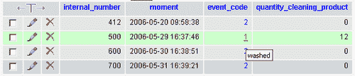
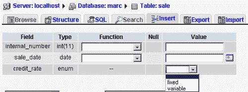

# 第四章：数据分组

在前几章中，我们构建了数据收集，并通过适当的命名开始清理它。我们在第一章中已经介绍了表的概念，它逻辑上汇总了关于某个主题的信息。我们在命名过程中将收集到的一些列分组到表中。在此过程中，我们注意到名称检查有时会引导我们将数据分解到更多的表中，就像我们对`car_event`和`event`表所做的那样。本章的目标是通过检查将列名分组到表中的技术，为我们的结构提供最后的润色。我们的数据元素不会“悬空”；它们必须被组织到表中。具体哪些列必须放在哪个表中，将在本节中考虑。

# 初始表列表

构建结构时，我们可以先找出那些看似适合数据分组的通用、自然主题。这些主题将提供我们初始的表列表——以下是一个简化的示例，展示了这个列表可能的样子：

+   车辆

+   客户

+   事件

+   车辆销售

+   客户满意度调查

我们将从考虑`vehicle`表开始进行列分组工作。

# 表布局规则

可能存在多个正确解决方案，但任何正确解决方案都将倾向于遵循以下原则：

+   每个表都有一个主键

+   当考虑所有表作为一个整体时，不存在冗余数据

+   表中的所有列都直接依赖于主键的所有部分

这些原则将在以下章节中详细研究。

## 主键和表名

首先，我们来定义**唯一键**的概念。在定义了唯一键的列上，该表中不能有重复的值。**主键**由一个或多个列组成，它是可以用来唯一标识表中一行的值。为什么我们需要主键？MySQL 本身并不强制要求特定表必须有主键，也不强制要求有唯一键或其他类型的键。因此，MySQL 并不强制我们遵循 Codd 的规则。然而，在实践中拥有主键是很重要的；在构建 Web 界面和其他应用程序时获得的经验表明，能够通过一个唯一标识一行的键进行引用是非常有用的。在 MySQL 中，主键是一个所有列都必须定义为`NOT NULL`的唯一键；这个键的名称是`PRIMARY`。选择主键几乎与选择表名同时进行。

选择表名是一个微妙的过程。我们必须足够通用，以便为将来的扩展提供空间——例如，选择`vehicle`表而不是`car`和`truck`。同时，我们试图避免出现空洞——即表中的空列。

为了决定是否应该有一个`vehicle`表或两个单独的表，我们查看每种车辆的可能属性。它们是否足够常见？两种车辆类型都有颜色、型号、年份、序列号和内部编号。理论上，列的列表必须相同，我们才能决定一组列将属于单个表；但如果只有少数几个属性不同，我们可以稍微作弊。

假设我们决定创建一个`vehicle`表。由于前面解释的原因，我们希望从订购车辆的那一刻起跟踪车辆——我们将使用其内部编号作为主键。在设计此表时，我们询问自己此表是否可以用于存储我们从客户那里交换得来的车辆信息。答案是*肯定*的，因为描述车辆与发生在车辆上的交易（新车销售、从客户那里购买的二手车）无关。*验证结构*部分提供了更多示例，可以帮助发现结构中的问题。以下是`vehicle`表的版本 1，包含列名和示例值——我们用星号标记构成主键的列：

| 表：车辆 | 列名 | 示例值 |
| --- | --- | --- |
|   | *内部编号 | 123 |
|   | 序列号 | D8894JF |
|   | 品牌 | Licorne |
|   | 型号 | 瞪羚 |
|   | 年份 | 2007 |
|   | 颜色 | 海洋蓝 |
|   | 状况 | 全新 |

我们应该在此表中包含销售信息，例如定价和销售日期吗？我们确定答案是*否*，因为可能会发生多种情况：

+   车辆可以转售

+   该表可能用于存储交换得来的车辆信息

我们现在必须检查我们的工作并验证我们是否遵守了原则。我们有一个主键，但冗余和依赖性呢？

## 数据冗余和依赖性

在可能的情况下，我们应该将冗余数据迁移到查找表（也称为参考表），并将代码的值仅存储在我们的主表中。我们不希望在每售出一辆“Licorne”时都在车辆表中重复“Licorne”。冗余数据浪费磁盘空间，并在进行数据库维护时增加处理时间：如果需要进行修改，则必须更新同一数据的所有实例。关于`vehicle`表，在`品牌、型号`和`颜色`列中存储完整的描述性值将是多余的——存储三个代码就足够了。

我们必须小心处理冗余数据。例如，我们不会对年份进行编码；这样做没有节省——使用 A 代表 2006 年，B 代表 2007 年，在几千年的情况下并没有实际的空间节省！即使对于少量年份，节省的空间也不会显著；此外，我们将失去对年份进行计算的能力。

接下来，我们验证依赖性。每一列都必须直接依赖于主键。新/旧状态是否直接依赖于车辆？不，如果我们考虑时间维度。理论上，经销商可以出售一辆车，然后稍后接受它作为交换。条件更多地与特定日期的交易本身相关，因此它实际上属于`销售`表——此处显示为非最终状态。我们现在有了版本 2：

| 表: 车辆 | 列名 | 示例值 |
| --- | --- | --- |
|   | *内部 ID | 123 |
|   | 序列号 | D8894JF |
|   | 品牌代码 | L |
|   | 模型代码 | G |
|   | 年份 | 2007 |
|   | 颜色代码 | 1A6 |
| 表: 品牌 | 列名 | 示例值 |
| --- | --- | --- |
|   | *代码 | L |
|   | 描述 | Licorne |
| 表: 模型 | 列名 | 示例值 |
| --- | --- | --- |
|   | *代码 | G |
|   | 描述 | Gazelle |
| 表: 颜色 | 列名 | 示例值 |
| --- | --- | --- |
|   | *代码 | 1A6 |
|   | 描述 | 海洋蓝 |
| 表: 销售 | 列名 | 示例值 |
| --- | --- | --- |
|   | *日期 | 2006-03-17 |
|   | *内部 ID | 123 |
|   | 条件代码 | N |

### 复合键

**复合键**，也称为组合键，是由多个列组成的一个键。

在布局我们的代码表时，我们必须验证数据分组原则是否也在这些表上得到遵守。使用示例数据，并通过我们的想象力补充不完整的示例数据，可以帮助揭示此领域的问题。在我们的版本 2 中，我们忽略了一种可能性。如果营销两个不同品牌的公司选择相同的颜色代码 1A6 来代表不同的颜色怎么办？模型代码也可能发生同样的情况，因此我们应该改进结构，将品牌代码——代表 Fontax、Licorne 或未来品牌名称——纳入`模型`和`颜色`表中。因此，版本 3 展示了从版本 2 更改的两个表：

| 表: 模型 | 列名 | 示例值 |
| --- | --- | --- |
|   | *品牌代码 | L |
|   | *代码 | G |
|   | 描述 | Gazelle |
| 表: 颜色 | 列名 | 示例值 |
| --- | --- | --- |
|   | *品牌代码 | L |
|   | *代码 | 1A6 |
|   | 描述 | 海洋蓝 |

无论是`模型`还是`颜色`表，最终都具有复合键。另一个复合键的例子是在第三章中看到的：`汽车事件`表——参见*数据作为列名或表名*部分。在这些类型的表中，主键由多个元素组成。当我们必须描述与多个表相关的数据时，就会发生这种情况。通常，新形成的`汽车事件`表包含汽车的内部编号和事件代码，还包含进一步的属性，如特定事件发生在特定汽车的日期。

当我们遇到诸如公司部门之类的子集时，另一种复合键的可能性出现。仅将员工 ID 与公司代码或部门代码关联，并不能正确描述情况。员工 ID 只有在同时考虑部门和公司时才是唯一的。

我们必须验证此表中所有非键数据元素是否直接依赖于整个键。以下是一个有问题的案例，其中`company_name`列位置不当，因为它与`dept_code`无关：

| 表：公司部门 | 列名 | 示例值 |
| --- | --- | --- |
|   | *company_code | 1 |
|   | *dept_code | 16 |
|   | dept_name | Marketing |
|   | company_name | Fontax |

先前的例子并不理想，因为公司名称会出现在旨在描述每个部门的表的每一行中。先前例子的正确结构意味着需要使用两个表：

| 表：部门 | 列名 | 示例值 |
| --- | --- | --- |
|   | *company_code | 1 |
|   | *code | 16 |
|   | name | Marketing |
| 表：公司 | 列名 | 示例值 |
| --- | --- | --- |
|   | *code | 1 |
|   | name | Fontax |

# 改进结构

即使我们的表布局遵循规则，我们仍可以通过关注以下额外问题来进一步优化它。

## 时间上的可扩展性

在第三章（*结果数据*节）中，我们了解到，只要在参考表中拥有确切的税率，就可以避免为税额预留一列。然而，此税率可能变动，因此我们需要一个更完整的表，其中包含日期范围及相应的税率。这样，在时间维度上对系统进行投影时，我们能确保其适应税率波动。请注意，下面的`sale`表并不完整：

| 表：销售 | 列名 | 示例值 |
| --- | --- | --- |
|   | *date | 2006-03-17 |
|   | *internal_id | 123 |
|   | condition_code | N |
| 表：条件 | 列名 | 示例值 |
| --- | --- | --- |
|   | *code | N |
|   | description | New |

通过比较`sale`表中的`date`列与以下`tax_rate`表中的`start_date`和`end_date`，我们可以找到销售日期的确切税率：

| 表：税率 | 列名 | 示例值 |
| --- | --- | --- |
|   | *start_date | 2006-01-01 |
|   | *end_date | 2006-04-01 |
|   | rate | .075 |

实际上，所有表都应进行分析，以确定是否考虑了时间因素。另一个例子是`color`表。假设我们使用每个汽车制造商设计的颜色代码，制造商是否会在后续年份为不同颜色重复使用颜色代码？如果是这种情况，我们将在`color`表中添加一个`year`列。

## 空列

尽管空列不一定有问题，但某些行中一个或多个列的空缺可能揭示了结构问题：两个表合并成了一个。让我们考虑汽车移动。我们构建了一个具有汽车内部编号、事件代码和时刻的结构。但如果某些事件需要更多数据来描述呢？

在纸质表格中，我们发现当汽车被清洗时，进行清洗的店员的首字母会出现在表格上，并且在采访中，我们了解到这些首字母是一个重要的数据元素。

在这种情况下，我们可以将员工信息，即员工代码，添加到 `car_event` 表中。这将使系统能够识别哪个店员参与了与汽车相关的任何事件，从而提高质量控制。

另一个可能出现的问题是，对于特定事件（例如洗车），我们需要更多数据，如清洁产品的数量和洗车所用的时间。在这两个元素中，存储事件的开始和结束时间可能有助于改进我们的结构。但是，向 `car_event` 表添加类似 **quantity_cleaning_product** 的列需要仔细分析。除洗车外的所有事件，此列都将保持空白，导致应用程序中需要进行异常处理。如果我们为另一个特殊事件添加另一个相关列，结构只会变得更糟。



在这种情况下，最好创建另一个具有相同键和附加列的表。我们无法避免在这个新表名 `car_washing_event` 中包含一些数据元素。

| 表：car_washing_event | 列名 | 示例值 |
| --- | --- | --- |
|   | *internal_number | 412 |
|   | quantity_cleaning_product | 12 |

## 避免使用 ENUM 和 SET

MySQL 和 SQL 通常提供看似方便的数据类型：`ENUM` 和 `SET` 类型。这两种类型允许我们为列指定可能值列表，以及默认值；区别在于 `SET` 列可以包含多个值，而 `ENUM` 只能包含其中一个潜在值。

我们在这里看到一个非常小的 `sale` 表，其中 `credit_rate` 列是一个 `ENUM:`

```
CREATE TABLE `sale` (
`internal_number` int(11) NOT NULL,
`date` date NOT NULL,
`credit_rate` ENUM('fixed','variable') NOT NULL,
PRIMARY KEY (`internal_number`)
) ENGINE=MyISAM DEFAULT CHARSET=latin1;

```

当字段定义为 ENUM 或 SET 时，如果我们使用 phpMyAdmin 的插入或数据编辑面板，会显示一个值的下拉列表，这可能会诱使我们使用这些数据类型。



让我们来审视这类数据类型的优势：

+   与其存储完整值，MySQL 仅存储一个整数索引，该索引根据列表中的值数量使用一到两个字节。

+   MySQL 本身拒绝任何不在列表中的值

尽管考虑到了这些优势，但出于以下原因，仍建议不要使用 `ENUM` 和 `SET` 类型：

+   更改可能值列表需要开发人员操作，例如结构修改干预。

+   这些类型有其限制：列表中最多可有 65535 种可能值；同时，一个`SET`可以有 64 个活跃成员，即集合中选定的值。

+   保持系统更简单为佳，因为如果在某些情况下我们使用查找表，而在其他情况下使用`ENUM`或`SET`类型，程序代码构建和维护起来会更加复杂。

有人可能会争辩说，问题一可以通过在应用程序中包含一些`ALTER TABLE`语句来改变值列表来解决，但这似乎不是处理此事的常规方式。`ALTER TABLE`是一个数据定义语句，应在系统开发期间使用，而不是在应用程序级别。

因此，`ENUM`或`SET`列应成为具有代码作为主键的单独表。然后，引用此代码的表只需将其作为外键包含。在`SET`列的情况下，一个独立的表将包含主表的键以及包含这些`SET`值的表的键。

| 表：销售 | 列名 | 示例值 |
| --- | --- | --- |
|   | *内部编号 | 122 |
|   | *日期 | 2006-05-27 |
|   | 信用评级代码 | F |
| 表：信用评级 | 列名 | 示例值 |
| --- | --- | --- |
|   | *代码 | F |
|   | 描述 | 固定 |

应用程序中的适当验证确保插入的代码属于查找表。

## 多语言规划

使用代码表的另一个好处是：如果我们存储车辆状况为新/旧，那么开发多语言应用程序会更加复杂。另一方面，如果我们对车辆状况进行编码，那么我们可以有一个`condition`表和一个`language`表：

| 表：条件 | 列名 | 示例值 |
| --- | --- | --- |
|   | 语言代码 | E |
|   | 条件代码 | N |
|   | 描述 | 新 |
| 表：语言 | 列名 | 示例值 |
| --- | --- | --- |
|   | 语言代码 | E |
|   | 描述 | 英语 |

# 验证结构

验证是通过使用精确的例子进行的，我们自问是否有列来放置所有信息，涵盖所有情况。也许会有例外——我们该如何处理这些？我们的结构应该处理它们吗？我们可以评估与这些例外相关的风险因素，与处理它们的成本以及查询性能可能的损失进行比较。

一个异常情况的例子：一个顾客同一天购买了两辆车——这可能影响主键的选择，如果日期是该主键的一部分，那么添加一个列到该主键中将是有益的：销售当天的具体时间。

phpMyAdmin 工具在这里可能证明是有用的。使用此软件可以轻松构建表，而其索引管理功能允许我们设计主键。然后，我们可以使用多表查询生成器来模拟各种报告和假设情况。

# 总结

我们已经看到，我们的列列表需要放置在适当的表格中，每个表格都有一个主键，并遵循一些规则以提高效率和清晰度。我们还可以通过考虑可扩展性和多语言问题来改进模型；然后我们学习了一种验证此模型的方法。
