# 第五章：数据结构调优

本章介绍各种技术以从安全性、性能和文档方面改进我们的数据结构。然后，我们展示汽车经销商案例研究的最终数据结构。

# 数据访问政策

我们在第一章中了解到，数据是一项重要资源，因此对该资源的访问必须受到控制并清晰记录。每条数据产生时，数据录入的责任必须明确确立。数据进入数据库后，必须有政策来控制对其的访问，这些政策通过 MySQL 的权限和使用**视图**来实施。

## 责任

我们应该确定企业中谁——以个人姓名或职能名称——负责每个数据元素。这应该被记录下来，一个好地方就是在数据库结构中直接记录。另一种选择是将数据责任记录在纸上，但纸质信息容易丢失，且有迅速过时的倾向。

在某些情况下，会有一个主要来源和一个审批级别来源。两者都应这样记录——有助于

+   应用程序设计中，当屏幕需要反映数据录入的权限链时

+   权限管理，如果直接向终端用户授予 MySQL 数据访问权限

phpMyAdmin 允许我们通过添加注释来描述每一列。如果当前的 MySQL 版本支持原生注释，则使用这些注释；否则，必须配置 phpMyAdmin 的链接表基础设施以启用将列注释作为元数据存储。我们将在相应的列注释中指出该列的责任细节。要访问允许我们在 phpMyAdmin 中输入注释的页面，我们使用左侧导航面板打开数据库（这里为`marc`），然后是表（这里为`car_event`）。然后我们点击**结构**并选择通过点击铅笔图标编辑字段结构（这里为`event_code`）。

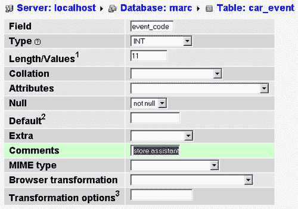

我们可以从**结构**页面使用 phpMyAdmin 的**打印视图**来获取带有注释的表列表。

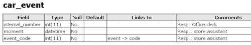

## 安全和权限

考虑数据安全的两种方式。最常见的是在应用程序层面实施。通常，应用程序应请求凭证：用户名、密码，并使用这些凭证生成反映该用户允许执行的任务的网页或桌面屏幕。请注意，底层应用程序仍以开发人员账户的所有权限连接到 MySQL，但当然，仅根据用户的权利显示适当的数据。

另一个需要考虑的问题是，当用户直接访问 MySQL 时，无论是使用命令行实用程序还是像 phpMyAdmin 这样的界面。这可能是因为最终用户应用程序仅开发到一定程度，并且不允许维护代码表，例如。在这种情况下，应创建具有所需权限的特殊 MySQL 用户。MySQL 支持基于数据库、表、列和视图上的权限的访问矩阵。这样，我们可以向所有未经授权的人员隐藏特定列，例如销售价格。

## 视图

自 MySQL 5.0 起，我们可以创建视图，这些视图看起来像表，但实际上是基于查询的。这些视图可用于：

+   隐藏某些列

+   根据表列和对其使用的表达式生成修改后的信息

+   通过连接许多表来提供数据访问的快捷方式，使它们看起来像一个表

由于我们可以将权限关联到这些视图，而不授予对基础表的访问权限，因此视图可以证明在让用户直接访问 MySQL 并同时控制其操作方面很方便。

以下是一个视图示例，显示了汽车事件及其描述——这里，我们希望隐藏`event_code`列：

```
create view explained_events as
select car_event.internal_number, car_event.moment, event.description
from car_event
left join event on car_event.event_code = event.code

```

在 phpMyAdmin 中浏览此视图会显示以下报告：


要求用户使用视图并不意味着该用户只能读取此数据。在许多情况下，视图可以更新。例如，允许以下语句：

```
UPDATE `explained_events`
SET `moment` = '2006-05-27 09:58:38'
WHERE `explained_events`.`internal_number` = 412;

```

# 存储引擎

MySQL 内部结构是这样的，存储和管理数据的低级任务由**可插拔存储引擎架构**实现。MySQL AB 和其他公司正在研发中，以改进存储引擎范围的供应。有关架构本身的更多信息，请参阅[`dev.mysql.com/tech-resources/articles/mysql_5.0_psea1.html`](http://dev.mysql.com/tech-resources/articles/mysql_5.0_psea1.html)。

每次我们创建表时，即使我们没有注意到，我们也在要求 MySQL 服务器（无论是隐式还是显式）使用可用的存储引擎之一来物理存储我们的数据。

默认和传统的存储引擎名为`MyISAM`。《*MySQL 参考手册*》（[`dev.mysql.com/doc/refman/5.0/en/storage-engines.html`](http://dev.mysql.com/doc/refman/5.0/en/storage-engines.html)）中有一整章描述了可用的引擎。我们的存储引擎选择可以根据表的不同而变化。不存在完美的存储引擎；我们必须根据需求选择最佳的。以下是选择时需要考虑的一些要点：

+   `MyISAM`支持`FULLTEXT`索引和压缩的只读存储，并且使用大约三分之一的磁盘空间比`InnoDB`少，用于等量的数据

+   `InnoDB`提供外键约束，多语句事务支持`ROLLBACK`；此外，由于其锁定机制，它支持比`MyISAM`更多的并发`SELECT`查询

+   `MEMORY`当然非常快，但内容（数据）并非永久存储在磁盘上，而表定义本身则存储在磁盘上

+   `NDB`（网络数据库），也称为`MySQL 集群`，提供服务器间的同步复制——集群中推荐的最小服务器数量为四台；因此，这样的集群中没有单点故障

简而言之，这里有一个通用指南：如果应用程序需要多语句事务和外键约束，我们应选择`InnoDB`；否则，默认存储引擎`MyISAM`是建议的选择。

## 外键约束

`InnoDB`存储引擎（[`www.innodb.com`](http://www.innodb.com)），包含在 MySQL 中，提供了一种在表结构中描述外键的机制。**外键**是一个列（或一组列），指向表中的一个键。通常，被指向的键位于另一个表中，并且是该表的主键。外键常用于查找表。在结构中直接描述这些关系有许多好处：

+   表的参照完整性由引擎维护——如果`event`表中不存在对应的代码，我们就不能向`car_event`表添加事件代码，同样，如果`car_event`表中仍有行引用该代码，我们就不能从`event`表删除代码

+   我们可以编程设定 MySQL 在特定事件发生时的反应；例如，如果被引用代码更新，引用表中会发生什么

让我们将`car_event`示例转换为`InnoDB`。首先创建并填充被引用表`event`——注意`ENGINE=InnoDB`子句：

```
CREATE TABLE `event` (
`code` int(11) NOT NULL,
`description` char(40) NOT NULL,
PRIMARY KEY (`code`)
) ENGINE=InnoDB DEFAULT CHARSET=latin1;
INSERT INTO `event` VALUES (1, 'washed');
INSERT INTO `event` VALUES (2, 'arrived');

```

接下来，引用表`car_event`：

```
CREATE TABLE `car_event` (
`internal_number` int(11) NOT NULL COMMENT 'Resp.:Office clerk',
`moment` datetime NOT NULL COMMENT 'Resp.: store assistant',
`event_code` int(11) NOT NULL COMMENT 'Resp.: store assistant',
PRIMARY KEY (`internal_number`),
KEY `event_code` (`event_code`)
) ENGINE=InnoDB DEFAULT CHARSET=latin1;
INSERT INTO `car_event` VALUES (412, '2006-05-27 09:58:38', 2);
INSERT INTO `car_event` VALUES (500, '2006-05-29 16:37:46', 1);
INSERT INTO `car_event` VALUES (600, '2006-05-30 16:38:51', 2);
INSERT INTO `car_event` VALUES (700, '2006-05-31 16:39:21', 2);

```

我们必须为`event_code`列创建索引，以便能在`InnoDB`外键约束中使用它，该约束在此定义：

```
ALTER TABLE `car_event`
ADD CONSTRAINT `car_event_ibfk_1` FOREIGN KEY (`event_code`) 
REFERENCES `event` (`code`) ON UPDATE CASCADE;

```

### 注意

在初始的`CREATE TABLE`语句中也可以定义`car_event`中的外键。之前的示例使用`ALTER TABLE`来展示外键可以在之后添加。

所有这些操作都可以通过 phpMyAdmin 以更直观的方式处理。**操作**子页面允许我们将引擎切换到**InnoDB**：

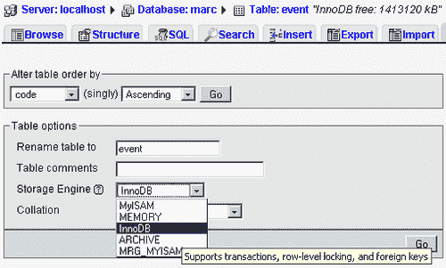

此外，当表处于`InnoDB`存储引擎下时，phpMyAdmin 的**关系视图**使我们能够定义和修改外键及相关操作：

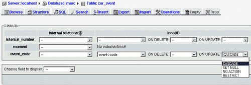

定义了`ON UPDATE CASCADE`子句后，让我们看看当我们在`event`表中修改代码值时会发生什么。我们决定将**washed**的代码从**1**改为**10**：

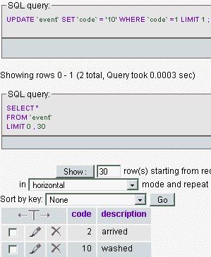

现在我们浏览`car_event`表；果然，**washed**的代码已自动更改为值 10：


# 性能

如果我们想提高结构在访问速度或磁盘空间使用方面的效率，必须检查多个要点。

## 索引

在`WHERE`子句中使用的列上添加索引是加快查询的常见方法。假设我们打算找到特定品牌的所有车辆。`vehicle`表有一个`brand_id`列，我们想在此列上创建索引。在这种情况下，索引不会是唯一的，因为每个品牌都由许多车辆代表。

使用 phpMyAdmin 创建索引有两种方法。首先，如果索引适用于单个列，我们可以打开表的**结构**页面，并在`brand_id`列的同一行点击索引（闪烁）图标：

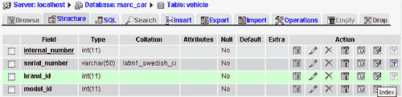

这会生成以下语句：

```
ALTER TABLE `vehicle` ADD INDEX(`brand_id`)

```

我们还可以在复合键上创建索引，例如`model_id`加上`year`。为此，我们在**结构**页面上输入索引的列数（两列），然后点击**Go**。

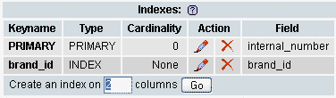

接下来，在索引管理页面上，我们选择哪些列将成为索引的一部分；然后我们为此索引发明一个名称（这里为**model-year**），点击**Go**来创建它。

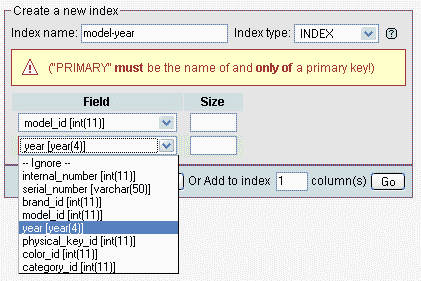

此操作相关的 SQL 命令是

```
ALTER TABLE `vehicle` ADD INDEX `model-year` (`model_id`,`year`)

```

要确定特定查询使用了哪些索引，我们可以在查询前加上 EXPLAIN 关键字。例如，我们在 phpMyAdmin 的查询框中输入以下命令：

```
explain select * from vehicle where brand_id = 1

```

结果告诉我们，`brand_id`列上的索引可能是检索的关键：

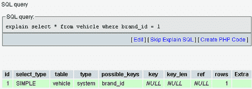

### 帮助查询优化器：分析表

当我们向 MySQL 服务器发送查询时，它会使用查询优化器来找到检索行的最佳方式。我们可以通过向表中加载数据，然后执行`ANALYZE TABLE`语句来帮助查询优化器获得更好的结果。此语句要求 MySQL 存储表的键分布，这意味着它会计算每个索引的键数，并将此信息存储以供后续重用。例如，在`vehicle`表上执行`ANALYZE TABLE`后，MySQL 可能会注意到有 12 个不同的品牌，1000 个不同的车辆和 100 个不同的车型年份。如果我们以后发送使用这些索引之一的查询，此信息将被使用。因此，`ANALYZE TABLE`应定期执行；确切的频率取决于此表的更新次数。

## 访问复制从服务器

MySQL 支持一种模式，即数据在**主服务器**和一台或多台**从服务器**之间进行单向异步复制。由于通常情况下，发送到 MySQL 的大多数请求都是`SELECT`查询，我们可以通过将这些读请求发送到从服务器来提高响应时间。这会产生负载均衡的效果。必须注意将写类型语句，如`INSERT, UPDATE`和`DELETE`发送到主服务器。

在当前的 MySQL 版本（5.0.26）中，我们必须选择适当的应用程序级服务器来实现这种平衡；然而，MySQL 计划提供一个功能，该功能将自动将`SELECT`查询发送到从属服务器。

### 注意

复制是 MySQL 的高级功能，应由经验丰富的 MySQL 管理员设置。

## 速度与数据类型

创建列时，我们必须为其指定数据类型。字符数据类型（`CHAR, VARCHAR`）使用非常普遍。对于`CHAR`，我们指定了列的长度（0 到 255），并且该列占用固定数量的空间。对于`VARCHAR`，每个值仅占用表中所需的空间；指定的长度是最大长度——MySQL 5.0.3 之前为 255，自此版本起为 65532。数值类型——如`INT, FLOAT`和`DECIMAL`都是固定长度的。

总结一下，以下是一些数据类型及其存储方式的信息：

| 数据类型 | 存储方式 |
| --- | --- |
| CHAR | 固定 |
| INT | 固定 |
| FLOAT | 固定 |
| DECIMAL | 固定 |
| VARCHAR | 变长 |

我们应该意识到 MySQL 可能会悄悄决定将一种数据类型转换为另一种。这样做的原因在 MySQL 手册中有解释：[`dev.mysql.com/doc/refman/5.0/en/silent-column-changes.html`](http://dev.mysql.com/doc/refman/5.0/en/silent-column-changes.html)。这就是为什么在表创建后，我们应该重新检查其结构以验证是否发生了静默转换。

看起来我们似乎应该总是为字符字段选择`VARCHAR`，因为使用这种数据类型，较短的值占用较少的空间，但仍有理由想要使用`CHAR`：速度。

在表中，当所有字段都使用非变量数据类型时，`MyISAM`存储引擎使用**固定**表格式。在这种格式下，MySQL 可以预测每行的大小，因此可以轻松找到从一个`first_name`列到下一行的`first_name`列的距离。这意味着对非索引列的查询执行得相对较快。相反，当表中有一个`VARCHAR`列时，这种情况就不再可能，因为`MyISAM`在这种情况下使用**动态**表格式。因此，必须在数据检索速度和使用固定长度列的空间开销之间做出决定。

在 phpMyAdmin 中查看表结构时，**行统计信息**部分会告诉我们格式是固定的还是动态的：

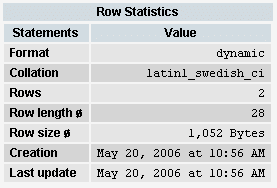

使用固定格式的另一个优点是，当行被删除时，这些行之前占用的空间——表中的空洞——可供未来的插入使用，因此表不会变得物理碎片化。

`BLOB`和`TEXT`数据类型也是可变长度的。`BLOB`通常用于存储汽车或客户照片等二进制数据。MySQL 内部会负责将这些列与表的其余数据分开存储，因此它们对表的影响并不显著。

## 表大小缩减

实用工具`myisampack`可将`MyISAM`表转换为只读表并压缩数据。在某些情况下，表的物理大小可减少 70%。此技术仅在我们有权访问此命令行工具时可用——没有 SQL 查询能发送以实现此结果。

# 列内数据编码

我即将描述的情况发生在我为书目数据开发搜索引擎时，但我将其转用于汽车经销商系统。

当我们需要将数据从原有系统迁移到我们新生的数据结构时，可能会遇到以特殊方式格式化的数据。例如，汽车型号可能的颜色列表可以表示为一系列用分号分隔的颜色代码：

```
1A6;1A7;2B7;2T1A65

```

原有系统的用户习惯于以这种格式输入数据，在我经历的情况中，用户拒绝放弃这种数据录入方式——他们可以直接访问 MySQL 表。然而，从开发者的角度来看，这种格式使得查询生成的任务更为复杂。查找`1A6`颜色需要拆分数据元素，并避免包含`1A6`字符串的`2T1A65`数据元素。

此案例的适当结构意味着完全摒弃基于分号的格式，并仅以表格形式存储纯数据：

| 表：model_color | 列名 | 示例值 |
| --- | --- | --- |
|   | *model | 1 |
|   | color_code | 1A6 |

当分隔符之间存在多个元素（如姓名列表）时，找到与查询一致的数据甚至更为复杂：

```
Murray Dan; Smith Peter; Black Paul

```

在搜索`Murray, Paul`时，必须特别小心以避免匹配此名称列表，因为`Murray`和`Paul`都出现在完整字符串中。这种情况仅加强了摆脱这种格式或至少——如果我们因政治问题必须保留此格式——建立一个中间表的必要性，该表将用于搜索。在这种情况下，每当主表内容发生变化时，特殊表必须同步。

# 案例研究的最终结构

在本节中，我们将审视案例研究的最终数据结构。有许多方式可以呈现此结构。首先，我们将看到所有相互关联的表——几乎所有表都如此——然后，我们将检查相关表组及其列。

以下模式由 phpMyAdmin 的 PDF 页面功能生成。要访问此功能，我们打开一个数据库并访问**操作**子页面。然后，我们点击**编辑 PDF 页面**。

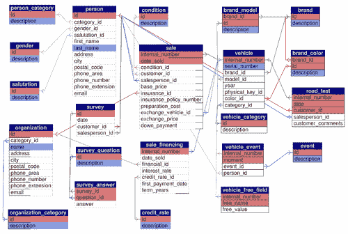

在生成 PDF 架构时，我们还可以要求 phpMyAdmin 生成数据字典。为此，我们需在“显示 PDF 架构”对话框中勾选**数据字典**复选框。以下是描述`person`表的该字典页面：

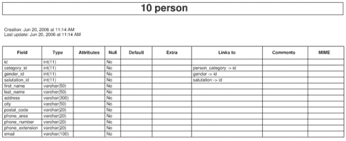

这个结合了数据字典和架构的功能有一个显著特点：我们可以在架构中点击表名以到达字典中该表的描述，反之亦然。

以下`CREATE TABLE`命令直接来自 phpMyAdmin 的**导出**功能。要访问此功能，只需打开一个数据库，选择**导出**菜单，然后选中所有表，点击**SQL**复选框并点击**执行**。

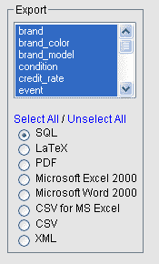

这些命令被分组为相关表的小块，即使最终这些组内的表之间存在关联。你会注意到，phpMyAdmin 在导出文件中以注释的形式添加了与其他表的关系信息。另一个需要注意的是：大多数表的主键是`id`，一个整数。因此，指向`brand`表的`id`列的列被命名为`brand_id`。

## 车辆

```
--
-- Table structure for table `brand`
--
CREATE TABLE `brand` (
id` int(11) NOT NULL,
`description` varchar(40) NOT NULL,
PRIMARY KEY (`id`)
) ENGINE=MyISAM DEFAULT CHARSET=latin1;
-- --------------------------------------------------------
--
-- Table structure for table `brand_color`
--
CREATE TABLE `brand_color` (
`brand_id` int(11) NOT NULL,
`id` int(11) NOT NULL,
`description` varchar(40) NOT NULL,
PRIMARY KEY (`brand_id`,`id`)
) ENGINE=MyISAM DEFAULT CHARSET=latin1;
--
-- RELATIONS FOR TABLE `brand_color`:
-- `brand_id`
-- `brand` -> `id`
--
-- --------------------------------------------------------
--
-- Table structure for table `brand_model`
--
CREATE TABLE `brand_model` (
`brand_id` int(11) NOT NULL,
`id` int(11) NOT NULL,
`description` varchar(40) NOT NULL,
PRIMARY KEY (`brand_id`,`id`)
) ENGINE=MyISAM DEFAULT CHARSET=latin1;
--
-- RELATIONS FOR TABLE `brand_model`:
-- `brand_id`
-- `brand` -> `id`
--
-- --------------------------------------------------------
--
-- Table structure for table `event`
--
CREATE TABLE `event` (
`id` int(11) NOT NULL,
`description` varchar(40) NOT NULL,
PRIMARY KEY (`id`)
) ENGINE=MyISAM DEFAULT CHARSET=latin1;
-- --------------------------------------------------------
--
-- Table structure for table `vehicle`
--
CREATE TABLE `vehicle` (
`internal_number` int(11) NOT NULL,
`serial_number` varchar(50) NOT NULL,
`brand_id` int(11) NOT NULL,
`model_id` int(11) NOT NULL,
`year` year(4) NOT NULL,
`physical_key_id` int(11) NOT NULL,
`color_id` int(11) NOT NULL,
`category_id` int(11) NOT NULL,
PRIMARY KEY (`internal_number`)
) ENGINE=MyISAM DEFAULT CHARSET=latin1;
--
-- RELATIONS FOR TABLE `vehicle`:
-- `brand_id`
-- `brand` -> `id`
-- `category_id`
-- `vehicle_category` -> `id`
-- `color_id`
-- `brand_color` -> `id`
-- `model_id`
-- `brand_model` -> `id`
--
-- --------------------------------------------------------
table structure vehicle table--
-- Table structure for table `vehicle_category`
--
CREATE TABLE `vehicle_category` (
`id` int(11) NOT NULL,
`description` varchar(40) NOT NULL,
PRIMARY KEY (`id`)
) ENGINE=MyISAM DEFAULT CHARSET=latin1;
-- --------------------------------------------------------
--
-- Table structure for table `vehicle_event`
--
CREATE TABLE `vehicle_event` (
`internal_number` int(11) NOT NULL,
`moment` date NOT NULL,
`event_id` int(11) NOT NULL,
`person_id` int(11) NOT NULL,
PRIMARY KEY (`internal_number`,`moment`)
) ENGINE=MyISAM DEFAULT CHARSET=latin1;
--
-- RELATIONS FOR TABLE `vehicle_event`:
-- `event_id`
-- `event` -> `id`
-- `internal_number`
-- `vehicle` -> `internal_number`
-- `person_id`
-- `person` -> `id`
--

```

## 人员

```
--
-- Table structure for table `gender`
--
CREATE TABLE `gender` (
`id` TINYINT(4) NOT NULL,
`description` varchar(40) NOT NULL,
PRIMARY KEY (`id`)
) ENGINE=MyISAM DEFAULT CHARSET=latin1;
-- --------------------------------------------------------
--
-- Table structure for table `person`
--
CREATE TABLE `person` (
`id` int(11) NOT NULL,
`category_id` int(11) NOT NULL,
`gender_id` TINYINT(4) NOT NULL,
`salutation_id` TINYINT(4) NOT NULL,
`first_name` varchar(50) NOT NULL,
`last_name` varchar(50) NOT NULL,
`address` varchar(300) NOT NULL,
`city` varchar(50) NOT NULL,
`postal_code` varchar(20) NOT NULL,
`phone_area` varchar(20) NOT NULL,
`phone_number` varchar(20) NOT NULL,
`phone_extension` varchar(20) NOT NULL,
`email` varchar(100) NOT NULL,
PRIMARY KEY (`id`)
) ENGINE=MyISAM DEFAULT CHARSET=latin1;
--
-- RELATIONS FOR TABLE `person`:
-- `category_id`
-- `person_category` -> `id`
-- `gender_id`
-- `gender` -> `id`
-- `salutation_id`
-- `salutation` -> `id`
--
-- --------------------------------------------------------
--
-- Table structure for table `person_category`
--
CREATE TABLE `person_category` (
`id` int(11) NOT NULL,
`description` varchar(40) NOT NULL,
PRIMARY KEY (`id`)
) ENGINE=MyISAM DEFAULT CHARSET=latin1;
-- --------------------------------------------------------
--
-- Table structure for table `salutation`
--
CREATE TABLE `salutation` (
`id` TINYINT(4) NOT NULL,
`description` varchar(40) NOT NULL,
PRIMARY KEY (`id`)
) ENGINE=MyISAM DEFAULT CHARSET=latin1;
-- --------------------------------------------------------

```

## 销售

```
--
-- Table structure for table `condition`
--
CREATE TABLE `condition` (
`id` int(11) NOT NULL,
`description` char(15) NOT NULL,
PRIMARY KEY (`id`)
) ENGINE=MyISAM DEFAULT CHARSET=latin1;
-- --------------------------------------------------------
--
-- Table structure for table `credit_rate`
--
CREATE TABLE `credit_rate` (
`id` int(11) NOT NULL,
`description` char(30) NOT NULL,
PRIMARY KEY (`id`)
) ENGINE=MyISAM DEFAULT CHARSET=latin1;
-- --------------------------------------------------------
--
-- Table structure for table `sale`
--
CREATE TABLE `sale` (
`internal_number` int(11) NOT NULL,
`date_sold` date NOT NULL,
`condition_id` int(11) NOT NULL,
`customer_id` int(11) NOT NULL,
`salesperson_id` int(11) NOT NULL,
`base_price` decimal(9,2) NOT NULL,
`insurance_id` int(11) NOT NULL,
`insurance_policy_number` varchar(40) NOT NULL,
`preparation_cost` decimal(9,2) NOT NULL,
`exchange_vehicle_id` int(11) NOT NULL,
`exchange_price` decimal(9,2) NOT NULL,
`down_payment` decimal(9,2) NOT NULL,
PRIMARY KEY (`internal_number`,`date_sold`)
) ENGINE=MyISAM DEFAULT CHARSET=latin1;
--
-- RELATIONS FOR TABLE `sale`:
-- `condition_id`
-- `condition` -> `id`
-- `customer_id`
-- `person` -> `id`
-- `exchange_vehicle_id`
-- `vehicle` -> `internal_number`
-- `insurance_id`
-- `organization` -> `id`
-- `internal_number`
-- `vehicle` -> `internal_number`
-- `salesperson_id`
-- `person` -> `id`
--
-- --------------------------------------------------------
--
-- Table structure for table `sale_financing`
--
CREATE TABLE `sale_financing` (
`internal_number` int(11) NOT NULL auto_increment,
`date_sold` date NOT NULL,
`financial_id` int(11) NOT NULL,
`interest_rate` decimal(9,4) NOT NULL,
`credit_rate_id` int(11) NOT NULL,
`first_payment_date` date NOT NULL,
`term_years` int(11) NOT NULL,
PRIMARY KEY (`internal_number`)
) ENGINE=MyISAM DEFAULT CHARSET=latin1 AUTO_INCREMENT=1 ;
--
-- RELATIONS FOR TABLE `sale_financing`:
-- `credit_rate_id`
-- `credit_rate` -> `id`
-- `financial_id`
-- `organization` -> `id`
-- `internal_number`
-- `vehicle` -> `internal_number`
--
-- --------------------------------------------------------
--
-- Table structure for table `tax_rate`
--
CREATE TABLE `tax_rate` (
`start_date` date NOT NULL,
`end_date` date NOT NULL,
`rate` decimal(9,4) NOT NULL,
PRIMARY KEY (`start_date`,`end_date`)
) ENGINE=MyISAM DEFAULT CHARSET=latin1;
-- --------------------------------------------------------

```

## 其他表

```
--
-- Table structure for table `parameters`
--
CREATE TABLE `parameters` (
`dealer_number` varchar(30) NOT NULL
) ENGINE=MyISAM DEFAULT CHARSET=latin1;
-- --------------------------------------------------------
--
-- Table structure for table `organization`
--
CREATE TABLE `organization` (
`id` int(11) NOT NULL,
`category_id` int(11) NOT NULL,
`name` varchar(50) NOT NULL,
`address` varchar(300) NOT NULL,
`city` varchar(50) NOT NULL,
`postal_code` varchar(20) NOT NULL,
`phone_area` varchar(20) NOT NULL,
`phone_number` varchar(20) NOT NULL,
`phone_extension` varchar(20) NOT NULL,
`email` varchar(100) NOT NULL,
PRIMARY KEY (`id`)
) ENGINE=MyISAM DEFAULT CHARSET=latin1;
--
-- RELATIONS FOR TABLE `organization`:
-- `category_id`
-- `organization_category` -> `id`
--
-- --------------------------------------------------------
table structure organization table--
-- Table structure for table `organization_category`
--
CREATE TABLE `organization_category` (
`id` int(11) NOT NULL,
`description` varchar(40) NOT NULL,
PRIMARY KEY (`id`)
) ENGINE=MyISAM DEFAULT CHARSET=latin1;
-- --------------------------------------------------------
--
-- Table structure for table `road_test`
--
CREATE TABLE `road_test` (
`internal_number` int(11) NOT NULL,
`date` date NOT NULL,
`customer_id` int(11) NOT NULL,
`salesperson_id` int(11) NOT NULL,
`customer_comments` varchar(255) NOT NULL,
PRIMARY KEY (`internal_number`,`date`,`customer_id`)
) ENGINE=MyISAM DEFAULT CHARSET=latin1;
--
-- RELATIONS FOR TABLE `road_test`:
-- `customer_id`
-- `person` -> `id`
-- `internal_number`
-- `vehicle` -> `internal_number`
-- `salesperson_id`
-- `person` -> `id`
--
-- --------------------------------------------------------
--
-- Table structure for table `survey`
--
CREATE TABLE `survey` (
`id` int(11) NOT NULL,
`date` date NOT NULL,
`customer_id` int(11) NOT NULL,
`salesperson_id` int(11) NOT NULL,
PRIMARY KEY (`id`)
) ENGINE=MyISAM DEFAULT CHARSET=latin1;
--
-- RELATIONS FOR TABLE `survey`:
-- `customer_id`
-- `person` -> `id`
-- `salesperson_id`
-- `person` -> `id`
--
-- --------------------------------------------------------
table structure survey table--
-- Table structure for table `survey_answer`
--
CREATE TABLE `survey_answer` (
`survey_id` int(11) NOT NULL,
`question_id` int(11) NOT NULL,
`answer` varchar(30) NOT NULL,
PRIMARY KEY (`survey_id`,`question_id`)
) ENGINE=MyISAM DEFAULT CHARSET=latin1;
--
-- RELATIONS FOR TABLE `survey_answer`:
-- `question_id`
-- `survey_question` -> `id`
-- `survey_id`
-- `survey` -> `id`
--
-- --------------------------------------------------------
--
-- Table structure for table `survey_question`
--
CREATE TABLE `survey_question` (
`id` int(11) NOT NULL,
`description` varchar(40) NOT NULL,
PRIMARY KEY (`id`)
) ENGINE=MyISAM DEFAULT CHARSET=latin1;
-- --------------------------------------------------------

```

# 总结

我们通过评估每个数据元素的责任人并将此信息存储在列注释中来改进数据结构的实现。然后，我们看到了如何使用权限和视图来提高安全性，如何为每个表选择最佳存储引擎，以及如何利用外键约束。考虑了性能问题，然后我们被展示了汽车经销商案例研究的最终模型。
