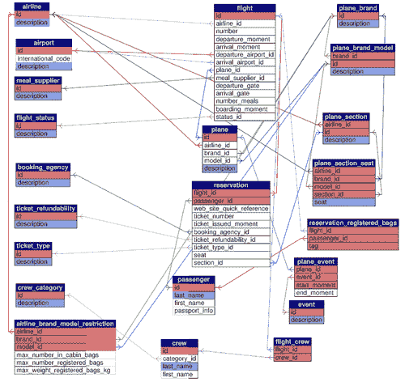
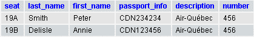
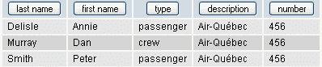

# 第六章：补充案例研究

现在，是时候将我们新学的原则应用到一个完全不同的主题上了。我们从汽车升级到飞机，涉及一个简单的航空公司系统。

本章的案例研究并不试图涵盖真实航空公司的全部数据集合——它仅是一个样本。尽管如此，我们将看到之前学到的原则可以应用于构建和完善一个正确且连贯的数据结构。

通常，每家航空公司都有自己的信息系统。我们在此假设已获得授权，构建一个涵盖多家航空公司的信息系统。

# 文档收集阶段的结果

在审查了航空公司当前的网站、预订代理的网站、一些电子机票和登机牌后，我们收集了大量信息。我们将首先用句子表达这些信息，这些句子从较高层面介绍了系统和数据交换。每个句子后面都列出了我们可以从中推断出的数据元素。一个元素可能出现在多个句子中。有关每个数据元素的更多详细信息，请参阅*表格和示例值*部分。还有一些注释将帮助我们在命名和分组阶段。

魁北克航空的 456 号航班于 2007 年 10 月 2 日 22:45 从蒙特利尔-特鲁多机场起飞，前往巴黎的戴高乐机场。

以下是可从上述句子中获取的数据元素：

+   flight_number

+   airline_name

+   airport_name

+   flight_departure_moment

### 注意

我们需要指明机场是用于出发还是到达。

蒙特利尔-特鲁多机场的代码是 YUL，戴高乐机场的代码是 CDG。

上述句子中获取的数据元素是：

+   airport_code

### 注意

我们是否应将 airport_code 作为主键？可能不行，考虑到空间因素。

该航班计划于次日 11:30（当地时间）降落。

获取的数据元素是：

+   flight_arrival_moment

### 注意

我们是否需要将日期和时间拆分为两个字段？可能不必，以便利用日期和时间计算功能（考虑日期的情况下，飞行需要多少小时和分钟）。

一架来自 Fontax 的 APM-300 飞机服务于本次航班。

上述句子中获取的数据元素包括：

+   plane_model

+   plane_brand

### 注意

我们是否需要将飞机型号与航班关联，同时也要关联到具体的哪一架飞机。（可能存在多架 APM-300。）

本次航班的飞行员是 Dan Murray，乘务员是 Melanie Waters。其他机组人员待确认。

上述句子中获取的数据元素包括：

+   pilot_first_name

+   pilot_last_name

+   flight_attendant_first_name

+   flight_attendant_last_name

### 注意

我们应该使用机组类别这一概念进行泛化。

Peter Smith 通过预订代理 Fantastic Tour, Inc.购买了本次航班的机票，票号为 014 88417654。这是一张单程票。

上述句子中获取的数据元素包括：

+   passenger_first_name

+   乘客姓氏

+   预订代理名称

+   机票号

+   机票类型

### 注意

我们还需要为乘客设定一个主键，如果不用其代码，可能还需要为预订代理设定一个主键。机票本身是否应在表中表示，还是机票号作为更通用的预订信息的一部分？

对于此航班，史密斯先生坐在 19A 座位，位于飞机的经济舱。

从上述句子中获得的数据元素有：

+   乘客姓氏

+   座位 ID

+   飞机舱位

### 注意

飞机上可用的舱位不仅取决于飞机型号，还取决于航空公司。

此机票不可退款。

从上述句子中获得的数据元素有：

+   机票退款性

航班 456 可在起飞前 35 分钟于 74 号登机口登机。

从上述句子中获得的数据元素有：

+   航班号

+   登机口 ID

+   登机时间

经济舱乘客有权携带一件舱内行李和两件注册行李——总重不超过 50 公斤。史密斯先生有一件注册行李，标签号为 AQ636-84763。

从上述句子中获得的数据元素有：

+   飞机舱位

+   最大舱内行李数

+   最大注册行李数

+   最大注册行李重量（公斤）

+   标签 ID

### 注意

我们发现“class”是“section”的同义词。

机场的信息屏幕显示每趟航班的状态：准时、登机、延误或取消。

从上述句子中获得的数据元素有：

+   航班状态

### 注意

需要编码（ID 和描述）。

此航班提供两餐。魁北克航空与蒙特利尔厨师服务公司合作准备和配送食物。

从上述句子中获得的数据元素有：

+   餐食数量

+   航空公司名称

+   餐食供应商

魁北克航空拥有四架 Fontax APM-300 飞机，但 302 号飞机（代号 Charlie）计划于 2007 年 10 月进行维修。

从上述句子中获得的数据元素有：

+   航空公司名称

+   飞机品牌

+   飞机型号

+   飞机 ID

+   描述

+   飞机事件

+   飞机事件开始时间

+   飞机事件结束时间

### 注意

每架飞机都有一个亲切的昵称，此元素将被称为“描述”。关于维修，我们用事件的概念来概括，包括开始和结束的时刻。

史密斯乘客可以使用快速参考代码 A6BCUD 及其姓氏在航空公司网站上访问其航班信息。

从上述句子中获得的数据元素有：

+   乘客姓氏

+   网站快速参考

# 数据元素初步列表

我们在此列出从文档收集阶段推断出的数据元素。在许多情况下，它们并非已适合最终模型的格式，因为它们带有表名前缀。例如，标识为`pilot_last_name`的数据元素将成为`pilot`表中的列`last_name`。每个数据元素的示例值和更详细信息将在下一部分展示。

| 数据元素 |
| --- |
| 航班起飞时间 | 座位 ID |
| 航班到达时间 | 飞机舱段 |
| 出发机场代码 | 机票退款政策 |
| 到达机场代码 | 登机口编号 |
| 航空公司代码 | 登机时间 |
| 航空公司名称 | 客舱内最大行李数 |
| 机场名称 | 最大注册行李数 |
| 飞机品牌 | 最大注册行李重量（公斤） |
| 飞机型号 | 标签编号 |
| 飞行员姓氏 | 机票发行日期 |
| 飞行员名字 | 餐食数量 |
| 空乘姓氏 | 网站快速参考 |
| 空乘名字 | 餐食供应商 |
| 乘客姓氏 | 飞机编号 |
| 乘客名字 | 飞机活动 |
| 乘客编号 | 飞机活动开始时间 |
| 预订代理名称 | 飞机活动结束时间 |
| 机票号码 | 航班状态 |

# 表格与示例值

为了准备表格列表，我们从文档收集阶段构建的句子中可以观察到的物理对象或人物开始。然后我们查看所有元素并构建新表格以容纳它们。

在以下表格描述中，表格布局后跟有适当的设计评论。

## 代码表

通常首先设计以下表格，因为它们更容易建模，并且对于建立更复杂表格的关系是必需的。

| 表格：机场 | 列名 | 示例值 |
| --- | --- | --- |
|   | *id | 1 |
|   | 国际代码 | YUL |
|   | 描述 | 蒙特利尔-特鲁多 |

机场表可能包含其他列，如地址、电话和网站。

| 表格：航空公司 | 列名 | 示例值 |
| --- | --- | --- |
|   | *id | 1 |
|   | 描述 | 魁北克航空 |
| 表格：飞机品牌 | 列名 | 示例值 |
| --- | --- | --- |
|   | *id | 1 |
|   | 描述 | Fontax |

我们避免将此表命名为`brand`，因为这是一个过于通用的名称。

| 表格：餐食供应商 | 列名 | 示例值 |
| --- | --- | --- |
|   | *id | 9 |
|   | 描述 | 蒙特利尔主厨服务 |

再次，此表可能包含有关代理机构的更多详细信息，如电话和地址。我们还可以通过添加一个标识公司类型的代码将此表与`meal_supplier`表合并，但在当前模型中并未实现。

| 表格：机票类型 | 列名 | 示例值 |
| --- | --- | --- |
|   | *id | 1 |
|   | 描述 | 单程 |
| 表格：机组类别 | 列名 | 示例值 |
| --- | --- | --- |
|   | *id | 1 |
|   | 描述 | 飞行员 |

为了避免列如`pilot_last_name, copilot_first_name`，我们创建了一个`crew_category`表。另请参阅本章稍后的相关`flight_crew`表。

| 表格：机票退款政策 | 列名 | 示例值 |
| --- | --- | --- |
|   | *id | 1 |
|   | 描述 | 不可退款 |
| 表格：航班状态 | 列名 | 示例值 |
| --- | --- | --- |
|   | *id | 1 |
|   | 描述 | 登机 |

如果我们需要在模型中包含其他类型的事件，这个`事件`表将不得不更名为更精确的名称，如`飞机事件`，并且我们当前用于关联事件与飞机的`飞机事件`表也需要一个新的名称。

## 主题表

这些表比代码表更全面。每个表都涉及一个特定的主题，需要比简单的代码表更多的列。

| 表：飞机 | 列名 | 示例值 |
| --- | --- | --- |
|   | *ID | 302 |
|   | 航空公司 ID | 1 |
|   | 品牌 ID | 1 |
|   | 机型 ID | 2 |
|   | 描述 | 查理 |

此表标识了哪架飞机属于哪家航空公司，描述字段是航空公司内部用来描述该特定飞机的方式。其他字段，如飞机序列号，也可以添加到这里。

| 表：机组 | 列名 | 示例值 |
| --- | --- | --- |
|   | *ID | 9 |
|   | 类别 ID | 1 |
|   | 姓氏 | 默里 |
|   | 名字 | 丹 |

乘客和机组人员不能物理上合并到一个表中，即使他们属于同一航班，因为用来描述乘客的列集合与描述机组人员的列集合不同。我们将在*示例查询*部分介绍如何生成飞机上所有人员的合并列表。

| 表：航班 | 列名 | 示例值 |
| --- | --- | --- |
|   | *ID | 34 |
|   | 航空公司 ID | 1 |
|   | 航班号 | 456 |
|   | 出发时间 | 2007-10-02 22:45 |
|   | 到达时间 | 2007-10-03 11:30 |
|   | 出发机场 ID | 1 |
|   | 到达机场 ID | 2 |
|   | 飞机 ID | 302 |
|   | 餐食供应商 ID | 9 |
|   | 餐食数量 | 2 |
|   | 出发登机口 | 74 |
|   | 到达登机口 | B65 |
|   | 登机时间 | 2007-10-02 22:10 |
|   | 状态 ID | 1 |

飞行概念是此系统的核心，因此我们将有一个`航班`表。这意味着我们必须确定一个主键，乍一看，航班号似乎是个好选择——但实际上并非如此，原因是航班号并未涂在飞机上；它仅是一种逻辑方式，用来表达飞机在两个机场之间的移动，以及与此移动相关的人员或公司。我们注意到，航班号保持简短——三或四位数字，以便在所有印刷品和机场信息屏幕上更好地参考；因此，航班号只有在伴随补充信息（如航空公司代码（AQ）或公司名称）和日期时才有意义。

考虑到与该航班表关联的其他表，我们在这里有两种选择来确定主键：

+   创建一个**代理键**（一个人工主键，其值不由其他表的数据派生）

+   使用列的组合——航空公司 ID、航班号、出发时间

创建一个代理键`id`会更好。这个`id`将仅通过一个列传播到相关表中，这有助于加快检索时间，因为只需在表之间比较一个字段。使用航班的`id`也将简化查询的编写。当然，我们在`flight`表中包含航班`number`——公众所知的信息，但不是作为主键。

| 表：reservation | 列名 | 示例值 |
| --- | --- | --- |
|   | *flight_id | 34 |
|   | *passenger_id | 1302 |
|   | web_site_quick_reference | KARTYU |
|   | ticket_number | 014 88417654 |
|   | ticket_issued_moment | 2007-01-01 12:00 |
|   | booking_agency_id | 1 |
|   | ticket_refundability_id | 1 |
|   | ticket_type_id | 1 |
|   | seat | 19A |
|   | section_id | 2 |

在航班表中包含诸如`passenger1, passenger2`或`seat_1a, seat_1b`之类的列将是一个错误。这就是为什么我们使用`reservation`表来保存与特定航班相关的乘客信息。此表也可以命名为`flight_passenger`。

通常我们不需要在`reservation`表中包含`section_id`，因为我们可以通过`seat_id`引用它，但`seat_id`可能在预订时未知，因此座位分配可以延迟到登机牌发放时。

## 复合键表

这些表具有多个键，因为某些键段指向代码或主题表。

| 表：plane_brand_model | 列名 | 示例值 |
| --- | --- | --- |
|   | *brand_id | 1 |
|   | *id | 2 |
|   | description | APM-300 |

在这里，`brand_id`和唯一的`id`构成了飞机型号的主键。我们想知道此型号指的是哪个品牌，并且仍然使用整数作为键，而不是使用 APM-300 作为键值。

| 表：plane_section | 列名 | 示例值 |
| --- | --- | --- |
|   | *airline_id | 1 |
|   | *id | 1 |
|   | description | 经济舱 |

每家航空公司都可能以自己的方式描述飞机的舱段——有些使用*hospitality*而非*经济舱*。

| 表：airline_brand_model_restriction | 列名 | 示例值 |
| --- | --- | --- |
|   | *airline_id | 1 |
|   | *brand_id | 1 |
|   | *model_id | 2 |
|   | max_number_in_cabin_bags | 1 |
|   | max_number_registered_bags | 2 |
|   | max_weight_registered_bags_kg | 50 |
| 表：plane_section_seat | 列名 | 示例值 |
| --- | --- | --- |
|   | *airline_id | 1 |
|   | *brand_id | 1 |
|   | *model_id | 2 |
|   | *section_id | 1 |
|   | *seat | 19A |

`plane_section_seat`表描述了特定飞机舱段中的座位位置。这是针对每家航空公司、品牌、型号和舱段的，因为不同的航空公司可能拥有相同类型的飞机，但使用不同的座位编号，或者商务舱比其他航空公司更大。此外，在某些情况下，可能存在座位 1A 和 1C，但 1B 可能不存在。因此，我们需要此表来保存所有现有座位的完整列表。

| 表：flight_crew | 列名 | 示例值 |
| --- | --- | --- |
|   | *flight_id | 34 |
|   | *crew_id | 9 |

通过这些示例值，我们可以推断出 Dan Murray 是 Air-Quebec 的 456 航班的飞行员。此表中的另一个可能列是该机组人员对该航班的状态：准时到达、取消或替换。

| 表：plane_event | 列名 | 示例值 |
| --- | --- | --- |
|   | *plane_id | 302 |
|   | *event_id | 1 |
|   | *start_moment | 2008-10-01 |
|   | end_moment | 2008-10-31 |
| 表：reservation_registered_bags | 列名 | 示例值 |
| --- | --- | --- |
|   | *flight_id | 34 |
|   | *passenger_id | 1302 |
|   | *tag | AQ636-84763 |

此处还可以添加用于标签追踪的其他列。

# 航空公司系统数据模式

再次使用 phpMyAdmin 的 PDF 模式功能来显示表之间的关系和涉及的键。



# 示例查询

作为表格列表和数据库模式的补充，让我们看看我们的表格是如何运作的！我们将向表格中输入示例值，然后构建一些 SQL 查询以提取所需数据。

## 插入示例值

我们使用了上述表格列表中描述的示例值。请访问本书的支持网站([`www.packtpub.com/support`](http://www.packtpub.com/support))下载包含表格定义和示例值的代码。

## 登机牌

乘客可以在家中通过网站的快速参考为其预订打印登机牌，在我们的例子中，该参考是`KARTYU`。以下是检索登机牌信息的生成查询：

```
select passenger.last_name,
passenger.first_name,
flight.number,
airline.description,
flight.departure_moment,
flight.departure_gate,
flight.boarding_moment,
reservation.seat,
plane_section.description
from reservation
inner join passenger on reservation.passenger_id = passenger.id
inner join flight on reservation.flight_id = flight.id
inner join airline on flight.airline_id = airline.id
inner join plane_section on (airline.id = plane_section.airline_id
and reservation.section_id = plane_section.id)
where reservation.web_site_quick_reference = 'KARTYU'

```

执行此查询会检索到以下结果：


## 乘客名单

在这里，航空公司需要一份特定航班的乘客名单；我们使用`flight_id`，即`flight`表的主键，而不是航班号，因为航班号并不唯一。

```
select
reservation.seat,
passenger.last_name,
passenger.first_name,
passenger.passport_info,
airline.description,
flight.number
from reservation
inner join passenger on reservation.passenger_id = passenger.id
inner join flight on reservation.flight_id = flight.id
inner join airline on flight.airline_id = airline.id
where reservation.flight_id = 34
order by reservation.seat

```

目前，这个航班不是很受欢迎，看起来彼得和安妮将能够一起聊天：



## 航班上的所有人员

在极不可能发生的飞机失事情况下，我们可能需要快速提取航班上所有人员的名单。以下查询正是为此目的：

```
select
passenger.last_name as 'last name',
passenger.first_name as 'first name',
'passenger' as 'type',
airline.description,
flight.number
from reservation
inner join passenger on reservation.passenger_id = passenger.id
inner join flight on reservation.flight_id = flight.id
inner join airline on flight.airline_id = airline.id
where reservation.flight_id = 34
union
select
crew.last_name as 'last name',
crew.first_name as 'first name',
'crew' as 'type',
airline.description,
flight.number
from flight_crew
inner join crew on flight_crew.crew_id = crew.id
inner join flight on flight_crew.flight_id = flight.id
inner join airline on flight.airline_id = airline.id
where flight_crew.flight_id = 34
order by 'last name', 'first name'

```

结果按姓氏和名字排序；注意“类型”列，它指示此人是乘客还是机组人员。



# 总结

通过对航空公司系统的一些文档进行研究，我们列出了可能的数据元素，这些元素被分组为列并归入表中。我们仔细为每个表选择了主键或键，并建立了这些表之间的关系，确保所有潜在的数据元素至少包含在一个表中。
