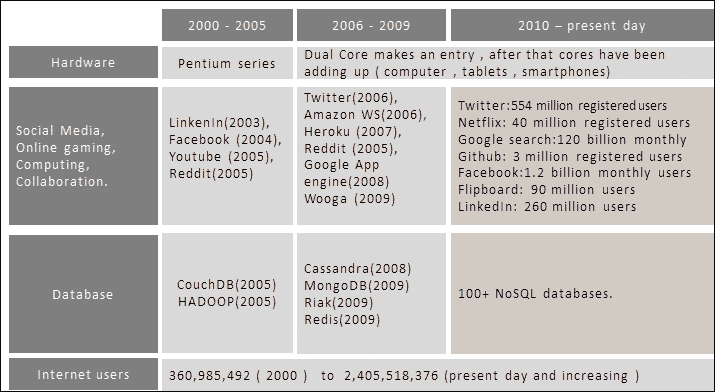
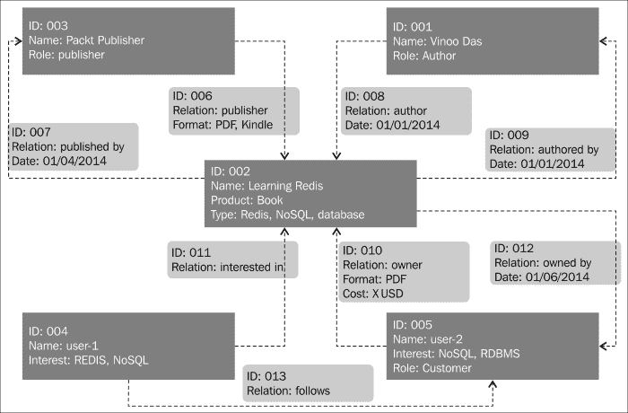
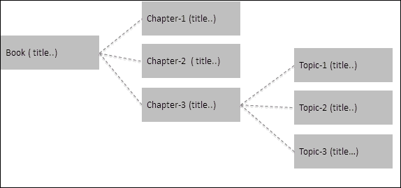
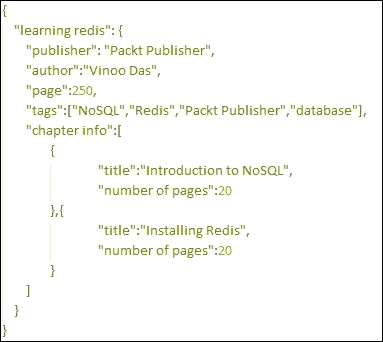
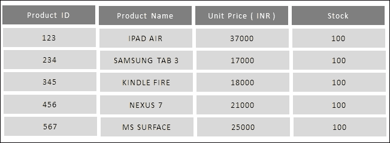
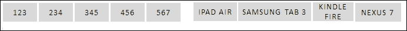
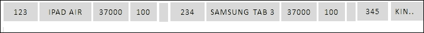
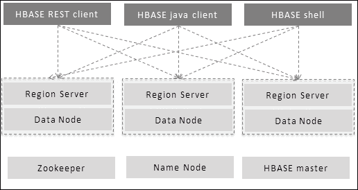
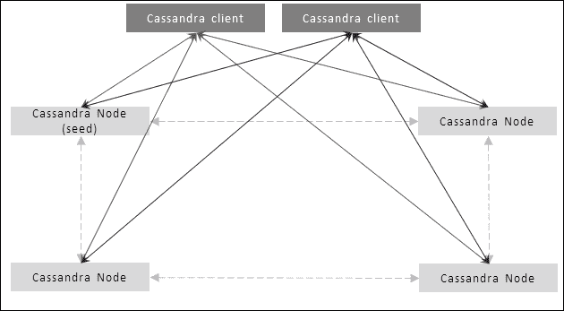
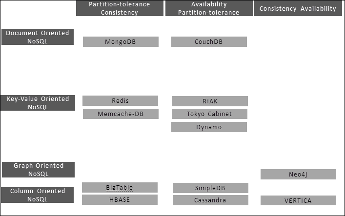

# 第一章：NoSQL 简介

在本章中，您将了解新兴的 NoSQL 领域，并介绍 NoSQL 领域的各种分类。我们还将了解**Redis**在 NoSQL 领域的位置。我们将涵盖以下主题：

+   企业中的数据

+   NoSQL

+   NoSQL 的用例

# 互联网化的世界

我们生活在一个有趣的时代；在过去的十年里，发生了许多改变，改变了我们体验互联网世界及其周围生态系统的方式。在本章中，我们将重点讨论一些促成进步的原因，并讨论数据存储领域的发展。

下图是对网络空间中发生的演变过程的粗略草图，其数据来自互联网，并大致展示了互联网服务的增长情况：

演变：社交媒体、处理器和核心、数据库（NoSQL）

前面的图表表明，硬件行业在第一个十年的中期发生了一场范式转变。新处理器不再以增加时钟速度为目标，而是新一代处理器采用了多核技术，随后发布的处理器数量也在增加。过去，大型机器配备大量内存和强大的处理器可以解决任何问题，或者换句话说，企业依赖垂直扩展来解决性能问题的日子一去不复返。这在某种程度上预示着并行计算是未来，并且将部署在基于商品的机器上。

随着硬件行业预示着并行计算的到来，新一代解决方案必须是分布式和并行的。这意味着它们需要以并行方式执行逻辑，并将数据存储在分布式数据存储中；换句话说，水平扩展是未来的发展方向。此外，随着 Web 2.0 的出现，社交媒体、在线游戏、在线购物、协作计算、云计算等也开始出现。互联网正在成为一个无处不在的平台。

互联网的普及和使用互联网的人数每天都在增加，使用互联网的时间也在增加。需要注意的另一个重要方面是，来自不同地理位置的用户在这个互联网化的世界中聚集在一起。这有很多原因；首先，网站变得更加智能，以一种更有效地吸引终端用户的方式进行交互。另一个使互联网采用速度更快、更容易的因素是创新的手持设备，如智能手机、平板电脑等。如今，这些手持设备具有的计算能力可以与计算机相媲美。在这个动态变化的世界中，基于互联网的软件解决方案和服务正在拓展社交媒体的视野，将人们聚集在一个共同的平台上。这创造了一个新的商业领域，如社交企业媒体，其中社交媒体与企业融合。这肯定会对传统企业解决方案产生影响。

互联网的影响使得企业解决方案经历了一次变革性的转变。企业架构的转变从通常期望的企业解决方案的微妙需求，转向了采纳社交媒体解决方案的新需求。如今，企业解决方案正在与社交媒体网站整合，以了解他们的客户在谈论什么；他们自己也开始创建平台和论坛，让客户可以来贡献他们对产品和服务的印象。所有这些数据交换都是实时进行的，需要一个高并发和可扩展的生态系统。总之，企业解决方案希望采纳社交媒体解决方案的特性，这直接和成比例地影响了他们架构的非功能性需求。故障管理、实时大数据处理、最终一致性、大量读写、响应性、水平扩展性、可管理性、可维护性、灵活性等特性，以及它们对企业架构的影响，都受到了新的关注。社交媒体架构中使用的技术、范例、框架和模式正在被研究和重新应用到企业架构中。

在任何解决方案（社交媒体或企业）中，关键层之一是数据层。数据的排列和管理方式，以及数据存储的选择构成了数据层。从设计师的角度来看，任何数据存储中的数据处理都受到一致性、可用性和分区容忍性等视角的影响，也就是著名的 Eric Brewer 的 CAP 定理。虽然同时拥有这三个视角是可取的，但实际上，任何数据层都可能同时具有两种以上的视角。这意味着解决方案中的数据可能具有多种视角的组合，比如可用性-分区容忍性（这种组合必须放弃数据处理中的一致性），可用性-一致性（这种组合必须放弃分区容忍性，这将影响数据层处理的数据量），以及一致性-分区容忍性（这种组合必须放弃可用性）。

CAP 定理直接影响系统的行为、读写速度、并发性、可维护性、集群模式、容错性、数据负载等。

设计数据模型时最常见的方法是以关系型和规范化的方式排列数据。当数据处于事务模式、需要一致性并且是结构化的时候，这种方法效果很好，也就是说，它有一个固定的模式。但当数据是半结构化的、具有树状结构或者是无模式的时候，这种规范化数据的方法就显得过度设计了，这种情况下一致性可以放松。将半结构化数据适应到结构化数据模型中的结果就是表的爆炸和一个复杂的数据模型来存储简单的数据。

由于缺乏替代方案，解决方案过度依赖关系型数据库管理系统（RDBMS）来解决数据处理方面的问题。这种方法的问题在于 RDBMS 最初是为了解决数据处理的一致性和可用性问题而设计的，但后来也开始存储具有分区容忍性问题的数据。最终的结果是一个臃肿的 RDBMS 和一个非常复杂的数据模型。这开始对解决方案的非功能性需求产生负面影响，包括故障管理、性能、可扩展性、可管理性、可维护性和灵活性等方面。

另一个关注领域是**数据解释**，在设计数据层时非常重要。在一个解决方案中，同一数据被不同的相关团队以不同的方式查看和解释。为了更好地理解，假设我们有一个销售产品的电子商务网站。在设计这个数据层时，有三个基本的功能领域涉及其中，它们是库存管理、账户管理和客户管理。从核心业务的角度来看，所有领域在其数据管理中都需要**原子性、一致性、隔离性、持久性**（**ACID**）属性，从 CAP 定理的角度来看，它们需要一致性和可用性。然而，如果网站需要实时了解其客户，分析团队需要分析来自库存管理、账户管理和客户管理领域的数据。除了实时收集的其他数据。分析团队查看相同数据的方式与其他团队的方式完全不同；对于他们来说，一致性不是一个问题，因为他们更感兴趣的是整体统计数据，一些不一致的数据对整体报告没有影响。如果来自这些领域的所有分析所需数据都保存在与核心业务相同的数据模型中，分析将会遇到困难，因为现在它必须使用这些高度规范化和优化的结构化数据进行业务操作。分析团队还希望将其数据去规范化以加快分析速度。

现在，在 RDBMS 系统上对这些规范化数据进行实时分析将需要大量的计算资源，这将影响核心业务在营业时间的性能。因此，如果为这些领域创建单独的数据模型，一个用于业务，一个用于分析，每个都分开维护，对整体业务更有利。我们将在后续主题中看到为什么 RDBMS 不适合分析和其他用例，以及 NoSQL 如何解决数据爆炸问题。

# NoSQL 入门

**非仅 SQL**或**NoSQL**，正如它被普遍称呼的那样，是由 Carlo Strozzi 在 1998 年创造的，并在 2009 年由 Eric Evans 重新引入。这是数据处理中一个令人兴奋的领域，以某种方式填补了数据处理层中存在的许多空白。在 NoSQL 作为存储数据的备选选择出现之前，面向 SQL 的数据库（RDBMS）是开发人员定位或改装其数据的唯一选择。换句话说，RDBMS 是一把钉所有数据问题的锤子。当 NoSQL 及其不同类别开始出现时，那些不适合 RDBMS 的数据模型和数据大小开始发现 NoSQL 是一个完美的数据存储。还有一个关注点是从一致性的角度转变；从 ACID 转变为 BASE 属性。

ACID 属性代表 CAP 定理的一致性和可用性。这些属性由 RDBMS 展示，并代表以下内容：

+   **原子性**：在事务中，所有操作将完成或全部不会完成（回滚）

+   **一致性**：数据库在事务开始和结束时将处于一致状态，并且不能在中间状态离开

+   **隔离**：并发事务之间不会有干扰

+   **持久性**：一旦事务提交，即使服务器重新启动或失败，它也将保持不变

NoSQL 表现出**BASE**属性；它们代表了 CAP 定理的可用性和分区容忍性。它们基本上放弃了 RDBMS 所显示的强一致性。BASE 代表以下特性：

+   **基本可用**：这保证了对请求的响应，即使数据处于陈旧状态。

+   **软状态**：数据的状态始终处于接受更改的状态，即使没有请求更改其状态。这意味着假设有两个节点持有相同的数据状态（数据的复制），如果有一个请求在一个节点中更改状态，另一个节点中的状态在请求的生命周期内不会更改。另一个节点中的数据将由数据存储触发的异步过程更改其状态，从而使状态变得软化。

+   **最终一致性**：由于节点的分布性，系统最终将变得一致。

### 注意

数据的写入和读取应该更快更容易。

在软件开发领域发生了另一个有趣的发展。垂直可扩展性已经达到了极限，必须设计出具有水平可扩展性的解决方案，因此数据层也必须是分布式和分区容错的。除了社交媒体解决方案外，在线游戏和基于游戏理论的网站（进行目标营销，即根据用户的购买历史奖励用户。这类网站需要实时分析）开始受到关注。社交媒体希望在最短时间内同步来自各地的大量数据，游戏世界对高性能感兴趣。电子商务网站对实时了解他们的客户和产品以及对客户进行概括以在客户意识到需求之前了解他们的需求感兴趣。根据不同数据模型出现的 NoSQL 中的类别如下：

+   面向图形的 NoSQL

+   面向文档的 NoSQL

+   面向键值的 NoSQL

+   面向列的 NoSQL

## 面向图形的 NoSQL

图形数据库是一种特殊类型的 NoSQL 数据库。图形数据库存储的数据模型是图形结构，与其他数据存储有些不同。图形结构由节点、边和属性组成。理解图形数据库的方法是将它们视为具有双向关系的思维导图。这意味着如果 A 与 B 相关，B 与 C 相关，那么 C 与 A 相关。图形数据库倾向于解决在运行时形成的非结构化实体之间形成的关系所引发的问题，这些关系可以是双向的。相比之下，关系型数据库也有一种称为**表连接**的关系概念，但这些关系是在结构化数据上的，不能是双向的。

此外，这些表连接会在数据集随着时间的推移而增长时，对具有外键的数据模型增加复杂性，并对基于表连接的查询产生性能惩罚。一些最有前途的图形数据存储包括 Neo4i、FlockDB、OrientDB 等。

为了更好地理解这一点，让我们来看一个示例用例，并看看如何使用面向图形的 NoSQL 解决复杂的基于图形的业务用例变得多么容易。以下图是一个示例用例，一个电子商务网站可能有兴趣解决。用例是捕获访问者的购买历史和网站微博组件中的人际关系。

图形数据库的示例模块

业务实体，如出版商、作者、客户、产品等，在图中表示为节点。例如，由作者、出版商发布的关系等在图中由边表示。有趣的是，来自博客网站的*用户-1*等非业务节点可以与其关系*关注*一起在图中表示。通过结合业务和非业务实体，网站可以为产品找到目标客户。在图中，节点和边都有在运行分析时使用的属性。

基于关系存储在系统中的图形数据库可以轻松回答以下一组问题：

+   谁是*Learning Redis*的作者？

答案：Vinoo Das

+   Packt Publishing 和*Learning Redis*有什么关系？

答案：发布者

+   谁有自己的 NoSQL 书由 Packt Publishing 出版？

答案：user-2

+   谁正在关注购买了*Learning Redis*并对 NoSQL 感兴趣的客户？

答案：user-1

+   列出所有价格低于 X 美元且可以被 user-2 的关注者购买的 NoSQL 书籍。

答案：*Learning Redis*

## 面向文档的 NoSQL

面向文档的数据存储设计用于存储具有存储文档哲学的数据。简单地说，这里的数据以书的形式排列。一本书可以分为任意数量的章节，每个章节可以分为任意数量的主题，每个主题进一步分为子主题等等。

一本书的组成

如果数据具有类似的结构，即层次化且没有固定深度或模式，则面向文档的数据存储是存储此类数据的完美选择。MongoDB 和 CouchDB（Couchbase）是目前备受关注的两种知名的面向文档的数据存储。就像一本书有索引以进行更快的搜索一样，这些数据存储也有存储在内存中的键的索引以进行更快的搜索。

面向文档的数据存储以 XML、JSON 和其他格式存储数据。它们可以保存标量值、映射、列表和元组作为值。与关系型数据库管理系统（RDBMS）不同，后者将数据视为以表格形式存储的数据行，这里存储的数据是以分层树状结构存储的，其中存储在这些数据存储中的每个值始终与一个键相关联。另一个独特的特点是面向文档的数据存储是无模式的。以下截图显示了一个示例，展示了数据存储在面向文档的数据存储中的方式。数据存储的格式是 JSON。面向文档的数据存储的一个美妙之处在于信息可以以您所想到的数据方式存储。从某种意义上说，这是与关系型数据库管理系统的范式转变，后者将数据分解为各种较小的部分，然后以规范化的方式存储在行和列中。

JASON 格式示例数据的组成

目前使用最广泛的两种面向文档的存储是 MongoDB 和 CouchDB，将它们相互对比将有助于更好地了解它们。

### MongoDB 和 CouchDB 的显著特点

MongoDB 和 CouchDB 都是面向文档的事实已经确立，但它们在各个方面有所不同，这将对想要了解面向文档的数据存储并在其项目中采用它们的人们感兴趣。以下是 MongoDB 和 CouchDB 的一些特点：

+   **插入小型和大型数据集**：MongoDB 和 CouchDB 都非常适合插入小型数据集。在插入大型数据集时，MongoDB 比 CouchDB 稍微更好。总体而言，这两种文档数据存储的速度一致性都非常好。

+   **随机读取**：在读取速度方面，MongoDB 和 CouchDB 都很快。当涉及到读取大数据集时，MongoDB 稍微更好一些。

+   容错性：MongoDB 和 CouchDB 都具有可比较且良好的容错能力。CouchDB 使用 Erlang/OTP 作为其实现的基础技术平台。Erlang 是一种语言和平台，旨在实现容错、可扩展和高并发的系统。Erlang 作为 CouchDB 的支撑使其具有非常好的容错能力。MongoDB 使用 C++作为其底层实现的主要语言。在容错领域的行业采用和其经过验证的记录使 MongoDB 在这一领域具有很好的优势。

+   **分片**：MongoDB 具有内置的分片功能，而 CouchDB 没有。然而，建立在 CouchDB 之上的另一个文档数据存储 Couchbase 具有自动分片功能。

+   **负载平衡**：MongoDB 和 CouchDB 都具有良好的负载平衡能力。然而，由于 CouchDB 中的底层技术，即 Actor 范式，具有良好的负载平衡规定，可以说 CouchDB 的能力胜过 MongoDB 的能力。

+   **多数据中心支持**：CouchDB 具有多数据中心支持，而在撰写本书时，MongoDB 并没有这种支持。然而，我猜想随着 MongoDB 的普及，我们可以期待它在未来具有这种支持。

+   **可扩展性**：CouchDB 和 MongoDB 都具有高度可扩展性。

+   **可管理性**：CouchDB 和 MongoDB 都具有良好的可管理性。

+   **客户端**：CouchDB 使用 JSON 进行数据交换，而 MongoDB 使用 BSON，这是 MongoDB 专有的。

## 列式 NoSQL

列式 NoSQL 的设计理念是将数据存储在列而不是行中。这种存储数据的方式与 RDBMS 中存储数据的方式完全相反，RDBMS 中数据是按行存储的。列式数据库从一开始就被设计为高度可扩展的，因此具有分布式特性。它们放弃了一致性以获得这种大规模的可扩展性。

以下截图描述了基于我们的感知的智能平板电脑的小型库存；在这里，想要展示 RDBMS 中存储的数据与列式数据库中存储的数据的对比：

以列和行的形式呈现数据

上述表格数据以如下格式存储在硬盘的 RDBMS 中：

数据序列化为列

上述截图信息的来源是[`en.wikipedia.org/wiki/Column-oriented_DBMS`](http://en.wikipedia.org/wiki/Column-oriented_DBMS)。

列式数据存储中的相同数据将存储如下图所示；在这里，数据是按列序列化的：

数据序列化为行

在垂直可扩展性达到极限、水平可扩展性是组织希望采用的存储数据方式的世界中，列式数据存储提供了可以以非常具有成本效益的方式存储百万兆字节数据的解决方案。谷歌、雅虎、Facebook 等公司率先采用了列式存储数据的方式，而这些公司存储的数据量是众所周知的事实。HBase 和 Cassandra 是一些以列为基础的知名产品，可以存储大量数据。这两种数据存储都是以最终一致性为目标构建的。在 HBase 和 Cassandra 的情况下，底层语言是 Java；将它们相互对比将会很有趣，以便更好地了解它们。

### HBase 和 Cassandra 的显著特点

HBase 是一种属于列定向数据存储类别的数据存储。这种数据存储在 Hadoop 变得流行之后出现，受到了 2003 年发布的*Google 文件系统*论文的启发。HBase 基于 Hadoop，使其成为数据仓库和大规模数据处理和分析的绝佳选择。HBase 在现有的 Hadoop 生态系统上提供了类似于我们在关系型数据库管理系统中查看数据的 SQL 类型接口，即面向行，但数据在内部以列为导向的方式存储。HBase 根据行键存储行数据，并按行键的排序顺序进行排序。它具有诸如 Region Server 之类的组件，可以连接到 Hadoop 提供的 DataNode。这意味着 Region Server 与 DataNode 共存，并充当与 HBase 客户端交互的网关。在幕后，HBase master 处理 DDL 操作。除此之外，它还管理 Region 分配和与之相关的其他簿记活动。Zookeeper 节点负责集群信息和管理，包括状态管理。HBase 客户端直接与 Region Server 交互以放置和获取数据。诸如 Zookeeper（用于协调主节点和从节点之间的协调）、Name Node 和 HBase 主节点等组件不直接参与 HBase 客户端和 Region Server 节点之间的数据交换。

HBASE 节点设置

Cassandra 是一种属于列定向数据存储类别的数据存储，同时也显示了一些键-值数据存储的特性。Cassandra 最初由 Facebook 启动，但后来分叉到 Apache 开源社区，最适合实时事务处理和实时分析。

Cassandra 和 HBase 之间的一个关键区别在于，与 HBase 依赖于 Hadoop 的现有架构不同，Cassandra 是独立的。Cassandra 受亚马逊的 Dynamo 的启发来存储数据。简而言之，HBase 的架构方法使得 Region Server 和 DataNodes 依赖于其他组件，如 HBase master、Name Node、Zookeeper，而 Cassandra 中的节点在内部管理这些责任，因此不依赖于外部组件。

Cassandra 集群可以被视为一个节点环，其中有一些种子节点。这些种子节点与任何节点相似，但负责最新的集群状态数据。如果种子节点出现故障，可以在可用节点中选举出一个新的种子。数据根据行键的哈希值均匀分布在环上。在 Cassandra 中，数据可以根据其行键进行查询。Cassandra 的客户端有多种类型；也就是说，Thrift 是最原生的客户端之一，可以用来与 Cassandra 环进行交互。除此之外，还有一些客户端暴露了与 SQL 非常相似的 Cassandra 查询语言（CQL）接口。

Cassandra 节点设置

+   **插入小型和大型数据集**：HBase 和 Cassandra 都非常擅长插入小型数据集。事实上，这两种数据存储都使用多个节点来分发写入。它们都首先将数据写入基于内存的存储，如 RAM，这使得其插入性能很好。

+   **随机读取**：在读取速度方面，HBase 和 Cassandra 都很快。在设计架构时，HBase 考虑到了一致性是其中的一个关键特性。在 Cassandra 中，数据一致性是可调的，但为了获得更高的一致性，必须牺牲速度。

+   **最终一致性**：HBase 具有强一致性，Cassandra 具有最终一致性，但有趣的是，Cassandra 中的一致性模型是可调节的。它可以调整为具有更好的一致性，但必须在读写速度上牺牲性能。

+   **负载均衡**：HBase 和 Cassandra 内置了负载均衡。其想法是让许多节点在商品级节点上提供读写服务。一致性哈希用于在节点之间分配负载。

+   **分片**：HBase 和 Cassandra 都具有分片能力。这是必不可少的，因为两者都声称可以从商品级节点获得良好的性能，而商品级节点的磁盘和内存空间有限。

+   **多数据中心支持**：在这两者中，Cassandra 具有多数据中心支持。

+   **可扩展性**：HBase 和 Cassandra 都具有非常好的可扩展性，这是设计要求之一。

+   **可管理性**：在这两者中，Cassandra 的可管理性更好。这是因为在 Cassandra 中，需要管理节点，但在 HBase 中，有许多需要协同工作的组件，如 Zookeeper、DataNode、Name Node、Region Server 等。

+   **客户端**：HBase 和 Cassandra 都有 Java、Python、Ruby、Node.js 等客户端，使其在异构环境中易于使用。

## 键值导向的 NoSQL

键值数据存储可能是最快和最简单的 NoSQL 数据库之一。在其最简单的形式中，它们可以被理解为一个大的哈希表。从使用的角度来看，数据库中存储的每个值都有一个键。键可以用来搜索值，通过删除键可以删除值。在键值数据库中一些受欢迎的选择包括 Redis、Riak、亚马逊的 DynamoDB、voldermort 项目等。

### Redis 在作为键值数据存储的一些非功能性需求方面表现如何？

Redis 是最快的键值存储之一，在整个行业中得到了非常快的采用，涵盖了许多领域。由于本书侧重于 Redis，让我们简要了解一下 Redis 在一些非功能性需求方面的表现。随着本书的进展，我们将会更详细地讨论它们：

+   **数据集的插入**：在键值数据存储中，数据集的插入非常快，Redis 也不例外。

+   **随机读取**：在键值数据存储中，随机读取非常快。在 Redis 中，所有键都存储在内存中。这确保了更快的查找速度，因此读取速度更快。虽然如果所有键和值都保留在内存中将会很好，但这也有一个缺点。这种方法的问题在于内存需求会非常高。Redis 通过引入一种称为*虚拟内存*的东西来解决这个问题。虚拟内存将所有键保留在内存中，但将最近未使用的值写入磁盘。

+   **容错性**：Redis 中的故障处理取决于集群的拓扑结构。Redis 在其集群部署中使用主从拓扑结构。主节点中的所有数据都会异步复制到从节点；因此，如果主节点进入故障状态，其中一个从节点可以通过 Redis sentinel 晋升为主节点。

+   **最终一致性**：键值数据存储具有主从拓扑结构，这意味着一旦主节点更新，所有从节点都会异步更新。这在 Redis 中可以想象，因为客户端使用从节点进行只读模式；可能主节点已经写入了最新值，但在从节点读取时，客户端可能会得到旧值，因为主节点尚未更新从节点。因此，这种滞后可能会导致短暂的不一致性。

+   **负载均衡**：Redis 有一种简单的实现负载均衡的方法。如前所述，主节点用于写入数据，从节点用于读取数据。因此，客户端应该在其内部构建逻辑，将读取请求均匀分布在从节点上，或者使用第三方代理，如 Twemproxy 来实现。

+   **分片**：可能会有比可用内存更大的数据集，这使得在各个对等节点之间预先分片数据成为一种水平可扩展的选择。

+   **多数据中心支持**：Redis 和键值 NoSQL 不提供内在的多数据中心支持，其中复制是一致的。但是，我们可以在一个数据中心拥有主节点，在另一个数据中心拥有从节点，但我们必须接受最终一致性。

+   **可扩展性**：在扩展和数据分区方面，Redis 服务器缺乏相应的逻辑。主要的数据分区逻辑应该由客户端或者使用第三方代理（如 Twemproxy）来实现。

+   **可管理性**：Redis 作为一个键值 NoSQL 数据库，管理起来很简单。

+   **客户端**：Redis 有 Java、Python 和 Node.js 的客户端，实现了**REdis Serialization Protocol**（RESP）。

### NoSQL 的用例

首先了解你的业务；这将帮助你了解你的数据。这也将让你深入了解你需要拥有的数据层的类型。关键是要有一个自上而下的设计方法。首先决定持久性机制，然后将业务用例的数据适配到该持久性机制中是一个不好的想法（自下而上的设计方法）。因此，首先定义你的业务需求，然后决定未来的路线图，然后再决定数据层。在理解业务需求规范时，另一个重要因素是考虑每个业务用例的非功能性需求，我认为这是至关重要的。

如果在业务或功能需求中没有添加非功能性需求，那么当系统进行性能测试或更糟的是上线时会出现问题。如果你觉得从功能需求的角度来看数据模型需要 NoSQL，那么可以问一些问题，如下所示：

+   你的数据模型需要什么类型的 NoSQL？

+   数据可以增长到多大，需要多大的可扩展性？

+   你将如何处理节点故障？它对你的业务用例有什么影响？

+   在数据增长时，数据复制和基础设施投资哪个更好？

+   处理读/写负载的策略是什么，计划的并发量有多大？

+   业务用例需要什么级别的数据一致性？

+   数据将存放在哪里（单个数据中心还是跨地理位置的多个数据中心）？

+   集群策略和数据同步策略是什么？

+   数据备份策略是什么？

+   你计划使用什么样的网络拓扑？网络延迟对性能有什么影响？

+   团队在处理、监控、管理和开发多语言持久性环境方面有多舒适？

以下是一些 NoSQL 数据库及其根据 CAP 定理的放置方式的摘要。以下图表并不是详尽无遗的，但是是最受欢迎的数据库的一个快照：

根据 CAP 定理放置的 NoSQL 数据库

让我们分析一下公司如何使用 NoSQL，这将给我们一些关于如何有效地在我们的解决方案中使用 NoSQL 的想法：

+   **大数据**：这个术语让人联想到数百甚至数千台服务器处理数据以进行分析。大数据的用例是不言而喻的，很容易证明使用 NoSQL 数据存储的必要性。作为 NoSQL 的一种模式，列式数据库是这种活动的明显选择。由于分布式的特性，这些解决方案也没有单点故障，可以进行并行计算、写入可用性和可扩展性。以下是一些不同类型的用例列表，其中公司已经成功地在他们的业务中使用了列式数据存储：

+   Spotify 使用 Hadoop 进行数据聚合、报告和分析

+   Twitter 使用 Hadoop 处理推文和日志文件

+   Netflix 使用 Cassandra 作为其后端数据存储以提供流媒体服务

+   Zoho 使用 Cassandra 为邮件服务生成收件箱预览

+   Facebook 使用 Cassandra 进行 Instagram 操作

+   Facebook 在其消息基础设施中使用 HBase

+   Su.pr 使用 HBase 进行实时数据存储和分析平台

+   HP IceWall SSO 使用 HBase 存储用户数据，以便为其基于 Web 的单点登录解决方案对用户进行身份验证

+   **大量读/写**：这个非功能性需求立即让我们联想到社交或游戏网站。对于这是一个要求的企业，他们可以从 NoSQL 的选择中获得灵感。

+   LinkedIn 使用 Voldermort（键值数据存储）为数百万读写每天提供服务，在几毫秒内完成

+   Wooga（社交网络游戏和移动开发者）使用 Redis 进行游戏平台；一些游戏每天有超过一百万用户

+   Twitter 每天处理 2 亿条推文，并使用 NoSQL，如 Cassandra、HBase、Memcached 和 FlockDB，还使用关系型数据库，如 MySQL

+   Stack overflow 使用 Redis 为每月 3000 万注册用户提供服务

+   **文档存储**：Web 2.0 采用的增长和互联网内容的增加正在创造无模式的数据。专门设计用于存储这种数据的 NoSQL（文档导向）使开发人员的工作更简单，解决方案的稳定性更强。以下是一些使用不同文档存储的公司的示例：

+   SourceForge 使用 MongoDB 存储首页、项目页面和下载页面；SourceForge 上的 Allura 基于 MongoDB

+   MetLife 使用 MongoDB 作为*the wall*的数据存储，这是一个客户服务平台

+   Semantic News Portal 使用 CouchDB 存储新闻数据

+   佛蒙特公共广播网站的主页使用 CouchDB 存储新闻标题、评论等

+   AOL 广告使用 Couchbase（CouchDB 的新化身）为 10 亿多用户提供每月数十亿次印象

+   **实时体验和电子商务平台**：购物车、用户资料管理、投票、用户会话管理、实时页面计数器、实时分析等是公司提供的服务，以给用户提供实时体验。以下是一些使用实时体验和电子商务平台的公司的示例：

+   Flickr push 使用 Redis 推送实时更新

+   Instagram 使用 Redis 存储数以百万计的媒体内容，并实时提供服务

+   Digg 使用 Redis 进行页面浏览和用户点击的解决方案

+   百思买使用 Riak 进行电子商务平台

# 总结

在本章中，您看到互联网世界正在经历一场范式转变，NoSQL 世界的演变，以及社交媒体如何领导 NoSQL 的采用。您还看到了 NoSQL 世界中的各种替代方案以及它们的等价性。最后，您看到了 Redis 如何在 NoSQL 生态系统中映射。

在下一章中，我们将深入探讨 Redis 的世界。
