# 第二章：开始使用 Redis

Redis 是由 Salvatore Sanfilippo 开发的基于键值的 NoSQL 数据存储，于 2009 年推出。Redis 的名称来自于**REmote DIctionary Server**。Redis 是用 C 语言编写的高性能单线程服务器。

Redis 可以安装在所有符合 POSIX 标准的 Unix 系统上。尽管没有 Windows 系统的生产级发布，但仍然可以在 Windows 环境中进行开发目的的安装。在本章中，我们将在 Windows 和 Mac OS 环境中安装 Redis，用 Java 编写程序，并使用分发包中附带的内置客户端进行操作。

# 在 Windows 上安装 Redis

微软开放技术组已经将 Redis 移植并在 win32/win64 机器上进行维护。有两种方法可以在 Windows 上安装 Redis，如下所示：

+   使用预构建的二进制文件

+   在 Microsoft 环境中获取代码并编译它

对于急切的人来说，下载 Redis 2.8 的二进制文件是一个更简单的选择。首先，我们需要按照以下步骤开始：

1.  转到[`github.com/MSOpenTech/redis`](https://github.com/MSOpenTech/redis)并下载**Clone in Desktop**按钮下的 ZIP 文件。在本书中，我们将下载最新版本的 Redis，即`redis-2.8.zip`文件。

1.  右键单击链接并将其保存在 Windows 机器上的适当位置。我已经将其保存在`F:\sw2\redis\redis-2.8.zip`。

1.  右键单击并解压缩压缩文件到适当的文件夹。我将文件夹命名为`redis-2.8`，解压缩后的文件夹结构看起来与以下屏幕截图相似：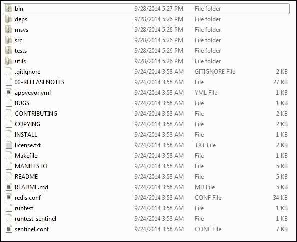

解压缩压缩文件后的文件夹结构

1.  进入`bin`文件夹。您将找到`release`文件夹；单击它，您将看到该文件夹内的文件列表，如下面的屏幕截图所示：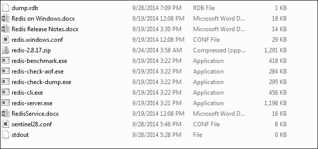

bin/release 文件夹内的文件夹结构

1.  打开命令提示符并运行`redis-server.exe`。提供`redis-server.exe --maxheap 1024mb`堆大小，您应该会看到一个控制台窗口弹出，类似于以下屏幕截图。在 Windows 7 的情况下，用户可能会被要求信任软件以进一步进行。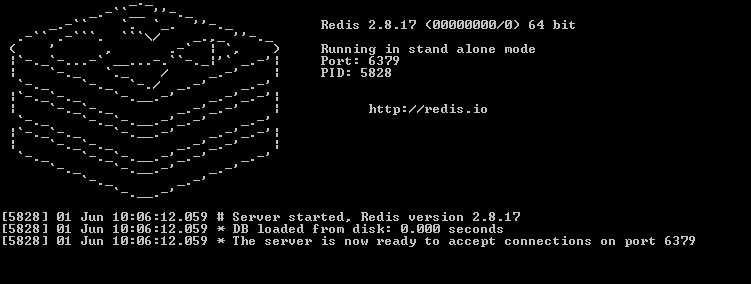

Redis 服务器的默认启动

1.  注意命令提示符上显示的最后一行：**服务器现在准备好在端口 6379 上接受连接**。

1.  现在，让我们启动一个预构建的客户端，该客户端随分发包一起提供，并连接到服务器。我们将执行的客户端是一个命令行解释器，当我们点击它时，客户端程序将被启动：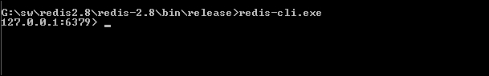

Redis 客户端在 Redis 服务器运行时启动

1.  您的简单安装已完成（集群设置和其他管理主题将在后续章节中进行）。

### 提示

**下载示例代码**

您可以从[`www.packtpub.com`](http://www.packtpub.com)的帐户中下载示例代码文件，以获取您购买的所有 Packt Publishing 图书。如果您在其他地方购买了本书，可以访问[`www.packtpub.com/support`](http://www.packtpub.com/support)并注册，以便直接通过电子邮件接收文件。

# 在 Mac OS 上安装 Redis

在 Mac OS 上安装 Redis 真的很简单。按照这些步骤，您就可以开始了：

1.  从互联网下载包。为此，您可以使用以下命令：`wget http://download.redis.io/releases/redis-2.8.3.tar.gz`

1.  解压缩`tar xzf redis-2.8.3.tar.gz`文件。

1.  这将创建一个文件夹；通过发出`cd redis-2.8.3`命令进入文件夹。

1.  通过发出`make`命令来编译文件。这将编译二进制文件并创建文件夹结构，如下面的屏幕截图所示：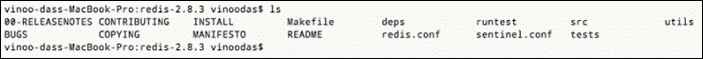

Mac 分发的文件夹结构

1.  输入`src/redis-server`命令；这将启动服务器，如下截图所示：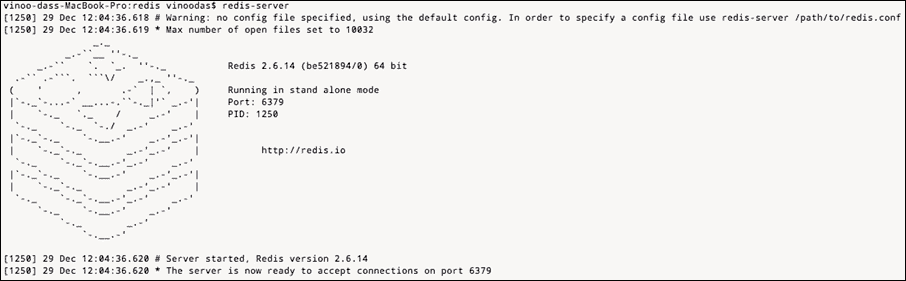

在苹果环境中启动 Redis 服务器

1.  您的 Redis 服务器正在运行，并且准备接受端口 6379 上的请求。打开另一个终端并转到安装 Redis 的同一文件夹。输入命令`src/redis-client`；这将启动客户端 shell，如下截图所示：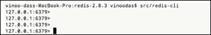

在苹果环境中启动 Redis 客户端

1.  您的客户端已准备就绪，您已准备好进行 Hello World 程序，但在继续之前，最好先了解一下名为`redis.conf`的配置文件。

## redis.conf 简介

Redis 附带`redis.windows.conf`文件，位于解压分发的 ZIP/tar 文件时创建的父文件夹中。可以通过此配置文件对服务器在启动时需要的任何自定义进行设置。如果需要包含`redis.conf`文件，则在服务器启动时提供文件路径作为参数。

当您在启动时提供配置文件时，命令提示符将显示以下消息：

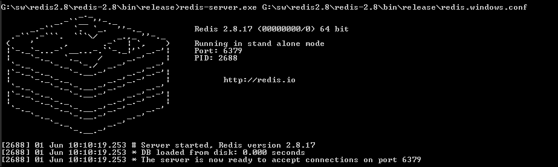

Redis 服务器在启动时使用配置路径进行启动

如前所述，Redis 是基于 Unix 的软件，已移植到 Windows 环境。许多配置参数是为 Unix 环境而设的；然而，了解在转移到基于 Unix 的环境时对您有益的参数总是好的。这些参数如下所述：

+   **Port 6379**：这个数字表示服务器将监听在端口 6379 上的消息。此端口号可以根据您的项目设置进行更改，并且服务器将在该端口上监听消息。这将需要重新启动服务器。

+   **# bind 127.0.0.1**：这是您希望服务器绑定的 IP 地址。默认情况下，此参数已被注释，这意味着服务器将监听所有接口的消息。

+   **Timeout 0**：这意味着如果客户端处于空闲状态，服务器将不会关闭连接。

+   **tcp-keepalive 0**：这是向服务器发送的命令，以保持与客户端的连接开放。您可以将其设置为`SO_KEEPALIVE`，这将指示服务器向客户端发送`ACK`消息。

+   **loglevel notice**：这是您希望服务器具有的日志级别。您可以拥有的日志级别包括 debug、verbose、notice 和 warning。

+   **logfile stdout**：这是您希望将日志消息发送到的通道，在 Windows 中为命令行，Unix-based 系统中为终端。

+   **syslog-enabled no**：如果更改为*yes*，则会将消息发送到系统日志。

+   **dir**：这应设置为用户希望运行 Redis 服务器的工作目录。这将告诉 Redis 服务器适当地创建文件，如服务器文件。

其余的配置参数可以视为高级参数，在后续章节中需要时我们将使用大部分。

# Redis 中的 Hello World

这一部分将最激发程序员的兴趣。让我们动手写一些代码。但在此之前，我们必须了解 Redis 是基于客户端-服务器模型工作的，并使用 Redis 协议与服务器通信。为了客户端连接到服务器，客户端必须知道服务器的位置。在本节中，我将展示使用 redis-cli 和 Java 客户端的示例。

## 使用 redis-cli 进行 Hello World

启动 Redis 客户端命令提示符（确保服务器正在运行）。输入以下命令，如下截图所示，并查看结果：

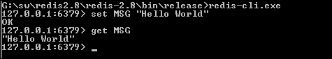

尝试使用 Redis 客户端进行简单的 Set 和 Get 命令

我们写的命令有三个部分。它们的解释如下：

+   `Set`：此命令用于在 Redis 服务器中设置值

+   `MSG`：这是要存储在 Redis 服务器中的消息的键

+   `Hello World`：这是存储在服务器上`MSG`键的值

因此，这清除了我们在使用 Redis 时必须记住的一个模式。请记住，Redis 是一个键值 NoSQL 数据存储。其语法为`COMMAND <space> KEY <space> VALUE`。

继续进行`Hello world`程序，我们将做更多的事情。让我们输入`set MSG Learning Redis`，我们会收到一个错误消息，当我们输入`set MSG "Hello World"`时，服务器将返回的值是`OK`：

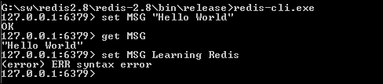

用新值覆盖键

给定键的旧值被新值覆盖。让我们为这个示例添加另一个维度，即打开另一个客户端以打开我们已经打开的客户端命令提示符。在第二个命令提示符中，让我们将命令和键输入为`get MSG`。它将返回的值再次是`"Hello World"`。如下截图所示：

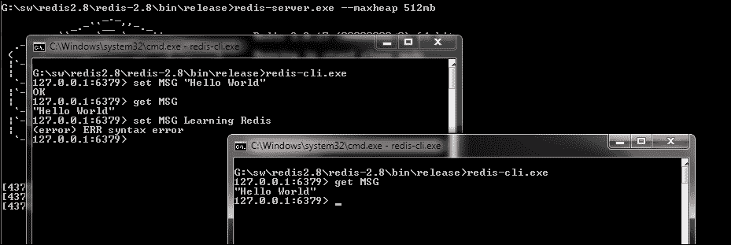

在一个客户端中写入并在另一个客户端中读取

此时，人们会想知道如果我们将一个数字作为值写入，也许是为了存储一些时间戳，而不是一个字符串，会发生什么。

让我们将新命令的键值设为`set new_msg 1234`，当我们写入命令键以检索值为`get new_msg`时，我们得到结果`"1234"`。注意值周围的双引号；这告诉我们有关 Redis 以及它存储数据的方式的更多信息，即 Redis 中存储的每个值都是字符串类型：

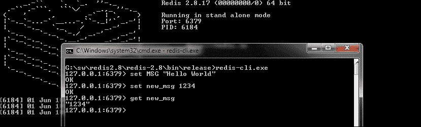

将整数值作为字符串获取

redis-cli 工具非常适用于调试解决方案并执行命令以检查系统和解决方案。

需要回答的下一个问题是如何以编程方式访问 Redis。

## 使用 Java 的 Hello World

在上一节中，您学习了如何使用`redis-cli.exe`应用程序来连接到 Redis 服务器。在本节中，我们将介绍一个 Java 客户端 API 来连接到 Redis 服务器并执行一些命令。实际上，要在解决方案中使用 Redis，需要一个 API 来连接服务器。除了连接到服务器、传递命令和命令参数以及返回结果之外，API 还需要一些其他属性，但我们将在后面的章节中进行介绍。

本书中选择的用于演示示例的 Java 客户端 API 是 Jedis。

在 Java 中运行`Hello World`示例有三个步骤。它们将在接下来的章节中进行解释。

### 安装 Jedis 并创建环境

**Jedis**是 Redis 的*Apache 许可 2.0* Java 客户端。本书中演示示例将使用此客户端。因此，最重要的是确保您拥有开发环境。对于本书，我们选择了 Eclipse 作为开发环境（[`www.eclipse.org/downloads/`](http://www.eclipse.org/downloads/)）。如果您没有 Eclipse，可以获取并安装它（它是免费的和有许可的）。本书的示例同样适用于其他集成开发环境。现在，执行以下步骤：

1.  打开 Eclipse 并创建一个名为`learning redis`的项目，如下截图所示：

在 Eclipse 中创建一个项目

1.  如果您使用 Maven，则为 Jedis 添加以下依赖项：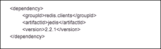

Jedis 的 Maven 依赖项

如果您使用其他构建工具，请按照说明相应地添加 Jedis 的依赖项。

### 编写程序

以下 Java 程序是使用 Redis 作为数据存储的：

```sql
 package org.learningredis.chapter.two;

import redis.clients.jedis.*;

public class HelloWorld {
  private JedisPool pool = new JedisPool(new JedisPoolConfig(), "localhost");

  private void test() {
    try 
        { 
            Jedis jedis = pool.getResource(); 
            jedis.set("MSG", "Hello World"); 
            String result = jedis.get("MSG"); 
            System.out.println(" MSG : " + result); 
            pool.returnResource(jedis); 

        } 
        catch (Exception e) 
        { 
            System.err.println(e.toString()); 
        }finally{
             pool.destroy(); 
        }

  } 

    public static void main(String args[]) 
    { 
        HelloWorld helloWorld = new HelloWorld();
        helloWorld.test();
    }

}
```

确保您的 Redis 服务器正在运行。在此示例中，使用的端口是默认端口 6379。

让我们逐步了解程序中正在进行的操作：

1.  我们正在设置一个连接池，以连接到 Redis 服务器。池配置为服务器将绑定到的默认 IP 地址。

1.  我们从池中获取资源（包装连接的客户端存根）。

1.  我们将键值设置到其中。这将推送要插入到 Redis 数据存储中的值。

1.  我们根据键获取值。在这种情况下，是根据前一步中插入的键的值。

1.  我们将资源返回到池中以便重用，并关闭池。

### 关闭服务器

与任何服务器一样，优雅地关闭服务器非常重要。在关闭任何 Redis 服务器之前，需要牢记几件事，这里进行了解释：

1.  关闭所有客户端连接。对于我们的 Java 程序，我们通过编写`"pool.destoy();"`来指示客户端关闭所有连接。

1.  我们需要做的下一件事是转到客户端提示符并命令服务器关闭。

1.  如果您打算将 Redis 用作缓存服务器，则无需保存其持有的数据。在这种情况下，只需键入`shutdown nosave`。这将清除内存中的所有数据并释放它。

1.  如果您打算保存数据以便以后使用，那么您必须传递`shutdown save`命令。即使没有配置保存点，这将使数据持久化在`RDB`文件中，我们将在后面的章节中介绍。

以下图显示了从资源生命周期的角度来看示例中发生的情况：

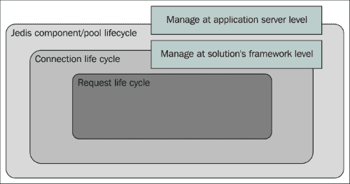

为 Jedis 客户端管理资源

在生命周期中，我们必须考虑三种资源。它们的解释如下：

+   **Jedis 连接池**：这是系统/应用程序启动时应该创建的池。这为池分配资源。应用程序服务器生命周期应该管理池的生命周期。

+   **连接**：在 Jedis 中，创建的客户端存根包装了连接并充当 Redis 的客户端。在前面列出的程序中，客户端存根被引用为*Jedis*，它是在`pool.getResource()`语句中获取的。

+   **请求生命周期**：这是命令正在执行的地方。因此，基本上在这里发生的是使用 Redis 协议，将命令和有效负载发送到服务器。有效负载包括键（如果是“getter”）或键和值（如果是“setter”）。生命周期由服务器的积极确认来管理。如果失败，它可能是成功或异常。在某种程度上，我们不需要为此语句进行显式的生命周期管理。

我们如何在 Jedis 中管理连接，如果我们不管理它们会发生什么？

对于问题“如果我们不管理它会发生什么”，答案很简单。池将耗尽连接，客户端应用程序将受到影响。我们在诸如 JDBC 之类的领域中遇到了与连接相关的问题，当客户端没有连接可连接到服务器时，应用程序会受到影响。总是服务器为连接保留内存，并关闭连接是服务器释放内存的指示。

对于问题“我们如何在 Jedis 中管理连接”的答案有点有趣，并且需要一些代码更改。我们将采用先前的代码示例并对其进行更改，其中我们将处理连接资源管理。对于以下示例，我正在添加一个包装器，但在您的应用程序中，您可以使用更奇特的方法来解决提到的问题。也就是说，您可以使用 Spring 来注入连接，或者使用`cglib`动态创建代理，在命令之前设置连接并在命令之后返回连接。

以下代码是新的 Hello World 程序，现在称为`HelloWorld2`：

```sql
package org.learningredis.chapter.two;

public class Helloworld2  {
  JedisWrapper jedisWrapper = null;
  public Helloworld2() {
    jedisWrapper = new JedisWrapper();
  }

  private void test() {
    jedisWrapper.set("MSG", "Hello world 2 ");

    String result = jedisWrapper.get("MSG");
    System.out.println("MSG : " + result);
  }

  public static void main(String[] args) {
    Helloworld2 helloworld2 = new Helloworld2();
    helloworld2.test();
  }
}
```

以下是处理连接的包装器代码：

```sql
package org.learningredis.chapter.two;

import redis.clients.jedis.Jedis;
import redis.clients.jedis.JedisPool;

import redis.clients.jedis.JedisPoolConfig;

public class JedisWrapper {
  static JedisPool pool = new JedisPool(new JedisPoolConfig(), "localhost");");");");");

  public void set(String key,String value){
    Jedis jedis = pool.getResource(); 
        jedis.set(key, value); 
        pool.returnResource(jedis);
  }

  public String get(String key){
    Jedis jedis = pool.getResource(); 
        String result = jedis.get("MSG"); ");");");"); 
        pool.returnResource(jedis);
        return result;
  }
}
```

在这种情况下，有两件事变得清楚，这里进行了解释：

+   我们不必管理连接/资源，因为这将由“包装器”类来处理

+   代码行数减少了，因为我们不必重复资源管理的代码

## 在 Redis 中加载一个测试 Hello World 程序

好吧，您已经看到了 Java 和命令行中的`Hello world`程序的示例。但是为您的`Hello World`程序添加一个负载测试维度总是很好的。Redis 附带了一个名为`redis-benchmark`的工具，可以在发布文件夹中找到。

以下命令将对 Redis 服务器进行 10 万次调用：


Hello World 的负载测试

结果是您的机器每秒处理的请求总数。这个工具对于负载测试您的目标环境非常有用。这是我在 Windows 机器上执行时得到的结果的快照，这将根据您的机器和操作系统的配置而有所不同：

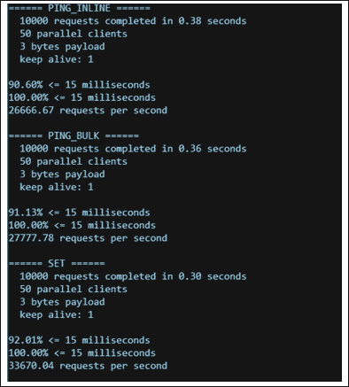

工具执行负载测试

这里发生的是`redis-benchmark`打开了 50 个并行连接到 Redis 服务器并发送了 1 万个请求。请求包含 Redis 命令和 3 字节的有效负载。近似结果被打印出来进行分析；在我的情况下，1 万个`Set`命令总共花费了 0.30 秒，也就是说，每秒处理了 33,670 个请求。

# 总结

Redis 是一个简单的面向键值的 NoSQL，可以用作缓存服务器和持久化服务器。本章展示了在多个环境中安装 Redis 是多么简单，包括 Windows（Redis 也可以在云环境中使用，如 Amazon EC2）。Windows 的安装仅用于开发和抽样目的。 

Redis 具有一组有趣的数据结构，有时被称为数据结构服务器。下一章将详细介绍数据结构。
