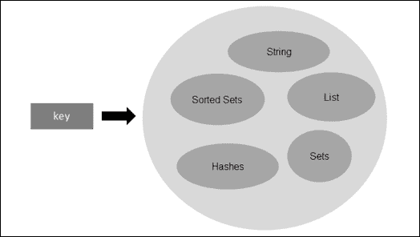
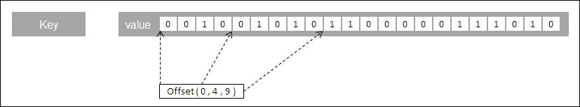
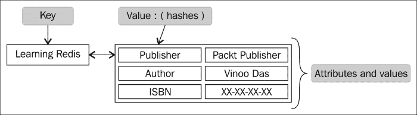
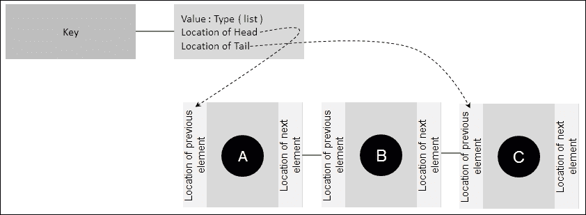
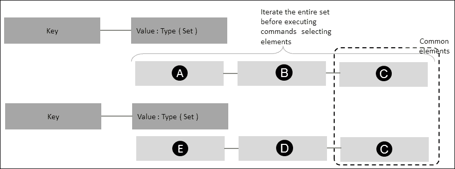
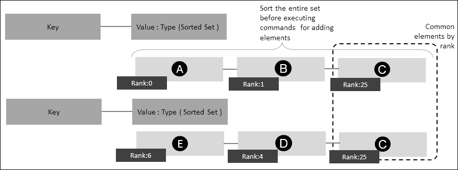
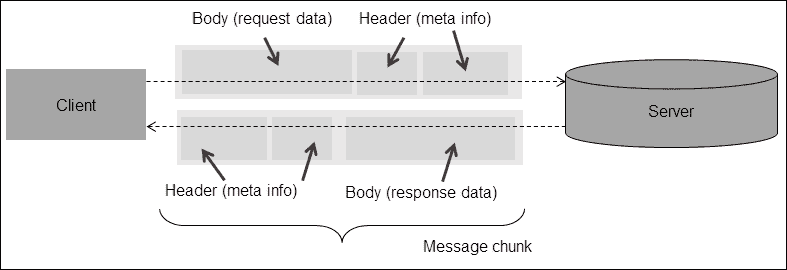
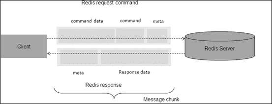
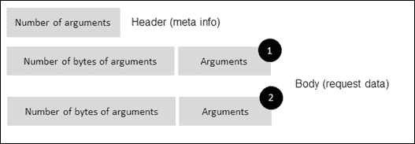
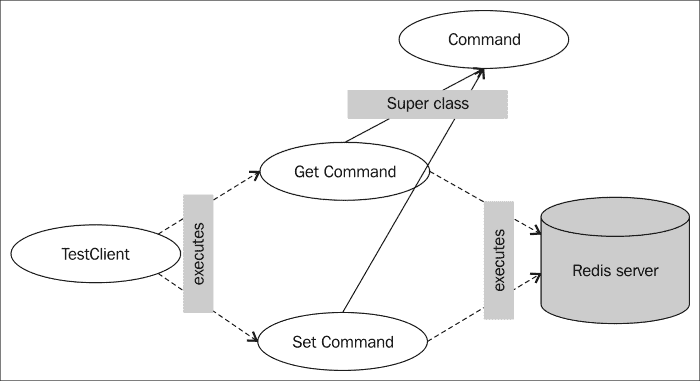

# 第三章：Redis 中的数据结构和通信协议

上一章介绍了安装 Redis 和运行一些简单程序。由于 Redis 是一个数据存储，因此了解 Redis 如何通过提供数据结构来处理和存储数据是很重要的。同样重要的是 Redis 在将数据传输给客户端时如何处理数据，比如通信协议。

# 数据结构

数据结构，顾名思义，意味着用于存储数据的结构。在计算世界中，数据总是以一种对存储它的程序有意义的方式组织的。数据结构可以从简单的字符顺序排列到复杂的地图，其中键不是顺序排列的，而是基于算法的。数据结构通常是复合的，这意味着一个数据结构可以容纳另一个数据结构，这是一个包含另一个地图的地图。

设计数据结构的关键影响因素是数据结构的性能和内存管理。一些常见的数据结构示例包括列表，集合，地图，图和树，元组等。作为程序员，我们一次又一次地在程序中使用数据结构。在面向对象的世界中，一个简单的*对象*也是一个数据结构，因为它包含数据和访问这些数据的逻辑。每个数据结构都受算法的控制，算法决定了其效率和功能能力。因此，如果算法可以分类，那么它将清楚地表明数据结构的性能；当数据被注入数据结构或当数据被读取或从数据结构中删除时。

大 O 表示法是一种对算法（数据结构）在数据增长时性能进行分类的方法。从 Redis 的角度来看，我们将根据以下符号对数据结构进行分类：

+   `O（1）`：命令在数据结构上花费的时间是恒定的，不管它包含多少数据。

+   `O（N）`：命令在数据结构上花费的时间与其包含的数据量成线性比例，其中`N`是元素的数量。

+   `O（log（N））`：命令在数据结构上花费的时间是对数性质的，其中`N`是元素的数量。表现出这种特性的算法非常高效，用于在排序数组中查找元素。这可以解释为随着时间的推移而相当恒定。

+   `O（log（N）+ M）`：命令花费的时间取决于对数值，其中`M`是排序集中的元素总数，`N`是搜索范围。这可以解释为相当依赖于`M`的值。随着`M`值的增加，搜索所需的时间也会增加。

+   `O（M log（M））`：命令花费的时间是对数线性的。

# Redis 中的数据类型

Redis 是一个数据结构服务器，具有许多内置数据类型，这使得它与生态系统中的其他键值 NoSQL 数据存储有所不同。与其他 NoSQL 不同，Redis 为用户提供了许多内置数据类型，这提供了一种语义方式来安排其数据。可以这样想：在设计解决方案时，我们需要领域对象，这些对象在某种程度上塑造了我们的数据层。在决定领域对象之后，我们需要设计要保存在数据存储中的数据的结构，为此我们需要一些预定义的数据结构。这样做的好处是节省了程序员外部创建和管理这些数据的时间和精力。例如，假设在我们的程序中需要一种类似 Set 的数据结构。使用 Java，我们可以轻松地使用内置数据结构，如 Set。如果我们要将这些数据作为键值存储，我们将不得不将整个集合放在一个键值对中。现在，如果我们要对这个集合进行排序，通常的方法是提取数据并以编程方式对数据进行排序，这可能很麻烦。如果数据存储本身提供了内部对数据进行排序的机制，那就太好了。Redis 内置了以下数据类型来存储数据：

+   字符串

+   哈希

+   列表

+   集合

+   有序集合

以下图表示可以映射到键的数据类型。在 Redis 中，键本身是字符串类型，它可以存储其中的任何一个，如下所示：



键和其可以存储的值的表示

## 字符串数据类型

**字符串**类型是 Redis 中的基本数据类型。尽管术语上有些误导，但在 Redis 中，字符串可以被视为一个可以容纳字符串、整数、图像、文件和可序列化对象的字节数组。这些字节数组在性质上是二进制安全的，它们可以容纳的最大大小为 512MB。在 Redis 中，字符串被称为**Simple Dynamic String**（**SDS**），在 C 语言中实现为`Char`数组，还有一些其他属性，如`len`和`free`。这些字符串也是二进制安全的。SDS 头文件在`sds.h`文件中定义如下：

```sql
struct sdshdr {
            long len;
           long free;
              char buf[];
          };
```

因此，Redis 中的任何字符串、整数、位图、图像文件等都存储在`buf[]`（`Char`数组）中，`len`存储缓冲数组的长度，`free`存储额外的字节以进行存储。Redis 具有内置机制来检测数组中存储的数据类型。有关更多信息，请访问[`redis.io/topics/internals-sds`](http://redis.io/topics/internals-sds)。

Redis 中的命令可以按以下部分对字符串进行分类：

+   **设置器和获取器命令**：这些是用于在 Redis 中设置或获取值的命令。有单个键值和多个键值的命令。对于单个获取和设置，可以使用以下命令：

+   `Get` key：获取键的值。该命令的时间性能为`O（1）`。

+   `Set` key：该键设置一个值。该命令的时间性能为`O（1）`。

+   `SETNX` key：如果键不存在，则该键设置一个值 - 不会覆盖。该命令的时间性能为`O（1）`。

+   `GETSET` key：获取旧值并设置新值。该命令的时间性能为`O（1）`。

+   `MGET key1` key：获取所有键的相应值。该命令的时间性能为`O（N）`。

+   `MSET` key：设置所有键的相应值。该命令的时间性能为`O（N）`，其中`N`是要设置的键的数量。

+   `MSETNX` key：如果所有键都不存在，则设置所有键的相应值，即如果一个键存在，则不设置任何值。该命令的时间性能为`O（N）`，其中`N`是要设置的键的数量。

+   **数据清理命令**：这些是用于管理值的生命周期的命令。默认情况下，密钥的值没有到期时间。但是，如果您有一个值需要具有生命周期的用例，那么请使用以下密钥：

+   `SET PX/ EX`：在到期时间后删除值，密钥在毫秒后过期。该命令的时间性能为`O（1）`。

+   `SETEX`：在到期时间后删除值，密钥在秒后过期。该命令的时间性能为`O（1）`。

+   **实用命令**：以下是一些这些命令：

+   `APPEND`：此命令将附加到现有值，如果不存在则设置。该命令的时间性能为`O（1）`。

+   `STRLEN`：此命令返回存储为字符串的值的长度。该命令的时间性能为`O（1）`。

+   `SETRANGE`：此命令在给定的偏移位置上覆盖字符串。该命令的时间性能为`O（1）`，前提是新字符串的长度不会花费太长时间来复制。

+   `GETRANGE`：此命令从给定的偏移量获取子字符串值。该命令的时间性能为`O（1）`，前提是新子字符串的长度不会太大。

以下是一个演示字符串命令简单用法的示例程序。执行程序并自行分析结果。

```sql
package org.learningredis.chapter.three.datastruct;
import redis.clients.jedis.Jedis;
import redis.clients.jedis.JedisPool;
import redis.clients.jedis.JedisPoolConfig;
public class MyStringTest {
  private JedisPool pool = new JedisPool(new JedisPoolConfig(), "localhost");
  Jedis jedis = null;

  public Jedis getResource() {
    jedis = pool.getResource();
    return jedis;
  }
  public void setResource(Jedis jedis){
    pool.returnResource(jedis);
  }
  public static void main(String[] args) throws InterruptedException {
    MyStringTest myStringTest  = new MyStringTest();
    myStringTest.test();

  }
  private void test() throws InterruptedException {
    Jedis jedis = this.getResource();
    String commonkey = "mykey";
    jedis.set(commonkey, "Hello World");
    System.out.println("1) "+jedis.get("mykey"));
    jedis.append(commonkey, " and this is a bright sunny day ");
    System.out.println("2) "+jedis.get("mykey"));
    String substring=jedis.getrange(commonkey, 0 , 5);
    System.out.println("3) "+"substring value = "+substring);
    String commonkey1 = "mykey1";
    jedis.set(commonkey1, "Let's learn redis");
    for(String value : jedis.mget(commonkey,commonkey1)){
      System.out.println("4) "+" - "+ value);
    }
    jedis.mset("mykey2","let's start with string","mykey3","then we will learn other data types");
    for(String value : jedis.mget(commonkey,commonkey1,"mykey2","mykey3")){
      System.out.println("5) "+"   -- "+ value);
    }
    jedis.msetnx("mykey4","next in line is hashmaps");
    System.out.println("6) "+jedis.get("mykey4"));
    jedis.msetnx("mykey4","next in line is sorted sets");
    System.out.println("7) "+jedis.get("mykey4"));
    jedis.psetex("mykey5", 1000, "this message will self destruct in 1000 milliseconds");
    System.out.println("8) "+jedis.get("mykey5"));
    Thread.currentThread().sleep(1200);
    System.out.println("8) "+jedis.get("mykey5"));
    Long length=jedis.strlen(commonkey);
    System.out.println("9) "+" the length of the string 'mykey' is " + length);
    this.setResource(jedis);
  }
}
```

Redis 中的整数和浮点数的命令可以分为以下部分：

+   **设置器和获取器命令**：命令集与字符串中提到的相同。

+   **数据清理命令**：命令集与字符串中提到的相同。

+   **实用命令**：这里的命令将帮助操作整数和浮点值。对于整数，此操作仅限于 64 位有符号整数：

+   **APPEND**：这将将现有整数与新整数连接。该命令的时间性能为`O（1）`。

+   **DECR**：这将使值减少一。该命令的时间性能为`O（1）`。

+   **DECRBY**：这将使值减少给定的值。该命令的时间性能为`O（1）`。

+   **INCR**：这将使值增加一。该命令的时间性能为`O（1）`。

+   **INCRBY**：这将使值增加给定的值。该命令的时间性能为`O（1）`。

+   **INCRBYFLOAT**：这将使值增加给定的浮点值。该命令的时间性能为`O（1）`。

除了常规数字、字符串等，字符串数据类型可以存储一种称为**BitSet**或**bitmap**的特殊数据结构。让我们更多地了解它们并看看它们的用法。

## BitSet 或位图数据类型

这些是特殊的高效利用空间的数据结构类型，用于存储特殊类型的信息。位图特别用于实时分析工作。尽管位图只能存储二进制值（1 或 0），但它们占用的空间较少，获取值的性能为`O（1）`，这使它们对实时分析非常有吸引力：



位图的表示

密钥可以是任何基于日期的密钥。假设这里的密钥表示了 2014 年 12 月 12 日购买书籍的用户的位图。

例如，`12/12/2014-user_purchased_book_learning_redis`。这里的偏移量表示与用户关联的唯一整数 ID。这里我们有与数字 0、1、2...n 等关联的用户。每当用户购买商品时，我们找到用户的相应唯一 ID，并在该偏移位置将值更改为`1`。

以下问题可以借助这个空间优化、高性能的位图来回答：

+   2014 年 12 月 12 日有多少次购买？

答案：计算位图中的 1 的数量，即进行购买的用户数量，例如 9。

+   与 ID（偏移编号）为 15 的用户是否进行了购买？

答案：偏移量为 15 的值为 0，因此用户没有购买。

这些位图的集合可以用于联合，以找到更复杂的分析答案。让我们向现有样本添加另一个位图，例如称为`12/12/2014-user_browsed_book_learning_redis`。使用这两个位图，我们可以找到以下问题的答案：

+   浏览产品（*学习 Redis*）页面的用户有多少？

+   购买产品（*学习 Redis*）页面的用户有多少？

+   浏览产品页面的用户中有多少人购买了这本书？

+   没有浏览产品页面的用户购买了这本书有多少？

### 使用情况场景

Redis 字符串可用于存储对象 ID。例如，会话 ID、XML、JSON 等配置值。Redis 字符串（存储整数）可用作原子计数器。Redis 字符串（存储位图）可用作实时分析引擎。

## 哈希数据类型

哈希是 Redis 中类似 Java 中的映射的版本。Redis 中的哈希用于存储属性和它们的值的映射。为了更好地理解，假设我们有一个名为*学习 Redis*的对象；这个对象将有许多属性，比如作者、出版商、ISBN 号等。为了在存储系统中表示这些信息，我们可以将信息存储为 XML、JSON 等，并与我们的键*学习 Redis*相关联。如果我们需要某个特定的值，例如存储在*学习 Redis*中的作者，那么就必须检索整个数据集，并筛选出所需的值。以这种方式工作将不高效，因为需要大量数据通过网络传输，并且客户端的处理会增加。Redis 提供了哈希数据结构，可以用于存储这种类型的数据。以下图示出了前面示例的图解表示：



哈希数据类型

哈希以占用更少的空间存储，Redis 中的每个哈希可以存储多达 2³²个字段-值对，即超过 40 亿。

哈希中的命令以`H`开头，Redis 中哈希的命令可以分为以下几部分：

+   **设置器和获取器命令**：以下是此命令：

+   `HGET`：该命令获取键的字段的值。该命令的基于时间的性能为`O(1)`。

+   `HGETALL`：该命令获取键的所有值和字段。该命令的基于时间的性能为`O(1)`。

+   `HSET`：该命令为键的字段设置值。该命令的基于时间的性能为`O(1)`。

+   `HMGET`：该命令获取键的字段的值。该命令的基于时间的性能为`O(N)`，其中`N`是字段的数量。但是，如果`N`很小，则为`O(1)`。

+   `HMSET`：该命令为键的各个字段设置多个值。该命令的基于时间的性能为`O(N)`，其中`N`是字段的数量。但是，如果`N`很小，则为`O(1)`。

+   `HVALS`：该命令获取键的哈希中的所有值。该命令的基于时间的性能为`O(N)`，其中`N`是字段的数量。但是，如果`N`很小，则为`O(1)`。

+   `HSETNX`：该命令为提供的键设置字段的值，前提是该字段不存在。该命令的基于时间的性能为`O(1)`。

+   `HKEYS`：该命令获取键的哈希中的所有字段。该命令的基于时间的性能为`O(1)`。

+   **数据清理命令**：以下是此命令：

+   `HDEL`：该命令删除键的字段。该命令的基于时间的性能为`O(N)`，其中`N`是字段的数量。但是，如果`N`很小，则为`O(1)`。

+   **实用命令**：以下是此命令：

+   `HEXISTS`：该命令检查键的字段是否存在。该命令的基于时间的性能为`O(1)`。

+   `HINCRBY`：此命令递增键的字段的值（假设该值是整数）。此命令的基于时间的性能为`O(1)`。

+   `HINCRBYFLOAT`：此命令递增键的字段的值（假设该值是浮点数）。此命令的基于时间的性能为`O(1)`。

+   `HLEN`：此命令获取键的字段数。此命令的基于时间的性能为`O(1)`。

以下是一个演示哈希命令简单用法的示例程序。执行程序并自行分析结果。

```sql
  package org.learningredis.chapter.three.datastruct;
import java.util.HashMap;
import java.util.Map;
import redis.clients.jedis.Jedis;
import redis.clients.jedis.JedisPool;
import redis.clients.jedis.JedisPoolConfig;
public class MyHashesTest {
  private JedisPool pool = new JedisPool(new JedisPoolConfig(), "localhost");
  Jedis jedis = null;

  public Jedis getResource() {
    jedis = pool.getResource();
    return jedis;
  }
  public void setResource(Jedis jedis){
    pool.returnResource(jedis);
  }
  public static void main(String[] args) 
throws InterruptedException  {
    MyHashesTest myHashesTest  = new MyHashesTest();
    myHashesTest.test();    
  }
  private void test() {
    Jedis jedis = this.getResource();
    String commonkey = "learning redis";
    jedis.hset(commonkey, "publisher", "Packt Publisher");
    jedis.hset(commonkey, "author", "Vinoo Das");
    System.out.println(jedis.hgetAll(commonkey));
Map<String,String> attributes = new HashMap<String,String>();
    attributes.put("ISBN", "XX-XX-XX-XX");
    attributes.put("tags", "Redis,NoSQL");
    attributes.put("pages", "250");
    attributes.put("weight", "200.56");
    jedis.hmset(commonkey, attributes);
    System.out.println(jedis.hgetAll(commonkey));
    System.out.println(jedis.hget(commonkey,"publisher"));
    System.out.println(jedis.hmget(commonkey,"publisher","author"));
    System.out.println(jedis.hvals(commonkey));
    System.out.println(jedis.hget(commonkey,"publisher"));
    System.out.println(jedis.hkeys(commonkey));
    System.out.println(jedis.hexists(commonkey, "cost"));
    System.out.println(jedis.hlen(commonkey));
    System.out.println(jedis.hincrBy(commonkey,"pages",10));
    System.out.println(jedis.hincrByFloat(commonkey,"weight",1.1) + " gms");
    System.out.println(jedis.hdel(commonkey,"weight-in-gms"));
    System.out.println(jedis.hgetAll(commonkey));
    this.setResource(jedis);
  }
}
```

### 使用案例场景

哈希提供了一种语义接口，用于在 Redis 服务器中存储简单和复杂的数据对象。例如，用户配置文件，产品目录等。

## 列表数据类型

Redis 列表类似于 Java 中的链表。Redis 列表可以在头部或尾部添加元素。执行此操作的性能是恒定的，或者可以表示为`O(1)`。这意味着，假设您有一个包含 100 个元素的列表，添加元素到列表所需的时间等于添加元素到包含 10,000 个元素的列表所需的时间。但另一方面，访问 Redis 列表中的元素将导致整个列表的扫描，这意味着如果列表中的项目数量较多，则性能会下降。

Redis 列表以链表形式实现的优势在于，Redis 列表作为一种数据类型，设计为具有比读取更快的写入速度（这是所有数据存储所显示的特性）。



列表数据类型

Redis 中的列表命令通常以`L`开头。这也可以解释为所有命令将从*列表的左侧或头部*执行，而从*列表的右侧或尾部*执行的命令则以 R 开头。这些命令可以分为以下几个部分：

+   **设置器和获取器命令**：以下是此类命令的示例：

+   `LPUSH`：此命令从列表的左侧添加值。此命令的基于时间的性能为`O(1)`。

+   `RPUSH`：此命令从列表的右侧添加值。此命令的基于时间的性能为`O(1)`。

+   `LPUSHX`：此命令如果键存在，则从列表的左侧添加值。此命令的基于时间的性能为`O(1)`。

+   `RPUSHX`：此命令如果键存在，则从列表的右侧添加值。此命令的基于时间的性能为`O(1)`。

+   `LINSERT`：此命令在*枢轴*位置之后插入一个值。此枢轴位置是从左边计算的。此命令的基于时间的性能为`O(N)`。

+   `LSET`：此命令根据指定的索引在列表中设置元素的值。此命令的基于时间的性能为`O(N)`。

+   `LRANGE`：此命令根据起始索引和结束索引获取元素的子列表。此命令的基于时间的性能为*O(S+N)*。这里*S*是偏移的起始位置，*N*是我们在列表中请求的元素数量。这意味着，如果偏移离头部越远，范围的长度越大，查找元素所需的时间就会增加。

+   **数据清理命令**：以下是此类命令的示例：

+   `LTRIM`：此命令删除指定范围之外的元素。此命令的基于时间的性能为`O(N)`。这里的`N`是列表的长度。

+   `RPOP`：此命令删除最后一个元素。此命令的基于时间的性能为`O(1)`。

+   `LREM`：此命令删除指定索引点的元素。此命令的基于时间的性能为`O(N)`。这里的`N`是列表的长度。

+   `LPOP`：此命令删除列表的第一个元素。此命令的基于时间的性能为`O(1)`。

+   **实用命令**：以下是此类命令的示例：

+   `LINDEX`：此命令根据指定的索引获取列表中的元素。该命令的时间性能为`O（N）`。这里的`N`是要遍历以达到所需索引处的元素数量。

+   `LLEN`：此命令获取列表的长度。该命令的时间性能为`O（1）`。

+   **高级命令**：此类型包括以下命令：

+   `BLPOP`：此命令从所述列表序列中的非空索引处获取元素，如果头部没有值，则阻止调用，直到至少设置一个值或超时发生。`BLPOP`中的字母`B`提示此调用是阻塞的。该命令的时间性能为`O（1）`。

+   `BRPOP`：此命令从所述列表序列中的尾部获取元素，如果头部没有值，则阻止调用，直到至少设置一个值或超时发生。该命令的时间性能为`O（1）`。

+   `RPOPLPUSH`：此命令作用于两个列表。假设源列表和目标列表，它将获取源列表的最后一个元素并将其推送到目标列表的第一个元素。该命令的时间性能为`O（1）`。

+   `BRPOPLPUSH`：此命令是`RPOPLPUSH`命令的*阻塞*变体。在这种情况下，如果源列表为空，则 Redis 将阻止操作，直到将一个值推送到列表中或达到超时。这些命令可用于创建队列。该命令的时间性能为`O（1）`。

以下是一个演示列表命令简单用法的示例程序。执行程序并自行分析结果：

```sql
package org.learningredis.chapter.three.datastruct;
import redis.clients.jedis.Jedis;
import redis.clients.jedis.JedisPool;
import redis.clients.jedis.JedisPoolConfig;
import redis.clients.jedis.BinaryClient.LIST_POSITION;
public class MyListTest {
  private JedisPool pool = new JedisPool(new JedisPoolConfig(), "localhost");
  Jedis jedis = null;
  public Jedis getResource() {
    jedis = pool.getResource();
    return jedis;
  }
  public void setResource(Jedis jedis){
    pool.returnResource(jedis);
  }
  public static void main(String[] args) throws InterruptedException {
    MyListTest myListTest  = new MyListTest();
    myListTest.test();
  }
  private void test() {
    Jedis jedis = this.getResource();
    System.out.println(jedis.del("mykey4list"));
    String commonkey="mykey4list";
    String commonkey1="mykey4list1";
    for(int index=0;index<3;index++){
      jedis.lpush(commonkey, "Message - " + index);
    }
    System.out.println(jedis.lrange(commonkey, 0, -1));
    for(int index=3;index<6;index++){
      jedis.rpush(commonkey, "Message - " + index);
    }
    System.out.println(jedis.lrange(commonkey, 0, -1));
    System.out.println(jedis.lindex(commonkey, 0));
    System.out.println(jedis.linsert(commonkey,LIST_POSITION.AFTER,"Message - 5", "Message - 7"));
    System.out.println(jedis.lrange(commonkey, 0, -1));
    System.out.println(jedis.linsert(commonkey,LIST_POSITION.BEFORE,"Message - 7", "Message - 6"));
    System.out.println(jedis.lrange(commonkey, 0, -1));
    System.out.println(jedis.llen(commonkey));
    System.out.println(jedis.lpop(commonkey));
    System.out.println(jedis.lrange(commonkey, 0, -1));
    System.out.println(jedis.lpush(commonkey,"Message - 2","Message -1.9"));
    System.out.println(jedis.lrange(commonkey, 0, -1));
    System.out.println(jedis.lpushx(commonkey,"Message - 1.8"));
    System.out.println(jedis.lrange(commonkey, 0, -1));
    System.out.println(jedis.lrem(commonkey,0,"Message - 1.8"));
    System.out.println(jedis.lrange(commonkey, 0, -1));
    System.out.println(jedis.lrem(commonkey,-1,"Message - 7"));
    System.out.println(jedis.lrange(commonkey, 0, -1));
    System.out.println(jedis.lset(commonkey,7,"Message - 7"));
    System.out.println(jedis.lrange(commonkey, 0, -1));
    System.out.println(jedis.ltrim(commonkey,2,-4));
    System.out.println(jedis.lrange(commonkey, 0, -1));
    jedis.rpoplpush(commonkey, commonkey1);
    System.out.println(jedis.lrange(commonkey, 0, -1));
    System.out.println(jedis.lrange(commonkey1, 0, -1));
  }
}
```

### 用例场景

列表提供了一个语义接口，用于在 Redis 服务器中按顺序存储数据，其中*写*速度比*读*性能更可取。例如，日志消息。

## 集合数据类型

Redis 集合是无序的 SDS 的数据结构集合。集合中的值是唯一的，不能有重复值。在 Redis 集合的性能方面，一个有趣的方面是，它们在添加、删除和检查元素存在方面显示出恒定的时间。集合中可以有的最大条目数为 2³²，即每个集合最多有 40 亿个条目。这些集合值是无序的。从外观上看，集合可能看起来像列表，但它们有不同的实现，这使它们成为解决集合理论问题的完美候选者。



集合数据类型

Redis 中用于集合的命令可以分为以下几部分：

+   **设置器和获取器命令**：此类型包括以下命令：

+   `SADD`：此命令向集合中添加一个或多个元素。该命令的时间性能为`O（N）`。这里的`N`是需要添加的元素数量。

+   **数据清理命令**：以下是属于此类别的一些命令：

+   `SPOP`：此命令从集合中移除并返回一个随机元素。该命令的时间性能为`O（1）`。

+   `SREM`：此命令从集合中移除并返回指定的元素。该命令的时间性能为`O（N）`。这里的`N`是要移除的元素数量。

+   **实用命令**：以下是属于此类型的命令：

+   `SCARD`：此命令获取集合中的元素数量。该命令的时间性能为`O（1）`。

+   `SDIFF`：此命令从其他所述集合中减去其元素后获取第一个集合的元素列表。该命令的时间性能为`O（N）`。这里的`N`是所有集合中的元素数量。

+   `SDIFFSTORE`：此命令从其他指定的集合中减去第一个集合的元素后获取元素列表。然后将这个集合推送到另一个集合中。该命令的基于时间的性能为`O(N)`。这里的`N`是所有集合中元素的数量。

+   `SINTER`：此命令获取所有指定集合中的公共元素。该命令的基于时间的性能为`O(N*M)`。这里的`N`是最小集合的基数，`M`是集合的数量。基本上是 Redis 将取最小集合，并查找该集合与其他集合之间的公共元素。然后再次比较结果集中的公共元素，如前述过程，直到只剩下一个集合包含所需的结果。

+   `SINTERSTORE`：此命令与`SINTER`命令的工作方式相同，但结果存储在指定的集合中。该命令的基于时间的性能为`O(N*M)`。这里的`N`是最小集合的基数，`M`是集合的数量。

+   `SISMEMBER`：此命令查找值是否是集合的成员。该命令的基于时间的性能为`O(1)`。

+   `SMOVE`：此命令将成员从一个集合移动到另一个集合。该命令的基于时间的性能为`O(1)`。

+   `SRANDMEMBER`：此命令从集合中获取一个或多个随机成员。该命令的基于时间的性能为`O(N)`。这里的`N`是传递的成员数量。

+   `SUNION`：此命令添加多个集合。该命令的基于时间的性能为`O(N)`。这里的`N`是所有集合中元素的数量。

+   `SUNIONSTORE`：此命令将多个集合添加到一个集合中并将结果存储在一个集合中。该命令的基于时间的性能为`O(N)`。这里的`N`是所有集合中元素的数量。

以下是用于集合的简单用法的示例程序。执行程序并自行分析结果：

```sql
package org.learningredis.chapter.three.datastruct;
import redis.clients.jedis.Jedis;
import redis.clients.jedis.JedisPool;
import redis.clients.jedis.JedisPoolConfig;
public class MySetTest {
  private JedisPool pool = new JedisPool(new JedisPoolConfig(), "localhost");
  Jedis jedis = null;
  public Jedis getResource() {
    jedis = pool.getResource();
    return jedis;
  }
  public void setResource(Jedis jedis){
    pool.returnResource(jedis);
  }
  public static void main(String[] args) {
    MySetTest mySetTest = new MySetTest();
    mySetTest.test();
  }
  private void test() {
    Jedis jedis = this.getResource();
    jedis.sadd("follow:cricket", "vinoo.das@junk-mail.com","vinoo.das1@junk-mail.com","vinoo.das3@junk-mail.com");
    System.out.println(jedis.smembers("follow:cricket"));
    System.out.println(jedis.scard("follow:cricket"));
    jedis.sadd("follow:redis", "vinoo.das1@junk-mail.com","vinoo.das2@junk-mail.com");
    System.out.println(jedis.smembers("follow:redis"));
    System.out.println(jedis.scard("follow:redis"));
    // intersect the above sets to give name who is interested in cricket and redis
    System.out.println(jedis.sinter("Cricket:followers","follow:redis"));
    jedis.sinterstore("follow:redis+cricket","follow:cricket","follow:redis");
    System.out.println(jedis.smembers("follow:redis+cricket"));
    System.out.println(jedis.sismember("follow:redis+cricket", "vinoo.das@junk-mail.com"));
    System.out.println(jedis.sismember("follow:redis+cricket", "vinoo.das1@junk-mail.com"));
    jedis.smove("follow:cricket", "follow:redis", "vinoo.das3@junk-mail.com");
    System.out.println(jedis.smembers("follow:redis"));
    System.out.println(jedis.srandmember("follow:cricket"));
    System.out.println(jedis.spop("follow:cricket"));
    System.out.println(jedis.smembers("follow:cricket"));
    jedis.sadd("follow:cricket","wrong-data@junk-mail.com");
    System.out.println(jedis.smembers("follow:cricket"));
    jedis.srem("follow:cricket","wrong-data@junk-mail.com");
    System.out.println(jedis.smembers("follow:cricket"));
    System.out.println(jedis.sunion("follow:cricket","follow:redis"));
    jedis.sunionstore("follow:cricket-or-redis","follow:cricket","follow:redis");
    System.out.println(jedis.smembers("follow:cricket-or-redis"));
    System.out.println(jedis.sdiff("follow:cricket", "follow:redis"));
  }
}
```

### 使用情景

集合提供了一种语义接口，可以将数据存储为 Redis 服务器中的一个集合。这种类型数据的用例更多用于分析目的，例如有多少人浏览了产品页面，有多少最终购买了产品。

## 有序集合数据类型

Redis 有序集合与 Redis 集合非常相似，它们都不存储重复值，但它们与 Redis 集合不同的地方在于，它们的值是根据分数或整数、浮点值进行排序的。在设置集合中的值时提供这些值。有序集合的性能与元素数量的对数成正比。数据始终以排序的方式保存。这个概念在下图中以图表的方式解释：



有序集合的概念

Redis 中有关有序集合的命令可以分为以下几个部分：

+   **设置器和获取器命令**：以下是属于此类别的命令：

+   `ZADD`：此命令向有序集合中添加或更新一个或多个成员。该命令的基于时间的性能为`O(log(N))`。这里的`N`是有序集合中的元素数量。

+   `ZRANGE`：此命令根据有序集合中元素的排名获取指定范围。该命令的基于时间的性能为`O(log(N)+M)`。这里的`N`是元素的数量，`M`是返回的元素的数量。

+   `ZRANGEBYSCORE`：此命令根据给定的分数范围从有序集合中获取元素。默认集合中的值是按升序排列的。该命令的基于时间的性能为`O(log(N)+M)`。这里的`N`是元素的数量，`M`是返回的元素的数量。

+   `ZREVRANGEBYSCORE`：此命令根据给定的分数从有序集合中获取元素。该命令的基于时间的性能为`O(log(N)+M)`。这里的`N`是元素的数量，`M`是被移除的元素的数量。

+   `ZREVRANK`：此命令返回有序集合中成员的排名。该命令的基于时间的性能为`O(log(N))`。

+   `ZREVRANGE`：此命令返回有序集合中指定范围的元素。该命令的基于时间的性能为`O(log(N) + M)`。

+   **数据清理命令**：以下是属于此类别的命令：

+   `ZREM`：此命令从有序集合中移除指定的成员。该命令的基于时间的性能为`O(M*log(N))`。这里的`M`是移除的元素数量，`N`是有序集合中的元素数量。

+   `ZREMRANGEBYRANK`：此命令在给定的索引范围内移除有序集合中的成员。该命令的基于时间的性能为`O(log(N)*M)`。这里的`N`是元素数量，`M`是被移除的元素数量。

+   `ZREMRANGEBYSCORE`：此命令在给定分数范围内移除有序集合中的成员。该命令的基于时间的性能为`O(log(N)*M)`。这里的`N`是元素数量，`M`是被移除的元素数量。

+   **实用命令**：以下是属于此类别的命令：

+   `ZCARD`：此命令获取有序集合中成员的数量。该命令的基于时间的性能为`O(1)`。

+   `ZCOUNT`：此命令获取有序集合中在分数范围内的成员数量。该命令的基于时间的性能为`O(log(N)*M)`。这里的`N`是元素数量，`M`是结果。

+   `ZINCRBY`：此命令增加有序集合中元素的分数。该命令的基于时间的性能为`O(log(N))`。这里的`N`是有序集合中的元素数量。

+   `ZINTERSTORE`：此命令计算由指定键给出的有序集合中的公共元素，并将结果存储在目标有序集合中。该命令的基于时间的性能为`O(N*K) + O(M*log(M))`。这里的`N`是最小的有序集合，`K`是输入集的数量，`M`是结果有序集合中的元素数量。

+   `ZRANK`：此命令获取有序集合中元素的索引。该命令的基于时间的性能为`O(log(N))`。

+   `ZSCORE`：此命令返回成员的分数。该命令的基于时间的性能为`O(1)`。

+   `ZUNIONSTORE`：此命令计算给定有序集合中键的并集，并将结果存储在结果有序集合中。该命令的基于时间的性能为`O(N) + O(M log(M))`。这里的`N`是输入有序集合大小的总和，`M`是有序集合中的元素数量。

以下是一个演示有序集合命令简单用法的示例程序。执行程序并自行分析结果：

```sql
package org.learningredis.chapter.three.datastruct;
import redis.clients.jedis.Jedis;
import redis.clients.jedis.JedisPool;
import redis.clients.jedis.JedisPoolConfig;
public class MySortedSetTest {
  private JedisPool pool = new JedisPool(new JedisPoolConfig(), "localhost");
  Jedis jedis = null;
  public Jedis getResource() {
    jedis = pool.getResource();
    return jedis;
  }
  public void setResource(Jedis jedis){
    pool.returnResource(jedis);
  }
  public static void main(String[] args) {
    MySortedSetTest mySortedSetTest = new MySortedSetTest();
    mySortedSetTest.test();
  }
  private void test() {
    Jedis jedis = this.getResource();
    jedis.zadd("purchase", 0, "learning-redis");
    jedis.zadd("purchase", 0, "cassandra");
    jedis.zadd("purchase", 0, "hadoop");
    System.out.println(jedis.zcard("purchase"));
    // purchase a 4 books on redis
    jedis.zincrby("purchase", 1, "learning-redis");
    jedis.zincrby("purchase", 1, "learning-redis");
    jedis.zincrby("purchase", 1, "learning-redis");
    jedis.zincrby("purchase", 1, "learning-redis");
    // purchase a 2 books on cassandra
    jedis.zincrby("purchase", 1, "cassandra");
    jedis.zincrby("purchase", 1, "cassandra");
    // purchase a 1 book on hadoop
    jedis.zincrby("purchase", 1, "hadoop");
    System.out.println(jedis.zcount("purchase", 3, 4));
    System.out.println(jedis.zrange("purchase", 0, 2));
    System.out.println(jedis.zrangeByScore("purchase", 3, 4));
    System.out.println(jedis.zrank("purchase", "learning-redis"));
    System.out.println(jedis.zrank("purchase", "cassandra"));
    System.out.println(jedis.zrank("purchase", "hadoop"));
    System.out.println(jedis.zrevrank("purchase", "learning-redis"));
    System.out.println(jedis.zrevrank("purchase", "cassandra"));
    System.out.println(jedis.zrevrank("purchase", "hadoop"));
    System.out.println(jedis.zscore("purchase", "learning-redis"));
    System.out.println(jedis.zscore("purchase", "cassandra"));
    System.out.println(jedis.zscore("purchase", "hadoop"));
    jedis.zunionstore("purchase:nosql", "purchase");
    System.out.println("-- " + jedis.zrange("purchase:nosql",0,-1));
    System.out.println("-- " + jedis.zrank("purchase:nosql","learning-redis"));
    jedis.zrem("purchase:nosql", "hadoop");
    System.out.println("-- " + jedis.zrange("purchase:nosql",0,-1));
    jedis.zremrangeByRank("purchase:nosql", 0,0);
    System.out.println("-- " + jedis.zrange("purchase:nosql",0,-1));
    jedis.zremrangeByScore("purchase:nosql", 3,4);
    System.out.println("-- " + jedis.zrange("purchase:nosql",0,-1));
    this.setResource(jedis);
  }
}
```

### 使用情景

有序集合提供了一个语义接口，可以将数据存储为 Redis 服务器中的有序集合。这种数据的用例更多地用于分析目的和游戏世界中。例如，有多少人玩了特定的游戏，并根据他们的得分对他们进行分类。

# 通信协议 - RESP

Redis 原则上是基于客户端-服务器模型工作的。因此，就像在每个客户端-服务器模型中一样，客户端和服务器需要有一个通信协议。通信协议可以理解为基于客户端和服务器之间的某种固定协议或规则进行的消息交换。因此，每个通信协议都必须遵循一些语法和语义，这些语法和语义应该由双方（客户端和服务器）遵循，以便通信成功。此外，还有另一个维度的通信协议，即网络层交互，或者更为人所熟知的 TCP/IP 模型。TCP/IP 模型可以分为四个部分：

+   应用层

+   传输层

+   互联网层

+   网络接口

由于两个应用程序之间的通信协议位于应用层，因此我们打算只关注应用层。以下图表是应用层通信协议级别上发生的事情的表示：



应用层通信协议的表示

在任何应用程序协议中，我们都会有头部和主体。头部将包含有关协议的元信息，即协议名称、版本、安全相关细节、关于请求的元信息（参数数量、参数类型）等等，而主体将包含实际的数据。任何服务器的第一件事就是解析头部信息。如果头部成功解析，那么才会处理主体的其余部分。在某种程度上，服务器和客户端需要具有类似管道的架构来处理头部消息。

Redis 使用的协议相当简单易懂。本节将重点介绍 Redis 中使用的通信协议。在本节结束时，我们将了解协议并创建一个连接到 Redis 服务器的客户端，发送请求并从服务器获取响应。与任何其他协议一样，Redis 协议也有一个头部（元信息）和一个主体部分（请求数据）。请求数据部分包括命令和命令数据等信息。在响应中，它将包含元信息（如果请求成功或失败）和实际的响应数据负载。以下解释了这个概念：



元信息和请求数据的表示

Redis 中的任何请求基本上由两部分组成，并且它们如下所述：

+   关于请求的元信息，比如**参数数量**。

+   Body 部分还将有三个更多的信息：

+   每个参数的字节数

+   实际参数

+   **回车和换行**（**CRLF**）



请求的主体部分的表示

因此，我们将在元信息中保存的信息将是两个，因为这是我们将传递的参数的数量，如前图所示。在主体部分，我们将捕获信息，例如我们发送的参数的字节数是多少，即如果参数的名称是`GET`，那么字节数将是`3`。

Redis 中的响应可以分为两种类型：

+   将去添加或操作数据的命令的响应（不期望返回值）：

+   `+`符号表示请求成功

+   `-`符号表示请求失败

+   将去获取数据的命令的响应（期望返回字符串类型的值）：

+   如果错误是响应，则`$-1`将是响应

+   `$`以及如果响应成功则响应的大小，然后是实际的字符串数据

作为练习，让我们用 Java 代码制作一个小型测试客户端，并记录我们与 Redis 服务器的交互。该客户端只是一个示例，用于教育 Redis 协议，并不打算替换我们在本书中将使用的客户端，即 Jedis。让我们简要概述参与小型测试客户端的类。首先，从设计模式的角度来看，我们将为此示例使用命令模式：

+   `Command`：这个类是抽象类，所有的命令类都将从这个类扩展。

+   `GetCommand`：这是一个类，将获取给定键的字符串值并打印服务器响应和响应值。

+   `SetCommand`：这是一个类，将为命令设置键和值数据并打印服务器响应。

+   `ConnectionProperties`：这是将保存主机和端口地址的接口。（这将更像是一个属性文件。）

+   `TestClient`：这是将调用所有命令的类。

以下是简单测试客户端应用程序的领域图。这里命令对象承担了大部分工作：



简单客户端应用程序的领域图

查看代码将更清楚地了解 Redis 的简单测试客户端：

+   `ConnectionProperties.java`：这是将保存主机和端口的配置值的类。

```sql
package org.learningredis.chapter.three;
public interface ConnectionProperties {
  public String host="localhost";
  public int   port =6379;
}
```

+   `TestClient.java`：如图所示，这是客户端，将执行设置值和获取值的命令。

```sql
package org.learningredis.chapter.three;
public class TestClient {
  public void execute(Command command){
      try{
        /*Connects to server*/
        command.excute();
      }catch(Exception e){
        e.printStackTrace();
      }
    }
  public static void main(String... args) {
    TestClient testclient = new TestClient();
    SetCommand set = new  SetCommand("MSG","Hello world : simple test client");
    testclient.execute(set);

    GetCommand get = new GetCommand("MSG");
    testclient.execute(get);
    }
}
```

如果一切顺利，您应该在控制台中看到以下消息。请记住，这是一个成功的操作，您的控制台应该类似于以下截图：


在这个示例中，我们连续执行了两个命令：

+   `SetCommand`

+   `GetCommand`

`SetCommand`的结果是`+OK`。`+`符号表示服务器返回了成功的结果，后跟消息`OK`。

`GetCommand`的结果是多行结果。第一行是字符串`$32`，表示结果的大小为 32 个字节，后跟结果`Hello world : simple test client`。

现在，让我们尝试传递一个在`Get`命令中不存在的键。代码片段将看起来像下面显示的样子（在`wrong-key`中传递的键不存在）：

```sql
package org.learningredis.chapter.three;
public class TestClient {
  public void execute(Command command){
      try{
        /*Connects to server*/
        command.excute();
      }catch(Exception e){
        e.printStackTrace();
      }
    }
  public static void main(String... args) {
    TestClient testclient = new TestClient();
    SetCommand set = new  SetCommand("MSG","Hello world : simple test client");
    testclient.execute(set);

    GetCommand get = new GetCommand("Wrong-key");
    testclient.execute(get);
    }
}
```

前面代码的结果应该看起来像`$-1`命令。这里返回值为 null，因为键不存在。因此长度为`-1`。接下来，我们将用更易读的方式包装这条消息，比如`This key does not exist!`以下是一些讨论过的类：

+   `Command.java`：这是所有命令都将扩展的抽象类。该类负责为实现命令实例化套接字，并创建要发送到 Redis 服务器的适当有效负载。了解这一点将给我们一个提示，即 Redis 服务器实际上是如何接受请求的。

Command.java 的表示

第一个字符是`*`字符，后跟**我们将传递的参数数量**。这意味着如果我们打算执行**Set**命令，即**SET MSG Hello**，那么这里的参数总数是三。如果我们打算传递**Get**命令，比如**GET MSG**，那么参数数量是两。在参数数量之后，我们将使用**CRLF**作为分隔符。随后的消息将遵循一个重复的模式。这个模式非常简单易懂，即**$**后跟参数的字节长度，后跟**CRLF**，后跟参数本身。如果有更多的参数，那么将遵循相同的模式，但它们将由 CRLF 分隔符分隔。以下是`Command.java`的代码：

```sql
package org.learningredis.chapter.three;
import java.io.IOException;
import java.net.Socket;
import java.util.ArrayList;
public abstract class Command {
  protected Socket socket;
  public Command() {
    try {
      socket = new Socket(ConnectionProperties.host,
          ConnectionProperties.port);
    } catch (IOException e) {
      e.printStackTrace();
    }
  }
public String createPayload(ArrayList<String> 
messageList) 
{
    int argumentSize = messageList.size();
    StringBuffer payload = new StringBuffer();
    payload.append('*');
    payload.append(argumentSize);
    payload.append("\r\n");
    for (int cursor = 0; cursor < messageList.size(); cursor++) {
      payload.append("$");
      payload.append(messageList.get(cursor).length());
      payload.append("\r\n");
      payload.append(messageList.get(cursor));
      payload.append("\r\n");
    }
    return payload.toString().trim();
  }
  public abstract String createPayload();
  public abstract void execute() throws IOException;
}
```

代码简单易懂，它对消息有效负载进行准备和格式化。`Command`类有两个抽象方法，需要由实现命令来实现。除此之外，`Command`类根据`ConnectionProperties.java`中设置的属性创建一个新的套接字。

+   `GetCommand.java`：这是实现`GET KEY`命令的类。该类扩展了`Command.java`。以下是`GetCommand`的源代码：

```sql
package org.learningredis.chapter.three;
import java.io.BufferedReader;
import java.io.IOException;
import java.io.InputStreamReader;
import java.io.PrintWriter;
import java.util.ArrayList;
public class GetCommand extends Command{
  private String key;
  public GetCommand(String key) {
    this.key=key;
  }
  @Override
  public String createPayload() {
    ArrayList<String> messageList = new ArrayList<String>();
    messageList.add("GET");
    messageList.add(key);
    return super.createPayload(messageList);
  }
  @Override
  public void excute() throws IOException  {
    PrintWriter out = null;
    BufferedReader in=null;
    try {
    out = new PrintWriter(super.socket.getOutputStream(),true);
    out.println(this.createPayload());
      //Reads from Redis server
in = new BufferedReader(new 
          InputStreamReader(socket.getInputStream()));
          String msg=in.readLine();
          if (! msg.contains("-1")){
            System.out.println(msg);
            System.out.println(in.readLine());
          }else{
          // This will show the error message since the 
          // server has returned '-1'
          System.out.println("This Key does not exist !");
      }
    } catch (IOException e) {
      e.printStackTrace();
    }finally{
      out.flush();
      out.close();
      in.close();
      socket.close();
    }
  }
}
```

实现类原则上做两件事。首先，它将参数数组传递给超类，并将其格式化为 Redis 能理解的方式，然后将有效负载发送到 Redis 服务器并打印结果。

+   `SetCommand`：这与前一个命令类似，但在这个类中，我们将设置值。该类将扩展`Command.java`类。以下是`SetCommand`的源代码：

```sql
package org.learningredis.chapter.three;
import java.io.BufferedReader;
import java.io.IOException;
import java.io.InputStreamReader;
import java.io.PrintWriter;
import java.util.ArrayList;
public class SetCommand extends Command{
  private String key;
  private String value;
  public SetCommand(String key, String value) {
    this.key=key;
    this.value=value;
  }
  public String createPayload(){
ArrayList<String> messageList = new 
                  ArrayList<String>();
    messageList.add("SET");
    messageList.add(key);
    messageList.add(value);
    return super.createPayload(messageList);
  }
  @Override
  public void excute() throws IOException  {
    PrintWriter    out = null;
    BufferedReader in = null;
    try {
      out = new
PrintWriter(super.socket.getOutputStream (), true);
      out.println(this.createPayload());
      //Reads from Redis server
      in = new BufferedReader(new 
      InputStreamReader(socket.getInputStream()));  
      // This is going to be a single line reply..
      System.out.println(in.readLine());
    } catch (IOException e) {
      e.printStackTrace();
    }finally{
      in.close();
      out.flush();
      out.close();
      socket.close();
    }
  }
}
```

这个命令与之前的命令类似，原则上有两个作用。首先，它将参数数组传递给超类，并使用适当的值对其进行格式化，以便 Redis 能够理解，然后将有效负载传递给 Redis 服务器并打印结果。

编译程序并运行它时要玩得开心；添加更多命令并扩展它以满足您的业务需求。我强烈建议使用 Jedis，因为它很稳定，社区非常活跃，并且提供了对 Redis 新版本引入的新命令的实现。

# 总结

在本章中，我们涉及了 Redis 提供的各种数据结构或数据类型。我们还编写了一些程序来查看它们的工作原理，并尝试理解这些数据类型可以如何使用。最后，我们了解了 Redis 如何与客户端进行通信，以及反之亦然。

在下一章中，我们将进一步加深对 Redis 服务器的理解，并尝试理解将处理它的功能。
