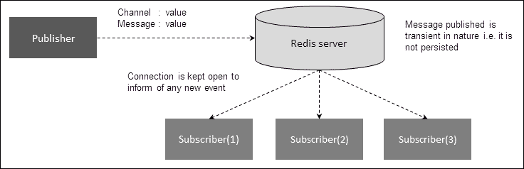
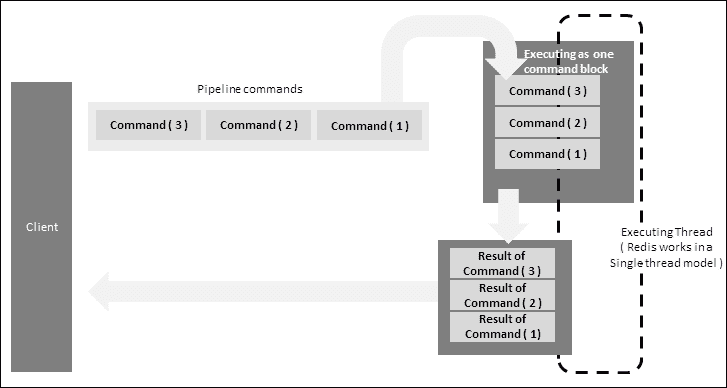
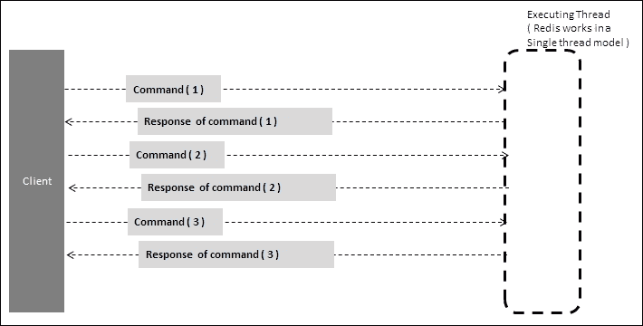
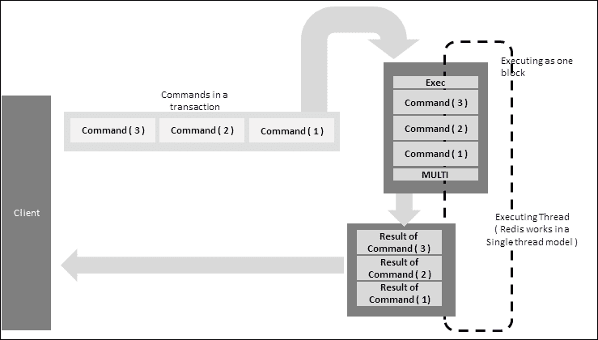
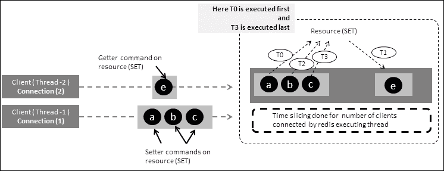
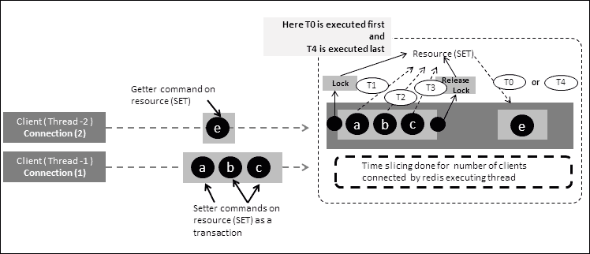
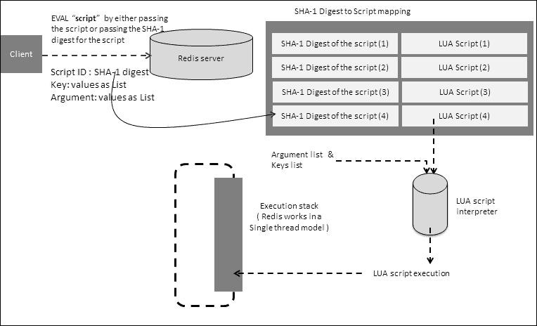
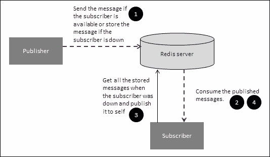
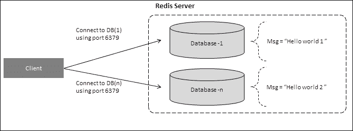

# 第四章：Redis 服务器中的功能

在前几章中，我们看到了 Redis 服务器的一些特性，使其成为键值 NoSQL。我们还看到 Redis 除了存储原始键值之外，还提供了以结构化方式存储数据的语义。这个特性使 Redis 在众多数据库中脱颖而出，因为大多数其他数据库（关系型数据库和其他 NoSQL）都没有提供程序员可以使用的接口。其他数据存储有固定的存储信息方式，如文档或映射，程序员必须将他们的数据转换为这些语义来保存信息。然而，在 Redis 中，程序员可以以与他们在程序中使用的相同语义存储信息，如映射，列表等。这种方式提供了更好更容易理解程序的方式。除此之外，Redis 提供了功能，使其不仅仅是一个数据存储，更像是一个框架构建者，或者换句话说，更像是一把瑞士军刀。在本章中，我们将探讨这些功能并试图理解它们。

以下是我们将讨论的功能：

+   实时消息传递（发布/订阅）

+   管道

+   事务

+   脚本

+   连接管理

# 实时消息传递（发布/订阅）

企业和社交媒体解决方案以类似的方式使用消息传递，从某种程度上说，这构成了任何框架或解决方案的支柱。消息传递还使我们能够拥有松散耦合的架构，其中组件通过消息和事件进行交互。Redis 提供了在组件之间进行实时消息传递的机制。与其他消息系统不同，Redis 中提供的消息模型的最大区别如下：

+   在传递消息后不会存储消息

+   如果客户端（订阅者）无法消费消息，则不会存储消息

与传统消息系统相比，这可能是一个缺点，但在数据实时重要且无需存储的情况下是有利的。消息始终按顺序发送。除此之外，Redis 消息系统简单易学，没有一些其他消息系统的多余内容。



Redis 的发布订阅模型

以下是 Redis 中可用于创建消息框架的命令：

+   `PUBLISH`：这将向给定的频道或模式发布消息。

此命令的时间复杂度由`O（N+M）`给出，其中`N`是订阅此频道的客户端数，`M`是客户端订阅的模式数。

+   `SUBSCRIBE`：这将订阅客户端以接收频道的消息。例如，如果客户端订阅了频道`news.headlines`，那么它将收到为`news.headlines`频道发布的任何消息。

此命令的时间复杂度由`O（N）`给出，其中`N`是客户端订阅的频道数。

+   `PSUBSCRIBE`：这将订阅客户端到模式名称与频道名称匹配的频道。例如，假设频道由以下名称注册：

+   `news.sports.cricket`

+   `news.sports.tennis`

然后，对于像`news.sports.*`这样的模式，订阅者将收到`news.sports.cricket`和`news.sports.tennis`频道的消息。

此命令的时间复杂度为`O（N）`，其中`N`是客户端订阅的模式数。

+   `PUBSUB`：这是一个命令，结合一些子命令，可以帮助了解 Redis 中注册的模式和频道的情况。

### 注意

这仅适用于 Redis 2.8.0 版本。Windows 版本的 Redis 基于 2.6 分支，不支持此命令。

其他与`PUBSUB`相关的命令，可帮助查找有关发布者和订阅者的信息，如下所示：

+   `PUBSUB CHANNELS [pattern]`：这列出当前活动的频道

+   `PUBSUB NUMSUB [channel]`：这将列出订阅指定频道的订阅者数量。

+   发布订阅 NUMPAT：这列出了对所有模式的订阅数量

+   `PUNSUBSCRIBE`：此命令取消订阅客户端的模式

+   `UNSUBSCRIBE`：此命令取消订阅客户端的频道

让我们使用 Jedis 编写一个简单的 Java 程序来演示一个简单的 PUB/SUB 程序。Jedis 公开了发布的接口，并且支持 Redis 的所有功能。订阅消息的接口有点棘手，因为订阅者在发布者发布消息之前应该处于就绪状态。这是因为如果订阅者不可用，Redis 无法存储消息。发布者的代码：`SubscriberProcessor.java`：

```go
package org.learningRedis.chapter.four.pubsub;
import Redis.clients.jedis.Jedis;
import Redis.clients.jedis.JedisPool;
import Redis.clients.jedis.JedisPoolConfig;
public class SubscriberProcessor implements Runnable{
  private JedisPool pool = new JedisPool(new JedisPoolConfig(), "localhost");
  private Subscriber subscriber = new Subscriber();
  private Thread simpleThread;
  private Jedis jedis = getResource();
  public Jedis getResource() {
    jedis = pool.getResource();
    return jedis;
  }
  public void setResource(Jedis jedis){
    pool.returnResource(jedis);
  }
  @SuppressWarnings("static-access")
  public static void main(String[] args) {
    SubscriberProcessor test = new SubscriberProcessor();
    test.subscriberProcessor();
    try {
      Thread.currentThread().sleep(10000);
    } catch (InterruptedException e) {
      e.printStackTrace();
    }
    test.unsubscribe();
  }
  private void unsubscribe() {
    simpleThread.interrupt();
    if(subscriber.isSubscribed()){
      subscriber.unsubscribe();
  }
  }
  private void subscriberProcessor() {
    simpleThread = new Thread(this);
    simpleThread.start();
  }
  @Override
  public void run() {
    while (!Thread.currentThread().isInterrupted()) {
      jedis.subscribe(subscriber, "news");
      //jedis.psubscribe(subscriber, "news.*");
    }
  }
}
```

订阅者处理器需要订阅一个频道。为此，它需要一个始终处于监听模式的实例。在此示例中，`Subscriber.java`是通过扩展 Jedis PUB/SUB 来实现的类。这个抽象类提供了管理订阅者生命周期的方法。接下来是提供必要钩子来订阅频道模式并监听频道或模式消息的代码。订阅模式的代码已被注释；要看到它的实际效果，我们需要取消注释它并注释订阅频道的代码：

```go
package org.learningRedis.chapter.four.pubsub;
import Redis.clients.jedis.JedisPubSub;
public class Subscriber extends  JedisPubSub{
  @Override
  public void onMessage(String arg0, String arg1) {
    System.out.println("on message : " + arg0 + " value = " + arg1);
  }
  @Override
  public void onPMessage(String arg0, String arg1, String arg2) {
    System.out.println("on pattern message : " + arg0 + " channel = " + arg1 + " message =" + arg2);
  }
  @Override
  public void onPSubscribe(String arg0, int arg1) {
    System.out.println("on pattern subscribe : " + arg0 + " value = " + arg1);
  }
  @Override
  public void onPUnsubscribe(String arg0, int arg1) {
    System.out.println("on pattern unsubscribe : " + arg0 + " value = " + arg1);
  }
  @Override
  public void onSubscribe(String arg0, int arg1) {
    System.out.println("on subscribe : " + arg0 + " value = " + arg1);
  }
  @Override
  public void onUnsubscribe(String arg0, int arg1) {
    System.out.println("on un-subscribe : " + arg0 + " value = " + arg1);
  }
}
```

在启动发布者发送消息到频道之前，最好先启动订阅者处理器，该处理器将监听发布到其订阅频道或模式的任何消息。在这种情况下，订阅者处理器将监听新闻频道或将订阅模式`[news.*]`。 

在这些示例中使用的一个常见类是连接管理器，其代码如下所示：

```go
package org.learningredis.chapter.four.pipelineandtx;
import redis.clients.jedis.Jedis;
import redis.clients.jedis.JedisPool;
public class ConnectionManager {
  private static JedisPool jedisPool = new JedisPool("localhost");
  public static Jedis get(){
    return jedisPool.getResource();
  }
  public static void set(Jedis jedis){
    jedisPool.returnResource(jedis);
  }
  public static void close(){
    jedisPool.destroy();
  }
}
```

要触发发布者，请使用以下发布者代码。发布者的代码`Publisher.java`如下：

```go
package org.learningRedis.chapter.four.pubsub;
import Redis.clients.jedis.Jedis;
import Redis.clients.jedis.JedisPool;
import Redis.clients.jedis.JedisPoolConfig;
public class Publisher {
  private JedisPool pool = new JedisPool(new JedisPoolConfig(), "localhost");
  Jedis jedis = null;
  public Jedis getResource() {
    jedis = pool.getResource();
    return jedis;
  }
  public void setResource(Jedis jedis){
    pool.returnResource(jedis);
  }
  private void publisher() {
    Jedis jedis = this.getResource();
    jedis.publish("news", "Houstan calling texas... message published !!");
  }
  public static void main(String[] args) {
    Publisher test = new Publisher();
    test.publisher();
  }
}
```

在此示例中，该代码将向名为`news`的频道发布消息，要查看其工作情况，请确保订阅者已准备就绪，并且要发布消息到模式，请注释发布到频道的代码，并取消注释发布消息到模式的代码。

# Redis 中的管道

Redis 提供了一种更快执行的机制，称为*管道*。它将所有命令组合成一个命令块，并将其发送到服务器进行执行。所有命令的结果都排队在一个响应块中并发送回来。

将管道工作方式与通过连接发送多个单独命令的方式进行比较，可以让我们了解管道更有效的地方以及需要使用管道的地方。假设我们必须向 Redis 发送三个命令的情况。发送任何命令到 Redis 的时间为*X*秒，因此发送响应需要相同的时间。去程和回程所花费的总时间为*2X*秒。还假设执行所需的时间为另外*X*秒。现在在管道命令中，由于我们将三个命令作为一个块发送，因此去 Redis 所需的时间约为*X*秒，处理所有三个命令所需的时间为*3X*秒，回程所需的时间也为*X*秒。管道命令所需的总时间为*5X*秒。将其与必须发送单独命令的情况进行比较。发送单个命令及其回程所需的时间等于*2X*，包括执行所需的时间为*3X*。由于我们谈论的是三个命令，因此总时间等于*9X*。与*5X*秒相比，*9X*秒的时间证明了它的效率。

我们必须记住的一件事是，管道确保原子性，但只执行多个命令并在一个响应块中返回响应。以下是管道中调用的命令的简单表示：



Redis 中的管道

接下来是跨多个连接发送的多个命令的表示。正如我们所看到的，通过使用管道命令，可以节省发送响应的时间：



在 Redis 中使用单独连接的多个命令

这种批量发送命令的方式在 RDBMS 中也可以看到，我们可以将批量 JDBC 作为*批处理*发送。为了验证这一点，让我们编写一个程序，并检查在使用管道和不使用管道运行程序之间的时间差异：

```go
package org.learningRedis.chapter.four.simplepipeline;
import java.util.List;
import Redis.clients.jedis.Jedis;
import Redis.clients.jedis.Pipeline;
public class PipelineCommandTest {
  Jedis jedis = ConnectionManager.get();
  long starttime_withoutpipeline = 0;
  long starttime_withpipeline = 0;
  long endtime_withoutpipeline = 0;
  long endtime_withpipeline = 0;
  public static void main(String[] args) throws InterruptedException {
    PipelineCommandTest test = new PipelineCommandTest();
    test.checkWithoutPipeline();
    Thread.currentThread().sleep(1000);
    test.checkWithPipeline();
    Thread.currentThread().sleep(1000);
    test.getStats();
  }
  private void getStats() {
    System.out.println(" time taken for test without pipeline "+ (endtime_withoutpipeline - starttime_withoutpipeline ));
    System.out.println(" time taken for test with    pipeline "+ (endtime_withpipeline - starttime_withpipeline ));
  }
  private void checkWithoutPipeline() {
    starttime_withoutpipeline = System.currentTimeMillis();
    for(int keys=0;keys<10;keys++){
      for(int nv=0;nv<100;nv++){
        jedis.hset("keys-"+keys, "name"+nv, "value"+nv);
      }
      for(int nv=0;nv<100;nv++){
        jedis.hget("keys-"+keys, "name"+nv);
      }
    }
    endtime_withoutpipeline = System.currentTimeMillis();
    // this will delete all the data.
    jedis.flushDB();
  }
  private void checkWithPipeline() {
    starttime_withpipeline = System.currentTimeMillis();
    for(int keys=0;keys<10;keys++){
      Pipeline commandpipe = jedis.pipelined();
      for(int nv=0;nv<100;nv++){
        commandpipe.hset("keys-"+keys, "name"+nv, "value"+nv);
      }
      List<Object> results = commandpipe.syncAndReturnAll();
      for(int nv=0;nv<results.size();nv++){
        results.get(nv);
      }
    }
    endtime_withpipeline = System.currentTimeMillis();
    jedis.flushDB();
  }
}
```

在我的计算机上的结果如下，当然，这可能会根据所使用的机器配置而有所不同：

```go
time taken for test without pipeline 4015
time taken for test with    pipeline 250
```

管道提供了更快执行的优势，但也带来了一些限制。这仅在目标 Redis 实例相同时有效，也就是说，在分片环境中不起作用，因为每个 Redis 实例的连接都是不同的。当命令不相互依赖或需要编写自定义逻辑以形成复合命令时，管道也存在不足。在这种情况下，Redis 还提供了一种*脚本*的机制，我们将在本章后面进行介绍。

# Redis 中的事务

作为 NOSQL 数据存储的 Redis 提供了一种宽松的事务。与传统的 RDBMS 一样，事务以`BEGIN`开始，以`COMMIT`或`ROLLBACK`结束。所有这些 RDBMS 服务器都是多线程的，因此当一个线程锁定资源时，除非释放了锁，否则另一个线程无法操作它。Redis 默认使用`MULTI`开始，`EXEC`执行命令。在事务中，第一个命令始终是`MULTI`，之后所有的命令都被存储，当接收到`EXEC`命令时，所有存储的命令都按顺序执行。因此，在内部，一旦 Redis 接收到`EXEC`命令，所有命令都将作为单个隔离的操作执行。以下是 Redis 中可用于事务的命令：

+   `MULTI`：这标志着事务块的开始

+   `EXEC`：这在`MULTI`之后执行管道中的所有命令

+   `WATCH`：这会监视键以条件执行事务

+   `UNWATCH`：这会移除事务的`WATCH`键

+   `DISCARD`：这会刷新管道中之前排队的所有命令

以下图表示了 Redis 中事务的工作原理：



Redis 中的事务

## 管道与事务

正如我们在管道中看到的，命令被分组并执行，并且响应被排队并发送。但是在事务中，直到接收到`EXEC`命令，`MULTI`之后接收到的所有命令都会被排队，然后执行。为了理解这一点，重要的是要考虑一个多线程环境，并观察结果。

在第一种情况下，我们使用两个线程向 Redis 发送管道命令。在这个示例中，第一个线程发送了一个管道命令，它将多次更改一个键的值，第二个线程将尝试读取该键的值。以下是将在 Redis 中启动两个线程的类：`MultiThreadedPipelineCommandTest.java`：

```go
package org.learningRedis.chapter.four.pipelineandtx;
public class MultiThreadedPipelineCommandTest {
  public static void main(String[] args) throws InterruptedException {
    Thread pipelineClient = new Thread(new PipelineCommand());
    Thread singleCommandClient = new Thread(new SingleCommand());
    pipelineClient.start();
    Thread.currentThread().sleep(50);
    singleCommandClient.start();
  }
}
The code for the client which is going to fire the pipeline commands is as follows:
package org.learningRedis.chapter.four.pipelineandtx;
import java.util.Set;
import Redis.clients.jedis.Jedis;
import Redis.clients.jedis.Pipeline;
public class PipelineCommand implements Runnable{
  Jedis jedis = ConnectionManager.get();
  @Override
  public void run() {
      long start = System.currentTimeMillis();
      Pipeline commandpipe = jedis.pipelined();
      for(int nv=0;nv<300000;nv++){
        commandpipe.sadd("keys-1", "name"+nv);
      }
      commandpipe.sync();
      Set<String> data= jedis.smembers("keys-1");
      System.out.println("The return value of nv1 after pipeline [ " + data.size() + " ]");
    System.out.println("The time taken for executing client(Thread-1) "+ (System.currentTimeMillis()-start));
    ConnectionManager.set(jedis);
  }
}
```

当执行管道时，用于读取键的客户端的代码如下：

```go
package org.learningRedis.chapter.four.pipelineandtx;
import java.util.Set;
import Redis.clients.jedis.Jedis;
public class SingleCommand implements Runnable {
  Jedis jedis = ConnectionManager.get();
  @Override
  public void run() {
    Set<String> data= jedis.smembers("keys-1");
    System.out.println("The return value of nv1 is [ " + data.size() + " ]");
    ConnectionManager.set(jedis);
  }
}
```

结果将根据机器配置而异，但通过更改线程休眠时间并多次运行程序，结果将与下面显示的结果类似：

```go
The return value of nv1 is [ 3508 ]
The return value of nv1 after pipeline [ 300000 ]
The time taken for executing client(Thread-1) 3718
```

### 注意

请在每次运行测试时执行`FLUSHDB`命令，否则您将看到上一次测试运行的值，即 300,000

现在我们将以事务模式运行示例，其中命令管道将以`MULTI`关键字开头，并以`EXEC`命令结尾。这个客户端类似于之前的示例，其中两个客户端在单独的线程中向 Redis 发送命令。

以下程序是一个测试客户端，它给两个线程，一个处于事务模式的命令，第二个线程将尝试读取和修改相同的资源：

```go
package org.learningRedis.chapter.four.pipelineandtx;
public class MultiThreadedTransactionCommandTest {
  public static void main(String[] args) throws InterruptedException {
    Thread transactionClient = new Thread(new TransactionCommand());
    Thread singleCommandClient = new Thread(new SingleCommand());
    transactionClient.start();
    Thread.currentThread().sleep(30);
    singleCommandClient.start();
  }
}
```

这个程序将尝试修改资源并在事务进行时读取资源：

```go
package org.learningRedis.chapter.four.pipelineandtx;
import java.util.Set;
import Redis.clients.jedis.Jedis;
public class SingleCommand implements Runnable {
  Jedis jedis = ConnectionManager.get();
  @Override
  public void run() {
    Set<String> data= jedis.smembers("keys-1");
    System.out.println("The return value of nv1 is [ " + data.size() + " ]");
    ConnectionManager.set(jedis);
  }
}
```

这个程序将以`MULTI`命令开始，尝试修改资源，以`EXEC`命令结束，并稍后读取资源的值：

```go
package org.learningRedis.chapter.four.pipelineandtx;
import java.util.Set;
import Redis.clients.jedis.Jedis;
import Redis.clients.jedis.Transaction;
import chapter.four.pubsub.ConnectionManager;
public class TransactionCommand implements Runnable {
  Jedis jedis = ConnectionManager.get();
  @Override
  public void run() {
      long start = System.currentTimeMillis();
      Transaction transactionableCommands = jedis.multi();
      for(int nv=0;nv<300000;nv++){
        transactionableCommands.sadd("keys-1", "name"+nv);
      }
      transactionableCommands.exec();
      Set<String> data= jedis.smembers("keys-1");
      System.out.println("The return value nv1 after tx [ " + data.size() + " ]");
    System.out.println("The time taken for executing client(Thread-1) "+ (System.currentTimeMillis()-start));
    ConnectionManager.set(jedis);
  }
}
```

上述程序的结果将根据机器配置而有所不同，但通过更改线程休眠时间并运行程序几次，结果将与下面显示的结果类似：

```go
The return code is [ 1 ]
The return value of nv1 is [ null ]
The return value nv1 after tx [ 300000 ]
The time taken for executing client(Thread-1) 7078
```

### 注意

每次运行测试时都要执行`FLUSHDB`命令。这个想法是程序不应该获取由于上一次运行程序而获得的值。单个命令程序能够写入键的证据是如果我们看到以下行：`返回代码是[1]`。

让我们分析一下结果。在管道的情况下，一个单独的命令读取该键的值，而管道命令则为该键设置一个新值，如下结果所示：

```go
The return value of nv1 is [ 3508 ]
```

现在将这与在事务的情况下发生的情况进行比较，当一个单独的命令尝试读取值但因事务而被阻塞时。因此该值将是`NULL`或 300,000。

```go
  The return value of nv1 after tx [0] or
  The return value of nv1 after tx [300000] 
```

因此，输出结果的差异可以归因于在事务中，如果我们已经开始了`MULTI`命令，并且仍在排队命令的过程中（也就是说，我们还没有给服务器`EXEC`请求），那么任何其他客户端仍然可以进来并发出请求，并且响应将发送给其他客户端。一旦客户端发出`EXEC`命令，那么所有其他客户端在所有排队的事务命令执行时都会被阻止。

## 管道和事务

为了更好地理解，让我们分析一下在管道的情况下发生了什么。当两个不同的连接向 Redis 请求相同的资源时，我们看到了一个结果，即客户端-2 在客户端-1 仍在执行时获取了该值：



Redis 中的管道在多连接环境中

它告诉我们的是，来自第一个连接的请求（即管道命令）被堆叠为一个命令在其执行堆栈中，而来自另一个连接的命令则保留在其自己的与该连接相关的堆栈中。Redis 执行线程在这两个执行堆栈之间进行时间切片，这就是为什么当客户端-1 仍在执行时，客户端-2 能够打印一个值的原因。

让我们分析一下在事务的情况下发生了什么。同样，两个命令（事务命令和`GET`命令）被保留在它们自己的执行堆栈中，但当 Redis 执行线程给予`GET`命令时间并去读取值时，看到锁定，它被禁止读取值并被阻塞。Redis 执行线程再次回到执行事务命令，然后再次回到`GET`命令，它再次被阻塞。这个过程一直持续，直到事务命令释放了对资源的锁定，然后`GET`命令才能获取值。如果`GET`命令碰巧在事务锁定之前能够到达资源，它会得到一个空值。

请记住，Redis 在排队事务命令时不会阻止其他客户端的执行，但在执行它们时会阻止。



Redis 多连接环境中的事务

这个练习让我们了解了在管道和事务的情况下会发生什么。

# Redis 中的脚本编写

**Lua**是一种性能优越的脚本语言，解释器是用 C 编写的。Redis 提供了一种机制，通过在服务器端提供对 Lua 的支持来扩展 Redis 的功能。由于 Redis 是用 C 实现的，因此 Lua 作为服务器附加组件与 Redis 一起提供是很自然的。随 Redis 一起提供的 Lua 解释器具有有限的功能，并且随其一起提供以下库：

+   `base`库

+   `table`库

+   `string`库

+   `math`库

+   `debug`库

+   `cjson`库

+   `cmsgpack`库

### 注意

不能执行文件 I/O 和网络操作的库未包含在内，因此无法从 REDIS 中的 LUA 脚本向另一个外部系统发送消息。

在开始有趣的事情之前，最好先了解一下这种语言。LUA 有自己专门的网站，并且有大量资源可供 LUA 使用，但下一节专注于了解 Redis 的 LUA 的足够内容。

# Lua 简介

好了，到目前为止，我们都知道 LUA 是一种解释性语言，并且它在 Redis 中得到了支持。为了利用 Redis 的功能，让我们学习一些关于 LUA 的东西。LUA 中支持的类型和值如下：

+   **Nil**：Nil 是具有单个值*nil*的类型。将其与 Java 进行比较，可以将其视为*null*。

+   **布尔值**：这些将具有 true 或 false 作为值。

+   **数字**：这些表示双精度浮点数。因此，我们可以将我们的数字写为 1、1.1、2e+10 等。

+   **字符串**：这些表示字符序列，与大多数脚本和编程语言中的常见情况相同。在 LUA 中，字符串是不可变的；例如，``"Learning Redis"``和`'Learning Redis'`。LUA 提供了字符串库中的方法来查找子字符串，替换字符等。

+   **表**：这些类似于可以使用数字和字符串索引的数组，除了*nil*。

LUA 中的控制语句和循环如下：

+   `if then else`语句：与 Java 中的`if`/`else`类似，LUA 支持类似`if`/`then`/`else`的形式。以下是其代码示例：

```go
local  myvariable = 4
local  myothervariable = 5
if myvariable >  myothervariable then
  print("4 is greater than 5".."Please add 2 dots to concatenate strings")
else
  print("4 is not greater than 5".."Please add 2 dots to concatenate strings")
end
```

+   `while`循环：这类似于 Java 中的循环，其语法类似：

```go
local index=1
while index <= 5 do
  print("Looping done interation "..index)
  index=index+1
end
```

+   `repeat`语句：这类似于 Java 中的`do`/`while`。这将保证至少进行一次迭代：

```go
local index=1
repeat
  print("Looping done interation "..index)
  index=index+1
until index==5 
```

+   `for`循环：这类似于 Java 中的`for`循环：

```go
for i=1,3 do
  print("Looping in for loop ")
end
```

在执行控制语句时，LUA 中经常使用的两个关键字是`return`和`break`。以下是一个简单的示例，演示了在函数中使用 return 关键字：

```go
function greaterThanFunction( i , j )
  if i >  j then
    print(i.." is greater than"..j)
    return true
  else
    print(i.." is lesser than"..j)
    return false
  end
end
print(greaterThanFunction(4,5))
```

接下来是一个简单的示例，演示了在函数中使用 break 关键字：

```go
local mylist={"start","pause","stop","resume"}
function parseList ( k )
  for i=1,#mylist do
    if mylist[i] == "stop" then break end
    print(mylist[i])
  end
end
print(parseList(mylist))
```

有了对 LUA 工作原理的最基本理解，让我们在 Redis 中运行一个示例，然后继续深入了解。但在此之前，让我们了解一下 LUA 在 Redis 中的工作原理。

以下图描述了 LUA 如何与 Redis 一起工作。要了解内部发生的事情，重要的是要记住 Redis 以单线程模型工作，所有 Redis 命令和 LUA 逻辑都将按顺序执行：



Redis 中的 LUA 脚本

当客户端将脚本发送到 Redis 服务器时，脚本会被验证其语法，并存储在 Redis 内部映射中与 SHA-1 摘要对应。SHA-1 摘要会返回给客户端。

让我们尝试在 LUA 中编写一个简单的程序，基本上是读取一个键的值，并检查该值是否等于传递的参数。如果是，则将其设置为传递的第二个参数，否则将其设置为传递给脚本的第三个参数。好的，让我们准备测试环境。打开 Redis 命令行客户端，并将`msg`键的值设置为``"Learning Redis"``：


准备测试执行 LUA 脚本

现在`msg`的值已设置好，让我们执行以下列出的 Java 程序：

```go
package org.learningRedis.chapter.four.luascripting;
import java.util.Arrays;
import Redis.clients.jedis.Jedis;
import Redis.clients.jedis.JedisPool;
import Redis.clients.jedis.JedisPoolConfig;
public class TestLuaScript {
  public String luaScript = Reader.read("D:\\path\\of\\file\\location\\LuaScript.txt");
  private JedisPool pool = new JedisPool(new JedisPoolConfig(), "localhost");
  Jedis jedis = null;
  public Jedis getResource() {
    jedis = pool.getResource();
    return jedis;
  }
  public void setResource(Jedis jedis){
    pool.returnResource(jedis);
  }
  public static void main(String[] args) {
    TestLuaScript test = new TestLuaScript();
    test.luaScript();
  }
  private void luaScript() {
    Jedis jedis = this.getResource();
    String result = (String) jedis.eval(luaScript,Arrays.asList("msg"),
        Arrays.asList("Learning Redis",
            "Now I am learning Lua for Redis",
            "prepare for the test again"));
    System.out.println(result);
    this.setResource(jedis);
  }
}
```

`Reader`的代码是一个简单的 Java 程序，它从文件位置读取程序：

```go
package org.learningRedis.chapter.four.luascripting;
import java.io.BufferedReader;
import java.io.FileReader;
import java.io.IOException;
public class Reader {
  public static String read(String filepath) {
    StringBuffer string = new StringBuffer();
    try (BufferedReader br = new BufferedReader(new FileReader(filepath)))
    {
      String currentline;
      while ((currentline = br.readLine()) != null) {
        string.append(currentline);
      }
    } catch (IOException e) {
      e.printStackTrace();
    } 
    return string.toString();
  }
}
```

现在让我们看一下写在文件`LuaScript.txt`中的 LUA 脚本，我们将把它传递给 Java 程序：

```go
local data= Redis.call('GET',KEYS[1])
if data==ARGV[1] then 
  Redis.call('SET',KEYS[1],ARGV[2])
  return "The value that got sent is = "..ARGV[2]
else
  Redis.call('SET',KEYS[1],ARGV[3])
  return "The value that got sent is = "..ARGV[3]
end
```

程序的第一次运行应该给您以下结果：

```go
The value that got sent is = Now I am learning Lua for Redis
```

程序的第二次运行应该给您以下结果：

```go
The value that got sent is = prepare for the test again
```

因此，如果您看到如前面的代码中所示的消息打印，那么您实际上已成功在 Redis 中执行了您的第一个 LUA 程序。以下是我们从这个示例中学到的内容：

+   Redis 将 LUA 脚本视为一个函数。

+   LUA 脚本使用`Redis.call()`方法来触发 Redis 命令。

+   返回值的 Redis 命令可以赋值给本地变量。在这里，我们将值赋给一个名为`data`的变量。

+   LUA 中的数组从`1`开始索引，而不是`0`。因此，您永远不会有数组索引，比如`ARGV[0]`或`KEYS[0]`。

Redis 对 Lua 脚本引擎施加了一些进一步的限制，如下所示：

+   在 Redis 中，LUA 脚本不能有全局变量。

+   在 Redis 中，LUA 脚本不能调用诸如`MULTI`或`EXEC`之类的事务命令。

+   在 Redis 中，LUA 脚本不能使用 LUA 中的 I/O 库访问外部系统。它与外部系统通信的唯一方式是通过诸如`PUBLISH`之类的 Redis 命令。

+   不支持通过 LUA 访问系统时间的脚本。而是使用`TIME`命令，即`Redis.call('TIME')`。

+   诸如`Redis.call('TIME')`之类的函数是非确定性的，因此在`WRITE`命令之前不允许使用。

+   不允许嵌套条件，因为嵌套条件将以`END`关键字结束，这会影响外部条件，外部条件也必须以`END`结束。

以下命令支持在 Redis 中管理 LUA 脚本。让我们来看看它，并了解它们如何使用：

+   `EVAL`：此命令将处理 Redis 脚本，并响应将是执行脚本的结果。

+   `EVALSHA`：此命令将根据脚本的 SHA-1 摘要处理缓存的脚本，并响应将是执行脚本的结果。

+   `SCRIPT EXISTS`：此命令将检查脚本在脚本缓存中的存在。通过传递脚本的 SHA-1 摘要来进行此检查。

+   `SCRIPT FLUSH`：这将从脚本缓存中清除 LUA 脚本。

+   `SCRIPT KILL`：此命令将终止执行时间较长的脚本。

+   `SCRIPT LOAD`：此命令将加载脚本到缓存中，并返回脚本的 SHA-1 摘要。

## 用例 - 可靠的消息传递

通过使用 Redis 的 PUB/SUB 功能，我们可以创建一个实时消息传递框架，但问题是，如果预期的订阅者不可用，那么消息就会丢失。为了解决这个问题，我们可以借助 LUA 脚本来存储消息，如果订阅者不可用。

这个实现将根据解决方案的框架设计而有所不同，但在我们的情况下，我们将采取一种简单的方法，即每个订阅者和发布者都将就一个频道达成一致。当订阅者下线时，发布者将把消息存储在一个唯一的消息框中，以便订阅者再次上线时，它将开始消费丢失的消息，以及来自发布者的实时消息。以下图表示了我们将要遵循的步骤以实现可靠的消息传递：



简单可靠的消息传递

首先，发布者将向频道 client-1 发送消息，不知道订阅者是否处于接收模式。假设订阅者正在运行，则发布者的消息将实时消耗。然后，如果我们将订阅者关闭一段时间并发布更多消息，在我们的情况下，发布者将足够智能，以知道订阅者是否正在运行，并且感知到订阅者已关闭，它将在`MSGBOX`中存储消息。

与此同时，订阅者运行起来后，它将首先从`MSGBOX`中获取错过的消息，并将其发布给自己。发布者的代码如下：

```go
package org.learningRedis.chapter.four.pubsub.reliable;
import java.util.Arrays;
import Redis.clients.jedis.Jedis;
import Redis.clients.jedis.JedisPool;
import Redis.clients.jedis.JedisPoolConfig;
import org.learningRedis.chapter.four.luascripting.Reader;
public class Publisher {
  public String luaScript = Reader.read("D:\\pathtoscript \\RELIABLE-MSGING.txt");
  private JedisPool pool = new JedisPool(new JedisPoolConfig(), "localhost");
  Jedis jedis = null;
  public Jedis getResource() {
    jedis = pool.getResource();
    return jedis;
  }
  public void setResource(Jedis jedis){
    pool.returnResource(jedis);
  }
  public static void main(String[] args) {
    Publisher test = new Publisher();
    test.sendingAreliableMessages();
  }
  private void sendingAreliableMessages() {
    Jedis jedis = this.getResource();
    String result = (String) jedis.eval(luaScript,Arrays.asList(""),
        Arrays.asList("{type='channel',publishto='client1',msg='"+System.currentTimeMillis()+"'}"));
    System.out.println(result);
    this.setResource(jedis);
  }
}
```

LUA 脚本的代码如下：

```go
local payload = loadstring("return"..ARGV[1])()
local result = Redis.call("PUBLISH",payload.publishto,payload.msg)
if result==0 then
  Redis.call('SADD','MSGBOX',payload.msg)
  return 'stored messages:  '..ARGV[1]
else
  return 'consumed messages:  '..ARGV[1]
end
```

以下是 LUA 中编写的步骤的简要解释：

1.  在第一行中，我们获取消息并将其转换为表对象。在 LUA 中，数组索引从`1`开始。

1.  我们在第二行中发布消息并获取结果。结果告诉我们有多少订阅者消费了消息。

1.  如果结果等于`0`，则所有侦听器都已关闭，我们需要将其持久化。此处使用的数据类型是`Set`，随后将消息返回给服务器（此返回是可选的）。

1.  如果消息被订阅者消费，则执行`Else`中的语句。

1.  最后，我们`end`函数。（确保脚本中只有一个`end`。如果有多个`end`，Redis 中的 LUA 将无法编译。）

Redis 将在 LUA 中将代码包装为一个函数。`Subscriber`的代码如下：

```go
package org.learningRedis.chapter.four.pubsub.reliable;
import java.util.Arrays;
import java.util.Set;
import java.util.concurrent.ArrayBlockingQueue;
import java.util.concurrent.BlockingQueue;
import org.learningRedis.chapter.four.luascripting.Reader;
import Redis.clients.jedis.Jedis;
import Redis.clients.jedis.JedisPubSub;
import chapter.four.pubsub.ConnectionManager;
public class SimpleMsgSubscriber {
  static Thread lostMsgWorker;
  static Thread msgWorker;
  public static void main(String[] args) {
    SimpleMsgSubscriber source = new SimpleMsgSubscriber();
  msgWorker = new Thread(source.new MsgProcessor());
lostMsgWorker = new Thread(source.new LostMsgProcessor());
  msgWorker.start();
lostMsgWorker.start();
  }
public class MsgProcessor extends JedisPubSub implements Runnable {
Jedis jedis = ConnectionManager.get();
@Override
public void run() {
  jedis.subscribe(this, "client1");
}
@Override
public void onMessage(String arg0, String arg1) {
  System.out.println("processing the msg = " + arg1);
}
@Override
public void onPMessage(String arg0, String arg1, String arg2) {
    }
@Override
public void onPSubscribe(String arg0, int arg1) {
    }
@Override
public void onPUnsubscribe(String arg0, int arg1) {
     }
@Override
public void onSubscribe(String arg0, int arg1) {
    }
@Override
public void onUnsubscribe(String arg0, int arg1) {
    }
  }
public class LostMsgProcessor implements Runnable {
    Jedis jedis = ConnectionManager.get();
    @Override
    public void run() {
      String event;
      Jedis jedis = ConnectionManager.get();
      String msg;
      while((msg=jedis.spop("MSGBOX")) != null){
        MessageHandler.push(msg);
      }
    }
  }
  public static class MessageHandler {
    static Jedis jedis = ConnectionManager.get();
        public static void push(String msg)
        {
            String luaScript = "";
            try
            {
                luaScript = read("D:\\path\\to\\file\\RELIABLE-MSGING.txt");
            }
            catch (IOException e)
            {
                e.printStackTrace();
            }
            String result = (String) jedis.eval(luaScript, Arrays.asList(""), Arrays.asList("{type='channel',publishto='client1',msg='" + msg + "'}"));
        }
        private static String read(String luaScriptPath) throws IOException
        {
            Path file = Paths.get(luaScriptPath);
            BufferedReader reader = Files.newBufferedReader(file, Charset.defaultCharset());
            StringBuilder content = new StringBuilder();
            String line = null;
            while ((line = reader.readLine()) != null)
            {
                content.append(line).append("/n");
            }
            System.out.println("Content: " + content.toString());
            return content.toString();
        }
  }
}
```

该程序有以下职责，并对程序进行了简要解释：

+   启动时应检查是否有消息在消息框中，例如`MSGBOX`，当它关闭时。如果有消息，则其工作是将其发布给自己。

+   它应该做的第二件事是监听其订阅的消息。

+   为了获得更好的性能，运行`SCRIPT LOAD`命令，该命令将加载脚本并返回 SHA-1 摘要，而不是使用`EVAL`，使用`EVALSHA`命令，其中传递相同的 SHA-1 摘要。这将防止脚本被检查语法正确性，并将直接执行。

# 连接管理

在本节中，我们将重点关注如何管理与 Redis 的连接。Redis 中提供的连接管理功能帮助我们执行以下操作：

+   `AUTH`：此命令允许请求在密码匹配配置的密码时被处理。Redis 服务器可以在`config`文件中配置`requirepass`以及密码。

+   `ECHO`：此命令将回显发送到 Redis 实例的文本。

+   `PING`：当发送到 Redis 实例时，此命令将回复`PONG`。

+   `QUIT`：此命令将终止 Redis 实例为客户端持有的连接。

+   `SELECT`：此命令有助于在 Redis 中选择要执行命令的数据库。Redis 中的数据可以有关注点的分离，通过创建一个筒仓并将数据存储在其中来实现。每个筒仓中的数据不会相互干扰，而是被隔离的。

## Redis 身份验证

通过 Redis 客户端向 Redis 服务器添加简单密码，并通过 Java 客户端进行测试，具体步骤如下所述：

1.  打开 Redis 客户端并键入`CONFIG SET requirepass "Learning Redis"`。您已将 Redis 服务器的密码设置为`"Learning Redis"`。

1.  使用 Jedis 在 Java 中编写以下程序，该程序将在不对 Redis 服务器进行身份验证的情况下执行一些简单的 getter 和 setter：

```go
package org.learningRedis.chapter.four.auth;
import Redis.clients.jedis.Jedis;
public class TestingPassword {
  public static void main(String[] args) {
    TestingPassword test = new TestingPassword();
    test.authentication();
  }
  private void authentication() {
    Jedis jedis = new Jedis("localhost");
    jedis.set("foo", "bar");
    System.out.println(jedis.get("foo"));
  }
}
```

1.  控制台中的结果将是`ERR operation not permitted`，或者根据版本，您可能会得到`NOAUTH Authentication required`，这表明由于未在请求中传递密码，无法允许操作。为使程序工作，客户端需要传递密码进行身份验证：

```go
package org.learningRedis.chapter.four.auth;
import Redis.clients.jedis.Jedis;
public class TestingPassword {
  public static void main(String[] args) {
    TestingPassword test = new TestingPassword();
    test.authentication();
  }
  private void authentication() {
    Jedis jedis = new Jedis("localhost");
    jedis.auth("Learning Redis");
    jedis.set("foo", "bar");
    System.out.println(jedis.get("foo"));
  }
}
```

控制台中程序的结果将是`bar`。

## Redis SELECT

Redis 提供了一种将 Redis 服务器分隔成数据库的机制。在一些数据库中，Redis 没有复杂的命名机制，而是有一个简单的过程将数据库分成单独的键空间，每个键空间由一个整数表示。



Redis 中的多个数据库

该程序试图将一些数据存储在数据库中，并尝试成功地从中检索数据。然后更改数据库并尝试检索相同的数据，这当然会以失败告终。请记住，为了使此代码运行，请删除之前程序中设置的任何身份验证，或者只需重新启动 Redis 服务器。

```go
package org.learningRedis.chapter.four.selectdb;
import Redis.clients.jedis.Jedis;
public class TestSelectingDB {
  public static void main(String[] args) {
    TestSelectingDB test = new TestSelectingDB();
    test.commandSelect();
  }
  private void commandSelect() {
    Jedis jedis = new Jedis("localhost");
    jedis.select(1);
    jedis.set("msg", "Hello world");
    System.out.println(jedis.get("msg"));
    jedis.select(2);
    System.out.println(jedis.get("msg"));
  }
}
```

该程序的结果应该如下所示：

```go
Hello world
null
```

## Redis ECHO 和 PING

Redis 提供了一些实用功能，比如`ECHO`和`PING`，可以用来检查服务器是否响应，以及响应请求所花费的时间。这可以让我们了解网络和 I/O 级别的延迟。

以下程序将演示一个示例用法，当服务器没有其他连接时，将触发`ECHO`和`PING`命令，然后当 Redis 服务器承受 100 个连接的负载时，再次触发这些命令（`ECHO`和`PING`）。没有其他连接时的结果如下：

```go
PONG in 47 milliseconds
hi Redis  in 0 milliseconds
PONG in 0 milliseconds
hi Redis  in 0 milliseconds
PONG in 0 milliseconds
hi Redis  in 0 milliseconds
PONG in 0 milliseconds
hi Redis  in 0 milliseconds
```

当服务器上有 100 个其他连接在进行活动时，结果如下：

```go
PONG in 16 milliseconds
hi Redis  in 16 milliseconds
PONG in 0 milliseconds
hi Redis  in 15 milliseconds
PONG in 16 milliseconds
hi Redis  in 0 milliseconds
PONG in 15 milliseconds
```

当服务器上有 50 个其他连接在进行活动时，结果如下：

```go
PONG in 15 milliseconds
hi Redis  in 0 milliseconds
PONG in 0 milliseconds
hi Redis  in 16 milliseconds
PONG in 0 milliseconds
hi Redis  in 0 milliseconds
PONG in 16 milliseconds
hi Redis  in 0 milliseconds
PONG in 0 milliseconds
hi Redis  in 15 milliseconds
```

这证明了 Redis 服务器的活动量并不重要，而取决于 I/O 和网络资源的可用性。以下程序仅供参考：

```go
package org.learningRedis.chapter.four.echoandping;
import Redis.clients.jedis.Jedis;
public class TestEchoAndPing {
  public static void main(String[] args) throws InterruptedException {
    TestEchoAndPing echoAndPing = new TestEchoAndPing();
    Thread thread = new Thread(new LoadGenerator());
    thread.start();
    while(true){
      Thread.currentThread().sleep(1000);
      echoAndPing.testPing();
      echoAndPing.testEcho();
    }
  }
  private void testPing() {
    long start = System.currentTimeMillis();
    Jedis jedis = new Jedis("localhost");
    System.out.println(jedis.ping() + " in " + (System.currentTimeMillis()-start) + " milliseconds");
  }
  private void testEcho() {
    long start = System.currentTimeMillis();
    Jedis jedis = new Jedis("localhost");
    System.out.println(jedis.echo("hi Redis ") + " in " + (System.currentTimeMillis()-start) + " milliseconds");
  }
}
```

`LoadGenerator`的代码如下所示，仅供参考：

```go
package org.learningRedis.chapter.four.echoandping;
import java.util.ArrayList;
import java.util.List;
import Redis.clients.jedis.Jedis;
public class LoadGenerator implements Runnable{
  List<Thread> clients = new ArrayList<Thread>();
  public LoadGenerator() {
    for(int i=0;i<50;i++){
      clients.add(new Thread(new Sample()));
    }
  }
  @Override
  public void run() {
    for(int i=0;i<50;i++){
      clients.get(i).start();
    }
  }
  public class Sample implements Runnable{
    Jedis jedis = new Jedis("localhost");
    @Override
    public void run() {
      int x=0;
      while(!Thread.currentThread().isInterrupted()){
        jedis.sadd(Thread.currentThread().getName(), "Some text"+new Integer(x).toString());
        x++;
      }
    }
  }
}
```

我们可以通过更改线程数量并在`TestEchoAndPing`中注释线程启动代码来玩弄这个程序，并自己看到结果。结果将显示与前面代码中显示的一致性。

# 总结

在本章中，我们看到了如何使用 Redis，不仅仅作为数据存储，还可以作为管道来处理命令，这更像是批量处理。除此之外，我们还涵盖了事务、消息传递和脚本等领域。我们还看到了如何结合消息传递和脚本，并在 Redis 中创建可靠的消息传递。这使得 Redis 的能力与其他一些数据存储解决方案不同。在下一章中，我们将专注于 Redis 的数据处理能力。
