# 第五章。在 Redis 中处理数据

业务中的数据定义了业务。这意味着我们定义、存储、解释和使用数据的方式构成了我们业务的数据平台。很少有单独的数据具有意义；只有当与其他数据结合时，它才构成业务功能。因此，重要的是将数据连接、分组和过滤，以便同一数据集可以用于业务的各个方面。

为了拥有一个能够满足未来需求的平台，我们有必要以一种方式定义和分类数据，这种方式能够给我们指示我们对数据的期望。数据有许多方面，重要的是要了解这些方面，以从中提取出完整的商业价值。例如，公司的股票价格对于实时系统来说很重要，以决定是买入还是卖出，在几秒或几毫秒后就失去了重要性。然而，对于分析系统来说，预测其趋势变得重要。因此，在不同的时间点上，相同的数据具有不同的用途。因此，在制定数据架构时，考虑数据的各种期望是一个良好的做法。

# 分类数据

人们普遍倾向于只考虑适合关系模型的数据模型。这可能是某些类别数据的良好模型，但对于另一类数据可能会证明是无效的。由于本书是关于 Redis 的，我们将尝试根据某些行为对数据进行分类，并尝试看看 Redis 适用于哪些情况：

+   **消息和事件数据**：在业务中分类为消息数据的数据具有以下特性：

+   **数据复杂性**：消息数据具有低数据复杂性，因为它们通常是扁平结构的

+   **数据数量**：消息数据通常具有大量数据

+   **持久性**：消息数据可以存储在磁盘和内存中

+   **CAP 属性**：消息数据至少需要可用和分区容错

+   **可用性**：消息数据可以在实时、软实时和离线中使用，并显示出重写入和低读取的特性

如果消息数据的需求是实时和软实时活动，并且数据量不是很大，那么可以使用 Redis 及其消息传递能力。

+   **缓存数据**：在业务中分类为缓存数据的数据具有以下特性：

+   **数据复杂性**：缓存数据具有低数据复杂性，大多以名称值对的形式存储

+   **数据数量**：缓存数据通常具有较少到中等的数据量

+   **持久性**：数据可以存储在缓存内存中

+   **CAP 属性**：缓存数据至少需要可用和一致

+   **可用性**：缓存数据可以在实时中使用，并显示低写入和高读取

Redis 是缓存数据的完美选择，因为它提供了可以直接被程序用于存储数据的数据结构。此外，Redis 中的键具有生存时间选项，可以用于定期清理 Redis 中的数据。

+   **元数据**：在业务中分类为元数据的数据具有以下特性：

+   **数据复杂性**：元数据具有低数据复杂性，大多以名称值对的形式存储

+   **数据数量**：元数据通常具有较少的数据量

+   **持久性**：元数据可以存储在内存中

+   **CAP 属性**：元数据至少需要可用和一致

+   **可用性**：元数据可以在实时中使用，并且通常显示出低写入和低到高读取的特性

Redis 是元数据的完美选择，因为它提供了可以直接被程序用于存储数据的数据结构。由于 Redis 速度快且具有消息传递能力，因此可以用于运行时操作元数据，并且还可以作为中央元数据存储库。以下图表示了 Redis 如何作为元数据存储使用：

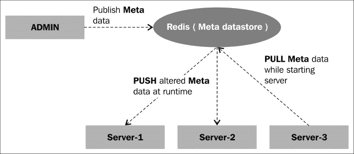

Redis 作为元数据存储

+   **事务数据**：在业务中分类为事务数据的数据显示以下属性：

+   **数据复杂性**：事务数据具有中等到高的数据复杂性，大多是关系型的

+   **数据量**：事务数据通常具有中等到高的数据量

+   **持久性**：事务数据可以存储在内存和磁盘中

+   **CAP 属性**：事务数据至少需要是一致的和分区容错的

+   **可用性**：事务数据需要显示`CRUD`行为，而 Redis 没有这些功能

Redis 不是这种类型数据的正确数据存储。我们还可以看到，无论何时需要 CAP 特性的分区容错，都不应该使用 Redis。

+   **分析数据**：在业务中分类为分析数据的数据显示以下属性：

+   **数据复杂性**：数据复杂性可以根据在线分析和离线分析进一步分离。在线分析数据的数据复杂性低至中等，因为它们可能包含类似图形的关系。离线分析具有非常高的数据复杂性。

+   **数据量**：这里的数据通常具有低到高的数据量，取决于我们想要的分析类型。与离线分析相比，在线分析的数据量可能较低。

+   **持久性**：数据可以存储在磁盘和内存中。如果需要在线分析，则数据存储在内存中，但如果分析是离线的，则数据需要持久存储在磁盘中。

+   **CAP 属性**：在离线分析的情况下，数据至少需要是可用的和分区容错的，在在线分析的情况下，数据需要是可用的和一致的。

+   **可用性**：消息数据可以在实时、软实时和离线中使用。

如果要进行在线分析，可以使用 Redis，前提是数据的复杂性较低。

在前面对数据的分类中，我们看到了 Redis 适合的一些领域以及应该避免使用 Redis 的领域。但是，要使 Redis 在业务解决方案环境中受到认真对待，它必须具备容错和故障管理、复制等能力。在接下来的部分中，我们将深入研究如何处理冗余和故障管理。

# 主从数据复制

在任何业务应用程序中，数据以复制的方式保存是至关重要的，因为硬件随时可能损坏而不会发出任何警告。为了保持业务的连续性，当主数据库崩溃时，可以使用复制的数据库，这在某种程度上保证了服务的质量。拥有复制数据的另一个优势是当一个数据库的流量增加并且对解决方案的性能产生负面影响时。为了提供性能，重要的是要平衡流量并减少每个节点的负载。

诸如 Cassandra 之类的数据存储提供了主-主配置，其中拓扑中的所有节点都像主节点一样，并且数据的复制是基于基于密钥生成的令牌哈希进行的，为了实现这一点，拓扑中的节点根据令牌范围进行分区。

与主主数据存储系统不同，Redis 具有更简单的主从安排。这意味着主节点将写入所有数据，然后将数据复制到所有从节点。复制是异步进行的，这意味着一旦数据被写入主节点，从节点并不会同步写入，而是由一个单独的过程异步写入，因此更新并不是立即的；换句话说是**最终一致性**。但是这种安排在性能方面有优势。如果复制是同步的，那么当对主节点进行更新时，主节点必须更新所有从节点，然后更新才会被标记为成功。因此，如果有更多的从节点，更新就会变得更加耗时。

下图表示了 Redis 中主从复制的过程。为了更好地理解这个过程，假设在时间**T0**，由**Msg**表示的 Set 的值在主节点以及所有从节点（**S1**，**S2**，**S3**）中都是**"Hello"**。在时间**T1**进行插入命令**SADD**插入值（**"Hello again"**）到 Set 中，那么在时间**T2**，值**Msg**变成了**Hello Hello again**，但是从节点的**Msg**值仍然是**"Hello"**。新值成功插入到主节点，并且成功插入的回复代码被发送回客户端。与此同时，主节点将开始向所有从节点插入新值，这发生在时间**T3**。因此，在时间**T3**，所有节点（主节点和从节点）都更新为新值。主节点更新和从节点更新之间的时间差非常小（毫秒级）。

为了更好地理解 Redis 中主从是如何工作的，让我们回顾一下之前讨论的 Redis 中实时消息传递的章节。为了在这种情况下应用相同的功能，我们可以认为所有的从节点都已经订阅了主节点，当主节点更新时，它会将新数据发布到所有的从节点。

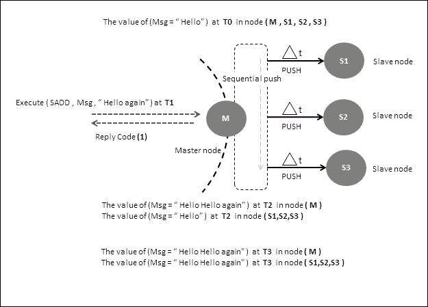

主从数据复制

那么，当从节点宕机并且主节点发生更新时会发生什么呢？在这种情况下，特定的从节点会错过更新，仍然保留旧值。然而，当从节点再次连接到主节点时，它首先会向主节点发送一个`SYNC`命令。这个命令将数据发送到从节点，从而使其更新自身。

## 设置主节点和从节点

在 Redis 中设置主从节点非常简单。我们在本地机器上为 Redis 设置一个主节点和一个从节点。我们首先要做的是将 Redis 文件夹（在我们的例子中是`redis 2.6`）复制到一个合适的位置。现在我们在两个不同的位置有了 Redis 分发。

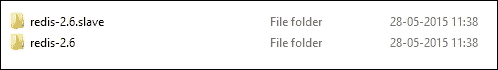

主节点文件夹和从节点文件夹

为了更好地理解，我们将**Redis-2.6**称为主节点，**Redis-2.6.slave**称为从节点。现在打开主节点，转到`bin/release`文件夹并启动 Redis-server。这将在本地主机上以端口地址 6379 启动 Redis 服务器。现在打开从节点，并在适当的文本编辑器中打开`Redis.conf`文件。至少需要更改两个属性才能启动从节点。需要编辑的第一个属性是`port`。在我们的情况下，让我们将值从 6379 更改为 6380。由于主节点将在 6379 端口监听请求，从节点必须在不同的端口监听请求（我们将从同一台机器上启动主节点和从节点）。需要进行的第二个属性更改是`slaveof`，其值将是`127.0.0.1 6379`。这基本上告诉从节点主节点在何处以及在哪个端口运行。这很有帮助，因为从节点将使用此地址向主节点发送`SYNC`和其他命令。进行这些最小更改后，我们就可以开始了。现在转到从节点的`bin/release`文件夹并启动 Redis-server。

### 注意

当启动 Redis-server 时，请提供从节点的`Redis.conf`路径，即 Redis-server `F:\path\to\config-file\Redis.conf`。

当我们启动从节点时，我们会看到的第一件事是它会尝试连接到主节点。从其`Redis.conf`中，从节点将找出主节点的主机和端口。Redis 与其他数据存储相比的另一件事是，它使用一个端口来处理业务请求，同时还使用`SYNC`和其他端口来处理从节点的类似请求。这主要是因为 Redis 是单线程服务器，线程只监听传入套接字的消息。

以下图表示从节点启动时命令提示符的外观（请确保主节点正在运行）：

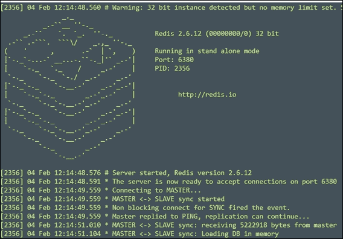

从节点在端口 6380 启动

这里有几件事需要注意。第一件事是，从节点启动时，它会向主节点发送`SYNC`命令。该命令是非阻塞命令，这意味着单个线程不会阻止其他请求以满足此请求。主要是主节点将其放入该连接的请求堆栈中，并将其与其他连接的时间片进行切割，当该连接的命令活动完成时（在我们的情况下是从节点的`SYNC`），它将其发送到从节点。在这种情况下，它发送回的是命令和从节点需要的数据，以使其与主节点保持一致。该命令与数据一起执行，然后随后加载到从节点的数据库中。主节点发送的所有命令都是更改数据而不是获取数据的命令。主用于连接到从节点的协议是**Redis 协议**。

让我们看一些场景，并看看 Redis 在主从模式下的行为：

+   主节点正在运行，telnet 会话连接到主节点：

1.  确保 Redis 主节点正在运行。

1.  确保主 Redis 客户端正在运行。

1.  打开命令提示符，并使用命令`telnet 127.0.0.1 6379`连接到主机。

1.  在 telnet 客户端中键入`SYNC`命令。命令提示符中应出现以下文本：

主节点 ping telnet 客户端

1.  转到主客户端提示符，并键入命令`SET MSG "Learning Redis master slave replication"`并执行它。立即切换到 telnet 命令提示符，您将看到以下输出：

主节点向 telnet 客户端发送数据

1.  现在在主节点的客户端提示符中执行`GET MSG`命令

+   主节点已启动，从节点首次连接：

1.  从节点控制台与上一图类似。

1.  从主节点的 Redis-cli 中发出命令`SET MSG "学习 Redis"`。

1.  从从节点的 Redis-cli 中发出命令`GET MSG`。

1.  确保您提供主机和端口地址；在我们的情况下，因为我们已将其配置为 localhost 并且端口配置为 6380，命令看起来像`Redis-cli.exe -h localhost -p 6380`。

1.  结果应该是`“学习 Redis”`。

+   主节点已启动，从节点再次连接：

1.  杀死从节点和客户端。

1.  转到主节点的客户端命令提示符并编写命令`SET MSG "从节点已关闭"`。

1.  现在启动从节点及其客户端（提供主机和端口信息）。

1.  从从节点的客户端命令提示符执行命令`GET MSG`，结果应该是`“从节点已关闭”`。

+   主节点已启动并正在执行管道命令，我们正在从从节点读取值：

1.  确保主节点和从节点正在运行。

1.  在从节点客户端的命令提示符中写入`SCARD MSG`命令，但不要执行它。我们将得到集合`MSG`中成员的数量。

1.  打开您的 Java 客户端并编写以下程序：

```go
package org.learningRedis.chapter.five;
import Redis.clients.jedis.Jedis;
import Redis.clients.jedis.Pipeline;
public class PushDataMaster {
          public static void main(String[] args) {
            PushDataMaster test = new PushDataMaster();
            test.pushData();
          }
          private void pushData() {
            Jedis jedis = new Jedis("localhost",6379);
            Pipeline pipeline = jedis.pipelined();
for(int nv=0;nv<900000;nv++){
              pipeline.sadd("MSG", ",data-"+nv);
            }
            pipeline.sync();
          }
}
```

1.  执行此命令，立即切换到从节点客户端命令提示符并执行您编写的命令。结果将类似于下图所示。它告诉我们的是，当在更改数据集的主节点中执行命令时，主节点开始缓冲这些命令并将它们发送到从节点。在我们的情况下，当我们对集合执行`SCARD`时，我们以递增的方式看到结果。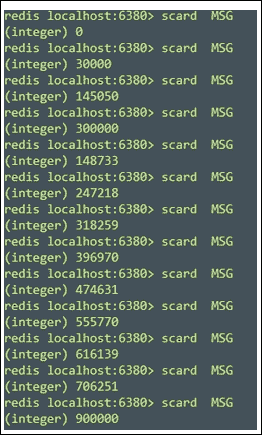

从节点上`SCARD`命令的结果

1.  主节点已启动，并正在执行事务命令，我们正在从从节点读取值。

+   当主节点关闭并重新启动为从节点时提升从节点为主节点：

1.  启动主节点和从节点 Redis 服务器。

1.  从您的 IDE 执行以下 Java 程序：

```go
package org.learningRedis.chapter.five.masterslave;
import Redis.clients.jedis.Jedis;
public class MasterSlaveTest {
  public static void main(String[] args) throws InterruptedException {
    MasterSlaveTest test = new MasterSlaveTest();
    test.masterslave();
  }
  private void masterslave() throws InterruptedException {
    Jedis master = new Jedis("localhost",6379);
    Jedis slave = new Jedis("localhost",6380);
    master.append("msg", "Learning Redis");
    System.out.println("Getting message from master: " + master.get("msg"));
    System.out.println("Getting message from slave : " + slave.get("msg"));
    master.shutdown();
    slave.slaveofNoOne();
    slave.append("msg", " slave becomes the master");
    System.out.println("Getting message from slave turned master : " + slave.get("msg"));
    Thread.currentThread().sleep(20000);
    master = new Jedis("localhost",6379);
    master.slaveof("localhost", 6380);
    Thread.currentThread().sleep(20000);
    System.out.println("Getting message from master turned slave : " + master.get("msg"));
    master.append("msg", "throw some exceptions !!");
  }
}
```

1.  当程序第一次进入睡眠状态时，快速转到主节点的命令提示符并重新启动它（不要触摸从节点）。允许程序完成，输出将类似于以下图像：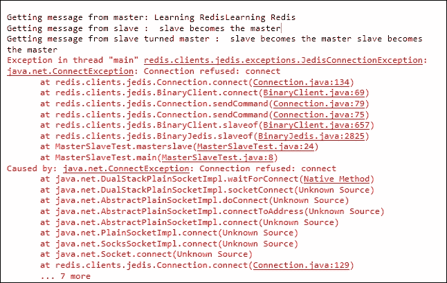

主节点变为从节点，从节点变为主节点

1.  程序中的第二次睡眠是为了主节点与新主节点同步。

1.  当旧主节点尝试写入密钥时，它会失败，因为从节点无法写入。

1.  服务器消息，旧奴隶成为新主人时。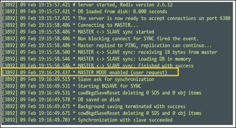

从奴隶变成主人

1.  旧主节点作为新从节点启动时的服务器消息。我们还可以看到，旧主节点重新启动时，作为从节点的第一件事是与新主节点同步并更新其数据集。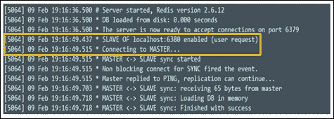

主节点变为从节点

1.  如果在程序中不给第二次睡眠，旧主节点将没有时间与新主节点同步，如果有客户端请求一个密钥，那么它将最终显示密钥的旧值

到目前为止，我们已经了解了 Redis 的主从能力以及在主节点关闭或从节点关闭时它的行为。我们还讨论了主节点向从节点发送数据并复制数据集。但问题仍然是，当 Redis 主节点必须向从节点发送数据时，它发送了什么？为了找出答案，让我们进行一个小实验，这将澄清幕后的活动。

### 性能模式 - 高读取

在生产环境中，当并发性高时，拥有某种策略变得很重要。采用复制模式肯定有助于在环境中分发负载。在这种模式中遵循的复制模式是向主节点写入并从从节点读取。

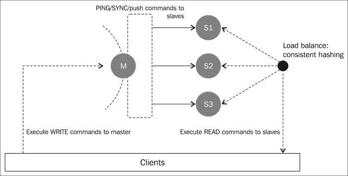

主节点和从节点中的复制策略

我们将运行的示例不会是之前提到的解决方案的正确复制，因为主节点和从节点将从同一台机器（我的笔记本电脑）运行。通过在同一台机器上运行主节点和从节点，我们利用了共同的内存和处理能力。此外，客户端程序也使用相同的资源。但仍然会观察到差异，因为服务器 I/O 在两个不同的端口上发生，这意味着至少有两个独立的服务器线程（Redis 是单线程服务器）处理读取请求时绑定到两个独立的套接字内存。

在生产环境中，最好是每个节点都在自己的核心上工作，因为 Redis 无法利用多核。

在这个示例中，我们将使用一个主节点和两个从节点。在第一个用例中，我们将使用主节点写入数据，并使用从节点读取数据。我们将记录仅读取所需的总时间，并将其与完全在主节点上进行读取的情况进行比较。

为了准备示例，我们需要准备环境，以下图表简要描述了这个示例的设置应该是什么。在这里请注意，所有资源都来自一台单独的机器：

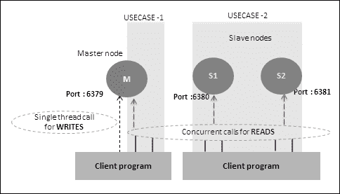

示例设置

以下编写的程序可以适应之前讨论过的两种情况。要在**USECASE-1**模式下工作（从主节点写入并从主节点读取），请调用以下函数：

1.  在第一次运行中调用`test.setup()`。

1.  在第二次运行中调用`test.readFromMasterNode()`

1.  请注释以下函数调用，这将不允许**USECASE-2**运行`// test.readFromSlaveNodes();`。

要在**USECASE-2**模式下工作（从主节点写入并从两个从节点读取），请调用以下函数，但在此之前，执行`FLUSHDB`命令清理数据，或者不执行`test.setup();`函数：

1.  在第一次运行中调用`test.setup();`（可选）。

1.  在第二次运行中调用`test.readFromSlaveNodes();`

1.  请注释以下函数调用，这将不允许**USECASE-1**运行`// test.readFromMasterNode();`。

代码有三个简单的类，类的简要描述如下：

+   `MasterSlaveLoadTest`：这个类具有以下特点：

+   这是主类

+   这个类协调**USECASE-1**和**USECASE-2**的流程

+   这个类负责为**USECASE-1**和**USECASE-2**创建线程

+   以下是`MasterSlaveLoadTest`的代码：

```go
package org.learningRedis.chapter.five.highreads;
import java.util.ArrayList;
import java.util.List;
import Redis.clients.jedis.Jedis;
public class MasterSlaveLoadTest {
  private List<Thread> threadList = new ArrayList<Thread>();
  public static void main(String[] args) throws InterruptedException {
    MasterSlaveLoadTest test = new MasterSlaveLoadTest();
    test.setup();
//make it sleep so that the master finishes writing the //values in the datastore otherwise reads will have either //null values
//Or old values.
    Thread.currentThread().sleep(40000); 
    test.readFromMasterNode();
    test.readFromSlaveNodes();
  }
  private void setup() {
    Thread pumpData = new Thread(new PumpData());
    pumpData.start();
  }
  private void readFromMasterNode() {
    long starttime = System.currentTimeMillis();
    for(int number=1;number<11;number++){
      Thread thread = new Thread(new FetchData(number,starttime,"localhost",6379));
      threadList.add(thread);
    }
    for(int number=0;number<10;number++){
      Thread thread =threadList.get(number);
      thread.start();
    }
  }
  private void readFromSlaveNodes() {
    long starttime0 = System.currentTimeMillis();
    for(int number=1;number<6;number++){
      Thread thread = new Thread(new FetchData(number,starttime0,"localhost",6381));
      threadList.add(thread);
    }
    long starttime1 = System.currentTimeMillis();
    for(int number=6;number<11;number++){
      Thread thread = new Thread(new FetchData(number,starttime1,"localhost",6380));
      threadList.add(thread);
    }
    for(int number=0;number<10;number++){
      Thread thread =threadList.get(number);
      thread.start();
    }
  }
}
```

+   `PumpData`：这个类具有以下特点：

+   这个类负责将数据推送到主节点

+   数据推送是单线程的

+   `PumpData`的代码如下：

```go
package org.learningRedis.chapter.five.highreads;
import Redis.clients.jedis.Jedis;
public class PumpData implements Runnable {
  @Override
  public void run() {
    Jedis jedis = new Jedis("localhost",6379);
    for(int index=1;index<1000000;index++){
      jedis.append("mesasge-"+index, "my dumb value "+ index);
    }
  }
}
```

+   `FetchData`：这个类具有以下特点：

+   这个类负责从 Redis 节点中获取数据

+   这个类以多线程模式调用

+   这个类在启动时传递，因此返回的最后结果将指示执行所花费的总时间

+   `FetchData`的代码如下：

```go
package org.learningRedis.chapter.five.highreads;
import Redis.clients.jedis.Jedis;
import Redis.clients.jedis.JedisPool;
public class FetchData implements Runnable {
  int endnumber  = 0;
  int startnumber= 0;
  JedisPool jedisPool = null;
  long starttime=0;
  public FetchData(int number, long starttime, String localhost, int port) {
    endnumber   = number*100000;
    startnumber = endnumber-100000;
    this.starttime = starttime;
    jedisPool = new JedisPool(localhost,port);
  }
  @Override
  public void run() {
    Jedis jedis = jedisPool.getResource();
    for(int index=startnumber;index<endnumber;index++){
      System.out.println("printing values for index = message"+index+" = "+jedis.get("mesasge-"+index));
      long endtime = System.currentTimeMillis();
      System.out.println("TOTAL TIME" + (endtime-starttime));
    }
  }
}
```

+   运行前面的程序几次，并取出最好和最差的记录，然后取出平均结果。在我运行的迭代中，我得到了以下结果：

+   对于 USECASE-1，平均时间为 95609 毫秒

+   对于 USECASE-2，平均时间为 72622 毫秒

+   尽管在您的机器上结果可能不同，但结果将是相似的。这清楚地表明从从节点读取并写入主节点明显更好。

### 性能模式 - 高写入

在生产环境中，当对写入的并发需求很高时，有一种策略变得很重要。复制模式确实有助于在环境中分发负载，但是当对写入的并发需求很高时，仅有复制模式是不够的。此外，在 Redis 中，从节点无法进行写入。为了使数据库中的数据写入高并发，重要的是在环境中将数据集分片到许多数据库节点上。许多数据库都具有内置的能力，可以根据需要在节点之间分片数据。除了写入的高并发性外，将数据集分片的优势在于提供部分故障容忍的机制。换句话说，即使其中一个节点宕机，它将使其中包含的数据不可用，但其他节点仍然可以处理它们持有的数据的请求。

作为数据库，Redis 缺乏在许多节点之间分片数据的能力。但是可以在 Redis 之上构建某种智能，来完成分片的工作，从而实现对 Redis 的高并发写入。整个想法是将责任从 Redis 节点中移出，并保留在一个单独的位置。

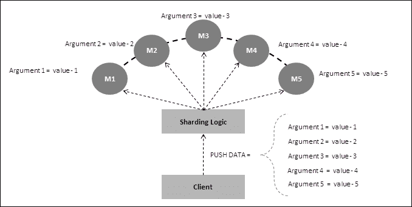

基于分片逻辑在节点之间分发数据

可以在 Redis 之上构建各种逻辑，用于分发写入负载。逻辑可以基于循环轮询，其中数据可以在顺序排列的节点上分发；例如，数据将会先到**M1**，然后到**M2**，然后到**M3**，依此类推。但是这种机制的问题在于，如果其中一个节点宕机，循环轮询逻辑无法考虑到丢失的节点，它将继续向有问题的节点发送数据，导致数据丢失。即使我们构建逻辑来跳过有问题的节点并将数据放入后续的节点，这种策略将导致该节点拥有自己的数据份额，并且有问题的节点的数据将迅速填满其内存资源。

一致性哈希是一种算法，可以在节点之间平均分发数据时非常有用。基本上，我们根据算法生成一个哈希，将密钥平均分布在整个可用的 Redis 服务器集合中。

Java 的 Redis 客户端已经内置了一致性哈希算法来分发写入。具体如下：

```go
package org.learningRedis.chapter.five.sharding;
import java.util.ArrayList;
import java.util.List;
import org.apache.commons.pool.impl.GenericObjectPool.Config;
import Redis.clients.jedis.Jedis;
import Redis.clients.jedis.JedisSentinelPool;
import Redis.clients.jedis.JedisShardInfo;
import Redis.clients.jedis.ShardedJedis;
import Redis.clients.jedis.ShardedJedisPool;
public class MyShards {
  List<JedisShardInfo> shards = new ArrayList<JedisShardInfo>();
  public static void main(String[] args) {
    MyShards test = new MyShards();
    test.setup();
    test.putdata();
  }
  private void setup() {
    JedisShardInfo master0 = new JedisShardInfo("localhost", 6379);
    JedisShardInfo master1 = new JedisShardInfo("localhost", 6369);
    shards.add(master0);
    shards.add(master1);
  }
  private void putdata() {
    ShardedJedisPool pool = new ShardedJedisPool(new Config(), shards);
    for(int index=0;index<10;index++){
      ShardedJedis jedis = pool.getResource();
      jedis.set("mykey"+index, "my value is " + index);
      pool.returnResource(jedis);
    }
    for(int index=0;index<10;index++){
      ShardedJedis jedis = pool.getResource();
      System.out.println("The value for the key is "+ jedis.get("mykey"+index));
      System.out.println("The following information is from master running on port : " + jedis.getShardInfo("mykey"+index).getPort());
      pool.returnResource(jedis);
    }
  }
}
```

# Redis 中的持久化处理

Redis 提供了各种持久化数据的选项。这些机制有助于决定我们的数据需要什么样的持久化模型，这完全取决于我们想要在 Redis 中存储的数据类型。Redis 中有四种选项：

+   通过 RDB 选项进行持久化

+   通过 AOF 选项进行持久化

+   通过 AOF 和 RDB 选项的组合进行持久化

+   根本不进行持久化

让我们运行一个简单的程序，看看持久化机制的重要性，因为只有这样我们才能意识到持久化的重要性。按照步骤操作，亲自看看缺乏持久化会导致数据丢失：

1.  启动 Redis 服务器。

1.  打开 Redis 客户端命令提示符。

1.  执行命令`SET msg 'temporary value'`。

1.  手动快速关闭 Redis 服务器，可以在 Linux 中使用**Kill-9**选项，也可以在 Windows 的命令提示符中使用**close**选项。

1.  重新启动 Redis 服务器。

1.  执行命令`get msg`。

没有持久化处理的 msg

## 通过 RDB 选项进行持久化

**Redis 数据库文件**（**RDB**）是 Redis 服务器在定期间隔内持久化数据集的选项，换句话说，定期间隔内在内存中对数据进行快照。该格式是一个单一的、非常紧凑的文件，对于保留数据作为备份非常有用。在灾难发生时，该文件可以充当救命稻草，因此非常重要。Redis 服务器可以配置为在各种间隔内拍摄快照。从性能的角度来看，这种持久化数据的方式将导致更高的性能，因为 Redis 服务器将 fork 一个子进程以非阻塞的方式执行此操作。另一个优点是，由于 RDB 文件中仅存储数据集，因此在 RDB 文件的情况下，服务器的启动非常快。但是，将数据集存储在 RDB 中也有其缺点，因为如果 Redis 在两个快照之间失败，可能会发生数据丢失的可能性。如果数据集的体积非常大，可能会出现另一个问题，因为在这种情况下，Redis 服务器的 fork 子进程将花费时间来加载数据，而这段时间可能会阻塞客户端请求。在生产场景中，这个问题不会出现，因为服务器重新启动和服务器处理客户端请求之间总是有时间差的。从硬件的角度来看，具有更快处理器的机器总是可以解决问题的。

### 为 RDB 持久性配置 Redis

在这里，我们将学习如何将数据持久化到 RDB 文件中。在 Redis 中，可以通过编辑`Redis.conf`文件或通过客户端提示来配置 RDB 持久性机制。当我们打开我们的`Redis.conf`文件并转到`快照`部分时，我们会看到以下选项：

+   `Save 900 1`：如果一个键已更改，则在 15 分钟内保存

+   `Save 300 10`：如果 10 个键已更改，则在 5 分钟内保存

+   `Save 60 10000`：如果有 10,000 个键已更改，则在 1 分钟内保存

除了这些预配置的选项之外，我们还可以通过调整`Redis.conf`文件中的值来添加我们自己的选项。客户端还可以用于在运行时为数据集快照添加配置。例如，`CONFIG SET SAVE "900 2 300 10"`将设置快照为`如果 2 个键已更改，则在 15 分钟内保存`，`如果一个键已更改，则在 10 分钟内保存`，这将覆盖先前的值。

让我们运行一个简单的程序，就像之前的程序一样，我们会看到由于缺乏持久性而导致的数据丢失，我们将配置 Redis 以具有持久性机制：

1.  启动您的 Redis 服务器。

1.  打开一个 Redis 客户端命令提示符。

1.  执行命令`Set msg 'temp value'`。

1.  快速手动关闭 Redis 服务器，可以通过 Linux 中的**Kill-9**选项或 Windows 命令提示符中的**close**选项。

1.  重新启动您的 Redis 服务器。

1.  执行命令`get msg`。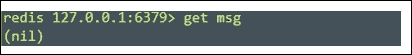

没有持久性处理的获取 msg

1.  现在执行命令`CONFIG SET SAVE "60 1"`，这告诉 Redis 服务器，如果一个键已更改，则在一分钟内保存数据。

1.  执行命令`Set msg 'temp value'`。

1.  等待一分钟或去拿您最喜欢的饮料。

1.  关闭服务器。

1.  重新启动您的 Redis 服务器。

1.  打开一个新的客户端连接并执行命令`get msg`，将显示如下内容：

获取 msg RDB 持久性处理

1.  您也可以使用`save`命令，而不是等待一分钟，该命令将立即将内存中的数据推送到 RDB 文件中。

1.  将您需要注意的参数为了将数据持久化到 RDB 文件中，如下所示：

+   `dbfilename`：给出您的 RDB 文件的名称

+   `dir`：只给出 RDB 文件的路径

+   `rdbchecksum yes`：这是默认值，它在文件末尾添加 CRC64 校验和，以使其抵抗损坏，但在服务器重新启动时会有轻微的性能损失

### 使用 RDB 持久性的用例

Redis 可以在数据是无状态的情况下配置 RDB 持久化机制。我想要传达的是，如果数据是一条信息，与之前存储的数据或即将存储的数据没有关系，那么它就是 RDB 持久化的完美候选者。此外，关系可以是序列、时间、排名等，或者数据本身可以包含状态信息。例如，存储的数据是`START`、`PAUSE`、`RESUME`和`STOP`。在这种情况下，如果我们在快照期间丢失`PAUSE`或`RESUME`等数据，那么可能会使整个系统变得不稳定。

让我们来看一个使用情况，网站记录用户在浏览会话中访问的 URL。这些数据被分析以对用户行为进行个人资料化，以便为用户提供更好的服务。在这种情况下，访问的页面的 URL 与之前存储的数据或将来存储的数据没有关系，因此它没有状态。因此，即使在两个快照之间发生故障，如果丢失了一些数据，也不会影响整体分析。

另一个可以使用 RDB 持久化的使用情况是当我们想要将 Redis 用作缓存引擎时，数据写入较少，而数据读取非常频繁。

## 通过 AOF 选项进行持久化

**追加文件**（**AOF**）是在 Redis 数据存储中存储数据的持久机制。启用 AOF 后，Redis 将追加所有写入数据集的命令和相关数据，因此当 Redis 服务器重新启动时，它将重建数据集到正确的状态。这种持久性模式在存储具有状态的数据时非常有用。这是因为当我们进行状态管理或者数据集与状态相关联时，在服务器关闭的情况下，存储在内存中的信息（状态信息）将会丢失。这反过来会导致某种状态不匹配。假设我们有一条信息处于状态 A，并且随后对该信息进行的活动将其状态从 A 变为 B，从 B 变为 C，依此类推。现在从用户的角度来看，最后的状态变化将信息带入了 D 状态，这个状态原则上应该在内存中，并且在服务器关闭（崩溃）的情况下，信息将会丢失，因此状态变化信息 D 也将会丢失。因此，当服务器重新启动时，如果用户将该信息的状态更改为 E，状态变化历史将看起来像 A 到 B，B 到 C，C 到 E。在某些情况下，这可能导致数据损坏。AOF 持久化方式解决了由此可能引起的问题。

### 配置 Redis 进行 AOF 持久化

可以通过更改`Redis.conf`文件来启用 AOF。需要将属性`appendonly`设置为`yes`。通过将其设置为 true，我们告诉 Redis 记录写命令和数据到一个文件中，当服务器重新启动时，它将重新加载这些数据，使其恢复到关闭之前的状态。

Redis 提供了三种策略来缓解由不一致状态引起的问题。第一种策略是记录 AOF 文件中的每个写入事件。这种机制是最安全的，但性能不是很好。可以通过`appendfsync always`来实现这一点。

第二种机制是基于时间的，我们指示 Redis 服务器缓冲每个写入命令，并安排每秒进行一次 AOF 追加。这种技术更有效，因为它是每秒发生一次，而不是在每次写入时。可以通过告诉 Redis`appendfsync everysec`来实现这一点。在这种机制中，状态丢失的可能性非常小。

第三种机制更像是一种委托，其中将附加控制权交给底层操作服务器，以将写命令从缓冲区刷新到 AOF 文件。附加的频率是每隔几秒一次（在基于 Linux 的机器上，频率接近每 30 秒一次）。这种技术的性能是最快的，因为这是每 30 秒发生一次。然而，在这种机制中，数据丢失的机会和数量也很高。可以通过告诉 Redis `appendfsync no` 来实现这种附加方式。

让我们运行一个简单的程序，就像之前的程序一样，其中由于缺乏持久性而导致数据丢失，我们将配置 Redis 以具有 AOF 持久性机制：

1.  启动 Redis 服务器。

1.  打开 Redis 客户端命令提示符。

1.  执行命令`Set msg 'temp value'`。

1.  快速手动关闭 Redis 服务器，可以在 Linux 中使用**Kill-9**选项，或者在 Windows 命令提示符中使用**close**选项。

1.  重新启动 Redis 服务器。

1.  执行命令`get msg`。

没有持久性处理的获取消息

1.  打开您的`Redis.conf`文件，转到`APPEND ONLY MODE`部分，并将`appendonly no`更改为`appendonly yes`。

1.  取消注释`appendfilename appendonly.aof`属性。在这里，您可以选择提供自己的名称，但默认名称是`appendonly.aof`。

1.  将附加机制更改为`appendfsync always`。

1.  使用以下参数启动 Redis 服务器 `--appendonly yes --appendfilename C:\appendonly.aof`（如果不想在`Redis.conf`文件中进行更改，则使用此技术）。

1.  执行命令`Set msg 'temp value'`。

1.  快速手动关闭 Redis 服务器，可以在 Linux 中使用**Kill-9**选项，或者在 Windows 命令提示符中使用**close**选项。

1.  使用以下参数重新启动 Redis 服务器 `--appendonly yes --appendfilename C:\appendonly.aof`（如果不想在`Redis.conf`文件中进行更改，则使用此技术）。

1.  执行命令`get msg`。

使用 AOF 持久性处理获取消息

1.  从`C:\appendonly.aof`打开文件并查看以下内容：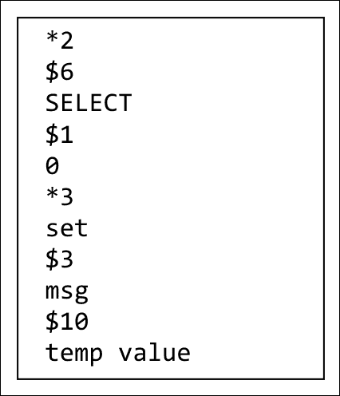

打开`appendonly.aof`

这里可以观察到的一件事是，没有记录`get`命令，因为它们不会改变数据集。需要记住的一个问题是，如果写入非常频繁，那么 AOF 文件将变得越来越大，服务器重新启动将需要更长的时间。

### 使用 AOF 持久性的用例

Redis 可以配置为在数据是有状态时具有 AOF 持久性机制。我想在这里传达的是，如果数据是与之前存储的数据有关，或者下一个要存储的数据与之有关，那么它就成为 AOF 持久性的完美候选者。假设我们正在构建一个工作流引擎，其中每个状态都负责下一个状态；在这种情况下，使用 AOF 持久性是最佳选择。

# Redis 中的数据集处理命令

我们已经看到客户端程序使用的命令，要么设置数据，要么获取 Redis 中的数据，但是还有一些有用的命令需要处理 Redis 作为数据存储。这些命令有助于在生产环境中维护 Redis，并且通常是 Redis 管理的领域。由于这些命令对 Redis 中存储的数据产生影响，因此在执行它们时应该小心。以下是一些命令：

+   `FLUSHDB`：此命令删除所选数据库中的所有键（及其保存的数据）。正如我们所见，在 Redis 中，我们可以创建一个更像是 SILO 的数据库，可以以分离的方式存储数据（更像是关注点的分离）。此命令永远不会失败。

+   `FLUSHALL`：此命令删除 Redis 节点中所有数据库中的所有键。此命令永远不会失败。

+   `监视器`：这个命令是一个调试命令，它传递了 Redis 服务器正在处理的所有命令。您可以使用 Redis-cli 或 telnet 来监视服务器正在执行的操作。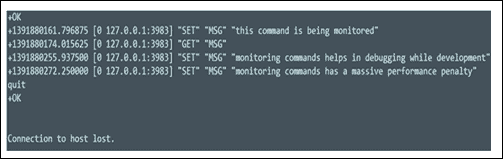

使用 telnet 监视命令

在这里，我们使用 telnet 来监视 Redis 服务器，并且客户端发出的任何命令都会在这里复制。监视命令可以让我们深入了解 Redis 的工作方式，但会有性能损失。您可以使用此命令来监视从节点。

+   `SAVE`：这是一个同步阻塞调用，将内存中的所有数据保存到 RDB 文件中。在生产环境中，应谨慎使用此命令，因为它会阻塞每个客户端命令并执行此任务。

+   `BGSAVE`：这个命令更像是后台保存。之前的`SAVE`命令是一个阻塞调用，但是这个命令不会阻塞客户端调用。通过发出这个命令，Redis 会 fork 另一个进程，该进程开始在后台持久化数据到 RDB 文件中。发出此命令会立即返回`OK`代码，但客户端可以通过发出`LASTSAVE`命令来检查结果。让我们尝试一个小例子，看看它是否有效：

1.  启动 Redis 服务器和一个客户端。

1.  从客户端执行`LASTSAVE`命令；在我的情况下，它显示的值是整数**1391918354**，但在您的情况下可能显示不同的时间。

1.  打开您的 telnet 提示符并执行`MONITOR`命令（这是故意为了减缓 Redis 服务器的性能）。

1.  打开您的 Java 编辑器，并输入以下程序，它将向 Redis 服务器插入大量值：

```go
package org.learningRedis.chapter.five;
import Redis.clients.jedis.Jedis;
public class PushLotsOfData {
  public static void main(String[] args) {
    PushLotsOfData test = new PushLotsOfData();
    test.pushData();
  }
  private void pushData() {
    Jedis jedis = new Jedis("localhost",6379);
    for(int nv=0;nv<900000;nv++){
      jedis.sadd("MSG-0", ",data-"+nv);
    }
  }
}
```

1.  在客户端提示符中，我发出了以下命令，结果如下：

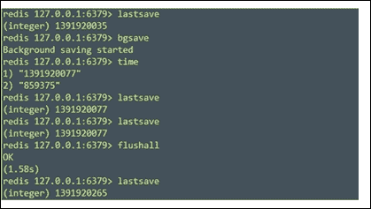

检查 BGSAVE 的非阻塞特性

我在`BGSAVE`命令之后发出了`TIME`命令，但当我发出`LASTSAVE`时，我得到的时间比`BGSAVE`命令晚。所以我们可以得出结论，`BGSAVE`是一种非阻塞保存数据的方式。由于`FLUSHALL`命令操作整个数据集，它在执行后会自动调用`SAVE`命令。查看`LASTSAVE`命令，显示时间为**1391920265**，以及在`FLUSHALL`之前的上一个`LASTSAVE`，显示时间为**1391920077**，证明了`FLUSHALL`确实进行了保存。

+   `LASTSAVE`：这个命令类似于`BGSAVE`命令，它显示了数据上次持久化到 RDB 文件的时间。

+   `SHUTDOWN SAVE`/`NOSAVE`：这个命令基本上退出服务器，但在这之前会关闭整个客户端集合的连接并执行一个阻塞保存，然后如果启用了 AOF，会刷新 AOF。

+   `DBSIZE`：返回数据库中键的数量。

+   `BGREWRITEAOF`：这指示 Redis 服务器启动后台写入 AOF。如果此指令失败，旧的 AOF 文件将被保留。

+   `CLIENT SETNAME`：这个命令设置客户端的名称，当我们执行`CLIENT LIST`时可以看到设置的名称。在客户端提示符中执行以下命令`CLIENT SETNAME "myclient"`，您应该看到类似以下图像的东西:

给客户端命名

+   `CLIENT LIST`：获取连接到 IP 地址和`PORT`地址的客户端列表。让我们做一个简单的实验：

1.  使用`telnet localhost 6379`打开到 Redis 服务器的 telnet 客户端，并执行`MONITOR`命令。

1.  打开 Redis 服务器主节点客户端提示符并执行`CLIENT LIST`命令。命令提示符应该类似于以下图像：

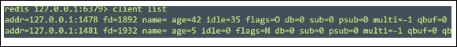

获取客户端列表

+   `CLIENTKILL`：这个命令杀死客户端。现在，对于之前的实验，在我们打开的客户端中发出以下命令：

1.  执行命令`CLIENT KILL 127.0.0.1:1478`。

1.  执行`CLIENT LIST`命令，我们将看到显示的行数减少了一行。

+   `DEBUG sEGFAULT`：这会导致 Redis 服务器崩溃。该实用程序可用于在开发过程中模拟错误。此命令可用于模拟我们想要通过故意使 Redis 服务器宕机来检查系统的容错性的场景。有趣的是看到从节点的行为，客户端如何处理容错等。

+   `SLOWLOG`：此命令显示执行过程中哪些命令花费了时间。执行你在*性能模式 - 高读取*部分编写的程序，并在执行后打开主机的客户端并执行此命令。以下图像中所见的结果是一个快照，不是您在命令提示符中可能得到的完整结果：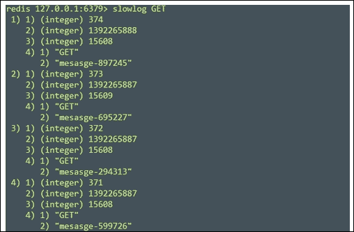

Slowlog 命令

# 总结

在这一章中，我们看到并学习了如何在 Redis 中处理整个数据集。除此之外，我们还学习了在生产环境中提高性能的模式。我们还学习了管理 Redis 服务器生态系统的命令。

在下一章中，我们将应用我们到目前为止学到的知识来开发 Web 编程中的常见组件，并看看 Redis 如何成为解决这一领域中一些问题的强大工具。
