# 第六章：Web 应用中的 Redis

在当前情况下，Web 是世界今天进行交流的普遍平台。从简单的门户到大规模可扩展的电子商务，协作网站，银行业，社交媒体，移动网络上的 Web 应用等等，每个人都使用 Web 协议作为与外部世界交互的接口。我们通常看到的 Web 平台只是 Web 操作下的一个小部分应用，后端 Web 应用，如供应链管理，订单管理，在线，离线分析等等，也是 Web 应用，或者使用 Web 协议进行集成，例如 HTTP，SOAP，REST 等等。

Web 成功的原因之一是其有效的简单性，开放标准以及多个渠道的操作。它的流行正在迫使人们和公司提出简单，成本效益高，性能卓越，易于维护和开发的解决方案。这种新型软件应该具有内在或外在的能力来扩展和表现良好。

Redis，这种更像瑞士军刀的数据存储，是多面手，是我们在前几章中看到的那些能力的证明。在本章中，我们将扩展和映射 Redis 的能力，用于 Web 领域中使用的组件，并为任何 Web 应用程序的固有部分创建一些概念验证。

为了更好地理解 Redis 的概念，让我们制作一个示例 Web 应用程序，并将 Redis 用作数据存储。这个示例 Web 应用程序无论如何都不是一个完整的端到端 Web 应用程序，但意在突出 Redis 可以派上用场的领域。解决方案本身在功能上并不完整，但意在成为一个从业者可以继续扩展的演示。

**Simple E-Commerce**，正如我们打算称呼这个演示网站，是一个由 Redis 支持的网站，它没有网页，而是通过简单的服务进行通信。这个想法是暴露简单的服务，而不是引入网页（包含 HTML，CSS 等），以将服务与呈现层解耦。随着我们更多地向单页面应用的时代迈进，我们需要采取一种方法，其中驻留在客户端浏览器内存中的应用程序进行所有协调，而传统的 Web 服务器则通过其提供的服务来处理请求。这种机制的优势在于开发和测试变得容易，因为每个服务都独立于其他服务，并且与 Web 应用程序的呈现方面没有紧密耦合。由于我们都曾经参与过 Web 开发，我们可以理解当我们看到一个错误时所面临的挫败感，以及当花费大量时间来调试问题是因为客户端代码还是它调用的业务方法。随着单页面应用程序的能力不断增强，这个问题在很大程度上可以得到解决，因为业务方法被公开为独立的服务，并且可以与呈现组件分开测试。单页面应用程序的一个显着特点是它将大量的计算活动从服务器端转移到客户端（浏览器），这导致服务器获得更多的计算资源。

# 简单的电子商务-一个由 Redis 支持的电子商务网站

这个示例电子商务网站，像其他电子商务网站一样，有产品，注册用户可以浏览，购买等等。该网站还根据用户的浏览和购买习惯推荐产品。同时，该网站实时统计网站上发生的活动，并提供实时和软实时分析的功能。因此，让我们开始构建这个网站，就像在任何设计中一样，让我们将需求分成命令，列举如下：

+   会话和目录管理：以下命令作为服务提供：

+   **注册用户**：命令名称为`register`；此命令将用户注册到系统中。

+   **查看我的数据**：命令名称为`mydata`；此命令将允许用户查看自己的数据。

+   **编辑我的数据**：命令名称为`editmydata`；此命令将允许用户编辑自己的数据。

+   **登录用户**：命令名称为`login`；此命令将登录用户并为用户生成会话 ID，以便与服务器通信。

+   **重新登录用户**：命令名称为`relogin`；此命令将再次登录用户，但会话 ID 将保持不变。用户的所有会话或配置文件数据也将保持不变。

+   **注销用户**：命令名称为`logout`；此命令将注销用户并终止其会话或配置文件数据。

+   **加入购物车**：命令名称为`add2cart`；此命令将商品添加到购物车中。

+   **查看我的购物车**：命令名称为`showmycart`；此命令将显示购物车中的商品。

+   **编辑我的购物车**：命令名称为`editcart`；此命令将编辑用户在购物车中的偏好设置。

+   **购买产品**：命令名称为`buy`；此命令将购买用户购物车中的商品。对于当前应用程序，我们不会将您带到某个商家的网站，而是为您生成一个样本收据。理念是进行分析，所以当有人购买产品时，我们为该产品提供信用积分，这将有助于我们的推荐服务。购买的信用积分为`10`。

+   **委托产品**：命令名称为`commission`；此命令将委托产品并在系统中创建其配置文件。

+   **显示产品**：命令名称为`display`；此命令将显示产品。

+   **浏览产品**：命令名称为`browse`；此命令将记录用户当前浏览的产品。理念是当有人浏览产品时，我们为该产品提供信用积分，这将有助于我们的推荐服务。浏览的信用积分为`1`。

+   **在线分析**：以下命令属于此类：

+   **推荐**：命令名称为`recommendbyproduct`；此命令将根据用户正在浏览的产品的热度推荐其他类似产品。

+   **用户统计**：命令名称为`stats`；此命令将显示用户的统计信息。

+   **按类别显示**：命令名称为`displaytag`；此命令将显示某一类别下的产品。

+   **按类别显示历史记录**：命令名称为`taghistory`；此命令将按类别显示历史记录。

+   **书籍访问量**：命令名称为`visittoday`；这将给出一天内独立访客的总数。

+   **购买书籍**：命令名称为`purchasestoday`；这将给出一天内购买该物品的独立访客总数。

为这个简单的电子商务网站保持了非常简单的设计。要了解整个应用程序，请查看以下图表：

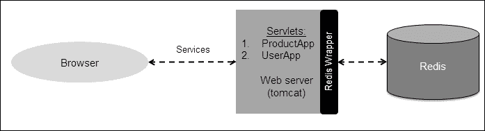

简单设计适用于我们简单的电子商务网站

此练习的先决条件如下：

+   **客户端**：任何带有`REST`插件或 HTTP 客户端插件的浏览器。我将使用带有名为`POSTMAN`的`REST`客户端插件的 Chrome 浏览器。如果您对其他插件感到满意，也可以使用其他插件。如果我们将此客户端替换为纯 Java 程序，例如 Apache Http Client，应用程序将可以正常工作。此简单电子商务应用程序中的服务是基于`Get`的。在生产系统中，我们应该使用`POST`，但出于显示目的，这里选择了`Get`。

+   **服务器**：任何 Web 应用程序服务器。我们将使用 Tomcat。您可以使用您选择的任何 Web 应用程序服务器，但应相应地创建 Servlet。如果您想使用类似 Node.js 的东西，那么代码将相应更改，但设计理念将保持不变。

+   **数据存储**：毋庸置疑，Redis 将是这里的数据存储。

在我们深入代码之前，了解导致我们使用 Redis 的演变过程是很重要的。如前所述，基于这个 Web 应用程序被分为两类，如下所述：

+   会话和目录管理

+   在线分析

让我们花点时间了解它们是如何随着时间的推移发展的，以及 Redis 是如何出现的。之后我们将了解这个应用程序的代码。

# 会话管理

每个 Web 应用程序都以某种方式具有会话。会话管理捕获用户活动的信息，这些信息可以被用户使用，也可以被用户使用。购物车或愿望清单的信息可以被用户使用，后端系统也可以使用相同的信息来分析用户偏好，并将促销和活动管理方案传递给用户。这是电子商务平台中的常见用例之一。存储在会话管理中的信息始终是最新的信息，最终用户期望围绕它进行性能，换句话说，用户将他最近的记忆外包给系统，并期望系统照顾好它。最终用户可能不知道幕后发生的详细和活动水平，但期望会话中存储的信息能够快速和高效地被处理。

在某些情况下，用户的期望甚至超出了他的大脑可以处理的范围；无论是购物车购买，还是把物品放入愿望清单，或者提醒他某个可能已经忘记的活动。换句话说，与任何其他数据相比，最终用户最接近这些数据。他们记住这些数据，并期望系统与之匹配，这导致用户与系统或网站的更个性化的参与。

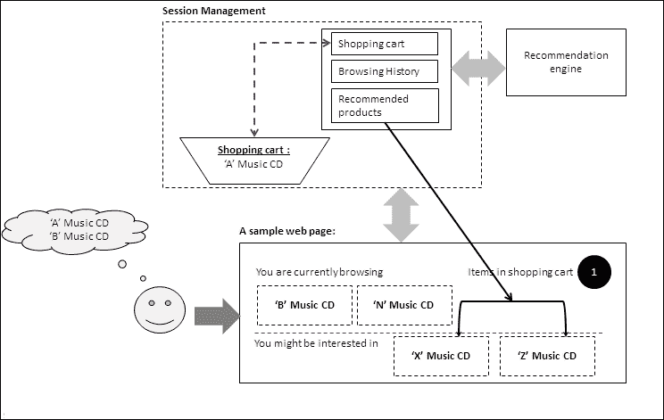

用户及其与电子商务平台的互动

上图是用户与系统（网站）互动的表示。当用户浏览网站时，他/她知道自己在寻找什么。比如在我们的案例中，他正在寻找一些音乐，搜索音乐后，用户将音乐曲目放入购物车。用户也可能对同一流派的其他音乐 CD 感兴趣，或者对*评论部分*的其他买家的评论感兴趣。在这一点上，用户可能有兴趣购买他/她的音乐 CD，或者将其放在购物车中以便将来购买。用户在这里期望的一件事是，当他再次登录系统时，系统应该记住他放在购物车中的产品。

这里发生了几件事。首先，用户与系统互动，系统通过存储用户的选择、记录用户的活动等方式做出响应。其次，用户已经推送了他可能会感兴趣的信息，从而为他提供了广泛的选择，同时也教育他关于其他人对产品的评论，从而帮助他做出决定。在这一部分，我们将更多地讨论用户存储信息的部分，并称之为会话管理。

会话数据非常重要，留存在用户的记忆中，但这些数据的生命周期很短（直到产品交付或者注意力转移到另一个产品为止）。这就是会话管理的作用所在，在本节中，我们将深入探讨 Redis 如何帮助我们解决这个非常关键的问题。

为了处理会话数据，最早和最简单的选择是使用应用服务器本身的内存。在过去，Web 应用程序的能力有限，提供的服务也有限。使用应用服务器内存是当时的常规。但随着 Web 变得更加普及，人们开始在日常生活中更多地使用 Web，网站迅速增长，为了在 Web 应用程序之间生存下来，必须具备更多的计算和内存资源。

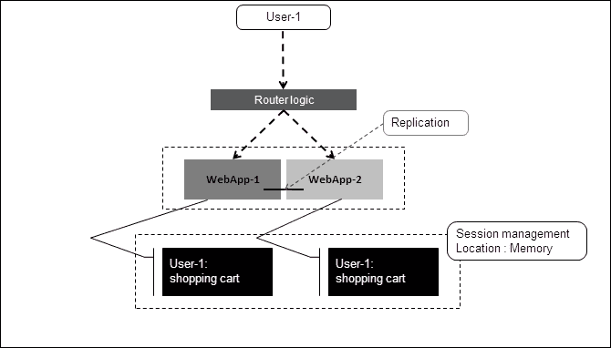

使用内存存储会话数据来扩展 Web 应用程序

常见的技术是复制数据并平衡系统，以便所有 Web 服务器处于相同状态，并且可以从任何 Web 应用程序中处理请求。这种技术存在一些问题，因为会话管理与 Web 服务器紧密耦合，它提供了有限的可扩展性，当并发性增加时，这种模式变成了反模式。这种技术的另一个局限性是，随着会话管理中的数据增长，这种模式变得有问题，因为会话数据存储在内存中，而为会话管理分配的内存量受到业务逻辑内存需求的限制。

下一个合乎逻辑的步骤是将会话管理与执行业务逻辑的 Web 应用程序服务器分离。这一步是正确的，因为现在它提供了更多的可扩展性，因为 Web 服务器不再需要进行会话管理，这需要频繁地与对等方同步状态。

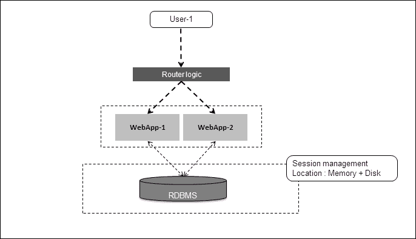

使用 RDBMS 存储会话数据来扩展 Web 应用程序

尽管这种方法是朝着正确的方向发展的，但也存在一些问题，主要是选择使用的数据存储。RDBMS 用于存储关系数据，并且在处理这些类型的数据时非常高效。另一方面，会话数据更像是键值对，而不具有事务数据所期望的那种关系。将会话数据存储在 RDBMS 中的问题在于性能受到影响，因为 RDBMS 从未为这种类型的数据而设计，尽管 Web 应用程序服务器的扩展更加容易。

这个演进过程的下一步是使用一个既提供可扩展性又提供性能的数据存储。显而易见的选择是使用一个缓存引擎，它将信息存储在内存中，以便性能更快，可扩展性保持良好，因为会话数据与 Web 应用程序服务器分离。

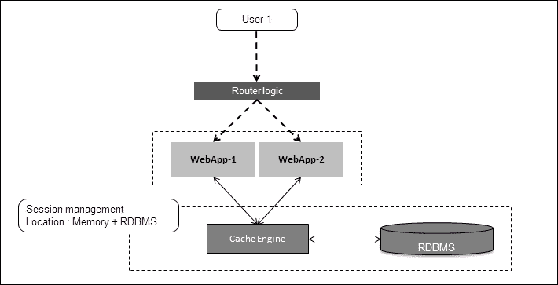

使用缓存作为前端，通过 RDBMS 存储会话数据来扩展 Web 应用程序

这种方法的问题在于功能需求和可维护性的角度。从可维护性的角度来看，缓存引擎依赖于 RDBMS 进行数据持久化，因为大多数缓存引擎没有磁盘持久性，并依赖于 RDBMS 进行故障管理。有一些缓存引擎提供持久性机制，但从功能的角度来看，存在一个大问题，因为它们将所有内容存储为键值，其中值是一个字符串。程序的责任是将字符串数据转换为他们感兴趣的信息模式，然后取出值。例如，存储在用户配置文件中的值，其中会话数据中存储了数百个属性。如果用户想要取出一些属性，那么用户必须获取整个数据集，构造对象，然后获取所需的属性。另一个问题是，很多时候我们需要会话数据在固定的时间段内可用，之后数据的可用性就不存在了。在这种情况下，缓存引擎和 RDBMS 都不会证明有益，因为它们没有内置的数据存储的*生存时间*机制。为了实现这个功能，我们必须编写触发器来从 RDBMS 和缓存中清除数据。

Redis 在这些情况下非常方便，因为它提供了存储信息的方式，可以根据我们的需求使用数据结构来保存值。在会话管理的情况下，我们可以使用映射来逻辑地将属性分组在一起。如果我们需要取出值，我们可以选择要更改的值或向其添加更多属性。此外，Redis 中的性能方面也使其适用于会话管理。Redis 还具有称为**生存时间**（**TTL**）的功能，以在时间结束后清除数据。这样，我们可以根据需求为所需的键设置单独的 TTL，并且可以在运行时更改 TTL。Redis 可用于具有可扩展和高性能的会话管理。

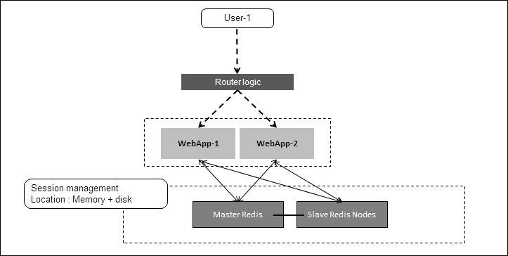

使用缓存作为前端的 Web 应用程序扩展 RDBMS 以存储会话数据

# 目录管理

目录管理是关于网站希望提供的产品和项目的信息。目录管理下存储的信息可以是产品的成本、尺寸、颜色等，即产品的元信息。与会话信息不同，目录数据是以读为中心的。但与会话数据一样，目录数据也经历了演变，从 RDBMS 系统开始，当时由于缺乏存储数据的选择，RDBMS 系统是当时的自然选择。RDBMS 系统的问题在于它没有提供性能。此外，固定的基于模式的系统也增加了问题，因为产品的元信息随着产品本身的变化而变化。一些产品有颜色、长度、宽度和高度，而一些产品有作者、页数和 ISBN。创建适应这一需求的模式总是很麻烦，而且在某个时候我们都面临过这个问题。

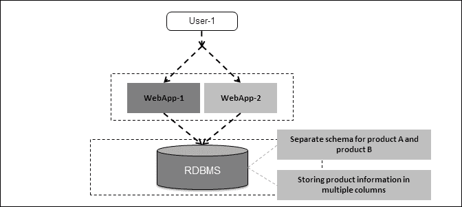

使用 RDBMS 作为数据存储的目录管理

克服固定模式问题的自然演化过程是以 XML 格式存储信息，并将此信息缓存到某个缓存引擎中。这种机制帮助设计师和架构师克服了固定模式和性能的问题。但这种技术也带来了自己的问题；在 XML 中的数据在使用之前必须转换为编程语言对象。另一个问题是，如果要更改属性值，那么要么首先在 XML 中更改值，然后在关系数据库管理系统中更改值，要么首先在关系数据库管理系统中更改值，然后在缓存中更改值。这些技术在维护关系数据库管理系统和缓存引擎之间的一致状态方面存在问题，特别是如果属性与产品成本相关。

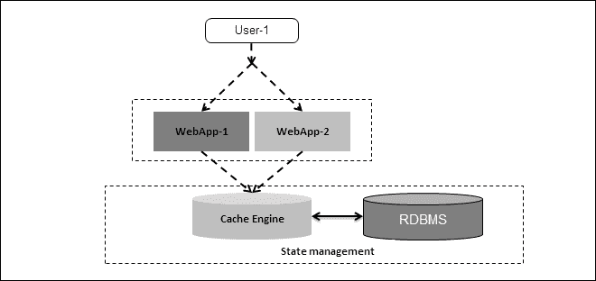

在缓存引擎和关系数据库管理系统之间处理状态管理

Redis 再次派上用场，用于存储目录数据。Redis 是无模式的，作为数据存储提供了数据结构，比如可以用来存储产品所需的许多属性的映射。除此之外，它还提供了改变、添加和读取属性的能力，而无需将整个数据集带到工作中。拥有 Redis 的另一个优势是我们无需进行*对象到数据*的转换，反之亦然，因为这消除了系统中需要数百个数据对象的必要性；从而使代码库更小，开发更快。

# 在线分析

在线分析或实时分析是一个相对较新的需求，正在变得流行。在线分析的整个理念是为用户提供更丰富和吸引人的用户体验。在线分析的工作方式是实时收集、分析和处理数据。

在早期的网络革命时代，分析只有一个主要的利益相关者，那就是网站管理团队。他们过去会在离线模式下收集数据并进行分析，然后应用于业务。离线分析技术仍然是必要的。然而，在今天的世界，当一切都与社交媒体相连时，用户的观点、他/她的社交群体和他/她的意见应该反映在他/她的购物体验中。例如，假设一个用户及其社交群体对某种音乐或书籍持有积极看法。当用户登录到他最喜欢的电子商务网站时，该网站的主页上会在推荐部分显示这种产品。这很可能会导致用户最终购买该产品。这种程度的个性化对于网站的成功非常重要。

在这种情况下发生的分析是软实时的，也就是当用户与他的社交群体互动时，数据同时被处理并创建上下文，网站利用这一上下文为用户创建个性化的购物体验。

另一种发生的分析是基于用户在网站浏览产品时创建的上下文。这种上下文的创建是协作性的，尽管用户可能对此并不知情。搜索某种产品或购买某种产品的用户数量越多，该产品就越受欢迎。这种类型的分析的复杂性在于它是实时的，性能至关重要。

从某种意义上说，如果我们将离线分析引擎与实时分析进行比较，不同之处在于，原本不属于业务逻辑范围的分析引擎实际上成为业务逻辑的一部分，实际上共享相同的计算资源。另一个不同之处在于，实时分析的数据量相对较小，但从用户的购物角度来看，它的上下文数据对于业务来说非常重要。以下图表简明地解释了离线和在线（实时）分析之间的差异：

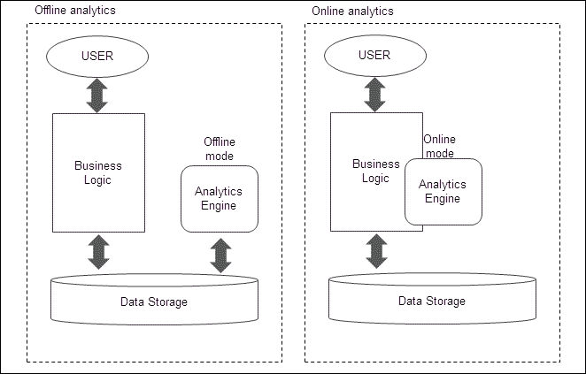

Web 应用程序中的离线和在线分析

现在，如果要使用 RDBMS 等数据存储来进行实时处理，问题将在于性能，因为这种处理将消耗大量的计算资源，并且并行执行的其他业务用例可能会受到影响。例如，Oracle 等 RDBMS 可以提供扩展的能力，但它们的价格相当昂贵。

Redis 可以是一个非常好的数据存储，可以用于在线分析。由于 Redis 是基于内存的，它非常快速，并且在 Redis 中实现可伸缩性要容易得多。此外，Redis 提供了诸如 Set 和 Sorted set 之类的数据结构，对于实时分析来说非常有帮助。

Redis 提供的另一个优势是它是开源的，而且 Redis 的运行时资源需求非常少。此外，Redis 在处理并发调用方面的能力非常令人印象深刻。

在我们将开发的示例应用程序中，我们将看到一些实时分析，例如基于其流行度推荐产品的推荐引擎。

## 实施-简单的电子商务

让我们从一些代码开始，以便清楚地了解如何使用 Redis 进行会话、目录管理和在线分析。但在这之前，让我们确定要创建的存储数据的桶：

+   “<username>@userdata”桶：该桶将存储用户配置文件数据，例如姓名、电子邮件、电话号码、地址等。从应用程序的角度来看，这个桶将是用户的`sessionID`，它将把这个桶与`"<sessionID>@sessiondata"`绑定在一起。这里使用的数据结构是 Map。

+   “<sessionID>@sessiondata”桶：该桶将存储用户的会话数据，例如上次登录和登录状态。除了会话数据，这里还将存储用户名，因为这是将`"<username>@userdata"`桶绑定到该桶的关键。这里使用的数据结构是 Map。

+   “<sessionID>@browsinghistory”桶：该桶将根据用户的会话 ID 存储用户的浏览历史。这里使用的数据结构是 Sorted Set。

+   “<name>@purchasehistory”桶：这将提供用户的购买历史。这里使用的数据结构是 Sorted Set。

+   “<sessionID>@shoppingcart”桶：该桶将存储用户的购物车项目。这里使用的数据结构是 Map。

+   “sessionIdTracker”桶：这将跟踪系统中的用户总数。这里使用的数据结构是 Bitmap。

+   “<productname>”桶：这将存储产品属性。由于无模式，它可以存储产品的任意数量的属性。这里使用的数据结构是 Map。

+   “<tags>”桶：这将存储与该标签相关联的产品。例如，“学习 Redis”可以被标记为 Redis、NoSQL、数据库等标签。这里使用的数据结构是 Sorted Set。

+   “<productname>@visit”桶：这将存储独立访问者的数量。在生产系统中，这可以每天进行一次，以便统计每天有多少人访问了该产品，并帮助计算每月有多少人访问了该网站。这里使用的数据结构是 Bitmap。

+   **Bucket name "<productname>@purchase"**：这将存储购买产品的独立访问者数量。与之前的桶一样，可以每天制作这个桶，以便为一周或一个月提供聚合计数。这里使用的数据结构是位图。

现在我们已经了解了我们的数据库将会是什么样子，让我们来看看将要接受来自浏览器的服务请求并向客户端发送 HTTP 响应的 servlet。

在这个简单的电子商务网站中有两个 servlet。它们将接受所有命令，并列在下面：

+   **UserApp servlet**：这将处理与用户相关的所有命令

+   **ProductApp servlet**：这将处理与用户相关的所有命令

我们必须记住的一件事是，执行的顺序不依赖于 servlet 或 servlet 中的命令的顺序。例如，除非我们在系统中提供了一些产品，否则注册或登录是没有意义的，或者除非我们浏览或购买了一些产品，否则查看推荐是没有意义的，因为这将为推荐创建图形数据。

让我们先了解一下在本章节的其余部分中将在代码清单中使用的所有实用类。所有这些类的列表如下：

+   **Commands**：这是所有将在应用程序中实现的命令的父类和抽象类：

```go
package org.learningRedis.web;
import org.learningRedis.web.util.Argument;
public abstract class Commands {
  private Argument argument;
  public Commands(Argument argument) {
    this.argument = argument;
  }
  public abstract String execute();
  public Argument getArgument() {
    return argument;
  }
}
```

+   **默认命令**：这是默认命令，如果 URL 中传递的命令未被应用程序识别，将会执行该命令：

```go
package org.learningRedis.web;
import org.learningRedis.web.util.Argument;
public class DefaultCommand extends Commands {
  public DefaultCommand(Argument argument) {
    super(argument);
  }
  @Override
  public String execute() {
    return "Command Not Recognized !!";
  }
}
```

+   **Argument**：这个类的主要目标是封装请求中传入的所有名称值属性，并将其放入一个地图中，以便以后在程序中使用：

```go
package org.learningRedis.web.util;
import java.util.HashMap;
import java.util.Map;
public class Argument {
  Map<String, String> argumentMap = new HashMap<String, String>();
  public Argument(String args) {
    String[] arguments = args.split(":");
    for (String argument : arguments) {
      String key = argument.split("=")[0];
      String value = argument.split("=")[1];
      argumentMap.put(key, value);
    }
  }
  public String getValue(String key) {
    return argumentMap.get(key);
  }
  public Map<String, String> getAttributes() {
    return argumentMap;
  }
}
```

现在我们已经涵盖了应用程序中的所有实用类，让我们来看看将对应用程序形成的类。

## ProductApp

ProductApp servlet 将包含围绕产品管理的命令。ProductApp servlet 的代码如下：

```go
package org.learningRedis.web;
import java.io.IOException;
import java.io.PrintWriter;
import javax.servlet.ServletException;
import javax.servlet.http.HttpServlet;
import javax.servlet.http.HttpServletRequest;
import javax.servlet.http.HttpServletResponse;
import org.learningRedis.web.analytics.commands.PurchasesCommand;
import org.learningRedis.web.analytics.commands.VisitTodayCommand;
import org.learningRedis.web.productmgmt.commands.CommissionProductCommand;
import org.learningRedis.web.productmgmt.commands.DisplayTagCommand;
import org.learningRedis.web.productmgmt.commands.DisplayCommand;
import org.learningRedis.web.productmgmt.commands.TagHistoryCommand;
import org.learningRedis.web.productmgmt.commands.UpdateTagCommand;
import org.learningRedis.web.util.Argument;
public class ProductApp extends HttpServlet {
  public ProductApp() {
    super();
  }
  protected void doGet(HttpServletRequest request, HttpServletResponse response) throws ServletException, IOException {
    String command = request.getParameter("command");
    Argument argument = new Argument(request.getParameter("args"));
    PrintWriter out = response.getWriter();
    switch (command.toLowerCase()) {
    case "commission":
      Commands commission = new CommissionProductCommand(argument);
      out.println(commission.execute());
      break;
    case "display":
      Commands display = new DisplayCommand(argument);
      out.println(display.execute());
      break;
    case "displaytag":
      Commands displaytag = new DisplayTagCommand(argument);
      out.println(displaytag.execute());
      break;
    case "updatetag":
      Commands updatetag = new UpdateTagCommand(argument);
      out.println(updatetag.execute());
      break;
    case "visitstoday":
      Commands visittoday = new VisitTodayCommand(argument);
      out.println(visittoday.execute());
      break;
    case "purchasestoday":
      Commands purchasestoday = new PurchasesTodayCommand (argument);
      out.println(purchasestoday.execute());
      break;
    case "taghistory":
      Commands taghistory = new TagHistoryCommand(argument);
      out.println(taghistory.execute());
      break;
    default:
      Commands defaultUC = new DefaultCommand(argument);
      out.println(defaultUC.execute());
      break;
    }
  }
}
```

现在我们已经准备好了第一个 servlet，让我们来看看我们为此实现的命令：

+   `CommisionProductCommand`：这将实现`委托`命令。命令的实现如下：

```go
package org.learningRedis.web.productmgmt.commands;
import java.util.Map;
import org.learningRedis.web.Commands;
import org.learningRedis.web.util.Argument;
import org.learningRedis.web.util.ProductDBManager;
public class CommissionProductCommand extends Commands {
    public CommissionProductCommand(Argument argument) {
    super(argument);
  }
  @Override
  public String execute() {
    System.out.println(this.getClass().getSimpleName() + ":  " + " Entering the execute function");
    Map<String, String> productAttributes = this.getArgument().getAttributes();
    boolean commisioning_result = ProductDBManager.singleton.commisionProduct(productAttributes);
    boolean tagging_result = ProductDBManager.singleton.enterTagEntries(productAttributes.get("name"),
        productAttributes.get("tags"));
    if (commisioning_result & tagging_result) {
      return "commisioning successful";
    } else {
      return "commisioning not successful";
    }
  }
}
```

测试 URL：`http://localhost:8080/simple-ecom/productApp?command=commission&args=name=Redisbook-1:cost=10:catagory=book:author=vinoo:tags=Redis@5,NoSql@3,database@2,technology@1`。

描述：出于所有原因，这应该是第一个应该调用的命令，因为这个命令将在系统中提供产品。需要关注 URL 中的两个部分，即等于`commission`的`command`和`args`部分。这里`args`包含书的属性，例如`name=Redisbook-1`。属性`tags`表示书将关联的单词。这本书的标签是`Redis@5`，`NoSQl@3`，`database@2`和`technology@1`。标签与权重相关，当推荐引擎启动时，权重将发挥作用。每当用户浏览`Redisbook-1`时，他将看到更多关于 Redis 书籍的推荐。在这里，用户将看到关于 Redis 的五本书，关于 NoSQL 的三本书，依此类推。为了简化这个应用程序，权重的总和应该是 10。

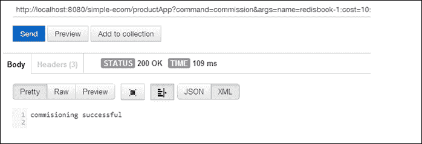

成功产品委托的截图

为了创建测试数据，使用不同权重委托几本测试书籍，其中一些具有相同的标签，另一些具有略有不同的标签。确保权重的总和等于 10。

+   `显示命令`：这将实现`显示`命令。命令的实现如下：

```go
package org.learningRedis.web.productmgmt.commands;
import org.learningRedis.web.Commands;
import org.learningRedis.web.util.Argument;
import org.learningRedis.web.util.ProductDBManager;
public class DisplayCommand extends Commands {
  public DisplayCommand(Argument argument) {
    super(argument);
  }
  @Override
  public String execute() {
    String display = ProductDBManager.singleton.getProductInfo(this.getArgument().getValue("name"));
    return display;
  }
}
```

测试 URL：`http://localhost:8080/simple-ecom/productApp?command=display&args=name=Redisbook-1`。

描述：该程序将显示书的属性。需要关注 URL 中的两个部分，即等于显示的命令和参数部分，即 args。这里，args 包含一个名为 name 的属性。

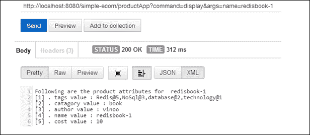

成功显示产品属性的屏幕截图

+   `DisplayTagCommand`：这将实现`browse`命令。命令的实现如下：

```go
package org.learningRedis.web.productmgmt.commands;
import org.learningRedis.web.Commands;
import org.learningRedis.web.util.Argument;
import org.learningRedis.web.util.ProductDBManager;
public class DisplayTagCommand extends Commands {
  public DisplayTagCommand(Argument argument) {
    super(argument);
  }
  @Override
  public String execute() {
    System.out.println(this.getClass().getSimpleName() + ":  " + " Entering the execute function");
    String tagName = this.getArgument().getValue("tagname");
    String details = ProductDBManager.singleton.getTagValues(tagName);
    return details;
  }
}
```

测试 URL：`http://localhost:8080/simple-com/productApp?command=displaytag&args=tagname=nosql`。

描述：该程序将根据书的点击量显示书籍。需要关注 URL 中的两个部分，即`command`，等于`displaytag`，以及参数部分，即`args`。这里`args`包含一个名为`tagname`的属性。由于我已经将一本书委托给系统，输出如下图所示。当用户开始浏览产品时，请稍后访问此标签；当您执行相同的命令时，顺序将发生变化。

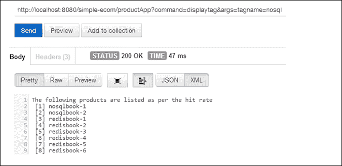

成功显示属于 NoSQL 标签的产品的屏幕截图

+   `UpdateTag`：这将实现`UpdateTagCommand`命令。命令的实现如下：

```go
package org.learningRedis.web.productmgmt.commands;
import org.learningRedis.web.Commands;
import org.learningRedis.web.util.AnalyticsDBManager;
import org.learningRedis.web.util.Argument;
import org.learningRedis.web.util.ProductDBManager;
public class UpdateTagCommand extends Commands {
  public UpdateTagCommand(Argument argument) {
    super(argument);
  }
  @Override
  public String execute() {
    System.out.println(this.getClass().getSimpleName() + ":  " + " Entering the execute function");
    String sessionid = this.getArgument().getValue("sessionid");
    String productname = this.getArgument().getValue("productname");
    String details = this.getArgument().getValue("details");
    String actionType = this.getArgument().getValue("action");
    switch (actionType.toLowerCase()) {
    case "browse":
      if (productname != null & ProductDBManager.singleton.keyExist(productname)) {
        AnalyticsDBManager.singleton.updateRatingInTag(productname, 1);
        AnalyticsDBManager.singleton.updateProductVisit(sessionid, productname);
      }
      break;
    case "buy":
      System.out.println("Buying the products in the shopping cart !! ");
      String[] products = details.split(",");
      for (String product : products) {
        if (product != null & !product.trim().equals("")) {
          AnalyticsDBManager.singleton.updateRatingInTag(product, 10);
          AnalyticsDBManager.singleton.updateProductPurchase(sessionid, product);
        }
      }
      break;
    default:
      System.out.println("The URL cannot be acted uppon  ");
      break;
    }
    return "";
  }
}
```

测试 URL：`http://localhost:8080/simple-ecom/productApp?command=updatetag&args=sessionid=<用户的 sessionID>:productname=<用户正在浏览或已购买的产品名称>:action=<浏览或购买>`。

描述：当用户浏览产品或购买产品时，将调用此命令。该命令背后的想法是，当用户浏览产品或购买产品时，该产品正在变得受欢迎，因此，该产品在同一标签下的其他产品中的受欢迎程度应该相应增加。简而言之，它有助于计算其类别（标签）中最受欢迎的产品。要测试此命令，请确保创建一些虚拟用户并使其登录系统，然后点击`browse`命令 URL 或`buy`命令 URL。

+   `VisitTodayCommand`：这将实现`browse`命令。命令的实现如下：

```go
package org.learningRedis.web.analytics.commands;
import org.learningRedis.web.Commands;
import org.learningRedis.web.util.AnalyticsDBManager;
import org.learningRedis.web.util.Argument;
public class VisitTodayCommand extends Commands {
  public VisitTodayCommand(Argument argument) {
    super(argument);
  }
  @Override
  public String execute() {
    System.out.println(this.getClass().getSimpleName() + ":  " + "Entering the execute function");
    String productName = this.getArgument().getValue("productname");
    Integer visitCount = AnalyticsDBManager.singleton.getVisitToday(productName);
    System.out.println(this.getClass().getSimpleName() + ":  " + "Printing the result for execute function");
    System.out.println("Result = " + "Total Unique Visitors are: " + visitCount.toString());
    return "Total Unique Visitors are: " + visitCount.toString();
  }
}
```

测试 URL：`http://localhost:8080/simple-ecom/productApp?command=visitstoday&args=productname=Redisbook-1`。

描述：如果我们想要检查有多少独立用户访问了该产品，可以执行此命令。实现此用例的数据结构是位图。 Redis 中的位图具有一致的性能，不受其持有的数据影响。

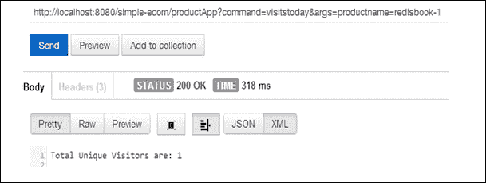

显示产品 redisbook-1 每天的观看者总数的屏幕截图

+   `PurchasesTodayCommand`：这将实现`purchasestoday`命令。命令的实现如下：

```go
package org.learningRedis.web.analytics.commands;
import org.learningRedis.web.Commands;
import org.learningRedis.web.util.Argument;
import org.learningRedis.web.util.ProductDBManager;
public class PurchasesTodayCommand extends Commands {
  public PurchasesTodayCommand(Argument argument) {
    super(argument);
  }
  @Override
  public String execute() {
    System.out.println(this.getClass().getSimpleName() + ":  " + "Entering the execute function");
    String productName = this.getArgument().getValue("productname");
    Integer purchaseCount = ProductDBManager.singleton.getPurchaseToday(productName);
    System.out.println(this.getClass().getSimpleName() + ":  " + "Printing the result for execute function");
    System.out.println("Result = " + "Total Unique Customers are: " + purchaseCount.toString());
    return "Total Unique Customers are: " + purchaseCount.toString();
  }
}
```

测试 URL：`http://localhost:8080/simple-ecom/productApp?command=purchasestoday&args=productname=Redisbook-1`。

描述：如果我们想要检查有多少独立用户购买了给定的产品，可以执行此命令。实现此用例的数据结构是位图。 Redis 中的位图具有一致的性能，不受其持有的数据影响。

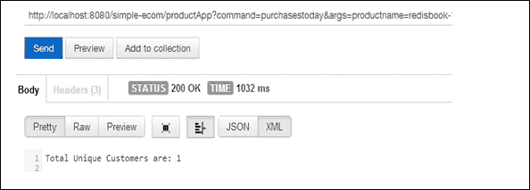

显示产品 redisbook-1 每天的买家总数的屏幕截图

+   `TagHistoryCommand`：这将实现`browse`命令。命令的实现如下：

```go
package org.learningRedis.web.productmgmt.commands;
import org.learningRedis.web.Commands;
import org.learningRedis.web.util.AnalyticsDBManager;
import org.learningRedis.web.util.Argument;
public class TagHistoryCommand extends Commands {
  public TagHistoryCommand(Argument argument) {
    super(argument);
  }
  @Override
  public String execute() {
    String tagname = this.getArgument().getValue("tagname");
    String tagHistory = AnalyticsDBManager.singleton.getTagHistory(tagname);
    return tagHistory;
    }
    }
```

测试 URL：`http://localhost:8080/simple-ecom/productApp?command=taghistory&args=tagname=Redis`。

描述：如果我们想要查看产品的标签历史记录，可以执行此命令。产品的排名基于属于该标签的各个产品积累的积分。在以下示例中，我们显示了标签`Redis`的排名：

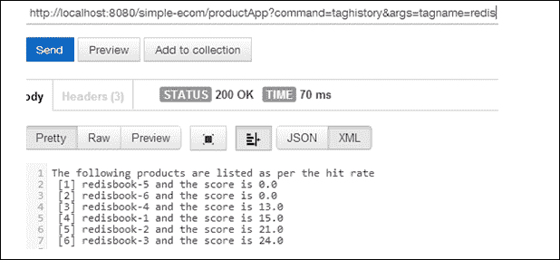

显示标签 redis 的标签历史的屏幕截图

测试 URL：`http://localhost:8080/simple-ecom/productApp?command=taghistory&args=tagname=nosql`。

描述：如果我们想要查看产品的标签历史记录，可以执行此命令。产品的排名基于属于该标签的各个产品积累的积分。在以下示例中，我们展示了标签`nosql`的排名以展示差异：

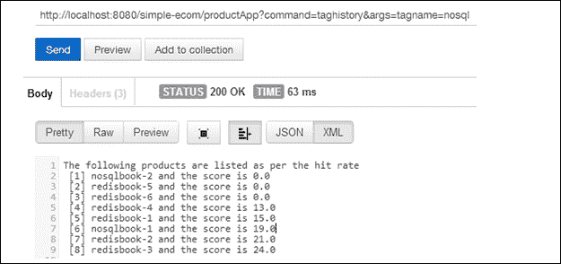

显示标签`nosql`的历史记录的屏幕截图

## UserApp

UserApp servlet 将包含围绕用户管理和用户分析的命令。UserApp servlet 的代码如下：

```go
package org.learningRedis.web;
import java.io.IOException;
import java.io.PrintWriter;
import javax.servlet.ServletException;
import javax.servlet.http.HttpServlet;
import javax.servlet.http.HttpServletRequest;
import javax.servlet.http.HttpServletResponse;
import org.learningRedis.web.analytics.commands.MyStatusCommand;
import org.learningRedis.web.analytics.commands.RecomendByProduct;
import org.learningRedis.web.sessionmgmt.commands.Add2CartCommand;
import org.learningRedis.web.sessionmgmt.commands.BrowseCommand;
import org.learningRedis.web.sessionmgmt.commands.BuyCommand;
import org.learningRedis.web.sessionmgmt.commands.EditCartCommand;
import org.learningRedis.web.sessionmgmt.commands.EditMyDataCommand;
import org.learningRedis.web.sessionmgmt.commands.LoginCommand;
import org.learningRedis.web.sessionmgmt.commands.LogoutCommand;
import org.learningRedis.web.sessionmgmt.commands.MyDataCommand;
import org.learningRedis.web.sessionmgmt.commands.MyPurchaseHistory;
import org.learningRedis.web.sessionmgmt.commands.RegistrationCommand;
import org.learningRedis.web.sessionmgmt.commands.ReloginCommand;
import org.learningRedis.web.sessionmgmt.commands.ShowMyCartCommand;
import org.learningRedis.web.util.Argument;
public class UserApp extends HttpServlet {
  private static final long serialVersionUID = 1L;
  public UserApp() {
    super();
  }
  protected void doGet(HttpServletRequest request, HttpServletResponse response) throws ServletException, IOException {
    String command = request.getParameter("command");
    Argument argument = new Argument(request.getParameter("args"));
    PrintWriter out = response.getWriter();
    switch (command.toLowerCase()) {
    case "register":
      Commands register = new RegistrationCommand(argument);
      out.println(register.execute());
      break;
    case "login":
      Commands login = new LoginCommand(argument);
      out.println(login.execute());
      break;
    case "mydata":
      Commands mydata = new MyDataCommand(argument);
      out.println(mydata.execute());
      break;
    case "editmydata":
      Commands editMyData = new EditMyDataCommand(argument);
      out.println(editMyData.execute());
      break;
    case "recommendbyproduct":
      Commands recommendbyproduct = new RecomendByProductCommand (argument);
      String recommendbyproducts = recommendbyproduct.execute();
      out.println(recommendbyproducts);
      break;
    case "browse":
      Commands browse = new BrowseCommand(argument);
      String result = browse.execute();
      out.println(result);
      String productname = argument.getValue("browse");
      String sessionid = argument.getValue("sessionid");
      request.getRequestDispatcher(
          "/productApp?command=updatetag&args=sessionid=" + sessionid + ":productname=" + productname
              + ":action=browse").include(request, response);
      break;
    case "buy":
      Commands buy = new BuyCommand(argument);
      String[] details = buy.execute().split("#");
      out.println(details[0]);
      String sessionID = argument.getValue("sessionid");
      request.getRequestDispatcher(
          "/productApp?command=updatetag&args=sessionid=" + sessionID + ":action=buy:details=" + details[1])
          .include(request, response);
      break;
    case "stats":
      Commands stats = new MyStatusCommand(argument);
      out.println(stats.execute());
      break;
    case "add2cart":
      Commands add2cart = new Add2CartCommand(argument);
      out.println(add2cart.execute());
      break;
    case "showmycart":
      Commands showmycart = new ShowMyCartCommand(argument);
      out.println(showmycart.execute());
      break;
    case "editcart":
      Commands editCard = new EditCartCommand(argument);
      out.println(editCard.execute());
      break;
    case "relogin":
      Commands relogin = new ReloginCommand(argument);
      out.println(relogin.execute());
      break;
    case "logout":
      Commands logout = new LogoutCommand(argument);
      out.println(logout.execute());
      break;
    case "mypurchasehistory":
      Commands mypurchasehistory = new MyPurchaseHistoryCommand (argument);
      out.println(mypurchasehistory.execute());
      break;
    default:
      Commands defaultUC = new DefaultCommand(argument);
      out.println(defaultUC.execute());
      break;
    }
  }
}
```

现在我们已经准备好了第一个 servlet，让我们来看看我们为此实现的命令：

+   `RegistrationCommand`：这将实现`register`命令。命令的代码如下：

```go
package org.learningRedis.web.sessionmgmt.commands;
import org.learningRedis.web.Commands;
import org.learningRedis.web.util.Argument;
import org.learningRedis.web.util.UserDBManager;
public class RegistrationCommand extends Commands {
  public RegistrationCommand(Argument argument) {
    super(argument);
  }
  public String execute() {
    System.out.println(this.getClass().getSimpleName() + ":  " + " Entering the execute function");
    String name = this.getArgument().getValue("name");
    if (!UserDBManager.singleton.doesUserExist(name)) {
      UserDBManager.singleton.createUser(this.getArgument().getAttributes());
    } else {
      return "user already registered in ";
    }
    return "successful registeration  -> " + name;
  }
}
```

测试 URL：`http://localhost:8080/simple-ecom/userApp?command=register&args=name=vinoo:password=******:address=test address`。

描述：此命令将用户注册到系统中。需要关注 URL 中的两个部分，即`command`，等于`register`，以及参数部分，即`args`。这代表了键值对中的属性。下图表示注册成功的情况。下一个逻辑步骤将是登录用户。

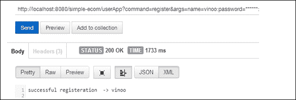

显示用户注册的屏幕截图

+   `LoginCommand`：这将实现`login`命令。命令的代码如下：

```go
package org.learningRedis.web.sessionmgmt.commands;
import java.util.HashMap;
import java.util.Map;
import org.learningRedis.web.Commands;
import org.learningRedis.web.util.AnalyticsDBManager;
import org.learningRedis.web.util.Argument;
import org.learningRedis.web.util.ProductDBManager;
import org.learningRedis.web.util.UserDBManager;
public class LoginCommand extends Commands {
  public LoginCommand(Argument argument) {
    super(argument);
  }
  @Override
  public String execute() {
    System.out.println(this.getClass().getSimpleName() + ":  " + " Entering the execute function");
    String name = this.getArgument().getValue("name");
    String password = this.getArgument().getValue("password");
    if (UserDBManager.singleton.doesUserExist(name)) {
      if (UserDBManager.singleton.getUserPassword(name).equals(password)
          & UserDBManager.singleton.getUserSessionId(name).equals("null")) {
        String sessionID = ProductDBManager.getRandomSessionID();
        UserDBManager.singleton.login(sessionID, name);
        Map<String, String> map = new HashMap<String, String>();
        map.put("sessionID", sessionID);
        UserDBManager.singleton.setRegistrationMap(name, map);
        System.out.println("login map : " + map);
        AnalyticsDBManager.singleton.registerInSessionTracker(sessionID);
        return "Login successful \n" + name + " \n use the following session id : " + sessionID;
      } else if (UserDBManager.singleton.getUserPassword(name).equals(password)
          & !UserDBManager.singleton.getUserSessionId(name).equals("null")) {
        return " Login failed ...u r already logged in \n please logout to login again \n or try relogin command ";
      } else {
        return " Login failed ...invalid password ";
      }
    } else {
      return " please register before executing command for login ";
    }
  }
}
```

测试 URL：`http://localhost:8080/simple-ecom/userApp?command=login&args=name=vinoo:password=******`。

描述：此命令将用户登录到系统中。需要关注 URL 中的两个部分，即`command`，等于`login`，以及参数部分，即`args`。参数将包含名称和密码。需要关注的重要部分是，执行此命令将返回一个会话 ID 代码。大多数用户将执行的命令都需要此会话 ID。因此，如果您正在运行此命令的示例，请确保将此数字存储在文本文件中以供以后使用。在生产系统中，可以将其存储在浏览器或客户端的内存中。下图告诉我为我生成的会话 ID 是**26913441**。我将在执行的其余示例中使用它：

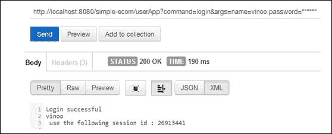

显示用户登录和用户会话 ID 的屏幕截图

+   `MyDataCommand`：这将实现`mydata`命令。命令的代码如下：

```go
package org.learningRedis.web.sessionmgmt.commands;
import java.util.Map;
import org.learningRedis.web.Commands;
import org.learningRedis.web.util.Argument;
import org.learningRedis.web.util.UserDBManager;
public class MyDataCommand extends Commands {
  public MyDataCommand(Argument argument) {
    super(argument);
  }
  @Override
  public String execute() {
    System.out.println(this.getClass().getSimpleName() + ":  " + " Entering the execute function");
    String sessionid = this.getArgument().getValue("sessionid");
    String name = UserDBManager.singleton.getUserName(sessionid);
    Map<String, String> map = UserDBManager.singleton.getRegistrationMap(name);
    return map.toString();
  }
}
```

测试 URL：`http://localhost:8080/simple-ecom/userApp?command=mydata&args=sessionid=26913441`。

描述：此命令将显示系统中用户的数据。需要关注 URL 中的两个部分，即`command`，等于`mydata`，以及参数部分，即`args`。参数在 URL 中只有会话 ID 作为键值对。下图显示了命令的结果。由于某些属性无法在图中显示，因此未显示。

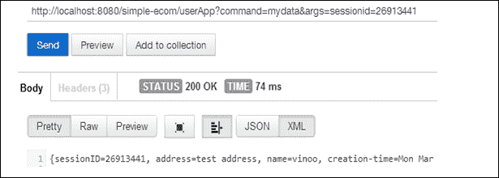

显示用户数据的屏幕截图

+   `EditMyDataCommand`：这将实现`editmydata`命令。命令的代码如下：

```go
package org.learningRedis.web.sessionmgmt.commands;
import java.util.Map;
import org.learningRedis.web.Commands;
import org.learningRedis.web.util.Argument;
import org.learningRedis.web.util.UserDBManager;
public class EditMyDataCommand extends Commands {
  public EditMyDataCommand(Argument argument) {
    super(argument);
  }
  @Override
  public String execute() {
    System.out.println(this.getClass().getSimpleName() + ":  " + " Entering the execute function");
    Map<String, String> editMap = this.getArgument().getAttributes();
    boolean result = UserDBManager.singleton.editRegistrationMap(editMap);
    if (result) {
      return "Edit is Done....";
    } else {
      return "Edit not Done.... please check sessionid and name combination";
    }
  }
}
```

测试 URL：`http://localhost:8080/simple-ecom/userApp?command=editmydata&args=name=vinoo:password=******:address=changed address:phone=9111111119:sessionid=26913441`。

描述：此命令将显示系统中用户的数据。需要关注 URL 中的两个部分，即`command`，等于`mydata`，以及参数部分，即`args`。参数具有新的和编辑后的键值对。确保 URL 中的会话 ID 是正确的。下图是您应该在输出中看到的内容。现在您可以随时返回并执行以前的`mydata`命令，这将显示更新后的值。

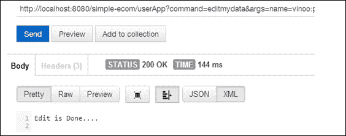

成功编辑用户数据的屏幕截图

+   `BrowseCommand`：这将实现`browse`命令。命令的实现如下：

```go
package org.learningRedis.web.sessionmgmt.commands;
import org.learningRedis.web.Commands;
import org.learningRedis.web.util.AnalyticsDBManager;
import org.learningRedis.web.util.Argument;
import org.learningRedis.web.util.ProductDBManager;
public class BrowseCommand extends Commands {
  public BrowseCommand(Argument argument) {
    super(argument);
  }
  @Override
  public String execute() {
    System.out.println(this.getClass().getSimpleName() + ":  " + " Entering the execute function");
    String productname = this.getArgument().getValue("browse");
    if (ProductDBManager.singleton.keyExist(productname)) {
      AnalyticsDBManager.singleton.updateBrowsingHistory(this.getArgument().getValue("sessionid"), productname);
      StringBuffer stringBuffer = new StringBuffer();
      stringBuffer.append("You are browsing the following product = " + productname + "\n");
      stringBuffer.append(ProductDBManager.singleton.getProductInfo(productname));
      return stringBuffer.toString();
    } else {
      return "Error: The product you are trying to browse does not exist i.e. " + productname;
    }
  }
}
```

测试 URL：`http://localhost:8080/simple-ecom/userApp?command=browse&args=sessionid=26913441:browse=Redisbook-1`。

描述：此命令将显示系统中产品的数据。需要关注的 URL 中的两个部分是`command`，它等于`browse`，以及参数部分，即`args`。参数包含用户的会话 ID 和用户正在浏览的产品的名称。这里发生了几件事情。用户可以查看产品详情，同时后台会发送请求到`updatetag`命令，以增加相应产品的热度。在我们的案例中，产品是`Redisbook-1`。为了测试，多次浏览您已经委托到系统中的所有产品。

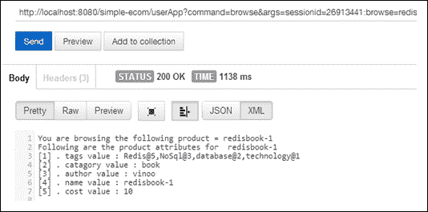

用户想要浏览产品并查看其详情时的屏幕截图

+   `RecommendByProductCommand`：这将实现`recommendbyproduct`命令。命令的代码如下：

```go
package org.learningRedis.web.analytics.commands;
import java.util.List;
import java.util.Map;
import java.util.Set;
import org.learningRedis.web.Commands;
import org.learningRedis.web.util.AnalyticsDBManager;
import org.learningRedis.web.util.Argument;
import org.learningRedis.web.util.ProductDBManager;
public class RecomendByProductCommand extends Commands {
  int totalrecomendations = 10;
  public RecomendByProductCommand(Argument argument) {
    super(argument);
  }
  @Override
  public String execute() {
    System.out.println(this.getClass().getSimpleName() + ":  " + " Entering the execute function");
    StringBuffer buffer = new StringBuffer();
    String productname = this.getArgument().getValue("productname");
    buffer.append("If you are lookinging into " + productname + " you might also find the following \n");
    buffer.append("products interseting... \n");
    Map<String, Integer> tags = ProductDBManager.singleton.getProductTags(productname);
    // Lets get total sum of weights
    int totalweight = 0;
    Set<String> keys = tags.keySet();
    for (String key : keys) {
      totalweight = totalweight + tags.get(key);
    }
    for (String key : keys) {
      int slotfortag = Math.round(totalrecomendations * tags.get(key) / totalweight);
      List<String> productnames = AnalyticsDBManager.singleton.getTopProducts(slotfortag, key);
      for (String product : productnames) {
        if (!product.equals(productname)) {
          buffer.append("For tag = " + key + " the recomended product is " + product);
          buffer.append("\n");
        }
      }
    }
    System.out.println(this.getClass().getSimpleName() + ":  " + "Printing the result for execute function");
    System.out.println("Result = " + buffer.toString());
    return buffer.toString();
  }
}
```

测试 URL：`http://localhost:8080/simple-ecom/userApp?command=recommendbyproduct&args=sessionid=26913441:productname=Redisbook-1`。

描述：此命令将基于正在浏览的产品为用户推荐产品。需要关注的 URL 中的两个部分是`command`，它等于`recommendbyproduct`，以及参数部分，即`args`。参数包含用户的会话 ID 和产品`Redisbook-1`。

该命令将基于产品的购买和浏览历史为用户推荐热门产品。这将考虑产品所属的类别以及需要考虑产品展示的权重。这在用户浏览产品时是实时在线分析的一种方式。在图中，最大数量的结果是`Redis`标签，因为该标签具有最大权重。在生产中，需要对可能出现相似产品的重复结果进行一些过滤。这种过滤可以在客户端完成，从而节省服务器端的计算资源。

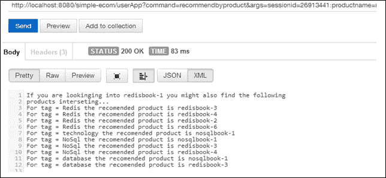

用户想要浏览产品并查看其他推荐产品时的屏幕截图

+   `Add2CartCommand`：这将实现`add2cart`命令。命令的实现如下：

```go
package org.learningRedis.web.sessionmgmt.commands;
import java.util.HashMap;
import java.util.Map;
import org.learningRedis.web.Commands;
import org.learningRedis.web.util.Argument;
import org.learningRedis.web.util.ShoppingCartDBManager;
import org.learningRedis.web.util.UserDBManager;
public class Add2CartCommand extends Commands {
  public Add2CartCommand(Argument argument) {
    super(argument);
  }
  @Override
  public String execute() {
    System.out.println(this.getClass().getSimpleName() + ":  " + " Entering the execute function");
    String result = "did not update the shopping cart";
    String sessionid = this.getArgument().getValue("sessionid");
    String product = this.getArgument().getValue("product");
    String[] productList = product.split(",");
    Map<String, String> productQtyMap = new HashMap<String, String>();
    for (String _product : productList) {
      String[] nameQty = _product.split("@");
      productQtyMap.put(nameQty[0], nameQty[1]);
    }
    if (UserDBManager.singleton.doesSessionExist(sessionid)) {
      result = ShoppingCartDBManager.singleton.addToShoppingCart(sessionid, productQtyMap);
    }
    return "Result : " + result;
  }
}
```

测试 URL：`http://localhost:8080/simple-ecom/userApp?command=add2cart&args=sessionid=26913441:product=Redisbook-1@2,Redisbook-4@1`。

描述：此命令将产品及其数量放入购物车。需要关注的 URL 中的两个部分是`command`，它等于`add2cart`，以及参数部分，即`args`。参数包含两个键值对。第一个是会话 ID，第二个是产品的名称和数量，用特殊字符`@`分隔。以下图显示了我已成功将产品添加到购物车中：

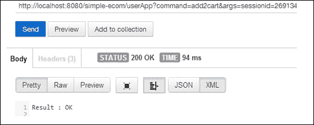

用户想要将产品添加到购物车时的屏幕截图

+   `ShowMyCartCommand`：这将实现`showmycart`命令。命令的实现如下：

```go
package org.learningRedis.web.sessionmgmt.commands;
import java.util.Map;
import java.util.Set;
import org.learningRedis.web.Commands;
import org.learningRedis.web.util.Argument;
import org.learningRedis.web.util.ShoppingCartDBManager;
public class ShowMyCartCommand extends Commands {
  public ShowMyCartCommand(Argument argument) {
    super(argument);
  }
  @Override
  public String execute() {
    System.out.println(this.getClass().getSimpleName() + ":  " + " Entering the execute function");
    String sessionid = this.getArgument().getValue("sessionid");
    Map<String, String> productMap = ShoppingCartDBManager.singleton.myCartInfo(sessionid);
    StringBuffer stringBuffer = new StringBuffer();
    if (!productMap.isEmpty()) {
      stringBuffer.append("Your shopping cart contains the following : ");
      stringBuffer.append("\n");
      Set<String> set = productMap.keySet();
      int i = 1;
      for (String str : set) {
        stringBuffer.append("[" + i + "] product name = " + str + " Qty = " + productMap.get(str) + "\n");
        i++;
      }
      return stringBuffer.toString();
    } else {
      return " your shopping cart is empty.";
    }
  }
}
```

测试 URL：`http://localhost:8080/simple-ecom/userApp?command=showmycart&args=sessionid=26913441`。

描述：此命令将产品及其数量放入购物车。需要关注的 URL 中的两个部分是`command`，它等于`showmycart`，以及参数部分，即`args`。参数只包含会话 ID。以下图显示了我的购物车：

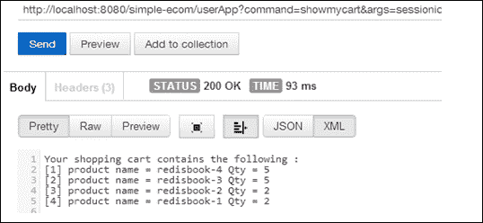

用户想要查看他的购物车时的屏幕截图

+   `EditCartCommand`：这将实现`editcart`命令。命令的实现如下：

```go
package org.learningRedis.web.sessionmgmt.commands;
import java.util.HashMap;
import java.util.Map;
import org.learningRedis.web.Commands;
import org.learningRedis.web.util.Argument;
import org.learningRedis.web.util.ShoppingCartDBManager;
import org.learningRedis.web.util.UserDBManager;
public class EditCartCommand extends Commands {
  public EditCartCommand(Argument argument) {
    super(argument);
  }
  @Override
  public String execute() {
    System.out.println(this.getClass().getSimpleName() + ":  " + " Entering the execute function");
    String result = "did not edit the shopping cart";
    String sessionID = this.getArgument().getValue("sessionid");
    String product = this.getArgument().getValue("product");
    String[] productList = product.split(",");
    Map<String, String> productQtyMap = new HashMap<String, String>();
    for (String _product : productList) {
      String[] nameQty = _product.split("@");
      productQtyMap.put(nameQty[0], nameQty[1]);
    }
    if (UserDBManager.singleton.doesSessionExist(sessionID)) {
      result = ShoppingCartDBManager.singleton.editMyCart(sessionID, productQtyMap);
    }
    return "result : " + result;
  }
}
```

测试 URL：`http://localhost:8080/simple-ecom/userApp?command=editcart&args=sessionid=26913441:product=Redisbook-4@0,Redisbook-2@1`。

描述：此命令将编辑购物车中的产品和它们的数量。需要关注 URL 中的两个部分，一个是`command`，等于`editcart`，另一个是参数部分，即`args`。参数包含产品及其新数量的键值对。如果数量标记为`0`，则产品将从购物车中移除。再次执行`showmycart`命令，购物车应该反映出更新的值。以下图显示了更新的值：

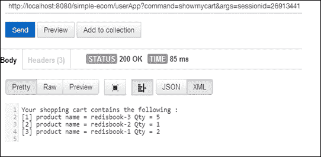

用户在编辑购物车后想要查看购物车的屏幕截图

+   `BuyCommand`：这将实现`browse`命令。命令的实现如下：

```go
package org.learningRedis.web.sessionmgmt.commands;
import org.learningRedis.web.Commands;
import org.learningRedis.web.util.Argument;
import org.learningRedis.web.util.ShoppingCartDBManager;
public class BuyCommand extends Commands {
  public BuyCommand(Argument argument) {
    super(argument);
  }
  @Override
  public String execute() {
    System.out.println(this.getClass().getSimpleName() + ":  " + " Entering the execute function");
    String sessionid = this.getArgument().getValue("sessionid");
    String shoppingdetails = ShoppingCartDBManager.singleton.buyItemsInTheShoppingCart(sessionid);
    return shoppingdetails;
  }
}
```

测试 URL：`http://localhost:8080/simple-ecom/userApp?command=buy&args=sessionid=26913441`。

描述：此命令将购买购物车中的产品。由于这是一个演示网站，与支付网关没有连接，但拥有此命令的意图是在进行购买时增加“点击”计数器。购买产品时，推荐引擎的点数会增加 10 个，而在浏览产品时只增加 1 个：

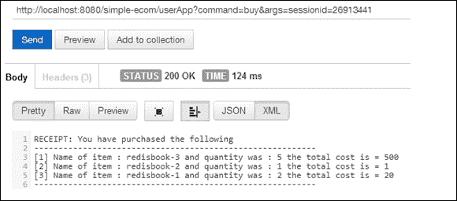

进行虚拟购买

此时，回顾`recommendbyproduct`命令将会非常有趣。产品显示的顺序会改变，因为每次购买都会给产品的受欢迎程度增加 10 个点。`recommendbyproduct`是针对产品`Redisbook-1`的。测试 URL 如下：`http://localhost:8080/simple-ecom/userApp?command=recommendbyproduct&args=sessionid=26913441:productname=Redisbook-1`。

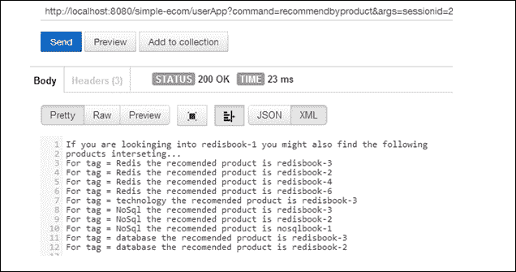

成功购买后重新排列产品列表的屏幕截图（在线分析）

+   `MyStatusCommand`：这将实现`stats`命令。命令的实现如下：

```go
package org.learningRedis.web.analytics.commands;
import java.util.Iterator;
import java.util.Set;
import org.learningRedis.web.Commands;
import org.learningRedis.web.util.AnalyticsDBManager;
import org.learningRedis.web.util.Argument;
import org.learningRedis.web.util.UserDBManager;
public class MyStatusCommand extends Commands {
  public MyStatusCommand(Argument argument) {
    super(argument);
  }
  @Override
  public String execute() {
    System.out.println(this.getClass().getSimpleName() + ":  " + "Entering the execute function");
    String sessionID = this.getArgument().getValue("sessionid");
    if (UserDBManager.singleton.doesSessionExist(sessionID)) {
      Set<String> browsingHistory = AnalyticsDBManager.singleton.getBrowsingHistory(sessionID);
      StringBuffer buffer = new StringBuffer();
      buffer.append(" View your browsing history where the one on top is the least visited product");
      buffer.append("\n and the product at the bottom is the most frequented product ");
      buffer.append("\n");
      Iterator<String> iterator = browsingHistory.iterator();
      int i = 1;
      while (iterator.hasNext()) {
        buffer.append("[" + i + "] " + iterator.next() + "\n");
        i++;
      }
      System.out.println(this.getClass().getSimpleName() + ":  " + "Printing the result for execute function");
      System.out.println("Result = " + buffer.toString());
      return buffer.toString();
    } else {
      return "history is not available";
    }
  }
}
```

测试 URL：`http://localhost:8080/simple-ecom/userApp?command=stats&args=sessionid=26913441`。

描述：此命令将给出用户的浏览历史。结果将根据用户重新访问特定产品的频率列出。需要关注 URL 中的两个部分，一个是`command`，等于`stats`，另一个是参数部分，即`args`。参数包含用户的会话 ID。以下图表示了具有会话 ID **26913441** 的用户的浏览历史：

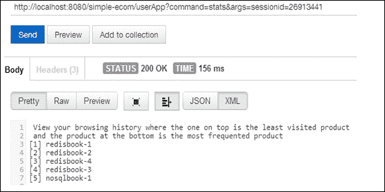

查看用户的浏览历史的屏幕截图

+   `MyPurchaseHistoryCommand`：这将实现`mypurchasehistory`命令。命令的实现如下：

```go
package org.learningRedis.web.sessionmgmt.commands;
import java.util.List;
import org.learningRedis.web.Commands;
import org.learningRedis.web.util.AnalyticsDBManager;
import org.learningRedis.web.util.Argument;
public class MyPurchaseHistoryCommand extends Commands {
  public MyPurchaseHistoryCommand(Argument argument) {
    super(argument);
  }
  @Override
  public String execute() {
    System.out.println(this.getClass().getSimpleName() + ":  " + " Entering the execute function");
    StringBuffer report = new StringBuffer();
    String sessionid = this.getArgument().getValue("sessionid");
    List<String> purchasehistory = AnalyticsDBManager.singleton.getMyPurchaseHistory(sessionid);
    report.append("Your purchase history is as follows : \n");
    int i = 0;
    for (String purchase : purchasehistory) {
      report.append("[" + i + "] You purchased " + purchase);
      report.append("\n");
      i++;
    }
    return report.toString();
  }
}
```

测试 URL：`http://localhost:8080/simple-ecom/userApp?command=mypurchasehistory&args=sessionid=26913441`。

描述：此命令将给出用户的购买历史。结果将根据用户购买特定产品的日期列出。需要关注 URL 中的两个部分，一个是`command`，等于`stats`，另一个是参数部分，即`args`。参数是用户的会话 ID：

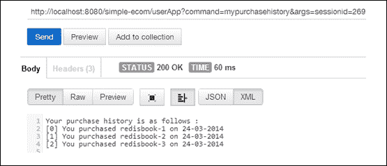

查看用户的购买历史的屏幕截图

+   `ReloginCommand`：这将实现`relogin`命令。命令的实现如下：

```go
package org.learningRedis.web.sessionmgmt.commands;
import org.learningRedis.web.Commands;
import org.learningRedis.web.util.Argument;
import org.learningRedis.web.util.UserDBManager;
public class ReloginCommand extends Commands {
  public ReloginCommand(Argument argument) {
    super(argument);
  }
  @Override
  public String execute() {
    System.out.println(this.getClass().getSimpleName() + ":  " + " Entering the execute function");
    String name = this.getArgument().getValue("name");
    String password = this.getArgument().getValue("password");
    if (UserDBManager.singleton.doesUserExist(name)) {
      if (UserDBManager.singleton.getUserPassword(name).equals(password)) {
        String sessionID = UserDBManager.singleton.getUserSessionId(name);
        return "ReLogin successful \n" + name + " \n use the following session id : " + sessionID;
      } else {
        return " ReLogin failed ...invalid password ";
      }
    } else {
      return " please register before executing command for login ";
    }
  }
}
```

测试 URL：`http://localhost:8080/simple-ecom/userApp?command=relogin&args=name=vinoo:password=******`。

描述：此命令将再次检查用户和用户的密码，并返回用户关联的会话 ID。想要有一个会话，可以存在用户的许多购物和浏览会话。

+   `LogoutCommand`：这将实现`logout`命令。命令的实现如下：

```go
package org.learningRedis.web.sessionmgmt.commands;
import org.learningRedis.web.Commands;
import org.learningRedis.web.util.Argument;
import org.learningRedis.web.util.UserDBManager;
public class LogoutCommand extends Commands {
  public LogoutCommand(Argument argument) {
    super(argument);
  }
  @Override
  public String execute() {
    System.out.println(this.getClass().getSimpleName() + ":  " + " Entering the execute function");
    String sessionid = this.getArgument().getValue("sessionid");
    if (UserDBManager.singleton.expireSession(sessionid)) {
      return "logout was clean";
    } else {
      return "logout was not clean";
    }
  }
}
```

测试 URL：`http://localhost:8080/simple-ecom/userApp?command=logout&args=sessionid=26913441`。

描述：此命令将登出用户系统，并根据会话 ID 删除用户的所有数据存储，如购买历史记录、购物车和浏览历史记录。

现在我们已经掌握了命令，让我们来看看这个包，它将负责管理连接和其他与 Redis 的功能调用。

## RedisDBManager

这个类是这个应用程序的支撑，它负责与数据库连接和管理连接池。它还有一些实用功能。实现如下代码片段所示：

```go
package org.learningRedis.web.util;
import java.text.DateFormat;
import java.text.SimpleDateFormat;
import java.util.Date;
import Redis.clients.jedis.Jedis;
import Redis.clients.jedis.JedisPool;
public class RedisDBManager {
  private static Date date = new Date();
  private static int minimum = 1;
  private static int maximum = 100000000;
  // going with the default pool.
  private static JedisPool connectionPool = new JedisPool("localhost", 6379);
  public Jedis getConnection() {
    return connectionPool.getResource();
  }
  public void returnConnection(Jedis jedis) {
    connectionPool.returnResource(jedis);
  }
  public static String getDate() {
    DateFormat dateFormat = new SimpleDateFormat("dd-MM-yyyy");
    String dateValue = dateFormat.format(date);
    return dateValue;
  }
  public static String getRandomSessionID() {
    int randomNum = minimum + (int) (Math.random() * maximum);
    return new Integer(randomNum).toString();
  }
}
```

## ProductDBManager

这个类扩展了`RedisDBManager`，负责向数据库发出与产品相关的功能调用。该类的实现如下：

```go
package org.learningRedis.web.util;
import java.util.ArrayList;
import java.util.BitSet;
import java.util.HashMap;
import java.util.List;
import java.util.Map;
import java.util.Set;
import Redis.clients.jedis.Jedis;
public class ProductDBManager extends RedisDBManager {
  private ProductDBManager() {
  }
  public static ProductDBManager singleton = new ProductDBManager();
  public boolean commisionProduct(Map<String, String> productAttributes) {
    Jedis jedis = this.getConnection();
    String productCreationResult = jedis.hmset(productAttributes.get("name"), productAttributes);
    if (productCreationResult.toLowerCase().equals("ok")) {
      this.returnConnection(jedis);
      return true;
    } else {
      this.returnConnection(jedis);
      return false;
    }
  }
  public boolean enterTagEntries(String name, String string) {
    Jedis jedis = this.getConnection();
    String[] tags = string.split(",");
    boolean boolResult = false;
    List<String> tagList = new ArrayList<String>();
    for (String tag : tags) {
      String[] tagAndRating = tag.split("@");
      tagList.add(tagAndRating[0]);
    }
    for (String tag : tagList) {
      long result = jedis.zadd(tag.toLowerCase(), 0, name);
      if (result == 0) {
        break;
      } else {
        boolResult = true;
      }
    }
    this.returnConnection(jedis);
    return boolResult;
  }
  public String getProductInfo(String name) {
    Jedis jedis = this.getConnection();
    Map<String, String> map = jedis.hgetAll(name);
    StringBuffer stringBuffer = new StringBuffer();
    stringBuffer.append("Following are the product attributes for  " + name);
    stringBuffer.append("\n");
    Set<String> keys = map.keySet();
    int i = 1;
    for (String key : keys) {
      stringBuffer.append("[" + i + "] . " + key + " value : " + map.get(key));
      stringBuffer.append("\n");
      i++;
    }
    this.returnConnection(jedis);
    return stringBuffer.toString();
  }
  public String getTagValues(String tagName) {
    Jedis jedis = this.getConnection();
    StringBuffer stringBuffer = new StringBuffer();
    Set<String> sortedTagList = jedis.zrange(tagName.toLowerCase(), 0, 10000);
    stringBuffer.append("The following products are listed as per the hit rate \n");
    int i = 1;
    for (String tagname : sortedTagList) {
      stringBuffer.append(" [" + i + "] " + tagname + "\n");
      i++;
    }
    this.returnConnection(jedis);
    return stringBuffer.toString();
  }
  public boolean keyExist(String keyName) {
    Jedis jedis = this.getConnection();
    boolean result = jedis.exists(keyName);
    this.returnConnection(jedis);
    return result;
  }
  public int getPurchaseToday(String productName) {
    Jedis jedis = this.getConnection();
    if (jedis.get(productName + "@purchase:" + getDate()) != null) {
      BitSet users = BitSet.valueOf(jedis.get(productName + "@purchase:" + getDate()).getBytes());
      this.returnConnection(jedis);
      return users.cardinality();
    } else {
      this.returnConnection(jedis);
      return 0;
    }
  }
  public Map<String, Integer> getProductTags(String productname) {
    Jedis jedis = this.getConnection();
    String producttags = jedis.hget(productname, "tags");
    Map<String, Integer> map = new HashMap<String, Integer>();
    String[] tagAndweights = producttags.split(",");
    for (String tagAndWeight : tagAndweights) {
      map.put(tagAndWeight.split("@")[0], new Integer(tagAndWeight.split("@")[1]));
    }
    this.returnConnection(jedis);
    return map;
  }
}
```

## AnalyticsDBManager

这个类扩展了`RedisDBManager`，负责向数据库发出与分析相关的功能调用。该类的实现如下：

```go
package org.learningRedis.web.util;
import java.util.ArrayList;
import java.util.BitSet;
import java.util.Iterator;
import java.util.List;
import java.util.Set;
import Redis.clients.jedis.Jedis;
public class AnalyticsDBManager extends RedisDBManager {
  private AnalyticsDBManager() {
  }
  public static AnalyticsDBManager singleton = new AnalyticsDBManager();
  public void registerInSessionTracker(String sessionID) {
    Jedis jedis = this.getConnection();
    Long sessionvalue = new Long(sessionID);
    jedis.setbit("sessionIdTracker", sessionvalue, true);
    this.returnConnection(jedis);
  }
  public void updateBrowsingHistory(String sessionID, String productname) {
    Jedis jedis = this.getConnection();
    jedis.zincrby(sessionID + "@browsinghistory", 1.0, productname);
    this.returnConnection(jedis);
  }
  public Set<String> getBrowsingHistory(String sessionID) {
    Jedis jedis = this.getConnection();
    Set<String> range = jedis.zrange(sessionID + "@browsinghistory", 0, 1000000);
    this.returnConnection(jedis);
    return range;
  }
  public int getVisitToday(String productName) {
    Jedis jedis = this.getConnection();
    if (jedis.get(productName + "@visit:" + getDate()) != null) {
      BitSet users = BitSet.valueOf(jedis.get(productName + "@visit:" + getDate()).getBytes());
      this.returnConnection(jedis);
      return users.cardinality();
    } else {
      this.returnConnection(jedis);
      return 0;
    }
  }
  public void updateProductVisit(String sessionid, String productName) {
    Jedis jedis = this.getConnection();
    jedis.setbit(productName + "@visit:" + getDate(), new Long(sessionid), true);
    this.returnConnection(jedis);
  }
  public void updateProductPurchase(String sessionid, String productName) {
    Jedis jedis = this.getConnection();
    jedis.setbit(productName + "@purchase:" + getDate(), new Long(sessionid), true);
    this.returnConnection(jedis);
  }
  public void updateRatingInTag(String productname, double rating) {
    Jedis jedis = this.getConnection();
    String string = jedis.hget(productname, "tags");
    String[] tags = string.split(",");
    List<String> tagList = new ArrayList<String>();
    for (String tag : tags) {
      String[] tagAndRating = tag.split("@");
      tagList.add(tagAndRating[0]);
    }
    for (String tag : tagList) {
      jedis.zincrby(tag.toLowerCase(), rating, productname);
    }
    this.returnConnection(jedis);
  }
  public List<String> getMyPurchaseHistory(String sessionid) {
    Jedis jedis = this.getConnection();
    String name = jedis.hget(sessionid + "@sessiondata", "name");
    List<String> purchaseHistory = jedis.lrange(name + "@purchasehistory", 0, 100);
    this.returnConnection(jedis);
    return purchaseHistory;
  }
  public String getTagHistory(String tagname) {
    Jedis jedis = this.getConnection();
    Set<String> sortedProductList = jedis.zrange(tagname.toLowerCase(), 0, 10000);
    StringBuffer stringBuffer = new StringBuffer();
    stringBuffer.append("The following products are listed as per the hit rate \n");
    int i = 1;
    for (String productname : sortedProductList) {
      stringBuffer.append(" [" + i + "] " + productname + " and the score is "
          + jedis.zscore(tagname.toLowerCase(), productname) + "\n");
      i++;
    }
    this.returnConnection(jedis);
    return stringBuffer.toString();
  }
  public List<String> getTopProducts(int slotfortag, String tag) {
    Jedis jedis = this.getConnection();
    Set<String> sortedProductList = jedis.zrevrange(tag.toLowerCase(), 0, 100000000);
    List<String> topproducts = new ArrayList<String>();
    Iterator<String> iterator = sortedProductList.iterator();
    int index = 0;
    while (iterator.hasNext()) {
      if (index <= slotfortag) {
        topproducts.add(iterator.next());
        index++;
      } else {
        break;
      }
    }
    this.returnConnection(jedis);
    return topproducts;
  }
}
```

## ShoppingCartDBManager

这个类扩展了`RedisDBManager`，负责向数据库发出与购物车相关的功能调用。实现如下：

```go
package org.learningRedis.web.util;
import java.util.Map;
import java.util.Set;
import Redis.clients.jedis.Jedis;
public class ShoppingCartDBManager extends RedisDBManager {
  private ShoppingCartDBManager() {
  }
  public static ShoppingCartDBManager singleton = new ShoppingCartDBManager();
  public String addToShoppingCart(String sessionid, Map<String, String> productQtyMap) {
    Jedis jedis = this.getConnection();
    String result = jedis.hmset(sessionid + "@shoppingcart", productQtyMap);
    this.returnConnection(jedis);
    return result;
  }
  public Map<String, String> myCartInfo(String sessionid) {
    Jedis jedis = this.getConnection();
    Map<String, String> shoppingcart = jedis.hgetAll(sessionid + "@shoppingcart");
    this.returnConnection(jedis);
    return shoppingcart;
  }
  public String editMyCart(String sessionID, Map<String, String> productQtyMap) {
    Jedis jedis = this.getConnection();
    String result = "";
    if (jedis.exists(sessionID + "@shoppingcart")) {
      Set<String> keySet = productQtyMap.keySet();
      for (String key : keySet) {
        if (jedis.hexists(sessionID + "@shoppingcart", key)) {
          Integer intValue = new Integer(productQtyMap.get(key)).intValue();
          if (intValue == 0) {
            jedis.hdel(sessionID + "@shoppingcart", key);
          } else if (intValue > 0) {
            jedis.hset(sessionID + "@shoppingcart", key, productQtyMap.get(key));
          }
        }
      }
      result = "Updated the shopping cart for user";
    } else {
      result = "Could not update the shopping cart for the user !! ";
    }
    this.returnConnection(jedis);
    return result;
  }
  public String buyItemsInTheShoppingCart(String sessionid) {
    Jedis jedis = this.getConnection();
    Map<String, String> cartInfo = jedis.hgetAll(sessionid + "@shoppingcart");
    Set<String> procductNameList = cartInfo.keySet();
    StringBuffer stringBuffer = new StringBuffer();
    stringBuffer.append("RECEIPT: You have purchased the following \n");
    stringBuffer.append("-----------------------------------" + "\n");
    int i = 1;
    for (String productname : procductNameList) {
      String unitCost = jedis.hget(productname, "cost");
      int unitCostValue = new Integer(unitCost).intValue();
      String quantity = cartInfo.get(productname);
      int quantityValue = new Integer(quantity).intValue();
      stringBuffer.append("[" + i + "] Name of item : " + productname + " and quantity was : " + quantity
          + " the total cost is = " + quantityValue * unitCostValue + "\n");
      i++;
    }
    stringBuffer.append("-----------------------------------------");
    stringBuffer.append("#");
    for (String productname : procductNameList) {
      stringBuffer.append(productname);
      stringBuffer.append(",");
    }
    // Update the user purchase history:
    String name = jedis.hget(sessionid + "@sessiondata", "name");
    for (String productname : procductNameList) {
      jedis.lpush(name + "@purchasehistory", productname + " on " + getDate());
    }
    this.returnConnection(jedis);
    return stringBuffer.toString();
  }
}
```

## UserCartDBManager

这个类扩展了`RedisDBManager`，负责向数据库发出与用户相关的功能调用。实现如下：

```go
package org.learningRedis.web.util;
import java.util.Date;
import java.util.HashMap;
import java.util.Map;
import Redis.clients.jedis.Jedis;
public class UserDBManager extends RedisDBManager {
  private UserDBManager() {
  }
  public static UserDBManager singleton = new UserDBManager();
  public String getUserName(String sessionID) {
    Jedis jedis = this.getConnection();
    String name = jedis.hget(sessionID + "@sessiondata", "name");
    this.returnConnection(jedis);
    return name;
  }
  public void createUser(Map<String, String> attriuteMap) {
    Jedis jedis = this.getConnection();
    Map<String, String> map = attriuteMap;
    map.put("creation-time", new Date().toString());
    map.put("sessionID", "null");
    jedis.hmset(attriuteMap.get("name") + "@userdata", map);
    this.returnConnection(jedis);
  }
  public Map<String, String> getRegistrationMap(String name) {
    Jedis jedis = this.getConnection();
    Map<String, String> attributeMap = new HashMap<String, String>();
    attributeMap = jedis.hgetAll(name + "@userdata");
    this.returnConnection(jedis);
    return attributeMap;
  }
  public boolean doesUserExist(String name) {
    Jedis jedis = this.getConnection();
    String value = jedis.hget(name + "@userdata", "name");
    this.returnConnection(jedis);
    if (value == null) {
      return false;
    } else if (value != null & value.equals(name)) {
      return true;
    } else {
      return false;
    }
  }
  public void setRegistrationMap(String name, Map<String, String> attributeMap) {
    Jedis jedis = this.getConnection();
    jedis.hmset(name + "@userdata", attributeMap);
    this.returnConnection(jedis);
  }
  public String getUserPassword(String name) {
    Jedis jedis = this.getConnection();
    String password = jedis.hget(name + "@userdata", "password");
    this.returnConnection(jedis);
    return password;
  }
  public void login(String sessionID, String name) {
    Jedis jedis = this.getConnection();
    Map<String, String> loginMap = new HashMap<String, String>();
    loginMap.put("LastLogin", new Date().toString());
    loginMap.put("loginstatus", "LoggedIn");
    loginMap.put("sessionID", sessionID);
    loginMap.put("name", name);
    jedis.hmset(sessionID + "@sessiondata", loginMap);
    this.returnConnection(jedis);
  }
  public boolean editRegistrationMap(Map<String, String> editMap) {
    Jedis jedis = this.getConnection();
    if (jedis.hget(editMap.get("name") + "@userdata", "sessionID").equals(editMap.get("sessionid"))) {
      jedis.hmset(editMap.get("name") + "@userdata", editMap);
      this.returnConnection(jedis);
      return true;
    } else {
      this.returnConnection(jedis);
      return false;
    }
  }
  public String getUserSessionId(String name) {
    Jedis jedis = this.getConnection();
    String sessionID = jedis.hget(name + "@userdata", "sessionID");
    this.returnConnection(jedis);
    return sessionID;
  }
  public boolean expireSession(String sessionid) {
    // Get name from session data structure
    Jedis jedis = this.getConnection();
    String name = jedis.hget(sessionid + "@sessiondata", "name");
    // remove session id from userdata
    if (name != null) {
      Long sessionvalue = new Long(jedis.hget(name + "@userdata", "sessionID"));
      jedis.hset(name + "@userdata", "sessionID", "null");
      // remove session data : use TTL
      if (jedis.exists(sessionid + "@sessiondata")) {
        jedis.expire(sessionid + "@sessiondata", 1);
      }
      // remove browsing history : use TTL
      if (jedis.exists(sessionid + "@browsinghistory")) {
        jedis.expire(sessionid + "@browsinghistory", 1);
      }
      // remove shopping cart : use TTL
      if (jedis.exists(sessionid + "@shoppingcart")) {
        jedis.expire(sessionid + "@shoppingcart", 1);
      }
      // make the value at offset as '0'
      jedis.setbit("sessionIdTracker", sessionvalue, false);
      this.returnConnection(jedis);
      return true;
    } else {
      this.returnConnection(jedis);
      return false;
    }
  }
  public boolean doesSessionExist(String sessionid) {
    Jedis jedis = this.getConnection();
    if (jedis.hexists(sessionid + "@sessiondata", "name")) {
      this.returnConnection(jedis);
      return true;
    } else {
      this.returnConnection(jedis);
      return false;
    }
  }
}
```

# 总结

因此，在本章中，我们学习了如何使用 Redis 作为其支撑构建一个简单的电子商务网站。此外，我们还学习了 Redis 如何在进行在线分析时变得方便。这个示例网站缺乏我们在之前章节中学到的可扩展性功能。我建议读者将这种能力添加到这个代码库中作为一种练习，并且享受这个令人敬畏的数据存储。

在下一章中，我将透露如何在业务应用程序中使用 Redis，并制作一些在所有业务应用程序中常用的应用程序。
