# 第七章 Redis 在商业应用程序中

在第六章中，*Redis 在 Web 应用程序中*，你看到了 Redis 在 Web 应用程序中的用处。Redis 的这种用处可以扩展到商业应用程序。与任何企业一样，外层或边界应用程序通常由 Web 应用程序组成，这在某种程度上封装了核心异构的业务应用程序。这些业务应用程序构成了企业的核心骨干。

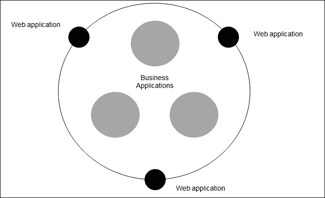

企业生态系统中应用程序的简单表示

正如你们在多年的项目和任务中所经历的那样，这些商业应用程序在业务功能上是多种多样的。然而，它们都有一些共同的特征和方面。在本章中，我们将介绍其中一些特征，并看看 Redis 如何适应商业应用程序的环境。首先，任何应用程序中最常见和最基本的特性就是**配置管理**。

随后的主题考虑了配置管理，并将 Redis 作为构建企业级应用程序的核心组件之一。

# 配置管理

经常会看到不当的配置管理或缺乏配置管理在开发和维护周期的后期造成问题。另一个问题是当可伸缩性成为问题时，添加更多的软件节点；然后，跨所有节点维护状态就成为一个挑战。商业应用程序一直依赖于 RDBMS 来存储配置数据。这种方法的问题在于性能；如果设计是**基于 PULL**的，那么**PULL**-based 设计的问题就是性能惩罚。另一个问题是如果并发性高（因为其他业务功能），那么这些 RDBMS 也必须满足这些请求以及配置数据的请求。

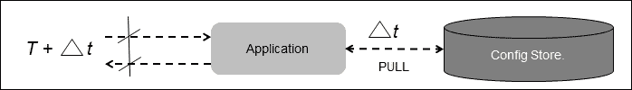

基于 PULL 的配置管理设计

这个想法是将设计从**基于 PULL**改为**基于 PUSH**。这种技术的最大优势是性能。状态或配置数据保持接近应用程序，每当发生变化时，数据就会被推送到应用程序的本地缓存中。另一个要求是要有一个在计算资源占用方面较低的系统。

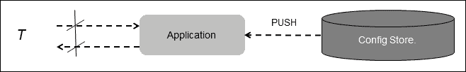

基于 PUSH 的配置管理设计

Redis 凭借其类似瑞士军刀的功能、低资源占用、各种语言的客户端库的可用性以及大规模扩展的能力，使其成为处理这一需求的良好选择。我们将在随后的主题中讨论的示例应用程序将突出这一点。这个示例应用程序只是用于演示，并不保证在生产环境中使用。所以，让我们开心地开发一个以 Redis 为支撑的配置管理服务器，并称之为**gossip server**。

## Gossip server

gossip server 是一个集中管理配置数据并以同步方式分组服务的节点。**Gossip Server**将保存数据，并由一个名为**Gossip Server (Admin)**的节点管理。**Gossip Server**反过来将管理连接到它的所有其他节点。以下图表描述了 gossip server 的责任是将配置数据推送到连接到它的所有节点：

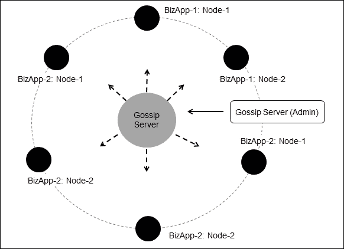

Gossip Server 设计概述

在这个八卦服务器内部是 Redis 服务器，它提供了所提议的配置管理系统可能需要的所有功能。节点可以用任何编程语言实现，但是为了与本书中的示例保持一致，我们将在这个示例中使用 Java 作为实现语言。这个八卦服务器的主要思想是在下次需要设计企业级解决方案时，为配置管理保留一个共同的组件，并在这样做时牢记 Redis。

在我们进入我们共同组件的实施和设计规范之前，让我们就这个八卦服务器的功能达成一致。

以下是八卦服务器的功能：

+   八卦服务器维护所有信息或配置数据

+   它充当中心枢并将信息或配置数据分发给所有连接的节点

+   所有节点，包括主节点，都连接到中心枢以发送消息

+   主节点负责向特定客户端节点或所有客户端节点推送数据

+   所有客户端节点在层次结构中处于相同位置

+   所有客户端节点可以嵌入到要成为配置管理一部分的解决方案中

+   节点有一个生命周期，它们由自己管理

+   当节点改变状态时，它们会通知主节点和其他对等客户端节点

+   节点也可以根据业务逻辑向其他对等节点发送消息

### 节点

八卦服务器中的节点是所有消息流动的客户端组件。在当前示例中，节点可以分为两种类型，客户端节点和主节点。

客户端节点本质上是可以插入任何需要配置管理的解决方案中的组件。客户端节点负责它们在 Redis 中存储的应用程序数据。节点中的数据可以来自它们所插入的应用程序，也可以来自主节点，主节点可以将数据推送到客户端节点。允许主节点推送数据或者发布数据到八卦服务器的整个想法是将应用程序的配置数据管理责任从应用程序本身转移到另一个源头。这样做的好处是可以在运行时将新的配置数据引入应用程序，而无需停止应用程序。

以下图表是八卦服务器的配置数据推送能力的表示：

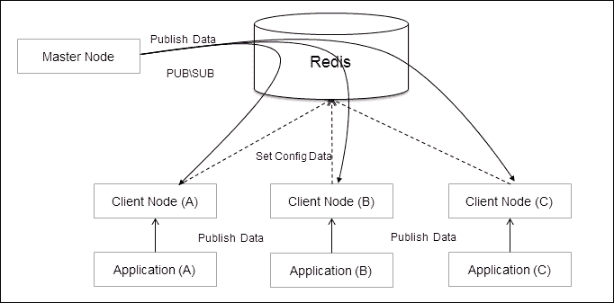

通过应用程序或主节点将数据推送到八卦服务器

在我们进一步实施之前，最好了解客户端节点在其生命周期中可以遍历的各种状态。以下图表是客户端节点可以采取的各种路径的快照：

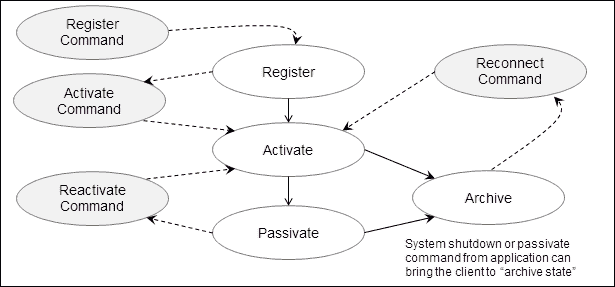

通过应用程序或主节点将数据推送到八卦服务器

客户端节点从**注册**开始其旅程。在**注册**之后，客户端节点需要**激活**自己。一旦客户端节点被激活，它可以**停用**自己或者达到**归档**状态。**归档**状态可以通过关闭应用程序或者主节点发送`Kill`命令来实现。一旦客户端节点处于**停用**状态，它可以通过中间状态**重新激活**来激活自己。如果客户端节点处于**归档**状态，它可以通过中间状态**重新连接**来转换为**激活**状态。

客户端节点的命令围绕着上述状态进行建模，并且还有其他用于数据管理和在生态系统中传递数据的命令。不浪费时间，让我们深入了解系统的设计。

### 分层设计

八卦服务器的设计是极简主义的，非常简单易懂，但有一些需要考虑的事项。正如讨论的那样，参与八卦服务器的节点有两种类型：客户端节点和主节点。每个客户端节点对自己的生命周期负责，主节点对其有有限的控制。节点可以通过传递消息与彼此通信。设计包括四个主要层，如下图所示：

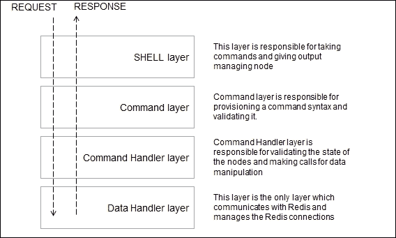

八卦服务器结构层概述

八卦服务器中的包对应于前面图表中描述的层，并包括一些额外的内容。让我们简要介绍一下这些包和它们包含的类。以下是包和它们对应的层的列表：

+   `org.redisch7.gossipserver.shell`: 这对应于**Shell 层**

+   `org.redisch7.gossipserver.commands`: 这对应于**命令层**

+   `org.redisch7.gossipserver.commandhandlers`: 这对应于**命令处理层**

+   `org.redisch7.gossipserver.datahandler`: 这对应于**数据处理层**

+   `org.redisch7.gossipserver.util.commandparser`: 这是一个实用程序包

#### Shell

Shell 是一个程序，它像一个独立的网关一样作用于八卦服务器，同时也是一个应用程序的插件，该应用程序想要使用八卦服务器。Shell 激活节点，节点又为节点准备监听器和命令库。正如讨论的那样，有两种类型的节点：客户端节点和主节点；这些节点的详细讨论在本章的后半部分进行。

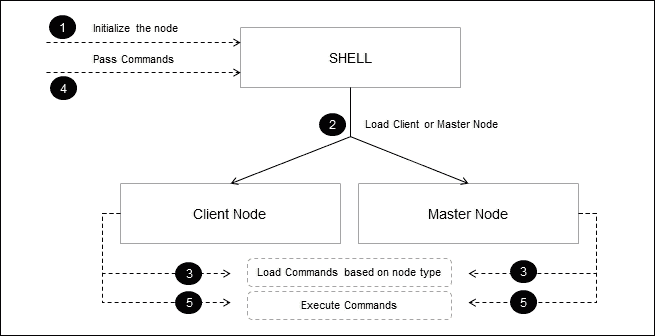

与 shell 的交互

八卦服务器的代码很简单，基本上是将命令委托给节点进行处理。在 Shell 作为独立程序的情况下，响应显示在命令提示符中，而在 Shell 作为 API 插件的情况下，结果对象`CheckResult`被传递回调用它的程序。Shell 被实现为单例。这是`Shell.java`的代码：

```go
package org.redisch7.gossipserver.shell;
/** omitting the import statements**/
public class Shell {
  private Shell() {}
  private Node      node    = null;
  private static Shell  singleton  = new Shell();
  public static Shell instance() {
    return singleton;
  }
  // : as an shell API mode.
  public Shell asClient(String nodename) {
    if (node != null && nodename != null && nodename.trim().length() != 0) {
      node = new ClientNode(nodename);
      return this;
    } else {
      return null;
    }
  }
  public Shell asMaster() {
    if (node != null) {
      node = new MasterNode();
      return this;
    } else {
      return null;
    }
  }
  public CheckResult execute(String commands) {
    CheckResult checkResult = new CheckResult();
    if (commands != null && commands.trim().length() == 0) {
      checkResult = node.process(commands);
    }
    return checkResult;
  }
  // : as a shell standalone mode.
  public static void main(String[] args) throws IOException {
    Shell shell = Shell.instance();
    shell.startInteracting();
  }
  private void startInteracting() throws IOException {
    System.out.println("Please enter the name of the node..");
    BufferedReader nodenameReader = new BufferedReader(new InputStreamReader(System.in));
    String nodename = nodenameReader.readLine();
    if (nodename.equals("master")) {
      node = new MasterNode();
    } else {
      node = new ClientNode(nodename);
    }
    while (true) {
      BufferedReader commandReader = new BufferedReader(new InputStreamReader(System.in));
      String readline = commandReader.readLine();
      if (readline == null) {
        System.out.println("Ctrl + C ");
        break;
      } else {
        CheckResult checkResult = node.process(readline);
        System.out.println(":->" + checkResult.getResult());
        System.out.println(":->" + checkResult.getReason());
        System.out.println(":->" + checkResult.getValue());
      }
    }
    System.exit(0);
  }
}
```

### 监听器

监听器由节点生成并独立于执行 Shell 的线程执行。监听器的基本工作是不断监听传递给节点的任何消息事件。然后解析并相应执行消息。基本思想是为节点提供相互交互的机制。在当前的实现中，是主节点与客户端节点进行交互。这提供了主节点对客户端节点的有限远程控制。另一种通信方式的实现尚未完成，如果需要的话可以很容易地加入，即客户端节点与主节点进行交互。并非所有命令都可以通过这种安排在客户端节点上远程执行。可以远程执行（由主节点）的命令有`SET`、`KILL`和`CLONE`。

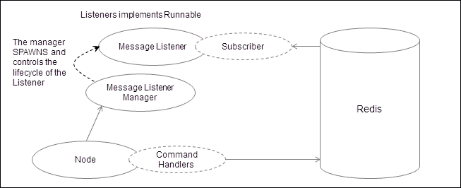

节点、消息监听器管理器、消息监听器和订阅者之间的关系

监听器内部有一个订阅者，它扩展了`JedisPubSub`抽象类，这是 Jedis 客户端库对 Redis 消息传递能力的钩子。节点维护着监听器的生命周期。节点在一些命令上激活监听器，比如**激活**、**重新连接**等，而在一些命令上停用监听器，比如`停用`、`KILL`等。

这是客户端监听器的代码，即`ClientEventMessageListener`.Java:

```go
package org.redisch7.gossipserver.shell;
/** omitting the import statements **/
public class ClientEventMessageListener implements Runnable {
  private Subscriber subscriber = null;
  private Node node;
  private Jedis jedis = ConnectionManager.get();
  private Validator validator = null;
  public ClientEventMessageListener(Node node) {
    this.node = node;
    this.subscriber = new Subscriber(node);
  }
  @Override
  public void run() {
    while (!Thread.currentThread().isInterrupted()) {
      jedis.subscribe(subscriber, node.getNodename());
    }
  }
  public void unsubscribe() {
    subscriber.unsubscribe(node.getNodename());
  }
  public class Subscriber extends JedisPubSub {
    public Subscriber(Node clientNode) {
    }
    @Override
    public void onMessage(String nodename, String readmessage) {
      validator = new Validator();
      validator.configureTemplate().add(new MapListToken());
      validator.setInput(readmessage);
      CheckResult checkResult = validator.validate();
      if (checkResult.getResult()) {
        MapListToken mapListToken = (MapListToken) validator
            .getToken(0);
        if (mapListToken.containsKey("command")) {
          String commandValue = mapListToken.getNValue("command");
          if (commandValue.equals("set")) {
            MapListToken newMapListToken = mapListToken
                .removeElement("command");
            SetCommand command = new SetCommand();
            command.setName(node.getNodename());
            CheckResult result = command.execute(new CommandTokens(
                "set "
                    + newMapListToken
                        .getValueAsSantizedString()));
            System.out.println(result.getResult());
            System.out.println(result.getReason());
          } else if (commandValue.equals("kill")) {
            KillNodeCommand command = new KillNodeCommand();
            command.setName(node.getNodename());
            MapListToken newMapListToken = mapListToken
                .removeElement("command");
            CheckResult result = command.execute(new CommandTokens(
                "kill " + node.getNodename()));
            System.out.println(result.getResult());
            System.out.println(result.getReason());
          } else if (commandValue.equals("clone")) {
            CloneNodeCommand command = new CloneNodeCommand();
            command.setName(node.getNodename());
            MapListToken newMapListToken = mapListToken
                .removeElement("command");
            CheckResult result = command.execute(new CommandTokens(
                "clone "
                    + newMapListToken
                        .getValueAsSantizedString()));
            System.out.println(result.getResult());
            System.out.println(result.getReason());
          } else {
            MessageCommand messageCommand = new MessageCommand();
            messageCommand.setName(nodename);
            CommandTokens commandTokens = new CommandTokens(
                "msg master where msg=illegal_command");
            messageCommand.execute(commandTokens);
          }
        } else {
          System.out
              .println(":->"
                  + checkResult
                      .appendReason("The command sent from publisher does not contain 'command' token"));
        }
      } else {
        System.out.println(":->" + checkResult.getReason());
      }
    }
    @Override
    public void onPMessage(String arg0, String arg1, String arg2) {
      System.out.println(arg1);
      System.out.println(arg2);
    }
    @Override
    public void onPSubscribe(String arg0, int arg1) {
    }
    @Override
    public void onPUnsubscribe(String arg0, int arg1) {
    }
    @Override
    public void onSubscribe(String arg0, int arg1) {
    }
    @Override
    public void onUnsubscribe(String arg0, int arg1) {
    }
  }
}
```

这是主监听器的代码，即`MasterEventMessageListener.java`：

```go
package org.redisch7.gossipserver.shell;
/** omitting the import statements **/
public class MasterEventMessageListener implements Runnable {
  private Subscriber  subscriber  = null;
  private Node    node;
  private Jedis    jedis    = ConnectionManager.get();
  private Validator  validator  = new Validator();
  public MasterEventMessageListener(Node node) {
    this.node = node;
    this.subscriber = new Subscriber(node);
    validator.configureTemplate().add(new MapListToken());
  }
  @Override
  public void run() {
    while (!Thread.currentThread().isInterrupted()) {
      jedis.subscribe(subscriber, node.getNodename());
    }
  }
  public void unsubscribe() {
    subscriber.unsubscribe(node.getNodename());
  }
  public class Subscriber extends JedisPubSub {
    public Subscriber(Node node) {
    }
    @Override
    public void onMessage(String nodename, String readmessage) {
      System.out.println("msg: " + readmessage);
      System.out.println("Not processed further in the current implementation");
    }
    @Override
    public void onPMessage(String arg0, String arg1, String arg2) {
      System.out.println(arg1);
      System.out.println(arg2);
    }
    @Override
    public void onPSubscribe(String arg0, int arg1) {}
    @Override
    public void onPUnsubscribe(String arg0, int arg1) {}
    @Override
    public void onSubscribe(String arg0, int arg1) {}
    @Override
    public void onUnsubscribe(String arg0, int arg1) {}
  }
}
```

#### 监听器管理器

**监听管理器**负责维护监听器的生命周期。监听器可以存在于启动模式或停止模式。Gossip 服务器具有面向事件的设计；因此，客户端节点接受的每个事件都有一个相应的命令被执行。

在系统中，有两种类型的监听管理器，一个是针对客户端节点的称为客户端节点监听管理器，另一个是针对主节点的称为主节点监听管理器。

客户端节点监听管理器被编程为在“激活”、“重新激活”和“重新连接”等命令上启动监听器，并在“停用”和“终止”等命令上停止监听器。

主节点监听管理器被编程为在“启动”等命令上启动监听器，并在“停止”等命令上停止监听器。

以下是`ClientNodeListenerManager.java`的代码：

```go
package org.redisch7.gossipserver.shell;
/** omitting the import statements **/
public class ClientNodeListenerManager implements NodeMessageListenerManager {
  private String            nodename;
  private ClientEventMessageListener  privateEventMessageSubscriber;
  private Thread            commonEventThread;
  private Thread            privateEventThread;
  public ClientNodeListenerManager(ClientNode clientNode) {
    this.nodename = clientNode.getNodename();
    privateEventMessageSubscriber = new ClientEventMessageListener(clientNode);
  }
  @Override
  public void start() {
    System.out.println(" start the client node manager .. ");
    privateEventThread = new Thread(privateEventMessageSubscriber);
    commonEventThread.start();
    privateEventThread.start();
  }
  @Override
  public void stop() {
    System.out.println(" stop the client node manager .. ");
    privateEventMessageSubscriber.unsubscribe();
    commonEventThread.interrupt();
    privateEventThread.interrupt();
  }
  @Override
  public void passCommand(AbstractCommand command) {
    if (command instanceof ActivateCommand || command instanceof ReactivateCommand
        || command instanceof ReConnectCommand) {
      this.start();
    } else if (command instanceof PassivateCommand || command instanceof KillNodeCommand) {
      this.stop();
    }
  }
}
```

以下是`MasterNodeListenerManager.java`的代码：

```go
package org.redisch7.gossipserver.shell;
/** omitting the import statements **/
public class MasterNodeListenerManager implements NodeMessageListenerManager {
  private MasterEventMessageListener  masterEventMessageSubscriber;
  private Thread            privateEventThread;
  private MasterNode          masternode;
  public MasterNodeListenerManager(MasterNode masterNode) {
    this.masternode = masterNode;
    masterEventMessageSubscriber = new MasterEventMessageListener(masternode);
  }
  @Override
  public void start() {
    System.out.println(" start the master node manager .. ");
    privateEventThread = new Thread(masterEventMessageSubscriber);
    privateEventThread.start();
  }
  @Override
  public void stop() {
    System.out.println(" stop the master node manager .. ");
    privateEventThread.interrupt();
    masterEventMessageSubscriber.unsubscribe();
  }
  @Override
  public void passCommand(AbstractCommand command) {
    if (command instanceof StartMasterCommand) {
      this.start();
    } else if (command instanceof StopMasterCommand) {
      this.stop();
    }
  }
}
```

### 数据处理层

这个层或包在其活动中非常直接，比如与 Redis 服务器交互。这一层负责将 Redis 封装起来，使其与应用程序的其余部分隔离开来。

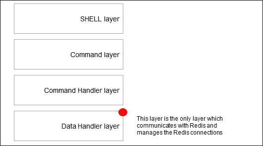

Gossip 服务器结构层概述

以下是当前应用程序使用的数据结构：

+   **注册持有者**：这将作为 Redis 数据存储中的一个集合来实现。这将保存系统中将要注册的所有节点。

+   **激活持有者**：这将作为 Redis 数据存储中的一个集合来实现。这将保存所有将处于“激活”状态的节点。

+   **停用持有者**：这将作为 Redis 数据存储中的一个集合来实现。这将保存所有将处于**停用**状态的节点。

+   **配置存储**：这将作为 Redis 数据存储中的一个映射来实现。这将保存所有与节点相关的配置数据，以名称-值格式进行存储。

+   **存档存储**：这将作为客户端节点本地文件系统中的文件存储来实现。这将保存所有与节点相关的配置数据，以名称-值格式进行存档，并以 JSON 格式存档。

这一层中最重要的类是`JedisUtilImpl`；让我们花一些时间来了解这个类。这个类的性质使得这个类非常庞大但易于理解。

#### JedisUtil.java

这个类在与数据存储进行交互时起着关键作用。所有关于管理节点帐户、状态和数据的逻辑都在这里管理。

### 注意

请注意，我们选择使用`jedis_2.1.0`作为客户端 API 来连接 Redis。在这个客户端库的这个版本中，使用`PIPELINE`函数中的`MULTI`存在一个相关的 bug。

```go
Exception in thread "main" java.lang.ClassCastException: B cannot be cast to java.util.List at redis.clients.jedis.Connection.getBinaryMultiBulkReply(Connection.java:189)
    at redis.clients.jedis.Jedis.hgetAll(Jedis.java:861)
    at com.work.jedisex.JedisFactory.main(JedisFactory.java:59)
```

由于 Redis 是单线程服务器，我们牺牲了在这个应用程序中使用`PIPELINE`中的`MULTI`，因为这不会对 Redis 中的数据完整性产生影响，并且对性能的影响很小。我们继续以单个命令发送命令，而不是批量发送，就像`PIPELINE`的情况一样。Jedis 的未来 API 可能会对此有解决方案，如果您使用更新版本的 Jedis，您可以根据需要更改类。

在其他语言中实现客户端或在 Java 中实现 Redis 的其他客户端实现，不会有问题，因为这是特定于 Jedis 的。

现在我们对`JedisUtil`类有了一定的了解，我们也在某种程度上了解了 gossip 服务器的工作原理以及 gossip 服务器所提供的功能。因此，让我们专注于命令以及它们是如何实现的。作为一个经验法则，数据流可以总结如下图所示：

![JedisUtil.java 命令的数据流顺序# 客户端节点命令以下是可以从客户端节点触发的命令列表：+   “注册”命令+   “激活”命令+   “设置”命令+   获取命令+   状态命令+   删除命令+   停用命令+   `reacyivate`命令+   存档命令+   同步命令+   重新连接命令让我们从设计和实现的角度来看每个命令。## 注册命令此命令将注册节点进入八卦服务器生态系统。执行此命令的先决条件是节点名称应该是唯一的；否则，将向**Shell**发送失败响应。节点名称将存储在 Registration holder 中，该 holder 在 Redis 中实现为 Set 数据结构。除此之外，在注册过程发生时，节点的本地机器上将创建一个存档文件。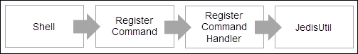

注册命令中数据流的顺序

此命令的语法是：`register`。以下屏幕截图显示了 Shell 控制台中的响应：

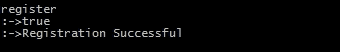

### RegisterCommand 的实现

RegisterCommand 的实现如下所示：

```go
package org.redisch7.gossipserver.commands;
/* OMITTING THE IMPORT STATEMENTS TO SAVE SPACE */
public class RegisterCommand extends AbstractCommand {
  private Validator validator = new Validator();
  public RegisterCommand() {
    validator.configureTemplate().add((new StringToken("register")));
  }
  @Override
  public CheckResult execute(CommandTokens commandTokens) {
    CheckResult checkResult = new CheckResult();
    validator.setInput(commandTokens);
    checkResult = validator.validate();
    if (checkResult.getResult()) {
      List<Token> tokenList = validator.getAllTokens();
      checkResult = new RegisterCommandHandler(this.getName()).process(tokenList);
    }
    if(checkResult.getResult()){
      String path = System.getProperty("user.home") + "\\archive\\";
      File file = new File(path);
      if (!file.exists()) {
        if (file.mkdir()) {
          checkResult.appendReason("Archive folder created!");
        } else {
          checkResult.appendReason("Archive folder exists!");
        }
      }
    }
    return checkResult;
  }
}
```

### RegisterCommandHandler 的实现

RegisterCommandHandler 的实现如下所示：

```go
package org.redisch7.gossipserver.commandhandlers;
/* OMITTING THE IMPORT STATEMENTS TO SAVE SPACE */
public class RegisterCommandHandler extends AbstractCommandHandler {
  public RegisterCommandHandler(String nodename) {
    super(nodename);
  }
  public CheckResult process(List<Token> tokenList) {
    CheckResult checkResult = new CheckResult();
    JedisUtil jedisUtil = new JedisUtil();
    List<Boolean> result = jedisUtil
        .doesExist(this.getNodename(), Arrays
            .asList(ConstUtil.registerationHolder,
                ConstUtil.activationHolder,
                ConstUtil.passivationHolder, ConstUtil.shutdownHolder));
    if ((result.get(0) == false) && (result.get(1) == false)
        && (result.get(2) == false)&& (result.get(3) == false)) {
      checkResult = jedisUtil.registerNode(this.getNodename());
    } else {
      checkResult
          .setFalse("Activation Validation :")
          .appendReason(
              ConstUtil.registerationHolder + " = "
                  + ((Boolean) result.get(0)))
          .appendReason(
              ConstUtil.activationHolder + " = "
                  + ((Boolean) result.get(1)))
          .appendReason(
              ConstUtil.passivationHolder + " = "
                  + ((Boolean) result.get(2)));
    }
    return checkResult;
  }
}
```

## 激活命令

此命令将激活节点进入八卦服务器生态系统。执行此命令的先决条件是节点应该已注册。激活节点时，将向 ACTIVATION-HOLDER 添加一个条目，该条目在 Redis 中实现为 Set。除此之外，在激活时，客户端节点将生成监听器，这些监听器将准备好监听来自主节点的任何事件。这些监听器基本上将在单独的线程上监听事件。

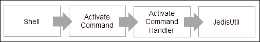

激活命令中数据流的顺序

此命令的语法是：`activate`。以下屏幕截图显示了 Shell 控制台中的响应：

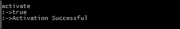

### ActivateCommand 的实现

ActivateCommand 的实现如下所示：

```go
package org.redisch7.gossipserver.commands;
/* OMITTING THE IMPORT STATEMENTS TO SAVE SPACE */
public class ActivateCommand extends AbstractCommand {
  private Validator validator = new Validator();
  public ActivateCommand() {
    validator.configureTemplate().add((new StringToken("activate")));
  }
  @Override
  public CheckResult execute(CommandTokens commandTokens) {
    CheckResult checkResult = new CheckResult();
    validator.setInput(commandTokens);
    checkResult = validator.validate();
    if (checkResult.getResult()) {
      List<Token> tokenList = validator.getAllTokens();
      checkResult = new ActivateCommandHandler(this.getName()).process(tokenList);
    }
    return checkResult;
  }
}
```

### ActivateCommandHandler 的实现

ActivateCommandHandler 的实现如下所示：

```go
package org.redisch7.gossipserver.commandhandlers;
/* OMITTING THE IMPORT STATEMENTS TO SAVE SPACE */
public final class ActivateCommandHandler extends AbstractCommandHandler {
  public ActivateCommandHandler(String nodename) {
    super(nodename);
  }
  public CheckResult process(List<Token> tokenList) {
    CheckResult checkResult = new CheckResult();
    JedisUtil jedisUtil = new JedisUtil();
    List<Boolean> result = jedisUtil.doesExist(this.getNodename(), Arrays
        .asList(ConstUtil.registerationHolder,
            ConstUtil.activationHolder,
            ConstUtil.passivationHolder, ConstUtil.shutdownHolder));
    if ((result.get(0) == true) && (result.get(1) == false)
        && (result.get(2) == false) && (result.get(3) == false)) {
      checkResult = jedisUtil.activateNode(this.getNodename());
    } else {
      checkResult
          .setFalse("Activation Failed :")
          .appendReason(
              ConstUtil.registerationHolder + " = "
                  + ((Boolean) result.get(0)))
          .appendReason(
              ConstUtil.activationHolder + " = "
                  + ((Boolean) result.get(1)))
          .appendReason(
              ConstUtil.passivationHolder + " = "
                  + ((Boolean) result.get(2)))
          .appendReason(
              ConstUtil.shutdownHolder + " = "
                  + ((Boolean) result.get(3)));
    }
    return checkResult;
  }
}
```

## 设置命令

此命令将设置节点中的数据。执行此命令的先决条件是节点应该处于激活状态。该命令将插入名称值到节点的*Config-store*中。*Config store*在 Redis 中实现为 Hashes 数据结构。显然，可以在*Config store*中插入多个名称值对。

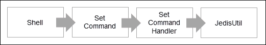

设置命令中数据流的顺序

此命令的语法是：`set <name=value>,<name=value>`。以下屏幕截图显示了 Shell 控制台中的响应：

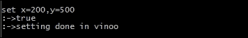

### SetCommand 的实现

SetCommand 的实现如下所示：

```go
package org.redisch7.gossipserver.commands;
/* OMITTING THE IMPORT STATEMENTS TO SAVE SPACE */
import org.redisch7.gossipserver.util.commandparser.Validator;
public class SetCommand extends AbstractCommand {
  Validator validator = new Validator();
  public SetCommand() {
    validator.configureTemplate().add((new StringToken("set"))).add(new MapListToken());
  }
  @Override
  public CheckResult execute(CommandTokens commandTokens) {
    CheckResult checkResult = new CheckResult();
    validator.setInput(commandTokens);
    checkResult = validator.validate();
    if (checkResult.getResult()) {
      List<Token> tokenList = validator.getAllTokens();
      checkResult = new SetCommandHandler(this.getName()).process(tokenList);
    }
    return checkResult;
  }
}
```

### SetCommandHandler 的实现

设置命令处理程序的实现如下所示：

```go
package org.redisch7.gossipserver.commandhandlers;
/* OMITTING THE IMPORT STATEMENTS TO SAVE SPACE */
public class SetCommandHandler extends AbstractCommandHandler {
  public SetCommandHandler(String nodename) {
    super(nodename);
  }
  public CheckResult process(List<Token> tokenList) {
    CheckResult checkResult = new CheckResult();
    JedisUtil jedisUtil = new JedisUtil();
    List<Boolean> result = jedisUtil
        .doesExist(this.getNodename(), Arrays
            .asList(ConstUtil.registerationHolder,
                ConstUtil.activationHolder,
                ConstUtil.passivationHolder, ConstUtil.shutdownHolder));
    if ((result.get(0) == true) && (result.get(1) == true)
        && (result.get(2) == false)&& (result.get(3) == false)) {
      MapListToken mapListToken = (MapListToken) tokenList.get(1);
      checkResult = jedisUtil.setValuesInNode(this.getNodename(),
          mapListToken.getValueAsMap());
    } else {
      checkResult
          .setFalse("Activation Validation :")
          .appendReason(
              ConstUtil.registerationHolder + " = "
                  + ((Boolean) result.get(0)))
          .appendReason(
              ConstUtil.activationHolder + " = "
                  + ((Boolean) result.get(1)))
          .appendReason(
              ConstUtil.passivationHolder + " = "
                  + ((Boolean) result.get(2)));
    }
    return checkResult;
  }
}
```

## 获取命令

此命令将从节点获取数据。执行此命令的先决条件是节点应该处于激活状态。输入将是一个变量列表，数据需要从 Config 存储中获取。每个节点都将有自己的 Config 存储。

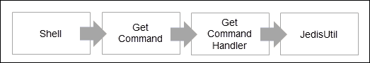

获取命令中数据流的顺序

此命令的语法是：`get`。以下屏幕截图显示了 Shell 控制台中的响应：

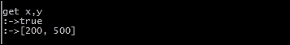

### GetCommand 的实现

GetCommand 的实现如下所示：

```go
package org.redisch7.gossipserver.commands;
/* OMITTING THE IMPORT STATEMENTS TO SAVE SPACE */
public class GetCommand extends AbstractCommand {
  Validator validator = new Validator();
  public GetCommand() {
    validator.configureTemplate().add((new StringToken("get"))).add(new StringListToken());
  }
  @Override
  public CheckResult execute(CommandTokens commandTokens) {
    CheckResult checkResult = new CheckResult();
    validator.setInput(commandTokens);
    checkResult = validator.validate();
    if (checkResult.getResult()) {
      List<Token> tokenList = validator.getAllTokens();
      checkResult = new GetCommandHandler(this.getName()).process(tokenList);
    }
    return checkResult;
  }
}
```

### GetCommandHandler 的实现

获取命令处理程序的实现如下所示：

```go
package org.redisch7.gossipserver.commandhandlers;
/* OMITTING THE IMPORT STATEMENTS TO SAVE SPACE */
public class GetCommandHandler extends AbstractCommandHandler {
  public GetCommandHandler(String nodename) {
    super(nodename);
  }
  public CheckResult process(List<Token> tokenList) {
    CheckResult checkResult = new CheckResult();
    JedisUtil jedisUtil = new JedisUtil();
    List<Boolean> result = jedisUtil
        .doesExist(this.getNodename(), Arrays
            .asList(ConstUtil.registerationHolder,
                ConstUtil.activationHolder,
                ConstUtil.passivationHolder, ConstUtil.shutdownHolder));
    if ((result.get(0) == true) && (result.get(1) == true)
        && (result.get(2) == false)&& (result.get(3) == false)) {
      StringListToken stringList = (StringListToken) tokenList.get(1);
      checkResult = jedisUtil.getValuesFromNode(this.getNodename(),
          stringList.getValueAsList());
    } else {
      checkResult
          .setFalse("Activation Validation :")
          .appendReason(
              ConstUtil.registerationHolder + " = "
                  + ((Boolean) result.get(0)))
          .appendReason(
              ConstUtil.activationHolder + " = "
                  + ((Boolean) result.get(1)))
          .appendReason(
              ConstUtil.passivationHolder + " = "
                  + ((Boolean) result.get(2)));
    }
    return checkResult;
  }
}
```

## 删除命令

此命令将删除节点中的数据。执行此命令的先决条件是节点应该处于激活状态。通过传递需要删除的变量的名称来执行命令。

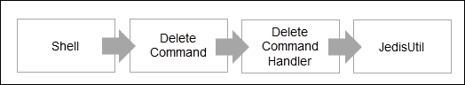

Delete 命令中数据流的顺序

该命令的语法是：`del <parameter>`。以下截图显示了 shell 控制台中的响应：

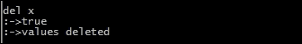

### DeleteCommand 的实现

DeleteCommand 的实现如下所示：

```go
package org.redisch7.gossipserver.commands;
/* OMITTING THE IMPORT STATEMENTS TO SAVE SPACE */
public class DeleteCommand extends AbstractCommand {
  Validator validator = new Validator();
       public DeleteCommand() {
    validator.configureTemplate().add((new StringToken("del"))).add(new StringListToken());
  }
  @Override
  public CheckResult execute(CommandTokens commandTokens) {
    CheckResult checkResult = new CheckResult();
    validator.setInput(commandTokens);
    checkResult = validator.validate();
    if (checkResult.getResult()) {
      List<Token> tokenList = validator.getAllTokens();
      checkResult = new DeleteCommandHandler(this.getName()).process(tokenList);
    }
    return checkResult;
  }
}
```

### DeleteCommandHandler 的实现

`delete`命令处理程序的实现如下所示：

```go
package org.redisch7.gossipserver.commandhandlers;
/* OMITTING THE IMPORT STATEMENTS TO SAVE SPACE */
public class DeleteCommandHandler extends AbstractCommandHandler {
  public DeleteCommandHandler(String nodename) {
    super(nodename);
  }
  public CheckResult process(List<Token> tokenList) {
    CheckResult checkResult = new CheckResult();
    JedisUtil jedisUtil = new JedisUtil();
    List<Boolean> result = jedisUtil
        .doesExist(this.getNodename(), Arrays
            .asList(ConstUtil.registerationHolder,
                ConstUtil.activationHolder,
                ConstUtil.passivationHolder, ConstUtil.shutdownHolder));
    if ((result.get(0) == true) && (result.get(1) == true)
        && (result.get(2) == false)&& (result.get(3) == false)) {
      StringListToken stringList = (StringListToken) tokenList.get(1);
      checkResult = jedisUtil.deleteValuesFromNode(this.getNodename(),
          stringList.getValueAsList());
    } else {
      checkResult
          .setFalse("Activation Validation :")
          .appendReason(
              ConstUtil.registerationHolder + " = "
                  + ((Boolean) result.get(0)))
          .appendReason(
              ConstUtil.activationHolder + " = "
                  + ((Boolean) result.get(1)))
          .appendReason(
              ConstUtil.passivationHolder + " = "
                  + ((Boolean) result.get(2)));
    }
    return checkResult;
  }
}
```

## 状态命令

此命令用于获取节点的当前状态。执行此命令的前提条件是节点应处于某种状态。客户端中的命令关注客户端节点的数据。

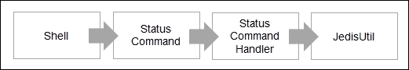

Passivate 命令中数据流的顺序

该命令的语法是：`status`。以下截图显示了 shell 控制台中的响应：

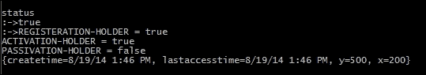

### StatusCommand 的实现

`status`命令的实现如下所示：

```go
package org.redisch7.gossipserver.commands;
/* OMITTING THE IMPORT STATEMENTS TO SAVE SPACE */
public class StatusCommand extends AbstractCommand {
  Validator validator = new Validator();
  public StatusCommand() {
    validator.configureTemplate().add((new StringToken("status")));
  }
  @Override
  public CheckResult execute(CommandTokens commandTokens) {
    CheckResult checkResult = new CheckResult();
    validator.setInput(commandTokens);
    checkResult = validator.validate();
    if (checkResult.getResult()) {
      List<Token> tokenList = validator.getAllTokens();
      checkResult = new StatusCommandHandler(this.getName()).process(tokenList);
    }
    return checkResult;
  }
}
```

### StatusCommandHandler 的实现

`passive`命令处理程序的实现如下所示：

```go
package org.redisch7.gossipserver.commandhandlers;
/* OMITTING THE IMPORT STATEMENTS TO SAVE SPACE */
public class StatusCommandHandler extends AbstractCommandHandler {
  public StatusCommandHandler(String nodename) {
    super(nodename);
  }
  @Override
  public CheckResult process(List<Token> tokenList) {
    CheckResult checkResult = new CheckResult();
    JedisUtil jedisUtil = new JedisUtilImpl();
    if (this.getNodename().equals("master")) {
      List<String> registerednames = jedisUtil.getAllNodesFromRegistrationHolder();
      checkResult.setTrue().appendReason("The following nodes are registered ");
      checkResult.appendReason(registerednames.toString());
      List<String> activenodenames = jedisUtil.getAllNodesFromActivatedHolder();
      checkResult.setTrue().appendReason("The following nodes are activated ");
      checkResult.appendReason(activenodenames.toString());
      List<String> passivenodenames = jedisUtil.getAllNodesFromPassivatedHolder();
      checkResult.setTrue().appendReason("The following nodes are passivated ");
      checkResult.appendReason(passivenodenames.toString());
      List<String> inconsistentState = jedisUtil.getAllNodesInInconsistentState();
      checkResult.setTrue().appendReason("The following nodes are not in consitent state ");
      checkResult.appendReason(inconsistentState.toString());
    } else {
      checkResult = jedisUtil.getStatus(this.getNodename());
    }
    return checkResult;
  }
}
```

## passivate 命令

该命令将节点转为 gossip 服务器生态系统中的被动状态。执行此命令的前提条件是节点应处于激活状态。在被动化时，客户端的事件监听器将被关闭，并且将无法接收来自主节点的事件。由于节点被动化，节点的 Config 存储中的数据将被取出并推送到节点的归档文件中。

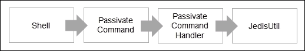

Passivate 命令中数据流的顺序

该命令的语法是：`passivate`。以下截图显示了 shell 控制台中的响应：

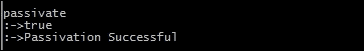

### PassivateCommand 的实现

`passivate`命令的实现如下所示：

```go
package org.redisch7.gossipserver.commands;
/* OMITTING THE IMPORT STATEMENTS TO SAVE SPACE */
public class PassivateCommand extends AbstractCommand {
  Validator validator = new Validator();
  public PassivateCommand() {
    validator.configureTemplate().add((new StringToken("passivate")));
  }
  @Override
  public CheckResult execute(CommandTokens commandTokens) {
    CheckResult checkResult = new CheckResult();
    validator.setInput(commandTokens);
    checkResult = validator.validate();
    if (checkResult.getResult()) {
      List<Token> tokenList = validator.getAllTokens();
      checkResult = new PassivateCommandHandler(this.getName()).process(tokenList);
    }
    return checkResult;
  }
}
```

### PassivateCommandHandler 的实现

`passivate`命令处理程序的实现如下所示：

```go
package org.redisch7.gossipserver.commandhandlers;
/* OMITTING THE IMPORT STATEMENTS TO SAVE SPACE */
public class PassivateCommandHandler extends AbstractCommandHandler {
  public PassivateCommandHandler(String nodename) {
    super(nodename);
  }
  public CheckResult process(List<Token> tokenList) {
    CheckResult checkResult = new CheckResult();
    JedisUtil jedisUtil = new JedisUtil();
    List<Boolean> result = jedisUtil.doesExist(this.getNodename(), Arrays
        .asList(ConstUtil.registerationHolder,
            ConstUtil.activationHolder,
            ConstUtil.passivationHolder, ConstUtil.shutdownHolder));
    if ((result.get(0) == true) && (result.get(1) == true)
        && (result.get(2) == false) && (result.get(3) == false)) {
      checkResult = jedisUtil.passivateNode(this.getNodename());
    } else {
      checkResult
          .setFalse("Passivation Validation :")
          .appendReason(
              ConstUtil.registerationHolder + " = "
                  + ((Boolean) result.get(0)))
          .appendReason(
              ConstUtil.activationHolder + " = "
                  + ((Boolean) result.get(1)))
          .appendReason(
              ConstUtil.passivationHolder + " = "
                  + ((Boolean) result.get(2)));
    }
    return checkResult;
  }
}
```

## reactivate 命令

此命令将重新激活节点。执行此命令的前提条件是节点应处于被动模式。重新激活后，客户端的事件监听器将再次启动。归档文件中的数据将再次被泵回节点的 Config 存储中。

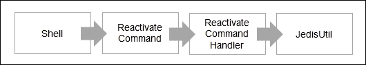

Reactivate 命令中数据流的顺序

该命令的语法是：`reactivate`。以下截图显示了 shell 控制台中的响应：

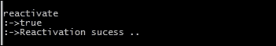

### ReactivateCommand 的实现

`passivate`命令的实现如下所示：

```go
package org.redisch7.gossipserver.commands;
/* OMITTING THE IMPORT STATEMENTS TO SAVE SPACE */
public class ReactivateCommand extends AbstractCommand {
  Validator validator = new Validator();
  public ReactivateCommand() {
    validator.configureTemplate().add((new StringToken("reactivate")));
  }
  @Override
  public CheckResult execute(CommandTokens commandTokens) {
    CheckResult checkResult = new CheckResult();
    validator.setInput(commandTokens);
    checkResult = validator.validate();
    if (checkResult.getResult()) {
      List<Token> tokenList = validator.getAllTokens();
      checkResult = new ReactivateCommandHandler(this.getName()).process(tokenList);
    }
    return checkResult;
  }
}
```

### ReactivateCommandHandler 的实现

`reactivate`命令处理程序的实现如下所示：

```go
package org.redisch7.gossipserver.commandhandlers;
/* OMITTING THE IMPORT STATEMENTS TO SAVE SPACE */
public class ReactivateCommandHandler extends AbstractCommandHandler {
  public ReactivateCommandHandler(String nodename) {
    super(nodename);
  }
  public CheckResult process(List<Token> tokenList) {
    CheckResult checkResult = new CheckResult();
    JedisUtil jedisUtil = new JedisUtil();
    List<Boolean> result = jedisUtil.doesExist(this.getNodename(), Arrays
        .asList(ConstUtil.registerationHolder,
            ConstUtil.activationHolder,
            ConstUtil.passivationHolder, ConstUtil.shutdownHolder));
    if ((result.get(0) == true) && (result.get(1) == false)
        && (result.get(2) == true) && (result.get(3) == false)) {
      checkResult = jedisUtil.reactivateNode(this.getNodename());
    } else {
      checkResult
          .setFalse("Passivation Validation :")
          .appendReason(
              ConstUtil.registerationHolder + " = "
                  + ((Boolean) result.get(0)))
          .appendReason(
              ConstUtil.activationHolder + " = "
                  + ((Boolean) result.get(1)))
          .appendReason(
              ConstUtil.passivationHolder + " = "
                  + ((Boolean) result.get(2)));
    }
    return checkResult;
  }
}
```

## 归档命令

此`command`将对 gossip 服务器生态系统中的节点数据进行归档。执行此命令的前提条件是节点应处于注册模式。当发出此命令时，节点的 Config 存储中的数据将被刷新并放入客户端节点机器的文件系统中的归档文件中。

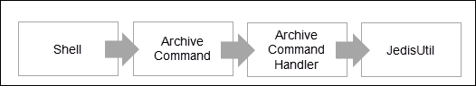

Archive 命令中数据流的顺序

该命令的语法是：`archive`。以下截图显示了 shell 控制台中的响应：

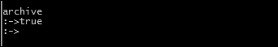

### ArchiveCommand 的实现

`archive`命令的实现如下所示：

```go
package org.redisch7.gossipserver.commands;
/* OMITTING THE IMPORT STATEMENTS TO SAVE SPACE */
public class ArchiveCommand extends AbstractCommand {
  private Validator validator = new Validator();
  public ArchiveCommand() {
    validator.configureTemplate().add((new StringToken("archive")));
  }
  @Override
  public CheckResult execute(CommandTokens commandTokens) {
    CheckResult checkResult = new CheckResult();
    validator.setInput(commandTokens);
    checkResult = validator.validate();
    if (checkResult.getResult()) {
      List<Token> tokenList = validator.getAllTokens();
      checkResult = new ArchiveCommandHandler(this.getName()).process(tokenList);
    }
    return checkResult;
  }
}
```

### ArchiveCommandHandler 的实现

`reactive`命令处理程序的实现如下所示：

```go
package org.redisch7.gossipserver.commandhandlers;
/* OMITTING THE IMPORT STATEMENTS TO SAVE SPACE */
public final class ArchiveCommandHandler extends AbstractCommandHandler {
  public ArchiveCommandHandler(String nodename) {
    super(nodename);
  }
  @Override
  public CheckResult process(List<Token> tokenList) {
    CheckResult checkResult = new CheckResult();
    JedisUtil jedisUtil = new JedisUtil();
    List<Boolean> result = jedisUtil
        .doesExist(this.getNodename(), Arrays
            .asList(ConstUtil.registerationHolder,
                ConstUtil.activationHolder,
                ConstUtil.passivationHolder, ConstUtil.shutdownHolder));
    if ((result.get(0) == true)
        &&  (result.get(3) == false) &&((result.get(1) == true) || (result.get(2) == true))) {
      checkResult = jedisUtil.archiveNode(this.getNodename());
    } else {
      checkResult
          .setFalse("Activation Validation :")
          .appendReason(
              ConstUtil.registerationHolder + " = "
                  + (result.get(0)))
          .appendReason(
              ConstUtil.activationHolder + " = "
                  + (result.get(1)))
          .appendReason(
              ConstUtil.passivationHolder + " = "
                  + (result.get(2)));
    }
    return checkResult;
  }
}
```

## 同步命令

`sync`命令将同步 gossip 服务器生态系统中节点的数据。执行此命令的前提条件是节点应处于注册模式。当发出此命令时，归档文件中的数据将被泵回用户的 Config 存储中。

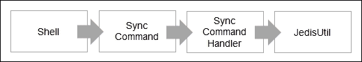

同步命令的数据流序列

该命令的语法是：`sync`。以下截图显示了 shell 控制台中的响应：

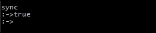

### SyncCommand 的实现

`sync`命令的实现如下所示：

```go
package org.redisch7.gossipserver.commands;
/* OMITTING THE IMPORT STATEMENTS TO SAVE SPACE */
public class SynchCommand extends AbstractCommand {
  Validator validator = new Validator();
  public SynchCommand() {
    validator.configureTemplate().add((new StringToken("sync")));
  }
  @Override
  public CheckResult execute(CommandTokens commandTokens) {
    CheckResult checkResult = new CheckResult();
    validator.setInput(commandTokens);
    checkResult = validator.validate();
    if (checkResult.getResult()) {
      List<Token> tokenList = validator.getAllTokens();
      checkResult = new SynchCommandHandler(this.getName()).process(tokenList);
    }
    return checkResult;
  }
}
```

### SyncCommandHandler 的实现

`sync`命令处理程序的实现如下所示：

```go
package org.redisch7.gossipserver.commandhandlers;
/* OMITTING THE IMPORT STATEMENTS TO SAVE SPACE */
public class SynchCommandHandler extends AbstractCommandHandler {
  public SynchCommandHandler(String nodename) {
    super(nodename);
  }
  public CheckResult process(List<Token> tokenList) {
    CheckResult checkResult = new CheckResult();
    JedisUtil jedisUtil = new JedisUtil();
    List<Boolean> result = jedisUtil
        .doesExist(this.getNodename(), Arrays
            .asList(ConstUtil.registerationHolder,
                ConstUtil.activationHolder,
                ConstUtil.passivationHolder, ConstUtil.shutdownHolder));
    if (result.get(0) && result.get(1) && (result.get(3)==false)) {
      checkResult = jedisUtil.syncNode(this.getNodename());
    } else {
      checkResult.setFalse("Synch Failed ");
    }
    return checkResult;
  }
}
```

## 重新连接命令

`reconnect`命令将重新连接八卦服务器生态系统中的一个节点。执行此命令的前提是节点应处于激活状态，并且节点应经历了关闭。因此，当节点在关闭后重新启动并触发此命令时，客户端节点的监听器将被生成，并且节点将重新处于激活状态。

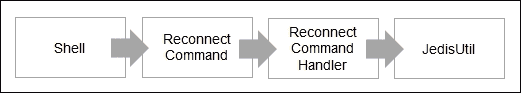

重新连接命令的数据流序列

该命令的语法是：`reconnect`。以下截图显示了 shell 控制台中的响应：

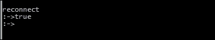

### ReconnectCommand 的实现

`reconnect`命令的实现如下所示：

```go
package org.redisch7.gossipserver.commands;
/* OMITTING THE IMPORT STATEMENTS TO SAVE SPACE */
public class ReConnectCommand extends AbstractCommand {
  Validator validator = new Validator();
  public ReConnectCommand() {
    validator.configureTemplate().add((new StringToken("reconnect")));
  }
  @Override
  public CheckResult execute(CommandTokens commandTokens) {
    CheckResult checkResult = new CheckResult();
    validator.setInput(commandTokens);
    checkResult = validator.validate();
    if (checkResult.getResult()) {
      List<Token> tokenList = validator.getAllTokens();
      checkResult = new ReConnectCommandHandler(this.getName()).process(tokenList);
    }
    return checkResult;
  }
}
```

### ReconnectCommandHandler 的实现

重新连接命令处理程序的实现如下所示：

```go
package org.redisch7.gossipserver.commandhandlers;
/* OMITTING THE IMPORT STATEMENTS TO SAVE SPACE */
public class ReConnectCommandHandler extends AbstractCommandHandler {
  public ReConnectCommandHandler(String nodename) {
    super(nodename);
  }
  @Override
  public CheckResult process(List<Token> tokenList) {
    CheckResult checkResult = new CheckResult();
    JedisUtil jedisUtil = new JedisUtil();
    List<Boolean> result = jedisUtil.doesExist(this.getNodename(), Arrays
        .asList(ConstUtil.registerationHolder,
            ConstUtil.activationHolder,
            ConstUtil.passivationHolder, ConstUtil.shutdownHolder));
    if ((result.get(0) == true)
        && ((result.get(1) == false) || (result.get(2) == false))
        && (result.get(3) == true)) {
      checkResult = jedisUtil.reconnectNode(this.getNodename());
    } else {
      checkResult
          .setFalse("Reconnect Failed :")
          .appendReason(
              ConstUtil.registerationHolder + " = "
                  + (result.get(0)))
          .appendReason(
              ConstUtil.activationHolder + " = "
                  + (result.get(1)))
          .appendReason(
              ConstUtil.passivationHolder + " = "
                  + (result.get(2)));
    }
    return checkResult;
  }
}
```

# 主节点命令

以下是可以从主节点触发的命令列表：

+   `start`命令

+   `status`命令

+   `get`命令

+   `msg`命令

+   `kill`命令

+   `clone`命令

+   `stop`命令

让我们从设计和实现的角度来看每个命令。

## 开始命令

`start`命令将启动八卦服务器生态系统中的主节点。执行此命令的前提是节点名称应该是唯一的。

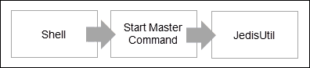

开始命令的数据流序列

该命令的语法是：`start`。以下截图显示了 shell 控制台中的响应：

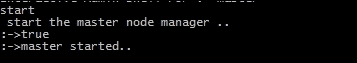

### StartMasterCommand 的实现

`start`命令的实现如下所示：

```go
package org.redisch7.gossipserver.commands;
/* OMITTING THE IMPORT STATEMENTS TO SAVE SPACE */
public class StartMasterCommand extends AbstractCommand {
  private Validator validator = new Validator();
  public StartMasterCommand() {
    validator.configureTemplate().add((new StringToken("start")));
  }
  @Override
  public CheckResult execute(CommandTokens commandTokens) {
    CheckResult checkResult = new CheckResult();
    validator.setInput(commandTokens);
    return checkResult.setTrue().appendReason("master started..");
  }
}
```

## 停止命令

`stop`命令将停止八卦服务器生态系统中的主节点。执行此命令的前提是节点应处于启动模式。

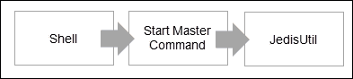

开始命令的数据流序列

该代码的语法是：`stop`。以下截图显示了 shell 控制台中的响应：

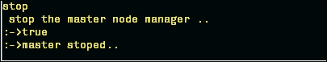

### StopMasterCommand 的实现

`stop`命令的实现如下所示：

```go
package org.redisch7.gossipserver.commands;
/* OMITTING THE IMPORT STATEMENTS TO SAVE SPACE */
public class StopMasterCommand extends AbstractCommand {
  private Validator validator = new Validator();
  public StartMasterCommand() {
    validator.configureTemplate().add((new StringToken("stop")));
  }
  @Override
  public CheckResult execute(CommandTokens commandTokens) {
    CheckResult checkResult = new CheckResult();
    validator.setInput(commandTokens);
    return checkResult.setTrue().appendReason("master stoped..");
  }
}
```

## 状态命令

`status`命令将显示八卦服务器生态系统中节点的当前状态。

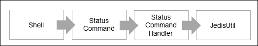

状态命令的数据流序列

该命令的语法是：`status`。以下截图显示了 shell 控制台中的响应：

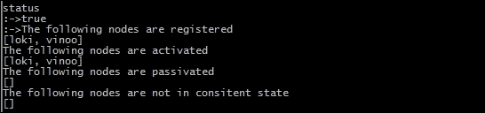

### StatusCommand 的实现

`status`命令的实现如下所示：

```go
package org.redisch7.gossipserver.commands;
/* OMITTING THE IMPORT STATEMENTS TO SAVE SPACE */
public class StatusCommand extends AbstractCommand {
  Validator validator = new Validator();
  public StatusCommand() {
    validator.configureTemplate().add((new StringToken("status")));
  }
  @Override
  public CheckResult execute(CommandTokens commandTokens) {
    CheckResult checkResult = new CheckResult();
    validator.setInput(commandTokens);
    checkResult = validator.validate();
    if (checkResult.getResult()) {
      List<Token> tokenList = validator.getAllTokens();
      checkResult = new StatusCommandHandler(this.getName()).process(tokenList);
    }
    return checkResult;
  }
}
```

### StatusCommandHandler 的实现

`status`命令处理程序的实现如下所示：

```go
package org.redisch7.gossipserver.commandhandlers;
/* OMITTING THE IMPORT STATEMENTS TO SAVE SPACE */
public class StatusCommandHandler extends AbstractCommandHandler {
  public StatusCommandHandler(String nodename) {
    super(nodename);
  }
  @Override
  public CheckResult process(List<Token> tokenList) {
    CheckResult checkResult = new CheckResult();
    JedisUtil jedisUtil = new JedisUtil();
    if (this.getNodename().equals("master")) {
      List<String> registerednames = jedisUtil.getAllNodesFromRegistrationHolder();
      checkResult.setTrue().appendReason("The following nodes are registered ");
      checkResult.appendReason(registerednames.toString());
      List<String> activenodenames = jedisUtil.getAllNodesFromActivatedHolder();
      checkResult.setTrue().appendReason("The following nodes are activated ");
      checkResult.appendReason(activenodenames.toString());
      List<String> passivenodenames = jedisUtil.getAllNodesFromPassivatedHolder();
      checkResult.setTrue().appendReason("The following nodes are passivated ");
      checkResult.appendReason(passivenodenames.toString());
      List<String> inconsistentState = jedisUtil.getAllNodesInInconsistentState();
      checkResult.setTrue().appendReason("The following nodes are not in consitent state ");
      checkResult.appendReason(inconsistentState.toString());
    } else {
      checkResult = jedisUtil.getStatus(this.getNodename());
    }
    return checkResult;
  }
}
```

## 获取命令

`get`命令将显示注册在八卦服务器生态系统中的所有节点的状态。

该命令的语法是：`get <field1>,<field2> where nodes are <nodename1>,<nodename2>`。

以下截图显示了 shell 控制台中的响应：

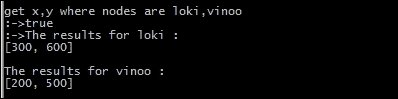

### GetNodeDataCommand 的实现

`get`命令的实现如下所示：

```go
package org.redisch7.gossipserver.commands;
/* OMITTING THE IMPORT STATEMENTS TO SAVE SPACE */
public class GetNodeDataCommand extends AbstractCommand {
  private Validator validator = new Validator();
  public GetNodeDataCommand() {
    validator.configureTemplate().add((new StringToken("get"))).add(new StringListToken()).add(new StringToken("where"))
        .add(new StringToken("nodes")).add(new StringToken("are")).add(new StringListToken());
  }
  @Override
  public CheckResult execute(CommandTokens commandTokens) {
    CheckResult checkResult = new CheckResult();
    validator.setInput(commandTokens);
    checkResult = validator.validate();
    if (checkResult.getResult()) {
      List<Token> tokenList = validator.getAllTokens();
      checkResult = new GetNodeDataCommandHandler(this.getName()).process(tokenList);
    }
    return checkResult;
  }
}
```

### GetNodeDataCommandHandler 的实现

`get`命令处理程序的实现如下所示：

```go
package org.redisch7.gossipserver.commandhandlers;
/* OMITTING THE IMPORT STATEMENTS TO SAVE SPACE */
public class GetNodeDataCommandHandler extends AbstractCommandHandler {
  public GetNodeDataCommandHandler(String nodename) {
    super(nodename);
  }
  @Override
  public CheckResult process(List<Token> tokenList) {
    CheckResult checkResult = new CheckResult();
    StringListToken gettersstringListToken = (StringListToken) tokenList
        .get(1);
    StringListToken nodesstringListToken = (StringListToken) tokenList
        .get(5);
    List<String> nodeList = nodesstringListToken.getValueAsList();
    JedisUtil jedisUtil = new JedisUtil();
    for (String nodename : nodeList) {
      List<Boolean> result = jedisUtil.doesExist(nodename, Arrays.asList(
          ConstUtil.registerationHolder, ConstUtil.activationHolder,
          ConstUtil.passivationHolder, ConstUtil.shutdownHolder));
      if ((result.get(0) == true) && (result.get(1) == true)
          && (result.get(2) == false)&& (result.get(3) == false)) {
        CheckResult chkresult = jedisUtil.getValuesFromNode(nodename,
            gettersstringListToken.getValueAsList());
        checkResult.setTrue()
            .appendReason("The results for " + nodename + " :")
            .appendReason(chkresult.getReason());
      } else {
        checkResult
            .appendReason("The node where the GET didn't work is as follows: ");
        checkResult
            .setFalse(
                "Activation Validation for " + nodename + " :")
            .appendReason(
                ConstUtil.registerationHolder + " = "
                    + (result.get(0)))
            .appendReason(
                ConstUtil.activationHolder + " = "
                    + (result.get(1)))
            .appendReason(
                ConstUtil.passivationHolder + " = "
                    + (result.get(2)));
      }
    }
    return checkResult;
  }
}
```

## 消息命令

`msg`命令用于向八卦服务器生态系统中的节点发送消息。执行此命令的前提是主节点应处于启动模式。

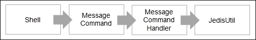

消息命令的数据流序列

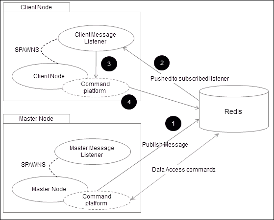

主节点和客户端节点之间的消息传递

此命令的语法是：`mgs <node name> where command = set, field 1, field 2`。

以下截图显示了主 shell 控制台中的响应：

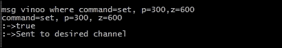

客户端节点（`vinoo`）中的响应如下：


### MessageCommand 的实现

`MessageCommand`的实现如下所示：

```go
package org.redisch7.gossipserver.commands;
/* OMITTING THE IMPORT STATEMENTS TO SAVE SPACE */
public class MessageCommand extends AbstractCommand {
  Validator validator = new Validator();
  public MessageCommand() {
    validator.configureTemplate().add((new StringToken("msg"))).add(new StringToken()).add(new StringToken("where"))
        .add(new MapListToken());
  }
  @Override
  public CheckResult execute(CommandTokens commandTokens) {
    CheckResult checkResult = new CheckResult();
    validator.setInput(commandTokens);
    checkResult = validator.validate();
    if (checkResult.getResult()) {
      List<Token> tokenList = validator.getAllTokens();
      checkResult = new MessageCommandHandler(this.getName()).process(tokenList);
    }
    return checkResult;
  }
}
```

### MessageCommandHandler 的实现

`messageCommandHandler`的实现如下所示：

```go
package org.redisch7.gossipserver.commandhandlers;
/* OMITTING THE IMPORT STATEMENTS TO SAVE SPACE */
public class MessageCommandHandler extends AbstractCommandHandler {
  public MessageCommandHandler(String nodename) {
    super(nodename);
  }
  public CheckResult process(List<Token> tokenList) {
    CheckResult checkResult = new CheckResult();
    JedisUtil jedisUtil = new JedisUtil();
    List<Boolean> result = jedisUtil.doesExist(this.getNodename(), Arrays
        .asList(ConstUtil.registerationHolder,
            ConstUtil.activationHolder,
            ConstUtil.passivationHolder, ConstUtil.shutdownHolder));
    if (this.getNodename().equals("master")
        || ((result.get(0) == true) && (result.get(1) == true) && (result
            .get(2) == false)&& (result.get(3) == false))) {
      StringToken channel = (StringToken) tokenList.get(1);
      MapListToken data = (MapListToken) tokenList.get(3);
      checkResult = jedisUtil.publish(channel.getValue(),
          data.getValueAsMap());
    } else {
      checkResult
          .setFalse("Activation Validation :")
          .appendReason(
              ConstUtil.registerationHolder + " = "
                  + ((Boolean) result.get(0)))
          .appendReason(
              ConstUtil.activationHolder + " = "
                  + ((Boolean) result.get(1)))
          .appendReason(
              ConstUtil.passivationHolder + " = "
                  + ((Boolean) result.get(2)));
    }
    return checkResult;
  }
}
```

## 杀死命令

`kill`命令用于在八卦服务器生态系统中杀死节点。执行此命令的前提条件是主节点应处于启动模式。在这里，我们将通过`msg`命令执行。

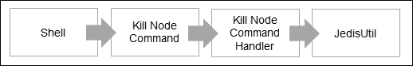

Kill 命令中数据流的顺序

此命令的语法是：`mgs <node name> where command = kill`

以下截图显示了主 shell 控制台中的响应：

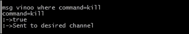

客户端节点（`vinoo`）中的响应如下：


### KillNodeCommand 的实现

`kill`命令的实现如下所示：

```go
package org.redisch7.gossipserver.commands;
/* OMITTING THE IMPORT STATEMENTS TO SAVE SPACE */
public class KillNodeCommand extends AbstractCommand {
  private Validator validator = new Validator();
  public KillNodeCommand() {
    validator.configureTemplate().add((new StringToken("kill")))
        .add(new StringToken());
  }
  @Override
  public CheckResult execute(CommandTokens commandTokens) {
    CheckResult checkResult = new CheckResult();
    validator.setInput(commandTokens);
    checkResult = validator.validate();
    if (checkResult.getResult()) {
      List<Token> tokenList = validator.getAllTokens();
      checkResult = new KillNodeCommandHandler(this.getName())
          .process(tokenList);
      if (checkResult.getResult()) {
        String path = System.getProperty("user.home") + "\\archive\\"
            + this.getName() + ".json";
        File file = new File(path);
        if (file.exists()) {
          if (file.delete()) {
            System.exit(0);
          } else {
            checkResult.appendReason("Archive file for "
                + this.getName()
                + ".json could not get deleted!");
          }
        }
      }
    }
    return checkResult;
  }
}
```

### KillNodeCommandHandler 的实现

`Kill`命令处理程序的实现如下所示：

```go
package org.redisch7.gossipserver.commandhandlers;
/* OMITTING THE IMPORT STATEMENTS TO SAVE SPACE */
public class KillNodeCommandHandler extends AbstractCommandHandler {
  public KillNodeCommandHandler(String nodename) {
    super(nodename);
  }
  public CheckResult process(List<Token> tokenList) {
    CheckResult checkResult = new CheckResult();
    JedisUtil jedisUtil = new JedisUtil();
    List<Boolean> result = jedisUtil.doesExist(this.getNodename(),
        Arrays.asList(ConstUtil.registerationHolder,ConstUtil.shutdownHolder));
    if ((result.get(0)) && (result.get(1) == false)) {
      checkResult = jedisUtil.killNode(this.getNodename());
    } else {
      checkResult.setFalse("Kill node failed ");
    }
    return checkResult;
  }
}
```

## 克隆命令

`clone`命令用于在八卦服务器生态系统中克隆节点。执行此命令的前提条件是主节点应处于启动模式，并且至少有两个客户端节点应处于激活模式。

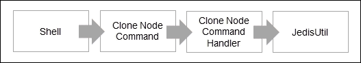

Clone 命令中数据流的顺序

此代码的语法是：`mgs <node name> where command = clone, target =<node name>, source=<node name>`。

以下截图显示了主 shell 控制台中的响应：

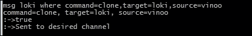

这是客户端节点（`loki`）的响应：

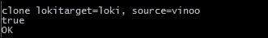

此时，源节点中的所有属性将被复制到目标节点。

### CloneNodeCommand 的实现

`clone`命令的实现如下所示：

```go
package org.redisch7.gossipserver.commands;
/* OMITTING THE IMPORT STATEMENTS TO SAVE SPACE */
public class CloneNodeCommand extends AbstractCommand {
       private Validator validator = new Validator();
       public CloneNodeCommand() {
    validator.configureTemplate().add((new StringToken("clone"))).add(new StringToken())
        .add(new StringToken("from")).add(new StringToken());
}
@Override
  public CheckResult execute(CommandTokens commandTokens) {
    CheckResult checkResult = new CheckResult();
    validator.setInput(commandTokens);
    checkResult = validator.validate();
    if (checkResult.getResult()) {
      List<Token> tokenList = validator.getAllTokens();
      checkResult = new CloneNodeCommandHandler(this.getName()).process(tokenList);
    }
    return checkResult;
  }
}
```

### CloneNodeCommandHandler 的实现

`cloneCommandHandler`的实现如下所示：

```go
package org.redisch7.gossipserver.commandhandlers;
/* OMITTING THE IMPORT STATEMENTS TO SAVE SPACE */
public class CloneNodeCommandHandler extends AbstractCommandHandler {
  public CloneNodeCommandHandler(String nodename) {
    super(nodename);
  }
  public CheckResult process(List<Token> tokenList) {
    CheckResult checkResult = new CheckResult();
    MapListToken maptokens = (MapListToken) tokenList.get(1);
    String target = maptokens.getNValue("target");
    String source = maptokens.getNValue("source");
    JedisUtil jedisUtil = new JedisUtil();
    List<Boolean> target_validity_result = jedisUtil
        .doesExist(target, Arrays
            .asList(ConstUtil.registerationHolder,
                ConstUtil.activationHolder,
                ConstUtil.passivationHolder, ConstUtil.shutdownHolder));
    List<Boolean> source_validity_result = jedisUtil
        .doesExist(source, Arrays
            .asList(ConstUtil.registerationHolder,
                ConstUtil.activationHolder,
                ConstUtil.passivationHolder, ConstUtil.shutdownHolder));
    if ((target_validity_result.get(0) == true)
        && (target_validity_result.get(1) == true)
        && (target_validity_result.get(2) == false)&& (target_validity_result.get(3) == false)) {
      if (((Boolean) source_validity_result.get(0) == true)
          && (source_validity_result.get(1) == true)
          && (source_validity_result.get(2) == false)&& (source_validity_result.get(3) == false)) {
        checkResult = jedisUtil.clone(target, source);
      } else {
        checkResult.setFalse("The source =" + source
            + " is not in a proper state to clone");
      }
    } else {
      checkResult.setFalse("The target =" + target
          + " is not in a proper state to clone");
    }
    return checkResult;
  }}
```

# Redis 配置-数据管理

要管理 Redis 中的数据，了解我们试图构建的应用程序是很重要的。由于八卦服务器旨在成为配置服务器，因此读取次数将多于写入次数。Redis 提供了一些数据持久性机制，我们在前几章中已经处理过，当前部分可以作为一个复习。Redis 提供的机制如下：

+   RDB 选项

+   AOF 选项

+   虚拟机超额内存（仅限 LINUX 环境）

## RDB 选项

RDB 选项提供了定期对数据进行快照的机制。由于这是一个周期性活动，将数据转储到`dump.rdb`文件中，因此它是一个很好的选项来备份数据。对于我们当前的应用程序，RDB 在`redis.conf`文件中的配置可以是以下之一：

+   `save 60 10`：如果有 10 个键发生变化，将每 1 分钟保存一次数据

+   `save 900 10`：如果有 1 个键发生变化，将每 15 分钟保存一次数据

## AOF 选项

这适用于所有的写操作。AOF 选项默认将写入数据命令转储到`appendonly.aof`文件中。可以使用不同的组合将命令写入到这个文件中，但每种策略都会带来性能和数据持久性的权衡。这意味着 Redis 可以配置为每次遇到写命令时都写入到这个文件，但这可能会使整个过程变慢。将持久性留给底层操作系统来刷新缓冲区到这个文件可能会使系统失去控制，但这会使应用程序非常快。对于 gossip 服务器，配置如下：

+   `appendonly yes`：这将创建一个`appendonly.aof`文件

+   `appendfsync everysec`：这将每秒调用`fsync()`函数。

## VM 过度承诺内存

这是通过调整 Linux 系统的`/etc/stsctl.conf`来实现的。这个命令将处理 Linux 系统内部的虚拟内存管理。当调用`BGSAVE`函数并且父进程 fork 一个子进程时会出现问题。按照规则，子进程将拥有与父进程一样多的共享内存页。因此，如果父进程中的数据发生变化，子进程也需要具有相同的数据集以刷新到磁盘。如果父进程和子进程的组合内存需求不足以达到共享内存，则`BGSAVE`将失败。

本书不涉及 VM 内存管理的讨论。然而，缺少这个设置可能会导致 Redis 在写入数据到磁盘时失败。应该对`/etc/stsctl.conf`进行的更改是：`vm.overcommit_memory=1`。

# 总结

在本应用程序中，您学习了如何创建一个 Config 服务器，也称为 gossip 服务器，它可以存储属性并将信息传递给其对等节点。在本章中，我们为客户端节点提供了存储和访问信息以及生命周期的规定。此外，我们提供了一个主节点，它可以控制任何客户端节点。

在接下来的章节中，我们将进一步扩展并为服务器增加扩展和容错能力。
