# 第八章：集群

如果您正在阅读本文，这意味着您对 Redis 及其在 Web 和业务应用中的使用有相当多的了解。除此之外，可以合理地假设您对它可以容纳的数据结构以及如何在应用程序中使用它们也有相当多的了解。

在本章中，我们将继续讨论在生产环境中部署 Redis 应用所需采取的步骤。在生产环境中部署总是棘手的，并需要对架构和业务需求有更深入的了解。由于我们无法设想应用程序必须满足的业务需求，但我们总是可以抽象出大多数应用程序具有的非功能需求，并创建可以供读者根据需要使用的模式。

当我们考虑或谈论生产环境时，脑海中浮现的一些最常见的非功能需求列举如下：

+   性能

+   可用性

+   可扩展性

+   可管理性

+   安全性

所有提到的非功能需求都总是在我们创建部署架构的蓝图时得到解决。接下来，我们将把这些非功能需求与我们将讨论的集群模式进行映射。

# 集群

计算机集群由一组松散或紧密连接的计算机组成，它们共同工作，因此在许多方面，它们可以被视为一个单一系统。此信息来源于[`en.wikipedia.org/wiki/Computer_cluster`](http://en.wikipedia.org/wiki/Computer_cluster)。

我们对系统进行集群有多种原因。企业需要与成本效益和解决方案未来路线图相匹配的增长需求；因此，选择集群解决方案总是有意义的。一个大型机器来处理所有流量总是理想的，但纵向扩展的问题在于芯片的计算能力上限。此外，与一组具有相同计算能力的较小机器相比，更大的机器成本总是更高。除了成本效益之外，集群还可以满足的其他非功能需求包括性能、可用性和可扩展性。然而，拥有集群也增加了可管理性、可维护性和安全性的工作量。

随着现代网站产生的流量，集群不仅是一种低成本选择，而且是唯一的选择。从这个角度来看，让我们来看看各种集群模式，并看看它们如何与 Redis 配合。可以为基于 Redis 的集群开发的两种模式是：

+   主-主

+   主-从

# 集群模式-主-主

这种集群模式是为了应用程序而创建的，其中读取和写入非常频繁，并且节点之间的状态在任何给定时间点都需要保持一致。

从非功能需求的角度来看，在主-主设置中可以看到以下行为：

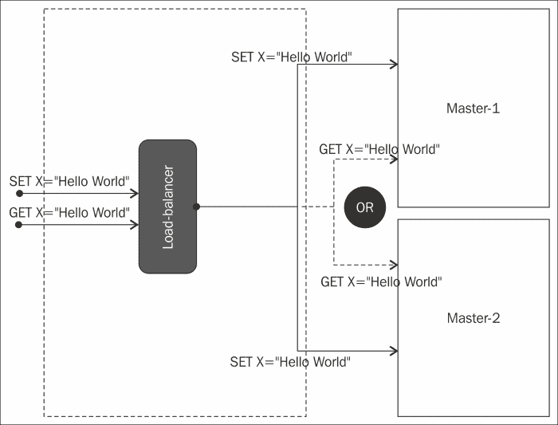

主-主集群模式中的获取器和设置器

## 性能

在这种类型的设置中，读取和写入的性能非常高。由于请求在主节点之间进行负载平衡，主节点的个体负载减少，从而导致更好的性能。由于 Redis 本身并没有这种能力，因此必须在外部提供。在主-主集群的前面放置写复制器和读负载均衡器将起到作用。我们在这里所做的是，如果有写入请求，数据将被写入所有主节点，并且所有读取请求可以在任何主节点之间分配，因为所有主节点中的数据处于一致的状态。

我们还需要考虑的另一个方面是数据量非常大的情况。如果数据量非常大，那么我们必须在主节点设置内部创建**分片**（**节点**）。各个主节点内的这些分片可以根据密钥分发数据。在本章后面，我们将讨论 Redis 中的分片能力。

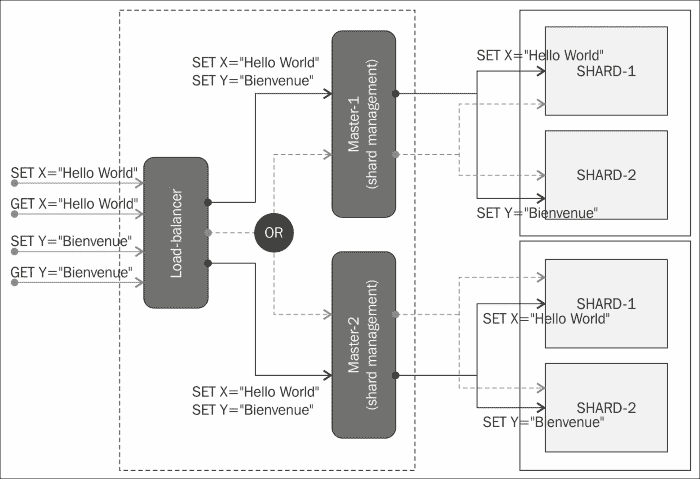

- 在分片环境中的读写操作

## - 可用性

数据的可用性很高，或者更依赖于用于复制的主节点数量。所有主节点上的数据状态是相同的，因此即使其中一个主节点宕机，其余的主节点也可以处理请求。在这种情况下，应用程序的性能会下降，因为请求必须在剩余的主节点之间共享。如果数据分布在主节点内的分片中，如果其中一个分片宕机，那么其他主节点中的副本分片可以处理该分片的请求。这将使受影响的主节点仍然能够工作（但不是完全）。

## - 可扩展性

在这种情况下，可扩展性的问题有点棘手。在提供新的主节点时，必须注意以下事项：

+   新的主节点必须处于与其他主节点相同的状态。

+   新的主节点的信息必须添加到客户端 API 中，因为客户端可以在管理数据写入和数据读取时使用这个新的主节点。

+   这些任务需要一段停机时间，这将影响可用性。此外，在调整主节点或主节点中的分片节点的大小之前，必须考虑数据量，以避免出现这些情况。

## 可管理性

这种类型的集群模式的可管理性需要在节点级别和客户端级别进行努力。这是因为 Redis 没有为这种模式提供内置机制。由于进行数据复制和数据加载的责任在于客户端适配器，因此需要解决以下观察结果：

+   - 客户端适配器必须考虑可服务性，以防节点（主节点或分片）宕机。

+   - 客户端适配器必须考虑可服务性，以防添加新的主节点。

+   在已经配置了分片生态系统的情况下，应该避免添加新的分片，因为分片技术是基于客户端适配器生成的唯一密钥。这是根据应用程序开始配置的分片节点来决定的，添加新的分片将会干扰已经设置的分片和其中的数据。这将使整个应用程序处于不一致的状态。新的分片将从主节点的生态系统中复制一些数据。因此，进行此操作的选择方式将是引入一致性哈希来生成分配主节点的唯一密钥。

## 安全性

Redis 作为一个非常轻量级的数据存储，从安全性的角度来看提供的内容很少。这里的期望是 Redis 节点将在一个安全的环境中进行配置，责任在于外部。尽管如此，Redis 确实提供了一定形式的安全性，即用户名/密码身份验证连接到节点。这种机制有其局限性，因为密码以明文形式存储在`Config`文件中。另一种安全性形式可以是混淆命令，以防止意外调用。在我们讨论的集群模式中，这种安全性的用途有限，更多的是从程序的角度来看。

## - 此模式的缺点

在决定采用这种模式之前，我们需要注意一些灰色地带。这种模式需要计划的停机时间才能在生产环境中工作。如果一个节点宕机并且向集群添加了一个新节点，则需要这种停机时间。这个新节点必须具有与其他副本主节点相同的状态。另一个需要注意的是数据容量规划，如果低估了，那么在分片环境中进行水平扩展将是一个问题。在下一节中，我们将运行一个示例，添加另一个节点，并查看不同的数据分布，这可以给我们一些问题的提示。数据清理是另一个特性，Redis 服务器没有解决，因为它的目的是将所有数据保存在内存中。

## 分片

分片是一种水平拆分数据并将其放置在不同的节点（机器）中的机制。在这里，驻留在不同节点或机器中的数据的每个分区形成一个分片。如果正确执行分片技术，可以将数据存储扩展到多个节点或机器。如果正确执行分片，可以提高系统的性能。

它还可以克服需要使用更大的机器，并且可以使用较小的机器完成工作。分片可以提供部分容错能力，因为如果一个节点宕机，那么来到该特定节点的请求将无法得到服务，除非所有其他节点都能满足传入的请求。

Redis 没有提供直接机制来支持数据的内部分片，因此为了实现数据的分区，必须在客户端 API 中应用技术来拆分数据。由于 Redis 是一个键值数据存储，可以基于算法生成唯一 ID，然后将其映射到节点。因此，如果有读取、写入、更新或删除的请求，算法可以生成相同的唯一键，或者将其定向到映射的节点，从而进行操作。

我们在本书中使用的客户端 API Jedis 提供了基于键的数据分片机制。让我们尝试一个示例，并查看数据在节点之间的分布。

从至少两个节点开始。该过程已在前几章中讨论过。在当前示例中，我们将在端口 6379 上启动一个节点，另一个节点在 6380 上启动。第一个分片节点应该类似于以下屏幕截图：

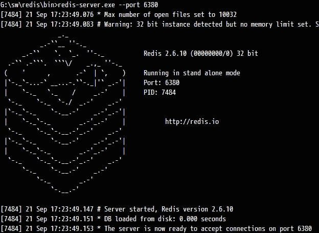

第一个分片节点的屏幕截图

第二个分片节点应该类似于以下屏幕截图：

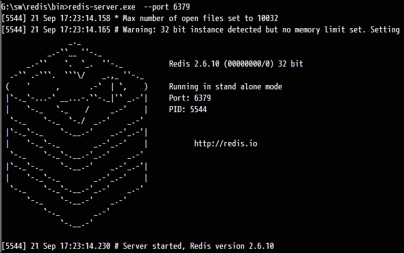

第二个分片节点的屏幕截图

让我们打开编辑器，输入以下程序：

```go
package org.learningredis.chap8;
import java.util.Arrays;
import redis.clients.jedis.Jedis;
import redis.clients.jedis.JedisShardInfo;
import redis.clients.jedis.ShardedJedis;
public class Test {
  public static void main(String[] args) {
    Test test = new Test();
    test.evaluateShard();
  }
  private void evaluateShard() {
    // Configure Jedis sharded connection pool.
    JedisShardInfo shard_1 = new JedisShardInfo("localhost", 6379);
    JedisShardInfo shard_2 = new JedisShardInfo("localhost", 6380);
    ShardedJedis shardedJedis = new ShardedJedis(Arrays.asList(shard_1, shard_2));
    // Looping to set values in the shard we have created..
    for (int i = 0; i < 10; i++) {
      shardedJedis.set("KEY-" + i, "myvalue-" + i);
    }
    // Lets try to read all the values from SHARD -1
    for (int i = 0; i < 10; i++) {
      Jedis jedis = new Jedis("localhost", 6379);
      if (jedis.get("KEY-" + i) != null) {
        System.out.println(jedis.get("KEY-" + i) + " : this is stored in SHARD-1");
      }
    }
    // Lets try to read all the values from SHARD -2
    for (int i = 0; i < 10; i++) {
      Jedis jedis = new Jedis("localhost", 6380);
      if (jedis.get("KEY-" + i) != null) {
        System.out.println(jedis.get("KEY-" + i) + " : this is stored in SHARD-2");
      }
    }
    // Lets try to read data from the sharded jedis.
    for (int i = 0; i < 10; i++) {
      if (shardedJedis.get("KEY-" + i) != null) {
        System.out.println(shardedJedis.get("KEY-" + i));
      }
    }
  }
}
```

控制台输出的响应应该如下所示：

```go
myvalue-1 : this is stored in SHARD-1
myvalue-2 : this is stored in SHARD-1
myvalue-4 : this is stored in SHARD-1
myvalue-6 : this is stored in SHARD-1
myvalue-9 : this is stored in SHARD-1
myvalue-0 : this is stored in SHARD-2
myvalue-3 : this is stored in SHARD-2
myvalue-5 : this is stored in SHARD-2
myvalue-7 : this is stored in SHARD-2
myvalue-8 : this is stored in SHARD-2
myvalue-0
myvalue-1
myvalue-2
myvalue-3
myvalue-4
myvalue-5
myvalue-6
myvalue-7
myvalue-8
myvalue-9
```

### 观察

关于样本可以得出以下观察：

+   数据分布是随机的，基本上取决于用于分发程序或分片的哈希算法

+   多次执行相同的程序将得到相同的结果。这表明哈希算法对于为键创建哈希是一致的。

+   如果键发生变化，那么数据的分布将不同，因为对于相同的给定键将生成新的哈希码；因此，会有一个新的目标分片。

在不清理其他分片的情况下添加一个新的分片：

1.  在 6381 上启动一个新的主节点：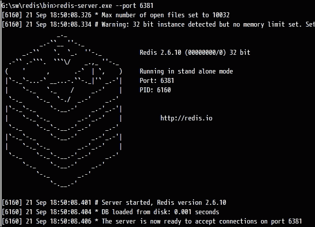

1.  让我们输入一个新的程序，其中添加了客户端的新分片信息：

```go
package org.learningredis.chap8;
import java.util.Arrays;
import redis.clients.jedis.Jedis;
import redis.clients.jedis.JedisShardInfo;
import redis.clients.jedis.ShardedJedis;
public class Test {
  public static void main(String[] args) {
    Test test = new Test();
    test.evaluateShard();
  }
  private void evaluateShard() {
    // Configure Jedis sharded connection pool.
    JedisShardInfo shard_1 = new JedisShardInfo("localhost", 6379);
    JedisShardInfo shard_2 = new JedisShardInfo("localhost", 6380);
    JedisShardInfo shard_3 = new JedisShardInfo("localhost", 6381);
    ShardedJedis shardedJedis = new ShardedJedis(Arrays.asList(shard_1, shard_2, shard_3));
    // Looping to set values in the shard we have created..
    for (int i = 0; i < 10; i++) {
      shardedJedis.set("KEY-" + i, "myvalue-" + i);
    }
    // Lets try to read all the values from SHARD -1
    for (int i = 0; i < 10; i++) {
      Jedis jedis = new Jedis("localhost", 6379);
      if (jedis.get("KEY-" + i) != null) {
        System.out.println(jedis.get("KEY-" + i) + " : this is stored in SHARD-1");
      }
    }
    // Lets try to read all the values from SHARD -2
    for (int i = 0; i < 10; i++) {
      Jedis jedis = new Jedis("localhost", 6380);
      if (jedis.get("KEY-" + i) != null) {
        System.out.println(jedis.get("KEY-" + i) + " : this is stored in SHARD-2");
      }
    }
    // Lets try to read all the values from SHARD -3
    for (int i = 0; i < 10; i++) {
      Jedis jedis = new Jedis("localhost", 6381);
      if (jedis.get("KEY-" + i) != null) {
        System.out.println(jedis.get("KEY-" + i) + " : this is stored in SHARD-3");
      }
    }
    // Lets try to read data from the sharded jedis.
    for (int i = 0; i < 10; i++) {
      if (shardedJedis.get("KEY-" + i) != null) {
        System.out.println(shardedJedis.get("KEY-" + i));
      }
    }
  }
}
```

1.  结果将如下所示，因为我们可以看到来自`SHARD_1`和`SHARD_2`的数据在`SHARD_3`中被复制。这*复制的数据*实际上就是由于先前的执行而存在于`SHARD_1`和`SHARD_2`中的旧数据。在生产环境中，这可能是危险的，因为它增加了无法核算的死数据：

```go
myvalue-1 : this is stored in SHARD-1
myvalue-2 : this is stored in SHARD-1
myvalue-4 : this is stored in SHARD-1
myvalue-6 : this is stored in SHARD-1
myvalue-9 : this is stored in SHARD-1
myvalue-0 : this is stored in SHARD-2
myvalue-3 : this is stored in SHARD-2
myvalue-5 : this is stored in SHARD-2
myvalue-7 : this is stored in SHARD-2
myvalue-8 : this is stored in SHARD-2
myvalue-4 : this is stored in SHARD-3
myvalue-6 : this is stored in SHARD-3
myvalue-7 : this is stored in SHARD-3
myvalue-8 : this is stored in SHARD-3
myvalue-9 : this is stored in SHARD-3
myvalue-0
myvalue-1
myvalue-2
myvalue-3
myvalue-4
myvalue-5
myvalue-6
myvalue-7
myvalue-8
myvalue-9
```

1.  为相同的数据集添加一个新的主节点，并清理`SHARD_1`和`SHARD_2`节点中的所有先前数据，结果将如下：

```go
The response in the output console should be as follows 
myvalue-1 : this is stored in SHARD-1
myvalue-2 : this is stored in SHARD-1
myvalue-0 : this is stored in SHARD-2
myvalue-3 : this is stored in SHARD-2
myvalue-5 : this is stored in SHARD-2
myvalue-4 : this is stored in SHARD-3
myvalue-6 : this is stored in SHARD-3
myvalue-7 : this is stored in SHARD-3
myvalue-8 : this is stored in SHARD-3
myvalue-9 : this is stored in SHARD-3
myvalue-0
myvalue-1
myvalue-2
myvalue-3
myvalue-4
myvalue-5
myvalue-6
myvalue-7
myvalue-8
myvalue-9
```

我们可以看到数据在所有分片之间得到了清洁的分布，没有重复，例如旧数据已被清理。

# 集群模式 - 主从

这种集群模式适用于读取非常频繁而写入不太频繁的应用程序。这种模式能够工作的另一个条件是具有有限的数据大小，或者换句话说，数据容量可以适应为主节点配置的硬件（从节点也需要相同的硬件配置）。由于要满足频繁读取的需求，这种模式还具有水平扩展的能力。我们还必须记住的一点是，从节点中的复制可能会有时间延迟，这可能导致提供陈旧数据。业务需求应该能够接受这种情况。

这种模式的解决方案是将所有写操作都放在主节点上，并让从节点处理所有读操作。需要对从节点的读操作进行负载平衡，以满足性能要求。

Redis 提供了内置的主从配置功能，其中写入可以在主节点上进行，而读取可以在从节点上进行。

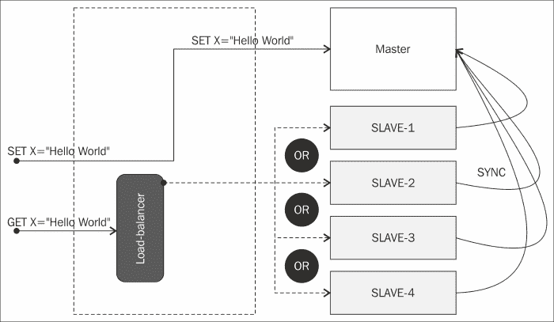

主-从模式中的获取器和设置器

从非功能需求的角度来看，主-从设置中可以看到的行为在以下部分进行了讨论。

## 性能

在这种设置中，性能写入非常高。这是因为所有写入都发生在单个主节点上，并且写入的频率较低，如假设中所述。由于读取请求在从节点之间进行负载平衡，从节点上的单个负载减少，从而提高了性能。由于 Redis 本身提供了从从节点读取的功能，除了负载平衡外，无需在外部提供任何内容。放置在从节点前面的读取负载均衡器将起作用。我们在这里所做的是，如果有写入请求，数据将被写入主节点，所有读取请求将分配给所有从节点，因为所有从节点中的数据处于最终一致状态。

在这种情况下需要注意的是，由于主节点推送新更新数据和从节点更新数据之间的时间差，可能会出现从节点继续提供陈旧数据的情况。

## 可用性

主-从集群模式中的可用性需要不同的方法，一个用于主节点，另一个用于从节点。最容易处理的是从节点的可用性。当涉及到从节点的可用性时，很容易处理，因为从节点比主节点更多，即使其中一个从节点出现问题，也有其他从节点来处理请求。在主节点的情况下，由于只有一个主节点，如果该节点出现问题，我们就有麻烦了。虽然读取将继续进行，但写入将停止。为了消除数据丢失，可以采取以下两种措施：

+   在主节点前面设置一个消息队列，以便即使主节点出现问题，写入消息仍然存在，可以稍后写入。

+   Redis 提供了一种称为 Sentinel 的机制或观察者。Sentinel 的讨论已在即将到来的某些部分中进行。

## 可扩展性

在这种情况下，可扩展性的问题有点棘手，因为这里有两种类型的节点，它们都解决不同类型的目的。在这里，可扩展性不在于数据的分布，而更多地在于为了性能而进行的扩展。以下是一些特点：

+   主节点的大小必须根据需要在 RAM 中保留的数据容量来确定性能

+   从节点可以在运行时附加到集群，但最终会达到与主节点相同的状态，并且从节点的硬件能力应与主节点相当

+   新的从节点应该注册到负载均衡器中，以便负载均衡器分发数据

## 可管理性

这种类型的集群模式的可管理性在主节点和从节点级别以及客户端级别需要付出很少的努力。这是因为 Redis 确实提供了支持这种模式的内置机制。由于数据复制和数据加载的责任属于从节点，所以剩下的就是管理主节点和客户端适配器。

需要解决以下观察结果：

+   客户端适配器必须考虑服务性，以防从节点宕机。适配器必须足够智能，以避免宕机的从节点。

+   客户端适配器必须考虑服务性，以防新的从节点被添加。

+   客户端适配器必须具有临时持久性机制，以防主节点宕机。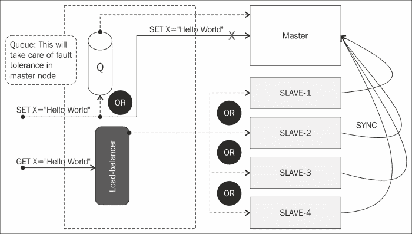

主节点的容错能力

## 安全性

Redis 作为一个非常轻量级的数据存储，在安全方面提供的内容非常有限。这里的期望是 Redis 节点将在一个受保护的环境中进行配置，责任在于环境之外。尽管如此，Redis 确实提供了一定形式的安全性，例如用户名/密码认证连接到节点。这种机制有其局限性，因为密码是以明文存储在`Config`文件中的。另一种安全性形式可以是混淆命令，以防止意外调用。

在我们讨论的集群模式中，它的使用有限，更多的是从程序的角度来看。另一个很好的做法是有单独的 API，这样程序就不会意外地写入从节点（尽管这将导致错误）。以下是一些讨论过的 API：

+   **写 API**：这个组件应该与与主节点进行交互的程序一起使用，因为主节点可以在主从中进行写入

+   **读 API**：这个组件应该与与必须获取记录的从节点进行交互的程序一起使用

## 这种模式的缺点

在决定采用这种模式之前，这种模式还有一些需要注意的地方。其中最大的问题之一是数据大小。容量大小应该根据主节点的垂直扩展能力来确定。从节点也必须具有相同的硬件能力。另一个问题是主节点将数据复制到从节点时可能出现的延迟。这有时会导致在某些情况下提供过时的数据。另一个需要注意的地方是如果主节点发生故障，Sentinel 选举新的主节点所需的时间。

这种模式最适合用于 Redis 作为缓存引擎的情况。如果它被用作缓存引擎，那么在达到一定大小后清除数据是一个很好的做法。在接下来的部分中，有我们可以在 Redis 中使用的清除策略来管理数据大小。

# 配置 Redis Sentinel

数据存储提供了处理故障情况的能力。这些能力是内置的，并且不会以处理容错的方式暴露自己。Redis 最初是一个简单的键值数据存储，已经发展成为一个提供独立节点来处理故障管理的系统。这个系统被称为**Sentinel**。

Sentinel 背后的理念是它是一个独立的节点，它跟踪主节点和其他从节点。当主节点宕机时，它会将从节点提升为主节点。正如讨论的那样，在主从场景中，主节点用于写入，从节点用于读取，所以当从节点被提升为主节点时，它具有读写的能力。所有其他从节点将成为这个新的从节点变成的主节点的从节点。下图显示了 Sentinel 的工作原理：

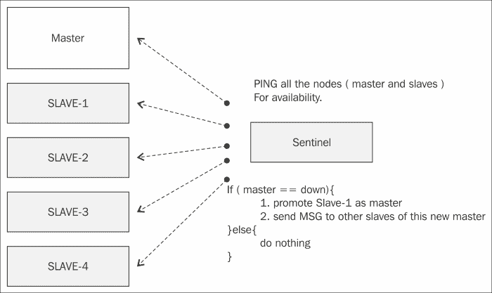

Sentinel 的工作

现在让我们举个例子，演示 Sentinel 在 Redis 2.6 版本中的工作原理。Sentinel 在 Windows 机器上运行时会出现问题，因此最好在*NIX 机器上执行此示例。步骤如下：

1.  按照所示启动主节点: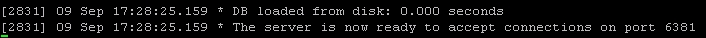

1.  按照所示启动从节点。让我们称其为从节点: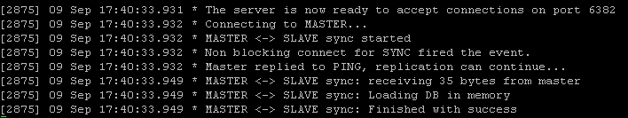

1.  按照所示启动 Sentinel: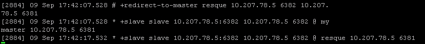

1.  让我们编写一个程序，我们将在其中执行以下操作：

1.  写入主节点

1.  从主节点读取

1.  写入从节点

1.  停止主节点

1.  关闭主节点后从主节点读取

1.  关闭主节点后从从节点读取

1.  写入从节点

1.  Sentinel 配置

1.  让我们输入程序：

```go
package simple.sharded;
import redis.clients.jedis.Jedis;
public class TestSentinel {
      public static void main(String[] args) {
        TestSentinel testSentinel = new TestSentinel();
            testSentinel.evaluate();
      }

      private void evaluate() {
            System.out.println("-- start the test ---------");
            this.writeToMaster("a","apple");
            this.readFromMaster("a");
            this.readFromSlave("a");
            this.writeToSlave("b", "ball");
            this.stopMaster();

            this.sentinelKicks();
            try{
            this.readFromMaster("a");
            }catch(Exception e){
              System.out.println(e.getMessage());
            }
            this.readFromSlave("a");
            this.sentinelKicks();
            this.sentinelKicks();
            this.writeToSlave("b", "ball");
            this.readFromSlave("b");
            System.out.println("-- end of test ------ -----");
     }
     private void sentinelKicks() {
            try {
                   Thread.currentThread().sleep(10000);
            } catch (InterruptedException e) {
                   e.printStackTrace();
            }
     }
     private void stopMaster() {
       Jedis jedis =  ConnectionUtill.getJedisConnection("10.207.78.5", 6381);
         jedis.shutdown();
     }
     private void writeToSlave(String key , String value) {
         Jedis jedis =  ConnectionUtill.getJedisConnection("10.207.78.5", 6382);
         try{
           System.out.println(jedis.set(key, value));
         }catch(Exception e){
           System.out.println(e.getMessage());

         }
     }
     private void readFromSlave(String key) {
         Jedis jedis =  ConnectionUtill.getJedisConnection("10.207.78.5", 6382);
         String value = jedis.get(key);
         System.out.println("reading value of '" + key + "' from slave is :" + value);
     }
     private void readFromMaster(String key) {
         Jedis jedis =  ConnectionUtill.getJedisConnection("10.207.78.5", 6381);
         String value = jedis.get(key);
         System.out.println("reading value of '" + key + "' from master is :" + value);
     }
     private void writeToMaster(String key , String value) {
         Jedis jedis =  ConnectionUtill.getJedisConnection("10.207.78.5", 6381);
         System.out.println(jedis.set(key, value));
     }
}
```

1.  您应该能够看到您编写的程序的以下结果：

1.  写入主节点:

1.  从主节点读取:

1.  写入从节点:

1.  停止主节点: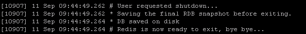

1.  关闭主节点后从主节点读取:

1.  关闭主节点后从从节点读取:

1.  写入从节点:

1.  将以下文本添加到默认的 Sentinel 配置中：

```go
sentinel monitor slave2master 127.0.0.1 6382 1
sentinel down-after-milliseconds slave2master 10000
sentinel failover-timeout slave2master 900000
sentinel can-failover slave2master yes
sentinel parallel-syncs slave2master 1
```

让我们理解我们在前面的代码中添加的五行的含义。默认的 Sentinel 将包含运行在默认端口的主节点的信息。如果您在其他主机或端口上启动了主节点，则必须相应地在 Sentinel 文件中进行更改。

+   **Sentinel monitor slave2master 127.0.0.1 63682 1**：这给出了从节点的主机和端口的信息。除此之外，`1`表示 Sentinel 之间对于主节点故障达成一致的法定人数。在我们的情况下，由于我们只运行一个 Sentinel，因此提到了`1`的值。

+   **Sentinel down-after-milliseconds slave2master 10000**：这是主节点不可达的时间。Sentinel 会不断 ping 主节点，如果主节点不响应或响应错误，那么 Sentinel 会开始其活动。如果 Sentinel 检测到主节点已经宕机，那么它将标记节点为`SDOWN`。但这本身不能决定主节点是否宕机，所有 Sentinel 之间必须达成一致才能启动故障转移活动。当 Sentinel 达成一致认为主节点已宕机时，就会处于`ODOWN`状态。可以将其视为 Sentinel 在选举新主节点之前达成一致的民主制度。

+   **Sentinel failover-timeout slave2master 900000**：这是以毫秒为单位指定的时间，负责整个故障转移过程的时间跨度。当检测到故障转移时，Sentinel 会请求将新主节点的配置写入所有配置的从节点。

+   **Sentinel parallel-syncs slave2master 1**：此配置指示故障转移事件发生后同时重新配置的从节点数量。如果我们从只读从节点提供读取查询，我们希望将此值保持较低。这是因为在同步发生时，所有从节点将无法访问。

# 总结

在本章中，我们学习了如何使用集群技术来最大化性能并处理不断增长的数据集。除此之外，我们还对可用性数据处理和故障处理进行了简要介绍。虽然 Redis 提供了一些技术，但我们也看到了如果不需要 Sentinel，我们如何使用其他技术。在下一章中，我们将专注于如何维护 Redis。
