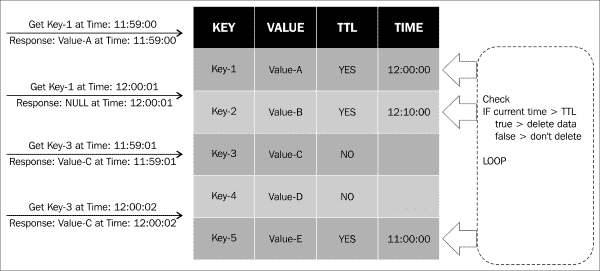
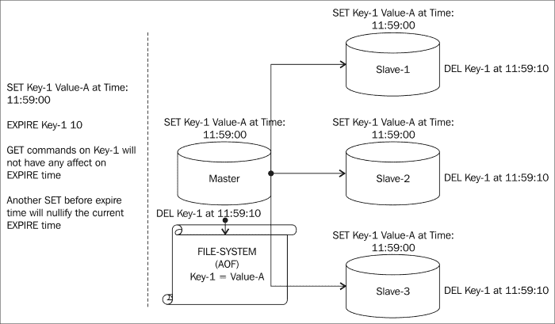
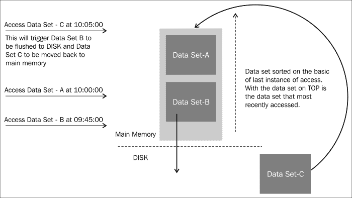
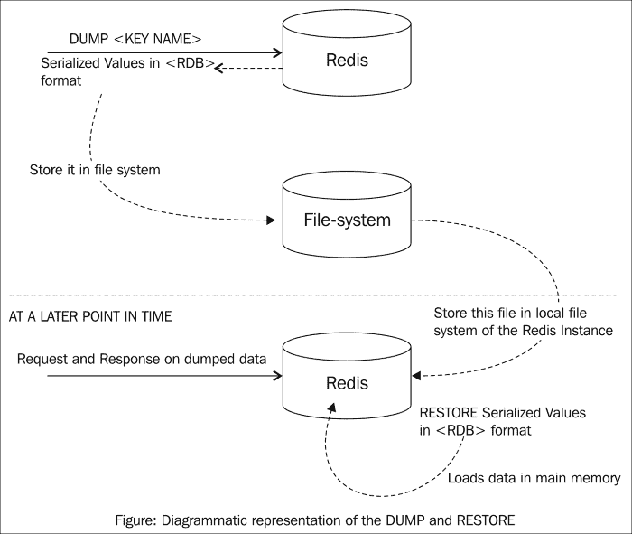
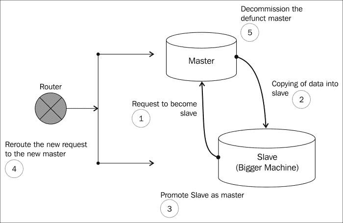
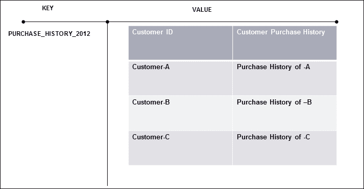
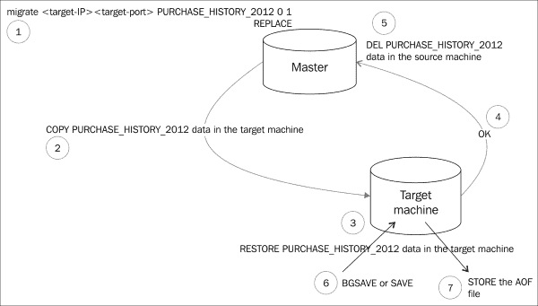

# 第九章。维护 Redis

为了维护数据，了解我们将存储在 Redis 数据存储中的数据是很重要的。数据具有各种属性，我们在第一章中已经涵盖了，*NoSQL 简介*，我们将再次专注于这些方面之一，以决定本章中我们将采取的数据维护策略。我们将专注于数据的短暂性质。

# 维护短暂数据

在一定时间内具有重要性的数据，其性质是短暂的，可以被称为**短暂数据**。这样的数据在预定时间后需要从系统中清除，并且计算机资源必须被释放以便为新的数据集提供空间。在一些数据存储中，没有内置的能力来做到这一点，必须编写脚本和程序来清理它们，换句话说，清理系统的责任在用户身上。在我们深入了解 Redis 提供的机制之前，让我们看看可以被称为短暂的数据类型。属于这一类别的数据类型有以下几种：

+   **事件数据**：股票代码在短时间内具有重要性，然后在其被查看的上下文形式中失去价值。假设一个虚拟公司的科技股票价值在 1300 小时是 100 美元，对于所有算法来说，在 1300 小时计算科技股票的*某某*指数的数据是重要的。然后，比如说，在 1310 小时之后，这个数据的价值就不重要了，因为它是旧数据或者日志数据，因此可以被视为短暂数据。

+   **短暂业务数据**：短暂业务数据，例如促销优惠券折扣，是电子商务业务的一个重要特性。它们在一定时间内很重要，时间结束后这些促销优惠就不存在了。同样，这种类型的数据可以被归类为短暂数据。

+   **会话数据**：每个电子商务都有一个会话处理组件；基本上是维护记录注册用户与门户互动时生成的数据。

在 Redis 中处理短暂数据的策略很简单。Redis 有一个内置的功能叫做**生存时间**（**TTL**），或者另一个选项是 P-TTL，它更精确，因为以毫秒为分辨率返回数据。这个功能将数据保留在内存中一段指定的时间，时间结束后，数据被清除。Redis 有一个内置的进程，不断监视具有指定 TTL 的数据，并在持续时间结束后清理数据。

Redis 中 TTL 过程的图示表示

如果没有指定 TTL/PTTL，另一个清理数据的机制是使用`EXPIRE`或`PEXPIRE`命令。这些命令在键上设置超时，因为数据是易失性的。在`PEXPIRE`中一个有趣的事情是，如果一个键已经被赋予一个值和一个`EXPIRE`时间，如果在这段时间结束之前再次设置了值，那么`EXPIRE`时间属性就会被移除。

在集群环境中，对于`PEXPIRE`命令，键的 DEL 命令被发送到所有从节点和节点的**追加写入文件**（**AOF**）。Redis 确保它从所有位置删除，无论是在内存中（比如从节点）还是在文件系统中（比如 AOF）。

在集群环境中 EXPIRE 命令的图示表示

TTL 的行为类似于集群环境中的`EXPIRE`命令。

# 维护非短暂数据

非短暂类型的数据不依赖于时间，在系统中存在期间具有用处。由于这种数据是与时间无关的，可能会随着时间的推移而增加。这在 Redis 中可能会有问题，因为 Redis 中的数据存储在内存中。处理和维护这种非短暂数据对于 Redis 的维护至关重要，因为我们必须牢记可用内存和数据的可用性。

Redis 具有一些功能来处理先前讨论的情况，即如果数据存储在惊人的速度增长，可能会超出可用内存。在这种情况下，增加更多的 RAM 可以解决问题，或者我们可以使用一个称为 Sharding 的编程技术来分发数据集。然而，在本章中，我们将讨论一种维护不需要在活动应用程序中的数据但需要存储的机制。

让我们看看 Redis 中管理数据的一些内置技术或机制，以及它在已发布的版本中的演进路线图。

## Redis 2.4

Redis 具有一个内置功能（自 2.4 版起已弃用），可以在 RAM 和文件系统（磁盘或 SSD）之间交换数据集。这个 Redis 的功能称为虚拟内存（VM）。可以通过在配置文件中启用它`vm-enabled yes`来配置这个 Redis 的功能。

为了理解这个特性，让我们想象一下 Redis 中整个数据集是一个按最后访问数据排序的桶。这里，最后访问是指上次修改或访问的实例。最少访问的数据集被推送到磁盘。这样就为频繁访问的数据集保留了空间。如果再次访问被推送的数据集，那么这个数据集将被带回主内存，而倒数第二个最少访问的数据将被推送到磁盘。当 VM 启用时，下图是幕后活动的表示：

一个虚拟机启用系统数据集处理的简单表示

### 注意

请注意，推送到磁盘的是值，而不是键。键始终在内存中。

这个 VM 选项适用于包含大型数据集的业务数据。当存在一种使用模式，随着时间推移，一些数据被较少访问时，这个选项也是有用的。

在这种情况下，我们可以将这些键值对合并在 Hashes 中。例如，假设我们正在维护客户记录如下所示：

+   *客户 1 作为（KEY），一些客户数据“ABC”作为（VALUE）*

+   *客户 2 作为（KEY），一些客户数据“XYZ”作为（VALUE）*

+   *客户 3 作为（KEY），一些客户数据“123”作为（VALUE）*

+   *客户 4 作为（KEY），一些客户数据“AQ@”作为（VALUE）*

如果我们继续以这种方式存储数据，那么如果客户数据增长，我们有可能会耗尽空间（内存）（尽管这对业务来说是好事，但对支持它的技术团队来说并不是好事）。更好的存储客户数据的方法是使用 Hash。

客户存储将是（KEY），相应的客户值将是（HASHES），并包含以下数据：

+   *客户 3 作为（KEY），一些客户数据“123”作为（VALUE）*

+   *客户 4 作为（KEY），一些客户数据“AQ@”作为（VALUE）*

+   *客户 1 作为（KEY），一些客户数据“ABC”作为（VALUE）*

+   *客户 2 作为（KEY），一些客户数据“XYZ”作为（VALUE）*

如果以这种方式存储值，在最坏的情况下，整个值数据集将被推送到磁盘，并且如果需要，可以再次带回内存。

除了`vm-enabled yes`之外，要配置 VM 功能，需要查看以下配置：

+   `vm-max-threads`：此设置提供了在内存和磁盘之间执行 I/O 活动的最大线程数。将值设置为`0`将使管理客户端请求的单个线程负担过重，导致整个过程停滞，并将数据集重新加载到主内存中。

+   `vm-max-memory`：此选项告诉 Redis 服务器应保留多少内存来存储数据集。一旦达到此阈值，它就开始将数据集从内存交换到磁盘。

+   `vm-swap-file`：此设置提供了可以转储数据集的文件系统中的位置。

+   `vm-pages`：此设置将提示 Redis 服务器需要创建多少页面来交换文件。

+   `vm-page-size`：此设置将提示 Redis 服务器分配多少磁盘存储空间来存储值数据集。`vm-pages`和`vm-page-size`的组合对于从磁盘快速检索数据集的存储非常重要。

在业务案例场景中，性能至关重要，并且有使用 VM 选项的限制时，可以通过使用**固态设备**（**SSD**）来提高性能。与磁盘相比，这些设备具有更快的读写速度，磁盘受读/写速度的限制。

### 注意

请注意，从 Redis 2.4 开始，VM 选项将被弃用。

## Redis 2.6 到 2.8

与 2.4 版本不同——在该版本中，VM 选项是处理大于内存的数据的方法——在更新的版本中，最好清除数据并将其存储在一个单独的位置（这里，位置可以是不同的实例或文件系统）。在新版本中解决了 VM 选项面临的问题。

### 转储和恢复

对于 Redis 版本 2.6，其中一种机制是发出`Dump`键命令，它将返回该键的数据的序列化版本。此数据可以与目标 Redis 实例中的`Restore`命令一起使用，从而将其转换为可读数据。如前所述，处理大数据的最佳模式是将键值收集到集合中（例如 Hashes），然后对其进行操作以管理数据。

以下图表是处理数据（不再访问但需要保留在系统中）的简单表示：

DUMP 和 RESTORE 命令的示意图表示

将键和值存储在集合中（例如 Hashes）的好处是，您可以发出一个命令来操作整个集合，然后使用一个命令将其恢复。当您已经有一小部分需要清除的数据时，这种技术非常有用。然而，当您想要存储整个数据集时，您必须研究*快照*，这将在后面讨论。

这种机制有一个警告；即它记录数据的序列化 RDB 版本，因此这些序列化数据不能用于任何其他 Redis 版本。

### 快照

处理大型数据集的内置技术称为*快照*。如前几章所讨论的，这种技术用于在 AOF 中持久化数据。此过程将数据转储到 AOF 中，如配置文件中指定的那样。执行命令将数据转储到文件中的方式和机制可以是在后台（`BGSAVE`）或前台（`SAVE`）执行。在高度并发的环境中，如果这些活动对系统性能造成压力，解决此问题的一个聪明方法是使用更大的机器。

将一个更大的机器作为从节点（主节点）引入并在适当的时间压力下提升为主节点的想法，现在整个数据集都在资源更多的更大的机器中。以下图是整个活动的简单表示。在许多生产环境中，由于数据层通常在路由器后面，通常使用路由器来切换流量而不是依赖 Sentinel 来进行切换是一般做法。在没有路由器的环境中，可以使用 Sentinel 来进行切换，如何进行此操作在之前的章节中已经讨论过。

从小型机器迁移数据的简单表示

## Redis 3.0

将 Redis 数据集限制在可用内存范围内的另一个机制是清除旧数据。Redis 没有内置机制来清除数据；相反，它有一个`MIGRATE`和`RESTORE`数据的组合。让我们详细看看这个过程。

假设我们有一个 Hashes 集合，用于维护所有客户在 2012 年的购买历史记录；因此，通常键看起来像**PURCHASE_HISTORY_2012**，值将是包含客户 ID 作为键和客户购买详情作为值的数据集的 Hash。

要迁移的键值数据集的表示

同样，**PURCHASE_HISTORY_2013**，**PURCHASE_HISTORY_2014**和**PURCHASE_HISTORY_2015**将用于后续年份。任何需要为用户显示过去 4 年的购买数据的业务需求，比如**Customer-A**，将从 2012、2013、2014 和 2015 的键中获取数据。业务需求将从这些年份追加数据，从而形成一个组合响应。现在，在 2016 年，将创建另一个键，但是为了获取**Customer-A**的购买历史记录，将从 2013、2014、2015 和 2016 的键中获取数据。在这种情况下，**PURCHASE_HISTORY_2012**将被留下，但出于法律原因，我们不能删除它。然而，它在在线系统中占用内存空间。在这种情况下，我们可以发出`MIGRATE`命令，这是`DUMP`和`DEL`的组合。当我们内部发出`MIGRATE`命令时，Redis 将发出`DUMP`键来序列化数据和 I/O 到目标实例。一旦目标实例被恢复，序列化键将发送一个`OK`命令回到源机器，然后可以删除**PURCHASE_HISTORY_2012**键。现在我们可以在目标实例中发出`SAVE`命令并创建一个 AOF 文件，如果需要，可以将其存储在文件系统中以供以后参考。

以下图是给定键的数据迁移的表示：

Redis 中迁移过程的表示

### 注意

请注意，`MIGRATE`命令将在 Redis 3.0 版本中工作。

# 摘要

在本章中，您看到了在 Redis 中维护数据的各种机制，可以使用 Redis 中的内置功能，也可以使用巧妙的机制来实现。
