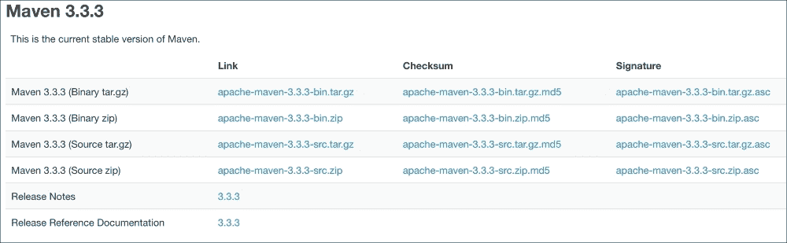
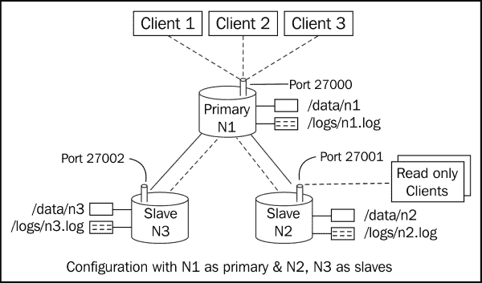
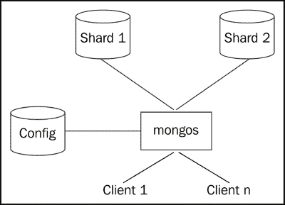
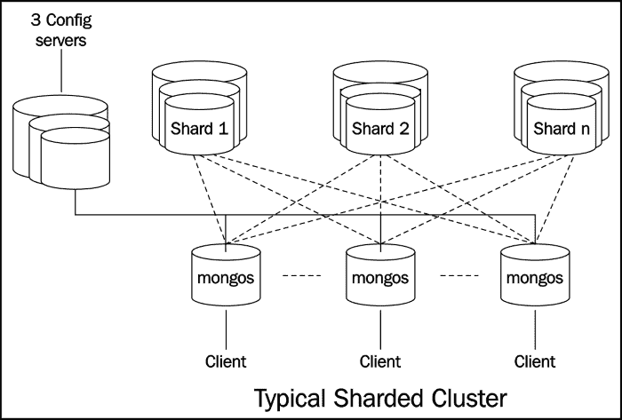

# 第一章：安装和启动服务器

在本章中，我们将涵盖以下配方：

+   安装单节点 MongoDB

+   使用命令行选项启动单个节点实例

+   使用配置文件从安装单节点 MongoDB

+   在 Mongo shell 中使用 JavaScript 连接到单个节点

+   从 Java 客户端连接到单个节点

+   从 Python 客户端连接到单个节点

+   作为副本集的一部分启动多个实例

+   连接到副本集以查询和插入数据

+   从 Java 客户端连接到副本集以查询和插入数据

+   从 Python 客户端连接到副本集以查询和插入数据

+   启动包含两个分片的简单分片环境

+   在 shell 中连接到分片并执行操作

# 介绍

在本章中，我们将看看如何启动 MongoDB 服务器。虽然对于开发目的以默认设置启动服务器很容易，但有许多可用于微调启动行为的选项。我们将作为单个节点启动服务器，然后介绍各种配置选项。我们将通过设置一个简单的副本集并运行一个分片集群来结束本章。因此，让我们开始以最简单的方式安装和设置 MongoDB 服务器，以用于简单的开发目的。

# 安装单节点 MongoDB

在这个配方中，我们将看看如何以独立模式安装 MongoDB。这是启动 MongoDB 服务器的最简单和最快的方法，但很少用于生产用例。然而，这是开发目的中启动服务器的最常见方式。在这个配方中，我们将在不看很多其他启动选项的情况下启动服务器。

## 准备工作

嗯，假设我们已经从下载站点下载了 MongoDB 二进制文件，解压缩并将生成的 bin 目录放在操作系统的路径变量中。（这不是强制性的，但这样做后确实变得更加方便。）可以从[`www.mongodb.org/downloads`](http://www.mongodb.org/downloads)下载二进制文件，然后选择您的主机操作系统。

## 如何做…

1.  创建目录`/data/mongo/db`（或您选择的任何目录）。这将是我们的数据库目录，并且需要由`mongod`（mongo 服务器进程）进程具有写入权限。

1.  我们将从控制台启动服务器，数据目录为`/data/mongo/db`，如下所示：

```sql
> mongod --dbpath  /data/mongo/db

```

## 它是如何工作的…

如果您在控制台上看到以下行，则已成功启动服务器：

```sql
[initandlisten] waiting for connections on port 27017

```

启动服务器再也没有比这更容易的了。尽管启动服务器的简单性，但有许多配置选项可用于调整服务器在启动时的行为。大多数默认选项是合理的，不需要更改。使用默认值，服务器应该监听端口`27017`以进行新连接，并且日志将打印到标准输出。

## 另请参阅

有时我们希望在服务器启动时配置一些选项。在*安装单节点 MongoDB*配方中，我们将使用一些更多的启动选项。

# 使用命令行选项启动单个节点实例

在这个配方中，我们将看到如何使用一些命令行选项启动独立的单节点服务器。我们将看一个例子，我们想要做以下事情：

+   启动服务器监听端口`27000`

+   日志应写入`/logs/mongo.log`

+   数据库目录是`/data/mongo/db`

由于服务器已经为开发目的启动，我们不希望预先分配完整大小的数据库文件。（我们很快会看到这意味着什么。）

## 准备工作

如果您已经看过并执行了*安装单节点 MongoDB*配方，则无需做任何不同的事情。如果所有这些先决条件都得到满足，那么我们就可以开始本配方了。

## 如何做…

1.  数据库的 `/data/mongo/db` 目录和日志的 `/logs/` 应该在您的文件系统上创建并存在，并具有适当的权限进行写入。

1.  执行以下命令：

```sql
> mongod --port 27000 --dbpath /data/mongo/db –logpath /logs/mongo.log --smallfiles

```

## 工作原理…

好的，这并不太困难，与之前的配方类似，但这次我们有一些额外的命令行选项。MongoDB 实际上在启动时支持相当多的选项，我认为我们将看到一些最常见和最重要的选项列表：

| 选项 | 描述 |
| --- | --- |
| `--help` 或 `-h` | 用于打印可用的各种启动选项的信息。 |
| `--config` 或 `-f` | 这指定包含所有配置选项的配置文件的位置。我们将在以后的配方中更多地了解这个选项。这只是一种方便的方式，可以在文件中指定配置，而不是在命令提示符中指定；特别是当指定的选项数量更多时。使用一个共享的配置文件跨不同的 MongoDB 实例也将确保所有实例都使用相同的配置运行。 |
| `--verbose` 或 `-v` | 这会使日志更冗长；我们可以添加更多的 v 来使输出更冗长，例如，`-vvvvv`。 |
| `--quiet` | 这会产生更安静的输出；这与冗长或 `-v` 选项相反。它将使日志更少，更整洁。 |
| `--port` | 如果您希望启动服务器侦听除默认端口 `27017` 以外的某个端口，则使用此选项。每当我们希望在同一台机器上启动多个 mongo 服务器时，我们会经常使用此选项，例如，`--port 27018` 将使服务器侦听端口 `27018` 以获取新连接。 |
| `--logpath` | 这提供了一个日志文件的路径，日志将被写入其中。该值默认为 `STDOUT`。例如，`--logpath /logs/server.out` 将使用 `/logs/server.out` 作为服务器的日志文件。请记住，提供的值应该是一个文件，而不是日志将被写入的目录。 |
| `--logappend` | 如果有的话，此选项将追加到现有的日志文件。默认行为是重命名现有的日志文件，然后为当前启动的 mongo 实例的日志创建一个新文件。假设我们已经将日志文件命名为 `server.out`，并且在启动时该文件存在，则默认情况下此文件将被重命名为 `server.out.<timestamp>`，其中 `<timestamp>` 是当前时间。时间是 GMT 时间，而不是本地时间。假设当前日期是 2013 年 10 月 28 日，时间是 12:02:15，则生成的文件将具有以下值作为时间戳：`2013-10-28T12-02-15`。 |
| `--dbpath` | 这为您提供了一个新数据库将被创建或现有数据库存在的目录。该值默认为 `/data/db`。我们将使用 `/data/mongo/db` 作为数据库目录启动服务器。请注意，该值应该是一个目录，而不是文件的名称。 |
| `--smallfiles` | 这在开发过程中经常使用，当我们计划在本地机器上启动多个 mongo 实例时。Mongo 在启动时会在 64 位机器上创建一个大小为 64MB 的数据库文件。出于性能原因，这种预分配会发生，并且文件将被创建并写入零以填充磁盘上的空间。在启动时添加此选项将仅创建一个预分配文件，大小为 16MB（同样，在 64 位机器上）。此选项还会减小数据库和日志文件的最大大小。不要在生产部署中使用此选项。另外，默认情况下，文件大小会增加到最大 2GB。如果选择了 `--smallfile` 选项，则最大增加到 512MB。 |
| `--replSet` | 此选项用于将服务器启动为复制集的成员。此`arg`的值是复制集的名称，例如，`--replSet repl1`。在以后的食谱中，您将更多地了解这个选项，我们将启动一个简单的 mongo 复制集。 |
| `--configsvr` | 此选项用于将服务器启动为配置服务器。当我们在本章的后续食谱中设置一个简单的分片环境时，配置服务器的角色将更加清晰。 |
| `--shardsvr` | 这通知启动的 mongod 进程，该服务器正在作为分片服务器启动。通过给出此选项，服务器还会监听端口`27018`，而不是默认的`27017`。当我们启动一个简单的分片服务器时，我们将更多地了解这个选项。 |
| `--oplogSize` | Oplog 是复制的支柱。它是一个有上限的集合，主实例写入的数据存储在其中，以便复制到次要实例。此集合位于名为`local`的数据库中。在初始化复制集时，oplog 的磁盘空间被预先分配，并且数据库文件（用于本地数据库）被填充为占位符的零。默认值为磁盘空间的 5%，对于大多数情况来说应该足够好。oplog 的大小至关重要，因为有上限的集合是固定大小的，当超过其大小时，它们会丢弃其中的最旧文档，从而为新文档腾出空间。oplog 大小非常小可能导致数据在复制到次要节点之前被丢弃。oplog 大小很大可能导致不必要的磁盘空间利用和复制集初始化的持续时间很长。对于开发目的，当我们在同一主机上启动多个服务器进程时，我们可能希望将 oplog 大小保持在最小值，快速启动复制集，并使用最小的磁盘空间。 |
| `--storageEngine` | 从 MongoDB 3.0 开始，引入了一个名为 Wired Tiger 的新存储引擎。以前（默认）的存储引擎现在称为**mmapv1**。要使用 Wired Tiger 而不是`mmapv1`启动 MongoDB，请使用此选项的`wiredTiger`值。 |
| `--dirctoryperdb` | 默认情况下，MongoDB 的数据库文件存储在一个公共目录中（如`--dbpath`中提供的）。此选项允许您将每个数据库存储在上述数据目录中的自己的子目录中。具有这样细粒度的控制允许您为每个数据库拥有单独的磁盘。 |

## 还有更多…

要获取可用选项的详尽列表，请使用`--help`或`-h`选项。这些选项列表并不详尽，我们将在以后的食谱中看到更多的选项，只要我们需要它们。在下一个食谱中，我们将看到如何使用配置文件而不是命令行参数。

## 另请参阅

+   *使用配置文件提供启动选项的 MongoDB 单节点安装*

+   *启动多个实例作为复制集的一部分* 来启动一个复制集

+   *启动一个包含两个分片的简单分片环境* 来设置一个分片环境

# 使用配置文件进行 MongoDB 的单节点安装

正如我们所看到的，从命令行提供选项可以完成工作，但是一旦我们提供的选项数量增加，情况就开始变得尴尬了。我们有一个干净而好的选择，可以从配置文件而不是作为命令行参数来提供启动选项。

## 准备工作

如果您已经执行了*安装单节点 MongoDB*食谱，那么您无需做任何不同的事情，因为此食谱的所有先决条件都是相同的。

## 如何做…

数据库的`/data/mongo/db`目录和日志的`/logs/`应该在您的文件系统上创建并存在，并具有适当的权限以写入它并执行以下步骤：

1.  创建一个可以有任意名称的配置文件。在我们的情况下，假设我们在`/conf/mongo.conf`中创建了这个文件。然后编辑文件并添加以下行：

```sql
port = 27000
dbpath = /data/mongo/db
logpath = /logs/mongo.log
smallfiles = true
```

1.  使用以下命令启动 mongo 服务器：

```sql
> mongod --config  /config/mongo.conf

```

## 工作原理…

我们在配置文件中提供了前面一篇文章中讨论的所有命令行选项，*使用命令行选项启动单个节点实例*。我们只是将它们提供在一个配置文件中。如果您还没有阅读前一篇文章，我建议您这样做，因为那里我们讨论了一些常见的命令行选项。属性被指定为`<property name> = <value>`。对于所有没有值的属性，例如`smallfiles`选项，给定的值是一个布尔值，true。如果我们需要有详细的输出，我们会在我们的配置文件中`添加 v=true`（或多个 v 以使其更详细）。如果您已经知道命令行选项是什么，那么猜测属性在文件中的值就很容易了。它几乎与去掉连字符的命令行选项相同。

# 使用 JavaScript 在 Mongo shell 中连接到单个节点

这个示例是关于启动 mongo shell 并连接到 MongoDB 服务器。在这里，我们还演示了如何在 shell 中加载 JavaScript 代码。虽然这并不总是必需的，但当我们有一大块带有变量和函数的 JavaScript 代码，并且这些函数需要经常从 shell 中执行并且我们希望这些函数始终在 shell 中可用时，这是很方便的。

## 准备就绪

虽然可能会在不连接到 MongoDB 服务器的情况下运行 mongo shell，但我们很少需要这样做。要在本地主机上启动服务器而不费吹灰之力，请查看第一篇文章*安装单节点 MongoDB*，并启动服务器。

## 如何做…

1.  首先，我们创建一个简单的 JavaScript 文件并将其命名为`hello.js`。在`hello.js`文件中输入以下内容：

```sql
function sayHello(name) {
  print('Hello ' + name + ', how are you?')
}
```

1.  将此文件保存在位置`/mongo/scripts/hello.js`。（这也可以保存在任何其他位置。）

1.  在命令提示符上执行以下操作：

```sql
> mongo --shell /mongo/scripts/hello.js

```

1.  执行此命令时，我们应该在控制台上看到以下内容打印出来：

```sql
MongoDB shell version: 3.0.2
connecting to: test
>

```

1.  通过输入以下命令来测试 shell 连接的数据库：

```sql
> db

```

这应该在控制台上打印出`test`。

1.  现在，在 shell 中输入以下命令：

```sql
> sayHello('Fred')

```

1.  您应该收到以下响应：

```sql
Hello Fred, how are you?

```

### 注意

注意：本书是使用 MongoDB 版本 3.0.2 编写的。您可能正在使用更新的版本，因此在 mongo shell 中可能看到不同的版本号。

## 工作原理…

我们在这里执行的 JavaScript 函数没有实际用途，只是用来演示如何在 shell 启动时预加载函数。`.js`文件中可能包含有效的 JavaScript 代码，可能是一些复杂的业务逻辑。

在没有任何参数的情况下执行`mongo`命令时，我们连接到在本地主机上运行的 MongoDB 服务器，并在默认端口`27017`上监听新连接。一般来说，命令的格式如下：

```sql
mongo <options> <db address> <.js files>

```

在没有传递参数给 mongo 可执行文件的情况下，它相当于将`db 地址`传递为`localhost:27017/test`。

让我们看一些`db 地址`命令行选项的示例值及其解释：

+   `mydb`：这将连接到在本地主机上运行并监听端口`27017`上的连接的服务器。连接的数据库将是`mydb`。

+   `mongo.server.host/mydb`：这将连接到在`mongo.server.host`上运行并使用默认端口`27017`的服务器。连接的数据库将是`mydb`。

+   `mongo.server.host:27000/mydb`：这将连接到在`mongo.server.host`上运行并使用端口`27000`的服务器。连接的数据库将是`mydb`。

+   `mongo.server.host:27000`：这将连接到运行在`mongo.server.host`上的服务器，端口为`27000`。连接的数据库将是默认数据库 test。

现在，Mongo 客户端也有很多选项可用。我们将在下表中看到其中一些：

| 选项 | 描述 |
| --- | --- |
| `--help`或`-h` | 这显示有关各种命令行选项使用的帮助。 |
| `--shell` | 当给定`.js`文件作为参数时，这些脚本将被执行，mongo 客户端将退出。提供此选项可以确保在 JavaScript 文件执行后，shell 保持运行。在启动时，这些`.js`文件中定义的所有函数和变量都可在 shell 中使用。与前面的情况一样，JavaScript 文件中定义的`sayHello`函数可在 shell 中调用。 |
| `--port` | 指定客户端需要连接的 mongo 服务器的端口。 |
| `--host` | 这指定了客户端需要连接的 mongo 服务器的主机名。如果`db 地址`提供了主机名、端口和数据库，那么`--host`和`--port`选项都不需要指定。 |
| `--username`或`-u` | 当 Mongo 启用安全性时，这是相关的。它用于提供要登录的用户的用户名。 |
| `--password`或`-p` | 当 Mongo 启用安全性时，这个选项是相关的。它用于提供要登录的用户的密码。 |

# 使用 Java 客户端连接到单个节点

这个教程是关于为 MongoDB 设置 Java 客户端的。在处理其他教程时，您将反复参考这个教程，所以请仔细阅读。

## 准备工作

以下是这个教程的先决条件：

+   建议使用 Java SDK 1.6 或更高版本。

+   使用最新版本的 Maven。在撰写本书时，版本 3.3.3 是最新版本。

+   在撰写本书时，MongoDB Java 驱动程序版本 3.0.1 是最新版本。

+   连接到互联网以访问在线 maven 存储库或本地存储库。或者，您可以选择一个适合您的计算机访问的本地存储库。

+   Mongo 服务器正在本地主机和端口`27017`上运行。查看第一个教程，*安装单节点 MongoDB*，并启动服务器。

## 操作步骤如下：

1.  如果您的机器上还没有安装最新版本的 JDK，请从[`www.java.com/en/download/`](https://www.java.com/en/download/)下载。我们不会在这个教程中介绍安装 JDK 的步骤，但在进行下一步之前，JDK 应该已经安装好了。

1.  需要从[`maven.apache.org/download.cgi`](http://maven.apache.org/download.cgi)下载 Maven。在下载页面上应该看到类似以下图片的内容。选择`.tar.gz`或`.zip`格式的二进制文件并下载。这个教程是在运行 Windows 平台的机器上执行的，因此这些安装步骤是针对 Windows 的。

1.  下载完档案后，我们需要解压它，并将提取的档案中的`bin`文件夹的绝对路径放入操作系统的路径变量中。Maven 还需要将 JDK 的路径设置为`JAVA_HOME`环境变量。记得将你的 JDK 根目录设置为这个变量的值。

1.  现在我们只需要在命令提示符上输入`mvn -version`，如果看到以下开头的输出，我们就成功设置了 maven：

```sql
> mvn -version

```

1.  在这个阶段，我们已经安装了 maven，现在准备创建我们的简单项目，在 Java 中编写我们的第一个 Mongo 客户端。我们首先创建一个`project`文件夹。假设我们创建一个名为`Mongo Java`的文件夹。然后在这个`project`文件夹中创建一个文件夹结构`src/main/java`。`project`文件夹的根目录包含一个名为`pom.xml`的文件。一旦这个文件夹创建完成，文件夹结构应该如下所示：

```sql
      Mongo Java      
      +--src  
      |     +main
      |         +java
      |--pom.xml
```

1.  我们现在只有项目的框架。我们将在`pom.xml`文件中添加一些内容。这并不需要太多。以下内容是我们在`pom.xml`文件中所需要的全部内容：

```sql
<project>
  <modelVersion>4.0.0</modelVersion>
  <name>Mongo Java</name>
  <groupId>com.packtpub</groupId>
  <artifactId>mongo-cookbook-java</artifactId>
  <version>1.0</version>    <packaging>jar</packaging>
  <dependencies>
    <dependency>
      <groupId>org.mongodb</groupId>
      <artifactId>mongo-java-driver</artifactId>
      <version>3.0.1</version>
    </dependency>
  </dependencies>
</project>
```

1.  最后，我们编写一个 Java 客户端，用于连接到 Mongo 服务器并执行一些非常基本的操作。以下是`com.packtpub.mongo.cookbook`包中`src/main/java`位置中的 Java 类，类名为`FirstMongoClient`：

```sql
package com.packtpub.mongo.cookbook;

import com.mongodb.BasicDBObject;
import com.mongodb.DB;
import com.mongodb.DBCollection;
import com.mongodb.DBObject;
import com.mongodb.MongoClient;

import java.net.UnknownHostException;
import java.util.List;

/**
 * Simple Mongo Java client
 *
 */
public class FirstMongoClient {

    /**
     * Main method for the First Mongo Client. Here we shall be connecting to a mongo
     * instance running on localhost and port 27017.
     *
     * @param args
     */
    public static final void main(String[] args) 
throws UnknownHostException {
        MongoClient client = new MongoClient("localhost", 27017);
        DB testDB = client.getDB("test");
        System.out.println("Dropping person collection in test database");
        DBCollection collection = testDB.getCollection("person");
        collection.drop();
        System.out.println("Adding a person document in the person collection of test database");
        DBObject person = 
new BasicDBObject("name", "Fred").append("age", 30);
        collection.insert(person);
        System.out.println("Now finding a person using findOne");
        person = collection.findOne();
        if(person != null) {
            System.out.printf("Person found, name is %s and age is %d\n", person.get("name"), person.get("age"));
        }
        List<String> databases = client.getDatabaseNames();
        System.out.println("Database names are");
        int i = 1;
        for(String database : databases) {
            System.out.println(i++ + ": " + database);
        }
  System.out.println("Closing client");
        client.close();
    }
}
```

1.  现在是执行前面的 Java 代码的时候了。我们将使用 maven 从 shell 中执行它。您应该在项目的`pom.xml`所在的同一目录中：

```sql
mvn compile exec:java -Dexec.mainClass=com.packtpub.mongo.cookbook.FirstMongoClient

```

## 它是如何工作的...

这些是相当多的步骤要遵循。让我们更详细地看一些步骤。直到第 6 步为止，都是直接的，不需要任何解释。让我们从第 7 步开始看起。

我们这里有的`pom.xml`文件非常简单。我们在 mongo 的 Java 驱动程序上定义了一个依赖关系。它依赖于在线存储库`repo.maven.apache.org`来解析这些构件。对于本地存储库，我们所需要做的就是在`pom.xml`中定义`repositories`和`pluginRepositories`标签。有关 maven 的更多信息，请参阅 maven 文档[`maven.apache.org/guides/index.html`](http://maven.apache.org/guides/index.html)。

对于 Java 类，`org.mongodb.MongoClient`类是主干。我们首先使用其重载的构造函数实例化它，给出服务器的主机和端口。在这种情况下，主机名和端口实际上并不是必需的，因为提供的值已经是默认值，而且无参数的构造函数也可以很好地工作。以下代码片段实例化了这个客户端：

```sql
MongoClient client = new MongoClient("localhost", 27017);
```

下一步是获取数据库，在这种情况下，使用`getDB`方法来测试。这将作为`com.mongodb.DB`类型的对象返回。请注意，这个数据库可能不存在，但`getDB`不会抛出任何异常。相反，只有在我们向该数据库的集合中添加新文档时，数据库才会被创建。同样，DB 对象上的`getCollection`将返回一个代表数据库中集合的`com.mongodb.DBCollection`类型的对象。这个集合在数据库中也可能不存在，并且在插入第一个文档时会自动创建。

我们的类中以下两个代码片段向您展示了如何获取`DB`和`DBCollection`的实例：

```sql
DB testDB = client.getDB("test");
DBCollection collection = testDB.getCollection("person");
```

在插入文档之前，我们将删除集合，以便即使在程序的多次执行中，person 集合中也只有一个文档。使用`DBCollection`对象的`drop()`方法来删除集合。接下来，我们创建一个`com.mongodb.DBObject`的实例。这是一个表示要插入到集合中的文档的对象。这里使用的具体类是`BasicDBObject`，它是`java.util.LinkedHashMap`类型，其中键是 String，值是 Object。值也可以是另一个`DBObject`，在这种情况下，它是嵌套在另一个文档中的文档。在我们的例子中，我们有两个键，name 和 age，它们是要插入的文档中的字段名，值分别是 String 和 Integer 类型。`BasicDBObject`的`append`方法将一个新的键值对添加到`BasicDBObject`实例中，并返回相同的实例，这使我们可以链接`append`方法调用以添加多个键值对。然后使用 insert 方法将创建的`DBObject`插入到集合中。这就是我们为 person 集合实例化`DBObject`并将其插入到集合中的方式：

```sql
DBObject person = new BasicDBObject("name", "Fred").append("age", 30);
collection.insert(person);
```

`DBCollection`上的`findOne`方法很简单，它从集合中返回一个文档。这个版本的`findOne`不接受`DBObject`（否则会在选择和返回文档之前执行的查询）作为参数。这相当于在 shell 中执行`db.person.findOne()`。

最后，我们只需调用`getDatabaseNames`来获取服务器中数据库名称的列表。此时，我们应该至少在返回的结果中有`test`和`local`数据库。完成所有操作后，我们关闭客户端。`MongoClient`类是线程安全的，通常一个应用程序使用一个实例。要执行该程序，我们使用 maven 的 exec 插件。在执行第 9 步时，我们应该在控制台的最后看到以下行：

```sql
[INFO] [exec:java {execution: default-cli}]
--snip--
Dropping person collection in test database
Adding a person document in the person collection of test database
Now finding a person using findOne
Person found, name is Fred and age is 30
Database names are
1: local
2: test
INFO: Closed connection [connectionId{localValue:2, serverValue:2}] to localhost:27017 because the pool has been closed.
[INFO] ------------------------------------------------------------------------
[INFO] BUILD SUCCESSFUL
[INFO] ------------------------------------------------------------------------
[INFO] Total time: 3 seconds
[INFO] Finished at: Tue May 12 07:33:00 UTC 2015
[INFO] Final Memory: 22M/53M
[INFO] ------------------------------------------------------------------------ 

```

# 使用 Python 客户端连接到单个节点

在这个配方中，我们将使用 Python MongoDB 驱动程序 PyMongo 连接到单个 MongoDB 实例。使用 Python 的简单语法和多功能性与 MongoDB 结合在一起，许多程序员发现这个堆栈可以实现更快的原型设计和减少的开发周期。

## 准备工作

以下是此配方的先决条件：

+   Python 2.7.*x*（尽管该代码与 Python 3.*x*兼容）。

+   PyMongo 3.0.1：Python MongoDB 驱动程序。

+   Python 软件包安装程序（pip）。

+   Mongo 服务器正在 localhost 和端口`27017`上运行。查看第一个配方，*安装单节点 MongoDB*，并启动服务器。

## 如何做…

1.  根据您的操作系统，在 Ubuntu/Debian 系统上安装 pip 实用程序。您可以使用以下命令安装 pip：

```sql
> apt-get install python-pip

```

1.  使用 pip 安装最新的 PyMongo 驱动程序：

```sql
> pip install pymongo

```

1.  最后，创建一个名为`my_client.py`的新文件，并输入以下代码：

```sql
from __future__ import print_function
import pymongo

# Connect to server
client = pymongo.MongoClient('localhost', 27017)

# Select the database
testdb = client.test

# Drop collection
print('Dropping collection person')
testdb.person.drop()

# Add a person
print('Adding a person to collection person')
employee = dict(name='Fred', age=30)
testdb.person.insert(employee)

# Fetch the first entry from collection
person = testdb.person.find_one()
if person:
    print('Name: %s, Age: %s' % (person['name'], person['age']))

# Fetch list of all databases
print('DB\'s present on the system:')
for db in client.database_names():
    print('    %s' % db)

# Close connection
print('Closing client connection')
client.close()
```

1.  使用以下命令运行脚本：

```sql
> python my_client.py

```

## 它是如何工作的…

我们首先通过使用 pip 软件包管理器在系统上安装 Python MongoDB 驱动程序 pymongo。在给定的 Python 代码中，我们首先从`__future__`模块中导入`print_function`，以兼容 Python 3.*x*。接下来，我们导入 pymongo，以便在脚本中使用它。

我们使用 localhost 和`27017`作为 mongo 服务器主机和端口来实例化`pymongo.MongoClient()`。在 pymongo 中，我们可以直接使用`<client>.<database_name>.<collection_name>`的约定来引用数据库及其集合。

在我们的配方中，我们使用客户端处理程序通过引用`client.test`来选择数据库 test。即使数据库不存在，这也会返回一个数据库对象。作为这个配方的一部分，我们通过调用`testdb.person.drop()`来删除集合，其中`testdb`是对`client.test`的引用，`person`是我们希望删除的集合。对于这个配方，我们有意地删除集合，以便重复运行将始终在集合中产生一条记录。

接下来，我们实例化一个名为`employee`的字典，其中包含一些值，如姓名和年龄。现在，我们将使用`insert_one()`方法将此条目添加到我们的`person`集合中。

现在我们知道 person 集合中有一个条目，我们将使用`find_one()`方法获取一个文档。该方法根据磁盘上存储的文档的顺序返回集合中的第一个文档。

随后，我们还尝试通过调用`get_databases()`方法来获取所有数据库的列表到客户端。该方法返回服务器上存在的数据库名称列表。当您尝试断言服务器上是否存在数据库时，此方法可能会派上用场。

最后，我们使用`close()`方法关闭客户端连接。

# 作为副本集的一部分启动多个实例

在这个配方中，我们将看看在同一主机上启动多个服务器作为集群。启动单个 mongo 服务器足以用于开发目的或非关键应用。对于关键的生产部署，我们需要高可用性，如果一个服务器实例失败，另一个实例接管并且数据仍然可用于查询、插入或更新。集群是一个高级概念，我们无法在一个配方中涵盖整个概念。在这里，我们将浅尝辄止，并在本书后面的管理部分的其他配方中进行更详细的讨论。在这个配方中，我们将在同一台机器上启动多个 mongo 服务器进程，用于测试目的。在生产环境中，它们将在同一数据中心甚至不同数据中心的不同机器（或虚拟机）上运行。

让我们简要看一下什么是副本集。顾名思义，它是一组服务器，它们在数据方面彼此是副本。查看它们如何保持彼此同步以及其他内部情况是我们将推迟到管理部分的一些后续配方中，但要记住的一件事是，写操作只会发生在一个节点上，即主节点。默认情况下，所有查询也都是从主节点进行的，尽管我们可能会明确允许在次要实例上进行读操作。要记住的一个重要事实是，副本集并不是为了通过在副本集的各个节点之间分发读操作来实现可伸缩性。它的唯一目标是确保高可用性。

## 准备就绪

虽然不是必需条件，但查看*使用命令行选项启动单节点实例*的配方将会让事情变得更容易，以防您不了解在启动 mongo 服务器时各种命令行选项及其重要性。此外，在继续进行此配方之前，必须完成单服务器设置中提到的必要二进制文件和设置。让我们总结一下我们需要做什么。

我们将在本地主机上启动三个 mongod 进程（mongo 服务器实例）。

我们将为`Node1`、`Node2`和`Node3`分别创建三个数据目录`/data/n1`、`/data/n2`和`/data/n3`。同样，我们将把日志重定向到`/logs/n1.log`、`/logs/n2.log`和`/logs/n3.log`。以下图片将让您对集群的外观有一个概念：



## 如何做…

让我们详细看一下步骤：

1.  为三个节点的数据和日志创建`/data/n1`、`/data/n2`、`/data/n3`和`/logs`目录。在 Windows 平台上，您可以选择`c:\data\n1`、`c:\data\n2`、`c:\data\n3`和`c:\logs\`目录，或者选择其他目录来分别存放数据和日志。确保这些目录对于 mongo 服务器来说具有适当的写权限。

1.  按照以下方式启动三个服务器。在 Windows 平台上，用户需要跳过`--fork`选项，因为它不受支持：

```sql
$ mongod --replSet repSetTest --dbpath /data/n1 --logpath /logs/n1.log --port 27000 --smallfiles --oplogSize 128 --fork
$ mongod --replSet repSetTest --dbpath /data/n2 --logpath /logs/n2.log --port 27001 --smallfiles --oplogSize 128 --fork
$ mongod --replSet repSetTest --dbpath /data/n3 --logpath /logs/n3.log --port 27002 --smallfiles --oplogSize 128 –fork

```

1.  启动 mongo shell 并连接到正在运行的任何 mongo 服务器。在这种情况下，我们连接到第一个（监听端口`27000`）。执行以下命令：

```sql
$ mongo localhost:27000

```

1.  连接到 mongo shell 后，尝试执行一个插入操作：

```sql
> db.person.insert({name:'Fred', age:35})

```

这个操作应该失败，因为副本集尚未初始化。更多信息可以在*它是如何工作的……*部分找到。

1.  下一步是开始配置副本集。我们首先在 shell 中准备一个 JSON 配置，如下所示：

```sql
cfg = {
  '_id':'repSetTest', 'members':[ {'_id':0, 'host': 'localhost:27000'}, {'_id':1, 'host': 'localhost:27001'}, {'_id':2, 'host': 'localhost:27002'} ]
}
```

1.  最后一步是使用上述配置初始化副本集。

```sql
> rs.initiate(cfg)

```

1.  在 shell 上几秒钟后执行`rs.status()`，查看状态。几秒钟后，其中一个应该成为主节点，其余两个应该成为次要节点。

## 它是如何工作的……

我们在*安装单节点 MongoDB*示例中描述了常见的选项，之前的命令行选项示例中也描述了所有这些命令行选项的详细信息。

由于我们启动了三个独立的 mongod 服务，因此在文件系统上有三个专用的数据库路径。同样，我们为每个进程有三个单独的日志文件位置。然后，我们使用指定的数据库和日志文件路径启动了三个 mongod 进程。由于这个设置是为了测试目的，并且在同一台机器上启动，我们使用了`--smallfiles`和`--oplogSize`选项。由于这些进程在同一主机上运行，我们还选择了显式端口，以避免端口冲突。我们选择的端口是`27000`、`27001`和`27002`。当我们在不同的主机上启动服务器时，我们可能会选择一个单独的端口，也可能不选择。在可能的情况下，我们可以选择使用默认端口。

`--fork`选项需要一些解释。通过选择此选项，我们可以从操作系统的 shell 中将服务器作为后台进程启动，并在 shell 中恢复控制，然后可以启动更多这样的 mongod 进程或执行其他操作。如果没有`--fork`选项，我们不能在一个 shell 中启动多个进程，需要在三个单独的 shell 中启动三个 mongod 进程。

如果我们查看日志目录中生成的日志，我们应该看到其中的以下行：

```sql
[rsStart] replSet can't get local.system.replset config from self or any seed (EMPTYCONFIG)
[rsStart] replSet info you may need to run replSetInitiate -- rs.initiate() in the shell -- if that is not already done

```

尽管我们使用`--replSet`选项启动了三个 mongod 进程，但我们仍然没有将它们配置为副本集。这个命令行选项只是用来告诉服务器在启动时，这个进程将作为副本集的一部分运行。副本集的名称与传递给命令提示符的选项的值相同。这也解释了为什么在初始化副本集之前，在一个节点上执行的插入操作失败了。在 mongo 副本集中，只能有一个主节点，所有的插入和查询都在这里进行。在显示的图像中，**N1**节点显示为主节点，并监听端口**27000**以进行客户端连接。所有其他节点都是从节点，它们与主节点同步，因此默认情况下也禁用了查询。只有在主节点宕机时，其中一个从节点才会接管并成为主节点。但是，可以查询从节点的数据，就像我们在图像中所示的那样；我们将在下一个示例中看到如何从从节点实例查询。

现在剩下的就是通过将我们启动的三个进程分组来配置副本集。首先定义一个 JSON 对象如下：

```sql
cfg = {
  '_id':'repSetTest', 'members':[ {'_id':0, 'host': 'localhost:27000'}, {'_id':1, 'host': 'localhost:27001'}, {'_id':2, 'host': 'localhost:27002'} ]
}
```

有两个字段，`_id`和`members`，分别用于副本集的唯一 ID 和该副本集中 mongod 服务器进程的主机名和端口号数组。在这种情况下，使用 localhost 来引用主机并不是一个很好的主意，通常是不鼓励的；然而，在这种情况下，因为我们在同一台机器上启动了所有进程，所以可以接受。最好是通过主机名来引用主机，即使它们在 localhost 上运行。请注意，您不能在同一配置中混合使用 localhost 和主机名来引用实例。要么是主机名，要么是 localhost。然后，我们连接到三个运行中的 mongod 进程中的任何一个来配置副本集；在这种情况下，我们连接到第一个，然后从 shell 中执行以下操作：

```sql
> rs.initiate(cfg)

```

传递的`cfg`对象中的`_id`字段的值与我们在启动服务器进程时给`--replSet`选项的值相同。如果不给出相同的值，将会抛出以下错误：

```sql
{
 "ok" : 0,
 "errmsg" : "couldn't initiate : set name does not match the set name host Amol-PC:27000 expects"
}

```

如果一切顺利，初始化调用成功，我们应该在 shell 上看到类似以下 JSON 响应：

```sql
{"ok" : 1}

```

几秒钟后，我们应该看到从我们执行此命令的 shell 的不同提示。它现在应该成为主服务器或辅助服务器。以下是连接到副本集的主成员的 shell 的示例：

```sql
repSetTest:PRIMARY>

```

执行`rs.status()`应该给我们一些关于副本集状态的统计信息，我们将在本书的管理部分的后面的教程中深入探讨。目前，`stateStr`字段很重要，包含`PRIMARY`、`SECONDARY`和其他文本。

## 还有更多…

查看*在 shell 中连接到副本集以查询和插入数据*教程，以在连接到副本集后从 shell 执行更多操作。复制并不像我们在这里看到的那么简单。请参阅管理部分，了解更多关于复制的高级教程。

## 另请参阅

如果您想要将独立实例转换为副本集，那么具有数据的实例首先需要成为主服务器，然后将空的辅助实例添加到其中，数据将被同步。请参考以下网址以了解如何执行此操作：

[`docs.mongodb.org/manual/tutorial/convert-standalone-to-replica-set/`](http://docs.mongodb.org/manual/tutorial/convert-standalone-to-replica-set/)

# 在 shell 中连接到副本集以查询和插入数据

在上一个教程中，我们启动了三个 mongod 进程的副本集。在本教程中，我们将通过使用 mongo 客户端应用程序连接到它，执行查询，插入数据，并从客户端的角度查看副本集的一些有趣方面。

## 准备工作

此教程的先决条件是副本集应该已经设置并运行。有关如何启动副本集的详细信息，请参考上一个教程，*作为副本集的一部分启动多个实例*。

## 如何做…

1.  我们将在这里启动两个 shell，一个用于`PRIMARY`，一个用于`SECONDARY`。在命令提示符上执行以下命令：

```sql
> mongo localhost:27000

```

1.  shell 的提示告诉我们我们连接的服务器是`PRIMARY`还是`SECONDARY`。它应该显示副本集的名称，后跟`:`，后跟服务器状态。在这种情况下，如果副本集已初始化，正在运行，我们应该看到`repSetTest:PRIMARY>`或`repSetTest:SECONDARY>`。

1.  假设我们连接到的第一个服务器是一个辅助服务器，我们需要找到主服务器。在 shell 中执行`rs.status()`命令，并查找`stateStr`字段。这应该给我们主服务器。使用 mongo shell 连接到此服务器。

1.  此时，我们应该有两个运行的 shell，一个连接到主服务器，另一个连接到辅助服务器。

1.  在连接到主节点的 shell 中，执行以下插入：

```sql
repSetTest:PRIMARY> db.replTest.insert({_id:1, value:'abc'})

```

1.  这没什么特别的。我们只是在一个我们将用于复制测试的集合中插入了一个小文档。

1.  通过在主服务器上执行以下查询，我们应该得到以下结果：

```sql
repSetTest:PRIMARY> db.replTest.findOne()
{ "_id" : 1, "value" : "abc" }

```

1.  到目前为止，一切顺利。现在，我们将转到连接到`SECONDARY`节点的 shell，并执行以下操作：

```sql
repSetTest:SECONDARY> db.replTest.findOne()

```

这样做后，我们应该在控制台上看到以下错误：

```sql
 { "$err" : "not master and slaveOk=false", "code" : 13435 }

```

1.  现在在控制台上执行以下操作：

```sql
repSetTest:SECONDARY>  rs.slaveOk(true)

```

1.  在 shell 上再次执行我们在步骤 7 中执行的查询。现在应该得到以下结果：

```sql
repSetTest:SECONDARY>db.replTest.findOne()
{ "_id" : 1, "value" : "abc" }

```

1.  在辅助节点上执行以下插入；它不应该成功，并显示以下消息：

```sql
repSetTest:SECONDARY> db.replTest.insert({_id:1, value:'abc'})
not master

```

## 它是如何工作的…

在这个教程中，我们做了很多事情，并且将尝试对一些重要的概念进行一些解释。

我们基本上从 shell 连接到主节点和从节点，并执行（我会说，尝试执行）选择和插入操作。Mongo 副本集的架构由一个主节点（只有一个，不多不少）和多个从节点组成。所有写操作只发生在`PRIMARY`上。请注意，复制不是一种分发读请求负载以实现系统扩展的机制。它的主要目的是确保数据的高可用性。默认情况下，我们不被允许从从节点读取数据。在第 6 步中，我们只是从主节点插入数据，然后执行查询以获取我们插入的文档。这很简单，与集群无关。只需注意我们是从主节点插入文档，然后再查询它。

在下一步中，我们执行相同的查询，但这次是从辅助的 shell 中执行。默认情况下，`SECONDARY`上未启用查询。由于要复制的数据量大、网络延迟或硬件容量等原因，可能会出现数据复制的小延迟，因此，在辅助上进行查询可能无法反映在主服务器上进行的最新插入或更新。但是，如果我们可以接受并且可以容忍数据复制中的轻微延迟，我们只需要通过执行一个命令`rs.slaveOk()`或`rs.slaveOk(true)`来显式地在`SECONDARY`节点上启用查询。完成此操作后，我们可以自由地在辅助节点上执行查询。

最后，我们尝试将数据插入到从节点的集合中。无论我们是否执行了`rs.slaveOk()`，在任何情况下都不允许这样做。当调用`rs.slaveOk()`时，它只允许从`SECONDARY`节点查询数据。所有写操作仍然必须发送到主节点，然后流向从节点。复制的内部将在管理部分的不同示例中进行介绍。

## 另请参阅

下一个示例，*连接到副本集以从 Java 客户端查询和插入数据*，是关于从 Java 客户端连接到副本集。

# 连接到副本集以从 Java 客户端查询和插入数据

在这个示例中，我们将演示如何从 Java 客户端连接到副本集，以及客户端如何在主节点失败时自动切换到副本集中的另一个节点。

## 准备工作

我们需要查看*使用 Java 客户端连接到单个节点*示例，因为它包含了设置 maven 和其他依赖项的所有先决条件和步骤。由于我们正在处理副本集的 Java 客户端，因此副本集必须处于运行状态。有关如何启动副本集的详细信息，请参阅*作为副本集的一部分启动多个实例*示例。

## 如何操作...

1.  编写/复制以下代码片段：（此 Java 类也可从 Packt 网站下载。）

```sql
package com.packtpub.mongo.cookbook;

import com.mongodb.BasicDBObject;
import com.mongodb.DB;
import com.mongodb.DBCollection;
import com.mongodb.DBObject;
import com.mongodb.MongoClient;
import com.mongodb.ServerAddress;

import java.util.Arrays;

/**
 *
 */
public class ReplicaSetMongoClient {

  /**
  * Main method for the test client connecting to the replica set.
   * @param args
  */
  public static final void main(String[] args) throws Exception {
    MongoClient client = new MongoClient(
      Arrays.asList(
        new ServerAddress("localhost", 27000), new ServerAddress("localhost", 27001), new ServerAddress("localhost", 27002)
      )
    );
    DB testDB = client.getDB("test");
    System.out.println("Dropping replTest collection");
    DBCollection collection = testDB.getCollection("replTest");
    collection.drop();
    DBObject object = new BasicDBObject("_id", 1).append("value", "abc");
    System.out.println("Adding a test document to replica set");
    collection.insert(object);
    System.out.println("Retrieving document from the collection, this one comes from primary node");
    DBObject doc = collection.findOne();
    showDocumentDetails(doc);
    System.out.println("Now Retrieving documents in a loop from the collection.");
    System.out.println("Stop the primary instance after few iterations ");
    for(int i = 0 ; i < 10; i++) {
      try {
        doc = collection.findOne();
        showDocumentDetails(doc);
      }
      catch (Exception e) {
        //Ignoring or log a message
      }
      Thread.sleep(5000);
    }
  }

  /**
  *
  * @param obj
  */
  private static void showDocumentDetails(DBObject obj) {
    System.out.printf("_id: %d, value is %s\n", obj.get("_id"), obj.get("value"));
  }
}
```

1.  连接到副本集中的任何节点，比如`localhost:27000`，并从 shell 中执行`rs.status()`。记录副本集中的主实例，并从 shell 连接到它，如果`localhost:27000`不是主实例。在这里，切换到管理员数据库如下：

```sql
repSetTest:PRIMARY>use admin

```

1.  现在我们从操作系统 shell 中执行前面的程序：

```sql
$ mvn compile exec:java -Dexec.mainClass=com.packtpub.mongo.cookbook.ReplicaSetMongoClient

```

1.  通过在连接到主实例的 mongo shell 上执行以下操作来关闭主实例：

```sql
repSetTest:PRIMARY> db.shutdownServer()

```

1.  观察在使用 maven 执行`com.packtpub.mongo.cookbook.ReplicaSetMongoClient`类时控制台上的输出。

## 它是如何工作的...

一个有趣的事情是观察我们如何实例化`MongoClient`实例。它是这样做的：

```sql
  MongoClient client = new MongoClient(Arrays.asList(new ServerAddress("localhost", 27000), new ServerAddress("localhost", 27001), new ServerAddress("localhost", 27002)));
```

构造函数接受一个`com.mongodb.ServerAddress`列表。这个类有很多重载的构造函数，但我们选择使用一个接受主机名和端口的构造函数。我们所做的是将副本集中的所有服务器详细信息提供为一个列表。我们没有提到什么是`PRIMARY`节点，什么是`SECONDARY`节点。`MongoClient`足够智能，可以弄清楚这一点，并连接到适当的实例。提供的服务器列表称为种子列表。它不一定要包含副本集中的所有服务器，尽管目标是尽可能提供尽可能多的服务器。`MongoClient`将从提供的子集中找出所有服务器的详细信息。例如，如果副本集有五个节点，但我们只提供了三个服务器，它也可以正常工作。连接到提供的副本集服务器后，客户端将查询它们以获取副本集元数据，并找出副本集中提供的其他服务器的其余部分。在前面的情况下，我们用三个实例实例化了客户端。如果副本集有五个成员，那么用其中的三个实例化客户端仍然是足够的，剩下的两个实例将被自动发现。

接下来，我们使用 maven 从命令提示符启动客户端。一旦客户端在循环中运行，我们关闭主实例以找到一个文档。我们应该在控制台上看到以下输出：

```sql
_id: 1, value is abc
Now Retrieving documents in a loop from the collection.
Stop the primary instance manually after few iterations
_id: 1, value is abc
_id: 1, value is abc
Nov 03, 2013 5:21:57 PM com.mongodb.ConnectionStatus$UpdatableNode update
WARNING: Server seen down: Amol-PC/192.168.1.171:27002
java.net.SocketException: Software caused connection abort: recv failed
 at java.net.SocketInputStream.socketRead0(Native Method)
 at java.net.SocketInputStream.read(SocketInputStream.java:150)
 …
WARNING: Primary switching from Amol-PC/192.168.1.171:27002 to Amol-PC/192.168.1.171:27001
_id: 1, value is abc

```

正如我们所看到的，在主节点宕机时，循环中的查询被中断。然而，客户端无缝地切换到了新的主节点。嗯，几乎是无缝的，因为客户端可能需要捕获异常，并在经过预定的时间间隔后重试操作。

# 使用 Python 客户端连接到副本集以查询和插入数据

在这个示例中，我们将演示如何使用 Python 客户端连接到副本集，以及客户端在主节点故障时如何自动切换到副本集中的另一个节点。

## 准备工作

请参考*使用 Python 客户端连接到单个节点*示例，因为它描述了如何设置和安装 PyMongo，MongoDB 的 Python 驱动程序。此外，副本集必须处于运行状态。请参考*作为副本集的一部分启动多个实例*示例，了解如何启动副本集的详细信息。

## 操作步骤…

1.  将以下代码写入/复制到`replicaset_client.py`中：（此脚本也可从 Packt 网站下载。）

```sql
from __future__ import print_function
import pymongo
import time

# Instantiate MongoClient with a list of server addresses
client = pymongo.MongoClient(['localhost:27002', 'localhost:27001', 'localhost:27000'], replicaSet='repSetTest')

# Select the collection and drop it before using
collection = client.test.repTest
collection.drop()

#insert a record in
collection.insert_one(dict(name='Foo', age='30'))

for x in range(5):
    try:
        print('Fetching record: %s' % collection.find_one())
    except Exception as e:
        print('Could not connect to primary')
    time.sleep(3)
```

1.  连接到副本集中的任何节点，比如`localhost:27000`，并从 shell 中执行`rs.status()`。记下副本集中的主实例，并从 shell 中连接到它，如果`localhost:27000`不是主节点。在这里，切换到管理员数据库如下：

```sql
> repSetTest:PRIMARY>use admin

```

1.  现在，我们从操作系统 shell 中执行上述脚本如下：

```sql
$ python replicaset_client.py

```

1.  通过在连接到主节点的 mongo shell 上执行以下操作关闭主实例：

```sql
> repSetTest:PRIMARY> db.shutdownServer()

```

1.  观察在执行 Python 脚本的控制台上的输出。

## 工作原理…

您会注意到，在这个脚本中，我们通过给出主机列表而不是单个主机来实例化 mongo 客户端。从版本 3.0 开始，pymongo 驱动程序的`MongoClient()`类在初始化时可以接受主机列表或单个主机，并弃用了`MongoReplicaSetClient()`。客户端将尝试连接列表中的第一个主机，如果成功，将能够确定副本集中的其他节点。我们还专门传递了`replicaSet='repSetTest'`参数，确保客户端检查连接的节点是否是这个副本集的一部分。

一旦连接，我们执行正常的数据库操作，比如选择测试数据库、删除`repTest`集合，并向集合中插入一个文档。

接下来，我们进入一个条件循环，循环五次。每次，我们获取记录，显示它，并休眠三秒。在脚本处于此循环时，我们关闭副本集中的主节点，如步骤 4 中所述。我们应该看到类似于以下的输出：

```sql
Fetching record: {u'age': u'30', u'_id': ObjectId('5558bfaa0640fd1923fce1a1'), u'name': u'Foo'}
Fetching record: {u'age': u'30', u'_id': ObjectId('5558bfaa0640fd1923fce1a1'), u'name': u'Foo'}
Fetching record: {u'age': u'30', u'_id': ObjectId('5558bfaa0640fd1923fce1a1'), u'name': u'Foo'}
Could not connect to primary
Fetching record: {u'age': u'30', u'_id': ObjectId('5558bfaa0640fd1923fce1a1'), u'name': u'Foo'}

```

在上述输出中，客户端在主节点中途断开连接。然而，很快，剩余节点选择了一个新的主节点，mongo 客户端能够恢复连接。

# 启动由两个分片组成的简单分片环境

在这个配方中，我们将建立一个由两个数据分片组成的简单分片设置。由于这是最基本的分片设置来演示概念，因此不会配置任何复制。我们不会深入研究分片的内部结构，这将在管理部分中更多地探讨。

在我们继续之前，这里有一点理论。可伸缩性和可用性是构建任何关键任务应用程序的两个重要基石。可用性是由我们在本章前面的配方中讨论的副本集来处理的。现在让我们来看看可伸缩性。简单地说，可伸缩性是系统应对不断增长的数据和请求负载的能力。考虑一个电子商务平台。在正常的日子里，对网站的点击次数和负载都相当适度，系统的响应时间和错误率都很低。（这是主观的。）现在，考虑系统负载变成平常日负载的两倍、三倍，甚至更多，比如感恩节、圣诞节等。如果平台能够在这些高负载日提供与任何其他日子相似的服务水平，系统就被认为已经很好地应对了请求数量的突然增加。

现在，考虑一个需要存储过去十年中击中特定网站的所有请求的详细信息的归档应用程序。对于击中网站的每个请求，我们在底层数据存储中创建一个新记录。假设每个记录的大小为 250 字节，平均每天有 300 万个请求，我们将在大约五年内超过 1 TB 的数据标记。这些数据将用于各种分析目的，并可能经常被查询。当数据量增加时，查询性能不应受到严重影响。如果系统能够应对不断增长的数据量，并且在数据量较低时仍能提供与低数据量时相当的性能，系统就被认为已经很好地扩展了。

现在我们简要地了解了可伸缩性是什么，让我告诉你，分片是一种机制，让系统能够满足不断增长的需求。关键在于整个数据被分成更小的段，并分布在称为分片的各个节点上。假设我们在 mongo 集合中有 1000 万个文档。如果我们将这个集合分片到 10 个分片上，那么理想情况下每个分片上将有*10,000,000/10 = 1,000,000*个文档。在任何给定的时间点，只有一个文档会驻留在一个分片上（这本身将是生产系统中的一个副本集）。然而，有一些魔法使这个概念隐藏在查询集合的开发人员之外，无论分片的数量如何，他们都会得到一个统一的集合视图。根据查询，mongo 决定查询哪个分片的数据并返回整个结果集。有了这个背景，让我们建立一个简单的分片并仔细研究它。

## 准备就绪

除了已经安装的 MongoDB 服务器，从软件角度来看，没有其他先决条件。我们将创建两个数据目录，一个用于每个分片。将有一个用于数据和一个用于日志的目录。

## 如何做到这一点...

1.  我们首先创建日志和数据的目录。创建以下目录，`/data/s1/db`，`/data/s2/db`和`/logs`。在 Windows 上，我们可以有`c:\data\s1\db`等等用于数据和日志目录。在分片环境中还有一个用于存储一些元数据的配置服务器。我们将使用`/data/con1/db`作为配置服务器的数据目录。

1.  启动以下 mongod 进程，一个用于两个分片中的每一个，一个用于配置数据库，一个用于 mongos 进程。对于 Windows 平台，跳过`--fork`参数，因为它不受支持。

```sql
$ mongod --shardsvr --dbpath  /data/s1/db --port 27000 --logpath /logs/s1.log --smallfiles --oplogSize 128 --fork
$ mongod --shardsvr --dbpath  /data/s2/db --port 27001 --logpath /logs/s2.log --smallfiles --oplogSize 128 --fork
$ mongod --configsvr --dbpath  /data/con1/db --port 25000 --logpath  /logs/config.log --fork
$ mongos --configdb localhost:25000 --logpath  /logs/mongos.log --fork

```

1.  从命令提示符中执行以下命令。这应该显示一个 mongos 提示，如下所示：

```sql
$ mongo
MongoDB shell version: 3.0.2
connecting to: test
mongos>

```

1.  最后，我们设置分片。从 mongos shell 中，执行以下两个命令：

```sql
mongos> sh.addShard("localhost:27000")
mongos> sh.addShard("localhost:27001")

```

1.  在每次添加分片时，我们应该收到一个 ok 回复。应该看到以下 JSON 消息，为每个添加的分片提供唯一 ID：

```sql
{ "shardAdded" : "shard0000", "ok" : 1 }

```

### 注意

我们在所有地方都使用 localhost 来引用本地运行的服务器。这不是一种推荐的方法，也是不鼓励的。更好的方法是使用主机名，即使它们是本地进程。

## 它是如何工作的…

让我们看看我们在这个过程中做了什么。我们为数据创建了三个目录（两个用于分片，一个用于配置数据库）和一个日志目录。我们也可以有一个 shell 脚本或批处理文件来创建这些目录。事实上，在大型生产部署中，手动设置分片不仅耗时，而且容易出错。

### 提示

**下载示例代码**

您可以从您在[`www.packtpub.com`](http://www.packtpub.com)的帐户中购买的所有 Packt 图书下载示例代码文件。如果您在其他地方购买了这本书，您可以访问[`www.packtpub.com/support`](http://www.packtpub.com/support)并注册，以便将文件直接发送到您的邮箱。

让我们试着了解我们到底做了什么，以及我们试图实现什么。以下是我们刚刚设置的分片设置的图像：



如果我们看一下前面的图像和第 2 步中启动的服务器，我们有分片服务器，它们将在集合中存储实际数据。这是我们启动的四个进程中的前两个，它们监听端口`27000`和`27001`。接下来，我们启动了一个配置服务器，在这个图像的左侧可以看到。这是第 2 步中启动的四个服务器中的第三个服务器，它监听端口`25000`以进行传入连接。这个数据库的唯一目的是维护有关分片服务器的元数据。理想情况下，只有 mongos 进程或驱动程序连接到此服务器以获取有关分片的详细信息/元数据和分片键信息。我们将在下一个示例中看到分片键是什么，我们将在其中操作一个分片集合并查看我们创建的分片的操作。

最后，我们有一个 mongos 进程。这是一个轻量级的进程，不做任何数据持久化，只接受来自客户端的连接。这是一个作为网关的层，将客户端与分片的概念抽象出来。现在，我们可以将其视为基本上是一个路由器，它会查询配置服务器并决定将客户端的查询路由到适当的分片服务器以执行。然后，如果适用，它会聚合来自各个分片的结果并将结果返回给客户端。可以肯定地说，没有客户端直接连接到配置或分片服务器；事实上，除了一些管理操作外，理想情况下没有人应该直接连接到这些进程。客户端只需连接到 mongos 进程并执行他们的查询和插入或更新操作。

仅仅启动碎片服务器、配置服务器和 mongos 进程并不能创建一个分片化的环境。在启动 mongos 进程时，我们提供了配置服务器的详细信息。那么存储实际数据的两个碎片怎么办？然而，作为碎片服务器启动的两个 mongod 进程尚未在配置中声明为碎片服务器。这正是我们在最后一步中通过为两个碎片服务器调用 `sh.addShard()` 来完成的。在启动时，mongos 进程提供了配置服务器的详细信息。从 shell 中添加碎片将存储关于碎片的元数据在配置数据库中，并且 mongos 进程随后将查询此配置数据库以获取碎片的信息。执行示例的所有步骤后，我们将得到一个操作中的碎片，如下所示：



在我们结束之前，我们在这里设置的碎片远非理想，也不是在生产环境中的操作方式。前面的图片给了我们一个关于生产环境中典型碎片的想法。碎片的数量不会是两个，而是更多。此外，每个碎片将是一个副本集，以确保高可用性。将有三个配置服务器来确保配置服务器的可用性。同样，将创建任意数量的用于监听客户端连接的碎片的 mongos 进程。在某些情况下，甚至可以在客户端应用程序的服务器上启动。

## 还有更多…

除非我们将碎片投入使用并从 shell 中插入和查询数据，否则碎片有何用处？在下一个示例中，我们将利用这里的碎片设置，添加一些数据，并查看其运行情况。

# 在 shell 中连接到一个碎片并执行操作

在这个示例中，我们将从命令提示符连接到一个碎片，看看如何为一个集合分片，并观察一些测试数据的分割情况。

## 准备就绪

显然，我们需要一个运行中的分片化 mongo 服务器设置。有关如何设置简单碎片的更多详细信息，请参阅上一个示例，*启动由两个碎片组成的简单分片环境*。mongos 进程，如上一个示例中所述，应该监听端口号 `27017`。我们在一个名为 `names.js` 的 JavaScript 文件中得到了一些名称。这个文件需要从 Packt 网站下载并保存在本地文件系统上。该文件包含一个名为 `names` 的变量，其值是一个包含一些 JSON 文档的数组，每个文档代表一个人。内容如下：

```sql
names = [
  {name:'James Smith', age:30},
  {name:'Robert Johnson', age:22},
…
]
```

## 操作步骤…

1.  启动 mongo shell 并连接到本地主机上的默认端口，如下所示。这将确保名称在当前 shell 中可用：

```sql
mongo --shell names.js
MongoDB shell version: 3.0.2
connecting to: test
mongos>

```

1.  切换到将用于测试分片的数据库；我们称之为 `shardDB`：

```sql
mongos> use shardDB

```

1.  在数据库级别启用分片如下：

```sql
mongos> sh.enableSharding("shardDB")

```

1.  如下所示为一个名为 `person` 的集合分片：

```sql
mongos>sh.shardCollection("shardDB.person", {name: "hashed"}, false)

```

1.  将测试数据添加到分片集合中：

```sql
mongos> for(i = 1; i <= 300000 ; i++) {
... person = names[Math.round(Math.random() * 100) % 20]
... doc = {_id:i, name:person.name, age:person.age}
... db.person.insert(doc)
}

```

1.  执行以下操作以获取查询计划和每个碎片上的文档数量：

```sql
mongos> db.person.getShardDistribution()

```

## 工作原理…

这个示例需要一些解释。我们下载了一个 JavaScript 文件，其中定义了一个包含 20 个人的数组。数组的每个元素都是一个具有 `name` 和 `age` 属性的 JSON 对象。我们启动 shell 连接到加载了这个 JavaScript 文件的 mongos 进程。然后切换到我们用于分片目的的 `shardDB`。

要使集合分片化，首先需要为将创建集合的数据库启用分片。我们使用 `sh.enableSharding()` 来实现这一点。

下一步是启用集合进行分片。默认情况下，所有数据将保存在一个分片上，而不会分散在不同的分片上。想想看；Mongo 如何能够有意义地分割数据？整个意图是有意义地分割数据，并尽可能均匀地分割，以便每当我们基于分片键进行查询时，Mongo 都能轻松地确定要查询哪个分片。如果查询不包含分片键，查询将在所有分片上执行，然后数据将由 mongos 进程汇总后返回给客户端。因此，选择正确的分片键非常关键。

现在让我们看看如何对集合进行分片。我们通过调用`sh.shardCollection("shardDB.person", {name: "hashed"}, false)`来实现这一点。这里有三个参数：

+   `shardCollection`方法的第一个参数是`<db name>.<collection name>`格式的集合的完全限定名称。

+   第二个参数是集合中用于分片的字段名称。这是用于在分片上拆分文档的字段。一个好的分片键的要求之一是它应该具有很高的基数（可能值的数量应该很高）。在我们的测试数据中，名称值的基数非常低，因此不是一个好的分片键选择。当使用此作为分片键时，我们对此键进行哈希。我们通过将键标记为`{name: "hashed"}`来实现这一点。

+   最后一个参数指定用作分片键的值是否是唯一的。名称字段肯定不是唯一的，因此它将是 false。如果该字段是，比如说，人的社会安全号码，它可以被设置为 true。此外，社会安全号码是一个很好的分片键选择，因为它的基数很高。请记住，分片键必须存在才能使查询有效。

最后一步是查看查找所有数据的执行计划。此操作的目的是查看数据如何分布在两个分片上。对于 30 万个文档，我们期望每个分片大约有 15 万个文档。然而，从分布统计数据中，我们可以观察到`shard0000`有`1,49,715`个文档，而`shard0001`有`150285`个文档：

```sql
Shard shard0000 at localhost:27000
 data : 15.99MiB docs : 149715 chunks : 2
 estimated data per chunk : 7.99MiB
 estimated docs per chunk : 74857

Shard shard0001 at localhost:27001
 data : 16.05MiB docs : 150285 chunks : 2
 estimated data per chunk : 8.02MiB
 estimated docs per chunk : 75142

Totals
 data : 32.04MiB docs : 300000 chunks : 4
 Shard shard0000 contains 49.9% data, 49.9% docs in cluster, avg obj size on shard : 112B
 Shard shard0001 contains 50.09% data, 50.09% docs in cluster, avg obj size on shard : 112B

```

我建议您做一些额外的建议。

从 mongo shell 连接到各个分片，并在 person 集合上执行查询。查看这些集合中的计数是否与前面的计划中看到的相似。此外，可以发现没有文档同时存在于两个分片上。

我们简要讨论了基数如何影响数据在分片上的分布方式。让我们做一个简单的练习。我们首先删除 person 集合，然后再次执行 shardCollection 操作，但这次使用`{name: 1}`分片键，而不是`{name: "hashed"}`。这确保分片键不被哈希并按原样存储。现在，使用我们在第 5 步中使用的 JavaScript 函数加载数据，然后在数据加载后对集合执行`explain()`命令。观察数据如何在分片上分割（或不分割）。

## 还有更多...

现在一定会有很多问题涌现出来，比如什么是最佳实践？有什么技巧和窍门？MongoDB 在幕后是如何实现分片的，以使其对最终用户透明呢？

这里的配方只解释了基础知识。在管理部分，所有这些问题都将得到解答。
