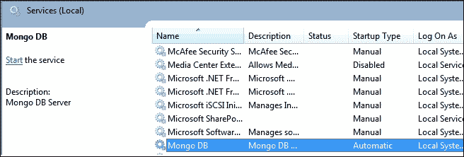

# 第四章：管理

在本章中，我们将看到以下与 MongoDB 管理相关的配方：

+   重命名集合

+   查看集合统计信息

+   查看数据库统计信息

+   手动填充文档

+   mongostat 和 mongotop 实用程序

+   获取当前正在执行的操作并终止它们

+   使用分析器对操作进行分析

+   在 Mongo 中设置用户

+   Mongo 中的进程间安全性

+   使用 collMod 命令修改集合行为

+   将 MongoDB 设置为 Windows 服务

+   副本集配置

+   从副本集中降级为主要

+   探索副本集的本地数据库

+   理解和分析 oplogs

+   构建带标签的副本集

+   为非分片集合配置默认分片

+   手动拆分和迁移块

+   使用标签进行领域驱动分片

+   在分片设置中探索配置数据库

# 介绍

在本章中，我们将介绍一些用于管理 MongoDB 的工具和实践。以下配方将帮助您从数据库中收集统计信息，管理用户访问权限，分析 oplogs，并了解与副本集工作的一些方面。

# 重命名集合

您是否曾经遇到过这样的情况：在关系数据库中命名了一个表，后来觉得名字可能会更好？或者也许您所在的组织迟迟没有意识到表名真的很混乱，并对名称强制执行一些标准？关系数据库确实有一些专有的方法来重命名表，数据库管理员会为您做这件事。

不过，这也带来了一个问题。在 Mongo 世界中，集合等同于表，创建后是否有办法将集合重命名为其他名称？在这个配方中，我们将探索 Mongo 的这个特性，即在集合中有数据的情况下重命名现有集合。

## 准备工作

我们需要运行一个 MongoDB 实例来执行这个集合重命名实验。参考第一章中的*安装单节点 MongoDB*一节，了解如何启动服务器的信息。我们将要执行的操作将来自 mongo shell。

## 如何做…

1.  一旦服务器启动，并假设它在默认端口`27017`上监听客户端连接，从 shell 执行以下命令连接到它：

```sql
> mongo

```

1.  连接后，使用默认的测试数据库。让我们创建一个带有一些测试数据的集合。我们将使用的集合名称是：

```sql
sloppyNamedCollection.
> for(i = 0 ; i < 10 ; i++) { db.sloppyNamedCollection.insert({'i':i}) };

```

1.  现在将创建测试数据（我们可以通过查询集合`sloppyNamedCollection`来验证数据）。

1.  将集合`neatNamedCollection`重命名为：

```sql
> db.sloppyNamedCollection.renameCollection('neatNamedCollection')
{ "ok" : 1 }

```

1.  通过执行以下命令验证`slappyNamedCollection`集合是否不再存在：

```sql
> show collections

```

1.  最后，查询`neatNamedCollection`集合，验证最初在`sloppyNamedCollection`中的数据确实存在其中。只需在 mongo shell 上执行以下命令：

```sql
> db.neatNamedCollection.find()

```

## 它是如何工作的…

重命名集合非常简单。它是通过`renameCollection`方法实现的，该方法接受两个参数。通常，函数签名如下：

```sql
> db.<collection to rename>.renameCollection('<target name of the collection>', <drop target if exists>)

```

第一个参数是要将集合重命名为的名称。

我们没有使用的第二个参数是一个布尔值，告诉命令是否删除目标集合（如果存在）。这个值默认为 false，这意味着不要删除目标，而是报错。这是一个明智的默认值，否则如果我们意外给出一个存在的集合名称并且不希望删除它，结果会很可怕。但是，如果你知道自己在做什么，并且希望在重命名集合时删除目标，将第二个参数传递为 true。这个参数的名称是`dropTarget`。在我们的情况下，调用应该是：

```sql
> db.sloppyNamedCollection.renameCollection('neatNamedCollection', true)

```

作为练习，尝试再次创建`sloppyNamedCollection`并将其重命名为没有第二个参数（或 false 作为值）。您应该看到 mongo 抱怨目标命名空间已存在。然后，再次使用第二个参数重命名为 true，现在重命名操作执行成功。

请注意，重命名操作将保留原始的和新重命名的集合在同一个数据库中。这个`renameCollection`方法不足以将集合移动/重命名到另一个数据库。在这种情况下，我们需要运行类似于以下命令的`renameCollection`命令：

```sql
> db.runCommand({ renameCollection: "<source_namespace>", to: "<target_namespace>", dropTarget: <true|false> });

```

假设我们想要将集合`sloppyNamedCollection`重命名为`neatNamedCollection`，并将其从`test`数据库移动到`newDatabase`，我们可以通过执行以下命令来执行此操作。请注意，使用的`dropTarget: true`开关旨在删除现有的目标集合（`newDatabase.neatNamedCollection`）（如果存在）。

```sql
> db.runCommand({ renameCollection: "test.sloppyNamedCollection ", to: " newDatabase.neatNamedCollection", dropTarget: true });

```

另外，重命名集合操作不适用于分片集合。

# 查看集合统计信息

也许在管理目的上，关于存储使用情况的一个有趣的统计数据是集合中文档的数量，可能可以根据数据的增长来估算未来的空间和内存需求，以获得集合的高级统计信息。

## 准备就绪

要查找集合的统计信息，我们需要运行一个服务器，并且一个单节点应该是可以的。有关如何启动服务器的信息，请参阅第一章中的*安装单节点 MongoDB*，*安装和启动服务器*。我们将要操作的数据需要导入到数据库中。导入数据的步骤在第二章的*创建测试数据*中给出。完成这些步骤后，我们就可以继续进行本教程了。

## 如何做…

1.  我们将使用`postalCodes`集合来查看统计信息。

1.  打开 mongo shell 并连接到正在运行的 MongoDB 实例。如果您在默认端口上启动了 mongo，请执行以下操作：

```sql
$ mongo

```

1.  导入数据后，如果`pincode`字段上不存在索引，则在该字段上创建一个索引：

```sql
> db.postalCodes.ensureIndex({'pincode':1})

```

1.  在 mongo 终端上执行以下操作：

```sql
> db.postalCodes.stats()

```

1.  观察输出并在 shell 上执行以下操作：

```sql
> db.postalCodes.stats(1024)

```

1.  再次观察输出。

接下来，我们将看看这些打印出的值对我们意味着什么。

## 它是如何工作的…

如果我们观察这两个命令的输出，我们会发现第二个命令中的所有数字都是以 KB 为单位，而第一个命令中的数字是以字节为单位。提供的参数称为比例，所有指示大小的数字都会除以这个比例。在这种情况下，由于我们给出的值是`1024`，我们得到的所有值都是以 KB 为单位，而如果将`1024 * 1024`作为比例的值（显示的大小将以 MB 为单位）。对于我们的分析，我们将使用以 KB 显示大小的值。

```sql
> db.postalCodes.stats(1024)
{
 "ns" : "test.postalCodes",
 "count" : 39732,
 "size" : 9312,
 "avgObjSize" : 240,
 "numExtents" : 6,
 "storageSize" : 10920,
 "lastExtentSize" : 8192,
 "paddingFactor" : 1,
 "paddingFactorNote" : "paddingFactor is unused and unmaintained in 3.0\. It remains hard coded to 1.0 for compatibility only.",
 "userFlags" : 1,
 "capped" : false,
 "nindexes" : 2,
 "totalIndexSize" : 2243,
 "indexSizes" : {
 "_id_" : 1261,
 "pincode_1" : 982
 },
 "ok" : 1
}

```

以下表格显示了重要字段的含义：

| Field | Description |
| --- | --- |
| `ns` | 以`<database>.<collection name>`格式的集合的完全限定名称。 |
| `count` | 集合中的文档数量。 |
| `size` | 集合中文档占用的实际存储空间大小。对集合中文档的添加、删除和更新可能会改变此数字。比例参数会影响此字段的值，在我们的情况下，此值以 KB 为单位，因为`1024`是比例。此数字包括填充（如果有）。 |
| `avgObjSize` | 这是集合中文档的平均大小。它只是大小字段除以集合中文档的计数（前两个字段）。比例参数会影响此字段的值，在我们的情况下，此值以 KB 为单位，因为`1024`是比例。 |
| `storageSize` | Mongo 在磁盘上预先分配空间，以确保集合中的文档保持在连续的位置，以提供更好的磁盘访问性能。这种预分配会用零填充文件，然后开始为插入的文档分配空间。该字段告诉此集合使用的存储空间大小。这个数字通常会比集合的实际大小大得多。比例参数影响此字段的值，在我们的情况下，此值以 KB 为单位，因为比例为`1024`。 |
| `numExtents` | 正如我们所看到的，Mongo 为了性能目的而预先分配了连续的磁盘空间给集合。然而，随着集合的增长，需要分配新的空间。该字段给出了这种连续块分配的数量。这个连续的块称为一个区段。 |
| `nindexes` | 该字段给出了集合上存在的索引的数量。即使我们没有在集合上创建索引，该值也将为`1`，因为 Mongo 会在字段`_id`上隐式创建一个索引。 |
| `lastExtentSize` | 分配的最后一个区段的大小。比例参数影响此字段的值，在我们的情况下，此值以 KB 为单位，因为比例为`1024`。 |
| `paddingFactor` | 自 3.0.0 版本起，此参数已被弃用，并且由于向后兼容性原因已硬编码为`1`。 |
| `totalIndexSize` | 索引也占用存储空间。该字段给出了磁盘上索引占用的总大小。比例参数影响此字段的值，在我们的情况下，此值以 KB 为单位，因为比例为`1024`。 |
| `indexSizes` | 该字段是一个文档，其键是索引的名称，值是所讨论的索引的大小。在我们的情况下，我们在`pincode`字段上显式创建了一个索引；因此，我们看到索引的名称作为键，磁盘上索引的大小作为值。所有这些索引的值的总和与先前给出的值`totalIndexSize`相同。比例参数影响此字段的值，在我们的情况下，此值以 KB 为单位，因为比例为`1024`。 |

文档被放置在存储设备上的连续位置。如果文档被更新，导致大小增加，Mongo 将不得不重新定位这个文档。这个操作会变得昂贵，影响这样的更新操作的性能。从 Mongo 3.0.0 开始，使用了两种数据分配策略。一种是*2 的幂*，其中文档以 2 的幂分配空间（例如，32、64、128 等）。另一种是*无填充*，其中集合不希望文档大小被改变。

## 另请参阅

在这个配方中，我们讨论了查看集合的统计信息。查看下一个配方以在数据库级别查看统计信息。

# 查看数据库统计信息

在上一个配方中，我们看到了如何从管理角度查看集合的一些重要统计信息。在这个配方中，我们得到了一个更高的视角，获得了数据库级别的这些（或大部分）统计信息。

## 准备工作

要查找数据库的统计信息，我们需要运行一个服务器，一个单节点应该是可以的。有关如何启动服务器的信息，请参阅第一章中的配方*安装单节点 MongoDB*，*安装和启动服务器*。我们将要操作的数据需要导入到数据库中。有关如何导入数据的步骤，请参阅第二章中的配方*创建测试数据*，*命令行操作和索引*。完成这些步骤后，我们就可以继续进行这个配方了。如果需要查看如何在集合级别查看统计信息，请参阅上一个配方。

## 如何做…

1.  我们将使用`test`数据库来完成此配方的目的。它已经在其中有一个`postalCodes`集合。

1.  使用 mongo shell 连接到服务器，通过在操作系统终端中输入以下命令。假设服务器正在监听端口`27017`。

```sql
$ mongo

```

1.  在 shell 上，执行以下命令并观察输出：

```sql
> db.stats()

```

1.  在 shell 上，再次执行以下命令，但这次我们添加了 scale 参数。观察输出：

```sql
> db.stats(1024)

```

## 它是如何工作的…

`scale`参数是`stats`函数的一个参数，它将字节数除以给定的 scale 值。在这种情况下，它是`1024`，因此所有值将以 KB 为单位。我们分析以下输出：

```sql
> db.stats(1024)
{
 "db" : "test",
 "collections" : 3,
 "objects" : 39738,
 "avgObjSize" : 143.32699179626553,
 "dataSize" : 5562,
 "storageSize" : 16388,
 "numExtents" : 8,
 "indexes" : 2,
 "indexSize" : 2243,
 "fileSize" : 196608,
 "nsSizeMB" : 16,
"extentFreeList" : {
 "num" : 4,
 "totalSize" : 2696
 },
"dataFileVersion" : {
 "major" : 4,
 "minor" : 5
 },
 "ok" : 1 
}

```

以下表格显示了重要字段的含义：

| 字段 | 描述 |
| --- | --- |
| `db` | 这是正在查看统计信息的数据库的名称。 |
| `collections` | 这是数据库中集合的总数。 |
| `objects` | 这是数据库中所有集合中文档的计数。如果我们使用`db.<collection>.stats()`查找集合的统计信息，我们会得到集合中文档的计数。这个属性是数据库中所有集合计数的总和。 |
| `avgObjectSize` | 这只是数据库中所有集合中所有对象的字节大小除以所有集合中文档的计数。这个值不受提供的 scale 影响，尽管这是一个`size`字段。 |
| `dataSize` | 这是数据库中所有集合中保存的数据的总大小。这个值受提供的 scale 影响。 |
| `storageSize` | 这是为存储文档而分配给该数据库中集合的总存储量。这个值受提供的 scale 影响。 |
| `numExtents` | 这是数据库中所有集合的 extent 数量的总数。这基本上是该数据库中集合统计信息中 extent（逻辑容器）的数量。 |
| `indexes` | 这是数据库中所有集合的索引数量的总和。 |
| `indexSize` | 这是数据库中所有集合的所有索引的字节大小。这个值受提供的 scale 影响。 |
| `fileSize` | 这是应该在文件系统中找到的该数据库的所有数据库文件的大小总和。文件的名称将是`test.0`，`test.1`等等。这个值受提供的 scale 影响。 |
| `nsSizeMB` | 这是数据库的`.ns`文件的大小（以 MB 为单位）。 |
| `extentFreeList.num` | 这是空闲列表中空闲 extent 的数量。你可以将 extent 看作是 MongoDB 的内部数据结构。 |
| `extentFreeList.totalSize` | 空闲列表上 extent 的大小。 |

要了解更多信息，你可以参考《Instant MongoDB》这样的书籍，由*Packt Publishing*出版（[`www.packtpub.com/big-data-and-business-inteliigence/instant-mongodb-instant`](http://www.packtpub.com/big-data-and-business-inteliigence/instant-mongodb-instant)）。

## 它是如何工作的…

让我们从`collections`字段开始。如果你仔细观察数字，并在 mongo shell 上执行`show collections`命令，你会发现与执行命令时相比，统计信息中多了一个隐藏的集合。这个差异是因为有一个隐藏的集合，它的名称是`system.namespaces`。你可以执行`db.system.namespaces.find()`来查看它的内容。

回到数据库上的统计操作的输出，结果中的对象字段也有一个有趣的值。如果我们在`postalCodes`集合中找到文档的数量，我们会发现它是`39732`。这里显示的数量是`39738`，这意味着还有六个文档。这六个文档来自`system.namespaces`和`system.indexes`集合。在这两个集合上执行计数查询将予以确认。请注意，`test`数据库除了`postalCodes`之外不包含任何其他集合。如果数据库包含更多包含文档的集合，这些数字将会改变。

还要注意`avgObjectSize`的值，这个值有点奇怪。与集合统计信息中的这个字段不同，该字段受所提供的比例值的影响，在数据库统计信息中，该值始终以字节为单位。这很令人困惑，我不太确定为什么这个值不根据提供的比例进行缩放。

# 手动填充文档

在不深入存储的内部细节的情况下，MongoDB 使用内存映射文件，这意味着数据存储在文件中，就像存储在内存中一样，并且它会使用低级别的操作系统服务将这些页面映射到内存中。文档存储在 mongo 数据文件中的连续位置，当文档增长并且不再适合空间时会出现问题。在这种情况下，mongo 会将文档重写到集合的末尾，并清理原来放置的空间（请注意，这个空间不会作为空闲空间释放给操作系统）。

对于不希望文档增长的应用程序来说，这不是一个大问题。然而，对于那些预期文档在一段时间内增长并且可能有很多这样的文档移动的人来说，这是一个很大的性能损失。随着 MongoDB 3.0 的发布，*Power of 2*方法成为了默认的大小分配策略。顾名思义，这种方法将文档存储在以 2 的幂分配的空间中。这不仅为文档提供了额外的填充，还更好地重用了由于文档的重定位或删除而导致的空闲空间。

也就是说，如果你仍然希望在你的策略中引入手动填充，继续阅读。

## 准备工作

这个食谱不需要任何东西，除非你打算尝试这个简单的技术，如果是这样，你需要一个正在运行的单个实例。有关如何启动服务器的信息，请参阅第一章中的食谱*安装单节点 MongoDB*，*安装和启动服务器*。

## 如何做到这一点...

这种技术的想法是向要插入的文档添加一些虚拟数据。这些虚拟数据的大小加上文档中的其他数据大致等于文档的预期大小。

例如，如果文件的平均大小在一段时间内估计为 1200 字节，而在插入文件时存在 300 字节的数据，我们将添加一个大小约为 900 字节的虚拟字段，以使总文件大小达到 1200 字节。

一旦插入文档，我们取消这个虚拟字段，这样在两个连续文档之间留下一个空隙。当文档随着时间的推移增长时，这个空白空间将被使用，最大限度地减少文档的移动。这个空白空间也可能被另一个文档使用。更加可靠的方法是只有在使用空间时才删除填充。然而，任何超出预期平均增长的文档都将被服务器复制到集合的末尾。不用说，没有达到预期大小的文档将倾向于浪费磁盘空间。

应用程序可以提出一些智能策略，也许根据文档的某个特定字段调整填充字段的大小，以解决这些缺陷，但这取决于应用程序开发人员。

现在让我们看一下这种方法的示例：

1.  我们定义一个小函数，它将向文档添加一个名为`padField`的字段，并将字符串值的数组添加到文档中。其代码如下：

```sql
function padDocument(doc) {
  doc.padField = []
  for(i = 0 ; i < 20 ; i++) {
    doc.padField[i] = 'Dummy'
  }
}
```

它将添加一个名为`padField`的数组，并添加 20 次名为`Dummy`的字符串。对于您添加到文档中的类型和添加的次数没有限制，只要它占用您所需的空间。上述代码只是一个示例。

1.  下一步是插入一个文档。我们将定义另一个名为`insert`的函数来执行：

```sql
function insert(collection, doc) {
   //1\. Pad the document with the padField
  padDocument(doc);
   //2\. Create or store the _id field that would be used later
  if(typeof(doc._id) == 'undefined') {
    _id = ObjectId()
    doc._id = _id
  }
  else {
    _id = doc._id
  }
   //3\. Insert the document with the padded field
  collection.insert(doc)
//4\. Remove the padded field, use the saved _id to find the document to be updated.
collection.update({'_id':_id}, {$unset:{'padField':1}})
}
```

1.  现在我们将通过在集合`testCol`中插入一个文档来将其付诸实践：

```sql
insert(db.testCol, {i:1})
```

1.  您可以使用以下查询查询`testCol`，并检查插入的文档是否存在：

```sql
> db.testCol.findOne({i:1})

```

请注意，在查询时，您将在其中找不到`padField`。但是，即使未设置该字段，数组占用的空间仍将保留在随后插入的文档之间。

## 它是如何工作的…

`insert`函数是不言自明的，并且其中有注释来说明它的作用。一个明显的问题是，我们如何相信这确实是我们打算做的事情。为此，我们将进行一个小活动如下。我们将在`manualPadTest`集合上进行这个目的。从 mongo shell 执行以下操作：

```sql
> db.manualPadTest.drop()
> db.manualPadTest.insert({i:1})
> db.manualPadTest.insert({i:2})
> db.manualPadTest.stats()

```

在统计信息中注意`avgObjSize`字段。接下来，从 mongo shell 执行以下操作：

```sql
> db.manualPadTest.drop()
> insert(db.manualPadTest , {i:1})
> insert(db.manualPadTest , {i:2})
> db.manualPadTest.stats()

```

在统计信息中注意`avgObjSize`字段。这个数字比我们之前看到的普通插入的数字要大得多。`paddingFactor`在这两种情况下仍然是 1，但后一种情况为文档提供了更多的缓冲区。

在这个示例中我们使用的`insert`函数中，插入到集合和更新文档操作不是原子的。

# mongostat 和 mongotop 实用程序

大多数人可能会发现这些名称与两个流行的 Unix 命令`iostat`和`top`相似。对于 MongoDB，`mongostat`和`mongotop`是两个实用程序，它们的工作与这两个 Unix 命令几乎相同，毫无疑问，它们用于监视 mongo 实例。

## 准备工作

在这个示例中，我们将通过运行一个脚本来模拟独立 mongo 实例上的一些操作，该脚本将尝试使您的服务器保持繁忙，然后在另一个终端中，我们将运行这些实用程序来监视`db`实例。

您需要启动一个独立的服务器来监听任何端口以进行客户端连接；在这种情况下，我们将坚持使用默认的`27017`端口。如果您不知道如何启动独立服务器，请参阅第一章中的*安装单节点 MongoDB*，*安装和启动服务器*。我们还需要从 Packt 网站下载脚本`KeepServerBusy.js`并将其放在本地驱动器上以备执行。还假定您的 mongo 安装的`bin`目录存在于操作系统的路径变量中。如果没有，那么这些命令需要在 shell 中使用可执行文件的绝对路径来执行。这两个实用程序`mongostat`和`mongotop`是与 mongo 安装一起提供的标准工具。

## 如何做…

1.  启动 MongoDB 服务器，并让它监听默认端口以进行连接。

1.  在另一个终端中，执行提供的 JavaScript `KeepServerBusy.js`如下：

```sql
$ mongo KeepServerBusy.js –quiet

```

1.  打开一个新的操作系统终端并执行以下命令：

```sql
$ mongostat

```

1.  捕获一段时间的输出内容，然后按下*Ctrl* + *C*停止命令捕获更多的统计信息。保持终端打开或将统计信息复制到另一个文件中。

1.  现在，从终端执行以下命令：

```sql
$ mongotop

```

1.  捕获输出内容一段时间，然后按*Ctrl* + *C*停止命令捕获更多统计信息。保持终端打开或将统计信息复制到另一个文件中。

1.  在执行提供的 JavaScript `KeepServerBusy.js`的 shell 中按*Ctrl* + *C*停止使服务器保持繁忙的操作。

## 工作原理…

让我们看看我们从这两个实用程序中捕获到了什么。

我们首先分析`mongostat`。在我的笔记本电脑上，使用`mongostat`进行捕获如下：

```sql
mongostat
connected to: 127.0.0.1
insert query update delete getmore command flushes mapped vsize   res faults idx miss % qr|qw ar|aw netIn netOut conn     time
 1000     1    950   1000       1     1|0       0 624.0M  1.4G 50.0M      0          0   0|0   0|1  431k   238k    2 08:59:21
 1000     1   1159   1000       1     1|0       0 624.0M  1.4G 50.0M      0          0   0|0   0|0  468k   252k    2 08:59:22
 1000     1    984   1000       1     1|0       0 624.0M  1.4G 50.0M      0          0   0|0   0|1  437k   240k    2 08:59:23
 1000     1   1066   1000       1     1|0       0 624.0M  1.4G 50.0M      0          0   0|0   0|1  452k   246k    2 08:59:24
 1000     1    944   1000       1     2|0       0 624.0M  1.4G 50.0M      0          0   0|0   0|1  431k   237k    2 08:59:25
 1000     1   1149   1000       1     1|0       0 624.0M  1.4G 50.0M      0          0   0|0   0|1  466k   252k    2 08:59:26
 1000     2   1015   1053       2     1|0       0 624.0M  1.4G 50.0M      0          0   0|0   0|0  450k   293k    2 08:59:27

```

您可以选择查看脚本`KeepServerBusy.js`是如何使服务器保持繁忙的。它所做的就是在`monitoringTest`集合中插入 1000 个文档，然后逐个更新它们以设置一个新的键，执行查找并遍历所有文档，最后逐个删除它们，基本上是一个写入密集型操作。

输出看起来很丑陋，但让我们逐个分析字段，看看需要关注的字段。

| 列 | 描述 |
| --- | --- |
| `insert`，`query`，`update`，`delete` | 前四列是每秒`insert`，`query`，`update`和`delete`操作的次数。这是每秒的，因为捕获这些数字的时间间隔相隔一秒，这由最后一列表示。 |
| `getmore` | 当游标对查询的数据用尽时，它会在服务器上执行`getmore`操作，以获取之前执行的查询的更多结果。此列显示在此给定的 1 秒时间范围内执行的`getmore`操作的次数。在我们的情况下，并没有执行太多`getmore`操作。 |
| `commands` | 这是在给定的 1 秒时间范围内在服务器上执行的命令数量。在我们的情况下，并不多，只有一个。在我们的情况下，`&#124;`后面的数字是`0`，因为这是独立模式。尝试连接到副本集主服务器和次服务器执行`mongostat`。你应该在那里看到稍微不同的数字。 |
| `flushes` | 这是在 1 秒间隔内将数据刷新到磁盘的次数。（在`MMAPv1`存储引擎的情况下是`fsync`，在`WiredTiger`存储引擎的情况下是在轮询间隔之间触发的检查点） |
| `mapped`，`virtual`和`resident memory` | 映射内存是 Mongo 进程映射到数据库的内存量。这通常与数据库的大小相同。另一方面，虚拟内存是分配给整个`mongod`进程的内存。当启用日志记录时，这将是映射内存大小的两倍以上。最后，常驻内存是 Mongo 实际使用的物理内存。所有这些数字以 MB 为单位给出。物理内存的总量可能比 Mongo 使用的内存多得多，但除非发生大量页面错误（在先前提到的输出中确实会发生），否则这并不是一个问题。 |
| `faults` | 这些是每秒发生的页面错误次数。这些数字应尽可能少。它表示 Mongo 需要多少次去磁盘获取在主内存中缺失的文档/索引。当使用 SSD 作为持久存储时，这个问题不像使用旋转磁盘驱动器时那么严重。 |
| `locked` | 自 2.2 版本以来，对集合的所有写操作都会锁定包含该集合的数据库，并且不会获取全局级别的锁。此字段显示在给定的时间间隔内大部分时间被锁定的数据库。在我们的情况下，`test`数据库大部分时间被锁定。 |
| `idx miss %` | 此字段给出了需要特定索引但在内存中不存在的次数。这会导致页面错误，并且需要访问磁盘以获取索引。可能还需要另一次磁盘访问以获取文档。这个数字也应该很低。高百分比的索引缺失是需要关注的问题。 |
| `qr` &#124; `qw` | 这些是等待执行的读取和写入的排队数。如果这个数字增加，表明数据库受到了读取和写入量的压倒。如果值太高，要密切关注页面错误和数据库锁定百分比，以便更深入地了解排队计数的增加。如果数据集太大，分片集合可以显著提高性能。 |
| `ar` &#124; `aw` | 这是活动读者和写者（客户端）的数量。只要其他我们之前看到的统计数据都在控制之下，即使数量很大，也不用担心。 |
| `netIn`和`netOut` | 在给定时间范围内，mongo 服务器的网络流量进出。数字以位为单位。例如，271k 表示 271 千位。 |
| `conn` | 这表示打开的连接数。要密切关注，看看是否会不断增加。 |
| `time` | 这是捕获此样本时的时间间隔。 |

如果`mongostat`连接到副本集的主服务器或从服务器，会看到一些更多的字段。作为一个任务，一旦收集到统计数据或独立实例，启动一个副本集服务器并执行相同的脚本以使服务器保持繁忙。使用`mongostat`连接到主服务器和从服务器实例，并查看不同的统计数据。

除了`mongostat`，我们还使用了`mongotop`实用程序来捕获统计数据。让我们看看它的输出并理解一些：

```sql
$>mongotop
connected to: 127.0.0.1
 ns           total          read         write
2014-01-15T17:55:13
 test.monitoringTest         899ms           1ms         898ms
 test.system.users             0ms           0ms           0ms
 test.system.namespaces           0ms           0ms           0ms
 test.system.js             0ms           0ms           0ms
 test.system.indexes           0ms           0ms           0ms

 ns           total          read         write
2014-01-15T17:55:14
 test.monitoringTest         959ms           0ms         959ms
 test.system.users             0ms           0ms           0ms
 test.system.namespaces           0ms           0ms           0ms
 test.system.js             0ms           0ms           0ms
 test.system.indexes           0ms           0ms           0ms
 ns           total          read         write
2014-01-15T17:55:15
 test.monitoringTest         954ms           1ms         953ms
 test.system.users             0ms           0ms           0ms
 test.system.namespaces           0ms           0ms           0ms
 test.system.js             0ms           0ms           0ms
 test.system.indexes           0ms           0ms           0ms

```

在这个统计数据中没有太多可看的。我们看到数据库在给定的 1 秒时间片段内忙于读取或写入的总时间。总时间中给定的值将是读取和写入时间的总和。如果我们实际上比较相同时间片段的`mongotop`和`mongostat`，那么写入正在进行的时间所占的百分比将非常接近`mongostat`输出中数据库被锁定的百分比。

`mongotop`命令接受命令行上的参数，如下所示：

```sql
$ mongotop 5

```

在这种情况下，打印统计数据的时间间隔将是 5 秒，而不是默认值 1 秒。

### 注意

从 MongoDB 3.0 开始，`mongotop`和`mongostat`实用程序都允许使用`--json`选项以 JSON 格式输出。如果您要使用自定义监视或度量收集脚本，这可能非常有用，这些脚本将依赖于这些实用程序。

## 另请参阅

+   在*获取当前执行操作并终止它们*的示例中，我们将看到如何从 shell 获取当前执行的操作，并在需要时终止它们。

+   在*使用分析器来分析操作*的示例中，我们将看到如何使用 Mongo 的内置分析功能来记录操作执行时间。

# 获取当前执行操作并终止它们

在这个示例中，我们将看到如何查看当前运行的操作，并终止一些长时间运行的操作。

## 准备工作

我们将在独立的 mongo 实例上模拟一些操作。我们需要启动一个独立服务器，以便监听任何端口以进行客户端连接；在这种情况下，我们将使用默认的`27017`端口。如果您不知道如何启动独立服务器，请参阅第一章中的*安装单节点 MongoDB*，*安装和启动服务器*。我们还需要启动两个连接到已启动服务器的 shell。一个 shell 将用于后台索引创建，另一个将用于监视当前操作，然后终止它。

## 如何做…

1.  我们无法在测试环境中模拟实际长时间运行的操作。我们将尝试创建一个索引，并希望它需要很长时间来创建。根据您的目标硬件配置，该操作可能需要一些时间。

1.  要开始这个测试，让我们在 mongo shell 上执行以下操作：

```sql
> db.currentOpTest.drop()
> for(i = 1 ; i < 10000000 ; i++) { db.currentOpTest.insert({'i':i})}

```

前面的插入可能需要一些时间来插入 1000 万个文档。

1.  一旦文档被插入，我们将执行一个操作，该操作将在后台创建索引。如果您想了解更多关于索引创建的信息，请参考第二章中的*在 shell 中创建后台和前台索引*，但这不是本教程的先决条件。

1.  在文档中的字段`i`上创建一个后台索引。这个索引创建操作是我们将从`currentOp`操作中查看的，也是我们将尝试使用终止操作来终止的操作。在一个 shell 中执行以下操作来启动后台索引创建操作。这需要相当长的时间，在我的笔记本电脑上花了 100 多秒。

```sql
> db.currentOpTest.ensureIndex({i:1}, {background:1})

```

1.  在第二个 shell 中，执行以下命令以获取当前正在执行的操作：

```sql
> db.currentOp().inprog

```

1.  注意操作的进度，并找到必要的索引创建操作。在我们的情况下，这是测试机器上唯一正在进行的操作。它将是一个在`system.indexes`上的操作，操作将是插入。在输出文档中要注意的关键是`ns`和`op`。我们需要注意这个操作的第一个字段，`opid`。在这种情况下，它是`11587458`。命令的示例输出在下一节中给出。

1.  使用以下命令从 shell 中终止操作，使用我们之前得到的`opid`（操作 ID）：

```sql
> db.killOp(11587458)

```

## 工作原理...

我们将把我们的解释分成两部分，第一部分是关于当前操作的详细信息，第二部分是关于终止操作。

在我们的情况下，索引创建过程是我们打算终止的长时间运行的操作。我们创建了一个大约有 1000 万个文档的大集合，并启动了一个后台索引创建过程。

在执行`db.currentOp()`操作时，我们会得到一个文档作为结果，其中包含一个`inprog`字段，其值是另一个文档的数组，每个文档代表一个当前正在运行的操作。在繁忙的系统上通常会得到一个大型文档列表。这是一个用于索引创建操作的文档：

```sql
{
        "desc" : "conn12",
        "threadId" : "0x3be96c0",
        "connectionId" : 12,
        "opid" : 3212789,
        "active" : true,
        "secs_running" : 1,
        "microsecs_running" : NumberLong(729029),
        "op" : "query",
        "ns" : "test.$cmd",
        "query" : {
            "createIndexes" : "currentOpTest",
            "indexes" : [
                {
                    "key" : {
                        "i" : 1
                    },
                    "name" : "i_1",
                    "background" : 1
                }
            ]
        },
        "client" : "127.0.0.1:36542",
        "msg" : "Index Build (background) Index Build (background): 384120/1000000 38%",
        "progress" : {
            "done" : 384120,
            "total" : 1000000
        },
        "numYields" : 3003,
        "locks" : {
            "Global" : "w",
            "MMAPV1Journal" : "w",
            "Database" : "w",
            "Collection" : "W"
  "waitingForLock" : true,
        "lockStats" : {
            "Global" : {
                "acquireCount" : {
                    "w" : NumberLong(3004)
                }
            },
            "MMAPV1Journal" : {
                "acquireCount" : {
                    "w" : NumberLong(387127)
                },
                "acquireWaitCount" : {
                    "w" : NumberLong(9)
                },
                "timeAcquiringMicros" : {
                    "w" : NumberLong(60025)
                }
            },
            "Database" : {
                "acquireCount" : {
                    "w" : NumberLong(3004),
                    "W" : NumberLong(1)
                }
            },
            "Collection" : {
                "acquireCount" : {
                    "W" : NumberLong(3004)
                },
                "acquireWaitCount" : {
                    "W" : NumberLong(1)
                },
                "timeAcquiringMicros" : {
                    "W" : NumberLong(66)
                }
            },
            "Metadata" : {
                "acquireCount" : {
                    "W" : NumberLong(4)
                }
            }
        }
    }
```

我们将在下表中看到这些字段的含义：

| 字段 | 描述 |
| --- | --- |
| opid | 这是一个唯一的操作 ID，用于标识操作。这是要用来终止操作的 ID。 |
| `active` | 布尔值，指示操作是否已经开始，如果它正在等待获取锁来执行操作，则为 false。一旦它开始，即使在某个时刻它已经释放了锁并且没有在执行，值也将为 true。 |
| `secs_running` | 给出操作执行的时间，单位为秒。 |
| `op` | 这是操作的类型。在索引创建的情况下，它被插入到索引的系统集合中。可能的值包括`insert`，`query`，`getmore`，`update`，`remove`和`command`。 |
| `ns` | 这是目标的完全限定命名空间。它将以`<数据库名称>.<集合名称>`的形式出现。 |
| `insert` | 这是将插入到集合中的文档。 |
| 查询 | 这是一个字段，除了`insert`，`getmore`和`command`之外的其他操作中都会出现。 |
| `client` | 启动操作的客户端的 IP 地址/主机名和端口。 |
| `desc` | 这是客户端的描述，主要是客户端连接名称。 |
| `connectionId` | 这是请求来源的客户端连接的标识符。 |
| `locks` | 这是一个包含为此操作持有的锁的文档。该文档显示了用于分析的操作所持有的锁的类型和模式。可能的模式如下：**R**表示共享（S）锁。**W**表示排他（X）锁。**r**表示意向共享（IS）锁。**w**表示意向排他（IX）锁。 |
| `waitingForLock` | 此字段指示操作是否正在等待获取锁。例如，如果前面的索引创建不是后台进程，那么此数据库上的其他操作将排队等待获取锁。那些操作的标志将为 true。 |
| `msg` | 这是操作的人类可读消息。在这种情况下，我们可以看到操作完成的百分比，因为这是一个索引创建操作。 |
| `progress` | 操作的状态，total 给出了集合中文档的总数，done 给出了到目前为止已索引的数量。在这种情况下，集合已经有超过 1000 万个文档。完成百分比是从这些数字计算出来的。 |
| `numYields` | 这是进程放弃锁的次数，以允许其他操作执行。由于这是后台索引创建过程，这个数字会不断增加，因为服务器经常放弃它，以便让其他操作执行。如果是前台进程，锁将一直保持到操作完成。 |
| `lockStats` | 这个文档有更多的嵌套文档，给出了此操作持有读取或写入锁的总时间，以及等待获取锁的时间。 |

### 注意

如果您有一个副本集，主服务器上的 oplog 将有更多的 getmore 操作，来自从服务器。

1.  要查看正在执行的系统操作，我们需要将 true 值作为参数传递给`currentOp`函数调用，如下所示：

```sql
> db.currentOp(true)

```

1.  接下来，我们将看到如何使用`killOp`函数终止用户发起的操作。操作可以简单地如下所示：

```sql
> db.killOp(<operation id>)

```

在我们的情况下，索引创建过程的进程 ID 为 11587458，因此将如下终止它：

```sql
> db.killOp(11587458)

```

无论给定的操作 ID 是否存在，终止任何操作，我们都会在控制台上看到以下消息：

```sql
{ "info" : "attempting to kill op" }

```

因此，看到这条消息并不意味着操作已被终止。这只是意味着如果存在该操作，将尝试终止该操作。

1.  如果某些操作无法立即终止，并且为其发出了`killOp`命令，则`currentOp`中的`killPending`字段将开始出现给定操作。例如，在 shell 上执行以下查询：

```sql
> db.currentOpTest.find({$where:'sleep(100000)'})

```

这不会返回，并且执行查询的线程将休眠 100 秒。这是一个无法使用`killOp`终止的操作。尝试从另一个 shell 执行`currentOp`命令（不要按*Tab*进行自动完成，否则您的 shell 可能会挂起），获取操作 ID，然后使用`killOp`终止它。如果执行`currentOp`命令，您应该看到该进程仍在运行，但是进程详细信息的文档现在将包含一个新的`killPending`键，指出该操作的终止已被请求但是挂起。

# 使用分析器来分析操作

在这个教程中，我们将看一下 mongo 内置的分析器，用于分析在 mongo 服务器上执行的操作。这是一个用于记录所有或慢操作的实用程序，可用于分析服务器的性能。

## 准备工作

在这个教程中，我们将在独立的 mongo 实例上执行一些操作并对其进行分析。我们需要启动一个独立的服务器，以便监听任何端口以进行客户端连接；在这种情况下，我们将使用默认的`27017`端口。如果您不知道如何启动独立服务器，请参阅第一章中的*安装单节点 MongoDB*，*安装和启动服务器*。我们还需要启动一个 shell，用于执行查询，启用分析和查看分析操作。

## 如何做…

1.  一旦服务器启动并且 shell 连接到它，执行以下内容以获取当前的分析级别：

```sql
> db.getProfilingLevel()

```

1.  如果我们之前没有设置默认级别，那么默认级别应该是`0`（不进行分析）。

1.  让我们将分析级别设置为`1`（仅记录慢操作），并记录所有慢于`50`毫秒的操作。在 shell 上执行以下操作：

```sql
> db.setProfilingLevel(1, 50)

```

1.  现在，让我们执行一个插入操作到一个收集中，然后执行一些查询：

```sql
> db.profilingTest.insert({i:1})
> db.profilingTest.find()
> db.profilingTest.find({$where:'sleep(70)'})

```

1.  现在，在以下收集上执行查询：

```sql
> db.system.profile.find().pretty()

```

## 它是如何工作的...

分析通常不会默认启用。如果您对数据库的性能感到满意，没有理由启用分析器。只有当有改进的空间并且想要针对一些昂贵的操作时才会启用。一个重要的问题是什么样的操作被分类为慢操作？答案是，这取决于应用程序。在 mongo 中，慢操作指的是任何超过 100 毫秒的操作。然而，在设置分析级别时，您可以选择阈值。

有三种可能的分析级别：

+   `0`：禁用分析

+   `1`：启用慢操作的分析，调用时提供操作被分类为慢操作的阈值

+   `2`：分析所有操作

尽管分析所有操作可能不是一个很好的主意，也可能不常用，但将值设置为`1`并提供一个阈值是监视慢操作的好方法。

如果我们看一下我们执行的步骤，我们可以通过执行操作`db.getProfilingLevel()`来获取当前的分析级别。要获取更多信息，例如慢操作的阈值是多少，可以使用`db.getProfilingStatus()`。这将返回一个包含分析级别和慢操作阈值的文档。

要设置分析级别，我们调用`db.setProfilingLevel()`方法。在我们的情况下，我们设置为记录所有操作花费超过`50`毫秒的时间为`db.setProfilingLevel(1, 50)`。

要禁用分析，只需执行`db.setProfilingLevel(0)`。

接下来我们执行了三个操作，一个是插入文档，一个是查找所有文档，最后一个是调用`sleep`并设置值为`70`毫秒以减慢速度的查找。

最后一步是查看记录在`system.profile`收集中的这些被分析的操作。我们执行一个查找以查看记录的操作。对于我的执行，插入和最终的`find`操作与`sleep`一起被记录。

显然，这种分析会带来一些开销，但可以忽略不计。因此，我们不会默认启用它，只有在我们想要分析慢操作时才会启用。另一个问题是，“这种分析收集会随时间增加吗？”答案是“不会”，因为这是一个有上限的收集。有上限的收集是固定大小的收集，保留插入顺序，并充当循环队列，在新文档填满时丢弃最旧的文档。对`system.namespaces`的查询应该显示统计信息。对`system.profile`收集的查询执行将显示以下内容：

```sql
{"name":"test.system.profile", "options":{"capped":true, "size":1048576 }}

```

正如我们所看到的，这个收集的大小是 1MB，非常小。因此，将分析级别设置为`2`会很容易覆盖繁忙系统上的数据。如果希望保留更多操作，也可以选择显式创建一个名为`system.profile`的有上限的收集，并设置任何所需的大小。要显式创建一个有上限的收集，可以执行以下操作：

```sql
db.createCollection('system.profile', {capped:1, size: 1048576})

```

显然，所选择的大小是任意的，您可以根据数据填充的频率和希望在覆盖之前保留多少分析数据来分配任何大小给这个收集。

由于这是一个有上限的收集，并且保留了插入顺序，使用`sort order {$natural:-1}`的查询将非常适用且非常有效，可以按照执行时间的相反顺序找到操作。

我们最终将查看插入到`system.profile`集合中的文档，并查看它记录了哪些操作：

```sql
{
        "op" : "query",
        "ns" : "test.profilingTest",
        "query" : {
                "$where" : "sleep(70)"
        },
        "ntoreturn" : 0,
        "ntoskip" : 0,
        "nscanned" : 1,
        "keyUpdates" : 0,
        "numYield" : 0,
        "lockStats" : {
                …<<<<snip>>>
       },
        "nreturned" : 0,
        "responseLength" : 20,
        "millis" : 188,
        "ts" : ISODate("2014-01-27T17:37:02.482Z"),
        "client" : "127.0.0.1",
        "allUsers" : [ ],
        "user" : ""
}
```

正如我们在文档中所看到的，确实有一些有趣的统计数据。让我们在下表中看一些。其中一些字段与我们从 shell 执行`db.currentOp()`操作时看到的字段相同，并且我们在上一个示例中已经讨论过。

| 字段 | 描述 |
| --- | --- |
| `op` | 执行的操作；在这种情况下，是一个查找操作，因此在这种情况下是查询。 |
| `ns` | 这是操作执行的集合的完全限定名称。它的格式将是`<数据库>.<集合名称>`。 |
| `query` | 显示在服务器上执行的查询。 |
| `nscanned` | 这与解释计划有相似的含义。它是扫描的文档和索引条目的总数。 |
| `numYields` | 操作执行时锁被放弃的次数。更高的放弃次数可能表明查询需要大量的磁盘访问。这可能是重新查看索引或优化查询本身的良好指标。 |
| `lockStats` | 获取锁所花费的时间和持有锁的时间的一些有趣的统计数据。 |
| `nreturned` | 返回的文档数量。 |
| `responseLength` | 响应的长度（以字节为单位）。 |
| `millis` | 最重要的是，执行操作所花费的毫秒数。这可以是捕捉慢查询的良好起点。 |
| `ts` | 这是操作执行的时间。 |
| `client` | 执行操作的客户端的主机名/IP 地址。 |

# 在 Mongo 中设置用户

安全是任何企业级系统的基石之一。并非总是可以在完全安全的环境中找到系统，以允许未经身份验证的用户访问它。除了测试环境外，几乎每个生产环境都需要适当的访问权限，也许还需要对系统访问进行审计。Mongo 安全有多个方面：

+   最终用户访问系统的访问权限。将会有多个角色，如管理员、只读用户和读写非管理员用户。

+   副本集中添加的节点的身份验证。在副本集中，只允许添加经过身份验证的系统。如果向副本集添加未经身份验证的节点，系统的完整性将受到损害。

+   加密在副本集的节点之间或甚至客户端和服务器（或分片设置中的 mongos 进程）之间传输的数据。

在这个和下一个示例中，我们将看看如何解决这里给出的第一和第二点。默认情况下，社区版的 mongo 不支持在传输的数据上加密，需要使用`ssl`选项重新构建 mongo 数据库。

## 准备工作

在这个示例中，我们将为独立的 mongo 实例设置用户。我们需要启动一个独立服务器，监听任何端口以进行客户端连接；在这种情况下，我们将使用默认的`27017`端口。如果您不知道如何启动独立服务器，请参阅第一章中的*安装单节点 MongoDB*，*安装和启动服务器*。我们还需要启动一个用于此管理操作的 shell。对于副本集，我们只会连接到主服务器并执行这些操作。

## 如何做…

在这个示例中，我们将为测试数据库添加一个管理员用户、一个只读用户和一个读写用户。

在这一点上，假设：

+   服务器正在运行，并且我们从 shell 连接到它。

+   服务器在没有特殊命令行参数的情况下启动，除了第一章中提到的那些，*安装和启动服务器*的*使用命令行选项启动单节点实例*配方。因此，我们对任何用户都有对服务器的完全访问权限。

执行以下步骤：

1.  我们将要做的第一步是创建一个管理员用户。所有命令都假定您正在使用 MongoDB 3.0 及以上版本。

1.  首先，我们从 admin 数据库开始创建管理员用户如下：

```sql
> use admin
> db.createUser({
 user:'admin', pwd:'admin',
 customData:{desc:'The admin user for admin db'},
 roles:['readWrite', 'dbAdmin', 'clusterAdmin']
 })

```

1.  我们将添加`read_user`和`write_user`到测试数据库。要添加用户，请从 mongo shell 执行以下操作：

```sql
> use test
> db.createUser({
 user:'read_user', pwd:'read_user',
 customData:{desc:'The read only user for test database'},
 roles:['read']
 }
)
> db.createUser({
 user:'write_user', pwd:'write_user',
 customData:{desc:'The read write user for test database'}, 
 roles:['readWrite']
 }
)

```

1.  现在关闭 mongo 服务器并关闭 shell。在命令行上重新启动 mongo 服务器，但使用`--auth`选项：

```sql
$ mongod .. <other options as provided earlier> --auth

```

如果您的 mongod 实例使用`/etc/mongod.conf`，则在配置文件中添加`auth = true`一行，并重新启动 mongod 服务。

1.  现在从新打开的 mongo shell 连接到服务器并执行以下操作：

```sql
> db.testAuth.find()

```

1.  `testAuth`集合不需要存在，但是您应该会看到一个错误，即我们未被授权查询该集合。

1.  我们现在将使用`read_user`从 shell 登录如下：

```sql
> db.auth('read_user', 'read_user')

```

1.  我们现在将执行相同的`find`操作如下。它不应该出现错误，根据集合是否存在，可能不会返回任何结果：

```sql
> db.testAuth.find()

```

1.  现在，我们将尝试插入一个文档如下。我们应该会收到一个错误，表示您未被授权在此集合中插入数据。

```sql
> db.testAuth.insert({i:1})

```

1.  我们现在将注销并再次登录，但是使用 write 用户如下。请注意，这次我们登录的方式与以前不同。我们为`auth`函数提供了一个文档作为参数，而在以前的情况下，我们为用户名和密码传递了两个参数：

```sql
> db.logout()
> db.auth({user:'write_user', pwd:'write_user'})
Now to execute the insert again as follows, this time around it should work
> db.testAuth.insert({i:1})

```

1.  现在，在 shell 上执行以下操作。您应该会收到未经授权的错误：

```sql
> db.serverStatus()

```

1.  我们现在将切换到`admin`数据库。我们当前使用具有`test`数据库上读写权限的`write_user`连接到服务器。从 mongo shell 尝试执行以下操作：

```sql
> use admin
> show collections

```

1.  关闭 mongo shell 或从操作系统控制台打开一个新的 shell 如下。这应该会直接将我们带到 admin 数据库：

```sql
$ mongo -u admin -p admin admin

```

1.  现在在 shell 上执行以下操作。它应该会显示我们在 admin 数据库中的集合：

```sql
> show collections

```

1.  尝试并执行以下操作：

```sql
> db.serverStatus()

```

## 它是如何工作的...

我们执行了很多步骤，现在我们将仔细研究它们。

最初，服务器在没有`--auth`选项的情况下启动，因此默认情况下不会强制执行任何安全性。我们使用`db.createUser`方法创建了一个具有`db.createUser`方法的管理员用户。创建用户的方法签名是`createUser(user, writeConcern)`。第一个参数是用户，实际上是一个 JSON 文档，第二个是用于用户创建的写关注。用户的 JSON 文档具有以下格式：

```sql
{
  'user' : <user name>,
  'pwd' : <password>,
  'customData': {<JSON document providing any user specific data>}
  'roles':[<roles of the user>]
}
```

这里提供的角色可以按如下方式提供，假设在创建用户时的当前数据库是 shell 上的测试：

```sql
[{'role' : 'read',  'db':'reports'}, 'readWrite']

```

这将创建的用户对报告`db`具有读取访问权限，并对`test`数据库具有`readWrite`访问权限。让我们看看`test`用户的完整用户创建调用：

```sql
> use test
> db.createUser({
 user:'test', pwd:'test',
 customData:{desc:'read access on reports and readWrite access on test'},
 roles:[
 {role:'read', db : 'reports'},
 'readWrite'
 ]
 }
)

```

写关注，这是一个可选参数，可以作为 JSON 文档提供。一些示例值是`{w:1}`，`{w:'majority'}`。

回到管理员用户创建，我们在第 2 步中使用`createUser`方法创建了用户，并在`admin`数据库中为该用户提供了三个内置角色。

在第 3 步中，我们使用相同的`createUser`方法在`test`数据库中创建了`read`和`read-write`用户。

在`admin`，`read`和`read-write`用户创建后关闭 MongoDB 服务器，并使用`--auth`选项重新启动它。

重新启动服务器后，我们将在第 8 步中从 shell 连接到它，但未经身份验证。在这里，我们尝试在 test 数据库中的集合上执行`find`查询，但由于我们未经身份验证，操作失败。这表明服务器现在需要适当的凭据才能执行操作。在第 8 和 9 步中，我们使用`read_user`登录，首先执行`find`操作（成功），然后执行一个插入操作（失败），因为用户只有读取权限。通过从 shell 调用`db.auth(<user name>, <password>)`和`db.logout()`来验证用户的方式，这将注销当前登录的用户。

在步骤 10 到 12 中，我们演示了我们可以使用`write_user`执行`insert`操作，但是像`db.serverStatus()`这样的管理员操作无法执行。这是因为这些操作在服务器上执行`admin command`，非管理员用户不允许调用这些操作。同样，当我们将数据库更改为 admin 时，来自`test`数据库的`write_user`不被允许执行任何操作，比如获取集合列表或查询`admin`数据库中的集合。

在第 14 步中，我们使用`admin`用户登录到`admin`数据库的 shell 中。之前，我们使用`auth`方法登录到数据库；在这种情况下，我们使用`-u`和`-p`选项来提供用户名和密码。我们还提供要连接的数据库的名称，在这种情况下是 admin。在这里，我们能够查看 admin 数据库中的集合，并执行像获取服务器状态这样的管理员操作。执行`db.serverStatus`调用是可能的，因为用户被赋予了`clusterAdmin`角色。

最后要注意的一点是，除了向集合写入数据之外，具有写入权限的用户还可以在具有写入访问权限的集合上创建索引。

## 还有更多...

在这个示例中，我们看到了如何创建不同的用户以及他们具有的权限，限制了一些操作。在接下来的示例中，我们将看到如何在进程级别进行身份验证。也就是说，一个 mongo 实例如何对自己进行身份验证，以便被添加到副本集中。

## 另请参阅

+   MongoDB 带有许多内置用户角色，每个角色都有各种权限。请参考以下网址以获取各种内置角色的详细信息：[`docs.mongodb.org/manual/reference/built-in-roles/`](http://docs.mongodb.org/manual/reference/built-in-roles/)。

+   MongoDB 还支持自定义用户角色。请参考以下网址了解如何定义自定义用户角色的更多信息：[`docs.mongodb.org/manual/core/authorization/#user-defined-roles`](http://docs.mongodb.org/manual/core/authorization/#user-defined-roles)。

# Mongo 中的进程间安全性

在上一个示例中，我们看到了如何强制用户在允许对 Mongo 进行任何操作之前登录进行身份验证。在这个示例中，我们将研究进程间安全性。通过进程间安全性，我们并不是指加密通信，而是确保在将节点添加到副本集之前对其进行身份验证。

## 准备工作

在这个示例中，我们将作为副本集的一部分启动多个 mongo 实例，因此您可能需要参考第一章中的*作为副本集的一部分启动多个实例*这个示例，如果您不知道如何启动副本集。除此之外，在这个示例中，我们将看到如何生成用于使用的密钥文件以及在未经身份验证的节点被添加到副本集时的行为。

## 如何做...

为了奠定基础，我们将启动三个实例，分别监听端口`27000`、`27001`和`27002`。前两个将通过提供密钥文件的路径来启动，第三个则不会。稍后，我们将尝试将这三个实例添加到同一个副本集中。

1.  让我们首先生成密钥文件。生成密钥文件并没有什么特别之处。这就像有一个包含来自`base64`字符集的 6 到 1024 个字符的文件一样简单。在 Linux 文件系统上，您可以选择使用`openssl`生成伪随机字节，并将其编码为`base64`。以下命令将生成 500 个随机字节，然后将这些字节编码为`base64`并写入文件`keyfile`：

```sql
$ openssl rand –base64 500 > keyfile

```

1.  在 Unix 文件系统上，密钥文件不应该对世界和组有权限。因此，在创建后，我们应该执行以下操作：

```sql
$ chmod 400 keyfile

```

1.  不给创建者写权限可以确保我们不会意外地覆盖内容。然而，在 Windows 平台上，`openssl`并不是开箱即用的，因此您需要下载它，解压缩存档，并将`bin`文件夹添加到操作系统的路径变量中。对于 Windows，我们可以从以下网址下载：[`gnuwin32.sourceforge.net/packages/openssl.htm`](http://gnuwin32.sourceforge.net/packages/openssl.htm)。

1.  您甚至可以选择不使用这里提到的方法（使用`openssl`）生成密钥文件，并且可以通过在任何文本编辑器或您选择的地方输入纯文本来简化。但是，请注意，mongo 会剥离字符`\r`、`\n`和空格，并将剩余文本视为密钥。例如，我们可以创建一个文件，其中包含以下内容添加到密钥文件。同样，文件将被命名为`keyfile`，内容如下：

```sql
somecontentaddedtothekeyfilefromtheeditorwithoutspaces
```

1.  使用这里提到的任何方法，我们都不应该有一个`keyfile`，它将用于后续的步骤。

1.  现在我们将通过以下方式启动 mongo 进程来保护 mongo 进程。我将在 Windows 上启动以下内容，我的密钥文件 ID 命名为`keyfile`，放在`c:\MongoDB`上。数据路径分别为`c:\MongoDB\data\c1`、`c:\MongoDB\data\c2`和`c:\MongoDB\data\c3`。

1.  启动第一个实例，监听端口`27000`如下：

```sql
C:\>mongod --dbpath c:\MongoDB\data\c1 --port 27000 --auth --keyFile c:\MongoDB\keyfile --replSet secureSet --smallfiles --oplogSize 100

```

1.  同样，启动第二个服务器，监听端口`27001`如下：

```sql
C:\>mongod --dbpath c:\MongoDB\data\c2 --port 27001 --auth --keyFile c:\MongoDB\keyfile --replSet secureSet --smallfiles --oplogSize 100

```

1.  第三个实例将启动，但不带`--auth`和`--keyFile`选项，监听端口`27002`如下：

```sql
C:\>mongod --dbpath c:\MongoDB\data\c3 --port 27002 --replSet secureSet --smallfiles --oplogSize 100

```

1.  然后我们启动一个 mongo shell，并连接到端口`27000`，这是第一个启动的实例。从 mongo shell 中，我们输入：

```sql
> rs.initiate()

```

1.  几秒钟后，副本集将被初始化，只有一个实例在其中。现在我们将尝试向这个副本集添加两个新实例。首先，按照以下方式添加监听端口`27001`的实例（您需要添加适当的主机名，`Amol-PC`是我的主机名）：

```sql
> rs.add({_id:1, host:'Amol-PC:27001'})

```

1.  我们将执行`rs.status()`命令来查看我们副本集的状态。在命令的输出中，我们应该看到我们新添加的实例。

1.  现在我们将尝试最终添加一个实例，该实例是在没有`--auth`和`--keyFile`选项的情况下启动的，如下所示：

```sql
> rs.add({_id:2, host:'Amol-PC:27002'})

```

这应该将实例添加到副本集中，但使用`rs.status()`将显示实例状态为 UNKNOWN。运行在`27002`上的服务器日志也应该显示一些身份验证错误。

1.  最后，我们必须重新启动这个实例；然而，这一次我们提供`--auth`和`--keyFile`选项如下：

```sql
C:\>mongod --dbpath c:\MongoDB\data\c3 --port 27002 --replSet secureSet --smallfiles --oplogSize 100 --auth --keyFile c:\MongoDB\keyfile

```

1.  一旦服务器启动，再次从 shell 连接到它，并在几分钟内输入`rs.status()`，它应该会显示为一个辅助实例。

## 还有更多...

在这个配方中，我们看到了用于防止未经身份验证的节点被添加到 mongo 副本集的进程间安全性。我们仍然没有通过加密在传输过程中发送的数据来保护传输。在*附录*中，我们将展示如何从源代码构建 mongo 服务器以及如何启用传输内容的加密。

# 使用`collMod`命令修改集合行为

这是一个用于更改 mongo 中集合行为的命令。它可以被认为是一个*集合修改*操作（尽管官方没有明确提到）。

对于这个配方的一部分，需要了解 TTL 索引的知识。

## 准备工作

在这个配方中，我们将在一个集合上执行`collMod`操作。我们需要启动一个独立的服务器来监听任何端口以进行客户端连接；在这种情况下，我们将坚持使用默认的`27017`端口。如果您不知道如何启动独立服务器，请参考第一章中的*安装单节点 MongoDB*，*安装和启动服务器*。我们还需要启动一个用于此管理的 shell。如果您不知道它们，强烈建议您查看第二章中的*在固定间隔后使文档过期使用 TTL 索引*和*使用 TTL 索引在给定时间使文档过期*这两个配方。

## 工作原理…

这个操作可以用来做一些事情：

1.  假设我们有一个带有 TTL 索引的集合，就像我们在第二章中看到的那样，让我们通过执行以下操作来查看索引列表：

```sql
> db.ttlTest.getIndexes()

```

1.  要将到期时间从`300`毫秒更改为`800`毫秒，请执行以下操作：

```sql
> db.runCommand({collMod: 'ttlTest', index: {keyPattern: {createDate:1}, expireAfterSeconds:800}})

```

## 工作原理…

`collMod`命令始终具有以下格式：`{collMod：<集合名称>，<collmod 操作>}`。

我们使用`collMod`进行索引操作来修改 TTL 索引。如果 TTL 索引已经创建，并且需要在创建后更改生存时间，我们使用`collMod`命令。该命令的操作特定字段如下：

```sql
{index: {keyPattern: <the field on which the index was originally created>, expireAfterSeconds:<new time to be used for TTL of the index>}}

```

`keyPattern`是创建 TTL 索引的集合上的字段，`expireAfterSeconds`将包含要更改的新时间。成功执行后，我们应该在 shell 中看到以下内容：

```sql
{ "expireAfterSeconds_old" : 300, "expireAfterSeconds_new" : 800, "ok" : 1 }

```

# 将 MongoDB 设置为 Windows 服务

Windows 服务是在后台运行的长时间运行的应用程序，类似于守护线程。数据库是这种类型服务的良好候选者，它们会在主机启动和停止时启动和停止（但您也可以选择手动启动/停止服务）。许多数据库供应商在服务器上安装时提供了将数据库作为服务启动的功能。MongoDB 也可以做到这一点，这就是我们将在这个配方中看到的。

## 准备工作

参考第一章中的配方*使用配置文件从配置文件安装单节点 MongoDB*，获取有关如何使用外部配置文件启动 MongoDB 服务器的信息。由于在这种情况下 mongo 作为服务运行，因此无法提供类似命令的参数，并且从配置文件配置是唯一的选择。参考第一章中*安装单节点 MongoDB*配方的先决条件，这是我们这个配方所需要的一切。

## 如何操作…

1.  我们首先将创建一个带有三个配置值`port`、`dbpath`和`logpath`文件的配置文件。我们将文件命名为`mongo.conf`，并将其保存在位置`c:\conf\mongo.conf`，其中包含以下三个条目（您可以选择任何路径作为配置文件位置、数据库和日志）：

```sql
port = 27000
dbpath = c:\data\mongo\db
logpath = c:\logs\mongo.log

```

1.  从 Windows 终端执行以下操作，可能需要以管理员身份执行。在 Windows 7 中，执行了以下步骤：

1.  在键盘上按 Windows 键。

1.  在“搜索程序和文件”空间中，键入`cmd`。

1.  在程序中，将看到命令提示符程序；右键单击它并选择**以管理员身份运行**。

1.  在 shell 中执行以下操作：

```sql
C:\>mongod --config c:\conf\mongo.conf –install

```

1.  在控制台上打印的日志应该确认服务已正确安装。

1.  可以通过以下方式从控制台启动服务：

```sql
C:\>net start MongoDB

```

1.  可以通过以下方式停止服务：

```sql
C:\>net stop MongoDB

```

1.  在运行窗口中键入`services.msc`（Windows 键+*R*）。在管理控制台中，搜索 MongoDB 服务。我们应该看到它如下所示：

1.  该服务是自动的，也就是说，当操作系统启动时会启动它。可以通过右键单击它并选择**属性**来更改为手动。

1.  要删除服务，需要从命令提示符执行以下操作：

```sql
C:\>mongod --remove

```

1.  还有更多可用的选项，可用于配置服务的名称、显示名称、描述以及运行服务的用户帐户。这些可以作为命令行参数提供。执行以下操作以查看可能的选项，并查看**Windows 服务控制管理器**选项：

```sql
C:\> mongod --help

```

# 副本集配置

我们在第一章中对副本集进行了深入讨论，*安装和启动服务器*中的配方*作为副本集的一部分启动多个实例*，我们看到了如何启动一个简单的副本集。在本章的*Mongo 中的进程间安全性*中，我们看到了如何启动具有进程间身份验证的副本集。老实说，这基本上就是我们在设置标准副本集时所做的。有一些配置是必须了解的，并且应该了解它们如何影响副本集的行为。请注意，我们在本配方中仍未讨论标签感知复制，并且它将在本章的另一个配方*构建带标签的副本集*中单独讨论。

## 准备工作

参考第一章中的*安装和启动服务器*中的配方*作为副本集的一部分启动多个实例*，了解先决条件并了解副本集的基础知识。按照配方中的说明，在计算机上设置一个简单的三节点副本集。

在进行配置之前，我们将了解副本集中的选举是什么，以及它们在高层次上是如何工作的。了解选举是很有必要的，因为一些配置选项会影响选举中的投票过程。

### 副本集中的选举

Mongo 副本集有一个主要实例和多个辅助实例。所有数据库写操作只发生在主要实例上，并且会被复制到辅助实例上。读操作可以根据读取偏好从辅助实例中进行。请参考附录中的*了解查询的读取偏好*，了解读取偏好是什么。然而，如果主要实例宕机或由于某种原因无法访问，副本集将无法进行写操作。MongoDB 副本集具有自动故障转移到辅助实例的功能，将其提升为主要实例，并使集合对客户端可用进行读写操作。在这一瞬间，副本集将暂时不可用，直到新的主要实例出现。

这一切听起来都很好，但问题是，谁决定新的主要实例是谁？选择新主要实例的过程是通过选举来进行的。每当任何辅助节点检测到无法联系主节点时，它会要求实例中的所有副本集节点选举自己为新的主节点。

复制集中的所有其他节点在接收主节点选举请求之前将执行某些检查，然后才会对请求重新选举的次要节点投票赞成：

1.  首先，他们会检查现有的主节点是否可访问。这是必要的，因为请求重新选举的次要节点可能无法访问主节点，可能是因为网络分区，如果是这种情况，它不应该被允许成为主节点。在这种情况下，接收请求的实例将投票否定。

1.  其次，实例将检查自身的复制状态与请求选举的次要节点的复制状态。如果发现请求的次要节点在复制数据方面落后于自己，它将投票否定。

1.  最后，主节点无法访问，但具有比请求重新选举的次要节点更高优先级的实例可以访问它。如果请求重新选举的次要节点无法访问具有更高优先级的次要节点，可能是由于网络分区，此时接收选举请求的实例将投票否定。

前面的检查基本上是在重新选举期间会发生的事情（不一定按照之前提到的顺序），如果这些检查通过，实例就会投票赞成。

即使只有一个实例投票否定，选举也将无效。但是，如果没有一个实例投票否定，那么请求选举的次要节点将成为新的主节点，如果它从大多数实例那里得到了赞成。如果选举无效，将会进行重新选举，直到选出新的主节点为止，这个过程将与之前相同的次要节点或任何其他请求选举的实例进行。

现在我们对复制集中的选举和术语有了一些了解，让我们来看一些复制集配置。其中一些选项与投票有关，我们首先来看看这些选项。

### 复制集的基本配置

从我们设置复制集的第一章开始，我们的配置与以下类似。三个成员集的基本复制集配置如下：

```sql
{
        "_id" : "replSet",
        "members" : [
                {
                        "_id" : 0,
                        "host" : "Amol-PC:27000"
                },
                {
                        "_id" : 1,
                        "host" : "Amol-PC:27001"
                },
                {
                        "_id" : 2,
                        "host" : "Amol-PC:27002"
                }
        ]
}
```

我们不会在以下步骤中重复整个配置。我们将提到的所有标志都将添加到成员数组中特定成员的文档中。在上面的例子中，如果具有`_id`为`2`的节点要成为仲裁者，我们将在先前显示的配置文档中为其添加以下配置：

```sql
{
      "_id" : 2,
      "host" : "Amol-PC:27002"
      "arbiterOnly" : true
}
```

通常，重新配置现有复制集的步骤如下：

1.  将配置文档分配给一个变量。如果复制集已经配置，可以使用 shell 中的`rs.conf()`调用来获取它。

```sql
> var conf = rs.conf()

```

1.  文档中的成员字段是复制集中每个成员的文档数组。要为特定成员添加新属性，我们要做以下操作。例如，如果我们想要为复制集的第三个成员（数组中的索引 2）添加`votes`键并将其值设置为`2`，我们将执行以下操作：

```sql
> conf.members[2].votes = 2

```

1.  仅仅改变 JSON 文档不会改变复制集。如果复制集已经存在，我们需要重新配置它，如下所示：

```sql
> rs.reconfig(conf)

```

1.  如果是首次进行配置，我们将调用以下命令：

```sql
> rs.initiate (conf)

```

在接下来的所有步骤中，除非明确提到其他步骤，否则您需要遵循前面的步骤来重新配置或启动复制集。

## 如何做…

在本教程中，我们将看一些可能在复制集中进行的配置。解释将是最小的，所有解释都将在下一节中进行，与往常一样。

1.  第一个配置是`arbiterOnly`选项。它用于将复制集成员配置为不持有数据，只具有投票权的成员。需要将以下键添加到将成为仲裁者的成员的配置中：

```sql
{_id: ... , 'arbiterOnly': true }

```

1.  关于此配置的一点需要记住的是，一旦初始化了副本集，就无法将现有成员从非仲裁节点更改为仲裁节点，反之亦然。但是，我们可以使用助手函数`rs.addArb(<hostname>:<port>)`向现有副本集添加仲裁者。例如，向现有副本集添加一个侦听端口`27004`的仲裁者。在我的机器上执行以下操作以添加仲裁者：

```sql
> rs.addArb('Amol-PC:27004')

```

1.  当服务器启动以侦听端口`27004`并从 mongo shell 执行`rs.status()`时，我们应该看到该成员的`state`和`strState`分别为`7`和`ARBITER`。

1.  下一个选项`votes`影响成员在选举中的投票数。默认情况下，所有成员每人有一票，此选项可用于更改特定成员的投票数。可以设置如下：

```sql
{_id: ... , 'votes': <0 or 1>}

```

1.  可以使用`rs.reconfig()`助手更改副本集现有成员的选票，并重新配置副本集。

1.  尽管`votes`选项可用，可以潜在地改变形成多数的选票数，但通常并不增加太多价值，也不建议在生产中使用。

1.  下一个副本集配置选项称为`priority`。它确定副本集成员成为主服务器的资格（或不成为主服务器）。该选项设置如下：

```sql
{_id: ... , 'priority': <priority number>}

```

1.  更高的数字表示更有可能成为主要成员，主要成员始终是副本集中活跃成员中优先级最高的成员。在已配置的副本集中设置此选项将触发选举。

1.  将优先级设置为`0`将确保成员永远不会成为主服务器。

1.  接下来我们将看到的选项是`hidden`。将此选项的值设置为 true 可确保副本集成员处于隐藏状态。该选项设置如下：

```sql
{_id: ... , 'hidden': <true/false>}

```

1.  需要记住的一点是，当副本集成员处于隐藏状态时，其优先级也应设置为`0`，以确保它不会成为主服务器。尽管这似乎多余；但截至目前的版本，值或优先级需要明确设置。

1.  当编程语言客户端连接到副本集时，无法发现隐藏成员。但是，在从 shell 中使用`rs.status()`后，成员的状态将可见。

1.  现在让我们看看`slaveDelay`选项。此选项用于设置从副本集的主服务器到从服务器的时间延迟。该选项设置如下：

```sql
{_id: ... , 'slaveDelay': <number of seconds to lag>}

```

1.  与隐藏成员一样，延迟的从服务器成员也应将优先级设置为`0`，以确保它们永远不会成为主服务器。这需要明确设置。

1.  让我们看看最终的配置选项：`buildIndexes`。如果未指定，默认情况下为 true，这表示在主服务器上创建索引时，需要在从服务器上复制该索引。该选项设置如下：

```sql
{_id: ... , 'buildIndexes': <true/false>}

```

1.  当将此选项与设置为 false 的值一起使用时，优先级设置为`0`，以确保它们永远不会成为主服务器。这需要明确设置。此外，在初始化副本集后无法设置此选项。就像仲裁节点一样，这需要在创建副本集或向副本集添加新成员节点时设置。

## 它是如何工作的...

在本节中，我们将解释和理解不同类型成员的重要性以及在上一节中看到的配置选项。

### 副本集成员作为仲裁者

*仲裁者*这个词的英文含义是解决争端的法官。在副本集的情况下，仲裁者节点只是在选举时投票，而不复制任何数据。事实上，这是一个非常常见的情况，因为 Mongo 副本集至少需要三个实例（最好是奇数个实例，3 个或更多）。许多应用程序不需要维护三份数据，只需要两个实例，一个主服务器和一个带有数据的辅助服务器。

考虑只有两个实例存在于副本集的情况。当主服务器宕机时，辅助实例无法形成适当的多数，因为它只有 50%的选票（自己的选票），因此无法成为主服务器。如果大多数辅助实例宕机，那么主服务器实例将从主服务器退下，并成为辅助服务器，从而使副本集无法进行写入。因此，两节点副本集是无用的，因为即使其中任何一个实例宕机，它也无法保持可用。这违背了设置副本集的目的，因此副本集至少需要三个实例。

在这种情况下，仲裁者非常有用。我们设置了一个包含三个实例的副本集实例，其中只有两个实例具有数据，另一个充当仲裁者。我们无需同时维护三份数据，通过设置一个两实例副本集来消除我们设置两实例副本集时遇到的问题。

### 副本集成员的优先级

优先级标志可以单独使用，也可以与`hidden`、`slaveDelay`和`buildIndexes`等其他选项一起使用，其中我们不希望具有这三个选项之一的成员被选为主服务器。我们将很快看到这些选项。

还有一些可能的用例，我们永远不希望副本集成为主服务器，如下所示：

+   当成员的硬件配置无法处理写入和读取请求时，如果成为主服务器，那么将其放在那里的唯一原因就是复制数据。

+   我们有一个多数据中心的设置，其中一个副本集实例存在于另一个数据中心，为了地理分布数据以用于灾难恢复目的。理想情况下，应用程序服务器和数据库之间的网络延迟应该最小，以实现最佳性能。如果两台服务器（应用程序服务器和数据库服务器）在同一个数据中心，就可以实现这一点。不改变另一个数据中心副本集实例的优先级，使其同样有资格被选为主服务器，从而在其他数据中心的服务器被选为主服务器时会影响应用程序的性能。在这种情况下，我们可以将第二个数据中心的服务器的优先级设置为`0`，并且需要管理员手动切换到另一个数据中心，以应对紧急情况。

在这两种情况下，我们还可以将相应的成员隐藏起来，以便应用客户端首先看不到这些成员。

与将优先级设置为`0`以防止某个成员成为主服务器类似，我们也可以通过将其优先级设置为大于 1 的值来偏向于某个成员在可用时成为主服务器，因为优先级的默认值是`1`。

假设由于预算原因，我们有一个成员将数据存储在固态硬盘上，其余成员存储在机械硬盘上。我们理想情况下希望固态硬盘的成员在运行时成为主服务器。只有在它不可用时，我们才希望另一个成员成为主服务器，在这种情况下，我们可以将运行在固态硬盘上的成员的优先级设置为大于 1 的值。该值实际上并不重要，只要它大于其他成员的值，也就是说，将其设置为`1.5`或`2`都没有关系，只要其他成员的优先级较低。

### 隐藏、从属延迟和构建索引配置

副本集节点的隐藏术语是指连接到副本集的应用程序客户端，而不是管理员。对于管理员来说，隐藏成员同样重要，因此它们的状态在`rs.status()`响应中可见。隐藏成员也像所有其他成员一样参与选举。

对于`slaveDelay`选项，最常见的用例是确保成员在特定时间点的数据落后于主要成员提供的秒数，并且可以在发生某些意外错误时进行恢复，例如错误地更新了一些数据。请记住，延迟时间越长，我们就能够获得更多的恢复时间，但可能会导致数据过时。

`buildIndexes`选项在以下情况下很有用：我们有一个副本集成员，其硬件不符合生产标准，维护索引的成本不值得。您可以选择为不执行任何查询的成员设置此选项。显然，如果设置了此选项，它永远不会成为主要成员，因此优先级选项被强制设置为`0`。

## 还有更多…

您可以使用副本集中的标签实现一些有趣的事情。这将在稍后的食谱中讨论，在我们学习有关标签的食谱*构建带标签的副本集*之后。

# 从副本集中下台为主要成员

有时，在工作时间进行某些维护活动时，我们希望将服务器从副本集中取出，执行维护活动，然后将其放回副本集。如果要处理的服务器是主服务器，我们需要从主成员位置下台，执行重新选举，并确保在一定的时间范围内不会再次被选中。一旦下台操作成功，服务器成为辅助服务器后，我们可以将其从副本集中取出，执行维护活动，然后将其放回副本集。

## 准备工作

有关先决条件和副本集基础知识，请参考第一章中的食谱*作为副本集的一部分启动多个实例*，*安装和启动服务器*。按照食谱中提到的方法，在计算机上设置一个简单的三节点副本集。

## 如何做…

假设此时我们已经设置并运行了一个副本集，请执行以下操作：

1.  从连接到副本集成员之一的 shell 中执行以下操作，并查看当前是主要实例的哪个实例：

```sql
> rs.status()

```

1.  从 mongo shell 连接到主实例，并在 shell 上执行以下操作：

```sql
> rs.stepDown()

```

1.  shell 应该重新连接，您应该看到连接到并最初是主要实例的实例现在变为辅助实例。从 shell 执行以下操作，以便现在重新选举一个新的主要实例：

```sql
> rs.status()

```

1.  现在您可以连接到主服务器，修改副本集配置，并继续对服务器进行管理。

## 它是如何工作的…

前面提到的步骤非常简单，但我们将看到一些有趣的事情。

我们之前看到的`rs.stepDown()`方法没有任何参数。实际上，该函数可以接受一个数字值，即实例下台不参与选举并且不会成为主要实例的秒数，默认值为`60`秒。

另一个有趣的尝试是，如果被要求下台的实例的优先级高于其他实例会发生什么。事实证明，当您下台时，优先级并不重要。被下台的实例无论如何都不会在提供的秒数内成为主要实例。但是，如果为被下台的实例设置了优先级，并且优先级高于其他实例，则在给定的`stepDown`时间过去后，将发生选举，并且优先级较高的实例将再次成为主要实例。

# 探索副本集的本地数据库

在这个食谱中，我们将从副本集的角度探索本地数据库。本地数据库可能包含不特定于副本集的集合，但我们将只关注副本集特定的集合，并尝试查看其中的内容和含义。

## 准备工作

有关先决条件和副本集基础知识，请参阅第一章中的食谱*作为副本集的一部分启动多个实例*，*安装和启动服务器*。继续在计算机上设置一个简单的三节点副本集，如食谱中所述。

## 如何做...

1.  设置并运行副本集后，我们需要打开一个连接到主节点的 shell。您可以随机连接到任何一个成员；使用`rs.status()`然后确定主节点。

1.  打开 shell 后，首先切换到`local`数据库，然后按以下方式查看`local`数据库中的集合：

```sql
> use local
switched to db local
> show collections

```

1.  您应该找到一个名为`me`的集合。查询此集合应该显示一个文档，其中包含我们当前连接到的服务器的主机名：

```sql
>db.me.findOne()

```

1.  将会有两个字段，主机名和`_id`字段。记下`_id`字段-这很重要。

1.  查看`replset.minvalid`集合。您将需要从 shell 连接到次要成员才能执行以下查询。首先切换到`local`数据库：

```sql
> use local
switched to db local
> db.replset.minvalid.find()

```

1.  此集合只包含一个带有键`ts`和值的单个文档，该值是我们连接到的次要实例同步的时间戳。记下这个时间。

1.  从主要的 shell 中，在任何集合中插入一个文档。我们将使用数据库作为测试。从主要成员的 shell 中执行以下操作：

```sql
> use test
switched to db test
> db.replTest.insert({i:1})

```

1.  再次查询次要，如下所示：

```sql
> db.replset.minvalid.find()

```

1.  我们应该看到`ts`字段的时间现在已经增加，对应于此复制从主要到次要的时间。对于延迟的从属节点，只有在延迟期过去后，才会看到此时间得到更新。

1.  最后，我们将看到`system.replset`集合。这个集合是存储副本集配置的地方。执行以下操作：

```sql
> db.system.replset.find().pretty()

```

1.  实际上，当我们执行`rs.conf()`时，将执行以下查询：

```sql
db.getSisterDB("local").system.replset.findOne()

```

## 工作原理...

本地数据库是一个特殊的（非复制）数据库，用于保存其中的复制和实例特定的详细信息。尝试在本地数据库中创建自己的集合，并向其中插入一些数据；这些数据不会被复制到辅助节点。

这个数据库为我们提供了一些关于 mongo 存储的内部数据的视图。然而，作为管理员，了解这些集合和其中的数据类型是很重要的。

大多数集合都很简单。从辅助节点的 shell 中在本地数据库中执行查询`db.me.findOne()`，我们应该看到那里的`_id`应该与从属集合中的文档中的`_id`字段匹配。

我们看到的配置文档给出了我们所指的辅助实例的主机名。请注意，副本集成员的端口和其他配置选项在此文档中不存在。最后，`syncedTo`时间告诉我们次要实例与主要实例同步的时间。我们在次要实例上看到了`replset.minvalid`集合，它告诉我们它与主要实例同步的时间。主要实例上的`syncedTo`时间的值与相应次要实例上的`replset.minvalid`中的值相同。

## 还有更多...

我们还没有看到 oplog，这是一个有趣的地方。我们将在单独的食谱中查看这个特殊集合，*理解和分析 oplog*。

# 理解和分析 oplog

Oplog 是一个特殊的集合，是 MongoDB 复制的支柱。当在副本集的主服务器上执行任何写操作或配置更改时，它们都会被写入主服务器的 oplog 中。然后，所有次要成员都会追踪此集合以获取要复制的更改。追踪类似于 Unix 中的 tail 命令，只能在一种特殊类型的集合上进行，称为受限集合。受限集合是固定大小的集合，它们保持插入顺序，就像队列一样。当集合的分配空间变满时，最旧的数据将被覆盖。如果您不了解受限集合和可追踪游标是什么，请参考第五章中的*在 MongoDB 中创建和追踪受限集合游标*，了解更多详情。

Oplog 是一个受限集合，存在于名为**local**的非复制数据库中。在我们之前的配方中，我们看到了`local`数据库是什么，以及其中存在哪些集合。Oplog 是我们在上一篇配方中没有讨论的内容，因为它需要更多的解释，需要一个专门的配方来做出解释。

## 准备工作

请参考第一章中的配方*作为副本集的一部分启动多个实例*，了解先决条件并了解副本集的基础知识。按照配方中提到的步骤，在计算机上设置一个简单的三节点副本集。打开一个 shell 并连接到副本集的主成员。您需要启动 mongo shell 并连接到主实例。

## 如何操作…

1.  连接到 shell 后，执行以下步骤以获取 oplog 中存在的最后一个操作的时间戳。我们对此时间之后的操作感兴趣。

```sql
> use test
> local = db.getSisterDB('local')
> var cutoff = local.oplog.rs.find().sort({ts:-1}).limit(1).next().ts

```

1.  从 shell 中执行以下操作。保留 shell 中的输出或将其复制到其他地方。我们稍后会对其进行分析：

```sql
> local.system.namespaces.findOne({name:'local.oplog.rs'})

```

1.  按以下方式插入 10 个文档：

```sql
> for(i = 0; i < 10; i++) db.oplogTest.insert({'i':i})

```

1.  执行以下更新，为所有值大于`5`的文档设置一个字符串值，即我们的情况下的 6、7、8 和 9。这将是一个多更新操作：

```sql
> db.oplogTest.update({i:{$gt:5}}, {$set:{val:'str'}}, false, true)

```

1.  现在，按照以下步骤创建索引：

```sql
> db.oplogTest.ensureIndex({i:1}, {background:1})

```

1.  在 oplog 上执行以下查询：

```sql
> local.oplog.rs.find({ts:{$gt:cutoff}}).pretty()

```

## 它是如何工作的…

对于了解消息传递及其术语的人来说，Oplog 可以被看作是消息传递世界中的一个主题，其中有一个生产者，即主实例，和多个消费者，即次要实例。主实例将所有需要复制的内容写入 oplog。因此，任何创建、更新和删除操作以及副本集上的任何重新配置都将被写入 oplog，次要实例将追踪（连续读取被添加到其中的 oplog 内容，类似于 Unix 中带有`-f`选项的 tail 命令）集合以获取主要写入的文档。如果次要实例配置了`slaveDelay`，它将不会从 oplog 中读取超过最大时间减去`slaveDelay`时间的文档。

我们首先将 local 数据库的一个实例保存在名为`local`的变量中，并确定一个截止时间，我们将使用它来查询我们将在本配方中执行的所有操作。

在本地数据库的`system.namespaces`集合上执行查询，可以看到该集合是一个具有固定大小的封顶集合。出于性能原因，封顶集合在文件系统上分配连续的空间，并且是预分配的。服务器分配的大小取决于操作系统和 CPU 架构。在启动服务器时，可以提供`oplogSize`选项来指定 oplog 的大小。默认值通常对大多数情况都足够好。但是，出于开发目的，您可以选择覆盖此值为较小的值。oplog 是需要在磁盘上预分配空间的封顶集合。这种预分配不仅在副本集首次初始化时需要时间，而且占用了固定数量的磁盘空间。出于开发目的，我们通常在同一台机器上作为同一副本集的一部分启动多个 MongoDB 进程，并希望它们尽快运行，并且占用最少的资源。此外，如果 oplog 大小较小，则可以将整个 oplog 放入内存中。出于所有这些原因，建议出于开发目的以较小的 oplog 大小启动本地实例。

我们执行了一些操作，比如插入 10 个文档，使用多次更新更新了四个文档，并创建了一个索引。如果我们查询截止日期后的 oplog 条目，我们计算出 10 个文档，每个插入一个。文档看起来像这样：

```sql
{
        "ts" : Timestamp(1392402144, 1),
        "h" : NumberLong("-4661965417977826137"),
        "v" : 2,        "op" : "i",
        "ns" : "test.oplogTest",
        "o" : {
                "_id" : ObjectId("52fe5edfd473d2f623718f51"),
                "i" : 0
        }
}
```

正如我们所看到的，我们首先看三个字段：`op`，`ns`和`o`。这些代表操作，被插入数据的集合的完全限定名称，以及要插入的实际对象。操作`i`代表插入操作。请注意，`o`的值，即要插入的文档，包含在主键上生成的`_id`字段。我们应该看到 10 个这样的文档，每个插入一个。有趣的是在多次更新操作中发生了什么。主键为每个受影响的文档放入了四个文档。在这种情况下，值`op`是`u`，表示更新，用于匹配文档的查询与我们在更新函数中给出的查询不同，但是是一个基于`_id`字段唯一找到文档的查询。由于`_id`字段已经存在索引（每个集合自动创建），因此查找要更新的文档的操作并不昂贵。字段`o`的值是我们从 shell 中传递给更新函数的相同文档。更新的 oplog 中的示例文档如下：

```sql
{
    "ts" : Timestamp(1392402620, 1),
    "h" : NumberLong("-7543933489976433166"),
    "v" : 2,
    "op" : "u",
    "ns" : "test.oplogTest",
    "o2" : {
            "_id" : ObjectId("52fe5edfd473d2f623718f57")
    },
    "o" : {
            "$set" : {
                    "val" : "str"
            }
    }
}
```

oplog 中的更新与我们提供的更新相同。这是因为`$set`操作是幂等的，这意味着可以安全地多次应用操作。

但是，使用`$inc`运算符的更新不是幂等的。让我们执行以下更新：

```sql
> db.oplogTest.update({i:9}, {$inc:{i:1}})

```

在这种情况下，oplog 将具有以下值作为`o`的值。

```sql
"o" : {
    "$set" : {
           "i" : 10
     }
}
```

这个非幂等操作被 Mongo 智能地放入 oplog 中，作为一个幂等操作，其值为 i 设置为一次增量操作后预期的值。因此，可以安全地重放 oplog 任意次数，而不会损坏数据。

最后，我们可以看到索引创建过程被放入 oplog 作为`system.indexes`集合中的插入操作。对于大型集合，索引创建可能需要几个小时，因此 oplog 的大小非常重要，以便让从未复制的次要服务器从索引创建开始复制。然而，自 2.6 版本以来，在主服务器上后台启动的索引创建也将在次要实例上后台构建。

有关副本集上索引创建的更多详细信息，请访问以下网址：[`docs.mongodb.org/master/tutorial/build-indexes-on-replica-sets/`](http://docs.mongodb.org/master/tutorial/build-indexes-on-replica-sets/)。

# 构建标记的副本集

在第一章中，*安装和启动服务器*，我们看到了如何设置一个简单的副本集，*作为副本集的一部分启动多个实例*，并了解了副本集的目的。我们还在本书的附录中对`WriteConcern`有了很好的解释，以及为什么要使用它。我们所看到的关于写入关注的内容是，它为某个写入操作提供了最低级别的保证。然而，通过标签和写入关注的概念，我们可以定义各种规则和条件，在写入操作被视为成功并向用户发送响应之前，这些规则和条件必须得到满足。

考虑一些常见的用例，比如以下情况：

1.  应用程序希望写入操作至少传播到每个数据中心中的一个服务器。这样可以确保在数据中心关闭时，其他数据中心将拥有应用程序写入的数据。

1.  如果没有多个数据中心，副本集中至少有一个成员放在不同的机架上。例如，如果机架的电源供应中断，副本集仍然可用（不一定是用于写入），因为至少有一个成员在不同的机架上运行。在这种情况下，我们希望在向客户端返回成功写入之前，将写入传播到至少两个机架。

1.  可能有一个报告应用程序定期查询副本集的一组辅助成员以生成一些报告。（这样的辅助成员可能被配置为永远不会成为主要成员）。在每次写入后，我们希望确保写入操作至少被复制到至少一个报告副本成员，然后才确认写入成功。

前面的用例是一些常见的用例，这些用例是我们之前看到的简单写入关注所不能解决的。我们需要一个不同的机制来满足这些要求，而带有标签的副本集就是我们需要的。

显然，下一个问题是标签到底是什么？让我们以博客为例。博客中的各种帖子都附有不同的标签。这些标签使我们能够轻松搜索、分组和关联帖子。标签是一些用户定义的文本，附有一些含义。如果我们将博客帖子和副本集成员进行类比，就像我们给帖子附上标签一样，我们可以给每个副本集成员附上标签。例如，在一个多数据中心的情况下，数据中心 1（`dc1`）有两个副本集成员，数据中心 2（`dc2`）有一个成员，我们可以给成员分配以下标签。键的名称和标签分配的值是任意的，并且在应用程序设计期间选择；您甚至可以选择分配任何标签，比如设置服务器的管理员，如果您真的发现它对您的用例有用：

| 副本集成员 | 标签 |
| --- | --- |
| 副本集成员 1 | `{'datacentre': 'dc1', 'rack': 'rack-dc1-1'}` |
| 副本集成员 2 | `{'datacentre': 'dc1', 'rack': 'rack-dc1-2'}` |
| 副本集成员 3 | `{'datacentre': 'dc2', 'rack': 'rack-dc2-2'}` |

这足以奠定副本集标签的基础。在本教程中，我们将看到如何为副本集成员分配标签，更重要的是，如何利用它们来解决我们之前看到的一些示例用例。

## 准备工作

要了解有关写入关注的信息，请参考第一章《安装和启动服务器》中的*作为副本集的一部分启动多个实例*的教程，了解先决条件并了解副本集的基础知识。按照教程中的说明，在计算机上设置一个简单的三节点副本集。打开一个 shell 并连接到副本集的主要成员。

如果您需要了解写入关注，请参阅本书的附录中的写入关注概述。

为了在数据库中插入文档，我们将使用 Python，因为它为我们提供了像 mongo shell 一样的交互式界面。有关如何安装 pymongo 的步骤，请参阅第一章中的配方*使用 Python 客户端连接到单个节点*，*安装和启动服务器*。Mongo shell 本来是插入操作演示的最理想候选者，但是在使用自定义写关注时存在某些限制。从技术上讲，任何编程语言都可以使用插入操作的配方中提到的写关注来正常工作。

## 操作步骤…

1.  在复制集启动后，我们将为其添加标签并重新配置如下。以下命令从 mongo shell 中执行：

```sql
> var conf = rs.conf()
> conf.members[0].tags = {'datacentre': 'dc1', 'rack': 'rack-dc1-1'}
> conf.members[1].tags = {'datacentre': 'dc1', 'rack': 'rack-dc1-2'}
> conf.members[2].priority = 0
> conf.members[2].tags = {'datacentre': 'dc2', 'rack': 'rack-dc2-1'}

```

1.  设置了复制集标签后（注意我们尚未重新配置复制集），我们需要定义一些自定义写关注。首先，我们定义一个可以确保数据至少被复制到每个数据中心中的一个服务器的写关注。再次在 mongo shell 中执行以下操作：

```sql
> conf.settings = {'getLastErrorModes' : {'MultiDC':{datacentre : 2}}}
> rs.reconfig(conf)

```

1.  启动 Python shell 并执行以下操作：

```sql
>>> import pymongo
>>> client = pymongo.MongoClient('localhost:27000,localhost:27001', replicaSet='replSetTest')
>>> db = client.test

```

1.  我们现在将执行以下插入操作：

```sql
>>>db.multiDCTest.insert({'i':1}, w='MultiDC', wtimeout=5000)

```

1.  前面的插入成功进行，`ObjectId`将被打印出；您可以从 mongo shell 或 Python shell 中查询集合以进行确认。

1.  由于我们的主服务器是数据中心`1`中的一个，我们现在将停止监听端口`27002`的服务器，该服务器的优先级为`0`，并标记为位于不同数据中心中的服务器。

1.  一旦服务器停止（您可以使用 mongo shell 中的`rs.status()`辅助函数进行确认），再次执行以下插入操作，这次应该会出现错误：

```sql
>>>db.multiDCTest.insert({'i':2}, w='MultiDC', wtimeout=5000)

```

1.  重新启动已停止的 mongo 服务器。

1.  类似地，我们可以通过定义一个新的配置来确保写入至少传播到两个机架（在任何数据中心中）来实现机架感知。从 mongo shell 中执行以下操作：

```sql
{'MultiRack':{rack : 2}}

```

1.  然后，conf 对象的设置值将如下所示。设置后，再次使用 mongo shell 中的`rs.reconfig(conf)`重新配置复制集：

```sql
{
   'getLastErrorModes' : {
           'MultiDC':{datacentre : 2}, 
           'MultiRack':{rack : 2}
   }
}
```

1.  我们看到了使用复制集标签和`WriteConcern`来实现数据中心和机架感知的一些功能。让我们看看如何在读取操作中使用复制集标签。

1.  我们将看到如何使用复制集标签和读取偏好。通过添加一个标签来重新配置集合，以标记一个次要成员，该成员将用于执行一些每小时的统计报告。

1.  从 mongo shell 中执行以下步骤重新配置集合：

```sql
> var conf = rs.conf()
> conf.members[2].tags.type = 'reports'
> rs.reconfig(conf)

```

1.  这将使用额外的标签 type 和值 reports 配置相同的优先级为`0`的成员，并且在不同数据中心中的服务器。

1.  现在我们回到 Python shell 并执行以下步骤：

```sql
>>> curs = db.multiDCTest.find(read_preference=pymongo.ReadPreference.SECONDARY,
 tag_sets=[{'type':'reports'}])
>>> curs.next()

```

1.  前面的执行应该向我们展示集合中的一个文档（因为我们在之前的步骤中向测试集合中插入了数据）。

1.  停止我们标记为报告的实例，即在端口`27002`上监听连接的服务器，并再次在 Python shell 上执行以下操作：

```sql
>>> curs = db.multiDCTest.find(read_preference=pymongo.ReadPreference.SECONDARY,
 tag_sets=[{'type':'reports'}])
>>> curs.next()

```

1.  这一次，执行应该失败，并指出找不到具有所需标签集的次要服务器。

## 工作原理…

在这个配方中，我们对标记的复制集进行了许多操作，并看到了它如何影响使用`WriteConcern`的写操作和使用`ReadPreference`的读操作。现在让我们更详细地看一下它们。

### 在标记的复制集中的写关注

我们设置了一个正在运行的复制集，我们重新配置以添加标签。我们为数据中心 1 中的前两台服务器和不同机架（运行监听端口`27000`和`27001`以供客户端连接）添加了标签，并为数据中心 2 中的第三台服务器（运行监听端口`27002`以供客户端连接）添加了标签。我们还确保了数据中心 2 中的成员不会成为主服务器，将其优先级设置为`0`。

我们的第一个目标是确保对副本集的写操作至少被复制到两个数据中心中的一个成员。为了确保这一点，我们定义了一个写关注，如下所示`{'MultiDC':{datacentre：2}}`。在这里，我们首先将写关注的名称定义为 MultiDC。值是一个 JSON 对象，其中有一个名为 datacenter 的键，与我们附加到副本集的标签使用的键相同，值是一个数字`2`，在被视为成功之前，应该确认写入的给定标签的不同值的数量。

例如，在我们的情况下，当写入到数据中心 1 的服务器 1 时，标签数据中心的不同值数量为 1。如果写操作被复制到第二个服务器，数量仍然保持为 1，因为标签数据中心的值与第一个成员相同。只有当第三个服务器确认写操作时，写操作才满足将写操作复制到副本集中标签*datacenter*的两个不同值的定义条件。请注意，该值只能是一个数字，而不能像`{datacentre：'dc1'}`这样的定义是无效的，并且在重新配置副本集时会抛出错误。

但是我们需要在服务器的某个地方注册这个写关注。这是通过在配置 JSON 中设置 settings 值来完成的。要设置的值是`getLastErrorModes`。`getLastErrorModes`的值是一个包含所有可能的写关注的 JSON 文档。我们稍后为至少复制到两个机架的写操作定义了一个更多的写关注。这与 MultiDC 写关注的概念一致，因此我们在这里不会详细讨论它。设置所有必需的标签和设置后，我们重新配置副本集以使更改生效。

重新配置后，我们使用 MultiDC 写关注进行一些写操作。当两个不同数据中心中的两个成员可用时，写操作成功进行。然而，当第二个数据中心的服务器宕机时，写操作超时并向发起写操作的客户端抛出异常。这表明写操作将根据我们的意图成功或失败。

我们刚刚看到了这些自定义标签如何用于解决一些有趣的用例，这些用例在产品隐式支持的情况下，对于写操作而言是不支持的。与写操作类似，读操作可以充分利用这些标签来解决一些用例，例如从标有特定值的固定次要成员集中读取。

### 标记的副本集中的读取偏好

我们添加了另一个自定义标签，用于注释要用于报告目的的成员，然后我们发出一个带有读取偏好的查询操作，以查询次要成员，并提供在考虑成员作为读取操作候选之前应查找的标签集。请记住，当使用主读取偏好时，我们不能使用标签，这就是我们明确指定`read_preference`的值为`SECONDARY`的原因。

# 配置非分片集合的默认分片

在第一章的*启动一个简单的两个分片的分片环境*教程中，我们设置了一个简单的两个分片服务器。在第一章的*连接到 shell 中的分片并执行操作*教程中，我们向一个被分片的 person 集合添加了数据。然而，对于任何未被分片的集合，所有文档最终都会位于一个称为主分片的分片上。对于相对较小数量的集合的小型数据库，这种情况是可以接受的。然而，如果数据库大小增加，同时未被分片的集合数量也增加，我们就会使一个特定的分片（对于数据库来说是主分片）过载，因为来自这些未被分片的集合的大量数据都会存储在这个分片上。所有对这些未被分片的集合以及那些在分片中特定范围内的集合的查询操作都将被定向到这个分片。在这种情况下，我们可以将数据库的主分片更改为其他实例，以便这些未被分片的集合在不同的实例之间得到平衡。

在这个教程中，我们将看到如何查看这个主分片，并在需要时将其更改为其他服务器。

## 做好准备

按照第一章中的*启动一个简单的两个分片的分片环境*教程，设置并启动一个分片环境。从 shell 连接到已启动的 mongos 进程。另外，假设两个分片服务器分别监听端口`27000`和`27001`，从 shell 连接到这两个进程。因此，我们总共打开了三个 shell，一个连接到 mongos 进程，另外两个连接到这两个单独的分片。

我们需要在这个教程中使用`test`数据库，并且必须在其上启用分片。如果没有启用，则需要在连接到 mongos 进程的 shell 上执行以下操作：

```sql
mongos> use test
mongos> sh.enableSharding('test')

```

## 如何做...

1.  从连接到 mongos 进程的 shell 中，执行以下两个命令：

```sql
mongos> db.testCol.insert({i : 1})
mongos> sh.status()

```

1.  在数据库中，查找`test`数据库，并记下`primary`。假设以下是`sh.status()`输出的一部分（仅显示数据库部分）：

```sql
databases:
 {  "_id" : "admin",  "partitioned" : false,  "primary" : "config" }
 {  "_id" : "test",  "partitioned" : true,  "primary" : "shard0000" }

```

数据库下的第二个文档显示，数据库`test`已启用分片（因为 partitioned 为 true），主分片是`shard0000`。

1.  在我们的情况下，主分片是`shard0000`，是监听端口`27000`的 mongod 进程。打开连接到此进程的 shell，并在其中执行以下操作：

```sql
> db.testCol.find()

```

1.  现在，连接到另一个监听端口`27001`的 mongod 进程，并再次执行以下查询：

```sql
> db.testCol.find()

```

请注意，数据只会在主分片上找到，而不会在其他分片上找到。

1.  从 mongos shell 执行以下命令：

```sql
mongos> use admin
mongos> db.runCommand({movePrimary:'test', to:'shard0001'})

```

1.  从连接到 mongos 进程的 mongo shell 执行以下命令：

```sql
mongos> sh.status()

```

1.  从运行在端口`27000`和`27001`的 mongos 进程连接的 shell 中，执行以下查询：

```sql
> db.testCol.find()

```

## 它是如何工作的...

我们启动了一个分片设置，并从 mongos 进程连接到它。我们首先在`test`数据库中的`testCol`集合中插入了一个文档，该集合也没有启用分片。在这种情况下，数据位于称为**主分片**的分片上。不要将其误解为副本集的主分片。这是一个分片（它本身可以是一个副本集），它是默认选择的所有未启用分片的数据库和集合的分片。

当我们将数据添加到非分片集合时，只能在主分片上看到。执行`sh.status()`告诉我们主分片。要更改主分片，我们需要从连接到 mongos 进程的 shell 中的 admin 数据库执行命令。命令如下：

```sql
db.runCommand({movePrimary:'<database whose primary shard is to be changed>', to:'<target shard>'})

```

一旦主分片更改，所有非分片数据库和集合的现有数据都将迁移到新的主分片，并且所有后续写入非分片集合的操作都将转到此分片。

使用此命令时要小心，因为它将把所有未分片的集合迁移到新的主分片，这可能需要大量时间。

# 手动拆分和迁移块

尽管 MongoDB 在跨分片上拆分和迁移块以保持平衡方面做得很好，但在某些情况下，例如文档数量较少或相对较多的小文档数量，自动平衡器无法拆分集合，管理员可能希望手动拆分和迁移块。在本教程中，我们将看到如何手动在分片之间拆分和迁移集合。对于本教程，我们将设置一个简单的分片，就像我们在第一章中看到的那样，*安装和启动服务器*。

## 做好准备

请参阅第一章中的*启动一个简单的两个分片的分片环境*，*安装和启动服务器*，以设置和启动分片环境。最好在没有任何数据的情况下启动一个干净的环境。从 shell 连接到已启动的 mongos 进程。

## 如何做…

1.  从 mongo shell 连接到 mongos 进程，并按以下方式在`test`数据库和`splitAndMoveTest`集合上启用分片：

```sql
> sh.enableSharding('test')
> sh.shardCollection('test.splitAndMoveTest', {_id:1}, false)

```

1.  让我们按照以下方式在集合中加载数据：

```sql
> for(i = 1; i <= 10000 ; i++) db.splitAndMoveTest.insert({_id : i})

```

1.  一旦数据加载完成，执行以下操作：

```sql
> db. splitAndMoveTest.find().explain()

```

注意计划中两个分片中的文档数量。要注意的值在解释计划结果的 shards 键下的两个文档中。在这两个文档中，要注意的字段是`n`。

1.  执行以下命令以查看集合的拆分：

```sql
> config = db.getSisterDB('config')
> config.chunks.find({ns:'test.splitAndMoveTest'}).pretty()

```

1.  在`5000`处将块拆分为两个部分：

```sql
> sh.splitAt('test.splitAndMoveTest', {_id:5000})

```

1.  拆分它不会将其迁移到第二个服务器。通过再次执行以下查询来查看块的确切情况：

```sql
> config.chunks.find({ns:'test.splitAndMoveTest'}).pretty()

```

1.  现在我们将第二个块移动到第二个分片：

```sql
> sh.moveChunk('test.splitAndMoveTest', {_id:5001}, 'shard0001')

```

1.  再次执行以下查询并确认迁移：

```sql
> config.chunks.find({ns:'test.splitAndMoveTest'}).pretty()

```

1.  或者，以下解释计划将显示大约 50-50 的拆分：

```sql
> db. splitAndMoveTest.find().explain()

```

## 工作原理…

我们通过添加单调递增的数字来模拟小数据负载，并发现查询计划中的数字没有均匀分布在两个分片上。这不是问题，因为在平衡器决定迁移块以保持平衡之前，块大小需要达到特定的阈值，默认为 64 MB。这非常完美，因为在现实世界中，当数据量变得巨大时，我们将看到随着时间的推移，分片将保持良好的平衡。

但是，如果管理人员决定手动拆分和迁移块，可以手动执行。有两个辅助函数`sh.splitAt`和`sh.moveChunk`来执行这项工作。让我们看看它们的签名并了解它们的作用。

函数`sh.splitAt`接受两个参数，第一个是命名空间，格式为`<数据库>.<集合名称>`，第二个参数是作为拆分点的查询，将块拆分为两个部分，可能是两个不均匀的部分，取决于给定文档在块中的位置。还有另一种方法`sh.splitFind`，它将尝试将块分成两个相等的部分。

拆分并不意味着块移动到另一个分片，它只是将一个大块分成两个，但数据仍然留在同一个分片上。这是一个廉价的操作，涉及更新配置数据库。

接下来，我们执行的是将块分成两部分后将其迁移到不同分片的操作。操作`sh.MoveChunk`就是用来做这个的。这个函数接受三个参数，第一个是集合的命名空间，格式为`<数据库>.<集合名称>`，第二个参数是一个查询文档，其块将被迁移，第三个参数是目标块。

迁移完成后，查询计划显示数据分为两个块。

# 使用标签进行领域驱动分片

在第一章的*安装和启动服务器*中，*启动一个简单的两个分片的环境*和*在 shell 中连接到一个分片并执行操作*解释了如何启动一个简单的两个服务器分片，然后在选择分片键后插入集合中的数据。被分片的数据更加技术化，Mongo 通过将其分成多个块并迁移这些块来保持块在分片之间的均匀分布。但是，如果我们希望分片更加领域化呢？假设我们有一个用于存储邮政地址的数据库，我们根据我们知道的城市的邮政编码范围来进行分片。我们可以根据城市名称作为标签对分片服务器进行标记，添加分片范围（邮政编码），并将此范围与标签关联起来。这样，我们可以说明哪些服务器可以包含哪些城市的邮政地址。例如，我们知道孟买是人口最多的城市，地址数量将会很大，因此我们为孟买添加了两个分片。另一方面，一个分片应该足够应对浦那市的数量。目前我们只标记了一个分片。在这个配方中，我们将看到如何使用标签感知分片来实现这个用例。如果描述令人困惑，不用担心，我们将看到如何实现我们刚刚讨论的内容。

## 准备工作

在第一章的*安装和启动服务器*中，参考配方*启动一个简单的两个分片的环境*，了解如何启动一个简单的分片的信息。然而，对于这个配方，我们将添加一个额外的分片。因此，我们现在将启动三个监听端口为`27000`、`27001`和`27002`的 mongo 服务器。同样，建议从一个干净的数据库开始。为了这个配方，我们将使用集合`userAddress`来存储数据。

## 如何做…

1.  假设我们有三个分片正在运行，让我们执行以下操作：

```sql
mongos> sh.addShardTag('shard0000', 'Mumbai')
mongos> sh.addShardTag('shard0001', 'Mumbai')
mongos> sh.addShardTag('shard0002', 'Pune')

```

1.  定义了标签后，让我们定义将映射到标签的邮政编码范围：

```sql
mongos> sh.addTagRange('test.userAddress', {pincode:400001}, {pincode:400999}, 'Mumbai')
mongos> sh.addTagRange('test.userAddress', {pincode:411001}, {pincode:411999}, 'Pune')

```

1.  为测试数据库和`userAddress`集合启用分片，如下所示：

```sql
mongos> sh.enableSharding('test')
mongos> sh.shardCollection('test.userAddress', {pincode:1})

```

1.  在`userAddress`集合中插入以下文档：

```sql
mongos> db.userAddress.insert({_id:1, name: 'Varad', city: 'Pune', pincode: 411001})
mongos> db.userAddress.insert({_id:2, name: 'Rajesh', city: 'Mumbai', pincode: 400067})
mongos> db.userAddress.insert({_id:3, name: 'Ashish', city: 'Mumbai', pincode: 400101})

```

1.  执行以下计划：

```sql
mongos> db.userAddress.find({city:'Pune'}).explain()
mongos> db.userAddress.find({city:'Mumbai'}).explain()

```

## 它是如何工作的…

假设我们想要根据领域来分区数据，我们可以使用标签感知分片。这是一个很好的机制，让我们可以为分片打标签，然后根据标签将数据范围分布到被标记的分片上。我们实际上不需要担心托管分片的实际机器和它们的地址。标签在这方面起到了很好的抽象作用，我们可以为分片打上多个标签，一个标签可以应用到多个分片上。

在我们的情况下，我们有三个分片，并使用`sh.addShardTag`方法为每个分片应用标签。该方法接受分片 ID，我们可以在`sh.status`调用中看到带有*shards*键的分片 ID。`sh.addShardTag`方法可用于不断向分片添加标签。类似地，还有一个辅助方法`sh.removeShardTag`，用于从分片中删除标签的分配。这两种方法都接受两个参数，第一个是分片 ID，第二个是要删除的标签。

标记完成后，我们将分片键的值范围分配给标记。使用方法`sh.addTagRange`来执行。它接受四个参数，第一个是命名空间，即集合的完全限定名称，第二个和第三个参数是此分片键范围的起始和结束值，第四个参数是添加范围的分片的标记名称。例如，调用`sh.addTagRange('test.userAddress', {pincode:400001}, {pincode:400999}, 'Mumbai')`表示我们正在为集合`test.userAddress`添加分片范围`400001`到`400999`，并且此范围将存储在标记为`Mumbai`的分片中。

标记和添加标记范围完成后，我们在数据库和集合上启用了分片，并从孟买和浦那城市的相应邮政编码添加了数据。然后，我们查询并解释计划，以查看数据确实驻留在我们为浦那和孟买城市标记的分片上。我们还可以向此分片设置添加新的分片，并相应地标记新的分片。然后，平衡器将根据其标记的值平衡数据。例如，如果浦那的地址增加导致分片过载，我们可以添加一个新的标记为浦那的分片。然后，浦那的邮政地址将在这两个标记为浦那城市的服务器实例上进行分片。

# 在分片设置中探索配置数据库

配置数据库是 Mongo 中分片设置的支柱。它存储分片设置的所有元数据，并且有一个专用的 mongod 进程在运行。当启动 mongos 进程时，我们会为其提供配置服务器的 URL。在本教程中，我们将深入研究配置数据库中的一些集合，并深入了解它们的内容和重要性。

## 准备工作

我们需要为本教程准备一个分片设置。有关如何启动一个简单的分片的信息，请参考第一章中的*启动一个简单的两个分片的分片环境*，*安装和启动服务器*。此外，从 shell 连接到 mongos 进程。

## 如何做…

1.  从连接到 mongos 进程的控制台，切换到配置数据库并执行以下操作：

```sql
mongos> use config
mongos>show collections

```

1.  从所有集合的列表中，我们将访问一些。我们从数据库集合开始。这会跟踪此分片上的所有数据库。在 shell 上执行以下操作：

```sql
mongos> db.databases.find()

```

1.  结果的内容非常简单，字段`_id`的值是数据库的值。字段 partitioned 的值告诉我们数据库是否启用了分片；true 表示已启用，并且字段 primary 给出了非分片集合数据所在的主分片。

1.  接下来，我们将访问`collections`集合。在 shell 上执行以下操作：

```sql
mongos> db.collections.find().pretty()

```

与我们之前看到的数据库集合不同，此集合仅包含我们已启用分片的集合。字段`_id`以`<database>.<collection name>`格式给出集合的命名空间，字段 key 给出分片键，字段 unique 指示分片键是否唯一。这三个字段按照`sh.shardCollection`函数的三个参数的顺序给出。

1.  接下来，我们查看`chunks`集合。在 shell 上执行以下操作。如果数据库在我们开始本教程时是干净的，那么在这里我们不会有很多数据：

```sql
mongos> db.chunks.find().pretty()

```

1.  然后，我们查看 tags 集合并执行以下查询：

```sql
mongos> db.tags.find().pretty()

```

1.  让我们按照以下方式查询 mongos 集合。

```sql
mongos> db.mongos.find().pretty()

```

这是一个简单的集合，它列出了所有连接到具有详细信息的 mongos 实例的分片，例如 mongos 实例正在运行的主机和端口，这形成了`_id`字段。版本和数字，例如进程运行的时间。

1.  最后，我们查看 version 集合。执行以下查询。请注意，这与我们执行的其他查询不同：

```sql
mongos>db.getCollection('version').findOne()

```

## 它是如何工作的...

当我们查询集合和数据库集合时，它们非常简单。让我们来看看名为`chunks`的集合。这是该集合中的一个示例文档：

```sql
{
        "_id" : "test.userAddress-pincode_400001.0",
        "lastmod" : Timestamp(1, 3),
        "lastmodEpoch" : ObjectId("53026514c902396300fd4812"),
        "ns" : "test.userAddress",
        "min" : {
                "pincode" : 400001
        },
        "max" : {
                "pincode" : 411001
        },
        "shard" : "shard0000"
}
```

感兴趣的字段是`ns`、`min`、`max`和`shard`，分别是集合的命名空间、块中存在的最小值、块中存在的最大值以及该块所在的分片。默认情况下，块大小的值为 64 MB。这可以在设置集合中看到。从 shell 中执行`db.settings.find()`并查看字段值的值，即块的大小（以 MB 为单位）。块的大小受限于这个小的大小，以便在需要时跨分片进行迁移过程。当块的大小超过这个阈值时，Mongo 服务器会找到现有块中合适的点将其分成两部分，并在这个块集合中添加一个新条目。这个操作被称为分裂，它是廉价的，因为数据仍然保持在原地；它只是在逻辑上分成多个块。Mongo 上的平衡器会尝试保持分片之间的块平衡，一旦发现不平衡，它就会将这些块迁移到不同的分片。这是昂贵的，也在很大程度上取决于网络带宽。如果我们使用`sh.status()`，实际上是查询我们看到的集合，并打印出漂亮格式的结果。
