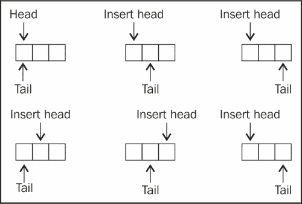
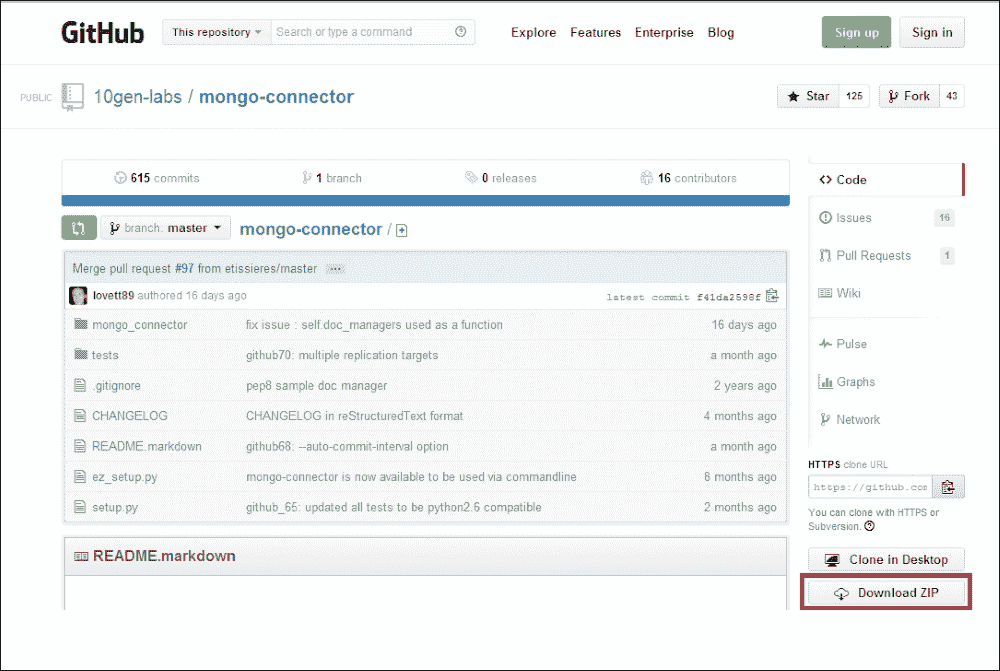
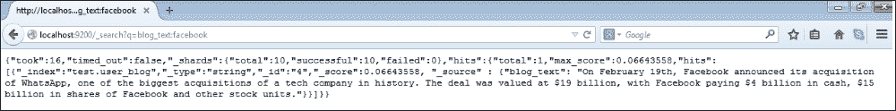

# 第五章：高级操作

在本章中，我们将涵盖以下内容：

+   原子查找和修改操作

+   在 Mongo 中实现原子计数器

+   实现服务器端脚本

+   在 MongoDB 中创建和追踪封顶集合游标

+   将普通集合转换为封顶集合

+   在 Mongo 中存储二进制数据

+   使用 GridFS 在 Mongo 中存储大数据

+   从 Java 客户端将数据存储到 GridFS

+   从 Python 客户端将数据存储到 GridFS

+   使用 oplog 在 Mongo 中实现触发器

+   在 Mongo 中使用平面（2D）地理空间索引进行查询

+   在 Mongo 中使用球形索引和 GeoJSON 兼容数据

+   在 Mongo 中实现全文搜索

+   将 MongoDB 集成到 Elasticsearch 进行全文搜索

# 介绍

在第二章中，*命令行操作和索引*，我们看到了如何从 shell 执行基本操作来查询、更新和插入文档，还看到了不同类型的索引和索引创建。在本章中，我们将看到 Mongo 的一些高级功能，如 GridFS、地理空间索引和全文搜索。我们还将看到其他配方，包括封顶集合的介绍和使用以及在 MongoDB 中实现服务器端脚本。

# 原子查找和修改操作

在第二章中，*命令行操作和索引*，我们有一些配方解释了我们在 MongoDB 中执行的各种 CRUD 操作。有一个概念我们没有涵盖到，那就是原子查找和修改文档。修改包括更新和删除操作。在这个配方中，我们将介绍 MongoDB 的`findAndModify`操作的基础知识。在下一个配方中，我们将使用这种方法来实现一个计数器。

## 准备就绪

查看第一章中的*安装单节点 MongoDB*和*安装和启动服务器*的配方，并启动 MongoDB 的单个实例。这是这个配方的唯一先决条件。启动 mongo shell 并连接到已启动的服务器。

## 如何操作…

1.  我们将在`atomicOperationsTest`集合中测试一个文档。从 shell 执行以下操作：

```go
> db.atomicOperationsTest.drop()
> db.atomicOperationsTest.insert({i:1})

```

1.  从 mongo shell 执行以下操作并观察输出：

```go
> db.atomicOperationsTest.findAndModify({
 query: {i: 1},
 update: {$set : {text : 'Test String'}},
 new: false
 }
)

```

1.  这次我们将执行另一个操作，但参数略有不同；观察此操作的输出：

```go
> db.atomicOperationsTest.findAndModify({
 query: {i: 1},
 update: {$set : {text : 'Updated String'}}, fields: {i: 1, text :1, _id:0},
 new: true
 }
)

```

1.  这次我们将执行另一个更新，将会插入文档，如下所示：

```go
>db.atomicOperationsTest.findAndModify({
 query: {i: 2},
 update: {$set : {text : 'Test String'}},
 fields: {i: 1, text :1, _id:0},
 upsert: true,
 new: true
 }
)

```

1.  现在，按照以下方式查询集合并查看当前存在的文档：

```go
> db.atomicOperationsTest.find().pretty()

```

1.  最后，我们将按以下方式执行删除：

```go
>db.atomicOperationsTest.findAndModify({
 query: {i: 2},
 remove: true,
 fields: {i: 1, text :1, _id:0},
 new: false
 }
)

```

## 工作原理…

如果我们在 MongoDB 中首先查找文档，然后再更新它，结果可能不如预期。在查找和更新操作之间可能存在交错的更新，这可能已更改文档状态。在某些特定用例中，比如实现原子计数器，这是不可接受的，因此我们需要一种方法来原子地查找、更新和返回文档。返回的值是在更新应用之前或之后的值，由调用客户端决定。

现在我们已经执行了前一节中的步骤，让我们看看我们实际做了什么，以及作为参数传递给`findAndModify`操作的 JSON 文档中的所有这些字段的含义。从第 3 步开始，我们将一个包含字段`query`、`update`和`new`的文档作为参数传递给`findAndModify`函数。

`query`字段指定用于查找文档的搜索参数，`update`字段包含需要应用的修改。第三个字段`new`，如果设置为`true`，告诉 MongoDB 返回更新后的文档。

在第 4 步中，我们实际上向作为参数传递的文档添加了一个名为**fields**的新字段，用于从返回的结果文档中选择一组有限的字段。此外，`new`字段的值为`true`，表示我们希望更新的文档，即在执行更新操作之后的文档，而不是之前的文档。

第 5 步包含一个名为`upsert`的新字段，该字段执行 upsert（更新+插入）文档。也就是说，如果找到具有给定查询的文档，则更新该文档，否则创建并更新一个新文档。如果文档不存在并且发生了 upsert，那么将参数`new`的值设置为`false`将返回`null`。这是因为在执行更新操作之前没有任何内容存在。

最后，在第 7 步中，我们使用了`remove`字段，其值为`true`，表示要删除文档。此外，`new`字段的值为`false`，这意味着我们期望被删除的文档。

## 另请参阅

原子`FindandModify`操作的一个有趣的用例是在 Mongo 中开发原子计数器。在下一个配方中，我们将看到如何实现这个用例。

# 在 Mongo 中实现原子计数器

原子计数器是许多用例的必需品。Mongo 没有原子计数器的内置功能；然而，可以使用一些其很酷的功能很容易地实现。事实上，借助先前描述的`findAndModify()`命令，实现起来非常简单。参考之前的配方*原子查找和修改操作*，了解 Mongo 中的原子查找和修改操作是什么。

## 准备就绪

查看第一章中的配方*安装单节点 MongoDB*，开始 Mongo 的单个实例。这是此配方的唯一先决条件。启动 mongo shell 并连接到已启动的服务器。

## 如何操作…

1.  从 mongo shell 中执行以下代码：

```go
> function getNextSequence(counterId) {
 return db.counters.findAndModify(
 {
 query: {_id : counterId},
 update: {$inc : {count : 1}},
 upsert: true,
 fields:{count:1, _id:0},
 new: true
 }
 ).count
}

```

1.  现在从 shell 中调用以下命令：

```go
> getNextSequence('Posts Counter')
> getNextSequence('Posts Counter')
> getNextSequence('Profile Counter')

```

## 工作原理…

该函数就是在用于存储所有计数器的集合上执行的`findAndModify`操作。计数器标识符是存储的文档的`_id`字段，计数器的值存储在`count`字段中。传递给`findAndModify`操作的文档接受查询，该查询唯一标识存储当前计数的文档，即使用`_id`字段的查询。更新操作是一个`$inc`操作，将通过 1 递增`count`字段的值。但是如果文档不存在怎么办？这将发生在对计数器的第一次调用。为了处理这种情况，我们将将`upsert`标志设置为`true`。`count`的值将始终从 1 开始，没有办法接受任何用户定义的序列起始数字或自定义递增步长。为了满足这样的要求，我们将不得不将具有初始化值的文档添加到计数器集合中。最后，我们对计数器值递增后的状态感兴趣；因此，我们将`new`字段的值设置为`true`。

在调用此方法三次（就像我们做的那样）后，我们应该在计数器集合中看到以下内容。只需执行以下查询：

```go
>db.counters.find()
{ "_id" : "Posts Counter", "count" : 2 }
{ "_id" : "Profile Counter", "count" : 1 }

```

使用这个小函数，我们现在已经在 Mongo 中实现了原子计数器。

## 另请参阅

我们可以将这样的通用代码存储在 Mongo 服务器上，以便在其他函数中执行。查看配方*实现服务器端脚本*，了解如何在 Mongo 服务器上存储 JavaScript 函数。这甚至允许我们从其他编程语言客户端调用此函数。

# 实现服务器端脚本

在这个配方中，我们将看到如何编写服务器存储的 JavaScript，类似于关系数据库中的存储过程。这是一个常见的用例，其他代码片段需要访问这些常见函数，我们将它们放在一个中心位置。为了演示服务器端脚本，该函数将简单地添加两个数字。

这个配方有两个部分。首先，我们看看如何从客户端 JavaScript shell 中的集合加载脚本，其次，我们将看到如何在服务器上执行这些函数。

### 注意

文档明确提到不建议使用服务器端脚本。安全性是一个问题，尽管如果数据没有得到适当的审计，因此我们需要小心定义哪些函数。自 Mongo 2.4 以来，服务器端 JavaScript 引擎是 V8，可以并行执行多个线程，而不是 Mongo 2.4 之前的引擎，每次只能执行一个线程。

## 准备工作

查看第一章中的配方*安装单节点 MongoDB*，*安装和启动服务器*并启动 Mongo 的单个实例。这是这个配方的唯一先决条件。启动一个 mongo shell 并连接到已启动的服务器。

## 如何做...

1.  创建一个名为`add`的新函数，并将其保存到集合`db.system.js`中，如下所示。当前数据库应该是 test：

```go
> use test
> db.system.js.save({ _id : 'add', value : function(num1, num2) {return num1 + num2}})

```

1.  现在这个函数已经定义，加载所有函数如下：

```go
> db.loadServerScripts()

```

1.  现在，调用`add`并查看是否有效：

```go
> add(1, 2)

```

1.  现在我们将使用这个函数，并在服务器端执行它：从 shell 执行以下操作：

```go
> use test
> db.eval('return add(1, 2)')

```

1.  执行以下步骤（可以执行前面的命令）：

```go
> use test1
> db.eval('return add(1, 2)')

```

## 它是如何工作的...

集合`system.js`是一个特殊的 MongoDB 集合，用于存储 JavaScript 代码。我们使用该集合中的`save`函数添加一个新的服务器端 JavaScript。`save`函数只是一个方便的函数，如果文档不存在则插入文档，如果文档已存在则更新文档。目标是向该集合添加一个新文档，即使您可以使用`insert`或`upsert`来添加。

秘密在于`loadServerScripts`方法。让我们看看这个方法的代码：`this.system.js.find().forEach(function(u){eval(u._id + " = " + u.value);});`

它使用`eval`函数评估 JavaScript，并为`system.js`集合中每个文档的`value`属性中定义的函数分配一个与文档的`_id`字段中给定的名称相同的变量。

例如，如果集合`system.js`中存在以下文档，`{ _id : 'add', value : function(num1, num2) {return num1 + num2}}`，那么文档的`value`字段中给定的函数将分配给当前 shell 中名为`add`的变量。文档的`_id`字段中给定了值`add`。

这些脚本实际上并不在服务器上执行，但它们的定义存储在服务器的一个集合中。JavaScript 方法`loadServerScripts`只是在当前 shell 中实例化一些变量，并使这些函数可用于调用。执行这些函数的是 shell 的 JavaScript 解释器，而不是服务器。集合`system.js`在数据库的范围内定义。一旦加载，这些函数就像在 shell 中定义的 JavaScript 函数一样，在 shell 的范围内都是可用的，而不管当前活动的数据库是什么。

就安全性而言，如果 shell 连接到启用了安全性的服务器，则调用`loadServerScripts`的用户必须具有读取数据库中集合的权限。有关启用安全性和用户可以拥有的各种角色的更多详细信息，请参阅第四章中的食谱*在 Mongo 中设置用户*，*管理*。正如我们之前所看到的，`loadServerScripts`函数从`system.js`集合中读取数据，如果用户没有权限从该集合中读取数据，则函数调用将失败。除此之外，从加载后的 shell 中执行的函数应该具有适当的权限。例如，如果函数在任何集合中插入/更新数据，则用户应该对从函数访问的特定集合具有读取和写入权限。

在服务器上执行脚本可能是人们期望的服务器端脚本，而不是在连接的 shell 中执行。在这种情况下，函数在服务器的 JavaScript 引擎上进行评估，安全检查更为严格，因为长时间运行的函数可能会持有锁，对性能产生不利影响。在服务器端调用 JavaScript 代码执行的包装器是`db.eval`函数，接受要在服务器端评估的代码以及参数（如果有）。

在评估函数之前，写操作会获取全局锁；如果使用参数`nolock`，则可以跳过这一步。例如，可以按照以下方式调用前面的`add`函数，而不是调用`db.eval`并获得相同的结果。我们另外提供了`nolock`字段，指示服务器在评估函数之前不要获取全局锁。如果此函数要在集合上执行写操作，则`nolock`字段将被忽略。

```go
> db.runCommand({eval: function (num1, num2) {return num1 + num2}, args:[1, 2],nolock:true})

```

如果服务器启用了安全性，则调用用户需要具有以下四个角色：`userAdminAnyDatabase`、`dbAdminAnyDatabase`、`readWriteAnyDatabase`和`clusterAdmin`（在管理数据库上）才能成功调用`db.eval`函数。

编程语言确实提供了一种调用这种服务器端脚本的方法，使用`eval`函数。例如，在 Java API 中，类`com.mongodb.DB`有一个方法`eval`来调用服务器端的 JavaScript 代码。当我们想要避免数据不必要的网络流量并将结果传递给客户端时，这种服务器端执行非常有用。然而，在数据库服务器上有太多的逻辑可能会很快使事情难以维护，并严重影响服务器的性能。

### 注意

截至 MongoDB 3.0.3，`db.eval()`方法已被弃用，建议用户不要依赖该方法，而是使用客户端脚本。有关更多详细信息，请参阅[`jira.mongodb.org/browse/SERVER-17453`](https://jira.mongodb.org/browse/SERVER-17453)。

# 在 MongoDB 中创建和追踪固定大小集合的游标

固定大小的集合是固定大小的集合，其中文档被添加到集合的末尾，类似于队列。由于固定大小的集合有一个固定的大小，如果达到限制，旧的文档将被删除。

它们按插入顺序自然排序，任何需要按时间顺序检索的检索都可以使用`$natural`排序顺序进行检索。这使得文档检索非常快速。

下图给出了一个有限大小的集合的图形表示，足以容纳最多三个相等大小的文档（对于任何实际用途来说都太小，但用于理解是很好的）。正如我们在图像中所看到的，该集合类似于循环队列，其中最旧的文档将被新添加的文档替换，如果集合变满。可追加的游标是特殊类型的游标，类似于 Unix 中的 tail 命令，它们遍历集合，类似于普通游标，但同时等待集合中的数据是否可用。我们将在本节详细介绍有限集合和可追加游标。



## 准备工作

查看第一章中的配方*安装单节点 MongoDB*，*安装和启动服务器*并启动 Mongo 的单个实例。这是本配方的唯一先决条件。启动 MongoDB shell 并连接到已启动的服务器。

## 操作步骤...

这个配方有两个部分：在第一部分中，我们将创建一个名为`testCapped`的有限集合，并尝试对其执行一些基本操作。接下来，我们将在这个有限集合上创建一个可追加游标。

1.  如果已存在具有此名称的集合，请删除该集合。

```go
> db.testCapped.drop()

```

1.  现在按以下方式创建一个有限集合。请注意，此处给定的大小是为集合分配的字节数，而不是它包含的文档数量：

```go
> db.createCollection('testCapped', {capped : true, size:100})

```

1.  现在我们将按以下方式在有限集合中插入 100 个文档：

```go
> for(i = 1; i < 100; i++) {
db.testCapped.insert({'i':i, val:'Test capped'})
 }

```

1.  现在按以下方式查询集合：

```go
> db.testCapped.find()

```

1.  尝试按以下方式从集合中删除数据：

```go
> db.testCapped.remove()

```

1.  现在我们将创建并演示一个可追加游标。建议您将以下代码片段输入/复制到文本编辑器中，并随时准备执行。

1.  要在集合中插入数据，我们将使用以下代码片段。在 shell 中执行此代码片段：

```go
> for(i = 101 ; i < 500 ; i++) {
 sleep(1000)
 db.testCapped.insert({'i': i, val :'Test Capped'})
}

```

1.  要追加有限集合，我们使用以下代码片段：

```go
> var cursor = db.testCapped.find().addOption(DBQuery.Option.tailable).addOption(DBQuery.Option.awaitData)
while(cursor.hasNext()) {
 var next = cursor.next()
 print('i: ' + next.i + ', value: ' + next.val)
}

```

1.  打开一个 shell 并连接到正在运行的 mongod 进程。这将是第二个打开并连接到服务器的 shell。在此 shell 中复制并粘贴第 8 步中提到的代码，然后执行它。

1.  观察插入的记录如何显示为它们插入到有限集合中。

## 工作原理...

我们将使用`createCollection`函数显式创建一个有限集合。这是创建有限集合的唯一方法。`createCollection`函数有两个参数。第一个是集合的名称，第二个是一个包含两个字段`capped`和`size`的 JSON 文档，用于通知用户集合是否被限制以及集合的大小（以字节为单位）。还可以提供一个额外的`max`字段来指定集合中的最大文档数。即使指定了`max`字段，也需要`size`字段。然后我们插入和查询文档。当我们尝试从集合中删除文档时，我们会看到一个错误，即不允许从有限集合中删除文档。它只允许在添加新文档并且没有空间可容纳它们时才能删除文档。

接下来我们看到的是我们创建的可追溯游标。我们启动两个 shell，其中一个是以 1 秒的间隔插入文档的普通插入。在第二个 shell 中，我们创建一个游标并遍历它，并将从游标获取的文档打印到 shell 上。然而，我们添加到游标的附加选项使得有所不同。添加了两个选项，`DBQuery.Option.tailable`和`DBQuery.Option.awaitData`。这些选项用于指示游标是可追溯的，而不是正常的，其中最后的位置被标记，我们可以恢复到上次离开的位置，其次是在没有数据可用时等待更多数据一段时间，以及当我们接近游标的末尾时立即返回而不是返回。`awaitData`选项只能用于可追溯游标。这两个选项的组合使我们感觉类似于 Unix 文件系统中的 tail 命令。

有关可用选项的列表，请访问以下页面：[`docs.mongodb.org/manual/reference/method/cursor.addOption/`](http://docs.mongodb.org/manual/reference/method/cursor.addOption/)。

## 还有更多…

在下一个配方中，我们将看到如何将普通集合转换为固定集合。

# 将普通集合转换为固定集合

本配方将演示将普通集合转换为固定集合的过程。

## 准备就绪

查看第一章中的*安装单节点 MongoDB*和*安装和启动服务器*的配方，并启动 Mongo 的单个实例。这是本配方的唯一先决条件。启动 mongo shell 并连接到已启动的服务器。

## 如何做…

1.  执行以下操作以确保您在`test`数据库中：

```go
> use test

```

1.  按照以下方式创建一个普通集合。我们将向其添加 100 个文档，将以下代码片段输入/复制到 mongo shell 上并执行。命令如下：

```go
for(i = 1 ; i <= 100 ; i++) {
 db.normalCollection.insert({'i': i, val :'Some Text Content'})
}

```

1.  按照以下方式查询集合以确认其中包含数据：

```go
> db.normalCollection.find()

```

1.  现在，按照以下方式查询集合`system.namespaces`，并注意结果文档：

```go
> db.system.namespaces.find({name : 'test.normalCollection'})

```

1.  执行以下命令将集合转换为固定集合：

```go
> db.runCommand({convertToCapped : 'normalCollection', size : 100})

```

1.  查询集合以查看数据：

```go
> db.normalCollection.find()

```

1.  按照以下方式查询集合`system.namespaces`，并注意结果文档：

```go
> db.system.namespaces.find({name : 'test.normalCollection'})

```

## 它是如何工作的…

我们创建了一个包含 100 个文档的普通集合，然后尝试将其转换为具有 100 字节大小的固定集合。命令将以下 JSON 文档传递给`runCommand`函数，`{convertToCapped: <普通集合的名称>, size: <固定集合的字节大小>}`。此命令创建一个具有指定大小的固定集合，并将文档以自然顺序从普通集合加载到目标固定集合中。如果固定集合的大小达到所述限制，旧文档将以 FIFO 顺序删除，为新文档腾出空间。完成后，创建的固定集合将被重命名。在固定集合上执行查找确认，最初在普通集合中存在的 100 个文档并不都存在于固定集合中。在执行`convertToCapped`命令之前和之后对`system.namespaces`集合进行查询，显示了`collection`属性的变化。请注意，此操作获取全局写锁，阻止此数据库中的所有读取和写入操作。此外，对于转换后的固定集合，不会创建原始集合上存在的任何索引。

## 还有更多…

Oplog 是 MongoDB 中用于复制的重要集合，是一个有上限的集合。有关复制和 oplogs 的更多信息，请参阅第四章中的*理解和分析 oplogs*，*管理*中的配方。在本章的后面的一个配方中，我们将使用这个 oplog 来实现类似于关系数据库中的插入/更新/删除触发器的功能。

# 在 Mongo 中存储二进制数据

到目前为止，我们看到了如何在文档中存储文本值、日期和数字字段。有时还需要在数据库中存储二进制内容。考虑用户需要在数据库中存储文件的情况。在关系数据库中，BLOB 数据类型最常用于满足这一需求。MongoDB 也支持将二进制内容存储在集合中的文档中。问题在于文档的总大小不应超过 16MB，这是写作本书时文档大小的上限。在这个配方中，我们将把一个小图像文件存储到 Mongo 的文档中，并在以后检索它。如果您希望存储在 MongoDB 集合中的内容大于 16MB，则 MongoDB 提供了一个名为**GridFS**的开箱即用的解决方案。我们将在本章的另一个配方中看到如何使用 GridFS。

## 准备工作

查看第一章中的*安装单节点 MongoDB*配方，*安装和启动服务器*并启动 MongoDB 的单个实例。还有一个用于将二进制内容写入文档的程序是用 Java 编写的。有关 Java 驱动程序的更多详细信息，请参阅第三章中的*使用 Java 客户端执行查询和插入操作*，*使用 Java 客户端实现 Mongo 中的聚合*和*使用 Java 客户端在 Mongo 中执行 MapReduce*的配方，*编程语言驱动程序*。打开一个 mongo shell 并连接到监听端口`27017`的本地 MongoDB 实例。对于这个配方，我们将使用项目`mongo-cookbook-bindata`。这个项目可以从 Packt 网站下载的源代码包中获取。需要在本地文件系统上提取文件夹。打开一个命令行 shell 并转到提取的项目的根目录。应该是找到文件`pom.xml`的目录。

## 如何做…

1.  在操作系统 shell 中，`mongo-cookbook-bindata`项目的当前目录中存在`pom.xml`，执行以下命令：

```go
$ mvn exec:java -Dexec.mainClass=com.packtpub.mongo.cookbook.BinaryDataTest

```

1.  观察输出；执行应该成功。

1.  切换到连接到本地实例的 mongo shell 并执行以下查询：

```go
> db.binaryDataTest.findOne()

```

1.  滚动文档并记下文档中的字段。

## 工作原理…

如果我们滚动查看打印出的大型文档，我们会看到字段`fileName`，`size`和`data`。前两个字段分别是字符串和数字类型，我们在文档创建时填充了这些字段，并保存了我们提供的文件名和以字节为单位的大小。数据字段是 BSON 类型 BinData 的字段，我们在其中看到数据以 Base64 格式编码。

以下代码行显示了我们如何填充添加到集合中的 DBObject：

```go
DBObject doc = new BasicDBObject("_id", 1);
doc.put("fileName", resourceName);
doc.put("size", imageBytes.length);
doc.put("data", imageBytes);
```

如上所示，使用两个字段`fileName`和`size`来存储文件名和文件大小，分别为字符串和数字类型。数据字段作为字节数组添加到`DBObject`中，它会自动存储为文档中的 BSON 类型 BinData。

## 另请参阅

在这个配方中，我们看到的是直接的，只要文档大小小于 16MB。如果存储的文件大小超过这个值，我们必须求助于像 GridFS 这样的解决方案，这在下一个配方*使用 GridFS 在 Mongo 中存储大数据*中有解释。

# 使用 GridFS 在 Mongo 中存储大数据

MongoDB 中的文档大小可以达到 16 MB。 但这是否意味着我们不能存储超过 16 MB 大小的数据？ 有些情况下，您更喜欢将视频和音频文件存储在数据库中，而不是在文件系统中，因为有许多优势，比如存储与它们一起的元数据，从中间位置访问文件时，以及在 MongoDB 服务器实例上启用复制时为了高可用性而复制内容。 GridFS 可以用来解决 MongoDB 中的这些用例。 我们还将看到 GridFS 如何管理超过 16 MB 的大容量，并分析其用于在幕后存储内容的集合。 为了测试目的，我们不会使用超过 16 MB 的数据，而是使用一些更小的数据来查看 GridFS 的运行情况。

## 准备工作

查看第一章中的配方*安装单节点 MongoDB*，*安装和启动服务器*并启动 Mongo 的单个实例。 这是此配方的唯一先决条件。 启动 Mongo shell 并连接到已启动的服务器。 另外，我们将使用 mongofiles 实用程序从命令行将数据存储在 GridFS 中。

## 如何做...

1.  下载该书的代码包，并将图像文件`glimpse_of_universe-wide.jpg`保存到本地驱动器（您可以选择任何其他大文件作为事实，并使用我们执行的命令提供适当的文件名）。 为了举例，图像保存在主目录中。 我们将把我们的步骤分为三个部分。

1.  在服务器运行并且当前目录为主目录的情况下，从操作系统的 shell 中执行以下命令。 这里有两个参数。 第一个是本地文件系统上文件的名称，第二个是将附加到 MongoDB 中上传内容的名称。

```go
$ mongofiles put -l glimpse_of_universe-wide.jpg universe.jpg

```

1.  现在让我们查询集合，看看这些内容实际上是如何在幕后的集合中存储的。 打开 shell，执行以下两个查询。 确保在第二个查询中，您确保不选择数据字段。

```go
> db.fs.files.findOne({filename:'universe.jpg'})
> db.fs.chunks.find({}, {data:0})

```

1.  现在我们已经从操作系统的本地文件系统中将文件放入了 GridFS，我们将看到如何将文件获取到本地文件系统。 从操作系统 shell 中执行以下操作：

```go
$ mongofiles get -l UploadedImage.jpg universe.jpg

```

1.  最后，我们将删除我们上传的文件。 从操作系统 shell 中，执行以下操作：

```go
$ mongofiles delete universe.jpg

```

1.  再次使用以下查询确认删除：

```go
> db.fs.files.findOne({filename:'universe.jpg'})
> db.fs.chunks.find({}, {data:0})

```

## 工作原理...

Mongo 分发包带有一个名为 mongofiles 的工具，它允许我们将大容量上传到 Mongo 服务器，该服务器使用 GridFS 规范进行存储。 GridFS 不是一个不同的产品，而是一个标准规范，由不同的 MongoDB 驱动程序遵循，用于存储大于 16 MB 的数据，这是最大文档大小。 它甚至可以用于小于 16 MB 的文件，就像我们在我们的示例中所做的那样，但实际上没有一个很好的理由这样做。 没有什么能阻止我们实现自己的存储这些大文件的方式，但最好遵循标准。 这是因为所有驱动程序都支持它，并且在需要时进行大文件的分割和组装。

我们从 Packt Publishing 网站下载的图像，并使用 mongofiles 上传到 MongoDB。 执行此操作的命令是`put`，`-l`选项给出了我们要上传的本地驱动器上的文件的名称。 最后，名称`universe.jpg`是我们希望它在 GridFS 上存储的文件的名称。

成功执行后，我们应该在控制台上看到以下内容：

```go
connected to: 127.0.0.1
added file: { _id: ObjectId('5310d531d1e91f93635588fe'), filename: "universe.jpg
", chunkSize: 262144, uploadDate: new Date(1393612082137), md5: 
d894ec31b8c5add
d0c02060971ea05ca", length: 2711259 }
done!

```

这给我们一些上传的细节，上传文件的唯一`_id`，文件的名称，块大小，这是这个大文件被分成的块的大小（默认为 256 KB），上传日期，上传内容的校验和以及上传的总长度。这个校验和可以事先计算，然后在上传后进行比较，以检查上传的内容是否损坏。

在测试数据库的 mongo shell 中执行以下查询：

```go
> db.fs.files.findOne({filename:'universe.jpg'})

```

我们看到我们在`mongofiles`的`put`命令中看到的输出与上面在`fs.files`集合中查询的文档相同。这是当向 GridFS 添加数据时，所有上传的文件细节都会放在这个集合中。每次上传都会有一个文档。应用程序以后还可以修改此文档，以添加自己的自定义元数据以及在添加数据时添加到我的 Mongo 的标准细节。如果文档是用于图像上传，应用程序可以很好地使用此集合来添加诸如摄影师、图像拍摄地点、拍摄地点以及图像中个人的标签等细节。

文件内容是包含这些数据的内容。让我们执行以下查询：

```go
> db.fs.chunks.find({}, {data:0})

```

我们故意从所选结果中省略了数据字段。让我们看一下结果文档的结构：

```go
{
_id: <Unique identifier of type ObjectId representing this chunk>,
file_id: <ObjectId of the document in fs.files for the file whose chunk this document represent>,
n:<The chunk identifier starts with 0, this is useful for knowing the order of the chunks>,
data: <BSON binary content  for the data uploaded for the file>
}
```

对于我们上传的文件，我们有 11 个最大为 256 KB 的块。当请求文件时，`fs.chunks`集合通过来自`fs.files`集合的`_id`字段的`file_id`和字段`n`（块的序列）进行搜索。当第一次使用 GridFS 上传文件时，为了快速检索使用文件 ID 按块序列号排序的块，这两个字段上创建了唯一索引。

与`put`类似，`get`选项用于从 GridFS 检索文件并将其放在本地文件系统上。命令的不同之处在于使用`get`而不是`put`，`-l`仍然用于提供此文件在本地文件系统上保存的名称，最后的命令行参数是 GridFS 中存储的文件的名称。这是`fs.files`集合中`filename`字段的值。最后，`mongofiles`的`delete`命令简单地从`fs.files`和`fs.chunks`集合中删除文件的条目。删除的文件名再次是`fs.files`集合中`filename`字段中的值。

使用 GridFS 的一些重要用例是当存在一些用户生成的内容，比如一些静态数据上的大型报告，这些数据不经常更改，而且频繁生成成本很高。与其每次都运行它们，不如运行一次并存储，直到检测到静态数据的更改；在这种情况下，存储的报告将被删除，并在下一次请求数据时重新执行。文件系统可能并不总是可用于应用程序写入文件，这种情况下这是一个很好的替代方案。有些情况下，人们可能对存储的一些中间数据块感兴趣，这种情况下可以访问包含所需数据的数据块。您可以获得一些不错的功能，比如数据的 MD5 内容，它会自动存储并可供应用程序使用。

既然我们已经了解了 GridFS 是什么，让我们看看在哪些情况下使用 GridFS 可能不是一个很好的主意。通过 GridFS 从 MongoDB 访问内容的性能和直接从文件系统访问的性能不会相同。直接文件系统访问将比 GridFS 更快，建议对要开发的系统进行**概念验证**（**POC**）以测量性能损失，并查看是否在可接受的范围内；如果是，那么性能上的折衷可能是值得的。此外，如果您的应用服务器前端使用 CDN，您实际上可能不需要在 GridFS 中存储静态数据的大量 IO。由于 GridFS 将数据存储在多个集合中的多个文档中，因此无法以原子方式更新它们。如果我们知道内容小于 16MB，这在许多用户生成的内容中是情况，或者上传了一些小文件，我们可以完全跳过 GridFS，并将内容存储在一个文档中，因为 BSON 支持在文档中存储二进制内容。有关更多详细信息，请参考上一个教程*在 Mongo 中存储二进制数据*。

我们很少使用 mongofiles 实用程序来从 GridFS 存储、检索和删除数据。虽然偶尔可能会使用它，但我们大多数情况下会从应用程序执行这些操作。在接下来的几个教程中，我们将看到如何连接到 GridFS，使用 Java 和 Python 客户端存储、检索和删除文件。

## 还有更多...

虽然这与 Mongo 不太相关，但 Openstack 是一个**基础设施即服务**（**IaaS**）平台，提供各种计算、存储、网络等服务。其中一个名为**Glance**的镜像存储服务支持许多持久存储来存储图像。Glance 支持的存储之一是 MongoDB 的 GridFS。您可以在以下网址找到有关如何配置 Glance 使用 GridFS 的更多信息：[`docs.openstack.org/trunk/config-reference/content/ch_configuring-openstack-image-service.html`](http://docs.openstack.org/trunk/config-reference/content/ch_configuring-openstack-image-service.html)。

## 另请参阅

您可以参考以下教程：

+   *从 Java 客户端将数据存储到 GridFS*

+   从 Python 客户端将数据存储到 GridFS

# 从 Java 客户端将数据存储到 GridFS

在上一个教程中，我们看到了如何使用 MongoDB 自带的命令行实用程序 mongofiles 来将数据存储到 GridFS，以管理大型数据文件。要了解 GridFS 是什么，以及在幕后用于存储数据的集合，请参考上一个教程*在 Mongo 中使用 GridFS 存储大型数据*。

在本教程中，我们将看看如何使用 Java 客户端将数据存储到 GridFS。该程序将是 mongofiles 实用程序的一个大大简化版本，只关注如何存储、检索和删除数据，而不是试图提供像 mongofiles 那样的许多选项。

## 准备工作

有关本教程所需的所有必要设置，请参阅第一章中的教程*安装单节点 MongoDB*，*安装和启动服务器*。如果您对 Java 驱动程序有更多详细信息感兴趣，请参考第三章中的教程*使用 Java 客户端在 Mongo 中实现聚合*和*使用 Java 客户端在 Mongo 中执行 MapReduce*。打开一个 mongo shell 并连接到监听端口`27017`的本地 mongod 实例。对于本教程，我们将使用项目`mongo-cookbook-gridfs`。该项目可在 Packt 网站上提供的源代码包中找到。需要在本地文件系统上提取该文件夹。打开操作系统的终端并转到提取的项目的根目录。这应该是找到文件`pom.xml`的目录。还要像上一个教程一样，在本地文件系统上保存文件`glimpse_of_universe-wide.jpg`，该文件可以在 Packt 网站上提供的书籍可下载包中找到。

## 如何做…

1.  我们假设 GridFS 的集合是干净的，没有先前上传的数据。如果数据库中没有重要数据，您可以执行以下操作来清除集合。在删除集合之前，请小心行事。

```go
> use test
> db.fs.chunks.drop()
> db.fs.files.drop()

```

1.  打开操作系统 shell 并执行以下操作：

```go
$ mvn exec:java -Dexec.mainClass=com.packtpub.mongo.cookbook.GridFSTests -Dexec.args="put ~/glimpse_of_universe-wide.jpg universe.jpg"

```

1.  我需要上传的文件放在主目录中。在`put`命令之后，您可以选择给出图像文件的文件路径。请记住，如果路径中包含空格，则整个路径需要在单引号内给出。

1.  如果前面的命令成功运行，我们应该期望在命令行输出以下内容：

```go
Successfully written to universe.jpg, details are:
Upload Identifier: 5314c05e1c52e2f520201698
Length: 2711259
MD5 hash: d894ec31b8c5addd0c02060971ea05ca
Chunk Side in bytes: 262144
Total Number Of Chunks: 11

```

1.  一旦前面的执行成功，我们可以从控制台输出确认，然后从 mongo shell 执行以下操作：

```go
> db.fs.files.findOne({filename:'universe.jpg'})
> db.fs.chunks.find({}, {data:0})

```

1.  现在，我们将从 GridFS 获取文件到本地文件系统，执行以下操作来执行此操作：

```go
$ mvn exec:java -Dexec.mainClass=com.packtpub.mongo.cookbook.GridFSTests -Dexec.args="get '~/universe.jpg' universe.jpg"

```

确认文件是否存在于所述位置的本地文件系统上。我们应该看到以下内容打印到控制台输出，以指示成功的写操作：

```go
Connected successfully..
Successfully written 2711259 bytes to ~/universe.jpg

```

1.  最后，我们将从 GridFS 中删除文件：

```go
$ mvn exec:java -Dexec.mainClass=com.packtpub.mongo.cookbook.GridFSTests -Dexec.args="delete universe.jpg"

```

1.  成功删除后，我们应该在控制台中看到以下输出：

```go
Connected successfully..
Removed file with name 'universe.jpg' from GridFS

```

## 它是如何工作的...

类`com.packtpub.mongo.cookbook.GridFSTests`接受三种类型的操作：`put`将文件上传到 GridFS，`get`从 GridFS 获取内容到本地文件系统，`delete`从 GridFS 删除文件。

该类最多接受三个参数，第一个是操作，有效值为`get`，`put`和`delete`。第二个参数与`get`和`put`操作相关，是本地文件系统上要写入下载内容的文件的名称，或者用于上传的内容的源。第三个参数是 GridFS 中的文件名，不一定与本地文件系统上的文件名相同。但是，对于`delete`，只需要 GridFS 上的文件名，该文件将被删除。

让我们看一下该类中与 GridFS 特定的一些重要代码片段。

在您喜欢的 IDE 中打开类`com.packtpub.mongo.cookbook.GridFSTests`，查找方法`handlePut`，`handleGet`和`handleDelete`。这些方法是所有逻辑的地方。我们将首先从`handlePut`方法开始，该方法用于将文件内容从本地文件系统上传到 GridFS。

无论我们执行什么操作，我们都将创建`com.mongodb.gridfs.GridFS`类的实例。在我们的情况下，我们将其实例化如下：

```go
GridFS gfs = new GridFS(client.getDB("test"));
```

该类的构造函数接受`com.mongodb.DB`类的数据库实例。创建 GridFS 实例后，我们将调用其上的`createFile`方法。此方法接受两个参数，第一个是`InputStream`，用于提供要上传的内容的字节，第二个参数是 GridFS 上的文件名，该文件将保存在 GridFS 上。但是，此方法不会在 GridFS 上创建文件，而是返回`com.mongodb.gridfs.GridFSInputFile`的实例。只有在调用此返回对象中的`save`方法时，上传才会发生。此`createFile`方法有几个重载的变体。有关更多详细信息，请参阅`com.mongodb.gridfs.GridFS`类的 Javadocs。

我们的下一个方法是`handleGet`，它从 GridFS 上保存的文件中获取内容到本地文件系统。与`com.mongodb.DBCollection`类似，`com.mongodb.gridfs.GridFS`类具有用于搜索的`find`和`findOne`方法。但是，与接受任何 DBObject 查询不同，GridFS 中的`find`和`findOne`接受文件名或要在`fs.files`集合中搜索的文档的 ObjectID 值。同样，返回值不是 DBCursor，而是`com.mongodb.gridfs.GridFSDBFile`的实例。该类具有各种方法，用于获取 GridFS 文件中存在的内容的字节的`InputStream`，将文件或`OutputStream`写入文件的方法`writeTo`，以及一个`getLength`方法，用于获取文件中的字节数。有关详细信息，请参阅`com.mongodb.gridfs.GridFSDBFile`类的 Javadocs。

最后，我们来看看`handleDelete`方法，它用于删除 GridFS 上的文件，是最简单的方法。GridFS 对象上的方法是`remove`，它接受一个字符串参数：要在服务器上删除的文件的名称。此方法的`return`类型是`void`。因此，无论 GridFS 上是否存在内容，如果为此方法提供了一个不存在的文件的名称，该方法都不会返回值，也不会抛出异常。

## 另请参阅

您可以参考以下配方：

+   *在 Mongo 中存储二进制数据*

+   *从 Python 客户端将数据存储到 GridFS*

# 从 Python 客户端将数据存储到 GridFS

在配方*使用 GridFS 在 Mongo 中存储大数据*中，我们看到了 GridFS 是什么，以及如何使用它来在 MongoDB 中存储大文件。在上一个配方中，我们看到了如何从 Java 客户端使用 GridFS API。在这个配方中，我们将看到如何使用 Python 程序将图像数据存储到 MongoDB 中的 GridFS。

## 准备好

有关本配方的所有必要设置，请参考第一章中的配方*使用 Java 客户端连接到单个节点*，*安装和启动服务器*。如果您对 Python 驱动程序的更多详细信息感兴趣，请参考以下配方：*使用 PyMongo 执行查询和插入操作*和*使用 PyMongo 执行更新和删除操作*在第三章中，*编程语言驱动程序*。从 Packt 网站的可下载捆绑包中下载并保存图像`glimpse_of_universe-wide.jpg`到本地文件系统，就像我们在上一个配方中所做的那样。

## 如何做…

1.  通过在操作系统 shell 中输入以下内容来打开 Python 解释器。请注意，当前目录与放置图像文件`glimpse_of_universe-wide.jpg`的目录相同：

```go
$ python

```

1.  按如下方式导入所需的包：

```go
>>>import pymongo
>>>import gridfs

```

1.  一旦打开了 Python shell，就按如下方式创建`MongoClient`和数据库对象到测试数据库：

```go
>>>client = pymongo.MongoClient('mongodb://localhost:27017')
>>>db = client.test

```

1.  要清除与 GridFS 相关的集合，请执行以下操作：

```go
>>> db.fs.files.drop()
>>> db.fs.chunks.drop()

```

1.  创建 GridFS 的实例如下：

```go
>>>fs = gridfs.GridFS(db)

```

1.  现在，我们将读取文件并将其内容上传到 GridFS。首先，按如下方式创建文件对象：

```go
>>>file = open('glimpse_of_universe-wide.jpg', 'rb')

```

1.  现在按如下方式将文件放入 GridFS

```go
>>>fs.put(file, filename='universe.jpg')

```

1.  成功执行`put`后，我们应该看到上传文件的 ObjectID。这将与此文件的`fs.files`集合的`_id`字段相同。

1.  从 Python shell 执行以下查询。它应该打印出包含上传详细信息的`dict`对象。验证内容

```go
>>> db.fs.files.find_one()

```

1.  现在，我们将获取上传的内容并将其写入本地文件系统中的文件。让我们获取表示要从 GridFS 中读取数据的`GridOut`实例，如下所示：

```go
>>> gout = fs.get_last_version('universe.jpg')

```

1.  有了这个实例，让我们按如下方式将数据写入本地文件系统中的文件。首先，按如下方式打开本地文件系统上的文件句柄以进行写入：

```go
>>> fout = open('universe.jpg', 'wb')

```

1.  然后，我们将按如下方式向其写入内容：

```go
>>>fout.write(gout.read())
>>>fout.close()
>>>gout.close()

```

1.  现在在本地文件系统的当前目录上验证文件。将创建一个名为`universe.jpg`的新文件，其字节数与源文件相同。通过在图像查看器中打开它来进行验证。

## 工作原理…

让我们看一下我们执行的步骤。在 Python shell 中，我们导入了两个包，`pymongo`和`gridfs`，并实例化了`pymongo.MongoClient`和`gridfs.GridFS`实例。类`gridfs.GridFS`的构造函数接受一个参数，即`pymongo.Database`的实例。

我们使用`open`函数以二进制模式打开文件，并将文件对象传递给 GridFS 的`put`方法。还传递了一个名为`filename`的额外参数，这将是放入 GridFS 的文件的名称。第一个参数不需要是文件对象，而是任何定义了`read`方法的对象。

一旦`put`操作成功，`return`值就是`fs.files`集合中上传文档的 ObjectID。对`fs.files`的查询可以确认文件已上传。验证上传的数据大小是否与文件大小匹配。

我们的下一个目标是将文件从 GridFS 获取到本地文件系统。直觉上，人们会想象如果将文件放入 GridFS 的方法是`put`，那么获取文件的方法将是`get`。确实，该方法的确是`get`，但是它只会基于`put`方法返回的`ObjectId`进行获取。因此，如果您愿意按`ObjectId`获取，`get`就是您的方法。但是，如果您想按文件名获取，要使用的方法是`get_last_version`。它接受我们上传的文件名，并且此方法的返回类型是`gridfs.gridfs_file.GridOut`类型。该类包含`read`方法，它将从 GridFS 中上传的文件中读取所有字节。我们以二进制模式打开一个名为`universe.jpg`的文件进行写入，并将从`GridOut`对象中读取的所有字节写入其中。

## 另请参阅

您可以参考以下配方：

+   *在 Mongo 中存储二进制数据*

+   *从 Java 客户端将数据存储到 GridFS*

# 使用 oplog 在 Mongo 中实现触发器

在关系型数据库中，触发器是在数据库表上执行`insert`、`update`或`delete`操作时被调用的代码。触发器可以在操作之前或之后被调用。MongoDB 中并没有内置实现触发器，如果您需要在应用程序中任何`insert`/`update`/`delete`操作执行时得到通知，您需要自己在应用程序中管理。一种方法是在应用程序中有一种数据访问层，这是唯一可以从集合中查询、插入、更新或删除文档的地方。但是，这也存在一些挑战。首先，您需要在应用程序中明确编写逻辑以满足此要求，这可能是可行的，也可能是不可行的。如果数据库是共享的，并且多个应用程序访问它，事情会变得更加困难。其次，访问需要严格管理，不允许其他来源的插入/更新/删除。

或者，我们需要考虑在靠近数据库的层中运行某种逻辑。跟踪所有写操作的一种方法是使用 oplog。请注意，无法使用 oplog 跟踪读操作。在本配方中，我们将编写一个小型的 Java 应用程序，该应用程序将尾随 oplog 并获取在 Mongo 实例上发生的所有`insert`、`update`和`delete`操作。请注意，此程序是用 Java 实现的，并且在任何其他编程语言中同样有效。关键在于实现的逻辑，实现的平台可以是任何。此外，只有在 mongod 实例作为副本集的一部分启动时，此触发器类功能才能被调用，而不是在数据被插入/更新或从集合中删除之前。

## 准备工作

有关此示例的所有必要设置，请参考第一章中的示例*作为副本集的一部分启动多个实例*，*安装和启动服务器*。如果您对 Java 驱动程序的更多细节感兴趣，请参考第三章中的以下示例*使用 Java 客户端执行查询和插入操作*和*使用 Java 客户端执行更新和删除操作*。这两个示例的先决条件是我们这个示例所需要的一切。

如果您不了解或需要复习，请参考本章中的示例*在 MongoDB 中创建和跟踪封顶集合游标*，了解有关封顶集合和可跟踪游标的更多信息。最后，尽管不是强制性的，第四章中的*管理*解释了 oplog 的深度，解释了*理解和分析 oplog*中的 oplog。这个示例不会像我们在第四章中所做的那样深入解释 oplog。打开一个 shell 并将其连接到副本集的主服务器。

对于这个示例，我们将使用项目`mongo-cookbook-oplogtrigger`。该项目可以从 Packt 网站下载的源代码包中获取。需要在本地文件系统上提取文件夹。打开命令行 shell 并转到提取的项目的根目录。这应该是找到文件`pom.xml`的目录。还需要`TriggerOperations.js`文件来触发我们打算捕获的数据库中的操作。

## 操作步骤…

1.  打开操作系统 shell 并执行以下操作：

```go
$ mvn exec:java -Dexec.mainClass=com.packtpub.mongo.cookbook.OplogTrigger -Dexec.args="test.oplogTriggerTest"

```

1.  Java 程序启动后，我们将打开 shell，当前目录中存在文件`TriggerOperations.js`，mongod 实例监听端口`27000`作为主服务器：

```go
$ mongo --port 27000 TriggerOperations.js --shell

```

1.  连接到 shell 后，执行我们从 JavaScript 中加载的以下函数：

```go
test:PRIMARY> triggerOperations()

```

1.  观察在控制台上打印出的输出，Java 程序`com.packtpub.mongo.cookbook.OplogTrigger`正在使用 Maven 执行。

## 工作原理…

我们实现的功能对于许多用例非常方便，但首先让我们看一下更高层次上做了什么。Java 程序`com.packtpub.mongo.cookbook.OplogTrigger`是一个在 MongoDB 中插入、更新或删除集合中的新数据时触发的东西。它使用 oplog 集合，这是 Mongo 中复制的支柱，来实现这个功能。

我们刚刚编写的 JavaScript 作为一个数据的生产、更新和删除的源。您可以选择打开`TriggerOperations.js`文件，看一下它是如何实现的。它执行的集合位于测试数据库中，称为`oplogTriggerTest`。

当我们执行 JavaScript 函数时，应该看到类似以下内容打印到输出控制台：

```go
[INFO] <<< exec-maven-plugin:1.2.1:java (default-cli) @ mongo-cookbook-oplogtriger <<<
[INFO]
[INFO] --- exec-maven-plugin:1.2.1:java (default-cli) @ mongo-cookbook-oplogtriger ---
Connected successfully..
Starting tailing oplog...
Operation is Insert ObjectId is 5321c4c2357845b165d42a5f
Operation is Insert ObjectId is 5321c4c2357845b165d42a60
Operation is Insert ObjectId is 5321c4c2357845b165d42a61
Operation is Insert ObjectId is 5321c4c2357845b165d42a62
Operation is Insert ObjectId is 5321c4c2357845b165d42a63
Operation is Insert ObjectId is 5321c4c2357845b165d42a64
Operation is Update ObjectId is 5321c4c2357845b165d42a60
Operation is Delete ObjectId is 5321c4c2357845b165d42a61
Operation is Insert ObjectId is 5321c4c2357845b165d42a65
Operation is Insert ObjectId is 5321c4c2357845b165d42a66
Operation is Insert ObjectId is 5321c4c2357845b165d42a67
Operation is Insert ObjectId is 5321c4c2357845b165d42a68
Operation is Delete ObjectId is 5321c4c2357845b165d42a5f
Operation is Delete ObjectId is 5321c4c2357845b165d42a62
Operation is Delete ObjectId is 5321c4c2357845b165d42a63
Operation is Delete ObjectId is 5321c4c2357845b165d42a64
Operation is Delete ObjectId is 5321c4c2357845b165d42a60
Operation is Delete ObjectId is 5321c4c2357845b165d42a65
Operation is Delete ObjectId is 5321c4c2357845b165d42a66
Operation is Delete ObjectId is 5321c4c2357845b165d42a67
Operation is Delete ObjectId is 5321c4c2357845b165d42a68

```

Maven 程序将持续运行，永远不会终止，因为 Java 程序不会。您可以按*Ctrl* + *C*停止执行。

让我们分析一下 Java 程序，这是内容的核心所在。首先假设这个程序要工作，必须设置一个副本集，因为我们将使用 Mongo 的 oplog 集合。Java 程序创建了一个连接到副本集成员的主服务器，连接到本地数据库，并获取了`oplog.rs`集合。然后，它所做的就是找到 oplog 中的最后一个或几乎最后一个时间戳。这样做是为了防止在启动时重放整个 oplog，而是标记 oplog 末尾的一个点。以下是找到这个时间戳值的代码：

```go
DBCursor cursor = collection.find().sort(new BasicDBObject("$natural", -1)).limit(1);
int current = (int) (System.currentTimeMillis() / 1000);
return cursor.hasNext() ? (BSONTimestamp)cursor.next().get("ts") : new BSONTimestamp(current, 1);
```

oplog 按照自然逆序排序，以找到其中最后一个文档中的时间。由于 oplog 遵循先进先出模式，将 oplog 按降序自然顺序排序等同于按时间戳降序排序。

完成后，像以前一样找到时间戳，我们通常查询操作日志集合，但增加了两个额外的选项：

```go
DBCursor cursor = collection.find(QueryBuilder.start("ts")
          .greaterThan(lastreadTimestamp).get())
          .addOption(Bytes.QUERYOPTION_TAILABLE)
          .addOption(Bytes.QUERYOPTION_AWAITDATA);
```

查询找到所有大于特定时间戳的文档，并添加两个选项，`Bytes.QUERYOPTION_TAILABLE`和`Bytes.QUERYOPTION_AWAITDATA`。只有在添加前一个选项时才能添加后一个选项。这不仅查询并返回数据，还在执行到游标末尾时等待一段时间以获取更多数据。最终，当没有数据到达时，它终止。

在每次迭代期间，还要存储上次看到的时间戳。当游标关闭且没有更多数据可用时，我们再次查询以获取新的可追溯游标实例时会使用这个时间戳。这个过程将无限期地继续下去，基本上我们以类似于在 Unix 中使用`tail`命令追踪文件的方式追踪集合。

操作日志文档包含一个名为`op`的字段，其值为`i`，`u`和`d`，分别表示插入，更新和删除的操作。字段`o`包含插入或删除对象的 ID（`_id`）（在插入和删除的情况下）。在更新的情况下，文件`o2`包含`_id`。我们所做的就是简单地检查这些条件，并打印出插入/删除或更新的操作和文档的 ID。

有一些需要注意的事情如下。显然，已删除的文档在集合中将不可用，因此，如果您打算进行查询，`_id`将不会真正有用。此外，在使用我们获得的 ID 更新后选择文档时要小心，因为操作日志中的某些其他操作可能已经对同一文档执行了更多的更新，而我们应用程序的可追溯游标尚未达到那一点。这在高容量系统中很常见。同样，对于插入，我们也有类似的问题。我们可能使用提供的 ID 查询的文档可能已经被更新/删除。使用此逻辑跟踪这些操作的应用程序必须意识到这些问题。

或者，查看包含更多详细信息的操作日志。比如插入的文档，执行的`update`语句等。操作日志集合中的更新是幂等的，这意味着它们可以应用任意次数而不会产生意外的副作用。例如，如果实际的更新是将值增加 1，那么操作日志集合中的更新将具有`set`运算符，并且最终值将被期望。这样，相同的更新可以应用多次。然后，您将使用的逻辑必须更复杂，以实现这样的情况。

此外，这里没有处理故障转移。这对于基于生产的系统是必要的。另一方面，无限循环在第一个游标终止时立即打开一个新的游标。在再次查询操作日志之前，可以引入一个睡眠持续时间，以避免用查询过度压倒服务器。请注意，此处提供的程序不是生产质量的代码，而只是使用了许多其他系统用于获取有关 MongoDB 中集合的新数据插入，删除和更新的通知技术的简单演示。

MongoDB 直到 2.4 版本之前都没有文本搜索功能，之前所有的全文搜索都是使用 Solr 或 Elasticsearch 等外部搜索引擎处理的。即使现在，尽管 MongoDB 中的文本搜索功能已经可以投入生产使用，许多人仍然会使用外部专用的搜索索引器。如果决定使用外部全文索引搜索工具而不是利用 MongoDB 内置的工具，这也不足为奇。在 Elasticsearch 中，将数据流入索引的抽象称为“river”。Elasticsearch 中的 MongoDB river 会在 Mongo 中的集合添加数据时将数据添加到索引中，其构建逻辑与我们在 Java 中实现的简单程序中看到的逻辑相同。

# 使用地理空间索引在 Mongo 中进行平面 2D 地理空间查询

在这个配方中，我们将看到什么是地理空间查询，然后看看如何在平面上应用这些查询。我们将在一个测试地图应用程序中使用它。

地理空间查询可以在创建了地理空间索引的数据上执行。有两种类型的地理空间索引。第一种称为 2D 索引，是两者中较简单的一种，它假定数据以*x,y*坐标的形式给出。第二种称为 3D 或球面索引，相对更复杂。在这个配方中，我们将探索 2D 索引，并对 2D 数据执行一些查询。我们将要处理的数据是一个 25 x 25 的网格，其中一些坐标表示公交车站、餐厅、医院和花园。


## 准备工作

有关此配方的所有必要设置，请参阅第一章中的配方*使用 Java 客户端连接单个节点*，*安装和启动服务器*。下载数据文件`2dMapLegacyData.json`，并将其保存在本地文件系统上以备导入。打开一个连接到本地 MongoDB 实例的 mongo shell。

## 如何做…

1.  从操作系统 shell 执行以下命令将数据导入到集合中。文件`2dMapLegacyData.json`位于当前目录中。

```go
$ mongoimport -c areaMap -d test --drop 2dMapLegacyData.json

```

1.  如果我们在屏幕上看到类似以下内容，我们可以确认导入已成功进行：

```go
connected to: 127.0.0.1
Mon Mar 17 23:58:27.880 dropping: test.areaMap
Mon Mar 17 23:58:27.932 check 9 26
Mon Mar 17 23:58:27.934 imported 26 objects

```

1.  成功导入后，从打开的 mongo shell 中，通过执行以下查询验证集合及其内容：

```go
> db.areaMap.find()

```

这应该让你感受到集合中的数据。

1.  下一步是在这些数据上创建 2D 地理空间索引。执行以下命令创建 2D 索引：

```go
$ db.areaMap.ensureIndex({co:'2d'})

```

1.  创建了索引后，我们现在将尝试找到离一个人所站的地方最近的餐厅。假设这个人对美食不挑剔，让我们执行以下查询，假设这个人站在位置(12, 8)，如图所示。此外，我们只对最近的三个地方感兴趣。

```go
$ db.areaMap.find({co:{$near:[12, 8]}, type:'R'}).limit(3)

```

1.  这应该给我们三个结果，从最近的餐厅开始，随后的结果按距离递增给出。如果我们看一下之前给出的图像，我们可能会对这里给出的结果表示同意。

1.  让我们给查询添加更多选项。个人需要步行，因此希望结果中的距离受到限制。让我们使用以下修改重新编写查询：

```go
$ db.areaMap.find({co:{$near:[12, 8], $maxDistance:4}, type:'R'})

```

1.  观察这次检索到的结果数量。

## 工作原理…

让我们现在看看我们做了什么。在继续之前，让我们定义一下两点之间的距离是什么意思。假设在笛卡尔平面上我们有两点(x[1], y[1])和(x[2], y[2])，它们之间的距离将使用以下公式计算：

*√(x[1] – x[2])² + (y[1] – y[2])²*

假设两点分别为(2, 10)和(12, 3)，距离将是：√(2 – 12)² + (10 – 3)² = √(-10)² + (7)² = √149 =12.207。

在了解了 MongoDB 在幕后如何进行距离计算的计算方法之后，让我们从第 1 步开始看看我们做了什么。

我们首先将数据正常导入到`test`数据库中的一个集合`areaMap`中，并创建了一个索引`db.areaMap.ensureIndex({co:'2d'})`。索引是在文档中的字段`co`上创建的，其值是一个特殊值`2d`，表示这是一种特殊类型的索引，称为 2D 地理空间索引。通常，在其他情况下，我们会给出值`1`或`-1`，表示索引的顺序。

有两种类型的索引。第一种是 2D 索引，通常用于跨度较小且不涉及球面的平面。它可能是建筑物的地图，一个地区，甚至是一个小城市，其中地球的曲率覆盖的土地部分并不真正重要。然而，一旦地图的跨度增加并覆盖全球，2D 索引将不准确地预测值，因为需要考虑地球的曲率在计算中。在这种情况下，我们将使用球形索引，我们将很快讨论。

创建 2D 索引后，我们可以使用它来查询集合并找到一些接近查询点的点。执行以下查询：

```go
> db.areaMap.find({co:{$near:[12, 8]}, type:'R'}).limit(3)

```

它将查询类型为 R 的文档，这些文档的类型是`restaurants`，并且接近坐标（12,8）。此查询返回的结果将按照与所查询点（在本例中为（12,8））的距离递增的顺序排列。限制只是将结果限制为前三个文档。我们还可以在查询中提供`$maxDistance`，它将限制距离小于或等于提供的值的结果。我们查询的位置不超过四个单位，如下所示：

```go
> db.areaMap.find({co:{$near:[12, 8], $maxDistance:4}, type:'R'})

```

# Mongo 中的球形索引和 GeoJSON 兼容数据

在继续本食谱之前，我们需要查看之前的食谱*使用地理空间索引在 Mongo 中进行平面 2D 地理空间查询*，以了解 MongoDB 中的地理空间索引是什么，以及如何使用 2D 索引。到目前为止，我们已经在 MongoDB 集合中以非标准格式导入了 JSON 文档，创建了地理空间索引，并对其进行了查询。这种方法完全有效，实际上，直到 MongoDB 2.4 版本之前，这是唯一可用的选项。MongoDB 2.4 版本支持一种额外的方式来存储、索引和查询集合中的文档。有一种标准的方式来表示地理空间数据，特别是用于 JSON 中的地理数据交换，并且 GeoJSON 的规范在以下链接中详细说明：[`geojson.org/geojson-spec.html`](http://geojson.org/geojson-spec.html)。我们现在可以以这种格式存储数据。

此规范支持各种地理图形类型。但是，对于我们的用例，我们将使用类型`Point`。首先让我们看看我们之前使用非标准格式导入的文档是什么样子的，以及使用 GeoJSON 格式的文档是什么样子的。

+   非标准格式的文档：

```go
{"_id":1, "name":"White Street", "type":"B", co:[4, 23]}

```

+   GeoJSON 格式的文档：

```go
{"_id":1, "name":"White Street", "type":"B", co:{type: 'Point', coordinates : [4, 23]}}

```

对于我们的特定情况来说，它看起来比非标准格式更复杂，我同意。然而，当表示多边形和其他线时，非标准格式可能必须存储多个文档。在这种情况下，只需更改`type`字段的值，就可以将其存储在单个文档中。有关更多详细信息，请参阅规范。

## 准备工作

这个食谱的先决条件与上一个食谱的先决条件相同，只是要导入的文件将是`2dMapGeoJSONData.json`和`countries.geo.json`。从 Packt 网站下载这些文件，并将它们保存在本地文件系统中，以便稍后导入它们。

### 注意

特别感谢 Johan Sundström 分享世界数据。世界的 GeoJSON 取自[`github.com/johan/world.geo.json`](https://github.com/johan/world.geo.json)。该文件经过处理，以便在 Mongo 中进行导入和索引创建。2.4 版本不支持 MultiPolygon，因此所有 MultiPolygon 类型的形状都被省略了。然而，这个缺点似乎在 2.6 版本中得到了修复。

## 如何做…

1.  按照以下方式将 GeoJSON 兼容数据导入新集合。这包含了 26 个类似于我们上次导入的文档，只是它们是使用 GeoJSON 格式进行格式化的。

```go
$ mongoimport -c areaMapGeoJSON -d test --drop 2dMapGeoJSONData.json
$ mongoimport -c worldMap -d test --drop countries.geo.json

```

1.  在这些集合上创建一个地理空间索引，如下所示：

```go
> db.areaMapGeoJSON.ensureIndex({"co" : "2dsphere"})
> db.worldMap.ensureIndex({geometry:'2dsphere'})

```

1.  我们现在将首先查询`areaMapGeoJSON`集合，如下所示：

```go
> db.areaMapGeoJSON.find(
{  co:{
 $near:{
 $geometry:{
 type:'Point',
 coordinates:[12, 8]
 }
 }
 },
 type:'R'
}).limit(3)

```

1.  接下来，我们将尝试找到所有落在由点(0, 0)、(0, 11)、(11, 11)和(11, 0)之间的正方形内的餐馆。请参考上一个食谱介绍中给出的图形，以清晰地看到点和预期结果。

1.  编写以下查询并观察结果：

```go
> db.areaMapGeoJSON.find(
{  co:{
 $geoIntersects:{
 $geometry:{
 type:'Polygon',
 coordinates:[[[0, 0], [0, 11], [11, 11], [11, 0], [0, 0]]]
 }
 }
 },
 type:'R'
})

```

检查它是否包含预期的坐标(2, 6)、(10, 5)和(10, 1)处的三家餐馆。

1.  接下来，我们将尝试执行一些操作，找到完全位于另一个封闭多边形内的所有匹配对象。假设我们想找到一些位于给定正方形街区内的公交车站。可以使用`$geoWithin`操作符来解决这类用例，实现它的查询如下：

```go
> db.areaMapGeoJSON.find(
 {co:{
 $geoWithin:{
 $geometry:{ type: 'Polygon', coordinates : [[ [3, 9], [3, 24], [6, 24], [6, 9], [3, 9]] ]}
 }
 },
 type:'B'
 }
)

```

1.  验证结果；我们应该在结果中有三个公交车站。参考上一个食谱介绍中的地图图像，以获取查询的预期结果。

1.  当我们执行上述命令时，它们只是按距离升序打印文档。但是，我们在结果中看不到实际的距离。让我们执行与第 3 点中相同的查询，并额外获取计算出的距离如下：

```go
> db.runCommand({ 
 geoNear: "areaMapGeoJSON",
 near: [ 12, 8 ],
 spherical: true,
 limit:3,
 query:{type:'R'}
 }
)

```

1.  查询返回一个文档，其中包含一个名为 results 的字段内的数组，其中包含匹配的文档和计算出的距离。结果还包含一些额外的统计信息，包括最大距离，结果中距离的平均值，扫描的总文档数以及以毫秒为单位的所用时间。

1.  最后，我们将在世界地图集合上查询，找出提供的坐标位于哪个国家。从 mongo shell 执行以下查询：

```go
> db.worldMap.find(
 {geometry:{
 $geoWithin:{
 $geometry:{
 type:'Point',
 coordinates:[7, 52]
 }
 }
 }
 }
 ,{properties:1, _id:0}
)

```

1.  我们可以对`worldMap`集合执行的所有可能操作都很多，而且并非所有操作都在这个食谱中都能实际覆盖到。我鼓励你尝试使用这个集合并尝试不同的用例。

## 它是如何工作的...

从 MongoDB 2.4 版本开始，JSON 中存储地理空间数据的标准方式也得到了支持。请注意，我们看到的传统方法也得到了支持。但是，如果你是从头开始的，建议出于以下原因采用这种方法。

+   这是一个标准的，任何了解规范的人都可以轻松理解文档的结构

+   它使存储复杂形状、多边形和多条线变得容易。

+   它还让我们可以使用`$geoIntersect`和其他一组新的操作符轻松查询形状的交集

为了使用 GeoJSON 兼容的文档，我们将 JSON 文档导入到`areaMapGeoJSON`集合中，并按以下方式创建索引：

```go
> db.areaMapGeoJSON.ensureIndex({"co" : "2dsphere"})

```

集合中的数据与我们在上一个食谱中导入到`areaMap`集合中的数据类似，但结构不同，与 JSON 格式兼容。这里使用的类型是 2Dsphere 而不是 2D。2Dsphere 类型的索引还考虑了球面表面的计算。请注意，我们正在创建地理空间索引的字段`co`不是坐标数组，而是一个符合 GeoJSON 的文档本身。

我们查询`$near`操作符的值不是坐标数组，而是一个带有`$geometry`键的文档，其值是一个具有坐标的 GeoJSON 兼容文档。无论我们使用的查询是什么，结果都是相同的。参考本食谱中的第 3 点和上一个食谱中的第 5 点，以查看查询中的差异。使用 GeoJSON 的方法看起来更复杂，但它有一些优势，我们很快就会看到。

重要的是要注意，我们不能混合两种方法。尝试在`areaMap`集合上执行我们刚刚执行的 GeoJSON 格式的查询，尽管我们不会收到任何错误，但结果是不正确的。

我们在本示例的第 5 点中使用了`$geoIntersects`运算符。这只有在数据库中以 GeoJSON 格式存储文档时才可能。查询简单地找到我们的情况下与我们创建的任何形状相交的所有点。我们使用 GeoJSON 格式创建多边形如下：

```go
{
  type:'Polygon',
  coordinates:[[[0, 0], [0, 11], [11, 11], [11, 0], [0, 0]]]
}
```

这些坐标是正方形的，按顺时针方向给出四个角，最后一个坐标与第一个坐标相同，表示它是完整的。执行的查询与`$near`相同，除了`$near`运算符被`$geoIntersects`替换，`$geometry`字段的值是我们希望在`areaMapGeoJSON`集合中找到相交点的多边形的 GeoJSON 文档。如果我们看一下得到的结果，并查看介绍部分或上一个示例中的图形，它们确实是我们期望的。

我们还在第 12 点看到了`$geoWithin`运算符，当我们想要找到点或者在另一个多边形内部时，这是非常方便的。请注意，只有完全在给定多边形内部的形状才会被返回。假设，类似于我们的`worldMap`集合，我们有一个`cities`集合，其中的坐标以类似的方式指定。然后，我们可以使用一个国家的多边形来查询在`cities`集合中位于其中的所有多边形，从而给出城市。显然，一个更简单和更快的方法是在城市文档中存储国家代码。或者，如果城市集合中有一些数据缺失，而且国家不存在，可以使用城市多边形内的任意一点（因为一个城市完全位于一个国家内），并在`worldMap`集合上执行查询来获取它的国家，这是我们在第 12 点中演示的。

我们之前看到的一些组合可以很好地用于计算两点之间的距离，甚至执行一些几何操作。

一些功能，比如获取存储在集合中的 GeoJSON 多边形图形的质心，甚至是多边形的面积，都不是开箱即用的，应该有一些实用函数来帮助计算这些坐标。这些功能很好，通常是必需的，也许在将来的版本中我们可能会有一些支持；这些操作需要开发人员自己实现。此外，没有直接的方法来查找两个多边形之间是否有重叠，它们的坐标在哪里重叠，重叠的面积等等。我们看到的`$geoIntersects`运算符告诉我们哪些多边形与给定的多边形、点或线相交。

尽管与 Mongo 无关，但 GeoJSON 格式不支持圆，因此无法使用 GeoJSON 格式在 Mongo 中存储圆。有关地理空间运算符的更多详细信息，请参考以下链接[`docs.mongodb.org/manual/reference/operator/query-geospatial/`](http://docs.mongodb.org/manual/reference/operator/query-geospatial/)。

# 在 Mongo 中实现全文搜索

我们中的许多人（我可以毫不夸张地说所有人）每天都使用 Google 在网上搜索内容。简单来说：我们在 Google 页面的文本框中提供的文本用于搜索它所索引的网页。搜索结果然后以一定顺序返回给我们，这个顺序是由 Google 的页面排名算法确定的。我们可能希望在我们的数据库中有类似的功能，让我们搜索一些文本内容并给出相应的搜索结果。请注意，这种文本搜索与查找作为句子的一部分的文本不同，后者可以很容易地使用正则表达式来完成。它远远超出了那个范围，可以用来获取包含相同单词、类似发音的单词、具有相似基本单词，甚至是实际句子中的同义词的结果。

自 MongoDB 2.4 版本以来，引入了文本索引，它让我们可以在文档的特定字段上创建文本索引，并在这些单词上启用文本搜索。在这个示例中，我们将导入一些文档，并在它们上创建文本索引，然后查询以检索结果。

## 准备工作

测试需要一个简单的单节点。参考第一章的*安装单节点 MongoDB*一节，了解如何启动服务器。但是，不要立即启动服务器。在启动过程中将提供一个额外的标志来启用文本搜索。从 Packt 网站下载文件`BlogEntries.json`，并将其保存在本地驱动器上以备导入。

## 操作步骤…

1.  启动 MongoDB 服务器监听端口`27017`，如下所示。一旦服务器启动，我们将按以下方式在集合中创建测试数据。将文件`BlogEntries.json`放在当前目录中，我们将使用`mongoimport`创建`userBlog`集合，如下所示：

```go
$ mongoimport -d test -c userBlog --drop BlogEntries.json

```

1.  现在，通过在操作系统 shell 中输入以下命令，从 mongo shell 连接到`mongo`进程：

```go
$ mongo

```

1.  连接后，按照以下步骤对`userBlog`集合中的文档有所了解：

```go
> db.userBlog.findOne()

```

1.  我们感兴趣的字段是`blog_text`，这是我们将创建文本搜索索引的字段。

1.  按照以下步骤在文档的`blog_text`字段上创建文本索引：

```go
> db.userBlog.ensureIndex({'blog_text':'text'})

```

1.  现在，在 mongo shell 中对集合执行以下搜索：

```go
$ db.userBlog.find({$text: {$search : 'plot zoo'}})

```

查看所得到的结果。

1.  执行另一个搜索，如下所示：

```go
$ db.userBlog.find({$text: {$search : 'Zoo -plot'}})

```

## 工作原理…

现在让我们看看它是如何工作的。文本搜索是通过一个称为反向索引的过程来完成的。简单来说，这是一个机制，将句子分解为单词，然后这些单词分别指向它们所属的文档。然而，这个过程并不是直接的，所以让我们高层次地逐步看看这个过程中发生了什么：

1.  考虑以下输入句子，`I played cricket yesterday`。第一步是将这个句子分解为标记，它们变成了[`I`, `played`, `cricket`, `yesterday`]。

1.  接下来，从拆分的句子中删除停用词，我们将得到这些词的子集。停用词是一组非常常见的词，它们被排除在外是因为将它们索引化没有意义，因为它们在搜索查询中使用时可能会影响搜索的准确性。在这种情况下，我们将得到以下单词[`played`, `cricket`, `yesterday`]。停用词是与语言相关的，对于不同的语言将会有不同的停用词。

1.  最后，这些单词被转换为它们的基本词，这种情况下将会是[`play`, `cricket`, `yesterday`]。词干提取是将一个词减少到其词根的过程。例如，所有的单词`play`, `playing`, `played`, 和 `plays`都有相同的词根词`play`。有很多算法和框架用于将一个词提取为其词根形式。参考维基百科[`en.wikipedia.org/wiki/Stemming`](http://en.wikipedia.org/wiki/Stemming)页面，了解更多关于词干提取和用于此目的的算法的信息。与消除停用词类似，词干提取算法是与语言相关的。这里给出的例子是针对英语的。

如果我们查看索引创建过程，它是如下创建的`db.userBlog.ensureIndex({'blog_text':'text'})`。JSON 参数中给定的键是要在其上创建文本索引的字段的名称，值将始终是表示要创建的索引是文本索引的文本。创建索引后，在高层次上，前面的三个步骤在每个文档中所创建的索引字段的内容上执行，并创建反向索引。您还可以选择在多个字段上创建文本索引。假设我们有两个字段，`blog_text1`和`blog_text2`；我们可以将索引创建为`{'blog_text1': 'text', 'blog_text2':'text'}`。值`{'$**':'text'}`在文档的所有字段上创建索引。

最后，我们通过调用以下命令执行了搜索操作：`db.userBlog.find({$text: {$search : 'plot zoo'}})`。

此命令在集合`userBlog`上运行文本搜索，使用的搜索字符串是`plot zoo`。这会按任意顺序在文本中搜索值`plot`或`zoo`。如果我们查看结果，我们会看到有两个匹配的文档，并且文档按得分排序。得分告诉我们所搜索的文档的相关性如何，得分越高，相关性越大。在我们的情况下，一个文档中同时包含单词 plot 和 zoo，因此得分比另一个文档高。

要在结果中获取得分，我们需要稍微修改查询，如下所示：

```go
db.userBlog.find({$text:{$search:'plot zoo'}}, {score: { $meta: "textScore"}})

```

现在我们在`find`方法中提供了一个额外的文档，询问文本匹配的计算得分。结果仍然没有按得分降序排序。让我们看看如何按得分排序：

```go
db.userBlog.find({$text:{$search:'plot zoo'}}, { score: { $meta: "textScore" }}).sort({score: { $meta: "textScore"}})

```

正如我们所看到的，查询与以前相同，只是我们添加了额外的`sort`函数，它将按得分降序对结果进行排序。

当搜索执行为`{$text:{$search:'Zoo -plot'}`时，它会搜索包含单词`zoo`但不包含单词`plot`的所有文档，因此我们只得到一个结果。`-`符号用于否定，并且将包含该单词的文档排除在搜索结果之外。但是，不要期望通过在搜索中只给出`-plot`来找到所有不包含单词 plot 的文档。

如果我们查看作为搜索结果返回的内容，它包含了整个匹配的文档。如果我们对整个文档不感兴趣，而只对其中的一些文档感兴趣，我们可以使用投影来获取文档的所需字段。例如，以下查询`db.userBlog.find({$text: {$search : 'plot zoo'}},{_id:1})`将与在`userBlog`集合中查找包含单词 zoo 或 plot 的所有文档相同，但结果将包含所得文档的`_id`字段。

如果多个字段用于创建索引，则文档中的不同字段可能具有不同的权重。例如，假设`blog_text1`和`blog_text2`是集合的两个字段。我们可以创建一个索引，其中`blog_text1`的权重高于`blog_text2`，如下所示：

```go
db.collection.ensureIndex(
  {
    blog_text1: "text", blog_text2: "text"
  },
  {
    weights: {
      blog_text1: 2,
      blog_text2: 1,
    },
    name: "MyCustomIndexName"
  }
)
```

这使得`blog_text1`中的内容的权重是`blog_text2`的两倍。因此，如果一个词在两个文档中被找到，但是在第一个文档的`blog_text1`字段和第二个文档的`blog_text2`中出现，那么第一个文档的得分将比第二个文档更高。请注意，我们还使用`MyCustomIndexName`字段提供了索引的名称。

我们还从语言键中看到，这种情况下的语言是英语。MongoDB 支持各种语言来实现文本搜索。语言在索引内容时很重要，因为它们决定了停用词，并且词干提取也是特定于语言的。

访问链接[`docs.mongodb.org/manual/reference/command/text/#text-search-languages`](http://docs.mongodb.org/manual/reference/command/text/#text-search-languages)以获取 Mongo 支持的文本搜索语言的更多详细信息。

那么，在创建索引时如何选择语言呢？默认情况下，如果没有提供任何内容，索引将被创建，假定语言是英语。但是，如果我们知道语言是法语，我们将如下创建索引：

```go
db.userBlog.ensureIndex({'text':'text'}, {'default_language':'french'})

```

假设我们最初是使用法语创建索引的，`getIndexes`方法将返回以下文档：

```go
[
  {
    "v" : 1,
    "key" : {
      "_id" : 1
    },
    "ns" : "test.userBlog",
    "name" : "_id_"
  },
  {
    "v" : 1,
    "key" : {
      "_fts" : "text",
      "_ftsx" : 1
    },
    "ns" : "test.userBlog",
    "name" : "text_text",
    "default_language" : "french",
    "weights" : {
      "text" : 1
    },
    "language_override" : "language",
    "textIndexVersion" : 1
  }
]
```

但是，如果每个文档的语言不同，这在博客等场景中非常常见，我们有一种方法。如果我们查看上面的文档，`language_override`字段的值是 language。这意味着我们可以使用此字段在每个文档的基础上存储内容的语言。如果没有，该值将被假定为默认值，在前面的情况下为`french`。因此，我们可以有以下内容：

```go
{_id:1, language:'english', text: ….}  //Language is English
{_id:2, language:'german', text: ….}  //Language is German
{_id:3, text: ….}      //Language is the default one, French in this case
```

## 还有更多...

要在生产中使用 MongoDB 文本搜索，您需要 2.6 或更高版本。还可以将 MongoDB 与 Solr 和 Elasticsearch 等其他系统集成。在下一个配方中，我们将看到如何使用 mongo-connector 将 Mongo 集成到 Elasticsearch 中。

## 另请参阅

+   有关`$text`运算符的更多信息，请访问[`docs.mongodb.org/manual/reference/operator/query/text/`](http://docs.mongodb.org/manual/reference/operator/query/text/)

# 将 MongoDB 集成到 Elasticsearch 进行全文搜索

MongoDB 已经集成了文本搜索功能，就像我们在上一个配方中看到的那样。但是，有多种原因会导致人们不使用 Mongo 文本搜索功能，而是退回到 Solr 或 Elasticsearch 等传统搜索引擎，以下是其中的一些原因：

+   文本搜索功能在 2.6 版本中已经准备就绪。在 2.4 版本中，它是以测试版引入的，不适用于生产用例。

+   像 Solr 和 Elasticsearch 这样的产品是建立在 Lucene 之上的，它在搜索引擎领域已经证明了自己。Solr 和 Elasticsearch 也是相当稳定的产品。

+   您可能已经对 Solr 和 Elasticsearch 等产品有所了解，并希望将其作为全文搜索引擎，而不是 MongoDB。

+   您可能会发现在 MongoDB 搜索中缺少一些特定功能，而您的应用程序可能需要这些功能，例如 facets。

设置专用搜索引擎确实需要额外的工作来将其与 MongoDB 实例集成。在这个配方中，我们将看到如何将 MongoDB 实例与搜索引擎 Elasticsearch 集成。

我们将使用 mongo-connector 进行集成。这是一个开源项目，可以在[`github.com/10gen-labs/mongo-connector`](https://github.com/10gen-labs/mongo-connector)上找到。

## 准备工作

有关使用 Python 客户端连接单节点的配方，请参阅第一章中的*安装和启动服务器*。pip 工具用于获取 mongo-connector。但是，如果您在 Windows 平台上工作，之前没有提到安装 pip 的步骤。访问网址[`sites.google.com/site/pydatalog/python/pip-for-windows`](https://sites.google.com/site/pydatalog/python/pip-for-windows)以获取 Windows 版的 pip。

开始单实例所需的先决条件是我们在这个配方中所需要的。然而，为了演示目的，我们将作为一个节点副本集启动服务器。

从 Packt 网站下载文件`BlogEntries.json`，并将其保存在本地驱动器上，准备导入。

从以下 URL 下载您的目标平台的 elastic search：[`www.elasticsearch.org/overview/elkdownloads/`](http://www.elasticsearch.org/overview/elkdownloads/)。提取下载的存档，并从 shell 中转到提取的`bin`目录。

我们将从 GitHub.com 获取 mongo-connector 源代码并运行它。为此需要 Git 客户端。在您的计算机上下载并安装 Git 客户端。访问 URL[`git-scm.com/downloads`](http://git-scm.com/downloads)并按照说明在目标操作系统上安装 Git。如果您不愿意在操作系统上安装 Git，则有另一种选择，可以让您将源代码作为存档下载。

访问以下 URL[`github.com/10gen-labs/mongo-connector`](https://github.com/10gen-labs/mongo-connector)。在这里，我们将获得一个选项，让我们将当前源代码作为存档下载，然后我们可以在本地驱动器上提取它。以下图片显示了下载选项位于右下角：



### 注意

请注意，我们也可以使用 pip 以非常简单的方式安装 mongo-connector，如下所示：

```go
pip install mongo-connector

```

但是，PyPi 中的版本非常旧，不支持许多功能，因此建议使用存储库中的最新版本。

与之前的配方类似，在那里我们在 Mongo 中看到了文本搜索，我们将使用相同的五个文档来测试我们的简单搜索。下载并保留`BlogEntries.json`文件。

## 如何做…

1.  在这一点上，假设 Python 和 PyMongo 已安装，并且为您的操作系统平台安装了 pip。我们现在将从源代码获取 mongo-connector。如果您已经安装了 Git 客户端，我们将在操作系统 shell 上执行以下操作。如果您决定将存储库下载为存档，则可以跳过此步骤。转到您想要克隆连接器存储库的目录，并执行以下操作：

```go
$ git clone https://github.com/10gen-labs/mongo-connector.git
$ cd mongo-connector
$ python setup.py install

```

1.  上述设置还将安装将被此应用程序使用的 Elasticsearch 客户端。

1.  我们现在将启动单个 mongo 实例，但作为副本集。从操作系统控制台执行以下操作：

```go
$  mongod --dbpath /data/mongo/db --replSet textSearch --smallfiles --oplogSize 50

```

1.  启动 mongo shell 并连接到已启动的实例：

```go
$ mongo

```

1.  从 mongo shell 开始初始化副本集如下：

```go
> rs.initiate()

```

1.  副本集将在几分钟内初始化。与此同时，我们可以继续启动`elasticsearch`服务器实例。

1.  在提取的`elasticsearch`存档的`bin`目录中执行以下命令：

```go
$ elasticsearch

```

1.  我们不会涉及 Elasticsearch 设置，我们将以默认模式启动它。

1.  一旦启动，输入以下 URL 到浏览器`http://localhost:9200/_nodes/process?pretty`。

1.  如果我们看到以下 JSON 文档，给出了进程详细信息，我们已成功启动了`elasticsearch`。

```go
{
 "cluster_name" : "elasticsearch",
 "nodes" : {
 "p0gMLKzsT7CjwoPdrl-unA" : {
 "name" : "Zaladane",
 "transport_address" : "inet[/192.168.2.3:9300]",
 "host" : "Amol-PC",
 "ip" : "192.168.2.3",
 "version" : "1.0.1",
 "build" : "5c03844",
 "http_address" : "inet[/192.168.2.3:9200]",
 "process" : {
 "refresh_interval" : 1000,
 "id" : 5628,
 "max_file_descriptors" : -1,
 "mlockall" : false
 }
 }
 }
}

```

1.  一旦`elasticsearch`服务器和 mongo 实例启动并运行，并且安装了必要的 Python 库，我们将启动连接器，该连接器将在启动的 mongo 实例和`elasticsearch`服务器之间同步数据。出于这个测试的目的，我们将在`test`数据库中使用`user_blog`集合。我们希望在文档中实现文本搜索的字段是`blog_text`。

1.  从操作系统 shell 启动 mongo-connector 如下。以下命令是在 mongo-connector 的目录中执行的。

```go
$ python mongo_connector/connector.py -m localhost:27017 -t http://localhost:9200 -n test.user_blog --fields blog_text -d mongo_connector/doc_managers/elastic_doc_manager.py

```

1.  使用`mongoimport`实用程序将`BlogEntries.json`文件导入集合如下。该命令是在当前目录中执行的`.json`文件。

```go
$ mongoimport -d test -c user_blog BlogEntries.json --drop

```

1.  打开您选择的浏览器，并在其中输入以下 URL：`http://localhost:9200/_search?q=blog_text:facebook`。

1.  您应该在浏览器中看到类似以下内容的内容：

## 它是如何工作的…

Mongo-connector 基本上是尾随 oplog 以查找它发布到另一个端点的新更新。在我们的情况下，我们使用了 elasticsearch，但也可以是 Solr。您可以选择编写一个自定义的 DocManager，它将插入连接器。有关更多详细信息，请参阅维基[`github.com/10gen-labs/mongo-connector/wiki`](https://github.com/10gen-labs/mongo-connector/wiki)，自述文件[`github.com/10gen-labs/mongo-connector`](https://github.com/10gen-labs/mongo-connector)也提供了一些详细信息。

我们给连接器提供了选项`-m`，`-t`，`-n`，`--fields`和`-d`，它们的含义如下表所述：

| 选项 | 描述 |
| --- | --- |
| `-m` | 连接器连接到以获取要同步的数据的 MongoDB 主机的 URL。 |
| `-t` | 要将数据与之同步的系统的目标 URL。在本例中是 elasticsearch。URL 格式将取决于目标系统。如果选择实现自己的 DocManager，则格式将是您的 DocManager 理解的格式。 |
| `-n` | 这是我们希望与外部系统保持同步的命名空间。连接器将在 oplog 中寻找这些命名空间的更改以获取数据。如果要同步多个命名空间，则值将以逗号分隔。 |
| `--fields` | 这些是将发送到外部系统的文档字段。在我们的情况下，索引整个文档并浪费资源是没有意义的。建议只向索引中添加您希望添加文本搜索支持的字段。在结果中还包括标识符`_id`和源的命名空间，正如我们在前面的屏幕截图中所看到的。然后可以使用`_id`字段来查询目标集合。 |
| `-d` | 这是要使用的文档管理器，在我们的情况下，我们使用了 elasticsearch 的文档管理器。 |

有关更多支持的选项，请参阅 GitHub 上连接器页面的自述文件。

一旦在 MongoDB 服务器上执行插入操作，连接器就会检测到其感兴趣的集合`user_blog`中新添加的文档，并开始从新文档中发送要索引的数据到 elasticsearch。为了确认添加，我们在浏览器中执行查询以查看结果。

Elasticsearch 将抱怨索引名称中有大写字符。mongo-connector 没有处理这个问题，因此集合的名称必须是小写。例如，名称`userBlog`将失败。

## 还有更多...

我们没有对 elasticsearch 进行任何额外的配置，因为这不是本教程的目标。我们更感兴趣的是集成 MongoDB 和 elasticsearch。您需要参考 elasticsearch 文档以获取更高级的配置选项。如果需要与 elasticsearch 集成，elasticsearch 中还有一个称为 rivers 的概念可以使用。Rivers 是 elasticsearch 从另一个数据源获取数据的方式。对于 MongoDB，可以在[`github.com/richardwilly98/elasticsearch-river-mongodb/`](https://github.com/richardwilly98/elasticsearch-river-mongodb/)找到 river 的代码。此存储库中的自述文件中有关于如何设置的步骤。

在本章中，我们看到了一个名为*在 Mongo 中使用 oplog 实现触发器*的教程，介绍了如何使用 Mongo 实现类似触发器的功能。这个连接器和 elasticsearch 的 MongoDB river 依赖于相同的逻辑，以在需要时从 Mongo 中获取数据。

## 另请参阅

+   您可以在[`www.elasticsearch.org/guide/en/elasticsearch/reference/`](http://www.elasticsearch.org/guide/en/elasticsearch/reference/)找到更多的 elasticsearch 文档。
