# 第六章。监控和备份

在本章中，我们将查看以下教程：

+   注册 MMS 并设置 MMS 监控代理

+   在 MMS 控制台中管理用户和组

+   在 MMS 中监视实例并设置警报

+   在 MMS 中设置监控警报

+   使用现成的工具备份和恢复 Mongo 中的数据

+   配置 MMS 备份服务

+   在 MMS 备份服务中管理备份

# 介绍

在生产中，监控和备份是任何关键任务关键软件的重要方面。主动监控让我们在系统中发生异常事件时采取行动，这些事件可能危及数据一致性、可用性或系统性能。如果没有主动监控系统，问题可能在对系统产生重大影响后才会显现出来。我们在第四章中涵盖了与管理相关的教程，这两个活动都是其中的一部分；但是，它们需要一个单独的章节，因为要涵盖的内容很广泛。在本章中，我们将看到如何使用**Mongo Monitoring Service**（**MMS**）监控 MongoDB 集群的各种参数并设置警报。我们将研究一些使用现成工具和 MMS 备份服务备份数据的机制。

# 注册 MMS 并设置 MMS 监控代理

MMS 是一个基于云或本地的服务，可以让您监视 MongoDB 集群。本地版本仅适用于企业订阅。它为管理员提供了一个中心位置，让管理员监视服务器实例的健康状况以及实例所在的服务器。在本教程中，我们将看到软件要求是什么，以及如何为 Mongo 设置 MMS。

## 准备工作

我们将启动一个`mongod`的单个实例，用于监视目的。参考第一章中的*安装单节点 MongoDB*的步骤，启动 MongoDB 实例并从 Mongo shell 连接到它。用于将 mongo 实例的统计信息发送到监控服务的监控代理使用 Python 和 pymongo。参考第一章中的*使用 Python 客户端连接到单节点*的步骤，了解如何安装 Python 和 pymongo，MongoDB 的 Python 客户端。

## 操作步骤…

如果您还没有 MMS 帐户，请登录[`mms.mongodb.com/`](https://mms.mongodb.com/)并注册一个帐户。注册并登录后，您应该看到以下页面：

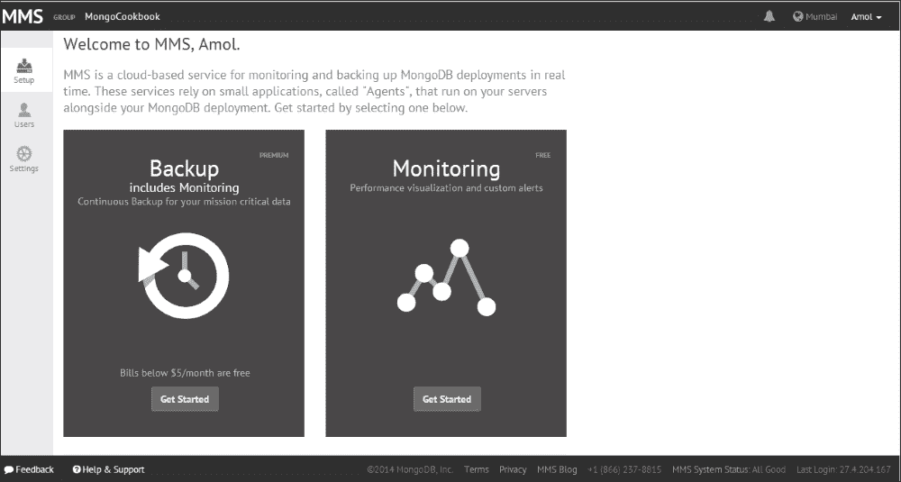

单击**监控**下的**开始**按钮。

1.  一旦到达菜单中的**下载代理**选项，请单击适当的操作系统平台以下载代理。选择适当的操作系统平台后，按照给定的说明进行操作。也记下**apiKey**。例如，如果选择了 Windows 平台，我们将看到以下内容：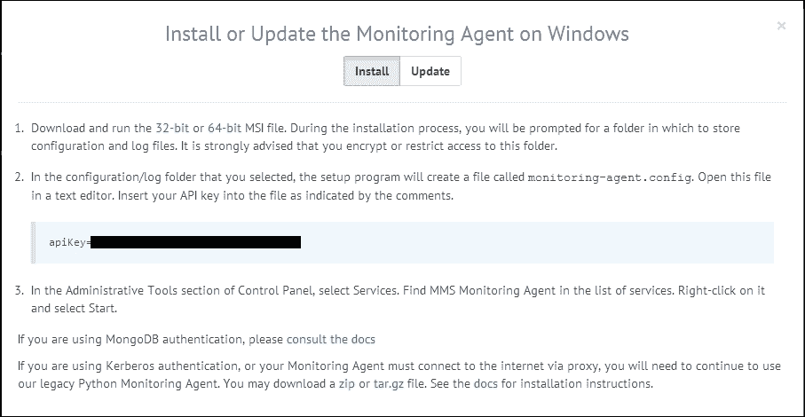

1.  安装完成后，打开`monitoring-agent.config`文件。它将位于安装代理时选择的配置文件夹中。

1.  在文件中查找关键的`mmsApiKey`，并将其值设置为在第 1 步中记录的 API 密钥。

1.  一旦服务启动（我们必须在 Windows 上转到`services.msc`，可以通过在运行对话框中输入`services.msc`（Windows + *R*）并手动启动服务来完成）。服务将被命名为**MMS Monitoring Agent**。在网页上，点击**验证代理**按钮。如果一切顺利，启动的代理将被验证，并显示成功消息。

1.  下一步是配置主机。这个主机是从代理的角度看到的，在组织或个人基础设施上运行。下面的屏幕显示了用于添加主机的屏幕。主机名是内部主机名（客户网络上的主机名），云上的 MMS 不需要访问 MongoDB 进程。收集这些 mongodb 进程的数据并将数据发送到 MMS 服务的是代理。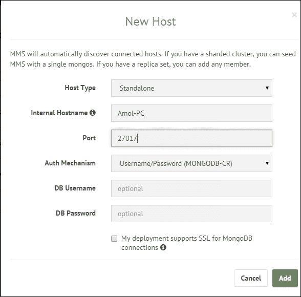

一旦添加了主机的详细信息，请单击**验证主机**按钮。验证完成后，单击**开始监视**按钮。

我们已经成功设置了 MMS 并向其添加了一个将被监视的主机。

## 它是如何工作的...

在这个教程中，我们设置了一个 MMS 代理和监视一个独立的 MongoDB 实例。安装和设置过程非常简单。我们还添加了一个独立的实例，一切都很好。

假设我们已经设置并运行了一个副本集（参考第一章中的教程*作为副本集的一部分启动多个实例*，*安装和启动服务器*，了解如何启动副本集的更多细节），三个成员正在监听端口`27000`，`27001`和`27002`。参考*如何操作...*部分中的第 6 点，我们设置了一个独立的主机。在**主机类型**的下拉菜单中选择**副本集**，在**内部主机名**中，给出副本集的任何成员的有效主机名（在我的情况下，给出了**Amol-PC**和端口**27001**，这是一个辅助实例）；所有其他实例将被自动发现，并在主机下可见，如下所示：

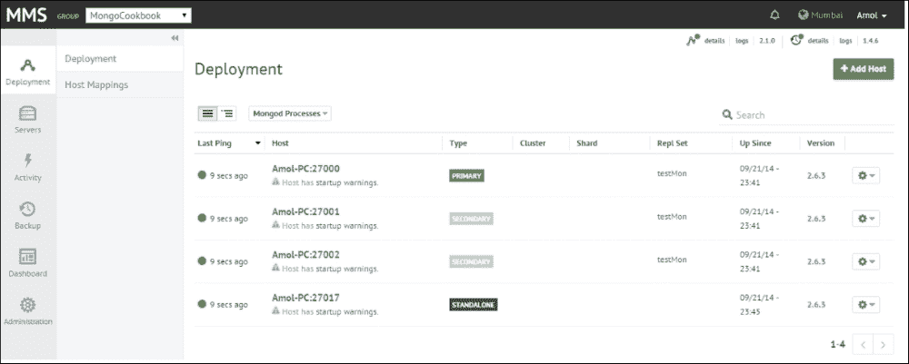

我们没有看到在集群上启用安全性时应该做什么，这在生产环境中非常常见，我们有副本集或分片设置。如果启用了身份验证，我们需要 MMS 代理收集统计信息的正确凭据。在添加新主机时（*如何操作...*部分的第 6 点），我们给出的**DB 用户名**和**DB 密码**应该具有至少`clusterAdmin`和`readAnyDatabase`角色。

## 还有更多...

在这个教程中，我们看到了如何设置 MMS 代理并从 MMS 控制台创建帐户。但是，我们可以作为管理员为 MMS 控制台添加组和用户，授予各种用户在不同组上执行各种操作的权限。在下一个教程中，我们将对 MMS 控制台中的用户和组管理进行一些解释。

# 在 MMS 控制台中管理用户和组

在上一个教程中，我们看到了如何设置 MMS 帐户并设置 MMS 代理。在这个教程中，我们将对如何设置组和用户访问 MMS 控制台进行一些解释。

## 准备工作

有关设置代理和 MMS 帐户，请参阅上一个教程。这是本教程的唯一先决条件。

## 如何操作...

1.  首先，转到屏幕左侧的**管理** | **用户**，如下所示：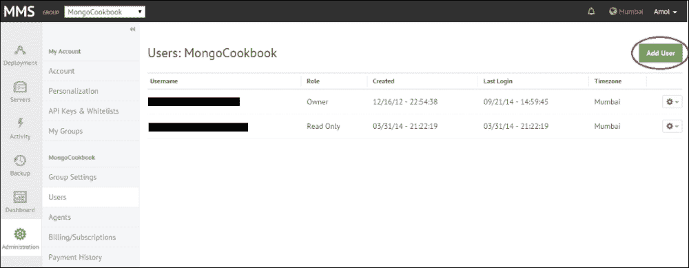

在这里，您可以查看现有用户并添加新用户。单击前图中右上角的**添加用户**（圈起来的）按钮，您应该看到以下弹出窗口，允许您添加新用户：

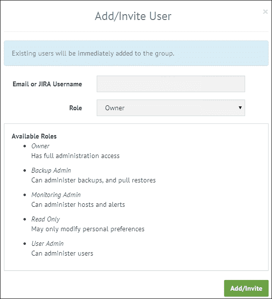

前面的屏幕将用于添加用户。注意各种可用角色。

1.  同样，转到**管理** | **我的组**，通过单击**添加组**按钮查看和添加新组。在文本框中，输入组的名称。请记住，您输入的组名应该在全球范围内可用。所给组的名称应在 MMS 的所有用户中是唯一的，而不仅仅是您的帐户。

1.  创建新组后，所有组的顶部左侧将显示一个下拉菜单，如下所示：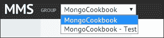

1.  您可以使用此下拉菜单在组之间切换，该菜单应显示所选组相关的所有详细信息和统计信息。

### 注意

请记住，一旦创建了一个组，就无法删除。因此在创建时要小心。

## 工作原理…

我们在配方中所做的任务非常简单，不需要太多的解释，除了一个问题。何时以及为什么要添加一个组？当我们想要通过不同的环境或应用程序对 MongoDB 实例进行分隔时。每个组都将运行一个不同的 MMS 代理。当我们想要为应用程序的不同环境（开发、QA、生产等）创建单独的监控组时，就需要创建一个新组，并且每个组对用户有不同的权限。也就是说，同一个代理不能用于两个不同的组。在配置 MMS 代理时，我们为其提供一个唯一的 API 密钥。要查看组的 API 密钥，请从屏幕顶部的下拉菜单中选择适当的组（如果您的用户只能访问一个组，则看不到下拉菜单），然后转到**管理** | **组设置**，如下一个截图所示。**组 ID**和**API 密钥**都将显示在页面顶部。

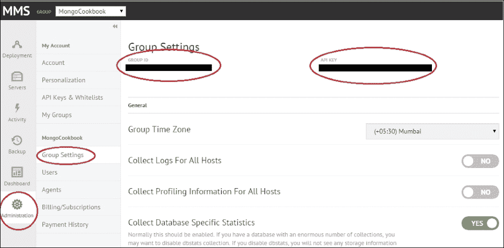

请注意，并非所有用户角色都会看到此选项。例如，只读用户只能个性化其个人资料，大多数其他选项将不可见。

# 在 MMS 上监视实例并设置警报

前面的几个配方向我们展示了如何设置 MMS 帐户，设置代理，添加主机以及管理用户对 MMS 控制台的访问。MMS 的核心目标是监视主机实例，这一点尚未讨论。在这个配方中，我们将对我们在第一个配方中添加到 MMS 的主机执行一些操作，并从 MMS 控制台监视它。

## 准备工作

按照配方*注册 MMS 并设置 MMS 监控代理*，这基本上就是这个配方所需的一切。您可以选择独立实例或副本集，两种方式都可以。此外，打开一个 mongo shell 并从中连接到主实例（它是一个副本集）。

## 如何做…

1.  首先登录 MMS 控制台，然后单击左侧的**部署**。然后再次单击子菜单中的**部署**链接，如下截图所示：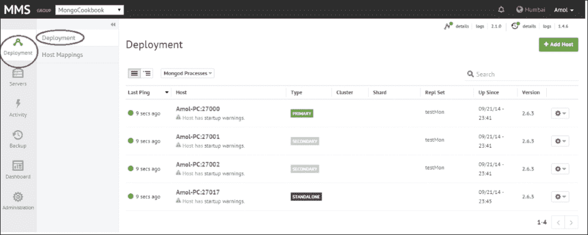

单击其中一个主机名以查看显示各种统计信息的大量图表。在这个配方中，我们将分析其中大部分。

1.  打开为本书下载的捆绑包。在第四章中，*管理*，我们使用了一个 JavaScript 来使服务器忙于一些操作，名为`KeepServerBusy.js`。这次我们将使用相同的脚本。

1.  在操作系统 shell 中，使用当前目录中的`.js`文件执行以下操作。在我的情况下，shell 连接到主端口`27000`：

```go
$ mongo KeepServerBusy.js --port 27000 --quiet

```

1.  一旦启动，保持运行并在开始监视 MMS 控制台上的图表之前给予 5 到 10 分钟。

## 工作原理…

在第四章中，*管理*，我们看到了一个配方，*mongostat 和 mongotop 实用程序*，演示了如何使用这些实用程序来获取当前操作和资源利用率。这是一种相当基本和有用的监视特定实例的方法。然而，MMS 为我们提供了一个地方来监视 MongoDB 实例，具有非常易于理解的图表。MMS 还为我们提供了`mongostat`和`mongotop`无法提供的历史统计信息。

在我们继续分析指标之前，我想提一下，在 MMS 监控的情况下，数据不会在公共网络上查询或发送。只有统计数据通过代理以安全通道发送。代理的源代码是开源的，如果需要，可以进行检查。mongod 服务器不需要从公共网络访问，因为基于云的 MMS 服务从不直接与服务器实例通信。是 MMS 代理与 MMS 服务通信。通常，一个代理足以监视多个服务器，除非您计划将它们分成不同的组。此外，建议在专用机器/虚拟机上运行代理，并且不与任何 mongod 或 mongos 实例共享，除非它是您正在监视的不太关键的测试实例组。

让我们在控制台上查看一些这些统计数据；我们从与内存相关的统计数据开始。下图显示了驻留内存、映射内存和虚拟内存。

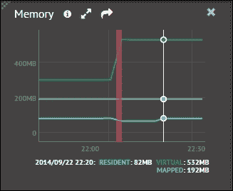

正如我们所看到的，数据集的驻留内存为 82 MB，这是非常低的，它是 mongod 进程实际使用的物理内存。当前值明显低于可用的空闲内存，并且通常会随着时间的推移而增加，直到达到使用了大部分可用物理内存的程度。这由 mongod 服务器进程自动处理，即使机器上有可用内存，我们也不能强制它使用更多内存。

另一方面，映射内存大约是数据库的总大小，并由 MongoDB 进行映射。这个大小可以（通常）比可用的物理内存大得多，这使得 mongod 进程能够在内存中寻址整个数据集，即使它并不在内存中。MongoDB 将映射和加载数据的责任转移到底层操作系统。每当访问一个内存位置并且它在 RAM 中不可用（即驻留内存），操作系统会将页面加载到内存中，如果需要的话，会驱逐一些页面为新页面腾出空间。什么是内存映射文件？让我们尝试用一个超级精简的版本来看看。假设我们有一个 1 KB（1024 字节）的文件，而 RAM 只有 512 字节，显然我们无法将整个文件加载到内存中。但是，您可以要求操作系统将此文件映射到可用的 RAM 页面中。假设每个页面是 128 字节，那么总文件大小为 8 页（128 * 8 = 1024）。但是操作系统只能加载四个页面，我们假设它加载了前 4 个页面（达到 512 字节）。当我们访问第 200 个字节时，它是可以在内存中找到的，因为它在第 2 页上。但是如果我们访问第 800 个字节，逻辑上在第 7 页上，而这一页没有加载到内存中怎么办？操作系统会从内存中取出一页，并加载包含第 800 个字节的第 7 页。作为一个应用程序，MongoDB 给人的印象是所有东西都加载到了内存中，并且通过字节索引进行访问，但实际上并非如此，操作系统在背后为我们做了透明的工作。由于访问的页面不在内存中，我们必须去磁盘加载它到内存中，这就是所谓的**页面错误**。

回到图表中显示的统计数据，虚拟内存包含所有内存使用，包括映射内存以及任何额外使用的内存，比如与每个连接相关的线程堆栈的内存。如果启用了日志记录，这个大小肯定会比映射内存的两倍还要多，因为日志记录也会有一个单独的内存映射用于数据。因此，我们有两个地址映射相同的内存位置。这并不意味着页面会被加载两次。这只是意味着可以使用两个不同的内存位置来寻址相同的物理内存。非常高的虚拟内存可能需要一些调查。没有预先确定的太高或太低的定义；通常在你对系统的性能感到满意的正常情况下，这些值会被监视。然后应该将这些基准值与系统性能下降时看到的数字进行比较，然后采取适当的行动。

正如我们之前所看到的，当访问的内存位置不在常驻内存中时，会导致页面错误，从而使操作系统从内存中加载页面。这种 IO 活动肯定会导致性能下降，太多的页面错误会严重影响数据库性能。下面的屏幕截图显示了每分钟发生的相当多的页面错误。然而，如果使用的是固态硬盘而不是旋转硬盘，那么来自驱动器的寻道时间的影响可能不会显著。

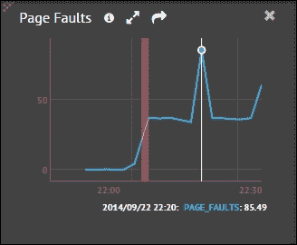

当物理内存不足以容纳数据集并且操作系统需要将数据从磁盘加载到内存时，通常会发生大量页面错误。请注意，此统计数据显示在 Windows 平台上，并且对于非常琐碎的操作可能会显得很高。这个值是硬页错误和软页错误的总和，实际上并不能真正反映系统的好坏。在基于 Unix 的操作系统上，这些数字会有所不同。在撰写本书时，有一个 JIRA（[`jira.mongodb.org/browse/SERVER-5799`](https://jira.mongodb.org/browse/SERVER-5799)）正在开放，报告了这个问题。

你可能需要记住的一件事是，在生产系统中，MongoDB 与 NUMA 架构不兼容，即使可用内存似乎足够高，你可能会看到大量页面错误发生。有关更多详细信息，请参阅网址[`docs.mongodb.org/manual/administration/production-notes/`](http://docs.mongodb.org/manual/administration/production-notes/)。

还有一个额外的图表，提供了一些关于未映射内存的细节。正如我们在本节前面看到的，有三种类型的内存：映射内存、常驻内存和虚拟内存。映射内存始终小于虚拟内存。如果启用了日志记录，虚拟内存将是映射内存的两倍以上。如果我们看一下本节前面给出的图像，我们会发现映射内存为 192MB，而虚拟内存为 532MB。由于启用了日志记录，内存是映射内存的两倍以上。启用日志记录时，相同的数据页在内存中被映射两次。请注意，该页只被物理加载一次，只是可以使用两个不同的地址访问相同的位置。让我们找出虚拟内存（532MB）和两倍映射内存（384MB）之间的差异（2 * 192 = 384）。这些数字之间的差异是 148MB（532-384）。

我们在这里看到的是未映射内存的部分。这个值与我们刚刚计算的值相同。

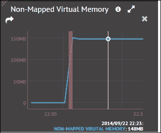

如前所述，非映射内存的高低值并没有明确定义，但是当值达到 GB 时，我们可能需要进行调查；可能打开的连接数很高，我们需要检查是否有客户端应用程序在使用后没有关闭连接。有一个图表显示了打开的连接数，如下所示：

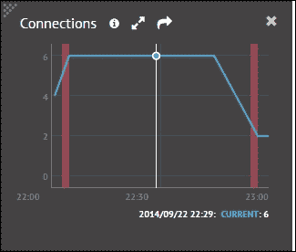

一旦我们知道连接数，并且发现它与预期计数相比太高，我们将需要找到打开连接到该实例的客户端。我们可以从 shell 中执行以下 JavaScript 代码来获取这些详细信息。不幸的是，在撰写本书时，MMS 没有这个功能来列出客户端连接的详细信息。

```go
testMon:PRIMARY> var currentOps = db.currentOp(true).inprog;
 currentOps.forEach(function(c) {
 if(c.hasOwnProperty('client')) {
 print('Client: ' + c.client + ", connection id is: " + c.desc);
 }
 //Get other details as needed 
 });

```

`db.currentOp`方法返回结果中所有空闲和系统操作。然后我们遍历所有结果并打印出客户端主机和连接详细信息。`currentOp`结果中的典型文档如下。您可以选择调整前面的代码，根据需要包含更多详细信息：

```go
 {
 "opid" : 62052485,
 "active" : false,
 "op" : "query",
 "ns" : "",
 "query" : {
 "replSetGetStatus" : 1,
 "forShell" : 1
 },
 "client" : "127.0.0.1:64460",
 "desc" : "conn3651",
 "connectionId" : 3651,
 "waitingForLock" : false,
 "numYields" : 0,
 "lockStats" : {
 "timeLockedMicros" : {

 },
 "timeAcquiringMicros" : {

 }
 }
 }

```

在第四章中，我们看到了一个名为* mongostat 和 mongotop 实用程序*的配方，用于获取数据库被锁定的时间百分比以及每秒执行的更新、插入、删除和获取操作的数量。您可以参考这些配方并尝试它们。我们使用了与当前用于使服务器繁忙的相同的 JavaScript。

在 MMS 控制台中，我们有图表显示以下详细信息：

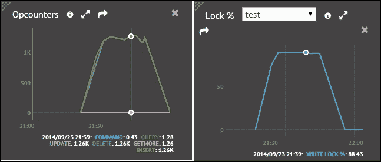

第一个`opcounters`显示在特定时间点执行的操作数量。这应该类似于我们使用`mongostat`实用程序看到的内容。右侧的内容显示了数据库被锁定的时间百分比。下拉菜单列出了数据库名称。我们可以选择要查看统计信息的适当数据库。同样，这个统计数据可以使用`mongostat`实用程序来查看。唯一的区别是，使用命令行实用程序，我们可以看到当前时间的统计数据，而在这里我们也可以看到历史统计数据。

在 MongoDB 中，索引存储在 B 树中，下图显示了 B 树索引被访问、命中和未命中的次数。最低限度，RAM 应该足够容纳索引以实现最佳性能。因此，在这个度量标准中，未命中应该为 0 或非常低。未命中的次数过高会导致索引的页面错误，如果查询没有被覆盖，可能会导致相应数据的额外页面错误，也就是说，所有数据无法从索引中获取，这对性能来说是一个双重打击。在查询时的一个好的做法是使用投影，并且只从文档中获取必要的字段。每当我们选择的字段存在于索引中时，这对于查询是有帮助的，这种情况下查询变成了覆盖查询，所有必要的数据只从索引中获取。要了解更多关于覆盖索引的信息，请参考第二章中的*创建索引和查看查询计划*这个章节。

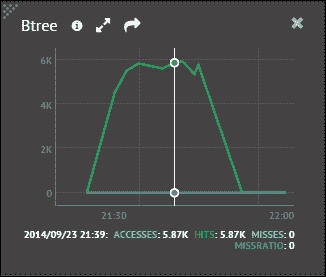

对于繁忙的应用程序，如果卷非常大，多个写入和读取操作争夺锁定，操作排队。直到 MongoDB 的 2.4 版本，锁定是在数据库级别进行的。因此，即使在另一个集合上进行写入，对该数据库中的任何集合进行读取操作也会被阻塞。这种排队操作会影响系统的性能，并且是数据可能需要分片以扩展系统的良好指标。

### 提示

请记住，没有定义高或低的值；它是应用程序到应用程序基础上的可接受值。

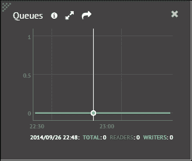

MongoDB 立即从日志中刷新数据，并定期将数据文件刷新到磁盘。以下指标给出了在给定时间点每分钟的刷新时间。如果刷新占据了相当大的时间百分比，我们可以安全地说写操作正在形成性能瓶颈。

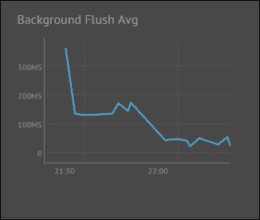

## 还有更多...

在这篇文章中，我们看到了如何监视 MongoDB 实例/集群。然而，设置警报以在某些阈值值被超过时收到通知，这是我们还没有看到的。在下一篇文章中，我们将看到如何通过一个示例警报来实现这一点，当页面错误超过预定值时会通过电子邮件发送警报。

## 另请参阅

+   监视硬件，如 CPU 使用率，非常有用，MMS 控制台也支持。然而，需要安装 munin-node 才能启用 CPU 监视。请参考页面[`mms.mongodb.com/help/monitoring/configuring/`](http://mms.mongodb.com/help/monitoring/configuring/)设置 munin-node 和硬件监视。

+   要更新监控代理，请参考页面[`mms.mongodb.com/help/monitoring/tutorial/update-mms/`](http://mms.mongodb.com/help/monitoring/tutorial/update-mms/)。

# 在 MMS 中设置监控警报

在上一篇文章中，我们看到了如何从 MMS 控制台监视各种指标。这是一个很好的方式，可以在一个地方看到所有的统计数据，并了解 MongoDB 实例和集群的健康状况。然而，不可能持续 24/7 监视系统，对于支持人员来说必须有一些机制在某些阈值超过时自动发送警报。在这篇文章中，我们将设置一个警报，每当页面错误超过 1000 时就会触发。

## 准备工作

参考上一篇文章，设置使用 MMS 监视 Mongo 实例。这是本篇文章的唯一先决条件。

## 操作步骤...

1.  单击左侧菜单中的**活动**选项，然后单击**警报设置**。在**警报设置**页面上，单击**添加警报**。

1.  为**主机**添加一个新的警报，如果页面错误超过给定数量，即每分钟 1000 个页面错误。在这种情况下，通知选择为电子邮件，警报发送间隔为 10 分钟。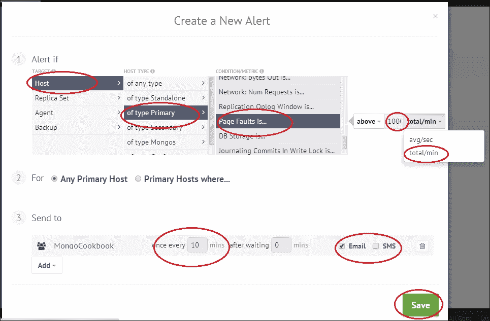

1.  单击**保存**以保存警报。

## 工作原理...

这些步骤非常简单，我们成功地设置了当页面错误超过每分钟 1000 次时的 MMS 警报。正如我们在上一篇文章中看到的，没有固定值被归类为高或低。这是可以接受的，需要在您的环境中的测试阶段对系统进行基准测试。与页面错误类似，还有大量可以设置的警报。一旦触发警报，将按照我们设置的每 10 分钟发送一次，直到不满足发送警报的条件为止。在这种情况下，如果页面错误数量低于 1000 或有人手动确认了警报，那么将不会再发送进一步的警报。

如下面的屏幕截图所示，警报已打开，我们可以确认警报：

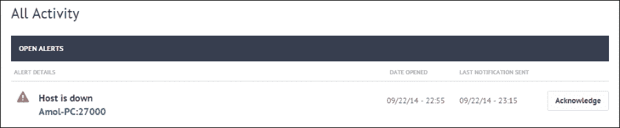

单击**确认**后，将弹出以下窗口，让我们选择确认的持续时间：

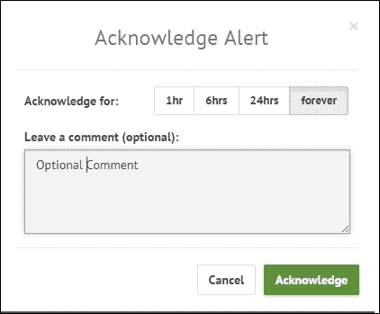

这意味着在这种特定情况下，直到所选时间段过去，将不会再发送警报。

单击左侧的**活动**菜单选项即可查看打开的警报。

## 另请参阅

+   访问网址[`www.mongodb.com/blog/post/five-mms-monitoring-alerts-keep-your-mongodb-deployment-track`](http://www.mongodb.com/blog/post/five-mms-monitoring-alerts-keep-your-mongodb-deployment-track)了解一些应该为您的部署设置的重要警报

# 使用现成的工具备份和恢复 Mongo 中的数据

在本教程中，我们将使用`mongodump`和`mongorestore`等实用程序进行一些基本的备份和恢复操作，以备份和恢复文件。

## 准备工作

我们将启动一个 mongod 的单个实例。请参阅第一章中的*安装单节点 MongoDB*教程，*安装和启动服务器*，以启动一个 mongo 实例并从 mongo shell 连接到它。我们需要一些要备份的数据。如果您的 test 数据库中已经有一些数据，那就很好。如果没有，请使用以下命令从代码包中的`countries.geo.json`文件创建一些数据：

```go
$ mongoimport  -c countries -d test --drop countries.geo.json

```

## 如何做…

1.  有了`test`数据库中的数据，执行以下操作（假设我们要将数据导出到当前目录中名为`dump`的本地目录）：

```go
$ mongodump -o dump -oplog -h localhost -port 27017

```

验证`dump`目录中是否有数据。所有文件将是`.bson`文件，每个文件对应相应数据库文件夹中的一个集合。

1.  现在让我们使用以下命令将数据导入 mongo 服务器。这里假设我们在当前目录中有一个名为`dump`的目录，并且其中有所需的`.bson`文件：

```go
mongorestore --drop -h localhost -port 27017 dump -oplogReplay

```

## 它是如何工作的…

只需执行几个步骤即可导出和恢复数据。现在让我们看看它到底是做什么的，以及这个实用程序的命令行选项是什么。`mongodump`实用程序用于将数据库导出到`.bson`文件中，然后可以稍后用于恢复数据库中的数据。导出实用程序为每个数据库导出一个文件夹，除了本地数据库，然后每个文件夹中将有一个`.bson`文件。在我们的情况下，我们使用了`-oplog`选项来导出 oplog 的一部分，数据将导出到`oplog.bson`文件中。类似地，我们使用`mongorestore`实用程序将数据导入到数据库中。我们在导入和重放内容之前通过提供`--drop`选项显式要求删除现有数据，并重放 oplog 中的内容（如果有）。

`mongodump`实用程序简单地查询集合并将内容导出到文件中。集合越大，恢复内容所需的时间就越长。因此，在进行转储时建议防止写操作。在分片环境中，应关闭平衡器。如果在系统运行时进行转储，则使用`-oplog`选项导出 oplog 的内容。然后可以使用此 oplog 将数据恢复到特定时间点。以下表格显示了`mongodump`和`mongorestore`实用程序的一些重要选项，首先是`mongodump`：

| 选项 | 描述 |
| --- | --- |
| `--help` | 显示所有可能的支持选项以及这些选项的简要描述。 |
| `-h`或`--host` | 要连接的主机。默认情况下，它是端口`27017`上的 localhost。如果要连接到独立实例，则可以将主机名设置为`<主机名>:<端口号>`。对于副本集，格式将是`<副本集名称>/<主机名>:<端口>,….<主机名>:<端口>`，其中逗号分隔的主机名和端口列表称为**种子列表**。它可以包含副本集中所有或部分主机名。 |
| `--port` | 目标 MongoDB 实例的端口号。如果在之前的`-h`或`--host`选项中提供了端口号，则这并不重要。 |
| `-u`或`--username` | 提供要导出数据的用户的用户名。由于数据是从所有数据库中读取的，因此至少期望用户在所有数据库中具有读取权限。 |
| `-p`或`--password` | 与用户名一起使用的密码。 |
| `--authenticationDatabase` | 存储用户凭据的数据库。如果未指定，则使用`--db`选项中指定的数据库。 |
| `-d`或`--db` | 要备份的数据库。如果未指定，则导出所有数据库。 |
| `-c`或`--collection` | 要导出的数据库中的集合。 |
| `-o`或`--out` | 要导出文件的目录。默认情况下，实用程序将在当前目录中创建一个 dump 文件夹，并将内容导出到该目录。 |
| `--dbpath` | 如果我们不打算连接到数据库服务器，而是直接从数据库文件中读取。值是数据库文件所在目录的路径。在直接从数据库文件中读取时，服务器不应该处于运行状态，因为导出会锁定数据文件，如果服务器正在运行，这是不可能的。在获取锁时，将在目录中创建一个锁文件。 |
| `--oplog` | 启用此选项后，还会导出自导出过程开始时的 oplog 数据。如果不启用此选项，导出的数据将不会代表一个时间点，如果写操作同时进行，因为导出过程可能需要几个小时，它只是对所有集合进行查询操作。导出 oplog 可以恢复到某个时间点的数据。如果在导出过程中阻止写操作，则无需指定此选项。 |

同样，对于`mongorestore`实用程序，以下是选项的含义：`--help`，`-h`或`--host`，`--port`，`-u`或`--username`，`-p`或`--password`，`--authenticationDatabase`，`-d`或`--db`，`-c`或`--collection`。

| 选项 | 描述 |
| --- | --- |
| `--dbpath` | 如果我们不打算连接到数据库服务器，而是直接写入数据库文件，请使用此选项。值是数据库文件所在目录的路径。在直接写入数据库文件时，服务器不应该处于运行状态，因为恢复操作会锁定数据文件，如果服务器正在运行，这是不可能的。在获取锁时，将在目录中创建一个锁文件。 |
| `--drop` | 在从导出的转储数据中恢复数据之前删除集合中的现有数据。 |
| `--oplogReplay` | 如果在允许对数据库进行写操作的情况下导出了数据，并且在导出过程中启用了`--oplog`选项，则将在数据上重放导出的 oplog，以使数据库中的所有数据达到相同的时间点。 |
| `--oplogLimit` | 此参数的值是表示时间的秒数。此选项与`oplogReplay`命令行选项一起使用，用于告诉恢复实用程序重放 oplog，并在此选项指定的限制处停止。 |

你可能会想，“为什么不复制文件并备份呢？”这样做效果很好，但与此相关的问题有几个。首先，除非禁用写操作，否则无法获得点时间备份。其次，备份所使用的空间非常大，因为复制还会复制数据库的 0 填充文件，而`mongodump`只会导出数据。

话虽如此，文件系统快照是备份的常用做法。需要记住的一件事是，在进行快照时，日志文件和数据文件需要在同一个快照中以保持一致性。

如果您使用**亚马逊网络服务**（**AWS**），强烈建议您将数据库备份上传到 AWS S3。您可能知道，AWS 提供极高的数据冗余性，存储成本非常低。

从 Packt Publishing 网站下载脚本`generic_mongodb_backup.sh`，并使用它来自动创建备份并上传到 AWS S3。

# 配置 MMS 备份服务

MMS 备份是 MongoDB 的一个相对较新的功能，用于实时增量备份 MongoDB 实例、副本集和分片，并为您提供实例的时点恢复。该服务可用作本地部署（在您的数据中心）或云端。但是，我们将演示云端服务，这是 Community 和 Basic 订阅的唯一选项。有关可用选项的更多详细信息，您可以访问 MongoDB 在[`www.mongodb.com/products/subscriptions`](https://www.mongodb.com/products/subscriptions)上提供的不同产品。

## 准备就绪

Mongo MMS 备份服务仅适用于 Mongo 2.0 及以上版本。我们将启动一个我们将备份的单个服务器。MMS 备份依赖于 oplog 进行连续备份，由于 oplog 仅在副本集中可用，因此服务器需要作为副本集启动。有关如何安装 Python 和 Mongo 的 Python 客户端 PyMongo 的更多信息，请参阅第一章中的*使用 Python 客户端连接到单个节点*、*安装和启动服务器*。

## 操作步骤如下：

如果您还没有 MMS 帐户，请登录[`mms.mongodb.com/`](https://mms.mongodb.com/)并注册一个帐户。有关屏幕截图，请参阅本章中的*注册 MMS 并设置 MMS 监控代理*。

1.  启动 Mongo 的单个实例，并替换您的机器上适当文件系统路径的值：

```go
$ mongod --replSet testBackup --smallfiles --oplogSize 50 --dbpath /data/mongo/db

```

请注意，`smallfiles`和`oplogSize`仅用于测试目的，并且不应在生产中使用。

1.  启动一个 shell，连接到第 1 步中的实例，并按以下方式启动副本集：

```go
> rs.initiate()

```

副本集将在一段时间内启动并运行。

1.  返回到`mms.mongodb.com`的浏览器。点击**+添加主机**按钮添加新主机。将类型设置为副本集，主机名设置为您的主机名，端口设置为默认端口`27017`。有关**添加主机**过程的屏幕截图，请参阅*注册 MMS 并设置 MMS 监控代理*。

1.  一旦成功添加主机，请点击左侧的**备份**选项，然后点击**开始设置**注册 MMS 备份。

1.  可以使用短信或 Google Authenticator 进行注册。如果智能手机上有 Android、iOS 或 Blackberry OS，Google Authenticator 是一个不错的选择。对于印度等国家，Google Authenticator 是唯一可用的选项。

1.  假设 Google Authenticator 尚未配置，并且我们计划使用它，我们需要在智能手机上安装该应用。转到您的移动操作系统平台的相应应用商店并安装 Google Authenticator 软件。

1.  安装了手机软件后，返回浏览器。在选择 Google Authenticator 后，您应该看到以下屏幕：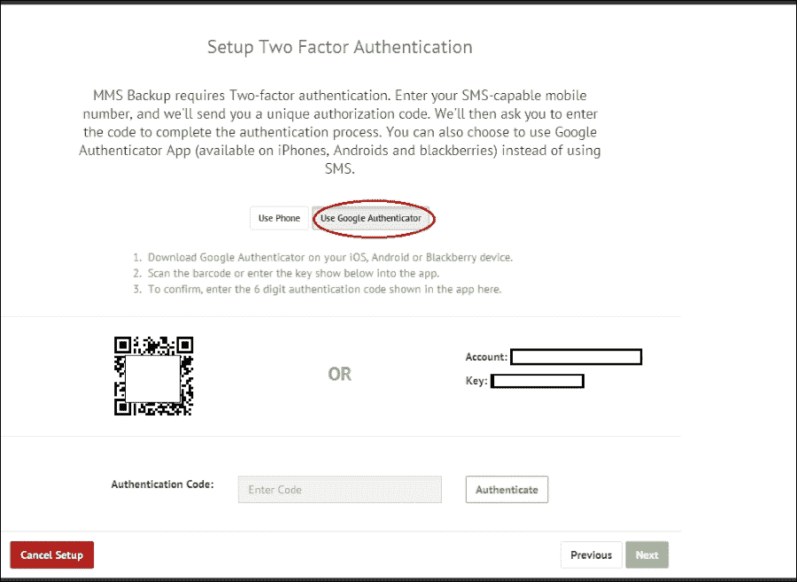

1.  通过扫描 Google Authenticator 应用程序中的 QR 码开始设置新帐户。如果条形码扫描有问题，您可以选择在屏幕右侧手动输入给定的密钥。

1.  一旦成功扫描或输入密钥，您的智能手机应该显示一个每 30 秒更改一次的 6 位数字。在屏幕上的**认证代码**框中输入该数字。

### 注意

重要的是不要在手机上删除 Google Authenticator 中的此帐户，因为这将在将来我们希望更改与备份相关的任何设置时使用。一旦设置完成，QR 码和密钥将不再可见。您将需要联系 MongoDB 支持以重置配置。

1.  一旦认证完成，您应该看到的下一个屏幕是账单地址和账单详细信息，比如您注册的卡。所有低于 5 美元的费用都将免除，因此在收费之前，您应该可以尝试一个小的测试实例。

1.  一旦信用卡详细信息保存，我们将继续进行设置。我们将安装一个备份代理。这是一个与监控代理分开的代理。选择适当的平台，并按照其安装说明进行操作。记下代理的配置文件将放置的位置。

1.  一个新的弹出窗口将包含平台的存档/安装程序的指令/链接以及安装步骤。它还应该包含`apiKey`。记下 API 密钥；我们将在下一步中需要它。

1.  安装完成后，打开代理安装的`config`目录中的`local.config`文件（在代理安装期间显示/修改的位置），并粘贴/输入在上一步中记下的`apiKey`。

1.  一旦代理配置并启动，点击**验证代理**按钮。

1.  一旦代理成功验证，我们将开始添加一个要备份的主机。下拉菜单应该显示我们添加的所有副本集和分片。选择适当的副本集，并将**同步源**设置为主实例，因为这是我们独立实例中唯一的实例。**同步源**仅用于初始同步过程。每当我们有一个合适的副本集和多个实例时，我更喜欢使用次要作为同步过程实例。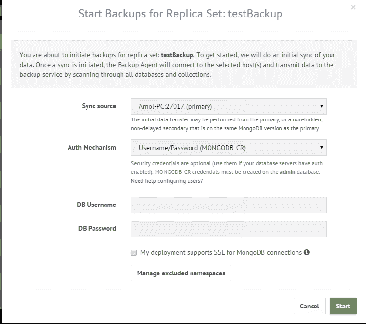

由于实例未启动安全性，将**DB 用户名**和**DB 密码**字段留空。

1.  如果您希望跳过特定数据库或集合的备份，请单击**管理排除的命名空间**按钮。如果没有提供任何内容，默认情况下将备份所有内容。集合名称的格式将是`<数据库名称>.<集合名称>`。或者，它可以只是数据库名称，在这种情况下，该数据库中的所有集合都不符合备份条件。

1.  一旦细节都没问题，点击**开始**按钮。这应该完成在 MMS 上为副本集设置备份过程的设置。

### 提示

我执行的安装步骤是在 Windows 操作系统上，服务在这种情况下需要手动启动。按下 Windows + *R*，输入`services.msc`。服务的名称是 MMS 备份代理。

## 工作原理…

这些步骤非常简单，这就是我们为 Mongo MMS 备份设置服务器所需做的一切。之前提到的一个重要事项是，一旦设置了备份，MMS 备份在任何操作中都使用多因素身份验证，并且为 MongoDB 在 Google Authenticator 中设置的帐户不应删除。没有办法恢复用于设置验证器的原始密钥。您将不得不清除 Google Authenticator 设置并设置一个新密钥。要做到这一点，点击屏幕左下角的**帮助和支持**链接，然后点击**如何重置我的双因素身份验证？**。

单击链接后，将打开一个新窗口并要求输入用户名。将向注册的电子邮件 ID 发送一封电子邮件，该电子邮件允许您重置双因素身份验证。

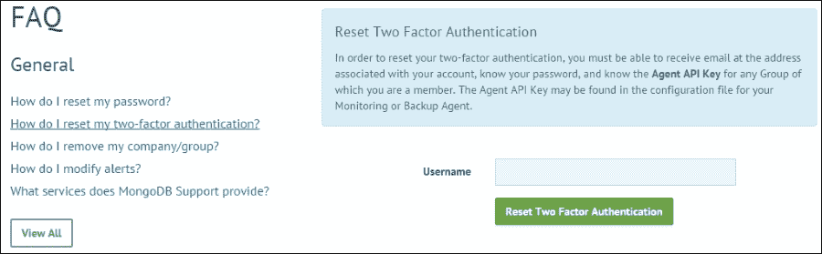

如前所述，oplog 用于将当前 MongoDB 实例与 MMS 服务同步。但是，对于初始同步，将使用实例的数据文件。在设置副本集的备份时，我们提供要使用的实例。由于这是一个资源密集型操作，在繁忙的系统上，我更喜欢使用次要实例，以便不会通过 MMS 备份代理向主实例添加更多的查询。一旦实例完成初始同步，主实例的 oplog 将被用于持续获取数据。代理会定期向 admin 数据库中的`mms.backup`集合写入数据。

MMS 备份的备份代理与 MMS 监控代理不同。虽然在同一台机器上同时运行它们没有限制，但在生产环境中进行这样的设置之前，您可能需要评估一下。最保险的做法是让它们在不同的机器上运行。在生产环境中，不要在同一台机器上运行这两个代理与 mongod 或 mongos 实例。不建议在同一台机器上运行代理和 mongod 实例的原因有几个重要的原因：

+   代理的资源利用率取决于其监视的集群大小。我们不希望代理使用大量资源影响生产实例的性能。

+   代理可能同时监视许多服务器实例。由于只有一个代理实例，我们不希望在数据库服务器维护和重启期间出现故障。

使用 SSL 构建的 MongoDB 社区版或使用 SSL 选项进行通信的企业版必须执行一些额外的步骤。第一步是在为备份设置副本集时检查**我的部署支持 MongoDB 连接的 SSL**标志（见第 15 步）。请注意截图底部的复选框应该被选中。其次，打开 MMS 配置的`local.config`文件，并查找以下两个属性：

```go
sslTrustedServerCertificates=
sslRequireValidServerCertificates=true
```

第一个是 PEM 格式的认证机构证书的完全限定路径。此证书将用于验证通过 SSL 运行的 mongod 实例呈现的证书。如果要禁用证书验证，则可以将第二个属性设置为`false`，但这并不是一个推荐的选项。就从代理向 MMS 服务发送的数据而言，无论您的 MongoDB 实例是否启用 SSL，通过 SSL 发送的数据都是安全的。备份数据中心中的数据在静态状态下是未加密的。

如果在 mongod 实例上启用了安全性，则需要提供用户名和密码，这将被 MMS 备份代理使用。在为副本集设置备份时提供用户名和密码，如第 15 步所示。由于代理需要读取 oplog，可能需要对所有数据库进行初始同步并将数据写入`admin`数据库，因此用户需要具有以下角色：`readAnyDatabase`，`clusterAdmin`，`admin`和`local`数据库上的`readWrite`，以及`userAdminAnyDatabase`。这适用于版本 2.4 及以上。在 v2.4 之前的版本中，我们期望用户对所有数据库具有读取权限，并对 admin 和 local 数据库具有读/写权限。

在为备份设置副本集时，您可能会遇到错误，如`Insufficient oplog size: The oplog window must be at least 1 hours over the last 24 hours for all active replica set members. Please increase the oplog.`。虽然您可能认为这总是与 oplog 大小有关，但当副本集中有一个处于恢复状态的实例时，也会出现这种情况。这可能会让人感到误导，因此在为副本集设置备份时，请注意查看是否有正在恢复的节点。根据 MMS 支持，似乎不允许为具有一些正在恢复节点的备份设置副本集，并且这可能会在将来得到修复。

# 在 MMS 备份服务中管理备份

在上一篇文章中，我们看到了如何设置 MMS 备份服务，并为备份设置了一个简单的单成员副本集。尽管单成员副本集根本没有意义，但由于独立实例无法在 MMS 中设置备份，因此需要它。在本篇文章中，我们将深入探讨在为备份设置的服务器上可以执行的操作，例如启动、停止或终止备份；管理排除列表；管理备份快照和保留；以及恢复到特定时间点的数据。

## 准备就绪

前面的步骤就是这个步骤所需的一切。预计已经完成了必要的设置，因为我们将在这个步骤中使用与备份相同的服务器。

## 操作步骤...

服务器已经运行，让我们向其导入一些数据。可以是任何数据，但我们选择使用上一章中使用的`countries.geo.json`文件。它应该在从 Packt 网站下载的捆绑软件中可用。

首先将数据导入到`test`数据库中名为`countries`的集合中。使用以下命令来执行。当前目录中有`countries.geo.json`文件时，执行以下导入命令：

```go
$ mongoimport  -c countries -d test --drop countries.geo.json

```

我们已经看到了在设置副本集备份时如何排除命名空间。现在我们将看到在为副本集备份完成后如何排除命名空间。点击左侧的**备份**菜单选项，然后点击**副本集状态**，这在点击**备份**时会默认打开。点击显示副本集的行右侧的**齿轮**按钮。它应该看起来像这样：

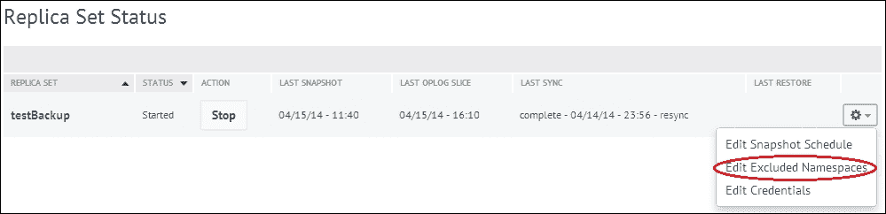

1.  如前面的图片所示，点击**编辑排除的命名空间**，然后输入要排除的集合名称。假设我们要在`test`数据库中排除`applicationLogs`集合，输入`test.applicationLogs`。

1.  保存后，您将被要求输入当前在您的 Google Authenticator 上显示的令牌代码。

1.  成功验证代码后，`test.applicationLogs`命名空间将被添加到排除备份的命名空间列表中。

1.  现在我们将看到如何管理快照调度。快照是数据库在特定时间点的状态。要管理快照频率和保留策略，请点击前一个截图中显示的**齿轮**按钮，然后点击**编辑快照调度**。

1.  正如我们在下一张图片中所看到的，我们可以设置快照的拍摄时间和保留期限。我们将在下一节中更多讨论这个问题。对此的任何更改都需要多因素身份验证来保存更改。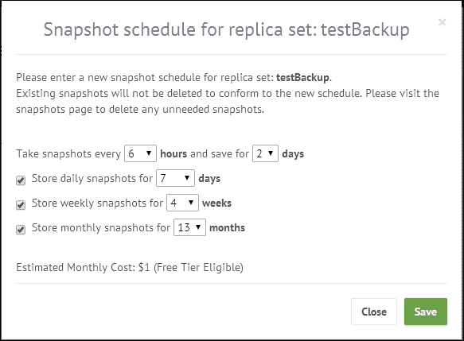

1.  现在我们将看到如何使用 MMS 备份恢复数据。在任何时候，当我们想要恢复数据时，点击**备份**和**副本集状态**/**分片集群状态**，然后点击**集合/集群名称**。

点击后，我们将看到保存在此集合中的快照。应该看起来像这样：

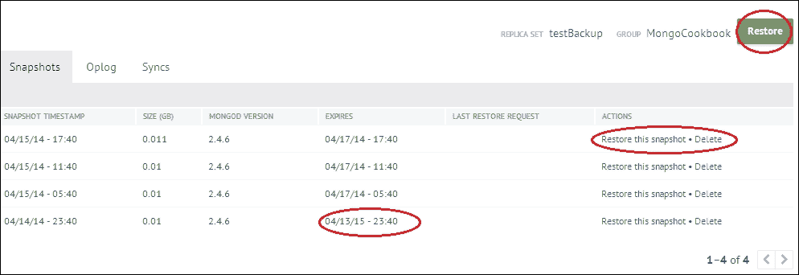

我们已经圈出了屏幕上的一些部分，我们将逐一看到。

1.  要恢复到快照拍摄时的时间点，请点击网格的**操作**列中的**恢复此快照**链接。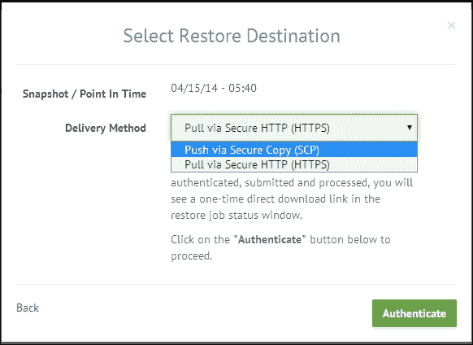

1.  前面的图片向我们展示了如何通过 HTTPS 或 SCP 导出数据。我们现在选择 HTTPS，然后点击**验证**。我们将在下一节中了解 SCP。

1.  输入通过短信接收或在 Google Authenticator 上看到的令牌，然后点击**完成请求**以输入认证代码。

1.  成功验证后，点击**恢复作业**。这是一次性下载，让您可以下载`tar.gz`存档。点击**下载**链接以下载`tar.gz`存档。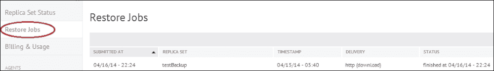

1.  下载存档后，解压以获取其中的数据库文件。

1.  停止 mongod 实例，用提取出的文件替换数据库文件，并重新启动服务器以获取快照拍摄时的数据。请注意，如果所有数据都被排除在备份之外，数据库文件将不包含该集合的数据。

1.  现在我们将看到如何使用 MMS 备份获取特定时间点的数据。

1.  点击**副本集状态**/**分片集群状态**，然后点击要恢复的集群/集合。

1.  在屏幕右侧，点击**恢复**按钮。

1.  这应该列出可用的快照，或者您可以输入自定义时间。勾选**使用自定义时间点**。单击**日期**字段，选择日期和时间，以便在小时和分钟中恢复数据，然后单击**下一步**。请注意，**时间点**功能只能恢复到过去 24 小时的时间点。

在这里，您将被要求指定格式为 HTTPS 或 SCP。后续步骤与我们上次做的类似，从第 14 步开始。

## 它是如何工作的...

设置副本集的备份后，我们向数据库导入了随机数据。这个数据库的备份将由 MMS 完成，稍后我们将使用这个备份来恢复数据库。我们看到了如何在步骤 2-5 中排除要备份的命名空间。

查看快照和保留策略设置，我们可以看到我们可以选择快照拍摄的时间间隔和保留的天数（步骤 9）。我们可以看到，默认情况下，快照每 6 小时拍摄一次，保存 2 天。在一天结束时拍摄的快照保存一周。在一周和一个月结束时拍摄的快照分别保存 4 周和 13 个月。快照可以每 6、8、12 和 24 小时拍摄一次。然而，您需要了解长时间间隔后拍摄快照的另一面。假设最后一张快照是在 18 小时拍摄的；获取那时的数据进行恢复非常容易，因为它存储在 MMS 备份服务器上。然而，我们需要 21:30 时的数据进行恢复。由于 MMS 备份支持时间点备份，它将使用 18:00 时的基本快照，然后在 21:30 时拍摄快照后对其进行更改。这类似于如何在数据上重放 oplog。这种重放是有成本的，因此获取时间点备份比从快照获取数据略微昂贵。在这里，我们需要重放 3.5 小时的数据，从 18:00 时到 21:30 时。想象一下，如果快照设置为每 12 小时拍摄一次，我们的第一张快照是在 00:00 时拍摄的，那么我们每天都会在 00:00 时和 12:00 时拍摄快照。要将数据恢复到 21:30 时，以 12:00 时为最后一个快照，我们将不得不重放 9.5 小时的数据。这要昂贵得多。

更频繁的快照意味着更多的存储空间使用，但恢复数据库到特定时间点所需的时间更少。与此同时，较少频繁的快照需要更少的存储空间，但以恢复数据到特定时间点为代价的时间更长。您需要在这两者之间做出决定并进行权衡，即空间和恢复时间。对于每日快照，我们可以选择保留 3 到 180 天。同样，对于每周和每月的快照，保留期可以分别选择 1 到 52 周和 1 到 36 个月。

在第 9 步的屏幕截图中，有一个列显示快照的到期时间。对于第一张拍摄的快照，到期时间是 1 年，而其他快照在 2 天后到期。到期时间如我们在上一段讨论的那样。更改到期值时，旧的快照不会受到影响或根据更改的时间进行调整。然而，根据修改后的保留和频率设置拍摄的新快照将会受到影响。

我们看到了如何下载转储（从第 10 步开始），然后使用它来恢复数据库中的数据。这非常简单，不需要太多解释，除了一些事情。首先，如果数据是用于分片，将会有多个文件夹，每个分片一个文件夹，每个文件夹都有数据库文件，与我们在副本集的情况下看到的不同，那里我们有一个包含数据库文件的单个文件夹。最后，让我们看看当我们选择 SCP 作为选项时的屏幕：

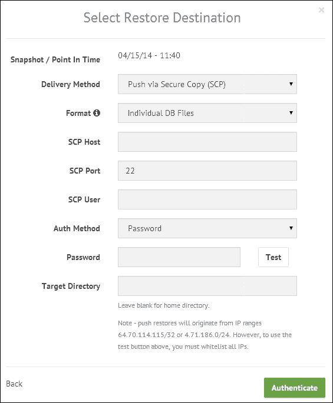

SCP 是安全复制的缩写。文件将通过安全通道复制到计算机的文件系统中。给定的主机需要具有公共 IP，该 IP 将用于 SCP。当我们希望从 MMS 获取的数据传递到云上运行 Unix OS 的机器时，这是非常有意义的，例如，AWS 虚拟实例之一。与其在本地机器上使用 HTTPS 获取文件，然后重新上传到云上的服务器，不如在目标目录块中指定需要复制数据的位置，主机名和凭据。还有几种身份验证的方式。密码是一种简单的方式，还有一个额外的选项是 SSH 密钥对。如果您必须配置云上主机的防火墙以允许通过 SSH 端口的传入流量，公共 IP 地址将显示在屏幕底部（在我们的截图中为`64.70.114.115/32`或`4.71.186.0/24`）。您应该将它们列入白名单，以允许通过端口`22`进行安全复制请求的传入流量。

## 另请参阅

我们已经看到了使用 MMS 运行备份，该备份使用 oplogs 来实现这一目的。在第五章 *高级操作*中有一个名为*在 Mongo 中使用 oplog 实现触发器*的配方，该配方使用 oplog 来实现类似触发器的功能。这个概念是 MMS 备份服务使用的实时备份的基础。
