# 第七章：在云上部署 MongoDB

在本章中，我们将涵盖以下配方：

+   设置和管理 MongoLab 账户

+   在 MongoLab 上设置沙箱 MongoDB 实例

+   从 MongoLab GUI 上操作 MongoDB

+   在 Amazon EC2 上设置 MongoDB 而不使用 AMI

+   使用 Docker 容器设置 MongoDB

# 介绍

虽然解释云计算不在本书的范围内，但我将在一段话中解释一下。任何规模的企业都需要硬件基础设施，并在其上安装不同的软件。操作系统是基本软件，还需要不同的服务器（从软件角度）用于存储、邮件、网络、数据库、DNS 等。所需的软件框架/平台列表将变得很长。这里的重点是，这些硬件和软件平台的初始预算很高，所以我们甚至没有考虑托管它所需的房地产。这就是亚马逊、Rackspace、Google 和微软等云计算提供商的作用所在。他们在全球不同的数据中心托管了高端硬件和软件，并让我们从不同的配置中选择开始一个实例。然后通过公共网络远程访问以进行管理。我们所有的设置都是在云提供商的数据中心中完成的，我们只是按需付费。关闭实例，停止付费。不仅是小型初创企业，大型企业也经常暂时转向云服务器以满足临时的计算资源需求。提供商提供的价格也非常有竞争力，特别是 AWS，其受欢迎程度说明了一切。

维基页面[`en.wikipedia.org/wiki/Cloud_computing`](http://en.wikipedia.org/wiki/Cloud_computing)有很多细节，对于新概念的人来说可能有点太多，但仍然是一篇不错的阅读。[`computer.howstuffworks.com/cloud-computing/cloud-computing.htm`](http://computer.howstuffworks.com/cloud-computing/cloud-computing.htm)上的文章也很不错，如果你对云计算的概念不熟悉，也建议你阅读一下。

在本章中，我们将使用 MongoDB 服务提供商在云上设置 MongoDB 实例，然后在**亚马逊网络服务**（**AWS**）上自己设置。

# 设置和管理 MongoLab 账户

在这个配方中，我们将评估 MongoLab 这样的供应商，他们提供 MongoDB 作为一项服务。这个介绍性的配方将向你介绍 MongoDB 作为一项服务是什么，然后演示如何在 MongoLab([`mongolab.com/`](https://mongolab.com/))中设置和管理一个账户。

到目前为止，本书中的所有配方都涵盖了在组织/个人场所设置、管理、监控和开发 MongoDB 实例。这不仅需要具有适当技能的人手来管理部署，还需要适当的硬件来安装和运行 Mongo 服务器。这需要大量的前期投资，这对于初创企业甚至对于尚不确定是否要采用或迁移到这项技术的组织来说可能不是一个可行的解决方案。他们可能希望评估一下，看看情况如何，然后再全面转向这个解决方案。理想的情况是有一个服务提供商来负责托管 MongoDB 部署、管理和监控部署，并提供支持。选择这些服务的组织无需事先投资来设置服务器或招聘或外包顾问来管理和监控实例。你需要做的就是选择硬件和软件平台和配置以及适当的 MongoDB 版本，然后从用户友好的 GUI 中设置环境。它甚至给了你一个选项来使用你现有的云提供商的服务器。

我们简要地看到了这些供应商托管服务的作用以及它们为什么是必要的；我们将通过在 MongoLab 上设置帐户并查看一些基本用户和帐户管理来开始这个配方。MongoLab 绝不是 MongoDB 的唯一托管提供商。您还可以查看[`www.mongohq.com/`](http://www.mongohq.com/)和[`www.objectrocket.com/`](http://www.objectrocket.com/)。在撰写本书时，MongoDB 自己开始在 Azure 云上提供 MongoDB 作为服务，目前处于测试阶段。

## 如何操作…

1.  如果您尚未创建帐户，请访问[`mongolab.com/signup/`](https://mongolab.com/signup/)进行注册；只需填写相关详细信息并创建一个帐户。

1.  创建帐户后，单击右上角的“帐户”链接：

1.  在顶部单击“帐户用户”选项卡；它应该是默认选中的：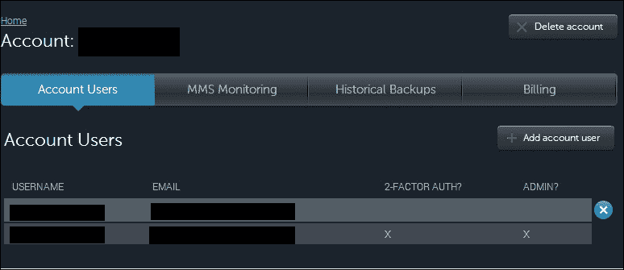

1.  要添加新帐户，请单击“+添加帐户用户”按钮。一个弹出窗口将要求输入用户名、电子邮件 ID 和密码。输入相关详细信息，然后单击“添加”按钮。

1.  单击用户，您应该被导航到一个页面，您可以在该页面更改用户名、电子邮件 ID 和密码。您可以通过在此屏幕上单击“更改为管理员”按钮将管理权限转移给用户。

1.  同样，通过单击自己的用户详细信息，您可以选择更改用户名、电子邮件 ID 和密码。

1.  单击“设置双因素身份验证”按钮以激活使用 Google Authenticator 的多因素身份验证。您需要在 Android、iOS 或 BlackBerry 手机上安装 Google Authenticator 才能继续设置多因素身份验证。

1.  单击按钮后，我们应该看到可以使用 Google Authenticator 扫描的 QR 码，或者如果无法扫描，可以单击 QR 码下面的 URL，这将显示代码。在 Google Authenticator 中手动设置基于时间的帐户。Google Authenticator 有两种类型的帐户，基于时间和基于计数器。

### 提示

请参阅[`en.wikipedia.org/wiki/Google_Authenticator`](http://en.wikipedia.org/wiki/Google_Authenticator)获取更多详细信息。

1.  同样，您可以通过单击“帐户用户”中用户行旁边的叉号来从帐户页面中删除用户。

## 工作原理…

在这一部分没有太多需要解释的。设置过程和用户管理非常简单。请注意，我们在这里添加的用户不是数据库用户。这些是可以访问 MongoLab 帐户的用户。**帐户**可以是组织的名称，并且可以在屏幕顶部看到。在手持设备上 Google Authenticator 软件中设置的多因素身份验证帐户不应被删除，因为每当用户从浏览器登录到 MongoLab 帐户时，他将被要求输入 Google Authenticator 帐户以继续。

# 在 MongoLab 上设置沙箱 MongoDB 实例

在上一篇文章中，我们看到了如何在 MongoLab 上设置帐户并向帐户添加用户。我们还没有看到如何在云上启动实例并使用它执行一些简单的操作。在这个配方中，这正是我们要做的事情。

## 准备工作

请参考前一篇文章，“设置和管理 MongoLab 帐户”，以在 MongoLab 上设置帐户。我们将设置一个免费的沙箱实例。我们将需要一种连接到这个已启动的`mongo`实例的方法，因此将需要一个仅随完整的 mongo 安装一起提供的 mongo shell，或者您可以选择使用您选择的编程语言来连接到已启动的`mongo`实例以执行操作。请参阅第三章，“编程语言驱动程序”中有关使用 Java 或 Python 客户端连接和执行操作的配方。

## 如何操作…

1.  转到主页，[`mongolab.com/home`](https://mongolab.com/home)，然后点击**创建新**按钮。

1.  选择云提供商，例如，我们选择亚马逊网络服务（AWS）：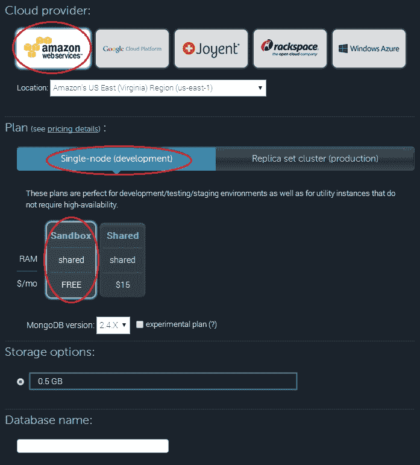

1.  点击**单节点（开发）**，然后选择**沙盒**选项。不要更改云服务器的位置，因为免费沙盒实例并非在所有数据中心都可用。由于这是一个沙盒，我们可以接受任何位置。

1.  为您的数据库添加任何名称；我选择的名称是`mongolab-test`。在输入名称后，点击**创建新的 MongoDB 部署**。

1.  这将带您到主页，现在应该可以看到数据库。点击实例名称。此页面显示所选的 MongoDB 实例的详细信息。在页面顶部提供了在 shell 或编程语言中连接的指示，以及已启动实例的公共主机名。

1.  点击**用户**选项卡，然后点击**添加数据库用户**按钮。在弹出窗口中，分别添加用户名和密码为`testUser`和`testUser`（或者您自己选择的任何用户名和密码）。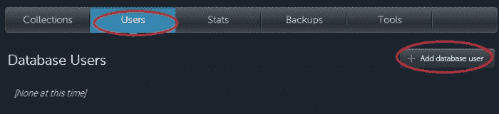

1.  添加用户后，按照以下步骤启动 mongo shell，假设数据库名称为`mongolab-test`，用户名和密码为`testUser`：

```go
$ mongo <host-name>/mongolab-test –u testUser –p testUser

```

连接后，在 shell 中执行以下操作，并检查数据库名称是否为`mongolab-test`：

```go
> db

```

1.  按以下方式向集合中插入一个文档：

```go
> db.messages.insert({_id:1, message:'Hello mongolab'})

```

1.  按以下方式查询集合：

```go
> db.messages.findOne()

```

## 工作原理…

执行的步骤非常简单，我们在云中创建了一个共享的沙盒实例。MongoLab 本身不托管实例，而是使用云提供商之一来托管。MongoLab 并不支持所有提供商的沙盒实例。沙盒实例的存储空间为 0.5 GB，并与同一台机器上的其他实例共享。共享实例比在专用实例上运行要便宜，但性能方面要付出代价。CPU 和 IO 与其他实例共享，因此我们共享实例的性能并不一定在我们的控制之下。对于生产用例，共享实例不是一个推荐的选项。同样，当在生产环境中运行时，我们需要设置一个副本集。如果我们看一下步骤 2 中的图像，我们会看到**单节点（开发）**选项旁边还有另一个选项卡。在这里，您可以选择机器的配置，包括 RAM 和磁盘容量（以及价格），并设置一个副本集。

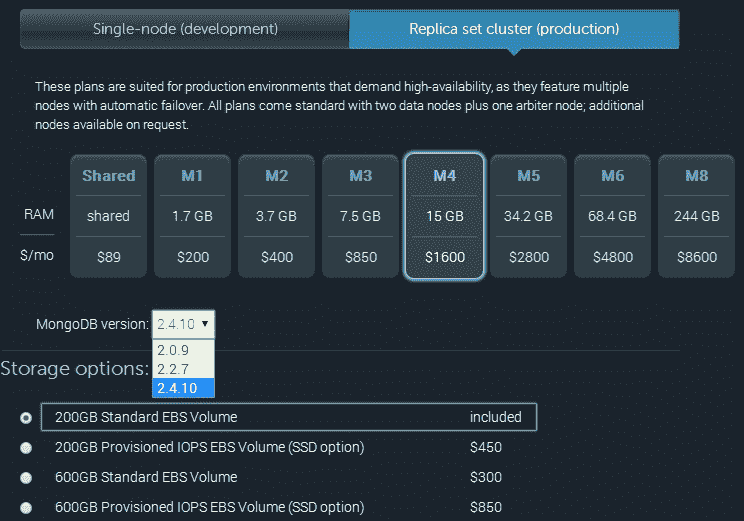

如您所见，您可以选择要使用的 MongoDB 版本。即使 MongoDB 发布了新版本，MongoLab 也不会立即开始支持，因为他们通常会等待几个次要版本的发布，然后才支持生产用户。此外，当我们选择配置时，默认可用的选项是两个数据节点和一个仲裁者，这对于大多数用例来说已经足够了。

所选择的 RAM 和磁盘完全取决于数据的性质以及查询密集程度或写入密集程度。这种大小选择是我们无论是在自己的基础设施上部署还是在云上部署都需要做的。工作集是在选择硬件的 RAM 之前必须了解的重要内容。概念验证和实验是为了处理数据的一个子集，然后可以对整个数据集进行估算。如果 IO 活动很高并且需要低 IO 延迟，您甚至可以选择 SSD，就像前面的图像中所示的那样。独立实例在可伸缩性方面与副本集一样好，除了可用性。因此，我们可以选择独立实例进行此类估算和开发目的。共享实例，无论是免费还是付费，都是开发目的的良好选择。请注意，与专用实例一样，共享实例不能按需重新启动。

我们选择哪个云服务提供商？如果您已经在云中部署了应用服务器，那么显然必须与您现有的供应商相同。建议您为应用服务器和数据库使用相同的云供应商，并确保它们都部署在同一位置，以最小化延迟并提高性能。如果您是从头开始的，那么请花些时间选择云服务提供商。查看应用程序所需的所有其他服务，例如存储、计算、其他服务（如邮件、通知服务等）。所有这些分析都超出了本书的范围，但一旦完成并确定了供应商，您可以相应地在 MongoLab 中选择要使用的供应商。就定价而言，所有主要供应商都提供有竞争力的定价。

# 从 MongoLab GUI 对 MongoDB 执行操作

在上一个步骤中，我们看到了如何在云中使用 MongoLab 为 MongoDB 设置一个简单的沙箱实例。在本步骤中，我们将在此基础上构建，并查看 MongoLab 从管理、管理、监控和备份的角度为您提供了哪些服务。

## 准备工作

请参阅上一个步骤，*在 MongoLab 上设置沙箱 MongoDB 实例*，了解如何在云中使用 MongoLab 设置沙箱实例。

## 如何做…

1.  转到[`mongolab.com/home`](https://mongolab.com/home)；您应该看到数据库、服务器和集群的列表。如果您遵循了上一个步骤，您应该会看到一个独立的数据库，`mongolab-test`（或者您为数据库选择的任何名称）。单击数据库名称，这应该会带您到数据库详细信息页面。

1.  单击**集合**选项卡后，应该默认选择，我们应该看到数据库中存在的集合列表。如果在执行本步骤之前执行了上一个步骤，您应该会在数据库中看到一个名为 messages 的集合。

1.  单击集合的名称，我们应该会被导航到集合详细信息页面，如下所示：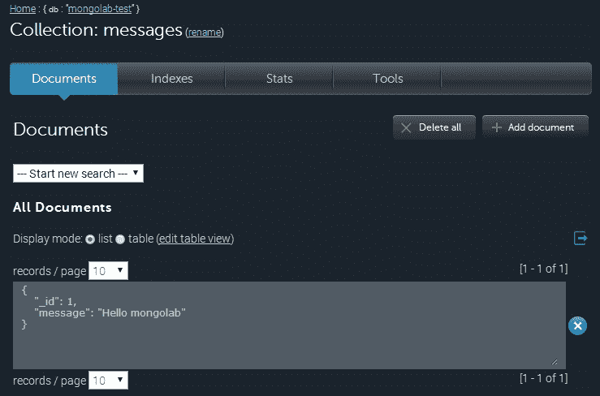

1.  单击**统计**选项以查看集合的统计信息。

1.  在**文档**选项卡中，我们可以查询集合。默认情况下，我们看到每页显示 10 个文档的所有文档，可以从每页记录下拉菜单中进行更改。可以选择的最大值为 100。

1.  还有另一种查看文档的方法，即作为表格。单击**显示**模式中的**表格**单选按钮，并单击链接以创建/编辑表视图。在显示的弹出窗口中，输入以下消息集合的文档，然后单击**提交**：

```go
{
    "id": "_id",
    "Message Text": "message"
}
```

在这样做的情况下，显示将会按以下方式更改：

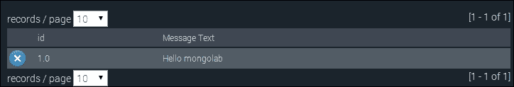

1.  从**--开始新搜索--**下拉菜单中，选择**[新搜索]**选项，如下图所示：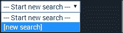

1.  使用新查询，我们看到以下字段，让我们输入查询字符串、排序顺序和投影。将查询输入为`{"_id":1}`，字段输入为`{"message":1, "_id":0}`：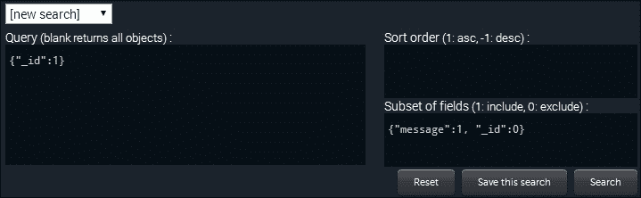

1.  您可以选择通过单击**保存此搜索**按钮并为要保存的查询命名来保存查询。

1.  可以通过单击每条记录旁边的叉号来删除单个文档。同样，顶部的**删除全部**按钮将删除集合的所有内容。

1.  类似地，单击**+添加文档**将弹出一个编辑器，用于输入要插入集合的文档。由于 MongoDB 是无模式的，文档不需要具有固定的字段集；应用程序应该能够理解它。

1.  转到`https://mongolab.com/databases/<your database name>（在本例中为 mongolab-test）`，也可以通过从主页单击数据库名称来到达。

1.  单击**统计**选项卡旁边的**用户**选项卡。在表中显示的内容是`db.stats()`命令的结果。

1.  类似地，单击**备份**选项卡，位于**统计**选项卡旁边的顶部。在这里，我们可以选择定期备份或一次性备份。

1.  当您单击**计划定期备份**时，会弹出一个窗口，让您输入调度的详细信息，例如备份的频率，需要进行备份的时间以及要保留的备份数量。

1.  备份位置可以选择为 MongoLab 自己的 S3 存储桶或 Rackspace 云文件。您可以选择使用自己帐户的存储空间，在这种情况下，您将不得不共享 AWS 访问密钥/秘密密钥或 Rackspace 的 UserID/API 密钥。

## 工作原理...

步骤 1 到 5 非常简单。在第 6 步，我们提供了一个 JSON 文档，以表格格式显示结果。文档的格式如下：

```go
{
  <display column 1> : <name of the field in the JSON document> ,
  <display column 2> : <name of the field in the JSON document> ,

  <display column n> : <name of the field in the JSON document> 
}
```

键是要显示的列的名称，值是实际文档中字段的名称，其值将显示为此列的值。为了更清楚地理解，请查看为消息集合定义的文档，然后查看显示的表格数据。以下是我们提供的 JSON 文档，其中将列的名称作为键的值，并将文档中的实际字段作为列的值：

```go
{
    "id": "_id",
    "Message Text": "message"
}
```

请注意，这里的 JSON 文档的字段名称和值都用引号括起来。Mongo shell 在这方面很宽松，允许我们在不使用引号的情况下给出字段名称。

如果我们访问关于备份的第 16 步，我们会发现备份要么存储在 MongoLab 的 AWS S3/Rackspace 云文件中，要么存储在您自定义的 AWS S3 存储桶/Rackspace 云文件中。在后一种情况下，您需要与 MongoLab 共享您的 AWS/Rackspace 凭据。如果这是一个问题，并且凭据可能被用来访问其他资源，建议您创建一个单独的帐户，并将其用于从 MongoLab 进行备份。您还可以使用创建的备份来从 MongoLab 创建一个新的 MongoDB 服务器实例。不用说，如果您使用自己的 AWS S3 存储桶/Rackspace 云文件，存储费用是额外的，因为它们不是 MongoLab 费用的一部分。

有一些值得一提的重要点。MongoLab 为各种操作提供了 REST API。 REST API 可以用来代替标准驱动程序执行 CRUD 操作；但是，使用 MongoDB 客户端库是推荐的方法。现在使用 REST API 而不是语言驱动程序的一个很好的理由是，如果客户端通过公共网络连接到 MongoDB 服务器。我们在本地机器上启动的 shell 连接到云上的 MongoDB 服务器会将未加密的数据发送到服务器，这使其容易受到攻击。另一方面，如果使用 REST API，流量将通过安全通道发送，因为使用了 HTTPS。MongoLab 计划在未来支持客户端和服务器之间通信的安全通道，但在撰写本书时，这是不可用的。如果应用程序和数据库位于云提供商的同一数据中心，则您是安全的，并且可以依赖云提供商为其本地网络提供的安全性，这通常不是一个问题。但是，除了确保您的数据不通过公共网络传输之外，您无法做任何安全通信的事情。

还有一种情况是 MongoLab 无法使用的，那就是当您希望实例在您自己的虚拟机实例上运行，而不是由 MongoLab 选择的实例，或者当我们希望应用程序在虚拟专用云中。云提供商确实提供诸如 Amazon VPC 之类的服务，其中 AWS 云的一部分可以被视为您网络的一部分。如果您打算在这样的环境中部署 MongoDB 实例，那么 MongoLab 将无法使用。

# 在 Amazon EC2 上手动设置 MongoDB

在之前的几个配方中，我们看到了如何使用 MongoLab 提供的托管服务在云中启动 MongoDB，该服务为我们提供了在所有主要云供应商上设置 MongoDB 的替代方案。但是，如果我们计划自己托管和监控实例以获得更大的控制权，或者在我们自己的虚拟私有云中设置，我们可以自己做。虽然各个云供应商的流程有所不同，但我们将使用 AWS 进行演示。有几种方法可以做到这一点，但在这个配方中，我们将使用**Amazon Machine Image**（**AMI**）。AMI 是一个模板，包含了启动云上新虚拟机实例时将使用的操作系统、软件等详细信息。要了解更多关于 AMI 的信息，请参考[`en.wikipedia.org/wiki/Amazon_Machine_Image`](http://en.wikipedia.org/wiki/Amazon_Machine_Image)。

谈到 AWS EC2，它代表弹性云计算，是一个让您在云中创建、启动和停止不同配置的服务器的服务，运行您选择的操作系统。（价格也相应不同。）同样，亚马逊**弹性块存储**（**EBS**）是一个提供高可用性和低延迟的持久块存储的服务。初始时，每个实例都附有一个称为临时存储的存储。这是一个临时存储，当实例重新启动时，数据可能会丢失。因此，EBS 块存储被附加到 EC2 实例上，以保持持久性，即使实例停止然后重新启动。标准 EBS 不提供每秒保证的最小**IO 操作**（**IOPS**）。对于中等工作负载，大约 100 IOPS 的默认值是可以的。但是，对于高性能 IO，也可以使用具有保证 IOPS 的 EBS 块。与标准 EBS 块相比，价格更高，但如果低 IO 速率可能成为系统性能瓶颈的话，这是一个不错的选择。

在这个配方中，我们将设置一个小型微实例，作为一个足够好的沙盒实例，并附加一个 EBS 块卷。

## 准备工作

首先，您需要做的是注册一个 AWS 账户。访问[`aws.amazon.com/`](http://aws.amazon.com/)，然后点击**注册**。如果您有亚马逊账户，请登录，否则，请创建一个新账户。尽管我们这里使用的配方将使用免费的微实例，但您仍需要提供信用卡信息，除非我们另有明确说明。我们将使用 Putty 连接到云上的实例。如果您的机器上尚未安装 Putty，可以下载并安装。下载地址为[`www.putty.org/`](http://www.putty.org/)。

对于使用 AMI 进行安装的特定配方，我们不能使用微实例，而必须使用标准大型实例。您可以在[`aws.amazon.com/ec2/pricing/`](https://aws.amazon.com/ec2/pricing/)上获取不同地区 EC2 实例定价的更多详细信息。根据地理和财务因素选择适当的地区。

1.  首先，您需要做的是创建一个密钥对，以防您尚未创建。从 1 到 5 的以下步骤仅用于创建密钥对。此密钥对将用于从 Putty 客户端登录到云中启动的 Unix 实例。如果密钥对已经创建并且`.pem`文件对您可用，请跳到第 6 步。

1.  转到[`console.aws.amazon.com/ec2/`](https://console.aws.amazon.com/ec2/)，确保右上角显示的地区（如下图所示）与您计划设置实例的地区相同。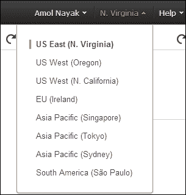

1.  选择区域后，**资源**标题的页面将显示该区域的所有实例、密钥对、IP 地址等。单击**密钥对**链接，这将引导您到显示所有现有密钥对并且您可以创建新密钥对的页面。

1.  单击**创建密钥对**按钮，在弹出窗口中输入您选择的任何名称。假设我们称之为`EC2 测试密钥对`，然后单击**创建**。

1.  创建后，将生成一个`.pem`文件。确保保存该文件，因为随后需要访问该机器。

1.  接下来，我们将把这个`.pem`文件转换为一个`.ppk`文件，以便与 Putty 一起使用。

1.  打开 puttygen；如果尚未提供，可以从[`www.chiark.greenend.org.uk/~sgtatham/putty/download.html`](http://www.chiark.greenend.org.uk/~sgtatham/putty/download.html)下载。

您应该在屏幕上看到以下内容：

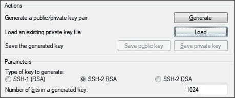

1.  选择**SSH-2 RSA**选项，然后单击**加载**按钮。在文件对话框中，选择**所有文件**，然后选择与在 EC2 控制台中生成的密钥对一起下载的`.pem`文件。

1.  一旦导入了`.pem`文件，单击**保存私钥**选项，并使用任何名称保存文件；这次文件是`.ppk`文件。将此文件保存以便将来从 putty 登录到 EC2 实例。

### 注意

如果您使用的是 Mac OS X 或 Linux，可以使用`ssh-keygen`实用程序生成 SSH 密钥。

## 如何操作…

1.  转到[`console.aws.amazon.com/ec2/`](https://console.aws.amazon.com/ec2/)，然后单击左侧的**实例**选项，然后单击**启动实例**按钮：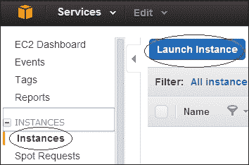

1.  由于我们想要启动一个免费的微实例，在左侧勾选**仅限免费套餐**复选框。在右侧，选择我们想要设置的实例。我们选择使用**Ubuntu 服务器**。单击**选择**以导航到下一个窗口。

1.  选择微实例，然后单击**审阅和启动**。忽略安全警告；您将拥有的默认安全组将接受来自公共网络上所有主机的端口 22 的连接。

1.  不更改任何默认设置，单击**启动**。启动后，将弹出一个窗口，让您选择现有的密钥对。如果您继续没有密钥对，您将需要密码或需要创建一个新的密钥对。在上一篇文章中，我们已经创建了一个密钥对，这就是我们将在这里使用的内容。

1.  单击**启动实例**以启动新的微实例。

1.  参考上一篇文章中第 9 至 12 步，了解如何使用 Putty 连接到已启动的实例。请注意，这次我们将使用 Ubuntu 用户，而不是上一篇文章中使用的`ec2-user`，因为这次我们使用的是 Ubuntu 而不是 Amazon Linux。

1.  在添加 MongoDB 存储库之前，我们需要按照以下步骤导入 MongoDB 公钥：

```go
$ sudo apt-key adv --keyserver hkp://keyserver.ubuntu.com:80 --recv 7F0CEB10

```

1.  在操作系统 shell 中执行以下命令：

```go
$ echo "deb http://repo.mongodb.org/apt/ubuntu trusty/mongodb-org/3.0 multiverse" | sudo tee /etc/apt/sources.list.d/mongodb-org-3.0.list

```

1.  通过执行以下命令加载本地数据库：

```go
$ sudo apt-get install mongodb-org

```

1.  执行以下命令以创建所需的目录：

```go
$ sudo mkdir /data /log

```

1.  按照以下步骤启动`mongod`进程：

```go
$ sudo mongod --dbpath /data --logpath /log/mongodb.log --smallfiles --oplogsize 50 –fork

```

为了确保服务器进程正在运行，执行以下命令，并且我们应该在日志中看到以下内容：

```go
$ tail /log/mongodb.log
2015-05-04T13:41:16.533+0000 [initandlisten] journal dir=/data/journal
2015-05-04T13:41:16.534+0000 [initandlisten] recover : no journal files present, no recovery needed
2015-05-04T13:41:16.628+0000 [initandlisten] waiting for connections on port 27017

```

1.  按照以下步骤启动 mongo shell 并执行以下命令：

```go
$ mongo
> db.ec2Test.insert({_id: 1, message: 'Hello World !'})
> db.ec2Test.findOne()

```

## 工作原理…

许多步骤都是不言自明的。建议您至少阅读前一篇文章，因为那里解释了许多概念。在前一篇文章中解释的大多数概念也适用于这里。这一节中解释了一些不同的地方。对于安装，我们选择了 Ubuntu，而不是使用 AMI 设置服务器时的标准 Amazon Linux。不同的操作系统在安装方面有不同的步骤。请参阅[`docs.mongodb.org/manual/installation/`](http://docs.mongodb.org/manual/installation/)，了解如何在不同平台上安装 MongoDB 的步骤。本文中步骤 7 至 9 是特定于在 Ubuntu 上安装 MongoDB 的。请参阅[`help.ubuntu.com/12.04/serverguide/apt-get.html`](https://help.ubuntu.com/12.04/serverguide/apt-get.html)，了解我们在这里执行的`apt-get`命令的更多细节，以安装 MongoDB。

在我们的情况下，我们选择将数据、日志和日志文件夹放在同一个 EBS 卷上。这是因为我们设置的是一个`dev`实例。在`prod`实例的情况下，有不同的 EBS 卷，为了最佳性能，有预留的 IOPS。这种设置使我们能够利用这样一个事实，即这些不同的卷有不同的控制器，因此可以进行并发写操作。预留 IOPS 的 EBS 卷由 SSD 驱动器支持。[`docs.mongodb.org/manual/administration/production-notes/`](http://docs.mongodb.org/manual/administration/production-notes/)上的生产部署说明指出，MongoDB 部署应该由 RAID-10 磁盘支持。在 AWS 上部署时，优先选择 PIOPS 而不是 RAID-10。例如，如果需要 4000 IOPS，则选择具有 4000 IOPS 的 EBS 卷，而不是具有 2 X 2000 IOPS 或 4 X 1000 IOPS 设置的 RAID-10 设置。这不仅消除了不必要的复杂性，而且使得可以对单个磁盘进行快照，而不是处理 RAID-10 设置中的多个磁盘。谈到快照，大多数生产部署中的日志和数据是写入到不同的卷中的。这是快照无法工作的情况。我们需要刷新 DB 写入，锁定数据以进行进一步的写入，直到备份完成，然后释放锁定。有关快照和备份的更多详细信息，请参阅[`docs.mongodb.org/manual/tutorial/backup-with-filesystem-snapshots/`](http://docs.mongodb.org/manual/tutorial/backup-with-filesystem-snapshots/)。

请参阅[`docs.mongodb.org/ecosystem/platforms/`](http://docs.mongodb.org/ecosystem/platforms/)，了解在不同云提供商上部署的更多详细信息。有一个专门针对 Amazon EC2 实例备份的部分。在生产部署中，最好使用 AMI 来设置 MongoDB 实例，就像在前一篇文章中演示的那样，而不是手动设置实例。手动设置适用于小型开发目的，而具有预留 IOPS 的 EBS 卷的大型实例则过于复杂。

## 另请参阅

+   云形成是一种可以定义模板并自动化 EC2 实例创建的方式。您可以在[`aws.amazon.com/cloudformation/`](https://aws.amazon.com/cloudformation/)了解更多云形成是什么，并参考[`mongodb-documentation.readthedocs.org/en/latest/ecosystem/tutorial/automate-deployment-with-cloudformation.html`](https://mongodb-documentation.readthedocs.org/en/latest/ecosystem/tutorial/automate-deployment-with-cloudformation.html)。

+   另一种选择是使用 Mongo 的云服务：[`docs.cloud.mongodb.com/tutorial/nav/add-servers-through-aws-integration/`](https://docs.cloud.mongodb.com/tutorial/nav/add-servers-through-aws-integration/)。

+   您可以通过参考维基百科上的这两个 URL 了解有关 RAID 的更多信息：[`en.wikipedia.org/wiki/Standard_RAID_levels`](http://en.wikipedia.org/wiki/Standard_RAID_levels)和[`en.wikipedia.org/wiki/Nested_RAID_levels`](http://en.wikipedia.org/wiki/Nested_RAID_levels)。这里给出的描述非常全面。

# 使用 Docker 容器设置 MongoDB

容器移动，我喜欢称之为，已经触及了信息技术的几乎所有方面。作为首选工具的 Docker 对于创建和管理容器至关重要。

在本教程中，我们将在 Ubuntu（14.04）服务器上安装 Docker 并在容器中运行 MongoDB。

## 准备工作

1.  首先，我们需要在我们的 Ubuntu 服务器上安装 Docker，可以通过运行此命令来完成：

```go
$ wget -qO- https://get.docker.com/ | sh

```

1.  启动 Docker 服务：

```go
$ service docker start 
> docker start/running, process 24369

```

1.  确认 Docker 是否正在运行如下：

```go
$ docker info
> Containers: 40
> Images: 311
> Storage Driver: aufs
>  Root Dir: /var/lib/docker/aufs
>  Dirs: 395
> Execution Driver: native-0.2
> Kernel Version: 3.13.0-37-generic
> Operating System: Ubuntu 14.04.2 LTS
> WARNING: No swap limit support

```

## 如何做…

1.  从 Docker Hub 获取默认的 MongoDB 图像如下：

```go
$ docker pull mongo

```

1.  让我们确认图像是否已安装以下命令：

```go
$ docker images | grep mongo

```

1.  启动 MongoDB 服务器：

```go
$ docker run -d  --name mongo-server-1 mongo
> dfe7684dbc057f2d075450e3c6c96871dea98ff6b78abe72944360f4c239a72e

```

或者，您也可以运行`docker ps`命令来检查正在运行的容器列表。

1.  获取此容器的 IP：

```go
$ docker inspect mongo-server-1 | grep IPAddress
> "IPAddress": "172.17.0.3",

```

1.  使用 mongo 客户端连接到我们的新容器：

```go
$ mongo  172.17.0.3
>MongoDB shell version: 3.0.4
> connecting to: 172.17.0.3/test
> 

```

1.  在服务器上创建一个目录：

```go
$ mkdir –p /data/db2

```

1.  启动一个新的 MongoDB 容器：

```go
$ docker run -d --name mongo-server-2 -v /data/db1:/data/db mongo

```

1.  获取此新容器的 IP，如第 4 步所述，并使用 Mongo 客户端进行连接：

```go
$ docker inspect mongo-server-2 | grep IPAddress
> "IPAddress": "172.17.0.4",
$ mongo  172.17.0.4
>MongoDB shell version: 3.0.4
> connecting to: 172.17.0.4/test
> 

```

1.  让我们为我们的最终容器创建另一个目录：

```go
$ mkdir –p /data/db3 

```

启动一个新的 MongoDB 容器：

```go
$ docker run -d --name mongo-server-3  -v /data/db3:/data/db -p 9999:27017 mongo

```

1.  让我们通过 localhost 连接到这个容器：

```go
$ mongo localhost:9999
> MongoDB shell version: 3.0.4
> connecting to: localhost:9999/test

```

## 它是如何工作的…

我们首先从 DockerHub（[`hub.docker.com/_/mongo/`](https://hub.docker.com/_/mongo/)）下载默认的 MongoDB 图像。Docker 图像是为其应用程序定制的自持续 OS 图像。所有 Docker 容器都是这些图像的隔离执行。这与使用 OS 模板创建虚拟机非常相似。

图像下载操作默认为获取最新的稳定的 MongoDB 图像，但您可以通过提及标签来指定您选择的版本，例如`docker pull mongo:2.8`。

我们通过运行`docker images`命令来验证图像是否已下载，该命令将列出服务器上安装的所有图像。在第 3 步，我们使用名称`mongo-server-1`在分离（-d）模式下启动容器，使用我们的 mongo 图像。描述容器内部可能超出了本教程的范围，但简而言之，我们现在在我们的 Ubuntu 机器内部运行一个隔离的`docker 伪服务器`。

默认情况下，每个 Docker 容器都会被 docker 服务器分配一个 RFC 1918（不可路由）的 IP 地址空间。为了连接到这个容器，我们在第 4 步获取 IP 地址，并在第 5 步连接到`mongodb`实例。

但是，每个 Docker 容器都是短暂的，因此销毁容器意味着丢失数据。在第 6 步，我们创建一个本地目录，用于存储我们的 mongo 数据库。在第 7 步中启动一个新的容器；它类似于我们之前的命令，但增加了 Volumes（-v）开关。在我们的示例中，我们将`/data/db2`目录暴露给 mongo 容器命名空间作为`/data/db`。这类似于 NFS 样的文件挂载，但在内核命名空间的限制内。

最后，如果我们希望外部系统连接到此容器，我们将容器的端口绑定到主机的端口。在第 9 步，我们使用端口（-p）开关将 Ubuntu 服务器上的 TCP `9999`端口绑定到此容器的 TCP `27017`端口。这确保任何连接到服务器端口`9999`的外部系统将被路由到这个特定的容器。

## 另请参阅

您还可以尝试使用 docker 命令的 Link（-l）命令行参数链接两个容器。

有关更多信息，请访问[`docs.docker.com/userguide/dockerlinks/`](http://docs.docker.com/userguide/dockerlinks/)。
