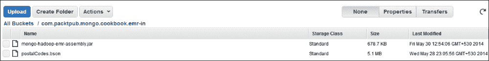
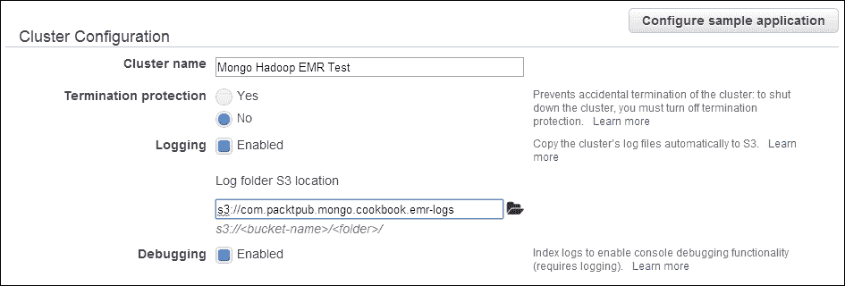
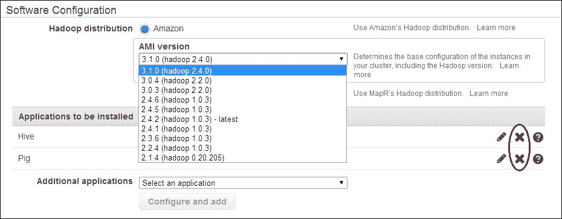
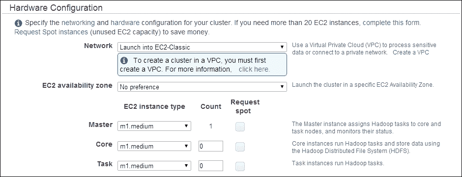
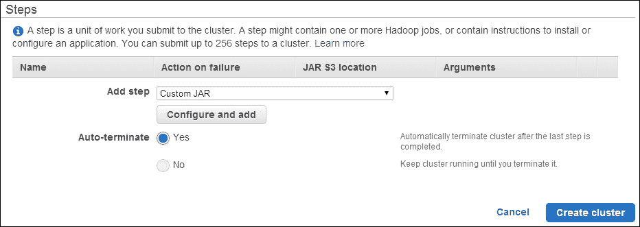
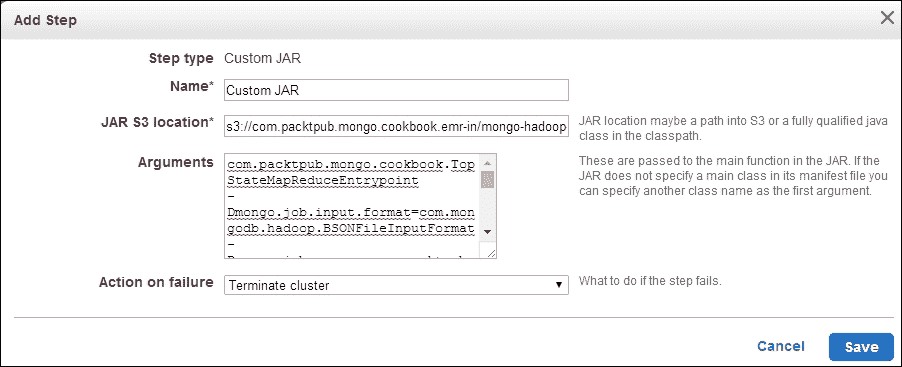
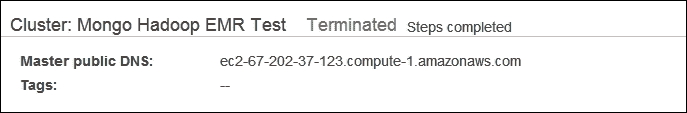
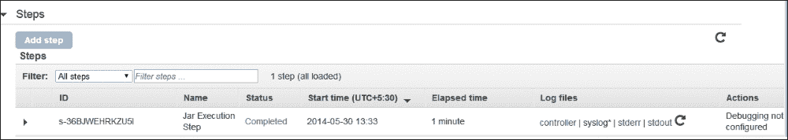

# 第八章：与 Hadoop 集成

在本章中，我们将涵盖以下示例：

+   使用 mongo-hadoop 连接器执行我们的第一个样本 MapReduce 作业

+   编写我们的第一个 Hadoop MapReduce 作业

+   在 Hadoop 上使用流式处理运行 MapReduce 作业

+   在 Amazon EMR 上运行 MapReduce 作业

# 介绍

Hadoop 是一个众所周知的用于处理大型数据集的开源软件。它还有一个用于 MapReduce 编程模型的 API，被广泛使用。几乎所有的大数据解决方案都有某种支持，以便将它们与 Hadoop 集成，以使用其 MapReduce 框架。MongoDB 也有一个连接器，可以与 Hadoop 集成，让我们使用 Hadoop MapReduce API 编写 MapReduce 作业，处理驻留在 MongoDB/MongoDB 转储中的数据，并将结果写入 MongoDB/MongoDB 转储文件。在本章中，我们将看一些关于基本 MongoDB 和 Hadoop 集成的示例。

# 使用 mongo-hadoop 连接器执行我们的第一个样本 MapReduce 作业

在这个示例中，我们将看到如何从源代码构建 mongo-hadoop 连接器，并设置 Hadoop，以便仅用于在独立模式下运行示例。连接器是在 Mongo 中使用数据运行 Hadoop MapReduce 作业的支柱。

## 准备工作

Hadoop 有各种发行版；但是，我们将使用 Apache Hadoop ([`hadoop.apache.org/`](http://hadoop.apache.org/))。安装将在 Ubuntu Linux 上进行。Apache Hadoop 始终在 Linux 环境下运行用于生产，Windows 未经过生产系统测试。开发目的可以使用 Windows。如果您是 Windows 用户，我建议您安装虚拟化环境，如 VirtualBox ([`www.virtualbox.org/`](https://www.virtualbox.org/))，设置 Linux 环境，然后在其上安装 Hadoop。在这个示例中没有展示设置 VirtualBox 和 Linux，但这不是一项繁琐的任务。这个示例的先决条件是一台安装了 Linux 操作系统的机器和一个互联网连接。我们将在这里设置 Apache Hadoop 的 2.4.0 版本。在撰写本书时，mongo-hadoop 连接器支持的最新版本是 2.4.0。

需要 Git 客户端来克隆 mongo-hadoop 连接器的存储库到本地文件系统。参考[`git-scm.com/book/en/Getting-Started-Installing-Git`](http://git-scm.com/book/en/Getting-Started-Installing-Git)来安装 Git。

您还需要在操作系统上安装 MongoDB。参考[`docs.mongodb.org/manual/installation/`](http://docs.mongodb.org/manual/installation/)并相应地安装它。启动监听端口`27017`的`mongod`实例。不需要您成为 Hadoop 的专家，但对它有一些了解会有所帮助。了解 MapReduce 的概念很重要，了解 Hadoop MapReduce API 将是一个优势。在这个示例中，我们将解释完成工作所需的内容。您可以从其他来源获取有关 Hadoop 及其 MapReduce API 的更多详细信息。维基页面[`en.wikipedia.org/wiki/MapReduce`](http://en.wikipedia.org/wiki/MapReduce)提供了有关 MapReduce 编程的一些很好的信息。

## 如何做…

1.  我们将首先安装 Java、Hadoop 和所需的软件包。我们将从在操作系统上安装 JDK 开始。在操作系统的命令提示符上键入以下内容：

```go
$ javac –version

```

1.  如果程序无法执行，并告知您包含 javac 和程序的各种软件包，则需要按照以下方式安装 Java：

```go
$ sudo apt-get install default-jdk

```

这就是我们安装 Java 所需要做的一切。

1.  从[`www.apache.org/dyn/closer.cgi/hadoop/common/`](http://www.apache.org/dyn/closer.cgi/hadoop/common/)下载当前版本的 Hadoop，并下载 2.4.0 版本（或最新的 mongo-hadoop 连接器支持）。

1.  在下载`.tar.gz`文件后，在命令提示符上执行以下操作：

```go
$ tar –xvzf <name of the downloaded .tar.gz file>
$ cd <extracted directory>

```

打开`etc/hadoop/hadoop-env.sh`文件，并将`export JAVA_HOME = ${JAVA_HOME}`替换为`export JAVA_HOME = /usr/lib/jvm/default-java`。

现在，我们将在本地文件系统上从 GitHub 获取 mongo-hadoop 连接器代码。请注意，您无需 GitHub 帐户即可克隆存储库。请按照以下操作系统命令提示符中的 Git 项目进行克隆：

```go
$git clone https://github.com/mongodb/mongo-hadoop.git
$cd mongo-hadoop 

```

1.  创建软链接- Hadoop 安装目录与我们在第 3 步中提取的目录相同：

```go
$ln –s <hadoop installation directory> ~/hadoop-binaries

```

例如，如果 Hadoop 在主目录中提取/安装，则应执行以下命令：

```go
$ln –s ~/hadoop-2.4.0 ~/hadoop-binaries

```

默认情况下，mongo-hadoop 连接器将在`〜/hadoop-binaries`文件夹下查找 Hadoop 分发。因此，即使 Hadoop 存档在其他位置提取，我们也可以创建软链接。创建软链接后，我们应该在`〜/hadoop-binaries/hadoop-2.4.0/bin`路径中拥有 Hadoop 二进制文件。

1.  现在，我们将从源代码为 Apache Hadoop 版本 2.4.0 构建 mongo-hadoop 连接器。默认情况下，构建最新版本，因此现在可以省略`-Phadoop_version`参数，因为 2.4 是最新版本。

```go
$./gradlew jar –Phadoop_version='2.4'

```

此构建过程将需要一些时间才能完成。

1.  构建成功后，我们将准备执行我们的第一个 MapReduce 作业。我们将使用 mongo-hadoop 连接器项目提供的`treasuryYield`示例来执行此操作。第一步是将数据导入 Mongo 的集合中。

1.  假设`mongod`实例正在运行并监听端口`27017`进行连接，并且当前目录是 mongo-hadoop 连接器代码库的根目录，请执行以下命令：

```go
$ mongoimport -c yield_historical.in -d mongo_hadoop --drop examples/treasury_yield/src/main/resources/yield_historical_in.json

```

1.  导入操作成功后，我们需要将两个 jar 文件复制到`lib`目录中。在操作系统 shell 中执行以下操作：

```go
$ wget http://repo1.maven.org/maven2/org/mongodb/mongo-java-driver/2.12.0/mongo-java-driver-2.12.0.jar
$ cp core/build/libs/mongo-hadoop-core-1.2.1-SNAPSHOT-hadoop_2.4.jar ~/hadoop-binaries/hadoop-2.4.0/lib/
$ mv mongo-java-driver-2.12.0.jar ~/hadoop-binaries/hadoop-2.4.0/lib

```

### 注意

为了 mongo-hadoop 核心构建的 JAR 文件要复制，根据代码的前面部分和为 Hadoop-2.4.0 构建的版本，更改 JAR 的名称。当您为连接器和 Hadoop 的不同版本自行构建时，Mongo 驱动程序可以是最新版本。在撰写本书时，版本 2.12.0 是最新版本。

1.  现在，在操作系统 shell 的命令提示符上执行以下命令：

```go
 ~/hadoop-binaries/hadoop-2.4.0/bin/hadoop     jar     examples/treasury_yield/build/libs/treasury_yield-1.2.1-SNAPSHOT-hadoop_2.4.jar  \com.mongodb.hadoop.examples.treasury.TreasuryYieldXMLConfig  \-Dmongo.input.split_size=8     -Dmongo.job.verbose=true  \-Dmongo.input.uri=mongodb://localhost:27017/mongo_hadoop.yield_historical.in  \-Dmongo.output.uri=mongodb://localhost:27017/mongo_hadoop.yield_historical.out

```

1.  输出应该打印出很多内容；但是，输出中的以下行告诉我们 MapReduce 作业成功：

```go
 14/05/11 21:38:54 INFO mapreduce.Job: Job job_local1226390512_0001 completed successfully

```

1.  从 mongo 客户端连接运行在本地主机上的`mongod`实例，并对以下集合执行查找：

```go
$ mongo
> use mongo_hadoop
switched to db mongo_hadoop
> db.yield_historical.out.find()

```

## 工作原理…

安装 Hadoop 并不是一项简单的任务，我们不需要进行这项工作来尝试 hadoop-mongo 连接器的示例。有专门的书籍和文章可供学习 Hadoop、其安装和其他内容。在本章中，我们将简单地下载存档文件，提取并以独立模式运行 MapReduce 作业。这是快速入门 Hadoop 的最快方式。在步骤 6 之前的所有步骤都是安装 Hadoop 所需的。在接下来的几个步骤中，我们将克隆 mongo-hadoop 连接器配方。如果您不想从源代码构建，也可以在[`github.com/mongodb/mongo-hadoop/releases`](https://github.com/mongodb/mongo-hadoop/releases)下载适用于您 Hadoop 版本的稳定版本。然后，我们为我们的 Hadoop 版本（2.4.0）构建连接器，直到第 13 步。从第 14 步开始，我们将运行实际的 MapReduce 作业来处理 MongoDB 中的数据。我们将数据导入到`yield_historical.in`集合中，这将作为 MapReduce 作业的输入。继续使用`mongo_hadoop`数据库在 mongo shell 中查询集合，以查看文档。如果您不理解内容，不用担心；我们想要看到这个示例中的数据意图。

下一步是在数据上调用 MapReduce 操作。执行 Hadoop 命令，给出一个 jar 的路径（`examples/treasury_yield/build/libs/treasury_yield-1.2.1-SNAPSHOT-hadoop_2.4.jar`）。这个 jar 包含了实现国库收益率样本 MapReduce 操作的类。在这个 JAR 文件中的`com.mongodb.hadoop.examples.treasury.TreasuryYieldXMLConfig`类是包含主方法的引导类。我们很快就会访问这个类。连接器支持许多配置。完整的配置列表可以在[`github.com/mongodb/mongo-hadoop/`](https://github.com/mongodb/mongo-hadoop/)找到。现在，我们只需要记住`mongo.input.uri`和`mongo.output.uri`是 map reduce 操作的输入和输出集合。

项目克隆后，您现在可以将其导入到您选择的任何 Java IDE 中。我们特别感兴趣的是位于`/examples/treasury_yield`的项目和位于克隆存储库根目录中的核心。

让我们看一下`com.mongodb.hadoop.examples.treasury.TreasuryYieldXMLConfig`类。这是 MapReduce 方法的入口点，并在其中有一个主方法。要使用 mongo-hadoop 连接器为 mongo 编写 MapReduce 作业，主类始终必须扩展自`com.mongodb.hadoop.util.MongoTool`。这个类实现了`org.apache.hadoop.Tool`接口，该接口具有 run 方法，并由`MongoTool`类为我们实现。主方法需要做的就是使用`org.apache.hadoop.util.ToolRunner`类执行这个类，通过调用其静态`run`方法传递我们的主类的实例（这是`Tool`的实例）。

有一个静态块，从两个 XML 文件`hadoop-local.xml`和`mongo-defaults.xml`中加载一些配置。这些文件（或任何 XML 文件）的格式如下。文件的根节点是具有多个属性节点的配置节点：

```go
<configuration>
  <property>
    <name>{property name}</name> 
    <value>{property value}</value>
  </property>
  ...
</configuration>
```

在这种情况下有意义的属性值是我们之前提到的 URL 中提供的所有值。我们在引导类`TreasuryYieldXmlConfig`的构造函数中实例化`com.mongodb.hadoop.MongoConfig`，将`org.apache.hadoop.conf.Configuration`的实例包装起来。`MongoConfig`类提供了合理的默认值，这足以满足大多数用例。我们需要在`MongoConfig`实例中设置的一些最重要的事情是输出和输入格式、`mapper`和`reducer`类、mapper 的输出键和值，以及 reducer 的输出键和值。输入格式和输出格式将始终是`com.mongodb.hadoop.MongoInputFormat`和`com.mongodb.hadoop.MongoOutputFormat`类，这些类由 mongo-hadoop 连接器库提供。对于 mapper 和 reducer 的输出键和值，我们有任何`org.apache.hadoop.io.Writable`实现。有关`org.apache.hadoop.io`包中不同类型的 Writable 实现，请参考 Hadoop 文档。除此之外，mongo-hadoop 连接器还在`com.mongodb.hadoop.io`包中为我们提供了一些实现。对于国库收益率示例，我们使用了`BSONWritable`实例。这些可配置的值可以在之前看到的 XML 文件中提供，也可以以编程方式设置。最后，我们可以选择将它们作为`vm`参数提供，就像我们为`mongo.input.uri`和`mongo.output.uri`所做的那样。这些参数可以在 XML 中提供，也可以直接从代码中在`MongoConfig`实例上调用；这两种方法分别是`setInputURI`和`setOutputURI`。

现在我们将看一下`mapper`和`reducer`类的实现。我们将在这里复制类的重要部分以进行分析。有关整个实现，请参考克隆的项目：

```go
public class TreasuryYieldMapper
    extends Mapper<Object, BSONObject, IntWritable, DoubleWritable> {

    @Override
    public void map(final Object pKey,
                    final BSONObject pValue,
                    final Context pContext)
        throws IOException, InterruptedException {
        final int year = ((Date) pValue.get("_id")).getYear() + 1900;
        double bid10Year = ((Number) pValue.get("bc10Year")).doubleValue();
        pContext.write(new IntWritable(year), new DoubleWritable(bid10Year));
    }
}
```

我们的 mapper 扩展了`org.apache.hadoop.mapreduce.Mapper`类。四个通用参数是键类、输入值类型、输出键类型和输出值类型。map 方法的主体从输入文档中读取`_id`值，即日期，并从中提取年份。然后，它从文档中获取`bc10Year`字段的双值，并简单地写入上下文键值对，其中键是年份，双值是上下文键值对的值。这里的实现不依赖于传递的`pKey`参数的值，可以使用该值作为键，而不是在实现中硬编码`_id`值。该值基本上是使用 XML 中的`mongo.input.key`属性或`MongoConfig.setInputKey`方法设置的相同字段。如果没有设置，`_id`是默认值。

让我们来看一下 reducer 的实现（删除了日志记录语句）：

```go
public class TreasuryYieldReducer extends Reducer<IntWritable, DoubleWritable, IntWritable, BSONWritable> {

    @Override
    public void reduce(final IntWritable pKey, final Iterable<DoubleWritable> pValues, final Context pContext)throws IOException, InterruptedException {
      int count = 0;
      double sum = 0;
      for (final DoubleWritable value : pValues) {
        sum += value.get();
        count++;
      }
      final double avg = sum / count;
      BasicBSONObject output = new BasicBSONObject();
      output.put("count", count);
      output.put("avg", avg);
      output.put("sum", sum);
      pContext.write(pKey, new BSONWritable(output));
    }
}
```

这个类扩展自`org.apache.hadoop.mapreduce.Reducer`，有四个通用参数：输入键、输入值、输出键和输出值。reducer 的输入是 mapper 的输出，因此，如果你仔细观察，你会发现前两个通用参数的类型与我们之前看到的 mapper 的最后两个通用参数相同。第三和第四个参数是从 reduce 中发出的键和值的类型。值的类型是`BSONDocument`，因此我们有`BSONWritable`作为类型。

现在我们有了 reduce 方法，它有两个参数：第一个是键，与 map 函数发出的键相同，第二个参数是发出的相同键的值的`java.lang.Iterable`。这就是标准的 map reduce 函数的工作原理。例如，如果 map 函数给出以下键值对，(1950, 10), (1960, 20), (1950, 20), (1950, 30)，那么 reduce 将使用两个唯一的键 1950 和 1960 进行调用，并且键 1950 的值将是`Iterable`，包括(10, 20, 30)，而 1960 的值将是单个元素(20)的`Iterable`。reducer 的 reduce 函数简单地迭代双值的`Iterable`，找到这些数字的和与计数，并写入一个键值对，其中键与传入的键相同，输出值是`BasicBSONObject`，其中包括计算值的和、计数和平均值。

在克隆的 mongo-hadoop 连接器示例中，包括 Enron 数据集在内有一些很好的示例。如果你想玩一下，我建议你看看这些示例项目并运行它们。

## 更多内容…

我们在这里看到的是一个现成的示例，我们执行了它。没有什么比自己编写一个 MapReduce 作业来澄清我们的理解更好。在下一个示例中，我们将使用 Java 中的 Hadoop API 编写一个 MapReduce 作业，并看到它的运行情况。

## 另请参阅…

如果你想知道`Writable`接口是什么，为什么不应该使用普通的旧序列化，那么请参考这个 URL，由 Hadoop 的创建者解释：[`www.mail-archive.com/hadoop-user@lucene.apache.org/msg00378.html`](http://www.mail-archive.com/hadoop-user@lucene.apache.org/msg00378.html)。

# 编写我们的第一个 Hadoop MapReduce 作业

在这个示例中，我们将使用 Hadoop MapReduce API 编写我们的第一个 MapReduce 作业，并使用 mongo-hadoop 连接器从 MongoDB 获取数据运行它。请参考第三章中的*使用 Java 客户端在 Mongo 中执行 MapReduce*示例，了解如何使用 Java 客户端实现 MapReduce、测试数据创建和问题陈述。

## 准备工作

请参考之前的*使用 mongo-hadoop 连接器执行我们的第一个样本 MapReduce 作业*食谱来设置 mongo-hadoop 连接器。此食谱的先决条件和第三章中的*使用 Java 客户端在 Mongo 中执行 MapReduce*食谱是我们此食谱所需的全部内容。这是一个 maven 项目，因此需要设置和安装 maven。请参考第一章中的*从 Java 客户端连接到单节点*食谱，在那里我们提供了在 Windows 上设置 maven 的步骤；该项目是在 Ubuntu Linux 上构建的，以下是您需要在操作系统 shell 中执行的命令：

```go
$ sudo apt-get install maven

```

## 操作步骤如下...

1.  我们有一个 Java `mongo-hadoop-mapreduce-test`项目，可以从 Packt 网站下载。该项目旨在实现我们在第三章中实现的用例，即在 MongoDB 的 MapReduce 框架中使用 Python 和 Java 客户端调用 MapReduce 作业。

1.  在项目根目录中的当前目录中的命令提示符下，执行以下命令：

```go
$ mvn clean package

```

1.  JAR 文件`mongo-hadoop-mapreduce-test-1.0.jar`将被构建并保存在目标目录中。

1.  假设 CSV 文件已经导入到`postalCodes`集合中，请在仍然位于我们刚构建的`mongo-hadoop-mapreduce-test`项目根目录中的当前目录中执行以下命令：

```go
~/hadoop-binaries/hadoop-2.4.0/bin/hadoop \
 jar target/mongo-hadoop-mapreduce-test-1.0.jar \
 com.packtpub.mongo.cookbook.TopStateMapReduceEntrypoint \
 -Dmongo.input.split_size=8 \
-Dmongo.job.verbose=true \
-Dmongo.input.uri=mongodb://localhost:27017/test.postalCodes \
-Dmongo.output.uri=mongodb://localhost:27017/test.postalCodesHadoopmrOut

```

1.  MapReduce 作业完成后，通过在操作系统命令提示符上键入以下内容打开 mongo shell，并在 shell 中执行以下查询：

```go
$ mongo
> db.postalCodesHadoopmrOut.find().sort({count:-1}).limit(5)

```

1.  将输出与我们之前使用 mongo 的 map reduce 框架执行 MapReduce 作业时获得的输出进行比较（在第三章中，*编程语言驱动程序*）。

## 工作原理...

我们将类保持得非常简单，只包含我们需要的最少内容。我们的项目中只有三个类：`TopStateMapReduceEntrypoint`、`TopStateReducer`和`TopStatesMapper`，都在同一个`com.packtpub.mongo.cookbook`包中。mapper 的`map`函数只是将键值对写入上下文，其中键是州的名称，值是整数值 1。以下是来自`mapper`函数的代码片段：

```go
context.write(new Text((String)value.get("state")), new IntWritable(1));
```

Reducer 获得的是相同的键，即州的列表和整数值，为 1。我们所做的就是将相同州的名称和可迭代的总和写入上下文。现在，由于在 Iterable 中没有 size 方法可以在常数时间内给出计数，我们只能在线性时间内将所有得到的 1 相加。以下是 reducer 方法中的代码：

```go
int sum = 0;
for(IntWritable value : values) {
  sum += value.get();
}
BSONObject object = new BasicBSONObject();
object.put("count", sum);
context.write(text, new BSONWritable(object));
```

我们将文本字符串写入键，将包含计数的 JSON 文档写入上下文。然后，mongo-hadoop 连接器负责将`postalCodesHadoopmrOut`文档写入我们拥有的输出集合，其中`_id`字段与发射的键相同。因此，当我们执行以下操作时，我们将获得数据库中拥有最多城市的前五个州：

```go
> db. postalCodesHadoopmrOut.find().sort({count:-1}).limit(5)
{ "_id" : "Maharashtra", "count" : 6446 }
{ "_id" : "Kerala", "count" : 4684 }
{ "_id" : "Tamil Nadu", "count" : 3784 }
{ "_id" : "Andhra Pradesh", "count" : 3550 }
{ "_id" : "Karnataka", "count" : 3204 }

```

最后，主入口类的主方法如下：

```go
Configuration conf = new Configuration();
MongoConfig config = new MongoConfig(conf);
config.setInputFormat(MongoInputFormat.class);
config.setMapperOutputKey(Text.class);
config.setMapperOutputValue(IntWritable.class);
config.setMapper(TopStatesMapper.class);
config.setOutputFormat(MongoOutputFormat.class);
config.setOutputKey(Text.class);
config.setOutputValue(BSONWritable.class);
config.setReducer(TopStateReducer.class);
ToolRunner.run(conf, new TopStateMapReduceEntrypoint(), args);
```

我们所做的就是使用`com.mongodb.hadoop.MongoConfig`实例将`org.apache.hadoop.conf.Configuration`对象包装起来，以设置各种属性，然后使用 ToolRunner 提交 MapReduce 作业以执行。

## 另请参阅

我们使用 Hadoop API 在 Hadoop 上执行了一个简单的 MapReduce 作业，从 MongoDB 获取数据，并将数据写入 MongoDB 集合。如果我们想要用不同的语言编写`map`和`reduce`函数怎么办？幸运的是，使用一个称为 Hadoop streaming 的概念是可能的，其中`stdout`用作程序和 Hadoop MapReduce 框架之间的通信手段。在下一个示例中，我们将演示如何使用 Python 来实现与本示例中相同的用例，使用 Hadoop streaming。

# 使用流式传输在 Hadoop 上运行 MapReduce 作业

在我们之前的示例中，我们使用 Hadoop 的 Java API 实现了一个简单的 MapReduce 作业。用例与我们在第三章的示例中使用 Python 和 Java 中的 Mongo 客户端 API 实现 MapReduce 相同。在这个示例中，我们将使用 Hadoop streaming 来实现 MapReduce 作业。

流式传输的概念是基于使用`stdin`和`stdout`进行通信。您可以在[`hadoop.apache.org/docs/r1.2.1/streaming.html`](http://hadoop.apache.org/docs/r1.2.1/streaming.html)上获取有关 Hadoop streaming 及其工作原理的更多信息。

## 准备工作…

请参考本章中的*使用 mongo-hadoop 连接器执行我们的第一个示例 MapReduce 作业*示例，了解如何为开发目的设置 Hadoop 并使用 Gradle 构建 mongo-hadoop 项目。就 Python 库而言，我们将从源代码安装所需的库；但是，如果您不希望从源代码构建，可以使用`pip`（Python 的软件包管理器）进行设置。我们还将看到如何使用`pip`设置 pymongo-hadoop。

参考第一章中的*使用 Python 客户端连接到单个节点*示例，了解如何为您的主机操作系统安装 PyMongo。

## 工作原理…

1.  我们将首先从源代码构建 pymongo-hadoop。将项目克隆到本地文件系统后，在克隆项目的根目录中执行以下操作：

```go
$ cd streaming/language_support/python
$ sudo python setup.py install

```

1.  输入密码后，设置将继续在您的计算机上安装 pymongo-hadoop。

1.  这就是我们需要从源代码构建 pymongo-hadoop 的全部内容。但是，如果您选择不从源代码构建，可以在操作系统 shell 中执行以下命令：

```go
$ sudo pip install pymongo_hadoop

```

1.  以任何方式安装 pymongo-hadoop 后，我们将在 Python 中实现我们的`mapper`和`reducer`函数。`mapper`函数如下：

```go
#!/usr/bin/env python

import sys
from pymongo_hadoop import BSONMapper
def mapper(documents):
  print >> sys.stderr, 'Starting mapper'
  for doc in documents:
    yield {'_id' : doc['state'], 'count' : 1}
  print >> sys.stderr, 'Mapper completed'

BSONMapper(mapper)
```

1.  现在是`reducer`函数，将如下所示：

```go
#!/usr/bin/env python

import sys
from pymongo_hadoop import BSONReducer
def reducer(key, documents):
  print >> sys.stderr, 'Invoked reducer for key "', key, '"'
  count = 0
  for doc in documents:
    count += 1
  return {'_id' : key, 'count' : count}

BSONReducer(reducer)
```

1.  环境变量`$HADOOP_HOME`和`$HADOOP_CONNECTOR_HOME`应该分别指向 Hadoop 和 mongo-hadoop 连接器项目的基本目录。现在，我们将在操作系统 shell 中使用以下命令调用`MapReduce`函数。书中提供的代码在 Packt 网站上有`mapper`，`reduce` Python 脚本和 shell 脚本，将用于调用`mapper`和`reducer`函数：

```go
$HADOOP_HOME/bin/hadoop jar \
$HADOOP_HOME/share/hadoop/tools/lib/hadoop-streaming* \
-libjars $HADOOP_CONNECTOR_HOME/streaming/build/libs/mongo-hadoop-streaming-1.2.1-SNAPSHOT-hadoop_2.4.jar \
-input /tmp/in \
-output /tmp/out \
-inputformat com.mongodb.hadoop.mapred.MongoInputFormat \
-outputformat com.mongodb.hadoop.mapred.MongoOutputFormat \
-io mongodb \
-jobconf mongo.input.uri=mongodb://127.0.0.1:27017/test.postalCodes \
-jobconf mongo.output.uri=mongodb://127.0.0.1:27017/test.pyMRStreamTest \
-jobconf stream.io.identifier.resolver.class=com.mongodb.hadoop.streaming.io.MongoIdentifierResolver \
-mapper mapper.py \
-reducer reducer.py

```

在执行此命令时，`mapper.py`和`reducer.py`文件位于当前目录中。

1.  执行该命令时，应该需要一些时间来成功执行 MapReduce 作业，在操作系统命令提示符上键入以下命令打开 mongo shell，并从 shell 执行以下查询：

```go
$ mongo
> db.pyMRStreamTest.find().sort({count:-1}).limit(5)

```

1.  将输出与我们之前在第三章中使用 mongo 的 MapReduce 框架执行 MapReduce 作业时获得的输出进行比较，*编程语言驱动程序*。

## 如何做…

让我们看一下步骤 5 和 6，我们编写`mapper`和`reducer`函数。我们定义了一个接受所有文档列表的`map`函数。我们遍历这些文档，并产生文档，其中`_id`字段是键的名称，计数值字段的值为 1。产生的文档数量将与输入文档的总数相同。

最后，我们实例化了`BSONMapper`，它接受`mapper`函数作为参数。该函数返回一个生成器对象，然后该`BSONMapper`类使用它来向 MapReduce 框架提供值。我们需要记住的是，`mapper`函数需要返回一个生成器（在循环中调用`yield`时返回），然后实例化`BSONMapper`类，这是由`pymongo_hadoop`模块提供给我们的。如果你感兴趣，你可以选择查看我们本地文件系统中克隆的项目中的`streaming/language_support/python/pymongo_hadoop/mapper.py`文件的源代码，看看它是做什么的。这是一段小而简单易懂的代码。

对于`reducer`函数，我们得到了键和该键对应的文档列表作为值。键与`map`函数中发出的文档的`_id`字段的值相同。我们在这里简单地返回一个新文档，其中`_id`是州的名称，计数是该州的文档数。记住，我们返回一个文档，而不是像在 map 中那样发出一个文档。最后，我们实例化`BSONReducer`并传递`reducer`函数。在我们本地文件系统中克隆的项目中的`streaming/language_support/python/pymongo_hadoop/reducer.py`文件中有`BSONReducer`类的实现。

最后，我们在 shell 中调用命令来启动使用流处理的 MapReduce 作业。这里需要注意的几点是，我们需要两个 JAR 文件：一个在 Hadoop 分发的`share/hadoop/tools/lib`目录中，另一个在 mongo-hadoop 连接器中，位于`streaming/build/libs/`目录中。输入和输出格式分别是`com.mongodb.hadoop.mapred.MongoInputFormat`和`com.mongodb.hadoop.mapred.MongoOutputFormat`。

正如我们之前看到的，`sysout`和`sysin`构成了流处理的基础。所以，基本上，我们需要对我们的 BSON 对象进行编码以写入`sysout`，然后，我们应该能够读取`sysin`以将内容再次转换为 BSON 对象。为此，mongo-hadoop 连接器为我们提供了两个框架类，`com.mongodb.hadoop.streaming.io.MongoInputWriter`和`com.mongodb.hadoop.streaming.io.MongoOutputReader`，用于对 BSON 对象进行编码和解码。这些类分别扩展自`org.apache.hadoop.streaming.io.InputWriter`和`org.apache.hadoop.streaming.io.OutputReader`。

`stream.io.identifier.resolver.class`属性的值是`com.mongodb.hadoop.streaming.io.MongoIdentifierResolver`。这个类继承自`org.apache.hadoop.streaming.io.IdentifierResolver`，并且让我们有机会注册我们的`org.apache.hadoop.streaming.io.InputWriter`和`org.apache.hadoop.streaming.io.OutputReader`的实现到框架中。我们还使用我们自定义的`IdentifierResolver`注册输出键和输出值类。只要记住，如果你正在使用 mongo-hadoop 连接器进行流处理，一定要始终使用这个解析器。

我们最终执行了之前讨论过的`mapper`和`reducer`的 Python 函数。要记住的一件重要的事情是，不要从`mapper`和`reducer`函数中向`sysout`打印日志。`sysout`和`sysin`的 mapper 和 reducer 是通信的手段，向其中写入日志可能会产生不良行为。正如我们在示例中看到的，要么写入标准错误（`stderr`），要么写入日志文件。

### 注意

在 Unix 中使用多行命令时，可以使用`\`在下一行继续命令。但是，记住在`\`后面不要有空格。

# 在 Amazon EMR 上运行 MapReduce 作业

这个教程涉及在 AWS 上使用云来运行 MapReduce 作业。您需要一个 AWS 账户才能继续。在[`aws.amazon.com/`](http://aws.amazon.com/)注册 AWS。我们将看到如何在云上使用 Amazon Elastic Map Reduce (Amazon EMR)运行 MapReduce 作业。Amazon EMR 是亚马逊在云上提供的托管 MapReduce 服务。更多详情请参考[`aws.amazon.com/elasticmapreduce/`](https://aws.amazon.com/elasticmapreduce/)。Amazon EMR 从 AWS S3 存储桶中获取数据、二进制文件/JAR 等，处理它们并将结果写回 S3 存储桶。Amazon Simple Storage Service (Amazon S3)是 AWS 提供的另一个用于云上数据存储的服务。更多关于 Amazon S3 的详情请参考[`aws.amazon.com/s3/`](http://aws.amazon.com/s3/)。虽然我们将使用 mongo-hadoop 连接器，有趣的是我们不需要一个 MongoDB 实例在运行。我们将使用存储在 S3 存储桶中的 MongoDB 数据转储进行数据分析。MapReduce 程序将在输入的 BSON 转储上运行，并在输出存储桶中生成结果 BSON 转储。MapReduce 程序的日志将被写入另一个专门用于日志的存储桶。下图给出了我们的设置在高层次上的样子：

在 Amazon EMR 上运行 MapReduce 作业

## 准备工作

我们将使用与*编写我们的第一个 Hadoop MapReduce 作业*教程相同的 Java 示例。要了解更多关于`mapper`和`reducer`类实现的信息，您可以参考同一教程的*它是如何工作的*部分。我们有一个`mongo-hadoop-emr-test`项目，其中包含可以从 Packt 网站下载的代码，用于使用 AWS EMR API 在云上创建 MapReduce 作业。为了简化事情，我们将只上传一个 JAR 到 S3 存储桶来执行 MapReduce 作业。这个 JAR 将使用 BAT 文件在 Windows 上组装，使用 Unix 操作系统上的 shell 脚本。`mongo-hadoop-emr-test`Java 项目有一个`mongo-hadoop-emr-binaries`子目录，其中包含必要的二进制文件以及将它们组装成一个 JAR 的脚本。

已组装的`mongo-hadoop-emr-assembly.jar`文件也提供在子目录中。运行`.bat`或`.sh`文件将删除这个 JAR 并重新生成已组装的 JAR，这并不是必需的。已提供的已组装的 JAR 足够好，可以正常工作。Java 项目包含一个`data`子目录，其中包含一个`postalCodes.bson`文件。这是从包含`postalCodes`集合的数据库中生成的 BSON 转储。mongo 分发提供的`mongodump`实用程序用于提取这个转储。

## 如何操作...

1.  这个练习的第一步是在 S3 上创建一个存储桶。您可以选择使用现有的存储桶；但是，对于这个教程，我创建了一个`com.packtpub.mongo.cookbook.emr-in`存储桶。请记住，存储桶的名称必须在所有 S3 存储桶中是唯一的，您将无法创建一个具有相同名称的存储桶。您将不得不创建一个不同名称的存储桶，并在这个教程中使用它来代替`com.packtpub.mongo.cookbook.emr-in`。

### 提示

不要使用下划线(`_`)创建存储桶名称；而是使用连字符(`-`)。使用下划线创建存储桶名称不会失败；但是后来的 MapReduce 作业会失败，因为它不接受存储桶名称中的下划线。

1.  我们将上传已组装的 JAR 文件和一个`.bson`文件到新创建（或现有）的 S3 存储桶。要上传文件，我们将使用 AWS 网络控制台。点击**上传**按钮，选择已组装的 JAR 文件和`postalCodes.bson`文件上传到 S3 存储桶。上传后，存储桶的内容应该如下所示：

1.  接下来的步骤是从 AWS 控制台启动 EMR 作业，而不需要编写一行代码。我们还将看到如何使用 AWS Java SDK 启动此作业。如果您希望从 AWS 控制台启动 EMR 作业，请按照步骤 4 到 9 进行。如果要使用 Java SDK 启动 EMR 作业，请按照步骤 10 和 11 进行。

1.  我们将首先从 AWS 控制台启动一个 MapReduce 作业。访问[`console.aws.amazon.com/elasticmapreduce/`](https://console.aws.amazon.com/elasticmapreduce/)并点击**创建集群**按钮。在**集群配置**屏幕中，输入图中显示的细节，除了日志桶，您需要选择作为日志需要写入的桶。您还可以点击文本框旁边的文件夹图标，选择您的帐户中存在的桶作为日志桶。

### 注意

终止保护选项设置为**否**，因为这是一个测试实例。如果出现任何错误，我们宁愿希望实例终止，以避免保持运行并产生费用。

1.  在**软件配置**部分，选择**Hadoop 版本**为**2.4.0**，**AMI 版本**为**3.1.0 (hadoop 2.4.0)**。通过点击其名称旁边的叉号来移除额外的应用程序，如下图所示：

1.  在**硬件配置**部分，选择**EC2 实例类型**为**m1.medium**。这是我们需要为 Hadoop 版本 2.4.0 选择的最低配置。从下图中可以看到所选择的从属和任务实例的数量为零：

1.  在**安全和访问**部分，保留所有默认值。我们也不需要**引导操作**，所以也保持不变。

1.  最后一步是为 MapReduce 作业设置**步骤**。在**添加步骤**下拉菜单中，选择**自定义 JAR**选项，然后选择**自动终止**选项为**是**，如下图所示：

现在点击**配置**和**添加**按钮并输入细节。

**JAR S3 位置**的值为`s3://com.packtpub.mongo.cookbook.emr-in/mongo-hadoop-emr-assembly.jar`。这是我输入桶中的位置；您需要根据自己的输入桶更改输入桶。JAR 文件的名称将保持不变。

在**参数**文本区域中输入以下参数；主类的名称在列表中排在第一位：

`com.packtpub.mongo.cookbook.TopStateMapReduceEntrypoint`

`-Dmongo.job.input.format=com.mongodb.hadoop.BSONFileInputFormat`

`-Dmongo.job.mapper=com.packtpub.mongo.cookbook.TopStatesMapper`

-Dmongo.job.reducer=com.packtpub.mongo.cookbook.TopStateReducer

`-Dmongo.job.output=org.apache.hadoop.io.Text`

`-Dmongo.job.output.value=org.apache.hadoop.io.IntWritable`

`-Dmongo.job.output.value=org.apache.hadoop.io.IntWritable`

`-Dmongo.job.output.format=com.mongodb.hadoop.BSONFileOutputFormat`

`-Dmapred.input.dir=s3://com.packtpub.mongo.cookbook.emr-in/postalCodes.bson`

`-Dmapred.output.dir=s3://com.packtpub.mongo.cookbook.emr-out/`

1.  最后两个参数的值包含了我 MapReduce 样本使用的输入和输出桶；这个值将根据您自己的输入和输出桶而改变。失败时的操作值将为终止。在填写完所有这些细节后，点击**保存**：

1.  现在点击**创建集群**按钮。这将需要一些时间来配置和启动集群。

1.  在接下来的几步中，我们将使用 AWS Java API 在 EMR 上创建一个 MapReduce 作业。将提供的代码示例中的`EMRTest`项目导入到您喜欢的 IDE 中。导入后，打开`com.packtpub.mongo.cookbook.AWSElasticMapReduceEntrypoint`类。

1.  类中有五个常量需要更改。它们是您将用于示例的输入、输出和日志存储桶，以及 AWS 访问密钥和秘密密钥。访问密钥和秘密密钥在您使用 AWS SDK 时充当用户名和密码。相应地更改这些值并运行程序。成功执行后，它应该为您新启动的作业提供一个作业 ID。

1.  无论您如何启动 EMR 作业，请访问 EMR 控制台[`console.aws.amazon.com/elasticmapreduce/`](https://console.aws.amazon.com/elasticmapreduce/)以查看您提交的 ID 的状态。您在启动的作业的第二列中可以看到作业 ID，它将与您执行 Java 程序时在控制台上打印的作业 ID 相同（如果您使用 Java 程序启动）。单击启动的作业的名称，这应该将您引导到作业详细信息页面。硬件配置将需要一些时间，然后最终，您的 MapReduce 步骤将运行。作业完成后，作业的状态应在作业详细信息屏幕上如下所示:

展开后，**步骤**部分应如下所示：



1.  单击日志文件部分下方的 stderr 链接，以查看 MapReduce 作业的所有日志输出。

1.  现在 MapReduce 作业已完成，我们的下一步是查看其结果。访问 S3 控制台[`console.aws.amazon.com/s3`](https://console.aws.amazon.com/s3)并访问输出存储桶。在我的情况下，以下是输出存储桶的内容:

`part-r-0000.bson`文件是我们感兴趣的。这个文件包含了我们的 MapReduce 作业的结果。

1.  将文件下载到本地文件系统，并使用 mongorestore 实用程序导入到本地运行的 mongo 实例中。请注意，以下命令的还原实用程序期望 mongod 实例正在运行并侦听端口`27017`，并且当前目录中有`part-r-0000.bson`文件：

```go
$ mongorestore part-r-00000.bson -d test -c mongoEMRResults

```

1.  现在，使用 mongo shell 连接到`mongod`实例并执行以下查询：

```go
> db.mongoEMRResults.find().sort({count:-1}).limit(5)

```

对于查询，我们将看到以下结果：

```go
{ "_id" : "Maharashtra", "count" : 6446 }
{ "_id" : "Kerala", "count" : 4684 }
{ "_id" : "Tamil Nadu", "count" : 3784 }
{ "_id" : "Andhra Pradesh", "count" : 3550 }
{ "_id" : "Karnataka", "count" : 3204 }

```

1.  这是前五个结果的预期结果。如果我们比较在*在 Java 客户端中执行 Mongo 的 MapReduce*中得到的结果，来自第三章的*编程语言驱动程序*，使用 Mongo 的 MapReduce 框架和本章中的*编写我们的第一个 Hadoop MapReduce 作业*配方，我们可以看到结果是相同的。

## 工作原理…

Amazon EMR 是一项托管的 Hadoop 服务，负责硬件配置，并让您远离设置自己的集群的麻烦。与我们的 MapReduce 程序相关的概念已经在“编写我们的第一个 Hadoop MapReduce 作业”一文中进行了介绍，没有更多要提到的了。我们所做的一件事是将我们需要的 JAR 文件组装成一个大的 JAR 文件来执行我们的 MapReduce 作业。这种方法对于我们的小型 MapReduce 作业来说是可以的；对于需要大量第三方 JAR 文件的大型作业，我们将不得不采用一种方法，将 JAR 文件添加到 Hadoop 安装的`lib`目录中，并以与我们在本地执行的 MapReduce 作业相同的方式执行。我们与本地设置不同的另一件事是不使用`mongid`实例来获取数据和写入数据，而是使用 mongo 数据库中的 BSON 转储文件作为输入，并将输出写入 BSON 文件。然后将输出转储导入到本地 mongo 数据库，并对结果进行分析。将数据转储上传到 S3 存储桶并在云上使用云基础设施对已上传到 S3 的数据运行分析作业是一个不错的选择。EMR 集群从存储桶访问的数据不需要公共访问权限，因为 EMR 作业使用我们账户的凭据运行；我们可以访问我们自己的存储桶来读取和写入数据/日志。

## 另请参阅

尝试了这个简单的 MapReduce 作业之后，强烈建议您了解亚马逊 EMR 服务及其所有功能。EMR 的开发人员指南可以在[`docs.aws.amazon.com/ElasticMapReduce/latest/DeveloperGuide/`](http://docs.aws.amazon.com/ElasticMapReduce/latest/DeveloperGuide/)找到。

Enron 数据集中提供了 mongo-hadoop 连接器示例中的一个 MapReduce 作业。它可以在[`github.com/mongodb/mongo-hadoop/tree/master/examples/elastic-mapreduce`](https://github.com/mongodb/mongo-hadoop/tree/master/examples/elastic-mapreduce)找到。您也可以选择根据给定的说明在亚马逊 EMR 上实现此示例。
