# 第九章：开源和专有工具

在本章中，我们将涵盖一些开源和专有工具。以下是本章中将要介绍的配方：

+   使用 spring-data-mongodb 进行开发

+   使用 JPA 访问 MongoDB

+   通过 REST 访问 MongoDB

+   为 MongoDB 安装基于 GUI 的客户端 MongoVUE

# 介绍

有大量的工具/框架可用于简化使用 MongoDB 的软件的开发/管理过程。我们将看一些这些可用的框架和工具。对于开发人员的生产力（在这种情况下是 Java 开发人员），我们将看一下 spring-data-mongodb，它是流行的 spring data 套件的一部分。

JPA 是一个广泛使用的 ORM 规范，特别是与关系数据库一起使用。（这是 ORM 框架的目标。）然而，有一些实现让我们可以将其与 NoSQL 存储（在这种情况下是 MongoDB）一起使用。我们将看一个提供这种实现的提供者，并用一个简单的用例来测试它。

我们将使用 spring-data-rest 来为客户端公开 MongoDB 的 CRUD 存储库，以便客户端调用底层 spring-data-mongo 存储库支持的各种操作。

在 shell 中查询数据库是可以的，但最好有一个良好的 GUI，使我们能够从 GUI 中执行所有与管理/开发相关的任务，而不是在 shell 中执行命令来执行这些活动。我们将在本章中看一个这样的工具。

# 使用 spring-data-mongodb 进行开发

从开发人员的角度来看，当程序需要与 MongoDB 实例交互时，他们需要使用特定平台的相应客户端 API。这样做的麻烦在于我们需要编写大量的样板代码，而且不一定是面向对象的。例如，我们有一个名为`Person`的类，具有各种属性，如`name`、`age`、`address`等。相应的 JSON 文档与这个`person`类的结构类似。

```go
{
  name:"…",
  age:..,
  address:{lineOne:"…", …}
}
```

然而，为了存储这个文档，我们需要将`Person`类转换为 DBObject，这是一个具有键值对的映射。真正需要的是让我们将这个`Person`类本身作为一个对象持久化到数据库中，而不必将其转换为 DBObject。

此外，一些操作，如按文档的特定字段搜索、保存实体、删除实体、按 ID 搜索等，都是非常常见的操作，我们往往会反复编写类似的样板代码。在这个配方中，我们将看到 spring-data-mongodb 如何解除我们这些繁琐和繁重的任务，以减少不仅开发工作量，还减少引入这些常见写函数中的错误的可能性。

## 准备工作

`SpringDataMongoTest`项目，存在于本章的捆绑包中，是一个 Maven 项目，必须导入到您选择的任何 IDE 中。所需的 maven 构件将自动下载。需要一个单独的 MongoDB 实例正在运行并监听端口`27017`。有关如何启动独立实例的说明，请参阅第一章中的*安装单节点 MongoDB*配方，*安装和启动服务器*。

对于聚合示例，我们将使用邮政编码数据。有关如何创建测试数据，请参阅第二章中的*创建测试数据*配方，*命令行操作和索引*。

## 如何做…

1.  我们将首先探索 spring-data-mongodb 的存储库功能。从您的 IDE 中打开测试用例的`com.packtpub.mongo.cookbook.MongoCrudRepositoryTest`类并执行它。如果一切顺利，MongoDB 服务器实例是可达的，测试用例将成功执行。

1.  另一个测试用例`com.packtpub.mongo.cookbook.MongoCrudRepositoryTest2`，用于探索 spring-data-mongodb 提供的存储库支持的更多功能。这个测试用例也应该成功执行。

1.  我们将看到如何使用 spring-data-mongodb 的`MongoTemplate`执行 CRUD 操作和其他常见操作。打开`com.packtpub.mongo.cookbook.MongoTemplateTest`类并执行它。

1.  或者，如果不使用 IDE，可以在命令提示符中使用 maven 执行所有测试，当前目录在`SpringDataMongoTest`项目的根目录中：

```go
$ mvn clean test

```

## 它是如何工作的...

我们首先看一下在`com.packtpub.mongo.cookbook.MongoCrudRepositoryTest`中做了什么，我们在那里看到了 spring-data-mongodb 提供的存储库支持。以防你没有注意到，我们没有为存储库编写一行代码。实现所需代码的魔力是由 spring data 项目完成的。

让我们首先看一下 XML 配置文件的相关部分：

```go
  <mongo:repositories base-package="com.packtpub.mongo.cookbook" />
  <mongo:mongo id="mongo" host="localhost" port="27017"/>
  <mongo:db-factory id="factory" dbname="test" mongo-ref="mongo"/>
  <mongo:template id="mongoTemplate" db-factory-ref="factory"/>  
```

我们首先看一下最后三行，这些是 spring-data-mongodb 命名空间声明，用于实例化`com.mongodb.Mongo`，客户端的`com.mongodb.DB`实例的工厂，以及`template`实例，用于在 MongoDB 上执行各种操作。稍后我们将更详细地看一下`org.springframework.data.mongodb.core.MongoTemplate`。

第一行是所有 CRUD 存储库的基本包的命名空间声明。在这个包中，我们有一个接口，具有以下内容：

```go
public interface PersonRepository extends PagingAndSortingRepository<Person, Integer>{

  /**
   *
   * @param lastName
   * @return
   */
  Person findByLastName(String lastName);
}
```

`PagingAndSortingRepository`接口来自 spring data 核心项目的`org.springframework.data.repository`包，并在同一项目中扩展自`CrudRepository`。这些接口为我们提供了一些最常见的方法，例如按 ID/主键搜索、删除实体以及插入和更新实体。存储库需要一个对象，它将其映射到底层数据存储。spring data 项目支持大量的数据存储，不仅限于 SQL（使用 JDBC 和 JPA）或 MongoDB，还包括其他 NoSQL 存储，如 Redis 和 Hadoop，以及 Solr 和 Elasticsearch 等搜索引擎。在 spring-data-mongodb 的情况下，对象被映射到集合中的文档。

`PagingAndSortingRepository<Person, Integer>`的签名表示第一个是 CRUD 存储库构建的实体，第二个是主键/ID 字段的类型。

我们只添加了一个`findByLastName`方法，它接受一个字符串值作为姓氏的参数。这是一个特定于我们的存储库的有趣操作，甚至不是我们实现的，但它仍然会按预期工作。Person 是一个 POJO，我们用`org.springframework.data.annotation.Id`注解标记了`id`字段。这个类没有什么特别之处；它只有一些普通的 getter 和 setter。

有了所有这些细节，让我们通过回答一些你心中的问题来把这些点连接起来。首先，我们将看到我们的数据去了哪个服务器、数据库和集合。如果我们查看配置文件的 XML 定义，`mongo:mongo`，我们可以看到我们通过连接到 localhost 和端口`27017`来实例化`com.mongodb.Mongo`类。`mongo:db-factory`声明用于表示要使用的数据库是`test`。最后一个问题是：哪个集合？我们类的简单名称是`Person`。集合的名称是简单名称的第一个字符小写，因此`Person`对应到`person`，而`BillingAddress`之类的东西将对应到`billingAddress`集合。这些是默认值。但是，如果您需要覆盖此值，可以使用`org.springframework.data.mongodb.core.mapping.Document`注解注释您的类，并使用其 collection 属性来给出您选择的任何名称，正如我们将在后面的示例中看到的。

查看集合中的文档，只需执行`com.packtpub.mongo.cookbook.MongoCrudRepositoryTest`类中的一个测试用例`saveAndQueryPerson`方法。现在，连接到 mongo shell 中的 MongoDB 实例并执行以下查询：

```go
> use test
> db.person.findOne({_id:1})
{
 "_id" : 1,
 "_class" : "com.packtpub.mongo.cookbook.domain.Person",
 "firstName" : "Steve",
 "lastName" : "Johnson",
 "age" : 20,
 "gender" : "Male"
 …
}

```

正如我们在前面的结果中所看到的，文档的内容与我们使用 CRUD 存储库持久化的对象相似。文档中字段的名称与 Java 对象中相应属性的名称相同，有两个例外。使用`@Id`注释的字段现在是`_id`，与 Java 类中字段的名称无关，并且在文档中添加了一个额外的`_class`属性，其值是 Java 类本身的完全限定名称。这对应用程序没有任何用处，但是 spring-data-mongodb 用作元数据。

现在更有意义了，并且让我们了解 spring-data-mongodb 必须为所有基本的 CRUD 方法做些什么。我们执行的所有操作都将使用 spring-data-mongodb 项目中的`MongoTemplate`（`MongoOperations`，这是`MongoTemplate`实现的接口）类。它将使用主键，在使用`Person`实体类派生的集合上的`_id`字段上调用 find。`save`方法简单地调用`MongoOperations`上的`save`方法，而`MongoOperations`又调用`com.mongodb.DBCollection`类上的`save`方法。

我们仍然没有回答`findByLastName`方法是如何工作的。spring 如何知道要调用什么查询以返回数据？这些是以`find`、`findBy`、`get`或`getBy`开头的特殊类型的方法。在命名方法时需要遵循一些规则，存储库接口上的代理对象能够正确地将此方法转换为集合上的适当查询。例如，`Person`类的存储库中的`findByLastName`方法将在 person 文档的`lastName`字段上执行查询。因此，`findByLastName(String lastName)`方法将在数据库上触发`db.person.find({'lastName': lastName })`查询。根据方法定义的返回类型，它将返回来自数据库的结果中的`List`或第一个结果。我们在我们的查询中使用了`findBy`，但是任何以`find`开头，中间有任何文本，并以`By`结尾的都可以工作。例如，`findPersonBy`也与`findBy`相同。

要了解更多关于这些`findBy`方法，我们有另一个测试`MongoCrudRepositoryTest2`类。在您的 IDE 中打开这个类，可以与本文一起阅读。我们已经执行了这个测试用例；现在，让我们看看这些`findBy`方法的使用和它们的行为。这个接口中有七个`findBy`方法，其中一个方法是同一接口中另一个方法的变体。为了清楚地了解查询，我们将首先查看测试数据库中`personTwo`集合中的一个文档。在连接到运行在 localhost 上的 MongoDB 服务器的 mongo shell 中执行以下操作：

```go
> use test
> db.personTwo.findOne({firstName:'Amit'})
{
 "_id" : 2,
 "_class" : "com.packtpub.mongo.cookbook.domain.Person2",
 "firstName" : "Amit",
 "lastName" : "Sharma",
 "age" : 25,
 "gender" : "Male",
 "residentialAddress" : {
 "addressLineOne" : "20, Central street",
 "city" : "Mumbai",
 "state" : "Maharashtra",
 "country" : "India",
 "zip" : "400101"
 }
}

```

请注意，存储库使用`Person2`类；但是使用的集合的名称是`personTwo`。这是可能的，因为我们在`Person2`类的顶部使用了`@Document(collection="personTwo")`注解。

回到`com.packtpub.mongo.cookbook.PersonRepositoryTwo`存储库类中的七种方法，让我们逐一看看它们：

| 方法 | 描述 |
| --- | --- |
| `findByAgeGreaterThanEqual` | 这个方法将在`personTwo`集合上触发一个查询，`{'age':{'$gte':<age>}}`。秘密在于方法的名称。如果我们把它分开，`findBy`后面告诉我们我们想要什么。`age`属性（首字母小写）是将在具有`$gte`运算符的文档上查询的字段，因为方法的名称中有`GreaterThanEqual`。用于比较的值将是传递的参数的值。结果是`Person2`实体的集合，因为我们会有多个匹配项。 |
| `findByAgeBetween` | 这个方法将再次在年龄上进行查询，但将使用`$gt`和`$lt`的组合来找到匹配的结果。在这种情况下，查询将是`{'age' : {'$gt' : from, '$lt' : to}}`。重要的是要注意 from 和 to 两个值在范围内都是排他的。测试用例中有两种方法，`findByAgeBetween`和`findByAgeBetween2`。这些方法展示了对不同输入值的 between 查询的行为。 |
| `findByAgeGreaterThan` | 这个方法是一个特殊的方法，它还会对结果进行排序，因为该方法有两个参数：第一个参数是年龄将要进行比较的值，第二个参数是`org.springframework.data.domain.Sort`类型的字段。有关更多详细信息，请参考 spring-data-mongodb 的 Javadocs。 |
| `findPeopleByLastNameLike` | 这个方法用于通过匹配模式查找姓氏匹配的结果。用于匹配目的的是正则表达式。例如，在这种情况下，触发的查询将是`{'lastName' : <lastName as regex>}`。这个方法的名称以`findPeopleBy`开头，而不是`findBy`，它的工作方式与`findBy`相同。因此，当我们在所有描述中说`findBy`时，实际上是指`find…By`。提供的值作为参数将用于匹配姓氏。 |
| `findByResidentialAddressCountry` | 这是一个有趣的方法。在这里，我们通过居住地址的国家进行搜索。实际上，这是`Person`类中`residentialAddress`字段中的`Address`类中的一个字段。查看`personTwo`集合中的文档，以了解查询应该是什么样子。当 spring data 找到名称为`ResidentialAddressCountry`时，它将尝试使用此字符串找到各种组合。例如，它可以查看`Person`类中的`residentialAddressCountry`字段，或者`residential.addressCountry`，`residentialAddress.country`或`residential.address.country`。如果没有冲突的值，如我们的情况下的`residentialAddress`。字段'country'是'Person2'文档的一部分，因此将在查询中使用。但是，如果存在冲突，则可以使用下划线来清楚地指定我们要查看的内容。在这种情况下，方法可以重命名为`findByResidentialAddress_country`，以清楚地指定我们期望的结果。测试用例`findByCountry2`方法演示了这一点。 |
| `findByFirstNameAndCountry` | 这是一个有趣的方法。我们并不总是能够使用方法名来实现我们实际想要的功能。为了让 spring 自动实现查询，方法的名称可能会有点难以使用。例如，`findByCountryOfResidence`听起来比`findByResidentialAddressCountry`更好。然而，我们只能使用后者，因为这是 spring-data-mongodb 构造查询的方式。使用`findByCountryOfResidence`并没有提供如何构造查询给 spring data 的细节。但是，有一个解决方法。您可以选择使用`@Query`注解，并在方法调用时指定要执行的查询。以下是我们使用的注解：`@Query("{'firstName':?0, 'residentialAddress.country': ?1}")`我们将值写成一个将被执行并将函数的参数绑定到查询的查询，作为从零开始的编号参数。因此，方法的第一个参数将绑定到`?0`，第二个参数将绑定到`?1`，依此类推。 |

我们看到了`findBy`或`getBy`方法如何自动转换为 MongoDB 的查询。同样，我们有以下方法的前缀。`countBy`方法返回给定条件的长数字，该条件是从方法名称的其余部分派生的，类似于`findBy`。我们可以使用`deleteBy`或`removeBy`来根据派生条件删除文档。关于`com.packtpub.mongo.cookbook.domain.Person2`类的一点需要注意的是，它没有无参数构造函数或设置器来设置值。相反，spring 将使用反射来实例化此对象。

spring-data-mongodb 支持许多`findBy`方法，这里并未涵盖所有。有关更多详细信息，请参阅 spring-data-mongodb 参考手册。参考手册中提供了许多基于 XML 或 Java 的配置选项。这些 URL 将在本食谱的*参见*部分中提供。

我们还没有完成；我们还有另一个测试用例`com.packtpub.mongo.cookbook.MongoTemplateTest`，它使用`org.springframework.data.mongodb.core.MongoTemplate`执行各种操作。您可以打开测试用例类，看看执行了哪些操作以及调用了 MongoTemplate 的哪些方法。

让我们来看看 MongoTemplate 类的一些重要和经常使用的方法：

| 方法 | 描述 |
| --- | --- |
| `save` | 该方法用于在 MongoDB 中保存（如果是新的则插入；否则更新）实体。该方法接受一个参数，即实体，并根据其名称或`@Document`注解找到目标集合。save 方法有一个重载版本，还接受第二个参数，即需要将数据实体持久化到的集合的名称。 |
| `remove` | 这个方法用于从集合中删除文档。在这个类中有一些重载的方法。所有这些方法都接受要删除的实体或`org.springframework.data.mongodb.core.query.Query`实例，用于确定要删除的文档。第二个参数是要从中删除文档的集合的名称。当提供实体时，可以推导出集合的名称。如果提供了`Query`实例，我们必须给出集合的名称或实体类的名称，然后将用于推导集合的名称。 |
| `updateMulti` | 这是用于一次更新多个文档的函数。第一个参数是用于匹配文档的查询。第二个参数是`org.springframework.data.mongodb.core.query.Updat` `e`实例。这是将在使用第一个`Query`对象选择的文档上执行的更新。下一个参数是实体类或集合名称，用于执行更新。有关该方法及其各种重载版本的更多详细信息，请参阅 Javadocs。 |
| `updateFirst` | 这是`updateMulti`方法的相反操作。此操作将仅更新第一个匹配的文档。我们在单元测试用例中没有涵盖这个方法。 |
| `insert` | 我们提到 save 方法可以执行插入和更新。模板中的 insert 方法调用底层 mongo 客户端的 insert 方法。如果要插入一个实体或文档，调用 insert 或 save 方法没有区别。然而，如我们在测试用例中看到的 insertMultiple 方法，我们创建了一个包含三个`Person`实例的列表，并将它们传递给 insert 方法。三个`Person`实例的所有三个文档将作为一个调用的一部分发送到服务器。无论何时插入失败的行为是由 Write Concern 的 continue on error 参数确定的。它将确定批量插入在第一次失败时是否失败，或者即使在报告最后一个错误时也会继续。URL [`docs.mongodb.org/manual/core/bulk-inserts/`](http://docs.mongodb.org/manual/core/bulk-inserts/) 提供了有关批量插入和各种写关注参数的更多详细信息，可以改变行为。 |
| `findAndRemove`/`findAllAndRemove` | 这两个操作都用于查找然后删除文档。第一个找到一个文档，然后返回被删除的文档。这个操作是原子的。然而，后者在返回所有被删除文档的实体列表之前找到并删除所有文档。 |
| `findAndModify` | 这个方法在功能上类似于我们在 mongo 客户端库中拥有的`findAndModify`。它将原子地查找并修改文档。如果查询匹配多个文档，只有第一个匹配项将被更新。该方法的前两个参数是要执行的查询和更新。接下来的几个参数是要在其上执行操作的实体类或集合名称。此外，还有一个特殊的`org.springframework.data.mongodb.core.FindAndModifyOptions`类，它只对`findAndModify`操作有意义。这个实例告诉我们在操作执行后是否要查找新实例或旧实例，以及是否要执行 upsert。只有在不存在与匹配查询的文档时才相关。还有一个额外的布尔标志，告诉客户端这是否是一个`findAndRemove`操作。实际上，我们之前看到的`findAndRemove`操作只是一个方便的函数，它使用了这个删除标志来委托`findAndModify`。 |

在前面的表中，当谈到更新时，我们提到了`Query`和`Update`类。这些是 spring-data-mongodb 中的特殊便捷类，它们让我们使用易于理解且具有改进可读性的语法构建 MongoDB 查询。例如，在 mongo 中检查`lastName`是否为`Johnson`的查询是`{'lastName':'Johnson'}`。在 spring-data-mongodb 中，可以按照以下方式构建相同的查询：

```go
new Query(Criteria.where("lastName").is("Johnson"))

```

与以 JSON 形式给出查询相比，这种语法看起来更整洁。让我们举另一个例子，我们想要在我们的数据库中找到所有 30 岁以下的女性。现在查询将构建如下：

```go
new Query(Criteria.where("age").lt(30).and("gender").is("Female"))

```

同样，对于更新，我们希望根据一些条件为一些客户设置一个布尔标志`youngCustomer`为`true`。要在文档中设置此标志，MongoDB 格式如下：

```go
{'$set' : {'youngCustomer' : true}}

```

在 spring-data-mongodb 中，可以通过以下方式实现：

```go
new Update().set("youngCustomer", true)

```

请参考 Javadocs，了解在 spring-data-mongodb 中可用于构建查询和更新的所有可能方法。

这些方法绝不是`MongoTemplate`类中唯一可用的方法。还有许多其他方法用于地理空间索引、获取集合中文档数量的便捷方法、聚合和 MapReduce 支持等。有关更多详细信息和方法，请参考`MongoTemplate`的 Javadocs。

说到聚合，我们还有一个名为`aggregationTest`的测试用例方法，用于对集合执行聚合操作。我们在 MongoDB 中有一个`postalCodes`集合，其中包含各个城市的邮政编码详细信息。集合中的一个示例文档如下：

```go
{
        "_id" : ObjectId("539743b26412fd18f3510f1b"),
        "postOfficeName" : "A S D Mello Road Fuller Marg",
        "pincode" : 400001,
        "districtsName" : "Mumbai",
        "city" : "Mumbai",
        "state" : "Maharashtra"
}
```

我们的聚合操作意图是找到集合中文档数量前五名的州。在 mongo 中，聚合管道如下所示：

```go
[
{'$project':{'state':1, '_id':0}},
{'$group':{'_id':'$state', 'count':{'$sum':1}}}
{'$sort':{'count':-1}},
{'$limit':5}
]
```

在 spring-data-mongodb 中，我们使用`MongoTemplate`调用了聚合操作：

```go
Aggregation aggregation = newAggregation(

    project("state", "_id"),
    group("state").count().as("count"),
    sort(Direction.DESC, "count"),
    limit(5)  
);

AggregationResults<DBObject> results = mongoTemplate.aggregate(
    aggregation,
    "postalCodes",
    DBObject.class);
```

关键在于创建`org.springframework.data.mongodb.core.aggregation.Aggregation`类的实例。`newAggregation`方法是从同一类中静态导入的，并接受`varargs`，用于不同的`org.springframework.data.mongodb.core.aggregation.AggregationOperation`实例，对应于链中的一个操作。`Aggregation`类有各种静态方法来创建`AggregationOperation`的实例。我们使用了其中一些，比如`project`、`group`、`sort`和`limit`。有关更多详细信息和可用方法，请参考 Javadocs。`MongoTemplate`中的`aggregate`方法接受三个参数。第一个是`Aggregation`类的实例，第二个是集合的名称，第三个是聚合结果的返回类型。有关更多详细信息，请参考聚合操作测试用例。

## 另请参阅

+   有关更多详细信息和 API 文档，请参考[`docs.spring.io/spring-data/mongodb/docs/current/api/`](http://docs.spring.io/spring-data/mongodb/docs/current/api/)的 Javadocs。

+   spring-data-mongodb 项目的参考手册可以在[`docs.spring.io/spring-data/data-mongodb/docs/current/reference/`](http://docs.spring.io/spring-data/data-mongodb/docs/current/reference/)找到

# 使用 JPA 访问 MongoDB

在这个示例中，我们将使用一个 JPA 提供程序，它允许我们使用 JPA 实体来实现与 MongoDB 的对象到文档映射。

## 准备工作

启动独立的服务器实例，监听端口`27017`。这是一个使用 JPA 的 Java 项目。我们期望熟悉 JPA 及其注解，尽管我们将要查看的内容相当基础。如果您不熟悉 maven，可以参考第一章中的*使用 Java 客户端连接单节点*部分来设置 maven。从提供的捆绑包中下载`DataNucleusMongoJPA`项目。虽然我们将从命令提示符中执行测试用例，但您也可以将项目导入到您喜欢的 IDE 中查看源代码。

## 如何做…

1.  转到`DataNucleusMongoJPA`项目的根目录，并在 shell 中执行以下操作：

```go
$ mvn clean test

```

1.  这应该会下载构建和运行项目所需的必要工件，并成功执行测试用例。

1.  一旦测试用例执行完毕，打开 mongo shell 并连接到本地实例。

1.  在 shell 中执行以下查询：

```go
> use test
> db.personJPA.find().pretty()

```

## 工作原理…

首先，让我们看一下在`personJPA`集合中创建的示例文档：

```go
{
        "_id" : NumberLong(2),
        "residentialAddress" : {
                "residentialAddress_zipCode" : "400101",
                "residentialAddress_state" : "Maharashtra",
                "residentialAddress_country" : "India",
                "residentialAddress_city" : "Mumbai",
                "residentialAddress_addressLineOne" : "20, Central street"
        },
        "lastName" : "Sharma",
        "gender" : "Male",
        "firstName" : "Amit",
        "age" : 25
}
```

我们执行的步骤非常简单；让我们逐个查看使用的类。我们从`com.packtpub.mongo.cookbook.domain.Person`类开始。在类的顶部（包和导入之后），我们有以下内容：

```go
@Entity
@Table(name="personJPA")
public class Person {
```

这表示`Person`类是一个实体，它将持久化到`personJPA`集合中。请注意，JPA 主要设计为**对象关系映射**（**ORM**）工具，因此使用的术语更多地是针对关系数据库。在 RDBMS 中，表与 MongoDB 中的集合是同义词。类的其余部分包含了人的属性，以及用`@Column`和`@Id`注释的列作为主键。这些都是简单的 JPA 注释。有趣的是看一下`com.packtpub.mongo.cookbook.domain.ResidentialAddress`类，它存储为`Person`类中的`residentialAddress`变量。如果我们看一下之前给出的人员文档，`@Column`注释中给出的所有值都是人员键的名称；还要注意`Enum`如何转换为字符串值。`residentialAddress`字段是`Person`类中的变量名，存储地址实例。如果我们看`ResidentialAddress`类，我们可以看到类名上方的`@Embeddable`注解。这再次是一个 JPA 注解，表示这个实例本身不是一个实体，而是嵌入在另一个`Entity`或`Embeddable`类中。请注意文档中字段的名称；在这种情况下，它们的格式如下：`<person 类中的变量名>_<ResidentialAddress 类中的变量名的值>`。

这里有一个问题。字段的名称太长，占用了不必要的空间。解决方案是在`@Column`注解中使用较短的值。例如，`@Column(name="ln")`注解代替`@Column(name="lastName")`，将在文档中创建一个名为`ln`的键。不幸的是，这在嵌入的`ResidentialAddress`类中不起作用；在这种情况下，您将不得不处理较短的变量名。现在我们已经看到了实体类，让我们看看`persistence.xml`：

```go
<persistence-unit name="DataNucleusMongo">
  <class>com.packtpub.mongo.cookbook.domain.Person</class>
  <properties>
    <property name="javax.persistence.jdbc.url" value="mongodb:localhost:27017/test"/>
  </properties>
</persistence-unit>
```

这里只有一个名为`DataNucleusMongo`的持久性单元定义。有一个类节点，即我们将使用的实体。请注意，嵌入式地址类在这里没有提到，因为它不是一个独立的实体。在属性中，我们提到了要连接的数据存储的 URL。在这种情况下，我们连接到本地主机上的实例，端口`27017`，数据库为 test。

现在，让我们看一下查询和插入数据的类。这是我们的`com.packtpub.mongo.cookbook.DataNucleusJPATest`测试类。我们创建`javax.persistence.EntityManagerFactory`作为`Persistence.createEntityManagerFactory("DataNucleusMongo")`。这是一个线程安全的类，其实例在线程之间共享；字符串参数也与我们在`persistence.xml`中使用的持久化单元的名称相同。对`javax.persistence.EntityManager`的所有其他调用，以持久化或查询集合，都要求我们使用`EntityManagerFactory`创建一个实例——使用它，然后在操作完成后关闭它。所有执行的操作都符合 JPA 规范。测试用例类持久化实体并查询它们。

最后，让我们看一下`pom.xml`，特别是我们使用的增强器插件，如下所示：

```go
<plugin>
  <groupId>org.datanucleus</groupId>
  <artifactId>datanucleus-maven-plugin</artifactId>
  <version>4.0.0-release</version>
  <configuration>
    <log4jConfiguration>${basedir}/src/main/resources/log4j.properties</log4jConfiguration>
    <verbose>true</verbose>
  </configuration>
  <executions>
    <execution>
      <phase>process-classes</phase>
      <goals>
        <goal>enhance</goal>
      </goals>
    </execution>
  </executions>
</plugin>
```

我们编写的实体需要增强才能作为 JPA 实体使用数据核。前面的插件将附加到 process-class 阶段，然后调用插件的增强。

## 另请参阅

+   有多种方法可以使用数据核增强器增强 JPA 实体。请参考[`www.datanucleus.org/products/datanucleus/jdo/enhancer.html`](http://www.datanucleus.org/products/datanucleus/jdo/enhancer.html)以获取可能的选项。甚至有一个 Eclipse 插件，允许实体类被增强/仪器化以供数据核使用。

+   JPA 2.1 规范可以在[`www.jcp.org/aboutJava/communityprocess/final/jsr338/index.html`](https://www.jcp.org/aboutJava/communityprocess/final/jsr338/index.html)找到。

# 通过 REST 访问 MongoDB

在这个示例中，我们将看到如何使用 REST API 访问 MongoDB 并执行 CRUD 操作。我们将使用 spring-data-rest 进行 REST 访问，使用 spring-data-mongodb 执行 CRUD 操作。在继续进行这个示例之前，重要的是要知道如何使用 spring-data-mongodb 实现 CRUD 存储库。请参考本章中的*使用 spring-data-mongodb 进行开发*示例，了解如何使用这个框架。

一个人必须要问的问题是，为什么需要 REST API？有些情况下，有一个数据库被许多应用程序共享，并且可能是用不同的语言编写的。编写 JPA DAO 或使用 spring-data-mongodb 对于 Java 客户端来说已经足够好了，但对于其他语言的客户端来说就不够了。在应用程序本地拥有 API 甚至不能给我们一个集中访问数据库的方式。这就是 REST API 发挥作用的地方。我们可以在 Java 中开发服务器端数据访问层和 CRUD 存储库——具体来说是 spring-data-mongodb，然后通过 REST 接口将其暴露给任何语言编写的客户端来调用它们。我们不仅以平台无关的方式调用我们的 API，还提供了一个进入我们数据库的单一入口。

## 准备就绪

除了 spring-data-mongodb 示例的先决条件之外，这个示例还有一些其他要求。首先是从 Packt 网站下载`SpringDataRestTest`项目，并将其作为 maven 项目导入到您的 IDE 中。或者，如果您不希望导入到 IDE 中，您可以从命令提示符中运行服务请求，我们将在下一节中看到。没有特定的客户端应用程序用于通过 REST 执行 CRUD 操作。我将使用 Chrome 浏览器和 Advanced REST Client 浏览器的特殊插件来演示这些概念，以向服务器发送 HTTP POST 请求。这些工具可以在 Chrome 网络商店的**开发者工具**部分找到。

## 操作步骤...

1.  如果您已将项目作为 maven 项目导入 IDE，请执行`com.packtpub.mongo.cookbook.rest.RestServer`类，这是引导类，启动本地服务器，接受客户端连接。

1.  如果要从命令提示符中作为 maven 项目执行该项目，转到项目的根目录并运行以下命令：

```go
mvn spring-boot:run

```

1.  如果一切顺利，服务器已经启动，命令提示符上将看到以下行：

```go
[INFO] Attaching agents: []

```

1.  无论以何种方式启动服务器，都在浏览器的地址栏中输入`http://localhost:8080/people`，我们应该看到以下 JSON 响应。因为底层的人员集合是空的，所以会看到这个响应。

```go
{
  "_links" : {
    "self" : {
      "href" : "http://localhost:8080/people{?page,size,sort}",
      "templated" : true
    },
    "search" : {
      "href" : "http://localhost:8080/people/search"
    }
  },
  "page" : {
    "size" : 20,
    "totalElements" : 0,
    "totalPages" : 0,
    "number" : 0
  }
}
```

1.  我们现在将使用 HTTP POST 请求将一个新文档插入到人员集合中，请求将被发送到`http://localhost:8080/people`。我们将使用 Chrome 浏览器的 Advanced REST Client 扩展来向服务器发送 POST 请求。发送的文档是：

```go
{"lastName":"Cruise", "firstName":"Tom", "age":52, "id":1}.

```

请求的内容类型是`application/json`。

以下图片显示了发送到服务器的 POST 请求和服务器的响应：

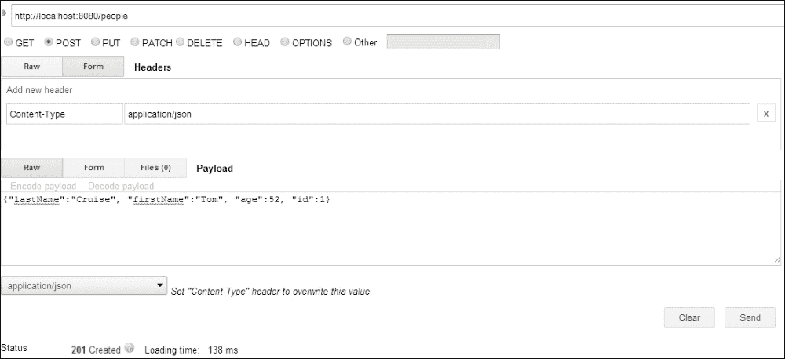

1.  现在，我们将使用浏览器中的`_id`字段来查询这个文档，这个字段在这种情况下是`1`。在浏览器的地址栏中输入`http://localhost:8080/people/1`。您应该看到我们在步骤 3 中插入的文档。

1.  现在我们在集合中有一个文档了（您可以尝试为具有不同名称和更重要的是唯一 ID 的人插入更多文档），我们将使用姓氏查询文档。首先，在浏览器的地址栏中输入以下 URL 以查看所有可用的搜索选项：`http://localhost:8080/people/search`。我们应该看到一个`search`方法，`findByLastName`，它接受一个命令行参数`lastName`。

1.  要按姓氏搜索，我们的情况下是 Cruise，可以在浏览器的地址栏中输入以下 URL：`http://localhost:8080/people/search/findByLastName?lastName=Cruise`。

1.  现在我们将更新 ID 为`1`的人的姓氏和年龄，目前是汤姆·克鲁斯。让我们把姓氏更新为汉克斯，年龄更新为`58`。为此，我们将使用 HTTP PATCH 请求，并且请求将被发送到`http://localhost:8080/people/1`，这个地址唯一标识了要更新的文档。HTTP PATCH 请求的主体是`{"lastName":"Hanks", "age":58}`。参考以下图片，查看我们发送的更新请求：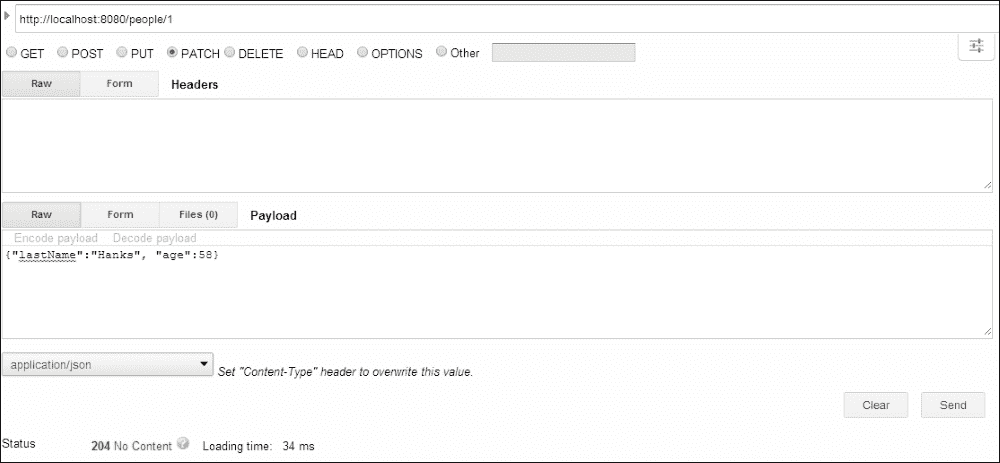

1.  为了验证我们的更新是否成功（我们知道它成功了，因为在 PATCH 请求之后我们得到了一个响应状态 204），再次在浏览器的地址栏中输入`http://localhost:8080/people/1`。

1.  最后，我们删除文档。这很简单，我们只需向`http://localhost:8080/people/1`发送一个 DELETE 请求。一旦 DELETE 请求成功，从浏览器向`http://localhost:8080/people/1`发送一个 HTTP GET 请求，我们不应该得到任何文档作为返回。

## 工作原理…

我们不会在这个教程中再次重复 spring-data-mongodb 的概念，而是将看一些我们专门为 REST 接口添加的注释。第一个是在类名的顶部，如下所示：

```go
@RepositoryRestResource(path="people")
public interface PersonRepository extends PagingAndSortingRepository<Person, Integer> {
```

这用于指示服务器可以使用 people 资源访问此 CRUD 存储库。这就是为什么我们总是在`http://localhost:8080/people/`上进行 HTTP GET 和 POST 请求的原因。

第二个注释在`findByLastName`方法中。我们有以下方法签名：

```go
Person findByLastName(@Param("lastName") String lastName);
```

这里，方法的`lastName`参数使用了`@Param`注释，用于注释将在调用存储库上的此方法时传递的`lastName`参数的参数名称。如果我们看一下上一节的第 6 步，我们可以看到使用 HTTP GET 请求调用了`findByLastName`，并且 URL 的`lastName`参数的值被用作在调用存储库方法时传递的字符串值。

我们的示例非常简单，只使用一个参数进行搜索操作。我们可以为存储库方法使用多个参数，并在 HTTP 请求中使用相同数量的参数，这些参数将映射到存储库上的方法，以便调用 CRUD 存储库。对于某些类型，例如要发送的日期，请使用`@DateTimeFormat`注释，该注释将用于指定日期和时间格式。有关此注释及其用法的更多信息，请参阅 spring Javadocs [`docs.spring.io/spring/docs/current/javadoc-api/`](http://docs.spring.io/spring/docs/current/javadoc-api/)

这就是我们向 REST 接口发出的 GET 请求，以查询和搜索数据。我们最初通过向服务器发送 HTTP POST 请求来创建文档数据。要创建新文档，我们将始终发送 POST 请求，将要创建的文档作为请求的主体发送到标识 REST 端点的 URL，即`http://localhost:8080/people/`。发送到此集合的所有文档都将使用`PersonRepository`来持久化`Person`在相应的集合中。

我们的最后两个步骤是更新人员和删除人员。执行这些操作的 HTTP 请求类型分别为 PATCH 和 DELETE。在第 7 步中，我们更新了人员 Tom Cruise 的文档，并更新了他的姓和年龄。为了实现这一点，我们的 PATCH 请求被发送到标识特定人员实例的 URL，即`http://localhost:8080/people/1`。请注意，在创建新人员的情况下，我们的 POST 请求总是发送到`http://localhost:8080/people`，而不是发送到 PATCH 和 DELETE 请求，其中我们将 HTTP 请求发送到表示要更新或删除的特定人员的 URL。在更新的情况下，PATCH 请求的主体是 JSON，其提供的字段将替换目标文档中的相应字段以进行更新。所有其他字段将保持不变。在我们的情况下，目标文档的`lastName`和年龄被更新，而`firstName`保持不变。在删除的情况下，消息主体不为空，并且 DELETE 请求本身指示应删除发送请求的目标。

您还可以发送 PUT 请求，而不是 PATCH 请求到标识特定人员的 URL；在这种情况下，集合中的整个文档将被更新或替换为作为 PUT 请求的一部分提供的文档。

## 另请参阅

spring-data-rest 的主页位于[`projects.spring.io/spring-data-rest/`](http://projects.spring.io/spring-data-rest/)，您可以在那里找到其 Git 存储库、参考手册和 Javadocs URL 的链接。

# 安装基于 GUI 的 MongoDB 客户端 MongoVUE

在这个示例中，我们将看到一个基于 GUI 的 MongoDB 客户端。在整本书中，我们一直使用 mongo shell 来执行我们需要的各种操作。它的优点如下：

+   它与 MongoDB 安装一起打包

+   由于轻量级，您不必担心它占用系统资源

+   在没有基于 GUI 的界面的服务器上，shell 是连接、查询和管理服务器实例的唯一选项

话虽如此，如果您不在服务器上并且想要连接到数据库实例进行查询、查看查询计划、管理等操作，最好有一个具有这些功能的 GUI，让您可以轻松完成任务。作为开发人员，我们总是使用基于 GUI 的厚客户端查询我们的关系数据库，那么为什么不为 MongoDB 呢？

在这个示例中，我们将看到如何安装 MongoDB 客户端 MongoVUE 的一些功能。该客户端仅适用于 Windows 机器。该产品既有付费版本（根据用户数量的不同级别进行许可），也有一些限制的免费版本。在这个示例中，我们将看看免费版本。

## 准备工作

对于这个示例，以下步骤是必要的：

1.  启动 MongoDB 服务器的单个实例。接受连接的端口将是默认端口`27017`。

1.  在 mongod 服务器启动后，从命令提示符导入以下两个集合：

```go
$ mongoimport --type json personTwo.json -c personTwo -d test –drop
$ mongoimport --type csv -c postalCodes -d test pincodes.csv --headerline –drop

```

## 如何操作...

1.  从[`www.mongovue.com/downloads/`](http://www.mongovue.com/downloads/)下载 MongoVUE 的安装程序 ZIP。下载后，只需点击几下，软件就会安装好。

1.  打开安装的应用程序；由于这是免费版本，在前 14 天内我们将拥有所有功能，之后，一些功能将不可用。详情请参见[`www.mongovue.com/purchase/`](http://www.mongovue.com/purchase/)。

1.  我们要做的第一件事是添加数据库连接：

+   一旦打开以下窗口，点击（**+**）按钮添加新连接：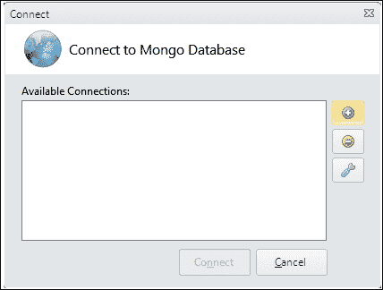

+   打开后，我们将得到另一个窗口，在其中填写服务器连接详细信息。在新窗口中填写以下详细信息，然后单击**测试**。如果连接正常，这应该成功；最后，单击**保存**。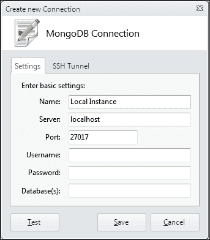

+   添加后，连接到实例。

1.  在左侧导航面板中，我们将看到添加的实例和其中的数据库，如下图所示：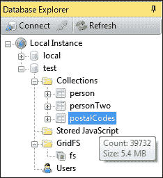

正如我们在上图中所看到的，将鼠标悬停在集合名称上会显示集合中的文档大小和计数。

1.  让我们看看如何查询一个集合并获取所有文档。我们将使用`test`中的`postalCodes`集合。右键单击集合名称，然后单击**查看**。我们将看到集合的内容显示为树形视图，我们可以展开并查看内容，表格视图，以表格网格显示内容，以及文本视图，以普通 JSON 文本显示内容。

1.  让我们看看当我们查询具有嵌套文档的集合时会发生什么；`personTwo`是一个具有以下示例文档的集合：

```go
{
  "_id" : 1,
  "_class" : "com.packtpub.mongo.cookbook.domain.Person2",
  "firstName" : "Steve",
  "lastName" : "Johnson",
  "age" : 30,
  "gender" : "Male",
  "residentialAddress" : {
    "addressLineOne" : "20, Central street",
    "city" : "Sydney",
    "state" : "NSW",
    "country" : "Australia"
  }
}
```

当我们查询以查看集合中的所有文档时，我们会看到以下图像：

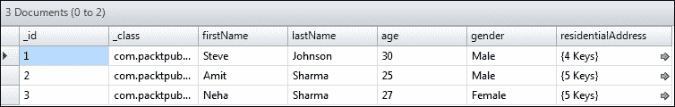

`residentialAddress`列显示值为嵌套文档，并显示其中的字段数。将鼠标悬停在上面会显示嵌套文档；或者，您可以单击该列以再次以网格形式显示此文档中的内容。显示嵌套文档后，您可以单击网格顶部返回一级。

1.  让我们看看如何编写查询以检索所选文档：

+   右键单击**postalCodes**集合，然后单击**查找**。我们将在**{查找}**文本框和**{排序}**字段中输入以下查询，然后单击右侧的**查找**按钮：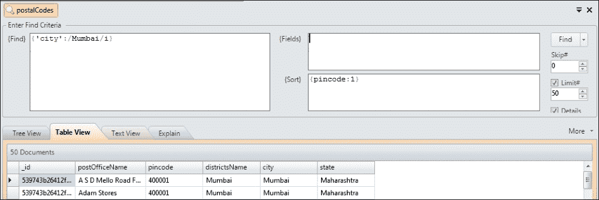

+   我们可以从选项卡中选择所需的视图类型，包括**树形视图**、**表格视图**或**文本视图**。查询计划也会显示。每次运行任何操作时，底部的 Learn shell 会显示实际执行的 Mongo 查询。在这种情况下，我们看到以下内容：

```go
[ 11:17:07 PM ]
db.postalCodes.find({ "city" : /Mumbai/i }).limit(50);
db.postalCodes.find({ "city" : /Mumbai/i }).limit(50).explain();

```

+   查询计划也会显示每次查询，截至当前版本 1.6.9.0，没有办法禁用查询计划的显示。

1.  在**树形视图**中，右键单击文档会给出更多选项，例如展开它，复制 JSON 内容，向该文档添加键，删除文档等。尝试使用右键从集合中删除文档，并尝试向文档添加任何其他键。您可以选择通过重新导入`postalCodes`集合中的数据来恢复文档。

1.  要在集合中插入文档，请执行以下操作。我们将在`personTwo`集合中插入一个文档：

+   右键单击**personTwo**集合名称，然后单击**插入/导入文档…**，如下图所示：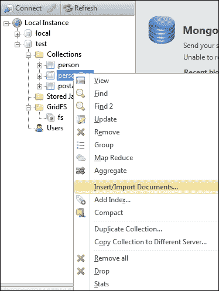

+   将出现另一个弹出窗口，在那里您可以选择输入单个 JSON 文档或包含要导入的 JSON 文档的有效文本文件。我们通过导入单个文档导入了以下文档：

```go
{
  "_id" : 4, 
  "firstName" : "Jack",
  "lastName" : "Jones",
 "age" : 35,
 "gender" : "Male" 
}
```

+   成功导入文档后，查询集合；我们将查看新导入的文档以及旧文档。

1.  让我们看看如何更新文档：

+   您可以右键单击左侧的集合名称，然后单击**更新**，或者在顶部选择**更新**选项。在任何一种情况下，我们将看到以下窗口。在这里，我们将更新在上一步中插入的人的年龄：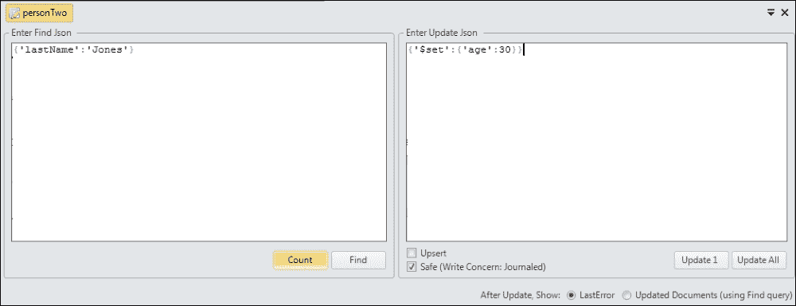

+   在此 GUI 中需要注意的一些事项是左侧的查询文本框，用于查找要更新的文档，以及右侧的更新 JSON，它将应用于所选的文档。

+   在更新之前，您可以选择点击**计数**按钮，以查看可以更新的文档数量（在本例中为一个）。点击**查找**将以树形式显示文档。在右侧，在更新 JSON 文本下方，我们可以通过点击**更新 1**或**全部更新**来选择更新一个文档和多个文档。

+   如果找不到给定**查找**条件的文档，可以选择**Upsert**操作。

+   前一屏幕右下角的单选按钮显示`getLastError`操作的输出或更新后的结果，如果是后者，则将执行查询以查找已更新的文档。

+   但是，查找查询并不是绝对可靠的，可能会返回与真正更新的结果不同的结果，就像在**查找**文本框中一样。更新和查找操作不是原子的。

1.  到目前为止，我们已经在小集合上进行了查询。随着集合大小的增加，执行完整集合扫描的查询是不可接受的，我们需要创建索引如下：

+   要按`lastName`升序和年龄降序创建索引，我们将调用`db.personTwo.ensureIndex({'lastName':1, 'age':-1})`。

+   使用 MongoVUE，有一种方法可以通过右键单击屏幕左侧的集合名称并选择**添加索引…**来可视化创建相同的索引。

+   在新的弹出窗口中，输入索引的名称，并选择**可视**选项卡，如图所示。分别选择**lastName**和**age**字段，以升序和降序的方式：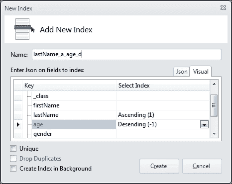

+   填写这些细节后，点击**创建**。这应该通过触发`ensureIndex`命令为我们创建索引。

+   您可以选择将索引设置为**唯一**和**删除重复项**（当选择唯一时将启用），甚至可以在后台创建大型、长时间运行的索引创建。

+   请注意**可视**选项卡旁边的**Json**选项卡。这是您可以输入`ensureIndex`命令的地方，就像在 shell 中一样，以创建索引。

1.  我们将看到如何删除索引：

+   简单地展开左侧的树（如第 9 步的屏幕截图所示）

+   展开集合后，我们将看到在其上创建的所有索引

+   除了`_id`字段上的默认索引外，所有其他索引都可以被删除。

+   简单右键单击名称，选择**删除索引**以删除，或点击**属性**查看其属性

1.  在了解了基本的 CRUD 操作和创建索引之后，让我们看看如何执行聚合操作：

+   在聚合索引的创建中没有可视化工具，只是一个文本区域，我们在其中输入我们的聚合管道

+   在以下示例中，我们对`postalCodes`集合执行聚合，以找到在集合中出现次数最多的五个州

+   我们将输入以下聚合管道：

```go
{'$project' : {'state':1, '_id':0}},
{'$group': {'_id':'$state', 'count':{'$sum':1}}},
{'$sort':{'count':-1}},
{'$limit':5}
```

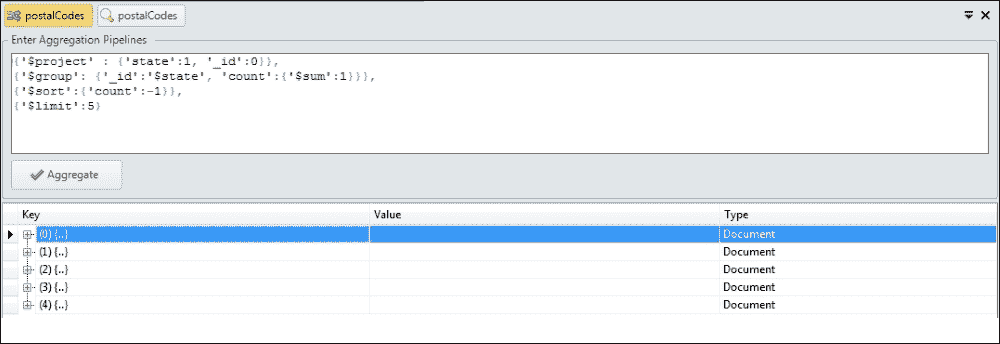

+   一旦进入管道，点击**聚合**按钮以获取聚合结果

1.  执行 MapReduce 甚至更酷。我们将执行的用例与前面的用例类似，但我们将看到如何使用 MongoVUE 实现 MapReduce 操作：

+   要执行 map reduce 作业，请在左侧菜单中右键单击集合名称，然后单击**Map Reduce**。

+   此选项位于我们在上一张图片中看到的**Aggregation**选项正上方。这为我们提供了一个相当整洁的 GUI，可以输入**Map**、**Reduce**、**Finalize**和**In & Out**，如下图所示：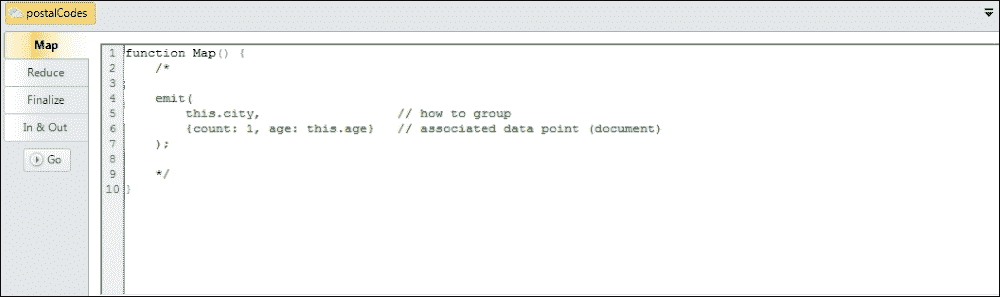

+   `Map`函数就是以下内容：

```go
function Map() {
  emit(this.state, 1)
}
```

+   `Reduce`函数如下：

```go
function Reduce(key, values) {
  return Array.sum(values)
}
```

+   保持`Finalize`方法未实现，并在**In & Out**部分填写以下细节：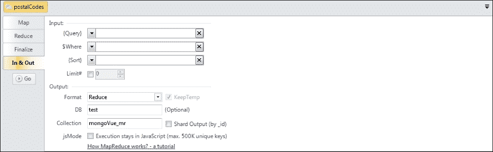

+   单击**开始**开始执行 MapReduce 作业。

+   我们将输出打印到`mongoVue_mr`集合。使用以下查询查询`mongoVue_mr`集合：

```go
db.mongoVue_mr.find().sort({value:-1}).limit(5)
```

+   检查结果是否与使用聚合获得的结果相匹配。

+   选择了 map reduce 的格式作为**Reduce**。有关更多选项及其行为，请访问[`docs.mongodb.org/manual/reference/command/mapReduce/#mapreduce-out-cmd`](http://docs.mongodb.org/manual/reference/command/mapReduce/#mapreduce-out-cmd)。

1.  现在可以使用`MongoVUE`监视服务器实例：

+   要监视一个实例，请点击顶部菜单中的**工具** | **监视**。

+   默认情况下，不会添加任何服务器，我们必须点击**+添加服务器**来添加服务器实例。

+   选择添加的本地实例或任何要监视的服务器，然后单击**连接**。

+   我们将看到相当多的监控细节。MongoVUE 使用`db.serverStatus`命令来提供这些统计信息，并限制我们在繁忙的服务器实例上执行此命令的频率，我们可以在屏幕顶部选择**刷新间隔**，如下图所示：

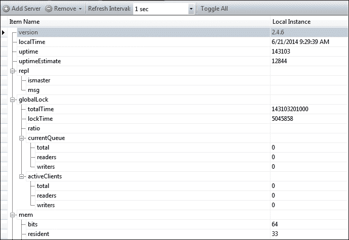

## 工作原理...

我们在前面的部分中所涵盖的内容对于我们作为开发人员和管理员来执行大部分活动都是非常简单的。

## 还有更多...

有关管理和监控 MongoDB 实例的管理和监控的详细信息，请参阅第四章、*管理*和第六章、*监控和备份*。

## 另请参阅

+   请参阅[`www.mongovue.com/tutorials/`](http://www.mongovue.com/tutorials/)，了解有关 MongoVUE 的各种教程

### 注意

在编写本书时，MongoDB 计划发布一个名为**Compass**的类似数据可视化和操作产品。您应该查看[`www.mongodb.com/products/compass`](https://www.mongodb.com/products/compass)。
