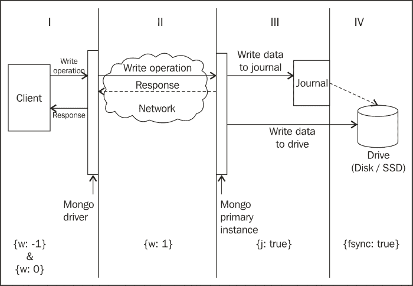
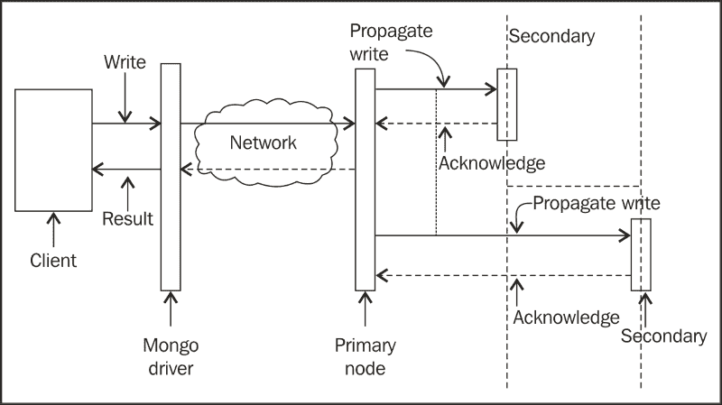
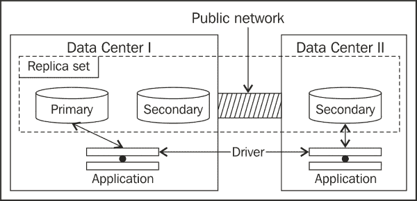

# 附录 A. 参考概念

本附录包含一些额外信息，将帮助您更好地理解配方。我们将尽可能详细地讨论写入关注和读取偏好。

# 写入关注及其重要性

写入关注是 MongoDB 服务器提供的关于客户端执行的写入操作的最低保证。客户端应用程序设置了各种级别的写入关注，以便从服务器获取在服务器端写入过程中达到某个阶段的保证。

对于保证的要求越强，从服务器获取响应的时间就越长（可能）。在写入关注中，我们并不总是需要从服务器获取关于写入操作完全成功的确认。对于一些不太关键的数据，比如日志，我们可能更感兴趣地通过连接发送更多的写入。另一方面，当我们试图更新敏感信息，比如客户详细信息时，我们希望确保写入成功（一致和持久）；数据完整性至关重要，优先于写入速度。

写入关注的一个极其有用的特性是在特定情况下在写入操作的速度和数据一致性之间进行权衡。然而，这需要对设置特定写入关注的影响有深入的理解。下图从左到右运行，并显示了写入保证水平的增加：



随着我们从**I**到**IV**，执行的写入保证越来越强，但从客户端的角度来看，执行写入操作所需的时间也越来越长。所有写入关注都以 JSON 对象的形式表示，使用三个不同的键，即`w`、`j`和`fsync`。另外，还使用了一个名为`wtimeout`的键，用于提供写入操作的超时值。让我们详细看一下这三个键：

+   `w`：用于指示是否等待服务器的确认，是否报告由于数据问题而导致的写入错误，以及数据是否被复制到次要位置。其值通常是一个数字，还有一个特殊情况，值可以是`majority`，我们稍后会看到。

+   `j`：这与日志记录有关，其值可以是布尔值（true/false 或 1/0）。

+   `fsync`：这是一个布尔值，与写入是否等待数据刷新到磁盘有关。

+   `wtimeout`：指定写入操作的超时时间，如果服务器在提供的时间内没有在几秒内回复客户端，驱动程序将向客户端抛出异常。我们很快会详细了解该选项。

在我们划分到驱动程序的**I**部分中，我们有两种写入关注点，分别是`{w:-1}`和`{w:0}`。这两种写入关注点都很常见，它们既不等待服务器对写入操作的确认，也不会报告由于唯一索引违规而在服务器端引起的任何异常。客户端将收到一个`ok`响应，并且只有在以后查询数据库时发现数据丢失时才会发现写入失败。两者的区别在于它们在网络错误时的响应方式。当我们设置`{w:-1}`时，操作不会失败，并且用户将收到写入响应。但是，它将包含一个响应，指出网络错误阻止了写入操作的成功，并且不应尝试重新写入。另一方面，对于`{w:0}`，如果发生网络错误，驱动程序可能选择重试操作，并且如果由于网络错误导致写入失败，则向客户端抛出异常。这两种写入关注点以牺牲数据一致性为代价，快速向调用客户端返回响应。这些写入关注点适用于日志记录等用例，其中偶尔的日志写入丢失是可以接受的。在较早版本的 MongoDB 中，如果调用客户端没有提及任何写入关注点，则`{w:0}`是默认的写入关注点。在撰写本书时，这已更改为默认的`{w:1}`选项，而`{w:0}`选项已被弃用。

在图表的**II**部分，位于驱动程序和服务器之间，我们讨论的写入关注点是`{w:1}`。驱动程序等待服务器对写入操作的确认完成。请注意，服务器的响应并不意味着写入操作已经持久化。这意味着更改刚刚更新到内存中，所有约束都已经检查，并且任何异常都将报告给客户端，与我们之前看到的两种写入关注点不同。这是一个相对安全的写入关注点模式，将会很快，但如果在数据从内存写入日志时发生崩溃，仍然有一些数据丢失的可能性。对于大多数用例来说，这是一个不错的选择。因此，这是默认的写入关注点模式。

接下来，我们来到图表的**III**部分，从服务器的入口点到日志。我们在这里寻找的写入关注点是`{j:1}`或`{j:true}`。这种写入关注点确保只有当写入操作写入日志时，才会向调用客户端返回响应。但是什么是日志呢？这是我们在第四章中深入了解的内容，但现在，我们只看一种机制，确保写入是持久的，数据在服务器崩溃时不会损坏。

最后，让我们来到图表的**IV**部分；我们讨论的写入关注点是`{fsync:true}`。这要求在向客户端发送响应之前将数据刷新到磁盘。在我看来，当启用日志记录时，这个操作实际上并没有增加任何价值，因为日志记录确保即使在服务器崩溃时也能保持数据持久性。只有在禁用日志记录时，此选项才能确保客户端接收到成功响应时写入操作成功。如果数据真的很重要，首先不应该禁用日志记录，因为它还确保磁盘上的数据不会损坏。

我们已经看到了单节点服务器的一些基本写入关注点，或者仅适用于复制集中的主节点的写入关注点。

### 注意

讨论一个有趣的事情是，如果我们有一个写关注，比如`{w:0, j:true}`？我们不等待服务器的确认，同时确保写入已经被记录到日志中。在这种情况下，日志标志优先，并且客户端等待写操作的确认。应该避免设置这种模棱两可的写关注，以避免不愉快的惊喜。

现在，我们将讨论涉及副本集辅助节点的写关注。让我们看一下下面的图表：



任何`w`值大于一的写关注都表示在发送响应之前，辅助节点也需要确认。如前图所示，当主节点接收写操作时，它将该操作传播到所有辅助节点。一旦它从预定数量的辅助节点收到响应，它就向客户端确认写操作已成功。例如，当我们有一个写关注`{w:3}`时，这意味着只有当集群中的三个节点确认写操作时，客户端才会收到响应。这三个节点包括主节点。因此，现在只有两个辅助节点需要对成功的写操作做出响应。

然而，为写关注提供一个数字存在问题。我们需要知道集群中节点的数量，并相应地设置`w`的值。较低的值将向复制数据的少数节点发送确认。值太高可能会不必要地减慢向客户端的响应，或者在某些情况下可能根本不发送响应。假设您有一个三节点副本集，我们的写关注是`{w:4}`，服务器将在数据复制到三个不存在的辅助节点时才发送确认，因为我们只有两个辅助节点。因此，客户端需要很长时间才能从服务器那里得知写操作的情况。解决这个问题有几种方法：

+   使用`wtimeout`键并指定写关注的超时时间。这将确保写操作不会阻塞超过`wtimeout`字段指定的时间（以毫秒为单位）。例如，`{w:3, wtimeout:10000}`确保写操作不会阻塞超过 10 秒（10,000 毫秒），之后将向客户端抛出异常。在 Java 的情况下，将抛出`WriteConcernException`，根本原因消息将说明超时的原因。请注意，此异常不会回滚写操作。它只是通知客户端操作在指定的时间内未完成。它可能在客户端收到超时异常后的一段时间内在服务器端完成。由应用程序来处理异常并以编程方式采取纠正措施。超时异常的消息传达了一些有趣的细节，我们将在执行写关注的测试程序时看到。

+   在副本集的情况下，指定`w`的更好方法是将值指定为`majority`。这种写关注会自动识别副本集中的节点数，并在数据复制到大多数节点时向客户端发送确认。例如，如果写关注是`{w:"majority"}`，并且副本集中的节点数为三，则`majority`将是`2`。而在以后，当我们将节点数更改为五时，`majority`将是`3`个节点。当写关注的值给定为`majority`时，自动计算形成大多数所需的节点数。

现在，让我们将我们讨论的概念付诸实践，并执行一个测试程序，演示我们刚刚看到的一些概念。

## 建立副本集

要设置副本集，您应该知道如何启动具有三个节点的基本副本集。参考第一章 *安装和启动服务器*中的*作为副本集的一部分启动多个实例*配方。这个配方是基于那个配方构建的，因为在启动副本集时需要额外的配置，我们将在下一节中讨论。请注意，此处使用的副本与您之前使用的副本在配置上有轻微变化。

在这里，我们将使用一个 Java 程序来演示各种写入关注点及其行为。在第一章 *安装和启动服务器*中的*使用 Java 客户端连接单个节点*配方中，直到设置 Maven 之前，应该被访问。如果您来自非 Java 背景，这可能有点不方便。

### 注意

Java 项目名为`Mongo Java`可在该书的网站上下载。如果设置完成，只需执行以下命令即可测试该项目：

```sql
mvn compile exec:java -Dexec.mainClass=com.packtpub.mongo.cookbook.FirstMongoClient

```

该项目的代码可在该书的网站上下载。下载名为`WriteConcernTest`的项目，并将其保存在本地驱动器上以备执行。

所以，让我们开始吧：

1.  为副本集准备以下配置文件。这与我们在第一章 *安装和启动服务器*中的*作为副本集的一部分启动多个实例*配方中看到的配置文件相同，我们在那里设置了副本集，只有一个区别，`slaveDelay:5`，`priority:0`：

```sql
cfg = {
 _id:'repSetTest',
 members:[
 {_id:0, host:'localhost:27000'},
 {_id:1, host:'localhost:27001'},
 {_id:2, host:'localhost:27002', slaveDelay:5, priority:0}
 ]
}

```

1.  使用此配置启动一个三节点副本集，其中一个节点监听端口`27000`。其他节点可以是您选择的任何端口，但如果可能的话，请坚持使用`27001`和`27002`（如果决定使用不同的端口号，我们需要相应更新配置）。还要记得在启动副本集时，将副本集的名称设置为`replSetTest`，并将其作为`replSet`命令行选项。在继续下一步之前，请给副本集一些时间来启动。

1.  此时，具有前述规格的副本集应该已经启动并运行。我们现在将执行 Java 中提供的测试代码，以观察不同写入关注点的一些有趣事实和行为。请注意，此程序还尝试连接到没有 Mongo 进程监听连接的端口。选择的端口是`20000`；在运行代码之前，请确保没有服务器正在运行并监听端口`20000`。

1.  转到`WriteConcernTest`项目的根目录并执行以下命令：

```sql
mvn compile exec:java -Dexec.mainClass=com.packtpub.mongo.cookbook.WriteConcernTests

```

这需要一些时间才能完全执行，具体取决于您的硬件配置。在我的机器上大约花了 35 到 40 秒的时间，我的机器上有一个 7200 转的传统硬盘。

在我们继续分析日志之前，让我们看看添加到配置文件中设置副本的这两个附加字段是什么。`slaveDelay`字段表示特定的副本（在本例中监听端口`27002`的副本）将比主节点滞后 5 秒。也就是说，当前在该副本节点上复制的数据是 5 秒前添加到主节点上的数据。其次，该节点永远不能成为主节点，因此必须添加`priority`字段并赋值为`0`。我们已经在第四章 *管理*中详细介绍了这一点。

现在让我们分析前述命令执行的输出。这里不需要查看提供的 Java 类；控制台上的输出就足够了。输出控制台的一些相关部分如下：

```sql
[INFO] --- exec-maven-plugin:1.2.1:java (default-cli) @ mongo-cookbook-wctest ---
Trying to connect to server running on port 20000
Trying to write data in the collection with write concern {w:-1}
Error returned in the WriteResult is NETWORK ERROR
Trying to write data in the collection with write concern {w:0}
Caught MongoException.Network trying to write to collection, message is Write operation to server localhost/127.0.0.1:20000 failed on database test
Connected to replica set with one node listening on port 27000 locally

Inserting duplicate keys with {w:0}
No exception caught while inserting data with duplicate _id
Now inserting the same data with {w:1}
Caught Duplicate Exception, exception message is { "serverUsed" : "localhost/127.0.0.1:27000" , "err" : "E11000 duplicate key error index: test.writeConcernTest.$_id_  dup key: { : \"a\" }" , "code" : 11000 , "n" : 0 , "lastOp" : { "$ts" :1386009990 , "$inc" : 2} , "connectionId" : 157 , "ok" : 1.0}
Average running time with WriteConcern {w:1, fsync:false, j:false} is 0 ms
Average running time with WriteConcern {w:2, fsync:false, j:false} is 12 ms
Average running time with WriteConcern {w:1, fsync:false, j:true} is 40 ms
Average running time with WriteConcern {w:1, fsync:true, j:false} is 44 ms
Average running time with WriteConcern {w:3, fsync:false, j:false} is 5128 ms
Caught WriteConcern exception for {w:5}, with following message { "serverUsed" : "localhost/127.0.0.1:27000" , "n" : 0 , "lastOp" : { "$ts" : 1386009991 , "$inc" : 18} , "connectionId" : 157 , "wtimeout" : true , "waited" : 1004 , "writtenTo" : [ { "_id" : 0 , "host" : "localhost:27000"} , { "_id" : 1 , "host" : "localhost:27001"}] , "err" : "timeout" , "ok" : 1.0}
 [INFO] ------------------------------------------------------------------------
[INFO] BUILD SUCCESS
[INFO] ------------------------------------------------------------------------
[INFO] Total time: 36.671s
[INFO] Finished at: Tue Dec 03 00:16:57 IST 2013
[INFO] Final Memory: 13M/33M
[INFO] ------------------------------------------------------------------------

```

日志中的第一条语句说明我们尝试连接到一个监听端口`20000`的 Mongo 进程。由于不应该有 Mongo 服务器在此端口上运行并监听客户端连接，因此我们所有对该服务器的写操作都不应成功，现在我们有机会看看当我们使用写关注`{w:-1}`和`{w:0}`并向这个不存在的服务器写入时会发生什么。

输出中的下两行显示，当我们有写关注`{w:-1}`时，我们确实得到了写入结果，但其中包含了设置为指示网络错误的错误标志。但是，没有抛出异常。在写关注`{w:0}`的情况下，我们在客户端应用程序中对任何网络错误都会得到异常。当然，在这种情况下，所有其他确保严格保证的写关注也会抛出异常。

现在我们来到连接到副本集的代码部分，其中一个节点正在监听端口`27000`（如果没有，代码将在控制台上显示错误并终止）。现在，我们尝试向集合中插入一个具有重复`_id`字段（`{'_id':'a'}`）的文档，一次使用写关注`{w:0}`，一次使用`{w:1}`。正如我们在控制台中看到的，前者（`{w:0}`）没有抛出异常，从客户端的角度来看插入成功进行了，而后者（`{w:1}`）向客户端抛出了异常，指示重复键。异常包含了关于服务器主机名和端口的大量信息，在异常发生时：唯一约束失败的字段；客户端连接 ID；错误代码；以及导致异常的不唯一值。事实是，即使使用`{w:0}`作为写关注进行插入，它也失败了。但是，由于驱动程序没有等待服务器的确认，它从未被通知插入失败。

继续前进，我们现在尝试计算写操作完成所需的时间。这里显示的时间是执行相同操作的给定写关注五次所需时间的平均值。请注意，这些时间将在程序的不同执行实例上变化，这种方法只是为了给我们的研究提供一些粗略的估计。我们可以从输出中得出结论，写关注`{w:1}`所需的时间少于`{w:2}`（要求从一个辅助节点获得确认），而`{w:2}`所需的时间少于`{j:true}`，而`{j:true}`又少于`{fsync:true}`。输出的下一行告诉我们，当写关注为`{w:3}`时，写操作完成所需的平均时间大约为 5 秒。你猜为什么会这样吗？为什么会花这么长时间？原因是，当`w`为`3`时，我们只有在两个辅助节点确认写操作时才向客户端发送确认。在我们的情况下，一个节点比主节点延迟约 5 秒，因此只有在 5 秒后才能确认写操作，因此客户端大约在 5 秒后从服务器收到响应。

让我们在这里做一个快速练习。当我们的写关注为`{w:'majority'}`时，你认为大约的响应时间会是多少？这里的提示是，对于一个三个节点的副本集，两个是大多数。

最后我们看到了超时异常。超时是使用文档的`wtimeout`字段设置的，以毫秒为单位。在我们的情况下，我们设置了 1000 毫秒的超时，即 1 秒，并且在将响应发送回客户端之前从副本集中获得确认的节点数为 5（四个从实例）。因此，我们的写关注是`{w:5, wtimeout:1000}`。由于我们的最大节点数为三个，所以将`w`设置为`5`的操作将等待很长时间，直到集群中添加了另外两个从实例。设置超时后，客户端返回并向客户端抛出错误，传达一些有趣的细节。以下是作为异常消息发送的 JSON：

```sql
{ "serverUsed" : "localhost/127.0.0.1:27000" , "n" : 0 , "lastOp" : { "$ts" : 1386015030 , "$inc" : 1} , "connectionId" : 507 , "wtimeout" : true , "waited" : 1000 , "writtenTo" : [ { "_id" : 0 , "host" : "localhost:27000"} , { "_id" : 1 , "host" : "localhost:27001"}] , "err" : "timeout" , "ok" : 1.0}

```

让我们看看有趣的字段。我们从`n`字段开始。这表示更新的文档数量。在这种情况下，它是一个插入而不是更新，所以保持为`0`。`wtimeout`和`waited`字段告诉我们事务是否超时以及客户端等待响应的时间；在这种情况下是 1000 毫秒。最有趣的字段是`writtenTo`。在这种情况下，插入在超时时成功在副本集的这两个节点上，并且因此在数组中看到。第三个节点的`slaveDelay`值为 5 秒，因此数据仍未写入。这证明超时不会回滚插入，它确实成功进行。实际上，即使操作超时，具有`slaveDelay`的节点也将在 5 秒后拥有数据，这是有道理的，因为它保持主节点和从节点同步。应用程序有责任检测此类超时并处理它们。

# 查询的读取偏好

在前一节中，我们看到了写关注是什么以及它如何影响写操作（插入、更新和删除）。在本节中，我们将看到读取偏好是什么以及它如何影响查询操作。我们将讨论如何在单独的配方中使用读取偏好，以使用特定的编程语言驱动程序。

当连接到单个节点时，默认情况下允许查询操作连接到主节点，如果连接到从节点，则需要明确声明可以通过在 shell 中执行`rs.slaveOk()`来从从实例查询。

然而，考虑从应用程序连接到 Mongo 副本集。它将连接到副本集，而不是从应用程序连接到单个实例。根据应用程序的性质，它可能总是想要连接到主节点；总是连接到从节点；更喜欢连接到主节点，但在某些情况下连接到从节点也可以，反之亦然，最后，它可能连接到地理位置靠近它的实例（嗯，大部分时间）。

因此，读取偏好在连接到副本集而不是单个实例时起着重要作用。在下表中，我们将看到各种可用的读取偏好以及它们在查询副本集方面的行为。共有五种，名称不言自明：

| 读取偏好 | 描述 |
| --- | --- |
| `primary` | 这是默认模式，它允许查询仅在主实例上执行。这是唯一保证最新数据的模式，因为所有写操作都必须通过主实例进行。然而，如果没有主实例可用，读操作将失败，这在主机宕机并持续到选择新的主机时会发生一段时间。 |
| `primaryPreferred` | 这与前面的主读取偏好相同，只是在故障切换期间，当没有主机可用时，它将从从节点读取数据，这些时候可能不会读取到最新数据。 |
| `secondary` | 这与默认的 primary 读取偏好完全相反。此模式确保读取操作永远不会转到 primary，而总是选择 secondary。在这种模式下，读取不一致的数据的机会最大，因为它没有更新到最新的写操作。但是，对于不面向最终用户并且用于某些实例获取每小时统计和分析作业的应用程序来说，这是可以接受的（事实上是首选），其中数据的准确性最不重要，但不会增加对 primary 实例的负载是关键的。如果没有 secondary 实例可用或可达，只有 primary 实例，读取操作将失败。 |
| `secondaryPreferred` | 这与前面的 secondary 读取偏好类似，除了如果没有 secondary 可用，读取操作将转到 primary 实例。 |
| `nearest` | 与所有先前的读取偏好不同，这可以连接到 primary 或 secondary。这种读取偏好的主要目标是客户端和副本集实例之间的最小延迟。在大多数情况下，由于网络延迟和客户端与所有实例之间的相似网络，所选择的实例将是地理上接近的实例。 |

与写关注可以与分片标签结合使用类似，读取偏好也可以与分片标签一起使用。由于标签的概念已经在第四章中介绍过，您可以参考它以获取更多详细信息。

我们刚刚看到了不同类型的读取偏好（除了使用标签的那些），但问题是，我们如何使用它们？本书中涵盖了 Python 和 Java 客户端，并将看到如何在它们各自的示例中使用它们。我们可以在各个级别设置读取偏好：在客户端级别、集合级别和查询级别，查询级别指定的读取偏好将覆盖先前设置的任何其他读取偏好。

让我们看看最近的读取偏好意味着什么。从概念上讲，它可以被可视化为以下图表：



Mongo 副本集设置了一个 secondary，它永远不会成为 primary，在一个单独的数据中心，另一个数据中心有两个（一个 primary 和一个 secondary）。在两个数据中心都部署了相同的应用程序，使用 primary 读取偏好，将始终连接到**数据中心 I**中的 primary 实例。这意味着，对于**数据中心 II**中的应用程序，流量将通过公共网络，这将具有较高的延迟。但是，如果应用程序可以接受略有陈旧的数据，它可以将读取偏好设置为最近，这将自动让**数据中心 I**中的应用程序连接到**数据中心 I**中的实例，并允许**数据中心 II**中的应用程序连接到**数据中心 II**中的 secondary 实例。

但接下来的问题是，驱动程序如何知道哪一个是最近的？术语“地理上接近”是误导的；实际上是具有最小网络延迟的那个。我们查询的实例可能在地理上比副本集中的另一个实例更远，但它可能被选择，只是因为它具有可接受的响应时间。通常，更好的响应时间意味着地理上更接近。

以下部分是为那些对驱动程序内部细节感兴趣的人准备的，关于最近节点是如何选择的。如果您只对概念感兴趣而不关心内部细节，可以放心地跳过其余内容。

## 了解内部情况

让我们看一下来自 Java 客户端（用于此目的的驱动程序为 2.11.3）的一些代码片段，并对其进行一些解释。如果我们查看`com.mongodb.TaggableReadPreference.NearestReadPreference.getNode`方法，我们会看到以下实现：

```sql
@Override
ReplicaSetStatus.ReplicaSetNode getNode(ReplicaSetStatus.ReplicaSet set) {
  if (_tags.isEmpty())
    return set.getAMember();

  for (DBObject curTagSet : _tags) {
    List<ReplicaSetStatus.Tag> tagList = getTagListFromDBObject(curTagSet);
    ReplicaSetStatus.ReplicaSetNode node = set.getAMember(tagList);
    if (node != null) {
      return node;
    }
  }
  return null;
}
```

目前，如果我们忽略指定标签的内容，它所做的就是执行`set.getAMember()`。

这个方法的名称告诉我们，有一组副本集成员，我们随机返回其中一个。那么是什么决定了集合是否包含成员？如果我们再深入一点研究这个方法，我们会在`com.mongodb.ReplicaSetStatus.ReplicaSet`类中看到以下代码行：

```sql
public ReplicaSetNode getAMember() {
  checkStatus();
  if (acceptableMembers.isEmpty()) {
    return null;
  }
  return acceptableMembers.get(random.nextInt(acceptableMembers.size()));
}
```

好的，它所做的就是从内部维护的副本集节点列表中选择一个。现在，随机选择可以是一个 secondary，即使可以选择一个 primary（因为它存在于列表中）。因此，我们现在可以说当最近的节点被选择为读取偏好时，即使主节点在候选者列表中，也可能不会被随机选择。

现在的问题是，`acceptableMembers`列表是如何初始化的？我们看到它是在`com.mongodb.ReplicaSetStatus.ReplicaSet`类的构造函数中完成的，如下所示：

```sql
this.acceptableMembers =Collections.unmodifiableList(calculateGoodMembers(all, calculateBestPingTime(all, true),acceptableLatencyMS, true));
```

`calculateBestPingTime`行只是找到所有 ping 时间中的最佳时间（稍后我们将看到这个 ping 时间是什么）。

值得一提的另一个参数是`acceptableLatencyMS`。这在`com.mongodb.ReplicaSetStatus.Updater`中初始化（实际上是一个不断更新副本集状态的后台线程），`acceptableLatencyMS`的值初始化如下：

```sql
slaveAcceptableLatencyMS = Integer.parseInt(System.getProperty("com.mongodb.slaveAcceptableLatencyMS", "15"));
```

正如我们所见，这段代码搜索名为`com.mongodb.slaveAcceptableLatencyMS`的系统变量，如果找不到，则初始化为值`15`，即 15 毫秒。

这个`com.mongodb.ReplicaSetStatus.Updater`类还有一个`run`方法，定期更新副本集的统计信息。不深入研究，我们可以看到它调用`updateAll`，最终到达`com.mongodb.ConnectionStatus.UpdatableNode`中的`update`方法。

```sql
long start = System.nanoTime();
CommandResult res = _port.runCommand(_mongo.getDB("admin"), isMasterCmd);
long end = System.nanoTime()
```

它所做的就是执行`{isMaster:1}`命令并记录响应时间（以纳秒为单位）。这个响应时间转换为毫秒并存储为 ping 时间。所以，回到`com.mongodb.ReplicaSetStatus.ReplicaSet`类中，`calculateGoodMembers`所做的就是找到并添加副本集中不超过`acceptableLatencyMS`毫秒的成员，这些成员的 ping 时间不超过副本集中找到的最佳 ping 时间。

例如，在一个有三个节点的副本集中，客户端到三个节点（节点 1、节点 2 和节点 3）的 ping 时间分别为 2 毫秒、5 毫秒和 150 毫秒。正如我们所见，最佳时间是 2 毫秒，因此节点 1 进入了良好成员的集合中。现在，从剩下的节点中，所有延迟不超过最佳时间的`acceptableLatencyMS`的节点也是候选者，即*2 + 15 毫秒 = 17 毫秒*，因为 15 毫秒是默认值。因此，节点 2 也是一个候选者，剩下的是节点 3。现在我们有两个节点在良好成员的列表中（从延迟的角度来看是好的）。

现在，将我们在前面的图表中看到的所有内容整合起来，最小的响应时间将来自同一数据中心中的一个实例（从这两个数据中心的编程语言驱动程序的角度来看），因为其他数据中心中的实例可能由于公共网络延迟而无法在 15 毫秒（默认可接受值）内响应。因此，**数据中心 I**中的可接受节点将是该数据中心中的两个副本集节点，其中一个将被随机选择，而对于**数据中心 II**，只有一个实例存在，也是唯一的选择。因此，它将由在该数据中心运行的应用程序选择。
