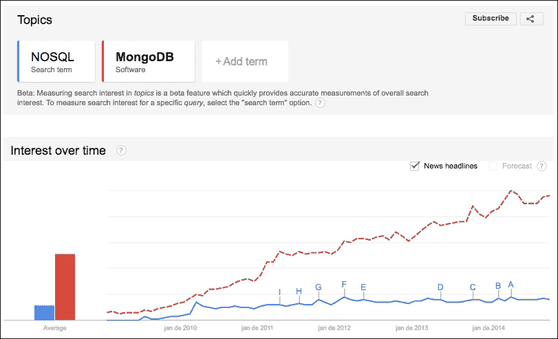
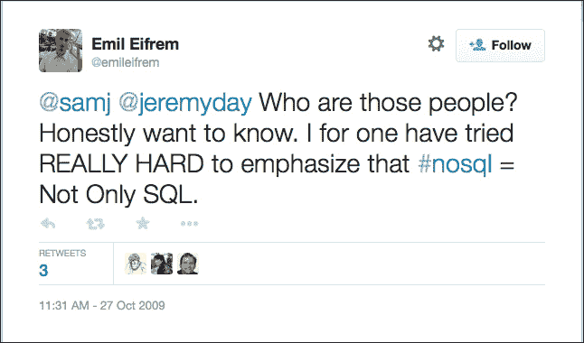
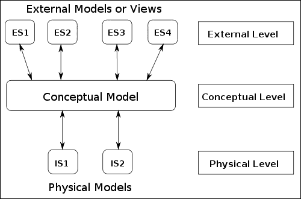
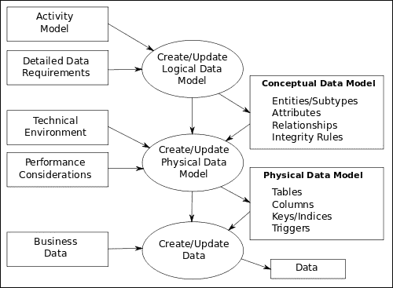
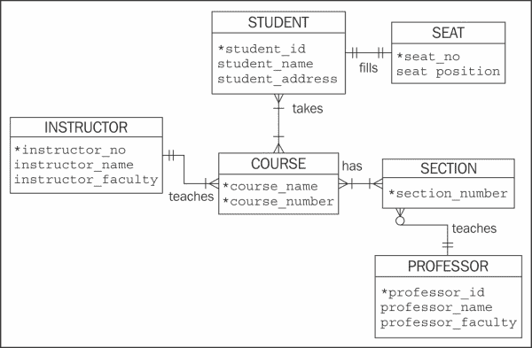
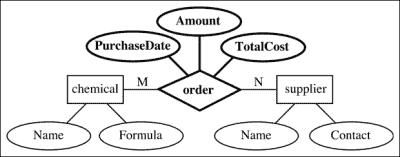

# 第一章。介绍数据建模

数据建模是一个长期讨论的话题。因此，该领域的各种作者可能有不同的观点。不久前，当主要讨论集中在关系数据库上时，数据建模是领域中数据发现和分析过程的一部分。这是一个整体的视野，最终目标是拥有一个能够支持任何类型应用的强大数据库。

由于 NoSQL 数据库的灵活性，数据建模已经成为一个内部过程，您需要事先了解应用程序的需求或性能特征，才能最终得到一个良好的数据模型。

在本章中，我们将简要介绍多年来数据建模过程的历史，向您展示重要的概念。我们将涵盖以下主题：

+   MongoDB 和 NoSQL 的关系

+   介绍 NoSQL

+   数据库设计

# MongoDB 和 NoSQL 的关系

如果你在 Google 上搜索 MongoDB，你会找到大约 10,900,000 个结果。同样，如果你在 Google 上搜索 NoSQL，你会得到不少于 13,000,000 个结果。

现在，在 Google 趋势上，这是一个显示一个术语相对于全球所有搜索术语的搜索频率的工具，我们可以看到对这两个主题的兴趣增长是相当相似的：

自 2009 年以来，NoSQL 和 MongoDB 术语的 Google 趋势搜索比较

但是，除了 MongoDB 是一个 NoSQL 数据库之外，这种关系实际上存在什么？

自 2009 年首次开源发布以来，由一家名为 10gen 的公司发布，MongoDB 成为了 Web 上许多玩家的选择，因此 DB-Engines（[`db-engines.com/en/`](http://db-engines.com/en/)）成为了第四受欢迎的数据库，也是最受欢迎的 NoSQL 数据库系统。

10gen 于 2013 年 8 月 27 日转变为 MongoDB Inc.，显示所有人的目光都集中在 MongoDB 及其生态系统上。向开源项目的转变对这一变化过程至关重要。特别是因为社区的采用量是巨大的。

根据 MongoDB 的现任主席兼联合创始人 Dwight Merriman：

> “我们的开源平台导致 MongoDB 在项目推出后的五年内被下载了 800 万次，这对于社区采用来说是一个非常快的速度。”

此外，MongoDB Inc.推出了产品和服务，以支持这个社区并丰富 MongoDB 生态系统。其中包括：

+   **MongoDB 企业**：MongoDB 的商业支持

+   **MongoDB 管理服务**：一种 SaaS 监控工具

+   **MongoDB 大学**：EdX 合作伙伴，提供免费的在线培训

与 NoSQL 运动一样，MongoDB 的发展也遵循了 Web 2.0 的挑战和机遇，NoSQL 运动已经有了很大的发展。

# 介绍 NoSQL（不仅仅是 SQL）

尽管这个概念是新的，但 NoSQL 是一个备受争议的话题。如果你进行广泛搜索，你可能会找到许多不同的解释。由于我们没有任何意图创造一个新的解释，让我们来看一下最常用的解释。

正如我们今天所知的，NoSQL 这个术语是由 Eric Evans 引入的，是在 Last.fm 的 Johan Oskarsson 组织的一次见面会后引入的。

事实上，Oskarsson 和其他参加 2009 年 6 月 11 日在旧金山举行的历史性会议的人已经讨论了许多今天我们称之为 NoSQL 数据库的数据库，比如 Cassandra、HBase 和 CouchDB。正如 Oskarsson 所描述的，会议是关于开源、分布式、非关系型数据库的，针对那些“…在传统关系数据库方面遇到了限制…”的人，目的是“…弄清楚为什么这些新潮的 Dynamo 克隆和 BigTables 最近变得如此受欢迎。”

四个月后，Evans 在他的博客中写道，除了 NoSQL 运动的增长和正在讨论的一切，他认为它们毫无意义。然而，Neo4J 的创始人兼 CEO Emil Eifren 在将术语命名为“Not Only SQL”时是正确的。

Emil Eifrem 在 Twitter 上发布了介绍术语“Not Only SQL”的帖子

比起给 NoSQL 这个术语下一个定义，所有这些事件更重要的是作为讨论 NoSQL 真正含义的起点。如今，人们似乎普遍认为 NoSQL 是作为对关系数据库无法解决的问题的回应而诞生的。

值得注意的是，我们现在可以区分信息系统从 70 年代到今天必须解决的问题。那时，单片架构足以满足需求，与我们现在观察到的情况不同。

你有没有想过你已经在多少网站上拥有账户，比如社交网络、电子邮件提供商、流媒体服务和在线游戏？还有，你家里有多少设备现在连接到互联网？

不用担心如果你不能准确回答上面的问题。你并不孤单。随着每一个新的研究项目，全球范围内拥有互联网访问权限的用户数量增加，移动互联网访问所占的份额也越来越重要。

这意味着每一秒都在世界各地产生大量的非结构化或半结构化数据。数据量无法估计，因为用户是信息的主要来源。因此，越来越难以预测这种数据量何时或为何会发生变化。这只是世界上某个地方发生了不可预测的事件，比如进球、大罢工、大规模示威或飞机失事，就会导致交通变化，从而用户生成的内容增加。

作为对此的回应，NoSQL 技术的发展带来了各种不同的方法。

## NoSQL 数据库类型

正如之前所述，亚马逊和谷歌在 NoSQL 的发展方面处于前沿地位，借助 Amazon DynamoDB 和 Google BigTable。由于风格的多样性，我们不断开发新类型的 NoSQL 数据库。然而，基于数据模型，已知有四种基本类型：键值存储、宽列存储、文档数据库和图数据库，下面对它们进行了解释：

+   **键值存储**：键值是最简单和直接的数据模型之一，每个记录都存储为一个键和它的值。键值存储的例子有 Amazon Dynamo、Riak 和 Redis。

### 提示

Redis 可以被描述为一个高级的键值缓存和存储。由于它的键可以存储许多不同的数据类型并对这些类型运行原子操作，我们可以假设 Redis 是一个数据结构服务器。

+   **宽列存储**：在概念上，最接近关系数据库，因为它的数据是以表格形式表示的。然而，数据库存储的是数据列而不是行。宽列存储的例子有 Google BigTable、Cassandra 和 HBase。

+   **文档数据库**：顾名思义，这个数据库的数据模型以文档为主要概念。文档是存储数据的复杂结构，可以包含许多键值对、键数组对，甚至是嵌套文档。文档数据库的例子有 MongoDB、Apache CouchDB 和 Amazon SimpleDB。

+   **图数据库**：图数据库是存储关系最适合表示为图的数据项的最佳方式，比如网络拓扑和社交网络。节点、边和属性是存储数据的结构。图数据库的例子有 Neo4J 和 HyperGraphDB。

## 动态模式、可扩展性和冗余

尽管如前所述，NoSQL 数据库类型基于不同的数据模型，但它们有一些共同的特点。

为了支持非结构化或半结构化数据，NoSQL 数据库没有预定义的模式。动态模式使得在插入新数据时更容易进行实时更改，并且在需要数据迁移时更具成本效益。

为了处理不可预测的大量数据，NoSQL 数据库使用自动分片进行水平扩展，并确保数据的持续可用性。自动分片允许用户自动将数据和流量分布到多台服务器上。

NoSQL 数据库也支持本地复制，这使得您可以以快速简便的方式实现高可用性和恢复。随着我们分发数据的方式越来越多，我们的恢复策略也在改变，我们可能需要微调我们的一致性级别。

# 数据库设计和数据建模

在我开始写这一章之前（或者也许是在开始写这本书之前），我考虑过如何处理这个主题。首先，因为我猜想这是你的期望之一。其次，因为这是几乎每一本文献中都存在的一个主题，我不想（也不打算）引发这场讨论。

事实上，关于理论与实践的讨论，直到现在，我更倾向于实践方面。因此，我调查了许多不同的来源，希望能够阅读更多关于这个主题的内容，并可能在这本书中总结到目前为止关于这个主题的所有内容。

我在研究初期发现的许多内容都显示了数据库设计和数据建模之间的明显分离。然而，最终我的结论是，这两个概念之间的相似性要大于分歧。为了得出这个结论，我以 C.J. Date 在*数据库系统导论*中提到的一个事实为出发点，*Pearson Education*。

在其中，C.J. Date 说他更喜欢不使用术语数据建模，因为它可能指的是数据模型这个术语，这种关系可能会引起一些混淆。C.J. Date 提醒我们，在文献中术语数据模型有两个含义。第一个是数据模型是一般数据的模型，第二个是数据模型是与特定企业相关的持久数据的模型。Date 在他的书中选择了第一个定义。

正如 C.J. Date 所说：

> *"我们相信，在非关系型系统中进行数据库设计的正确方法是首先进行清晰的关系设计，然后，作为一个单独的后续步骤，将该关系设计映射到目标 DBMS 支持的任何非关系型结构（例如层次结构）中。"*

因此，谈论数据库设计是一个很好的开始。因此，C.J. Date 采用了语义建模或概念建模这个术语，并将这一活动定义为数据库设计过程中的一种辅助。

### 提示

如果你想了解更多，你可以在*数据库系统导论，第 8 版*，*第十四章*，*第 410 页*中找到。

我发现的另一个重要来源，以某种方式补充了 C.J. Date 的论点，是 Graeme Simsion 在*数据管理通讯*上发表的出版物，[`www.tdan.com`](http://www.tdan.com)以及他在书籍*数据建模：理论与实践*中的出版物，*Technics Publications LLC*。Graeme Simsion 是一位数据建模师，撰写了两本数据建模书籍，并且是墨尔本大学的研究员。

在大多数出版物中，Simsion 都在讨论数据库设计和数据建模的主题，并得出结论，数据建模是数据库设计的一门学科，因此数据模型是设计的单一和最重要的组成部分。

我们注意到，与 C.J. Date 不同，Graeme Simsion 使用了数据建模这个术语。

在其中一篇出版物中，Simsion 给我们带来了一个关于数据建模概念作为数据库设计过程的一部分的重要事实。他通过一些历史事实和与直接参与数据建模的人进行的研究来解释这一点。

从历史的角度来看，他提到了 3 模式架构对数据建模概念演变的重要性。

要理解这一演变，我们必须回到 1975 年。在那一年，美国国家标准协会的标准规划和需求委员会，也被称为 ANSI/SPARC/X3 数据管理系统研究小组，由查尔斯·巴赫曼领导，发表了一份报告，提出了一个 DBMS 架构。

这份报告介绍了一个抽象的 DBMS 架构，适用于任何数据模型，即一种方式，可以多重用户视图并感知数据。

3 模式架构是为了描述最终产品——数据库，而不是设计过程。然而，正如前面提到的，3 模式架构引入了直接影响数据库设计过程的概念，包括数据建模。在接下来的部分中，我们将通过 3 模式架构的概念来更好地理解数据建模概念。

## ANSI-SPARC 架构

ANSI-SPARC 架构建议使用三个视图（或三个模式）来：

+   隐藏用户对物理存储实现的细节

+   确保 DBMS 将为用户提供一致的数据访问，这意味着所有用户都有自己的视图

+   允许数据库管理员在不影响用户视图的情况下在物理级别上进行更改

### 外部级别

外部级别，也称为用户视图，详细说明了每个特定用户如何看待数据库。这个级别允许每个用户以不同的方式查看数据。因此，这也是保留用户特定要求信息的适当级别。外部模式描述了数据库为不同用户视图而结构化的方式。因此，我们可以为一个数据库拥有许多外部模式。

### 概念级别

尽管被许多人认为是最重要的级别，概念级别是架构中最后出现的级别。这个级别旨在展示数据库的逻辑结构。我们可以说这是数据库中存储的数据的一个抽象视图。

概念级别充当用户视图和数据库实现之间的层。因此，在这个级别上，不考虑有关物理实现和用户视图的细节和特殊性。

一旦概念级别到位，数据库管理员在这个架构级别中扮演着重要的角色，我们有一个数据库的全局视图。他们有责任定义逻辑结构。

关于概念级别非常有趣的一点是，我们必须记住这个级别与硬件或软件是独立的。概念模式定义了逻辑数据结构以及数据库中数据之间的关系。

### 内部级别

内部级别表示数据的存储方式。该模式定义了物理存储结构，如索引、数据字段和表示。数据库只有一个内部模式，但可能有多个概念模式的内部模式。

ANSI/SPARC/X3 数据库架构

查尔斯·巴赫曼和 ANSI/SPARC/X3 成员所展示的概念的引入非常有意义。他们带来了一种看待数据库的新方式，并引入了有助于发展数据建模学科的概念。

## 数据建模

正如我们之前所述，数据建模不再被视为一个独立的过程。它是数据库设计过程中的一个阶段，必须与业务分析一起完成的步骤。作为建模过程的最终结果，我们应该有逻辑数据模型。

这个建模过程引发了一个有争议的问题，即我们使用哪种方法。这个讨论的核心是什么是学术的，或者我们在实践中看到的。

对于 Matthew West 和 Julian Fowler 来说，看建模过程的一种方式如下图所示：

数据建模过程

Graeme Simsion 有一整篇关于这个讨论的文章。这篇文章展示了学术视角与现实视角对建模过程的不同看法。两者都给建模阶段起了名字，这些名字是完全不同的。

在撰写本章的过程中，我试图呈现的不仅是 Simsion 的研究，还有自从我开始与信息系统一起工作以来所经历的一切，以及对建模概念的广泛研究，以及我在许多其他来源中看到的无数观点。

此外，正如之前所述，并且 Simsion 所观察到的，三模式 ANSI-SPARC 架构在形成我们今天拥有的基本概念方面发挥了关键作用。随着关系模型和基于它的数据库管理系统的传播，支持旧的数据库架构，如分层和基于网络的架构的需求已经过去。然而，我们将建模过程分为两个阶段的方式仍然保留，一个阶段反映了与用户观点非常接近的概念，然后是自动转换为概念模式。

我们可以说，我们现在所知道的数据建模过程的阶段来自于 3 模式架构。不仅是概念，我们用来命名每个阶段的名字也是如此。

因此，我们最常见的是三种数据模型：概念模型、逻辑模型和物理模型。

### 概念模型

概念模型是一个实体和关系的地图，带有一些属性来说明。这是一个高层次的、抽象的视图，其目的是识别基本概念，非常接近用户感知数据的方式，而不是专注于业务的特定想法。

如果我们的受众是商业人士，那就是正确的模型。它经常用于描述通用领域概念，并且应该是与 DBMS 无关的。例如，我们可以提到实体，如人员、商店、产品、讲师、学生和课程。

在学术文献和实践中，广泛使用关系符号来表示概念模型，即使目标实现不是关系型数据库管理系统。事实上，这是一个很好的方法，正如 C.J. Date 所说。

概念模型的常见图形表示是流行的“鸦脚符号”。

鸦脚符号

人们常说，将概念模型限制在一页打印上是最佳实践。概念模型可以是一个图表，也可以是描述您已经确定的一切的文件。

### 逻辑模型

逻辑模型是更加符合业务的模型。这个模型也应该是与 DBMS 无关的，并且是从概念模型中派生出来的。

在这个模型中描述业务需求是很常见的。因此，在这个时候，数据建模者将更多地关注项目的范围。关系属性的基数和可空性以及数据类型和约束等细节也在这个模型中映射。与概念模型一样，通常使用关系符号来表示逻辑模型。数据建模者必须更多地在逻辑模型上工作。这是因为逻辑模型是建模者将探索所有可能性和不同想法的地方。

一般来说，逻辑模型是一个图形表示。最广泛使用的是 1976 年由 Peter Chen 提出的**实体-关系**（**ER**）模型。ER 模型具有符合逻辑模型所有需求的图形符号。

实体-关系图

### 物理模型

物理模型是一个更详细、不太通用的数据模型。在这个模型中，我们应该知道应该使用哪种技术。在这里，我们可以包括表、列名、键、索引、安全角色、验证规则，以及您作为数据建模者认为必要的任何细节。

为了清晰地将三级架构与物理模型联系起来，物理模型在某种程度上与架构的内部层级相关，因为在这个层级上，我们处理存储的数据如何呈现给用户。这个阶段的目标是拥有一个已实施的数据库。

# 总结

数据建模是数据库设计过程中的重要步骤。通过让所有利益相关者参与，有许多方法可以确保这个过程的高质量。在对数据进行建模后，您可能会对自己的数据有更好的了解。

话虽如此，我们应该始终考虑我们的数据，并使用一种技术来对其进行建模。

在本章中，您了解了 NoSQL 的历史，并全面探讨了数据库设计和数据建模。我们回顾了数据库架构，您也学习了概念、逻辑和物理模型。

现在您对数据建模有了更多了解，我们将在下一章中深入了解 MongoDB 数据模型及这些概念的应用。
