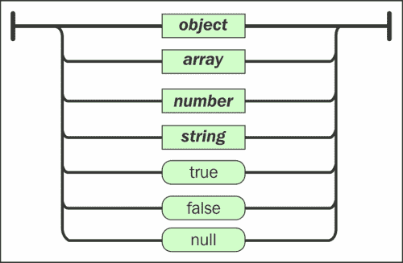

# 第二章：使用 MongoDB 进行数据建模

数据建模是应用程序构思过程中非常重要的一步，因为这一步将帮助您定义数据库构建所需的必要要求。这个定义正是在数据建模过程中获得的数据理解的结果。

如前所述，无论选择的数据模型如何，这个过程通常分为两个阶段：一个非常接近用户视图，另一个是将这个视图转换为概念模式的阶段。在关系数据库建模的场景中，主要挑战是从这两个阶段构建一个强大的数据库，以确保在应用程序生命周期中对其进行任何影响的更新。

与关系数据库相比，NoSQL 数据库在这一点上更灵活，因为它可以使用无模式模型，理论上可以在数据模型需要修改时对用户视图造成较小的影响。

尽管 NoSQL 提供了灵活性，但在建模 NoSQL 数据库时，事先了解如何使用数据是很重要的。即使在 NoSQL 数据库中，也最好不要计划要持久化的数据格式。此外，乍一看，这是数据库管理员，对关系世界非常熟悉的人，变得更加不舒服的地方。

关系数据库标准，如 SQL，通过制定规则、规范和标准，为我们带来了安全感和稳定性。另一方面，我们敢说，这种安全感使数据库设计人员远离了要存储的数据所在的领域。

应用程序开发人员也遇到了同样的问题。他们与数据库管理员之间存在明显的利益分歧，特别是在数据模型方面。

NoSQL 数据库实际上带来了数据库专业人员和应用程序之间的一种接近的需求，也需要开发人员和数据库之间的一种接近。

因此，即使您可能是数据建模师/设计师或数据库管理员，如果我们从现在开始讨论超出您舒适区域的主题，也不要害怕。准备好开始使用应用程序开发人员的观点常见的词汇，并将其添加到您的词汇表中。本章将介绍 MongoDB 数据模型以及用于开发和维护该模型的主要概念和结构。

本章将涵盖以下内容：

+   介绍您的文档和集合

+   文档的特征和结构

+   展示文档的设计和模式

# 介绍文档和集合

MongoDB 将文档作为数据的基本单元。MongoDB 中的文档以**JavaScript 对象表示法**（**JSON**）表示。

集合是文档的组合。打个比方，集合类似于关系模型中的表，文档是该表中的记录。最后，集合属于 MongoDB 中的数据库。

文档以一种称为**二进制 JSON**（**BSON**）的格式序列化在磁盘上，这是 JSON 文档的二进制表示。

文档的示例是：

```sql
{
   "_id": 123456,
   "firstName": "John",
   "lastName": "Clay",
   "age": 25,
   "address": {
      "streetAddress": "131 GEN. Almério de Moura Street",
      "city": "Rio de Janeiro",
      "state": "RJ",
      "postalCode": "20921060"
   },
   "phoneNumber":[
      {
         "type": "home",
         "number": "+5521 2222-3333"
      },
      {
         "type": "mobile",
         "number": "+5521 9888-7777"
      }
   ]
}
```

与关系模型不同，您必须声明表结构，集合不会强制执行文档的特定结构。一个集合可能包含完全不同结构的文档。

例如，在同一个`users`集合中，我们可以有：

```sql
{
   "_id": "123456",
   "username": "johnclay",
   "age": 25,
   "friends":[
      {"username": "joelsant"},
      {"username": "adilsonbat"}
   ],
   "active": true,
   "gender": "male"
}
```

我们还可以有：

```sql
{
   "_id": "654321",
   "username": "santymonty",
   "age": 25,
   "active": true,
   "gender": "male",
   "eyeColor": "brown"
}
```

除此之外，MongoDB 的另一个有趣特性是不仅数据由文档表示。基本上，所有用户与 MongoDB 的交互都是通过文档进行的。除了数据记录，文档还是一种：

+   定义可以在查询中读取、写入和/或更新的数据

+   定义将要更新的字段

+   创建索引

+   配置复制

+   从数据库中查询信息

在我们深入讨论文档的技术细节之前，让我们探索它们的结构。

## JSON

**JSON**是一种用于数据的开放标准表示的文本格式，非常适合数据传输。要深入探索 JSON 格式，您可以查看*ECMA-404 JSON 数据交换标准*，其中对 JSON 格式进行了全面描述。

### 注意

JSON 由两个标准描述：ECMA-404 和 RFC 7159。第一个更注重 JSON 语法和语法，而第二个提供了语义和安全性考虑。

顾名思义，JSON 源自 JavaScript 语言。它作为解决方案出现，用于在 Web 服务器和浏览器之间传输对象状态。尽管它是 JavaScript 的一部分，但几乎所有最流行的编程语言（如 C、Java 和 Python）都可以找到 JSON 的生成器和读取器。

JSON 格式也被认为非常友好和易读。JSON 不依赖于所选择的平台，其规范基于两种数据结构：

+   一组或一组键/值对

+   一个值有序列表

因此，为了澄清任何疑问，让我们谈谈对象。对象是一组非有序的键/值对，由以下模式表示：

```sql
{
   "key" : "value"
}
```

关于值有序列表，集合表示如下：

```sql
["value1", "value2", "value3"]
```

在 JSON 规范中，值可以是：

+   用`" "`括起来的字符串

+   一个带或不带符号的数字，以十进制（基数 10）为基础。这个数字可以有一个由句点（`.`）分隔的小数部分，或者是一个指数部分，后面跟着`e`或`E`

+   布尔值（`true`或`false`）

+   一个`null`值

+   另一个对象

+   另一个值有序数组

以下图表显示了 JSON 值结构：



以下是描述一个人的 JSON 代码示例：

```sql
{
   "name" : "Han",
   "lastname" : "Solo",
   "position" : "Captain of the Millenium Falcon",
   "species" : "human",
   "gender":"male",
   "height" : 1.8
}
```

## BSON

**BSON**意味着**Binary JSON**，换句话说，是 JSON 文档的二进制编码序列化。

### 注意

如果您想了解更多关于 BSON 的知识，我建议您查看[`bsonspec.org/`](http://bsonspec.org/)上的 BSON 规范。

如果我们将 BSON 与其他二进制格式进行比较，BSON 具有更灵活的模型优势。此外，其特点之一是它的轻量级-这是 Web 上数据传输非常重要的特性。

BSON 格式被设计为在大多数基于 C 的编程语言中易于导航，并且以非常高效的方式进行编码和解码。这就是为什么 BSON 被选择为 MongoDB 磁盘持久化的数据格式的原因。

BSON 中的数据表示类型有：

+   字符串 UTF-8（`string`）

+   整数 32 位（`int32`）

+   整数 64 位（`int64`）

+   浮点数（`double`）

+   文档（`document`）

+   数组（`document`）

+   二进制数据（`binary`）

+   布尔值 false（`\x00`或字节 0000 0000）

+   布尔值 true（`\x01`或字节 0000 0001）

+   UTC 日期时间（`int64`）- int64 是自 Unix 纪元以来的 UTC 毫秒数

+   时间戳（`int64`）-这是 MongoDB 复制和分片中使用的特殊内部类型；前 4 个字节是增量，最后 4 个字节是时间戳

+   空值（）

+   正则表达式（`cstring`）

+   JavaScript 代码（`string`）

+   JavaScript 代码 w/范围（`code_w_s`）

+   Min key() - 比所有其他可能的 BSON 元素值都要低的特殊类型

+   Max key() - 比所有其他可能的 BSON 元素值都要高的特殊类型

+   对象 ID（`byte`*12）

# 文档的特征

在我们详细讨论如何对文档进行建模之前，我们需要更好地了解一些其特征。这些特征可以决定您对文档建模的决定。

## 文档大小

我们必须记住，BSON 文档的最大长度为 16 MB。根据 BSON 规范，这个长度非常适合通过 Web 进行数据传输，并且可以避免过度使用 RAM。但这只是一个建议。如今，通过使用 GridFS，文档可以超过 16 MB 的长度。

### 注意

GridFS 允许我们将大于 BSON 最大大小的文档存储在 MongoDB 中，方法是将其分成部分或块。每个块都是一个新的文档，大小为 255K。

## 文档中字段的名称和值

有一些关于文档中字段的名称和值的事情你必须知道。首先，文档中任何字段的名称都是一个字符串。通常情况下，我们对字段名称有一些限制。它们是：

+   `_id`字段保留用于主键

+   你不能以字符`$`开头

+   名称不能有空字符，或（`.`）

此外，具有索引字段的文档必须遵守索引字段的大小限制。值不能超过 1,024 字节的最大大小。

## 文档的主键

如前一节所示，`_id`字段保留用于主键。默认情况下，这个字段必须是文档中的第一个字段，即使在插入时它不是第一个要插入的字段。在这种情况下，MongoDB 会将其移动到第一个位置。此外，根据定义，唯一索引将在此字段中创建。

`_id`字段可以有任何 BSON 类型的值，除了数组。此外，如果创建文档时没有指定`_id`字段，MongoDB 将自动创建一个 ObjectId 类型的`_id`字段。但这不是唯一的选择。只要是唯一的，你可以使用任何值来标识你的文档。还有另一种选择，即基于支持集合或乐观循环生成自增值。

## 支持集合

在这种方法中，我们使用一个单独的集合来保存序列中最后使用的值。要增加序列，首先我们应该查询最后使用的值。之后，我们可以使用`$inc`操作符来增加值。

### 注意

有一个名为`system.js`的集合，可以保存 JavaScript 代码以便重用。请注意不要在这个集合中包含应用程序逻辑。

让我们看一个例子：

```sql
db.counters.insert(
 {
 _id: "userid",
 seq: 0
 }
)

function getNextSequence(name) {
 var ret = db.counters.findAndModify(
 {
 query: { _id: name },
 update: { $inc: { seq: 1 } },
 new: true
 }
 );
 return ret.seq;
}

db.users.insert(
 {
 _id: getNextSequence("userid"),
 name: "Sarah C."
 }
)

```

## 乐观循环

通过乐观循环生成`_id`字段是通过递增每次迭代，然后尝试将其插入新文档：

```sql
function insertDocument(doc, targetCollection) {
    while (1) {
        var cursor = targetCollection.find( {}, { _id: 1 } ).sort( { _id: -1 } ).limit(1);
        var seq = cursor.hasNext() ? cursor.next()._id + 1 : 1;
        doc._id = seq;
        var results = targetCollection.insert(doc);
        if( results.hasWriteError() ) {
            if( results.writeError.code == 11000 /* dup key */ )
                continue;
            else
                print( "unexpected error inserting data: " + tojson( results ) );
        }
        break;
    }
}
```

在这个函数中，迭代执行以下操作：

1.  在`targetCollection`中搜索`_id`的最大值。

1.  为`_id`设置下一个值。

1.  设置要插入的文档的值。

1.  插入文档。

1.  在由于重复的`_id`字段而导致的错误情况下，循环会重复自身，否则迭代结束。

### 注意

这里展示的要点是理解这个工具可以提供的所有可能性和方法的基础。但是，尽管我们可以为 MongoDB 使用自增字段，但我们必须避免使用它们，因为这个工具不适用于大数据量的情况。

# 设计文档

在这一点上，我相信你一定会问自己：如果文档的基本结构是 JSON（一种如此简单和文本化的东西），那么创建 NoSQL 数据库会有什么复杂之处呢？

让我们看看！首先，是的！你是对的。NoSQL 数据库可以非常简单。但是，这并不意味着它们的结构会比关系数据库更简单。它会有所不同！

如前所述，集合不会强制你预先定义文档的结构。但这肯定是你必须在某个时候做出的决定。这个决定将影响重要的方面，特别是与查询性能有关的方面。

到目前为止，你可能也问过自己应用程序如何表示文档之间的关系。如果你直到现在才想到这个问题，那不是你的错。我们习惯于思考关系世界，比如想知道学生和他们的课程之间的关系，或者产品和订单之间的关系。

MongoDB 也有自己表示这种关系的方式。事实上，有两种方式：

+   嵌入式文档

+   引用

## 使用嵌入式文档

通过使用子文档，我们可以构建更复杂和优化的数据结构。因此，当我们建模一个文档时，我们可以选择在一个文档中嵌入相关数据。

决定在一个文档中嵌入数据往往与意图获得更好的读取性能有关，因为只需一个查询，我们就可以完全检索所需的信息。

看下面的例子：

```sql
{
   id: 1,
   title: "MongoDB Data Modeling Blog post",
   body: "MongoDB Data Modeling....",
   author: "Wilson da Rocha França",
   date: ISODate("2014-11-19"),
   comments: [
      {
         name: "Mike",
         email : "mike@mike.com",
         comment: "Mike comment...."
      },
      {
         name: "Tom",
         email : "tom@tom.com",
         comment: "Tom comment...."
      },
      {
         name: "Yuri",
         email : "yuri@yuri.com",
         comment: "Yuri comment...."
      }
   ],
   tags: ["mongodb", "modeling", "nosql"]
}
```

正如我们可以推断的，这个文档代表了一篇博客文章。这种文档的优势在于，只需一个查询，我们就可以获得向用户展示所需的所有数据。更新也是一样：只需一个查询，我们就可以修改这个文档的内容。然而，当我们决定嵌入数据时，我们必须确保文档不超过 16MB 的 BSON 大小限制。

在 MongoDB 中嵌入数据没有规则，但总体上，我们应该观察：

+   我们是否在文档之间有一对一的关系。

+   我们是否在文档之间有一对多的关系，以及“多”部分与“一”部分的关系非常依赖于“一”部分。这意味着，例如，每次我们展示“一”部分时，我们也会展示关系的“多”部分。

如果我们的模型符合前述情况之一，我们应该考虑使用嵌入式文档。

## 使用引用

规范化是帮助构建关系数据模型的基本过程。为了最小化冗余，在这个过程中我们将较大的表分成较小的表，并在它们之间定义关系。我们可以说，在 MongoDB 中创建引用是我们“规范化”模型的方式。这个引用将描述文档之间的关系。

你可能会困惑为什么我们在非关系型的世界中考虑关系，尽管这并不意味着在 NoSQL 数据库中不存在关系。我们经常会使用关系建模的概念来解决常见问题。正如前面所述，为了消除冗余，文档可以相互引用。

但等等！现在有一件非常重要的事情你应该知道：MongoDB 不支持连接。这意味着，即使有对另一个文档的引用，你仍然需要至少执行两次查询才能获取完整的所需信息。

看下面的例子：

```sql
{
   _id: 1,
   name : "Product 1",
   description: "Product 1 description",
   price: "$10,00",
   supplier : { 
      name: "Supplier 1", 
      address: "St.1", 
      telephone: "+552199999999" 
   }
}

{
   _id: 2,
   name : "Product 2",
   description: "Product 2 description",
   price: "$10,00",
   supplier : { 
      name: "Supplier 1", 
      address: "St.1", 
      telephone: "+552199999999" 
   }
}

{
   _id: 3,
   name : "Product 3",
   description: "Product 3 description",
   price: "$10,00",
   supplier : { 
      name: "Supplier 1", 
      address: "St.1", 
      telephone: "+552199999999" 
   }
}
```

在前面的例子中，我们有来自`products`集合的文档。我们可以看到，在这三个产品实例中，供应商键的值是相同的。除了这些重复的数据，我们可以有两个集合：`products`和`suppliers`，就像下面的例子中所示：

```sql
suppliers

{
   _id: 1
   name: "Supplier 1", 
   address: "St.1", 
   telephone: "+552199999999",
   products: [1, 2, 3]
}

products 

{
   _id: 1,
   name : "Product 1",
   description: "Product 1 description",
   price: "$10,00"
}

{
   _id: 2,
   name : "Product 2",
   description: "Product 2 description",
   price: "$10,00"
}

{
   _id: 3,
   name : "Product 3",
   description: "Product 3 description",
   price: "$10,00"
}
```

在这种特殊情况下，对于供应商的少量产品，基于供应商引用产品是一个不错的选择。然而，如果情况相反，更好的方法是：

```sql
suppliers

{
   _id: 1
   name: "Supplier 1", 
   address: "St.1", 
   telephone: "+552199999999"
}

products 

{
   _id: 1,
   name : "Product 1",
   description: "Product 1 description",
   price: "$10,00",
   supplier: 1
}

{
   _id: 2,
   name : "Product 2",
   description: "Product 2 description",
   price: "$10,00",
   supplier: 1
}

{
   _id: 3,
   name : "Product 3",
   description: "Product 3 description",
   price: "$10,00",
   supplier: 1
}
```

在 MongoDB 中使用引用没有规则，但总体上，我们应该观察：

+   我们是否在嵌入数据时重复相同的信息多次（这会影响读取性能）

+   我们是否需要表示多对多的关系

+   我们的模型是否是一个层次结构

如果我们的模型符合前述情况之一，我们应该考虑使用引用。

## 原子性

在设计文档时，会影响我们决策的另一个重要概念是原子性。在 MongoDB 中，操作在文档级别是原子的。这意味着我们可以一次修改一个文档。即使我们的操作在集合中的多个文档中进行，这个操作也会一次在一个文档中进行。

因此，当我们决定使用嵌入数据来建模文档时，我们只需编写操作，因为我们需要的所有数据都在同一个文档中。这与选择引用数据时的情况相反，那时我们需要许多不是原子的写操作。

# 常见的文档模式

现在我们了解了如何设计我们的文档，让我们来看一些现实生活中的问题示例，比如如何编写更好地描述实体之间关系的数据模型。

本节将向您展示一些模式，说明何时嵌入或引用文档。到目前为止，我们已经考虑了一个决定性因素：

+   是否一致性是优先级

+   是否读取是优先级

+   是否写入是优先级

+   我们将进行哪些更新查询

+   文档增长

## 一对一

一对一关系比其他关系更简单。大多数情况下，我们将使用嵌入文档来映射这种关系，特别是如果它是一个“包含”关系的话。

以下示例显示了一个客户的文档。在第一种情况下，在`customerDetails`文档中有一个引用；在第二种情况下，我们看到了一个带有嵌入数据的引用：

+   引用数据：

```sql
customer
{ 
   "_id": 5478329cb9617c750245893b
   "username" : "John Clay",
   "email": "johnclay@crgv.com",
   "password": "bf383e8469e98b44895d61b821748ae1"
}
customerDetails
{
   "customer_id": "5478329cb9617c750245893b",
   "firstName": "John",
   "lastName": "Clay",
   "gender": "male",
   "age": 25
}
```

+   使用嵌入数据：

```sql
customer
{ 
   _id: 1
   "username" : "John Clay",
   "email": "johnclay@crgv.com",
   "password": "bf383e8469e98b44895d61b821748ae1"
   "details": {
 "firstName": "John",
 "lastName": "Clay",
 "gender": "male",
 "age": 25
 }
}
```

使用嵌入文档表示关系的优势在于，当我们查询客户时，客户详细数据始终可用。因此，我们可以说客户的详细信息本身并没有意义，只有与客户数据一起才有意义。

## 一对多

一对多关系比一对一关系更复杂。为了决定何时嵌入或引用，我们必须考虑关系的“多”方。如果多方应该与其父级一起显示，那么我们应该选择嵌入数据；否则，我们可以在父级上使用引用。

让我们看一个`customer`和客户的地址的例子：

```sql
customer
{ 
   _id: 1
   "username" : "John Clay",
   "email": "johnclay@crgv.com",
   "password": "bf383e8469e98b44895d61b821748ae1"
   "details": {
      "firstName": "John",
      "lastName": "Clay",
      "gender": "male",
      "age": 25
   }
}

address
{
   _id: 1,
   "street": "Address 1, 111",
   "city": "City One",
   "state": "State One",
   "type": "billing",
   "customer_id": 1
}
{
   _id: 2,
   "street": "Address 2, 222",
   "city": "City Two",
   "state": "State Two",
   "type": "shipping",
   "customer_id": 1
}
{
   _id: 3,
   "street": "Address 3, 333",
   "city": "City Three",
   "state": "State Three",
   "type": "shipping",
   "customer_id": 1
}
```

如果每次您想要显示客户的地址时，还需要显示客户的姓名，那么建议使用嵌入文档：

```sql
customer
{ 
   _id: 1
   "username" : "John Clay",
   "email": "johnclay@crgv.com",
   "password": "bf383e8469e98b44895d61b821748ae1"
   "details": {
      "firstName": "John",
      "lastName": "Clay",
      "gender": "male",
      "age": 25
   }
   "billingAddress": [{
      "street": "Address 1, 111",
      "city": "City One",
      "state": "State One",
      "type": "billing",
   }],

   "shippingAddress": [{
      "street": "Address 2, 222",
      "city": "City Two",
      "state": "State Two",
      "type": "shipping"
   },
   {
      "street": "Address 3, 333",
      "city": "City Three",
      "state": "State Three",
      "type": "shipping"
   }]
}
```

## 多对多

一对多关系并不是一件微不足道的事情，即使在关系型宇宙中也是如此。在关系世界中，这种关系通常被表示为连接表，而在非关系世界中，它可以以许多不同的方式表示。

在以下代码中，我们将看到一个`user`和`group`关系的经典示例：

```sql
user

{
   _id: "5477fdea8ed5881af6541bf1",
   "username": "user_1",
   "password" : "3f49044c1469c6990a665f46ec6c0a41"
}

{
   _id: "54781c7708917e552d794c59",
   "username": "user_2",
   "password" : "15e1576abc700ddfd9438e6ad1c86100"
}

group

{
   _id: "54781cae13a6c93f67bdcc0a",
   "name": "group_1"
}

{
   _id: "54781d4378573ed5c2ce6100",
   "name": "group_2"
}
```

现在让我们在`User`文档中存储关系：

```sql
user

{
   _id: "5477fdea8ed5881af6541bf1",
   "username": "user_1",
   "password" : "3f49044c1469c6990a665f46ec6c0a41",
   "groups": [
      {
         _id: "54781cae13a6c93f67bdcc0a",
         "name": "group_1"
      },
      {
         _id: "54781d4378573ed5c2ce6100",
         "name": "group_2"
      }

   ]
}

{
   _id: "54781c7708917e552d794c59",
   "username": "user_2",
   "password" : "15e1576abc700ddfd9438e6ad1c86100",
   "groups": [
      {
         _id: "54781d4378573ed5c2ce6100",
         "name": "group_2"
      }

   ]
}

group
{
   _id: "54781cae13a6c93f67bdcc0a",
   "name": "group_1"
}

{
   _id: "54781d4378573ed5c2ce6100",
   "name": "group_2"
}
```

或者我们可以在`group`文档中存储关系：

```sql
user
{
   _id: "5477fdea8ed5881af6541bf1",
   "username": "user_1",
   "password" : "3f49044c1469c6990a665f46ec6c0a41"
}
{
   _id: "54781c7708917e552d794c59",
   "username": "user_2",
   "password" : "15e1576abc700ddfd9438e6ad1c86100"
}
group
{
   _id: "54781cae13a6c93f67bdcc0a",
   "name": "group_1",
   "users": [
      {
         _id: "54781c7708917e552d794c59",
         "username": "user_2",
         "password" : "15e1576abc700ddfd9438e6ad1c86100"
      }

   ]
}
{
   _id: "54781d4378573ed5c2ce6100",
   "name": "group_2",
   "users": [
      {
         _id: "5477fdea8ed5881af6541bf1",
         "username": "user_1",
         "password" :  "3f49044c1469c6990a665f46ec6c0a41"
      },
      {
         _id: "54781c7708917e552d794c59",
         "username": "user_2",
         "password" :  "15e1576abc700ddfd9438e6ad1c86100"
      }

   ]
}
```

最后，让我们在两个文档中存储关系：

```sql
user
{
   _id: "5477fdea8ed5881af6541bf1",
   "username": "user_1",
   "password" : "3f49044c1469c6990a665f46ec6c0a41",
   "groups": ["54781cae13a6c93f67bdcc0a", "54781d4378573ed5c2ce6100"]
}
{
   _id: "54781c7708917e552d794c59",
   "username": "user_2",
   "password" : "15e1576abc700ddfd9438e6ad1c86100",
   "groups": ["54781d4378573ed5c2ce6100"]
}
group
{
   _id: "54781cae13a6c93f67bdcc0a",
   "name": "group_1",
   "users": ["5477fdea8ed5881af6541bf1"]
}
{
   _id: "54781d4378573ed5c2ce6100",
   "name": "group_2",
   "users": ["5477fdea8ed5881af6541bf1", "54781c7708917e552d794c59"]
}
```

# 摘要

在本章中，您了解了如何在 MongoDB 中构建文档，检查了它们的特性，并了解了它们是如何组织成集合的。

您现在了解了已经知道应用程序领域对于设计最佳模型有多么重要，您也看到了一些可以帮助您决定如何设计文档的模式。

在下一章中，我们将看到如何查询这些集合并修改其中存储的数据。
