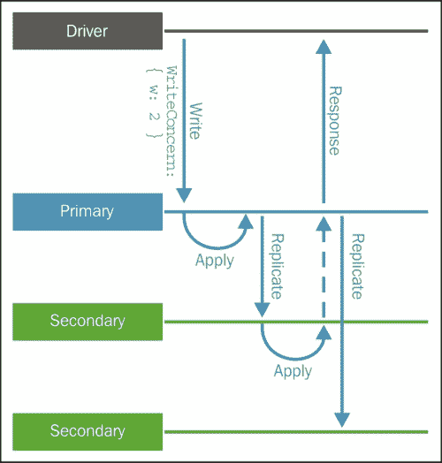

# 第三章：查询文档

在 NoSQL 数据库中，比如 MongoDB，规划查询是一项非常重要的任务，根据您要执行的查询，您的文档可能会有很大的变化。

在第二章中，*使用 MongoDB 进行数据建模*，决定在集合中引用或包含文档，在很大程度上是我们规划的结果。确定我们是否偏向于在集合中进行读取或写入是至关重要的。

在这里，我们将看到如何规划查询可以帮助我们更有效地创建文档，我们还将考虑更明智的问题，比如原子性和事务。

本章将重点关注以下主题：

+   读取操作

+   写操作

+   写入关注点

+   批量写入文档

# 理解读取操作

在数据库中，读取是最常见和基本的操作。很难想象一个仅用于写入信息的数据库，这些信息从不被读取。顺便说一句，我从未听说过这种方法。

在 MongoDB 中，我们可以通过`find`接口执行查询。`find`接口可以接受查询作为条件和投影作为参数。这将产生一个游标。游标有可以用作执行查询的修饰符的方法，比如`limit`、`map`、`skip`和`sort`。例如，看一下以下查询：

```sql
db.customers.find({"username": "johnclay"})

```

这将返回以下文档：

```sql
{
 "_id" : ObjectId("54835d0ff059b08503e200d4"),
 "username" : "johnclay",
 "email" : "johnclay@crgv.com",
 "password" : "bf383e8469e98b44895d61b821748ae1",
 "details" : {
 "firstName" : "John",
 "lastName" : "Clay",
 "gender" : "male",
 "age" : 25
 },
 "billingAddress" : [
 {
 "street" : "Address 1, 111",
 "city" : "City One",
 "state" : "State One"
 }
 ],
 "shippingAddress" : [
 {
 "street" : "Address 2, 222",
 "city" : "City Two",
 "state" : "State Two"
 },
 {
 "street" : "Address 3,333",
 "city" : "City Three",
 "state" : "State Three"
 }
 ]
}

```

我们可以使用`find`接口在 MongoDB 中执行查询。`find`接口将选择集合中的文档，并返回所选文档的游标。

与 SQL 语言相比，`find`接口应该被视为`select`语句。类似于`select`语句，我们可以使用表达式和谓词确定子句，`find`接口允许我们使用条件和投影作为参数。

如前所述，我们将在这些`find`接口参数中使用 JSON 文档。我们可以以以下方式使用`find`接口：

```sql
db.collection.find(
 {criteria}, 
 {projection}
)

```

在这个例子中：

+   `criteria`是一个 JSON 文档，将使用一些运算符指定集合中文档的选择条件

+   `projection`是一个 JSON 文档，将指定集合中将作为查询结果返回的文档字段

这两个都是可选参数，我们稍后将更详细地讨论这些。

让我们执行以下示例：

```sql
db.customers.find(
{"username": "johnclay"}, 
{_id: 1, username: 1, details: 1}
)

```

在这个例子中：

+   `{"username": "johnclay"}`是条件

+   `{_id: 1, username: 1, details: 1}`是投影

这个查询将产生这个文档：

```sql
{
 "_id" : ObjectId("54835d0ff059b08503e200d4"),
 "username" : "johnclay",
 "details" : {
 "firstName" : "John",
 "lastName" : "Clay",
 "gender" : "male",
 "age" : 25
 }
}

```

## 选择所有文档

如前所述，在`find`接口中，条件和投影参数都是可选的。在没有任何参数的情况下使用`find`接口意味着选择集合中的所有文档。

### 注意

请注意，查询结果是一个包含所有所选文档的游标。

因此，`products`集合中的查询以这种方式执行：

```sql
db.products.find()

```

它将返回：

```sql
{ 
 "_id" : ObjectId("54837b61f059b08503e200db"), 
 "name" : "Product 1", 
 "description" : "Product 1 description", 
 "price" : 10, 
 "supplier" : { 
 "name" : "Supplier 1", 
 "telephone" : "+552199998888" 
 } 
}
{ 
 "_id" : ObjectId("54837b65f059b08503e200dc"), 
 "name" : "Product 2", 
 "description" : "Product 2 description", 
 "price" : 20, 
 "supplier" : { 
 "name" : "Supplier 2", 
 "telephone" : "+552188887777" 
 } 
}
…

```

## 使用条件选择文档

尽管方便，但选择集合中的所有文档可能会因为集合的长度而变得不切实际。举个例子，如果一个集合中有数百、数千或数百万条记录，就必须创建一个标准，以便只选择我们想要的文档。

然而，没有什么可以阻止查询结果变得非常庞大。在这种情况下，根据执行查询的所选驱动器，我们必须迭代返回的游标。

### 注意

请注意，在 mongo shell 中，返回记录的默认值为 20。

让我们检查以下示例查询。我们想选择属性名称为`Product 1`的文档：

```sql
db.products.find({name: "Product 1"});

```

这将给我们一个结果：

```sql
{
 "_id" : ObjectId("54837b61f059b08503e200db"),
 "name" : "Product 1",
 "description" : "Product 1 description",
 "price" : 10,
 "supplier" : {
 "name" : "Supplier 1",
 "telephone" : "+552199998888"
 }
}

```

上述查询通过相等性`{name: "Product 1"}`选择文档。还可以在条件接口上使用运算符。

以下示例演示了如何选择所有价格大于 10 的文档：

```sql
db.products.find({price: {$gt: 10}});

```

这将产生如下结果：

```sql
{ 
 "_id" : ObjectId("54837b65f059b08503e200dc"), 
 "name" : "Product 2", 
 "description" : "Product 2 description", 
 "price" : 20, 
 "supplier" : { 
 "name" : "Supplier 2", 
 "telephone" : "+552188887777" 
 } 
}
{ 
 "_id" : ObjectId("54837b69f059b08503e200dd"), 
 "name" : "Product 3", 
 "description" : "Product 3 description", 
 "price" : 30, 
 "supplier" : { 
 "name" : "Supplier 3", 
 "telephone" : "+552177776666" 
 }
}

```

当我们使用 `$gt` 运算符执行查询时，只有价格信息大于 10 的文档将作为游标结果返回。

此外，还有其他运算符，如比较、逻辑、元素、评估、地理和数组运算符。

例如，我们从 `products` 集合中选择的文档如下所示：

```sql
{
 "_id" : ObjectId("54837b61f059b08503e200db"),
 "name" : "Product 1",
 "description" : "Product 1 description",
 "price" : 10,
 "supplier" : {
 "name" : "Supplier 1",
 "telephone" : "+552199998888"
 },
 "review" : [
 {
 "customer" : {
 "email" : "customer@customer.com"
 },
 "stars" : 5
 },
 {
 "customer" : {
 "email" : "customer2@customer.com"
 },
 "stars" : 6
 }
 ]
}
{
 "_id" : ObjectId("54837b65f059b08503e200dc"),
 "name" : "Product 2",
 "description" : "Product 2 description",
 "price" : 20,
 "supplier" : {
 "name" : "Supplier 2",
 "telephone" : "+552188887777"
 },
 "review" : [
 {
 "customer" : {
 "email" : "customer@customer.com"
 },
 "stars" : 10
 },
 {
 "customer" : {
 "email" : "customer2@customer.com"
 },
 "stars" : 2
 }
 ]
}
{
 "_id" : ObjectId("54837b69f059b08503e200dd"),
 "name" : "Product 3",
 "description" : "Product 3 description",
 "price" : 30,
 "supplier" : {
 "name" : "Supplier 3",
 "telephone" : "+552177776666"
 },
 "review" : [
 {
 "customer" : {
 "email" : "customer@customer.com"
 },
 "stars" : 5
 },
 {
 "customer" : {
 "email" : "customer2@customer.com"
 },
 "stars" : 9
 }
 ]
}

```

## 比较运算符

MongoDB 为我们提供了一种定义值之间相等关系的方式。通过比较运算符，我们可以比较 BSON 类型的值。让我们看看这些运算符：

+   `$gte` 运算符负责搜索等于或大于查询中指定值的值。如果我们执行查询 `db.products.find({price: {$gte: 20}})`，它将返回：

```sql
{
 "_id" : ObjectId("54837b65f059b08503e200dc"),
 "name" : "Product 2",
 "description" : "Product 2 description",
 "price" : 20,
 "supplier" : {
 "name" : "Supplier 2",
 "telephone" : "+552188887777"
 },
 "review" : [
 {
 "customer" : {
 "email" : "customer@customer.com"
 },
 "stars" : 10
 },
 {
 "customer" : {
 "email" : "customer2@customer.com"
 },
 "stars" : 2
 }
 ]
}
{
 "_id" : ObjectId("54837b69f059b08503e200dd"),
 "name" : "Product 3",
 "description" : "Product 3 description",
 "price" : 30,
 "supplier" : {
 "name" : "Supplier 3",
 "telephone" : "+552177776666"
 },
 "review" : [
 {
 "customer" : {
 "email" : "customer@customer.com"
 },
 "stars" : 5
 },
 {
 "customer" : {
 "email" : "customer2@customer.com"
 },
 "stars" : 9
 }
 ]
}

```

+   使用 `$lt` 运算符，可以搜索小于查询中请求的值的值。查询 `db.products.find({price: {$lt: 20}})` 将返回：

```sql
{
 "_id" : ObjectId("54837b61f059b08503e200db"),
 "name" : "Product 1",
 "description" : "Product 1 description",
 "price" : 10,
 "supplier" : {
 "name" : "Supplier 1",
 "telephone" : "+552199998888"
 },
 "review" : [
 {
 "customer" : {
 "email" : "customer@customer.com"
 },
 "stars" : 5
 },
 {
 "customer" : {
 "email" : "customer2@customer.com"
 },
 "stars" : 6
 }
 ]
}

```

+   `$lte` 运算符搜索小于或等于查询中请求的值的值。如果我们执行查询 `db.products.find({price: {$lte: 20}})`，它将返回：

```sql
{
 "_id" : ObjectId("54837b61f059b08503e200db"),
 "name" : "Product 1",
 "description" : "Product 1 description",
 "price" : 10,
 "supplier" : {
 "name" : "Supplier 1",
 "telephone" : "+552199998888"
 },
 "review" : [
 {
 "customer" : {
 "email" : "customer@customer.com"
 },
 "stars" : 5
 },
 {
 "customer" : {
 "email" : "customer2@customer.com"
 },
 "stars" : 6
 }
 ]
}
{
 "_id" : ObjectId("54837b65f059b08503e200dc"),
 "name" : "Product 2",
 "description" : "Product 2 description",
 "price" : 20,
 "supplier" : {
 "name" : "Supplier 2",
 "telephone" : "+552188887777"
 },
 "review" : [
 {
 "customer" : {
 "email" : "customer@customer.com"
 },
 "stars" : 10
 },
 {
 "customer" : {
 "email" : "customer2@customer.com"
 },
 "stars" : 2
 }
 ]
}

```

+   `$in` 运算符能够搜索任何字段值等于查询中请求的数组中指定的值的文档。执行查询 `db.products.find({price:{$in: [5, 10, 15]}})` 将返回：

```sql
{
 "_id" : ObjectId("54837b61f059b08503e200db"),
 "name" : "Product 1",
 "description" : "Product 1 description",
 "price" : 10,
 "supplier" : {
 "name" : "Supplier 1",
 "telephone" : "+552199998888"
 },
 "review" : [
 {
 "customer" : {
 "email" : "customer@customer.com"
 },
 "stars" : 5
 },
 {
 "customer" : {
 "email" : "customer2@customer.com"
 },
 "stars" : 6
 }
 ]
}

```

+   `$nin` 运算符将匹配不包含在指定数组中的值。执行 `db.products.find({price:{$nin: [10, 20]}})` 查询将产生：

```sql
{
 "_id" : ObjectId("54837b69f059b08503e200dd"),
 "name" : "Product 3",
 "description" : "Product 3 description",
 "price" : 30,
 "supplier" : {
 "name" : "Supplier 3",
 "telephone" : "+552177776666"
 },
 "review" : [
 {
 "customer" : {
 "email" : "customer@customer.com"
 },
 "stars" : 5
 },
 {
 "customer" : {
 "email" : "customer2@customer.com"
 },
 "stars" : 9
 }
 ]
}

```

+   `$ne` 运算符将匹配任何不等于查询中指定值的值。执行 `db.products.find({name: {$ne: "Product 1"}})` 查询将产生：

```sql
{
 "_id" : ObjectId("54837b65f059b08503e200dc"),
 "name" : "Product 2",
 "description" : "Product 2 description",
 "price" : 20,
 "supplier" : {
 "name" : "Supplier 2",
 "telephone" : "+552188887777"
 },
 "review" : [
 {
 "customer" : {
 "email" : "customer@customer.com"
 },
 "stars" : 10
 },
 {
 "customer" : {
 "email" : "customer2@customer.com"
 },
 "stars" : 2
 }
 ]
}
{
 "_id" : ObjectId("54837b69f059b08503e200dd"),
 "name" : "Product 3",
 "description" : "Product 3 description",
 "price" : 30,
 "supplier" : {
 "name" : "Supplier 3",
 "telephone" : "+552177776666"
 },
 "review" : [
 {
 "customer" : {
 "email" : "customer@customer.com"
 },
 "stars" : 5
 },
 {
 "customer" : {
 "email" : "customer2@customer.com"
 },
 "stars" : 9
 }
 ]
}

```

## 逻辑运算符

逻辑运算符是我们在 MongoDB 中定义值之间逻辑关系的方式。这些源自布尔代数，布尔值的真值可以是 `true` 或 `false`。让我们看看 MongoDB 中的逻辑运算符：

+   `$and` 运算符将在表达式数组中执行逻辑 *AND* 操作，并返回匹配所有指定条件的值。执行 `db.products.find({$and: [{price: {$lt: 30}}, {name: "Product 2"}]})` 查询将产生：

```sql
{
 "_id" : ObjectId("54837b65f059b08503e200dc"),
 "name" : "Product 2",
 "description" : "Product 2 description",
 "price" : 20,
 "supplier" : {
 "name" : "Supplier 2",
 "telephone" : "+552188887777"
 },
 "review" : [
 {
 "customer" : {
 "email" : "customer@customer.com"
 },
 "stars" : 10
 },
 {
 "customer" : {
 "email" : "customer2@customer.com"
 },
 "stars" : 2
 }
 ]
}

```

+   `$or` 运算符将在表达式数组中执行逻辑 *OR* 操作，并返回匹配任一指定条件的所有值。执行 `db.products.find({$or: [{price: {$gt: 50}}, {name: "Product 3"}]})` 查询将产生：

```sql
{
 "_id" : ObjectId("54837b69f059b08503e200dd"),
 "name" : "Product 3",
 "description" : "Product 3 description",
 "price" : 30,
 "supplier" : {
 "name" : "Supplier 3",
 "telephone" : "+552177776666"
 },
 "review" : [
 {
 "customer" : {
 "email" : "customer@customer.com"
 },
 "stars" : 5
 },
 {
 "customer" : {
 "email" : "customer2@customer.com"
 },
 "stars" : 9
 }
 ]
}

```

+   `$not` 运算符反转查询效果，并返回不匹配指定运算符表达式的值。它用于否定任何操作。执行 `db.products.find({price: {$not: {$gt: 10}}})` 查询将产生：

```sql
{
 "_id" : ObjectId("54837b61f059b08503e200db"),
 "name" : "Product 1",
 "description" : "Product 1 description",
 "price" : 10,
 "supplier" : {
 "name" : "Supplier 1",
 "telephone" : "+552199998888"
 },
 "review" : [
 {
 "customer" : {
 "email" : "customer@customer.com"
 },
 "stars" : 5
 },
 {
 "customer" : {
 "email" : "customer2@customer.com"
 },
 "stars" : 6
 }
 ]
}

```

+   `$nor` 运算符将在表达式数组中执行逻辑 *NOR* 操作，并返回所有未能匹配数组中所有指定表达式的值。执行 `db.products.find({$nor:[{price:{$gt: 35}}, {price:{$lte: 20}}]})` 查询将产生：

```sql
{
 "_id" : ObjectId("54837b69f059b08503e200dd"),
 "name" : "Product 3",
 "description" : "Product 3 description",
 "price" : 30,
 "supplier" : {
 "name" : "Supplier 3",
 "telephone" : "+552177776666"
 },
 "review" : [
 {
 "customer" : {
 "email" : "customer@customer.com"
 },
 "stars" : 5
 },
 {
 "customer" : {
 "email" : "customer2@customer.com"
 },
 "stars" : 9
 }
 ]
}

```

## 元素运算符

要查询集合关于我们文档字段的信息，我们可以使用元素运算符。

`$exists` 运算符将返回查询中具有指定字段的所有文档。执行 `db.products.find({sku: {$exists: true}})` 将不会返回任何文档，因为它们都没有 `sku` 字段。

## 评估运算符

评估运算符是我们在 MongoDB 中对表达式进行评估的方式。我们必须小心使用这种类型的运算符，特别是如果我们正在使用的字段没有索引。让我们考虑评估运算符：

+   `$regex` 运算符将返回所有匹配正则表达式的值。执行 `db.products.find({name: {$regex: /2/}})` 将返回：

```sql
{
 "_id" : ObjectId("54837b65f059b08503e200dc"),
 "name" : "Product 2",
 "description" : "Product 2 description",
 "price" : 20,
 "supplier" : {
 "name" : "Supplier 2",
 "telephone" : "+552188887777"
 },
 "review" : [
 {
 "customer" : {
 "email" : "customer@customer.com"
 },
 "stars" : 10
 },
 {
 "customer" : {
 "email" : "customer2@customer.com"
 },
 "stars" : 2
 }
 ]
}

```

## 数组运算符

当我们在查询中使用数组时，应该使用数组运算符。让我们考虑数组运算符：

+   `$elemMatch`操作符将返回所有指定数组字段值至少有一个与查询条件匹配的元素的文档。

`db.products.find({review: {$elemMatch: {stars: {$gt: 5}, customer: {email: "customer@customer.com"}}}})`查询将查看所有集合文档，其中`review`字段有文档，`stars`字段值大于`5`，并且`customer email`是`customer@customer.com`：

```sql
{
 "_id" : ObjectId("54837b65f059b08503e200dc"),
 "name" : "Product 2",
 "description" : "Product 2 description",
 "price" : 20,
 "supplier" : {
 "name" : "Supplier 2",
 "telephone" : "+552188887777"
 },
 "review" : [
 {
 "customer" : {
 "email" : "customer@customer.com"
 },
 "stars" : 10
 },
 {
 "customer" : {
 "email" : "customer2@customer.com"
 },
 "stars" : 2
 }
 ]
}

```

### 注意

除了已呈现的操作符外，我们还有：`$mod`，`$text`，`$where`，`$all`，`$geoIntersects`，`$geoWithin`，`$nearSphere`，`$near`，`$size`和`$comment`。您可以在 MongoDB 手册参考中找到更多关于这方面的信息[`docs.mongodb.org/manual/reference/operator/query/`](http://docs.mongodb.org/manual/reference/operator/query/)。

## 投影

到目前为止，我们执行的查询中呈现的结果是文档在 MongoDB 中持久化的样子。但是，为了优化 MongoDB 与其客户端之间的网络开销，我们应该使用投影。

正如您在本章开头看到的，`find`接口允许我们使用两个参数。第二个参数是投影。

通过在上一节中使用的相同示例集合，具有投影的查询示例将是：

```sql
db.products.find({price: {$not: {$gt: 10}}}, {name: 1, description: 1})

```

这个查询产生：

```sql
{
 "_id" : ObjectId("54837b61f059b08503e200db"),
 "name" : "Product 1",
 "description" : "Product 1 description"
}

```

投影是一个 JSON 文档，其中包含我们想要呈现或隐藏的所有字段，后面跟着`0`或`1`，取决于我们的需求。

当一个字段后面跟着`0`，那么这个字段将不会显示在结果文档中。另一方面，如果字段后面跟着`1`，那么这意味着它将显示在结果文档中。

### 注意

默认情况下，`_id`字段的值为`1`。

`db.products.find({price: {$not: {$gt: 10}}}, {_id: 0, name: 1, "supplier.name": 1})`查询将显示以下文档：

```sql
{ "name" : "Product 1", "supplier" : { "name" : "Supplier 1" } }

```

在具有数组值的字段中，我们可以使用`$elemMatch`，`$split`，`$slice`和`$`等操作符。

`db.products.find({price: {$gt: 20}}, {review: {$elemMatch: {stars: 5}}})` 查询将产生：

```sql
{
 "_id" : ObjectId("54837b69f059b08503e200dd"),
 "review" : [
 {
 "customer" : {
 "email" : "customer@customer.com"
 },
 "stars" : 5
 }
 ]
}

```

# 介绍写操作

在 MongoDB 中，我们有三种写操作：插入、更新和删除。为了运行这些操作，MongoDB 提供了三个接口：`db.document.insert`，`db.document.update`和`db.document.remove`。MongoDB 中的写操作针对特定集合，并且在单个文档级别上是原子的。

在 MongoDB 中，当我们对文档进行建模时，写操作和读操作一样重要。单个文档级别的原子性可以决定我们是否嵌入文档。我们将在第七章*扩展*中更详细地讨论这个问题，但选择分片键的活动将决定我们是否写入操作的性能，因为根据键的选择，我们将在一个或多个分片上进行写入。

此外，写操作性能的另一个决定因素与 MongoDB 物理模型有关。10gen 提出了许多建议，但让我们专注于对我们的开发产生最大影响的建议。由于 MongoDB 的更新模型是基于随机 I/O 操作的，建议您使用固态硬盘或 SSD。与旋转硬盘相比，固态硬盘在随机 I/O 操作方面具有更高的性能。尽管旋转硬盘更便宜，基于这种硬件的基础设施扩展成本也不是很昂贵，但使用 SSD 或增加 RAM 仍然更有效。关于这个主题的研究表明，SSD 在随机 I/O 操作方面比旋转硬盘性能提高了 100 倍。

关于写操作的另一个重要事项是了解 MongoDB 如何实际将文档写入磁盘。MongoDB 使用日志记录机制来写入操作，该机制在写入数据文件之前使用日志来写入更改操作。这在发生脏关闭时非常有用。当`mongod`进程重新启动时，MongoDB 将使用日志文件将数据库状态恢复到一致状态。

如第二章中所述，“使用 MongoDB 进行数据建模”，BSON 规范允许我们拥有最大大小为 16MB 的文档。自其 2.6 版本以来，MongoDB 使用了一种名为“二次幂大小分配”的记录或文档的空间分配策略。正如其名称所示，MongoDB 将为每个文档分配一个字节大小，即其大小的二次幂（例如，32、64、128、256、512，...），考虑到文档的最小大小为 32 字节。该策略分配的空间比文档实际需要的空间更多，从而为其提供更多的增长空间。

## 插入

`insert`接口是在 MongoDB 中创建新文档的可能方式之一。`insert`接口具有以下语法：

```sql
db.collection.insert(
 <document or array of documents>, 
 { 
 writeConcern: <document>, 
 ordered: <boolean> 
 }
)

```

在这里：

+   `文档或文档数组`是一个文档或一个包含一个或多个文档的数组，应该在目标集合中创建。

+   `writeConcern`是表示写入关注的文档。

+   `ordered`应该是一个布尔值，如果为 true，将在数组的文档上执行有序过程，如果文档中有错误，MongoDB 将停止处理它。否则，如果值为 false，将执行无序过程，如果发生错误，将不会停止。默认情况下，值为`true`。

在下面的示例中，我们可以看到如何使用`insert`操作：

```sql
db.customers.insert({
 username: "customer1", 
 email: "customer1@customer.com", 
 password: hex_md5("customer1paswd")
})

```

由于我们没有为`_id`字段指定值，它将自动生成具有唯一`ObjectId`值的值。此`insert`操作创建的文档是：

```sql
{ 
 "_id" : ObjectId("5487ada1db4ff374fd6ae6f5"), 
 "username" : "customer1", 
 "email" : "customer1@customer.com", 
 "password" : "b1c5098d0c6074db325b0b9dddb068e1" 
}

```

正如您在本节的第一段中观察到的，`insert`接口不是在 MongoDB 中创建新文档的唯一方式。通过在更新上使用`upsert`选项，我们也可以创建新文档。现在让我们更详细地了解一下这个。

## 更新

`update`接口用于修改 MongoDB 中先前存在的文档，甚至创建新文文档。为了选择要更改的文档，我们将使用条件。更新可以修改文档的字段值或整个文档。

更新操作一次只会修改一个文档。如果条件匹配多个文档，则需要通过`multi`参数为`true`的文档传递给 update 接口。如果条件不匹配任何文档，并且`upsert`参数为`true`，则将创建一个新文档，否则将更新匹配的文档。

`update`接口表示为：

```sql
db.collection.update(
 <query>,
 <update>,
 { 
 upsert: <boolean>, 
 multi: <boolean>, 
 writeConcern: <document> 
 }
)

```

在这里：

+   `query`是条件

+   `update`是包含要应用的修改的文档

+   `upsert`是一个布尔值，如果为 true，则在集合中没有匹配任何文档的情况下创建一个新文档

+   `multi`是一个布尔值，如果为 true，则更新满足条件的每个文档

+   `writeConcern`是表示写入关注的文档

使用上一节中创建的文档，示例更新将是：

```sql
db.customers.update(
 {username: "customer1"}, 
 {$set: {email: "customer1@customer1.com"}}
)

```

修改后的文档是：

```sql
{ 
 "_id" : ObjectId("5487ada1db4ff374fd6ae6f5"), 
 "username" : "customer1", 
 "email" : "customer1@customer1.com", 
 "password" : "b1c5098d0c6074db325b0b9dddb068e1"
}

```

`$set`运算符允许我们仅更新匹配文档的`email`字段。

否则，您可能会有此更新：

```sql
db.customers.update(
 {username: "customer1"}, 
 {email: "customer1@customer1.com"}
)

```

在这种情况下，修改后的文档将是：

```sql
{ 
 "_id" : ObjectId("5487ada1db4ff374fd6ae6f5"), 
 "email" : "customer1@customer1.com" 
}

```

也就是说，没有`$set`运算符，我们使用传递给更新的参数修改旧文档。除了`$set`运算符之外，我们还有其他重要的更新运算符：

+   `$inc`增加具有指定值的字段的值：

```sql
db.customers.update(
 {username: "johnclay"}, 
 {$inc: {"details.age": 1}}
)

```

此更新将在匹配文档中将字段`details.age`增加 1。

+   `$rename`将重命名指定的字段：

```sql
db.customers.update(
 {email: "customer1@customer1.com"}, 
 {$rename: {username: "login"}}
)

```

此更新将在匹配的文档中将字段`username`重命名为`login`。

+   `$unset`将从匹配的文档中删除字段：

```sql
db.customers.update(
 {email: "customer1@customer1.com"}, 
 {$unset: {login: ""}}
)

```

此更新将从匹配的文档中删除`login`字段。

由于写操作在单个文档级别是原子的，我们可以在使用前面的操作符时放心大胆。所有这些操作符都可以安全使用。

## 写关注点

围绕非关系型数据库的许多讨论与 ACID 概念有关。作为数据库专业人员、软件工程师、架构师和开发人员，我们对关系型宇宙非常熟悉，并且花费了大量时间开发而不关心 ACID 问题。

尽管如此，我们现在应该明白为什么我们真的必须考虑这个问题，以及这些简单的四个字母在非关系型世界中是如此重要。在本节中，我们将讨论**D**这个字母，在 MongoDB 中意味着持久性。

数据库系统中的持久性是一个属性，告诉我们写入操作是否成功，事务是否已提交，数据是否已写入非易失性存储器中，例如硬盘。

与关系型数据库系统不同，NoSQL 数据库中对写操作的响应由客户端确定。再次，我们有可能在数据建模上做出选择，满足客户的特定需求。

在 MongoDB 中，成功写入操作的响应可以有多个级别的保证。这就是我们所说的写入关注点。这些级别从弱到强不等，客户端确定保证的强度。在同一个集合中，我们可以有一个需要强写入关注点的客户端，另一个需要弱写入关注点的客户端。

MongoDB 提供给我们的写入关注点级别是：

+   未确认

+   确认

+   已记录

+   副本已确认

### 未确认

顾名思义，使用未确认的写入关注点，客户端将不会尝试响应写入操作。如果可能的话，只会捕获网络错误。以下图表显示驱动程序将不等待 MongoDB 确认接收写入操作：

！[未确认]（img / B04075_03_01.jpg）

在以下示例中，我们在`customers`集合中进行了一个未确认的写入操作：

```sql
db.customers.insert(
{username: "customer1", email: "customer1@customer.com", password: hex_md5("customer1paswd")}, 
{writeConcern: {w: 0}}
)

```

### 确认

使用此写入关注点，客户端将收到写入操作的确认，并看到它已在 MongoDB 的内存视图上写入。在这种模式下，客户端可以捕获网络错误和重复键等问题。自 MongoDB 2.6 版本以来，这是默认的写入关注点。

正如您之前看到的，我们无法保证 MongoDB 的内存视图上的写入将持久保存在磁盘上。如果 MongoDB 发生故障，内存视图中的数据将丢失。以下图表显示驱动程序等待 MongoDB 确认接收写入操作，并将更改应用于数据的内存视图：

！[已确认]（img / B04075_03_02.jpg）

在以下示例中，我们在`customers`集合中进行了一个已确认的写入操作：

```sql
db.customers.insert(
{username: "customer1", email: "customer1@customer.com", password: hex_md5("customer1paswd")}, 
{writeConcert: {w: 1}}
)

```

### 已记录

使用已记录的写入关注点，客户端将收到确认写入操作已在日志中提交的确认。因此，客户端将保证数据将持久保存在磁盘上，即使发生了 MongoDB 的故障。

为了减少使用已记录的写入关注点时的延迟，MongoDB 将将操作提交到日志的频率从默认值 100 毫秒降低到 30 毫秒。以下图表显示驱动程序将等待 MongoDB 确认接收写入操作，只有在将数据提交到日志后才会等待：

！[已记录]（img / B04075_03_03.jpg）

在下面的示例中，我们在`customers`集合中使用了一个日志写关注的`insert`：

```sql
db.customers.insert(
{username: "customer1", email: "customer1@customer.com", password: hex_md5("customer1paswd")}, 
{writeConcern: {w: 1, j: true}}

)

```

### 副本已确认

当我们使用副本集时，重要的是要确保写操作不仅在主节点上成功，而且还传播到副本集的成员。为此，我们使用了一个副本已确认的写关注。

通过将默认写关注更改为副本已确认，我们可以确定我们希望从副本集的成员中获得写操作确认的数量。下图显示了驱动程序将等待 MongoDB 确认在指定数量的副本集成员上接收写操作：



在下面的示例中，我们将等待写操作传播到主节点和至少两个辅助节点：

```sql
db.customers.insert(
{username: "customer1", email: "customer1@customer.com", password: hex_md5("customer1paswd")}, 
{writeConcern: {w: 3}}
)

```

我们应该在毫秒级别包含一个超时属性，以避免写操作在节点故障的情况下仍然被阻塞。

在下面的示例中，我们将等待写操作传播到主节点和至少两个辅助节点，并设置了三秒的超时。如果我们期望响应的两个辅助节点中的一个失败，那么该方法将在三秒后超时：

```sql
db.customers.insert(
{username: "customer1", email: "customer1@customer.com", password: hex_md5("customer1paswd")}, 
{writeConcern: {w: 3, wtimeout: 3000}}
)

```

## 批量编写文档

有时，一次插入、更新或删除集合中的多条记录是非常有用的。MongoDB 为我们提供了执行批量写操作的能力。批量操作在单个集合中工作，可以是有序的或无序的。

与`insert`方法一样，有序批量操作的行为是按顺序处理记录，如果发生错误，MongoDB 将返回而不处理任何剩余的操作。

无序操作的行为是并行处理，因此如果发生错误，MongoDB 仍将处理剩余的操作。

我们还可以确定批量写操作所需的确认级别。自其 2.6 版本以来，MongoDB 引入了新的批量方法，我们可以使用这些方法插入、更新或删除文档。但是，我们只能通过在`insert`方法上传递文档数组来进行批量插入。

在下面的示例中，我们使用`insert`方法进行批量插入：

```sql
db.customers.insert(
[
{username: "customer3", email: "customer3@customer.com", password: hex_md5("customer3paswd")}, 
{username: "customer2", email: "customer2@customer.com", password: hex_md5("customer2paswd")}, 
{username: "customer1", email: "customer1@customer.com", password: hex_md5("customer1paswd")}
]
)

```

在下面的示例中，我们使用新的批量方法进行无序批量插入：

```sql
var bulk = db.customers.initializeUnorderedBulkOp();
bulk.insert({username: "customer1", email: "customer1@customer.com", password: hex_md5("customer1paswd")});
bulk.insert({username: "customer2", email: "customer2@customer.com", password: hex_md5("customer2paswd")});
bulk.insert({username: "customer3", email: "customer3@customer.com", password: hex_md5("customer3paswd")});
bulk.execute({w: "majority", wtimeout: 3000});

```

我们应该利用 MongoDB 提供给我们的所有强大工具，但不要忽视任何可能的注意事项。MongoDB 一次最多执行 1,000 个批量操作的限制。因此，如果超过此限制，MongoDB 将把操作分成最多 1,000 个批量操作的组。

# 摘要

在本章中，您希望能够更好地理解 MongoDB 中的读写操作。此外，现在，您还应该明白为什么在文档建模过程之前就已经知道需要执行的查询是很重要的。最后，您学会了如何使用 MongoDB 的属性，比如原子性，在文档级别上，并看到它如何帮助我们生成更好的查询。

在下一章中，您将看到一种称为索引的特殊数据结构如何改进我们查询的执行。
