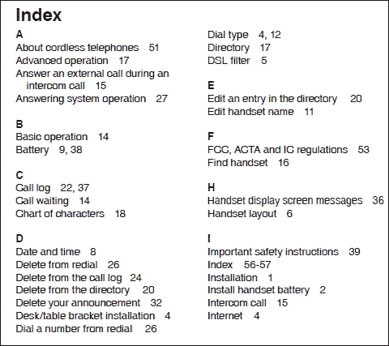

# 第四章：索引

正如您在关系数据库的主题中所看到的，索引是在考虑性能提升时重要的结构。实际上，索引非常重要，以至于对于大多数数据库管理员来说，它们是搜索持续改进数据库性能的关键工具。

在 MongoDB 等 NoSQL 数据库中，索引是更大策略的一部分，这将使我们能够在性能上获得许多收益，并为我们的数据库分配重要的行为，这对数据模型的维护至关重要。

这是因为在 MongoDB 中，我们可以有具有非常特殊属性的索引。例如，我们可以定义一个日期类型字段的索引，该索引将控制何时从集合中删除文档。

因此，在本章中我们将看到：

+   索引文档

+   索引类型

+   特殊索引属性

# 索引文档

在本书迄今为止讨论的所有主题中，这是我们最熟悉的地方。索引概念几乎存在于每个关系数据库中，因此如果您对此有任何基本的先前知识，您在本章中很可能不会有困难。

但是，如果您觉得自己对索引的概念不够熟悉，理解它们的简单方法是与书籍进行类比。假设我们有一本书，其索引如下：



有了这个，如果我们决定阅读有关互联网的信息，我们知道在第**4**页上会找到有关这个主题的信息。另一方面，如果没有页码，我们如何能找到我们正在寻找的信息呢？答案很简单：逐页浏览整本书，直到找到“互联网”这个词。

正如您可能已经知道的那样，索引是保存来自我们主要数据源的数据部分的数据结构。在关系数据库中，索引保存表的部分，而在 MongoDB 中，由于索引是在集合级别上的，这些将保存文档的部分。与关系数据库类似，索引在实现级别使用 B-Tree 数据结构。

根据我们应用程序的要求，我们可以创建字段的索引或嵌入文档的字段。当我们创建索引时，它将保存我们选择的字段的排序值集。

因此，当我们执行查询时，如果有一个覆盖查询条件的索引，MongoDB 将使用该索引来限制要扫描的文档数量。

我们有一个`customers`集合，我们在第三章中使用过，*查询文档*，其中包含这些文档：

```sql
{
 "_id" : ObjectId("54aecd26867124b88608b4c9"),
 "username" : "customer1",
 "email" : "customer1@customer.com",
 "password" : "b1c5098d0c6074db325b0b9dddb068e1"
}

```

我们可以在 mongo shell 上使用`createIndex`方法在`username`字段上创建索引：

```sql
db.customers.createIndex({username: 1})

```

以下查询将使用先前创建的索引：

```sql
db.customers.find({username: "customer1"})

```

### 注意

自 3.0.0 版本以来，`ensureIndex`方法已被弃用，并且是`createIndex`方法的别名。

我们可以说这是在 MongoDB 中创建和使用索引的最简单方法。除此之外，我们还可以在多键字段或嵌入文档的字段上创建索引，例如。

在下一节中，我们将介绍所有这些索引类型。

## 对单个字段进行索引

正如我们在上一节中所述，在 MongoDB 上创建索引的最简单方法是在单个字段上这样做。索引可以在文档集合中的任何类型的字段上创建。

考虑到我们之前使用过的`customers`集合，对其进行了一些修改以适应本节的工作：

```sql
{
 "_id" : ObjectId("54aecd26867124b88608b4c9"),
 "username" : "customer1",
 "email" : "customer1@customer.com",
 "password" : "b1c5098d0c6074db325b0b9dddb068e1",
 "age" : 25,
 "address" : {

 "street" : "Street 1",
 "zipcode" : "87654321",
 "state" : "RJ"

 }
}

```

以下命令在`username`字段中创建一个升序索引：

```sql
db.customers.createIndex({username: 1})

```

为了在 MongoDB 中创建索引，我们使用`createIndex`方法。在前面的代码中，我们只是将单个文档作为参数传递给`createIndex`方法。文档`{username: 1}`包含对应于应该创建索引的字段和顺序的引用：1 表示升序，-1 表示降序。

创建相同的索引的另一种方法，但按降序顺序进行：

```sql
db.customers.createIndex({username: -1})

```

在下面的查询中，MongoDB 将使用在`username`字段中创建的索引来减少应该检查的`customers`集合中文档的数量：

```sql
db.customers.find({username: "customer1"})

```

除了在集合文档中的字符串或数字字段上创建索引，我们还可以在嵌入式文档的字段上创建索引。因此，这样的查询将使用创建的索引：

```sql
db.customers.createIndex({"address.state": 1})

```

以下代码创建了嵌入地址文档的`state`字段的索引：

```sql
db.customers.find({"address.state": "RJ"})

```

虽然有点复杂，但我们也可以创建整个嵌入式文档的索引：

```sql
db.customers.createIndex({address: 1})

```

以下查询将使用索引：

```sql
db.customers.find(
{
 "address" : 
 { 
 "street" : "Street 1", 
 "zipcode" : "87654321", 
 "state" : "RJ"
 }
}
)

```

但是，这些查询都不会这样做：

```sql
db.customers.find({state: "RJ"})

db.customers.find({address: {zipcode: "87654321"}})

```

这是因为为了匹配嵌入式文档，我们必须精确匹配整个文档，包括字段顺序。以下查询也不会使用索引：

```sql
db.customers.find(
{
 "address" : 
 { 
 "state" : "RJ", 
 "street" : "Street 1", 
 "zipcode" : "87654321" 
 }
}
)

```

尽管文档包含所有字段，但这些字段的顺序不同。

在继续下一种索引类型之前，让我们回顾一下您在第三章中学到的一个概念，即`_id`字段。对于集合中创建的每个新文档，我们应该指定`_id`字段。如果我们不指定，MongoDB 会自动为我们创建一个`ObjectId`类型的`_id`。此外，每个集合都会自动创建`_id`字段的唯一升序索引。也就是说，我们可以说`_id`字段是文档的主键。

## 索引多个字段

在 MongoDB 中，我们可以创建一个保存多个字段值的索引。我们应该称这种索引为复合索引。单字段索引和复合索引之间没有太大的区别。最大的区别在于排序顺序。在我们继续讨论复合索引的特点之前，让我们使用`customers`集合来创建我们的第一个复合索引：

```sql
{
 "_id" : ObjectId("54aecd26867124b88608b4c9"),
 "username" : "customer1",
 "email" : "customer1@customer.com",
 "password" : "b1c5098d0c6074db325b0b9dddb068e1",
 "age" : 25,
 "address" : {
 "street" : "Street 1",
 "zipcode" : "87654321",
 "state" : "RJ"
 }
}

```

我们可以想象一个应用程序，它想要使用`username`和`password`字段一起在查询中对客户进行身份验证。

```sql
db.customers.find(
{
username: "customer1", 
password: "b1c5098d0c6074db325b0b9dddb068e1"
}
)

```

为了在执行此查询时获得更好的性能，我们可以创建`username`和`password`字段的索引：

```sql
db.customers.createIndex({username: 1, password: 1})

```

尽管如此，对于以下查询，MongoDB 是否使用复合索引？

```sql
#Query 1
db.customers.find({username: "customer1"})
#Query 2
db.customers.find({password: "b1c5098d0c6074db325b0b9dddb068e1"})
#Query 3
db.customers.find(
{
 password: "b1c5098d0c6074db325b0b9dddb068e1", 
 username: "customer1"
}
)

```

对于`Query 1`和`Query 3`的答案是肯定的。如前所述，顺序在创建复合索引时非常重要。创建的索引将引用按`username`字段排序的文档，并在每个用户名条目内，按密码条目排序。因此，只有`password`字段作为条件的查询将不使用索引。

假设我们在`customers`集合中有以下索引：

```sql
db.customers.createIndex(
{
 "address.state":1, 
 "address.zipcode": 1, 
 "address.street": 1
})

```

您可能会问哪些查询将使用我们的新复合索引？在回答这个问题之前，我们需要了解 MongoDB 中的复合索引概念：**前缀**。复合索引中的前缀是索引字段的子集。顾名思义，它是索引中优先于其他字段的字段。在我们的例子中，`{"address.state":1}`和`{"address.state":1, "address.zipcode": 1}`都是索引前缀。

具有任何索引前缀的查询都将使用复合索引。因此，我们可以推断出：

+   包括`address.state`字段的查询将使用复合索引

+   包括`address.state`和`address.zipcode`字段的查询也将使用复合索引

+   具有`address.state`、`address.zipcode`和`address.street`的查询也将使用复合索引

+   同时具有`address.state`和`address.street`的查询也将使用复合索引

复合索引不会在以下查询中使用：

+   只有`address.zipcode`字段

+   只有`address.street`字段

+   同时具有`address.zipcode`和`address.street`字段

### 注意

我们应该注意，尽管查询同时使用`address.state`和`address.street`字段使用索引，如果我们为每个字段单独创建单个索引，我们可以在此查询中获得更好的性能。这是因为复合索引首先按`address.state`排序，然后按`address.zipcode`字段排序，最后按`address.street`字段排序。因此，MongoDB 检查此索引要比检查其他两个索引要昂贵得多。

因此，对于此查询：

```sql
db.customers.find(
{
 "address.state": "RJ", 
 "address.street": "Street 1"
}
)

```

如果我们有这个索引将更有效：

```sql
db.customers.createIndex({"address.state": 1, "address.street": 1})

```

## 多键字段的索引

在 MongoDB 中创建索引的另一种方法是创建数组字段的索引。这些索引可以包含原始值的数组，例如字符串和数字，甚至包含文档的数组。

在创建多键索引时，我们必须特别注意。特别是当我们想要创建复合多键索引时。无法创建两个数组字段的复合索引。

### 注意

我们无法创建并行数组的索引的主要原因是因为它们将要求索引包括复合键的笛卡尔积中的条目，这将导致一个大型索引。

考虑具有以下文档的`customers`集合：

```sql
{
 "_id" : ObjectId("54aecd26867124b88608b4c9"),
 "username" : "customer1",
 "email" : "customer1@customer.com",
 "password" : "b1c5098d0c6074db325b0b9dddb068e1",
 "age" : 25,
 "address" : {
 "street" : "Street 1",
 "zipcode" : "87654321",
 "state" : "RJ"
 },
 "followedSellers" : [
 "seller1",
 "seller2",
 "seller3"
 ],
 "wishList" : [
 {
 "sku" : 123,
 "seller" : "seller1"
 },
 {
 "sku" : 456,
 "seller" : "seller2"
 },
 {
 "sku" : 678,
 "seller" : "seller3"
 }
 ]
}

```

我们可以为此集合创建以下索引：

```sql
db.customers.createIndex({followedSellers: 1})

db.customers.createIndex({wishList: 1})

db.customers.createIndex({"wishList.sku": 1})

db.customers.createIndex({"wishList.seller": 1})

```

但是无法创建以下索引：

```sql
db.customers.createIndex({followedSellers: 1, wishList: 1}

```

## 用于文本搜索的索引

自 2.4 版本以来，MongoDB 为我们提供了创建索引以帮助我们进行文本搜索的机会。尽管有许多专门的工具，例如 Apache Solr、Sphinx 和 ElasticSearch，用于此目的，但大多数关系型和 NoSQL 数据库都具有本地全文搜索功能。

可以在集合中创建字符串或字符串字段数组的文本索引。对于以下示例，我们将使用我们在第三章中也使用的`products`集合，*查询文档*，但进行了一些修改：

```sql
{ 
 "_id" : ObjectId("54837b61f059b08503e200db"), 
 "name" : "Product 1", 
 "description" : 
 "Product 1 description", 
 "price" : 10, 
 "supplier" : { 
 "name" : "Supplier 1", 
 "telephone" : "+552199998888" 
 }, 
 "review" : [ 
 { 
 "customer" : { 
 "email" : "customer@customer.com" 
 }, 
 "stars" : 5 
 }
 ],
 "keywords" : [ "keyword1", "keyword2", "keyword3" ] 
}

```

我们可以通过在`createIndex`方法中指定`text`参数来创建文本索引：

```sql
db.products.createIndex({name: "text"})

db.products.createIndex({description: "text"})

db.products.createIndex({keywords: "text"})

```

所有上述命令都可以创建`products`集合的文本索引。但是，MongoDB 有一个限制，即每个集合只能有一个文本索引。因此，只能为`products`集合执行先前的命令中的一个。

尽管每个集合只能创建一个文本索引的限制，但可以创建复合文本索引：

```sql
db.products.createIndex({name: "text", description: "text"})

```

上述命令为`name`和`description`字段创建了一个`text`索引字段。

### 注意

创建集合的文本索引的一种常见且有用的方法是为集合的所有文本字段创建索引。有一个特殊的语法用于创建此索引，您可以如下所示：

```sql
db.products.createIndex({"$**","text"})

```

要使用文本索引进行查询，我们应该在其中使用`$text`运算符。为了更好地理解如何创建有效的查询，了解索引的创建方式是很好的。事实上，使用`$text`运算符执行查询时使用相同的过程。

总结该过程，我们可以将其分为三个阶段：

+   标记化

+   删除后缀和/或前缀，或词干处理

+   删除停用词

为了优化我们的查询，我们可以指定我们在文本字段中使用的语言，因此在我们的文本索引中使用的语言，以便 MongoDB 将在索引过程的所有三个阶段中使用单词列表。

自 2.6 版本以来，MongoDB 支持以下语言：

+   `da`或`danish`

+   `nl`或`dutch`

+   `en`或`english`

+   `fi`或`finnish`

+   `fr`或`french`

+   `de`或`german`

+   `hu`或`hungarian`

+   `it`或`italian`

+   `nb`或`norwegian`

+   `pt`或`portuguese`

+   `ro`或`romanian`

+   `ru`或`russian`

+   `es`或`spanish`

+   `sv`或`swedish`

+   `tr`或`turkish`

具有语言的索引创建示例可能是：

```sql
db.products.createIndex({name: "text"},{ default_language: "pt"})

```

我们还可以选择不使用任何语言，只需使用`none`值创建索引：

```sql
db.products.createIndex({name: "text"},{ default_language: "none"})

```

通过使用`none`值选项，MongoDB 将仅执行标记化和词干处理；它不会加载任何停用词列表。

当我们决定使用文本索引时，我们应该始终加倍注意。每一个细节都会对我们设计文档的方式产生副作用。在 MongoDB 的早期版本中，在创建文本索引之前，我们应该将所有集合的分配方法更改为**usePowerOf2Sizes**。这是因为文本索引被认为是较大的索引。

另一个主要关注点发生在创建索引的时刻。根据现有集合的大小，索引可能非常大，要创建一个非常大的索引，我们需要很多时间。因此，最好安排这个过程在更及时的机会发生。

最后，我们必须预测文本索引对我们的写操作的影响。这是因为，对于我们集合中创建的每条新记录，还将创建一个引用所有索引值字段的索引条目。

# 创建特殊索引

除了我们到目前为止创建的所有索引类型，无论是升序还是降序，还是文本类型，我们还有三种特殊的索引：生存时间、唯一和稀疏。

## 生存时间索引

**生存时间**（**TTL**）索引是基于生存时间的索引。该索引仅在日期类型的字段中创建。它们不能是复合索引，并且它们将在一定时间后自动从文档中删除。

这种类型的索引可以从日期向量创建。文档将在达到较低数组值时过期。MongoDB 负责通过后台任务在 60 秒的间隔内控制文档的过期。例如，让我们使用本章中一直在使用的`customers`集合：

```sql
{ 
"_id" : ObjectId("5498da405d0ffdd8a07a87ba"), 
"username" : "customer1", 
"email" : "customer1@customer.com", 
"password" : "b1c5098d0c6074db325b0b9dddb068e1", "accountConfirmationExpireAt" : ISODate("2015-01-11T20:27:02.138Z") 
}

```

基于`accountConfirmationExpireAt`字段的生存时间索引的创建命令将如下所示：

```sql
db.customers.createIndex(
{accountConfirmationExpireAt: 1}, {expireAfterSeconds: 3600}
)

```

该命令指示超过`expireAfterSeconds`字段中请求的秒值的每个文档将被删除。

还有另一种基于生存时间创建索引的方法，即定时方式。以下示例向我们展示了这种实现方法：

```sql
db.customers.createIndex({
accountConfirmationExpireAt: 1}, {expireAfterSeconds: 0}
)

```

这将确保您在上一个示例中看到的文档在 2015 年 1 月 11 日 20:27:02 过期。

这种类型的索引对于使用机器生成的事件、日志和会话信息的应用程序非常有用，这些信息只需要在特定时间内持久存在，正如您将在第八章中再次看到的那样，“使用 MongoDB 进行日志记录和实时分析”。

## 唯一索引

与绝大多数关系数据库一样，MongoDB 具有唯一索引。唯一索引负责拒绝索引字段中的重复值。唯一索引可以从单个字段或多键字段以及复合索引创建。创建唯一复合索引时，值的组合必须是唯一的。

如果我们在`insert`操作期间没有设置任何值，唯一字段的默认值将始终为 null。正如您之前所见，对于集合的`_id`字段创建的索引是唯一的。考虑`customers`集合的最后一个示例，可以通过执行以下操作创建唯一索引：

```sql
db.customers.createIndex({username: 1}, {unique: true})

```

该命令将创建一个`username`字段的索引，不允许重复的值。

## 稀疏索引

稀疏索引是仅在文档具有将被索引的字段值时才创建的索引。我们可以仅使用文档中的一个字段或使用更多字段来创建稀疏索引。这种情况被称为**复合索引**。当我们创建复合索引时，至少一个字段必须具有非空值。

以`customers`集合中的以下文档为例：

```sql
{ "_id" : ObjectId("54b2e184bc471cf3f4c0a314"), "username" : "customer1", "email" : "customer1@customer.com", "password" : "b1c5098d0c6074db325b0b9dddb068e1" }
{ "_id" : ObjectId("54b2e618bc471cf3f4c0a316"), "username" : "customer2", "email" : "customer2@customer.com", "password" : "9f6a4a5540b8ebdd3bec8a8d23efe6bb" }
{ "_id" : ObjectId("54b2e629bc471cf3f4c0a317"), "username" : "customer3", "email" : "customer3@customer.com" }

```

使用以下示例命令，我们可以在`customers`集合中创建一个`sparse`索引：

```sql
db.customers.createIndex({password: 1}, {sparse: true})

```

以下示例查询使用了创建的索引：

```sql
db.customers.find({password: "9f6a4a5540b8ebdd3bec8a8d23efe6bb"})

```

另一方面，下面的示例查询，请求按索引字段的降序排列，将不使用索引：

```sql
db.customers.find().sort({password: -1})

```

# 总结

在本章中，我们看到索引是数据模型维护中非常重要的工具。通过在查询规划阶段包括索引创建，这将带来许多好处，尤其是在所谓的查询文档性能方面。

因此，您学会了如何创建单个、复合和多键索引。接下来，我们讨论了在 MongoDB 上如何以及何时使用索引进行文本搜索。然后我们介绍了特殊的索引类型，如 TTL、唯一和稀疏索引。

在下一章中，您将看到如何分析查询，从而以更高效的方式创建它们。
