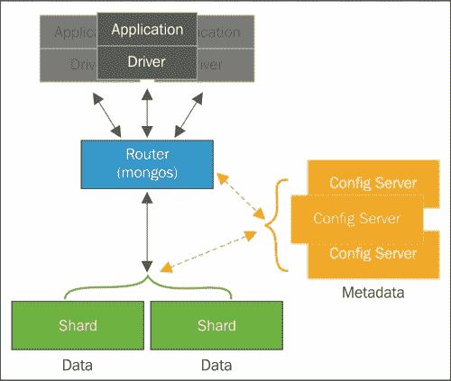

# 第五章。优化查询

现在，我们已经在理解如何使用索引来提高读写性能方面迈出了重要的一步，让我们看看如果这些索引表现如预期，我们如何分析它们，以及索引如何影响数据库的生命周期。除此之外，通过这种分析，我们将能够评估和优化创建的查询和索引。

因此，在本章中，我们将学习查询计划的概念以及 MongoDB 如何处理它。这包括理解查询覆盖和查询选择性，以及在分片环境和副本集中使用这些计划时的行为。

# 理解查询计划

当我们运行查询时，MongoDB 将通过从 MongoDB 查询优化器执行的查询分析中提取的一组可能性中选择最佳方式来执行查询。这些可能性称为**查询计划**。

要更好地理解查询计划，我们必须回到游标概念和游标方法之一：`explain()`。`explain()`方法是 MongoDB 3.0 版本中的重大变化之一。由于新的查询内省系统的出现，它得到了显着增强。

输出不仅发生了变化，正如我们之前看到的那样，使用方式也发生了变化。现在，我们可以向`explain()`方法传递一个选项参数，该参数指定`explain`输出的详细程度。可能的模式是`"queryPlanner"`、`"executionStats"`和`"allPlansExecution"`。默认模式是`"queryPlanner"`。

+   在`"queryPlanner"`模式下，MongoDB 运行查询优化器选择评估中的获胜计划，并将信息返回给评估方法。

+   在`"executionStats"`模式下，MongoDB 运行查询优化器选择获胜计划，执行它，并将信息返回给评估方法。如果我们对写操作执行`explain()`方法，则返回有关将执行的操作的信息，但实际上不执行它。

+   最后，在`"allPlansExecution"`模式下，MongoDB 运行查询优化器选择获胜计划，执行它，并将信息返回给评估方法，以及其他候选计划的信息。

### 提示

您可以在 MongoDB 3.0 参考指南的[`docs.mongodb.org/manual/reference/method/db.collection.explain/#db.collection.explain`](http://docs.mongodb.org/manual/reference/method/db.collection.explain/#db.collection.explain)中找到有关`explain()`方法的更多信息。

`explain`执行的输出将查询计划显示为阶段树。从叶子到根，每个阶段将其结果传递给父节点。第一个阶段发生在叶节点上，访问集合或索引并将结果传递给内部节点。这些内部节点操作结果，最终阶段或根节点从中派生结果集。

有四个阶段：

+   `COLLSCAN`：这意味着在此阶段发生了完整的集合扫描

+   `IXSCAN`：这表示在此阶段发生了索引键扫描

+   `FETCH`：这是当我们检索文档时的阶段

+   `SHARD_MERGE`：这是来自每个分片的结果被合并并传递给父阶段的阶段

获胜计划阶段的详细信息可以在`explain()`执行输出的`explain.queryPlanner.winningPlan`键中找到。`explain.queryPlanner.winningPlan.stage`键向我们展示了根阶段的名称。如果有一个或多个子阶段，该阶段将具有一个`inputStage`或`inputStages`键，取决于我们有多少阶段。子阶段将由`explain()`执行输出的`explain.queryPlanner.winningPlan.inputStage`和`explain.queryPlanner.winningPlan.inputStages`键表示。

### 注意

要了解更多关于`explain()`方法的信息，请访问 MongoDB 3.0 手册页面[`docs.mongodb.org/manual/reference/explain-results/`](http://docs.mongodb.org/manual/reference/explain-results/)。

`explain()`方法的执行和输出的所有这些变化主要是为了提高 DBA 的生产力。与以前的 MongoDB 版本相比，最大的优势之一是`explain()`不需要执行查询来计算查询计划。它还将查询内省暴露给了更广泛的操作，包括 find、count、update、remove、group 和 aggregate，使 DBA 有能力优化每种类型的查询。

## 评估查询

直截了当地说，`explain`方法将为我们提供查询执行的统计信息。例如，我们将在这些统计信息中看到是否使用了游标或索引。

让我们以以下`products`集合为例：

```go
{
 "_id": ObjectId("54bee5c49a5bc523007bb779"),
 "name": "Product 1",
 "price": 56
}
{
 "_id": ObjectId("54bee5c49a5bc523007bb77a"),
 "name": "Product 2",
 "price": 64
}
{
 "_id": ObjectId("54bee5c49a5bc523007bb77b"),
 "name": "Product 3",
 "price": 53
}
{
 "_id": ObjectId("54bee5c49a5bc523007bb77c"),
 "name": "Product 4",
 "price": 50
}
{
 "_id": ObjectId("54bee5c49a5bc523007bb77d"),
 "name": "Product 5",
 "price": 89
}
{
 "_id": ObjectId("54bee5c49a5bc523007bb77e"),
 "name": "Product 6",
 "price": 69
}
{
 "_id": ObjectId("54bee5c49a5bc523007bb77f"),
 "name": "Product 7",
 "price": 71
}
{
 "_id": ObjectId("54bee5c49a5bc523007bb780"),
 "name": "Product 8",
 "price": 40
}
{
 "_id": ObjectId("54bee5c49a5bc523007bb781"),
 "name": "Product 9",
 "price": 41
}
{
 "_id": ObjectId("54bee5c49a5bc523007bb782"),
 "name": "Product 10",
 "price": 53
}

```

正如我们已经看到的，当集合被创建时，`_id`字段上会自动添加一个索引。为了获取集合中的所有文档，我们将在 mongod shell 中执行以下查询：

```go
db.products.find({price: {$gt: 65}})

```

查询的结果将是以下内容：

```go
{
 "_id": ObjectId("54bee5c49a5bc523007bb77d"),
 "name": "Product 5",
 "price": 89
}
{
 "_id": ObjectId("54bee5c49a5bc523007bb77e"),
 "name": "Product 6",
 "price": 69
}
{
 "_id": ObjectId("54bee5c49a5bc523007bb77f"),
 "name": "Product 7",
 "price": 71
}

```

为了帮助您理解 MongoDB 是如何得出这个结果的，让我们在通过`find`命令返回的游标上使用`explain`方法：

```go
db.products.find({price: {$gt: 65}}).explain("executionStats")

```

这个操作的结果是一个包含有关所选查询计划信息的文档：

```go
{
 "queryPlanner" : {
 "plannerVersion" : 1,
 "namespace" : "ecommerce.products",
 "indexFilterSet" : false,
 "parsedQuery" : {
 "price" : {
 "$gt" : 65
 }
 },
 "winningPlan" : {
 "stage" : "COLLSCAN",
 "filter" : {
 "price" : {
 "$gt" : 65
 }
 },
 "direction" : "forward"
 },
 "rejectedPlans" : [ ]
 },
 "executionStats" : {
 "executionSuccess" : true,
 "nReturned" : 3,
 "executionTimeMillis" : 0,
 "totalKeysExamined" : 0,
 "totalDocsExamined" : 10,
 "executionStages" : {
 "stage" : "COLLSCAN",
 "filter" : {
 "price" : {
 "$gt" : 65
 }
 },
 "nReturned" : 3,
 "executionTimeMillisEstimate" : 0,
 "works" : 12,
 "advanced" : 3,
 "needTime" : 8,
 "needFetch" : 0,
 "saveState" : 0,
 "restoreState" : 0,
 "isEOF" : 1,
 "invalidates" : 0,
 "direction" : "forward",
 "docsExamined" : 10
 }
 },
 "serverInfo" : {
 "host" : "c516b8098f92",
 "port" : 27017,
 "version" : "3.0.2",
 "gitVersion" : "6201872043ecbbc0a4cc169b5482dcf385fc464f"
 },
 "ok" : 1
}

```

最初，让我们只检查这个文档中的四个字段：`queryPlanner.winningPlan.stage`、`queryPlanner.executionStats.nReturned`、`queryPlanner.executionStats.totalKeysExamined`和`queryPlanner.executionStats.totalDocsExamined`：

+   `queryPlanner.winningPlan.stage`字段显示了将执行完整的集合扫描。

+   `queryPlanner.executionStats.nReturned`字段显示了有多少文档符合查询条件。换句话说，它显示了有多少文档将从查询执行中返回。在这种情况下，结果将是三个文档。

+   `queryPlanner.executionStats.totalDocsExamined`字段是将要扫描的集合中的文档数。在这个例子中，所有的文档都被扫描了。

+   `queryPlanner.executionStats.totalKeysExamined`字段显示了扫描的索引条目数。

+   在执行集合扫描时，就像前面的例子中一样，`nscanned`也代表了在集合中扫描的文档数。

如果我们为我们的集合的`price`字段创建一个索引会发生什么？让我们看看：

```go
db.products.createIndex({price: 1})

```

显然，查询结果将是在先前执行中返回的相同的三个文档。然而，`explain`命令的结果将是以下内容：

```go
{
 "queryPlanner" : {
 "plannerVersion" : 1,
 "namespace" : "ecommerce.products",
 "indexFilterSet" : false,
 "parsedQuery" : {
 …
 },
 "winningPlan" : {
 "stage" : "FETCH",
 "inputStage" : {
 "stage" : "IXSCAN",
 "keyPattern" : {
 "price" : 1
 },
 "indexName" : "price_1",
 ...
 }
 },
 "rejectedPlans" : [ ]
 },
 "executionStats" : {
 "executionSuccess" : true,
 "nReturned" : 3,
 "executionTimeMillis" : 20,
 "totalKeysExamined" : 3,
 "totalDocsExamined" : 3,
 "executionStages" : {
 "stage" : "FETCH",
 "nReturned" : 3,
 ...
 "inputStage" : {
 "stage" : "IXSCAN",
 "nReturned" : 3,
 ...
 }
 }
 },
 "serverInfo" : {
 ...
 },
 "ok" : 1
}

```

返回的文档与之前的文档有很大的不同。再次，让我们专注于这四个字段：`queryPlanner.winningPlan.stage`、`queryPlanner.executionStats.nReturned`、`queryPlanner.executionStats.totalKeysExamined`和`queryPlanner.executionStats.totalDocsExamined`。

这一次，我们可以看到我们没有进行完整的集合扫描。而是有一个带有子`IXSCAN`阶段的`FETCH`阶段，正如我们在`queryPlanner.winningPlan.inputStage.stage`字段中所看到的。这意味着查询使用了索引。索引的名称可以在字段`queryPlanner.winningPlan.inputStage.indexName`中找到，在这个例子中是`price_1`。

此外，这个结果的平均差异是，`queryPlanner.executionStats.totalDocsExamined`和`queryPlanner.executionStats.totalKeysExamined`都返回了值`3`，显示了扫描了三个文档。这与在没有索引的情况下执行查询时看到的 10 个文档非常不同。

我们应该指出的一点是，扫描的文档和键的数量与`queryPlanner.executionStats.totalDocsExamined`和`queryPlanner.executionStats.totalKeysExamined`中所示的相同。这意味着我们的查询未被索引覆盖。在下一节中，我们将看到如何使用索引覆盖查询以及其好处。

## 覆盖查询

有时我们可以选择根据它们在查询中出现的频率创建一个或多个字段的索引。我们还可以选择创建索引以提高查询性能，不仅用于匹配条件，还用于从索引本身提取结果。

我们可以说，当查询中的所有字段都是索引的一部分，且查询中的所有字段都是同一个索引的一部分时，此查询将被索引覆盖。

在前一节中所示的示例中，我们创建了`products`集合的`price`字段的索引：

```go
db.products.createIndex({price: 1})

```

当我们执行以下查询时，该查询检索`price`字段的值大于`65`的文档，但投影中排除了结果中的`_id`字段，只包括`price`字段，我们将得到与之前显示的结果不同的结果：

```go
db.products.find({price: {$gt: 65}}, {price: 1, _id: 0})

```

结果将是：

```go
{ "price" : 69 }
{ "price" : 71 }
{ "price" : 89 }

```

然后我们使用`explain`命令分析查询，如下所示：

```go
db.products.explain("executionStats")
.find({price: {$gt: 65}}, {price: 1, _id: 0})

```

通过这样做，我们还得到了与之前示例不同的结果：

```go
{
 "queryPlanner" : {
 "plannerVersion" : 1,
 "namespace" : "ecommerce.products",
 "indexFilterSet" : false,
 "parsedQuery" : {
 "price" : {
 "$gt" : 65
 }
 },
 "winningPlan" : {
 "stage" : "PROJECTION",
 ...
 "inputStage" : {
 "stage" : "IXSCAN",
 ...

 }
 },
 "rejectedPlans" : [ ]
 },
 "executionStats" : {
 "executionSuccess" : true,
 "nReturned" : 3,
 "executionTimeMillis" : 0,
 "totalKeysExamined" : 3,
 "totalDocsExamined" : 0,
 "executionStages" : {
 ...
 }
 },
 "serverInfo" : {
 ...
 },
 "ok" : 1
}

```

我们注意到的第一件事是`queryPlanner.executionStats.totalDocsExamined`的值为`0`。这可以解释为我们的查询被索引覆盖。这意味着我们不需要扫描集合中的文档。我们将使用索引返回结果，正如我们在`queryPlanner.executionStats.totalKeysExamined`字段的值`3`中观察到的那样。

另一个不同之处是`IXSCAN`阶段不是`FETCH`阶段的子级。每当索引覆盖查询时，`IXSCAN`都不会是`FETCH`阶段的后代。

### 注意

被索引覆盖的查询可能非常快。这是因为索引键通常比文档本身要小得多，而且索引通常位于易失性内存或磁盘顺序写入模式中。

不幸的是，我们并不总是能够覆盖查询，即使我们有相同的条件。

考虑以下`customers`集合：

```go
{
 "_id": ObjectId("54bf0d719a5bc523007bb78f"),
 "username": "customer1",
 "email": "customer1@customer.com",
 "password": "1185031ff57bfdaae7812dd705383c74",
 "followedSellers": [
 "seller3",
 "seller1"
 ]
}
{
 "_id": ObjectId("54bf0d719a5bc523007bb790"),
 "username": "customer2",
 "email": "customer2@customer.com",
 "password": "6362e1832398e7d8e83d3582a3b0c1ef",
 "followedSellers": [
 "seller2",
 "seller4"
 ]
}
{
 "_id": ObjectId("54bf0d719a5bc523007bb791"),
 "username": "customer3",
 "email": "customer3@customer.com",
 "password": "f2394e387b49e2fdda1b4c8a6c58ae4b",
 "followedSellers": [
 "seller2",
 "seller4"
 ]
}
{
 "_id": ObjectId("54bf0d719a5bc523007bb792"),
 "username": "customer4",
 "email": "customer4@customer.com",
 "password": "10619c6751a0169653355bb92119822a",
 "followedSellers": [
 "seller1",
 "seller2"
 ]
}
{
 "_id": ObjectId("54bf0d719a5bc523007bb793"),
 "username": "customer5",
 "email": "customer5@customer.com",
 "password": "30c25cf1d31cbccbd2d7f2100ffbc6b5",
 "followedSellers": [
 "seller2",
 "seller4"
 ]
}

```

并且创建了`followedSellers`字段的索引，执行以下命令在 mongod shell 上：

```go
db.customers.createIndex({followedSellers: 1})

```

如果我们在 mongod shell 上执行以下查询，该查询应该被索引覆盖，因为我们在查询条件中使用了`followedSellers`：

```go
db.customers.find(
{
 followedSellers: {
 $in : ["seller1", "seller3"]
 }
}, 
{followedSellers: 1, _id: 0}
)

```

当我们使用 mongod shell 上的`explain`命令分析此查询以查看查询是否被索引覆盖时，我们可以观察到：

```go
db.customers.explain("executionStats").find(
{
 followedSellers: {
 $in : ["seller1", "seller3"]
 }
}, 
{followedSellers: 1, _id: 0}
)

```

我们有以下文档作为结果。我们可以看到，尽管在条件中使用了索引中的字段并将结果限制为此字段，但返回的输出将`FETCH`阶段作为`IXSCAN`阶段的父级。此外，`totalDocsExamined`和`totalKeysExamined`的值是不同的：

```go
{
 "queryPlanner" : {
 "plannerVersion" : 1,
 "namespace" : "ecommerce.customers",
 ...
 "winningPlan" : {
 "stage" : "PROJECTION",
 ...
 "inputStage" : {
 "stage" : "FETCH",
 "inputStage" : {
 "stage" : "IXSCAN",
 "keyPattern" : {
 "followedSellers" : 1
 },
 "indexName" : "followedSellers_1",
 ...
 }
 }
 },
 "rejectedPlans" : [ ]
 },
 "executionStats" : {
 "executionSuccess" : true,
 "nReturned" : 2,
 "executionTimeMillis" : 0,
 "totalKeysExamined" : 4,
 "totalDocsExamined" : 2,
 "executionStages" : {
 ...
 }
 },
 "serverInfo" : {
 ...
},
 "ok" : 1
}

```

`totalDocsExamined`字段返回`2`，这意味着需要扫描集合中的五个文档中的两个。与此同时，`totalKeysExamined`字段返回`4`，表明需要扫描四个索引条目以获取返回结果。

另一种情况是，当查询执行使用嵌入文档的字段的索引时，我们无法通过索引覆盖查询。

让我们使用`supplier.name`字段的索引检查已经在第四章中使用的`products`集合的示例：

```go
db.products.createIndex({"supplier.name": 1})

```

以下查询将不被索引覆盖：

```go
db.products.find(
 {"supplier.name": "Supplier 1"}, 
 {"supplier.name": 1, _id: 0}
)

```

### 注意

请记住，尽管此查询未被索引覆盖，但它将在计划中使用索引。

最后，当我们在分片集合中通过**mongos**执行查询时，此查询永远不会被索引覆盖。

## 查询优化器

现在您已经了解了使用`explain()`方法评估查询性能以及如何利用索引覆盖查询，我们将继续介绍在 MongoDB 中选择和维护查询计划的重大责任，即查询优化器。

查询优化器负责处理和选择查询的最佳和最有效的查询计划。为此，它考虑了所有集合索引。

查询优化器执行的过程并不是一门精确的科学，这意味着它有点经验主义，换句话说，是基于试错的。

当我们第一次执行查询时，查询优化器将针对集合的所有可用索引运行查询并选择最有效的索引。此后，每当我们运行相同的查询或具有相同模式的查询时，所选的索引将用于查询计划。

在本章前面使用的相同的`products`集合中，以下查询将通过相同的查询计划运行，因为它们具有相同的模式：

```go
db.products.find({name: 'Product 1'})
db.products.find({name: 'Product 5'})

```

随着集合数据的变化，查询优化器会重新评估。此外，随着集合的增长（更准确地说，每进行 1,000 次写操作，每次索引创建，`mongod`进程重新启动，或者我们调用`explain()`方法），优化器会重新评估自身。

即使有了这个被称为查询优化器的神奇自动过程，我们可能还想选择我们想要使用的索引。为此，我们使用`hint`方法。

假设我们的先前的`products`集合中有这些索引：

```go
db.products.createIndex({name: 1, price: -1})
db.products.createIndex({price: -1})

```

如果我们想检索所有`price`字段值大于 10 的产品，并按`name`字段降序排序，可以使用以下命令来执行：

```go
db.products.find({price: {$gt: 10}}).sort({name: -1})

```

查询优化器选择的索引将是在`name`和`price`字段上创建的索引，我们可以通过运行`explain()`方法来查看：

```go
db.products.explain("executionStats").find({price: {$gt: 10}}).sort({name: -1})

```

结果是：

```go
{
 "queryPlanner" : {
 "plannerVersion" : 1,
 "namespace" : "ecommerce.products",
 ...
 "winningPlan" : {
 "stage" : "FETCH",
 ...
 "inputStage" : {
 "stage" : "IXSCAN",
 "keyPattern" : {
 "name" : 1,
 "price" : -1
 },
 "indexName" : "name_1_price_-1"
 ...
 }
 },
 ...
 },
 "executionStats" : {
 "executionSuccess" : true,
 "nReturned" : 10,
 "executionTimeMillis" : 0,
 "totalKeysExamined" : 10,
 "totalDocsExamined" : 10,
 "executionStages" : {
 ...
 }
 },
 "serverInfo" : {
 ...
},
 "ok" : 1
}

```

然而，我们只能强制使用`price`字段的索引，如下所示：

```go
db.products.find(
 {price: {$gt: 10}}
).sort({name: -1}).hint({price: -1})

```

为了确定，我们使用`explain`方法：

```go
db.products.explain("executionStats").find(
 {price: {$gt: 10}}).sort({name: -1}
).hint({price: -1})

```

这产生了以下文档：

```go
{
 "queryPlanner" : {
 "plannerVersion" : 1,
 "namespace" : "ecommerce.products",
 ...
 "winningPlan" : {
 "stage" : "SORT",
 ...
 "inputStage" : {
 "stage" : "KEEP_MUTATIONS",
 "inputStage" : {
 "stage" : "FETCH",
 "inputStage" : {
 "stage" : "IXSCAN",
 "keyPattern" : {
 "price" : -1
 },
 "indexName" : "price_-1",
 ...
 }
 }
 }
 },
 "rejectedPlans" : [ ]
 },
 "executionStats" : {
 "executionSuccess" : true,
 "nReturned" : 10,
 "executionTimeMillis" : 0,
 "totalKeysExamined" : 10,
 "totalDocsExamined" : 10,
 "executionStages" : {
 ...
 }
 },
 "serverInfo" : {
 ...
 },
 "ok" : 1
}

```

## 从多个 MongoDB 实例中读取

到目前为止，我们已经大谈特谈了从一个 MongoDB 实例中读取。然而，重要的是我们简要谈一下从分片环境或副本集中读取。



当我们从分片中读取时，重要的是将分片键作为查询条件的一部分。这是因为当我们有分片键时，我们将针对一个特定的分片执行，而如果我们没有分片键，我们将强制在集群中的所有分片上执行。因此，在分片环境中查询的性能在很大程度上取决于分片键。

默认情况下，在 MongoDB 中有一个副本集时，我们总是从主节点读取。我们可以修改此行为，通过修改读取偏好来强制在辅助节点上执行读取操作。

假设我们有一个包含三个节点的副本集：`rs1s1`、`rs1s2`和`rs1s3`，`rs1s1`是主节点，`rs1s2`和`rs1s3`是辅助节点。要执行一个读操作并强制在辅助节点上进行读取，我们可以这样做：

```go
db.customers.find().readPref({mode: 'secondary'})

```

此外，我们还有以下读取偏好选项：

+   `primary`，这是默认选项，将强制用户从主节点读取。

+   `primaryPreferred`，它将优先从主节点读取，但在不可用的情况下将从辅助节点读取。

+   `secondaryPreferred`，它将从辅助节点读取，但在不可用的情况下将从主节点读取。

+   `nearest`，它将从集群中网络延迟最低的节点读取。换句话说，就是从网络距离最短的节点读取，无论它是主节点还是辅助节点。

简而言之，如果我们的应用程序希望最大化一致性，那么我们应该优先考虑在主节点上进行读取；当我们寻求可用性时，我们应该使用`primaryPreferred`，因为我们可以保证大多数读取的一致性。当主节点出现问题时，我们可以依靠任何辅助节点。最后，如果我们寻求最低的延迟，我们可以使用`nearest`，提醒自己我们没有数据一致性的保证，因为我们优先考虑最低延迟的网络节点。

# 总结

在本章中，您学会了使用 MongoDB 的原生工具分析查询性能，并优化我们的查询。

在下一章中，我们将讨论如何通过功能或地理分离更好地管理我们的数据库和其集合。您还将了解如何维护应支持高读写吞吐量的集合。
