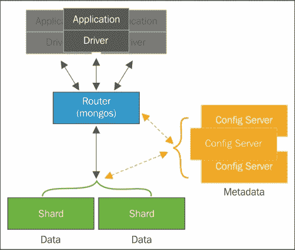

# 第七章。扩展

多年来，可扩展性一直是一个备受讨论的话题。尽管关于它已经有很多言论，但这个话题非常重要，在这本书中，它肯定也会找到自己的位置。

我们不感兴趣涉及涉及数据库可扩展性的所有概念，特别是在 NoSQL 数据库中，而是展示 MongoDB 在处理我们的集合时提供的可能性以及 MongoDB 数据模型的灵活性如何影响我们的选择。

可以基于简单的基础架构和低成本的分片请求来水平扩展 MongoDB。分片是通过多个名为“分片”的物理分区分发数据的技术。尽管数据库在物理上被分区，但对于我们的客户来说，数据库本身是一个单一实例。分片技术对数据库的客户完全透明。

亲爱的读者，准备好了吗！在本章中，您将看到一些关于数据库维护的关键主题，例如：

+   使用分片进行横向扩展

+   选择分片键

+   扩展社交收件箱架构设计

# 使用分片来扩展 MongoDB

当我们谈论数据库的可扩展性时，有两种参考方法：

+   **纵向扩展或垂直扩展**：在这种方法中，我们向一台机器添加更多资源。例如，CPU、磁盘和内存，以增加系统的容量。

+   **横向扩展或水平扩展**：在这种方法中，我们向系统添加更多节点，并在可用节点之间分配工作。

选择其中一种并不取决于我们的意愿，而是取决于我们想要扩展的系统。有必要了解是否可能以我们想要的方式扩展该系统。我们还必须记住这两种技术之间存在差异和权衡。

增加存储容量、CPU 或内存可能非常昂贵，有时甚至由于服务提供商的限制而不可能。另一方面，增加系统中的节点数量也可能会增加概念上和操作上的复杂性。

然而，考虑到虚拟化技术的进步和云服务提供商提供的便利，对于某些应用程序来说，横向扩展正在成为更实际的解决方案。

MongoDB 准备好了进行水平扩展。这是通过分片技术来实现的。这种技术包括对数据集进行分区，并将数据分布在许多服务器之间。分片的主要目的是支持能够通过在每个分片之间分配操作负载来处理高吞吐量操作的更大型数据库。

例如，如果我们有一个 1TB 的数据库和四个配置好的分片，每个分片应该有 256GB 的数据。但是，这并不意味着每个分片将管理 25%的吞吐量操作。这将完全取决于我们决定构建分片的方式。这是一个巨大的挑战，也是本章的主要目标。

以下图表展示了 MongoDB 中分片的工作原理：


在撰写本书时，MongoDB 在其 3.0 版本中提供了多种分片策略：基于范围、基于哈希和基于位置的分片。

+   在基于范围的策略中，MongoDB 将根据分片键的值对数据进行分区。接近彼此的分片键值的文档将分配到同一个分片中。

+   在基于哈希的策略中，文档是根据分片键的 MD5 值进行分布的。

+   在基于位置的策略中，文档将根据将分片范围值与特定分片相关联的配置分布在分片中。这种配置使用标签来实现，这与我们在第六章中看到的“管理数据”中讨论的操作隔离非常相似。

在 MongoDB 中，分片工作在集合级别，这意味着我们可以在同一个数据库中启用分片和不启用分片的集合。要在集合中设置分片，我们必须配置一个分片集群。分片集群的元素包括分片、查询路由器和配置服务器：

+   **分片**是我们的数据集的一部分将被分配的地方。一个分片可以是一个 MongoDB 实例或一个副本集

+   **查询路由器**是为数据库客户端提供的接口，负责将操作定向到正确的分片

+   **配置服务器**是一个负责保持分片集群配置或者说是集群元数据的 MongoDB 实例

以下图显示了一个共享集群及其组件：



我们不会深入讨论分片集群的创建和维护，因为这不是本章的目标。然而，重要的是要知道，分片集群的设置取决于场景。

在生产环境中，最低建议的设置是至少三个配置服务器，两个或更多副本集，这将是我们的分片，以及一个或多个查询路由器。通过这样做，我们可以确保环境的最低冗余和高可用性。

## 选择分片键

一旦我们决定我们需要一个分片集群，下一步就是选择分片键。分片键负责确定文档在集群的分片之间的分布。这些也将是决定我们的数据库成功或失败的关键因素。

对于每个写操作，MongoDB 将根据分片键的范围值分配一个新文档。分片键的范围也被称为**块**。一个块的默认长度为 64MB，但如果您希望将此值定制到您的需求，它是可以配置的。在下图中，您可以看到如何在给定一个从负无穷到正无穷的数字分片键上分布文档：


在开始讨论可能影响我们分片键构建的事情之前，必须尊重 MongoDB 中的一些限制。这些限制是重要的，在某些方面，它们帮助我们消除我们选择中的一些错误的可能性。

分片键的长度不能超过 512 字节。分片键是文档中的索引字段。这个索引可以是一个简单的字段或一个组合的字段，但它永远不会是一个多键字段。自 MongoDB 2.4 版本以来，也可以使用简单哈希字段的索引。

以下信息必须安静地阅读，就像一个咒语，这样你就不会从一开始就犯任何错误。

### 注意

你必须记住一件事：分片键是不可更改的。

重申一遍，分片键是不可更改的。这意味着，亲爱的读者，一旦创建了分片键，你就永远无法更改它。永远！

您可以在 MongoDB 手册参考[`docs.mongodb.org/manual/reference/limits/#sharded-clusters`](http://docs.mongodb.org/manual/reference/limits/#sharded-clusters)中找到有关 MongoDB 分片集群限制的详细信息。

但如果我创建了一个分片键，我想要改变它怎么办？我应该怎么做？与其试图改变它，我们应该做以下事情：

1.  在磁盘文件中执行数据库的转储。

1.  删除集合。

1.  使用新的分片键配置一个新的集合。

1.  执行预分割的块。

1.  恢复转储文件。

正如你所看到的，我们不改变分片键。我们几乎是从头开始重新创建的。因此，在执行分片键创建的命令时要小心，否则如果需要更改它，你会头疼的。

### 注意

你需要记住的下一个信息是，你不能更新分片键的一个或多个字段的值。换句话说，分片键的值也是不可更改的。

尝试在分片键的字段中执行`update()`方法是没有用的。它不起作用。

在我们继续之前，让我们实际看一下我们到目前为止讨论的内容。让我们为测试创建一个分片集群。以下的分片配置对于测试和开发非常有用。在生产环境中永远不要使用这个配置。给出的命令将创建：

+   两个分片

+   一个配置服务器

+   一个查询路由器

作为第一步，让我们启动一个配置服务器实例。配置服务器只是一个带有初始化参数`--configsvr`的`mongod`实例。如果我们不为参数`--port <port number>`设置一个值，它将默认在端口 27019 上启动：

```go
mongod --fork --configsvr --dbpath /data/configdb --logpath /log/configdb.log

```

下一步是启动查询路由器。查询路由器是一个`mongos` MongoDB 实例，它使用参数`--configdb <configdb hostname or ip:port>`来将查询和写操作路由到分片，该参数指示配置服务器。默认情况下，MongoDB 在端口 27017 上启动它：

```go
mongos --fork --configdb localhost --logpath /log/router.log

```

最后，让我们启动分片。在这个例子中，分片将是两个简单的`mongod`实例。与`mongos`类似，`mongod`实例默认在端口 27017 上启动。由于我们已经在这个端口上启动了`mongos`实例，让我们为`mongod`实例设置一个不同的端口：

```go
mongod --fork --dbpath /data/mongod1 --port 27001 --logpath /log/mongod1.log
mongod --fork --dbpath /data/mongod2 --port 27002 --logpath /log/mongod2.log

```

完成！现在我们为测试分片集群建立了基本的基础设施。但是，等等！我们还没有一个分片集群。下一步是向集群添加分片。为此，我们必须将已经启动的`mongos`实例连接到查询路由器：

```go
mongo localhost:27017

```

一旦在`mongos` shell 中，我们必须以以下方式执行`addShard`方法：

```go
mongos> sh.addShard("localhost:27001")
mongos> sh.addShard("localhost:27002")

```

如果我们想要检查前面操作的结果，我们可以执行`status()`命令，并查看关于创建的分片的一些信息：

```go
mongos> sh.status()
--- Sharding Status --- 
 sharding version: {
 "_id" : 1,
 "minCompatibleVersion" : 5,
 "currentVersion" : 6,
 "clusterId" : ObjectId("54d9dc74fadbfe60ef7b394e")
}
 shards:
 {  "_id" : "shard0000",  "host" : "localhost:27001" }
 {  "_id" : "shard0001",  "host" : "localhost:27002" }
 databases:
 {  "_id" : "admin",  "partitioned" : false,  "primary" : "config" }

```

在返回的文档中，我们只能看到基本信息，比如我们的分片集群的主机是谁，我们有哪些数据库。目前，我们没有任何使用分片启用的集合。因此，信息被大大简化了。

现在我们有了分片、配置服务器和查询路由器，让我们在数据库中启用分片。在对集合进行相同操作之前，必须先在数据库中启用分片。以下命令在名为`ecommerce`的数据库中启用分片：

```go
mongos> sh.enableSharding("ecommerce")

```

通过查询分片集群的状态，我们可以注意到我们有关于我们的`ecommerce`数据库的信息：

```go
mongos> sh.status()
--- Sharding Status --- 
 sharding version: {
 "_id" : 1,
 "minCompatibleVersion" : 5,
 "currentVersion" : 6,
 "clusterId" : ObjectId("54d9dc74fadbfe60ef7b394e")
}
 shards:
 {  "_id" : "shard0000",  "host" : "172.17.0.23:27017" }
 {  "_id" : "shard0001",  "host" : "172.17.0.24:27017" }
 databases:
 {  "_id" : "admin",  "partitioned" : false,  "primary" : "config" }
 {  "_id" : "ecommerce",  "partitioned" : true,  "primary" : "shard0000" }

```

考虑一下，在`ecommerce`数据库中，我们有一个`customers`集合，其中包含以下文档：

```go
{
 "_id" : ObjectId("54fb7110e7084a229a66eda2"),
 "isActive" : true,
 "age" : 28,
 "name" : "Paige Johnson",
 "gender" : "female",
 "email" : "paigejohnson@combot.com",
 "phone" : "+1 (830) 484-2397",
 "address" : {
 "city" : "Dennard",
 "state" : "Kansas",
 "zip" : 2492,
 "latitude" : -56.564242,
 "longitude" : -160.872178,
 "street" : "998 Boerum Place"
 },
 "registered" : ISODate("2013-10-14T14:44:34.853Z"),
 "friends" : [
 {
 "id" : 0,
 "name" : "Katelyn Barrett"
 },
 {
 "id" : 1,
 "name" : "Weeks Valentine"
 },
 {
 "id" : 2,
 "name" : "Wright Jensen"
 }
 ]
}

```

我们必须执行`shardCollection`命令来在这个集合中启用分片，使用集合名称和一个将代表我们的分片键的文档作为参数。

通过在`mongos` shell 中执行以下命令来启用`customers`集合中的分片：

```go
mongos> sh.shardCollection("ecommerce.customers", {"address.zip": 1, "registered": 1})
{
 "proposedKey" : {
 "address.zip" : 1,
 "registered" : 1
 },
 "curIndexes" : [
 {
 "v" : 1,
 "key" : {
 "_id" : 1
 },
 "name" : "_id_",
 "ns" : "ecommerce.customers"
 }
 ],
 "ok" : 0,
 "errmsg" : "please create an index that starts with the shard key before sharding."
}

```

正如你所看到的，命令执行过程中出现了一些问题。MongoDB 警告我们必须有一个索引，并且分片键必须是一个前缀。因此，我们必须在`mongos` shell 上执行以下序列：

```go
mongos> db.customers.createIndex({"address.zip": 1, "registered": 1})
mongos> sh.shardCollection("ecommerce.customers", {"address.zip": 1, "registered": 1})
{ "collectionsharded" : "ecommerce.customers", "ok" : 1 }

```

干得好！现在我们有了启用了分片的`ecommerce`数据库的`customers`集合。

### 注意

如果你正在对一个空集合进行分片，`shardCollection`命令将创建分片键的索引。

但是是什么因素决定了选择`address.zip`和`registered`作为分片键？在这种情况下，正如我之前所说的，我选择了一个随机字段来进行说明。从现在开始，让我们考虑什么因素可以确定一个好的分片键的创建。

## 选择分片键时的基本注意事项

选择分片键并不是一项容易的任务，也没有固定的配方。大多数情况下，提前了解我们的领域及其用途是至关重要的。在进行此操作时要非常小心。一个不太合适的分片键可能会给我们的数据库带来一系列问题，从而影响其性能。

首先是可分性。我们必须考虑一个分片键，使我们能够在分片之间可视化文档的分割。具有有限数量值的分片键可能导致“不可分割”的块。

我们可以说，这个领域必须具有高基数，例如具有高多样性值和唯一字段的字段。识别字段，如电子邮件地址、用户名、电话号码、社会安全号码和邮政编码，是高基数字段的一个很好的例子。

实际上，如果考虑到某种情况，它们每一个都可以是独特的。在电子商务系统中，如果我们有一个与装运相关的文档，我们将有多个具有相同邮政编码的文档。但是，考虑另一个例子，一个城市中美容沙龙的目录系统。那么，如果一个文档代表一个美容沙龙，那么邮政编码将比在前一个例子中更独特。

第三点可能是迄今为止最有争议的，因为它在某种程度上与上一个点相矛盾。我们已经看到，具有高随机性的分片键是尝试增加写操作性能的良好实践。现在，我们将考虑创建一个分片键以针对单个分片。当我们考虑读操作的性能时，从单个分片读取是一个好主意。正如您已经知道的，在分片集群中，数据库复杂性被抽象为查询路由器。换句话说，发现应该在哪些分片上搜索查询中请求的信息是**mongos**的责任。如果我们的分片键分布在多个分片上，那么`mongos`将在分片上搜索信息，收集并合并它们，然后交付。但是，如果分片键旨在针对单个分片，那么 mongos 任务将在这个唯一的分片中搜索信息，然后交付。

第四个也是最后一个点是关于当文档中没有任何字段适合作为我们的分片键的选择时。在这种情况下，我们必须考虑一个组合的分片键。在前面的例子中，我们使用了一个由字段`address.zip`和`registered`组成的分片键。组合的分片键也将帮助我们拥有一个更可分的键，因为如果分片键的第一个值没有高基数，添加第二个值将增加基数。

因此，这些基本问题告诉我们，根据我们想要搜索的内容，我们应该选择不同的分片键文档方法。如果我们需要查询隔离，那么可以专注于一个分片的分片键是一个不错的选择。但是，当我们需要扩展写操作时，我们的分片键越随机，对性能的影响就越好。

# 扩展社交收件箱模式设计

2014 年 10 月 31 日，MongoDB 公司在其社区博客上介绍了解决一个非常常见的问题，社交收件箱的三种不同方法。

### 注意

如果您想查看博客文章，请参阅[`blog.mongodb.org/post/65612078649/schema-design-for-social-inboxes-in-mongodb`](http://blog.mongodb.org/post/65612078649/schema-design-for-social-inboxes-in-mongodb)。

从所呈现的三种模式设计中，可以看到我们迄今为止以一种简单有效的方式应用了所有扩展概念。在所有情况下，都应用了扇出的概念，即工作负载在分片之间并行分布。每种方法都根据数据库客户端的需求有其自己的应用。

三种模式设计是：

+   在读取时进行扇出操作

+   在写入时进行扇出操作

+   在写入时进行扇出操作

## 在读取时进行扇出操作

由于查询路由器在客户端读取收件箱时的行为，扇出读设计被称为这个名字。与其他设计相比，它被认为是具有最简单机制的设计。它也是最容易实现的。

在扇出读设计中，我们将有一个“收件箱”集合，我们将在其中插入每条新消息。将驻留在此集合中的文档有四个字段：

+   `from`：表示消息发送者的字符串

+   `to`：包含所有消息接收者的数组

+   `sent`：表示消息发送给接收者的日期字段

+   `message`：表示消息本身的字符串字段

在下面的文件中，我们可以看到一个从约翰发送给迈克和比莉的消息的示例：

```go
{
from: "John", 
to: ["Mike", "Billie"], 
sent: new Date(), 
message: "Hey Mike, Billie"
}

```

这个集合上的操作将是所有操作中最直接的。发送消息就是在“收件箱”集合中进行插入操作，而读取消息就是查找具有特定接收者的所有消息。

要在数据库上启用分片，我们的“收件箱”集合位于一个名为`social`的数据库中。为了做到这一点，以及我们在本章中将要做的所有其他事情，我们将使用`mongos` shell。所以，让我们开始吧：

```go
mongos> sh.enableSharding("social")

```

现在，我们将不得不创建集合的分片键。为了实现这个设计，我们将使用“收件箱”集合的`from`字段创建一个分片键：

```go
mongos> sh.shardCollection("social.inbox", {from: 1})

```

### 注意

如果我们的集合已经有文档，我们应该为分片键字段创建索引。

最后一步是在`to`和`sent`字段上创建一个复合索引，以寻求更好的读操作性能：

```go
mongos> db.inbox.createIndex({to: 1, sent: 1})

```

我们现在准备好在我们的“收件箱”集合中发送和读取消息了。在`mongos` shell 上，让我们创建一条消息并将其发送给接收者：

```go
mongos> var msg = {
from: "John", 
to: ["Mike", "Billie"], 
sent: new Date(), 
message: "Hey Mike, Billie"
}; // this command creates a msg variable and stores a message json as a value
mongos> db.inbox.insert(msg); // this command inserts the message on the inbox collection

```

如果我们想读取迈克的收件箱，我们应该使用以下命令：

```go
mongos> db.inbox.find({to: "Mike"}).sort({sent: -1})

```

在这种设计中，写操作可能被认为是有效的。根据活跃用户的数量，我们将在分片之间有均匀的数据分布。

另一方面，查看收件箱并不那么有效。每次收件箱读取都会使用`to`字段进行`find`操作，并按`sent`字段排序。因为我们的集合将`from`字段作为分片键，这意味着消息在分片上是按发送者分组的，所以任何不使用分片键的查询都将被路由到所有分片。

如果我们的应用程序旨在发送消息，这种设计就适用。由于我们需要一个社交应用程序，其中您可以发送和阅读消息，让我们来看看下一个设计方法，即扇出写。

## 扇出写

使用扇出写设计，我们可以说与之前相比，我们将产生相反的效果。在扇出读中，我们到达了集群上的每个分片来查看收件箱，而在扇出写中，我们将在所有分片之间分发写操作。

为了实现扇出写而不是在发送者上进行分片，我们将在消息的接收者上进行分片。以下命令在“收件箱”集合中创建了分片键：

```go
mongos> sh.shardCollection("social.inbox", {recipient: 1, sent: 1})

```

我们将使用在扇出读设计中使用的相同文档。因此，要将一条消息从约翰发送给迈克和比莉，我们将在`mongos` shell 中执行以下命令：

```go
mongos> var msg = {
 "from": "John",
 "to": ["Mike", "Billie"], // recipients
 "sent": new Date(),
 "message": "Hey Mike, Billie"
}

mongos> for(recipient in msg.to){ // iterate though recipients
msg.recipient = msg.to[recipient]; // creates a recipient field on the message and stores the recipient of the message
db.inbox.insert(msg); // inserts the msg document for every recipient
}

```

为了更好地理解发生了什么，让我们做一个小的代码分解：

+   我们应该做的第一件事是创建一个`msg`变量，并在那里存储一个 JSON 消息：

```go
var msg = {
 "from": "John",
 "to": ["Mike", "Billie"], // recipients
 "sent": new Date(),
 "message": "Hey Mike, Billie"
}

```

+   要向每个接收者发送消息，我们必须迭代`to`字段中的值，在消息 JSON 中创建一个新字段`msg.recipient`，并存储消息的接收者：

```go
for(recipient in msg.to){
msg.recipient = msg.to[recipient];

```

+   最后，我们将消息插入“收件箱”集合中：

```go
db.inbox.insert(msg); 
}

```

对于消息的每个接收者，我们将在“收件箱”集合中插入一个新文档。在`mongos` shell 上执行的以下命令显示了迈克的收件箱：

```go
mongos> db.inbox.find ({recipient: "Mike"}).sort({ sent:-1})
{
 "_id": ObjectId("54fe6319b40b90bd157eb0b8"),
 "from": "John",
 "to": [
 "Mike",
 "Billie"
 ],
 "sent": ISODate("2015-03-10T03:20:03.597Z"),
 "message": "Hey Mike, Billie",
 "recipient": "Mike"
}

```

由于消息同时有迈克和比莉作为接收者，我们也可以阅读比莉的收件箱：

```go
mongos> db.inbox.find ({recipient: "Billie"}).sort({ sent:-1})
{
 "_id": ObjectId("54fe6319b40b90bd157eb0b9"),
 "from": "John",
 "to": [
 "Mike",
 "Billie"
 ],
 "sent": ISODate("2015-03-10T03:20:03.597Z"),
 "message": "Hey Mike, Billie",
 "recipient": "Billie"
}

```

通过这样做，当我们读取用户的收件箱时，我们将针对单个分片，因为我们使用分片键作为查找查询的条件。

但是，即使我们只能到达一个分片来查看收件箱，当用户数量增长时，我们将有许多随机读取。为了解决这个问题，我们将介绍分桶的概念。

## 写入时的扇出与桶

写入时的扇出设计是解决社交收件箱问题的一个非常有趣的方法。每当需要时，我们可以向集群中添加更多的分片，并且收件箱数据将在它们之间均匀分布。然而，正如我们之前所述，随着数据库的增长，我们所做的随机读取是我们必须处理的瓶颈。尽管我们通过使用分片键作为查找查询的条件来针对读操作目标单个分片，但在查看收件箱时我们将始终进行随机读取。假设每个用户平均有 50 条消息，那么每次查看收件箱都会产生 50 次随机读取。因此，当我们将这些随机读取与同时访问其收件箱的用户相乘时，我们可以想象我们将如何快速饱和我们的数据库。

为了减少这种瓶颈，出现了写入时的扇出与桶方法。扇出与桶是对写入时的扇出的改进，通过将消息分桶在按时间排序的消息文档中。

这种设计的实现与以前的设计相比有很大不同。在写入时的扇出与桶中，我们将有两个集合：

+   一个`users`集合

+   一个`inbox`集合

`users`集合将具有包含用户数据的文档。在此文档中，除了基本用户信息外，我们还有一个字段，用于存储用户拥有的收件箱消息总数。

`inbox`集合将存储具有一组用户消息的文档。我们将在此集合中有一个`owner`字段，用于标识用户，以及一个`sequence`字段，用于标识桶。这些是我们将使用的字段来对`inbox`集合进行分片。

在我们的示例中，每个桶将有 50 条消息。以下命令将在社交数据库上启用分片，并在`inbox`集合中创建分片键：

```go
mongos> sh.enableSharding("social")
mongos> sh.shardCollection("social.inbox", {owner: 1, sequence: 1})

```

正如之前提到的，我们还有一个`users`集合。以下命令在`user`集合中创建一个分片键：

```go
mongos> sh.shardCollection("social.users", {user_name: 1})

```

现在我们已经创建了分片键，让我们从 John 发送一条消息给 Mike 和 Billie。消息文档将与之前的非常相似。它们之间的区别在于`owner`和`sequence`字段。在`mongos` shell 上执行以下代码将从 John 发送一条消息给 Mike 和 Billie：

```go
mongos> var msg = { 
 "from": "John",
 "to": ["Mike", "Billie"], //recipients
 "sent": new Date(),
 "message": "Hey Mike, Billie"
}

mongos> for(recipient in msg.to) {

var count = db.users.findAndModify({
 query: {user_name: msg.to[recipient]},
 update:{"$inc":{"msg_count":1}},
 upsert: true,
 new: true}).msg_count;

 var sequence = Math.floor(count/50);

 db.inbox.update({
 owner: msg.to[recipient], sequence: sequence},
 {$push:{"messages":msg}},
 {upsert: true});
}

```

与之前一样，为了理解发送消息，让我们对代码进行分解：

+   首先，我们创建一个`msg`变量，并将消息 JSON 存储在其中

+   我们遍历`to`字段中的收件人，并执行`findAndModify`方法，在其中我们查找`users`集合中的文档以确定消息接收者的所有者。由于我们使用了`upsert`选项，并将其值设为`true`，如果我们没有找到用户，那么我们将创建一个新用户。`update`字段使用了`$inc`运算符，这意味着我们将`msg_count`字段增加一。该方法还使用了`new`选项，并且我们将执行保存的文档作为此命令的结果。

+   从返回的文档中，我们获取`msg_count`字段的值，该字段表示用户的总消息数，并将该值存储在`count`变量中。

+   为了发现消息将被保存的存储桶，我们将使用`mongos` shell 上可用的`Math`类的`floor`函数。正如我们之前所说，我们将在每个存储桶中有 50 条消息，因此我们将通过 50 除以`count`变量的值，并得到结果的`floor`函数。例如，如果我们发送第三条用户消息，那么保存此消息的存储桶的结果是`Math.floor(3/50)`，即 0。当我们达到第 50 条消息时，存储桶的值变为 1，这意味着下一条消息将在一个新的存储桶中。

+   我们将更新`收件箱`集合中具有我们计算的`所有者`和`序列`值的文档。由于我们在`update`命令上使用了`upsert`选项，并且将值设置为`true`，如果文档不存在，它将创建该文档。

通过这种方式，我们将确保用户的收件箱完全位于单个分片上。与扇入写相反，在查看收件箱时我们有许多随机读取，而在扇出写与存储桶中，我们对于每 50 条用户消息只进行一次文档读取。

在写入时使用存储桶进行扇出无疑是社交收件箱模式设计的最佳选择，当我们的要求是高效地发送和阅读消息时。然而，`收件箱`集合的文档大小可能会成为一个问题。根据消息的大小，我们将不得不小心管理我们的存储空间。

# 总结

模式设计是更好的可扩展性策略。无论我们手头有多少技术和工具，了解我们的数据将如何使用并花时间设计是更便宜和持久的方法。

在下一章中，您将运用到目前为止学到的一切，为一个真实的例子从零开始创建一个模式设计。
