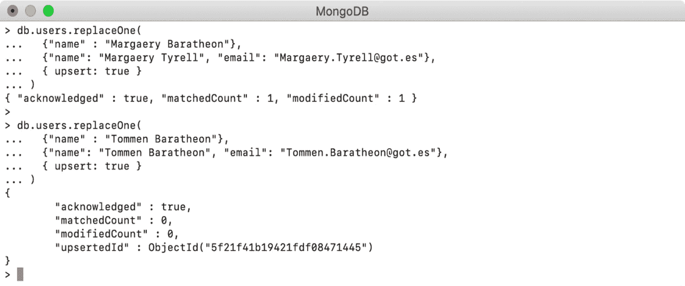
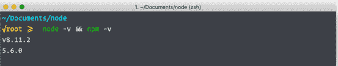

# 前言

# 关于本书

MongoDB 是处理大型数据集的最流行的数据库技术之一。这本书将帮助 MongoDB 初学者开发创建数据库和高效处理数据的知识和技能。

与其他 MongoDB 书籍不同，*MongoDB 基础*从一开始就深入探讨了云计算——向您展示如何在第一章中开始使用 Atlas。您将发现如何修改现有数据，向数据库添加新数据，并通过创建聚合管道处理复杂查询。随着学习的深入，您将了解 MongoDB 复制架构并配置一个简单的集群。您还将掌握用户身份验证以及数据备份和恢复技术。最后，您将使用 MongoDB Charts 进行数据可视化。

您将在以实际项目为基础的小型练习和活动中挑战自己，以愉快且可实现的方式进行学习。其中许多小型项目都是围绕电影数据库案例研究展开的，而最后一章则作为一个最终项目，您将使用 MongoDB 解决基于共享单车应用的真实世界问题。

通过本书，您将具备处理大量数据和使用 MongoDB 处理自己项目的技能和信心。

## 关于作者

*Amit Phaltankar*是一名软件开发人员和博主，拥有超过 13 年的轻量级和高效软件组件构建经验。他擅长编写基于 Web 的应用程序，并使用传统 SQL、NoSQL 和大数据技术处理大规模数据集。他在各种技术堆栈中有工作经验，热衷于学习和适应新的技术趋势。Amit 对提高自己的技能集充满热情，也喜欢指导和培养同行，并为博客做出贡献。在过去的 6 年中，他有效地利用 MongoDB 以各种方式构建更快的系统。

*Juned Ahsan*是一位拥有超过 14 年经验的软件专业人士。他为 Cisco、Nuamedia、IBM、Nokia、Telstra、Optus、Pizza Hut、AT&T、Hughes、Altran 等公司和客户构建软件产品和服务。Juned 在从零开始构建不同规模平台的软件产品和架构方面拥有丰富的经验。他热衷于帮助和指导他人，并是 Stack Overflow 的前 1%贡献者。Juned 对认知 CX、云计算、人工智能和 NoSQL 数据库充满热情。

*Michael Harrison*在澳大利亚电信领导者 Telstra 开始了他的职业生涯。他曾在他们的网络、大数据和自动化团队工作。他现在是 Southbank Software 的首席软件开发人员和创始成员，这是一家位于墨尔本的初创公司，致力于构建下一代数据库技术的工具。作为一名全栈工程师，Michael 领导开发了一个面向 MongoDB 的开源、平台无关的 IDE（dbKoda），以及一个基于 MongoDB 的区块链数据库，名为 ProvenDB。这两款产品都在纽约的 MongoDB World 大会上展出。考虑到 Michael 拥有一双 MongoDB 袜子，可以说他是一位狂热爱好者。

*Liviu Nedov*是一位资深顾问，拥有 20 多年的数据库技术经验。他为澳大利亚和欧洲的客户提供专业和咨询服务。在他的职业生涯中，他为 Wotif Group、Xstrata Copper/Glencore 和纽卡斯尔大学以及昆士兰能源等客户设计和实施了大型企业项目。他目前在 Data Intensity 工作，这是最大的多云服务提供商，为应用程序、数据库和商业智能提供服务。近年来，他积极参与 MongoDB、NoSQL 数据库项目、数据库迁移和云 DBaaS（数据库即服务）项目。

## 这本书是为谁写的

*MongoDB 基础*面向具有基本技术背景的读者，他们是第一次接触 MongoDB。任何数据库、JavaScript 或 JSON 经验都会有所帮助，但不是必需的。*MongoDB 基础*可能会简要涉及这些技术以及更高级的主题，但不需要背景知识即可从本书中获得价值。

## 关于章节

*第一章*，*MongoDB 简介*，包含了 MongoDB 的历史和背景、基本概念，以及设置第一个 MongoDB 实例的指南。

*第二章*，*文档和数据类型*，将教您有关 MongoDB 数据和命令的关键组件。

*第三章*，*服务器和客户端*，为您提供了管理 MongoDB 访问和连接所需的信息，包括数据库和集合的创建。

*第四章*，*查询文档*，是我们进入 MongoDB 核心的地方：查询数据库。本章提供了实际操作的练习，让您使用查询语法、操作符和修饰符。

*第五章*，*插入、更新和删除文档*，扩展了查询，允许您将查询转换为更新，修改现有数据。

*第六章*，*使用聚合管道和数组进行更新*，涵盖了更复杂的更新操作，使用管道和批量更新。

*第七章*，*数据聚合*，演示了 MongoDB 最强大的高级功能之一，允许您创建可重用的复杂查询管道，无法通过更直接的查询解决。

*第八章*，*在 MongoDB 中编写 JavaScript*，将带您从直接数据库交互到更常见于现实世界的方法：应用程序的查询。在本章中，您将创建一个简单的 Node.js 应用程序，可以与 MongoDB 进行编程交互。

*第九章*，*性能*，为您提供了确保您的查询有效运行的信息和工具，主要是通过使用索引和执行计划。

*第十章*，*复制*，更详细地研究了您可能在生产环境中遇到的标准 MongoDB 配置，即集群和副本集。

*第十一章*，*备份和恢复*，涵盖了作为管理数据库冗余和迁移的一部分所需的信息。这对于数据库管理至关重要，但也对加载样本数据和开发生命周期有用。

*第十二章*，*数据可视化*，解释了如何将原始数据转化为有意义的可视化，有助于发现和传达数据中的见解。

*第十三章*，*MongoDB* *案例研究*，是一个课程结束的案例研究，将在一个真实的例子中整合前几章涵盖的所有技能。

## 约定

文本形式的代码词、数据库和集合名称、文件和文件夹名称、shell 命令和用户输入使用以下格式：“`db.myCollection.findOne()`命令将返回`myCollection`中的第一个文档。”

较小的示例代码块及其输出将以以下格式进行格式化：

```js
use sample_mflix
var pipeline = []
var options  = {}
var cursor   = db.movies.aggregate(pipeline, options);
```

在大多数情况下，输出是一个单独的块，将以图的形式进行格式化，如下所示：



图 0.1：输出作为一个图

通常，在章节开始时，会介绍一些关键的新术语。在这些情况下，将使用以下格式：“`aggregate`命令在集合上操作，就像其他**创建、读取、更新、删除**（**CRUD**）命令一样。”

## 开始之前

如前所述，MongoDB 不仅仅是一个数据库。它是一个庞大而分散的工具和库集。因此，在我们全力投入 MongoDB 之前，最好确保我们已经为冒险做好了充分的准备。

## 安装 MongoDB

1.  从[`www.mongodb.com/try/download/community`](https://www.mongodb.com/try/download/community)下载 MongoDB Community tarball（`tgz`）。在“可用下载”部分，选择当前（4.4.1）版本，您的平台，并单击“下载”。

1.  将下载的`tgz`文件放入您选择的任何文件夹中并进行提取。在基于 Linux 的操作系统（包括 macOS）上，可以使用命令提示符将`tgz`文件提取到文件夹中。打开终端，导航到您复制`tgz`文件的目录，并发出以下命令：

```js
     tar -zxvf mongodb-macos-x86_64-4.4.1.tgz
```

请注意，`tgz`的名称可能会根据您的操作系统和下载的版本而有所不同。如果您查看提取的文件夹，您将找到所有 MongoDB 二进制文件，包括`mongod`和`mongo`，都放在`bin`目录中。

1.  可执行文件，如`mongod`和`mongo`，分别是 MongoDB 数据库和 Mongo Shell 的启动器。要能够从任何位置启动它们，您需要将这些命令添加到`PATH`变量中，或将二进制文件复制到`/usr/local/bin`目录中。或者，您可以将二进制文件保留在原地，并在`/usr/local/bin`目录中创建这些二进制文件的符号链接。要创建符号链接，您需要打开终端，导航到 MongoDB 安装目录，并执行此命令：

```js
     sudo ln -s /full_path/bin/* /usr/local/bin/
```

1.  要在本地运行 MongoDB，您必须创建一个数据目录。执行下一个命令并在任何您想要的文件夹中创建数据目录：

```js
     mkdir -p ~/mytools/mongodb
```

1.  要验证安装是否成功，请在本地运行 MongoDB。为此，您需要使用`mongo`命令并提供数据目录的路径：

```js
     mongod --dbpath ~/mytools/mongodb
```

执行此命令后，MongoDB 将在默认端口`27017`上启动，并且您应该看到 MongoDB 引导日志；最后一行包含`msg`：“等待连接”，这表明数据库已启动并正在等待客户端（例如 Mongo shell）进行连接。

1.  最后，您需要通过将其连接到数据库来验证 Mongo shell。下一个命令用于使用默认配置启动 Mongo shell：

```js
mongo
```

执行此命令后，您应该看到 shell 提示已启动。默认情况下，shell 连接到运行在`localhost 27017`端口上的数据库。在接下来的章节中，您将学习如何将 shell 连接到 MongoDB Atlas 集群。

1.  在 MongoDB 的官方安装手册中可以找到有关在 Windows 或任何特定操作系统上安装 MongoDB 的详细说明，该手册位于[`docs.mongodb.com/manual/installation/`](https://docs.mongodb.com/manual/installation/)。

## 编辑器和 IDE

MongoDB shell 允许您通过简单地在控制台中键入命令来直接与数据库交互。但是，这种方法只能让您走得更远，并且随着执行更高级操作，它最终会变得更加繁琐。因此，我们建议准备一个文本编辑器来编写您的命令，然后可以将这些命令复制到 shell 中。尽管任何文本编辑器都可以使用，但如果您还没有偏好，我们建议使用 Visual Studio Code，因为它具有一些对 MongoDB 有帮助的插件。也就是说，您熟悉的任何工具都足够用于本书。

此外，还有许多 MongoDB 工具可以帮助您顺利进行学习。我们不建议特定工具作为学习的最佳方式，但我们建议在网上搜索一些工具和插件，这些工具和插件可以在学习过程中为您提供额外的价值。

## 下载和安装 Visual Studio Code

让我们继续使用适当的 JavaScript IDE 进行设置。当然，您可以选择任何您喜欢的，但我们将在最初的章节中坚持使用 Visual Studio Code。这是一个专门针对 Web 技术的易于使用的编辑器，并且适用于所有主要操作系统：

1.  首先，您需要获取安装包。这可以通过不同的方式完成，取决于您的操作系统，但最直接的方法是访问 Visual Studio Code 网站，网址是[`code.visualstudio.com/`](https://code.visualstudio.com/)。

1.  该网站应该检测到您的操作系统，并向您呈现一个按钮，允许直接下载稳定版本。当然，您可以通过单击下拉箭头选择不同的版本以获得其他选项：

图 0.2：Visual Studio Code 下载提示

1.  下载后，安装将取决于您的操作系统。同样，根据您选择的操作系统，安装将略有不同。

`.ZIP`存档。您需要解压该包以显示`.APP`应用程序文件。

`.EXE`文件已下载到您的本地计算机。

`.DEB`或`.RPM`包下载到您的本地环境。

1.  下载了安装程序包后，现在您必须运行一个依赖于我们选择的操作系统的安装例程：

`.APP`到`Applications`文件夹。这将使其通过 macOS 界面实用程序可用，例如`.DEB`或`.RPM`包。

1.  安装 Visual Studio Code 后，您现在只需要将其固定到**任务栏**、**Dock**或任何其他操作系统机制，以便快速轻松地访问该程序。

就是这样。Visual Studio Code 现在可以使用了。

到目前为止，我们已经看到了当今在使用 JavaScript 时可用的各种集成开发环境。我们还下载并安装了 Visual Studio Code，这是微软的现代 JavaScript 集成开发环境。现在我们将看到，在开始新的 JavaScript 项目时，使用适当的文件系统准备是非常重要的。

## 下载 Node.js

Node.js 是开源的，您可以从其官方网站下载所有平台的 Node.js。它支持所有三个主要平台：Windows、Linux 和 macOS。

### Windows

访问它们的官方网站并下载最新的稳定`.msi`安装程序。这个过程非常简单。只需执行`.msi`文件并按照说明在系统上安装它。会有一些关于接受许可协议的提示。您必须接受这些提示，然后点击`完成`。就是这样。

### Mac

Windows 和 Mac 的安装过程非常相似。您需要从官方网站下载`.pkg`文件并执行它。然后，按照说明进行操作。您可能需要接受许可协议。之后，按照提示完成安装过程。

### Linux

要在 Linux 上安装 Node.js，请按照提到的顺序执行以下命令：

+   `$ cd /tmp`

+   `$ wget http://nodejs.org/dist/v8.11.2/node-v8.11.2-linux-x64.tar.gz`

+   `$ tar xvfz node-v8.11.2-linux-x64.tar.gz`

+   `$ sudo mkdir -p /usr/local/nodejs`

+   `$ sudo mv node-v8.11.2-linux-x64/* /usr/local/nodejs`

请注意，只有在*不*以管理员身份登录时，您才需要在最后两个命令中使用`sudo`。在这里，您首先将当前活动目录更改为系统的临时目录（`tmp`）。其次，您从官方发布目录下载`node`的`tar`包。第三，您将`tar`包解压到`tmp`目录。该目录包含所有已编译和可执行文件。第四，您在系统中为`Node.js`创建一个目录。在最后一个命令中，您将包的所有已编译和可执行文件移动到该目录。

## 验证安装

安装完成后，您可以通过执行以下命令来验证系统上是否正确安装了它：

```js
$ node -v && npm -v
```

它将输出当前安装的 Node.js 和 npm 的版本：



图 0.3：Node.js 和 npm 的已安装版本

这里显示系统上安装了 Node.js 的 8.11.2 版本，以及 npm 的 5.6.0 版本。

## 安装代码包

从 GitHub 上下载代码文件，网址为[`github.com/PacktPublishing/MongoDB-Fundamentals`](https://github.com/PacktPublishing/MongoDB-Fundamentals)。这里的文件包含每章的练习、活动和一些中间代码。当您遇到困难时，这可能是一个有用的参考。

您可以使用“下载 ZIP”选项将完整的代码下载为 ZIP 文件。或者，您可以使用`git`命令来检出存储库，如下面的代码片段所示：

```js
git clone https://github.com/PacktPublishing/MongoDB-Fundamentals.git
```

## 联系我们

我们始终欢迎读者的反馈意见。

`customercare@packtpub.com`。

**勘误**：尽管我们已经尽最大努力确保内容的准确性，但错误是难免的。如果您在本书中发现了错误，我们将不胜感激地接受您的报告。请访问[www.packtpub.com/support/errata](http://www.packtpub.com/support/errata) 并填写表格。

`copyright@packt.com` 并附上材料的链接。

**如果您有兴趣成为作者**：如果您在某个专业领域有专长，并且有兴趣撰写或为一本书作出贡献，请访问[authors.packtpub.com](http://authors.packtpub.com)。

## 请留下评论

请通过在亚马逊上留下详细、公正的评论来告诉我们您的想法。我们感谢所有的反馈意见 - 它帮助我们继续制作出优秀的产品，并帮助有抱负的开发者提升他们的技能。请花几分钟时间给出您的想法 - 这对我们来说意义重大。
