# 第一章：MongoDB 简介

概述

本章将介绍 MongoDB 的基础知识，首先定义数据及其类型，然后探讨数据库如何解决数据存储挑战。您将了解不同类型的数据库以及如何为您的任务选择合适的数据库。一旦您对这些概念有了清晰的理解，我们将讨论 MongoDB、其特性、架构、许可和部署模型。到本章结束时，您将通过 Atlas（用于管理 MongoDB 的基于云的服务）获得使用 MongoDB 的实际经验，并与其基本元素（如数据库、集合和文档）一起工作。

# 介绍

数据库是一种安全、可靠且易于获取数据的平台。通常有两种类型的数据库：关系数据库和非关系数据库。非关系数据库通常被称为 NoSQL 数据库。NoSQL 数据库用于存储大量复杂和多样化的数据，如产品目录、日志、用户互动、分析等。MongoDB 是最成熟的 NoSQL 数据库之一，具有数据聚合、ACID（原子性、一致性、隔离性、持久性）事务、水平扩展和图表等功能，我们将在接下来的部分中详细探讨。

数据对于企业至关重要，特别是在存储、分析和可视化数据以做出数据驱动决策时。正因如此，像谷歌、Facebook、Adobe、思科、eBay、SAP、EA 等公司都信任并使用 MongoDB。

MongoDB 有不同的变体，可用于实验和实际应用。由于其直观的查询和命令语法，它比大多数其他数据库更容易设置和管理。MongoDB 可供任何人在自己的机器上安装，也可作为托管服务在云上使用。MongoDB 的云托管服务（名为 Atlas）对所有人免费开放，无论您是已建立的企业还是学生。在我们开始讨论 MongoDB 之前，让我们先了解数据库管理系统。

# 数据库管理系统

数据库管理系统（DBMS）提供存储和检索数据的能力。它使用查询语言来创建、更新、删除和检索数据。让我们来看看不同类型的 DBMS。

## 关系数据库管理系统

关系数据库管理系统（RDBMS）用于存储结构化数据。数据以表格形式存储，包括行和列。表格可以与其他表格建立关系，以描述实际的数据关系。例如，在大学关系数据库中，“学生”表可以通过共同的列（如 courseId）与“课程”和“成绩”表相关联。

## NoSQL 数据库管理系统

NoSQL 数据库是为解决存储非结构化和半结构化数据的问题而发明的。关系数据库要求在存储数据之前定义数据的结构。这种数据库结构定义通常称为模式，涉及数据实体及其属性和类型。RDBMS 客户端应用程序与模式紧密耦合。很难修改模式而不影响客户端。相比之下，NoSQL 数据库允许您在没有模式的情况下存储数据，并支持动态模式，这使客户端与严格的模式解耦，对于现代和实验性应用程序通常是必要的。

存储在 NoSQL 数据库中的数据因提供者而异，但通常以文档而不是表的形式存储。例如，库存管理数据库可以具有不同的产品属性，因此需要灵活的结构。同样，存储来自不同来源的数据的分析数据库也需要灵活的结构。

## 比较

让我们根据以下因素比较 NoSQL 数据库和 RDBMS。当您阅读本书时，您将深入了解这些内容。现在，以下表格提供了基本概述：

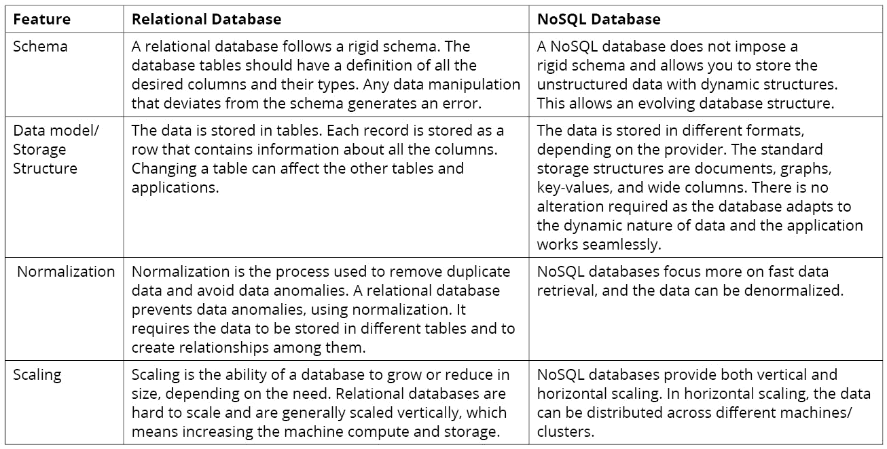

图 1.1：关系数据库和 NoSQL 之间的区别

这就结束了我们关于数据库和各种数据库类型之间的差异的讨论。在下一节中，我们将开始探索 MongoDB。

# MongoDB 简介

MongoDB 是一种流行的 NoSQL 数据库，可以存储结构化和非结构化数据。该组织于 2007 年由 Kevin P. Ryan、Dwight Merriman 和 Eliot Horowitz 在纽约创立，最初被称为 10gen，后来更名为 MongoDB——这个词受到了“巨大”的启发。

它提供了存储真实世界大数据所需的基本和奢华功能。其基于文档的设计使其易于理解和使用。它旨在用于实验和真实世界应用，并且比大多数其他 NoSQL 数据库更容易设置和管理。其直观的查询和命令语法使其易于学习。

以下列表详细探讨了这些功能：

+   **灵活和动态的模式**：MongoDB 允许数据库使用灵活的模式。灵活的模式允许不同文档中的字段变化。简而言之，数据库中的每个记录可能具有相同数量的属性，也可能没有。它解决了存储不断发展的数据的需求，而无需对模式本身进行任何更改。

+   **丰富的查询语言**：MongoDB 支持直观且丰富的查询语言，这意味着简单而强大的查询。它配备了丰富的聚合框架，允许您根据需要对数据进行分组和过滤。它还具有内置的通用文本搜索和特定用途，如地理空间搜索的支持。

+   **多文档 ACID 事务**：**原子性、一致性、完整性和耐久性**（**ACID**）是允许存储和更新数据以保持其准确性的功能。事务用于组合需要一起执行的操作。MongoDB 支持单个文档和多文档事务中的 ACID。

+   **原子性**意味着全部或无，这意味着事务中的所有操作要么全部发生，要么全部不发生。这意味着如果其中一个操作失败，那么所有已执行的操作都将被回滚，以使事务操作受影响的数据保持在事务开始之前的状态。

+   事务中的**一致性**意味着根据数据库定义的规则保持数据一致。如果事务违反任何数据库一致性规则，则必须回滚。

+   **隔离性**强制在隔离中运行事务，这意味着事务不会部分提交数据，事务外的任何值只有在所有操作执行并完全提交后才会发生变化。

+   耐久性确保事务提交的更改。因此，如果事务已执行，则数据库将确保即使系统崩溃，更改也会被提交。

+   **高性能**：MongoDB 使用嵌入式数据模型提供高性能，以减少磁盘 I/O 使用。此外，对不同类型的数据进行索引的广泛支持使查询更快。索引是一种维护索引中相关数据指针的机制，就像书中的索引一样。

+   **高可用性**：MongoDB 支持最少三个节点的分布式集群。集群是指使用多个节点/机器进行数据存储和检索的数据库部署。故障转移是自动的，数据在辅助节点上异步复制。

+   **可扩展性**：MongoDB 提供了一种在数百个节点上水平扩展数据库的方法。因此，对于所有的大数据需求，MongoDB 是完美的解决方案。通过这些，我们已经了解了 MongoDB 的一些基本特性。

注意

MongoDB 1.0 于 2009 年 2 月首次正式发布为开源数据库。此后，该软件已经发布了几个稳定版本。有关不同版本和 MongoDB 演变的更多信息，请访问官方 MongoDB 网站（[`www.mongodb.com/evolved`](https://www.mongodb.com/evolved)）。

# MongoDB 版本

MongoDB 有两个不同的版本，以满足开发人员和企业的需求，如下：

**社区版**：社区版是为开发人员社区发布的，供那些想要学习和获得 MongoDB 实践经验的人使用。社区版是免费的，可在 Windows、Mac 和不同的 Linux 版本上安装，如 Red Hat、Ubuntu 等。您可以在社区服务器上运行生产工作负载；但是，对于高级企业功能和支持，您必须考虑付费的企业版。

企业版：企业版使用与社区版相同的基础软件，但附带一些额外的功能，包括以下内容：

+   *安全性*：**轻量级目录访问协议**（**LDAP**）和 Kerberos 身份验证。LDAP 是一种允许来自外部用户目录的身份验证的协议。这意味着您不需要在数据库中创建用户来进行身份验证，而是可以使用外部目录，如企业用户目录。这样可以节省大量时间，不需要在不同系统中复制用户，如数据库。

+   *内存存储引擎*：提供高吞吐量和低延迟。

+   *加密存储引擎*：这使您可以加密静态数据。

+   *SNMP 监控*：集中的数据收集和聚合。

+   *系统事件审计*：这使您可以以 JSON 格式记录事件。

## 将社区版迁移到企业版

MongoDB 允许您将社区版升级为企业版。这对于您最初使用社区版并最终构建了现在适合商业用途的数据库的情况很有用。对于这种情况，您可以简单地将社区版升级为企业版，而不是安装企业版并重新构建数据库，从而节省时间和精力。有关升级的更多信息，请访问此链接：[`docs.mongodb.com/manual/administration/upgrade-community-to-enterprise/`](https://docs.mongodb.com/manual/administration/upgrade-community-to-enterprise/)。

# MongoDB 部署模型

MongoDB 可以在多种平台上运行，包括 Windows、macOS 和不同版本的 Linux。您可以在单台机器或多台机器上安装 MongoDB。多台机器安装提供了高可用性和可扩展性。以下列表详细介绍了每种安装类型：

**独立版**

独立安装是单机安装，主要用于开发或实验目的。您可以参考*前言*中有关在系统上安装 MongoDB 的步骤。

**副本集**

在 MongoDB 中，复制集是一组进程或服务器，它们共同工作以提供数据冗余和高可用性。将 MongoDB 作为独立进程运行并不是非常可靠的，因为由于连接问题和磁盘故障，您可能会丢失对数据的访问。使用复制集可以解决这些问题，因为数据副本存储在多个服务器上。集群中至少需要三台服务器。这些服务器被配置为主服务器、次要服务器或仲裁者。您将在第九章“复制”中了解更多关于复制集及其好处的信息。

分片

分片部署允许您以分布式方式存储数据。它们适用于管理大量数据并期望高吞吐量的应用程序。一个分片包含数据的一个子集，每个分片必须使用复制集来提供其持有的数据的冗余。多个分片共同工作提供了一个分布式和复制的数据集。

# 管理 MongoDB

MongoDB 为用户提供了两种选择。根据您的需求，您可以在自己的系统上安装并自己管理数据库，或者利用 MongoDB（Atlas）提供的数据库即服务（DBaaS）选项。让我们更多地了解这两种选择。

## 自管理

MongoDB 可以下载并安装在您的机器上。机器可以是工作站、服务器、数据中心中的虚拟机，或者在云上。您可以将 MongoDB 安装为独立、复制集或分片集群。所有这些部署都适用于社区版和企业版。每种部署都有其优势和相关的复杂性。自管理的数据库可以用于您希望更精细地控制数据库或者只是想学习数据库管理和操作的场景。

## 托管服务：数据库即服务

托管服务是将一些流程、功能或部署外包给供应商的概念。DBaaS 是一个通常用于外包给外部供应商的数据库的术语。托管服务实施了一个共享责任模型。服务提供商管理基础设施，即安装、部署、故障转移、可伸缩性、磁盘空间、监控等。您可以管理数据和安全性、性能和调整设置。它允许您节省管理数据库的时间，专注于其他事情，比如应用程序开发。

在这一部分，我们了解了 MongoDB 的历史和发展。我们还了解了 MongoDB 的不同版本以及它们之间的区别。我们通过学习 MongoDB 的部署和管理方式来结束了这一部分。

# MongoDB Atlas

MongoDB Atlas 是 MongoDB Inc.提供的数据库即服务（DBaaS）产品。它允许您在云上提供数据库作为服务，可以用于您的应用程序。Atlas 使用来自不同云供应商的云基础设施。您可以选择要部署数据库的云供应商。与任何其他托管服务一样，您可以获得高可用性、安全的环境，并且几乎不需要或根本不需要维护。

## MongoDB Atlas 的好处

让我们来看看 MongoDB Atlas 的一些好处。

+   简单设置：在 Atlas 上设置数据库很容易，只需几个步骤即可完成。Atlas 在幕后运行各种自动化任务来设置您的多节点集群。

+   保证可用性：Atlas 每个复制集至少部署三个数据节点或服务器。每个节点都部署在不同的可用区（Amazon Web Services（AWS））、故障域（Microsoft Azure）或区域（Google Cloud Platform（GCP））。这样可以实现高可用性设置，并在发生故障或例行更新时保持持续的正常运行时间。

+   全球覆盖：MongoDB Atlas 在 AWS、GCP 和 Microsoft Azure 云中的不同区域都可用。对不同区域的支持允许您选择一个离您更近的区域进行低延迟读写。

+   **最佳性能**：MongoDB 的创始人管理 Atlas，并利用他们的专业知识和经验来保持 Atlas 中的数据库运行良好。此外，单击升级可用于升级到最新版本的 MongoDB。

+   **高度安全**：默认实施安全最佳实践，例如独立的 VPC（虚拟私有云）、网络加密、访问控制和防火墙以限制访问。

+   **自动备份**：您可以配置具有可定制计划和数据保留策略的自动备份。安全备份和恢复可用于在不同版本的数据库之间进行切换。

## 云提供商

MongoDB Atlas 目前支持三个云提供商，分别是**AWS**、**GCP**和**Microsoft Azure**。

## 可用区

**可用区**（**AZs**）是一组物理数据中心，距离较近，配备有计算、存储或网络资源。

## 区域

区域是一个地理区域，例如悉尼、孟买、伦敦等。一个区域通常包括两个或两个以上的 AZs。这些 AZs 通常位于彼此相距较远的不同城市/城镇，以提供在发生自然灾害时的容错能力。容错能力是系统在某一部分出现问题时仍然能够继续运行的能力。就 AZs 而言，如果一个 AZ 由于某种原因而宕机，另一个 AZ 仍应能够提供服务。

## MongoDB 支持的区域和可用区

MongoDB Atlas 允许您在 AWS、GCP 和 Azure 的多云全球基础设施中部署数据库。它使 MongoDB 能够支持大量的区域和 AZs。此外，随着云提供商不断增加，支持的区域和 AZs 的数量也在不断增加。请参考官方 MongoDB 网站上关于云提供商区域支持的链接：

+   AWS：[`docs.atlas.mongodb.com/reference/amazon-aws/#amazon-aws`](https://docs.atlas.mongodb.com/reference/amazon-aws/#amazon-aws)。

+   GCP：[`docs.atlas.mongodb.com/reference/google-gcp/#google-gcp`](https://docs.atlas.mongodb.com/reference/google-gcp/#google-gcp)。

+   Azure：[`docs.atlas.mongodb.com/reference/microsoft-azure/#microsoft-azure`](https://docs.atlas.mongodb.com/reference/microsoft-azure/#microsoft-azure)。

## Atlas 套餐

要在 MongoDB Atlas 中构建数据库集群，您需要选择一个**套餐**。套餐是您从集群中获得的数据库功率级别。在 Atlas 中配置数据库时，您会得到两个参数：RAM 和存储空间。根据您对这些参数的选择，将配置适当数量的数据库功率。您的集群成本与 RAM 和存储的选择相关联；更高的选择意味着更高的成本，更低的选择意味着更低的成本。

M0 是 MongoDB Atlas 中的免费套餐，提供 512MB 的共享 RAM 和存储空间。这是我们用于学习目的的套餐。免费套餐并非在所有区域都可用，因此如果在您的区域找不到它，请选择最接近的免费套餐区域。数据库的接近程度决定了操作的延迟。

选择套餐需要了解您的数据库使用情况以及您愿意花费多少。配置不足的数据库可能会在高峰使用时耗尽应用程序的容量，并可能导致应用程序错误。配置过多的数据库可以帮助应用程序表现良好，但成本更高。使用云数据库的优势之一是您可以根据需要随时修改集群大小。但您仍然需要找到适合您日常数据库使用的最佳容量。确定最大并发连接数是一个关键决策因素，可以帮助您为您的用例选择适当的 MongoDB Atlas 套餐。让我们看看不同的可用套餐：

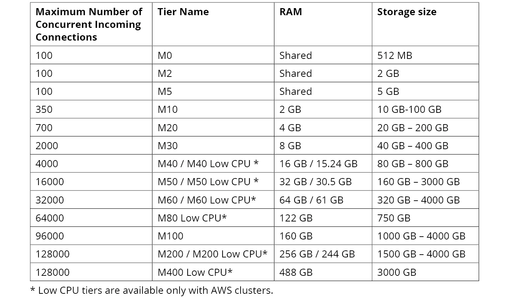

图 1.2：MongoDB Atlas 层配置

### MongoDB Atlas 定价

容量规划是必不可少的，但估算数据库集群的成本也很重要。我们了解到 M0 集群是免费的，资源很少，非常适合原型设计和学习目的。对于付费的集群层，Atlas 会按小时收费。总成本包括多个因素，如服务器的类型和数量。让我们看一个示例，了解 Atlas 上 M30 类型副本集（三台服务器）的成本估算。

### 集群成本估算

让我们尝试了解如何估算您的 MongoDB Atlas 集群的成本。按照以下方式确定集群需求：

+   机器类型：M30

+   服务器数量：3（副本集）

+   运行时间：每天 24 小时

+   估算时间段：1 个月

一旦我们确定了我们的需求，估算成本可以计算如下：

+   每小时运行单个 M30 服务器的成本：$0.54

+   服务器运行的小时数：24（小时）x 30（天）= 720

+   一个月单台服务器的成本：720 x 0.54 = $388.8

+   运行三台服务器集群的成本：388.8 x 3 = $1166.4

因此，总成本应该降至$1166.4。

注意

除了集群的运行成本，您还应考虑额外服务的成本，如备份、数据传输和支持合同的成本。

让我们通过以下练习在一个示例场景中实施我们的学习。

## 练习 1.01：设置 MongoDB Atlas 帐户

MongoDB Atlas 为您提供免费注册以设置免费集群。在这个练习中，您将通过执行以下步骤创建一个帐户：

1.  转到[`www.mongodb.com`](https://www.mongodb.com)并单击“开始免费”。将出现以下窗口：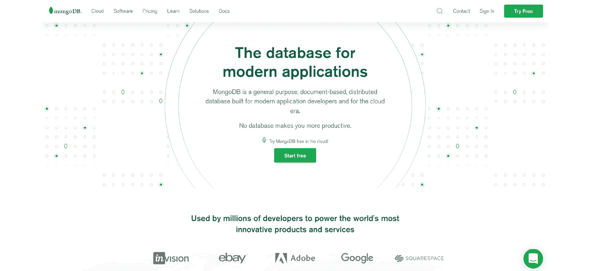

图 1.3：MongoDB Atlas 主页

1.  您可以使用您的 Google 帐户注册，也可以手动提供您的详细信息，如下图所示。在相应的字段中提供您的使用情况、“您的工作电子邮件”、“名字”、“姓氏”和“密码”详细信息，选择同意服务条款的复选框，然后单击“开始免费”。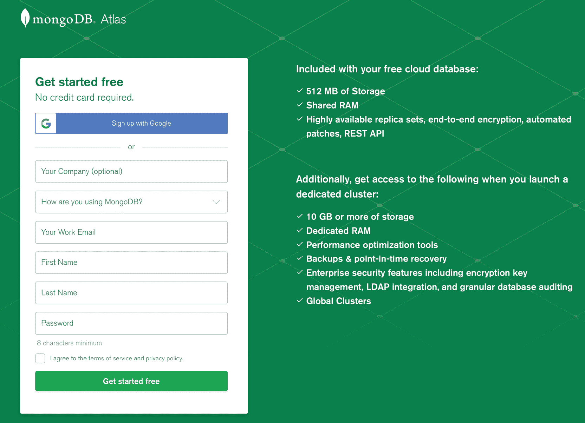

图 1.4：开始页面

将出现以下窗口，您可以在其中输入组织和项目详细信息：

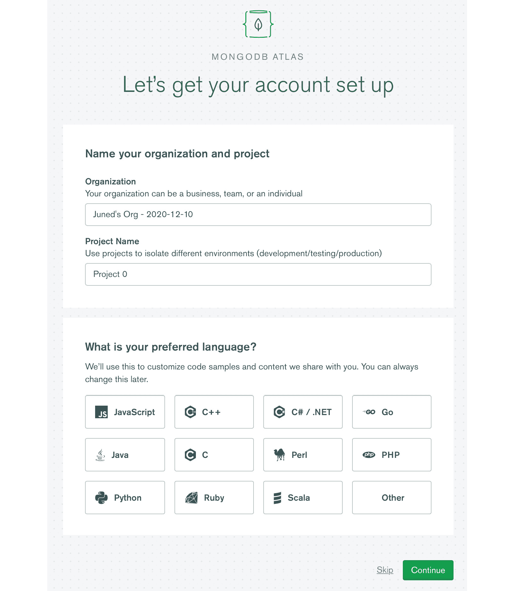

图 1.5：输入组织和项目详细信息的页面

接下来，您应该看到以下页面，这意味着您的帐户已成功创建：

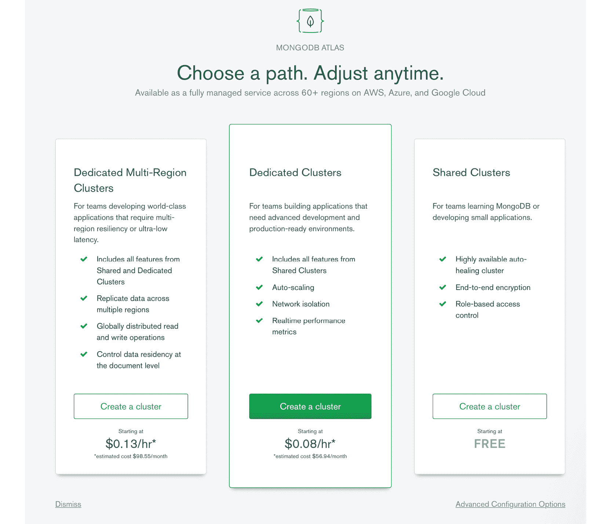

图 1.6：确认页面

在这个练习中，您成功地创建了您的 MongoDB 帐户。

# MongoDB Atlas 组织、项目、用户和集群

MongoDB Atlas 对您的环境强制执行基本结构。这包括组织、项目、用户和集群的概念。MongoDB 提供了一个默认组织和一个项目，以帮助您轻松入门。本节将教您这些实体的含义以及如何设置它们。

## 组织

MongoDB Atlas 组织是您帐户中的顶级实体，包含其他元素，如项目、集群和用户。在任何其他资源之前，您需要首先设置一个组织。

## 练习 1.02：设置 MongoDB Atlas 组织

您已成功在 MongoDB Atlas 上创建了一个帐户，在这个练习中，您将根据自己的偏好设置一个组织：

1.  登录到您在*练习 1.01*中创建的 MongoDB 帐户，*设置 MongoDB Atlas 帐户*。要创建一个组织，请从您的帐户菜单中选择“组织”选项，如下图所示：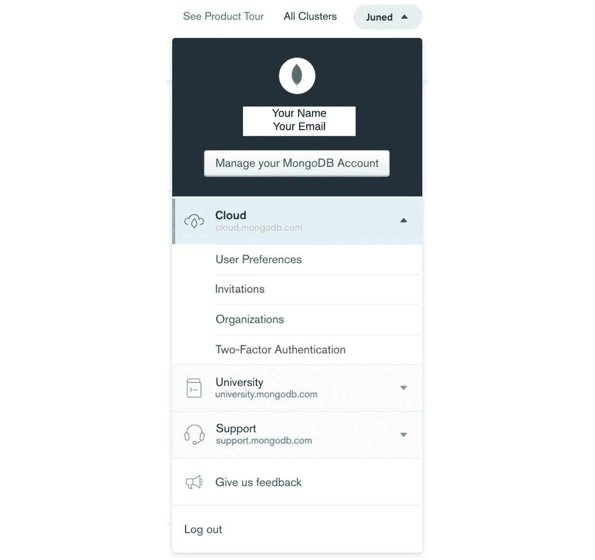

图 1.7：用户选项-组织

1.  您将在组织列表中看到默认组织。要创建一个新组织，请单击右上角的“创建新组织”按钮：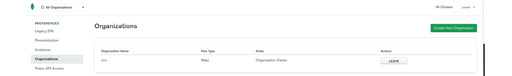

图 1.8：组织列表

1.  在“命名您的组织”字段中输入组织名称。将“云服务”默认选择为`MongoDB Atlas`。单击“下一步”以继续下一步：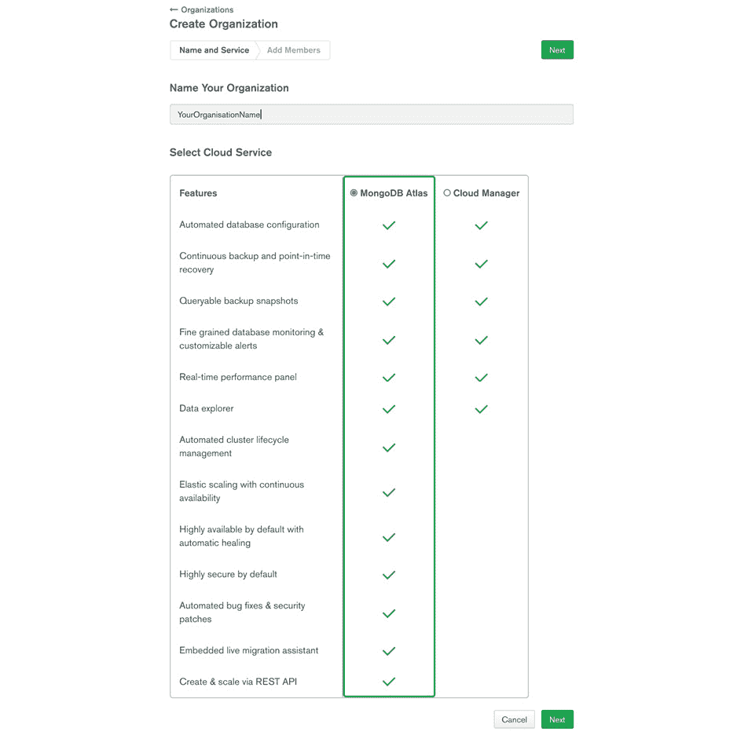

图 1.9：组织名称

您将看到以下屏幕：

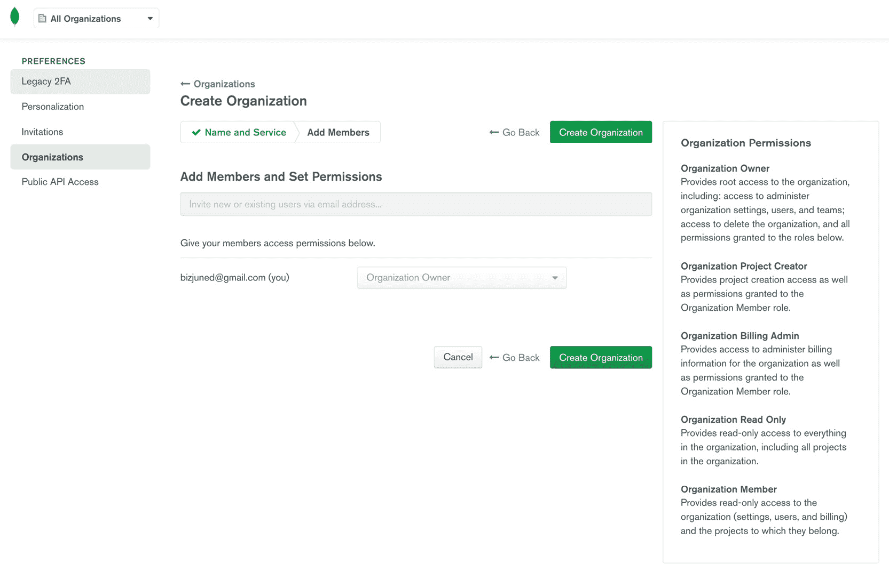

图 1.10：创建组织页面

1.  您将看到您的登录作为“组织所有者”。将一切保持默认设置，然后单击“创建组织”。

成功创建组织后，将出现以下“项目”屏幕：


图 1.11：项目页面

因此，在本练习中，您已成功为您的 MongoDB 应用程序创建了组织。

## 项目

项目为特定目的提供了集群和用户的分组；例如，您想要将您的实验室、演示和生产环境进行分隔。同样，您可能希望为不同的环境设置不同的网络、区域和用户。项目允许您根据自己的组织需求进行分组。在下一个练习中，您将创建一个项目。

## 练习 1.03：创建 MongoDB Atlas 项目

在本练习中，您将使用以下步骤在 MongoDB Atlas 上设置一个项目：

1.  一旦您在*练习 1.02*中创建了一个组织，下次登录时将会出现“项目”屏幕。单击“新建项目”：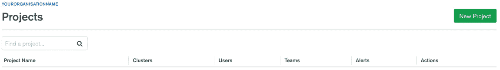

图 1.12：项目页面

1.  在“命名您的项目”选项卡上为您的项目提供一个名称。将项目命名为`myMongoProject`。单击“下一步”：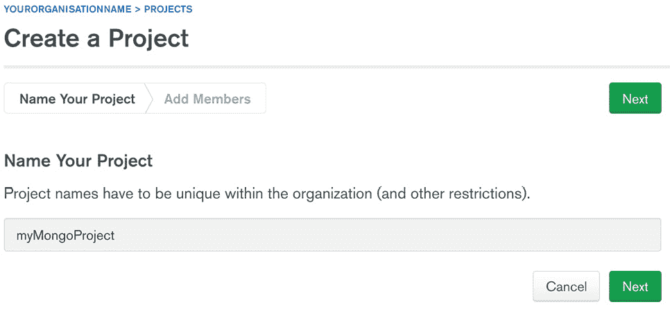

图 1.13：创建项目页面

1.  单击“创建项目”。“添加成员和设置权限”页面不是必需的，因此将其保留为默认设置。您的名称应该显示为“项目所有者”：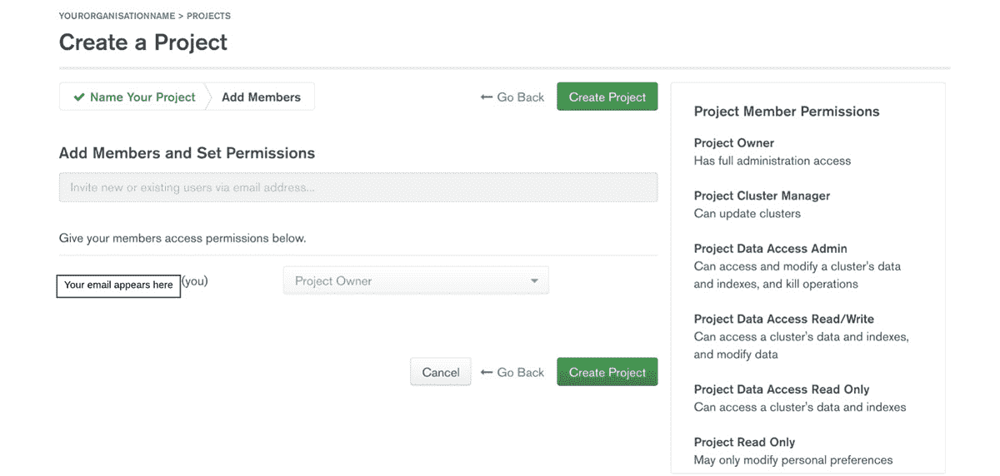

图 1.14：为项目添加成员并设置权限

您的项目现在已经设置好。设置集群的启动画面如下图所示：

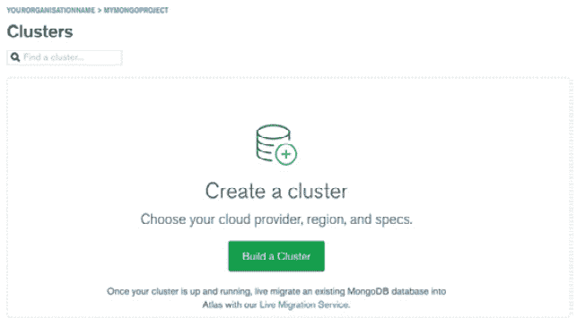

图 1.15：集群页面

现在您已经创建了一个项目，您可以创建您的第一个 MongoDB 云部署。

## MongoDB 集群

MongoDB 集群是 MongoDB Atlas 中用于数据库副本集或共享部署的术语。集群是用于数据存储和检索的一组分布式服务器。MongoDB 集群在最低级别上是一个由三个节点组成的副本集。在分片环境中，单个集群可能包含数百个节点/服务器，每个节点/服务器包含不同的副本集，每个副本集由至少三个节点/服务器组成。

## 练习 1.04：在 Atlas 上设置您的第一个免费 MongoDB 集群

在本节中，您将在 Atlas 免费版（M0）上设置您的第一个 MongoDB 副本集。以下是执行此操作的步骤：

1.  前往[`www.mongodb.com/cloud/atlas`](https://www.mongodb.com/cloud/atlas)并使用*练习 1.01*中使用的凭据登录您的账户，*设置 MongoDB Atlas 账户*。将出现以下屏幕：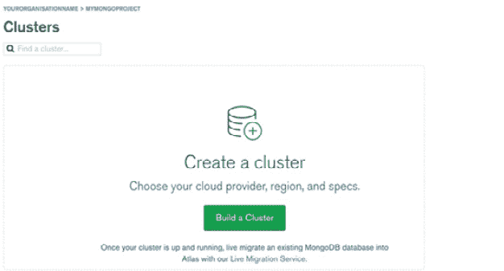

图 1.16：集群页面

1.  单击“构建集群”以配置您的集群：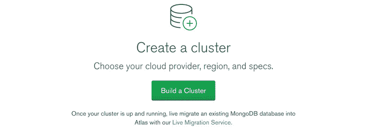

图 1.17：构建集群页面

将出现以下集群选项：

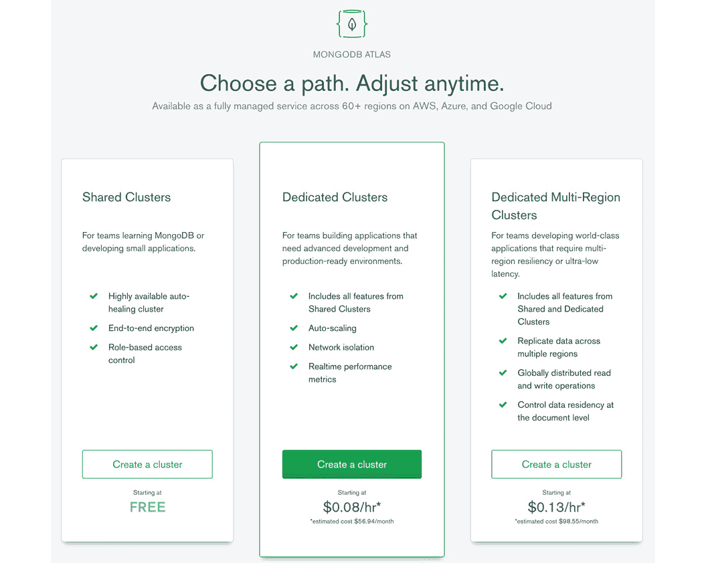

图 1.18：可用的集群选项

1.  选择标记为“免费”的“共享集群”选项，如前图所示。

1.  将呈现一个集群配置屏幕，以选择集群的不同选项。选择您选择的云提供商。在本练习中，您将使用 AWS，如下图所示：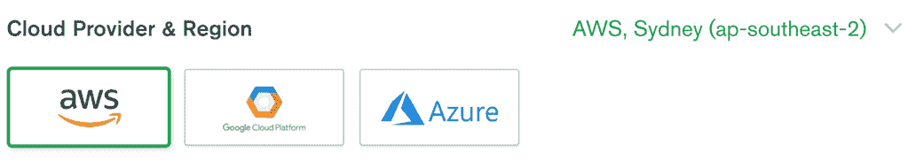

图 1.19：选择云提供商和区域

1.  选择最靠近您位置且免费的`推荐区域`。在本例中，您将选择`悉尼`，如下图所示：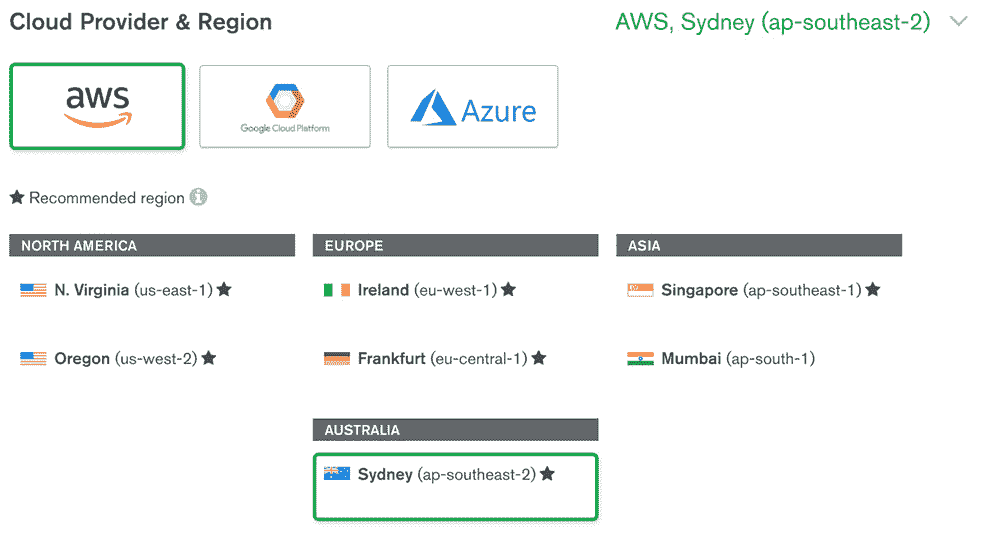

图 1.20：选择推荐的区域

在区域选择页面上，您将根据您的选择看到您的集群设置。`Cluster Tier`将是`M0 Sandbox(Shared RAM, 512 MB storage)`，`Additional Settings`将是`MongoDB 4.2 No Backup`，`Cluster Name`将是`Cluster0`：

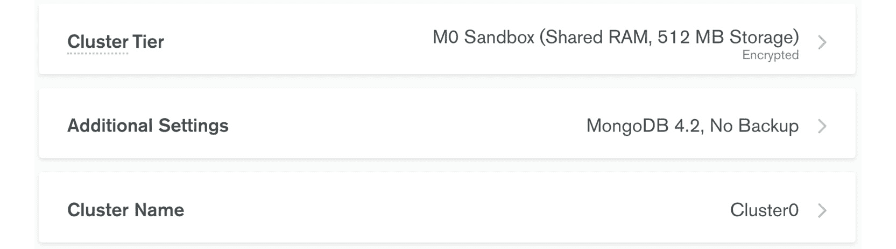

图 1.21：集群的附加设置

1.  确保在前面的步骤中正确进行选择，以便成本显示为“免费”。与前面步骤中推荐的选择不同的任何选择都可能为您的集群增加成本。点击“创建集群”：

图 1.22：免费套餐通知

屏幕上会出现“正在创建您的集群…”的成功消息。通常需要几分钟来设置集群：

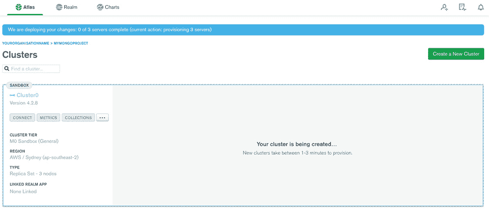

图 1.23：正在创建 MongoDB 集群

几分钟后，您应该会看到您的新集群，如下图所示：

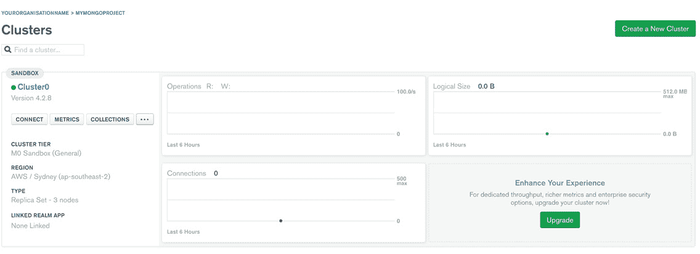

图 1.24：MongoDB 集群已创建

您已成功创建了一个新的集群。

## 连接到您的 MongoDB Atlas 集群

以下是连接到在云上运行的 MongoDB Atlas 集群的步骤：

1.  转到[`account.mongodb.com/account/login`](https://account.mongodb.com/account/login)。将出现以下窗口：

图 1.25：MongoDB Atlas 登录页面

1.  提供您的电子邮件地址并点击“下一步”：

图 1.26：MongoDB Atlas 登录页面（密码）

1.  现在输入您的`密码`并点击`登录`。`Clusters`窗口将如下图所示出现：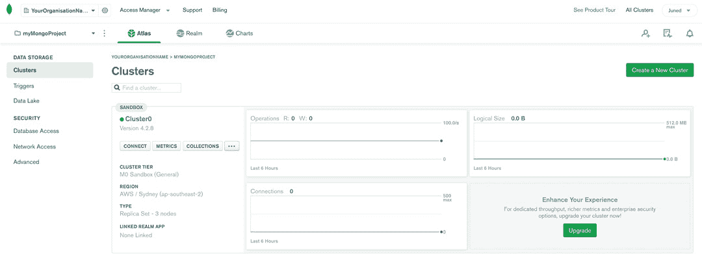

图 1.27：MongoDB Atlas 集群屏幕

1.  点击`Cluster0`下的`CONNECT`按钮。它将打开一个模态屏幕，如下所示：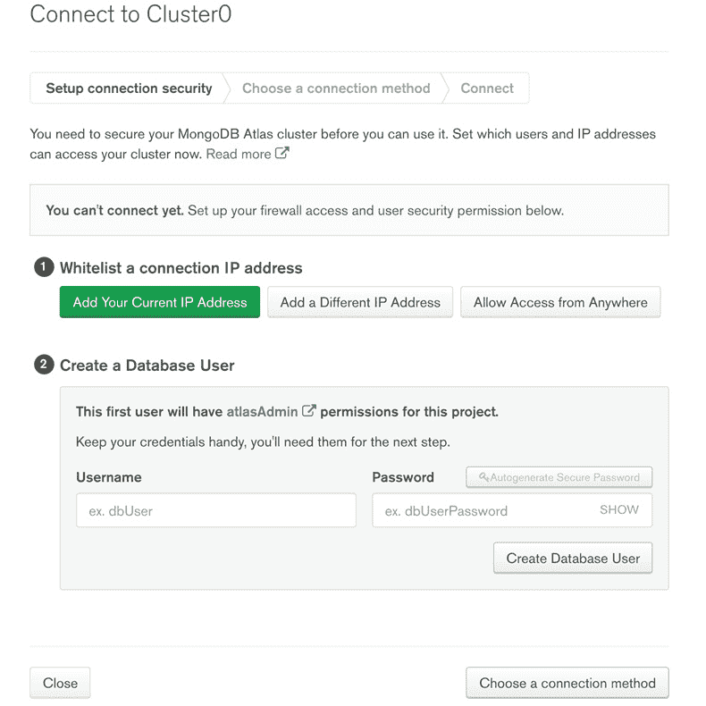

图 1.28：MongoDB Atlas 模态屏幕

在连接到集群之前的第一步是将您的 IP 地址加入白名单。MongoDB Atlas 具有默认启用的内置安全功能，它会阻止从任何地方连接到数据库。因此，需要将客户端 IP 加入白名单才能连接到数据库。

1.  点击“添加您当前的 IP 地址”以将您的 IP 地址加入白名单，如下图所示：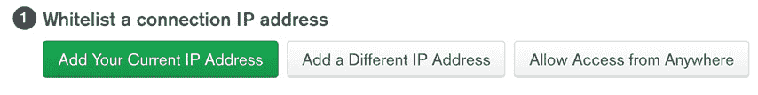

图 1.29：添加您当前的 IP 地址

1.  屏幕上将显示您当前的 IP 地址；只需点击“添加 IP 地址”按钮。如果您希望将更多 IP 地址添加到白名单中，可以通过点击“添加不同的 IP 地址”选项手动添加（见上图）：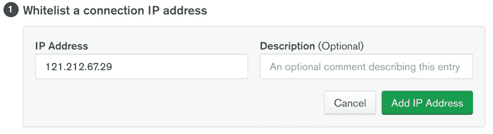

图 1.30：添加您当前的 IP 地址

一旦 IP 被加入白名单，将出现以下消息：


图 1.31：IP 已加入白名单的消息

1.  要创建一个新的 MongoDB 用户，请为新用户提供`用户名`和`密码`，然后点击“创建数据库用户”按钮以创建用户，如下图所示：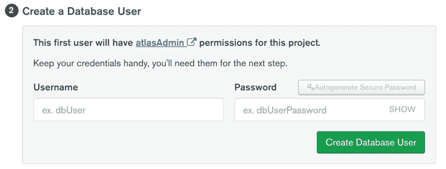

图 1.32：创建 MongoDB 用户

一旦详细信息成功更新，将出现以下屏幕：

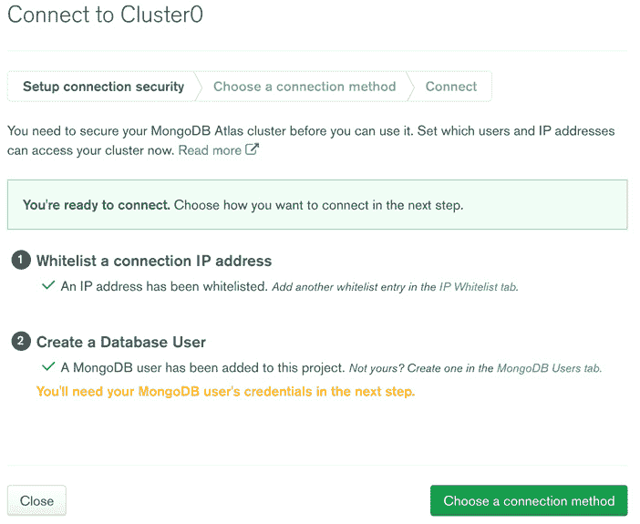

图 1.33：MongoDB 用户创建屏幕

1.  要选择连接方法，请单击“选择连接方法”按钮。选择如下所示的使用 mongo shell 连接的选项：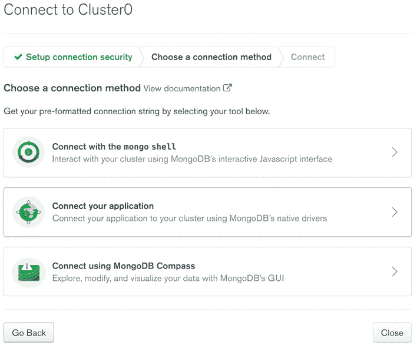

图 1.34：选择连接类型

1.  通过选择工作站/客户端机器的选项来下载和安装 mongo shell，如下截图所示：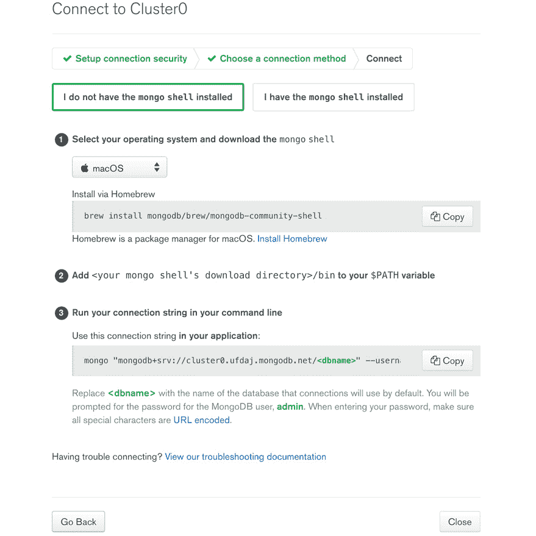

图 1.35：安装 mongo shell

mongo shell 是连接到 Mongo 服务器的命令行客户端。您将在整本书中使用这个客户端，因此安装它是至关重要的。

1.  安装了 mongo shell 后，运行您在上一步中获取的连接字符串以连接到您的数据库。提示时，请输入您在上一步中为 MongoDB 用户使用的密码：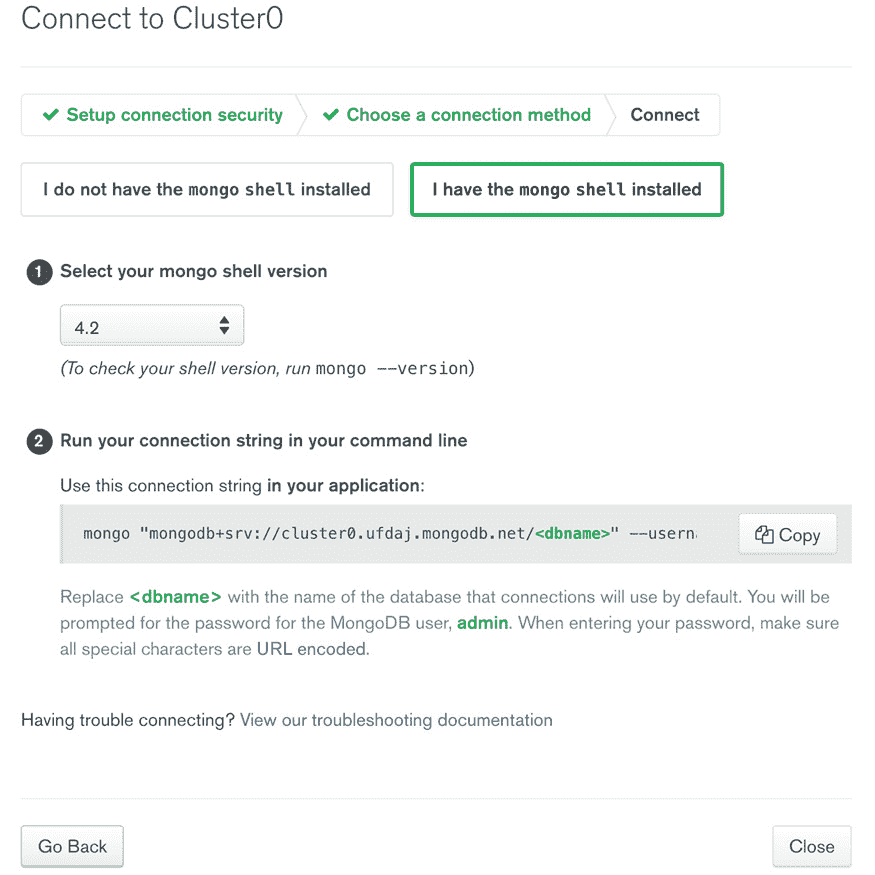

图 1.36：安装 mongo shell

如果一切顺利，您应该看到 mongo shell 已连接到您的 Atlas 集群。以下是连接字符串执行的示例输出：

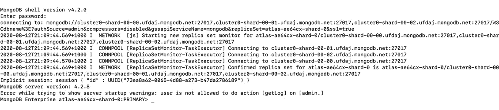

图 1.37：连接字符串执行的输出

忽略*图 1.37*中看到的警告。最后，您应该看到您的集群名称和命令提示符。您可以运行`show databases`命令来列出现有的数据库。您应该看到 MongoDB 用于管理目的的两个数据库。以下是`show databases`命令的一些示例输出：

```js
MongoDB Enterprise Cluster0-shard-0:PRIMARY> show databases
admin  0.000GB
local  4.215GB
```

您已成功连接到 MongoDB Atlas 实例。

## MongoDB 元素

让我们深入了解 MongoDB 的一些非常基本的元素，如数据库、集合和文档。数据库基本上是集合的聚合，而集合又由文档组成。文档是 MongoDB 中的基本构建块，包含以键值格式存储的各种字段的信息。

## 文档

MongoDB 将数据记录存储在文档中。文档是一组字段名称和值，以**JavaScript 对象表示法**（**JSON**）类似的格式结构化。JSON 是一种易于理解的键值对格式，用于描述数据。MongoDB 中的文档存储为 JSON 类型的扩展，称为 BSON（二进制 JSON）。它是 JSON 样式文档的二进制编码序列化。BSON 设计为比标准 JSON 更有效地利用空间。BSON 还包含扩展，允许表示无法在 JSON 中表示的数据类型。我们将在*第二章*，*文档和数据类型*中详细讨论这些。

## 文档结构

MongoDB 文档包含字段和值对，并遵循基本结构，如下所示：

```js
{
     "firstFieldName": firstFieldValue,
     "secondFieldName": secondFieldValue,
     …
     "nthFieldName": nthFieldValue
}
```

以下是一个包含有关个人详细信息的文档示例：

```js
{
    "_id":ObjectId("5da26111139a21bbe11f9e89"),
    "name":"Anita P",
    "placeOfBirth":"Koszalin",
    "profession":"Nursing"
}
```

以下是另一个包含来自 BSON 的一些字段和日期类型的示例：

```js
{
    "_id" : ObjectId("5da26553fb4ef99de45a6139"),
    "name" : "Roxana",
    "dateOfBirth" : new Date("Dec 25, 2007"),
    "placeOfBirth" : "Brisbane",
    "profession" : "Student"
}
```

以下文档示例包含一个数组和一个子文档。数组是一组值，当您需要为爱好等键存储多个值时可以使用。子文档允许您将相关属性包装在一个文档中，以对抗一个键，如地址：

```js
{
    "_id" : ObjectId("5da2685bfb4ef99de45a613a"),
    "name" : "Helen",
    "dateOfBirth" : new Date("Dec 25, 2007"),
    "placeOfBirth" : "Brisbane",
    "profession" : "Student",
    "hobbies" : [
     "painting",
     "football",
     "singing",
     "story-writing"],
    "address" : {
     "city" : "Sydney",
    "country" : "Australia",
    "postcode" : 2161
  }
}
```

在上面片段中显示的`_id`字段是由 MongoDB 自动生成的，用作文档的唯一标识符。我们将在接下来的章节中了解更多关于这个。

## 集合

在 MongoDB 中，文档存储在集合中。集合类似于关系数据库中的表。您需要在查询中使用集合名称进行操作，如插入、检索、删除等。

## 理解 MongoDB 数据库

数据库是一组集合的容器。每个数据库在文件系统上有几个文件，这些文件包含数据库元数据和集合中存储的实际数据。MongoDB 允许您拥有多个数据库，每个数据库可以有各种集合。反过来，每个集合可以有许多文档。这在下图中有所说明，显示了一个包含不同事件相关字段的事件数据库，如*Person*、*Location*和*Events*；这些又包含各种具体数据的文档：

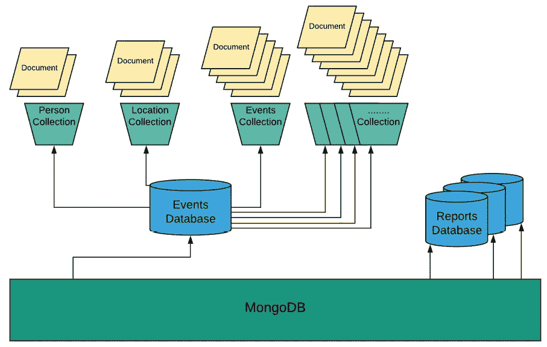

图 1.38：MongoDB 数据库的图示表示

## 创建一个数据库

在 MongoDB 中创建数据库非常简单。执行 mongo shell 中的`use`命令，如下所示，将`yourDatabaseName`替换为您自己选择的数据库名称：

```js
use yourDatabaseName
```

如果数据库不存在，Mongo 将创建数据库并将当前数据库切换到新数据库。如果数据库存在，Mongo 将引用现有数据库。以下是最后一个命令的输出：

```js
switched to db yourDatabaseName
```

注意

命名约定和使用逻辑名称总是有帮助的，即使您正在进行一个学习项目。项目名称应该被更有意义的内容替换，以便以后使用时更容易理解。这个规则适用于我们创建的任何资产的名称，所以尽量使用逻辑名称。

## 创建一个集合

您可以使用`createCollection`命令来创建一个集合。这个命令允许您为您的集合使用不同的选项，比如固定大小的集合、验证、排序等。创建集合的另一种方法是通过在不存在的集合中插入文档。在这种情况下，MongoDB 会检查集合是否存在，如果不存在，它将在插入传递的文档之前创建集合。我们将尝试利用这两种方法来创建一个集合。

要显式创建集合，请使用以下语法中的`createCollection`操作：

```js
db.createCollection( '<collectionName>',
{
     capped: <boolean>,
     autoIndexId: <boolean>,
     size: <number>,
     max: <number>,
     storageEngine: <document>,
     validator: <document>,
     validationLevel: <string>,
     validationAction: <string>,
     indexOptionDefaults: <document>,
     viewOn: <string>,
     pipeline: <pipeline>,
     collation: <document>,
     writeConcern: <document>
})
```

在下面的代码片段中，我们创建了一个最多包含 5 个文档的固定大小集合，每个文档的大小限制为 256 字节。固定大小集合的工作原理类似于循环队列，这意味着当达到最大大小时，旧文档将被删除以为最新插入腾出空间。

```js
db.createCollection('myCappedCollection',
{
     capped: true,
     size: 256,
     max: 5
})
```

以下是`createCollection`命令的输出：

```js
{
        «ok» : 1,
        «$clusterTime» : {
                «clusterTime» : Timestamp(1592064731, 1),
                «signature» : {
                        «hash» : BinData(0,»XJ2DOzjAagUkftFkLQIT                           9W2rKjc="),
                        «keyId» : NumberLong(«6834058563036381187»)
                }
        },
        «operationTime» : Timestamp(1592064731, 1)
}
```

不要太担心前面的选项，因为它们都不是必需的。如果您不需要设置其中任何一个，那么您的`createCollection`命令可以简化如下：

```js
db.createCollection('myFirstCollection')
```

这个命令的输出应该如下所示：

```js
{
        «ok» : 1,
        «$clusterTime» : {
                «clusterTime» : Timestamp(1597230876, 1),
                «signature» : {
                        «hash» : BinData(0,»YO8Flg5AglrxCV3XqEuZG                           aaLzZc="),
                        «keyId» : NumberLong(«6853300587753111555»)
                }
        },
        «operationTime» : Timestamp(1597230876, 1)
}
```

## 使用文档插入创建集合

在插入文档之前不需要创建集合。如果在第一次插入文档时集合不存在，MongoDB 会创建一个集合。您可以按照以下方法使用这种方法：

```js
use yourDatabaseName;
db.myCollectionName.insert(
{
    "name" : "Yahya A",  "company" :  "Sony"}
);
```

您的命令输出应该如下所示：

```js
WriteResult({ "nInserted" : 1 })
```

前面的输出返回插入到集合中的文档数量。由于您在不存在的集合中插入了一个文档，MongoDB 必须在插入此文档之前为我们创建集合。为了确认这一点，使用以下命令显示您的集合列表：

```js
show collections;
```

您的命令输出应该显示数据库中集合的列表，类似于这样：

```js
myCollectionName
```

## 创建文档

正如您在前一节中注意到的，我们使用`insert`命令将文档放入集合中。让我们看一下`insert`命令的几种变体。

### 插入单个文档

`insertOne`命令用于一次插入一个文档，如下所示：

```js
db.blogs.insertOne(
  { username: "Zakariya", noOfBlogs: 100, tags: ["science",    "fiction"]
})
```

`insertOne`操作返回新插入文档的`_id`值。以下是`insertOne`命令的输出：

```js
{
  "acknowledged" : true,
  "insertedId" : ObjectId("5ea3a1561df5c3fd4f752636")
}
```

注意

`insertedId`是插入的文档的唯一 ID，它不会与输出中提到的相同。

### 插入多个文档

`insertMany`命令一次插入多个文档。您可以将文档数组传递给命令，如下面的代码段中所述：

```js
db.blogs.insertMany(
[
      { username: "Thaha", noOfBlogs: 200, tags: ["science",       "robotics"]},
      { username: "Thayebbah", noOfBlogs: 500, tags: ["cooking",     "general knowledge"]},
      { username: "Thaherah", noOfBlogs: 50, tags: ["beauty",        "arts"]}
]
)
```

输出返回所有新插入文档的`_id`值：

```js
{
  «acknowledged» : true,
  «insertedIds» : [
    ObjectId(«5f33cf74592962df72246ae8»),
    ObjectId(«5f33cf74592962df72246ae9»),
    ObjectId(«5f33cf74592962df72246aea»)
  ]
}
```

### 从 MongoDB 获取文档

MongoDB 提供`find`命令从集合中获取文档。此命令对于检查插入的文档是否实际保存在集合中非常有用。以下是`find`命令的语法：

```js
db.collection.find(query, projection)
```

该命令接受两个可选参数：`query`和`projection`。`query`参数允许您传递一个文档以在`find`操作期间应用过滤器。`projection`参数允许您从返回的文档中选择所需的属性，而不是所有属性。当在`find`命令中不传递参数时，将返回所有文档。

### 使用`pretty()`方法格式化查找输出

当`find`命令返回多个记录时，有时很难阅读它们，因为它们没有适当的格式。MongoDB 提供了`pretty()`方法，可以在`find`命令的末尾以格式化的方式获取返回的记录。要查看它的操作，请在名为`records`的集合中插入一些记录：

```js
db.records.insertMany(
[
  { Name: "Aaliya A", City: "Sydney"},
  { Name: "Naseem A", City: "New Delhi"}
]
)
```

它应该生成以下输出：

```js
{
  "acknowledged" : true,
  "insertedIds" : [
    ObjectId("5f33cfac592962df72246aeb"),
    ObjectId("5f33cfac592962df72246aec")
  ]
}
```

首先，使用`find`命令而不使用`pretty`方法获取这些记录：

```js
db.records.find()
```

它应该返回如下所示的输出：

```js
{ "_id" : ObjectId("5f33cfac592962df72246aeb"), "Name" : "Aaliya A",   "City" : "Sydney" }
{ "_id" : ObjectId("5f33cfac592962df72246aec"), "Name" : "Naseem A",   "City" : "New Delhi" }
```

现在，使用`pretty`方法运行相同的`find`命令：

```js
db.records.find().pretty()
```

它应该以如下所示的美观格式返回相同的记录：

```js
{
  "_id" : ObjectId("5f33cfac592962df72246aeb"),
  "Name" : "Aaliya A",
  "City" : "Sydney"
}
{
  "_id" : ObjectId("5f33cfac592962df72246aec"),
  "Name" : "Naseem A",
  "City" : "New Delhi"
}
```

显然，当您查看多个或嵌套文档时，`pretty()`方法可能非常有用，因为输出更容易阅读。

## 活动 1.01：设置电影数据库

您是一家公司的创始人，该公司制作来自世界各地的电影软件。您的团队没有太多的数据库管理技能，也没有预算来雇佣数据库管理员。您的任务是提供部署策略和基本的数据库架构/结构，并设置电影数据库。

以下步骤将帮助您完成此活动：

1.  连接到您的数据库。

1.  创建名为`moviesDB`的电影数据库。

1.  创建一个电影集合并插入以下示例数据：[`packt.live/3lJXKuE`](https://packt.live/3lJXKuE)。

```js
[
    {
        "title": "Rocky",
        "releaseDate": new Date("Dec 3, 1976"),
        "genre": "Action",
        "about": "A small-time boxer gets a supremely rare chance           to fight a heavy-  weight champion in a bout in           which he strives to go the distance for his self-respect.",
        "countries": ["USA"],
        "cast" : ["Sylvester Stallone","Talia Shire",          "Burt Young"],
        "writers" : ["Sylvester Stallone"],
        "directors" : ["John G. Avildsen"]
    },
    {
        "title": "Rambo 4",
        "releaseDate ": new Date("Jan 25, 2008"),
        "genre": "Action",
        "about": "In Thailand, John Rambo joins a group of           mercenaries to venture into war-torn Burma, and rescue           a group of Christian aid workers who were kidnapped           by the ruthless local infantry unit.",
        "countries": ["USA"],
        "cast" : [" Sylvester Stallone", "Julie Benz",           "Matthew Marsden"],
        "writers" : ["Art Monterastelli",          "Sylvester Stallone"],
        "directors" : ["Sylvester Stallone"]
    }
]
```

1.  通过获取文档来检查文档是否已插入。

1.  使用以下数据创建一个`awards`集合中的一些记录：

```js
{
    "title": "Oscars",
    "year": "1976",
    "category": "Best Film",
    "nominees": ["Rocky","All The President's Men","Bound For       Glory","Network","Taxi Driver"],
    "winners" :
    [
        {
            "movie" : "Rocky"
        }
    ]
}
{
    "title": "Oscars",
    "year": "1976",
    "category": "Actor In A Leading Role",
    "nominees": ["PETER FINCH","ROBERT DE NIRO",      "GIANCARLO GIANNINI","WILLIAM  HOLDEN","SYLVESTER STALLONE"],
    "winners" :
    [
        {
            "actor" : "PETER FINCH",
            "movie" : "Network"
        }
    ]
}
```

1.  通过获取文档来检查您的插入是否按预期保存在集合中。

注意

此活动的解决方案可以通过此链接找到。

# 摘要

我们开始本章时，介绍了数据、数据库、RDBMS 和 NoSQL 数据库的基础知识。您了解了 RDBMS 和 NoSQL 数据库之间的区别，以及如何决定哪种数据库适合特定的场景。您了解到 MongoDB 可以用作自管理或作为 DbaaS，设置了 MongoDB Atlas 中的帐户，并审查了不同云平台上的 MongoDB 部署以及如何估算其成本。我们通过 MongoDB 结构及其基本组件（如数据库、集合和文档）结束了本章。在下一章中，您将利用这些概念来探索 MongoDB 组件及其数据模型。
