# 第二章：文档和数据类型

概述

本章介绍了 MongoDB 文档、它们的结构和数据类型。对于那些对 JSON 模型不熟悉的人来说，本章也将作为 JSON 的简要介绍。您将识别 JSON 文档的基本概念和数据类型，并将 MongoDB 的基于文档的存储与关系数据库的表格存储进行比较。您将学习如何在 MongoDB 中使用嵌入对象和数组表示复杂的数据结构。通过本章的学习，您将了解对 MongoDB 文档的预防性限制和限制的需求。

# 介绍

在上一章中，我们了解了作为 NoSQL 数据库的 MongoDB 与传统关系数据库的不同之处。我们涵盖了 MongoDB 的基本特性，包括其架构、不同版本和 MongoDB Atlas。

MongoDB 是为现代应用程序设计的。我们生活在一个需求迅速变化的世界。我们希望构建轻量灵活的应用程序，能够快速适应这些新需求，并尽快将其部署到生产环境中。我们希望我们的数据库变得敏捷，以便能够适应应用程序不断变化的需求，减少停机时间，轻松扩展，并且性能高效。MongoDB 完全符合所有这些需求。

使 MongoDB 成为一种敏捷数据库的主要因素之一是其基于文档的数据模型。文档被广泛接受为传输信息的灵活方式。您可能已经遇到许多以 JSON 文档形式交换数据的应用程序。MongoDB 以二进制 JSON（BSON）格式存储数据，并以人类可读的 JSON 表示数据。这意味着当我们使用 MongoDB 时，我们看到的数据是以 JSON 格式呈现的。本章以 JSON 和 BSON 格式的概述开始，然后介绍 MongoDB 文档和数据类型的详细信息。

# JSON 介绍

JSON 是一种用于数据表示和传输的全文本、轻量级格式。JavaScript 对对象的简单表示形式催生了 JSON。道格拉斯·克罗克福德（Douglas Crockford）是 JavaScript 语言的开发人员之一，他提出了 JSON 规范的建议，定义了 JSON 语法的语法和数据类型。

JSON 规范于 2013 年成为标准。如果您已经开发了一段时间的应用程序，您可能已经看到应用程序从 XML 转换为 JSON 的过渡。JSON 提供了一种人类可读的纯文本表示数据的方式。与 XML 相比，其中信息被包裹在标签内，而且大量标签使其看起来笨重，JSON 提供了一种紧凑和自然的格式，您可以轻松地专注于信息。

为了以 JSON 或 XML 格式读取或写入信息，编程语言使用它们各自的解析器。由于 XML 文档受模式定义和标签库定义的约束，解析器需要做大量工作来读取和验证 XML 模式定义（XSD）和标签库描述符（TLD）。

另一方面，JSON 没有任何模式定义，JSON 解析器只需要处理开放和关闭括号以及冒号。不同的编程语言有不同的表示语言构造的方式，例如对象、列表、数组、变量等。当两个用不同编程语言编写的系统想要交换数据时，它们需要有一个共同约定的标准来表示信息。JSON 以其轻量级格式提供了这样的标准。任何编程语言的对象、集合和变量都可以自然地适应 JSON 结构。大多数编程语言都有解析器，可以将它们自己的对象转换为 JSON 文档，反之亦然。

注意

JSON 不会将 JavaScript 语言内部规定强加给其他语言。JSON 是语言无关数据表示的语法。定义 JSON 格式的语法是从 JavaScript 的语法派生出来的。然而，为了使用 JSON，程序员不需要了解 JavaScript 的内部。

## JSON 语法

JSON 文档或对象是一组零个或多个键值对的纯文本。键值对形成一个对象，如果值是零个或多个值的集合，它们形成一个数组。JSON 具有非常简单的结构，只需使用一组大括号`{}`、方括号`[]`、冒号`:`和逗号`,`，就可以以紧凑的形式表示任何复杂的信息。

在 JSON 对象中，键值对被包含在大括号`{}`中。在对象内，键始终是一个字符串。然而，值可以是 JSON 指定的任何类型。JSON 语法规范没有为 JSON 字段定义任何顺序，可以表示如下：

```js
{
  key : value
}
```

前面的文件代表一个有效的 JSON 对象，其中有一个键值对。接下来是 JSON 数组，数组是一组零个或多个值，这些值被包含在方括号`[]`中，并用逗号分隔。虽然大多数编程语言支持有序数组，但 JSON 的规范并未指定数组元素的顺序。让我们看一个例子，其中有三个字段，用逗号分隔：

```js
[
  value1,
  value2,
  value3
]
```

现在我们已经看过了 JSON 的语法，让我们考虑一个包含公司基本信息的示例 JSON 文档。这个例子展示了信息如何以文档格式自然地呈现，使其易于阅读：

```js
{
  "company_name" : "Sparter",
  "founded_year" : 2007,
  "twitter_username" : null,
  "address" : "15 East Street",
  "no_of_employees" : 7890,
  "revenue" : 879423000
}
```

从前面的文件中，我们可以看到以下内容：

+   公司名称和地址，都是字符串字段

+   成立年份、员工人数和收入作为数字字段

+   公司的 Twitter 用户名为空或没有信息

## JSON 数据类型

与许多编程语言不同，JSON 支持一组有限和基本的数据类型，如下：

+   **字符串**：指纯文本

+   **数字**：包括所有数字字段

+   `True`或`False`

+   **对象**：其他嵌入的 JSON 对象

+   **数组**：字段的集合

+   **Null**：特殊值，表示没有任何值的字段

JSON 被广泛接受的一个主要原因是它的独立于语言的格式。不同的语言有不同的数据类型。一些语言支持**静态类型变量**，而一些支持**动态类型变量**。如果 JSON 有许多数据类型，它将更符合许多语言，尽管不是所有语言。

JSON 是一种数据交换格式。当应用程序通过网络传输一条信息时，该信息被序列化为纯字符串。接收应用程序然后将信息反序列化为其对象，以便可以使用。JSON 提供的基本数据类型的存在减少了这个过程中的复杂性。

因此，JSON 在数据类型方面保持简单和最小化。特定于编程语言的 JSON 解析器可以将基本数据类型轻松地关联到语言提供的最具体的类型。

## JSON 和数字

根据 JSON 规范，数字只是一系列数字。它不区分诸如`整数`、`浮点数`或`长整数`之类的数字。此外，它限制了数字的范围限制。这导致在数据传输或表示时具有更大的灵活性。

然而，也存在一些挑战。大多数编程语言以`整数`、`浮点数`或`长整数`的形式表示数字。当一条信息以 JSON 格式呈现时，解析器无法预期整个文档中数值字段的确切格式或范围。为了避免数字格式损坏或数值字段精度丢失，交换数据的双方应事先达成一定的协议并遵循。

例如，假设您正在阅读以 JSON 文档形式呈现的电影记录集。当您查看第一条记录时，您发现`audience_rating`字段是一个`整数`。然而，当您到达下一条记录时，您意识到它是一个`浮点数`：

```js
{audience_rating: 6}
{audience_rating: 7.6}
```

我们将在即将到来的*BSON*部分中看看如何克服这个问题。

## JSON 和日期

您可能已经注意到，JSON 文档不支持`Date`数据类型，所有日期都表示为普通字符串。让我们看一个例子，其中有几个 JSON 文档，每个文档都有一个有效的日期表示：

```js
{"title": "A Swedish Love Story", released: "1970-04-24"}
{"title": "A Swedish Love Story", released: "24-04-1970"}
{"title": "A Swedish Love Story", released: "24th April 1970"}
{"title": "A Swedish Love Story", released: "Fri, 24 Apr 1970"}
```

尽管所有文档表示相同的日期，但它们以不同的格式编写。根据其本地标准，不同的系统使用不同的格式来编写相同的日期和时间实例。

与 JSON 数字的示例一样，交换信息的各方需要在传输过程中标准化`Date`格式。

注意

请记住，JSON 规范定义了数据表示的语法和语法。然而，您如何读取数据取决于语言的解释器和它们的数据交换协议。

## 练习 2.01：创建您自己的 JSON 文档

现在您已经学会了 JSON 语法的基础知识，是时候将这些知识付诸实践了。假设您的组织想要构建一个电影和系列节目的数据集，并且他们想要使用 MongoDB 来存储记录。作为概念验证，他们要求您选择一部随机电影，并以 JSON 格式表示它。

在这个练习中，您将从头开始编写您的第一个基本 JSON 文档，并验证它是否是一个语法上有效的文档。对于这个练习，您将考虑一部样本电影，`美女与野兽`，并参考`电影 ID`、`电影标题`、`发行年份`、`语言`、`IMDb 评分`、`类型`、`导演`和`时长`字段，其中包含以下信息：

```js
Movie Id = 14253
Movie Title = Beauty and the Beast
Release Year = 2016
Language = English
IMDb Rating = 6.4
Genre = Romance
Director = Christophe Gans
Runtime = 112
```

要成功地为上述列出的字段创建一个 JSON 文档，首先将每个字段区分为键值对。执行以下步骤以实现所需的结果：

1.  打开一个 JSON 验证器，例如[`jsonlint.com/`](https://jsonlint.com/)。

1.  将上述信息以 JSON 格式输入，如下所示：

```js
{
  "id" : 14253,
  "title" : "Beauty and the Beast",
  "year" : 2016,
  "language" : "English",
  "imdb_rating" : 6.4,
  "genre" : "Romance",
  "director" : "Christophe Gans",
  "runtime" : 112
}
```

请记住，JSON 文档总是以`{`开头，以`}`结尾。每个元素由冒号(`:`)分隔，键值对由逗号(`,`)分隔。

1.  单击`验证 JSON`以验证代码。以下屏幕截图显示了 JSON 文档的预期输出和有效性：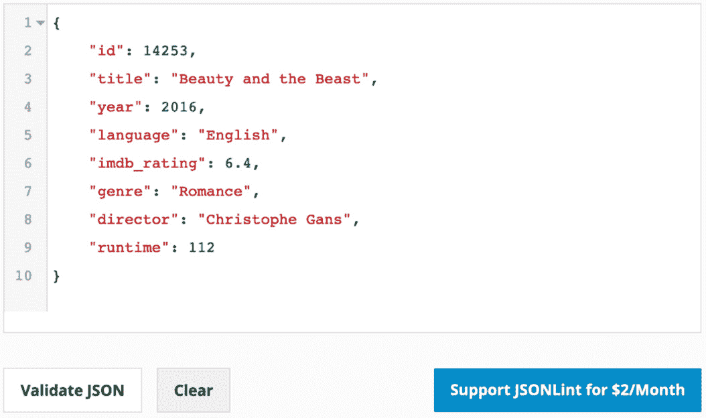

图 2.1：JSON 文档及其有效性检查

在这个练习中，您将把一部电影记录建模成文档格式，并创建一个语法上有效的 JSON 对象。要更多地练习它，您可以考虑任何一般项目，比如您最近购买的产品或您阅读的一本书，并将其建模为一个有效的 JSON 文档。在下一节中，我们将简要概述 MongoDB 的 BSON。

# BSON

当您使用数据库客户端（如 mongo shell、MongoDB Compass 或 Mongo Atlas 中的 Collections Browser）与 MongoDB 一起工作时，您总是以人类可读的 JSON 格式看到文档。然而，在内部，MongoDB 文档以一种称为 BSON 的二进制格式存储。BSON 文档不是人类可读的，您永远不需要直接处理它们。在我们详细探讨 MongoDB 文档之前，让我们快速概述一下 BSON 的特性，这些特性有益于 MongoDB 文档结构。

与 JSON 一样，BSON 是由 MongoDB 在 2009 年引入的。尽管它是由 MongoDB 发明的，但许多其他系统也将其用作数据存储或传输的格式。BSON 规范主要基于 JSON，因为它继承了 JSON 的所有优点，如语法和灵活性。它还提供了一些额外的功能，专门设计用于提高存储效率，便于遍历，并避免类型冲突的一些数据类型增强，这些冲突是我们在*JSON 简介*部分中看到的。

由于我们已经详细介绍了 JSON 的特性，让我们专注于 BSON 提供的增强功能：

+   BSON 文档的设计旨在比 JSON 更高效，因为它们占用更少的空间并提供更快的遍历速度。

+   对于每个文档，BSON 存储一些**元信息**，例如字段的长度或子文档的长度。元信息使文档解析和遍历更快。

+   BSON 文档具有**有序数组**。数组中的每个元素都以其索引位置为前缀，并可以使用其索引号进行访问。

+   BSON 提供了许多**额外的数据类型**，如日期、整数、双精度、字节数组等。我们将在下一节中详细介绍 BSON 数据类型。

注意

由于二进制格式，BSON 文档在性质上是紧凑的。但是，一些较小的文档最终占用的空间比具有相同信息的 JSON 文档更多。这是因为每个文档都添加了元信息。但是，对于大型文档，BSON 更节省空间。

现在我们已经完成了对 JSON 和 BSON 增强功能的详细介绍，让我们现在学习一下 MongoDB 文档。

# MongoDB 文档

MongoDB 数据库由集合和文档组成。一个数据库可以有一个或多个集合，每个集合可以存储一个或多个相关的 BSON 文档。与关系型数据库相比，集合类似于表，文档类似于表中的行。但是，与表中的行相比，文档更加灵活。

关系型数据库由行和列组成的表格数据模型。但是，您的应用程序可能需要支持更复杂的数据结构，例如嵌套对象或对象集合。表格数据库限制了这种复杂数据结构的存储。在这种情况下，您将不得不将数据拆分成多个表，并相应地更改应用程序的对象结构。另一方面，MongoDB 的基于文档的数据模型允许您的应用程序存储和检索更复杂的对象结构，因为文档具有灵活的类似 JSON 的格式。

以下列表详细介绍了 MongoDB 基于文档的数据模型的一些主要特性：

1.  文档提供了一种灵活和自然的表示数据的方式。数据可以按原样存储，而无需将其转换为数据库结构。

1.  文档中的对象、嵌套对象和数组与您编程语言的对象结构容易相关联。

1.  具有灵活模式的能力使文档在实践中更加灵活。它们可以持续集成应用程序的变化和新功能，而无需进行任何重大的模式更改或停机。

1.  文档是自包含的数据片段。它们避免了阅读多个关系表和表连接以理解完整信息单元的需要。

1.  文档是可扩展的。您可以使用文档来存储整个对象结构，将其用作映射或字典，作为快速查找的键值对，或者具有类似关系表的扁平结构。

## 文档和灵活性

正如前面所述，MongoDB 文档是一种灵活的存储数据的方式。考虑以下示例。想象一下，您正在开发一个电影服务，需要创建一个电影数据库。一个简单的 MongoDB 文档中的电影记录将如下所示：

```js
{"title" : "A Swedish Love Story"}
```

然而，仅存储标题是不够的。您需要更多的字段。现在，让我们考虑一些更基本的字段。在 MongoDB 数据库中有一系列电影，文档将如下所示：

```js
{
  "id" : 1122,
  "title" : "A Swedish Love Story",
  "release_date" : ISODate("1970-04-24T00:00:00Z"),
  "user_rating" : 6.7
}
{
  "id" : 1123,
  "title" : "The Stunt Man",
  "release_date" : ISODate("1980-06-26T00:00:00Z"),
  "user_rating" : 7.8
}
```

假设您正在使用 RDBMS 表。在 RDBMS 平台上，您需要在开始时定义您的模式，为此，首先您必须考虑列和数据类型。然后，您可能会提出一个`CREATE TABLE`查询，如下所示：

```js
CREATE TABLE movies(
  id INT,
  title VARCHAR(250),
  release_date DATE,
  user_ratings FLOAT
);
```

这个查询清楚地表明，关系表受到一个叫做`id`字段的定义的限制，而`user_ratings`永远不能是一个字符串。

插入了一些记录后，表将显示为*图 2.2*。这个表和一个 MongoDB 文档一样好：


图 2.2：电影表

现在，假设您想要在表中列出的每部电影中包括 IMDb 评分，并且今后，所有电影都将在表中包括`imdb_ratings`。对于现有的电影列表，`imdb_ratings`可以设置为`null`：

为了满足这个要求，您将在您的语法中包含一个`ALTER TABLE`查询：

```js
ALTER TABLE movies
ADD COLUMN imdb_ratings FLOAT default null;
```

查询是正确的，但是在某些情况下，表的更改可能会阻塞表一段时间，特别是对于大型数据集。当表被阻塞时，其他读写操作将不得不等待表被更改，这可能导致停机。现在，让我们看看如何在 MongoDB 中解决同样的情况。

MongoDB 支持灵活的模式，并且没有特定的模式定义。在不改变数据库或集合上的任何内容的情况下，您可以简单地插入一个带有额外字段的新电影。集合的行为将与修改后的电影表完全相同，最新插入的将具有`imdb_ratings`，而之前的将返回`null`值。在 MongoDB 文档中，不存在的字段始终被视为`null`。

现在，整个集合将看起来类似于以下的屏幕截图。您会注意到最后一个电影有一个新字段，`imdb_ratings`：

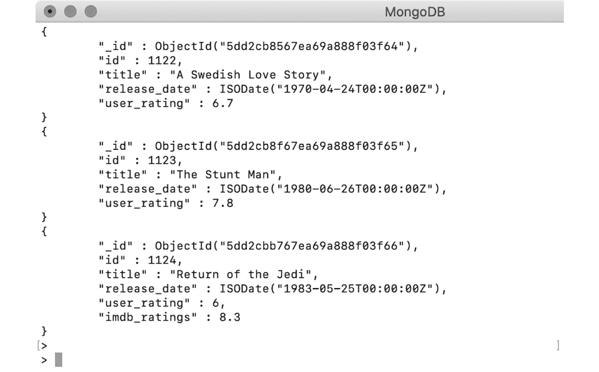

图 2.3：电影集合的 imdb_ratings 结果

前面的例子清楚地表明，与表格数据库相比，文档非常灵活。文档可以在不停机的情况下进行更改。

# MongoDB 数据类型

您已经学会了 MongoDB 如何存储类似 JSON 的文档。您还看到了各种文档，并读取了其中存储的信息，并看到了这些文档在存储不同类型的数据结构时有多灵活，无论您的数据有多复杂。

在本节中，您将了解 MongoDB 的 BSON 文档支持的各种数据类型。在文档中使用正确的数据类型非常重要，因为正确的数据类型可以帮助您更有效地使用数据库功能，避免数据损坏，并提高数据的可用性。MongoDB 支持 JSON 和 BSON 中的所有数据类型。让我们详细看看每种类型，以及示例。

## 字符串

字符串是用来表示文本字段的基本数据类型。它是一系列普通字符。在 MongoDB 中，字符串字段是 UTF-8 编码的，因此它们支持大多数国际字符。各种编程语言的 MongoDB 驱动程序在从集合中读取或写入数据时将字符串字段转换为 UTF-8。

一个包含纯文本字符的字符串如下所示：

```js
{
  "name" : "Tom Walter"
}
```

一个包含随机字符和空格的字符串将显示如下：

```js
{
  "random_txt" : "a ! *& ) ( f s f @#$ s"
}
```

在 JSON 中，用双引号括起来的值被视为字符串。考虑以下示例，其中一个有效的数字和日期被双引号括起来，都形成一个字符串：

```js
{
  "number_txt" : "112.1"
}
{
  "date_txt" : "1929-12-31"
}
```

有关 MongoDB 字符串字段的一个有趣事实是，它们支持使用正则表达式进行搜索。这意味着您可以通过提供文本字段的完整值或仅提供部分字符串值来使用正则表达式搜索文档。

## 数字

数字是 JSON 的基本数据类型。 JSON 文档不指定数字是整数，浮点数还是*长*：

```js
{
  "number_of_employees": 50342
}
{
  "pi": 3.14159265359
}
```

但是，MongoDB 支持以下类型的数字：

+   `double`：64 位浮点

+   `int`：32 位有符号整数

+   `long`：64 位无符号整数

+   `decimal`：128 位浮点 - 符合 IEE 754 标准

当您使用编程语言时，您不必担心这些数据类型。您可以简单地使用语言的本机数据类型进行编程。各种语言的 MongoDB 驱动程序负责将语言特定的数字编码为先前列出的数据类型之一。

如果您在 mongo shell 上工作，您将获得三个包装器来处理：`integer`，`long`和`decimal`。 Mongo shell 基于 JavaScript，因此所有文档都以 JSON 格式表示。默认情况下，它将任何数字视为 64 位浮点数。但是，如果要明确使用其他类型，可以使用以下包装器。

`NumberInt`：如果要将数字保存为 32 位整数而不是 64 位浮点数，则可以使用`NumberInt`构造函数：

```js
> var plainNum = 1299
> var explicitInt = NumberInt("1299")
> var explicitInt_double = NumberInt(1299)
```

+   在上面的片段中，第一个数字`plainNum`是使用未提及任何显式数据类型的数字序列初始化的。因此，默认情况下，它将被视为*64 位浮点数*（也称为**double**）。

+   但是，`explicitInt`是使用整数类型构造函数和数字的字符串表示初始化的，因此 MongoDB 将参数中的数字读取为*32 位整数*。

+   但是，在`explicitInt_double`初始化中，构造函数参数中提供的数字没有双引号。因此，它将被视为*64 位浮点数* - 也就是**double** - 并用于形成*32 位整数*。但是，由于提供的数字适合整数范围，因此不会看到任何更改。

+   当您打印上述数字时，它们看起来如下：

图 2.4：plainNum，explicitInt 和 explicitInt_double 的输出

](img/B15507_02_04.jpg)

图 2.4：plainNum，explicitInt 和 explicitInt_double 的输出

`NumberLong`：`NumberLong`包装器类似于`NumberInt`。唯一的区别是它们存储为 64 位整数。让我们在 shell 上尝试一下：

```js
> var explicitLong = NumberLong("777888222116643")
> var explicitLong_double = NumberLong(444333222111242)
```

让我们在 shell 中打印文档：

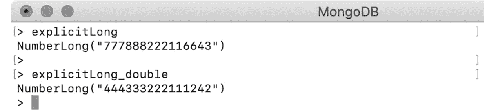

图 2.5：MongoDB shell 输出

`NumberDecimal`：此包装器将给定数字存储为 128 位 IEEE 754 十进制格式。`NumberDecimal`构造函数接受数字的字符串和双精度表示：

```js
> var explicitDecimal = NumberDecimal("142.42")
> var explicitDecimal_double = NumberDecimal(142.42)
```

我们将一个十进制数的字符串表示传递给`explicitDecimal`。但是，`explicitDecimal_double`是使用`double`创建的。当我们打印结果时，它们看起来略有不同：

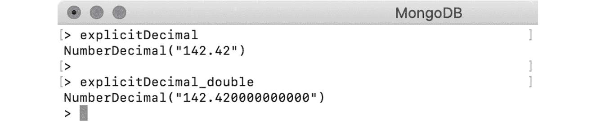

图 2.6：explicitDecimal 和 explicitDecimal_double 的输出

第二个数字已附加尾随零。这是由于数字的内部解析。当我们将双精度值传递给`NumberDecimal`时，参数被解析为 BSON 的双精度，然后转换为具有 15 位数字精度的 128 位小数。

在此转换过程中，十进制数将四舍五入并可能失去精度。让我们看下面的例子：

```js
> var dec = NumberDecimal("5999999999.99999999")
> var decDbl = NumberDecimal(5999999999.99999999)
```

让我们打印数字并检查输出：

图 2.7：dec 和 decDbl 的输出

](img/B15507_02_07.jpg)

图 2.7：dec 和 decDbl 的输出

很明显，当双精度值传递给`NumberDecimal`时，存在失去精度的可能。因此，在使用`NumberDecimal`时始终使用基于字符串的构造函数非常重要。

## 布尔值

布尔数据类型用于表示某事是真还是假。因此，有效布尔字段的值要么是`true`，要么是`false`：

```js
{
  "isMongoDBHard": false
}
{
  "amIEnjoying": true
}
```

值没有双引号。如果您用双引号括起来，它们将被视为字符串。

## 对象

对象字段用于表示嵌套或嵌入文档，即其值是另一个有效的 JSON 文档。

让我们看一下来自 airbnb 数据集的以下示例：

```js
{
  "listing_url": "https://www.airbnb.com/rooms/1001265",
  "name": "Ocean View Waikiki Marina w/prkg",
  "summary": "A great location that work perfectly for business,     education, or simple visit.",
  "host":{
    "host_id": "5448114",
    "host_name": "David",
    "host_location": "Honolulu, Hawaii, United States"
  }
}
```

主机字段的值是另一个有效的 JSON。MongoDB 使用点表示法（`.`）来访问嵌入对象。要访问嵌入文档，我们将在 mongo shell 上创建一个列表的变量：

```js
> var listing = {
  "listing_url": "https://www.airbnb.com/rooms/1001265",
  "name": "Ocean View Waikiki Marina w/prkg",
  "summary": "A great location that work perfectly for business,     education, or simple visit.",
  "host": {
    "host_id": "5448114",
    "host_name": "David",
    "host_location": "Honolulu, Hawaii, United States"
  }
}
```

要仅打印主机详细信息，请使用点表示法（`.`）获取嵌入对象，如下所示：

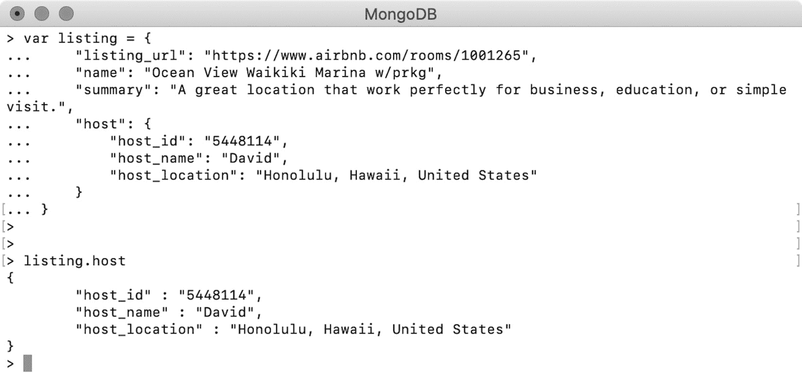

图 2.8：嵌入对象的输出

使用类似的表示法，您还可以访问嵌入文档的特定字段，如下所示：

```js
> listing.host.host_name
David
```

嵌入文档可以包含其中的更多文档。具有嵌入文档使 MongoDB 文档成为一个自包含的信息片段。要在 RDBMS 数据库中记录相同的信息，您将不得不创建列表和主机作为两个单独的表，并在两者之间创建一个外键引用，并从两个表中获取信息。

除了嵌入文档之外，MongoDB 还支持两个不同集合的文档之间的链接，这类似于具有外键引用。

## 练习 2.02：创建嵌套对象

到目前为止，您的组织对电影表示感到满意。现在他们提出了一个要求，要包括 IMDb 评分和导致评分的投票数。他们还希望包含番茄表评分，其中包括用户评分和评论家评分以及新鲜和烂的分数。您的任务是修改文档，更新`imdb`字段以包括投票数，并添加一个名为`tomatoes`的新字段，其中包含烂番茄评分。

回想一下您在*练习 2.01*中创建的样本电影记录的 JSON 文档，*创建您自己的 JSON 文档*：

```js
{
  "id": 14253,
  "title": "Beauty and the Beast",
  "year": 2016,
  "language": "English",
  "imdb_rating": 6.4,
  "genre": "Romance",
  "director": "Christophe Gans",
  "runtime": 112
}
```

以下步骤将帮助修改 IMDb 评分：

1.  现有的`imdb_rating`字段表示 IMDb 评分，因此添加一个额外的字段来表示投票数。然而，这两个字段彼此密切相关，并且将始终一起使用。因此，将它们组合在一个单独的文档中：

```js
{
  "rating": 6.4, 
  "votes": "17762"
}
```

1.  前面的文档具有两个字段，表示完整的 IMDb 评分。用您刚创建的字段替换当前的`imdb_rating`字段：

```js
{
  "id" : 14253,
  "Title" : "Beauty and the Beast",
  "year" : 2016,
  "language" : "English",
  "genre" : "Romance",
  "director" : "Christophe Gans",
  "runtime" : 112,
  "imdb" :
  {
    "rating": 6.4,
    "votes": "17762"
  }
}
```

这个带有嵌入对象值的`imdb`字段表示 IMDb 评分。现在，添加番茄表评分。

1.  如前所述，番茄表评分包括观众评分和评论家评分，以及新鲜分数和烂分数。与 IMDb 评分一样，`观众评分`和`评论家评分`都将有一个`评分`字段和一个`投票`字段。分别编写这两个文档：

```js
// Viewer Ratings
{
  "rating" : 3.9,
  "votes" : 238
}
// Critic Ratings
{
  "rating" : 4.2,
  "votes" : 8
}
```

1.  由于两个评分相关，将它们组合在一个单独的文档中：

```js
{
  "viewer" : {
    "rating" : 3.9,
    "votes" : 238
  },
  "critic" : {
    "rating" : 4.2,
    "votes" : 8
  }
}
```

1.  根据描述添加`fresh`和`rotten`分数：

```js
{
  "viewer" : {
    "rating" : 3.9,
    "votes" : 238
  },
  "critic" : {
    "rating" : 4.2,
    "votes" : 8
  },
  "fresh" : 96,
  "rotten" : 7
}
```

以下输出表示了我们电影记录中新的`tomatoes`字段的番茄表评分：

```js
{
    "id" : 14253,
    "Title" : "Beauty and the Beast",
    "year" : 2016,
    "language" : "English",
    "genre" : "Romance",
    "director" : "Christophe Gans",
    "runtime" : 112,
    "imdb" : {
        "rating": 6.4,
        "votes": "17762"
    },
    "tomatoes" : {
        "viewer" : {
            "rating" : 3.9,
            "votes" : 238
        },
        "critic" : {
            "rating" : 4.2,
            "votes" : 8
        },
       "fresh" : 96,
       "rotten" : 7
    }
}
```

1.  最后，使用任何在线 JSON 验证器（在我们的案例中，[`jsonlint.com/`](https://jsonlint.com/)）验证您的文档。单击“验证 JSON”以验证代码：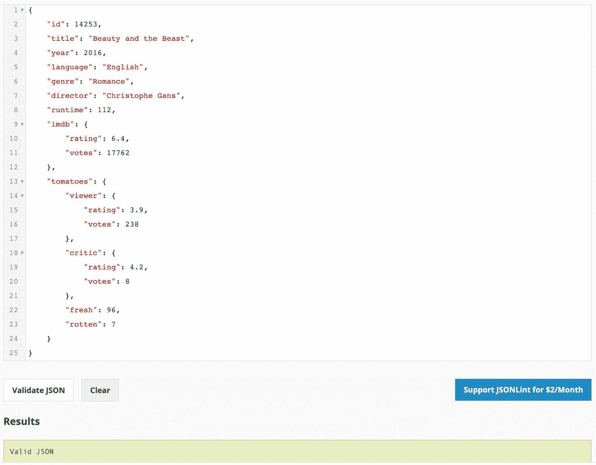

图 2.9：验证 JSON 文档

您的电影记录现在已更新为详细的 IMBb 评分和新的`tomatoes`评分。在这个练习中，您练习了创建两个嵌套文档来表示 IMDb 评分和番茄表评分。现在我们已经涵盖了嵌套或嵌入对象，让我们了解一下数组。

## 数组

具有**数组**类型的字段具有零个或多个值的集合。在 MongoDB 中，数组可以包含的元素数量或文档可以拥有的数组数量没有限制。但是，整个文档大小不应超过 16 MB。考虑以下包含四个数字的示例数组：

```js
> var doc = {
  first_array: [
    4,
    3,
    2,
    1
  ]
}
```

可以使用其索引位置访问数组中的每个元素。在访问特定索引位置上的元素时，索引号用方括号括起来。让我们打印数组中的第三个元素：

```js
> doc.first_array[3]
1
```

注意

索引始终从零开始。索引位置`3`表示数组中的第四个元素。

使用索引位置，您还可以向现有数组添加新元素，如下例所示：

```js
> doc.first_array[4] = 99
```

打印数组后，您将看到第五个元素已正确添加，其中包含索引位置`4`：

```js
> doc.first_array
[ 4, 3, 2, 1, 99 ]
```

就像对象具有嵌入对象一样，数组也可以具有嵌入数组。以下语法将嵌入数组添加到第六个元素中：

```js
> doc.first_array[5] = [11, 12]
[ 11, 12 ]
```

如果打印数组，您将看到嵌入数组如下所示：

```js
> doc.first_array
[ 4, 3, 2, 1, 99, [11, 12]]
>
```

现在，您可以使用方括号`[]`来访问嵌入数组中特定索引的元素，如下所示：

```js
> doc.first_array[5][1]
12
```

数组可以包含任何 MongoDB 有效的数据类型字段。这可以在以下代码片段中看到：

```js
// array of strings
[ "this", "is", "a", "text" ] 
// array of doubles
[ 1.1, 3.2, 553.54 ]
// array of Json objects
[ { "a" : 1 }, { "a" : 2, "b" : 3 }, { "c" : 1 } ] 
// array of mixed elements
[ 12, "text", 4.35, [ 3, 2 ], { "type" : "object" } ]
```

## 练习 2.03：使用数组字段

为了为每部电影添加评论详细信息，您的组织希望您包括评论的全文以及用户详细信息，如姓名、电子邮件和日期。您的任务是准备两条虚拟评论并将它们添加到现有的电影记录中。在*练习 2.02*中，*创建嵌套对象*，您以文档格式开发了一条电影记录，如下所示：

```js
{
  "id" : 14253,
  "Title" : "Beauty and the Beast",
  "year" : 2016,
  "language" : "English",
  "genre" : "Romance",
  "director" : "Christophe Gans",
  "runtime" : 112,
  "imdb" : {
    "rating": 6.4,
    "votes": "17762"
  },
  "tomatoes" : {
    "viewer" : {
      "rating" : 3.9,
      "votes" : 238
    },
    "critic" : {
      "rating" : 4.2,
      "votes" : 8
    },
    "fresh" : 96,
    "rotten" : 7
  }
}
```

通过执行以下步骤构建此文档以添加附加信息：

1.  创建两条评论并列出详细信息：

```js
// Comment #1
Name = Talisa Maegyr
Email = oona_chaplin@gameofthron.es
Text = Rem itaque ad sit rem voluptatibus. Ad fugiat...
Date = 1998-08-22T11:45:03.000+00:00
// Comment #2
Name = Melisandre
Email = carice_van_houten@gameofthron.es
Text = Perspiciatis non debitis magnam. Voluptate...
Date = 1974-06-22T07:31:47.000+00:00
```

1.  将两个注释拆分为单独的文档，如下所示：

```js
// Comment #1
{
  "name" : "Talisa Maegyr",
  "email" : "oona_chaplin@gameofthron.es",
  "text" : "Rem itaque ad sit rem voluptatibus. Ad fugiat...",
  "date" : "1998-08-22T11:45:03.000+00:00"
}
// Comment #2
{
  "name" : "Melisandre",
  "email" : "carice_van_houten@gameofthron.es",
  "text" : "Perspiciatis non debitis magnam. Voluptate...",
  "date" : "1974-06-22T07:31:47.000+00:00"
}
```

有两条评论在两个单独的文档中，您可以轻松地将它们放入电影记录中作为`comment_1`和`comment_2`。但是，随着评论数量的增加，将很难计算它们的数量。为了克服这一点，我们将使用一个数组，它隐式地为每个元素分配索引位置。

1.  将两条评论添加到数组中，如下所示：

```js
[
  {
    "name": "Talisa Maegyr",
    "email": "oona_chaplin@gameofthron.es",
    "text": "Rem itaque ad sit rem voluptatibus. Ad fugiat...",
    "date": "1998-08-22T11:45:03.000+00:00"
  },
  {
    "name": "Melisandre",
    "email": "carice_van_houten@gameofthron.es",
    "text": "Perspiciatis non debitis magnam. Voluptate...",
    "date": "1974-06-22T07:31:47.000+00:00"
  }
]
```

数组为您提供了添加尽可能多的评论的机会。此外，由于隐式索引，您可以自由地通过其专用索引位置访问任何评论。一旦将此数组添加到电影记录中，输出将如下所示：

```js
{
  "id": 14253,
  "Title": "Beauty and the Beast",
  "year": 2016,
  "language": "English",
  "genre": "Romance",
  "director": "Christophe Gans",
  "runtime": 112,
  "imdb": {
    "rating": 6.4,
    "votes": "17762"
  },
  "tomatoes": {
    "viewer": {
      "rating": 3.9,
      "votes": 238
    },
    "critic": {
      "rating": 4.2,
      "votes": 8
    },
    "fresh": 96,
    "rotten": 7
  },
  "comments": [{
    "name": "Talisa Maegyr",
    "email": "oona_chaplin@gameofthron.es",
    "text": "Rem itaque ad sit rem voluptatibus. Ad fugiat...",
    "date": "1998-08-22T11:45:03.000+00:00"
  }, {
    "name": "Melisandre",
    "email": "carice_van_houten@gameofthron.es",
    "text": "Perspiciatis non debitis magnam. Voluptate...",
    "date": "1974-06-22T07:31:47.000+00:00"
  }]
}
```

1.  现在，使用在线验证器（例如，[`jsonlint.com/`](https://jsonlint.com/)）验证 JSON 文档。单击“验证 JSON”以验证代码：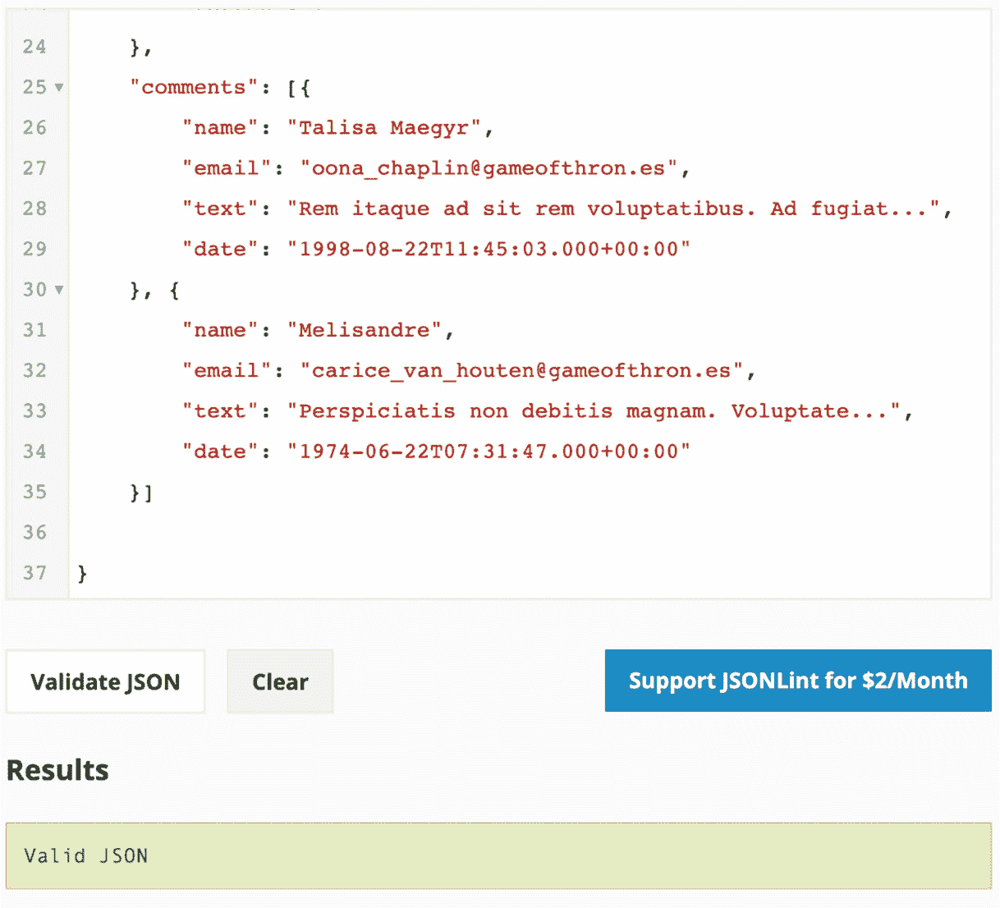

图 2.10：验证 JSON 文档

我们可以看到我们的电影记录现在有用户评论。在这个练习中，我们修改了我们的电影记录以练习创建数组字段。现在是时候转到下一个数据类型，`null`。

## Null

Null 是文档中的一种特殊数据类型，表示不包含值的字段。`null`字段只能有`null`作为值。在下面的示例中，您将打印对象，这将导致`null`值：

```js
> var obj = null
>
> obj
Null
```

在*数组*部分创建的数组上进行构建：

```js
> doc.first_array
[ 4, 3, 2, 1, 99, [11, 12]]
```

现在，创建一个新变量并将其初始化为`null`，通过将变量插入到下一个索引位置：

```js
> var nullField = null
> doc.first_array[6] = nullField
```

现在，打印此数组以查看`null`字段：

```js
> doc.first_array
[ 4, 3, 2, 1, 99, [11, 12], null]
```

## ObjectId

集合中的每个文档都必须有一个包含唯一值的`_id`。这个字段充当这些文档的*主键*。主键用于唯一标识文档，并且它们总是被索引的。`_id`字段的值在集合中必须是唯一的。当您使用任何数据集时，每个数据集代表不同的上下文，并且根据上下文，您可以确定您的数据是否有主键。例如，如果您处理用户数据，用户的电子邮件地址将始终是唯一的，并且可以被视为最合适的`_id`字段。然而，对于一些没有唯一键的数据集，您可以简单地省略`_id`字段。

如果您插入一个没有`_id`字段的文档，MongoDB 驱动程序将自动生成一个唯一 ID 并将其添加到文档中。因此，当您检索插入的文档时，您会发现`_id`是用随机文本的唯一值生成的。当驱动程序自动添加`_id`字段时，该值是使用`ObjectId`生成的。

`ObjectId`值旨在生成跨不同机器唯一的轻量级代码。它生成一个唯一值的 12 个字节，其中前 4 个字节表示时间戳，第 5 到 9 个字节表示随机值，最后 3 个字节是递增计数器。创建并打印`ObjectId`值如下：

```js
> var uniqueID = new ObjectId()
```

在下一行打印`uniqueID`：

```js
> uniqueID
ObjectId("5dv.8ff48dd98e621357bd50")
```

MongoDB 支持一种称为分片的技术，其中数据集被分布并存储在不同的机器上。当一个集合被分片时，它的文档被物理地位于不同的机器上。即使如此，`ObjectId`也可以确保在不同机器上的集合中的值是唯一的。如果使用`ObjectId`字段对集合进行排序，顺序将基于文档创建时间。然而，`ObjectId`中的时间戳是基于秒数到纪元时间。因此，在同一秒内插入的文档可能以随机顺序出现。`ObjectId`上的`getTimestamp()`方法告诉我们文档插入时间。

## 日期

JSON 规范不支持日期类型。JSON 文档中的所有日期都表示为纯字符串。日期的字符串表示形式很难解析、比较和操作。然而，MongoDB 的 BSON 格式明确支持**日期**类型。

MongoDB 日期以自 Unix 纪元以来的毫秒形式存储，即 1970 年 1 月 1 日。为了存储日期的毫秒表示，MongoDB 使用 64 位整数（`long`）。由于这个原因，日期字段的范围大约为自 Unix 纪元以来的+-290 百万年。需要注意的一点是所有日期都以*UTC*存储，并且没有与它们相关联的*时区*。

在 mongo shell 上工作时，您可以使用`Date()`、`new Date()`或`new ISODate()`创建`Date`实例。

注意

使用新的`Date()`构造函数或新的`ISODate()`构造函数创建的日期始终是 UTC 时间，而使用`Date()`创建的日期将是本地时区的时间。下面给出一个例子。

```js
var date = Date()// Sample output
Sat Sept 03 1989 07:28:46 GMT-0500 (CDT)
```

当使用`Date()`类型来构造日期时，它使用 JavaScript 的日期表示，这是以纯字符串形式的。这些日期表示基于您当前的时区的日期和时间。然而，作为字符串格式，它们对于比较或操作是没有用的。

如果将`new`关键字添加到`Date`构造函数中，您将得到包装在`ISODate()`中的 BSON 日期，如下所示：

```js
> var date = new Date()
// Sample output
ISODate("1989-09-03T10:11:23.357Z")
```

您还可以直接使用`ISODate()`构造函数创建`date`对象，如下所示：

```js
> var isoDate = new ISODate()
// Sample output
ISODate("1989-09-03T11:13:26.442Z")
```

这些日期可以被操作、比较和搜索。

注意

根据 MongoDB 文档，不是所有的驱动程序都支持 64 位日期编码。然而，所有的驱动程序都支持编码年份范围从 0 到 9999 的日期。

## 时间戳

时间戳是日期和时间的 64 位表示。在这 64 位中，前 32 位存储自 Unix 纪元时间以来的秒数，即 1970 年 1 月 1 日。另外 32 位表示一个递增的计数器。时间戳类型是 MongoDB 专门用于内部操作的。

## 二进制数据

二进制数据，也称为`BinData`，是一种用于存储以二进制格式存在的数据的 BSON 数据类型。这种数据类型使您能够在数据库中存储几乎任何东西，包括文本、视频、音乐等文件。`BinData`可以与编程语言中的二进制数组进行映射，如下所示：

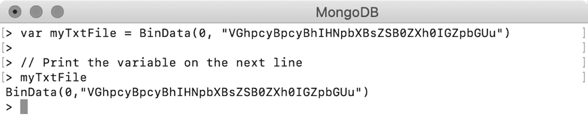

图 2.11：二进制数组

`BinData`的第一个参数是一个二进制子类型，用于指示存储的信息类型。零值代表普通二进制数据，可以与文本或媒体文件一起使用。`BinData`的第二个参数是*base64*编码的文本文件。您可以在文档中使用二进制数据字段，如下所示：

```js
{
  "name" : "my_txt",
  "extension" : "txt",
  "content" : BinData(0,/
    "VGhpcyBpcyBhIHNpbXBsZSB0ZXh0IGZpbGUu")
}
```

我们将在接下来的部分介绍 MongoDB 的文档大小限制。

# 文档的限制和限制

到目前为止，我们已经讨论了使用文档的重要性和好处。文档在构建高效应用程序中起着重要作用，并且它们提高了整体数据的可用性。我们知道文档以最自然的形式提供了一种灵活的表示数据的方式。它们通常是自包含的，可以容纳完整的信息单元。自包含性来自嵌套对象和数组。

要有效地使用任何数据库，正确的数据结构是很重要的。您今天构建的不正确的数据结构可能会在未来带来很多痛苦。从长远来看，随着应用程序的使用量增加，数据量也会增加，最初似乎很小的问题变得更加明显。然后显而易见的问题就来了：您如何知道您的数据结构是否正确？

您的应用程序会告诉您答案。如果要访问某个信息，您的应用程序必须执行多个查询到数据库，并组合所有结果以获取最终信息，那么它将减慢整体吞吐量。相反，如果数据库上的单个查询返回了太多信息，您的应用程序将不得不扫描整个结果集并获取所需的信息。这将导致更高的内存消耗，过时的对象，最终导致性能下降。

因此，MongoDB 对文档进行了一些限制和限制。需要注意的一点是，这些限制并不是因为数据库的限制或缺陷。这些限制是为了使整体数据库平台能够高效运行。我们已经介绍了 MongoDB 文档提供的灵活性；现在重要的是要了解这些限制。

## 文档大小限制

包含过多信息的文档在许多方面都是不好的。因此，MongoDB 对集合中每个文档的大小限制为 16 MB。16 MB 的限制足以存储正确的信息。一个集合可以有任意多的文档。集合的大小没有限制。即使集合超出了底层系统的空间，您也可以使用垂直或水平扩展来增加集合的容量。

文档的灵活性和自包含性可能会诱使开发人员放入过多的信息并创建臃肿的文档。超大型文档通常是糟糕设计的表现。大多数情况下，您的应用程序并不需要所有的信息。良好的数据库设计考虑了应用程序的需求。

想象一下，你的应用程序是一个提供来自各种商店的销售信息的界面，用户可以按商品类型或商店位置搜索和找到已售出的商品。大部分时间，是你的应用程序会频繁访问数据库，并且使用类似的查询。因此，你的应用程序的需求在数据库设计中起着重要作用，特别是当用户基数增长，你的应用程序开始在短时间内获得成千上万的请求。你所希望的是更快的查询，更少的处理和更少的资源消耗。

超大的文档在资源使用方面也很昂贵。当文档从系统中读取时，它们会被保存在内存中，然后通过网络传输。网络传输总是比较慢的。然后，你的驱动程序会将接收到的信息映射到你编程语言的对象中。更大的文档会导致太多的庞大对象。考虑一个来自虚拟销售记录的样本文档，如下所示：

```js
{
     «_id" : ObjectId("5bd761dcae323e45a93ccff4"),
     «saleDate" : ISODate("2014-08-18T10:42:13.935Z"),
     «items" : [
          {
               «name" : "backpack",
               «tags" : [
                    «school»,
                    «travel»,
                    «kids»
               ],
               «price" : NumberDecimal("187.16"),
               «quantity" : 2
          },
          {
               «name" : "printer paper",
               «tags" : [
                    «office»,
                    «stationary»
               ],
               «price" : NumberDecimal("20.61"),
               «quantity" : 10
          },
          {
               «name" : "notepad",
               «tags" : [
                    «office»,
                    «writing»,
                    «school»
               ],
               «price" : NumberDecimal("23.75"),
               «quantity" : 5
          },
          {
               «name" : "envelopes",
               «tags" : [
                    «stationary»,
                    «office»,
                    «general»
               ],
               «price" : NumberDecimal("9.44"),
               «quantity" : 5
          }
     ],
     «storeLocation" : "San Diego",
     «customer" : {
          «gender" : "F",
          «age" : 59,
          «email" : "la@cevam.tj",
          «satisfaction" : 4
     },
     «couponUsed" : false,
     «purchaseMethod" : "In store"
}
```

虽然这个文档很好，但也有一些限制。`items`字段是`items`对象的数组。如果一个订单有太多的`items`，数组的大小会增加，这将导致整个文档的大小增加。如果你的应用程序允许每个订单有多个项目，并且你的商店有成千上万个独特的项目，这个文档很容易变得过大。处理这种复杂文档的最佳方法是将集合拆分为两个，并在其中嵌入文档链接。

## 嵌套深度限制

MongoDB BSON 文档支持嵌套达到 100 级，这已经足够了。嵌套文档是提供可读数据的好方法。它们一次性提供完整的信息，避免多次查询来收集一部分信息。

然而，随着嵌套级别的增加，性能和内存消耗问题会出现。例如，考虑一个将文档解析为对象结构的驱动程序。在扫描过程中，每当发现一个新的子文档时，扫描器会递归进入嵌套对象，同时保持一个已读信息的堆栈。这会导致内存利用率高和性能慢。

通过设置 100 级的嵌套限制，MongoDB 避免了这些问题。然而，如果无法避免这种深层嵌套，可以考虑将集合拆分为两个或更多，并引用文档。

# 字段名称规则

MongoDB 有一些关于文档字段名称的规则，列举如下：

1.  字段名称不能包含**空**字符。

1.  只有数组或嵌入文档中的字段才能以美元符号（`$`）开头。对于顶级字段，名称不能以美元（`$`）符号开头。

1.  不支持具有重复字段名称的文档。根据 MongoDB 文档，当插入具有重复字段名称的文档时，不会抛出错误，但文档也不会被插入。甚至驱动程序会悄悄地丢弃这些文档。然而，在 mongo shell 中，如果插入这样的文档，它会被正确插入。然而，结果文档只会有第二个字段。这意味着第二次出现的字段会覆盖第一个字段的值。

注意

MongoDB（截至版本 4.2.8）不建议字段名称以美元（`$`）符号或点（`.`）开头。MongoDB 查询语言可能无法正确处理这些字段。此外，驱动程序也不支持它们。

## 练习 2.04：将数据加载到 Atlas 集群中

现在您已经了解了文档及其结构，可以在业务用例上实施您的学习，并观察 MongoDB 文档。在*第一章*，*MongoDB 简介*中，您创建了一个 MongoDB Atlas 账户，并在云上初始化了一个集群。您将在这个集群中加载示例数据集。MongoDB Atlas 提供了可以通过执行几个简单步骤加载到集群中的示例数据集。这些示例数据库是大型的、真实的数据集，供练习使用。MongoDB Atlas 中的示例数据集包括以下数据库，每个数据库都有多个集合：

+   `sample_mflix`

+   `sample_airbnb`

+   `sample_geospatial`

+   `sample_supplies`

+   `sample_training`

+   `sample_weatherdata`

在所有这些数据集中，您将在本书中处理`sample_mflix`数据集。这是一个庞大的数据库，包括超过 23,000 部电影和系列记录，以及它们的评分、评论和其他详细信息。在了解数据库之前，将数据库导入到我们的集群中，并熟悉其结构和组件。

以下是要执行的步骤，以实现所需的结果：

1.  访问[`cloud.mongodb.com/`](https://cloud.mongodb.com/)，并点击登录到您的账户：

图 2.12：Atlas 登录页面

由于您已经在云上创建了一个集群，登录后将显示以下显示集群详细信息的屏幕：

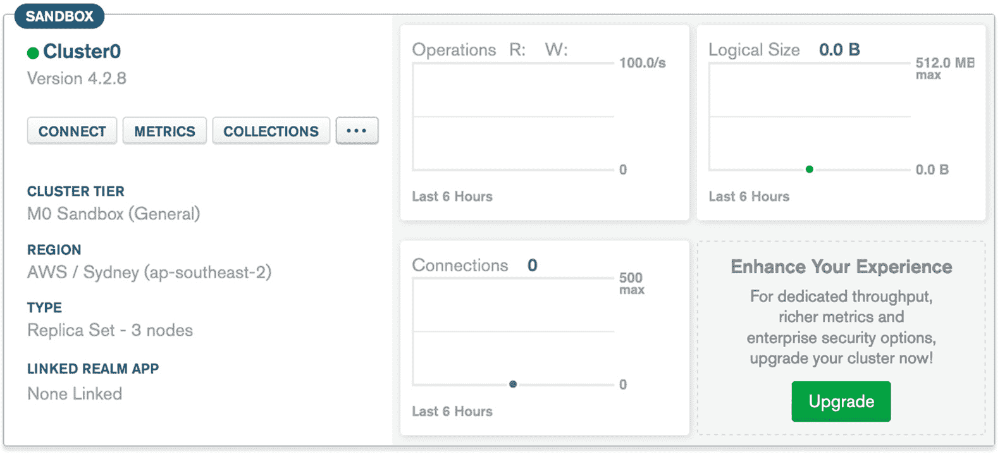

图 2.13：集群视图

1.  点击`COLLECTIONS`旁边的（`…`）选项。将出现一个下拉列表，显示以下选项。点击“加载示例数据集”：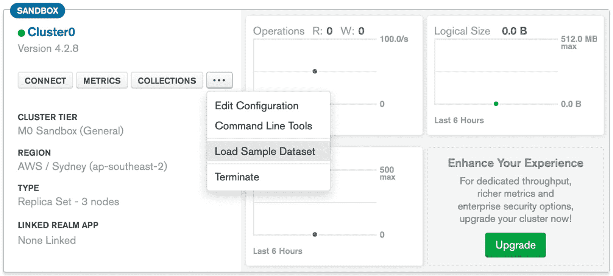

图 2.14：加载示例数据集选项

这将打开一个确认对话框，显示将加载到您的集群中的示例数据集的总大小：

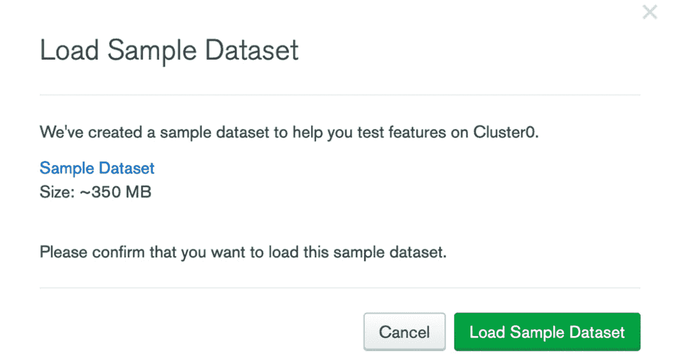

图 2.15：加载示例数据集确认

1.  点击“加载示例数据集”。您将在屏幕上看到一条消息，显示“正在加载您的示例数据集…”：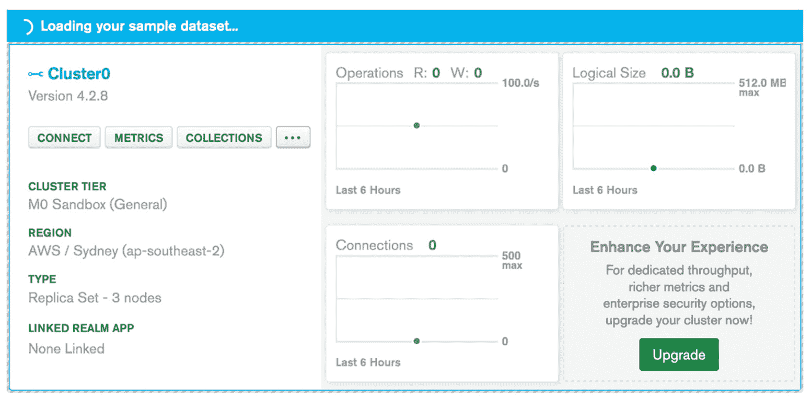

图 2.16：加载您的示例数据集…窗口

加载数据并重新部署集群实例可能需要几分钟时间。

1.  数据集成功加载后，您将看到一个成功消息，显示“示例数据集成功加载”：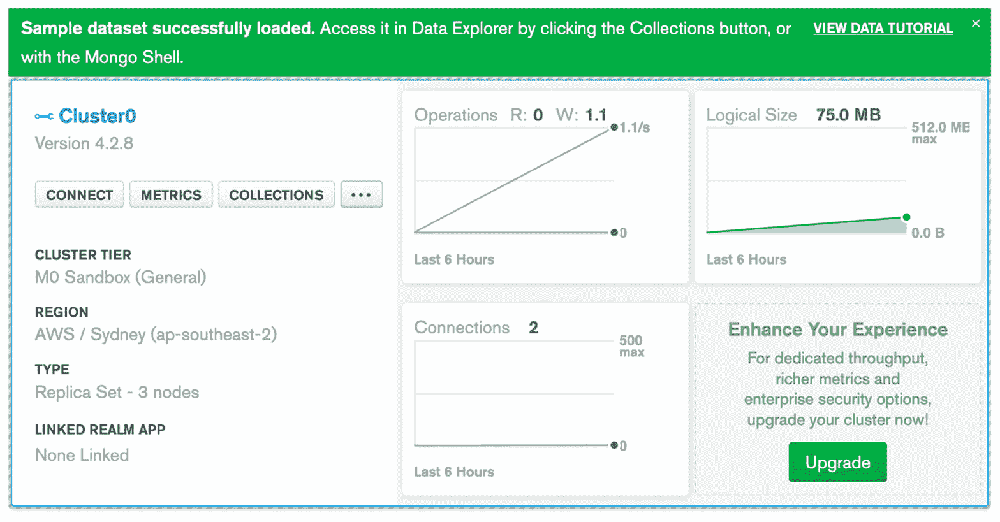

图 2.17：示例数据集成功加载

数据集加载完成后，您还可以看到图表，显示有关数据集上执行的读取和写入操作数量、总连接数以及数据集的总大小的信息。

1.  现在，点击`COLLECTIONS`。在下一个屏幕上，您将看到以下可用数据库的列表：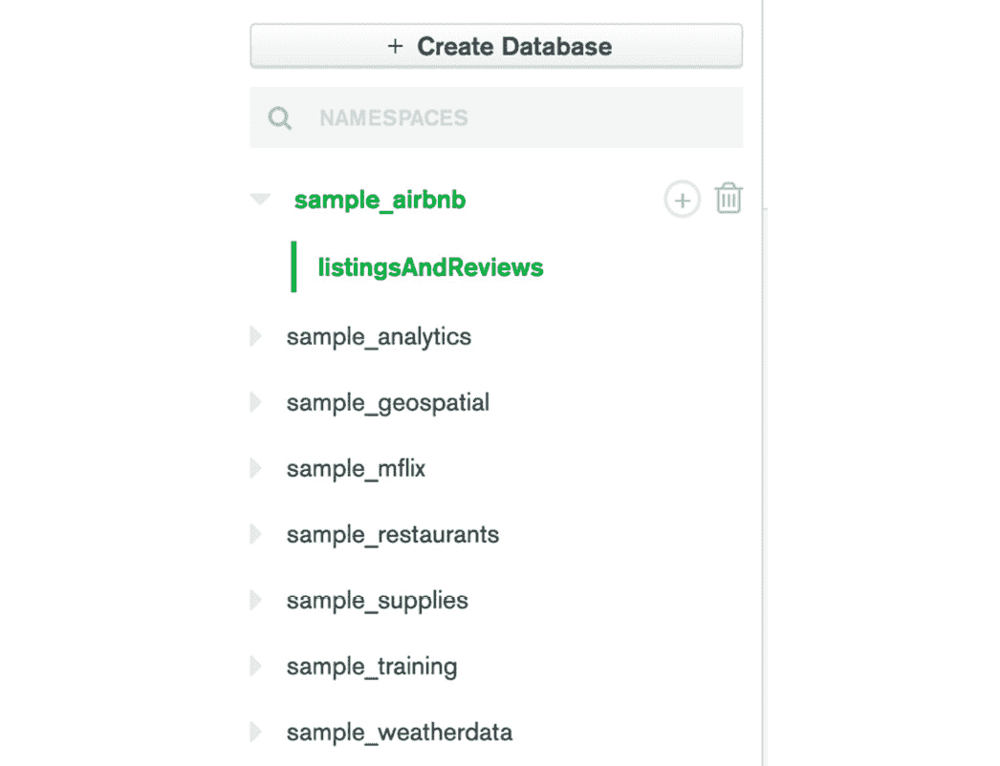

图 2.18：示例数据库列表

1.  点击`sample_mflix`旁边的向下箭头。

1.  选择`movies`集合。

您的前 20 个文档的结果将显示如下：

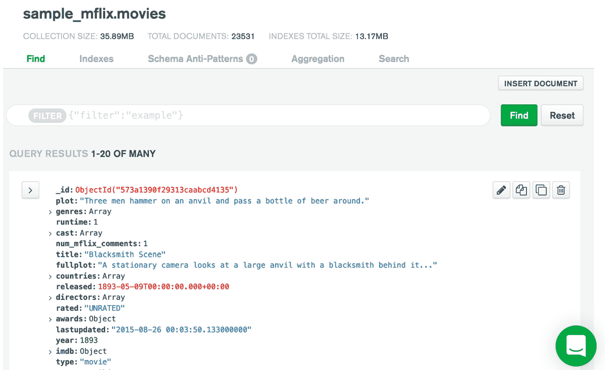

图 2.19：集群上的电影集合

在这个练习中，我们成功将`sample_mflix`数据库加载到了我们的集群中。现在，让我们进行一个简单的活动，帮助我们将本章学到的所有内容付诸实践。

## 活动 2.01：将推文建模为 JSON 文档

现在您已经了解了 JSON 文档、MongoDB 支持的数据类型以及基于文档的存储模型，是时候练习将现实生活中的实体建模为有效的 JSON 文档格式了。

您的任务是准备一个有效的 JSON 文档来表示推文的数据。为此，请使用*图 2.20*中显示的虚拟推文，从这条推文中识别出所有各种信息，确定字段名称和它们可以表示的数据类型，准备一个包含所有字段的 JSON 文档，并验证您的文档：


图 2.20：示例推文

以下步骤将帮助您实现期望的结果：

1.  列出您在推文中看到的所有对象，例如用户 ID、名称、个人资料图片、推文文本、标签和提及。

1.  识别可以分组在一起的一组相关字段。这些字段组可以作为嵌入对象或数组放置。

1.  创建 JSON 文档后，使用在线可用的任何 JSON 验证器对其进行验证（例如，[`jsonlint.com/`](https://jsonlint.com/)）。

以下代码表示最终的 JSON 文档，只显示了一些字段：

```js
{
  "id": 1,
  "created_at": "Sun Apr 17 16:29:24 +0000 2011",
  "text": "Tweeps in the #north. The long nights are upon us..",
  ...,
  ...,
  ...
}
```

注意

此活动的解决方案可以通过此链接找到。

# 摘要

在本章中，我们已经涵盖了 MongoDB 文档和基于文档的模型的详细结构，在我们深入研究即将到来的更高级概念之前，这是很重要的。我们从以 JSON 样式的文档形式传输和存储信息开始讨论，这提供了一种灵活的、与语言无关的格式。我们研究了 JSON 文档的概述、文档结构和基本数据类型，接着是 BSON 文档规范，以及在各种参数上区分 BSON 和 JSON。

然后，我们涵盖了 MongoDB 文档，考虑到它们的灵活性、自包含性、关联性和灵活性，以及 BSON 提供的各种数据类型。最后，我们注意到了 MongoDB 文档的限制和限制，并学习了为什么会施加这些限制以及它们为什么重要。

在下一章中，我们将使用 mongo shell 和 Mongo Compass 连接到实际的 MongoDB 服务器，并管理用户身份验证和授权。
