# 第四章：查询文档

概述

本章讨论了如何在 MongoDB 中准备和执行查询。你将学习如何从集合中查找文档并限制输出中显示的字段。你将在查询中使用各种条件和逻辑运算符，以及它们的组合，并使用正则表达式在集合中查找文档。通过本章结束时，你将能够在数组和嵌套对象上运行查询，以及限制、跳过和对结果集中的记录进行排序。

# 介绍

在前几章中，我们介绍了 MongoDB 的基础知识，它的基于文档的数据模型、数据类型、客户端和 MongoDB 服务器。我们在云上创建了一个 Atlas 集群，加载了示例数据集，并使用不同的客户端进行了连接。现在我们有了数据，可以开始编写查询以从集合中检索文档。查询用于从数据库中检索有意义的数据。我们将首先学习查询语法，如何使用运算符以及我们可以使用的技术来格式化结果集。练习和掌握查询语言将帮助你快速高效地找到任何所需的文档。

对于任何数据库管理系统来说，拥有强大的查询语言和存储模型或可扩展性一样重要。考虑一下，你正在使用一个数据库平台，它提供了优秀的存储模型或极高性能的数据库引擎。然而，它的查询语言支持非常差，因此你无法轻松地检索所需的信息。显然，这样的数据库将毫无用处。在数据库中存储信息的主要目的之一是能够在需要时检索它。MongoDB 提供了一种轻量级的查询语言，与关系数据库中使用的 SQL 查询完全不同。让我们首先来看一下它的查询结构。

# MongoDB 查询结构

MongoDB 查询基于 JSON 文档，你可以在其中以有效文档的形式编写你的条件。随着数据以类似 JSON 的文档形式存储，查询看起来更加自然和可读。下图是一个简单的 MongoDB 查询示例，它查找所有`name`字段包含值`David`的文档：

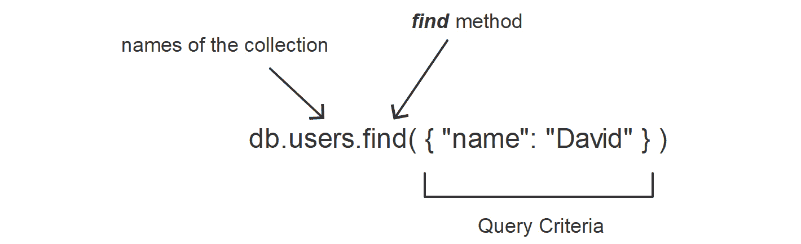

图 4.1：MongoDB 查询语法

为了与 SQL 进行比较，让我们用 SQL 格式重写相同的查询。该查询查找`USERS`表中包含`name`列值为`David`的所有行，如下所示：

```js
SELECT * FROM USERS WHERE name = 'David';
```

前述查询之间最显著的区别是，MongoDB 查询没有诸如`SELECT`、`FROM`和`WHERE`之类的关键字。因此，你不需要记住很多关键字及其用法。

关键字的缺失使得查询更加简洁，因此更加专注，也更少出错。当你阅读或编写 MongoDB 查询时，你可以更容易地专注于查询的最重要部分，即条件和逻辑。此外，由于关键字更少，引入语法错误的机会更小。

由于查询以文档格式表示，它们可以很容易地与相应编程语言的对象结构进行映射。当你在应用程序中编写查询时，MongoDB 驱动程序将应用程序编程语言提供的对象映射到 MongoDB 查询中。因此，要构建一个 MongoDB 查询，你只需要准备一个表示查询条件的对象。

相比之下，SQL 查询是以普通字符串的形式编写的。要构建 SQL 查询，您将不得不将关键字、字段和表名以及变量连接成一个字符串。这种字��串连接容易出错。即使在两个连接关键字之间缺少空格也可能引入语法错误。现在我们已经探讨了 MongoDB 查询结构的基本优势，让我们开始编写并执行针对集合的基本查询。

# 基本的 MongoDB 查询

本节中的所有查询都是顶级查询；也就是说，它们是基于文档中的顶级（也称为根级）字段的。我们将通过针对根字段编写查询来学习基本的查询运算符。

## 查找文档

在 MongoDB 中最基本的查询是在集合上使用`find()`函数执行的。当此函数在没有任何参数的情况下执行时，它会返回集合中的所有文档。例如，考虑以下查询：

```js
db.comments.find()
```

此查询在名为`comments`的集合上调用`find()`函数。在 mongo shell 上执行时，它将返回集合中的所有文档。要仅返回特定文档，可以向`find()`函数提供条件。这样做时，`find()`函数会对集合中的每个文档进行评估，并返回与条件匹配的文档。

例如，假设我们不是检索所有评论，而是只想找到由特定用户`Lauren Carr`添加的评论。简而言之，我们想要找到所有`name`字段的值为`Lauren Carr`的文档。我们将连接到 MongoDB Atlas 集群并使用`sample_mflix`数据库。查询应该写成如下形式：

```js
db.comments.find({"name" : "Lauren Carr"})
```

这将导致以下输出：

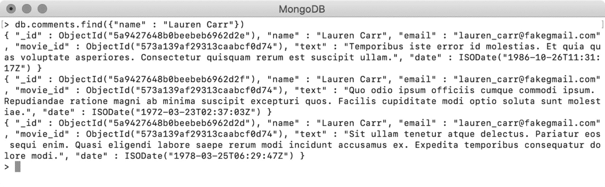

图 4.2：使用 find()函数后的评论结果

该查询返回了由`Lauren Carr`添加的三条评论。然而，输出格式不规范，这使得阅读和解释变得困难。为了克服这一点，可以使用`pretty()`函数打印格式良好的结果，如下所示：

```js
db.comments.find({"name" : "Lauren Carr"}).pretty()
```

当此查询在 mongo shell 上执行时，输出将如下所示：

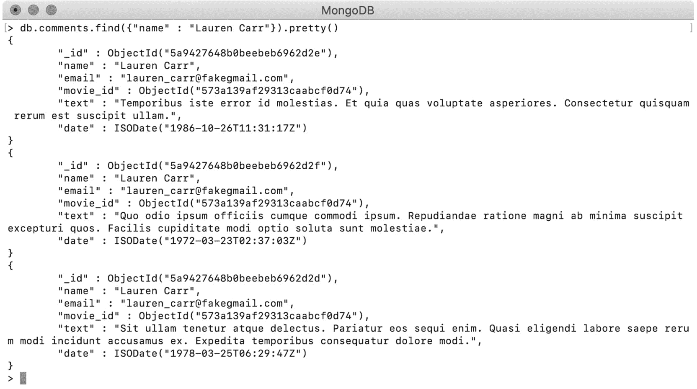

图 4.3：使用 pretty()后的结构化结果

如您所见，输出与前面的示例相同，但文档格式良好且易于阅读。

## 使用 findOne()

MongoDB 提供了另一个函数，称为`findOne()`，它只返回一个匹配的记录。当您想要隔离特定记录时，这个函数非常有用。该函数的语法与`find()`函数的语法类似，如下所示：

```js
db.comments.findOne()
```

此查询在没有任何条件的情况下执行，并匹配`comments`集合中的所有文档，仅返回第一个：

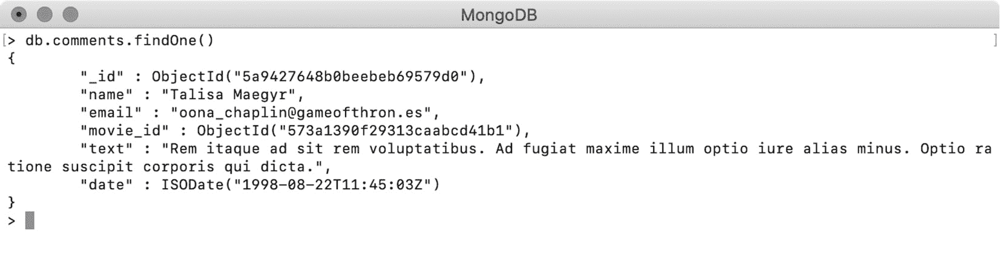

图 4.4：使用 findOne()函数找到单个文档

如您所见，`findOne()`的输出始终格式良好，因为它返回一个文档。将其与旨在返回多个文档的`find()`函数进行比较。`find()`的结果被封装在一个集合中，并且从函数返回该集合的游标。游标是用于迭代或遍历集合元素的集合迭代器。

注意

当您在 mongo shell 上执行`find()`查询时，shell 会自动迭代游标并显示前 20 条记录。当您从编程语言使用`find()`时，您将始终需要自己迭代结果集。

在 mongo shell 上，您可以将`find()`函数返回的光标捕获在一个变量中。通过使用该变量，我们可以遍历元素。在下面的代码段中，我们正在执行一个`find()`查询，并将结果光标捕获在一个名为`comments`的变量中：

```js
var comments = db.comments.find({"name" : "Lauren Carr"})
```

您可以在光标上使用`next()`函数，它将光标移动到下一个索引位置并从那里返回文档。默认情况下，光标设置在集合的开头。第一次调用`next()`函数时，光标将移动到集合中的第一个文档，并返回该文档。再次调用时，光标将移动到第二个位置，并返回第二个文档。以下是在我们的评论光标上调用`next()`函数的语法：

```js
comments.next()
```

当光标到达集合中的最后一个文档时，调用`next()`将导致错误。为了避免这种情况，在调用`next()`之前可以使用`hasNext()`函数。`hasNext()`函数在下一个索引位置有文档时返回`true`，否则返回`false`。以下代码段显示了在光标上调用`hasNext()`函数的语法：

```js
comments.hasNext()
```

以下屏幕截图显示了在 mongo shell 上使用此函数的结果：

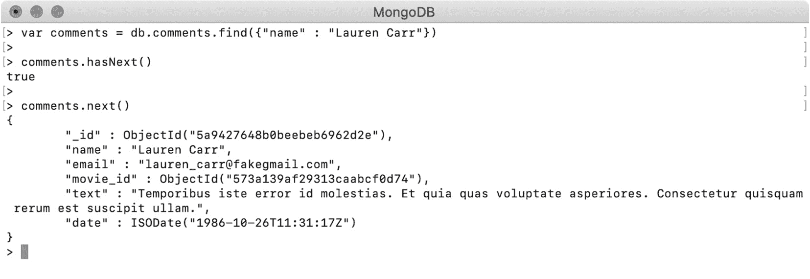

图 4.5：遍历光标

正如我们所看到的，首先，我们将光标捕获在一个变量中。然后，我们验证光标在下一个位置是否有文档，结果为`true`。最后，我们使用`next()`函数打印第一个文档。

## 练习 4.01：在没有条件的情况下使用 find()和 findOne()

在这个练习中，您将在 MongoDB Atlas 上连接到`sample_mflix`数据库，并在 mongo shell 上使用`find()`和`findOne()`而不带任何条件。按照以下步骤进行：

1.  首先，使用没有条件的`find()`。因此，在这里，不要传递任何文档或传递一个空文档给`find()`函数。我们还将执行`find()`函数来查询我们的文档中不存在的字段。这里显示的所有查询都具有相同的行为：

```js
// All of the queries have the same behavior
db.comments.find()
db.comments.find({})
db.comments.find({"a_non_existent_field" : null})
```

在执行任何这些查询时，所有文档都将匹配并在光标中返回。以下屏幕截图显示了从 mongo shell 中打印的前 20 个文档，最后还有一条`键入"it"以获取更多`的消息。每次键入`it`都将返回下一组 20 个文档，直到集合包含更多元素为止：

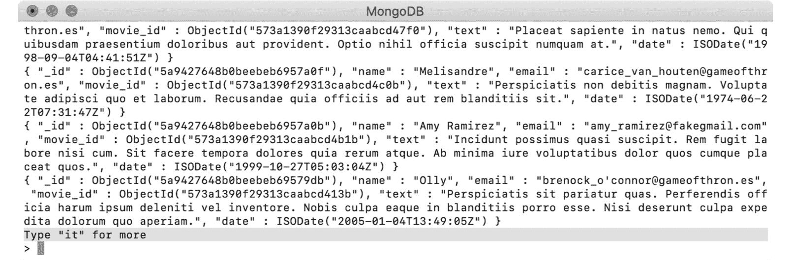

图 4.6：mongo shell 中的前 20 个文档

注意

你是否想知道为什么`{"a_non_existent_field" : null}`匹配所有文档？

这是因为在 MongoDB 中，一个不存在的字段总是被认为具有空值。`"a_non_existent_field"`字段在我们的集合中不存在。因此，该字段的空值检查对所有文档都成立，并且它们都被返回。

1.  接下来，使用没有任何文档的`findOne()`函数，使用一个空文档，以及使用一个查询不存在字段的文档：

```js
// All of the queries have same behaviour
db.comments.findOne()
db.comments.findOne({})
db.comments.findOne({"a_non_existent_field" : null})
```

与前面的步骤类似，所有先前的查询都将产生相同的效果，只是`findOne()`将仅输出集合中的第一个文档。

在下一节中，我们将探讨如何仅在输出中投影一些字段。

## 选择输出的字段

到目前为止，我们观察了许多查询及其输出。您可能已经注意到，每次返回一个文档时，默认情况下它包含所有字段。然而，在大多数实际应用程序中，您可能只希望在结果文档中包含一些字段。在 MongoDB 查询中，您可以从结果中包含或排除特定字段。这种技术称为`find()`或`findOne()`函数。在投影表达式中，您可以通过将其设置为`0`来显式排除一个字段，或者通过将其设置为`1`来包含一个字段。

例如，用户`Lauren Carr`可能只想知道她发布评论的日期，而不关心评论文本。以下查询找到用户发布的所有评论，并仅返回`name`和`date`字段：

```js
db.comments.find(
    {"name" : "Lauren Carr"},
    {"name" : 1, "date": 1}
) 
```

执行查询后，可以看到以下结果：

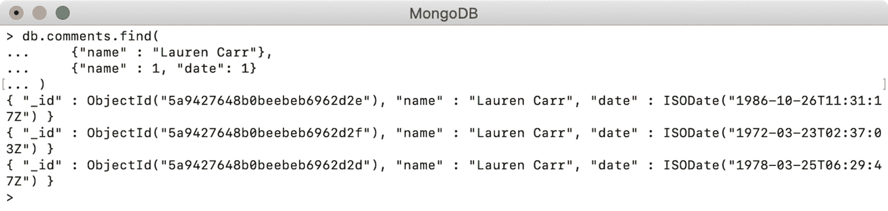

图 4.7：仅显示名称和日期字段的输出

在这里，结果中只有特定字段。但是，即使没有指定，_id 字段仍然可见。这是因为 _id 字段默认包括在结果文档中。如果不希望它出现在结果中，必须明确排除它：

```js
db.comments.find(
    {"name" : "Lauren Carr"}, 
    {"name" : 1, "date": 1, "_id" : 0}
)
```

上述查询指定应从结果中排除 _id 字段。在 mongo shell 上执行时，我们得到以下输出，显示所有文档中都没有 _id 字段：

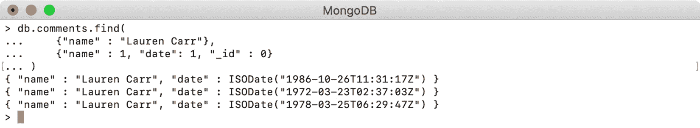

图 4.8：输出中排除了 _id 字段

需要注意字段投影的三种行为，如下所列：

+   _id 字段将始终包括在内，除非明确排除

+   当明确包括一个或多个字段时，其他字段（除了 _id）将自动排除

+   明确排除一个或多个字段将自动包括其余字段，以及 _id

注意

投影有助于压缩结果集并专注于特定字段。我们将查询的`sample_mflix`集合中的文档非常庞大。因此，对于我们大部分的示例输出，我们将使用投影来仅包括文档的特定字段，以展示查询的行为。

## 查找不同的字段

`distinct()`函数用于获取字段的不同或唯一值，带有或不带有查询条件。在本例中，我们将使用`movies`集合。每部电影都被分配了一个基于内容和观众年龄的观众适宜性评级。让我们通过以下查询找到我们集合中存在的唯一评级：

```js
db.movies.distinct("rated")
```

执行上述查询会给我们返回`movies`集合中的所有唯一评级：

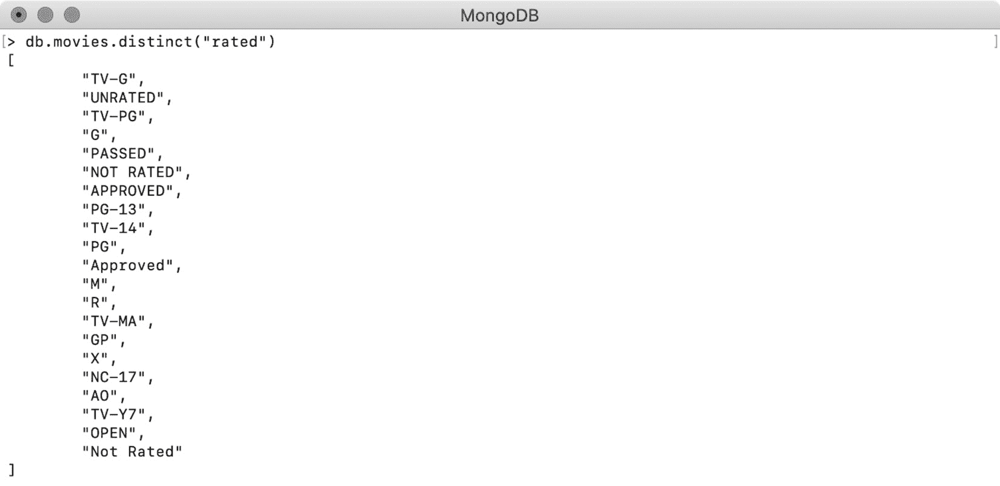

图 4.9：所有电影评分列表

`distinct()`函数也可以与查询条件一起使用。以下示例查找了 1994 年发布的电影所获得的所有唯一评分：

```js
db.movies.distinct("rated", {"year" : 1994})
```

函数的第一个参数是所需字段的名称，而第二个参数是以文档格式表示的查询。执行查询后，我们得到以下输出：

```js
db.movies.distinct("rated", {"year" : 1994}) 
> [ "R", "G", "PG", "UNRATED", "PG-13", "TV-14", "TV-PG", "NOT RATED" ]
```

需要注意`distinct`的结果始终以数组形式返回。

## 统计文档

在某些情况下，我们可能对实际文档不感兴趣，而只对集合中的文档数量或匹配��些查询条件的文档感兴趣。MongoDB 集合有三个返回集合中文档数量的函数。让我们依次看一下它们。

### count()

此函数用于返回集合中文档的数量，或返回与给定查询匹配的文档的数量。在没有任何查询参数的情况下执行时，它返回集合中文档的总数，如下所示：

```js
// Count of all movies
db.movies.count()
> 23539
```

没有查询时，此函数不会实际计算文档的数量。相反，它将通过集合的元数据进行读取并返回计数。MongoDB 规范不能保证元数据计数始终准确。例如，数据库突然关闭或分片集合中不完整的块迁移等情况可能导致不准确性。MongoDB 中的分片集合被分区并分布在数据库的不同节点上。我们不会在这里详细介绍，因为这超出了本书的范围。

当函数提供查询时，返回与给定查询匹配的文档数量。例如，以下查询将返回具有确切六条评论的电影的数量：

```js
// Counting movies that have 6 comments
> db.movies.count({"num_mflix_comments" : 6})
17
```

执行此查询时，实际文档数量是通过执行具有相同查询的聚合管道来内部计算的。您将在*第七章* *聚合*中了解有关聚合管道的更多信息。

在 MongoDB v4.0 中，这两种行为被分成不同的函数：`countDocuments()`和`estimatedDocumentCount()`。

### countDocuments()

此函数返回满足给定条件的文档的数量。以下是一个返回 1999 年上映的电影数量的示例查询：

```js
> db.movies.countDocuments({"year": 1999})
542
```

与`count()`函数不同，`countDocuments()`需要查询参数。因此，以下查询是无效的，它将失败：

```js
db.movies.countDocuments()
```

要计算集合中的所有文档，我们可以将一个空查询传递给函数，如下所示：

```js
> db.movies.countDocuments({})
23539
```

关于`countDocuments()`的一个重要事项是，它从不使用集合元数据来查找计数。它在集合上执行给定的查询并计算匹配文档的数量。这提供了准确的结果，但可能比基于元数据的计数需要更长的时间。即使提供了空查询，它也会与所有文档匹配。

### estimatedDocumentCount()

此函数返回集合中文档的近似或估计数量。它不接受任何查询，并始终返回集合中所有文档的数量。计数始终基于集合的元数据。其语法如下：

```js
> db.movies.estimatedDocumentCount()
23539
```

由于计数是基于元数据的，结果不太准确，但性能更好。当性能比准确性更重要时，应使用该函数。

# 条件运算符

现在您已经学会了如何查询 MongoDB 集合，以及如何使用投影仅返回输出中的特定字段，是时候学习更高级的查询方式了。到目前为止，您已经尝试使用字段值查询`comments`集合。但是，还有更多查询文档的方法。MongoDB 提供了条件运算符，可用于表示各种条件，例如相等性，以及值是否小于或大于某个指定值。在本节中，我们将探索这些运算符，并学习如何在查询中使用它们。

## 等于($eq)

在前面的部分中，您看到了相等检查的示例，其中查询使用了键值对。但是，查询也可以使用专用运算符(`$eq`)来查找具有与给定值匹配的字段的文档。例如，以下查询查找并返回具有`5`条评论的电影。这两个查询具有相同的效果：

```js
db.movies.find({"num_mflix_comments" : 5})
db.movies.find({ "num_mflix_comments" : {$eq : 5 }})
```

## 不等于($ne)

此运算符代表**不等于**，与使用相等检查的效果相反。它选择所有字段值与给定值不匹配的文档。例如，以下查询可用于返回评论计数不等于 5 的电影：

```js
db.movies.find(
    { "num_mflix_comments" : 
        {$ne : 5 }
    }
)
```

## 大于($gt)和大于或等于($gte)

`$gt`关键字可用于查找字段值大于查询中的值的文档。类似地，`$gte`关键字用于查找字段值与或大于给定值的文档。让我们找出 2015 年后发布的电影数量：

```js
> db.movies.find(
    {year : {$gt : 2015}}
).count()
1
```

要查找在 2015 年或之后发布的电影，可以使用以下代码行：

```js
> db.movies.find(
    {year : {$gte : 2015}}
).count()
485
```

使用这些运算符，我们还可以计算 21 世纪发布的电影数量。对于此查询，我们还希望包括自 2000 年 1 月 1 日以来发布的电影，因此我们将使用`$gte`，如下所示：

```js
// On or After 2000-01-01
> db.movies.find(
    {"released" : 
        {$gte: new Date('2000-01-01')}
    }
).count()
13767
```

## 小于($lt)和小于或等于($lte)

`$lt`运算符匹配字段值小于给定值的文档。同样地，`$lte`运算符选择字段值与给定值相同或小于给定值的文档。

要找出有少于两条评论的电影数量，输入以下查询：

```js
> db.movies.find(
    {"num_mflix_comments" : 
        {$lt : 2}
    }
).count()
8514
```

同样地，要找出最多有两条评论的电影数量，输入以下查询：

```js
> db.movies.find(
    {"num_mflix_comments" : 
        {$lte : 2}
    }
).count()
13185
```

同样，要计算上个世纪发行的电影数量，只需使用`$lt`：

```js
// Before 2000-01-01
> db.movies.find(
    {"released" : 
        {$lt : new Date('2000-01-01')}
    }
).count()
9268
```

## 在($in)和不在($nin)

如果用户想要列出所有被评为 G、PG 或 PG-13 的电影，该怎么办？在这种情况下，我们可以使用`$in`运算符，以及以数组形式给出的多个值。这样的查询可以找到所有字段值至少与给定值中的一个匹配的文档。通过输入以下内容准备一个查询，返回被评为 G、PG 或 PG-13 的电影：

```js
db.movies.find(
    {"rated" : 
        {$in : ["G", "PG", "PG-13"]}
    }
)
```

`$nin`运算符代表**不在**，匹配所有字段值与数组元素都不匹配的文档：

```js
db.movies.find(
    {"rated" : 
        {$nin : ["G", "PG", "PG-13"]}
    }
)
```

前述查询返回的是未被评为`G`、`PG`或`PG-13`的电影，包括那些没有`rated`字段的电影。

首先，找到你拥有的总文档数量，看看当你使用`$nin`与一个不存在的字段时会发生什么：

```js
> db.movies.countDocuments({})
23539
```

现在，使用`$nin`与一些值（除了 null）在一个不存在的对象上。这意味着所有文档都匹配，如下片段所示：

```js
> db.movies.countDocuments(
    {"nef" : 
        {$nin : ["a value", "another value"]} 
    }
)
23539
```

在以下示例中，将`null`值添加到`$nin`数组中：

```js
> db.movies.countDocuments( 
    {"nef" : 
        {$nin : ["a value", "another value", null ]} 
    }
)
0
```

这一次，没有匹配到任何文档。这是因为在 MongoDB 中，不存在的字段总是具有 null 值，因此`$nin`条件对任何文档都不成立。

## 练习 4.02：查询演员的电影

假设你在一家知名娱乐杂志工作，他们即将出版一期专门介绍莱昂纳多·迪卡普里奥的杂志。这期杂志将包含一篇特别文章，你迫切需要一些数据，比如他出演的电影数量、每部电影的类型等。在这个练习中，你将编写查询，按给定条件计算文档数量，找到不同的文档，并投影文档中的不同字段。在`sample_mflix`电影集合上进行以下查询：

+   演员出演的电影数量

+   这些电影的类型

+   电影标题及其相应的发行年份

+   他执导的电影数量

1.  通过使用`cast`字段找到莱昂纳多·迪卡普里奥出演的电影。输入以下查询来执行：

```js
db.movies.countDocuments({"cast" : "Leonardo DiCaprio"})
```

以下输出表明，莱昂纳多出演了 25 部电影：

```js
> db.movies.countDocuments({"cast" : "Leonardo DiCaprio"})
25
```

1.  集合中电影的类型由`genres`字段表示。使用`distinct()`函数找到唯一的类型：

```js
db.movies.distinct("genres", {"cast" : "Leonardo DiCaprio"})
```

执行上述代码后，将收到以下输出。正如我们所看到的，他出演了 14 种不同类型的电影：

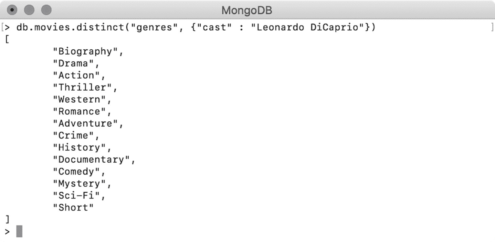

图 4.10：莱昂纳多·迪卡普里奥主演的电影类型

1.  现在，可以使用电影标题找到演员每部电影的发行年份。由于只对他的电影标题和发行年份感兴趣，因此在查询中添加一个投影子句：

```js
db.movies.find(
    {"cast" : "Leonardo DiCaprio"},
    {"title":1, "year":1, "_id":0}
)
```

输出将如下生成：

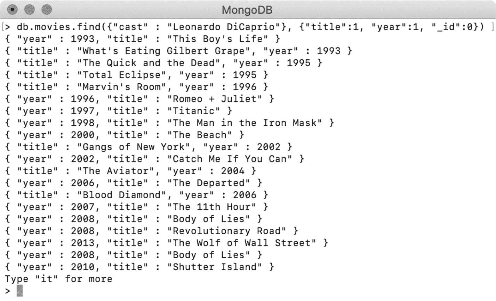

图 4.11：莱昂纳多·迪卡普里奥的电影标题和发行年份

1.  接下来，你需要找到莱昂纳多执导的电影数量。为了收集这些信息，再次计算他执导的电影数量，这次使用导演字段而不是演员字段。这个问题的查询文档应该如下所示：

```js
{"directors": "Leonardo DiCaprio"}
```

1.  编写一个查询，计算与前述查询匹配的电影数量：

```js
db.movies.countDocuments({"directors" : "Leonardo DiCaprio"})
```

执行查询。结果显示，莱昂纳多·迪卡普里奥执导了`0`部电影：

```js
> db.movies.countDocuments({"directors" : "Leonardo DiCaprio"})
0
```

在这个练习中，您根据一些条件找到并计算了文档，找到了字段的不同值，并在输出中投影了特定字段。在下一节中，我们将学习逻辑运算符。

# 逻辑运算符

到目前为止，我们已经了解了用于编写基于比较的查询的各种运算符。到目前为止，我们编写的查询一次只有一个标准。但在实际场景中，您可能需要编写更复杂的查询。MongoDB 提供了四个逻辑运算符，以帮助您在同一查询中构建多个条件的逻辑组合。让我们来看看它们。

## $and 运算符

使用`$and`运算符，您可以将任意数量的条件包装在数组中，该运算符将仅返回满足所有条件的文档。当文档未通过条件检查时，将跳过下一个条件。这就是为什么该运算符被称为短路运算符的原因。例如，假设您想确定 2008 年发布的未评级电影的数量。此查询必须具有两个条件：

+   字段 rated 应该有一个值为`UNRATED`

+   字段 year 必须等于`2008`

在文档格式中，这两个查询可以写为`{"rated" : "UNRATED"}`和`{"year" : 2008}`。使用`$and`运算符将它们放在一个数组中：

```js
> db.movies.countDocuments (
    {$and : 
        [{"rated" : "UNRATED"}, {"year" : 2008}]
    }
)
37
```

前面的输出显示，2008 年有 37 部未评级的电影。在 MongoDB 查询中，如果查询文档具有多个条件，则`$and`运算符是隐式的并且默认包含在内。例如，以下查询可以在不使用`$and`运算符的情况下重写，并且给出相同的结果：

```js
> db.movies.countDocuments (
    {"rated": "UNRATED", "year" : 2008}
)
37
```

输出完全相同，因此您不必显式使用`$and`运算符，除非您想使您的代码更易读。

## $or 运算符

使用`$or`运算符，您��以将多个条件包装在一个数组中，并返回满足任一条件的文档。当我们有多个条件并且希望找到至少一个条件匹配的文档时，就会使用此运算符。

在*In ($in) and Not In ($nin)*部分中使用的示例中，您编写了一个查询，用于计算评级为 G、PG 或 PG-13 的电影的数量。使用`$or`运算符，重写相同的查询，如下所示：

```js
db.movies.find(
    { $or : [
        {"rated" : "G"}, 
        {"rated" : "PG"}, 
        {"rated" : "PG-13"}
    ]}
)
```

这两个运算符是不同的，并且用于不同的场景。`$in`运算符用于确定给定字段是否至少具有数组中提供的一个值，而`$or`运算符不限于任何特定字段，并接受多个表达式。为了更好地理解这一点，请编写一个查询，找到评级为`G`、发布于`2005`年或至少有`5`条评论的电影。此查询中有三个条件，如下所示：

+   `{"rated" : "G"}`

+   `{"year" : 2005}`

+   `{"num_mflix_comments" : {$gte : 5}}`

要在`$or`查询中使用这些表达式，请将这些表达式组合在一个数组中：

```js
db.movies.find(
    {$or:[
        {"rated" : "G"},
        {"year" : 2005},
        {"num_mflix_comments" : {$gte : 5}}
   ]}
)
```

## $nor 运算符

`$nor`运算符在语法上类似于`$or`，但行为方式相反。`$nor`运算符接受数组形式的多个条件表达式，并返回不满足任何给定条件的文档。

以下是您在上一节中编写的相同查询，只是将`$or`运算符替换为`$nor`：

```js
db.movies.find(
    {$nor:[
        {"rated" : "G"},
        {"year" : 2005},
        {"num_mflix_comments" : {$gte : 5}}
    ]}
)
```

此查询将匹配并返回所有未评级为`G`、未发布于`2005`年且没有超过`5`条评论的电影。

## $not 运算符

`$not`运算符表示逻辑 NOT 操作，否定给定条件。简而言之，`$not`运算符接受一个条件表达式，并匹配所有不满足该条件的文档。

以下查询找到了具有`5`条或更多评论的电影：

```js
db.movies.find(
    {"num_mflix_comments" : 
        {$gte : 5}
    }
)
```

在相同的查询中使用`$not`运算符并否定给定条件：

```js
db.movies.find(
    {"num_mflix_comments" : 
        {$not : {$gte : 5} }
    }
)
```

此查询将返回所有没有 5 条或更多评论以及不包含`num_mflix_comments`字段的电影。现在，您将在一个简单的练习中使用到目前为止学到的运算符。

## 练习 4.03：组合多个查询

即将出版的杂志专注于莱昂纳多与导演马丁·斯科塞斯的合作。您的任务是找到戏剧或犯罪电影的标题和发行年，这些电影是莱昂纳多·迪卡普里奥和马丁·斯科塞斯合作制作的。要完成此练习，您需要使用多个查询的组合，如下所述：

1.  第一个条件是莱昂纳多·迪卡普里奥必须是其中一位演员，马丁·斯科塞斯必须是导演。因此，您有两个条件需要具有*AND*关系。正如您之前所见，当两个查询组合时，*AND*关系是默认关系。输入以下查询：

```js
db.movies.find(
    {
      "cast": "Leonardo DiCaprio",
      "directors" : "Martin Scorsese"
    }
)
```

1.  现在，还有一个*AND*条件需要添加，即电影应该是戏剧或犯罪类型。您可以轻松地为 genre 字段准备两个过滤器：`{"genres" : "Drama"}`和`{"genres" : "Crime"}`。将它们组合在*OR*关系中，如下所示：

```js
"$or" : [{"genres" : "Drama"}, {"genres": "Crime"}]
```

1.  将 genre 过滤器添加到主查询中：

```js
db.movies.find(
    {
      "cast": "Leonardo DiCaprio", 
      "directors" : "Martin Scorsese",
      "$or" : [{"genres" : "Drama"}, {"genres": "Crime"}]
    }
)
```

1.  前述查询包含所有预期条件，但您只对标题和发行年感兴趣。为此，添加投影部分：

```js
db.movies.find(
    {
      "cast": "Leonardo DiCaprio",
      "directors" : "Martin Scorsese",
      "$or" : [{"genres" : "Drama"}, {"genres": "Crime"}]
    },
    {
      "title" : 1, "year" : 1, "_id" : 0
    }
)
```

1.  在 mongo shell 上执行查询。输出应如下所示：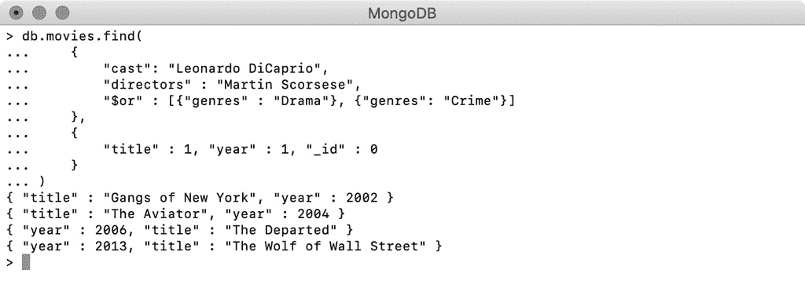

图 4.12：莱昂纳多·迪卡普里奥和马丁·斯科塞斯合作的电影

此输出提供了所需的信息；有四部符合我们条件的电影。演员和导演最后一次合作是在 2013 年的电影《华尔街之狼》上。通过这样，您已经练习了如何使用不同的逻辑关系一起使用多个查询条件。在下一节中，您将学习如何使用正则表达式查询文本字段。

# 正则表达式

在现实世界的电影服务中，您会希望提供自动完成搜索框，当用户输入电影标题的几个字符时，搜索框会建议所有标题与输入的字符序列匹配的电影。这是使用正则表达式实现的。正则表达式是一个特殊的字符串，定义了一个字符模式。当这样的正则表达式用于查找字符串字段时，找到并返回所有具有匹配模式的字符串。

在 MongoDB 查询中，正则表达式可以与`$regex`运算符一起使用。想象一下，你在搜索框中输入了单词`Opera`，想要找到所有标题中包含这个字符模式的电影。这个正则表达式查询将如下所示：

```js
db.movies.find(
    {"title" : {$regex :"Opera"}}
)
```

执行此查询并使用投影仅打印标题时，结果将如下所示：

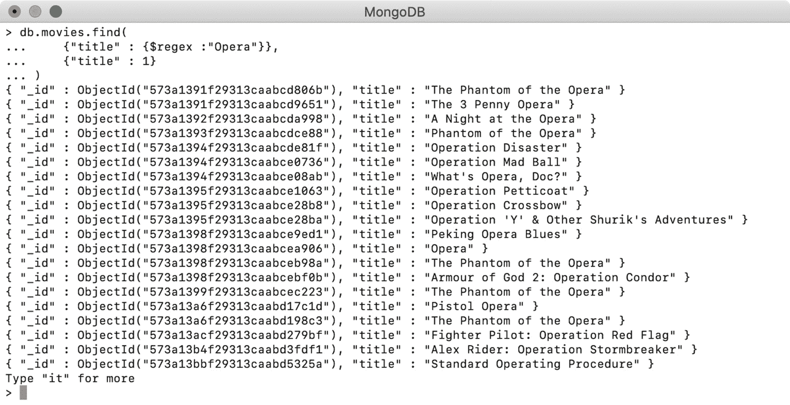

图 4.13：标题中包含单词“Opera”的电影

来自 mongo shell 的输出表明，正则表达式正确返回了标题中包含单词`Opera`的电影。

### 使用插入符（^）运算符

在前面的正则表达式示例中，输出的标题中包含给定单词`Opera`的任何位置。要仅查找以给定正则表达式开头的字符串，可以使用插入符运算符(`^`)。在下面的示例中，您将使用它来仅查找那些标题以单词`Opera`开头的电影：

```js
db.movies.find(
    {"title" : {$regex :"^Opera"}}
)
```

当执行前述查询并投影`title`字段时，将得到以下输出：

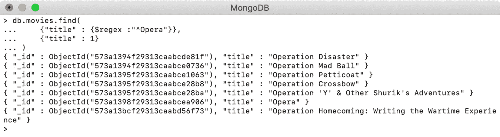

图 4.14：仅投影出前述查询的标题字段

来自 Mongo shell 的前述输出显示，仅返回了以单词"Opera"开头的电影标题。

### 使用美元符号（$）运算符

类似于插入符运算符，您还可以匹配以给定正则表达式结尾的字符串。为此，使用美元运算符（`$`）。在以下示例中，您正在尝试查找以单词“Opera”结尾的电影标题：

```js
db.movies.find(
    {"title" : {$regex :"Opera$"}}
)
```

上述查询在正则表达式文本之后使用了美元（`$`）运算符。当您执行并投影标题字段时，您将收到以下输出：

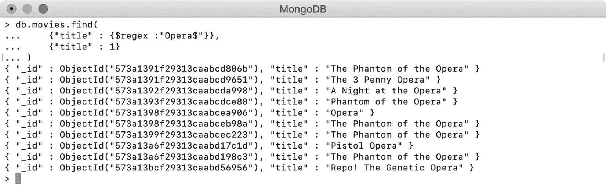

图 4.15：标题以“Opera”结尾的电影

因此，通过使用美元（`$`）运算符，我们已经找到了所有以单词`Opera`结尾的电影标题。

### 不区分大小写搜索

默认情况下，使用正则表达式进行搜索是区分大小写的。提供的搜索模式中的字符大小写会被精确匹配。然而，通常情况下，您希望提供一个单词或模式给正则表达式，并且不考虑它们的大小写来查找文档。MongoDB 为此提供了`$options`运算符，可用于不区分大小写的正则表达式搜索。例如，假设您想要找到所有标题中包含单词“the”的电影，首先是区分大小写的方式，然后是不区分大小写的方式。

以下查询检索包含小写单词`the`的标题：

```js
db.movies.find(
    {"title" : {"$regex" : "the"}}
)
```

在 mongo shell 中的以下输出显示，此查询返回包含小写单词`the`的标题：

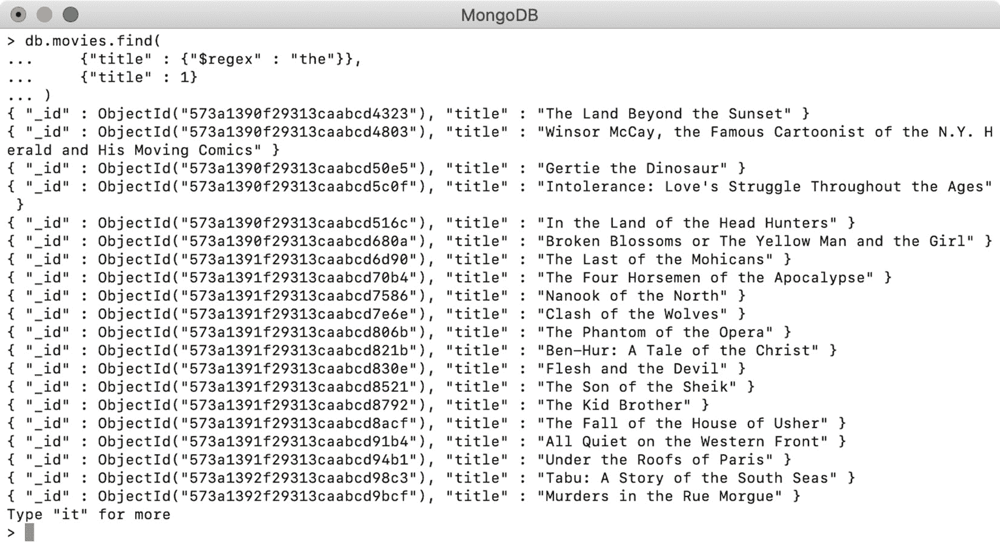

图 4.16：包含小写单词“the”的标题

现在，尝试使用不区分大小写的搜索进行相同的查询。为此，使用值为`i`的`$options`参数，其中`i`代表不区分大小写：

```js
db.movies.find(
    {"title" : 
        {"$regex" : "the", $options: "i"}
    }
)
```

上述查询使用相同的正则表达式模式（`the`），但带有额外的参数；也就是`$options`。在`title`字段上执行查询并投影：

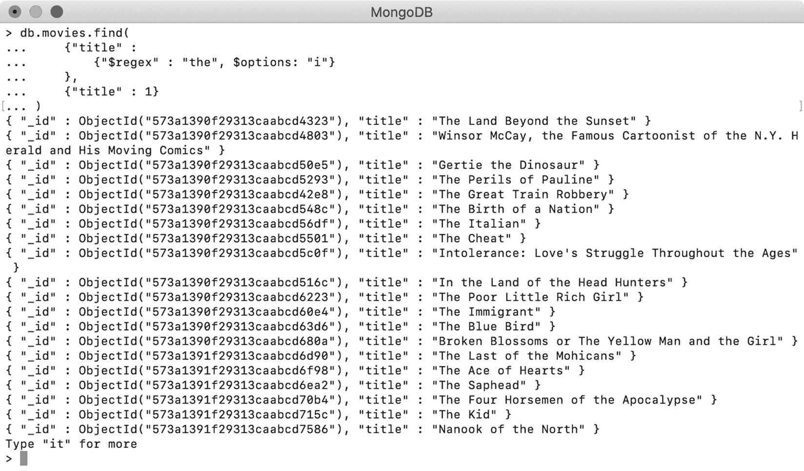

图 4.17：查询不区分大小写的结果

执行查询并打印标题显示，正则表达式匹配，不考虑大小写。到目前为止，我们已经了解了在基本对象上进行查询。在下一节中，我们将学习如何查询数组和嵌套文档。

# 查询数组和嵌套文档

在*第二章*，*文档和数据类型*中，我们了解到 MongoDB 文档支持复杂的对象结构，如数组，嵌套对象，对象数组等。数组和嵌套文档有助于存储独立的信息。非常重要的是要有一种机制来轻松搜索和检索存储在这些复杂结构中的信息。MongoDB 查询语言允许我们以最直观的方式查询这些复杂结构。首先，我们将学习如何在数组元素上运行查询，然后我们将学习如何在嵌套对象字段上运行查询。

## 通过元素查找数组

在数组上进行查询类似于查询任何其他字段。在`movies`集合中，有几个数组，`cast`字段是其中之一。考虑到，在您的电影服务中，用户想要查找由演员`查理卓别林`主演的电影。为此搜索创建查询，使用字段上的相等检查，如下所示：

```js
db.movies.find({"cast" : "Charles Chaplin"})
```

当您执行此查询并仅投影`cast`字段时，您将获得以下输出：

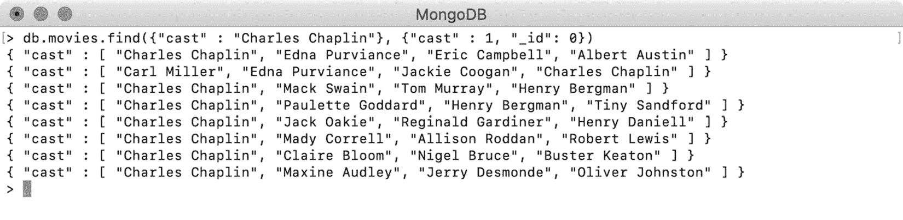

图 4.18：查找查理卓别林主演的电影

现在，假设��户想要搜索由演员`查理卓别林`和`埃德娜·普尔维亚斯`一起出演的电影。对于此查询，您将使用`$and`运算符：

```js
db.movies.find(
    {$and :[
        {"cast" : "Charles Chaplin"},
        {"cast": "Edna Purviance"}
    ]}
)
```

执行并仅投影数组字段会产生以下输出：

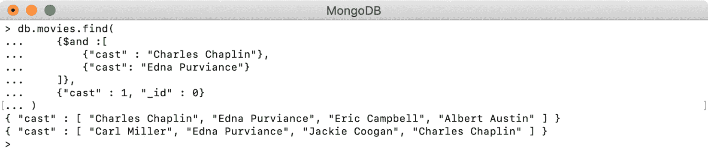

图 4.19：查找查理卓别林和埃德娜·普尔维亚斯主演的电影

我们可以得出结论，当使用值查询数组字段时，只要数组字段包含至少一个满足查询条件的元素，就会返回所有这些文档。

## 通过数组查找数组

在之前的例子中，我们使用元素的值搜索数组。同样，也可以使用数组值搜索数组字段。但是，当您使用数组值搜索数组字段时，元素及其顺序必须匹配。让我们尝试一些例子来证明这一点。

`movies` 集合中的文档有一个数组，表示电影可用的语言数量。假设您的用户想要查找可用于`英语`和`德语`的电影。准备一个包含这两个值的数组，并查询`languages`字段：

```js
db.movies.find(
    {"languages" : ["English", "German"]}
)
```

在投影`languages`和`_id`字段的同时打印结果：

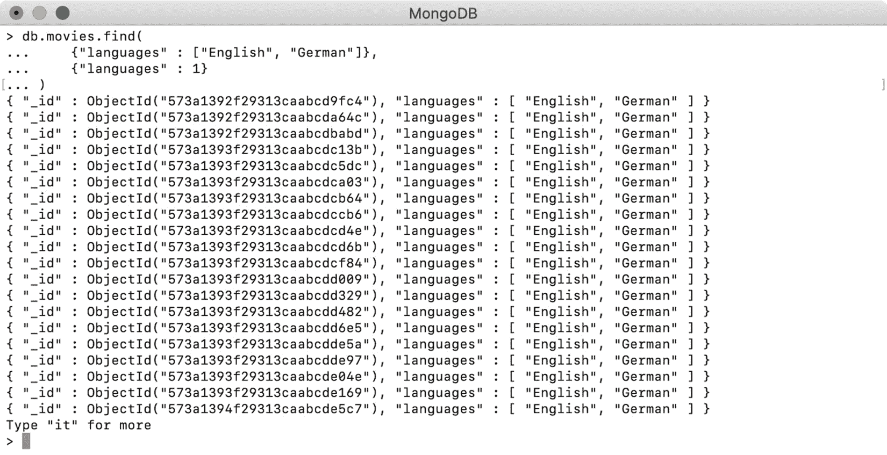

图 4.20：可用英语和德语的电影

前面的输出显示，当我们使用数组进行搜索时，值会被精确匹配。

现在，让我们改变数组元素的顺序并再次搜索：

```js
db.movies.find(
    {"languages" : ["German", "English"]}
)
```

请注意，这个查询与之前的查询相同，只是数组元素的顺序不同。您应该看到以下输出：

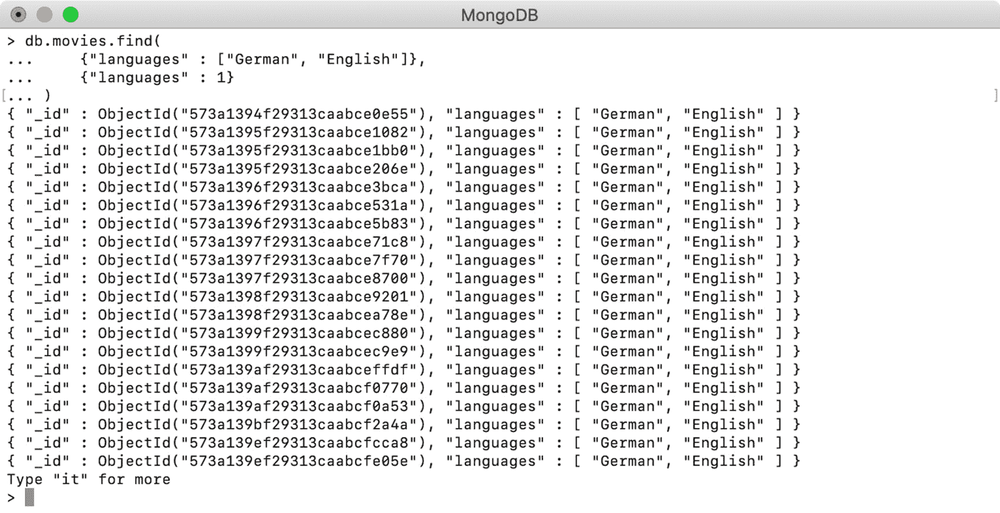

图 4.21：演示数组元素顺序影响的查询

前面的输出显示，通过改变数组中元素的顺序，不同的记录已经被匹配。

这是因为当使用数组值搜索数组字段时，该值会使用相等检查进行匹配。只有当两个数组具有相同顺序的相同元素时，它们才能通过相等检查。因此，以下两个查询不同，并且将返回不同的结果：

```js
// Find movies languages by [ "English", "French", "Cantonese", "German"]
db.movies.find(
    {"languages": [ "English", "French", "Cantonese", "German"]}
)
// Find movies languages by ["English", "French", "Cantonese"]
db.movies.find(
    {"languages": ["English", "French", "Cantonese"]}
)
```

这两个查询之间唯一的区别是第二个查询不包含最后一个元素，即`德语`。现在，在 mongo shell 中执行这两个查询并查看输出：

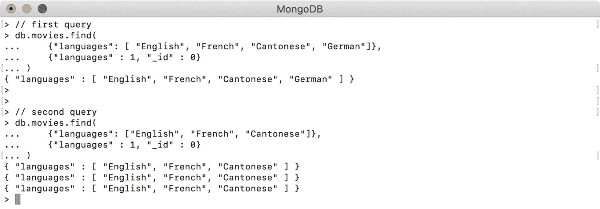

图 4.22：不同的查询，演示数组值的精确匹配

前面的输出显示，这两个查询依次执行，并证明了数组值的精确匹配。

### 使用$all 运算符搜索数组

`$all`运算符找到所有那些字段值包含所有元素的文档，无论它们的顺序或大小如何：

```js
db.movies.find(
    {"languages":{ 
        "$all" :[ "English", "French", "Cantonese"]
    }}
)
```

前面的查询使用`$all`来查找所有可用`英语`、`法语`和`粤语`的电影。您将执行此查询，并进行投影，仅显示`languages`字段：


图 4.23：在`languages`字段上使用$all 运算符的查询

前面的输出表明，`$all`运算符已经匹配了数组，无论元素的顺序和大小如何。

## 投影数组元素

到目前为止，我们已经看到每当搜索数组字段时，输出总是包含完整的数组。有几种方法可以限制查询输出中返回的数组元素数量。我们已经练习了在结果文档中投影字段。与此类似，数组中的元素也可以被投影。在本节中，我们将学习如何在搜索数组字段时限制结果集。之后，我们将学习如何根据它们的索引位置从数组中返回特定元素。

### 使用($)投影匹配的元素

您可以通过元素值搜索数组，并使用`$`运算符排除数组的除第一个匹配元素之外的所有元素。为此，首先执行一个不带`$`运算符的查询，然后再执行带有此运算符的查询。准备一个简单的元素搜索查询，如下所示：

```js
db.movies.find(
    {"languages" : "Syriac"}, 
    {"languages" :1}
)
```

该查询在`languages`数组上使用元素搜索，并投影字段以产生以下输出：

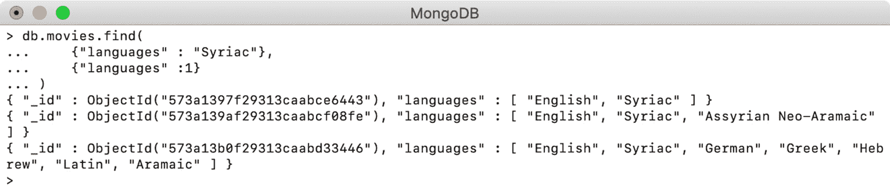

图 4.24：以叙利亚语提供的电影

尽管查询旨在查找叙利亚语电影，但输出数组中还包含其他语言。现在，看看当您使用`$`运算符时会发生什么：

```js
db.movies.find(
    {"languages" : "Syriac"}, 
    {"languages.$" :1}
)
```

您已经修改了查询，以在投影部分添加`$`运算符。现在，执行查询，如下所示：

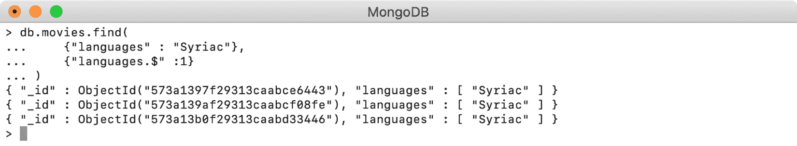

图 4.25：仅以叙利亚语提供的电影

输出中的数组字段仅包含匹配的元素；其余元素被跳过。因此，输出中的`languages`数组仅包含`Syriac`元素。最重要的是要记住，如果匹配了多个元素，`$`运算符只投影第一个匹配的元素。

### 通过它们的索引位置投影匹配的元素（$slice）

`$slice`运算符用于基于其索引位置限制数组元素。该运算符可以与任何数组字段一起使用，无论是否正在查询该字段。这意味着您可以查询不同的字段，仍然可以使用该运算符来限制数组字段的元素。

为了看到这一点，我们将以电影《青春无敌》为例，该电影的`languages`数组中有 11 个元素。来自 mongo shell 的以下输出显示了电影记录中的数组字段的样子：

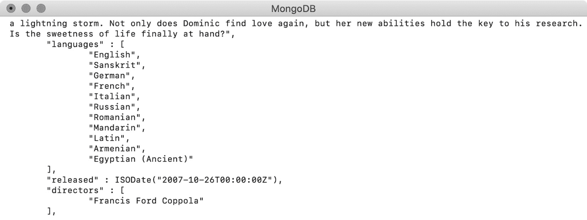

图 4.26：电影《青春无敌》的语言列表

在下面的查询中，使用`$slice`仅打印数组的前三个元素：

```js
db.movies.find(
    {"title" : "Youth Without Youth"}, 
    {"languages" : {$slice : 3}}
).pretty()
```

前面查询的输出显示，`languages`字段仅包含前三个元素。

```js
    "languages" : [
            "English",
            "Sanskrit",
            "German"
    ]
    "released" : ISODate("2007-10-26T00:00:00Z"),
    "directors" : [
```

`$slice`运算符可以以更多方式使用。以下投影表达式将返回数组的最后两个元素：

```js
{"languages" : {$slice : -2}}
```

以下输出显示数组已被切片为仅包含最后两个元素：

```js
    "languages" : [
            "Armenian",
            "Egyptian (Ancient)",
    ]
    "released" : ISODate("2007-10-26T00:00:00Z"),
```

`$slice`运算符也可以传递两个参数，其中第一个参数表示要跳过的元素数，第二个参数表示要返回的元素数。例如，以下投影表达式将跳过数组的前两个元素，并返回其后的四个元素：

```js
{"languages" : {$slice : [2, 4]}}
```

当执行此查询时，我们得到以下输出：

```js
    "languages" : [
            "German",
            "French",
            "Italian"
            "Russian"
    ]
    "released" : ISODate("2007-10-26T00:00:00Z"),
    "directors" : [
```

两参数切片也可以使用负值进行跳过。例如，在以下投影表达式中，第一个数字是负数。如果跳过的值是负数，则计数从末尾开始。因此，在以下表达式中，将跳过从最后一个索引开始的五个元素，并返回从该索引开始的四个元素：

```js
{"languages" : {$slice : [-5, 4]}}
```

请注意，由于负的跳过值，跳过索引将从最后一个索引计算。从最后一个索引跳过五个元素得到`Romanian`，并且从该索引位置开始，将返回接下来的四个元素，如下所示：

```js
    "languages" : [
            "Romanian",
            "Mandarin",
            "Latin"
            "Armenian"
    ]
    "released" : ISODate("2007-10-26T00:00:00Z"),
```

在本节中，我们已经介绍了如何查询数组字段以及如何以各种方式投影结果。在下一节中，我们将学习如何查询嵌套对象。

## 查询嵌套对象

与数组类似，嵌套或嵌入式对象也可以表示为字段的值。因此，具有其他对象作为其值的字段可以使用完整对象作为值进行搜索。在`movies`集合中，有一个名为`awards`的字段，其值是一个嵌套对象。以下片段显示了集合中某个随机电影的`awards`对象：

```js
    "rated" : "TV-G",
    "awards"  :  {
             "wins" : 1,
             "nominations" : 0,
             "text" : "1 win."
    }
```

以下查询通过提供完整对象作为其值来查找`awards`对象：

```js
db.movies.find(
    {"awards": 
        {"wins": 1, "nominations": 0, "text": "1 win."}
    }
)
```

以下输出显示，有几部电影的`awards`字段的确切值为`{"wins": 1, "nominations": 0, "text": "1 win."}`：

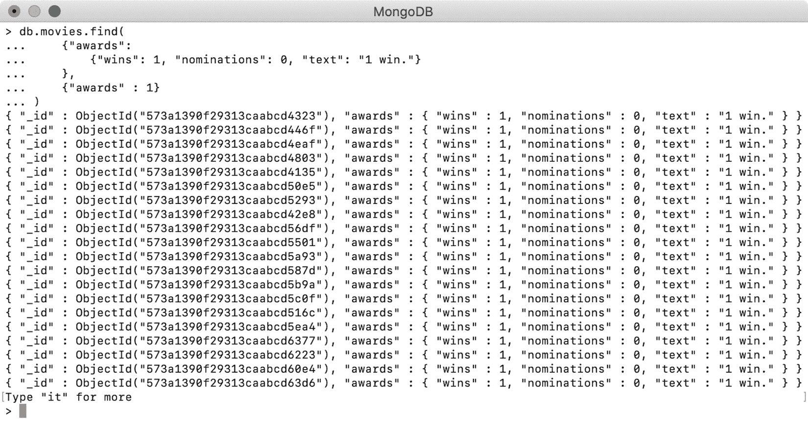

图 4.27：没有提名和一项奖项的电影列表

当使用对象值搜索嵌套对象字段时，必须有精确匹配。这意味着所有字段-值对以及字段的顺序必须完全匹配。例如，请考虑以下查询：

```js
db.movies.find(
    {"awards": 
        {"nominations": 0, "wins": 1, "text": "1 win."}
    }
)
```

此查询在查询对象方面有一个顺序变化；因此，它将返回一个空结果。

## 查询嵌套对象字段

在*第二章*，*文档和数据类型*中，我们看到可以使用点（`.`）表示法访问嵌套对象的字段。类似地，可以使用点表示法通过提供其字段的值来搜索嵌套对象。例如，要查找获得四项奖项的电影，可以使用点表示法如下：

```js
db.movies.find(
    {"awards.wins" : 4}
)
```

上述查询在`awards`字段上使用点（`.`）表示法，并引用名为`wins`的嵌套字段。当您执行查询并仅投影`awards`字段时，您将获得以下输出：

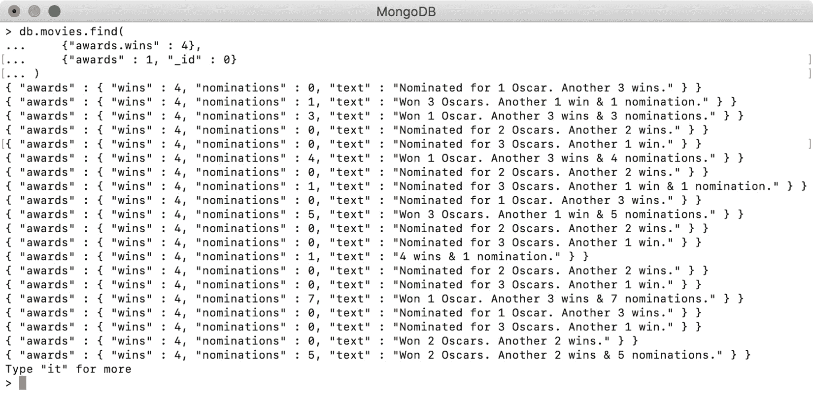

图 4.28：仅为上述片段投影奖项字段

上述输出表明筛选已正确应用于`wins`，并返回了所有获得四项奖项的电影。

嵌套字段搜索是独立执行的，不考虑元素的顺序。您可以通过多个字段进行搜索，并使用任何条件或逻辑查询运算符。例如，请参考以下查询：

```js
db.movies.find(
    {
        "awards.wins" : {$gte : 5}, 
        "awards.nominations" : 6
    }
)
```

此查询在两个不同的嵌套字段上组合了两个条件。在执行查询时排除其他字段，您应该看到以下输出：

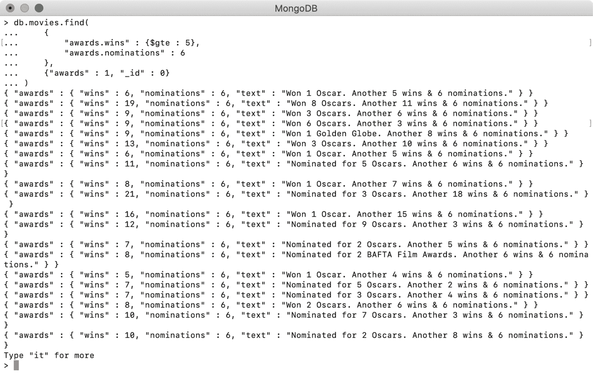

图 4.29：获得六项提名和至少五项奖项的电影

此查询使用条件运算符在两个字段上进行搜索，并返回了获得六项提名并至少获得五项奖项的电影。与数组元素或文档中的任何字段一样，嵌套对象字段也可以按我们的要求进行投影。我们将在下一个练习中详细探讨这一点。

## 练习 4.04：投影嵌套对象字段

在这个练习中，您将学习如何仅从嵌套对象中投影特定字段。以下步骤将帮助您实施这个练习：

1.  打开 mongo shell 并连接到 Mongo Atlas 上的`sample_mflix`数据库。输入以下查询以返回所有记录并仅投影`awards`字段，这是一个嵌入对象：

```js
db.movies.find(
    {}, 
    {
        "awards" :1, 
        "_id":0
    }
)
```

以下输出显示，结果中仅包括`awards`字段，而其他字段（包括`_id`）已被排除：

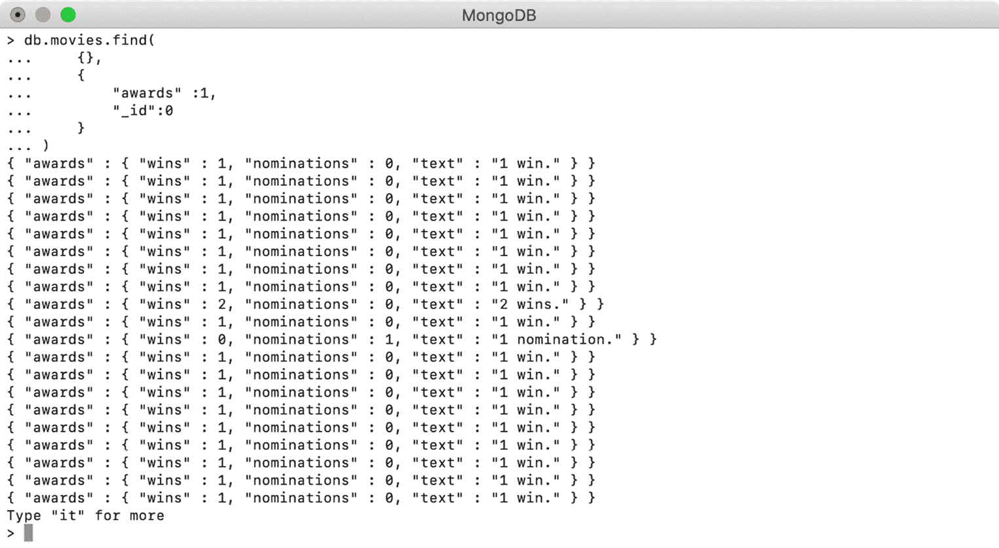

图 4.30：仅为查询投影奖项字段

1.  要仅从嵌入对象中投影特定字段，可以使用点表示法引用嵌入对象的字段。输入以下查询：

```js
db.movies.find(
    {}, 
    {
        "awards.wins" :1, 
        "awards.nominations" : 1,  
        "_id":0
    }
)
```

当您在 mongo shell 上执行此查询时，输出将如下所示：


图 4.31：仅投影奖项对象，不包括文本字段

上述输出显示响应中仅包括两个嵌套字段。输出中的`awards`对象仍然是一个嵌套对象，但已排除了`text`字段。

到目前为止，我们已经看到了如何在输��中限制嵌套对象及其字段。这结束了我们对在 MongoDB 中查询数组和嵌套对象的讨论。在下一节中，我们将学习如何跳过、限制和排序文档。

# 限制、跳过和排序文档

到目前为止，我们已经学会了如何编写基本和复杂的查询，并在结果文档中投影字段。在本节中，您将学习如何控制查询返回的文档数量和顺序。

让我们谈谈为什么需要控制查询返回的数据量。在大多数实际情况下，您不会使用查询匹配的所有文档。想象一下，我们电影服务的用户计划今晚观看一部戏剧电影。他们将访问电影商店，搜索戏剧电影，并发现收藏中有超过 13,000 部这样的电影。有了如此庞大的搜索结果，他们可能会花费整个晚上浏览各种电影，并决定要观看哪一部。

为了提供更好的用户体验，您可能希望一次显示戏剧类别中最受欢迎的 10 部电影，然后是序列中的下一个 10 部电影，依此类推。这种提供数据的技术称为分页。这是将大量结果分成小块（也称为页面），并一次只提供一页的技术。分页不仅提高了用户体验，还提高了系统的整体性能，并减少了对数据库、网络或用户的浏览器或移动应用程序的开销。要实现分页，您必须能够限制结果的大小，跳过已提供的记录，并以明确的顺序提供它们。在本节中，我们将练习这三种技术。

## 限制结果

为了限制查询返回的记录数量，结果游标提供了一个名为`limit()`的函数。如果可用，此函数接受一个整数并返回相同数量的记录。MongoDB 建议使用此函数，因为它减少了游标产生的记录数量，并提高了速度。

要打印出主演`查理·卓别林`的电影的标题，请输入以下查询，在`cast`字段中查找演员的姓名：

```js
db.movies.find(
    {"cast" : "Charles Chaplin"}, 
    {"title": 1, "_id" :0}
)
```

该查询还向`title`字段添加了投影。当您执行查询时，将看到以下输出：

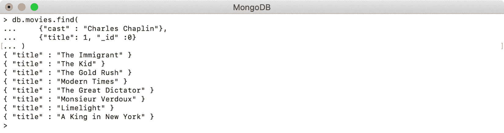

图 4.32：显示查理·卓别林主演电影的输出

如图所示，查理·卓别林一共出演了八部电影。接下来，您将使用 limit 函数将结果大小限制为`3`，如下所示：

```js
db.movies.find(
    {"cast" : "Charles Chaplin"}, 
    {"title": 1, "_id" :0}
).limit(3)
```

当执行此查询时，只返回三条记录：

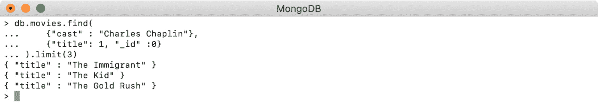

图 4.33：使用 limit()仅显示查理·卓别林主演的三部电影

让我们看看当与不同值一起使用时，`limit()`函数的行为。

当限制大小大于游标内实际记录时，将返回所有记录，而不管设置的限制如何。例如，以下查询将返回`8`条记录，即使将限制设置为`14`，因为游标中只有`8`条记录：

```js
db.movies.find(
    {"cast" : "Charles Chaplin"}, 
    {"title": 1, "_id" :0}
).limit(14)
```

上述查询的结果如下，显示查询已返回所有八条记录：

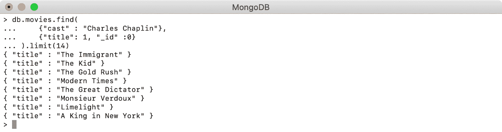

图 4.34：当限制设置为 14 时的输出

请注意，将限制设置为零相当于根本不设置任何限制。因此，以下查询将返回符合条件的所有八条记录：

```js
db.movies.find(
    {"cast" : "Charles Chaplin"}, 
    {"title": 1, "_id" :0}
).limit(0)
```

上述查询的输出如下：


图 4.35：当限制设置为 0 时的输出

现在，您是否想知道如果将限制大小设置为负数会发生什么？对于返回较小记录的查询，如我们的情况，负大小限制被视为等同于正数限制。以下查询演示了这一点：

```js
db.movies.find(
    {"cast" : "Charles Chaplin"}, 
    {"title": 1, "_id" :0}
).limit(-2)
```

当您执行此查询（在 mongo shell 上具有负限制-`2`），您应该获得以下输出：

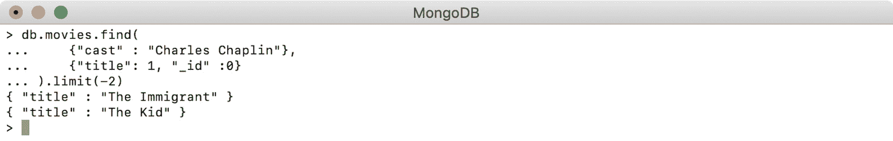

图 4.36：限制为-2 时的输出

输出显示，查询返回了两个文档，行为等同于使用大小为`2`的`limit`。然而，结果集的批处理大小可能会影响这种行为。下一节将详细探讨这一点。

## 限制和批处理大小

在 MongoDB 中执行查询时，结果以一个或多个批次的形式进行处理和返回。批次在内部分配，结果将一次性显示。批处理的主要目的之一是避免在处理大量记录集时发生高资源利用。

此外，它保持了客户端和服务器之间的连接活动，因此避免了超时错误。对于大型查询，当数据库需要更长时间来查找和返回结果时，客户端会一直等待。当等待的阈值达到一定值时，客户端和服务器之间的连接会断开，并且查询将因超时异常而失败。使用批处理可以避免这种超时，因为服务器会持续返回单个批次。

不同的 MongoDB 驱动程序可以有不同的批处理大小。然而，对于单个查询，可以设置批处理大小，如下面的代码片段所示：

```js
db.movies.find(
    {"cast" : "Charles Chaplin"}, 
    {"title": 1, "_id" :0}
).batchSize(5)
```

此查询在游标上使用了`batchSize()`函数，提供了批处理大小为`5`。执行此查询的输出如下：

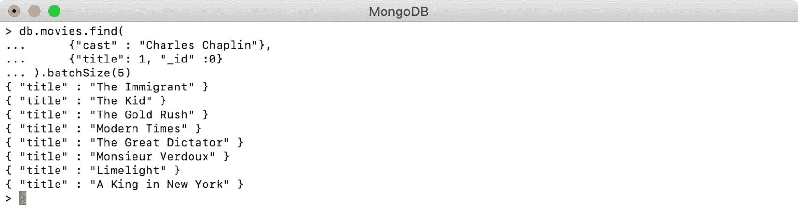

图 4.37：批处理大小为 5 时的输出

上述输出中的查询添加了批处理大小为`5`，但对输出没有影响。然而，结果的内部准备方式有所不同。

### 批处理大小的正限制

当执行上述查询时，指定了批处理大小为`5`，数据库开始查找符合给定条件的文档。一旦找到前五个文档，它们作为第一个批次返回给客户端。接下来，剩下的三条记录被找到并作为下一个批次返回。然而，对于用户来说，结果一次性打印出来，变化是不可察觉的。

当使用大于批处理大小的正限制执行查询时，记录在内部被分批获取时也会发生同样的情况：

```js
db.movies.find(
    {"cast" : "Charles Chaplin"}, 
    {"title": 1, "_id" :0}
).limit(7).batchSize(5)
```

此查询使用了大于提供的批处理大小`5`的限制`7`。当执行查询时，我们得到了预期的`7`条记录，没有任何显著变化。以下截图显示了输出：

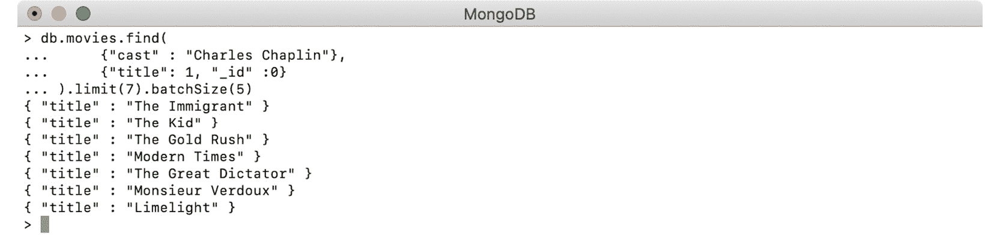

图 4.38：当限制为 7 且批处理大小为 5 时的输出

到目前为止，我们已经学会了如何在不指定限制的情况下执行批处理，然后指定正限制值。现在，我们将看看当使用负限制值时会发生什么，其正等效值大于给定的批处理大小。

### 负限制和批处理大小

正如我们在前面的例子中学到的，如果结果中的记录总数超过批处理大小，MongoDB 会使用批处理。然而，当我们使用负数来指定限制大小时，只有第一个批次会被返回，即使需要下一个批次也不会被处理。

我们将通过以下查询来演示这一点：

```js
db.movies.find(
    {"cast" : "Charles Chaplin"}, 
    {"title": 1, "_id" :0}
).limit(-7).batchSize(5)
```

此查询使用了负数`7`的限制和`5`的批处理大小，这意味着返回结果需要两个批次。为了观察这种行为，在 mongo shell 上执行此查询：

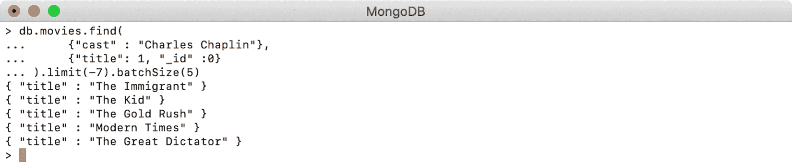

图 4.39：当限制为-7 且批处理大小为 5 时的输出

输出表明，查询只返回了前五条记录，而不是预期的七条记录。这是因为数据库只返回了第一个批次，而下一个批次没有被处理。

这证明了负限制并不完全等同于以正数形式提供数字。如果查询返回的记录数小于指定的批量大小，结果将是相同的。一般来说，应避免使用负限制，但如果使用了负限制，确保使用适当的批量大小，以避免这种情况。

## 跳过文档

跳过用于排除结果集中的一些文档并返回其余文档。MongoDB 游标提供了`skip()`函数，它接受一个整数，并从游标中跳过指定数量的文档，然后返回其余文档。在前面的示例中，您准备了查询，以查找查尔斯·卓别林主演的电影的标题。以下示例使用相同的查询和`skip()`函数：

```js
db.movies.find(
    {"cast" : "Charles Chaplin"}, 
    {"title": 1, "_id" :0}
).skip(2)
```

由于`skip()`函数已经提供了值`2`，所以前两个文档将被排除在输出之外，如下面的屏幕截图所示：

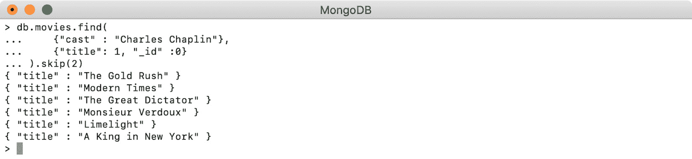

图 4.40：带有跳过值 2 的输出

与`limit()`类似，将零传递给`skip()`等同于根本不调用该函数，并且返回整个结果集。但是，`skip()`对于负数有不同的行为；它不允许使用负数。因此，以下查询是无效的：

```js
db.movies.find(
    {"cast" : "Charles Chaplin"}, 
    {"title": 1, "_id" :0}
).skip(-3)
```

当执行此查询时，将会收到错误提示，如下图所示：

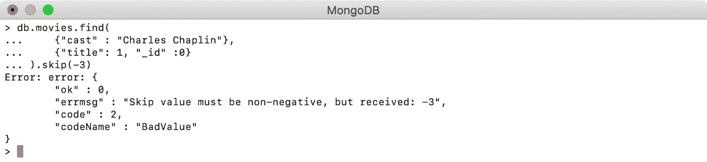

图 4.41：带有跳过值-3 的输出

`skip()`操作不使用任何索引，因此在较小的集合上表现良好，但在较大的集合上可能明显滞后。我们将在*第九章* *性能*中详细介绍索引的主题。

## 排序文档

排序用于按指定顺序返回文档。如果不使用显式排序，MongoDB 不保证以何种顺序返回文档，即使执行相同的查询两次，结果也可能不同。具有特定排序顺序在分页期间尤为重要。在分页期间，我们执行带有指定限制和服务的查询。对于下一个查询，跳过之前的记录，并返回下一个限制。在此过程中，如果记录的顺序发生变化，一些电影可能会出现在多个页面上，而一些电影可能根本不会出现。

MongoDB 游标提供了一个`sort()`函数，接受一个文档类型的参数，其中文档定义了特定字段的排序顺序。请参见以下查询，它打印出了查尔斯·卓别林的电影标题和排序选项：

```js
db.movies.find(
    {"cast" : "Charles Chaplin"}, 
    {"title" : 1, "_id" :0}
).sort({"title" : 1})
```

在上述查询中，您正在对结果游标调用`sort()`函数。函数的参数是一个文档，其中`title`字段的值为`1`。这指定给定字段应按升序排序。当查询在排序后执行时，结果如下所示：

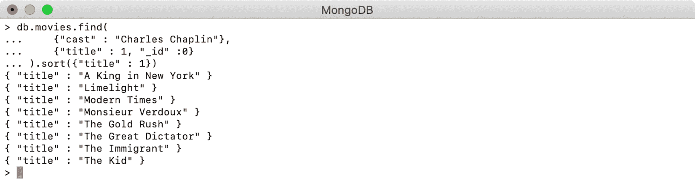

图 4.42：按升序排序

现在，将`-1`传递给`sort`参数，表示按降序排序：

```js
db.movies.find(
    {"cast" : "Charles Chaplin"}, 
    {"title" : 1, "_id" :0}
).sort({"title" : -1})
```

其输出如下：

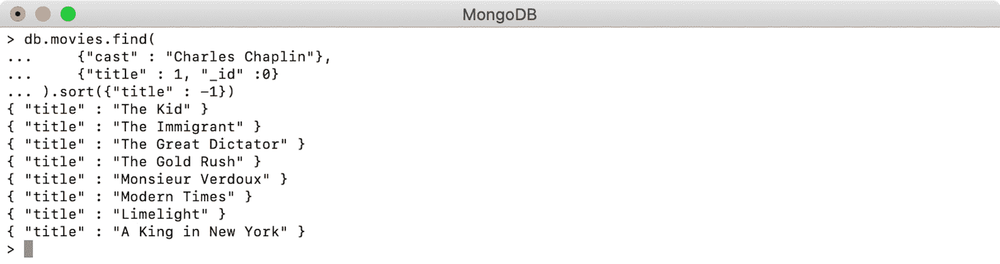

图 4.43：按降序排序

排序可以在多个字段上执行，并且每个字段可以有不同的排序顺序。让我们看一个例子，按照降序对电影的 IMDb 评分进行排序，按照升序对年份进行排序。查询应该返回 50 部电影，其中 IMDb 评分最高的电影出现在顶部。如果两部电影的评分相同，那么年份较早的电影应该优先。可以使用以下查询来实现这一点：

```js
db.movies.find()
    .limit(50)
    .sort({"imdb.rating": -1, "year" : 1})
```

在我们结束本节之前，值得注意的是，在 MongoDB 中，除了正整数或负整数之外的任何数字，包括零，都被视为无效的排序值。如果使用这样的值，查询将失败，我们会看到消息`"bad sort specification error"`，如下所示：

```js
Error: error: {
        "ok" : 0,
        "errmsg" : "bad sort specification",
        "code" : 2,
        "codeName" : "BadValue"
}
```

在下一个活动中，我们将运用本章学到的一切知识来实现基于流派的电影搜索的分页。

## 活动 4.01：按流派查找电影并分页显示结果

您的组织计划为用户提供一个新功能，他们将能够在他们喜爱的流派中找到电影。由于电影数据库庞大，每个流派都有大量电影，返回所有匹配的电影标题并不是非常有用。要求是以小块的方式提供结果。

您在此活动中的任务是在 mongo shell 上创建一个 JavaScript 函数。该函数应接受用户选择的流派，并打印所有匹配的标题，其中具有最高 IMDb 评分的标题应出现在顶部。除了流派，该函数还将接受另外两个参数，用于页面大小和页面编号。页面大小定义了一页上需要显示多少条记录，而页面编号表示用户当前所在的页面。以下步骤将帮助您完成此活动：

1.  编写一个`findMoviesByGenre`函数，接受三个参数：`genre`、`pageNumber`和`pageSize`：

```js
   var findMoviesByGenre = function(genre, pageNumber, pageSize){
      …
   }
```

1.  编写一个查询，根据`genre`过滤结果并返回标题。

1.  对结果进行排序，以显示评分最高的电影。

1.  使用`pageNumber`和`pageSize`参数跳过和限制结果的逻辑。

1.  使用`toArray()`方法将结果游标转换为数组。

1.  遍历结果数组并打印所有标题。

1.  通过将其复制粘贴到 shell 并执行，可以在 mongo shell 中创建该函数。

考虑用户提供的流派是`动作`。在这里，如下所示，执行函数并显示结果的第一页，显示前五部动作电影：


图 4.44：显示前五部动作电影的第一页

同样，下面的输出显示函数返回了第二页的五部动作电影：


图 4.45：动作电影的第二页

注意

此活动的解决方案可以通过此链接找到。

# 摘要

我们从详细研究了 MongoDB 查询的结构以及它们与 SQL 查询的不同之处开始了本章。然后，我们实现了这些查询来查找和计算文档，并使用各种示例限制返回结果中的字段数量。我们还学习了各种条件和逻辑运算符，并练习将它们结合使用以注意结果的差异。

然后，我们学习了如何使用正则表达式提供文本模式来过滤我们的搜索结果，并介绍了如何查询数组和嵌套对象，并在结果中包含它们的特定字段。最后，我们学习了如何通过在结果中对文档进行限制、排序和跳过来分页大型结果集。

在下一章中，我们将学习如何向 MongoDB 集合中插入、更新和删除文档。
