# 第五章：插入、更新和删除文档

概述

本章介绍了 MongoDB 中的核心操作，即在集合中插入、更新和删除文档。您将学习如何将单个文档或一批多个文档插入到 MongoDB 集合中。您将添加或自动生成一个`_id`字段，替换现有文档，并更新现有集合中文档的特定字段。最后，您将学习如何删除集合中的所有文档或特定文档。

# 介绍

在之前的章节中，我们涵盖了各种数据库命令和查询。我们学会了准备查询条件并使用它们来查找或计算匹配的文档。我们还学会了在字段、嵌套字段和数组上使用各种条件运算符、逻辑运算符和正则表达式。除此之外，我们还学会了如何格式化、跳过、限制和对结果集中的文档进行排序。

现在您已经知道如何正确地从集合中找到并表示所需的文档，下一步是学习如何修改集合中的文档。在任何数据库管理系统上工作时，您都将需要修改底层数据。想象一下：您正在管理我们的电影数据集，并经常需要在电影上映时向集合中添加新电影。您还需要永久删除一些电影或从数据库中删除错误插入的电影。随着时间的推移，一些电影可能会获得新的奖项、评论和评分。在这种情况下，您将需要修改现有电影的详细信息。

在本章中，您将学习如何在集合中创建、删除和更新文档。我们将首先创建新的集合，向集合中添加一个或多个文档，并考虑唯一主键的重要性。然后，我们将介绍如何从集合中删除所有或删除特定文档，以及 MongoDB 提供的各种删除函数及其特性。接下来，您将学习如何替换集合中的现有文档，并了解 MongoDB 如何保持主键不变。您还将了解如何使用替换操作执行更新或插入，也称为 upsert。最后，您将学习如何修改文档。MongoDB 提供了各种更新函数和广泛的更新运算符，可用于特定需求。我们将深入研究所有这些函数，并练习使用这些运算符。

# 插入文档

在本节中，您将学习如何向 MongoDB 集合中插入新文档。MongoDB 集合提供了一个名为`insert()`的函数，用于在集合中创建新文档。该函数在集合上执行，并将要插入的文档作为参数。该函数的语法如下命令所示：

```js
db.collection.insert( <Document To Be Inserted>)
```

要在示例中查看此内容，请打开 mongo Shell，连接到数据库集群，并使用`use CH05`命令创建一个新数据库。您可以根据自己的喜好给数据库取一个不同的名字。如果之前不存在该数据库，则该命令中提到的数据库将被创建。在以下操作中，我们正在插入一个带有`title`字段和`_id`的电影，并且输出将打印在下一行上：

```js
> db.new_movies.insert({"_id" : 1, "title" : "Dunkirk"})
WriteResult({ "nInserted" : 1 })
```

注意

在本章中，我们将在集合中插入、更新和删除大量文档，并且我们不希望损坏现有的`sample_mflix`数据集。因此，我们正在创建一个不同的数据库，并在整个章节中使用它。练习和活动侧重于真实场景，并因此将使用`sample_mflix`数据集。

这个 mongo shell 片段显示了`insert`命令的执行和下一行的结果。结果（`WriteResult`）显示成功插入了一条记录。首先执行一个`find()`查询，确认记录是否按我们的要求创建：

```js
> db.new_movies.find({"_id" : 1})
{ "_id" : 1, "title" : "Dunkirk" }
```

前面的查询及其输出验证了我们文档的正确插入。但是，请注意，`new_movies`集合从未存在，也没有我们创建它。文档去哪了呢？

为了找到它，您在 shell 上执行`show collections`命令。此命令打印当前数据库中所有集合的名称：

```js
> show collections
new_movies
```

前面的片段显示了一个名为`new_movies`的新集合被添加到数据库中。这证明了当执行`insert`命令时，如果该集合不存在，MongoDB 也会创建给定的集合。

注意

当插入新文档时，MongoDB 不会验证集合的名称。集合名称中的拼写错误将导致文档被添加到一个全新的集合中。此外，默认情况下，MongoDB 没有与集合关联的任何模式。因此，通过给出不正确的集合名称，您可能会意外地将您的文档添加到任何其他现有集合中，而 MongoDB 不会抱怨。这就是为什么您应该始终小心您的`insert`命令中的集合名称。

## 插入多个文档

当需要将多个文档插入到集合中时，可以多次调用在前一节中看到的`insert()`函数，如下所示：

```js
db.new_movies.insert({"_id": 2, "title": "Baby Driver"})
db.new_movies.insert({"_id": 3, "title": "title" : "Logan"})
db.new_movies.insert({"_id": 4, "title": "John Wick: Chapter 2"})
db.new_movies.insert({"_id": 5, "title": "A Ghost Story"})
```

MongoDB 集合还提供了`insertMany()`函数，这是一个专门用于向集合中插入多个文档的函数。如下面的语法所示，此函数接受一个包含一个或多个要插入的文档的数组作为参数：

```js
db.movies.insertMany(< Array of One or More Documents>)
```

要使用此函数，创建要插入的所有文档的数组，然后将此数组传递给函数。相同的四部电影的数组将如下所示：

```js
[
    {"_id" : 2, "title": "Baby Driver"},
    {"_id" : 3, "title": "Logan"},
    {"_id" : 4, "title": "John Wick: Chapter 2"},
    {"_id" : 5, "title": "A Ghost Story"}
]
```

现在，您将这四部新电影插入到集合中：

```js
db.new_movies.insertMany([
    {"_id" : 2, "title": "Baby Driver"},
    {"_id" : 3, "title": "Logan"},
    {"_id" : 4, "title": "John Wick: Chapter 2"},
    {"_id" : 5, "title": "A Ghost Story"}
])
```

前面的命令使用了`insertMany()`并将一个包含四部电影的数组传递给它。您可以在下图中看到结果：

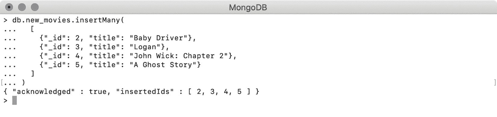

图 5.1：使用 insertMany()传递一个包含四部电影的数组

前面操作的结果包含两个内容。第一个字段是`acknowledged`，其值为`true`。这确认了写操作已成功执行。结果的第二个字段列出了所有插入文档的`IDs`。要插入多个文档，最好使用`insertMany()`函数，因为插入作为单个操作进行。另一方面，单独插入每个文档将作为多个不同的数据库命令执行，并且会使过程变慢。

注意

您可以使用`insertMany()`函数插入尽可能多的文档。但是，批处理大小不应超过 100,000。在 mongo shell 上，如果尝试在单个批处理中插入超过 100,000 个文档，查询将失败。如果使用编程语言做同样的事情，MongoDB 驱动程序将在内部将单个操作拆分为多个允许大小的批次，并执行批量插入。

## 插入重复的键

在任何数据库系统中，主键在表中始终是唯一的。同样，在 MongoDB 集合中，由`_id`字段表示的值是主键，因此必须是唯一的。如果尝试插入已经存在于集合中的键的文档，将会收到*重复键错误*。

在前面的示例中，我们已经插入了一个`_id`为`2`的电影。现在我们将尝试在另一个`insert`操作中复制主键：

```js
db.new_movies.insert({"_id" : 2, "title" : "Some other movie"})
```

此`insert`操作将一个虚拟电影插入到集合中，并明确将`_id`字段指定为`2`。当执行该命令时，我们会收到一个详细的重复键错误消息，如下图所示：

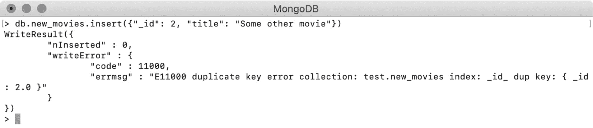

图 5.2：重复的 _id 字段的错误消息

同样，当给定数组中的一个或多个文档具有重复的`_id`时，批量插入操作将失败。例如，考虑以下代码片段：

```js
db.new_movies.insertMany([
    {"_id" : 6, "title" : "some movie 1"}, 
    {"_id" : 7, "title" : "some movie 2"},
    {"_id" : 2, "title" : "Movie with duplicate _id"},
    {"_id" : 8, "title" : "some movie 3"},
])
```

在这里，使用`insertMany()`操作，您将向集合中插入四部不同的电影。然而，第三部电影的`_id`为`2`，我们知道已经存在另一部具有相同`_id`的电影。这导致错误，如下图所示：

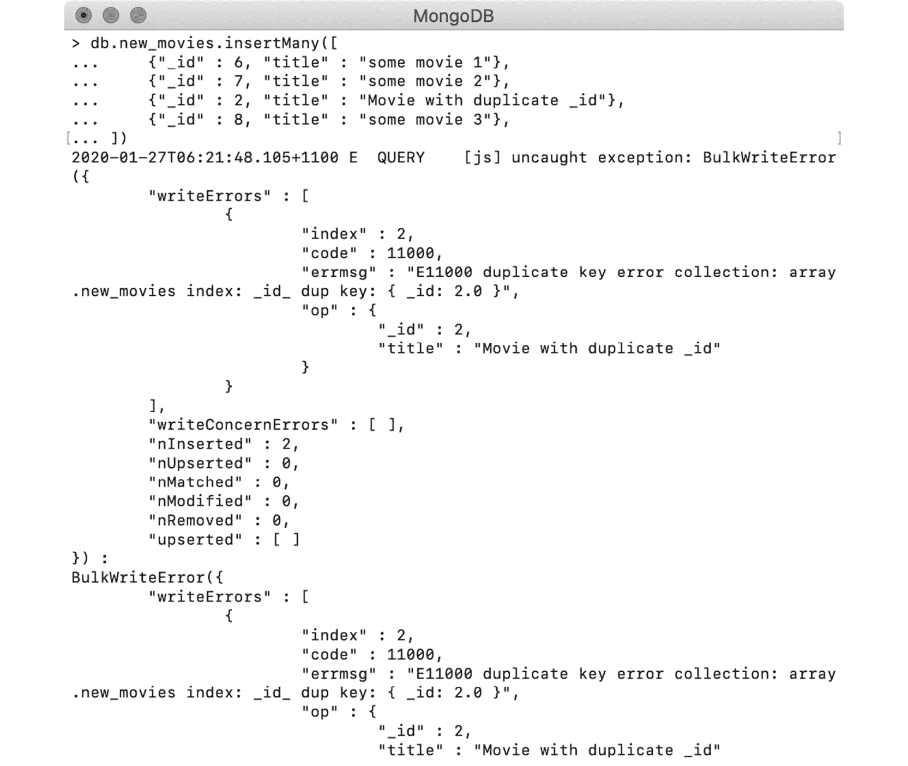

图 5.3：重复 _id 字段的错误消息

当您执行该命令时，它将失败并显示详细的错误消息。错误消息清楚地指出`_id`字段中的值`2`是重复的。然而，`nInserted`的值表明已成功插入了两个文档。为了确认这一点，您将查询数据库并观察输出：

```js
> db.new_movies.find({"_id" : {$in : [6, 7, 2, 8]}})
{ "_id" : 2, "title" : "Baby Driver" }
{ "_id" : 6, "title" : "some movie 1" }
{ "_id" : 7, "title" : "some movie 2" } 
```

从前面的`find()`命令及其输出中，我们可以得出结论，该命令在插入第三个文档时失败。然而，在第三个文档之前插入的文档将保留在数据库中。

## 没有 _id 的插入

到目前为止，我们已经学习了在集合中创建新文档的基础知识。在我们到目前为止展示的所有示例中，我们都明确添加了主键（`_id`字段）。然而，在*第二章*，*文档和数据类型*中，我们学到，在创建新文档时，MongoDB 会验证给定主键的存在和唯一性，如果主键尚不存在，数据库会自动生成它并将其添加到文档中。

以下是 mongo shell 中执行`insert`命令的代码片段。`insert`命令试图将新电影推送到集合中，但文档没有`_id`字段。下一行的结果显示，文档已成功创建在集合中：

```js
> db.new_movies.insert({"title": "Thelma"})
WriteResult({ "nInserted" : 1 })
```

现在，您查询新插入的文档，并查看它是否具有`_id`字段。为此，使用`title`字段的值查询集合：

```js
> db.new_movies.find({"title" : "Thelma"})
{ "_id" : ObjectId("5df6a0e1b32aea114de21834"), "title" : "Thelma" }
```

在前面的代码片段中，结果显示文档存在于集合中，并且自动生成的`_id`字段已添加到文档中。正如我们在*第二章*，*文档和数据类型*中学到的，自动生成的主键来自`ObjectId`构造函数，它是全局唯一的。对于批量插入也是如此。例如，考虑以下代码片段：

```js
db.new_movies.insertMany([
    {"_id" : 9, "title" : "movie_1"},
    {"_id" : 10, "title" : "movie_2"},
    {"title" : "movie_3"},
    {"_id" : 8, "title" : "movie_4"},
])
```

在这里，`insertMany()`命令将四部电影推送到集合中。在这四个新文档中，第三个文档没有主键；然而，其余的文档都有各自的主键。其结果如下所示：

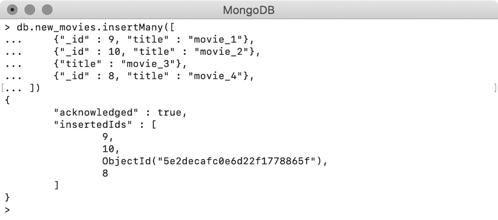

图 5.4：插入没有 _id 的电影

查询的输出表明查询成功，并且`insertedIds`字段显示除第三个文档外，所有文档都已使用给定的键插入，第三个文档获得了自动生成的主键。

在处理数据集时，我们的文档将具有可用作主键的唯一字段。主键是可以唯一标识记录的字段。MongoDB 自动生成的键在唯一性方面很有用，但在表示相应文档的数据方面是无意义的。此外，这些自动生成的键很长，因此输入或记住它们很麻烦。因此，我们应该始终尝试使用数据集中已经存在的主键。例如，在用户数据集中，`email_address`字段是主键的最佳示例。然而，在电影的情况下，没有可以是唯一的字段。因此，对于电影，我们可以使用自动生成的主键。

在本节中，我们介绍了如何在集合中创建单个文档和多个文档。在此过程中，我们了解到在 MongoDB 中，`insert`命令还会在不存在时创建底层集合。我们还了解到主键在集合中需要是唯一的，如果新文档没有主键，MongoDB 会自动生成并添加它。

# 删除文档

在本节中，我们将看到如何从集合中删除文档。要从集合中删除一个或多个文档，我们必须使用 MongoDB 提供的各种删除函数之一。每个函数都有不同的行为和目的。要从集合中删除文档，我们必须使用其中一个删除函数，并提供一个查询条件来指定应删除哪些文档。让我们详细看一下。

## 使用 deleteOne()删除

正如其名称所示，`deleteOne()`函数用于从集合中删除单个文档。它接受一个表示查询条件的文档。成功执行后，它返回一个包含删除的文档总数（由字段`deletedCount`表示）以及操作是否被确认（由字段`acknowledged`给出）的文档。然而，由于该方法只删除一个文档，`deletedCount`的值始终为 1。如果给定的查询条件在集合中匹配多个文档，只有第一个文档将被删除。

要查看这一点，请使用`deleteOne()`编写一个删除命令并查看结果：

```js
> db.new_movies.deleteOne({"_id": 2})
{ "acknowledged" : true, "deletedCount" : 1 }
```

在前面的代码片段中，您执行了`deleteOne()`命令，并传递了一个查询条件`{_id: 2}`。这意味着您要删除`_id`值为`2`的文档。下一行的输出表明删除成功删除了。

## 练习 5.01：删除多个匹配的文档中的一个

在这个练习中，您将使用一个匹配多个文档的查询，并验证当您这样做时只有第一个文档被删除。执行以下步骤完成这个练习：

1.  在查询中使用正则表达式，匹配所有`title`字段以单词`movie`开头的电影，如下所示：

```js
({"title" : {"$regex": "^movie"}}
```

mongo shell 中的以下片段显示，当您在`find()`查询中使用前面的查询条件时，您会得到四部电影：

```js
> db.new_movies.find({"title" : {"$regex": "^movie"}})
{ "_id" : 9, "title" : "movie_1" }
{ "_id" : 10, "title" : "movie_2" }
{ "_id" : ObjectId("5ef2666a6c3f28e14fddc816"), "title" : "movie_3" }
{ "_id" : 8, "title" : "movie_4" }
```

1.  使用相同的查询条件和`deleteOne()`来匹配所有标题以单词`movie`开头的电影：

```js
> db.new_movies.deleteOne({"title" : {"$regex": "^movie"}})
{ "acknowledged" : true, "deletedCount" : 1 }
```

这里的第二行输出确认只有一个文档成功删除。

1.  要找出哪个文档被删除了，请在您的集合上执行相同的`find()`查询：

```js
> db.new_movies.find({"title" : {"$regex": "^movie"}})
{ "_id" : 10, "title" : "movie_2" }
{ "_id" : ObjectId("5ef2666a6c3f28e14fddc816"), "title" : "movie_3" }
{ "_id" : 8, "title" : "movie_4" }
```

前面的片段证实，尽管所有四个文档都匹配了查询条件，但只有第一个文档被删除了。

## 使用 deleteMany()删除多个文档

为了删除符合给定条件的多个文档，您可以多次执行`deleteOne()`函数。然而，在这种情况下，每个文档将在单独的数据库命令中被删除，这可能会降低性能。MongoDB 集合提供了`deleteMany()`函数，可以在单个命令中删除多个文档。

`deleteMany()`函数必须提供一个查询条件，所有匹配给定查询的文档将被删除：

```js
> db.new_movies.deleteMany({"title" : {"$regex": "^movie"}})
{ "acknowledged" : true, "deletedCount" : 3 }
```

在上一个片段中的`deleteMany()`命令使用了前面示例中使用的相同的正则表达式。下一行的输出表明，所有标题以单词"movie"开头的三部电影都被删除了。

在匹配给定查询表达式的文档方面，这两个删除函数的行为与我们在上一章中看到的查找文档的行为类似。传递一个空的查询文档等同于不传递任何过滤器，因此所有文档都被匹配。

在以下示例中，这两个命令都被给予了一个空的查询文档：

```js
db.new_movies.deleteOne({})
db.new_movies.deleteMany({})
```

`deleteOne()`函数将删除找到的第一个文档。但是，`deleteMany()`函数将删除集合中的所有文档。同样，以下查询对不存在的字段执行**null**检查。在 MongoDB 中，不存在的字段被视为**null**，因此给定条件将匹配集合中的所有文档：

```js
db.new_movies.deleteOne({"non_existent_field" : null})
db.new_movies.deleteMany({"non_existent_field" : null})
```

注意

与查找文档不同，删除操作是`write`操作，并且会永久改变集合的状态。因此，在编写查询条件时，包括空值检查，您应该始终确保字段名称没有拼写错误。不正确的字段名称可能导致从集合中删除所有文档。

## 使用 findOneAndDelete()进行删除

除了我们之前看到的两种删除方法之外，还有另一个名为`findOneAndDelete()`的函数，正如其名称所示，它从集合中查找并删除一个文档。虽然它的行为类似于`deleteOne()`函数，但它提供了一些更多的选项：

+   它找到一个文档并将其删除。

+   如果找到多个文档，只有第一个会被删除。

+   一旦删除，它会将被删除的文档作为响应返回。

+   在多个文档匹配的情况下，可以使用`sort`选项来影响哪个文档被删除。

+   投影可以用来在响应中包含或排除文档中的字段。

在这里，使用`findOneAndDelete()`来删除一条记录，并将删除的文档作为响应获取：

```js
> db.new_movies.findOneAndDelete({"_id": 3})
{ "_id" : 3, "title" : "Logan" }
```

在上面的片段中，删除命令通过其`_id`找到一个文档。下一行的响应显示了被删除的文档。这是一个非常有用的功能。首先，因为它清楚地指示了匹配和删除的记录。其次，它允许您进一步处理已删除的记录。在某些情况下，您可能希望将记录存储在归档集合中，或者您可能希望通知其他系统进行此删除。如果查询匹配多个文档，只有第一个文档会被删除。但是，您可以使用选项对匹配的文档进行排序并控制哪个文档被删除，如下面的片段所示：

```js
db.new_movies.insertMany([
  { "_id" : 11, "title" : "movie_11" },
  { "_id" : 12, "title" : "movie_12" },
  { "_id" : 13, "title" : "movie_13" },
  { "_id" : 14, "title" : "movie_14" },
  { "_id" : 15, "title" : "series_15" }
])
```

使用上面的`insert`命令，您已经将五个新文档插入到您的集合中。在下面的片段中，您使用`findOneAndDelete()`命令，该命令使用正则表达式在集合中查找以单词`movie`开头的标题。查询将匹配四个文档；但是，您将按照降序排序`_id`字段，以便删除`_id`为 14 的文档：

```js
> db.new_movies.findOneAndDelete(
      {"title" : {"$regex" : "^movie"}},
      {sort : {"_id" : -1}}
  )
{ "_id" : 14, "title" : "movie_14" }
```

这个操作演示了排序选项如何影响被删除的文档。如果不提供排序选项，将会删除`_id`为 11 的文档。

正如我们所见，这个删除函数总是在响应中返回被删除的文档。我们还可以使用投影选项来控制响应中包含或排除的字段：

```js
> db.new_movies.findOneAndDelete(
      {"title" : {"$regex" : "^movie"}},
      {sort : {"_id" : -1}, projection : {"_id" : 0, "title" : 1}}
  )
{ "title" : "movie_13" }
```

在这个删除命令中，我们使用了投影选项，只在响应中包含`title`字段。下一行的输出确认了成功的删除，并且响应中的文档只显示了`title`字段。

## 练习 5.02：删除评分低的电影

您组织中的电影档案团队负责确保数据库中存在大多数评分最高的电影。为了改善用户体验，他们希望经常对数据库进行质量检查，并删除评分最低的电影。为了衡量质量，他们希望考虑 IMDb 评分和总投票数，因为投票数越高意味着评分更可靠。

基于此，他们要求您从低评分电影列表中删除一部 IMDb 投票数较高、平均评分较低且获奖最少的电影。您在本练习中的任务是连接到`sample_mflix`集群并执行删除命令，以便删除获奖最少、IMDb 评分低于 2 且投票超过 50,000 的电影。然后，记录已删除电影的`title`和`_id`。以下步骤将帮助您完成此练习：

1.  由于您需要删除一部电影，您可以使用`deleteOne()`或`findOneAndDelete()`函数，并使用 IMDb 评分和投票准备查询过滤器。但是，为了确保删除获奖最少的电影，您需要按获奖次数升序对电影进行排序，并让结果列表中的第一部电影被删除。这意味着您需要使用`findOneAndDelete()`。首先，打开任何文本编辑器并开始编写查询。首先编写查询过滤器。第一个条件是查找 IMDb 评分低于两分的电影：

```js
("imdb.rating" : {$lt : 2}}
```

IMDb 评分是一个嵌套字段；因此，您将使用点表示法访问该字段，然后使用`$lt`运算符编写条件。

1.  接下来，第二个条件表示 IMDb 投票的总数应超过 50,000。将此条件添加到您的查询中：

```js
("imdb.rating" : {$lt : 2}, "imdb.votes" : {$gt : 50000}}
```

第二个条件使用`$gt`运算符表示。

1.  现在，编写一个`findOneAndDelete()`函数，并将前面的查询添加到其中：

```js
db.movies.findOneAndDelete(
  {"imdb.rating" : {$lt : 2}, "imdb.votes" : {$gt : 50000}}
)
```

前面的命令将查找评分低于 2 星且投票超过 50,000 的电影，并删除第一个。但是，您还希望确保删除获奖最少的电影。

1.  要删除获奖最少的电影，请添加一个`sort`选项：

```js
db.movies.findOneAndDelete(
  {"imdb.rating" : {$lt : 2}, "imdb.votes" : {$gt : 50000}},
  {"sort" : {"awards.won" : 1}}
)
```

此命令将按获奖次数升序对筛选后的电影进行排序。

1.  现在，添加一个投影选项，仅返回已删除电影的`_id`和`title`字段：

```js
db.movies.findOneAndDelete(
  {"imdb.rating" : {$lt : 2},"imdb.votes" : {$gt : 50000}},
  {
    "sort" : {"awards.won":1},
    "projection" : {"title" : 1}
  }
)
```

前面的命令具有一个投影选项，其中明确包含了`title`字段。这意味着所有其他字段将被排除，而`_id`默认包含。

1.  最后，打开 mongo shell 并连接到 Atlas 集群。使用`sample_mflix`数据库并执行前面的命令。您应该看到以下输出：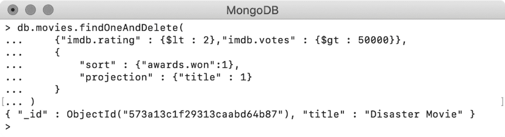

图 5.5：删除低评分电影

如前面的输出所示，命令已成功执行。响应中返回的文档正确包括已删除电影的`_id`和`title`。

在这个练习中，您使用了一个删除函数，正确地从电影的真实集合中删除了一个特定的记录。

# 替换文档

在本节中，您将学习如何完全替换集合中的文档。

有时，您可能希望替换集合中错误插入的文档。或者考虑到，通常，文档中存储的数据会随时间而改变。或者，为了支持产品的新要求，您可能希望更改文档的结构或更改文档中的字段。在所有这些情况下，您都需要替换文档。

在前一节中，我们使用了一个名为`CH05`的新数据库，我们将在本节中继续使用。在同一个数据库中，创建一个名为`users`的集合，并插入一些用户，如下所示：

```js
> db.users.insertMany([
  {"_id": 2, "name": "Jon Snow", "email": "Jon.Snow@got.es"},
  {"_id": 3, "name": "Joffrey Baratheon", "email":     "Joffrey.Baratheon@got.es"},
  {"_id": 5, "name": "Margaery Tyrell", "email":     "Margaery.Tyrell@got.es"},
  {"_id": 6, "name": "Khal Drogo", "email": "Khal.Drogo@got.es"}
])
{ "acknowledged" : true, "insertedIds" : [ 2, 3, 5, 6 ] }
```

您可以看到命令执行成功，并添加了四个用户。在继续之前，快速使用`find()`命令确保集合中除了新插入的文档之外没有其他文档：

```js
> db.users.find()
{ "_id" : 2, "name" : "Jon Snow", "email" : "Jon.Snow@got.es" }
{ "_id" : 3, "name" : "Joffrey Baratheon", "email" :   "Joffrey.Baratheon@got.es" }
{ "_id" : 5, "name" : "Margaery Tyrell", "email" :   "Margaery.Tyrell@got.es" }
{ "_id" : 6, "name" : "Khal Drogo", "email" : "Khal.Drogo@got.es" }
```

在前面片段的文档中，每个用户都有一个唯一的 ID、姓名和电子邮件地址。现在，假设用户`Margaery Tyrell`与`Joffrey Baratheon`结婚，并且她希望将姓氏改为丈夫的姓氏。为了实现这一点，您需要更改她的姓名以及她的电子邮件。

根据要求，`Margaery Tyrell`的新记录应如下所示：

```js
{"_id": 5, "name": "Margaery Baratheon", "email": "Margaery.Baratheon@got.es"}
```

要替换集合中的单个文档，MongoDB 提供了`replaceOne()`方法，该方法接受查询过滤器和替换文档。该函数找到与条件匹配的文档，并用提供的文档替换它。以下示例演示了这一点：

```js
> db.users.replaceOne(
  {"_id" : 5},
  {"name": "Margaery Baratheon", "email": "Margaery.Baratheon@got.es"}
)
{ "acknowledged" : true, "matchedCount" : 1, "modifiedCount" : 1 }
```

在这里，第一个参数是查询过滤器，用于识别要替换的文档，第二个参数是新文档。输出清楚地表明给定的查询匹配了一个文档，并且更新了一个文档。查询过滤器不一定总是`_id`字段。它可以是使用任何字段或多个字段和运算符进行过滤的任何查询。例如，以下替换命令将产生与前一个相同的效果，只要只有一个名为`Margaery Tyrell`的用户。如果有多个文档与查询匹配，则只有第一个文档将被替换：

```js
db.users.replaceOne(
  {"name": "Margaery Tyrell },
  {"name": "Margaery Baratheon", "email": "Margaery.Baratheon@got.es"}
)
```

### _id 字段是不可变的

在上一个例子中，您会注意到替换文档中没有`_id`字段。在这种情况下，您认为 MongoDB 一定会添加并自动生成一个主键字段吗？查询文档并找出：

```js
> db.users.find({"name" : "Margaery Baratheon"})
{"_id": 5, "name": "Margaery Baratheon", "email":   "Margaery.Baratheon@got.es" }
```

前面的输出表明原始文档的`_id`在新文档中保留了下来。

这是因为 MongoDB 中的`_id`字段是不可变的。不可变字段就像普通字段一样；但是，一旦赋予了一个值，它们的值就不能再次更改。`_id`字段用作文档的唯一标识符，因此只要文档存在，就不应更改它。

这类似于您在各种在线门户网站上创建的用户帐户，其中您的用户名是您的唯一标识符。您可以更改密码，或者在您的个人资料中更改任何其他信息，但是大多数门户网站不允许您更改用户名。即使他们允许您修改用户名，旧用户名也不能分配给任何人，因为可能还有人知道您的旧用户名。

这就是为什么 MongoDB 中的`_id`字段是不可变的理论。然而，尝试修改该字段并观察会发生什么：

```js
db.users.replaceOne(
  {"name" : "Margaery Baratheon"},
  {"_id": 9, "name": "Margaery Baratheon", "email":     "Margaery.Baratheon@got.es"}
)
```

在这里，替换命令找到了一个名为`Margaery Baratheon`的文档。在替换文档中，它还为`_id`字段提供了一个新值：

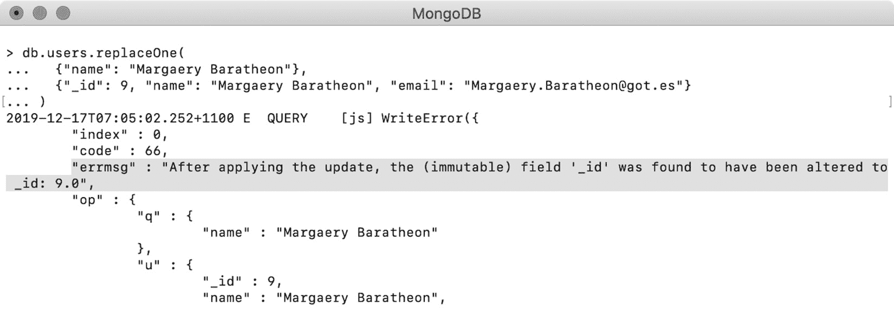

图 5.6：修改 _id 时出错

在这个例子中，您执行了一个替换命令，如前面片段所示，替换文档现在有一个显式的`_id`字段。命令失败，并显示了一个非常详细的错误消息。前面的快照突出了错误消息的最重要部分，表明该字段是不可变的。因此，更新被回滚，记录没有发生任何变化。

## 使用替换进行 Upsert

在前面的章节中，我们学到了可以在集合中找到现有文档并用新文档替换它。然而，有时您希望用新文档替换现有文档，并且如果文档尚不存在，则插入新文档。这个操作称为更新（如果找到）或插入（如果找不到），进一步缩短为 upsert。Upsert 是许多数据库提供的功能，MongoDB 也支持它。

### 为什么使用 Upsert？

对于我们上面看到的简单场景，upsert 听起来有点不必要，尤其是当可以使用两个不同的命令轻松执行相同的操作时。例如，我们可以先执行一个替换命令并检查结果。匹配计数的值将告诉我们文档是否在集合中找到。如果没有找到文档，我们可以执行一个`insert`命令。

然而，在现实场景中，您大多数情况下会执行大量的这些操作。考虑到您的系统每天从用户服务器接收到更新，服务器会发送当天修改的所有文档。这些每日更新可能包括新用户在服务器上注册的记录，以及对现有用户配置文件的更改。在大规模系统上，为每条记录执行两步更新或插入操作将非常耗时且容易出错。然而，有了专门的命令，您可以简单地准备并执行每条记录的 upsert 命令，让 MongoDB 执行更新或插入。

考虑`users`集合中的以下记录：

```js
> db.users.find()
{"_id": 2, "name": "Jon Snow", "email": "Jon.Snow@got.es"}
{"_id": 3, "name": "Joffrey Baratheon", "email":   "Joffrey.Baratheon@got.es"}
{"_id": 5, "name": "Margaery Baratheon", "email":   "Margaery.Baratheon@got.es"}
{"_id": 6, "name": "Khal Drogo", "email": "Khal.Drogo@got.es"}
```

在一集的结尾，乔佛里国王被杀害。因此，`Margaery`想要恢复她的旧姓，而`Tommen Baratheon`成为新国王。您从用户服务器接收到的更新包含了`Margaery`的更新记录和`Tommen`的新记录，如下所示：

```js
{"name": "Margaery Tyrell", "email": "Margaery.Tyrell@got.es"}
{"name": "Tommen Baratheon", "email": "Tommen.Baratheon@got.es"}
```

在以下命令中，您传递了一个额外的参数`{upsert: true}`，这使这些命令成为 upsert 命令：

```js
db.users.replaceOne(
  {"name" : "Margaery Baratheon"},
  {"name": "Margaery Tyrell", "email": "Margaery.Tyrell@got.es"},
  { upsert: true }
)
db.users.replaceOne(
  {"name" : "Tommen Baratheon"},
  {"name": "Tommen Baratheon", "email": "Tommen.Baratheon@got.es"},
  { upsert: true }
)
```

当您在 mongo shell 上依次执行这些命令时，您会看到以下输出：

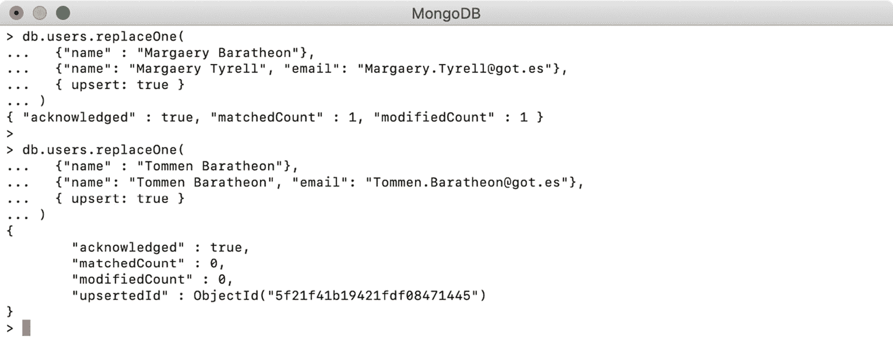

图 5.7：upsert 操作的输出

第一个 upsert 的结果表明找到了匹配项，并且文档已被更新。然而，第二个表明未找到匹配项，并且使用自动生成的主键进行了新文档的 upsert。

## 使用 findOneAndReplace()进行替换

我们已经看到了`replaceOne()`函数，成功执行后返回匹配和更新的文档计数。MongoDB 提供了另一个操作`findOneAndReplace()`来执行相同的操作。但是，它提供了更多选项。其主要特点如下：

+   顾名思义，它找到一个文档并替换它。

+   如果找到多个与查询匹配的文档，第一个将被替换。

+   可以使用排序选项来影响匹配多个文档时哪个文档被替换。

+   默认情况下，它返回原始文档。

+   如果设置了`{returnNewDocument: true}`选项，新添加的文档将被返回。

+   字段投影可用于在响应中只包含特定字段的文档。

要查看`findOneAndReplace()`函数的操作，请向电影集合添加五个文档：

```js
db.movies.insertMany([
    { "_id": 1011, "title" : "Macbeth" },
    { "_id": 1513, "title" : "Macbeth" },
    { "_id": 1651, "title" : "Macbeth" },
    { "_id": 1819, "title" : "Macbeth" },
    { "_id": 2117, "title" : "Macbeth" }
])
```

现在，假设这五部电影都具有相同的`title`，并且在不同的日历年份发布和插入。当这些记录最初插入时，发布年份的字段尚未添加。因此，要找到具有此`title`的最新电影，您需要使用递增的`_id`字段，其中具有最大`_id`值的电影是最新的。为了使未来的查找查询更简单，您已被指示找到具有此`title`的最新电影的文档，并向该文档添加`latest: true`标志。因此，当有人尝试查找该电影时，他们可以传递此附加过滤器以获取响应中的最新电影，如下所示：

```js
db.movies.findOneAndReplace(
    {"title" : "Macbeth"},
    {"title" : "Macbeth", "latest" : true},
    {
        sort : {"_id" : -1},
        projection : {"_id" : 0}
    }
)
```

在上面的片段中，您通过`title`找到了一部电影的文档，并用包含额外字段`latest: true`的另一个文档替换了它。除此��外，该命令使用了`sort`选项，以便具有最大值`_id`的记录出现在顶部。该命令还使用了投影选项，只在响应中包含`title`字段。输出如下：

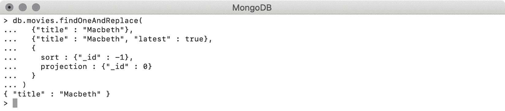

图 5.8：findOneAndReplace 命令的输出

上述快照确认了操作成功，并且旧文档的`title`包含在响应中。或者，如果需要在响应中获取更新后的文档，可以使用命令中的`returnNewDocument`标志。将此标志设置为 true 将从集合中返回替换后的文档，如下所示：

```js
db.movies.findOneAndReplace(
    {"title" : "Macbeth"},
    {"title" : "Macbeth", "latest" : true},
    {
        sort : {"_id" : -1},
        projection : {"_id" : 0},
        returnNewDocument : true
    }
)
```

这个替换命令与之前的命令类似，唯一的区别是它使用了一个额外的`returnNewDocument`选项，该选项设置为`true`。

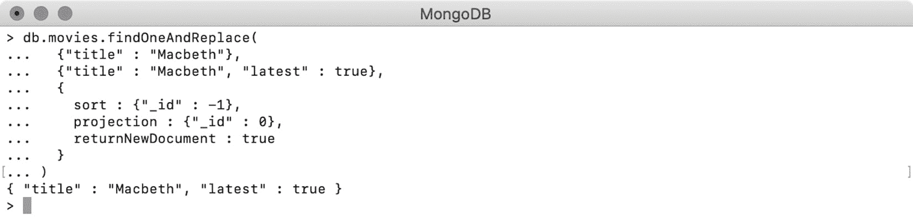

图 5.9：设置 returnNewDocument 为 true 后的输出

该输出显示，将`returnNewDocument`标志设置为`true`会返回新文档。现在，快速查询数据库，看看替换命令是否真的起作用：

```js
> db.movies.find({"title" : "Macbeth"})
{ "_id" : 1011, "title" : "Macbeth" }
{ "_id" : 1513, "title" : "Macbeth" }
{ "_id" : 1651, "title" : "Macbeth" }
{ "_id" : 1819, "title" : "Macbeth" }
{ "_id" : 2117, "title" : "Macbeth", "latest" : true }
```

上述输出显示，最新的记录现在具有所需的标志。

## 替换与删除和重新插入

正如我们在前面的部分中所看到的，有专门的函数来查找和替换集合中的文档。可以使用删除和插入的组合来替换文档，其中您删除一个现有文档并插入一个新文档。删除和`insert`组合的这两步操作会给您相同的结果；让我们看看如何操作。

要使用删除和`insert`进行两步替换操作，请使用在`findOneAndReplace()`部分中看到的相同示例。

首先，从集合中删除所有先前插入或修改的文档：

```js
> db.movies.deleteMany({})
{ "acknowledged" : true, "deletedCount" : 5 }
```

现在，再次插入这五个文档：

```js
db.movies.insertMany([
    { "_id": 1011, "title" : "Macbeth" },
    { "_id": 1513, "title" : "Macbeth" },
    { "_id": 1651, "title" : "Macbeth" },
    { "_id": 1819, "title" : "Macbeth" },
    { "_id": 2117, "title" : "Macbeth" }
])
```

现在，找到标题为`Macbeth`的最新电影的文档，并为其添加标志`"latest" : true`：

```js
var deletedDocument = db.movies.findOneAndDelete(
                          {"title" : "Macbeth"},
                          {sort : {"_id" : -1}}
    )
db.movies.insert(
  {"_id" : deletedDocument._id, "title" : "Macbeth", "latest" : true}
)
```

这个片段显示了两个不同的命令。第一个是`findOneAndDelete()`命令，它通过`title`找到一部电影，并使用排序选项，以便只删除具有最大`_id`的电影。删除操作的结果，即已删除的文档，存储在`deletedDocument`的变量中。

上述片段中的下一个命令是一个插入操作，它重新插入了相同的电影，并使用了`latest : true`标志。在这样做的同时，它使用了已删除文档的`_id`值，以便新记录使用相同的主键进行插入：

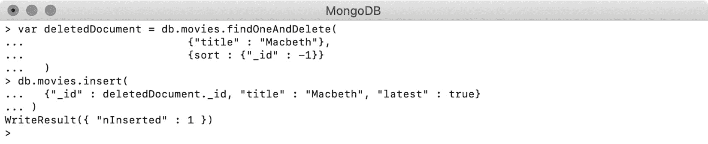

图 5.10：删除后插入的输出

上述输出表明您已经按顺序执行了两个命令，响应显示成功插入了一个文档，可以使用`find`操作进行验证：

```js
> db.movies.find()
{ "_id" : 1011, "title" : "Macbeth" }
{ "_id" : 1513, "title" : "Macbeth" }
{ "_id" : 1651, "title" : "Macbeth" }
{ "_id" : 1819, "title" : "Macbeth" }
{ "_id" : 2117, "title" : "Macbeth", "latest" : true }
```

对集合进行`find`操作的结果确认了两步替换操作完美地起作用。

尽管结果完全相同，两步操作更容易出错。两步操作执行两个完全不同的命令，一个接着一个。在第一个命令中，您的 MongoDB 客户端或编程语言的驱动程序将`delete`命令发送到服务器。然后服务器验证和处理命令以删除文档。然后已删除的文档通过网络发送回客户端。客户端或驱动程序然后将返回的结果解析为特定于语言的对象。在我们的情况下，我们正在从 mongo shell 执行命令，因此结果被解析为 JSON 格式并存储在变量`deleteDocument`中。

接下来，您的 MongoDB 客户端或驱动程序发送另一个命令来插入新文档。新文档，在我们的情况下是 JSON 格式，被转换为 BSON 并通过网络发送到服务器。对于 MongoDB 服务器，这个`insert`命令就像任何其他新的`insert`命令一样。服务器对文档进行初始验证，检查`_id`字段是否存在，并验证集合中值的唯一性。如果文档被发现有效，插入将会发生。

现在您已经熟悉了两步替换操作的细节，请考虑在使用它时可能存在的以下潜在缺陷：

1.  首先，在删除和插入方法中，数据会多次通过网络传输。这需要驱动程序或客户端在多个阶段解析数据。这将减慢整体性能。

1.  当多个客户端不断读取和写入您的集合时，可能会出现并发问题。例如，假设您已成功删除了一条记录，在插入新记录之前，某个其他客户端意外地插入了一个具有相同`_id`的不同记录。

1.  您的数据库客户端或驱动程序可能在两个操作之间失去与数据库的连接。例如，删除操作成功，但插入无法进行。为了避免这种问题，您将不得不在事务中运行您的命令，以便一个操作的失败可以撤销同一事务中先前成功的操作。

另一方面，专用替换函数实际上是原子的，因此在并发环境中使用是安全的。原子操作是不能进一步分割的最小操作单位。因此，当执行原子操作时，它将作为单个单元一次性执行。因此，与删除和插入组合相比，专用替换函数更安全。

专用函数首先找到要替换的文档并锁定它。锁定只有在操作完成后才会释放。因此，在锁定文档时，没有其他客户端或进程能够修改该特定文档。此外，替换操作仅替换文档中其余的字段，保持`_id`不变。其他进程不可能能够推送具有相同`_id`值的不同文档。

因此，最好始终使用 MongoDB 提供的专用函数。

# 修改字段

在前面的部分，我们学到了一旦插入，就可以替换 MongoDB 集合中的任何文档。在替换操作期间，数据库中的文档将被完全新的文档替换，同时保留相同的主键。替换操作在纠正错误和合并数据更改或更新时非常有用。然而，在大多数情况下，更新只会影响文档的一个或几个字段。想象一下`sample_mflix`数据集中的任何电影记录，其中大多数字段（如标题、演员、导演、时长等）可能永远不会改变。然而，随着时间的推移，电影可能会收到新的评论、新的评价和评分。

查找和替换操作在所有或大多数文档字段被修改时非常有用。但是，使用它来更新文档中的特定字段将不容易。为此，您提供的替换文档将需要具有所有未更改字段及其现有值以及更改字段及其新值。对于较小的文档，这听起来不像是问题，但对于大型文档，比如我们的电影记录，命令将变得臃肿且容易出错。我们将通过一个我们不会在数据库上执行的命令的示例来看到这一点。

假设数据库中添加了一部电影的记录，但字段`year`的值不正确。以下是使用替换操作来更正该值的命令的示例。在第一条语句中，我们找到电影文档并将其分配给一个变量。接下来是实际的替换命令，其中需要提供具有所有字段的替换文档。我们使用在第一行中分配的变量`movie`，并引用其所有未更改的字段。替换文档中的最后一个字段是`year`字段，其具有新值：

```js
// Find the movie and assign it to a variable
var movie = db.movies.findOne({"title" : "The Italian"})
// A replace function that keeps all the fields same except "year"
db.movies.replaceOne(
  {"title" : "The Italian"},
  {
    "plot" : movie.plot,
    "genres" : movie.genres,
    "runtime" : movie.runtime,
    "rated" : movie.rated,
    "cast" : movie.cast,
    "title" : movie.title,
    "fullplot" : movie.fullplot,
    "language" : movie.language,
    "released" : movie.released,
    "directors" : movie.directors,
    "writers" : movie.writers,
    "awards" : movie.awards,
    "imdb" : movie.imdb,
    "countries" : movie.countries,
    "type" : movie.type,
    "tomatoes" : movie.tomatoes,
    "year" : 1915
  }
)
```

该命令的问题在于它太庞大了，特别是因为我们只想要更新一个字段。它重新输入了所有字段，即使它们没有改变，而且在重新分配未更改的字段值时很可能会引入拼写错误。此外，这是一个两步操作，引入了难以调试的并发问题。

要理解并发问题，想象一下第一条语句中的查找操作成功，下一条语句是一个替换命令，引用了现有文档中所有未更改的字段；但在第二条语句执行之前，数据库中的实际文档被其他客户端或线程修改了。一旦您的语句执行，其他客户端添加的更新将永远丢失。

这就是为什么替换操作应该仅在修改所有或大部分字段时使用。要修改文档的一个或只有几个字段，MongoDB 提供了`update`命令。让我们在下一节中探讨这个问题。

## 使用`updateOne()`更新文档

要更新集合中单个文档的字段，我们可以使用`updateOne()`函数。这个函数由 MongoDB 集合提供，接受一个查询条件来找到要更新的记录，以及一个指定字段级更新表达式的文档。函数的第三个参数是提供杂项选项的，是可选的。这个函数的语法如下：

```js
db.collection.updateOne(<query condition>,   <update expression>, <options>)
```

与替换命令一样，`updateOne()`不能用于更新文档的`_id`字段，因为它是不可变的。更新执行后，它以文档的形式返回详细结果，指示匹配了多少条记录以及更新了多少条记录。

在使用此功能之前，首先从集合中删除所有先前插入和修改的记录：

```js
> db.movies.deleteMany({})
{ "acknowledged" : true, "deletedCount" : 5 }
```

现在，使用以下`insert`命令向集合添加四条新记录：

```js
> db.movies.insertMany([
  {"_id": 1, "title": "Macbeth", "year": 2014, "type": "series"}, 
  {"_id": 2, "title": "Inside Out", "year": 2015,     "type": "movie", "num_mflix_comments": 1},
  {"_id": 3, "title": "The Martian", "year": 2015,     "type": "movie", "num_mflix_comments": 1},
  {"_id": 4, "title": "Everest", "year": 2015,     "type": "movie", "num_mflix_comments": 1}
])
{ "acknowledged" : true, "insertedIds" : [ 1, 2, 3, 4 ] }
```

编写并执行第一个更新命令以更改电影`Macbeth`的`year`字段：

```js
db.movies.updateOne(
    {"title" : "Macbeth"},
    {$set : {"year" : 2015}}
)
```

在上述命令中，`updateOne()`函数的第一个参数是查询条件，其中您指定电影的名称应为`Macbeth`。第二个参数是一个指定`year`字段及其值的文档。在这里，我们使用了一个新的运算符`$set`，来为文档中提供的字段赋值。在接下来的章节中，我们将学习更多关于`$set`运算符以及所有更新函数支持的其他运算符。

当在 mongo shell 上执行该命令时，输出如下：

```js
> db.movies.updateOne(
  {"title" : "Macbeth"},
  {$set : {"year" : 2015}}
)
{ "acknowledged" : true, "matchedCount" : 1, "modifiedCount" : 1 }
```

输出是一个表示以下内容的文档：

+   `"acknowledged" : true` 表示更新已执行并已确认。

+   `"matchedCount" : 1` 显示找到并选择进行更新的文档数量（在这种情况下为 1）。

+   `"modifiedCount" : 1` 指的是修改的文档数量（在这种情况下为 1）。

以下查询和随后的输出确认了更新命令的正确执行：

```js
> db.movies.find({"title" : "Macbeth"})
{ "_id" : 1, "title" : "Macbeth", "year" : 2015, "type" : "series" }
```

在上述记录中，字段`year`正确设置为`2015`，之前是`2014`。如果我们再次执行相同的命令，由于值已经是`2015`，不会执行更新：

```js
> db.movies.updateOne(
    {"title" : "Macbeth"},
    {$set : {"year" : 2015}}
)
{ "acknowledged" : true, "matchedCount" : 1, "modifiedCount" : 0 }
```

*图 5.12*显示了再次执行相同更新命令的输出。结果文档表明有一个文档符合更新的条件，但是没有文档被更新。

### 修改多个字段

我们用来更新文档字段的`$set`运算符也可以用来修改文档的多个字段。如前面的例子所示，`$set`后面跟着包含更新表达式的文档。同样，要修改多个字段，更新表达式可以包含多个字段和值对。例如，考虑以下代码片段：

```js
db.movies.updateOne(
  {"title" : "Macbeth"},
  {$set : {"type" : "movie", "num_mflix_comments" : 1}}
)
```

在前面的操作中，更新表达式`{"type": "movie", "num_mflix_comments": 1}}`指定了两个字段及其值。其中，`num_mflix_comment`字段在相应的电影中不存在。在我们的电影集合上执行该命令并查看输出：

```js
> db.movies.updateOne(
  {"title" : "Macbeth"},
  {$set : {"type" : "movie", "num_mflix_comments" : 1}}
)
{ "acknowledged" : true, "matchedCount" : 1, "modifiedCount" : 1 }
```

前面的图表显示该操作成功，并且一个记录按预期被修改。现在查询文档并查看字段是否被正确修改：

```js
> db.movies.find({"title" : "Macbeth"}).pretty()
{
  "_id" : 1,
  "title" : "Macbeth",
  "year" : 2015,
  "type" : "movie",
  "num_mflix_comments" : 1
}
```

集合中的文档表明电影类型已经正确修改，并且添加了一个名为`num_mflix_comments`的新字段，其给定值。因此，您已经看到`$set`可以用于在同一命令中更新多个字段，如果字段是新的，它将被添加到文档中并指定值。

在我们继续下一节之前，重要的是要知道，在更新操作中，多次更新相同字段是有效的，无论字段的值如何。如前面的输出所示，电影`Macbeth`的`year`字段设置为 2015。在同一命令中多次修改相同字段：

```js
db.movies.updateOne(
  {"title" : "Macbeth"},
  {$set : {"year" : 2015, "year" : 2015, "year" : 2016, "year" : 2017}}
)
```

前面的更新命令使用了`$set`运算符，多次设置了年份。前两个表达式将字段设置为其当前值；然而，最后两个表达式具有不同的值。执行该命令并观察行为：

```js
db.movies.updateOne(
  {"title" : "Macbeth"},
  {$set : {"year" : 2015, "year" : 2015, "year" : 2016, "year" : 2017}}
)
{ "acknowledged" : true, "matchedCount" : 1, "modifiedCount" : 1 }
```

正如预期的那样，该操作是有效的，并且一个文档被修改。查询集合中的文档并查看`year`字段的值：

```js
> db.movies.find({"title" : "Macbeth"}).pretty()
{
  "_id" : 1,
  "title" : "Macbeth",
  "year" : 2017,
  "type" : "movie",
  "num_mflix_comments" : 1
}
```

在前面的输出中，我们证明了当同一字段多次提供时，更新是从左到右进行的。首先，`year`字段（已经是 2015）被设置为 2015 两次；然后，通过第三个表达式，年份被设置为 2016；最后，通过最右边的表达式，它被设置为 2017。

在任何有效的情况下，您几乎不会在更新操作中两次更新字段。但是，即使您这样做，也许是意外的，现在您已经了解了行为，这将帮助您进行调试。

### 匹配条件的多个文档

正如`updateOne()`函数的名称所示，它总是只更新集合中的一个文档。如果给定的查询条件匹配多个文档，只有第一个文档将被修改：

```js
db.movies.updateOne(
  {"type" : "movie"},
  {$set : {"flag" : "modified"}}
)
```

前面的操作找到`type`为`movie`的文档，并将`flag`的值设置为`modified`。请记住，我们的电影集合中共有三个`movie`类型的文档。当该命令在我们的集合上执行时，结果将如下所示：

```js
db.movies.updateOne(
  {"type" : "movie"},
  {$set : {"flag" : "modified"}}
)
{ "acknowledged" : true, "matchedCount" : 1, "modifiedCount" : 1 }
```

执行结果表明有一个文档匹配并被选择进行更新，实际上有一个文档被修改。因此，这证明即使有多个文档匹配给定的查询条件，也只选择并更新一个文档。

### 使用 updateOne()进行 upsert

在前面的部分中，我们详细了解了 upsert 操作。当执行基于 upsert 的更新时，如果找到文档，将对其进行更新；但是，如果未找到文档，则在集合中创建一个新文档。与替换操作类似，`updateOne()`还支持在命令中使用附加标志进行 upsert。考虑以下代码片段：

```js
db.movies.updateOne(
  {"title" : "Sicario"},
  {$set : {"year" : 2015}}
)
```

前面的操作在电影`Sicario`上执行了更新命令，该电影在我们的集合中不存在。当没有任何`upsert`标志的情况下执行该命令时，不会进行更新：

```js
> db.movies.updateOne(
  {"title" : "Sicario"},
  {$set : {"year" : 2015}}
)
{ "acknowledged" : true, "matchedCount" : 0, "modifiedCount" : 0 }
```

输出表明没有匹配的文档，也没有更新的文档。现在，我们将使用`upsert`标志执行相同的命令：

```js
db.movies.updateOne(
  {"title" : "Sicario"},
  {$set : {"year" : 2015}},
  {"upsert" : true}
)
```

前面的操作使用了第三个参数，其中包含一个将`upsert`标志设置为`true`的文档，默认为 false。输出如下所示：

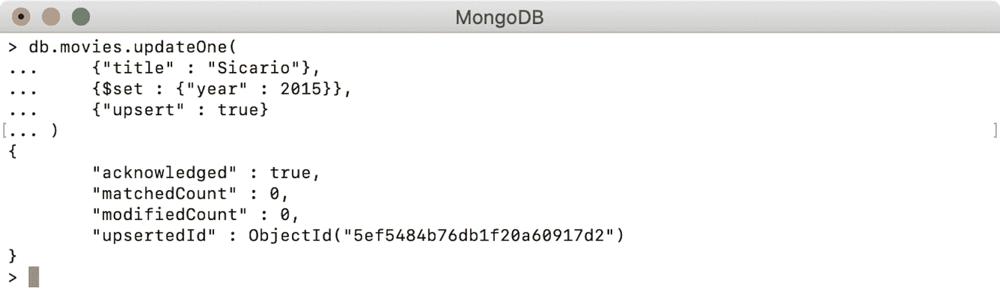

图 5.11：使用 upsert 标志更新不存在的电影

因此，执行命令的输出这次略有不同。它指示没有匹配的文档，也没有更新的文档。然而，`"upsertedId" : ObjectId("5e…")`表明插入了一个带有自动生成的主键的文档。

以下查询使用自动生成的主键找到文档。当您在 shell 上执行此查询时，您将需要使用在上一个命令中生成的`ObjectId`：

```js
> db.movies.find({"_id" : ObjectId("5ef5484b76db1f20a60917d2")}).pretty()
{
  "_id" : ObjectId("5ef5484b76db1f20a60917d2"),
  "title" : "Sicario",
  "year" : 2015
}
```

当我们使用新创建的主键值查询集合时，我们得到了新插入的记录。

这里需要注意的一点是，新文档有两个字段，其中字段`year`是更新表达式的一部分；然而，`title`是查询条件的一部分。当 MongoDB 创建新文档作为`upsert`操作的一部分时，它会合并更新表达式和查询条件中的字段。

## 使用 findOneAndUpdate()更新文档

我们已经看到了`updateOne()`函数，它修改了集合中的一个文档。MongoDB 还提供了`findOneAndUpdate()`函数，它能够做到`updateOne()`所做的一切，并且还有一些额外的功能，我们现在将探讨。这个函数的语法与`updateOne()`相同：

```js
db.collection.findOneAndUpdate (
  <query condition>, 
  <update expression>, 
  <options>
)
```

`findOneAndUpdate()`至少需要两个参数，第一个是用于找到要修改的文档的查询条件，第二个是更新表达式。默认情况下，它在响应中返回旧文档。在某些情况下，获取旧文档真的很有用，特别是当需要将其存档时。然而，通过传递一个标志作为参数，函数的行为可以更改为在响应中返回新文档。考虑以下示例。

我们集合中电影`Macbeth`的记录只有一个评论，由字段`num_mflix_comments`给出。使用以下更新命令修改这些评论的计数：

```js
db.movies.findOneAndUpdate(
  {"title" : "Macbeth"},
  {$set : {"num_mflix_comments" : 10}}
)
```

上述命令通过`title`找到电影，并将`num_mflix_comments`设置为 10 的值。我们可以看到它看起来与`updateOne()`命令非常相似，对集合的影响也完全相同。然而，我们在这里看到的唯一区别是响应，如下图所示：

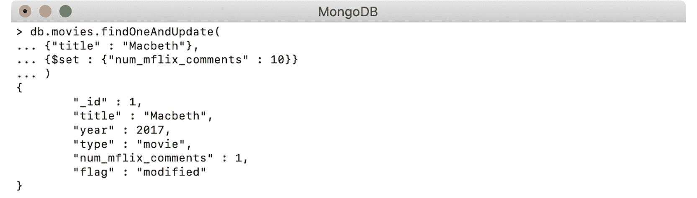

图 5.12：使用 fineOneAndUpdate()进行更新

输出显示`findOneAndUpdate()`函数没有返回查询统计信息，比如匹配了多少记录，修改了多少记录。相反，它返回了文档的旧状态。现在查询并验证更新是否成功：

```js
> db.movies.find({"title" : "Macbeth"}).pretty()
{
  "_id" : 1,
  "title" : "Macbeth",
  "year" : 2017,
  "type" : "movie",
  "num_mflix_comments" : 10,
  "flag" : "modified"
}
```

这里的查询及其输出确认了评论数量已经修改为新值。

### 返回响应中的新文档

到目前为止，我们使用了两个参数的函数，第一个是查询条件，第二个是更新表达式。然而，该函数还支持一个可选的第三个参数，用于向命令提供杂项选项。在这些选项中，`returnNewDocument`可以用于控制响应中应返回哪个文档。默认情况下，此标志的值设置为 false，因此我们在不传递选项的情况下得到了旧文档。然而，将此标志设置为 true，我们将在响应中得到修改后的或新文档。例如，考虑以下代码片段：

```js
db.movies.findOneAndUpdate(
  {"title" : "Macbeth"},
  {$set : {"num_mflix_comments" : 15}},
  {"returnNewDocument" : true}
)
```

上述操作将评论计数设置为 15，并将`returnNewDocument`标志设置为 true。输出如下所示：

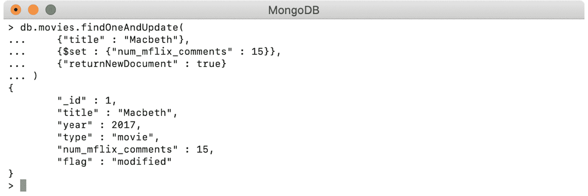

图 5.13：带有 returnNewDocument 标志的 findOneAndUpdate()

输出显示，通过将标志`returnNewDocument`设置为`true`，响应显示了修改后的文档，这也确认了评论数量已经正确修改。

通过函数的可选第三个参数，我们还可以提供一个表达式来限制文档中返回的字段数量（也称为投影表达式）。投影表达式可以用于返回旧文档或新文档作为响应的情况：

```js
db.movies.findOneAndUpdate(
  {"title" : "Macbeth"},
  {$set : {"num_mflix_comments" : 20}},
  {
    "projection" : {"_id" : 0, "num_mflix_comments" : 1},
    "returnNewDocument" : true
  }
)
```

上述更新命令通过`title`找到电影，并将评论数设置为 20。作为第三个参数，它将两个选项传递给命令。第一个选项是投影表达式，它只在响应中包含`num_mflix_comments`，并明确排除了`_id`。通过使用第二个操作，函数将返回修改后的文档。输出可以在这里看到：

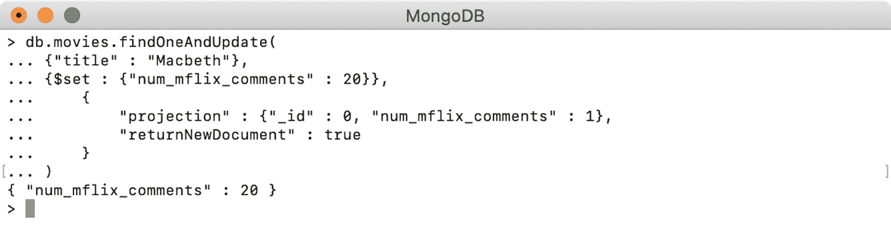

图 5.14：带有投影的 findOneAndUpdate()

我们可以看到，投影表达式已排除了`_id`，并且只包含了`num_mflix_comments`字段，正如预期的那样。

### 排序以查找文档

到目前为止，我们已经介绍了两个更新函数，它们都能够一次更新一个文档。如果给定的查询条件���配了多个文档，那么将选择第一个文档进行修改。这种行为在两个函数之间是共同的。但是，`findOneAndUpdate()`函数提供了一个额外的选项，可以按特定顺序对匹配的文档进行排序。使用排序选项，您可以影响选择哪个文档进行修改。

排序选项被指定为`findOneAndUpdate()`函数的可选第三个参数下的一个字段。排序字段的值必须是包含有效排序表达式的文档。现在我们将看到一个在更新命令中使用排序选项的示例。

*图 5.15*显示了我们的集合有四条记录，都是电影类型。每个记录都有一个顺序的`_id`字段，最后插入的记录在序列中具有最大的值：

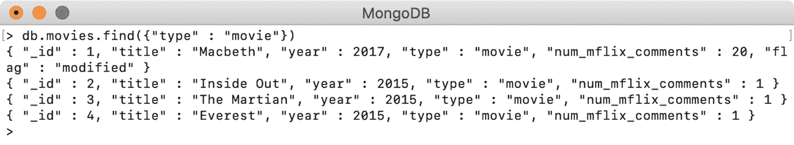

图 5.15：一个包含四条记录的集合

编写一个命令，将使用`{"type" : "movie"}`的相同过滤器，并将标志`"latest" : true`放到最后插入的记录中：

```js
db.movies.findOneAndUpdate(
  {"type" : "movie"},
  {$set : {"latest" : true}},
  {
    "returnNewDocument" : true,
    "sort" : {"_id" : -1}
  }
)
```

上述片段中的更新命令将`latest`标志设置为 true。查询条件找到了一个`type`为`movie`的文档。选项参数设置一个标志，以在响应中返回修改后的文档，并且还指定了一个排序表达式，以按照主键的降序对文档进行排序：

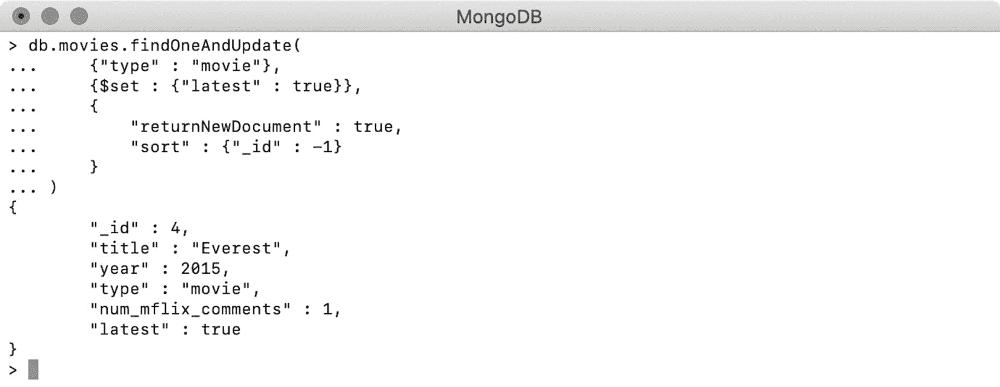

图 5.16：通过排序匹配的文档更新一条记录

更新命令的响应，如*图 5.16*所示，指示具有`_id : 4`的记录具有最新标志。这是由于指定的排序选项，它对匹配的记录进行排序，以便最大的 ID 将首先出现。函数选择了第一条记录并对其进行了修改。

## 练习 5.03：更新 IMDb 和 Tomatometer 评分

您的电影数据库记录了大量全球电影及其详细信息。您的产品所有者希望您保持数据库与最新变化的更新。人们仍然喜欢观看一些永恒的经典电影并对其进行评分或发表评论，因此一些几十年前发布的流行电影的评分每天都在变化。您的组织已决定无论电影的发布日期如何，都要纳入所有电影的评分更新。作为概念验证，他们选择了《教父》，这部有史以来最伟大的电影之一，并要求您使用最新的 IMDb 和 Tomatometer 评分对其进行更新。如果您的产品团队对此更新满意，他们将同意从这些平台接收定期更新。您的任务是编写并执行更新操作以更新这些评分。

这是电影的最新 IMDb 和 Tomatometer 观众评分：

**IMDb 评分**

评分：9.2，投票数：1,565,120

番茄表观众评分

评分：4.76，评论数量：733，777，米特 98

查看数据库以找到这些评分的当前值：

```js
db.movies.find(
  {"title" : "The Godfather"},
  {"imdb" : 1, "tomatoes.viewer" : 1, "_id" : 0}
).pretty()
```

此查询查找并打印电影`教父`的 IMDb 和番茄表观众评分：

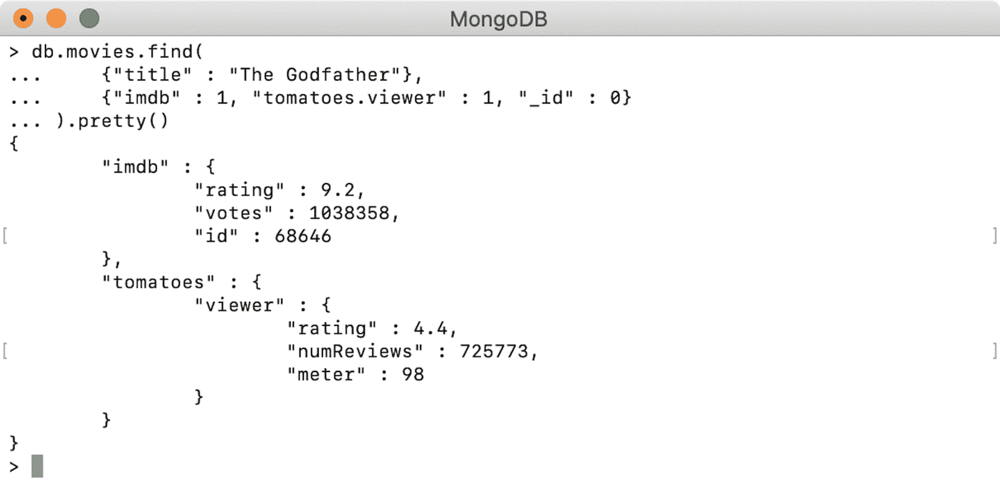

图 5.17：电影教父的评分

输出显示了`sample_mflix`数据库中当前的评分。

1.  打开任何文本编辑器，并编写一个带有查询参数的`findOneAndUpdate()`命令：

```js
db.movies.findOneAndUpdate(
  {"title" : "The Godfather"}
)
```

1.  现在，使用`$set`运算符设置 IMDb 字段。由于 IMDb 评分仍然相同，因此只需更新`votes`字段。要引用`votes`的嵌套字段，使用点表示法：

```js
db.movies.findOneAndUpdate(
  {"title" : "The Godfather"},
  {
    $set: {"imdb.votes" : 1565120}
  }
)
```

1.  接下来，为番茄表观众评分添加另一个更新表达式。对于番茄表观众评分，您只需要更新`rating`和`numReviews`字段。由于这是两个单独的字段，因此将两个单独的更新表达式添加到`$set`运算符中。由于这些字段嵌套在嵌套对象中，因此使用点表示法两次：

```js
db.movies.findOneAndUpdate(
  {"title" : "The Godfather"},
  {
    $set: {
      "imdb.votes" : 1565120,
      "tomatoes.viewer.rating": 4.76,
      "tomatoes.viewer.numReviews": 733777
    }
  }
)
```

1.  现在您的更新查询已经完成，添加标志以返回响应中修改后的文档以及特定字段的投影：

```js
db.movies.findOneAndUpdate(
  {"title" : "The Godfather"},
  {
    $set: {
      "imdb.votes" : 1565120,
      "tomatoes.viewer.rating": 4.76,
      "tomatoes.viewer.numReviews": 733777
    }
  },
  {
    "projection" : {"imdb" : 1, "tomatoes.viewer" : 1, "_id" : 0},
    "returnNewDocument" : true
  }
)
```

1.  打开 mongo shell 并连接到 Atlas`sample_mflix`数据库。复制上一个命令并执行它：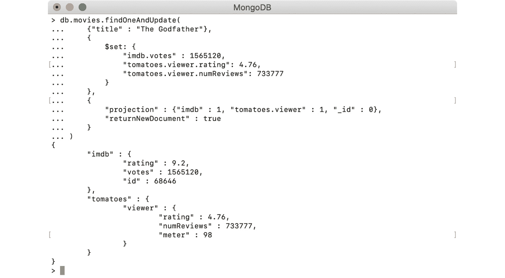

图 5.18：更新后的评分

前面的输出显示相应的字段已经被正确更新。

在这个练习中，您已经练习了使用`findOneAndUpdate()`和`$set`来更新嵌套字段的值。接下来，我们将学习使用`updateMany()`来更新多个文档。

## 使用 updateMany()更新多个文档

在前面的章节中，我们学习了如何找到一个文档并修改或更新其字段。然而，很多时候，您可能希望对集合中的多个文档执行相同的更新操作。MongoDB 提供了`updateMany()`函数，可以一次更新多个文档。与`updateOne()`类似，`updateMany()`函数需要两个必需的参数。第一个参数是查询条件，第二个是更新表达式。第三个参数是可选的，用于提供杂项选项。执行后，此函数将更新所有匹配给定查询条件的文档。函数的语法如下：

```js
db.collection.updateMany(<query condition>,   <update expression>, <options>)
```

我们将在我们的电影集合上编写并执行更新操作。假设我们的电影集合有四部于 2015 年发布的电影。为这些电影添加一个名为`languages`的字段，如下所示：

```js
db.movies.updateMany(
  {"year" : 2015},
  {$set : {"languages" : ["English"]}}
)
```

此更新操作使用两个参数。第一个是查找所有在 2015 年发布的电影。第二个参数是一个更新表达式，它使用`$set`运算符添加一个名为`languages`的新字段。`languages`字段的值是一个包含英语作为唯一语言的数组。输出如下：

```js
db.movies.updateMany(
  {"year" : 2015},
  {$set : {"languages" : ["English"]}}
)
{ "acknowledged" : true, "matchedCount" : 4, "modifiedCount" : 4 }
```

输出表明操作成功，并且与`updateOne()`函数一样，响应中返回了类似的文档。响应表明查询条件匹配了总共四个文档，并且所有文档都已被修改。

在本节中，我们学习了如何修改 MongoDB 集合中一个或多个文档的字段。我们已经介绍了三个更新函数，其中`updateOne()`和`findOneAndUpdate()`用于更新集合中的一个文档，而`updateMany()`用于更新集合中的多个文档。以下是关于更新操作的一些重要点，适用于所有三个函数：

+   没有任何更新函数允许更改`_id`字段。

+   文档中字段的顺序始终保持不变，除非更新包括重命名字段。但是，`_id`字段将始终首先出现。（我们将在下一节中介绍重命名字段）。

+   更新操作在单个文档上是原子的。在另一个进程完成更新之前，文档不能被修改。

+   所有的更新函数都支持 upsert。要执行 upsert 命令，需要将`upsert : true`作为选项传递。

在下一节中，我们将详细介绍各种更新运算符及其用法。

# 更新运算符

为了方便不同类型的更新命令，MongoDB 提供了各种更新运算符或更新修饰符，如 set、multiply、increment 等。在前面的部分中，我们使用了操作符`$set`，这是 MongoDB 提供的更新运算符之一。在本节中，我们将学习一些最常用的运算符和示例。在我们讨论运算符之前，我们将讨论它们的语法。以下代码片段显示了使用更新运算符的更新表达式的基本语法：

```js
{
  <update operator>: {<field1> : <value1>, ... }
}
```

根据前面的语法，可以将运算符分配给包含一个或多个字段和值对的文档。然后，运算符将应用于每个字段，使用相应的值。像前面的更新表达式对于所有给定字段需要使用相同的运算符时是有用的。您可能还希望使用不同的运算符更新文档的不同字段。对于这种情况，更新表达式可以包含多个更新运算符，每个运算符之间用逗号分隔。

```js
{
  <update operator 1>: {<field11> : <value11>, ... },
  <update operator 2>: {<field21> : <value21>, ... },
  ...,
}
```

前面的代码片段显示了在同一更新表达式中使用多个运算符的语法。在更新操作中，这些运算符中的每一个都将按顺序执行。

现在让我们详细了解每个更新运算符。

## 设置（$set）

正如我们已经看到的，`$set`运算符用于设置文档中字段的值。它是最常用的运算符，因为它可以轻松地用于设置任何类型的字段的值或在文档中添加新字段。该运算符接受一个包含字段名和它们的新值对的文档。如果给定的字段尚不存在，它将被创建。

## 增量（$inc）

增量运算符`($inc`)用于将数值字段的值增加特定数字。该运算符接受包含字段名和数字对的文档。给定正数，字段的值将增加；如果提供负数，值将减少。显而易见但值得一提的是，`$inc`运算符只能用于数值字段；如果尝试用于非数值字段，操作将失败并出现错误。

目前，在我们的集合中，`Macbeth`电影的文档如下所示：

```js
> db.movies.find({"title" : "Macbeth"}).pretty()
{
  "_id" : 1,
  "title" : "Macbeth",
  "year" : 2017,
  "type" : "movie",
  "num_mflix_comments" : 20,
  "flag" : "modified"
}
```

现在，使用`$inc`运算符对两个字段进行更新，其中一个存在于文档中，另一个不存在：

```js
db.movies.findOneAndUpdate(
  {"title" : "Macbeth"},
  {$inc : {"num_mflix_comments" : 3, "rating" : 1.5}},
  {returnNewDocument : true}
)
```

前面的更新操作通过`title`找到一部电影，将`num_mflix_comments`字段增加 3，将一个不存在的名为`rating`的字段增加`1.5`。它还将`returnNewDocument`设置为`true`，以便在响应中返回更新后的记录。您可以在以下截图中看到输出：

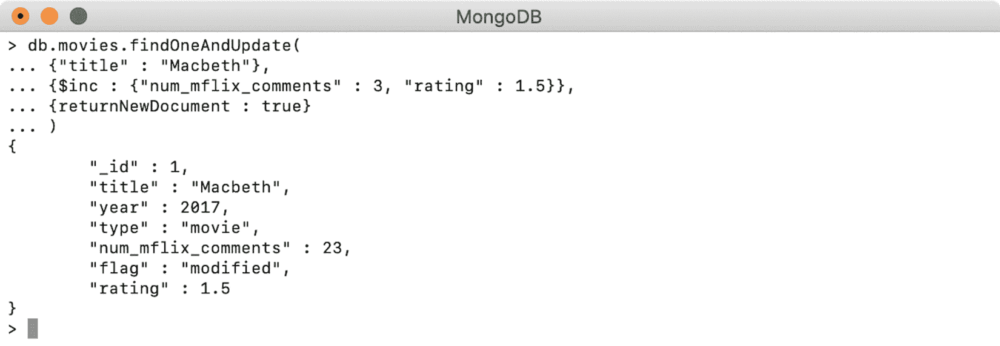

图 5.19：增加评论数量和评分

因此，更新命令成功。`num_mflix_comments`字段正确增加了 3，`rating`（原本不存在的字段）现在已添加到文档中，并具有指定的值。我们将看到减少字段值的示例：

```js
db.movies.findOneAndUpdate(
  {"title" : "Macbeth"},
  {$inc : {"num_mflix_comments" : -2, "rating" : -0.2}},
  {returnNewDocument : true}
)
```

前面的命令在两个字段上使用了`$inc`运算符，并提供了负数：

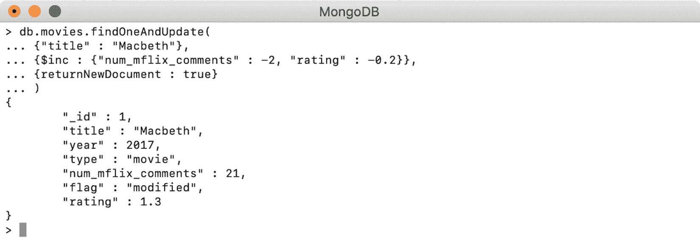

图 5.20：减少评论数量和评分

如*图 5.20*所示，负增量导致响应。`rating`，原为 1.5，现在减少了 0.2，`num_mflix_comments`减少到 21。

## 乘法（$mul）

乘法`($mul`)操作符用于将数字字段的值乘以给定的数字。该操作符接受包含字段名称和数字对的文档，并且只能用于数字字段。例如，考虑以下代码片段：

```js
db.movies.findOneAndUpdate(
  {"title" : "Macbeth"},
  {$mul : {"rating" : 2}},
  {returnNewDocument : true}
)
```

前面的更新操作通过`title`找到电影，使用`$mul`将`rating`字段的值乘以 2，并添加一个选项在响应中返回修改后的文档。结果如下所示：

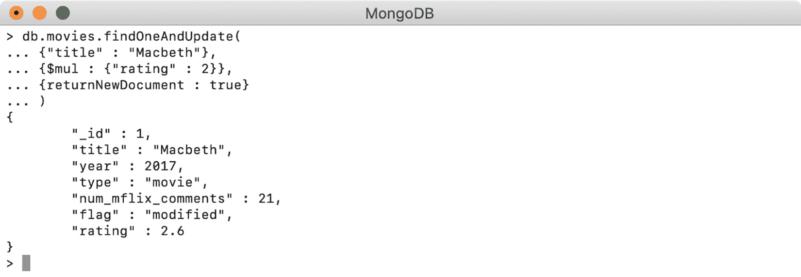

图 5.21：将评分翻倍

输出显示字段`rating`的值乘以 2。在使用`$mul`时，应始终记住，无论我们提供什么乘数，该字段都将被创建并始终设置为零。这是因为，在乘法操作中，假定不存在的数字字段的值为零。因此，在零上使用任何乘数都会得到零：

```js
db.movies.findOneAndUpdate(
  {"title" : "Macbeth"},
  {$mul : {"box_office_collection" : 16.3}},
  {returnNewDocument : true}
)
```

此更新操作将不存在的字段`box_office_collection`乘以给定值：

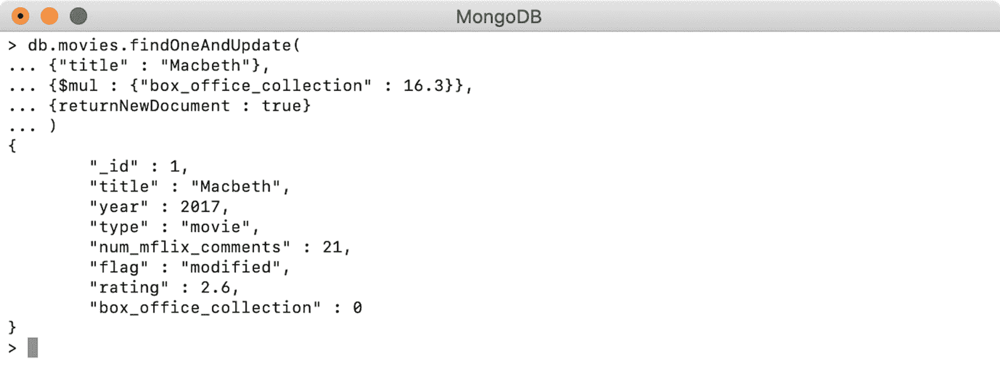

图 5.22：将不存在的字段的值乘以 2

*图 5.22*中的输出证明，不管提供的值如何，`box_office_collection`的不存在字段都已添加了值为零。

## 重命名（$rename）

如其名称所示，`$rename`操作符用于重命名字段。该操作符接受包含字段名称和它们的新名称对的文档。如果字段尚未存在于文档中，则操作符会忽略它并不执行任何操作。提供的字段及其新名称必须不同。如果它们相同，则操作将因错误而失败。如果文档已包含具有提供的新名称的字段，则现有字段将被移除。

为了尝试`$rename`操作符的各种场景，首先为`Macbeth`插入名为`imdb_rating`的字段。以下更新操作设置了新字段，输出显示字段已正确添加：

```js
> db.movies.findOneAndUpdate(
  {"title" : "Macbeth"},
  {$set : {"imdb_rating" : 6.6}},
  {returnNewDocument : true}
)
{
  "_id" : 1,
  "title" : "Macbeth",
  "year" : 2017,
  "type" : "movie",
  "num_mflix_comments" : 21,
  "flag" : "modified",
  "rating" : 2.6,
  "box_office_collection" : 0,
  "imdb_rating" : 6.6
}
```

现在，将字段`num_mflix_comments`重命名为`comments`，并将字段`imdb_rating`重命名为`rating`，如下所示：

```js
db.movies.findOneAndUpdate(
  {"title" : "Macbeth"},
  {$rename : {"num_mflix_comments" : "comments",     "imdb_rating" : "rating"}},
  {returnNewDocument : true}
)
```

更新操作使用`$rename`操作符，并传递包含两对字段名称和新名称的文档。请注意，第二个字段名称和新名称组合试图将`imdb_rating`字段重命名为`rating`；然而，记录已经具有名称为`rating`的字段。输出如下所示：

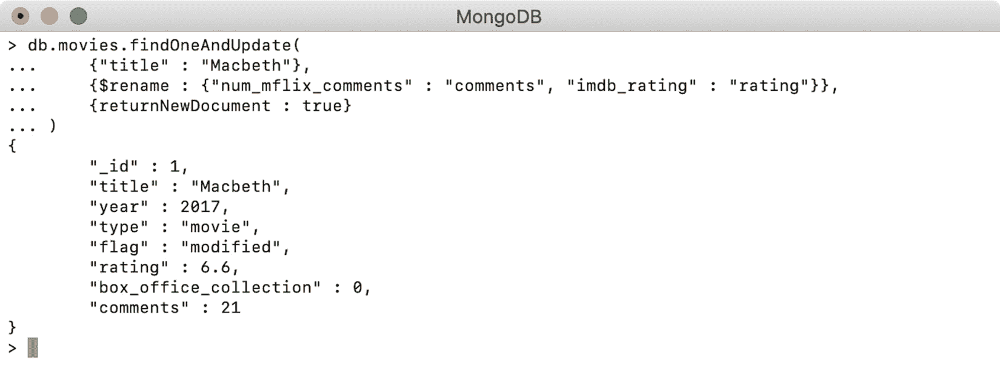

图 5.23：重命名字段

输出显示重命名操作成功。如上所述，原始字段`rating`已被移除，`imdb_rating`字段现在已重命名为`rating`。使用此操作符，字段也可以移至嵌套文档和从嵌套文档中移出。要这样做，必须使用点表示法，如下所示：

```js
db.movies.findOneAndUpdate(
  {"title" : "Macbeth"},
  {$rename : {"rating" : "imdb.rating"}},
  {returnNewDocument : true}
)
```

在这里，更新操作正在重命名`rating`字段。但是，新名称包含点表示法：

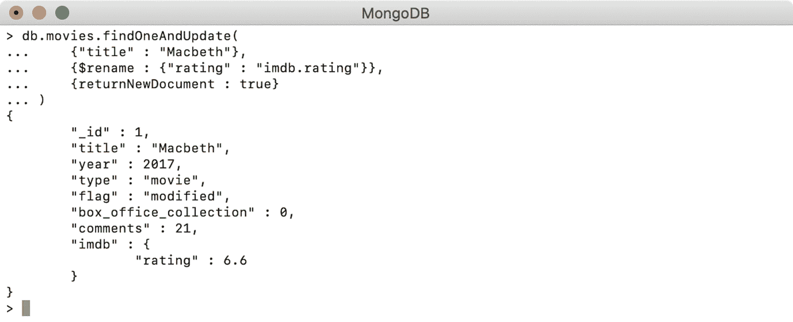

图 5.24：重命名嵌套字段

由于点表示法，字段`rating`已移至嵌套文档`imdb`下。同样，字段可以从嵌套文档移至根文档或任何其他嵌套文档中。

## 当前日期（$currentDate）

操作符`$currentDate`用于将给定字段的值设置为当前日期或时间戳。如果该字段尚不存在，则将使用当前日期或时间戳值创建它。将字段名称与`true`值一起提供将当前日期插入为`Date`。或者，可以使用`$type`操作符显式指定值为`date`或`timestamp`：

```js
db.movies.findOneAndUpdate(
  {"title" : "Macbeth"},
  {$currentDate : {
    "created_date" : true,
       "last_updated.date" : {$type : "date"},
       "last_updated.timestamp" : {$type : "timestamp"},
  }},
  {returnNewDocument : true}
)
```

前面的`findOneAndUpdate`操作使用`$currentDate`运算符设置了三个字段。字段`created_date`的值为 true，默认为`Date`类型。另外两个字段使用了点表示法和显式的`$type`声明。输出可以在下图中看到：

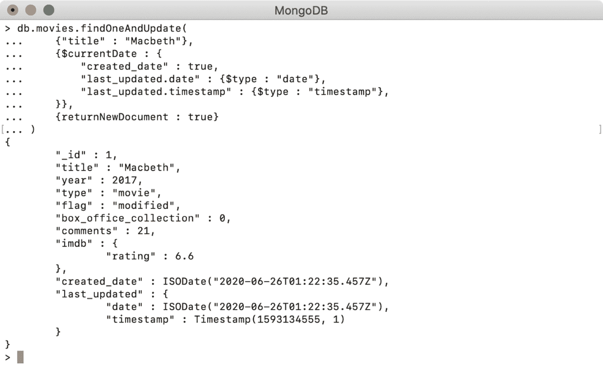

图 5.25：设置当前日期和时间戳

我们可以看到`created_date`字段的值是`Date`类型。添加了一个新字段`last_updated`，并且有一个嵌套文档。在嵌套文档下，另一个字段被初始化为`Date`类型，另一个字段被初始化为`Timestamp`类型。

## 移除字段（$unset）

`$unset`运算符从文档中移除给定的字段。该运算符接受一个包含字段名和值的文档，并从匹配的文档中移除所有给定的字段。由于提供的字段正在被移除，它们指定的值没有影响。例如，考虑以下代码片段：

```js
> db.movies.find({"title" : "Macbeth"}).pretty()
{
  "_id" : 1,
  "title" : "Macbeth",
  "year" : 2017,
  "type" : "movie",
  "flag" : "modified",
  "box_office_collection" : 0,
  "comments" : 21,
  "imdb" : {
    "rating" : 6.6
  },
  "created_date" : ISODate("2020-06-26T01:22:35.457Z"),
  "last_updated" : {
    "date" : ISODate("2020-06-26T01:22:35.457Z"),
  "timestamp" : Timestamp(1593134555, 1)
  }
}
```

使用`$unset`运算符执行更新操作以移除不需要的字段：

```js
db.movies.findOneAndUpdate(
  {"title" : "Macbeth"},
  {$unset : {
    "created_date" : "", 
    "last_updated" : "dummy_value",
    "box_office_collection": 142.2,
    "imdb" : null,
    "flag" : ""
  }},
  {returnNewDocument : true}
)
```

前面的更新操作从文档中移除了四个字段。如前所述，无论提供给字段什么值，以及是否提供给字段什么值，都没有影响。在这里，您正在尝试移除多个字段并为它们提供不同的值，您将观察到它们的值没有影响。第一个字段`created_date`提供了一个空字符串的值。接下来的两个字段有一些虚拟值，字段`imdb`有一个空值。最后一个字段`flag`也提供了一个空字符串的值。在这五个字段中，`imdb`和`last_updated`是嵌套字段。现在执行操作并观察输出，如下所示：

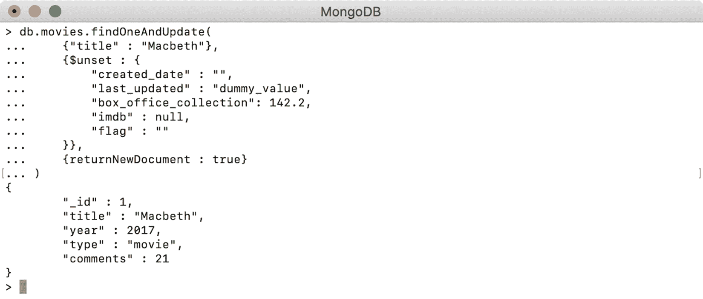

图 5.26：移除多个字段

输出表明，所有五个字段都已从文档中正确移除。操作和响应证明了为字段指定的值对字段移除没有影响。此外，指定一个值为嵌套对象的字段会移除相应的对象和包含的字段。

## 插入时设置（$setOnInsert）

`$setOnInsert`运算符类似于`$set`，但是它只在`upsert`操作期间插入时设置给定的字段。当`upsert`操作导致更新现有文档时，它没有影响。为了更好地理解这一点，请考虑以下代码片段：

```js
db.movies.findOneAndUpdate(
  {"title":"Macbeth"},
  {
    $rename:{"comments":"num_mflix_comments"},
    $setOnInsert:{"created_time":new Date()}
  },
  {
    upsert : true,
    returnNewDocument:true
  }
)
```

在这里，upsert 操作找到并更新了*Macbeth*电影记录。它将一个字段重命名为一个新名称，并且还在字段`created_time`上使用了`$setOnInsert`，该字段被初始化为当前的**Date**。由于电影已经存在于集合中，这个操作将导致更新：

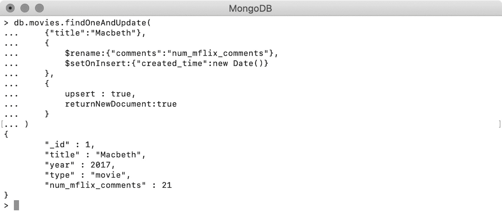

图 5.27：在现有文档上使用$setOnInsert 进行 upsert

输出显示`$setOnInsert`没有改变文档，但是字段`comment`现在被重命名为`num_mflix_comments`。另外，字段`created_time`没有被添加，因为 upsert 操作被用来更新现有文档。现在尝试使用 upsert 操作来插入一个示例：

```js
db.movies.findOneAndUpdate(
  {"title":"Spy"},
  {
    $rename:{"comments":"num_mflix_comments"},
    $setOnInsert:{"created_time":new Date()}
  },
  {
    upsert : true,
    returnNewDocument:true
  }
)
```

这段代码与前面的代码唯一的区别是，这个操作找到了一个名为`Spy`的电影，而这个电影在我们的集合中不存在。由于 upsert 的存在，这个操作将导致向集合中添加一个文档。输出可以在下图中看到：

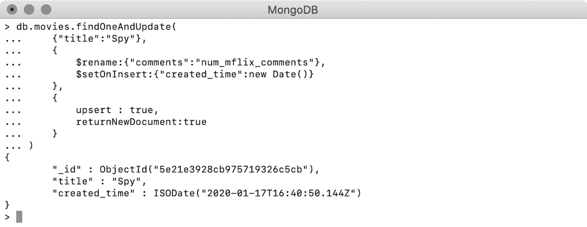

图 5.28：在新文档上使用$setOnInsert 进行 upsert

如我们所见，一个新的电影记录已经创建，并且带有`created_time`字段。通过前面的示例和输出，我们已经看到`$setOnInsert`操作符仅在作为 upsert 操作的一部分插入记录时设置字段。

## 活动 5.01：更新电影评论

您数据库的一些用户抱怨说他们在网站上找不到对电影的评论。您的客服团队进行了一些调查，发现实际上有三条评论错误地发布在一部电影上，而这些评论实际上属于另一部电影。错误评论的 ID 如下：

```js
ObjectId("5a9427658b0beebeb6975eaa")
ObjectId("5a9427658b0beebeb6975eb3")
ObjectId("5a9427658b0beebeb6975eb4")
```

以下`find`查询返回这三条评论：

```js
db.comments.find(
  {"_id" : 
    {$in : [
      ObjectId("5a9427658b0beebeb6975eaa"), 
      ObjectId("5a9427658b0beebeb6975eb3"), 
      ObjectId("5a9427658b0beebeb6975eb4")
      ]
    }
  }
).pretty()
```

在 MongoDB Atlas 的`sample_mflix`数据库上执行上述查询，输出应如下所示：

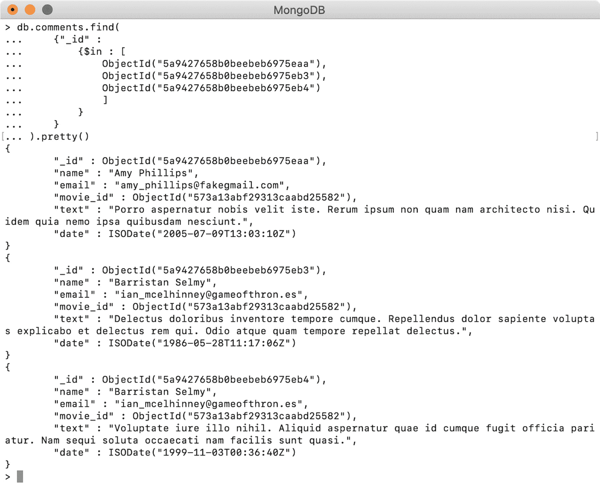

图 5.29：不正确的评论

上述三条评论都是针对一部 2009 年的电影“神探夏洛克”（`ObjectId("573a13bcf29313caabd57db6")`）发布的，但实际上它们属于一部 2014 年的电影“初恋 50 次约”（`ObjectId("573a13abf29313caabd25582")`）。

您在此活动中的任务是纠正所有三条评论中的`movie_id`，并分别更新这些电影的`num_mflix_comments`字段。以下步骤将帮助您完成此活动：

1.  更新所有三个文档中的`movie_id`字段。

1.  找到电影“神探夏洛克”的 ID，并将评论数量减少 3 条。

1.  在 mongo shell 上执行您在*步骤 2*中使用的命令，并确认结果。

1.  找到电影“初恋 50 次”，并将评论数量增加 3 条。

1.  在 mongo shell 上执行您在*步骤 3*中使用的命令，并确认结果。

注意

此活动的解决方案可以通过此链接找到。

# 摘要

我们从在集合中创建文档开始了本章。我们看到，在插入操作期间，如果文档不存在，MongoDB 会创建底层集合，并且如果文档还没有`_id`字段，则会自动生成一个。然后，我们介绍了 MongoDB 提供的各种函数，用于删除和替换集合中的一个或多个文档，以及 upsert 的概念、其好处、在 MongoDB 中的支持，以及 upsert 操作与删除和插入的区别。然后我们学习了如何使用各种函数和操作符在 MongoDB 文档中添加、更新、重命名或删除字段。

在下一章中，我们将使用 MongoDB 4.2 中添加的聚合管道支持执行一些复杂的更新命令，并学习如何修改数组字段中的元素。
