# 第六章：6. 使用聚合管道和数组进行更新

概述

本章向您介绍了 MongoDB 中更新操作的另外两个特性。您将首先学习如何使用管道支持执行一些复杂的更新操作。使用管道支持，您将能够编写多步更新表达式，并引用其他字段的值。接下来，本章涵盖了文档中数组字段的更新，其中包括向数组添加元素、更新或删除所有或特定元素、创建数组作为集合以及对数组元素进行排序。您将练习将唯一元素推送到数组中，并对其元素进行排序作为最终活动的一部分。通过本章结束时，您将能够根据其他字段的值推导出更新表达式，并操作集合中文档的数组字段。

# 介绍

到目前为止，我们已经涵盖了使用各种运算符来准备查询表达式的查询。我们还学习了如何在集合中创建、删除和修改文档，使用了各种删除和更新函数，并考虑了它们的差异和可用性。我们还涵盖了如何替换文档以及如何使用多个更新运算符执行 upsert 操作。现在是时候通过使用聚合管道支持来练习更复杂的更新操作，并学习如何修改文档中的数组。

我们将从 MongoDB 管道支持开始这一章，我们将简要介绍聚合管道以及它如何帮助您执行更复杂的更新操作。然后我们将介绍如何更新数组字段，如何添加和排序现有数组的元素，并使用数组作为唯一元素集。接下来，您将学习如何从数组中删除第一个、最后一个或另一个特定元素。最后，您将学习如何准备一个带有查询条件的数组过滤器，并使用它来仅修改数组中的特定元素。

## 使用聚合管道进行更新（MongoDB 4.2）

在上一章中，我们涵盖了用于修改一个或多个文档中字段的更新函数。我们还使用了各种运算符编写了许多更新操作。正如您在示例中所看到的，我们在分配新值给字段时，要么使用硬编码的值（例如，在更新`num_mflix_comments`时），要么使用诸如`$inc`之类的运算符动态派生的值。然而，在更复杂的更新操作中，您可能需要使用基于其他字段的值动态派生的字段。或者，更新操作可能涉及多步更新表达式。

在以前的 MongoDB 版本中，引用其他字段的值或编写多步更新操作是不可能的，但是，随着 MongoDB 4.2 的发布，它的所有更新函数都开始支持聚合管道。聚合管道和各种聚合运算符将在第七章“聚合管道”中详细介绍。现在，我们将限制讨论使用管道支持编写更新表达式。

管道由多个称为阶段的更新表达式组成。当执行包含多个阶段的更新表达式的更新操作时，每个匹配的文档都会按顺序经过每个阶段进行处理和转换。第一个阶段的输出是下一个阶段的输入，直到管道中的最后一个阶段产生最终输出。除了编写多阶段更新表达式外，管道支持还允许在更新表达式中使用字段引用。

在以前的更新表达式中，我们要么在字段上设置硬编码的值，要么对数字字段使用各种运算符来操作其现有值。然而，使用管道支持，我们可以在更新表达式中读取并使用其他字段的值。

以下代码片段显示了在`updateMany()`中使用聚合管道的语法。对于所有其他更新函数，它是相同的：

```js
db.collection.updateMany(
    <query condition>, 
    [<update expression 1>, <update expression 2>, ...],
    <options>
)
```

您可能已经注意到，函数的第二个参数，指定更新表达式，现在是多个更新表达式或阶段的数组。如前所述，该语法仅在您的 MongoDB 版本为 4.2 或更高版本时有效。如果传递的是一个包含单个更新表达式的文档，而不是数组，则它将作为普通的更新命令执行。

让我们考虑聚合管道如何允许我们编写复杂的更新查询，并使用字段表达式和聚合操作。我们在上一章的示例中一直在使用*CH05*数据库，并将在这里继续使用它。如果您已经有`users`集合，请在我们插入两条记录之前删除其所有元素。

让我们向集合中添加以下记录：

```js
db.users.insertMany([
    {_id: 1, full_name : "Arya Stark"}, 
    {_id: 2, full_name : "Khal Drogo"}
])
```

两个文档都有一个`_id`和`full_name`字段，由名字和姓氏以空格分隔组成。我们将编写一个更新命令，将全名拆分为相应的名字和姓氏字段，并更新`full_name`字段，以便只有名字以大写形式出现：

```js
db.users.updateMany(
    {},
    [
        {
            $set : {"name_array" : {$split : ["$full_name", " "]}},
        },
        {
            $set: {
                "first_name" : {"$arrayElemAt" : ["$name_array", 0]},
                "last_name" : {"$arrayElemAt" : ["$name_array", 1]}
            }
        },
        {
            $project : {
                "first_name" : 1,
                "last_name" : 1,
                "full_name" : {
                    $concat : [{$toUpper : "$first_name"}, " ", "$last_name"]
                }
            }
        }
    ]
)
```

在这里，`updateMany()`操作正在更新`users`集合中的所有文档。函数的第二个参数是一个包含三个阶段（`$set`、`$set`和`$project`）的数组。现在，我们将逐个介绍这些阶段并探索管道。

注意

诸如`$project`、`$arrayElemAt`和`$concat`之类的运算符是聚合运算符。这些运算符不能在早于 MongoDB 4.2 的版本中使用，也不能作为聚合管道的一部分的更新表达式中使用。

### 第 1 阶段（$set）

在这个阶段，我们使用`$split`运算符以空格分割全名。这给我们一个包含名字和姓氏的两个元素数组。我们还使用`$set`运算符创建一个新的`name_array`字段，并将新创建的数组分配给它。`name_array`对我们来说是一个临时字段。

### 第 2 阶段（$set）

在这个阶段，我们引用存储在`name_array`中的数组，并为名字和姓氏创建新字段。为此，我们使用`$arrayElemAt`从特定索引位置获取其元素。使用零位置元素创建一个名为`first_name`的新字段，并使用第一个索引位置元素创建一个名为`last_name`的字段。在这个阶段结束时，每个用户的文档将具有`first_name`、`last_name`、`name_array`和原始的`full_name`字段。

### 第 3 阶段（$project）

在最后一个阶段，我们对字段进行投影。我们明确包括`first_name`和`last_name`字段，并通过连接大写的`first_name`和`last_name`来重写`full_name`；请注意，我们不会改变`last_name`的大小写。

`$toUpper`运算符指的是`first_name`的值，并返回大写的相同字符串。`$concat`运算符接受一个字符串数组，并通过按照相同顺序连接所有元素来返回单个字符串。在这里，我们将大写的`first_name`、一个空格和`last_name`连接起来。

`$project`运算符用于投影字段并对其进行赋值。在这个阶段，我们投影`first_name`、`last_name`和`full_name`，这意味着`name_array`将自动被省略：

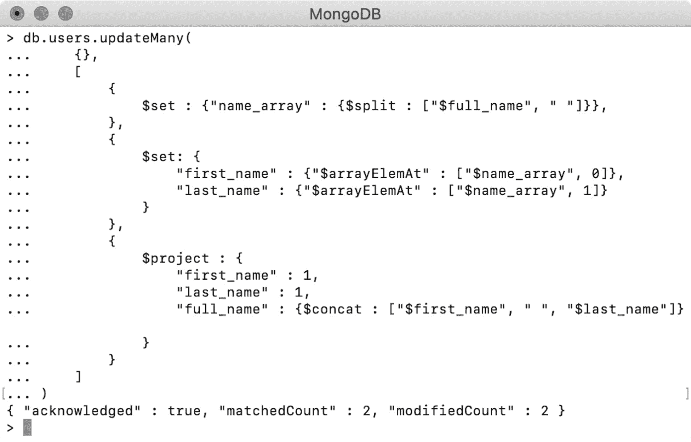

图 6.1：使用管道支持更新

前面的输出显示操作成功。它匹配了两个文档，并且它们都被修改了。现在我们将查询文档，看它们是否已正确更新：

```js
> db.users.find({}, {_id : 0})
{ "first_name" : "Arya", "last_name" : "Stark", "full_name" : "ARYA Stark" }
{ "first_name" : "Khal", "last_name" : "Drogo", "full_name" : "KHAL Drogo" }
```

在这里，`find`查询和输出显示文档已正确修改。原始全名已正确拆分为名字和姓氏。此外，`full_name`字段中的名字是大写的。

在本节中，我们学习了如何使用 MongoDB 4.2 提供的管道阶段和聚合运算符支持编写复杂的更新命令。我们还了解到阶段是按顺序执行的，一个阶段的输出成为下一个阶段的输入。

# 更新数组字段

在之前的章节中，我们学习了如何更新一个或多个 MongoDB 文档中的字段。我们还学习了如何使用各种运算符编写更新表达式以及如何使用 MongoDB 管道支持。在本节中，我们将学习如何从文档中更新数组字段。

为了尝试一些基本的数组字段更新操作，我们将向`movies`集合中插入以下文档：

```js
db.movies.insert({"_id" : 111, "title" : "Macbeth"})
```

文档只有一个`title`字段，不包含数组，所以让我们尝试创建一个：

```js
db.movies.findOneAndUpdate(
    {_id : 111},
    {$set : {"genre" : ["Unknown"]}},
    {"returnNewDocument" : true}
)
```

前面的操作在`genre`字段中使用了`$set`。`genre`的值是一个单元素数组—`["unknown"]`。输出如下所示：

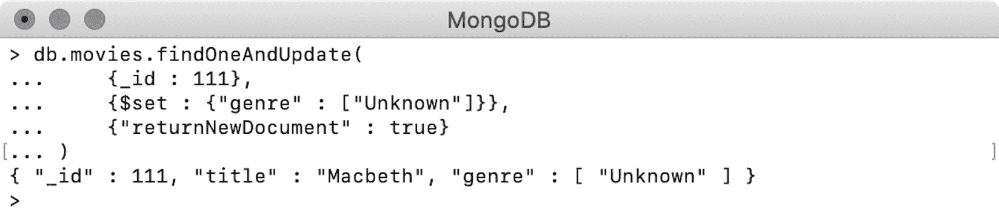

图 6.2：更新数组字段的值

输出显示`genre`字段已创建并分配了给定数组的值。接下来，我们将从文档中删除字段，如下所示：

```js
db.movies.findOneAndUpdate(
    {_id : 111},
    {$unset : {"genre" : ""}},
    {"returnNewDocument" : true}
)
```

前面的更新命令使用`$unset`来删除`genre`字段。您可以在这里看到输出：

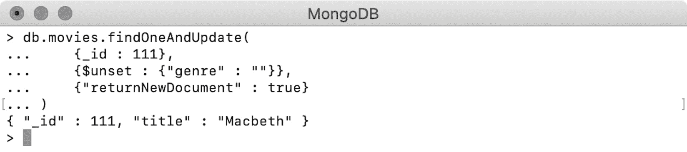

图 6.3：删除数组字段

输出表明该字段已从文档中正确删除。从这两个示例中可以清楚地看出，当使用数组作为值更新数组字段时，它会像其他字段一样对待。接下来，我们将看到如何操作数组元素。

我们已经看到如何使用数组值更新字段。当我们想要完全替换数组值时，这是有用的。但是，要向数组添加更多元素，可以使用一个叫做`$push`的运算符。该运算符将给定元素推送到数组的末尾，如果给定字段不存在，则创建它。让我们在下一个练习中使用它。

## 练习 6.01：向数组添加元素

在这个练习中，您将使用以下步骤向数组添加元素：

1.  要插入单个文档，请添加以下命令：

```js
db.movies.findOneAndUpdate(
    {_id : 111},
    {$push : {"genre" : "unknown"}},
    {"returnNewDocument" : true}
)
```

前面片段中的更新操作通过其`_id`值找到文档，并将一个元素推送到`genre`数组中。该字段目前不存在于文档中。您应该看到以下输出：

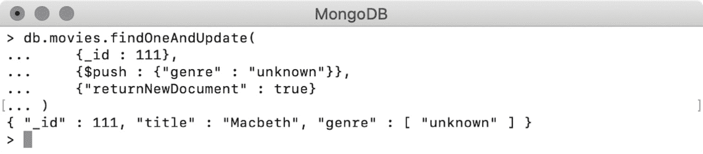

图 6.4：向数组添加一个元素

1.  如图所示，`genre`数组字段成功创建，并且给定元素已添加到数组中。现在再添加一个流派，如下所示：

```js
db.movies.findOneAndUpdate(
    {_id : 111},
    {$push : {"genre" : "Drama"}},
    {"returnNewDocument" : true}
)
```

前面的命令插入了另一个流派，`Drama`。您可以在这里看到输出，显示`Drama`元素已添加到现有数组的末尾：

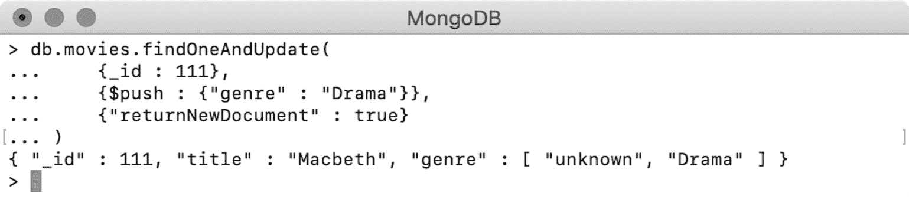

图 6.5：向数组添加另一个元素

在这个练习中，我们处理了添加单个元素。在下一节中，我们将一次添加多个元素。

## 添加多个元素

正如我们所见，`$push`可以一次添加一个元素。要在单个更新命令中向数组添加多个元素，我们必须使用`$push`和`$each`。以下是此操作的语法：

```js
$push : {<field_name> : {$each : [<element 1>, <element2>, ..]}}
```

需要附加到数组的元素以数组的形式提供给`$each`运算符。当执行这样的更新表达式时，`$each`会迭代每个元素，并将元素推送到数组中：

```js
db.movies.findOneAndUpdate(
    {_id : 111},
    {$push : {
        "genre" : {
            $each : ["History", "Action"]
        }}
    },
    {"returnNewDocument" : true}
)
```

前面的更新操作通过其`_id`字段找到并更新文档，并使用`$push`向`genre`字段添加元素。我们通过将这两个元素提供给`$each`来向数组添加两个元素：

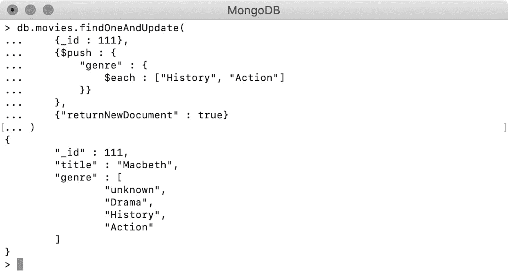

图 6.6：向数组推送多个元素

响应中的文档（参见上述截图）表明两个元素都正确地追加到数组的末尾，并按相同的顺序添加。

## 排序数组

在 MongoDB 中，以及一般情况下，数组是一个有序但未排序的元素集合。换句话说，数组的元素将始终保持插入的顺序。然而，在使用 `$push` 执行更新命令时，我们也可以对数组进行排序。为此，我们必须使用 `$sort` 操作符和 `$each`。在之前的例子中，我们向 `genre` 数组添加了四个元素。现在，我们将尝试对数组进行字母顺序排序：

```js
db.movies.findOneAndUpdate(
    {_id : 111},
    {$push : {
        "genre" : {
            $each : [],
            $sort : 1
        }}
    },
    {"returnNewDocument" : true}
)
```

在上述命令中，我们在 `genre` 字段中使用了 `$push`。需要注意的是，这个查询没有向数组推送任何元素，因为没有元素提供给 `$each` 操作符。新的 `$sort` 操作符被赋予值 `1`，表示升序：

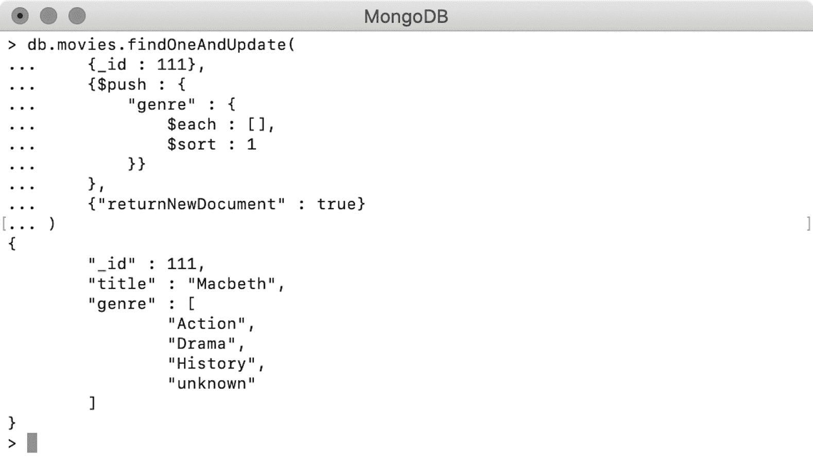

图 6.7：对数组进行排序

如图所示，`genre` 数组现在按照元素的升序字母顺序排序。在之前的例子中，我们对数组进行了排序，但没有添加元素，但我们也可以在向数组插入一个或多个元素时进行排序。在这种情况下，新元素将被添加到数组中，并根据给定的排序顺序对数组进行排序。考虑以下代码片段：

```js
db.movies.findOneAndUpdate(
    {_id : 111},
    {$push : {
        "genre" : {
            $each : ["Crime"],
            $sort : -1
        }}
    },
    {"returnNewDocument" : true}
)
```

在这个更新命令中，我们向 `genre` 传递了一个新元素 `Crime`。请注意，`$sort` 操作符的值为 `-1`。当我们执行此命令时，新元素将被添加到数组中，并且数组将按照字母的降序进行排序。这将导致以下输出：

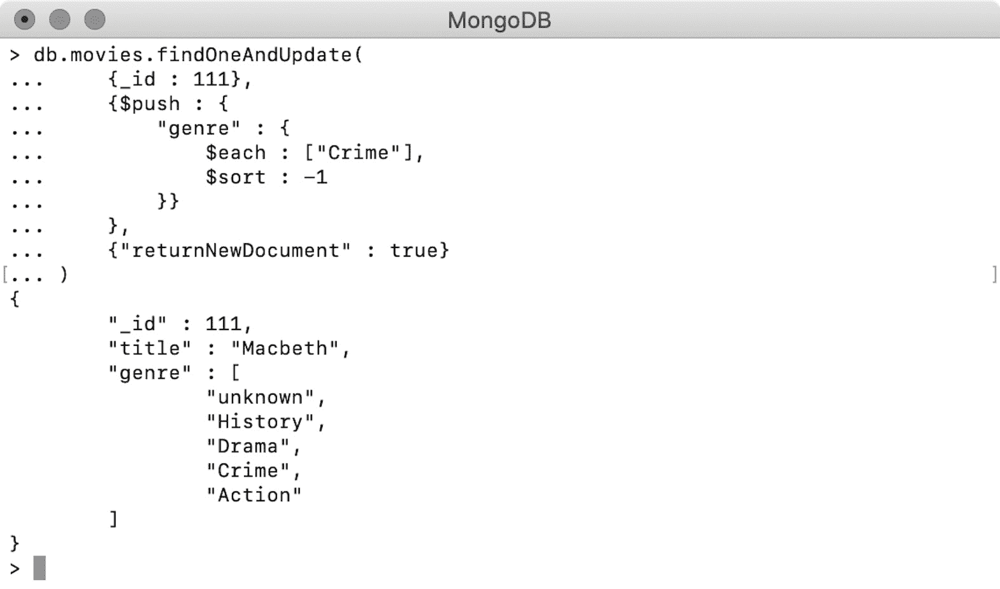

图 6.8：对数组进行排序并将元素推送到数组中

从响应中可以看出，数组按降序排序，新元素 `Crime` 是 `genre` 数组的一部分。如果没有提供 `$sort` 操作符，新元素将被追加到数组的末尾。在之前的两个例子中，`genre` 数组包含普通的字符串元素。然而，如果我们有一个包含多个字段的对象数组，可以根据嵌套对象的字段进行排序。考虑 `items` 集合中的以下记录：

```js
> db.items.insert({_id : 11, items: [
    {"name" : "backpack", "price" : 127.59, "quantity" : 3},
    {"name" : "notepad", "price" : 17.6, "quantity" : 4},
    {"name" : "binder", "price" : 18.17, "quantity" : 2},
    {"name" : "pens", "price" : 60.56, "quantity" : 3},

]})
WriteResult({ "nInserted" : 1 })
```

`items` 字段是一个包含三个字段的四个对象的数组。现在我们将按价格对数组进行排序：

```js
db.items.findOneAndUpdate(
    {_id : 11},
    {$push : {
        "items" : {
            $each : [],
            $sort : {"price" : -1}
        }}
    },
    {"returnNewDocument" : true}
)
```

更新命令找到一个文档并对数组字段进行排序。与之前的例子不同，这次我们要根据它们的嵌套字段对元素进行排序：

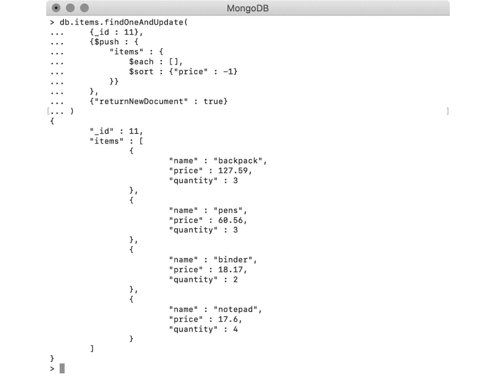

图 6.9：根据嵌套字段的值对数组进行排序

注意修改后的文档中的数组字段。所有元素现在按价格的降序排序。在下一节中，我们将学习在 MongoDB 中使用数组作为集合。

## 数组作为集合

数组是一个有序的元素集合，可以通过迭代或使用特定的索引位置进行访问。集合是一组唯一元素的集合，其顺序不被保证。MongoDB 只支持普通数组，不支持其他类型的集合。然而，您可能希望您的数组只包含唯一的元素。MongoDB 通过使用 `$addToSet` 操作符提供了一种方法来实现这一点。

`$addToSet` 操作符类似于 `$push`，唯一的区别在于只有当元素不存在时才会被推送。该操作符不会改变底层数组，但它确保只有唯一的元素被推送进去。目前，我们 `movies` 集合中电影 `Macbeth` 的文档如下所示：

```js
> db.movies.find({"_id" : 111}).pretty()
{
    "_id" : 111,
    "title" : "Macbeth",
    "genre" : [
        "unknown",
        "History",
        "Drama",
        "Crime",
        "Action"
    ]
}
```

`genre` 数组是一个很好的例子，您希望您的数组具有唯一的元素，因为电影的重复流派是没有意义的。考虑以下代码片段：

```js
db.movies.findOneAndUpdate(
    {_id : 111},
    {$addToSet : {"genre" : "Action"}},
    {"returnNewDocument" : true    }
)
```

在这里，更新操作使用`$addToSet`将`Action`的元素推送到`genres`数组中。请注意，该元素已经是数组的一部分：

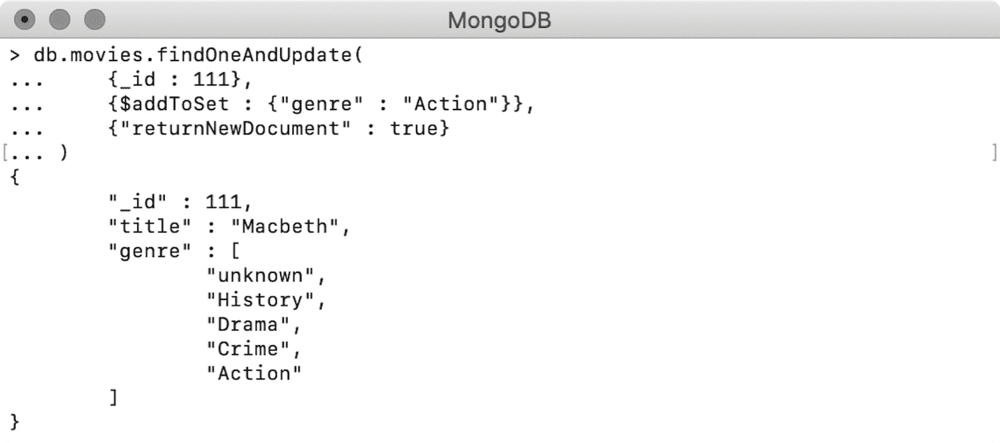

图 6.10：将元素添加到数组中作为集合

如前面的屏幕截图所示，`Action`元素没有被推送到数组中，因为数组已经包含它。即使在我们使用`$each`将多个元素推送到数组中时，也会出现相同的行为。例如，考虑以下代码片段：

```js
db.movies.findOneAndUpdate(
    {_id : 111},
    {$addToSet : {
        "genre" : {
            $each : ["History", "Thriller", "Drama"]
        }}
    },
    {"returnNewDocument" : true}
)
```

在这里，我们使用`$each`将三个流派添加到数组中，其中只有中间的是新的：

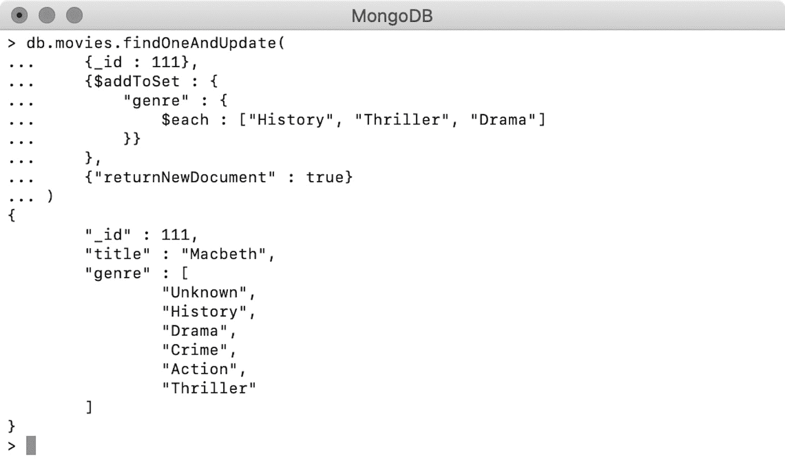

图 6.11：将多个元素添加到数组中作为集合

修改后的文档确认只有新的流派`Thriller`已经添加到数组中。

## 练习 6.02：经典电影的新类别

最近，由于《卡萨布兰卡》的重新发行，对经典电影的需求出现了相当大的增长。贵公司的分析部门发现，毫不奇怪，经典电影是唯一被评论家和观众评分都超过 95 分的电影。因此，贵公司希望将数据库中的所有这些电影都归为一个新的流派，名为“经典”。在您的电影文档中，样本番茄评分如下：

```js
"tomatoes" : {
"viewer" : {
        "rating" : 3.7,
        "numReviews" : 2559,
        "meter" : 75
    },
"fresh" : 6,
    "critic" : {
        "rating" : 7.6,
        "numReviews" : 6,
        "meter" : 100
    },
    "rotten" : 0,
    "lastUpdated" : ISODate("2015-08-08T19:16:10Z")
}
```

您的任务是在`viewer`和`critic`子对象的`meter`字段上添加一个过滤器，以找到经典电影并将它们归为新流派。以下步骤将帮助您完成此练习：

1.  打开文本编辑器并开始编写查询。您将需要准备一个更新命令来更新多个文档，因此使用`updateMany()`：

```js
db.movies.updateMany()
```

1.  在找到电影的第一个标准是观众的番茄评分需要超过 95。输入以下命令：

```js
db.movies.updateMany(
    {"tomatoes.viewer.meter" : {$gt : 95}}
)
```

在这里，您已经为观众评分添加了一个过滤器。由于该字段嵌套在一个嵌套字段中，因此您相应地使用了点符号。

1.  根据第二个标准，您需要在`critic`评分上放置相同的过滤器。将第二个标准添加到查询中，如下所示：

```js
db.movies.updateMany(
    {
        "tomatoes.viewer.meter" : {$gt : 95}, 
        "tomatoes.critic.meter" : {$gt : 95}
    }
)
```

在上述命令中，您已经将相同的过滤器添加到了评论家评分。该命令现在具有所有必需的过滤器。

1.  现在，创建一个更新表达式，将名为`Classic`的新流派添加到所有匹配的电影中：

```js
db.movies.updateMany(
    {
        "tomatoes.viewer.meter" : {$gt : 95}, 
        "tomatoes.critic.meter" : {$gt : 95}
    },
    {
        $addToSet : {"genres" : "Classic"}
    }
)
```

您现在已经添加了更新表达式。请注意，数组中的流派应始终是唯一的，因此您将使用`$addToSet`而不是`$push`将`Classic`元素添加到`genres`数组中。

1.  现在，打开一个 MongoDB shell 并连接到 Mongo Atlas 集群，然后转到`sample_mflix`数据库。在数据库上执行上述命令。输出应该如下所示：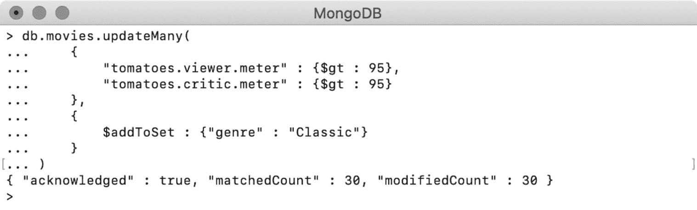

图 6.12：添加新流派

您可以看到所有 30 条记录都已成功更新。

1.  为了验证这一点，使用相同的条件编写一个`find`查询，并使用以下命令投影必要的字段：

```js
db.movies.find(
    {
        "tomatoes.viewer.meter" : {$gt : 95},
        "tomatoes.critic.meter" : {$gt : 95}
    },
    {
        "_id" : 0,
        "title" : 1,
        "genres" : 1
    }
)
```

这里的`find`查询使用相同的过滤器，并且仅显示`title`和`genres`字段。您可以看到以下输出：

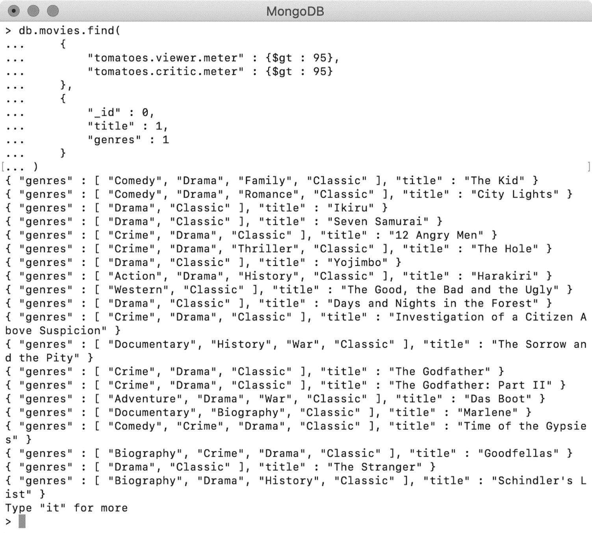

图 6.13：显示属于经典流派的电影的输出

输出表明，所有电影现在都有了新的流派“经典”。在这个练习中，您使用了集合的概念来解决业务问题。在下一节中，让我们来看看如何删除数组元素。

## 删除数组元素

到目前为止，我们已经学习了各种方法来向数组添加元素，并使用各种运算符对数组进行排序。MongoDB 还提供了从数组中删除元素的方法。在本节中，我们将介绍不同的运算符，允许您从数组中删除所有或特定的元素。

### 删除第一个或最后一个元素（$pop）

`$pop`运算符在更新命令中使用时，允许您删除数组中的第一个或最后一个元素。它一次删除一个元素，只能与值`1`（最后一个元素）或`-1`（第一个元素）一起使用：

```js
> db.movies.find({"_id" : 111}).pretty()
{
    "_id" : 111,
    "title" : "Macbeth",
    "genre" : [
        "unknown",
        "History",
        "Drama",
        "Crime",
        "Action",
        "Thriller"
    ]
}
```

在上面的片段中，输出显示电影记录的`genre`数组中有六个元素：

```js
db.movies.findOneAndUpdate(
    {_id : 111},
    {$pop : {"genre" : 1}},
    {"returnNewDocument" : true    }
)
```

上述的`findOneAndUpdate`操作在`genre`字段上使用了`$pop`，值为`1`，这将从数组中删除最后一个元素。命令的所有其他方面与我们在先前的示例中看到的一样：

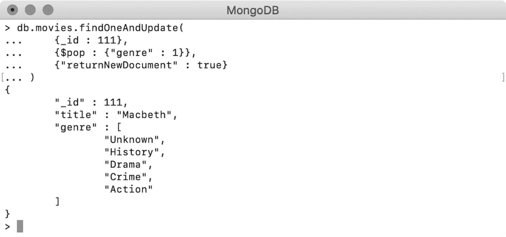

图 6.14：从数组中删除最后一个元素

修改后的文档表明最后一个元素（“惊悚”）已成功从数组中删除。现在，使用以下命令，将`$pop`的值设为`-1`：

```js
db.movies.findOneAndUpdate(
    {_id : 111},
    {$pop : {"genre" : -1}},
    {"returnNewDocument" : true    }
)
```

让我们看看执行此命令会发生什么：

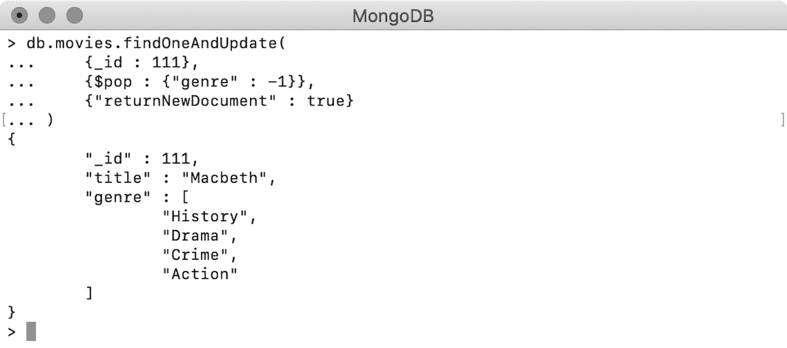

图 6.15：从数组中删除第一个元素

输出显示，数组的第一个元素（'未知'）现在已被删除。请记住，`$pop`只允许`1`或`-1`作为值，提供任何其他数字，包括零，都会导致错误。

### 删除所有元素

当您只需要从数组中删除某些元素时，可以使用`$pullAll`运算符。为此，您向运算符提供一个或多个元素，然后它将从数组中删除所有这些元素的出现。例如，考虑以下命令：

```js
db.movies.findOneAndUpdate(
    {_id : 111},
    {$pullAll : {"genre" : ["Action", "Crime"]}},
    {"returnNewDocument" : true    }
)
```

在此更新操作中，我们在`genre`字段中使用了`$pullAll`。我们以数组的形式提供了两个元素`动作`和`犯罪`。这个的输出如下：

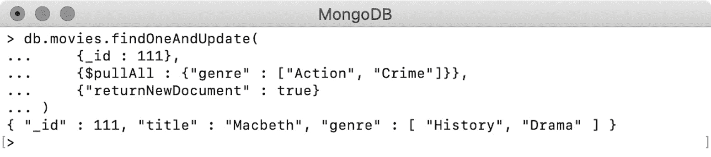

图 6.16：删除数组的所有元素

我们可以看到，指定的流派`动作`和`犯罪`现在已从底层数组中删除。

### 删除匹配的元素

在前面的示例中，我们看到了如何使用`$pullAll`从数组中删除特定元素。在这个例子中，我们将使用另一个名为`$pull`的运算符，编写一个查询条件，使用各种逻辑和条件运算符，并且与查询匹配的数组元素将被删除。例如，考虑以下片段，其中名为`items`的数组包含四个对象：

```js
> db.items.find({"_id" : 11}).pretty()
{
    "_id" : 11,
    "items" : [
        {
            "name" : "backpack",
            "price" : 127.59,
            "quantity" : 3
        },
        {
            "name" : "pens",
            "price" : 60.56,
            "quantity" : 3
        },
        {
            "name" : "binder",
            "price" : 18.17,
            "quantity" : 2
        },
        {
            "name" : "notepad",
            "price" : 17.6,
            "quantity" : 4
        }
    ]
}
```

现在，我们将编写一个使用`$pull`更新数组的查询。请记住，它允许我们使用逻辑和条件运算符的组合来准备查询条件，就像任何`find`查询一样：

```js
db.items.findOneAndUpdate(
    {_id : 11},
    {$pull : {
        "items" : {
            "quantity" : 3,
            "name" : {$regex: "ck$"}
        }
    }},
    {"returnNewDocument" : true    }
)
```

在此更新命令中，`$pull`运算符在数组字段`items`中提供了一个查询条件。条件过滤了数组元素，其中`quantity`为`3`且`name`以'ck'结尾。输出应该如下所示：

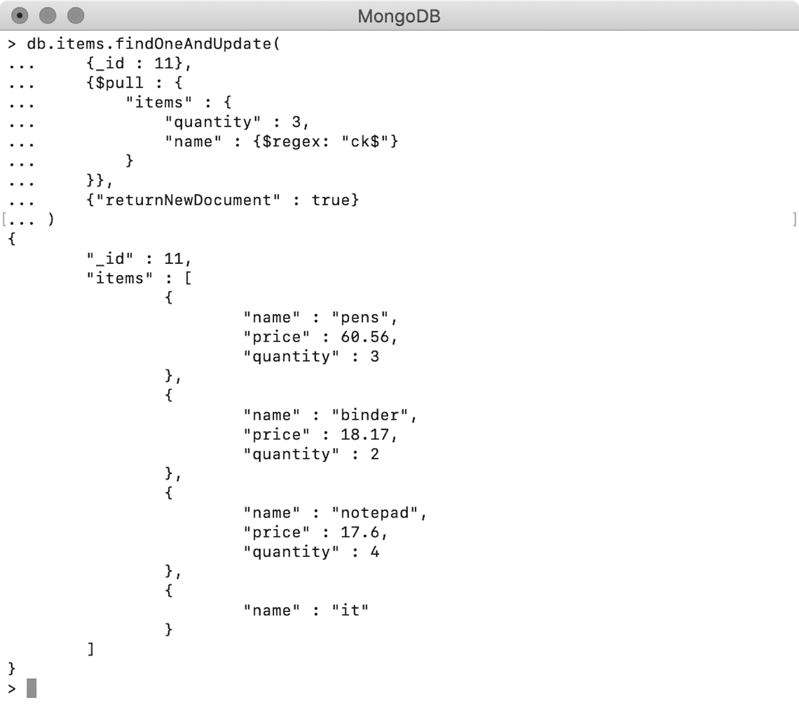

图 6.17：删除与给定正则表达式匹配的元素

响应中的文档显示，已删除了一个数量为`3`且名称以'ck'结尾的元素，正如预期的那样。现在让我们来看看如何更新数组元素。

## 更新数组元素

在数组中，每个元素都绑定到特定的索引位置。这些索引位置从零开始，我们可以使用一对方括号（`[`，`]`）和相应的索引位置来引用数组中的元素。使用带有`$`的这样一对方括号可以更新数组的元素。考虑以��片段，它显示了当前`genres`数组的外观：

```js
> db.movies.find({"_id" : 111})
{ "_id" : 111, "title" : "Macbeth", "genre" : [ "History", "Drama" ] }
```

`genres`数组有两个元素，我们将使用以下命令更新它们：

```js
db.movies.findOneAndUpdate(
    {_id : 111},
    {$set : {"genre.$[]" : "Action"}},
    {"returnNewDocument" : true}
)
```

在这个操作中，我们在`genres`字段中使用了`$set`。通过使用表达式`"genre.$[]"`来引用该字段，并提供值`Action`。`$[]`操作符引用给定数组中包含的所有元素，并且更新表达式将应用于所有这些元素：

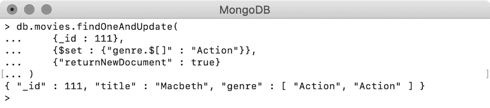

图 6.18：替换数组中的所有元素

文档中指出`genre`仍然是一个包含两个元素的数组。但是，这两个元素现在都已更改为`Action`。因此，我们可以使用`$[]`来更新数组的所有元素为相同的值。

同样，我们也可以更新数组中的特定元素。为此，我们首先需要找到这样的元素并对其进行标识。为了得到一个元素标识符，我们可以使用`arrayFilters`的更新选项来提供一个查询条件，并将其分配给匹配的元素的变量（称为标识符）。然后，我们使用标识符以及`$[]`来更新这些特定元素的值。为了看一个例子，我们将使用我们`items`集合中的文档并向其数组中添加一个元素，如下所示：

```js
> db.items.findOneAndUpdate(
    {"_id" : 11},
    {$push : {"items" : {"name" : "it"}}},
    {"returnNewDocument": true}
)
{
    "_id" : 11,
    "items" : [
        {
            "name" : "pens",
            "price" : 60.56,
            "quantity" : 3
        },
        {
            "name" : "binder",
            "price" : 18.17,
            "quantity" : 2
        },
        {
            "name" : "notepad",
            "price" : 17.6,
            "quantity" : 4
        },
        {
            "name" : "it"
        }
    ]
}
```

使用前面的`update`命令，我们已经向数组中添加了一个新元素。请注意，新添加的元素没有`price`和`quantity`字段。在接下来的更新命令中，我们将找到并更新这个数组中的元素：

```js
db.items.findOneAndUpdate(
    {_id : 11},
    {$set : {
        "items.$[myElements]" : {
            "quantity" : 7,
            "price" : 4.5,
            "name" : "marker"
        }
    }},
    {
        "returnNewDocument" : true,
        "arrayFilters" : [{"myElements.quantity" : null}]
    }
)
```

在前面的更新操作中，我们使用`$set`来更新`items`数组的元素。要更新的数组元素由`$[myElements]`的表达式引用，并分配一个新值，这是一个嵌套对象。`myElements`的标识符是使用`arrayFilters`基于查询条件定义的。所有匹配给定条件的元素都由`myElements`标识，然后使用`$set`进行更新：

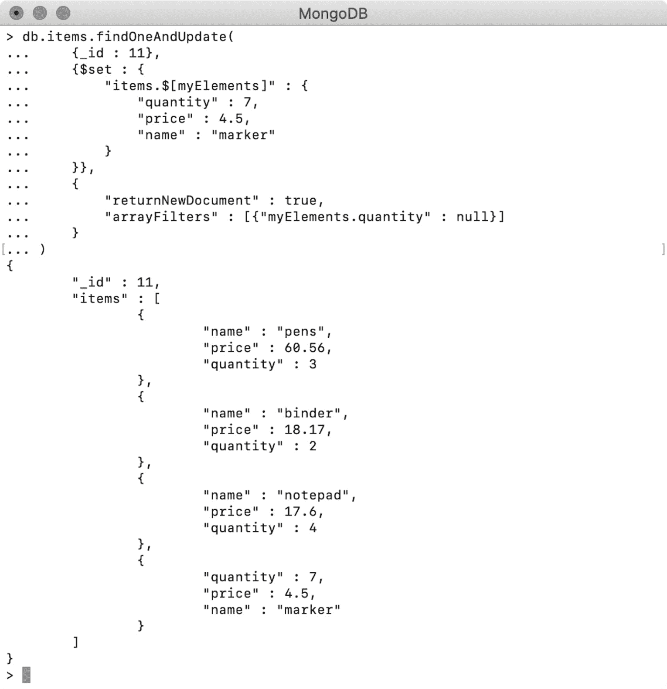

图 6.19：替换匹配给定过滤器的元素

查询条件`{quantity: null}`与数组的最后一个元素匹配，并已使用新文档进行更新。

## 练习 6.03：更新导演的姓名

在您的电影网站上，人们可以通过电影标题或演员或导演的名字找到电影。您在这个练习中的任务是连接到数据库，将其中一个导演的名字从`H. C. Potter`更改为`H. C. Potter (Henry Codman Potter)`，以便用户不会将他与另一个名字相似的导演混淆。请记住，一部电影或系列可能由多个人执导。数据库中的`directors`字段是一个数组，导演团队中的人可以出现在任何索引位置：

```js
db.movies.find(
    {"directors" : "H.C. Potter"}, 
    {_id : 0, title: 1, directors :1}
).pretty()
```

这个`find`命令通过导演的缩写名找到所有电影，并打印电影标题，然后是导演的名字：

1.  打开 mongo shell 并连接到 Mongo Atlas 集群上的`sample_mflix`数据库。

1.  由于所有六部电影都需要更新，使用`updateMany()`更新函数。打开任何文本编辑器，写入以下命令：

```js
db.movies.updateMany()
```

1.  接下来，在查询条件中使用导演的缩写名，如下所示：

```js
db.movies.updateMany(
    {"directors" : "H.C. Potter"}
)
```

这个命令仍然是不完整的，语法无效。到目前为止，您只在命令中添加了查询条件。

1.  接下来，添加更新表达式。因为您在这里更改了一个字段，所以在数组字段中使用`$set`操作符。此外，为了仅更改数组中的特定元素，请使用一个元素标识符：

```js
db.movies.updateMany(
    {"directors" : "H.C. Potter"},
    {$set : {
        "directors.$[hcPotter]" : "H.C. Potter (Henry Codman Potter)"
    }}
)
```

在前面（仍然不完整）的命令中，您已经在数组上添加了一个使用`$set`操作符的更新表达式。请注意，`hcPotter`标识符引用的数组元素正在被分配新值，即`Henry Codman Potter`。

1.  现在，您已经在更新表达式中使用了一个元素标识符，可以使用`arrayFilters`来定义标识符，如下所示：

```js
db.movies.updateMany(
    {"directors" : "H.C. Potter"},
    {$set : {
        "directors.$[hcPotter]" : "H.C. Potter (Henry Codman Potter)"
    }},
    {
        "arrayFilters" : [{hcPotter : "H.C. Potter"}]
    }
)
```

从前面的片段中可以看出，您已经添加了`arrayFilters`的选项。`hcPotter`的标识符被赋予了`H.C. Potter`的值，这个值目前存在于数组中。

1.  现在，打开 mongo shell 并连接到 MongoDB Atlas 集群。使用`sample_mflix`数据库并执行上述命令。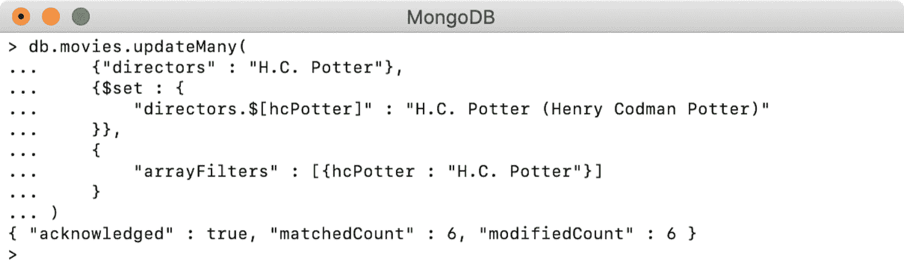

图 6.20：更新导演的名字

输出表明所有六条记录都被正确找到和更新了。

1.  现在，使用正则表达式在`directors`字段中找到导演的全名电影：

```js
db.movies.find(
    {"directors" : {$regex : "Henry Codman Potter"}}, 
    {_id : 0, title: 1, directors :1}
).pretty()
```

查询使用正则表达式根据导演的全名找到电影：

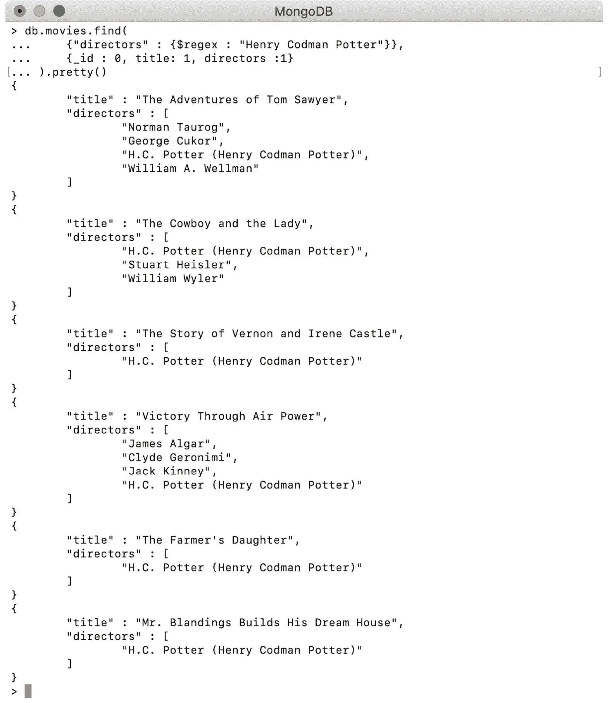

图 6.21：显示导演的正确姓名

输出表明您已正确更新了所有记录中的导演姓名。在这个练习中，您练习了使用数组过滤器来修改数组中的匹配元素。

在本节中，我们学习了如何更新文档中的数组字段。我们学会了添加新元素，从数组中删除元素，并更新数组中的特定元素。我们还学会了如何将数组视为集合，并对数组中的现有或新元素进行排序。

## 活动 6.01：向演员阵容中添加演员的名字

最近，您注意到了数据库中的一个错误。演员 Nick Robinson 在 2015 年的电影《侏罗纪世界》中扮演了`Zach`的角色。然而，电影记录中的`cast`字段没有将这位演员归属于这部电影：

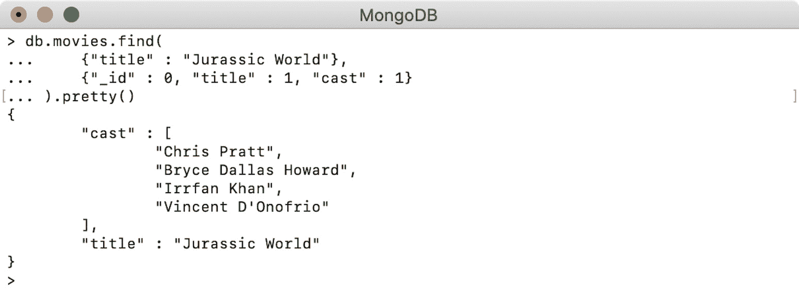

图 6.22：仅显示电影的演员阵容

如前面的屏幕截图所示，输出确认了演员的名字丢失了。您在这个活动中的任务是将`Nick Robinson`添加到这部电影的演员阵容中，并按演员名字对这个数组进行排序。作为最佳实践，您还应确保`cast`数组具有唯一值。以下步骤将帮助您完成这个活动：

1.  根据电影标题准备一个查询表达式，并向其添加一个更新表达式。由于您必须避免重复插入，因此应使用`$addToSet`运算符将数组视为集合。

1.  接下来，您需要对数组进行排序。由于集合被认为是唯一且无序元素的集合，因此在使用`$addToSet`时无法对元素进行排序。因此，首先将唯一元素的元素推入数组。

1.  最后，创建另一个更新命令并对所有数组进行排序。

在这个活动中，您向数组添加了唯一元素并对它们进行了排序。您还验证了不可能同时将元素添加到数组中并对其进行排序。

注意

此活动的解决方案可以通过此链接找到。

# 总结

我们通过学习如何使用聚合管道支持来更新文档来开始本章。聚合管道支持是在 MongoDB 4.2 版本中引入的，它帮助我们执行一些复杂的更新。使用聚合管道支持，我们可以编写多阶段的更新表达式，其中一个阶段的输出作为下一个阶段的输入。它还允许我们使用字段引用和聚合运算符。我们还学会了如何操作数组字段中的元素，如何向数组中添加、删除和更新元素，如何对数组进行排序，以及如何向数组中添加唯一元素。

在下一章中，我们将详细学习 MongoDB 聚合框架和管道。
