# 第七章：7. 数据聚合

概述

本章向您介绍了聚合的概念及其在 MongoDB 中的实现。您将学习如何识别聚合命令的参数和结构，使用主要聚合阶段组合和操作数据，使用高级聚合阶段处理大型数据集，并优化和配置聚合以获得查询的最佳性能。

# 介绍

在之前的章节中，我们学习了与 MongoDB 交互的基础知识。通过这些基本操作（`insert`，`update`和`delete`），我们现在可以开始探索和操作我们的数据，就像操作任何其他数据库一样。我们还观察到，通过充分利用`find`命令选项，我们可以使用操作符来回答关于我们数据的更具体的问题。我们还可以在查询中进行排序、限制、跳过和投影，以创建有用的结果集。

在更简单的情况下，这些结果集可能足以回答您所需的业务问题或满足用例。然而，更复杂的问题需要更复杂的查询来解决。仅使用`find`命令解决这些问题将是非常具有挑战性的，并且可能需要多个查询或在客户端进行一些处理来组织或链接数据。

基本限制是当您的数据包含在两个单独的集合中。要找到正确的数据，您将不得不运行两个查询，而不是一个，将数据连接在客户端或应用程序级别。这可能看起来不是一个大问题，但随着应用程序或数据集的规模增加，性能和复杂性也会增加。在可能的情况下，最好让服务器来处理所有繁重的工作，只返回我们在单个查询中寻找的数据。这就是**聚合管道**的作用。

`find`命令。除此之外，聚合的管道结构允许开发人员和数据库分析师轻松、迭代地快速构建查询，处理不断变化和增长的数据集。如果您想在 MongoDB 中以规模完成任何重要的工作，您将需要编写复杂的多阶段聚合管道。在本章中，我们将学习如何做到这一点。

注意

在本章的整个过程中，包括的练习和活动都是针对一个场景的迭代。数据和示例都基于名为`sample_mflix`的 MongoDB Atlas 示例数据库。

考虑一个情景，一个电影公司正在举办年度经典电影马拉松，并试图决定他们应该播放什么电影。他们需要各种符合特定标准的热门电影来满足他们的客户群。公司已经要求你进行研究，确定他们应该展示哪些电影。在本章中，我们将使用聚合来检索给定一组复杂约束条件的数据，然后转换和操作数据，以创建新的结果，并用单个查询回答整个数据集的业务问题。这将帮助电影公司决定他们应该展示哪些电影来满足他们的客户。

值得注意的是，聚合管道足够强大，有许多方法可以完成相同的任务。本章涵盖的练习和活动只是解决所提出情景的一个解决方案，并且可以使用不同的模式来解决。掌握聚合管道的最佳方法是考虑多种方法来解决同一个问题。

# 聚合是新的查找

MongoDB 中的`aggregate`命令类似于`find`命令。您可以以 JSON 文档的形式提供查询的条件，并输出包含搜索结果的`cursor`。听起来很简单，对吧？那是因为它确实如此。尽管聚合可能变得非常庞大和复杂，但在其核心，它们是相对简单的。

聚合中的关键元素称为管道。我们将很快详细介绍它，但在高层次上，管道是一系列指令，其中每个指令的输入是前一个指令的输出。简而言之，聚合是一种以程序方式从集合中获取数据，并进行过滤、转换和连接其他集合的方法，以创建新的有意义的数据集。

## 聚合语法

`aggregate`命令与其他**创建、读取、更新、删除**（CRUD）命令一样，操作在集合上，如下所示：

```js
use sample_mflix;
var pipeline = [] // The pipeline is an array of stages.
var options  = {} // We will explore the options later in the   chapter.
var cursor   = db.movies.aggregate(pipeline, options);
```

聚合使用了两个参数。`pipeline`参数包含了查找、排序、投影、限制、转换和聚合数据的所有逻辑。`pipeline`参数本身作为 JSON 文档数组传递。您可以将其视为要发送到数据库的一系列指令，然后在最终阶段之后产生的数据存储在`cursor`中返回给您。管道中的每个阶段都是独立完成的，依次进行，直到没有剩余的阶段。第一个阶段的输入是集合（在上面的示例中是`movies`），每个后续阶段的输入是前一个阶段的输出。

第二个参数是`options`参数。这是可选的，允许您指定配置的细节，比如聚合应该如何执行或者在调试和构建管道过程中需要的一些标志。

`aggregate`命令中的参数比`find`命令中的参数少。我们将在本章的最后一个主题中介绍`options`，所以现在我们可以通过完全排除`options`来简化我们的命令，如下所示：

```js
var cursor = db.movies.aggregate(pipeline);
```

在上面的示例中，我们首先将管道保存为变量，而不是直接将管道写入命令中。聚合管道可能会变得非常庞大，在开发过程中难以解析。将管道（甚至管道的大部分）分开为单独的变量以提高代码清晰度有时可能会有所帮助。虽然建议这样做，但这种模式完全是可选的，类似于以下内容：

```js
var cursor = db.movies.aggregate([])
```

建议您在代码或文本编辑器中跟随这些示例，保存您的脚本，然后将其复制粘贴到 MongoDB shell 中。例如，假设我们创建了一个名为`aggregation.js`的文件，内容如下：

```js
var MyAggregation_A = function() {
    print("Running Aggregation Script Ch7.1");
    var pipeline = [];
      // This next line stores our result in a cursor.
    var cursor = db.movies.aggregate(pipeline);
      // This line will print the next iteration of our cursor.
    printjson(cursor.next())
};
MyAggregation_A();
```

然后，将此代码直接复制到 MongoDB shell 中，将返回以下输出：

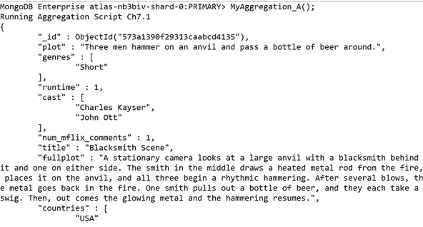

图 7.1：聚合结果（为简洁起见输出被截断）

我们可以看到，在定义了`MyAggregation_A.js`函数之后，我们只需要再次调用该函数即可查看我们聚合的结果（在本例中是电影列表）。您可以一遍又一遍地调用这个函数，而无需每次都写整个管道。

通过以这种方式构建聚合，您将不会丢失任何聚合。它还有一个额外的好处，可以让您将所有聚合作为函数交互地加载到 shell 中。但是，如果您愿意，也可以将整个函数复制粘贴到 MongoDB shell 中，或者直接交互输入。在本章中，我们将两种方法混合使用。

## 聚合管道

如前所述，聚合中的关键元素是管道，它是对初始集合执行的一系列指令。您可以将数据视为流经此管道的水，在每个阶段进行转换和过滤，直到最终作为结果倒出管道的末端。

在下图中，橙色块代表聚合管道。管道中的每个块都被称为聚合阶段：

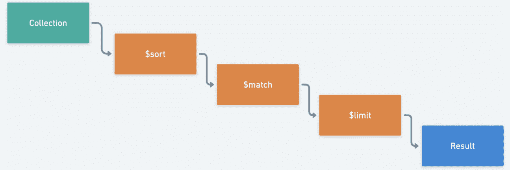

图 7.2：聚合管道

关于聚合的一点需要注意的是，虽然管道始终以一个集合开始，但使用某些阶段，我们可以在管道中进一步添加集合。我们将在本章后面讨论加入集合。

大型多阶段管道可能看起来令人生畏，但是如果您了解命令的结构以及可以在给定阶段执行的各个操作，那么您可以轻松地将管道分解为较小的部分。在本主题中，我们将探讨聚合管道的构建，比较使用`find`实现的查询与使用`aggregate`创建的查询，并识别一些基本操作符。

## 管道语法

聚合管道的语法非常简单，就像`aggregate`命令本身一样。管道是一个数组，数组中的每个项都是一个对象：

```js
var pipeline = [
        { . . . },
        { . . . },
        { . . . },
];
```

数组中的每个对象代表整个管道中的单个阶段，阶段按其数组顺序（从上到下）执行。每个阶段对象采用以下形式：

```js
{$stage : parameters}
```

该阶段代表我们要对数据执行的操作（如`limit`或`sort`），参数可以是单个值或另一个对象，具体取决于阶段。

管道可以通过两种方式传递，可以作为保存的变量，也可以直接作为命令。以下示例演示了如何将管道作为变量传递：

```js
var pipeline = [
        { $match:   { "location.address.state": "MN"} },
        { $project: { "location.address.city": 1    } },
        { $sort:    { "location.address.city": 1    } },
        { $limit: 3 }
     ];
```

然后，在 MongoDB shell 中键入`db.theaters.aggregate(pipeline)`命令将提供以下输出：

```js
MongoDB Enterprise atlas-nb3biv-shard-0:PRIMARY> var pipeline = [
...         { $match:   { "location.address.state": "MN"} },
...         { $project: { "location.address.city": 1    } },
...         { $sort:    { "location.address.city": 1    } },
...         { $limit: 3 }
...      ];
MongoDB Enterprise atlas-nb3biv-shard-0:PRIMARY> 
MongoDB Enterprise atlas-nb3biv-shard-0:PRIMARY> db.theaters.aggregate(pipeline)
{ "_id" : ObjectId("59a47287cfa9a3a73e51e94f"), "location" :   { "address" : { "city" : "Apple Valley" } } }
{ "_id" : ObjectId("59a47287cfa9a3a73e51eb8f"), "location" :   { "address" : { "city" : "Baxter" } } }
{ "_id" : ObjectId("59a47286cfa9a3a73e51e833"), "location" :   { "address" : { "city" : "Blaine" } } }
MongoDB Enterprise atlas-nb3biv-shard-0:PRIMARY>
```

直接将其传递到命令中，输出如下：

```js
MongoDB Enterprise atlas-nb3biv-shard-0:PRIMARY> db   .theaters.aggregate([
... ...         { $match:   { "location.address.state": "MN"} },
... ...         { $project: { "location.address.city": 1    } },
... ...         { $sort:    { "location.address.city": 1    } },
... ...         { $limit: 3 }
... ...      ]
... );
{ "_id" : ObjectId("59a47287cfa9a3a73e51e94f"), "location" :   { "address" : { "city" : "Apple Valley" } } }
{ "_id" : ObjectId("59a47287cfa9a3a73e51eb8f"), "location" :   { "address" : { "city" : "Baxter" } } }
{ "_id" : ObjectId("59a47286cfa9a3a73e51e833"), "location" :   { "address" : { "city" : "Blaine" } } }
MongoDB Enterprise atlas-nb3biv-shard-0:PRIMARY> 
```

如您所见，使用任一方法都会得到相同的输出。

## 创建聚合

让我们开始探索管道本身。将以下代码粘贴到 MongoDB shell 中，将帮助我们获取明尼苏达州（MN）所有剧院的列表：

```js
var simpleFind = function() {
    // Find command using filter, project, sort and limit.
    print("Find Result:")
    db.theaters.find(
        {"location.address.state" : "MN"}, 
        {"location.address.city" : 1})
    .sort({"location.address.city": 1})
    .limit(3)
    .forEach(printjson);
}
simpleFind();
```

这将给我们以下输出：

```js
MongoDB Enterprise atlas-nb3biv-shard-0:PRIMARY> simpleFind();
Find Result:
{
        "_id" : ObjectId("59a47287cfa9a3a73e51e94f"),
        "location" : {
                "address" : {
                        "city" : "Apple Valley"
                }
        }
}
{
        "_id" : ObjectId("59a47287cfa9a3a73e51eb8f"),
        "location" : {
                "address" : {
                        "city" : "Baxter"
                }
        }
}
{
        "_id" : ObjectId("59a47286cfa9a3a73e51e7e2"),
        "location" : {
                "address" : {
                        "city" : "Blaine"
                }
        }
}
```

这个语法现在应该看起来非常熟悉。这是一个非常简单的命令，让我们看看涉及的步骤：

1.  匹配剧院收集以获取`MN`（明尼苏达州）州内所有剧院的列表。

1.  只投影剧院所在的城市。

1.  按`city`名称对列表进行排序。

1.  将结果限制为前`三`个剧院。

让我们将此命令重建为聚合。如果一开始看起来有点令人生畏，不要担心。我们将逐步进行解释：

```js
var simpleFindAsAggregate = function() {
    // Aggregation using match, project, sort and limit.
    print ("Aggregation Result:")
    var pipeline = [
        { $match:   { "location.address.state": "MN"} },
        { $project: { "location.address.city": 1    } },
        { $sort:    { "location.address.city": 1    } },
        { $limit: 3 }
    ];
    db.theaters.aggregate(pipeline).forEach(printjson);
};
simpleFindAsAggregate();
```

您应该看到以下输出：

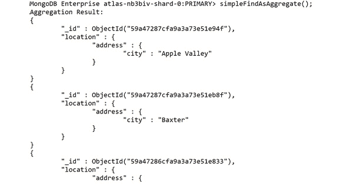

图 7.3：聚合结果（为简洁起见输出被截断）

如果您运行这两个函数，将会得到相同的结果。请记住，`find`和`aggregate`命令都返回一个游标，但我们在最后使用`.forEach(printjson);`将它们打印到控制台以便理解。

如果您观察前面的示例，应该能够从`find`中匹配出大部分相同的功能。`project`、`sort`和`limit`都以 JSON 文档的形式存在，就像在`find`命令中一样。这些的唯一显着差异是它们现在是数组中的文档，而不是函数。我们管道开头的`$match`阶段相当于我们的过滤文档。因此，让我们逐步分解它：

1.  首先，搜索剧院收集，以查找与州`MN`匹配的文档：

```js
{ $match:   { "location.address.state": "MN"} },
```

1.  将此剧院列表传递到第二阶段，该阶段仅投影所选州内剧院所在的城市：

```js
{ $project: { "location.address.city": 1    } },
```

1.  然后将这个城市（和 ID）列表传递到`sort`阶段，按城市名称按字母顺序排序数据：

```js
{ $sort:    { "location.address.city": 1    } },
```

1.  最后，列表传递到`limit`阶段，仅输出前三个条目：

```js
{ $limit: 3 }
```

相当简单，对吧？您可以想象这个管道在生产中可能会变得多么庞大和复杂，但它的一个优点是能够将大型管道分解为较小的子部分或单个阶段。通过逐个和顺序地查看阶段，看似难以理解的查询可以变得相当简单。同样重要的是要注意，步骤的顺序与阶段本身一样重要，不仅在逻辑上，而且在性能上也是如此。`$match`和`$project`阶段首先执行，因为这些将在每个阶段减少结果集的大小。虽然不适用于每种类型的查询，但通常最好的做法是尽早尝试减少您正在处理的文档数量，忽略任何会给服务器增加过大负载的文档。

尽管管道结构本身很简单，但是需要更复杂的阶段和运算符来完成高级聚合，并对其进行优化。在接下来的几个主题中，我们将看到许多这样的内容。

## 练习 7.01：执行简单的聚合

在开始这个练习之前，让我们回顾一下*介绍*中概述的电影公司，该公司每年都会举办经典电影马拉松。在以前的几年里，他们在最终手工合并所有数据之前，对几个子类别使用了手动流程。作为这项任务的初始研究的一部分，您将尝试将他们的一个较小的手动流程重新创建为 MongoDB 聚合。这个任务将使您更熟悉数据集，并为更复杂的查询打下基础。

您决定重新创建的流程如下：

“*返回按 IMDb 评分排序的前三部爱情类型电影，并且只返回 2001 年之前发布的电影*”

可以通过执行以下步骤来完成：

1.  将您的查询转换为顺序阶段，这样您就可以将其映射到聚合阶段：限制为三部电影，仅匹配爱情电影，按 IMDb 评分排序，并且仅匹配 2001 年之前发布的电影。

1.  尽可能简化您的阶段，通过合并重复的阶段来简化。在这种情况下，您可以合并两个匹配阶段：限制为三部电影，按 IMDb 评分排序，并匹配 2001 年之前发布的爱情电影。

重要的是要记住，阶段的顺序是至关重要的，除非我们重新排列它们，否则将产生错误的结果。为了演示这一点，我们将暂时保留它们的错误顺序。

1.  快速查看电影文档的结构，以帮助编写阶段：

```js
db.movies.findOne();
```

文档如下所示：

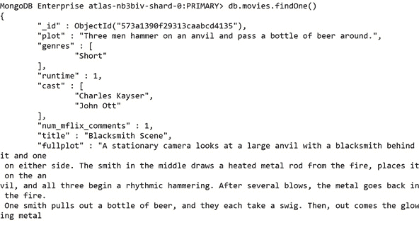

图 7.4：查看文档结构（输出被截短以保持简洁）

对于这个特定的用例，您将需要`imdb.rating`、`released`和`genres`字段。现在您知道您要搜索什么，可以开始编写您的管道了。

1.  创建一个名为`Ch7_Activity1.js`的文件，并添加以下基本阶段：`limit`以将输出限制为三部电影，`sort`以按其评分对其进行排序，并且`match`以确保您只找到 2001 年之前发布的爱情电影：

```js
// Ch7_Exercise1.js   
var findTopRomanceMovies = function() {
       print("Finding top Classic Romance Movies...");
       var pipeline = [
           { $limit: 3 }, // Limit to 3 results.
            { $sort: {"imdb.rating": -1}}, // Sort by IMDB rating.
      { $match: {. . .}}
        ];
        db.movies.aggregate(pipeline).forEach(printjson);
    }
    findTopRomanceMovies();
```

`$match`运算符的功能与`find`命令中的过滤参数非常相似。您可以简单地传入两个条件而不是一个。

1.  对于`早于 2001 年`的条件，使用`$lte`运算符：

```js
// Ch7_Exercise1.js
    var findTopRomanceMovies = function() {
        print("Finding top Classic Romance Movies...");
        var pipeline = [
            { $limit: 3 },         // Limit to 3 results.
            { $sort: {"imdb.rating": -1}}, // Sort by IMDB rating.
            { $match: {
                genres: {$in: ["Romance"]}, // Romance movies only.
                released: {$lte: new ISODate("2001-01-01T00:00:                  00Z") }}},
        ];
        db.movies.aggregate(pipeline).forEach(printjson);
}
findTopRomanceMovies();
```

因为`genres`字段是一个数组（电影可以属于多种类型），您必须使用`$in`运算符来查找包含您所需值的数组。

1.  现在运行这个管道；您可能会注意到它不返回任何文档：

```js
MongoDB Enterprise atlas-nb3biv-shard-0:PRIMARY>   findTopRomanceMovies();
Finding top Classic Romance Movies...
MongoDB Enterprise atlas-nb3biv-shard-0:PRIMARY>
```

是否可能没有文档满足这个查询？当然，可能没有电影满足所有这些要求。然而，正如你可能已经猜到的那样，在这里并非如此。正如前面所述，导致产生误导结果的是管道的顺序。因为你的限制阶段是管道中的第一个阶段，你只能查看三个文档，后续阶段没有足够的数据来找到匹配。因此，记住这一点总是很重要：

*在编写聚合管道时，操作的顺序很重要。*

因此，重新排列它们，确保你只在管道的末尾限制你的文档。由于命令的类似数组结构，这是相当容易的：只需剪切限制阶段，然后粘贴到管道的末尾。

1.  安排阶段，使限制发生在最后，不会产生不正确的结果：

```js
// Our new pipeline.
var pipeline = [
            { $sort: {"imdb.rating": -1}}, // Sort by IMDB rating.
            { $match: {
                genres: {$in: ["Romance"]}, // Romance movies only.
                released: {$lte: new ISODate("2001-01-01T00:00:                  00Z") }}},
            { $limit: 3 },  // Limit to 3 results (last stage)
        ];
```

1.  在更改后重新运行这个查询。这次，文档被返回：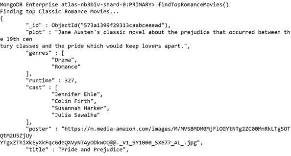

图 7.5：有效文档返回的输出（为简洁起见，输出被截断）

这是编写聚合管道的挑战之一：这是一个迭代过程，当处理大量复杂文档时可能会很麻烦。

缓解这一痛点的一种方法是在开发过程中添加简化数据的阶段，然后在最终查询中删除这些阶段。在这种情况下，你将添加一个阶段，只投影你正在查询的数据。这将使你更容易判断你是否捕捉到了正确的条件。在这样做时，你必须小心，不要影响查询的结果。我们将在本章后面更详细地讨论这个问题。现在，你可以简单地在最后添加投影阶段，以确保它不会干扰你的查询。

1.  在管道的末尾添加一个投影阶段来帮助调试你的查询：

```js
var pipeline = [
    { $sort:  {"imdb.rating": -1}}, // Sort by IMDB rating.
    { $match: {
    genres: {$in: ["Romance"]}, // Romance movies only.
    released: {$lte: new ISODate("2001-01-01T00:00:00Z") }}},
    { $limit: 3 },     // Limit to 3 results.
    { $project: { genres: 1, released: 1, "imdb.rating": 1}}
];
```

1.  再次运行这个查询，你会看到一个更短、更容易理解的输出，如下面的代码块所示：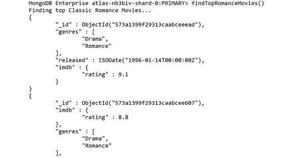

图 7.6：前面片段的输出

如果你是从桌面上的文件运行代码，请记住，你可以直接将整个代码片段（如下所示）复制并粘贴到你的 shell 中：

```js
// Ch7_Exercise1.js
var findTopRomanceMovies = function() {
    print("Finding top Classic Romance Movies...");
       var pipeline = [
        { $sort: {"imdb.rating": -1}}, // Sort by IMDB rating.
        { $match: {
            genres: {$in: ["Romance"]}, // Romance movies only.
            released: {$lte: new ISODate("2001-01-01T00:00:              00Z") }}},
        { $limit: 3 },          // Limit to 3 results.
        { $project: { genres: 1, released: 1, "imdb.rating": 1}}
];
    db.movies.aggregate(pipeline).forEach(printjson);
}
findTopRomanceMovies();
```

输出应该如下：

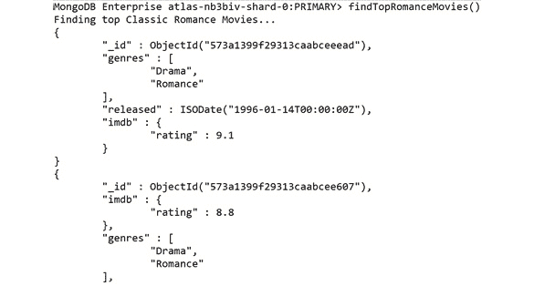

图 7.7：2001 年之前发布的经典浪漫电影排行榜

你还可以看到返回的每部电影都是浪漫类别的，2001 年之前发布的，并且具有较高的 IMDb 评分。因此，在这个练习中，你成功地创建了你的第一个聚合管道。现在，让我们拿刚刚完成的管道，努力改进一下。当你相信你已经完成了一个管道时，询问自己通常是有帮助的：

“我能减少通过管道传递的文档数量吗？”

在下一个练习中，我们将尝试回答这个问题。

## 练习 7.02：聚合结构

把管道想象成一个多层漏斗。它从顶部开始变宽，向底部变窄。当你把文档倒入漏斗顶部时，有很多文档，但随着你向下移动，这个数字在每个阶段都在减少，直到只有你想要的文档在底部输出。通常，实现这一点的最简单方法是先进行匹配（*过滤*）。

在这个管道中，你将对集合中的所有文档进行排序，并丢弃不匹配的文档。你目前正在对不需要的文档进行排序。交换这些阶段：

1.  交换`match`和`sort`阶段以提高管道的效率：

```js
        var pipeline = [
            { $match: {
                genres: {$in: ["Romance"]}, // Romance movies only.
                released: {$lte: new ISODate("2001-01-01T00:00:                  00Z") }}},
            { $sort: {"imdb.rating": -1}}, // Sort by IMDB rating.
            { $limit: 3 },            // Limit to 3 results.
            { $project: { genres: 1, released: 1,               "imdb.rating": 1}}
];
```

另一个需要考虑的事情是，虽然你有一个符合条件的电影列表，但你希望你的结果对你的用例有意义。在这种情况下，你希望你的结果对查看这些数据的电影公司有意义和用处。他们可能最关心电影的标题和评分。他们可能还希望看到电影是否符合他们的要求，所以最后让我们将这些投影出来，丢弃所有其他属性。

1.  在投影阶段添加电影 `title` 字段。你的最终聚合应该是这样的：

```js
// Ch7_Exercise2.js
var findTopRomanceMovies = function() {
    print("Finding top Classic Romance Movies...");
    var pipeline = [
        { $match: {
            genres: {$in: ["Romance"]}, // Romance movies only.
            released: {$lte: new ISODate("2001-01-01T00:00:              00Z") }}},
        { $sort: {"imdb.rating": -1}}, // Sort by IMDB rating.
        { $limit: 3 },     // Limit to 3 results.
        { $project: { title: 1, genres: 1, released: 1,           "imdb.rating": 1}}
    ];
    db.movies.aggregate(pipeline).forEach(printjson);
}
findTopRomanceMovies();
```

1.  通过复制并粘贴 *步骤 2* 中的代码重新运行你的管道。你应该看到排名前两的电影是 `傲慢与偏见` 和 `阿甘正传`：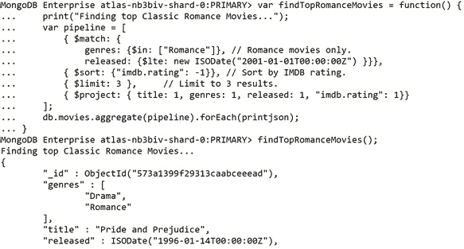

图 7.8：前面片段的输出

如果你看到这些结果，你刚刚优化了你的第一个聚合管道。

正如你所看到的，聚合管道是灵活、强大且易于操作的，但你可能会认为对于这种用例来说似乎有点过于复杂，可能大多数情况下一个简单的 `find` 命令就能解决问题。的确，聚合管道并不是每个简单查询都需要的，但你只是刚刚开始。在接下来的几节中，你将看到 `aggregate` 命令提供了 `find` 命令所不具备的功能。

# 数据操作

我们大部分的活动和示例都可以归结为以下几点：在一个集合中有一个或多个文档应该以一种简单易懂的格式返回一些或所有文档。在本质上，`find` 命令和聚合管道只是关于识别和获取正确的文档。然而，聚合管道的能力要比 `find` 命令更加强大和广泛。

使用管道中一些更高级的阶段和技术可以让我们转换我们的数据，衍生新的数据，并在更广泛的范围内生成见解。聚合命令的这种更广泛的实现比仅仅将一个 find 命令重写为一个管道更为常见。如果你想要回答复杂的问题或从你的数据中提取最大可能的价值，你需要知道如何实现聚合管道的聚合部分。

毕竟，我们甚至还没有开始聚合任何数据。在这个主题中，我们将探讨如何开始转换和聚合你的数据的基础知识。

## 分组阶段

正如你从名称中期望的那样，`$group` 阶段允许你根据特定条件对文档进行分组（*或聚合*）。虽然有许多其他阶段和方法可以使用 `aggregate` 命令来完成各种任务，但是 `$group` 阶段是最强大查询的基石。以前，我们能够返回的最重要的数据单元是一个文档。我们可以对这些文档进行排序，通过直接比较文档来获得洞察力。然而，一旦我们掌握了 `$group` 阶段，我们就能够通过将文档聚合成大的逻辑单元来增加我们查询的范围到整个集合。一旦我们有了更大的分组，我们可以像在每个文档基础上一样应用我们的过滤、排序、限制和投影。

`$group` 阶段的最基本实现只接受一个 `_id` 键，其值为一个表达式。这个表达式定义了管道将文档分组在一起的条件。这个值成为了新生成的文档的 `_id`，每个唯一的 `_id` 会生成一个文档。例如，以下代码将按照电影的评分对其进行分组，为每个评分类别输出一个记录：

```js
    var pipeline = [
     {$group: {
         _id: "$rated"
     }}
    ];
    db.movies.aggregate(pipeline).forEach(printjson);
```

结果输出将如下所示：

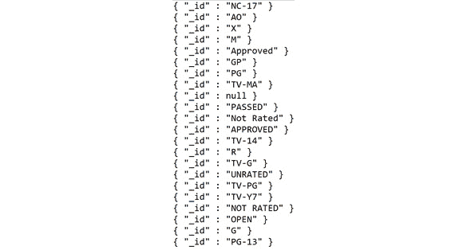

图 7.9：前面片段的结果输出

在我们的 `$group` 阶段中，你可能会注意到的第一件事是 `rated` 字段之前的 `$` 符号。如前所述，我们的 `_id` 键的值是一个*表达式*。在聚合术语中，表达式可以是文字，表达式对象，运算符或字段路径。在这种情况下，我们传递了一个字段路径，它告诉管道应该访问输入文档中的哪个字段。在 MongoDB 中，你可能已经遇到过字段路径，也可能没有。

你可能会想为什么我们不能像在 find 命令中那样传递字段名。这是因为在聚合时，我们需要告诉管道我们想要访问当前正在聚合的文档的字段。`$group` 阶段将 `_id: "$rated"` 解释为等同于 `_id: "$$CURRENT.rated"`。这可能看起来很复杂，但它表明对于每个文档，它将适合与具有相同（当前）文档的 `"rated"` 键的组匹配。在下一节的实践中，这将变得更清晰。

到目前为止，按单个字段分组已经很有用，可以得到唯一值的列表。然而，这并没有告诉我们更多关于我们的数据。我们想要了解这些不同的组更多信息；例如，每个组中有多少个标题？这就是我们的累加表达式会派上用场的地方。

## 累加器表达式

`$group` 命令可以接受不止一个参数。它还可以接受任意数量的其他参数，格式如下：

```js
field: { accumulator: expression},
```

让我们将这个分解成它的三个组件：

+   `field` 将为每个组定义我们新计算的字段的键。

+   `accumulator` 必须是一个受支持的累加器运算符。这些是一组运算符，就像你可能已经使用过的其他运算符一样 - 例如 `$lte` - 除了，正如名称所示，它们将在属于同一组的多个文档之间累积它们的值。

+   在这种情况下，`expression` 将作为输入传递给 `accumulator` 运算符，告诉它应该累积每个文档中的哪个字段。

在前面的示例基础上，让我们确定每个组中电影的总数：

```js
    var pipeline = [
     {$group: {
         _id: "$rated",
         "numTitles": { $sum: 1},
     }}
    ];
    db.movies.aggregate(pipeline).forEach(printjson);
```

从中可以看出，我们可以创建一个名为 `numTitles` 的新字段，该字段的值是每个组的文档总和。这些新创建的字段通常被称为累积结果迄今为止的 `1`。在 MongoDB shell 中运行这个命令将给我们以下结果：

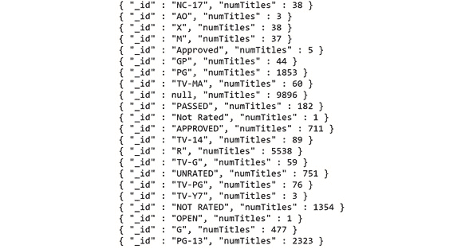

图 7.10：前面片段的输出

同样，我们可以累积给定字段的值，而不仅仅是在每个文档上累积 `1`。例如，假设我们想要找到每部电影在一个评级中的总运行时间。我们按 `rating` 字段分组，并累积每部电影的运行时间：

```js
    var pipeline = [
     {$group: {
         _id: "$rated",
         "sumRuntime": { $sum: "$runtime"},
     }}
    ];
    db.movies.aggregate(pipeline).forEach(printjson);
```

记住，我们必须在运行时间字段前加上 `$` 符号，告诉 MongoDB 我们正在引用我们正在累积的每个文档的运行时间值。我们的新结果如下：

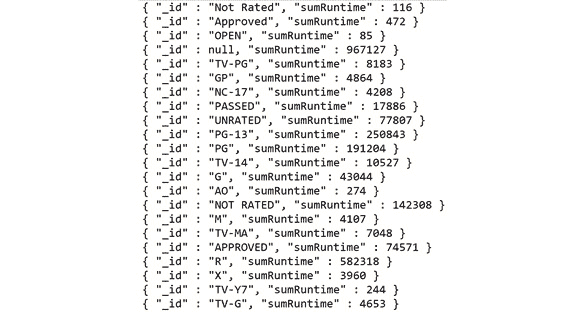

图 7.11：前面片段的输出

虽然这是一个简单的例子，但你可以看到，只需一个聚合阶段和两个参数，我们就可以开始以令人兴奋的方式转换我们的数据。几个累加器运算符可以组合和层叠，以生成关于组的更复杂和有见地的信息。我们将在接下来的示例中看到其中一些运算符。

重要的是要注意，我们不仅可以使用累加器运算符作为我们的表达式。我们还可以使用其他几个有用的运算符，在累积数据之后对数据进行转换。假设我们想要得到每个组的标题的平均运行时间。我们可以将我们的 `$sum` 累加器更改为 `$avg`，这将返回每个组的平均运行时间，因此我们的管道变为如下：

```js
    var pipeline = [
     {$group: {
        _id: "$rated",
        "avgRuntime": { $avg: "$runtime"},
     }}
    ];
    db.movies.aggregate(pipeline).forEach(printjson);
```

然后我们的输出变为：

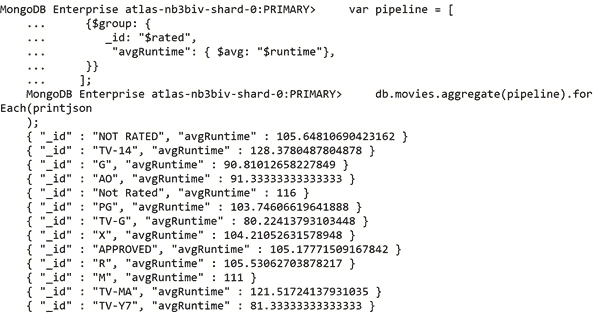

图 7.12：基于评分的平均运行时间值

在这种情况下，这些平均运行时间值并不特别有用。让我们添加另一个阶段来投影运行时间，使用`$trunc`阶段，给我们一个整数值：

```js
    var pipeline = [
     {$group: {
         _id: "$rated",
         "avgRuntime": { $avg: "$runtime"},
     }},
     {$project: {
         "roundedAvgRuntime": { $trunc: "$avgRuntime"}
     }}
    ];
    db.movies.aggregate(pipeline).forEach(printjson);
```

这将为我们提供一个更加格式良好的结果，就像这样：

```js
{ "_id" : "PG-13", "avgRuntime" : 108 }
```

本节演示了如何将分组阶段与运算符、累加器和其他阶段结合起来，以帮助操纵我们的数据来回答更广泛的业务问题。现在，让我们开始聚合并将这个新阶段付诸实践。

## 练习 7.03：操纵数据

在之前的情景中，你已��习惯了数据的形状，并将客户的一个手动流程重新创建为一个聚合管道。作为经典电影马拉松的前奏，电影公司决定尝试为每种流派运行一部电影（直到马拉松结束每周一部），他们希望最受欢迎的流派最后播放，以此来烘托活动气氛。然而，他们有一个问题。这些周的时间表已经被规定，这意味着经典电影将不得不适应时间表中的空档。因此，为了实现这一目标，他们必须知道每种流派中最长电影的长度，包括每部电影的预告片时间。

注意

在这种情况下，**热门程度**是由**IMDb 评分**定义的，而预告片在任何电影之前都会播放 12 分钟。

目标可以总结如下：

*“仅针对 2001 年之前的电影，找到每种流派的平均热门程度和最大热门程度，按热门程度对流派进行排序，并找到每种流派中最长电影的调整（包括预告片）运行时间。”*

将查询转换为顺序阶段，以便你可以映射到你的聚合阶段：

+   匹配 2001 年之前发布的电影。

+   找到每种流派的平均热门程度。

+   按热门程度对流派进行排序。

+   输出每部电影的调整后的运行时间。

由于你对分组阶段有了更多了解，利用你的新知识详细说明这一步骤：

+   匹配 2001 年之前发布的电影。

+   按照它们的第一个流派对所有电影进行分组，并累积平均和最大的 IMDb 评分。

+   按每种流派的平均热门程度进行排序。

+   将调整后的运行时间投影为`total_runtime`。

以下步骤将帮助你完成这个练习。

1.  首先创建你的聚合大纲。创建一个名为`Ch7_Exercise3.js`的新文件：

```js
// Ch7_Exercise3.js
var findGenrePopularity = function() {
  print("Finding popularity of each genre");
  var pipeline = [
            { $match: {}},
            { $group: {}},
            { $sort: {}},
            { $project: {}}
        ];
        db.movies.aggregate(pipeline).forEach(printjson);
    }
    findGenrePopularity();
```

1.  一次填写一个步骤，从`$match`开始：

```js
            { $match: {
                released: {$lte: new ISODate("2001-01-01T00:00:                  00Z") }}},
```

这类似于*练习 7.01*，*执行简单的聚合*，在那里你匹配了 2001 年之前发布的所有文档。

1.  对于`$group`阶段，首先为每个输出文档确定你的新`id`：

```js
{ $group: {
    _id: {"$arrayElemAt": ["$genres", 0]},
}},
```

`$arrayElemAt`从数组中取出指定索引处的元素（*在这种情况下是 0*）。对于这种情况，假设数组中的第一个流派是电影的主要流派。

接下来，在结果中指定你需要的新计算字段。记住使用累加器运算符，包括`$avg`（*平均*）和`$max`（*最大*）。记住，在`accumulator`中，因为你在引用一个变量，你必须在字段前加上`$`符号：

```js
{ $group: {
    _id: {"$arrayElemAt": ["$genres", 0]},
    "popularity": {  $avg: "$imdb.rating"},
    "top_movie": { $max: "$imdb.rating"},
    "longest_runtime": { $max: "$runtime"}
}},
```

1.  填写`sort`字段。现在你已经定义了你的计算字段，这很简单：

```js
{ $sort: { popularity: -1}},
```

1.  要获得调整后的运行时间，使用`$add`运算符并添加`12`（分钟）。你添加 12 分钟是因为客户（电影公司）已经告诉你这是每部电影播放前预告片的长度。一旦你有了调整后的运行时间，你将不再需要`longest_runtime`：

```js
{ $project: {
    _id: 1,
    popularity: 1, 
    top_movie: 1, 
    adjusted_runtime: { $add: [ "$longest_runtime", 12 ] } } }
```

1.  还要添加一个`$`。你最终的聚合管道应该是这样的：

```js
var findGenrePopularity = function() {
    print("Finding popularity of each genre");
    var pipeline = [
        { $match: {
        released: {$lte: new ISODate("2001-01-01T00:00:00Z") }}},
        { $group: {
            _id: {"$arrayElemAt": ["$genres", 0]},
            "popularity": {  $avg: "$imdb.rating"},
            "top_movie": { $max: "$imdb.rating"},
            "longest_runtime": { $max: "$runtime"}
        }},
            { $sort: { popularity: -1}},
            { $project: {
                _id: 1,
                popularity: 1, 
                top_movie: 1, 
                adjusted_runtime: { $add: [ "$longest_runtime",                   12 ] } } }
        ];
        db.movies.aggregate(pipeline).forEach(printjson);
    }
    findGenrePopularity();
```

如果你的结果是正确的，你的前几个文档应该如下：

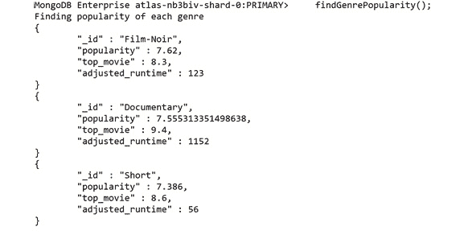

图 7.13：返回的前几个文档

输出显示，黑色电影、纪录片和短片是最受欢迎的，我们还可以看到每个类别的平均运行时间。在下一个练习中，我们将根据特定要求从每个类别中选择一个标题。

## 练习 7.04：从每个电影类别中选择标题

您现在已经回答了客户提出的问题。但是，这个结果对于他们来说并没有帮助选择特定的电影。他们必须执行不同的查询，以获取每个流派的电影列表，并从中选择要展示的最佳电影。此外，您还了解到最大的时间段可用为 230 分钟。您将修改此查询，以为电影公司提供每个类别的推荐标题。以下步骤将帮助您完成此练习：

1.  首先，增加第一个匹配以过滤掉不适用的电影。过滤掉超过 218 分钟（230 加上预告片）的电影。还要过滤掉评分较低的电影。首先，您将获得评分超过 7.0 的电影：

```js
{ $match: {
  released: {$lte: new ISODate("2001-01-01T00:00:00Z") },
  runtime:  {$lte: 218},
  "imdb.rating": {$gte: 7.0}
  }
},
```

1.  为了获得每个类别的推荐标题，使用我们组阶段中的`$first`累加器来获取每个流派的顶级文档（电影）。为此，您首先需要按评分降序排序，确保第一个文档也是评分最高的。在初始的$match 阶段之后添加一个新的$sort 阶段：

```js
{ $sort: {"imdb.rating": -1}},
```

1.  现在，在组阶段中添加`$first`累加器，添加您的新字段。还添加`recommended_rating`和`recommended_raw_runtime`字段以便使用：

```js
{ $group: {
  _id: {"$arrayElemAt": ["$genres", 0]},
  "recommended_title": {$first: "$title"},
  "recommended_rating": {$first: "$imdb.rating"},
  "recommended_raw_runtime": {$first: "$runtime"},
  "popularity": {  $avg: "$imdb.rating"},
  "top_movie": { $max: "$imdb.rating"},
  "longest_runtime": { $max: "$runtime"}
}},
```

1.  确保将此新字段添加到最终的投影中：

```js
{ $project: {
     _id: 1,
      popularity: 1, 
      top_movie: 1, 
      recommended_title: 1,
      recommended_rating: 1,
      recommended_raw_runtime: 1,
      adjusted_runtime: { $add: [ "$longest_runtime", 12 ] } } }
```

您的新最终查询应该如下所示：

```js
// Ch7_Exercise4js
var findGenrePopularity = function() {
    print("Finding popularity of each genre");
    var pipeline = [
       { $match: {
        released: {$lte: new ISODate("2001-01-01T00:00:00Z") },
            runtime:  {$lte: 218},
            "imdb.rating": {$gte: 7.0}
            }
           },
           { $sort: {"imdb.rating": -1}},
           { $group: {
             _id: {"$arrayElemAt": ["$genres", 0]},
             "recommended_title": {$first: "$title"},
             "recommended_rating": {$first: "$imdb.rating"},
             "recommended_raw_runtime": {$first: "$runtime"},
             "popularity": {  $avg: "$imdb.rating"},
             "top_movie": { $max: "$imdb.rating"},
             "longest_runtime": { $max: "$runtime"}
           }},
           { $sort: { popularity: -1}},
           { $project: {
                _id: 1,
                 popularity: 1, 
                 top_movie: 1, 
                 recommended_title: 1,
                 recommended_rating: 1,
                 recommended_raw_runtime: 1,
                 adjusted_runtime: { $add: [ "$longest_runtime",                    12 ] } } }
        ];
        db.movies.aggregate(pipeline).forEach(printjson);
    }
    findGenrePopularity();
```

1.  执行此操作，您的前两个结果文档应该看起来像下面这样：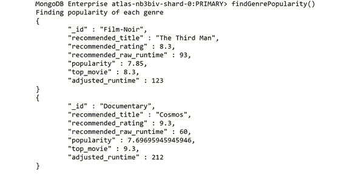

图 7.14：前两个结果文档

您可以看到，通过对管道进行一些添加，您已经提取出了评分最高和最长的电影，为客户创造了额外的价值。

在本主题中，我们看到了如何查询数据，然后对结果进行排序、限制和投影。我们还看到，通过使用更高级的聚合阶段，我们可以完成更复杂的任务。数据被操纵和转换以创建新的、有意义的文档。这些新的阶段使用户能够回答更广泛、更困难的业务问题，并获得有价值的数据洞察。

# 处理大型数据集

到目前为止，我们一直在处理相对较少的文档。`movies`集合中大约有 23,500 个文档。这对于人类来说可能是一个相当大的数字，但对于大型生产系统来说，您可能会处理数百万而不是数千的规模。到目前为止，我们也一直严格专注于一次处理单个集合，但如果我们的聚合范围扩大到包括多个集合呢？

在第一个主题中，我们简要讨论了在开发管道时如何使用投影阶段来创建更易读的输出，并简化调试结果。但是，我们没有涵盖在处理更大规模的数据集时如何提高性能，无论是在开发过程中还是在最终的生产就绪查询中。在本主题中，我们将讨论在处理大型多集合数据集时需要掌握的一些聚合阶段。

## 使用$sample 进行抽样

学习如何处理大型数据集的第一步是了解`$sample`。这个阶段简单而有用。`$sample`的唯一参数是您的样本期望大小。这个阶段会随机选择文档（最多达到您指定的大小）并将它们传递到下一个阶段：

```js
{ $sample: {size: 100}}, // This will reduce the scope to   100 random docs.
```

通过这样做，您可以显著减少通过管道的文档数量。主要是有两个原因。第一个原因是在处理庞大数据集时加快执行时间，尤其是在微调或构建聚合时。第二个原因是对于可以容忍结果中缺少文档的查询用例。例如，如果您想返回某个流派的任意五部电影，您可以使用`$sample`：

```js
var findWithSample = function() { 
    print("Finding all documents WITH sampling") 
    var now = Date.now(); 
    var pipeline = [ 
        { $sample: {size: 100}}, 
        { $match: { 
            "plot": { $regex: /around/} 
        }} 
    ]; 
    db.movies.aggregate(pipeline) 
    var duration = Date.now() - now; 
    print("Finished WITH sampling in " + duration+"ms"); 
}
findWithSample();
```

执行新的`findWithSample()`函数后，将获得以下结果：

```js
Finding all documents WITH sampling
Finished WITH sampling in 194ms
```

你可能会想为什么不直接使用`$limit`命令来实现在管道的某个阶段减少文档数量的相同结果。主要原因是`$limit`始终遵守文档的顺序，因此每次返回相同的文档。然而，重要的是要注意，在某些情况下，当你不需要`$sample`的伪随机选择时，最好使用`$limit`。

让我们看看`$sample`的实际应用。这是一个查询，用于在`plot`字段中搜索特定关键字的所有电影，分别使用和不使用`$sample`实现：

```js
var findWithoutSample = function() {
    print("Finding all documents WITHOUT sampling")
    var now = Date.now();
    var pipeline =[
        { $match: {
            "plot": { $regex: /around/}
        }},
    ]
    db.movies.aggregate(pipeline)
    var duration = Date.now() - now;
    print("Finished WITHOUT sampling in " + duration+ "ms");
}
findWithoutSample();
```

前面的例子并不是衡量性能的最佳方式，有更好的方法来分析管道的性能，比如`Explain`。然而，由于我们将在本书的后面部分涵盖这些内容，这将作为一个简单的例子。如果你运行这个小脚本，你将始终得到以下结果：

```js
Finding all documents WITHOUT sampling
Finished WITHOUT sampling in 862ms
```

这两个命令的输出的简单比较如下：

```js
Finding all documents WITH sampling 
Finished WITH sampling in 194ms 
Finding all documents WITHOUT sampling
Finished WITHOUT sampling in 862ms
```

通过抽样，性能得到了显著改善。然而，这是因为我们只查看了 100 个文档。更可能的是，在这种情况下，我们希望在`match`语句之后对结果进行抽样，以确保我们不会在第一个阶段排除所有结果。在大多数情况下，在处理执行时间显著的大型数据集时，你可能希望在构建管道时从开始进行抽样，并在查询最终确定后移除抽样。

## 使用$lookup 连接集合

抽样可能在针对大型集合开发查询时对你有所帮助，但在生产查询中，你有时需要编写跨多个集合操作的查询。在 MongoDB 中，使用`$lookup`聚合步骤进行这些集合连接。

这些连接可以通过以下聚合轻松理解：

```js
var lookupExample = function() {
    var pipeline = [
        { $match:  { $or: [{"name": "Catelyn Stark"},           {"name": "Ned Stark"}]}},
        { $lookup: { 
            from: "comments",
            localField: "name",
            foreignField: "name",
            as: "comments"
        }},
  { $limit: 2},
    ];
    db.users.aggregate(pipeline).forEach(printjson);
}
lookupExample();
```

在我们尝试运行之前，让我们先分析一下。首先，我们对`users`集合运行了`$match`，只获取了两个名为`Ned Stark`和`Catelyn Stark`的用户。一旦我们有了这两条记录，我们执行我们的查找。`$lookup`的四个参数如下：

+   `from`：我们要连接到当前聚合的集合。在这种情况下，我们将`comments`连接到`users`。

+   `localField`：我们将用来连接本地集合中文档的字段名称（*我们正在对其进行聚合的集合*）。在这种情况下，是我们用户的名称。

+   `foreignField`：链接到`from`集合中的`localField`的字段。它们可能有不同的名称，但在这种情况下，它是相同的字段：`name`。

+   `as`：这是我们新连接的数据将被标记的方式。

在这个例子中，查找使用我们用户的名称，搜索`comments`集合，并将具有相同名称的任何评论添加到原始用户文档的新数组字段中。这个新数组被称为**comments**。通过这种方式，我们可以获取另一个集合中所有相关文档的数组，并将它们嵌入到我们原始文档中，以便在聚合的其余部分中使用。

如果我们按照现有的管道运行，输出的开头将看起来像这样：

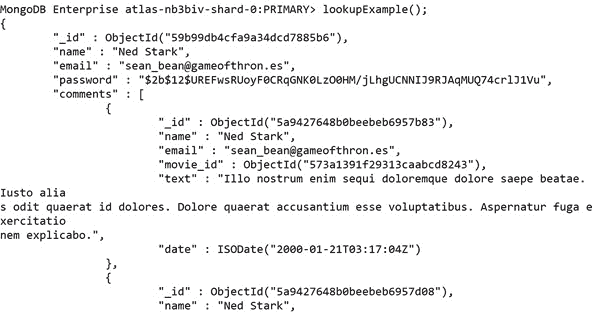

图 7.15：运行管道后的输出（为简洁起见截断）

由于输出非常大，前面的截图只显示了`comments`数组的开头部分。

在这个例子中，用户发表了许多评论，因此嵌入的数组变得相当庞大且难以查看。这个问题是引入`$unwind`运算符的一个很好的地方，因为这些连接通常会导致大量相关文档的数组。`$unwind`是一个相对简单的阶段。它会从输入文档中解构一个数组字段，以输出数组中每个元素的新文档。例如，如果你展开这个文档：

```js
{a: 1, b: 2, c: [1, 2, 3, 4]}
```

输出将是以下文档：

```js
{"a" : 1, "b" : 2, "c" : 1 }
{"a" : 1, "b" : 2, "c" : 2 }
{"a" : 1, "b" : 2, "c" : 3 }
{"a" : 1, "b" : 2, "c" : 4 }
```

我们可以添加这个新的阶段到我们的连接中，然后尝试运行它：

```js
var lookupExample = function() {
    var pipeline = [
        { $match:  { $or: [{"name": "Catelyn Stark"},           {"name": "Ned Stark"}]}},
        { $lookup: { 
            from: "comments",
            localField: "name",
            foreignField: "name",
            as: "comments"
        }},
        { $unwind: "$comments"},
        { $limit: 3},
    ];
    db.users.aggregate(pipeline).forEach(printjson);
}
lookupExample();
```

我们将看到如下输出：

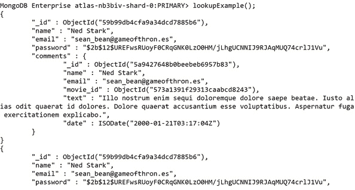

图 7.16：上述片段的输出（为简洁起见而截断）

我们可以看到每个用户有多个文档，每个评论都有一个单独的文档，而不是一个嵌入式数组。有了这种新格式，我们可以添加更多阶段来操作我们的新文档集。例如，我们可能希望过滤掉对特定电影的任何评论，或者按日期对评论进行排序。`$lookup`和`$unwind`的组合对于在单个聚合中跨多个集合回答复杂问题是一个强大的组合。

## 使用`$out`和`$merge`输出您的结果

假设在过去的一周里，我们一直在一个大型的多阶段聚合管道上工作。我们一直在调试、抽样、过滤和测试我们的管道，以解决一个具有挑战性和复杂业务问题的巨大数据集。最后，我们对我们的管道感到满意，我们想要执行它，然后保存结果以供后续分析和展示。

我们可以运行查询并将结果导出到新的格式。然而，这意味着如果我们想对结果集进行后续分析，就需要重新导入结果。

我们可以将输出保存在一个数组中，然后重新插入到 MongoDB 中，但这意味着需要将所有数据从服务器传输到客户端，然后再从客户端传输回服务器。

幸运的是，从 MongoDB 4.2 版本开始，我们提供了两个聚合阶段来解决这个问题：`$out`和`$merge`。这两个阶段都允许我们将管道的输出写入一个集合以供以后使用。重要的是，整个过程都在服务器上进行，这意味着所有数据都不需要通过网络传输到客户端。可以想象，在创建了一个复杂的聚合查询之后，您可能希望每周运行一次，并通过将数据写入集合来创建结果的快照。

让我们看看这两个阶段的语法，以及它们的最基本形式，然后我们可以比较它们的功能：

```js
// Available from v2.6
{ $out: "myOutputCollection"}
// Available from version 4.2
{ $merge: {
    // This can also accept {db: <db>, coll: <coll>} to       merge into a different db
    into: "myOutputCollection", 
}}
```

正如您所看到的，没有任何可选参数的语法几乎是相同的。然而，在其他方面，这两个命令是不同的。`$out`非常简单；唯一需要指定的参数是期望的输出集合。它要么创建一个新的集合，要么完全替换现有的集合。`$out`还有一些约束条件，而`$merge`没有。例如，`$out`必须输出到与聚合目标相同的数据库。

在 MongoDB 4.2 服务器上运行时，`$merge`可能是更好的选择。然而，在本书的范围内，我们将使用 MongoDB 的免费版，它运行的是 MongoDB 4.0。因此，在这些示例中，我们将更多地关注`$out`阶段。

`$out`的语法非常简单。唯一的参数是我们想要输出结果的集合。以下是一个带有`$out`的管道的示例：

```js
var findTopRomanceMovies = function() {
    var pipeline = [
        { $sort:  {"imdb.rating": -1}}, // Sort by IMDB rating.
        { $match: {
            genres: {$in: ["Romance"]}, // Romance movies only.
            released: {$lte: new ISODate("2001-01-01T00:00:              00Z") }}},
        { $limit: 5 },                 // Limit to 5 results.
        { $project: { title: 1, genres: 1, released: 1,           "imdb.rating": 1}},
        { $out: "movies_top_romance"}
    ];
    db.movies.aggregate(pipeline).forEach(printjson);
}
findTopRomanceMovies();
```

通过运行这个管道，您将不会收到任何输出。这是因为输出已经重定向到我们想要的集合中：

```js
MongoDB Enterprise atlas-nb3biv-shard-0:PRIMARY>   findTopRomanceMovies();
MongoDB Enterprise atlas-nb3biv-shard-0:PRIMARY>
```

我们可以看到，一个新的集合被我们的结果创建了：

```js
MongoDB Enterprise atlas-nb3biv-shard-0:PRIMARY> show collections
comments
movies
movies_top_romance
sessions
theaters
users
```

如果我们在新的集合上运行一个查找，我们可以看到我们的聚合结果现在存储在其中：

```js
MongoDB Enterprise atlas-nb3biv-shard-0:PRIMARY> db.movies_top_romance.findOne({})
{
        "_id" : ObjectId("573a1399f29313caabceeead"),
        "genres" : [
                "Drama",
                "Romance"
        ],
        "title" : "Pride and Prejudice",
        "released" : ISODate("1996-01-14T00:00:00Z"),
        "imdb" : {
                "rating" : 9.1
        }
}
```

通过将结果放入一个集合中，我们可以存储、共享和更新新的复杂聚合结果。我们甚至可以对这个新集合运行进一步的查询和聚合。`$out`是一个简单但强大的聚合阶段。

## 练习 7.05：列出评论最多的电影

电影公司希望了解哪些电影从用户那里获得了最多的评论。然而，鉴于数据库中有很多评论（以及您倾向于使用您新学到的技能），您决定在开发此管道时，只使用评论的样本。从这个样本中，您将找出最受关注的电影，并将这些文档与`movies`集合中的文档结合起来，以获取有关电影的更多信息。公司还要求您的最终交付成果是一个包含输出文档的新集合。鉴于您现在已经了解了`$merge`阶段，这个要求应该很容易满足。

您收集到的一些额外信息是，他们希望结果尽可能简单，并且希望知道电影的标题和评分。此外，他们希望看到评论最多的前五部电影。

在这个练习中，您将帮助电影公司获取用户评论最多的电影列表。执行以下步骤完成这个练习：

1.  首先，概述管道中的阶段；它们按以下顺序出现：

在构建管道时，对`comments`集合进行`$sample`。

`$group`评论按其所针对的电影分组。

`$sort`结果按总评论数排序。

`$limit`结果为评论最多的前五部电影。

`$lookup`与每个文档匹配的电影。

`$unwind`电影数组，以保持结果文档简单。

`$project`只有电影标题和评分。

`$merge`结果到一个新的集合中。

尽管这可能看起来有很多阶段，但每个阶段都相对简单，整个过程可以从头到尾逻辑地跟随。

1.  创建一个名为`Ch7_Exercise5.js`的新文件，并编写您的管道框架：

```js
// Ch7_Exercise5.js
var findMostCommentedMovies = function() {
    print("Finding the most commented on movies.");
    var pipeline = [
             { $sample: {}}, 
             { $group: {}},
             { $sort: {}},
             { $limit: 5},
             { $lookup: {}},
             { $unwind: },
             { $project: {}},
             { $out: {}}
    ];
    db.comments.aggregate(pipeline).forEach(printjson);
}
findMostCommentedMovies();
```

1.  在决定样本大小之前，您应该了解`comments`集合有多大。对`comments`集合运行`count`：

```js
MongoDB Enterprise atlas-nb3biv-shard-0:PRIMARY>   db.comments.count()
50303
```

1.  在开发过程中对集合进行大约百分之十的抽样。将本练习的样本大小设置为`5000`：

```js
{ $sample: {size: 5000}}, 
```

1.  现在您已经完成了较容易的步骤，填写`$group`语句，将评论按其关联的电影分组，累积每部电影的评论总数：

```js
{ $group: {
    _id: "$movie_id",
    "sumComments": { $sum: 1}
}},
```

1.  接下来，添加`sort`，使具有最高`sumComments`值的电影排在第一位：

```js
{ $sort: { "sumComments": -1}},
```

1.  在构建管道时，定期运行部分完成的管道非常重要，以确保您看到预期的结果。由于您正在抽样，每次运行管道时结果都不会相同。以下输出只是一个例子：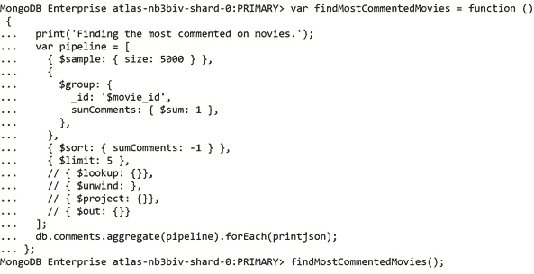

```js
{ $lookup: {
    from: "movies",
    localField: "_id",
    foreignField: "_id",
    as: "movie"
}},
```

重新运行此代码，现在您可以看到一个带有所有电影详细信息的`movie`数组嵌入其中：


```js
{ $unwind: "$movie" },
{ $project: {
    "movie.title": 1,
    "movie.imdb.rating": 1,
    "sumComments": 1,
}}
```

1.  您的数据现在已经完整，但您仍然需要将此结果输出到一个集合中。在最后添加`$out`步骤：

```js
{ $out: "most_commented_movies" }
```

您最终的代码应该看起来像这样：

```js
// Ch7_Exercise5.js
var findMostCommentedMovies = function() {
    print("Finding the most commented on movies.");
    var pipeline = [
             { $sample: {size: 5000}}, 
             { $group: {
                 _id: "$movie_id",
                 "sumComments": { $sum: 1}
             }},
             { $sort: { "sumComments": -1}},
             { $limit: 5},
             { $lookup: {
                 from: "movies",
                 localField: "_id",
                 foreignField: "_id",
                 as: "movie"
             }},
             { $unwind: "$movie" },
             { $project: {
                 "movie.title": 1,
                 "movie.imdb.rating": 1,
                 "sumComments": 1,
             }},
             { $out: "most_commented_movies" }
    ];
    db.comments.aggregate(pipeline).forEach(printjson);
}
findMostCommentedMovies();
```

运行此代码。如果一切顺利，您将在 shell 中看不到管道的任何输出，但您应该能够使用`find()`检查您新创建的集合并查看您的结果。请记住，由于抽样阶段，结果每次都不会相同：

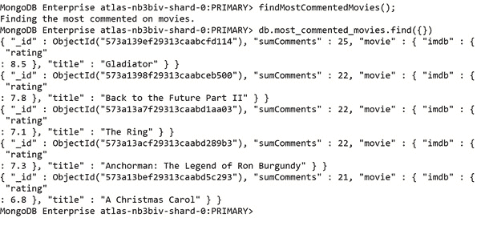

图 7.20：前面片段的结果（为简洁起见截断输出）

通过本主题学到的新阶段，我们现在拥有了在更大、更复杂的数据集上执行聚合的良好基础。而且，更重要的是，我们现在能够有效地在多个集合之间进行数据连接。通过这样做，我们可以扩大我们的查询范围，从而满足更广泛的用例。

通过`out`阶段，我们可以存储聚合的结果。这使用户可以通过常规的 CRUD 操作快速探索结果，并且可以轻松地保持更新结果。unwind 阶段还使我们能够将查找操作中的连接文档分开成单独的文档，以便将其馈送到后续的管道阶段中。

通过结合所有这些阶段，我们现在能够创建跨大型多集合数据集进行操作的广泛新聚合。

# 从您的聚合中获得最大收益

在过去的三个主题中，我们已经了解了聚合的结构以及构建复杂查询所需的关键阶段。我们可以使用给定的条件搜索大型多集合数据集，操纵数据以创建新的见解，并将结果输出到新的或现有集合中。

这些基础将使您能够解决聚合管道中遇到的大多数问题。然而，还有一些其他阶段和模式可以让您从聚合中获得最大收益。我们不会在本书中涵盖所有这些内容，但在本主题中，我们将讨论一些可以帮助您微调管道的技巧，以及一些我们到目前为止还没有涵盖的其他技巧。我们将使用**Explain**来分析您的聚合选项。

## 调整您的管道

在早期的主题中，我们通过输出聚合之前和之后的时间来计算我们的管道的执行时间。这是一种有效的技术，你可能经常在客户端或应用程序端计时你的 MongoDB 查询。然而，这只能给我们一个大致的持续时间，并且只告诉我们响应到达客户端所花费的总时间，而不是服务器执行管道所花费的时间。MongoDB 为我们提供了一个很好的学习方式，可以准确地了解它是如何执行我们请求的查询的。这个功能被称为**Explain**，是检查和优化我们的 MongoDB 命令的常规方式。

然而，有一个问题。**Explain**目前不支持聚合的详细执行计划，这意味着在优化管道时其使用受到限制。**Explain**和执行计划将在本书的后面更详细地介绍。由于我们不能依赖**Explain**来分析我们的管道，因此更加重要的是仔细构建和规划我们的管道，以提高聚合的性能。虽然没有一种适用于任何情况的单一正确方法，但有一些启发式方法通常会有所帮助。我们将通过一些示例来介绍其中的一些方法。MongoDB 在幕后进行了大量的性能优化，但这些仍然是要遵循的良好模式。

## 尽早过滤，经常过滤

聚合管道的每个阶段都会对输入进行一些处理。这意味着输入越重要，处理就越大。如果您正确设计了管道，那么这种处理对于您要返回的文档是不可避免的。您所能做的就是确保您只处理*您想要返回的*文档。

实现这一点的最简单方法是添加或移动过滤文档的管道阶段。我们在之前的情景中已经用`$match`和`$limit`做过这个操作。确保这一点的常见方法是将管道中的第一个阶段设置为`$match`，这样可以只匹配后续管道中需要的文档。让我们通过以下管道示例来理解这一点，其中管道没有按预期执行设计：

```js
var badlyOrderedQuery = function() {
  print("Running query in bad order.")
  var pipeline = [
    { $sort: {"imdb.rating": -1}}, // Sort by IMDB rating.
    { $match: {
        genres: {$in: ["Romance"]}, // Romance movies only.
        released: {$lte: new ISODate("2001-01-01T00:00:00Z") }}},
    { $project: { title: 1, genres: 1, released: 1,       "imdb.rating": 1}},
    { $limit: 1 },                 // Limit to 1 result.
  ];
  db.movies.aggregate(pipeline).forEach(printjson);
}
badlyOrderedQuery();
```

输出将如下所示：

```js
MongoDB Enterprise atlas-nb3biv-shard-0:PRIMARY>   badlyOrderedQuery();
Running query in bad order.
{
        "_id" : ObjectId("573a1399f29313caabceeead"),
        "genres" : [
                "Drama",
                "Romance"
        ],
        "title" : "Pride and Prejudice",
        "released" : ISODate("1996-01-14T00:00:00Z"),
        "imdb" : {
                "rating" : 9.1
        }
}
```

一旦你正确地排序了管道，它将如下所示：

```js
var wellOrderedQuery = function() {
print("Running query in better order.")
var pipeline = [
    { $match: {
        genres: {$in: ["Romance"]}, // Romance movies only.
        released: {$lte: new ISODate("2001-01-01T00:00:00Z") }}},
    { $sort:  {"imdb.rating": -1}}, // Sort by IMDB rating.
    { $limit: 1 },                 // Limit to 1 result.
    { $project: { title: 1, genres: 1, released: 1,       "imdb.rating": 1}},
];
db.movies.aggregate(pipeline).forEach(printjson);
}
wellOrderedQuery();
```

这将导致以下输出：

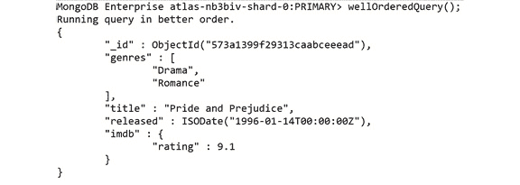

图 7.21：前面片段的输出（为简洁起见而截断）

从逻辑上讲，这个改变意味着我们首先要做的是在对它们进行排序之前获取所有符合条件的文档列表，然后我们取前五个并且只投影这五个文档。

这两个管道都输出相同的结果，但第二个更加健壮且易于理解。你可能不会总是看到这种改变带来显著的性能提升，特别是在较小的数据集上。然而，这是一个很好的实践，因为它将帮助你创建逻辑、高效和简单的管道，可以更容易地进行修改或扩展。

## 使用你的索引

索引是 MongoDB 查询性能的另一个关键因素。本书在第九章“性能”中更深入地介绍了索引及其创建。在创建聚合时，你需要记住的是，在使用`$sort`和`$match`等阶段时，你要确保你正在操作的是正确索引的字段。使用索引的概念将会变得更加明显。

## 考虑期望的输出

改进你的管道最重要的方法之一是计划和评估它们，以确保你得到了解决业务问题的期望输出。如果你在创建一个精心调整的管道时遇到困难，可以问自己以下问题：

+   我是否输出了所有数据来解决我的问题？

+   我是否只输出了解决问题所需的数据？

+   我是否能够合并或删除任何中间步骤？

如果你已经评估了你的管道，调整了它，但仍然觉得它过于复杂或低效，你可能需要对数据本身提出一些问题。聚合是否困难是因为设计了错误的查询，甚至是问了错误的问题？或者，也许这是数据形状需要重新评估的一个迹象。

## 聚合选项

修改管道是你在处理聚合时可能会花费大部分时间的地方，对于初学者来说，你可能只需编写管道就能实现大部分目标。正如本章前面提到的，可以传递多个选项到`aggregate`命令中以配置其操作。我们不会深入探讨这些选项，但了解它们是有帮助的。以下是包含一些选项的聚合示例：

```js
    var options = { 
        maxTimeMS: 30000,
        allowDiskUse: true
        }
    db.movies.aggregate(pipeline, options);
```

要指定这些选项，需要在管道数组之后传递第二个参数给命令。在这种情况下，我们称之为`options`。一些需要注意的选项包括以下内容：

+   `maxTimeMS`：MongoDB 在终止操作之前可以处理的时间量。本质上是聚合的超时时间。默认值为`0`，这意味着操作不会超时。

+   `allowDiskUse`：聚合管道中的阶段可能只使用最大数量的内存，这使得处理大型数据集变得具有挑战性。通过将此选项设置为`true`，MongoDB 可以写临时文件以处理更多的数据。

+   `bypassDocumentValidation`：这个选项专门用于将使用`$out`或`$merge`写入集合的管道。如果将此选项设置为`true`，则不会对从该管道写入集合的文档进行文档验证。

+   `comment`：这个选项只是用于调试，允许指定一个字符串来帮助在解析数据库日志时识别这个聚合。

+   现在让我们进行一个练习，将我们到目前为止学到的概念付诸实践。

## 练习 7.06：查找获奖纪录片

在看到前几个练习中实现的聚合管道的结果以及它们为电影公司带来的价值后，公司的一些内部工程师尝试自己编写了一些新的聚合。电影公司要求您审查这些管道，以协助他们内部工程师的学习过程。您将使用前面的一些技术和您对最后三个主题中聚合的理解来修复一个管道。这个简单管道的目标是获取一份评分很高的纪录片清单。

对于这种情况，您还将在假设集合中有大量数据的情况下进行工作。给您要审查的管道如下。此练习的目的是找到一些获奖纪录片，并列出获奖最多的电影：

```js
var findAwardWinningDocumentaries = function() {
    print("Finding award winning documentary Movies...");
    var pipeline = [
        { $sort: {"awards.wins": -1}}, // Sort by award wins.
        { $match: {"awards.wins": { $gte: 1}}},
        { $limit: 20}, // Get the top 20 movies with more than           one award
        { $match: {
            genres: {$in: ["Documentary"]}, // Documentary               movies only.
        }},
        { $project: { title: 1, genres: 1, awards: 1}},
        { $limit: 3}, 
    ];
    var options = { }
    db.movies.aggregate(pipeline, options).forEach(printjson);
}
findAwardWinningDocumentaries();
```

可以通过以下步骤实现结果：

1.  首先，合并两个`$match`语句，并将`match`移到管道的顶部：

```js
var pipeline = [
    { $match: {
        "awards.wins": { $gte: 1},
        genres: {$in: ["Documentary"]},
    }},
    { $sort: {"awards.wins": -1}}, // Sort by award wins.
    { $limit: 20}, // Get the top 20 movies. 
    { $project: { title: 1, genres: 1, awards: 1}},
    { $limit: 3},
];
```

1.  不再需要在开头使用`sort`，因此可以将其移动到倒数第二步：

```js
var pipeline = [
    { $match: {
        "awards.wins": { $gte: 1},
        genres: {$in: ["Documentary"]},
    }},
    { $limit: 20}, // Get the top 20 movies. 
    { $project: { title: 1, genres: 1, awards: 1}},
    { $sort: {"awards.wins": -1}}, // Sort by award wins.
    { $limit: 3},
];
```

1.  不再需要两个限制。删除第一个：

```js
var pipeline = [
    { $match: {
        "awards.wins": { $gte: 1},
        genres: {$in: ["Documentary"]},
    }},
    { $project: { itle: 1, genres: 1, awards: 1}},
    { $sort: {"awards.wins": -1}}, // Sort by award wins.
    { $limit: 3},
];
```

1.  最后，将投影移到最后三个文档：

```js
var pipeline = [
    { $match: {
        "awards.wins": { $gte: 1},
        genres: {$in: ["Documentary"]},
    }},
    { $sort: {"awards.wins": -1}}, // Sort by award wins.
    { $limit: 3},
    { $project: { title: 1, genres: 1, awards: 1}},
];
```

1.  这已经看起来好多了。您被告知集合非常庞大，因此还要为聚合添加一些选项：

```js
var options ={
        maxTimeMS: 30000,
        allowDiskUse: true,
        comment: "Find Award Winning Documentary Films"
    }
    db.movies.aggregate(pipeline, options).forEach(printjson);
```

1.  运行完整查询：

```js
var findAwardWinningDocumentaries = function() {
    print("Finding award winning documentary Movies...");
    var pipeline = [
        { $match: {
            "awards.wins": { $gte: 1},
            genres: {$in: ["Documentary"]},
        }},
        { $sort:  {"awards.wins": -1}}, // Sort by award wins.
        { $limit: 3},
        { $project: { title: 1, genres: 1, awards: 1}},
    ];

    var options ={
        maxTimeMS: 30000,
        allowDiskUse: true,
        comment: "Find Award Winning Documentary Films"
    }
    db.movies.aggregate(pipeline, options).forEach(printjson);
}
findAwardWinningDocumentaries();
```

因此，您的结果应如下所示：

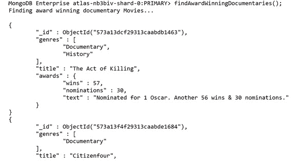

图 7.22：获奖纪录片清单（为简洁起见截断）

有了这个，您已根据您的电影公司的要求检索了获奖纪录片清单。我们在本主题中看到，为了从聚合中获得最大价值，您需要设计、测试和不断重新评估您的管道。然而，先前列出的启发式只是设计有用的聚合的一小部分模式，因此建议您进行其他模式和程序的研究。

我们还看到了如何向`aggregate`命令传递一些选项，以帮助我们处理特定用例或处理可能需要更长时间的大型数据集。

## 活动 7.01：将聚合实践应用到实践中

在前几个练习中，电影公司对您使用聚合管道从数据中提取的见解印象深刻。然而，公司在管理不同的查询和将数据组合成有意义的结果方面遇到了麻烦。他们决定他们想要一个单一的、统一的聚合，总结他们即将举办的电影马拉松活动的基本信息。

您的目标是设计、测试和运行一个聚合管道，以创建这个统一视图。您应确保聚合的最终输出回答以下业务问题：

+   对于每种流派，哪部电影获得了最多的奖项提名，假设它们至少赢得了其中一项提名？

+   对于这些电影中的每一部电影，在每部电影之前都有 12 分钟的预告片，它们的附加运行时间是多少？

+   关于这部电影的用户评论的例子。

+   因为这是一场经典的电影马拉松，只有在 2001 年之前发布的电影才有资格。

+   在所有流派中，列出获奖次数最多的所有流派。

您可以以任何方式完成此活动，但请尽量专注于创建一个简单而高效的聚合管道，以便将来进行调整或修改。有时最好尝试并决定输出文档可能是什么样子，然后从那里开始向后工作。

请记住，在测试时，您也可以选择使用`$sample`阶段来加快查询速度，但在最终解决方案中必须删除这些步骤。

为了保持所需的输出简单，将结果限制为此场景的三个文档。

以下步骤将帮助您完成此任务：

1.  过滤掉在 2001 年之前未发布的任何文件。

1.  筛选掉没有至少一次获奖的文件。

1.  按奖项提名对文件进行排序。

1.  将文档分组成流派。

1.  获取每个组的第一部电影。

1.  获取每个组的获奖总数。

1.  与`comments`集合连接，获取每部电影的评论列表。

1.  使用投影将每部电影的评论数量减少到一个。（提示：使用`$slice`运算符来减少数组长度。）

1.  将每部电影的播放时间追加 12 分钟。

1.  按获奖总数对结果进行排序。

1.  限制三个文件。

期望的输出如下：


图 7.23：执行活动步骤后的最终输出

注意

可以通过此链接找到此活动的解决方案。

# 摘要

在本章中，我们已经涵盖了您需要了解、编写、理解和改进 MongoDB 聚合的所有基本组件。这种新功能将帮助您回答关于数据的更复杂和困难的问题。通过创建多阶段的管道，连接多个集合，您可以将查询范围扩大到整个数据库，而不仅仅是单个集合。我们还看了如何将结果写入新集合，以便进一步探索或操纵数据。

在最后一节中，我们介绍了确保编写的管道具有可扩展性、可读性和性能的重要性。通过专注于这些方面，您的管道将继续在未来提供价值，并可以作为进一步聚合的基础。

然而，我们在这里所涵盖的只是您可以通过聚合功能实现的开始。重要的是要不断探索、实验和测试您的管道，以真正掌握这项 MongoDB 技能。

在下一章中，我们将介绍如何在 Node.js 中使用 MongoDB 作为后端创建应用程序。即使您不是开发人员，这也将让您深入了解 MongoDB 应用程序的构建方式，以及对构建和执行动态查询的更深入理解。
