# 第九章：性能

概述

本章介绍了 MongoDB 中查询优化和性能改进的概念。您将首先探索查询执行的内部工作原理，并确定可能影响查询性能的因素，然后转向数据库索引以及索引如何减少查询执行时间。您还将学习如何创建、列出和删除索引，并研究各种类型的索引及其好处。在最后几节中，您将了解各种查询优化技术，帮助您有效地使用索引。通过本章的学习，您将能够分析查询并使用索引和优化技术来提高查询性能。

# 介绍

在之前的章节中，我们学习了 MongoDB 查询语言和各种查询操作符。我们学会了如何编写查询来检索数据。我们还学习了用于添加和删除数据以及更新或修改数据的各种命令。我们确保查询带来了我们期望的输出；然而，我们并没有过多关注它们的执行时间和效率。在本章中，我们将专注于如何分析查询的性能，并在需要时进一步优化其性能。

现实世界的应用程序由多个组件组成，如用户界面、处理组件、数据库等。应用程序的响应性取决于每个组件的效率。数据库组件执行不同的操作，如保存、读取和更新数据。数据库表或集合存储的数据量，或者从数据库中推送或检索的数据量，都可能影响整个系统的性能。因此，重要的是要知道数据库操作的执行效率如何，以及是否可能进一步优化以提高这些操作的速度。

在下一节中，您将学习如何根据数据库提供的详细统计信息来分析查询，并用它们来识别问题。

# 查询分析

为了编写高效的查询，重要的是分析它们，找出可能的性能问题，并加以修复。这种技术称为性能优化。有许多因素可能会对查询的性能产生负面影响，比如不正确的缩放、结构不正确的集合，以及 RAM 和 CPU 等资源不足。然而，最大和最常见的因素是在查询执行过程中扫描的记录数和返回的记录数之间的差异。差异越大，查询就会越慢。幸运的是，在 MongoDB 中，这个因素是最容易解决的，可以使用索引来解决。

在集合上创建和使用索引可以缩小扫描的记录数，并显著提高查询性能。然而，在深入研究索引之前，我们首先需要了解查询执行的细节。

假设您想要查找 2015 年上映的电影列表。以下代码片段显示了此命令：

```js
db.movies.find(
    { 
        "year" : 2015
    },
    {
        "title" : 1, 
        "awards.wins" : 1
    }
).sort(
    {"awards.wins" : -1}
)
```

该查询根据`year`字段过滤`movies`集合，将电影标题和获奖情况投影到输出中，并对结果进行排序，以便获得获奖次数最多的电影出现在顶部。如果我们连接到 MongoDB Atlas 的`sample_mflix`数据库执行此查询，它将返回**484**条记录。

为了执行任何这样的查询，MongoDB 查询执行引擎会准备一个或多个查询执行计划。数据库具有内置的查询优化器，选择执行效率最高的计划。计划通常由多个处理阶段组成，按顺序执行以产生最终输出。我们之前创建的查询具有查询条件、投影表达式和排序规范。对于形状相似的查询，典型的执行计划将如*图 9.1*所示：

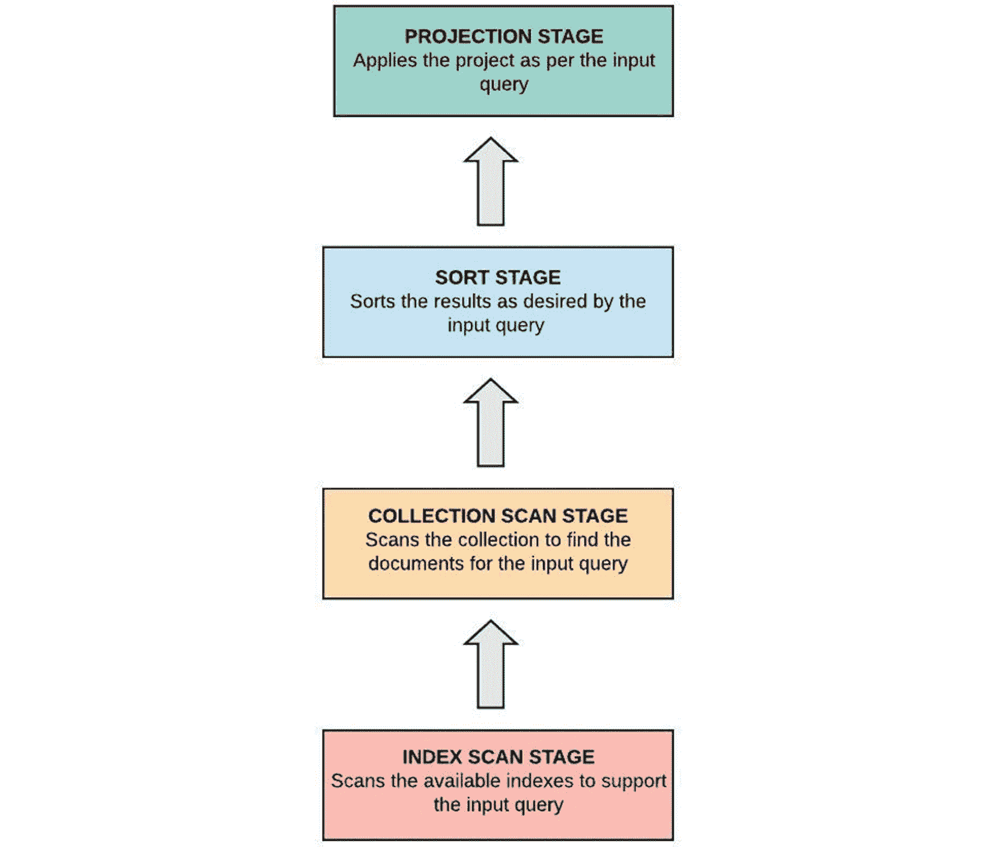

图 9.1：查询执行阶段

首先，如果给定的查询条件有支持的索引，索引将被扫描以识别匹配的记录。在我们的案例中，`year`字段没有索引，因此索引扫描阶段将被忽略。在下一个阶段，将扫描整个集合以找到匹配的记录。匹配的记录然后传递到排序阶段，在那里记录在内存中排序。最后，投影应用于排序的记录，并将最终输出传递给客户端。

MongoDB 提供了一个查询分析机制，我们可以从中获取有关查询执行的一些有用统计信息。在下一节中，我们将学习如何使用查询分析和统计信息来识别先前查询中的性能问题。

## 解释查询

`explain()`函数非常有用，可以用于探索查询的内部工作原理。该函数可以与查询或命令一起使用，以打印与它们的执行相关的详细统计信息。它可以给我们的最重要的指标如下：

+   查询执行时间

+   扫描的文档数量

+   返回的文档数量

+   使用的索引

以下代码片段显示了在先前创建的相同查询上使用`explain`函数的示例：

```js
db.movies.explain().find(
    { 
        "year" : 2015
    },
    {
        "title" : 1, 
        "awards.wins" : 1
    }
).sort(
    {"awards.wins" : -1}
)
```

请注意，`explain`函数也可以与以下命令一起使用：

+   `remove()`

+   `update()`

+   `count()`

+   `aggregate()`

+   `distinct()`

+   `findAndModify()`

默认情况下，`explain`函数打印查询规划器的详细信息，即各种执行阶段的详细信息。可以在以下片段中看到：

```js
       "queryPlanner" : {
          "plannerVersion" : 1,
          "namespace" : "mflix.movies",
          "indexFilterSet" : false,
          "parsedQuery" : {
               "year" : {
                    "$eq" : 2015
               }
          },
          "queryHash" : "9A7F8C29",
          "planCacheKey" : "9A7F8C29",
          "winningPlan" : {
               "stage" : "PROJECTION_DEFAULT",
               "transformBy" : {
                    "title" : 1,
                    "awards.wins" : 1
               },
               "inputStage" : {
                    "stage" : "SORT",
                    "sortPattern" : {
                         "awards.wins" : -1
                    },
                    "inputStage" : {
                         "stage" : "SORT_KEY_GENERATOR",
                         "inputStage" : {
                              "stage" : "COLLSCAN",
                              "filter" : {
                                   "year" : {
                                        "$eq" : 2015
                                   }
                              },
                              "direction" : "forward"
                         }
                    }
               }
          },
          "rejectedPlans" : [ ]
     },
```

输出显示了获胜计划和一系列被拒绝的计划。在前面的查询中，执行从`COLLSCAN`开始，因为没有合适的索引。因此，查询没有任何被拒绝的计划，唯一可用的计划是获胜计划。在获胜计划中，有多个嵌套的`inputStage`对象，清楚地显示了不同阶段的执行顺序。

第一个阶段是`COLLSCAN`，在这个阶段对`year`字段应用了过滤器。接下来的阶段`SORT`，根据`awards.wins`字段进行排序，即获奖数量。最后，在`PROJECTION_DEFAULT`阶段，选择并返回了`title`和`awards.wins`字段。

`explain`函数可以接受一个名为详细模式的可选参数，该参数控制函数返回的信息。以下列表详细说明了三种不同的详细模式：

1.  `queryPlanner`：这是默认选项，打印查询规划器的详细信息，例如被拒绝的计划、获胜计划以及获胜计划的执行阶段。

1.  `executionStats`：此选项打印`queryPlanner`提供的所有信息，以及查询执行的详细执行统计信息。此选项对于查找查询中的任何与性能相关的问题非常有用。

1.  `allPlansExecution`：此选项输出`executionStats`提供的详细信息，以及被拒绝的执行计划的详细信息。

## 查看执行统计信息

为了查看执行统计信息，您需要将`executionStats`作为`explain()`函数的参数传递。以下片段显示了您的查询的`executionStats`：

```js
       "executionStats" : {
          "executionSuccess" : true,
          "nReturned" : 484,
          "executionTimeMillis" : 85,
          "totalKeysExamined" : 0,
          "totalDocsExamined" : 23539,
          "executionStages" : {
               "stage" : "PROJECTION_DEFAULT",
               "nReturned" : 484,
               "executionTimeMillisEstimate" : 3,
               "works" : 24027,
               "advanced" : 484,
               "needTime" : 23542,
               "needYield" : 0,
               "saveState" : 187,
               "restoreState" : 187,
               "isEOF" : 1,
               "transformBy" : {
                    "title" : 1,
                    "awards.wins" : 1
               },
               "inputStage" : {
                    "stage" : "SORT",
                    "nReturned" : 484,
                    "executionTimeMillisEstimate" : 3,
                    "works" : 24027,
                    "advanced" : 484,
                    "needTime" : 23542,
                    "needYield" : 0,
                    "saveState" : 187,
                    "restoreState" : 187,
                    "isEOF" : 1,
                    "sortPattern" : {
                         "awards.wins" : -1
                    },
                    "memUsage" : 613758,
                    "memLimit" : 33554432,
                    "inputStage" : {
                         "stage" : "SORT_KEY_GENERATOR",
                         "nReturned" : 484,
                         "executionTimeMillisEstimate" : 3,
                         "works" : 23542,
                         "advanced" : 484,
                         "needTime" : 23057,
                         "needYield" : 0,
                         "saveState" : 187,
                         "restoreState" : 187,
                         "isEOF" : 1,
                         "inputStage" : {
                              "stage" : "COLLSCAN",
                              "filter" : {
                                   "year" : {
                                        "$eq" : 2015
                                   }
                              },
                              "nReturned" : 484,
                              "executionTimeMillisEstimate" : 3,
                              "works" : 23541,
                              "advanced" : 484,
                              "needTime" : 23056,
                              "needYield" : 0,
                              "saveState" : 187,
                              "restoreState" : 187,
                              "isEOF" : 1,
                              "direction" : "forward",
                              "docsExamined" : 23539
                         }
                    }
               }
          }
     },
```

执行统计信息提供了与每个执行阶段相关的有用指标，以及一些顶层字段，其中一些指标在查询的总执行过程中进行了聚合。以下是执行统计信息中一些最重要的指标：

+   `executionTimeMillis`：这是查询执行所花费的总时间（以毫秒为单位）。

+   `totalKeysExamined`：这表示扫描的索引键的数量。

+   `totalDocsExamined`：这表示针对给定查询条件检查的文档数量。

+   `nReturned`：这是查询输出中返回的记录总数。

现在，让我们在下一节中分析执行统计信息。

## 识别问题

执行统计数据（如前面片段所示）告诉我们查询过程中存在一些问题。为了返回`484`条匹配记录，查询检查了`23539`个文档，这也是集合中的文档总数。扫描大量文档会减慢查询执行速度。看到查询执行时间为`85`毫秒，似乎很快。然而，查询执行时间可能会根据网络流量、服务器上的 RAM 和 CPU 负载以及扫描的记录数量而变化。扫描文档数量减慢性能的原因将在下一节中解释。

## 线性搜索

当我们在集合上执行一个带有搜索条件的`find`查询时，数据库搜索引擎会选择集合中的第一条记录，并检查它是否符合给定的条件。如果没有找到匹配项，搜索引擎会继续查找下一条记录，直到找到匹配项为止。

这种搜索技术称为顺序或线性搜索。线性搜索在应用于少量数据或在最佳情况下，即所需项在第一次搜索中找到时表现更好。因此，在小集合中搜索文档时，搜索性能会很好。然而，如果数据量很大，或者在最坏的情况下，即所需项存在于集合的末尾时，性能将明显较差。

大多数情况下，当新建的系统投入使用时，集合要么是空的，要么包含非常少量的数据。因此，所有数据库操作都是瞬时的。但随着时间的推移，随着集合的增长，相同的操作开始花费更长的时间。缓慢的主要原因是线性搜索，这是大多数数据库（包括 MongoDB）使用的默认搜索算法。可以通过在集合的特定字段上创建索引来避免或至少限制线性搜索。在下一节中，我们将详细探讨这个概念。

# 索引简介

数据库可以维护和使用索引以使搜索更加高效。在 MongoDB 中，索引可以创建在一个字段或多个字段上。数据库维护一个索引字段的特殊注册表和一些它们的数据。注册表易于搜索，因为它维护了索引字段值和集合中相应文档之间的逻辑链接。在搜索操作期间，数据库首先在注册表中定位值，并相应地识别集合中的匹配文档。注册表中的值总是按值的升序或降序排序，这有助于范围搜索以及对结果进行排序。

为了更好地理解索引注册表在搜索过程中的帮助，想象一下你正在按照其 ID 搜索剧院：

```js
db.theaters.find(
    {"theaterId" : 1009}
)
```

当在`sample_mflix`数据库上执行查询时，返回一条记录。请注意，集合中的剧院总数为 1,564。以下图示了带有和不带有索引的文档搜索之间的差异：

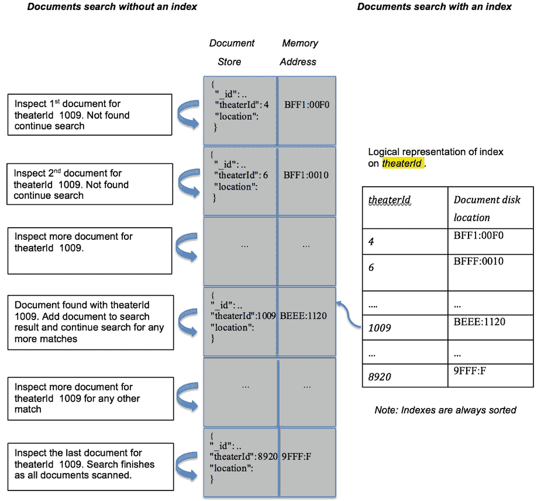

图 9.2：带有索引和不带索引的数据搜索

以下表格代表了在这两种不同情况下扫描的文档数量与返回的文档数量。

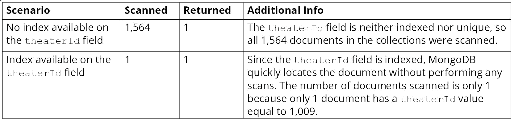

图 9.3：扫描的文档和返回的文档的详细信息

从上表可以看出，使用索引进行搜索比不使用索引更可取。在本节中，我们了解到数据库支持索引以更快地检索数据，以及索引注册表如何帮助避免完全扫描集合。现在我们将学习如何创建索引并在集合中查找索引。

# 创建和列出索引

可以通过在集合上执行`createIndex()`命令来创建索引，如下所示：

```js
db.collection.createIndex(
keys, 
options
)
```

命令的第一个参数是一个键值对列表，其中每对由字段名和排序顺序组成，可选的第二个参数是一组控制索引的选项。

在上一节中，您编写了以下查询，以查找所有在 2015 年发布的电影，按获奖数量降序排序，并打印标题和获奖次数：

```js
db.movies.find(
    { 
        "year" : 2015
    },
    {
        "title" : 1, 
        "awards.wins" : 1
    }
).sort(
    {"awards.wins" : -1}
)
```

由于查询在`year`字段上使用了过滤器，因此需要在该字段上创建一个索引。下一个命令通过传递`1`的排序顺序在`year`字段上创建一个索引，表示升序：

```js
db.movies.createIndex(
    {year: 1}
)
```

下面的片段显示了在 mongo shell 上执行命令后的输出：

```js
 {
     "createdCollectionAutomatically" : true,
     "numIndexesBefore" : 2,
     "numIndexesAfter" : 3,
     "ok" : 1,
     "$clusterTime" : {
          "clusterTime" : Timestamp(1596352285, 3),
          "signature" : {
               "hash" : BinData(0,"Ce9YztoqHYaBhubyzM3SsujEYFY="),
               "keyId" : NumberLong("6853300587753111555")
          }
     },
     "operationTime" : Timestamp(1596352285, 3)
}
```

输出表明索引已成功创建。它还提到了在执行此命令之前和之后存在的索引数量（请参阅代码中的突出部分）以及索引创建的时间。

## 在集合上列出索引

您可以使用`getIndexes()`命令列出集合的索引。此命令不带任何参数。它只是返回一组带有一些基本详细信息的索引数组。

执行以下命令将列出`movies`集合中存在的所有索引：

```js
db.movies.getIndexes()
```

此命令的输出将如下所示：

```js
[
     {
          "v" : 2,
          "key" : {
               "_id" : 1
          },
          "name" : "_id_",
          "ns" : "sample_mflix.movies"
     },
     {
          "v" : 2,
          "key" : {
               "_fts" : "text",
               "_ftsx" : 1
          },
          "name" : "cast_text_fullplot_text_genres_text_title_text",
          "default_language" : "english",
          "language_override" : "language",
          "weights" : {
               "cast" : 1,
               "fullplot" : 1,
               "genres" : 1,
               "title" : 1
          },
          "ns" : "sample_mflix.movies",
          "textIndexVersion" : 3
     },
     {
          "v" : 2,
          "key" : {
               "year" : 1
          },
          "name" : "year_1",
          "ns" : "sample_mflix.movies"
     }
]
```

输出表明集合中有三个索引，包括您刚刚创建的索引。对于每个索引，它显示了版本、索引字段及其排序顺序、索引名称和由索引名称和数据库名称组成的命名空间。请注意，当在`year`字段上创建索引时，您没有指定其名称。您将在下一节中了解索引名称是如何派生的。

## 索引名称

如果未明确提供名称，MongoDB 会为索引分配一个默认名称。索引的默认名称由字段名称和排序顺序以下划线分隔组成。如果索引中有多个键（称为复合索引），则所有键都以相同的方式连接。

以下命令为`theaterId`字段创建一个索引，而不提供名称：

```js
db.theaters.createIndex(
    {theaterId : 1}
)
```

此命令将导致创建一个名为`theaterId_1`的索引。

但是，您也可以使用特定名称创建索引。为此，您可以使用`name`属性为索引提供自定义名称，如下所示：

```js
db.theaters.createIndex(
    {theaterId : -1},
    {name : "myTheaterIdIndex"}
);
```

上述命令将创建一个名为`myTheaterIdIndex`的索引。在下一个练习中，您将使用 MongoDB Atlas 创建一个索引。

## 练习 9.01：使用 MongoDB Atlas 创建索引

在上一节中，您学习了如何使用 mongo shell 创建索引。在本练习中，您将使用 MongoDB Atlas 门户在`sample_analytics`数据库中的`accounts`集合上创建一个索引。执行以下步骤完成此练习：

1.  登录到您的帐户[`www.mongodb.com/cloud/atlas`](https://www.mongodb.com/cloud/atlas)。

1.  转到`sample_analytics`数据库并选择`accounts`集合。在集合屏幕上，选择`Indexes`选项卡，您应该看到一个索引。

图 9.4：`sample_analytics`数据库中`accounts`集合中的索引选项卡

1.  单击右上角的`CREATE INDEX`按钮。您应该会看到一个模态框，如下图所示：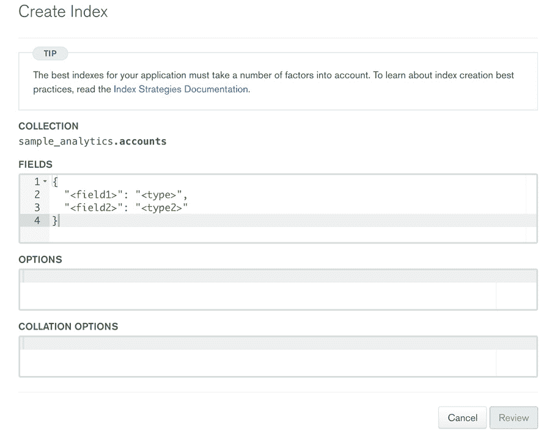

图 9.5：创建索引页面

1.  要在`account_id`上创建一个索引，从`FIELDS`部分中删除默认字段和类型条目。将`account_id`作为字段引入，并将值为`1`的类型作为升序索引顺序。以下是显示更新后的`FIELDS`部分的屏幕截图：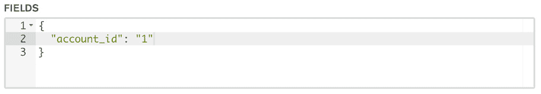

图 9.6：更新的 FIELDS 部分

1.  传递`name`参数以在`OPTIONS`部分提供自定义索引名称，如下所示：

图 9.7：在 OPTIONS 部分传递 name 参数

1.  一旦更新字段部分，`Review`按钮应该变成绿色。单击它以进行下一步：

图 9.8 评论按钮

1.  将向您呈现确认屏幕。在下一个屏幕上单击“确认”按钮以完成创建索引：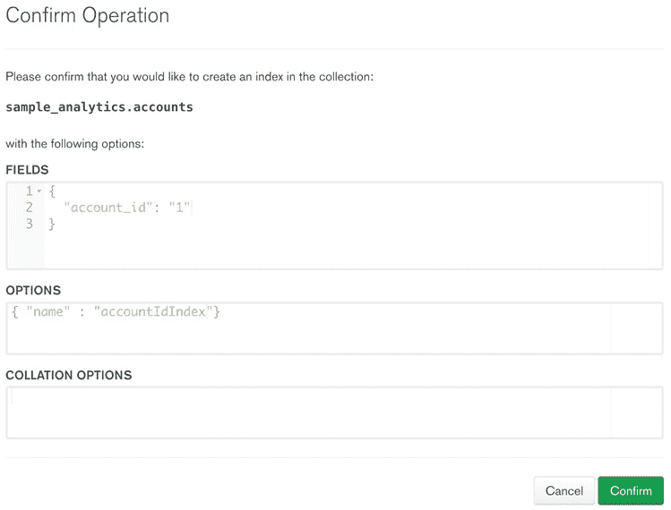

图 9.9：确认屏幕

索引创建完成后，索引列表将更新如下：

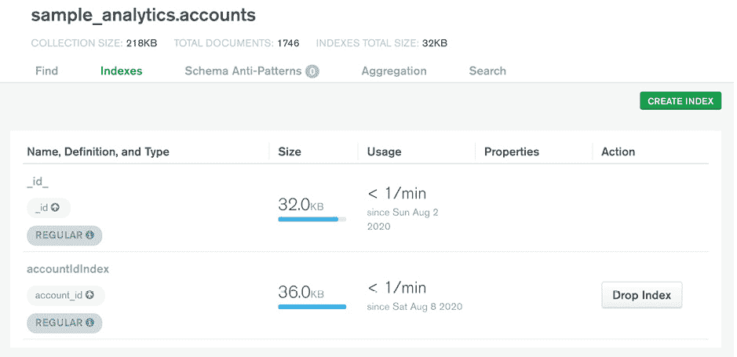

图 9.10：更新的索引列表

在这个练习中，您已成功使用 MongoDB Atlas 门户创建了索引。

您现在已经学会了如何在集合上创建索引。接下来，您将看到索引字段如何提高查询性能。

# 索引后的查询分析

在*查询分析*部分，您分析了一个没有合适的索引来支持其查询条件的查询的性能。因此，查询扫描了集合中的所有`23539`个文档，返回了`484`个匹配的文档。现在您已经在`year`字段上添加了一个索引，让我们看看查询执行统计数据如何改变。

以下查询打印了相同查询的执行统计信息：

```js
db.movies.explain("executionStats").find(
    { 
        "year" : 2015
    },
    {
        "title" : 1, 
        "awards.wins" : 1
    }
).sort(
    {"awards.wins" : -1}
)
```

这次的输出与之前的略有不同，如下所示：

```js
       "executionStats" : {
          "executionSuccess" : true,
          "nReturned" : 484,
          "executionTimeMillis" : 7,
          "totalKeysExamined" : 484,
          "totalDocsExamined" : 484,
          "executionStages" : {
               "stage" : "PROJECTION_DEFAULT",
               "nReturned" : 484,
               "executionTimeMillisEstimate" : 0,
               "works" : 971,
               "advanced" : 484,
               "needTime" : 486,
               "needYield" : 0,
               "saveState" : 7,
               "restoreState" : 7,
               "isEOF" : 1,
               "transformBy" : {
                    "title" : 1,
                    "awards.wins" : 1
               },
               "inputStage" : {
                    "stage" : "SORT",
                    "nReturned" : 484,
                    "executionTimeMillisEstimate" : 0,
                    "works" : 971,
                    "advanced" : 484,
                    "needTime" : 486,
                    "needYield" : 0,
                    "saveState" : 7,
                    "restoreState" : 7,
                    "isEOF" : 1,
                    "sortPattern" : {
                         "awards.wins" : -1
                    },
                    "memUsage" : 613758,
                    "memLimit" : 33554432,
                    "inputStage" : {
                         "stage" : "SORT_KEY_GENERATOR",
                         "nReturned" : 484,
                         "executionTimeMillisEstimate" : 0,
                         "works" : 486,
                         "advanced" : 484,
                         "needTime" : 1,
                         "needYield" : 0,
                         "saveState" : 7,
                         "restoreState" : 7,
                         "isEOF" : 1,
                         "inputStage" : {
                              "stage" : "FETCH",
                              "nReturned" : 484,
                              "executionTimeMillisEstimate" : 0,
                              "works" : 485,
                              "advanced" : 484,
                              "needTime" : 0,
                              "needYield" : 0,
                              "saveState" : 7,
                              "restoreState" : 7,
                              "isEOF" : 1,
                              "docsExamined" : 484,
                              "alreadyHasObj" : 0,
                              "inputStage" : {
                                   "stage" : "IXSCAN",
                                   "nReturned" : 484,
                                   "executionTimeMillisEstimate" : 0,
                                   "works" : 485,
                                   "advanced" : 484,
                                   "needTime" : 0,
                                   "needYield" : 0,
                                   "saveState" : 7,
                                   "restoreState" : 7,
                                   "isEOF" : 1,
                                   "keyPattern" : {
                                        "year" : 1
                                   },
                                   "indexName" : "year_1",
                                   "isMultiKey" : false,
                                   "multiKeyPaths" : {
                                        "year" : [ ]
                                   },
                                   "isUnique" : false,
                                   "isSparse" : false,
                                   "isPartial" : false,
                                   "indexVersion" : 2,
                                   "direction" : "forward",
                                   "indexBounds" : {
                                        "year" : [
                                             "[2015.0, 2015.0]"
                                        ]
                                   },
                                   "keysExamined" : 484,
                                   "seeks" : 1,
                                   "dupsTested" : 0,
                                   "dupsDropped" : 0
                              }
                         }
                    }
               }
          }
     },
```

第一个不同之处在于第一个阶段（即`COLLSCAN`）现在被`IXSCAN`和`FETCH`阶段所取代。这意味着首先执行了索引扫描阶段，然后根据检索到的索引引用，从集合中获取了数据。此外，顶层字段表明只检查了`484`个文档，并返回了相同数量的文档。

因此，我们看到通过减少扫描的文档数量，查询性能得到了极大的改善。正如在这里所表现的那样，查询执行时间现在从`85`毫秒减少到了`7`毫秒。即使每年向集合中推入更多的文档，查询的性能也将保持一致。

我们已经看到了如何创建索引，以及如何列出集合中的索引。MongoDB 还提供了一种删除索引的方法。接下来的部分将详细探讨这一点。

# 隐藏和删除索引

删除索引意味着从索引注册表中删除字段的值。因此，对相关字段的任何搜索都将以线性方式执行，前提是该字段上没有其他索引。

重要的是要注意，MongoDB 不允许更新现有的索引。因此，要修复错误创建的索引，我们需要删除它并正确地重新创建它。

使用`dropIndex`函数删除索引。它接受一个参数，可以是索引名称或索引规范文档，如下所示：

```js
db.collection.dropIndex(indexNameOrSpecification)
```

索引规范文档是用于创建索引的索引定义（例如以下代码片段）：

```js
db.movies.createIndex(
    {title: 1}
)
```

考虑以下代码片段：

```js
db.movies.dropIndex(
     {title: 1}
)
```

此命令删除了`movies`集合中`title`字段上的索引：

```js
{
     «nIndexesWas» : 4,
     "ok" : 1,
     "$clusterTime" : {
          "clusterTime" : Timestamp(1596885249, 1),
          "signature" : {
               "hash" : BinData(0,"WNi8vLv+MUP5F7bUg6ZGAbhbT1o="),
               "keyId" : NumberLong("6853300587753111555")
          }
     },
     "operationTime" : Timestamp(1596885249, 1)
}
```

输出包含`nIndexesWas`（已突出显示），它指的是在执行命令之前的索引计数。`ok`字段显示状态为`1`，表示命令执行成功。

## 删除多个索引

您还可以使用`dropIndexes`命令删除多个索引。命令语法如下：

```js
db.collection.dropIndexes()
```

此命令可用于删除集合上的所有索引，除了默认的`_id`索引。您可以通过传递索引名称或索引规范文档来使用该命令删除单个索引。您还可以通过传递索引名称数组来使用该命令删除一组索引。以下是`dropIndexes`命令的示例：

```js
db.theaters.dropIndexes()
```

上述命令生成以下输出：

```js
{
     "nIndexesWas" : 3,
     «msg» : «non-_id indexes dropped for collection»,
     "ok" : 1,
     "$clusterTime" : {
          "clusterTime" : Timestamp(1596887253, 1),
          "signature" : {
               "hash" : BinData(0,"+OYwY3X1upiuad63SOAYOe0uPXI="),
               "keyId" : NumberLong("6853300587753111555")
          }
     },
     "operationTime" : Timestamp(1596887253, 1)
}
```

除了默认的`_id`索引之外，所有索引都已删除，如`msg`属性（已突出显示）中所确认的那样。

## 隐藏索引

MongoDB 提供了一种方法来隐藏查询规划器中的索引。创建和删除索引在时间上是昂贵的操作。对于大型集合，这些操作需要更长的时间才能完成。因此，在决定删除索引之前，您可以首先隐藏它以分析性能影响，然后据此决定。

要隐藏索引，可以在集合上使用`hideIndex()`命令，如下所示：

```js
db.collection.hideIndex(indexNameOrSpecification)
```

命令的参数与`dropIndex()`函数类似。它接受索引的名称或索引规范文档。

需要注意的一点是，隐藏的索引只出现在`getIndexes()`函数调用中。它们在集合上的每次写操作后更新。但是，查询规划器看不到这些索引，因此不能用于执行查询。

一旦索引被隐藏，您可以分析对查询的影响，并在确实不需要时删除索引。但是，如果隐藏索引对性能产生不利影响，您可以使用`unhideIndex()`函数来恢复或取消隐藏它们，如下所示：

```js
db.collection.unhideIndex(indexNameOrSpecification)
```

`unhideIndex()`函数接受一个参数，可以是索引名称或索引规范文档。由于隐藏的索引始终在写操作后更新，因此它们始终处于就绪状态。取消隐藏它们可以立即使它们恢复运行。

## 练习 9.02：使用 Mongo Atlas 删除索引

在这个练习中，您将使用 Atlas 门户从`sample_analytics`数据库的`accounts`集合中删除一个索引。以下步骤将帮助您完成这个练习：

1.  登录到您的帐户[`www.mongodb.com/cloud/atlas`](https://www.mongodb.com/cloud/atlas)。

1.  转到`sample_ analytics`数据库并选择`accounts`集合。在集合屏幕上，选择`Indexes`选项卡，您应该看到现有的索引。单击要删除的索引旁边的`删除索引`按钮：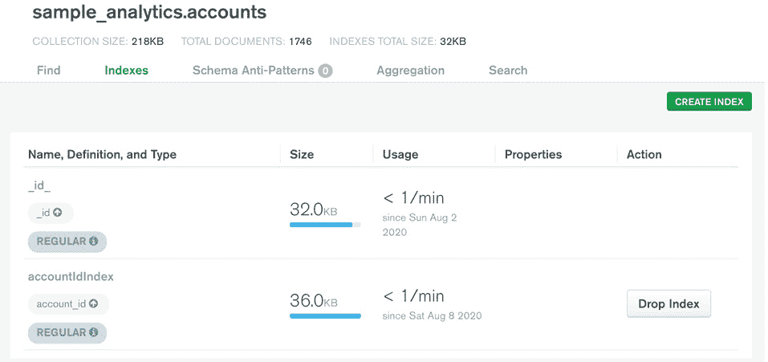

图 9.11：sample_analytics 数据库的 accounts 集合的索引选项卡

1.  应该显示一个确认对话框，如下图所示。输入索引名称，该名称也以粗体显示在对话框消息中：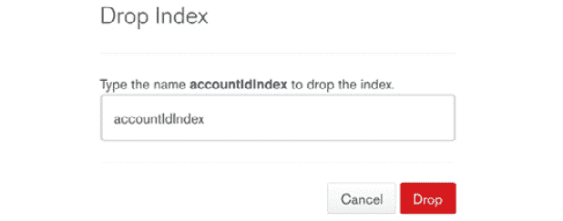

图 9.12：输入要删除的索引名称

1.  如下屏幕所示，索引应该从索引列表中删除。请注意`accountIdIndex`索引的缺失：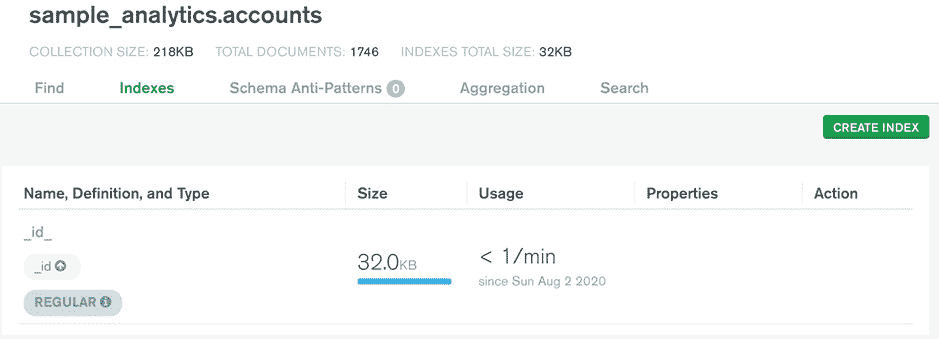

图 9.13：索引选项卡指示成功删除了 accountIdIndex

在这个练习中，您通过使用 MongoDB Atlas 门户删除了集合上的一个索引。在下一节中，我们将看一下 MongoDB 中可用的索引类型。

# 索引类型

我们已经看到索引如何帮助查询性能，以及我们如何在集合中创建、删除和列出索引。MongoDB 支持不同类型的索引，如单键、多键和复合索引。在决定哪种类型适合您的集合之前，您需要了解每种索引的不同优势。让我们从默认索引的简要概述开始。

## 默认索引

如前几章所示，集合中的每个文档都有一个主键（即`_id`字段）并且默认情况下已建立索引。MongoDB 使用此索引来维护`_id`字段的唯一性，并且它在所有集合上都可用。

## 单键索引

使用集合中的单个字段创建的索引称为单键索引。在本章的前面部分，您使用了单键索引。语法如下：

```js
db.collection.createIndex({ field1: type}, {options})
```

## 复合索引

当使用关键字显着减少要扫描的文档数量时，单键索引是首选的。但是，在某些情况下，单键索引不足以减少集合扫描。当查询基于多个字段时，通常会发生这种情况。

考虑您编写的用于查找 2015 年上映电影的查询。您看到在`year`字段上添加单键索引可以提高查询性能。现在，您将修改查询并添加基于`rated`字段的过滤器，如下所示：

```js
db.movies.find(
    { 
        "year" : 2015,
        "rated" : "UNRATED"
    },
    {
        "title" : 1, 
        "awards.wins" : 1
    }
).sort(
    {"awards.wins" : -1}
)
```

在此查询上使用`explain("executionStats")`并分析执行统计信息：

```js
"executionStats" : {
          "executionSuccess" : true,
          "nReturned" : 3,
          "executionTimeMillis" : 1,
          "totalKeysExamined" : 484,
          "totalDocsExamined" : 484,
          "executionStages" : {
```

前面的片段来自查询的执行统计信息。以下是这些统计信息的重要观察结果：

+   由于索引，只扫描了`484`个文档。

+   索引帮助定位了`484`个文档，并且基于`rated`字段的第二个过滤器是通过集合扫描应用的。

从这些观点来看，很明显我们再次扩大了要扫描的文档数量和返回的文档数量之间的差异。当使用具有数千条记录的其他年份的相同查询时，这可能会成为潜在的性能问题。对于这种情况，数据库允许您基于多个字段创建索引（称为复合索引）。`createIndex`命令可用于使用以下语法创建复合索引：

```js
db.collection.createIndex({ field1: type, field2: type, ...}, {options})
```

此语法与单字段索引的语法类似，只是它接受多对字段及其相应的排序顺序。请注意，复合索引最多可以包含`32`个字段。

现在，在`year`和`rated`字段上创建一个复合索引：

```js
db.movies.createIndex(
    {year : 1, rated : 1}
) 
```

此命令生成以下输出：

```js
{
     "createdCollectionAutomatically" : false,
     "numIndexesBefore" : 3,
     "numIndexesAfter" : 4,
     "ok" : 1,
     "$clusterTime" : {
          "clusterTime" : Timestamp(1596932004, 4),
          "signature" : {
               "hash" : BinData(0,"y8fxEd0oLD6+OkLmhCjirg2Cm14="),
               "keyId" : NumberLong("6853300587753111555")
          }
     },
     "operationTime" : Timestamp(1596932004, 4)
}
```

复合索引的默认名称包含字段名称及其排序顺序，用下划线分隔。最后一个索引创建的索引的索引名称将是`year_1_rated_1`。您也可以为复合索引指定自定义名称。

现在您已在两个字段上创建了额外的索引，请观察查询给出的执行统计信息：

```js
"executionStats" : {
          "executionSuccess" : true,
          "nReturned" : 3,
          "executionTimeMillis" : 2,
          "totalKeysExamined" : 3,
          "totalDocsExamined" : 3,
          "executionStages" : {
```

前面的片段表明，复合索引用于执行此查询，而不是您之前创建的单键索引。扫描的文档数量和返回的文档数量相同。由于只扫描了`3`个文档，查询执行时间也减少了。

## 多键索引

在数组类型字段上创建的索引称为多键索引。当数组字段作为`createIndex`函数的参数传递时，MongoDB 为数组的每个元素创建一个索引条目。`createIndex`元素的语法与创建常规（非数组）字段的索引的语法相同：

```js
db.collectionName.createIndex( { arrayFieldName: sortOrder } )
```

MongoDB 检查输入字段，如果是数组，则将创建多键索引。例如，考虑以下命令：

```js
db.movies.createIndex(
    {"languages" : 1}
)
```

此查询在`languages`字段上添加了一个索引，该字段是一个数组。在 MongoDB 中，您可以根据其数组字段的元素查找文档。多键索引有助于加速此类查询：

```js
db.movies.explain("executionStats").count(
    {"languages": "Cantonese"}
)
```

让我们看看前面的查询的执行情况：

```js
     "executionStats" : {
          "executionSuccess" : true,
          "nReturned" : 361,
          "executionTimeMillis" : 1,
          "totalKeysExamined" : 361,
          "totalDocsExamined" : 361,
          "executionStages" : {
```

执行统计信息的片段显示返回了`361`个文档，并且扫描了相同数量的文档。这证明了多键索引被正确创建和使用。

## 文本索引

在字符串字段或字符串元素数组上定义的索引称为文本索引。文本索引未排序，这意味着它们比普通索引更快。创建文本索引的语法如下：

```js
db.collectionName.createIndex({ fieldName : "text"})
```

以下是要在`users`集合的`name`字段上创建的文本索引的示例：

```js
db.users.createIndex(
    { name : "text"}
)
```

该命令应生成以下输出：

```js
{
     "createdCollectionAutomatically" : false,
     "numIndexesBefore" : 2,
     "numIndexesAfter" : 3,
     "ok" : 1,
     "$clusterTime" : {
          "clusterTime" : Timestamp(1596889407, 2),
          "signature" : {
               "hash" : BinData(0,"B4Ro1V1WTwkGUMGEImtxvctR9C4="),
               "keyId" : NumberLong("6853300587753111555")
          }
     },
     "operationTime" : Timestamp(1596889407, 2)
}
```

注意

您不能通过传递索引规范文档来删除文本索引，此类索引只能通过传递`dropIndex`函数中的索引名称来删除。

## 嵌套文档上的索引

一个文档可以包含嵌套对象来组合一些属性。例如，在`sample_mflix`数据库的`theaters`集合中包含了`location`字段，其中包含了一个嵌套对象：

```js
{
     "_id" : ObjectId("59a47286cfa9a3a73e51e72c"),
     "theaterId" : 1000,
     "location" : {
          "address" : {
               "street1" : "340 W Market",
               "city" : "Bloomington",
               "state" : "MN",
               "zipcode" : "55425"
          },
          "geo" : {
               "type" : "Point",
               "coordinates" : [
                    -93.24565,
                    44.85466
               ]
          }
     }
}
```

使用点（`.`）表示法，您可以在嵌套文档字段上创建索引，就像在集合中的任何其他字段一样，如下面的示例所示：

```js
db.theaters.createIndex(
    { "location.address.zipcode" : 1}
)
```

您还可以在嵌入式文档上创建索引。例如，您可以在`location`字段上创建索引，而不是它的属性，如下所示：

```js
db.theaters.createIndex(
    { "location" : 1}
)
```

当通过传递整个嵌套文档搜索位置时，可以使用此类索引。

## 通配符索引

MongoDB 支持灵活的模式，不同的文档可以具有不同类型和数量的字段。在不统一的字段上创建和维护索引可能会很困难，因为这些字段并非所有文档都具有。此外，当向文档中引入新字段时，它仍然未被索引。

为了更好地理解，考虑来自假设的`products`集合的以下文档。下表显示了两个不同的产品文档：

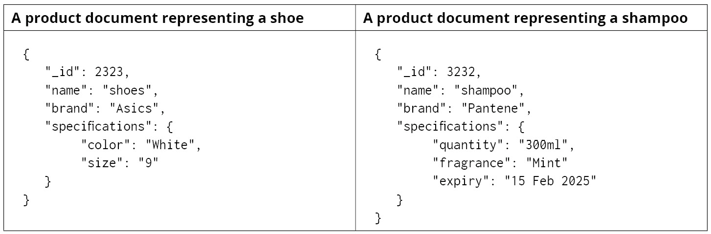

图 9.14：两个不同的产品规格文档

正如您所看到的，`specifications` 下的字段是动态的。不同的产品可以有不同的规格。在每个字段上定义索引将导致太多的索引定义。随着不断添加具有新字段的新产品，创建索引的想法并不实际。MongoDB 提供通配符索引来解决这个问题。例如，考虑以下查询：

```js
db.products.createIndex(
    { "specifications.$**"  : 1}
)
```

此查询使用特殊的通配符字符（`$**`）在`specifications`字段上创建索引。它将在`specifications`下的所有字段上创建索引。如果将来添加了新的嵌套字段，它们将自动被索引。

同样，通配符索引也可以在集合的顶级字段上创建。

```js
db.products.createIndex(
    { "$**" : 1 } 
)
```

上述命令在所有文档的所有字段上创建索引。因此，所有添加到文档中的新字段将默认被索引。

您还可以通过传递`wildcardProjection`选项和一个或多个字段名称来选择或省略通配符索引中的特定字段，如下面的代码片段所示：

```js
db.products.createIndex(
    { "$**" : 1 },
    { 
        "wildcardProjection" : { "name" : 0 }
    }
)
```

上述查询在集合的所有字段上创建了一个通配符索引，但排除了`name`字段。要显式包含`name`字段，排除所有其他字段，您可以将其传递为`1`的值。

注意

MongoDB 提供了一对索引来支持几何字段：`2dsphere`和`2d`。本书不涵盖这些索引的范围，但感兴趣的读者可以在[`docs.mongodb.com/manual/geospatial-queries/#geospatial-indexes`](https://docs.mongodb.com/manual/geospatial-queries/#geospatial-indexes)找到更多信息。

现在我们已经介绍了索引的类型，接下来我们将在下一节中探讨索引的属性。

# 索引的属性

在本节中，我们将介绍 MongoDB 中索引的不同属性。索引属性可以影响索引的使用，并且还可以对集合施加一些行为。索引属性作为选项传递给`createdIndex`函数。我们将研究唯一索引、TTL（生存时间）索引、稀疏索引，最后是部分索引。

## 唯一索引

唯一索引属性限制了索引键的重复。如果您想要在集合中保持字段的唯一性，这是很有用的。唯一字段对于避免在准确识别文档时产生任何歧义是有用的。例如，在`license`集合中，像`license_number`这样的唯一字段可以帮助单独识别每个文档。此属性强制集合拒绝重复条目。唯一索引可以在单个字段或一组字段上创建。以下是在单个文件上创建唯一索引的语法：

```js
db.collection.createIndex(
    { field: type}, 
    { unique: true }
)
```

`{ unique: true }`选项用于创建唯一索引。

在某些情况下，您可能希望一些字段的组合是唯一的。对于这种情况，您可以在创建复合索引时传递`unique: true`标志来定义一个唯一的复合索引，如下所示：

```js
db.collection.createIndex(
    { field1 : type, field2: type2, ...}, 
    { unique: true }
)
```

## 练习 9.03：创建唯一索引

在这个练习中，您将强制`sample_mflix`数据库中`theaters`集合中`theaterId`字段的唯一性：

1.  将您的 shell 连接到 Atlas 集群，并选择`sample_mflix`数据库。

1.  确认`theaters`集合是否强制`theaterId`字段的唯一性。为此，找到一条记录，并尝试使用与获取的记录中相同的`theaterId`插入另一条记录。以下是从`theaters`集合中检索文档的命令：

```js
db.theaters.findOne();
```

这导致以下输出，尽管您可能会得到不同的记录：

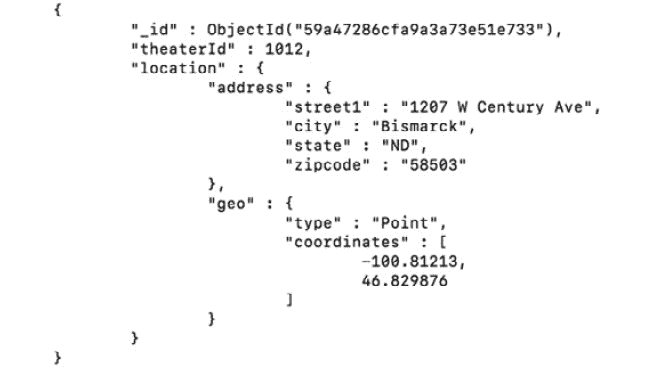

图 9.15：从剧院集合中检索文档的结果

1.  现在，插入一个具有相同`theaterId`（即`1012`）的记录：

```js
db.theaters.insertOne(
    {theaterId : 1012}
);
```

文档成功插入，证明`theaterId`不是一个唯一字段。

1.  现在，使用以下命令在`theaterId`字段上创建一个唯一索引：

```js
db.theaters.createIndex(
    {theaterId : 1}, 
    {unique : true}
)
```

上述命令将返回错误响应，因为有一个先决条件，即集合中不应该存在重复的记录。以下是确认此事实的输出：

```js
{
     "operationTime" : Timestamp(1596939398, 1),
     "ok" : 0,
     "errmsg" : "E11000 duplicate key error collection: 5f261717eae2b55842a6aff0_sample_mflix.theaters index: theaterId_1 dup key: { theaterId: 1012.0 }",
     "code" : 11000,
     "codeName" : "DuplicateKey",
     "keyPattern" : {
          "theaterId" : 1
     },
     "keyValue" : {
          "theaterId" : 1012
     },
     "$clusterTime" : {
          "clusterTime" : Timestamp(1596939398, 1),
          "signature" : {
               "hash" : BinData(0,"hzOmtVWMNJkF3fkISbf3kJLLZIA="),
               "keyId" : NumberLong("6853300587753111555")
          }
     }
}
```

1.  现在，使用其`_id`值删除在*步骤 3*中插入的重复记录：

```js
db.theaters.remove(
    {_id : ObjectId("5dd9c2d9de850e38c5cfc6dd")}
)
```

1.  尝试再次创建唯一索引，如下所示：

```js
db.theaters.createIndex(
    {theaterId : 1},
    {unique : true}
)
```

这次，您应该收到一个成功的响应，如下所示：

```js
{
     "createdCollectionAutomatically" : false,
     "numIndexesBefore" : 1,
     "numIndexesAfter" : 2,
     "ok" : 1,
     "$clusterTime" : {
          "clusterTime" : Timestamp(1596939728, 2),
          "signature" : {
               "hash" : BinData(0,"hdejOvB7dqQojg46DRWRLJVwblM="),
               "keyId" : NumberLong("6853300587753111555")
          }
     },
     "operationTime" : Timestamp(1596939728, 2)
}
```

1.  现在字段有了唯一索引，尝试插入一个重复记录，如下所示：

```js
db.theaters.insertOne(
    {theaterId : 1012}
);
```

由于重复键错误，此命令将失败：

```js
2020-08-09T12:24:11.584+1000 E  QUERY    [js] WriteError({
     "index" : 0,
     "code" : 11000,
     "errmsg" : "E11000 duplicate key error collection: sample_mflix.theaters index: theaterId_1 dup key: { theaterId: 1012.0 }",
     "op" : {
          "_id" : ObjectId("5f2f5e4b78436de2a47da0e4"),
          "theaterId" : 1012
     }
}) :
WriteError({
     "index" : 0,
     "code" : 11000,
     "errmsg" : "E11000 duplicate key error collection: sample_mflix.theaters index: theaterId_1 dup key: { theaterId: 1012.0 }",
     "op" : {
          "_id" : ObjectId("5f2f5e4b78436de2a47da0e4"),
          "theaterId" : 1012
     }
})
```

在这个练习中，您对索引强制了唯一性属性。

## TTL 索引

`expireAfterSeconds`属性。以下代码显示了创建 TTL 索引的语法：

```js
db.collection.createIndex({ field: type}, { expireAfterSeconds: seconds })
```

在这里，`{ expireAfterSeconds: seconds }`选项用于创建 TTL 索引。MongoDB 会删除已经过了`expireAfterSeconds`值的文档。

## 练习 9.04：使用 Mongo Shell 创建 TTL 索引

在这个练习中，您将在一个名为`reviews`的集合上创建一个 TTL 索引。一个名为`reviewDate`的字段将用于捕获评论的当前日期和时间。您将引入一个 TTL 索引来检查是否删除了已经过去阈值的记录：

1.  将 mongo shell 连接到 Atlas 集群，并切换到`sample_mflix`数据库。

1.  通过插入两个文档来创建`reviews`集合，如下所示：

```js
db.reviews.insert(
    {"reviewer" : "Eliyana A" , "movie" : "Cast Away","review" : "Interesting plot", "reviewDate" : new Date() }
);
db.reviews.insert(
    {"reviewer" : "Zaid A" , "movie" : "Sully","review" : "Captivating", "reviewDate" : new Date() }
);
```

1.  从`reviews`集合中获取这些文档，以确认它们存在于集合中：

```js
db.reviews.find().pretty();
```

这个命令导致以下输出：

```js
{
     "_id" : ObjectId("5f2f65d978436de2a47da0e5"),
     "reviewer" : "Eliyana",
     "movie" : "Cast Away",
     "review" : "Interesting plot",
     "reviewDate" : ISODate("2020-08-09T02:56:25.415Z")
}
{
     "_id" : ObjectId("5f2f65dd78436de2a47da0e6"),
     "reviewer" : "Zaid",
     "movie" : "Sully",
     "review" : "Captivating",
     "reviewDate" : ISODate("2020-08-09T02:56:29.144Z")
}
```

1.  使用以下命令引入 TTL 索引，使 60 秒后过期的文档：

```js
db.reviews.createIndex(
    { reviewDate: 1}, 
    { expireAfterSeconds: 60 }
)
```

这导致以下输出：

```js
 {
     "createdCollectionAutomatically" : false,
     "numIndexesBefore" : 1,
     "numIndexesAfter" : 2,
     "ok" : 1,
     "$clusterTime" : {
          "clusterTime" : Timestamp(1596941915, 2),
          "signature" : {
               "hash" : BinData(0,"s5DU9ZElN+N2cCZ8d27pV5802Uk="),
               "keyId" : NumberLong("6853300587753111555")
          }
     },
     "operationTime" : Timestamp(1596941915, 2)
}
```

1.  60 秒后，再次执行`find`查询：

```js
db.reviews.find().pretty();
```

查询不会返回任何记录，并且证明两个文档在 60 秒后被删除。

在这个练习中，您在一个集合上创建了一个 TTL 索引，并看到文档在指定时间后过期。

## 稀疏索引

当在字段上创建索引时，来自所有文档的该字段的所有值都会在索引注册表中维护。如果文档中不存在该字段，则会为该文档注册一个`null`值。相反，如果索引标记为`sparse`，则只有那些存在某个值的给定字段的文档会被注册，包括`null`。稀疏索引不会包含集合中不存在索引字段的条目，这就是为什么这种类型的索引被称为稀疏索引。

复合索引也可以标记为稀疏。对于复合稀疏索引，只有存在字段组合的文档才会被注册。通过向`createIndex`命令传递`{ sparse: true }`标志来创建稀疏索引，如下面的片段所示：

```js
db.collection.createIndex({ field1 : type, field2: type2, ...}, { sparse: true })
```

MongoDB 没有提供任何列出由索引维护的文档的命令。这使得分析稀疏索引的行为变得困难。这就是`db.collection.stats()`函数可以真正有用的地方，您将在下一个练习中观察到。

## 练习 9.05：使用 Mongo Shell 创建稀疏索引

在这个练习中，您将在`reviews`集合的`review`字段上创建一个稀疏索引。您将验证索引仅维护具有`review`字段的文档的条目。为此，您将使用`db.collection.stats()`命令来检查索引的大小，首先插入具有索引字段的文档，然后再次插入不带字段的文档。当插入不带`review`字段的文档时，索引的大小应保持不变：

1.  将 mongo shell 连接到 Atlas 集群，并切换到`sample_mflix`数据库。

1.  在`review`字段上创建一个稀疏索引：

```js
db.reviews.createIndex(
    {review: 1},
    {sparse : true}
)
```

1.  检查当前集合上索引的大小：

```js
db.reviews.stats();
```

此命令的结果如下：

```js
{
     "ns" : "sample_mflix.reviews",
     "size" : 0,
     "count" : 0,
     "storageSize" : 36864,
     "capped" : false,
     "nindexes" : 3,
     "indexBuilds" : [ ],
     "totalIndexSize" : 57344,
     "indexSizes" : {
          "_id_" : 36864,
          "reviewDate_1" : 12288,
          review_1 under the indexSizes section of the preceding output.
```

1.  插入一个不包含`review`字段的文档，如下所示：

```js
db.reviews.insert(
    {"reviewer" : "Jamshed A" , "movie" : "Gladiator"}
);
```

1.  使用`stats()`函数检查索引的大小：

```js
db.reviews.stats()
```

输出如下：

```js
     "indexSizes" : {
          "_id_" : 36864,
          "reviewDate_1" : 12288,
          review_1 index (highlighted) has not changed. This is because the last document was not registered in the index.
```

1.  现在，插入一个包含`review`字段的文档：

```js
db.reviews.insert(
    {"reviewer" : "Javed A" , "movie" : "The Pursuit of Happyness", "review": "Inspirational"}
);
```

1.  再次使用`stats()`函数检查索引的大小经过几分钟：

```js
db.reviews.stats()
```

输出中的`indexSizes`部分如下：

```js
      "indexSizes" : {
          "_id_" : 36864,
          "reviewDate_1" : 36864,
          reviews field, which is part of the sparse index.NoteIndex updates can take some time, depending on the size of the index. So, give it a few moments before you view the updated size of the index.  
```

在这个练习中，您创建了一个稀疏索引，并证明了没有索引字段的文档不会被索引。

## 部分索引

可以创建一个索引来维护与给定过滤器表达式匹配的文档。这样的索引称为部分索引。由于根据输入表达式过滤文档，因此索引的大小比普通索引要小。创建部分索引的语法如下：

```js
db.collection.createIndex(
    { field1 : type, field2: type2, ...}, 
    { partialFilterExpression: filterExpression }
) 
```

在上面的片段中，使用`{ partialFilterExpression: filterExpression }`选项创建了一个部分索引。`partialFilterExpression`只能接受包含以下列表中的操作的表达式文档：

+   相等表达式（即`field: value`或使用`$eq`运算符）

+   `$exists: true`表达式

+   `$gt`，`$gte`，`$lt`和`$lte`表达式

+   `$type`表达式

+   顶层的`$and`运算符

为了更好地了解部分索引的工作原理，让我们进行一个简单的练习。

## 练习 9.06：使用 Mongo Shell 创建部分索引

在这个练习中，您将为 1950 年后发布的所有电影的`title`和`type`字段引入一个复合索引。然后，您将使用`partialFilterExpression`验证索引是否包含所需的条目：

1.  将 mongo shell 连接到 Atlas 集群，并切换到`sample_mflix`数据库。

1.  在`movies`集合中的`title`和`type`字段上使用`partialFilterExpression`引入一个部分索引，如下所示：

```js
db.movies.createIndex(
    {title: 1, type:1}, 
    {
        partialFilterExpression: { 
            year : { $gt: 1950}
        }
    }
)
```

上述命令为所有在 1950 年后发布的电影的给定字段创建了一个部分复合索引。以下片段显示了此命令的输出：

```js
{
     "createdCollectionAutomatically" : false,
     "numIndexesBefore" : 2,
     "numIndexesAfter" : 3,
     "ok" : 1,
     "$clusterTime" : {
          "clusterTime" : Timestamp(1596945704, 2),
          "signature" : {
               "hash" : BinData(0,"jaL6CDJrPPntbo5LibWl+Yv74Zo="),
               "keyId" : NumberLong("6853300587753111555")
          }
     },
     "operationTime" : Timestamp(1596945704, 2)
}
```

1.  使用`stats()`函数检查并记录集合上的索引大小：

```js
db.movies.stats();
```

以下是结果输出的`indexSizes`部分：

```js
     "indexSizes" : {
          "_id_" : 368640,
          "cast_text_fullplot_text_genres_text_title_text" : 13549568,
          index, title_1_type_1, is 618,496 bytes (highlighted).
```

1.  插入一部 1950 年之前发布的电影：

```js
db.movies.insert(
    {title: "In Old California", type: "movie", year: "1910"}
)
```

1.  使用`stats()`函数检查索引大小，并确保它没有变化：

```js
db.movies.stats()
```

下一段显示了输出的`indexSizes`部分：

```js
     "indexSizes" : {
          "_id_" : 368640,
          "cast_text_fullplot_text_genres_text_title_text" : 13615104,
          «title_1_type_1» : 618496
     },
```

输出片段证明了索引大小保持不变，可以从突出显示的部分看出。

1.  现在，插入一部 1950 年之后发布的电影：

```js
db.movies.insert(
    {title: "The Lost Ground", type: "movie", year: "2019"}
)
```

1.  使用`stats()`函数再次检查索引大小：

```js
db.movies.stats()
```

以下是前述命令输出的`indexSizes`部分：

```js
     "indexSizes" : {
          "_id_" : 258048,
          "cast_text_fullplot_text_genres_text_title_text" : 13606912,
          partialFilterExpression. 
```

在这个练习中，您引入了一个部分索引，并验证了它是否按预期工作。

## 不区分大小写的索引

不区分大小写的索引允许您以不区分大小写的方式使用索引查找数据。这意味着即使字段的值以与搜索表达式中的值不同的大小写写入，索引也会匹配文档。这是由于 MongoDB 中的排序功能，它允许输入语言特定的规则，比如大小写和重音符号，以匹配文档。要创建不区分大小写的索引，您需要传递字段详细信息和`collation`参数。

创建不区分大小写索引的语法如下：

```js
db.collection.createIndex( 
    { "field" : 1 }, 
    { 
        collation: { locale : <locale>, strength : <strength> } 
    } 
)
```

注意，`collation`由`locale`和`strength`参数组成：

+   `locale`：这指的是要使用的语言，比如`en`（英语），`fr`（法语）等。完整的区域设置列表可以在[`docs.mongodb.com/manual/reference/collation-locales-defaults/#collation-languages-locales`](https://docs.mongodb.com/manual/reference/collation-locales-defaults/#collation-languages-locales)找到。

+   `strength`：值为 1 或 2 表示大小写级别的排序。您可以在[`userguide.icu-project.org/collation/concepts#TOC-Comparison-Levels`](http://userguide.icu-project.org/collation/concepts#TOC-Comparison-Levels)找到有关排序**国际 Unicode 组件**（**ICU**）级别的详细信息。

要使用指定排序规则的索引，查询和排序规范必须与索引具有相同的排序规则。

## 练习 9.07：使用 Mongo Shell 创建不区分大小写的索引

在这个练习中，您将通过连接 mongo shell 到 Atlas 集群创建一个不区分大小写的索引。这个功能对于基于 Web 的应用程序非常有用，因为数据库查询在后端是以区分大小写的方式执行的。但在前端，用户不一定会使用与后端相同的大小写进行搜索。因此，确保搜索不区分大小写是很重要的。执行以下步骤来完成这个练习：

1.  将 mongo shell 连接到 Atlas 集群，并切换到`sample_mflix`数据库。

1.  执行一个不区分大小写的搜索，并验证预期的文档没有返回：

```js
db.movies.find(
    {"title" : "goodFEllas"},
    {"title" : 1}
)
```

前述查询没有返回结果。

1.  为了解决这个问题，在`movies`集合的`title`属性上创建一个不区分大小写的索引，如下所示：

```js
db.movies.createIndex(
    {title: 1}, 
    { 
        collation: { 
            locale: 'en', strength: 2 
        } 
    } 
)
```

该命令的结果如下：

```js
{
     "createdCollectionAutomatically" : false,
     "numIndexesBefore" : 3,
     "numIndexesAfter" : 4,
     "ok" : 1,
     "$clusterTime" : {
          "clusterTime" : Timestamp(1596961452, 2),
          "signature" : {
               "hash" : BinData(0,"9cdM8c3neW3oRd9A/IFGn5gZiic="),
               "keyId" : NumberLong("6856698413690388483")
          }
     },
     "operationTime" : Timestamp(1596961452, 2)
}
```

1.  重新运行*步骤 2*中的命令，确认返回正确的电影：

```js
db.movies.find(
    {"title" : "goodFEllas"}
).collation({ locale: 'en', strength: 2});
```

该命令返回了正确的电影，如下一段所示：

```js
{ "_id" : ObjectId("573a1398f29313caabcebf8e"), "title" : "Goodfellas" }
```

在这个练习中，您创建了一个不区分大小写的索引，并验证它是否按预期工作。

注意

`collation`选项允许我们在未索引字段上执行不区分大小写的搜索。唯一的区别是这样的查询将进行完整的集合扫描。

在本节中，您回顾了不同的索引属性，并学习了如何使用每个属性创建索引。在下一节中，您将探索一些可以与索引一起使用的查询优化技术。

# 其他查询优化技术

到目前为止，我们已经看到了查询的内部工作原理以及索引如何帮助限制需要扫描的文档数量。我们还探讨了各种类型的索引及其属性，并学习了如何在特定用例中使用正确的索引和正确的索引属性。创建正确的索引可以提高查询性能，但还有一些技术需要用来微调查询性能。我们将在本节中介绍这些技术。

## 只获取所需的数据

查询的性能也受到其返回的数据量的影响。数据库服务器和客户端通过网络进行通信。如果一个查询产生大量数据，传输到网络上将需要更长的时间。此外，为了将数据传输到网络上，它需要被服务器转换和序列化，然后由接收客户端进行反序列化。这意味着数据库客户端将不得不等待更长的时间才能获得查询的最终输出。

为了提高整体性能，请考虑以下因素。

**正确的查询条件和投影**

一个应用程序可能有各种用例，每个用例可能需要不同的数据子集。因此，分析所有这些用例并确保我们有满足每个用例的最佳查询或命令是很重要的。这可以通过使用最佳的查询条件和正确使用投影来返回与用例相关的基本字段来实现。

**分页**

分页是指在每个后续请求中仅向客户端提供一小部分数据。这是性能优化的最佳方法，特别是在向客户端提供大量数据时。它通过限制返回的数据量并提供更快的结果来改善用户体验。

## 使用索引进行排序

查询通常需要以某种顺序返回数据。例如，如果用户选择查看最新电影的选项，结果电影可以根据发布日期进行排序。同样，如果用户想要查看热门电影，我们可以根据它们的评分对电影进行排序。

默认情况下，查询的排序操作是在内存中进行的。首先，所有匹配的结果都加载到内存中，然后对它们应用排序规范。对于大型数据集，这样的过程需要大量内存。MongoDB 仅保留`allowDiskUse`标志，因此当达到内存限制时，记录将被写入磁盘，然后进行排序。然而，将记录写入磁盘并读取它们会减慢查询速度。

为了避免这种情况，您可以使用用于排序的索引，因为索引是根据特定的排序顺序创建和维护的。这意味着对于索引字段，索引注册表始终根据该字段的值进行排序。当排序规范基于这样一个索引字段时，MongoDB 会引用索引来检索已经排序的数据集并返回它。

## 将索引适配到 RAM 中

当索引适配到内存中时，它们的效率要高得多。如果它们超过了可用的内存，它们将被写入磁盘。正如您已经知道的那样，磁盘操作比内存操作要慢。MongoDB 通过在内存中保留最近添加的记录并将旧记录保存在磁盘上来智能地利用磁盘和内存。这个逻辑假设最近的记录将被查询得更多。为了将索引适配到内存中，您可以在集合上使用`totalIndexSize`函数，如下所示：

```js
db.collection.totalIndexSize()
```

如果大小超过服务器上可用的内存，您可以选择增加内存或优化索引。这样，您可以确保所有索引始终保持在内存中。

## 索引选择性

当索引可以大大缩小实际集合扫描时，索引的效果更好。这取决于`isRunning`字段是否持有布尔值，这意味着它的值将是`true`或`false`：

```js
{_id: ObjectId(..), name: "motor", type: "electrical", isRunning: "true"};
{_id: ObjectId(..), name: "gear", type: "mechanical",  isRunning: "false"};
{_id: ObjectId(..), name: "plug", type: "electrical",  isRunning: "false"};
{_id: ObjectId(..), name: "starter", type: "electrical",  isRunning: "false"};
{_id: ObjectId(..), name: "battery", type: "electrical",  isRunning: "true"};
```

现在，在`isRunning`字段上添加一个索引，并执行以下查询以通过其名称找到正在运行的设备：

```js
db.devices.find({
    "name" : "motor",
    "isRunning" : false
})
```

MongoDB 将首先使用`isRunning`索引来定位所有正在运行的设备，然后才进行集合扫描以查找具有匹配`name`值的文档。由于`isRunning`只能有`true`或`false`值，因此必须扫描集合的大部分内容。

因此，为了使上述查询更有效，我们应该在`name`字段上放置一个索引，因为相同名称的文档不会太多。对于具有更广泛值或唯一值的字段，索引更有效。

## 提供提示

MongoDB 查询规划器根据自己的内部逻辑为查询选择索引。当有多个索引可用于执行查询时，查询规划器使用其默认的查询优化技术来选择和使用最合适的索引。但是，我们可以使用`hint()`函数来指定应该用于执行的索引：

```js
db.users.find().hint(
    { index }
)
```

这个命令显示了提供索引提示的语法。`hint`函数的参数可以简单地是一个索引名称或一个索引规范文档。

## 最佳索引

在了解了索引的好处之后，您可能会想知道我们是否可以在所有字段及其各种组合上创建索引。然而，索引也有一些开销。每个索引都需要一个专用的索引注册表，它在内存或磁盘上存储数据的子集。太多的索引会占用大量空间。因此，在向集合添加索引之前，我们应该首先分析需求，列出应用程序将执行的用例和可能的查询。然后，根据这些信息，应创建最少数量的索引。

尽管索引可以加快查询速度，但它们会减慢集合上的每个写操作。由于索引，集合上的每个写操作都涉及更新相应的索引注册表的开销。每当在集合中添加、删除或更新文档时，都需要更新、重新扫描和重新排序所有相应的索引注册表，这比实际的集合写操作需要更长的时间。因此，在决定使用索引之前，建议检查数据库操作是读密集还是写密集。对于写密集的集合，索引是一种开销，因此应该在经过仔细评估后才创建。

简而言之，索引既有好处又有开销。更多的索引通常意味着更快的读操作和更慢的写操作。因此，我们应该始终以最佳方式使用索引。

## 活动 9.01：优化查询

想象一下，您的组织在世界各地都有零售店。关于所有出售商品的详细信息都存储在一个 MongoDB 数据库中。数据分析团队使用销售数据来识别不同客户的购买趋势，这些客户的年龄和位置。最近，团队中的一名成员抱怨了他们编写的查询的性能。下面的代码片段显示了查询`sales`集合，以查找在丹佛商店购买了一个或多个背包的客户的电子邮件地址和年龄。然后，它按客户年龄降序排序结果：

```js
db.sales.find(
    {
        "items.name" : "backpack",
        "storeLocation" : "Denver"
    },
    {
        "_id" : 0,
        "customer.email": 1,
        "customer.age": 1
    }
).sort({
    "customer.age" : -1
})
```

您在这个活动中的任务是分析给定的查询，识别问题，并创建正确的索引以使其更快。以下步骤将帮助您完成这个活动：

1.  使用 mongo shell 连接到`sample_supplies`数据集。

1.  查找查询执行统计信息并识别问题。

1.  在集合上创建正确的索引。

1.  再次分析查询性能，看看问题是否得到解决。

注意

这个活动的解决方案可以通过此链接找到。

# 总结

在本章中，您练习了改善查询性能。您首先探索了查询执行的内部工作和查询执行阶段。然后，您学习了如何分析查询的性能，并根据执行统计数据识别任何现有问题。接下来，您复习了索引的概念；它们如何解决查询的性能问题；创建、列出和删除索引的各种方法；不同类型的索引；以及它们的属性。在本章的最后部分，您学习了查询优化技术，并简要了解了与索引相关的开销。在下一章中，您将了解复制的概念以及它在 Mongo 中的实现方式。
