# 第十章：10. 复制

概述

本章将介绍 MongoDB 集群的概念和管理。它从讨论高可用性的概念和 MongoDB 数据库的负载共享开始。您将在不同环境中配置和安装 MongoDB 副本集，管理和监控 MongoDB 副本集群，并练习集群切换和故障转移步骤。您将探索 MongoDB 中的高可用性集群，并连接到 MongoDB 集群以执行 MongoDB 集群部署的典型管理任务。

# 介绍

从 MongoDB 开发人员的角度来看，MongoDB 数据库服务器可能是某种黑匣子，在云端或数据中心的机房中。如果数据库在需要时处于运行状态，细节并不重要。但从商业角度来看，情况略有不同。例如，当生产应用程序需要 24/7 在线为客户提供服务时，这些细节就非常重要。任何中断都可能对客户的服务可用性产生负面影响，最终，如果故障不能迅速恢复，将影响业务的财务结果。

偶尔会发生中断，这可能是由各种原因引起的。这些通常是常见硬件故障的结果，例如磁盘或内存故障，但也可能是由网络故障、软件故障甚至应用程序故障引起的。例如，操作系统错误等软件故障可能导致服务器对用户和应用程序无响应。中断也可能是由洪水和地震等灾难引起的。尽管灾难发生的概率要小得多，但它们仍可能对企业产生毁灭性的影响。

预测故障和灾难是一项不可能的任务，因为无法猜测它们将发生的确切时间。因此，业务策略应该专注于为这些问题提供解决方案，通过分配冗余的硬件和软件资源。在 MongoDB 的情况下，实现高可用性和灾难恢复的解决方案是部署 MongoDB 集群，而不是单服务器数据库。与其他第三方数据库解决方案不同，MongoDB 不需要昂贵的硬件来构建高可用性集群，而且它们相对容易部署。这就是复制派上用场的地方。本章将详细探讨复制的概念。

首先，了解高可用性集群的基础知识非常重要。

## 高可用性集群

在我们深入了解 MongoDB 集群的技术细节之前，让我们首先澄清基本概念。高可用性集群有许多不同的技术实现，重要的是要了解 MongoDB 集群解决方案与其他第三方集群实现的区别。

计算机集群是一组连接在一起以提供共同服务的计算机。与单个服务器相比，集群旨在提供更好的可用性和性能。集群具有冗余的硬件和软件，允许在发生故障时继续提供服务，因此，从用户的角度来看，集群看起来像是一个统一的系统，而不是一组不同的计算机。

### 集群节点

集群节点是集群的一部分的服务器计算机系统（或虚拟服务器）。至少需要两个不同的服务器才能组成一个集群，每个集群节点都有自己的主机名和 IP 地址。MongoDB 4.2 集群最多可以有 50 个节点。在实践中，大多数 MongoDB 集群至少有 3 个成员，即使对于非常大的集群，它们也很少超过 10 个节点。

### 无共享

在其他第三方集群中，集群节点共享公共集群资源，如磁盘存储。相反，MongoDB 采用了“无共享”集群模型，其中节点是独立的计算机。集群节点仅通过 MongoDB 软件连接，并且数据复制是通过互联网执行的。这种模型的优势在于，MongoDB 集群更容易使用廉价的服务器硬件构建。

### 集群名称

集群名称在 Atlas 控制台中定义，并且用于从 Atlas Web 界面管理集群。如前几章中提到的，在 Atlas 免费版中，只能创建一个集群（M0），其中有三个集群节点。新集群的默认名称为`Cluster0`。集群的名称在创建后无法更改。

### 副本集

MongoDB 集群基于集群节点之间的数据复制。数据在所有 MongoDB 数据库实例之间同步复制。

### 主-从

MongoDB 副本集群中的数据复制是一种主从复制架构。主节点将数据发送到从节点。复制始终是单向的，从主节点到从节点。在 MongoDB 中没有多主复制的选项，因此一次只能有一个主节点。MongoDB 副本集群的所有其他成员必须是从节点。

注意

同一服务器上可以有多个`mongod`进程。每个`mongod`进程可以是独立的数据库实例，也可以是副本集群的成员。对于生产服务器，建议每台服务器只部署一个`mongod`进程。

## Oplog

对于 MongoDB 复制而言，一个至关重要的数据库组件是**Oplog**（**操作日志**）。Oplog 是一个特殊的循环缓冲区，用于保存集群复制的所有数据更改。数据更改是由主数据库上的 CRUD 操作（插入/更新/删除）生成的。然而，数据库查询不会生成任何 Oplog 记录，因为查询不会修改任何数据。


图 10.1：Mongo DB Oplog

因此，所有 CRUD 数据库写入都通过更改数据库集合中的 JSON 数据应用到数据文件中（就像在非集群数据库上一样），并保存在 Oplog 缓冲区中进行复制。数据更改操作被转换为一种特殊的幂等格式，可以多次应用并产生相同的结果。

在数据库逻辑级别上，Oplog 显示为本地系统数据库中的一个有上限（循环）的集合。Oplog 集合的大小对于集群操作和维护非常重要。

默认情况下，Oplog 的最大分配大小为服务器空闲磁盘空间的 5%。要检查当前分配的 Oplog 大小（以字节为单位），请使用**local**数据库查询复制统计信息，如下例所示：

```js
db.oplog.rs.stats().maxSize
```

以下 JS 脚本将打印 Oplog 的大小（以兆字节为单位）：

```js
use local  
var opl = db.oplog.rs.stats().maxSize/1024/1024
print("Oplog size: " + ~~opl + " MB")
```

这导致以下输出：

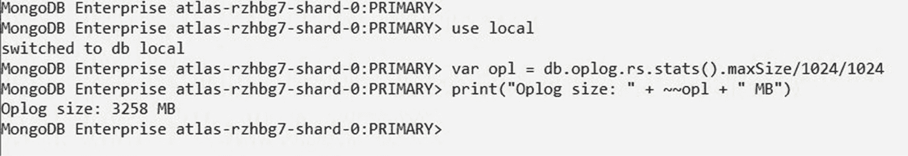

图 10.2：运行 JS 脚本后的输出

如*图 10.2*所示，此 Atlas 集群的 Oplog 大小为`3258 MB`。

注意

有时，Oplog 被误认为是 WiredTiger 日志记录。日志记录也是数据库更改的日志，但范围不同。虽然 Oplog 是为集群数据复制而设计的，但数据库日志记录是为数据库恢复所需的低级日志。例如，如果 MongoDB 意外崩溃，数据文件可能会损坏，因为最后的更改没有保存。在实例重新启动后，需要日志记录来执行数据库恢复。

## 复制架构

以下图表描述了一个简单的副本集群架构图，只有三个服务器节点 - 一个主节点和两个从节点：

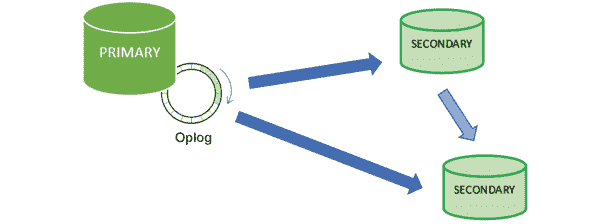

图 10.3：MongoDB 复制

+   在上述模型中，PRIMARY 数据库是唯一从数据库客户端接收写操作的活动副本集成员。PRIMARY 数据库保存 Oplog 中的数据更改。在 Oplog 中保存的更改是顺序的，即按照它们接收和执行的顺序保存。

+   SECONDARY 数据库正在查询 PRIMARY 数据库中 Oplog 的新更改。如果有任何更改，那么 Oplog 条目将立即从 PRIMARY 复制到 SECONDARY 上。

+   然后，SECONDARY 数据库将 Oplog 中的更改应用到自己的数据文件中。Oplog 条目按照它们在日志中插入的顺序应用。因此，SECONDARY 上的数据文件与 PRIMARY 上的更改保持同步。

+   通常，SECONDARY 数据库直接从 PRIMARY 复制数据更改。有时，SECONDARY 数据库可以从另一个 SECONDARY 复制数据。这种复制类型称为*链式复制*，因为它是一个两步复制过程。链式复制在某些复制拓扑中很有用，并且在 MongoDB 中默认启用。

注意

重要的是要理解，一旦 MongoDB 实例成为副本集集群的一部分，所有更改都会被复制到 Oplog 以进行数据复制。不可能仅复制一些部分，例如仅复制几个数据库集合。因此，所有用户数据都会被复制并在所有集群成员之间保持同步。

集群成员可以具有不同的状态，例如上图中的 PRIMARY 和 SECONDARY。节点状态可以随着时间的推移而改变，取决于集群活动。例如，一个节点可以在某个时间点处于 PRIMARY 状态，而在另一个时间点处于 SECONDARY 状态。PRIMARY 和 SECONDARY 是集群配置中节点最常见的状态，尽管可能存在其他状态。为了理解它们可能的角色以及它们如何改变，让我们探索集群选举的技术细节。

## 集群成员

在 Atlas 中，您可以从`Clusters`页面查看集群成员列表，如下截图所示：

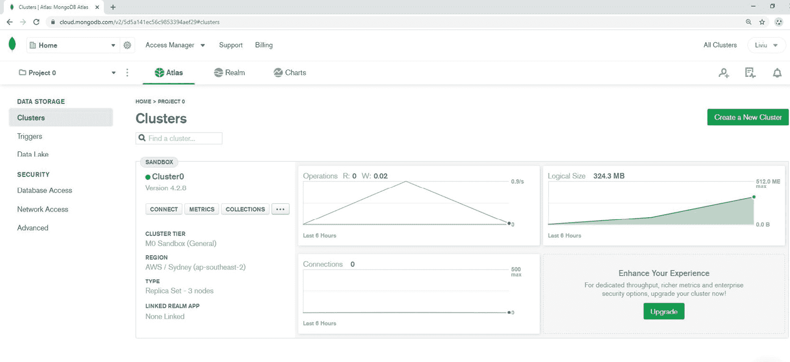

图 10.4：Atlas web 界面

从`SANDBOX`中点击集群名称`Cluster0`。然后在 Atlas 应用程序中将显示服务器及其角色的列表：

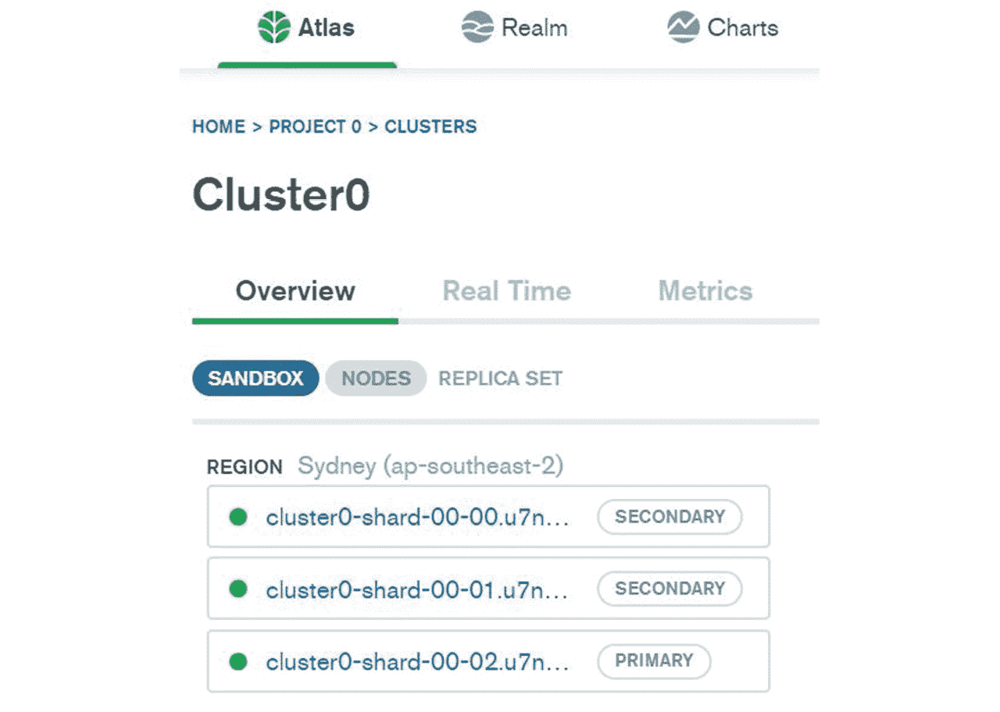

图 10.5：Atlas web 界面

如*图 10.5*所示，此集群有三个集群成员，它们的名称与 Atlas 集群名称具有相同的前缀（在本例中为`Cluster0`）。对于未使用 Atlas PaaS web 界面（或在本地安装）安装的 MongoDB 集群，可以使用以下 mongo shell 命令检查集群成员：

```js
rs.status().members
```

将在*练习 10.01* *检查 Atlas 集群成员*中提供使用集群状态命令的示例。

## 选举过程

所有集群实现的一个特点是在发生故障时能够生存（或故障转移）。MongoDB 副本集受到任何类型的故障的保护，无论是硬件故障、软件故障还是网络中断。负责此过程的 MongoDB 软件称为**集群选举**，这个名字来源于使用选票进行选举的行为。集群选举的目的是“选举”一个新的主节点。

选举过程是由事件发起的。例如，考虑主节点丢失的情况。类似于政治选举，MongoDB 集群成员参与投票选举新的主节点。只有获得集群中所有选票的多数的选举才被验证。这个公式非常简单：幸存的集群有(*N/2 + 1*)的多数，其中*N*是节点的总数。因此，一半加一的选票足以选举出一个新的主节点。这个多数是为了避免分裂脑综合症而必要的。

注意

分裂脑综合症是用来定义同一集群的两个部分被隔离并且它们都“相信”它们是集群中唯一幸存的部分的术语。强制执行“半加一”规则确保只有集群中最大的部分才能选举新的主节点。


图 10.6：MongoDB 选举

考虑前面的图表。在网络分区事件发生后，节点 3 和 5 与集群的其余部分隔离。在这种情况下，左侧（节点 1、2 和 4）形成多数，而节点 3 和 5 形成少数。因此，节点 1、2 和 4 可以选举出一个主节点，因为它们形成了多数集群。然而，也有一些情况，网络分区可能将集群分成两半，节点数量相同。在这种情况下，没有一半具有足够多的节点来选举出一个新的主节点。因此，MongoDB 集群设计的一个关键因素是，集群应始终配置为奇数节点，以避免完美的一半分裂。

并非所有集群成员都可以参与选举。在 MongoDB 集群中，最多可以有七个选票，而成员总数不影响这一规定。这是为了限制选举过程中集群节点之间的网络流量。非投票成员不能参与选举，但它们可以作为辅助节点从主节点复制数据。默认情况下，每个节点可以有一个选票。

## 练习 10.01：检查 Atlas 集群成员

在这个练习中，您将使用 mongo shell 连接到 Atlas 集群，并识别集群名称和所有集群成员，以及它们当前的状态。使用 JavaScript 列出集群成员：

1.  连接到 Atlas 数据库使用 mongo shell：

```js
mongo "mongodb+srv://cluster0.u7n6b.mongodb.net/test" --username admindb
```

1.  副本集状态函数`rs.status()`提供了有关集群的详细信息，这些信息在 Atlas Web 界面上是不可见的。列出所有节点及其`rs.status`成员角色的简单 JS 脚本如下：

```js
var rs_srv = rs.status().members
for (i=0; i<rs_srv.length; i++) {
    print (rs_srv[i].name, '  -  ', rs_srv[i].stateStr)
}
```

注意

如果您连接到一个辅助节点而不是主节点，则可以从集群的任何节点运行该脚本。

其输出如下：

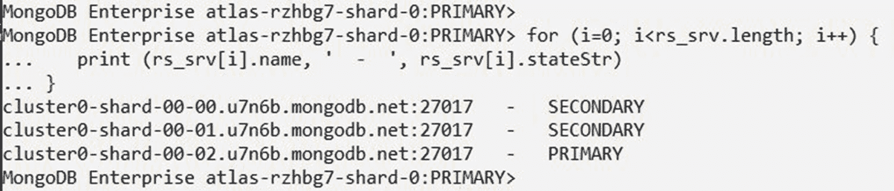

图 10.7：运行 JS 脚本后的输出

我们已经了解了 MongoDB 副本集集群的基本概念。MongoDB 的主从复制技术保护数据库免受任何硬件和软件故障的影响。除了为应用程序和用户提供高可用性和灾难恢复外，MongoDB 集群还易于部署和管理。由于 Atlas 托管数据库服务，用户可以轻松连接到 Atlas 并测试应用程序，而无需在本地安装和配置集群。

# 客户端连接

MongoDB 连接字符串在*第三章*，*服务器和客户端*中有介绍。在 Atlas 部署的数据库服务始终是副本集集群，并且连接字符串可以从 Atlas 界面复制。在本节中，我们将探讨客户端与 MongoDB 集群之间的连接。

## 连接到副本集

一般情况下，MongoDB 连接字符串适用相同的规则。请考虑以下屏幕截图，显示了这样一个连接：

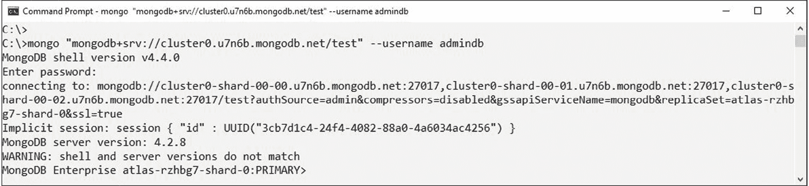

图 10.8：mongo shell 中连接字符串的示例

如*图 10.6*所示，连接字符串如下所示：

```js
"mongodb+srv://cluster0.<id#>.mongodb.net/<db_name>"
```

如*第三章*中所述，*服务器和客户端*，这种类型的字符串需要 DNS 来解析实际的服务器名称或 IP 地址。在本例中，连接字符串包含 Atlas 集群名称`cluster0`和 ID 号`u7n6b`。

注意

在您的情况下，连接字符串可能会有所不同。这是因为您的 Atlas 集群部署可能具有不同的 ID 号和/或不同的集群名称。您实际的连接字符串可以从 Atlas web 控制台中复制。

仔细检查 shell 中的文本后，我们看到以下细节：

```js
connecting to: mongodb://cluster0-shard-00-00.u7n6b.mongodb.net:27017,cluster0-shard-00-01.u7n6b.mongodb.net:27017,cluster0-shard-00-02.u7n6b.mongodb.net:27017/test?authSource=admin&compressors=disabled&gssapiServiceName=mongodb&replicaSet=atlas-rzhbg7-shard-0&ssl=true
```

首先要注意的是，第二个字符串比第一个字符串要长得多。这是因为原始连接字符串（成功进行 DNS SRV 查找后）被替换为具有`mongodb://`URI 前缀的等效字符串。以下表格解释了集群连接字符串的结构：

图 10.9：连接字符串的结构

](img/B15507_10_09.jpg)

图 10.9：连接字符串的结构

成功连接和用户认证后，shell 提示将具有以下格式：

```js
MongoDB Enterprise atlas-rzhbg7-shard-0:PRIMARY>
```

+   `MongoDB Enterprise`在这里指定了在云中运行的 MongoDB 服务器的版本。

+   `atlas-rzhbg7-shard-0`表示 MongoDB 副本集名称。请注意，在当前版本的 Atlas 中，MongoDB 副本集名称与集群名称不同，本例中为`Cluster0`。

+   `PRIMARY`指的是数据库实例的角色。

在 MongoDB 中，集群连接和单个服务器连接之间有明显的区别。连接显示为以下形式的 MongoDB 集群：

```js
replicaset/server1:port1, server2:port2, server3:port3...
```

要验证从 mongo shell 的当前连接，请使用以下函数：

```js
db.getMongo()
```

这导致以下输出：

图 10.10：验证 mongo shell 中的连接字符串

](img/B15507_10_10.jpg)

图 10.10：验证 mongo shell 中的连接字符串

注意

副本集名称连接参数`replicaSet`表示连接字符串是用于集群而不是简单的 MongoDB 服务器实例。在这种情况下，shell 将尝试连接到集群的所有服务器成员。从应用程序的角度来看，副本集的行为就像是一个单一的系统，而不是一组独立的服务器。连接到集群时，shell 将始终指示`PRIMARY`读写实例。

接下来的部分将介绍单服务器连接。

## 单服务器连接

与连接到非集群 MongoDB 数据库的方式相同，我们有选择地连接到单个集群成员。在这种情况下，目标服务器名称（集群成员）需要包含在连接字符串中。此外，需要删除`replicaSet`参数。以下是 Atlas 集群的示例：

```js
mongo "mongodb://cluster0-shard-00-00.u7n6b.mongodb.net:27017/test?authSource=admin&ssl=true" --username admindb
```

注意

另外两个参数`authSource`和`ssl`需要保留用于 Atlas 服务器连接。如*第三章*中所述，*服务器和客户端*，Atlas 已激活授权和 SSL 网络加密以提供云安全保护。

以下截图显示了一个示例：

图 10.11：连接到单个集群成员

](img/B15507_10_11.jpg)

图 10.11：连接到单个集群成员

这次，shell 提示显示`SECONDARY`，表示我们连接到了辅助节点。此外，`db.getMongo()`函数返回一个简单的服务器和端口号连接。

如前所述，不允许在辅助成员上进行数据更改。这是因为 MongoDB 集群需要在所有集群节点上保持一致的数据副本。因此，只允许在集群的主节点上更改数据。例如，如果我们尝试在连接到辅助成员时修改、插入或更新集合，将会收到`not master`错误消息，如下截图所示：

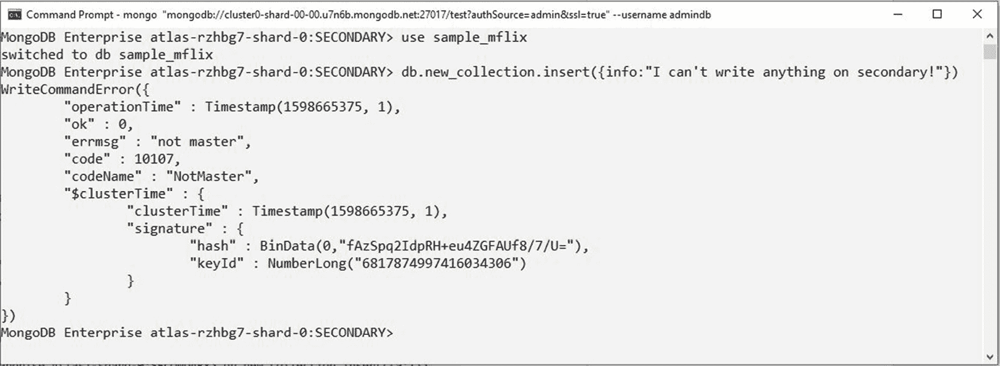

图 10.12：在 mongo shell 中获取“not master”错误消息

但是，辅助成员允许只读操作，这正是下一个练习的范围。在这个练习中，您将学习如何在连接到辅助集群成员时读取集合。

注意

要在连接到辅助节点时启用读操作，需要运行 shell 命令`rs.slaveOk()`。

## 练习 10.02：检查集群复制

在这个练习中，您将使用 mongo shell 连接到 Atlas 集群数据库，并观察主要和辅助集群节点之间的数据复制：

1.  使用 mongo shell 和用户`admindb`连接到您的 Atlas 集群：

```js
mongo "mongodb+srv://cluster0.u7n6b.mongodb.net/test" --username admindb
```

注意

在您的情况下，连接字符串可能会有所不同。您可以从 Atlas Web 界面复制连接字符串。

1.  执行以下脚本在主节点上创建一个新集合，并插入一些具有随机数字的新文档：

```js
use sample_mflix
db.createCollection("new_collection")
for (i=0; i<=100; i++) {
    db.new_collection.insert({_id:i, "value":Math.random()})
}
```

输出如下：

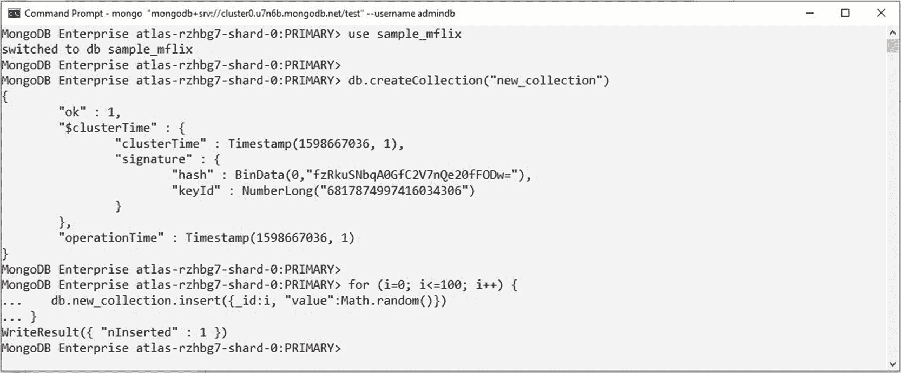

图 10.13：插入具有随机数字的新文档

1.  通过输入以下代码连接到辅助节点：

```js
mongo "mongodb://cluster0-shard-00-00.u7n6b.mongodb.net:27017/test?authSource=admin&ssl=true" --username admindb
```

注意

在您的情况下，连接字符串可能会有所不同。确保您在连接字符串中编辑正确的服务器节点。连接应指示`SECONDARY`成员。

1.  查询集合，查看辅助节点上是否复制了数据。要在辅助节点上读取数据，请运行以下命令：

```js
rs.slaveOk()
```

输出如下：

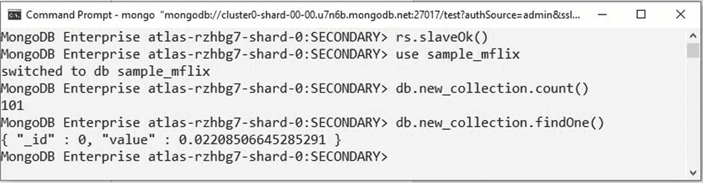

图 10.14：在辅助节点上读取数据

在这个练习中，您通过在主节点上插入文档并在辅助节点上查询它们来验证了集群 MongoDB 复制。您可能会注意到，即使 MongoDB 复制是异步的，复制几乎是瞬时的。

## 读取偏好设置

虽然可以从辅助节点读取数据（如前面的练习所示），但这对应用程序来说并不理想，因为它需要单独的连接。**读取偏好设置**是 MongoDB 中定义客户端如何自动将读操作重定向到辅助节点的术语，而无需连接到各个节点。客户端可能选择将读操作重定向到辅助节点的原因有几个。例如，在主节点上运行大型查询会减慢所有操作的整体性能。通过在辅助节点上运行查询来卸载主节点是优化插入和更新性能的好方法。

默认情况下，所有操作都在主节点上执行。虽然写操作必须仅在主节点上执行，但读操作可以在任何辅助节点上执行（除了仲裁者节点）。客户端可以在连接到 MongoDB 集群时在会话或语句级别设置读取偏好设置。以下命令可帮助检查当前的读取偏好设置：

```js
db.getMongo().getReadPrefMode()
```

以下表格显示了 MongoDB 中各种**读取偏好设置**：

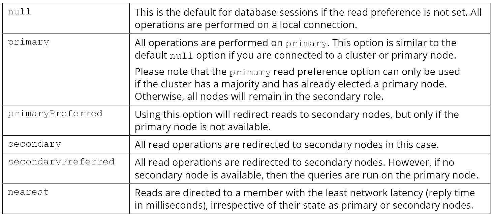

图 10.15：MongoDB 中的读取偏好设置

以下代码显示了设置读取偏好设置的示例（在本例中为`secondary`）：

```js
db.getMongo().setReadPref('secondary')
```

注意

确保您有当前的集群连接，使用 DNS SRV 或集群/服务器列表。读取偏好设置在单节点连接中无法正常工作。

以下是从 mongo shell 使用读取偏好设置的示例：

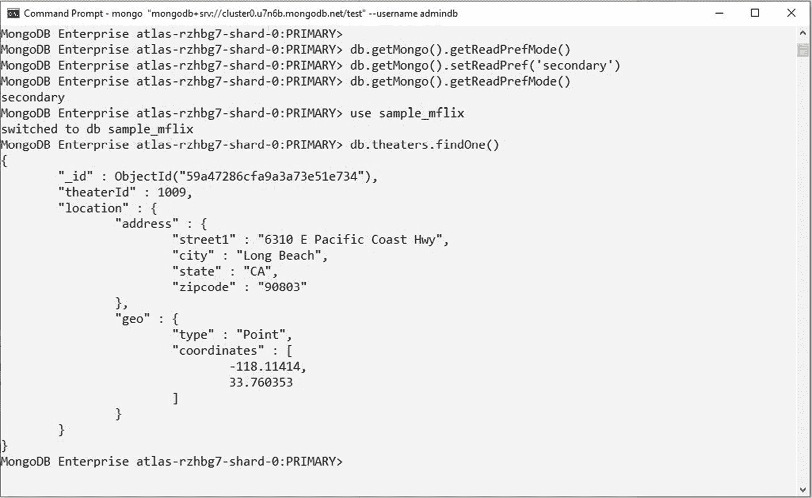

图 10.16：从 mongo shell 读取偏好设置

请注意，一旦读取偏好设置为`secondary`，shell 客户端会自动将读取操作重定向到次要节点。执行查询后，shell 会返回到`primary`（shell 提示：`PRIMARY`）。所有后续查询将被重定向到`secondary`。

注意

读取偏好设置在客户端从副本集断开连接时会丢失。这是因为读取偏好设置是客户端设置（而不是服务器）。在这种情况下，您需要在重新连接到 MongoDB 集群后再次设置读取偏好设置。

读取偏好设置也可以作为连接字符串 URI 的选项进行设置，使用`?readPreference`参数。例如，考虑以下连接字符串：

```js
"mongodb+srv://atlas1-u7n6b.mongodb.net/?readPreference=secondary"
```

注意

MongoDB 在集群中为设置读取偏好提供了更复杂的功能。在更高级的配置中，管理员可以为每个集群成员设置标记名称。例如，标记名称可以指示集群成员位于特定的地理区域或数据中心。然后，标记名称可以作为`db.setReadPref()`函数的参数，将读取重定向到客户端位置附近的特定地理区域。

## 写入关注

默认情况下，Mongo 客户端在主节点上每次写入操作（插入/更新/删除）都会收到确认。确认返回代码可以在应用程序中使用，以确保数据安全写入数据库。然而，在副本集集群中，情况更为复杂。例如，可能在主实例中插入行，但如果在副本节点应用复制 Oplog 记录之前主节点崩溃，那么存在数据丢失的风险。写入关注通过确保在多个集群节点上确认写入来解决这个问题。因此，在主节点意外崩溃的情况下，插入的数据不会丢失。

默认情况下，写入关注为`{w: 1}`，表示仅从主实例获得确认。`{w: 2}`将要求每个写入操作的两个节点进行确认。然而，多个节点的确认会带来成本。写入关注的大数字可能导致集群上的写入操作变慢。`(w: "majority")`表示大多数集群节点。此设置有助于确保在意外故障情况下数据的安全性。

写入关注可以在集群级别或写入语句级别进行设置。在 Atlas 中，我们无法看到或配置写入关注，因为 MongoDB 预设为`{w: "majority"}`。以下是语句级别的写入关注示例：

```js
db.new_collection.insert({"_id":1, "info": "test writes"},
                             {w:2})
```

所有 CRUD 操作（除查询外）都有写入关注的选项。可以选择设置第二个参数`wtimeout: 1000`，以配置最大超时时间（以毫秒为单位）。

以下屏幕截图显示了一个示例：

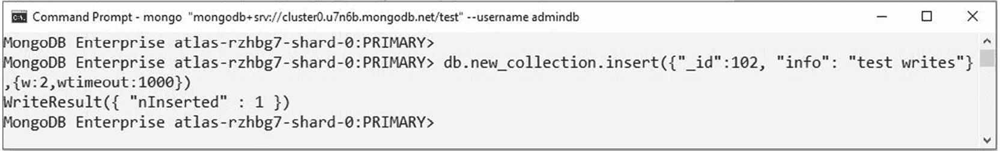

图 10.17：mongo shell 中的写入关注

MongoDB 客户端在复制集群中有许多选项。了解集群环境中客户端会话的基础知识对应用程序开发至关重要。如果开发人员忽视了集群配置，可能会导致错误。例如，一个常见的错误是在主节点上运行所有查询，或者假设默认情况下执行次要读取而无需任何配置。设置读取偏好可以显著提高应用程序的性能，同时减少主集群节点的负载。

# 部署集群

设置新的 MongoDB 副本集集群是一个通常在新开发项目开始时需要的操作任务。根据新环境的复杂程度，部署新的副本集集群可能从相对简单、直接、简单的配置到更复杂和企业级的集群部署。一般来说，部署 MongoDB 集群需要比安装单个服务器数据库更多的技术和操作知识。规划和准备是必不可少的，在部署集群之前绝不能忽视。这是因为用户需要仔细规划集群架构、基础设施和数据库安全性，以提供最佳的数据库性能和可用性。

关于用于 MongoDB 副本集集群部署的方法，有一些工具可以帮助自动化和管理部署。最常见的方法是手动部署。然而，手动方法可能是最费力的选择，尤其是对于复杂的集群。MongoDB 和其他第三方软件提供商提供了自动化工具。接下来的部分将介绍用于 MongoDB 集群部署的最常见方法以及每种方法的优势。

## Atlas 部署

在 Atlas 云上部署 MongoDB 集群是开发人员可以选择的最简单选项，因为它节省了精力和金钱。MongoDB 公司管理基础设施，包括服务器硬件、操作系统、网络和`mongod`实例。因此，用户可以专注于应用程序开发和 DevOps，而不是花时间在基础设施上。在许多情况下，这是快速交付项目的完美解决方案。

在 Atlas 上部署集群只需要在 Atlas Web 应用程序中点击几下即可。您已经熟悉了在 Atlas 中进行数据库部署的方法，这是从*第一章*《MongoDB 简介》中学到的。免费的 Atlas M0 集群是一个非常适合学习和测试的免费环境。事实上，在 Atlas 中的所有部署都是副本集集群。在当前的 Atlas 版本中，不可能在 Atlas 中部署单服务器集群。

Atlas 为更大规模的部署提供了更多的集群选项，这是收费服务。如果需要，Atlas 集群可以轻松扩展——无论是纵向（增加服务器资源）还是横向（增加更多成员）。在专用的 Atlas 服务器 M10 及更高版本上，可以构建多区域的副本集集群。因此，高可用性可以跨地理区域，覆盖欧洲和北美。这个选项非常适合在远程数据中心分配只读次要节点。

以下截图显示了一个多区域集群配置的示例：

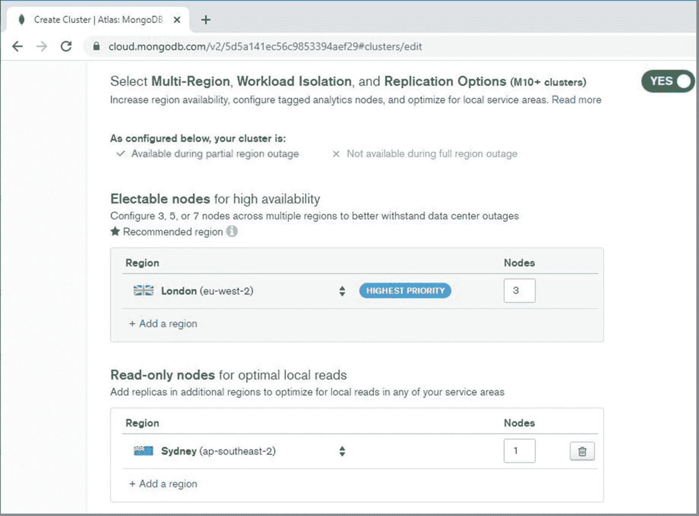

图 10.18：多区域集群配置

在前面的例子中，主数据库在伦敦，还有两个次要节点，而在澳大利亚的悉尼，还配置了一个额外的只读次要节点。

## 手动部署

手动部署是 MongoDB 集群部署最常见的形式。对于许多开发人员来说，手动构建 MongoDB 集群也是首选的数据库安装方法，因为这种方法可以让他们完全控制基础设施和集群配置。然而，与其他方法相比，手动部署更费力，这使得这种方法在大型环境中不太可扩展。

您可以按照以下步骤手动部署 MongoDB 集群：

1.  选择新集群的服务器成员。无论是物理服务器还是虚拟服务器，它们都必须满足 MongoDB 数据库的最低要求。此外，所有集群成员的硬件和软件规格（CPU、内存、磁盘和操作系统）应该是相同的。

1.  每台服务器上都必须安装 MongoDB 二进制文件。在所有服务器上使用相同的安装路径。

1.  在每台服务器上运行一个`mongod`实例。服务器应该在单独的硬件上，具有单独的电源和网络连接。但是，对于测试，可以将所有集群成员部署在单个物理服务器上。

1.  使用`--bind_ip`参数启动 Mongo 服务器。默认情况下，`mongod`仅绑定到本地 IP 地址（`127.0.0.1`）。为了与其他集群成员通信，`mongod`必须绑定到外部私有或公共 IP 地址。

1.  正确设置网络。每台服务器必须能够自由地与其他成员通信，而无需防火墙。此外，服务器的 IP 和 DNS 名称必须在 DNS 域配置中匹配。

1.  为数据库文件和数据库实例日志创建目录结构。在所有服务器上使用相同的路径。例如，在 Unix/macOS 系统上使用`/data/db`用于数据库文件（WiredTiger 存储），使用`/var/log/mongodb`用于日志文件，在 Windows 操作系统的情况下，使用`C:\data\db`目录用于数据文件，使用`C:\log\mongo`用于日志文件。目录必须为空（创建新的数据库集群）。

1.  在每台服务器上使用副本集参数`replSet`启动`mongod`实例。要启动`mongod`实例，请启动操作系统命令提示符或终端，并对 Linux 和 macOS 执行以下命令：

```js
mongod --replSet cluster0 --port 27017 --bind_ip <server_ip_address> --dbpath /data/db --logpath /var/log/mongodb/cluster0.log --oplogSize 100
```

对于 Windows 操作系统，命令如下：

```js
mongod --replSet cluster0 --port 27017 --bind_ip <server_ip_address> --dbpath C:\mongo\data --logpath C:\mongo\log\cluster0.log --oplogSize 100
```

以下表格列出了每个参数及其描述：

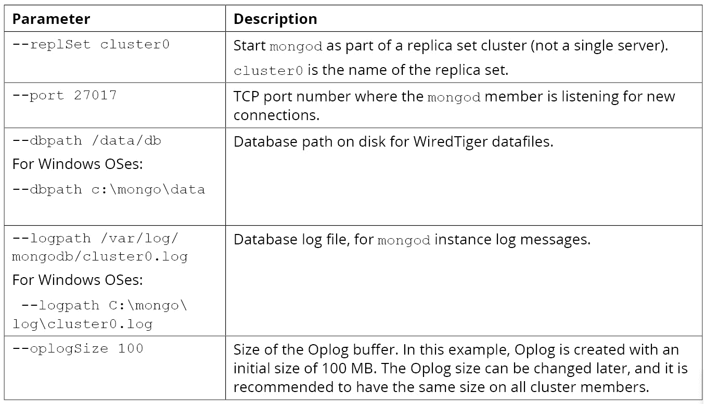

图 10.19：命令中参数的描述

1.  使用 mongo shell 连接到新的集群：

```js
mongo mongodb://hostname1.domain/cluster0
```

1.  创建集群配置 JSON 文档并将其保存在 JS 变量（`cfg`）中：

```js
var cfg = {
    _id : "cluster0",   
    members : [
       { _id : 0, host : "hostname1.domain":27017"},  
       { _id : 1, host : "hostname2.domain":27017"},
       { _id : 2, host : "hostname3.domain":27017"},  
       ]
}
```

注意

上述配置步骤不是真实的命令。`hostname1.domain`应替换为与 DNS 记录匹配的真实主机名和域名。

1.  按以下方式激活集群：

```js
rs.initiate( cfg )
```

集群激活保存配置并启动集群配置。在集群配置期间，成员节点进行选举过程，决定新的主实例。

配置激活后，shell 提示将显示集群名称（例如，`cluster0：PRIMARY>`）。此外，您可以使用`rs.status()`命令检查集群状态，该命令提供有关集群和成员服务器的详细信息。在下一个练习中，您将设置一个 MongoDB 集群。

## 练习 10.03：构建您自己的 MongoDB 集群

在这个练习中，您将设置一个新的 MongoDB 集群，该集群将有三个成员。所有`mongod`实例将在本地计算机上启动，并且您需要为每台服务器设置不同的目录，以便实例不会在相同的数据文件上发生冲突。您还需要为每个实例使用不同的 TCP 端口：

1.  创建文件目录。对于 Windows 操作系统，应该如下所示：

`C:\data\inst1`：用于实例 1 数据文件

`C:\data\inst2`：用于实例 2 数据文件

`C:\data\inst3`：用于实例 3 数据文件

`C:\data\log`：日志文件目的地

对于 Linux，文件目录如下。请注意，对于 MacOS，您可以使用任何您选择的目录名称，而不是`/data`。

`/data/db/inst1`：用于实例 1 数据文件

`/data/db/inst2`：用于实例 2 数据文件

`/data/db/inst3`：用于实例 3 数据文件

`/var/log/mongodb`：日志文件目的地

以下屏幕截图显示了 Windows 资源管理器中的示例：

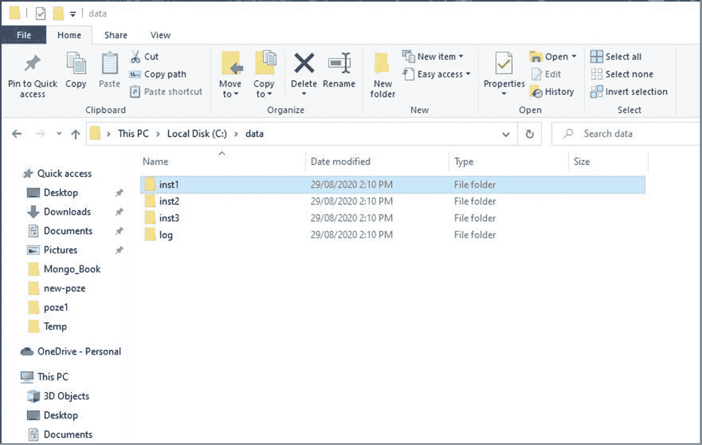

图 10.20：目录结构

对于各个实例，使用以下 TCP 端口：

实例 1：27001

实例 2：27002

实例 3：27003

使用副本集名称`my_cluster`。Oplog 大小应为 50 MB。

1.  从 Windows 命令提示符启动`mongod`实例。使用`start`来运行`mongod`启动命令。这将为该进程创建一个新窗口。否则，`start mongod`命令可能会挂起，您将需要使用另一个命令提示符窗口。请注意，对于 MacOS，您需要使用`sudo`而不是`start`。

```js
start mongod --replSet my_cluster --port 27001 --dbpath C:\data\inst1 -- logpath C:\data\log\inst1.log --logappend --oplogSize 50

start mongod --replSet my_cluster --port 27002 --dbpath C:\data\inst2 -- logpath C:\data\log\inst2.log --logappend --oplogSize 50

start mongod --replSet my_cluster --port 27003 --dbpath C:\data\inst3 -- logpath C:\data\log\inst3.log --logappend --oplogSize 50
```

注意

`--logappend`参数会在日志文件末尾添加日志消息。否则，每次启动`mongod`实例时，日志文件都会被截断。

1.  检查日志目标文件夹（`C:\data\log`）中的启动消息。每个实例都有一个单独的日志文件，在日志的末尾应该有一条消息，如下面的代码片段所示：

```js
16.613+1000 I  NETWORK  [initandlisten] waiting for connections on port 27001
```

1.  在一个单独的终端（或 Windows 命令提示符）中，使用以下命令连接到集群，使用 mongo shell：

```js
mongo mongodb://localhost:27001/replicaSet=my_cluster
```

以下截图显示了使用 mongo shell 的示例：

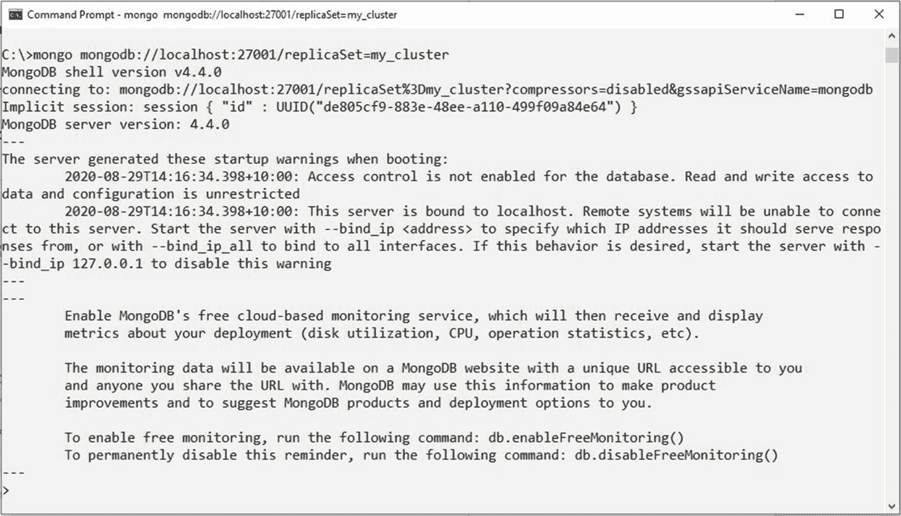

图 10.21：mongo shell 中的输出

请注意，尽管您在连接字符串中使用了`replicaSet`参数，但 shell 命令提示符只是`>`。这是因为集群尚未配置。 

1.  编辑集群配置 JSON 文档（在 JS 变量`cfg`中）：

```js
var cfg = {
    _id : "my_cluster",     //replica set name
    members : [
      { _id : 0, host : "localhost:27001"},  
      { _id : 1, host : "localhost:27002"},
      { _id : 2, host : "localhost:27003"},  
      ]
}
```

注意

这段代码可以直接输入到 mongo shell 中。

1.  激活集群配置如下：

```js
rs.initiate( cfg )
```

请注意，集群通常需要一些时间来激活配置并选举新的主节点：

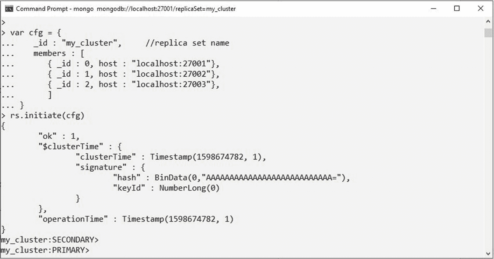

图 10.22：mongo shell 中的输出

在选举过程完成并成功后，shell 提示应指示集群连接（最初为`mycluster: SECONDARY`，然后为`PRIMARY`）。如果您的提示仍然显示`SECONDARY`，请尝试重新连接或检查服务器日志以查找错误。

1.  验证集群配置。为此，使用 mongo shell 连接并验证提示符是否为`PRIMARY>`，然后运行以下命令来检查集群状态：

```js
rs.status()
```

运行以下命令来验证当前的集群配置：

```js
rs.conf()
```

两个命令都返回了很多细节的长输出。预期结果如下截图所示（显示了部分输出）：

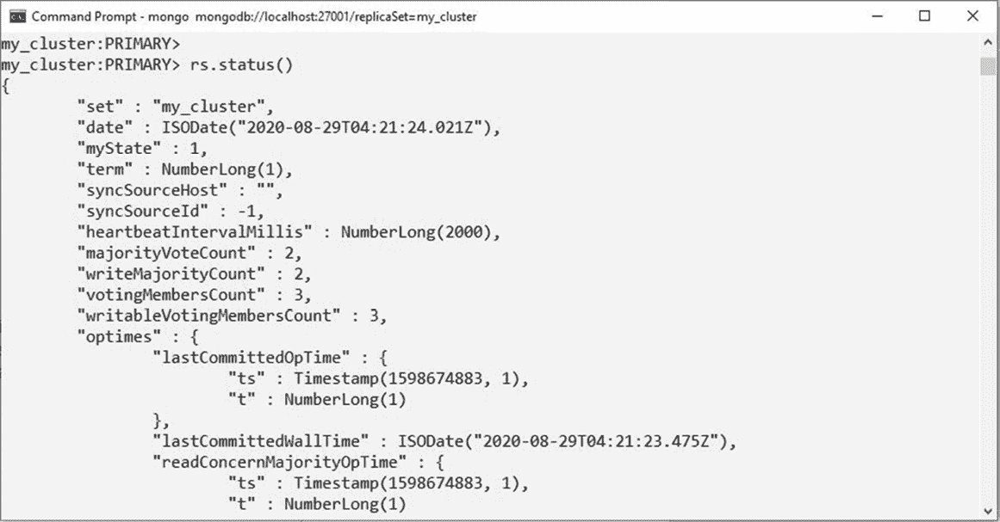

图 10.23：mongo shell 中的输出

在这个练习中，您手动部署了副本集群的所有成员到您的本地系统。这个练习仅用于测试目的，不应用于真实应用程序。在现实生活中，MongoDB 集群节点应该部署在单独的服务器上，但这个练习为副本集的初始配置提供了一个很好的内部视图，对于快速测试特别有用。

## 企业部署

对于大规模企业应用程序，MongoDB 提供了用于管理部署的集成工具。可以想象，为何部署和管理数百个 MongoDB 集群服务器可能是一个非常具有挑战性的任务。因此，在大型企业规模的 MongoDB 环境中，能够在集成界面中管理所有部署是至关重要的。

MongoDB 提供了两种不同的接口：

+   **MongoDB OPS Manager**是 MongoDB Enterprise Advanced 可用的一个包。通常需要在本地安装。

+   **MongoDB Cloud Manager**是一个云托管服务，用于管理 MongoDB 企业部署。

注意

Cloud Manager 和 Atlas 都是云应用程序，但它们提供不同的服务。虽然 Atlas 是一个完全托管的数据库服务，Cloud Manager 是一个用于管理数据库部署的服务，包括本地服务器基础设施。

这两个应用程序为企业用户提供了类似的功能，包括部署的集成自动化、高级图形监控和备份管理。使用 Cloud Manager，管理员可以部署所有类型的 MongoDB 服务器（单个和集群），同时保持对基础架构的完全控制。

以下图表显示了 Cloud Manager 的架构：

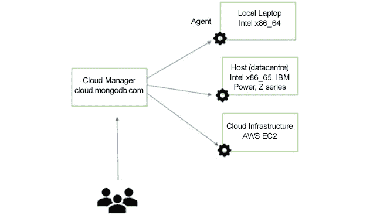

图 10.24：云管理器架构

该架构基于中央管理服务器和 MongoDB 代理。在 Cloud Manager 中管理服务器之前，需要在服务器上部署 MongoDB 代理。

注意

MongoDB 代理软件不应与 MongoDB 数据库软件混淆。MongoDB 代理软件用于 Cloud Manager 和 OPS Manager 的集中管理。

关于 Cloud Manager，实际上并不需要用户下载和安装 MongoDB 数据库。一旦代理安装并将服务器添加到 Cloud Manager 配置中，所有 MongoDB 版本都将由部署服务器自动管理。MongoDB 代理将自动下载、分阶段和安装服务器上的 MongoDB 服务器二进制文件。

以下截图显示了 MongoDB Cloud Manager 的一个示例：

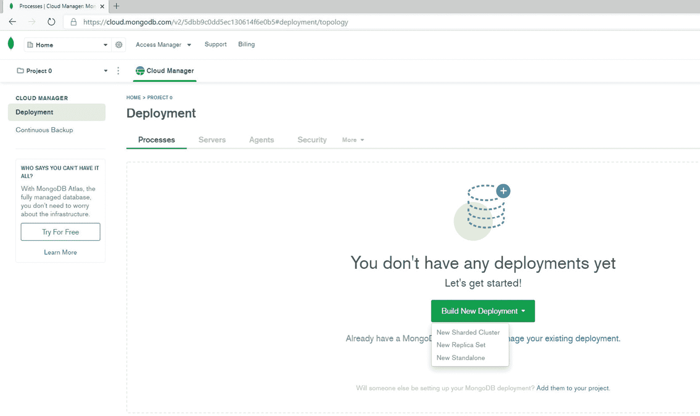

图 10.25：云管理器截图

Cloud Manager 的 Web 界面类似于 Atlas 应用程序。它们之间的一个主要区别是 Cloud Manager 具有更多功能。虽然 Cloud Manager 可以管理 Atlas 部署，但对于 MongoDB 企业部署，它提供了更复杂的选项。

第一步是添加部署（`New Replica Set`按钮），然后向部署添加服务器并安装 MongoDB 代理。一旦 MongoDB 代理安装在集群成员上，部署将由代理自动执行。

注意

您可以在 MongoDB Cloud 上免费测试 Cloud Manager 30 天。注册过程类似于*第一章*中展示的步骤，*MongoDB 简介*。

MongoDB Atlas 托管的 DBaaS 云服务是一个快速且易于部署的平台。大多数用户会发现 Atlas 是他们首选的数据库部署选择，因为云环境是完全托管的、安全的，并且始终可用。然而，与 MongoDB 本地部署相比，Atlas 云服务对用户有一些限制。例如，Atlas 不允许用户访问或调整硬件和软件基础设施。如果用户希望对基础设施拥有完全控制权，他们可以选择手动部署 MongoDB 数据库。对于大型企业数据库部署，MongoDB 提供了 Cloud Manager 等软件解决方案，用于管理许多集群部署，同时仍然完全控制基础设施。

# 集群操作

假设您的运行 MongoDB 数据库的服务器之一报告了内存错误。您有点担心，因为该计算机正在运行您集群的主活动成员。服务器需要维护以更换故障的 DIMM（双列直插式内存模块）。您决定将主实例切换到另一台服务器。维护应该不到一个小时，但您希望确保用户在维护期间可以使用他们的应用程序。

MongoDB 集群操作是指为了集群维护和监控而必要的日常管理任务。这对于手动部署的集群尤为重要，用户必须完全管理和操作副本集集群。在 Atlas DBaaS 托管服务的情况下，唯一的交互是通过 Atlas Web 应用程序进行的，大部分工作都是由 MongoDB 在后台完成的。因此，我们的讨论将局限于手动部署的 MongoDB 集群，无论是在本地基础设施还是在云 IaaS（基础设施即服务）中。

## 添加和移除成员

可以使用命令`rs.add()`将新成员添加到副本集。在添加新成员之前，需要准备并使用相同的`—replSet`集群名称选项启动`mongod`实例。新集群成员也适用相同的规则。例如，启动新的`mongod`实例如下所示：

```js
mongod --dbpath C:\data\inst4 --replSet <cluster_name>  --bind_ip <hostname> --  logpath <disk path>
```

在向现有副本集添加新成员之前，我们需要决定成员的类型。有以下选项可供选择：

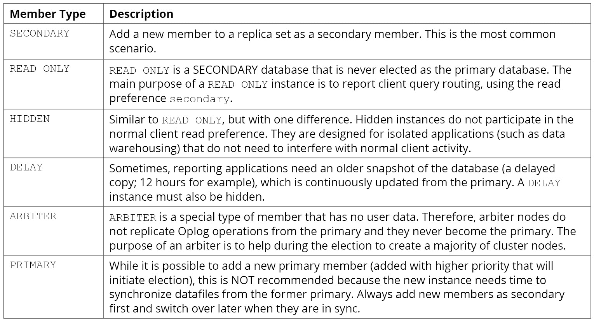

图 10.26：成员类型的描述

### 添加成员

在添加新的集群成员时，可以传递一些参数，这取决于成员类型。在最简单的形式中，`add`命令只有一个参数——包含新实例的主机名和端口的字符串：

```js
rs.add ( "node4.domain.com:27004" )
```

在添加成员时请记住以下事项：

+   应向集群添加`SECONDARY`成员。

+   优先级可以是`0`到`1000`之间的任何数字。如果此实例被选为主节点，则优先级必须大于`0`。否则，该实例被视为`只读`。此外，`HIDDEN`、`DELAY`和`ARBITER`实例类型的优先级必须为`0`。默认值为`1`。

+   所有节点默认都有一票。在 4.4 版本中，节点可以有 0 票或 1 票。最多可以有 7 个投票成员，每个成员一票。其余节点不参与选举过程，票数为 0。默认值为 1。

以下屏幕截图显示了添加成员的示例：

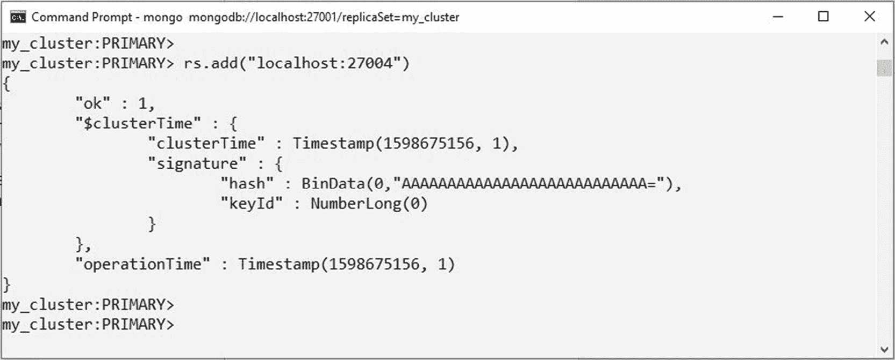

图 10.27：添加成员示例

在前面的屏幕截图中，“ok”：1 表示添加成员操作成功。在新实例日志中，新的副本集成员的初始同步（数据库复制）已经开始：

```js
INITSYNC [replication-0] Starting initial sync (attempt 1 of 10)
```

`0`添加了不同的成员类型，但`add`命令可能不同。例如，要添加一个带有投票的隐藏成员，请添加以下内容：

```js
rs.add ( {host: "node4.domain.com:27017", hidden : true,   votes : 1})
```

如果成功，`add`命令将执行以下操作：

+   通过添加新成员节点更改集群配置

+   执行初始同步——数据库被复制到新的成员实例（除了`ARBITER`的情况）

在某些情况下，添加新成员可能会改变当前的主节点。

注意

新成员集群在加入副本集集群之前必须具有空数据库（空数据目录）。在同步过程中在主节点上生成的 Oplog 操作也会被复制并应用到新的集群成员上。同步过程可能需要很长时间，特别是如果同步是通过互联网进行的。

### 移除成员

可以通过连接到集群并运行以下命令来移除集群成员：

```js
rs.remove({ <hostname.com> })
```

注意

移除集群成员不会移除实例和数据文件。实例可以在单服务器模式下启动（不带`—replSet`选项），数据文件将包含被移除之前的最新更新。

### 重新配置集群

如果要对副本集进行更复杂的更改，例如一次添加多个节点或编辑投票和优先级的默认值，则可能需要重新配置集群。可以通过运行以下命令来重新配置集群：

```js
rs.reconfig()
```

以下是对具有不同优先级的每个节点进行集群重新配置的逐步分解：

+   将配置保存在 JS 变量中，如下所示：

```js
var new_cfg = rs.config()
```

+   编辑`new_conf`以通过添加以下片段更改默认优先级：

```js
new_conf.members[0].priority=1
new_conf.members[1].priority=0.5
new_conf.members[2].priority=0
```

+   启用新配置如下：

```js
rs.reconfig(new_cfg)
```

以下屏幕截图显示了集群重新配置的示例：

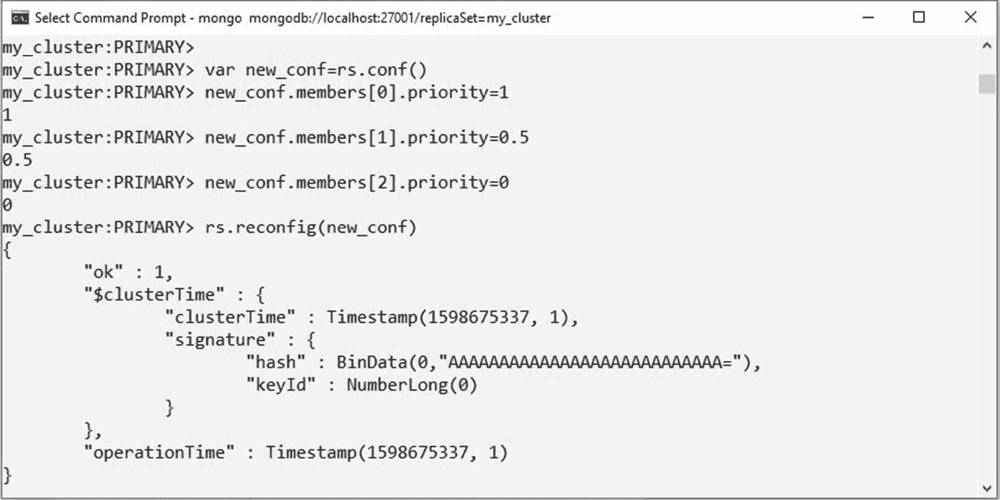

图 10.28：集群重新配置示例

## 故障转移

在某些情况下，MongoDB 集群可能会启动选举过程。在数据中心运营术语中，这些类型的事件通常称为**故障转移**和**切换**：

+   **故障转移**总是由事件引起的。当一个或多个集群成员变得不可用（通常是因为故障或网络中断）时，集群将进行故障转移。副本集检测到一些节点变得不可用，并自动启动副本集选举。

注意

复制集群如何检测故障？成员服务器定期进行通信，每隔几秒发送/接收心跳网络请求。如果一个成员在较长时间内没有回复（默认为 10 秒），则该成员被宣布不可用，并启动新的集群选举。

+   **切换**是用户发起的过程（即由服务器命令发起）。切换的目的是对集群进行计划维护。例如，运行主成员的服务器需要重新启动进行操作系统修补，管理员将主切换到另一个集群成员。

无论是故障转移还是切换，选举机制都会启动，集群旨在实现新的多数，并在成功时成为新的主节点。在选举过程中，存在一个过渡期，在此期间数据库上无法进行写操作，客户端会重新连接到新的主成员。应用程序编码应能够透明地处理 MongoDB 故障转移事件。

在 Atlas 中，MongoDB 会自动管理故障转移，因此不需要用户参与。在较大的 Atlas 部署中（例如 M10+），Atlas 应用程序中提供了“测试故障转移”按钮。该按钮将强制应用程序测试进行集群故障转移。如果无法实现新的集群多数，那么所有节点将保持次要状态，不会选举出主节点。在这种情况下，客户端将无法修改数据库中的任何数据。但是，无论集群状态如何，所有次要节点上仍然可以进行只读操作。

### 故障转移（故障）

在发生故障时，通常可以在实例日志中看到以下代码片段中的消息：

```js
2019-11-25T15:08:05.893+1000  REPL     [replexec-0] Member localhost:27003 is now in state RS_DOWN - Error connecting to localhost:27003 (127.0.0.1:27003) :: caused by :: No connection could be made because the target machine actively refused it.
```

客户端会自动重新连接到剩余节点，并且活动可以像往常一样继续。一旦缺失的节点重新启动，它将自动重新加入集群。如果集群无法成功完成选举，则故障转移不被视为成功。在日志中，我们可以看到这样的消息：

```js
2019-11-25T15:08:05.893+1000 I  ELECTION [replexec-4] not becoming primary, we received insufficient votes
...Election failed.
```

在这种情况下，客户端连接会中断，并且用户无法重新连接，除非读取偏好设置为`secondary`：

```js
2019-11-25T15:09:45.928+1000 W  NETWORK  [ReplicaSetMonitor-TaskExecutor] Unable to reach primary for set my_cluster
2019-11-25T15:09:45.929+1000 E  QUERY    [js] Error: Could not find host matching read preference { mode: "primary", tags: [ {} ] } for set my_cluster :
```

即使选举不成功，用户也可以使用读取偏好`secondary`设置进行连接，如以下连接字符串所示：

```js
mongo mongodb://localhost:27001/?readPreference=secondary&replicaSet=my_cluster
```

注意

除非有足够的节点形成集群多数，否则不可能以读写模式（主状态）打开数据库实例。一个典型的错误是同时重新启动多个次要成员。如果集群检测到多数丢失，那么主状态成员将降级为次要成员。

### 回滚

在某些情况下，故障转移事件可能会导致在以前的主节点上回滚写操作。如果在主节点上使用默认的写关注（`w:1`）执行写操作，并且以前的主节点在有机会将更改复制到任何次要节点之前崩溃，则可能会发生这种情况。集群形成新的多数，活动将继续进行，并且会有一个新的主节点。以前的主节点恢复后，需要回滚这些（以前未复制的）事务，然后才能与新的主节点同步。

通过将写关注设置为`majority`（`w: 'majority'`）可以减少回滚的可能性，即通过从大多数集群节点（多数）获得每个数据库写操作的确认。不利的一面是，这可能会减慢应用程序的写入速度。

通常，故障和停机会很快得到解决，并且受影响的节点在恢复时重新加入集群。但是，如果停机时间很长（例如一周），那么辅助实例可能会变得过时。过时的实例在重新启动后将无法与主成员重新同步数据。在这种情况下，该实例应被添加为新成员（空数据目录）或从最近的数据库备份中添加。

### 切换（Stepdown）

对于维护活动，我们经常需要将主状态从一个实例转移到另一个实例。为此，在主节点上要执行的用户 admin 命令如下：

```js
rs.stepDown()
```

`stepDown`命令将强制主节点下台，并导致优先级最高的辅助节点上台成为新的主节点。只有在辅助节点是最新的情况下，主节点才会下台。因此，与故障切换相比，切换是一种更安全的操作。在以前的主成员上没有丢失写入的风险。

以下屏幕截图显示了一个示例：

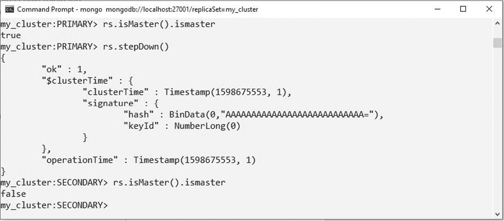

图 10.29：使用 stepDown 命令

您可以通过运行以下命令来验证当前的主节点：

```js
rs.isMaster()
```

请注意，为了使切换成功，目标集群成员必须配置为具有更高的优先级。具有默认优先级（`priority = 0`）的成员永远不会成为主要成员。

## 练习 10.04：执行数据库维护

在这个练习中，您将在主节点上执行集群维护。首先，您将切换到辅助服务器`inst2`，以便当前的主服务器将变为辅助服务器。然后，您将关闭以前的主服务器进行维护，并重新启动以前的主服务器并进行切换：

注意

在开始这个练习之前，按照*练习 10.02*中给出的步骤准备好集群脚本和目录。

1.  启动所有集群成员（如果尚未启动），连接到 mongo shell，并使用`rs.isMaster().primary`验证配置和当前主节点。

1.  重新配置集群。为此，将现有的集群配置复制到一个变量`sw_over`中，并设置只读成员的优先级。对于`inst3`，优先级应设置为`0`（只读）。

```js
var sw_over = rs.conf()
sw_over.member[2].priority = 0
rs.reconfig(sw_over)
```

1.  切换到`inst2`。在主节点上，运行以下`stepDown`命令：

```js
rs.stepDown()
```

1.  使用以下命令验证新的主节点是否为`inst2`：

```js
rs.isMaster().primary
```

现在，`inst1`可以停止进行硬件维护。

1.  使用以下命令在本地关闭实例：

```js
db.shutdownServer()
```

这个输出应该是这样的：

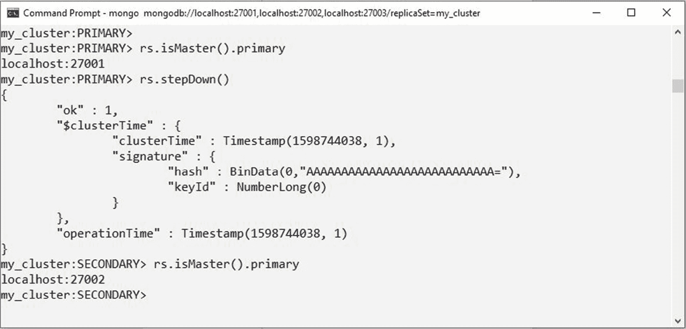

图 10.30：在 mongo shell 中的输出

在这个练习中，您练习了集群中的切换步骤。命令非常简单。切换是一个很好的实践，可以测试应用程序如何处理 MongoDB 集群事件。

## 活动 10.01：测试 MongoDB 数据库的灾难恢复程序

您的公司即将上市，因此需要一些证书来证明在灾难发生时已经制定了业务连续性计划。其中一个要求是为 MongoDB 数据库实施并测试灾难恢复程序。集群架构分布在主办公室（主实例）和远程办公室（辅助实例）之间，后者是灾难恢复位置。为了帮助在网络分裂的情况下进行 MongoDB 副本集选举，还在第三个独立位置安装了一个仲裁者节点。每年一次，灾难恢复计划都会通过模拟主办公室中所有集群成员的崩溃来进行测试，而今年，这项任务就落在了您身上。以下步骤将帮助您完成此活动：

注意

如果您有多台计算机，最好尝试使用两台或三台计算机进行此操作，每台计算机模拟一个物理位置。但是，在解决方案中，此操作将通过在同一台本地计算机上启动所有实例来完成。所有辅助数据库（包括 DR）在启动活动时应与主数据库同步。

1.  使用三个成员配置`sale-cluster`集群：

`sale-prod`：主要

`sale-dr`：次要

`sale-ab`：仲裁者（第三位置）

1.  将测试数据记录插入主要集合。

1.  模拟灾难。重新启动主节点（即，终止当前的`mongod`主实例）。

1.  通过插入一些文档在 DR 上执行测试。

1.  关闭 DR 实例。

1.  重新启动主办公室的所有节点。

1.  10 分钟后，启动 DR 实例。

1.  观察插入的测试记录的回滚并重新与主数据库同步。

重新启动`sales_dr`后，您应该在日志中看到回滚消息。以下代码片段显示了一个示例：

```js
ROLLBACK [rsBackgroundSync] transition to SECONDARY
2019-11-26T15:48:29.538+1000 I  REPL     [rsBackgroundSync] transition to SECONDARY from ROLLBACK
2019-11-26T15:48:29.538+1000 I  REPL     [rsBackgroundSync] Rollback successful.
```

注意

可以通过此链接找到此活动的解决方案。

# 摘要

在本章中，您了解到 MongoDB 副本集对于在 MongoDB 数据库环境中提供高可用性和负载共享至关重要。虽然 Atlas 透明地为基础设施和软件（包括副本集群管理）提供支持，但并非所有 MongoDB 集群都部署在 Atlas 中。在本章中，我们讨论了副本集群的概念和操作。了解有关集群的简单概念，例如读取首选项，可以帮助开发人员在云中构建更可靠、高性能的应用程序。在下一章中，您将了解 MongoDB 中的备份和还原操作。
