# 第十二章：12. 数据可视化

概述

本章将向您介绍 MongoDB Charts，它提供了使用来自 MongoDB 数据库的数据创建可视化的最佳方式。您将首先学习 MongoDB Charts 数据可视化引擎的基础知识，然后创建新的仪表板和图表，以了解各种类型图表之间的区别。您还将集成和定制图表与其他外部应用程序。通过本章结束时，您将熟悉 Charts PaaS 云界面的基本概念，并能够执行构建有用图表所需的步骤。

# 介绍

数据的可视化呈现对于报告和商业演示非常有用。在科学、统计学和数学中使用图表进行数据可视化的优势不言而喻。图表可以有效地传达业务决策所需的基本信息，就像电影可以通过运动图像来讲述故事一样。

MongoDB 已经开发了一个名为 MongoDB Charts 的新的集成工具，用于数据可视化。这是一个相对较新的功能，首次发布于 2018 年第二季度。MongoDB Charts 允许用户从 MongoDB 数据库中快速表示数据，而无需使用诸如 Java 或 Python 之类的编程语言编写代码。目前，MongoDB Charts 有两种不同的实现方式：

+   **MongoDB Charts PaaS**（**平台即服务**）：这是指 Charts 的云服务。这个版本的 Charts 与 Atlas 云项目和数据库完全集成。它不需要在客户端进行任何安装，并且在 Atlas 云账户中免费使用。

+   **MongoDB Charts 服务器**：这是指本地安装的 MongoDB Charts 工具。Charts 服务器需要从 MongoDB 下载并安装在一个专用服务器安装中，使用 Docker。本地 Charts 包含在 MongoDB Enterprise Advanced 中，并且本课程不涵盖它。

用户在两个版本的 MongoDB Charts 中可用的功能是相似的。用户只需使用一个简单的浏览器客户端，就可以创建仪表板和各种图表。MongoDB 不断扩展 Charts 工具，每次新发布都会添加新功能和修复应用程序中的错误。

在本章中，我们将考虑这样一个场景：XYZ 组织的员工 John 被指派创建一个仪表板，其中包含来自一个电影集合的数据库的信息。John 是一个经验有限的 MongoDB 初学者。他想知道是否有一种简单的方法可以在不使用编程语言编写代码的情况下构建图形。这就是 MongoDB Charts 发挥作用的地方。首先，我们将学习 MongoDB Charts 中的**菜单和选项卡**。

## 探索菜单和选项卡

要启动 MongoDB Charts GUI 应用程序，用户需要首先登录 Atlas 云 Web 应用程序。MongoDB Charts（PaaS 版本）绑定到一个 Atlas 项目（“每个项目”选项），因此如果有多个 Atlas 项目，用户需要选择当前活动的 Atlas 项目。如前几章所述，Atlas 项目的名称是在创建项目时选择的。对于本章，Atlas 中的项目名称是 Atlas 中的默认项目名称：`Project 0`。如下图所示，在 Atlas Web 应用程序中可以看到`Charts`选项卡：

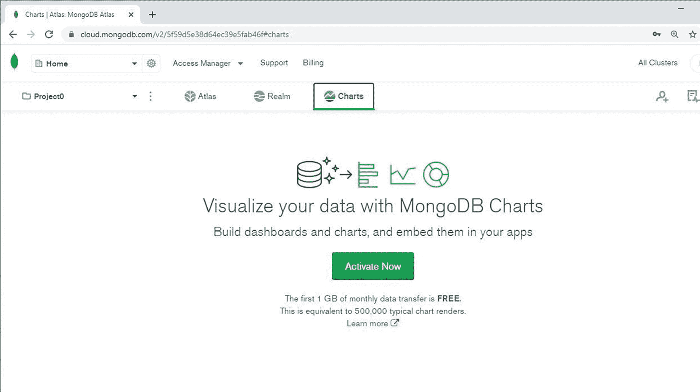

图 12.1：图表选项卡

在第一次使用之前，需要激活 MongoDB Charts 选项。为此，您需要点击“立即激活”按钮来激活 Charts 应用程序，如*图 12.1*所示。激活过程只需要一分钟。在激活过程中，Atlas 应用程序将设置 Charts 并生成创建和运行 Charts 所需的数据库元数据。

如*图 12.1*所示，在 MongoDB Charts 中，每月最大数据传输限制为 1GB，可用于沙盒测试和学习 Charts。一旦达到限制，直到月底 MongoDB Charts 将无法使用。但是，可以通过将免费版服务升级为付费的 Atlas 服务来增加限制。您可以在[`www.mongodb.com/pricing`](https://www.mongodb.com/pricing)找到更多详细信息。

请注意，一旦激活，MongoDB Charts 选项将在 Atlas 项目的整个生命周期内保持激活状态。您将被询问是否希望使用示例数据填充或连接现有的 ATLAS 云中的集群。如果您希望删除 Charts 选项，可以通过转到 Atlas 项目设置来执行。如果您想要为现有项目重新激活全新版本的 Charts，这可能会很有用。然而，删除 Charts 应该谨慎进行，因为它将自动删除云中保存的所有图表和仪表板。一旦激活 Atlas Charts，应用程序将启动，并且可以用于创建图表，如下图所示：

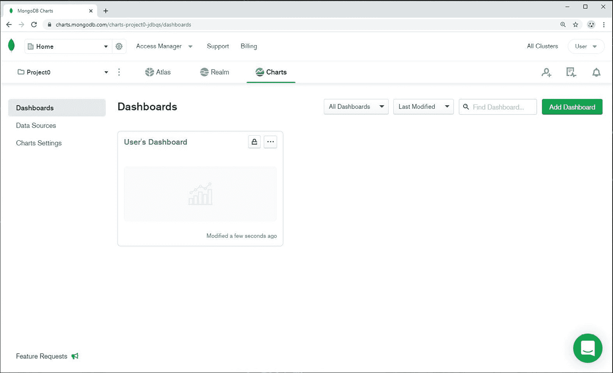

图 12.2：Charts 应用程序

选项按钮显示在应用程序的左侧：

+   `仪表板`：顾名思义，此选项帮助管理仪表板。仪表板是将不同图表组合成单个页面以用于业务报告目的的集合。

+   `数据源`：使用此选项，您可以管理数据源，这只是对 MongoDB 数据库集合的引用，从中处理数据以显示图表。

+   `图表设置`：此选项允许用户管理图表认证提供程序，并监视 Charts 应用程序的网络带宽使用情况。

注意

返回主 Atlas web 应用程序，您可以在 Charts 应用程序的顶部工具栏中点击`Atlas`标签链接。

## 仪表板

在商业演示中，通常显示与主题相关的信息。主题是一个类别，比如人力资源或房地产。主题显示包含了各自业务领域的所有相关数据指标，但是一个主题领域的数据通常与数据库结构不相关。这就是数据存储在 MongoDB 数据库中的方式。因此，仪表板是一个图表分组功能，当我们需要以集中和有意义的方式为企业呈现数据时使用。

在当前版本的 Charts 中，云应用程序会自动为我们创建一个空白仪表板。默认仪表板的名称为`用户的仪表板`，如*图 12.2*所示，其中`用户`是 Atlas 登录用户名。

您可以删除默认仪表板并为您的业务演示创建其他仪表板。要创建新的仪表板，您可以点击*图 12.2*中显示的`添加仪表板`按钮。将打开一个对话框，在其中您需要添加有关新仪表板的详细信息：

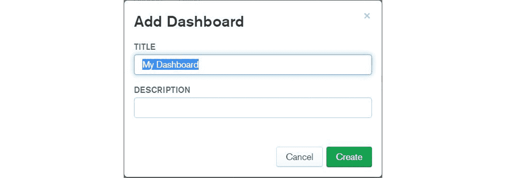

图 12.3：添加仪表板对话框

要访问仪表板属性，请点击仪表板框中的`…`按钮，如下图所示：

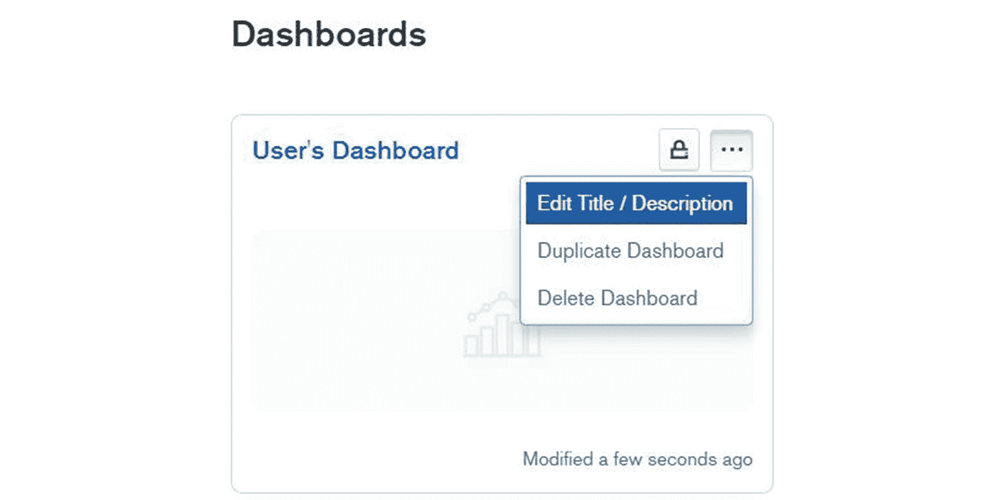

图 12.4：仪表板属性下拉菜单

在仪表板上下文中有一些按钮和选项可用：

+   `编辑标题/描述`：此选项用于更改仪表板的当前标题或描述。

+   `复制仪表板`：此选项将仪表板复制到一个新的仪表板中，名称不同。

+   `删除仪表板`：此选项将从 MongoDB Charts 中删除仪表板。

+   `锁定`：此选项为 Atlas 项目用户分配仪表板权限。对于免费版 Atlas Charts 来说，此选项并不实用，因为 MongoDB 不允许您使用免费版来管理项目用户和团队。

要查看仪表板，请点击仪表板名称链接（例如，“用户的仪表板”）。仪表板将打开并显示其中包含的所有图表。如果没有创建图表，则会显示一个空的仪表板，如下图所示：

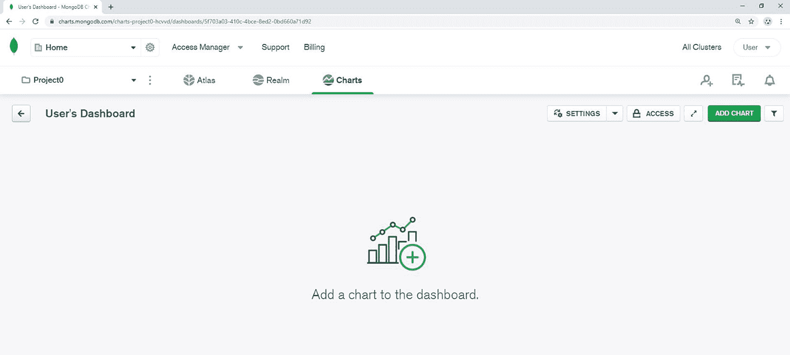

图 12.5：用户的仪表板

在本章的后面，我们将介绍如何向我们的仪表板添加图表的步骤。但在我们添加新图表之前，我们必须确保数据库文档可用于我们的图表。这是下一节的主题。

## 数据源

数据源代表 MongoDB 数据库结构和 MongoDB Charts 演示引擎之间的接口。数据源是指向特定数据库集合（或集合）的指针，从中处理数据以创建图表。由于 MongoDB Charts 与 Atlas Web 应用程序集成，所有数据源都配置为连接到 Atlas 数据库部署。因此，数据源包含 Atlas 集群部署的描述、将用于 Charts 的数据库和集合。

数据源还可以在 MongoDB 数据库和 MongoDB Charts 应用程序用户之间提供一定程度的隔离。可以保证数据源不会修改 MongoDB 数据库，因为它们以只读模式访问数据库。没有数据源，Charts 无法访问 MongoDB 数据库中的 JSON 文档。

注意

MongoDB Charts（PaaS 版本）允许数据源仅引用来自 Atlas 云集群部署的数据。因此，不可能从本地 MongoDB 数据库安装创建数据源。在生成新数据源之前，必须将数据库集合和文档上传到 Atlas 数据库集群中。

访问数据源，请点击左侧的“数据源”选项卡，如下图所示：

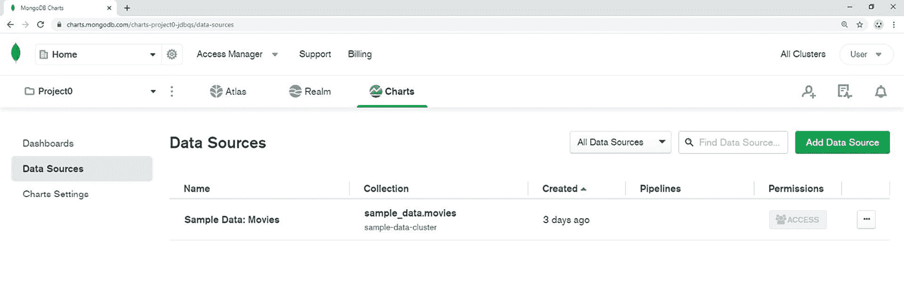

图 12.6：数据源选项卡

在中间，您可以看到现有数据源的列表，页面右上角有“添加数据源”按钮。

如您所见，在当前版本的 Charts 中，您的应用程序会自动填充一个示例数据源。这个示例数据源的名称是“示例数据：电影”。MongoDB 试图通过提供示例数据源和示例仪表板/图表来简化对 Charts 的快速介绍，以便用户在不学习如何使用 Charts 界面的情况下查看一些图表。

注意

示例数据源“示例数据：电影”不能被用户更改或删除。这是因为示例数据源指向一个特殊的 Atlas 数据库，该数据库对您的项目外部，并且用户无法访问。由于不能保证这个数据源将存在于将来的版本中，您应该忽略这个数据源，并继续操作。

要创建新的数据源，您必须提供连接到云 MongoDB 数据库的连接详细信息。数据源通常指向单个数据库集合。由于您已经熟悉了 MongoDB 数据库结构，因此在 Charts 中创建新数据源应该相对容易。

但是，数据源可能比单个数据库集合更复杂。Charts 用户可以使用更复杂的选项（称为**数据源预处理**）。复杂的数据源包括过滤、连接和聚合等功能。有关预处理功能的更多细节将在本章的后面介绍。目前，让我们专注于在 Charts 中创建新数据源。

要创建数据源，请点击“添加数据源”按钮，如*图 12.6*所示。屏幕上会出现一个带有“添加数据源”向导的新窗口：

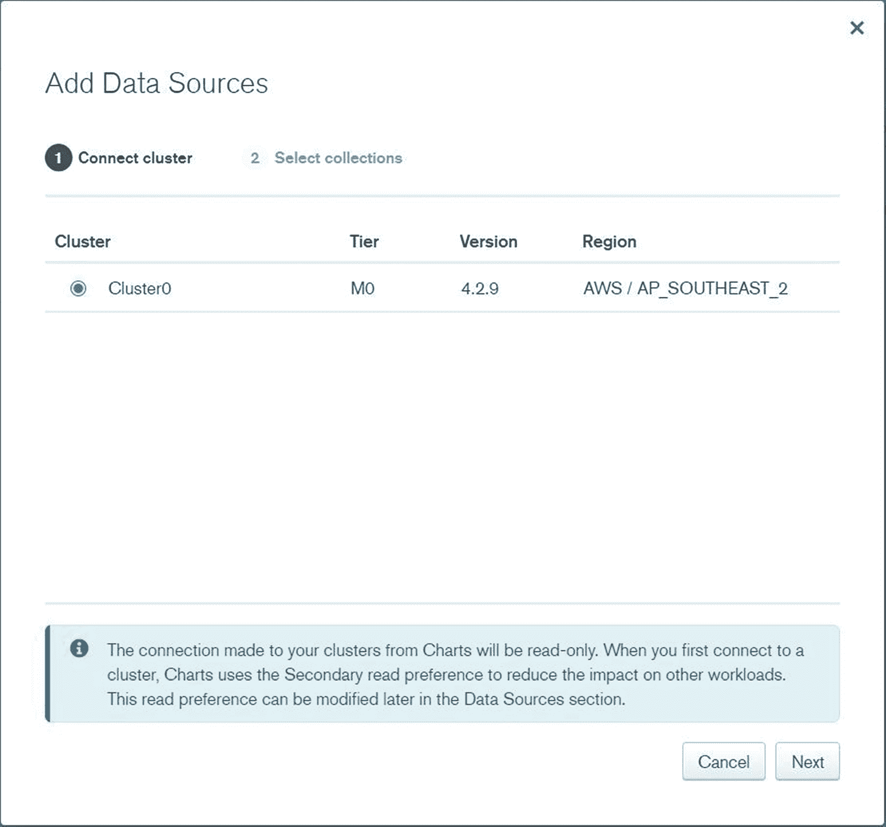

图 12.7：添加数据源窗口

您将看到一个用于 Charts 的云数据库列表（图 12.7）。在免费的 Atlas 中，将有一个`M0`集群可用。正如您所看到的，页脚上写着`从 Charts 到您的集群的连接将是只读的`。这是为了让您放心，数据源不会改变数据库信息。您可以从集群列表中选择`Cluster0`，然后点击`下一步`按钮。

接下来，将显示可用数据库的列表。您可以展开每个数据库，显示其中所有的集合，并从各自的数据库中选择特定的集合，如下截图所示：

图 12.8：选择集合窗口

](img/B15507_12_08.jpg)

图 12.8：选择集合窗口

您可以选择整个数据库，或展开数据库部分并从中选择一个或多个集合。如果选择多个集合（或多个数据库），Atlas 将生成多个数据源——每个数据库集合一个数据源。因此，可以创建多个数据源，而不必多次通过此设置助手。在这种情况下的限制是，所有数据源将指向之前选择的单个数据库集群。

一旦数据源配置并保存，它将出现在列表中，如图 12.9 所示：

图 12.9：数据源选项卡显示配置了 sample_supplies 数据库

](img/B15507_12_09.jpg)

图 12.9：数据源选项卡显示配置了 sample_supplies 数据库

## 练习 12.01：使用数据源

在这个练习中，您将为 Charts 创建新的数据源。这些将在本章后面的示例中再次出现，因此请务必仔细遵循这里的步骤：

注意

请确保您已经在`M0`集群中上传了 Atlas 示例数据，就像本书的前三章中所展示的那样。正如之前解释的，如果没有有效的 MongoDB 数据库集合，就无法定义新的数据源。

1.  在`数据源`选项卡中，点击`添加数据源`，如图 12.6 所示。

1.  选择您自己的集群，如图 12.7 所示。然后，点击下一步：

1.  从数据库列表中，点击`sample_mflix`数据库。如果愿意，可以展开数据库部分，查看`sample_mflix`数据库中所有集合的列表：图 12.10：选择 sample_mflix 数据库

](img/B15507_12_10.jpg)

图 12.10：选择 sample_mflix 数据库

1.  点击`完成`按钮。您应该能够在界面中看到创建的五个额外数据源（每个集合一个），如下图所示：图 12.11：数据源列表已更新

](img/B15507_12_11.jpg)

图 12.11：数据源列表已更新

在这个例子中，您在 MongoDB Charts 中添加了一个新的数据源。

## 数据源权限

复杂的 MongoDB 项目可能有许多开发人员和业务用户与 Charts 一起工作。在这种情况下，创建新数据源的 Atlas 用户可能需要与其他 Atlas 项目用户共享。正如前几章所解释的，Atlas 应用程序可以管理大型 Atlas 部署的多个用户。但是，这个概念不适用于本书中大部分示例所展示的免费的 Atlas 沙盒项目。

一旦用户创建了新的数据源，他们就成为了该数据源的所有者，并可以通过在`数据源`窗口的`Charts`选项卡中点击`ACCESS`按钮与其他项目成员共享它（见图 12.9）。这是来自`M0`免费集群的一个截图示例：

图 12.12：数据源权限窗口

](img/B15507_12_12.jpg)

图 12.12：数据源权限窗口

从前面的截图中可以看出，所有者可以为`Project0`中的`Everyone`启用或禁用`VIEWER`权限。`VIEWER`权限允许用户“使用”数据源来构建他们自己的图表。其他用户不允许修改或删除数据源。

对于大型项目，数据源所有者可以授予特定的 Atlas 组或被邀请参与项目的用户权限。这些高级权限是特定于大型 Atlas 项目的，不在本入门课程中涵盖。

## 构建图表

可以使用图表生成器在 MongoDB Charts 中创建新图表。要启动图表生成器，请打开仪表板。您可以通过单击仪表板选项卡中的`用户仪表板`链接来打开自己的用户仪表板，如*图 12.5*所示。然后，单击`添加图表`按钮。

以下是图表生成器的屏幕截图：

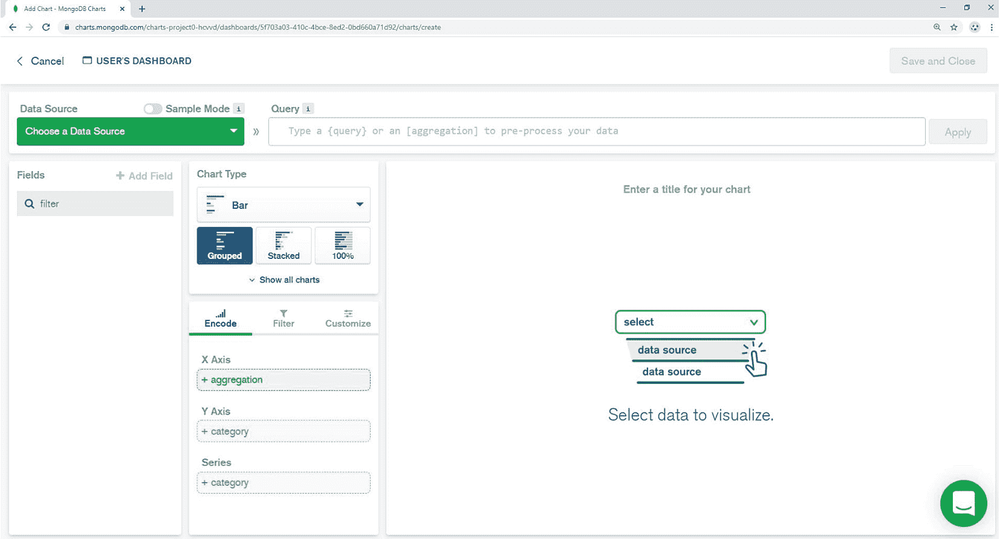

图 12.13：图表生成器

第一步是选择数据源。`选择数据源`按钮出现在左上角绿色高亮显示。请注意，需要创建并发布有效的数据源，然后才能将其分配给图表。此外，不可能将多个数据源分配给一个图表。默认情况下，图表生成器会检索集合中的所有文档。

有一个选项可以单击`示例模式`单选按钮。此模式使图表仅从数据库中检索一部分文档。关于应在图表生成器中加载的 JSON 文档的最大数量没有规定。例如，如果目标是显示精确的聚合值，那么可能需要检索所有文档。另一方面，如果目标是显示趋势或相关图表，则可能只需要一部分文档。然而，在图表中加载大量数据（超过 1GB）将对图表的性能产生负面影响，因此不鼓励这样做。

### 字段

在图表生成器页面的左侧，您可以看到集合字段的列表：

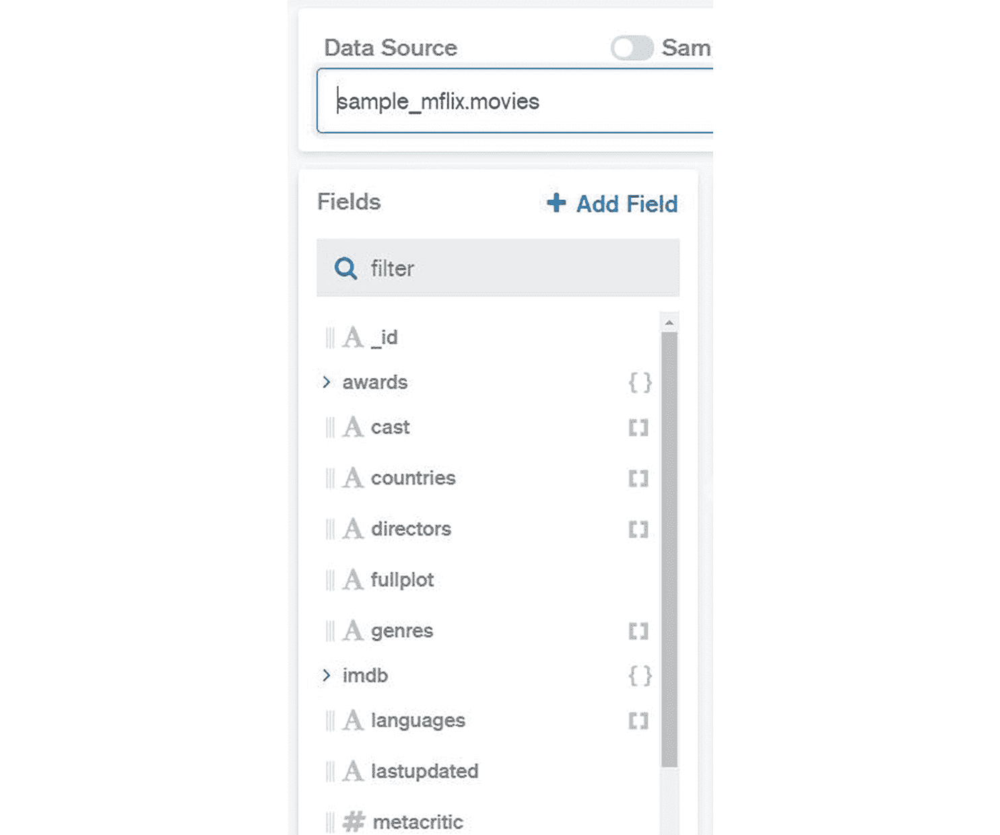

图 12.14：图表生成器中的字段区域

每个字段都有一个名称和一个数据类型，正如您在*第二章*，*文档和数据类型*中已经看到的。

以下是图表生成器中的数据类型列表：

+   `A` - 字符串

+   `#` - 数字（整数或浮点数）

+   日期

+   `[]` - 数组

+   `{}` - 子文档

注意

在示例截图（*图 12.14*）中，已选择了`sample_mflix.movies`的电影数据源。

## 图表类型

有各种类型的图表可供选择。它们都可以表示类似的视图。但是，某些图表类型更适合特定的场景或数据库数据类型。以下表格列出了所有图表类型及其各自的功能：

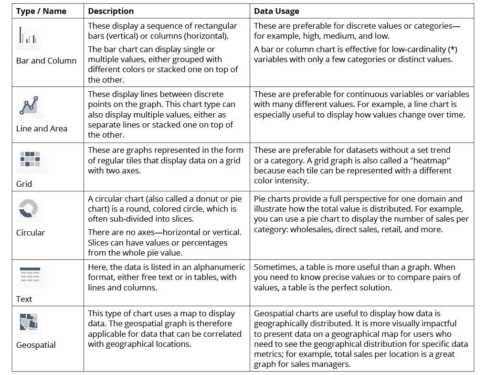

图 12.15：MongoDB 中的图表类型

每种图表类型可能有一个或多个子类型，这些子类型是主图表的视觉变化，并且在不同的展示中很有用。由于图表子类型取决于主图表类型，我们将讨论每种图表类型的子类型。

可以从同一菜单中选择图表子类型，就在`图表类型`下方，如下面的屏幕截图所示，用于`条形图`类型：

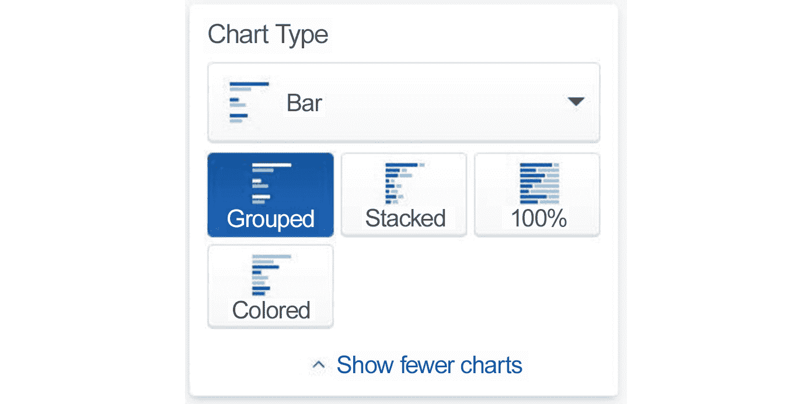

图 12.16：条形图子类型

请注意，如*图 12.16*所示，条形图和柱状图有四种不同的子类型。虽然大多数子类型只是相同图表类型的变体，但某些子类型可能有助于专注于数据的不同方面。例如，`分组`子类型有助于比较不同类别中的值，而`堆叠`有助于查看所有类别的累积值。确定适合您的正确子类型的最简单方法是快速浏览它们。图表引擎将自动以您选择的子类型形式重新显示图表。

在`图表类型`选择菜单下方，有一个子菜单，其中包含其他选项卡，用于定义图表通道或维度。以下屏幕截图显示了这些内容：

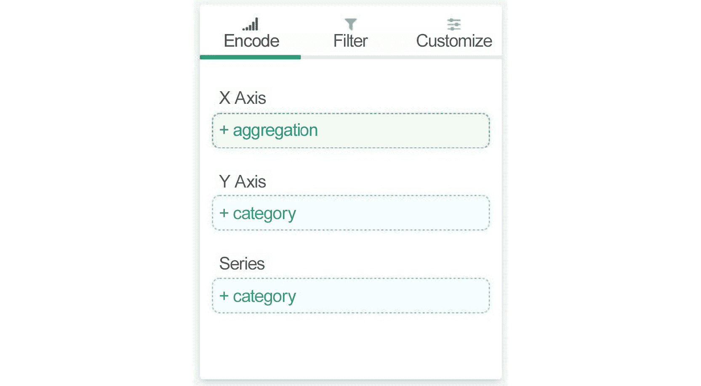

图 12.17：图表通道

以下列表简要描述了每个选项卡：

+   `编码`：用于定义图表通道。通道描述了数据如何转换为图表可视化项。不同的图表类型具有不同的编码通道。例如，条形图和折线图具有由笛卡尔坐标表示的通道。

+   `筛选`：用于定义数据筛选。此选项有助于筛选输入文档，因此只有所需的文档被考虑用于图表绘制。如果我们想要从图表中排除非相关数据，这将非常有用。

+   `自定义`：用于定义图表的功能和美学自定义，例如图表颜色和标签。虽然这个选项并非必需，但在图表可读性方面通常会产生很大的差异。

有关通道利用的更详细信息将在本章后面介绍。现在，让我们浏览一些图表类型和实际示例。

## 条形图和柱状图

条形图和柱状图可能是演示中最常用的图表类型。图表的基本格式由一组具有不同高度和厚度值的条形组成，排列在二维图中。

条形图特别适用于表示分类数据的聚合值。因此，条形图的主要用途是数据分类或分类。虽然这份材料不是关于数据科学的全面理论，但简短的介绍将帮助您了解基础知识。以下是分类数据的定义描述：

+   **数据分类**：这涉及可以根据类别或标签进行识别的数据，例如质量（高、平均、低）或颜色（白色、红色、蓝色）。这也可能包括一些不同的数值或用作类别的数字值（而不是值）。

+   **数据分箱**：这意味着根据间隔将数据分组到一个类别中。例如，0 到 9.99 之间的数值可以分组到第一个箱中，10 到 19.99 之间的数值可以分组到第二个箱中，依此类推。通过这种方式，我们可以将许多数值分组到相对较少的类别中。分箱是用于表示统计分析图表的方法，称为直方图。

一旦我们定义了数据类别，我们的二维条形图就可以从那里构建。数据类别将填充图表的一个维度，而计算（聚合）值将填充图表的另一个维度。

## 练习 12.02：创建一个条形图来显示电影

本练习的目标是创建一个条形图，并熟悉 MongoDB Charts 界面菜单和选项：

1.  首先，选择图表类型，然后将字段拖放到“编码”区域。例如，如果您选择图表类型“条形图”和“分组”，您可以在“编码”区域看到 X 轴和 Y 轴。

注意

为此图表选择“sample_mflix.movies 数据源”（左上角下拉菜单）

1.  单击名为“标题”（电影标题）的字段，并将其拖放到“Y 轴”：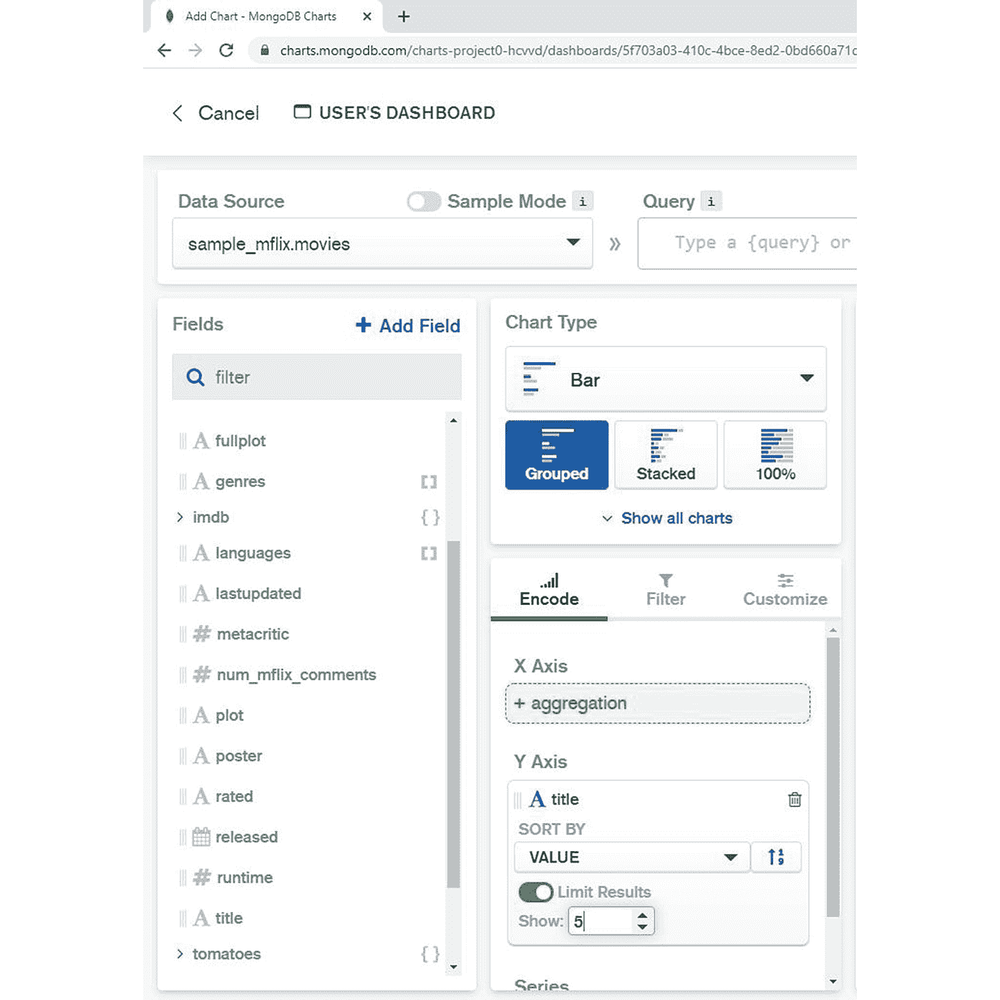

图 12.18：将标题字段拖放到 Y 轴

1.  要限制数值的数量，点击“限制结果”，并在“显示”框中输入`5`。

注意

接受“排序方式”的默认选项，即“值”（见*图 12.17*）。我们将在接下来的章节中解释编码通道的各种选项。

1.  下一步是为 X 轴定义值。展开“奖项”字段子文档，然后单击并拖放“获奖次数”到“X 轴”。保持“聚合”默认设置为“求和”：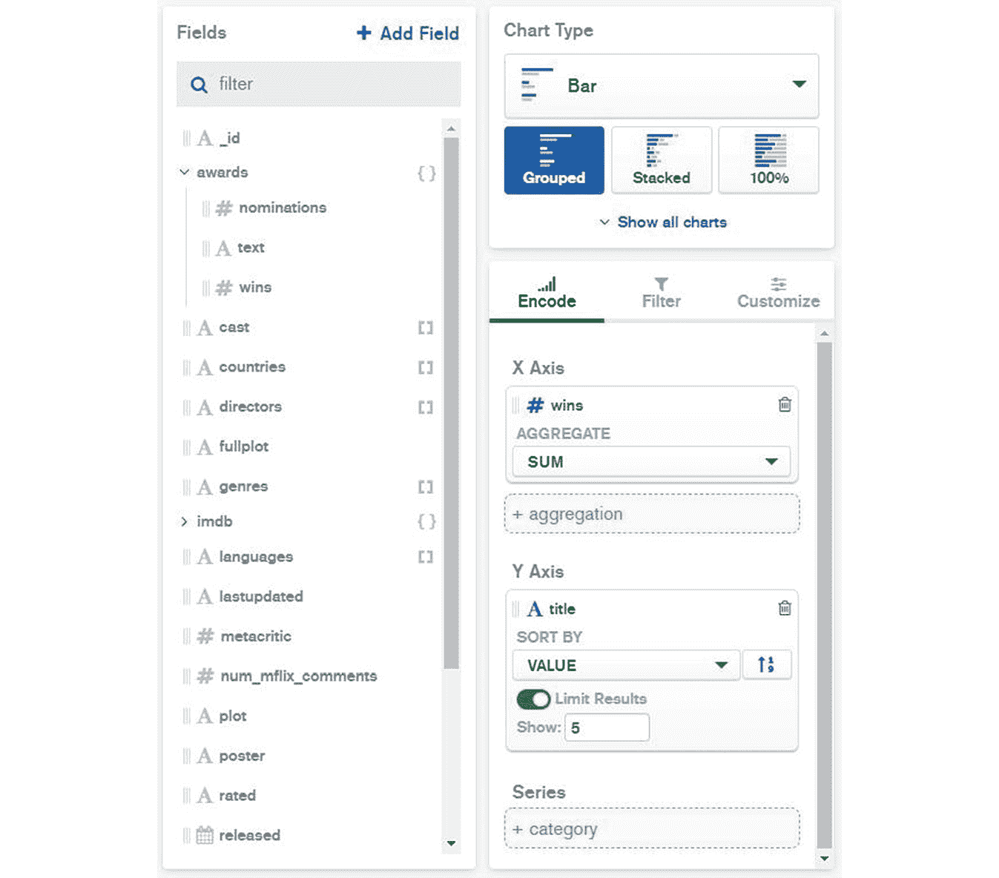

图 12.19：将获奖次数字段添加到 X 轴

图现在应该会自动出现在图表生成器屏幕的右侧：

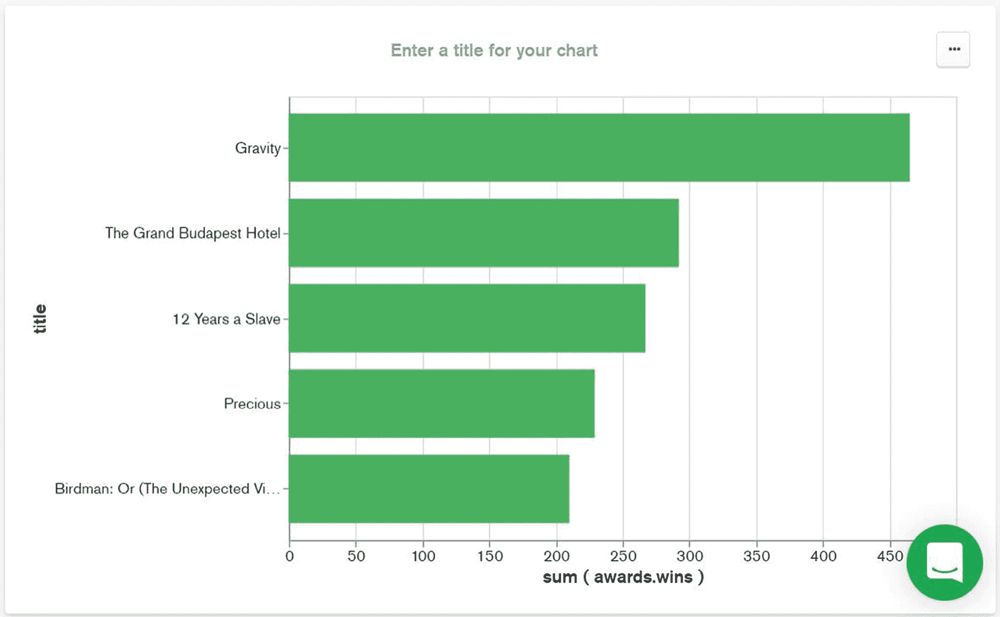

图 12.20：按奖项数量排序的前五部电影

1.  现在，根据数据库字段对条形进行分组。对于此功能，将多个字段添加到`X 轴`通道，同时保持`标题`作为唯一的`Y 轴`值。要在 X 轴上添加第二组值（`分组`条形），请将`提名`拖放到`X 轴`：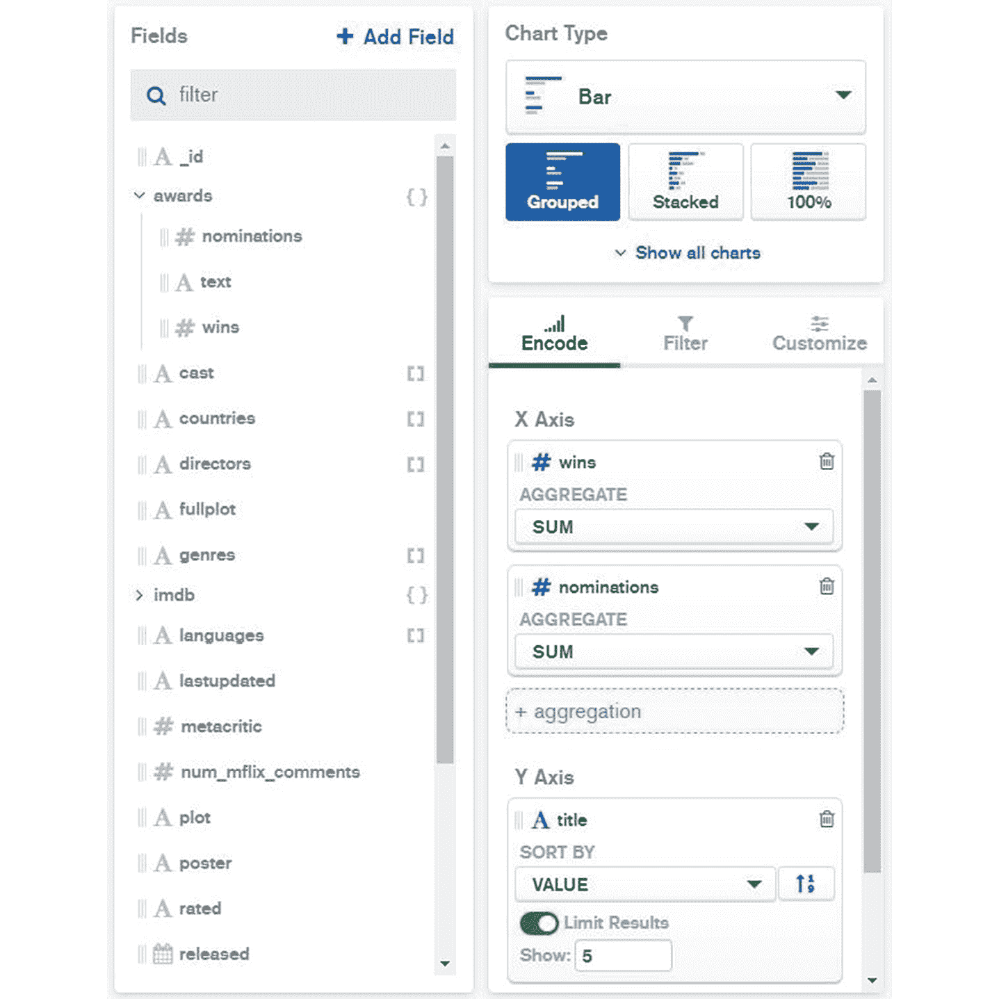

图 12.21：将提名字段拖动到 X 轴

然后图表会自动更新，显示每部电影的`提名`和`获奖`：

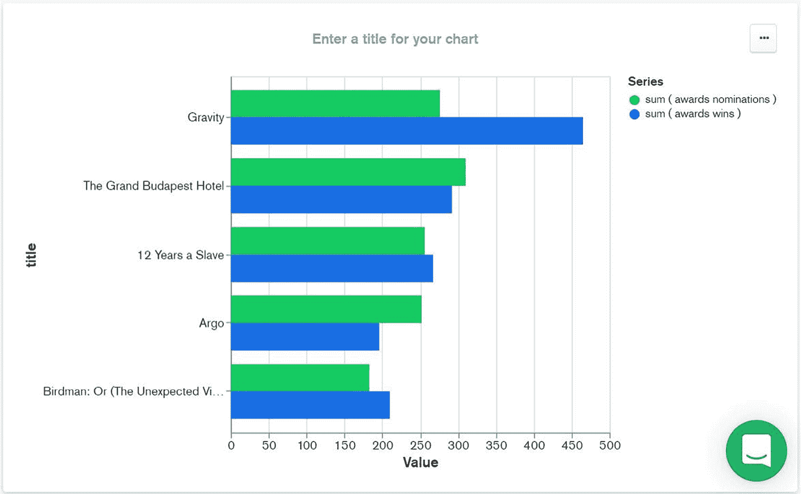

图 12.22：条形图显示顶级电影的奖项和提名

如果您想要比较值，这种图表子类型特别有用。在这种情况下，您比较了每部电影的提名和获奖次数。正如您所看到的，这些值是“分组”的。这正是`图表类型`选择菜单中`分组`选项的意思。

如果您更喜欢看到它们“堆叠”而不是分组，那么只需单击“堆叠”按钮（*图 12.21*），图表将自动更新。如果我们想要看到电影奖项提名和获奖的累积总值，这个选项就很有用：

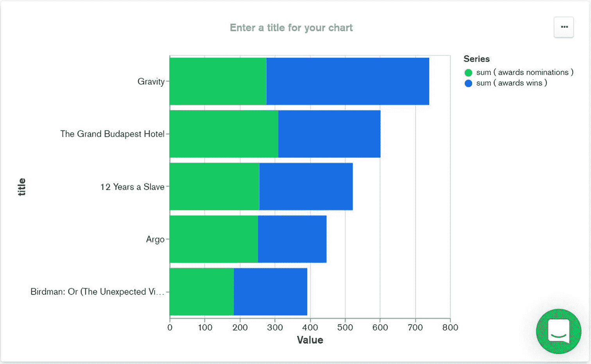

图 12.23：堆叠条形图的结果（而不是分组）

正如您所看到的，在 MongoDB Charts 中从一个子类型切换到另一个子类型只需要点击一次。结果，图表会自动以新格式重新绘制，而无需任何其他用户输入。一旦我们决定我们的初始子类型选择是否适合我们的演示，这个功能就非常有用。

现在，让我们看看 Atlas 中可用的其他类型的图表。

## 圆形图表

圆形图表是彩色的圆形或半圆形，通常被细分成扇形，以表示值或百分比。圆形图表也是“单维”的，这意味着图表只能表示一组标量值，而不能表示可以在笛卡尔坐标系中表示的值。考虑到这个限制，我们需要意识到使用这种类型的图表可以表示的信息很少。尽管如此，圆形图表通过强调一个扇形与整体之间的比例，提供了数据比例的强大视觉表示。由于其简单性和视觉冲击力，这种类型的图表对于演示也非常有效。

圆形图表有两种子类型：`圆环`和`仪表盘`：

+   `圆环`：这代表一个全彩色的圆（饼），被分成代表值或百分比的扇形。可能有很多值或扇形。然而，建议限制值的数量，以便圆环被分成相对较少的扇形。

+   `仪表盘`：这代表一个半圆，与总数的比例。这种类型的图表是圆环类型的简化版本，因为它可以表示单个值的比例。

在下一个练习中，您将学习如何创建一个圆环图。

## 练习 12.03：从电影收藏创建饼图图表

假设您需要根据电影的原产国来表示电影。由于饼状图通常比表格更直观，您决定使用圆环图来表示这些数据。这也将使您强调世界上产出顶级电影的国家：

1.  从`图表类型`下拉菜单中选择`圆环`子类型：

图 12.24：选择圆环图子类型

1.  点击并将`国家`字段拖动到`标签`通道，如下图所示：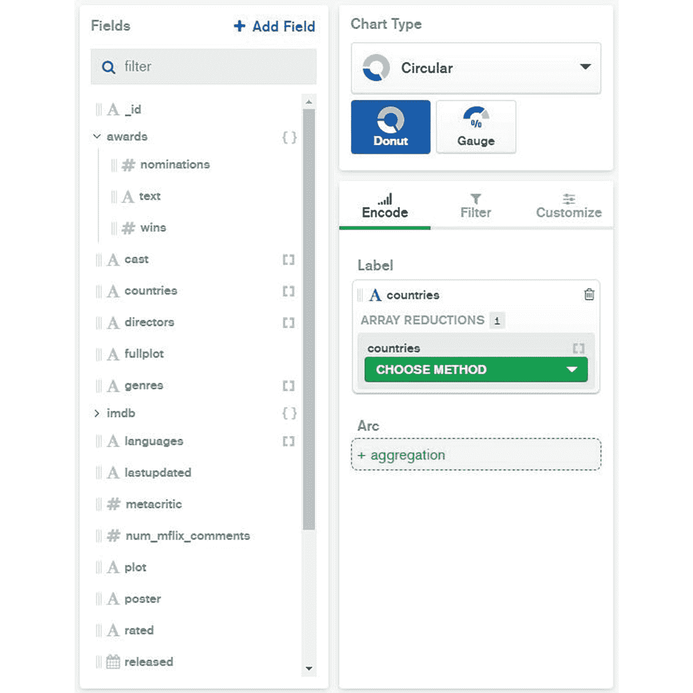

图 12.25：将国家字段拖动到标签通道

1.  单击`选择方法`下拉菜单，然后选择`按索引选择数组元素（索引=0）`以选择所有文档中数组的第一个元素。接受`排序方式`的默认选项——即`值`。

注意

因为`countries`字段是 JSON 数组数据类型，您最好的选择将是`数组缩减`方法，这样 Charts 将知道如何解释数据。在这个例子中，您将专注于主要国家制片商（`索引=0`），并忽略联合制片商。

1.  减少结果数量（使用`限制结果`选项）到`10`。这样，您的饼图将只有`10`个切片，这将对应于前`10`个电影制片商：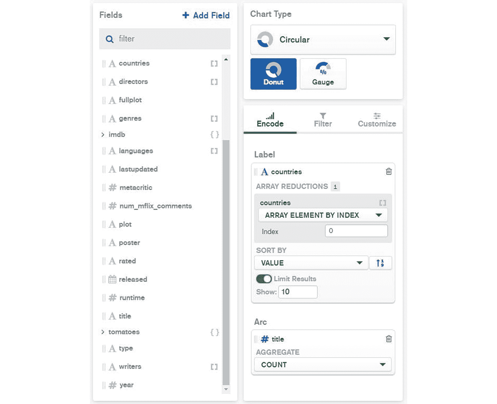

图 12.26：将限制结果的值设置为 10

1.  将`title`字段拖放到`Arc`通道中，并选择`COUNT`选项作为`聚合`下拉菜单的选项。圆形图表应出现在屏幕右侧，如下所示：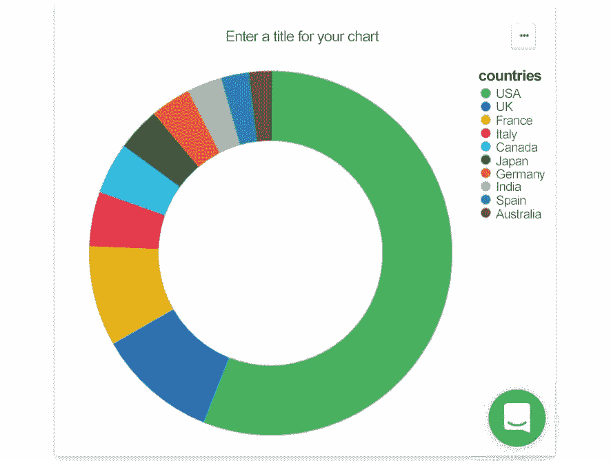

图 12.27：顶部电影制片国家的环形图表

这个练习带您完成了构建环形图或饼图所需的几个简单步骤。几乎任何演示文稿或仪表板都包含至少一个饼图，因为它们看起来很吸引人。但吸引力并不是环形图如此受欢迎的唯一原因。环形图也是在视觉图表中表示比率和比例的强大工具。接下来的部分将介绍另一种类型的图表，即地理空间图表。

## 地理空间图表

地理空间图表是一种特殊类别的图表，其中地理数据是构建图表的主要成分。地理（或地理空间）数据的最简单定义是它包含有关地球上特定位置的信息。位置细节被标在地图上以构建地理空间图表。

地理空间信息可以是具体的或更一般的。以下是一些可以使用地图引擎（如 Google Maps）轻松映射的地理空间数据的示例：

+   精确的经度和纬度坐标

+   可以使用地图引擎映射的地址

+   更广泛的位置，如城市、地区或国家

例如，假设我们有一个包含有关汽车信息的数据库。主数据库集合包含数百万个关于汽车的文档，如型号、里程表细节和其他属性。还有一些其他属性将描述车辆注册的物理地址。然后可以使用该信息构建使用城市地图的地理空间图表。

地理空间图表有几种子类型，如下所示：

+   `Choropleth`图表：此图表显示着色的地理区域，如地区和国家。这种类型的图表不太具体，通常用于高级别的聚合，例如显示每个国家的 COVID-19 病例总数的图表。

+   `散点`图表：此图表需要精确的地址或位置。图表在地图上用一个点或一个小圆圈标记位置。如果我们想要显示具有相对较少的精确位置的图表，这个图表是有用的。

+   `热力图`图表：热力图在地图上显示不同强度的颜色。更高的强度对应于该位置的数据库实体的更高密度。热力图图表适用于在地图上显示大量对象的情况，用户更关注密度而不是精确位置。

在下一节中，您将完成一个练习，使用包含样本地理空间信息的`sample_mflix`数据库，以进一步练习在新的地理空间图表中使用地理点信息。

## 练习 12.04：创建地理空间图表

本练习的目的是创建一个地理空间图表，代表美利坚合众国所有电影院的地图。您将使用`theaters`集合来映射地理数据：

1.  对于`数据源`，选择`sample_mflix.theaters`：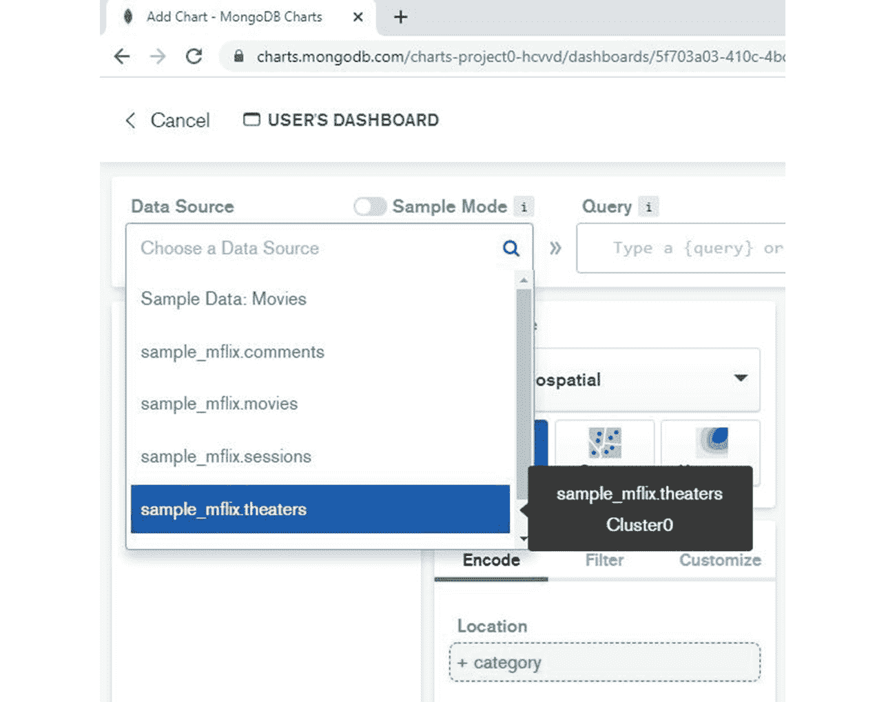

图 12.28：选择 sample_mflix.theaters 作为数据源

1.  选择`地理空间`图表，并从子类型类别中选择`热力图`：

图 12.29：从地理空间图表子类型列表中选择热力图

1.  点击`geo`字段，将其拖放到“坐标”编码通道中：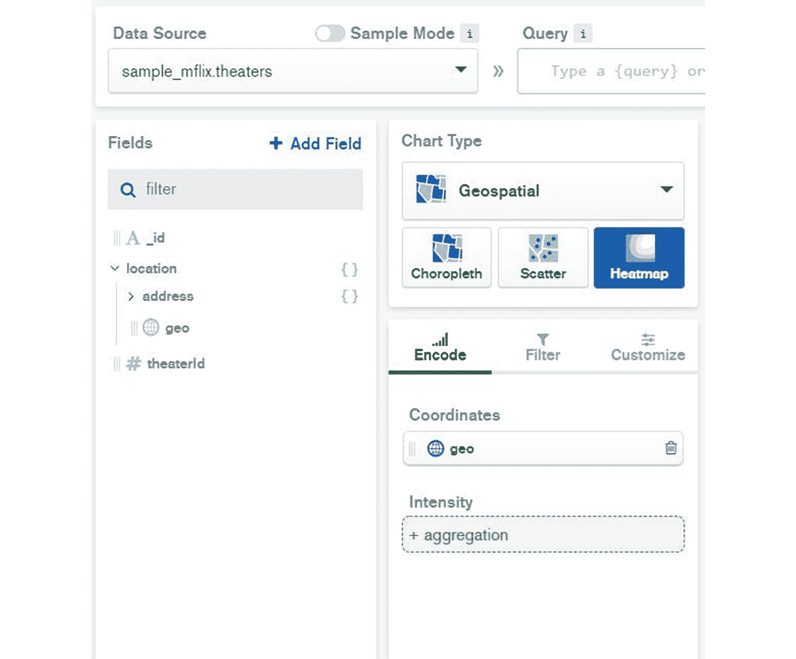

图 12.30：将 geo 字段拖放到坐标编码通道中

1.  接下来，点击`theatreId`字段，将其拖放到“强度”通道中：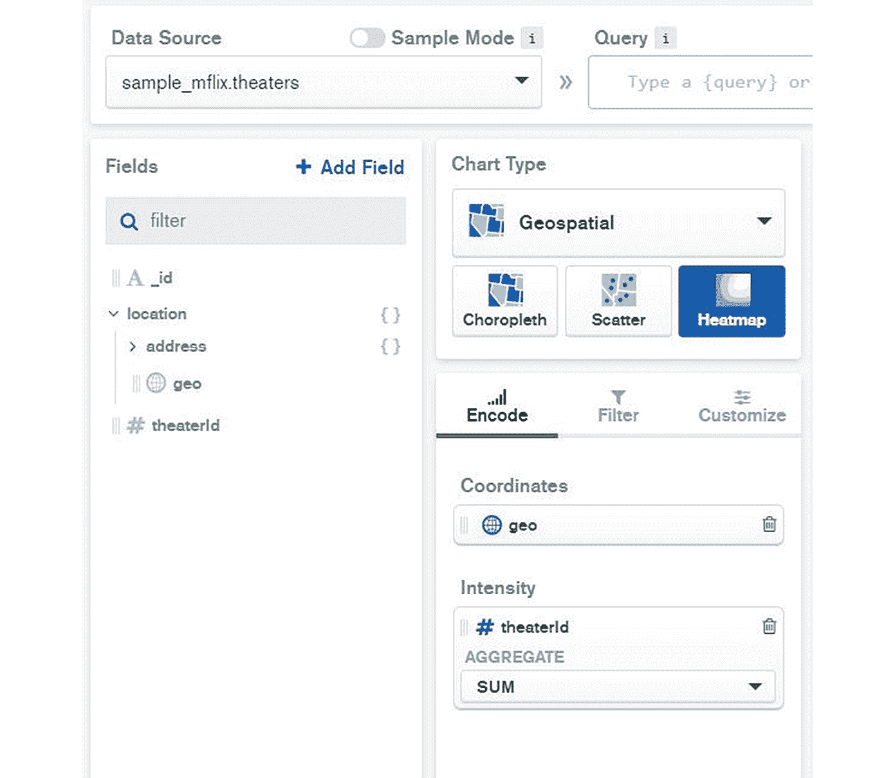

图 12.31：将 theatreId 字段拖放到强度通道中

切换到`热力图`图表类型时，您应该注意到立即出现的彩色区域图表更新，而不是点状图表——在美国大城市周围的红色强度。

美国地图应该出现在窗口的右侧，并将使用不同的颜色渐变显示剧院的密度。颜色编码显示在图表的右侧。电影院的最高密度（大约在纽约市附近）将显示为地图上的红色（见*图 12.32*）：

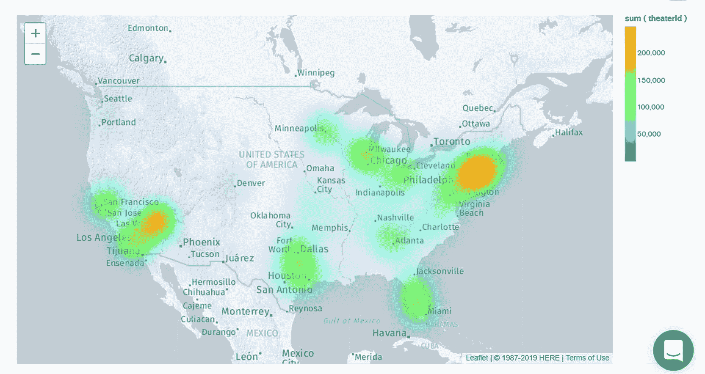

图 12.32：热力图图表

在这个练习中，您练习了构建美国所有电影院的地理空间图表。您首先进行数据分析，以查看数据库信息是否适合通过地理空间图表进行呈现。一旦数据在 MongoDB 数据库中可用，构建图表就相对容易。

# 复杂图表

在之前的章节中，您已经看到了在 Atlas 中使用 MongoDB Charts 是多么容易。虽然用户界面非常直观和易于使用，但它也非常强大。MongoDB Charts 中有许多选项，可以对数据库中的数据进行预处理、分组和以各种方式显示。在本节中，我们将看一些更高级的配置主题。

## 数据预处理和过滤

如前所述，图表通过在 Charts 中定义的数据源访问数据库。默认情况下，会选择数据库集合中的所有文档来构建新的图表。此外，Charts 中的数据字段将继承原始数据库 JSON 文档的数据格式。

还要注意，数据源不能改变或修改数据库。在现实生活中，经常发生数据格式不适合通过图表进行呈现的情况。数据必须经过准备，或者数据格式在使用图表之前需要以某种方式进行修改。这种用于绘图的数据准备类别称为预处理。

数据预处理包括以下内容：

+   **数据过滤**：过滤数据，只选择某些文档

+   **数据类型更改**：修改数据类型，使其更适合图表生成器

+   **添加新字段**：添加在 MongoDB 数据库中不存在的自定义字段

### 数据过滤

数据过滤允许用户仅选择来自 MongoDB 集合的子集文档。有时，数据库集合太大，这使得图表生成器的操作变得更慢、更不有效。克服这个问题的一种方法是对数据进行抽样。另一种方法是根据某些类别过滤数据，以便仅考虑图表的子集文档。

用户可以通过以下表中列出的几种方式控制图表中处理的文档数量。

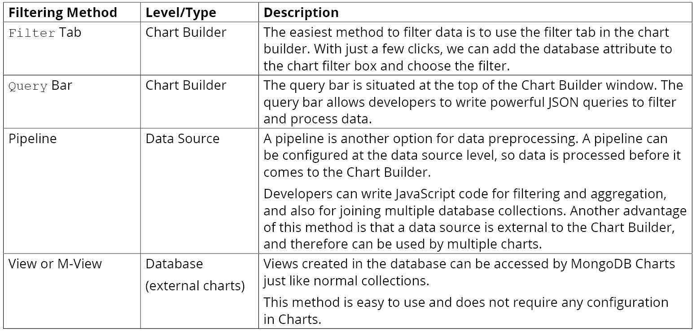

图 12.33：用户可以控制图表中处理的文档数量的方式

注意

建议选择最适合图表要求的一个过滤器方法，并只使用该过滤器。将两种或三种过滤方法混合到同一个图表中可能会导致混乱，应该避免。

除了**Filter Tab**方法是 UI 的一部分外，所有其他方法都需要使用 JavaScript 代码来定义过滤器。查询语法在*第四章*的*查询文档*中有详细介绍。在 Charts 中也可以使用相同的查询格式。例如，要为所有在 1999 年后发布的意大利或法国电影定义过滤器，可以编写以下 JSON 查询：

```js
{ countries: { $in: ["Italy", "France"]}, 
  year: { $gt : 1999}}
```

一旦将此查询输入到`Query`栏中，应单击`Apply`按钮，如下截图所示：

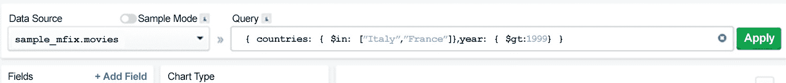

图 12.34：查询栏示例截图

注意

过滤文档可能会导致图表响应延迟，特别是在处理大型数据库时。为了提高性能，可以在涉及过滤表达式的集合字段上创建索引，如*第九章*的*性能*中所示。

### 添加自定义字段

Charts 允许用户添加自定义字段，用于构建图表。有时，来自 MongoDB 的原始数据并不提供创建新图表所需的正确属性，因此添加自定义字段变得很重要。这些自定义字段大多是使用源数据库值派生或计算出来的。

可以通过单击图表生成器的`Fields`区域中的`+ Add Field`按钮来添加自定义字段，如下截图所示：

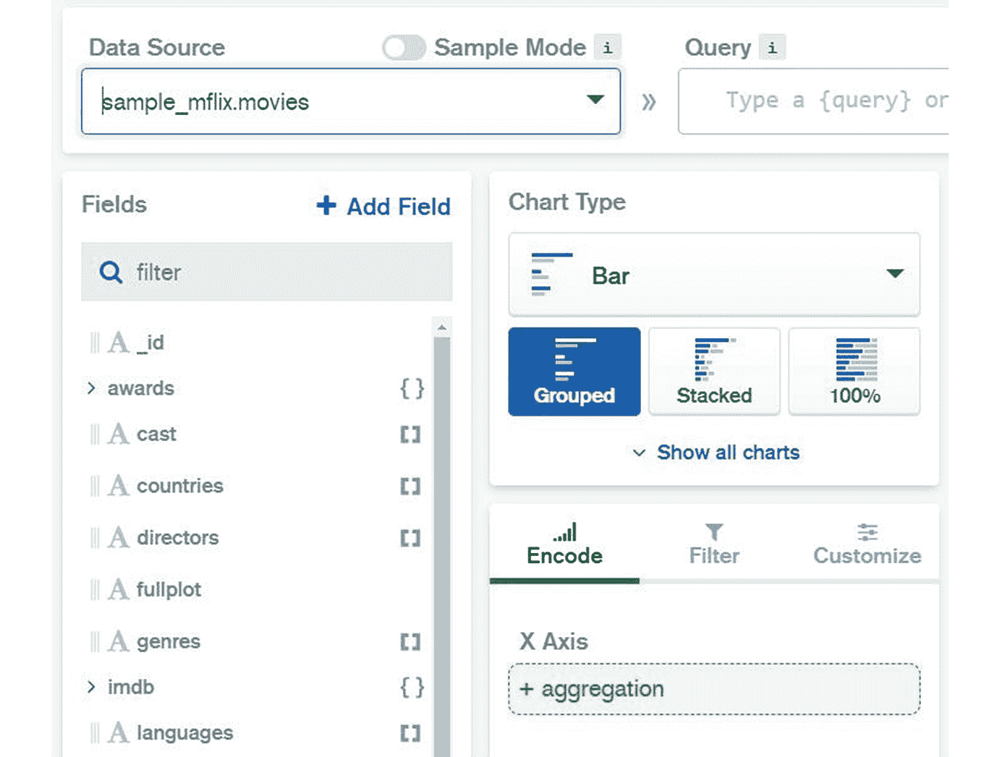

图 12.35：字段区域中的添加字段按钮

可以添加两种类型的字段：

+   `MISSED`：此选项用于添加在字段列表中缺失的字段。例如，想象一下，应用程序中添加了一个新字段，数据库中只有少数文档有这个新字段。在这种情况下，MongoDB Charts 可以将缺失的字段添加到初始加载中。

+   `CALCULATED`：用于添加集合中不存在的新字段。例如，共享乘车应用程序的源数据库可以有关于小时数和每小时费率的字段。但是，总值（小时数乘以费率）可能不在数据库中。因此，我们可以添加一个从数据库中的其他值计算出来的新自定义字段。

注意

如果字段在任何集合文档中不存在，则无法添加`MISSED`字段。在这种情况下，您需要先添加/更新集合文档。

为了更好地理解这个概念，考虑这个实际例子。在这个例子中，您将在 Charts 中添加一个新的计算字段。执行以下步骤：

1.  单击`Add Field`按钮，然后单击`CALCULATED`按钮，如下截图所示：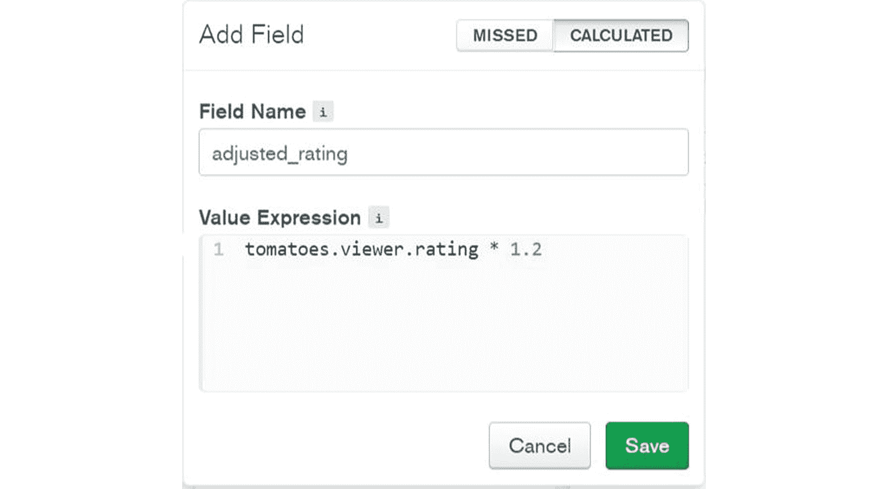

图 12.36：添加新字段

1.  在`adjusted_rating`中输入新字段名称。

1.  输入计算总值的公式，即`tomatoes.viewer.rating * 1.2`。

1.  单击`Save`按钮。现在应该能够看到新计算字段并在图表中使用它，就像任何其他数据类型属性一样。

注意

计算字段不会保存在数据库中。它们的范围仅限于 MongoDB 图表生成器内。此外，可以从`Fields`列表中删除计算字段。

### 更改字段

有时，从数据库中获取的数据不是正确的数据类型。在这种情况下，MongoDB 图表允许用户将字段更改为适合图表绘制的数据类型。例如，图表通道可能需要数据以数字格式进行聚合“求和”或“平均”。要更改字段，请将鼠标指针拖动到“字段”列表中的字段名称上（在“图表构建器”窗口的左侧）：

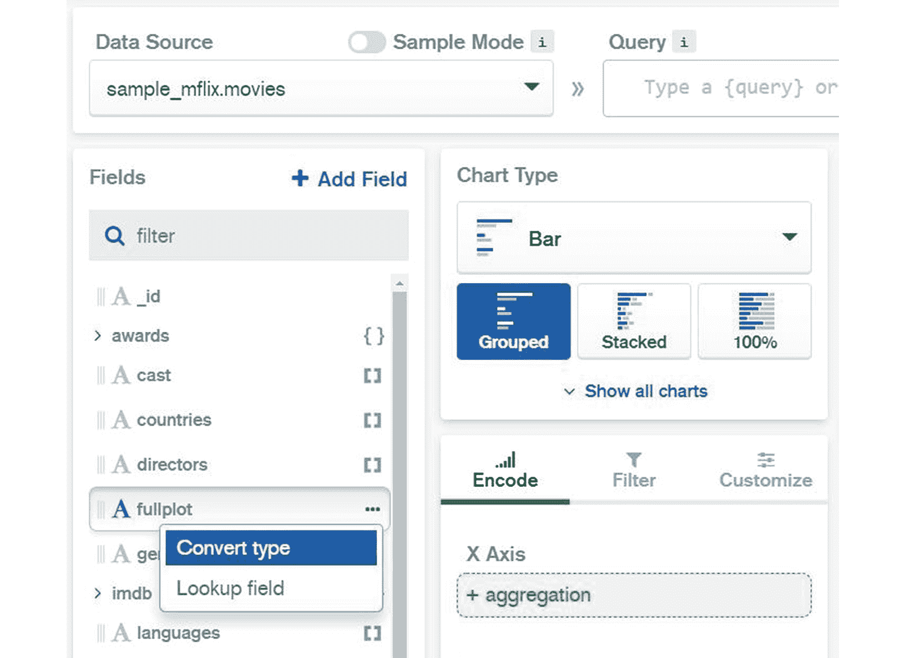

图 12.37：从 fullplot 字段中选择转换类型

单击`...`菜单并选择“转换类型”选项（唯一可用的选项），将显示 JSON 数据类型列表。然后，您可以选择所需的数据类型，然后单击“保存”按钮。

例如，如果要将`metacritic`数字字段（`#`）更改为字符串字段（`A`），可以单击`metacritic`，然后将显示一个新的“转换类型”窗口，如下所示：

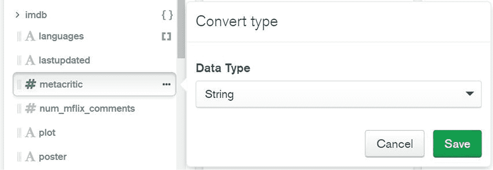

图 12.38：转换类型窗口

请注意，更改字段的数据类型只会对当前图表产生影响，并不会更改数据库中的数据类型。

注意

在最新版本的图表中，上下文字段菜单[`…`]中还有另一个选项，称为“查找”。 “查找”字段允许我们通过连接同一数据库中的第二个集合来构建图表。有关如何连接集合的详细信息，请参阅*第四章*，*查询文档*。

# 通道

编码通道是数据可视化中最重要的方面之一。通道决定了数据在图表中的可视化方式。如果选择了错误的通道类型，用户可能会得到混乱的图表或完全意想不到的结果。因此，对编码通道的正确理解对于高效的图表构建和数据可视化至关重要。

如前面的示例所示，编码通道位于图表构建器的“编码”选项卡下方，就在图表子类型选择按钮的下方：

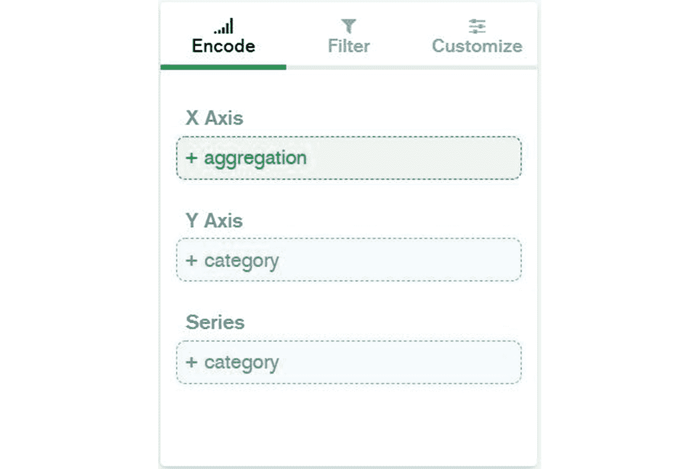

图 12.39：编码通道

每个编码通道都有一个名称和类型。通道名称定义了图表中的目标，即通道将用于的终点。例如，“X 轴”通道名称表示该通道提供了图表的水平轴的值。在这种情况下，我们将会得到一个笛卡尔二维图表是很清楚的。通道类型定义了通道输入所期望的数据类型。找到通道输入的正确数据类型很重要。另外，您现在可能已经注意到，并非所有数据类型都可以被接受为通道输入。

MongoDB 图表中有四种通道类型，如下表所示：

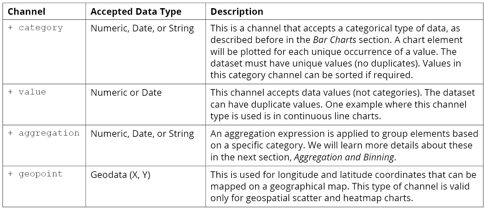

图 12.40：MongoDB 图表中的通道类型列表

注意

可以从 JSON 文档中的子文档或数组字段中分配通道值。在这种情况下，MongoDB 图表将要求您标识用于通道编码的元素，例如，数组索引`[0]`（指向每个文档中数组的第一个元素）。

## 聚合和分箱

一个通道中的数据通常与类别数据类型通道结合在一起，以便它可以计算每个类别的聚合值。例如，我们可以对法国电影的所有奖项进行“求和”聚合。在图表构建器中，当将字段拖放到聚合通道中时，假定值将在图表中进行聚合。图表构建器会在不需要您编写聚合管道代码的情况下透明地执行此操作。

聚合类型将取决于我们在通道输入上提供的数据类型。例如，如果通道提供的数据类型是文本，则不可能进行“求和”操作。

有几种聚合类型，如下表所示：

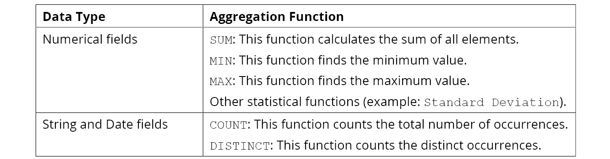

图 12.41：聚合类型

注意

一些通道可以有“系列”类型。这个选项允许用户向图表添加第二个维度，无论是唯一的还是分组的，都可以通过将数据分组在一系列值中来实现。

## 练习 12.05：为柱状图分组值

在这个练习中，您将构建另一个柱状图，显示在意大利制作的电影。在这个图表中，您需要按电影发行年份对数据进行聚合。此外，图表应该只考虑 1970 年后发布的电影。为了构建这个图表，您需要过滤文档并选择编码字段来表示按年份聚合的电影。以下步骤将帮助您完成这个练习：

1.  从仪表板窗口中，单击“添加图表”，然后选择“柱状图”类型。

1.  将“年份”字段拖放到分类通道“Y 轴”上。图表生成器将检测到有太多的分类不同值（年份），并建议对它们进行分组（将它们分组为 10 年期）。现在，切换“分组”并为“分组大小”输入值`10`（见下图）：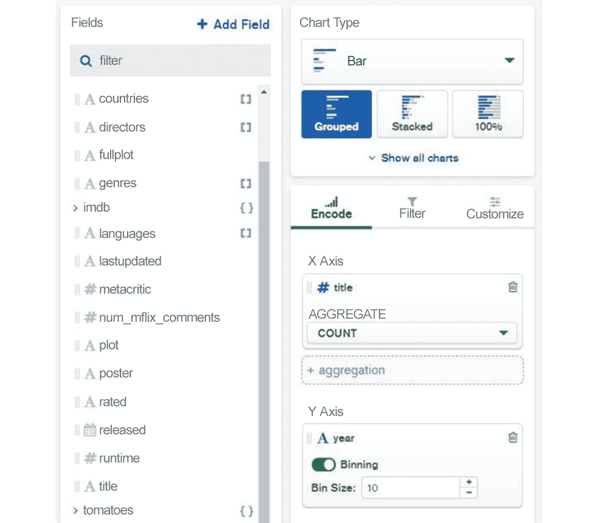

图 12.42：输入 10 作为分组大小的值

1.  将“标题”字段拖放到分类通道“X 轴”上。然后，选择“聚合”函数选项“计数”并单击“筛选”选项卡。

1.  将“国家”字段拖放到图表筛选器中。

1.  如下所示，从图表筛选器中选择“意大利”：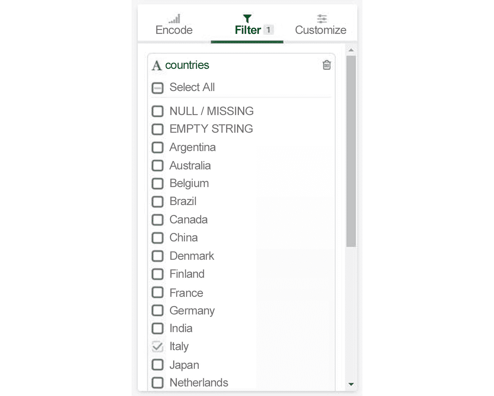

图 12.43：从国家列表中选择意大利

1.  将第二个字段“年份”拖放到图表筛选器中，并将“最小值”设置为`1970`，如下所示：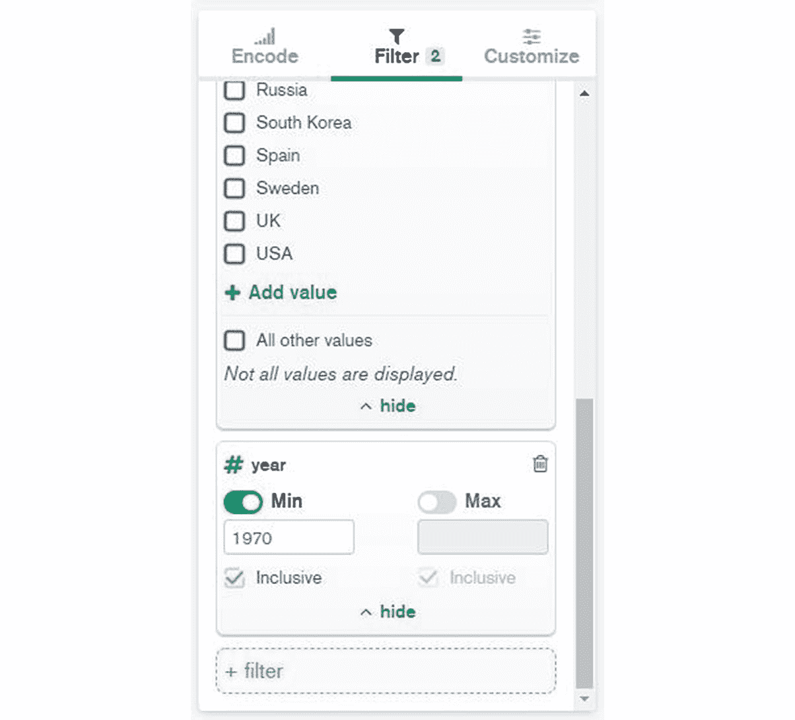

图 12.44：将 1970 年作为年份字段的最小值

1.  将图表标题编辑为“意大利电影”，如下所示：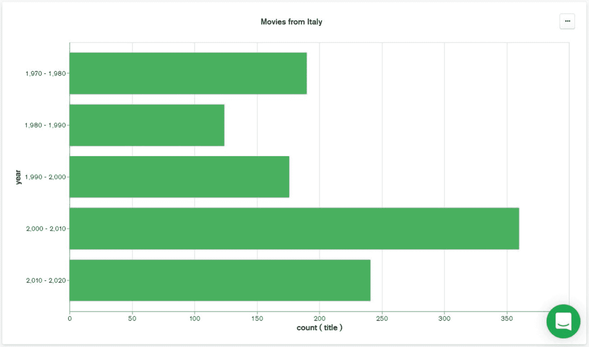

图 12.45：意大利电影最终柱状图

1.  保存图表。

在这个练习中，您以简单的方式使用过滤和聚合技术创建了一个图表，而且没有编写任何 JavaScript 代码。新图表已保存在仪表板上，因此可以在以后加载和编辑。MongoDB 图表生成器具有高效的 Web GUI，可帮助用户创建复杂的图表。除了易于使用外，界面还有许多选项和配置项可供选择。

# 集成

到目前为止，本章的主题集中在描述 MongoDB 图表 PaaS 的功能上。我们已经了解到用户可以轻松地使用来自 Atlas 云数据库的数据源构建仪表板和图表。本章的最后一个主题涉及 MongoDB 图表的最终结果，即仪表板和图表如何用于演示和应用程序。

一种选择是将图表保存为图像并将其集成到 MS PowerPoint 演示文稿中，或将其发布为网页内容。虽然这个选项非常简单，但它有一个主要缺点，即图表图像是静态的。因此，当数据库更新时，图表不会更新。

另一个选择是将 MongoDB 图表用作演示工具。这个选项保证了图表在数据库更新时会刷新和渲染。然而，这个选项可能不是理想的，因为内容仅限于 MongoDB 图表用户界面，无法轻松集成。

幸运的是，MongoDB 图表有一个选项，可以将图表发布为网页和 Web 应用程序的动态内容。它也可以轻松集成到 MS PowerPoint 演示文稿中。这个集成功能称为**嵌入式图表**，允许图表在预先设定的时间间隔后自动刷新。

## 嵌入式图表

嵌入图表是一种选项，您可以使用它来通过提供可用于数据演示和应用程序的网页链接来共享 MongoDB Charts 工具之外的图表。

有三种方法可以共享图表：

+   `未经身份验证`：使用此方法，用户无需进行身份验证即可访问图表。他们只需要访问链接。这个选项适用于公共数据或不敏感的信息。

+   `已验证`：使用此方法，用户需要进行身份验证才能访问图表。这个选项适用于具有非公开数据的图表。

+   `验证签名`：使用此方法，用户需要提供签名密钥才能访问图表。这个选项适用于敏感数据，需要额外的配置和代码来验证签名。

选择方法取决于数据安全要求和政策。`未经身份验证`方法适用于学习或测试非敏感数据。在具有真实或敏感数据的应用程序中，应始终使用`验证签名`方法与其他应用程序集成。

如此屏幕截图所示，嵌入图表有几个选项：

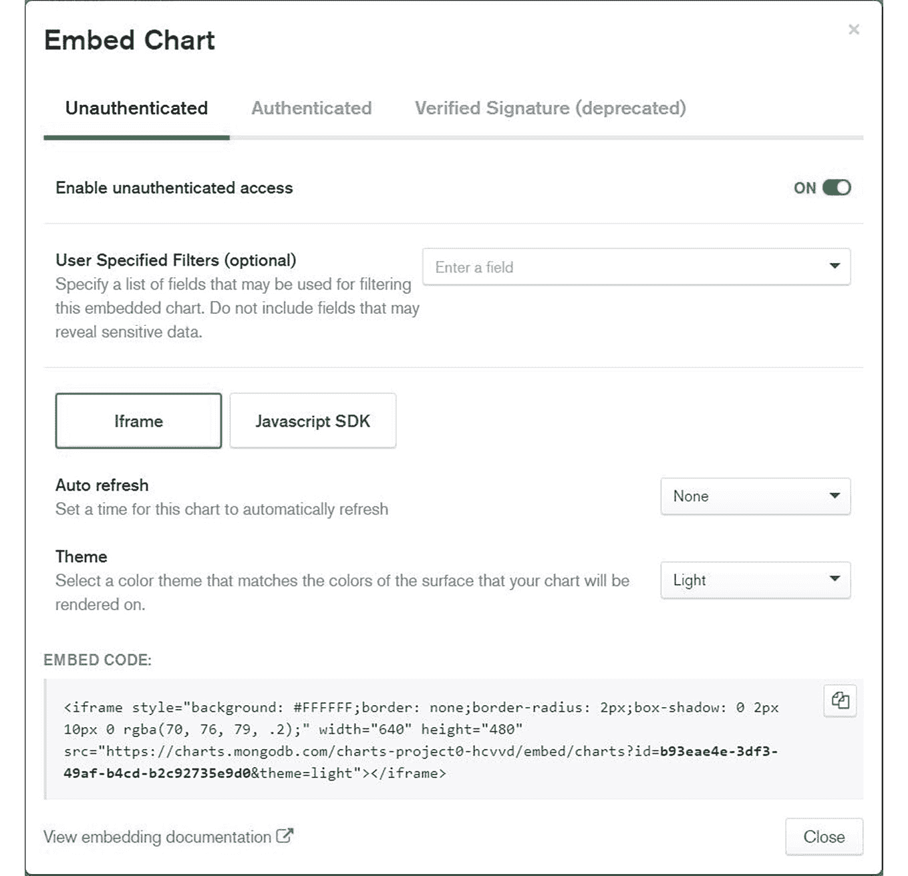

图 12.46：嵌入图表窗口

例如，假设您想要为用户配置`未经身份验证`访问。选择`未经身份验证`选项后，您可以指定以下详细信息：

+   `用户指定的过滤器（可选）`：您可以指定在共享时不可见的字段。

+   `自动刷新`：您可以指定图表自动刷新的时间间隔。

+   `主题`：您可以指定`浅色`或`深色`的图表主题。

嵌入代码会自动生成，并可以像*图 12.46*中所示一样复制到应用程序代码中。

## 练习 12.06：将图表添加到 HTML 页面

在本练习中，您将创建一个包含使用 MongoDB Atlas Charts 创建的嵌入图表的简单 HTML 报告。使用在*练习 12.05*中创建的保存图表`意大利电影`，*为条形图分箱值*：

1.  与前面的部分一样，通过转到`数据源`选项卡并选择数据源`sample_mflix.movies`来启用对数据源的访问。

1.  点击菜单右侧的(`…`)，选择`外部共享选项`。

1.  点击`未经身份验证或已验证访问`，然后点击`保存`，如下图所示：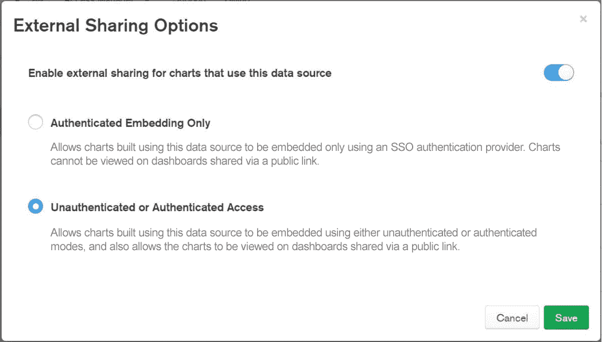

图 12.47：外部共享选项截图

1.  转到`仪表板`选项卡，打开`电影`仪表板。您应该能够看到创建和保存的图表，包括`意大利电影`条形图。

1.  点击图表右侧的(`…`)，然后点击`嵌入图表`，如下图所示：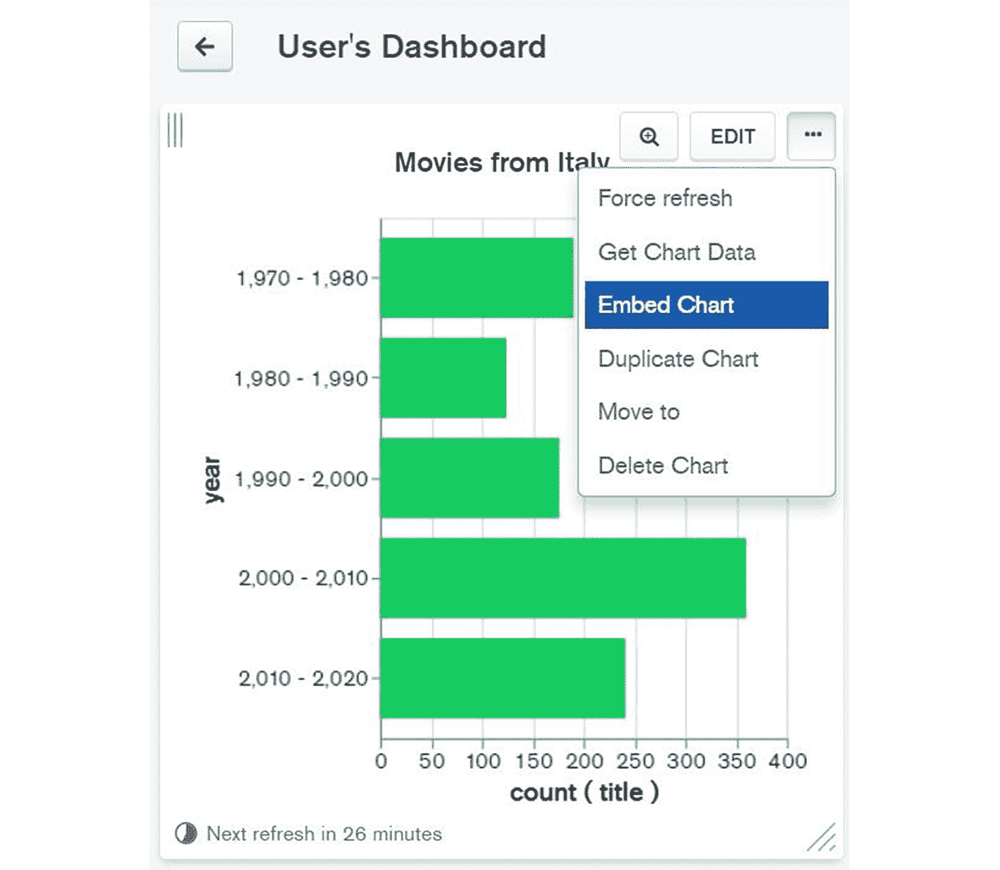

图 12.48：选择嵌入图表选项

`嵌入图表`窗口将如下图所示出现：

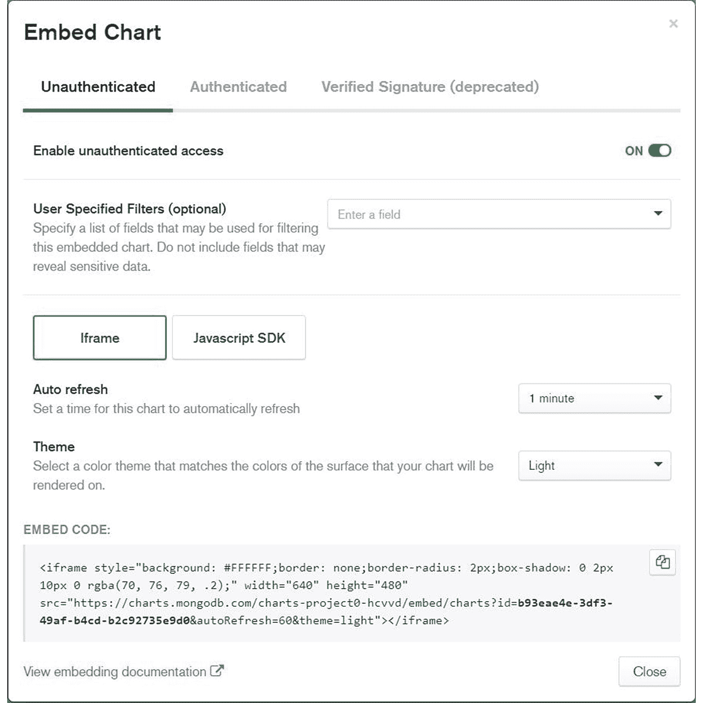

图 12.49：嵌入图表页面

1.  点击`未经身份验证`选项卡，并按以下设置更改设置：

`自动刷新`：`1 分钟`

`主题`：`浅色`

1.  复制出现在页面底部的`嵌入代码`内容。

注

用户可以通过选择过滤器与嵌入的图表进行交互。要激活此可选功能，请点击`用户指定的过滤器（可选）`，并选择可用于确定图表过滤器的字段。JavaScript SDK 允许使用编码库集成 MongoDB 图表。这个选项是由开发人员驱动的，并且在本章中没有介绍。

1.  使用诸如记事本之类的文本编辑器创建一个简单的 HTML 页面，并将其保存为`.html`扩展名。

```js
<hr />
<h3 style="text-align: left;">Introduction to MongoDB - Test HTML&nbsp;</h3>
<p align="center">
<! – Paste here the embedded code copied from MongoDB Chart -- >
</p>
<h3 style="text-align: center;">&nbsp;</h3>
<hr />
<p>&nbsp;</p>
```

1.  现在，考虑以下代码行：

```js
<!-- Paste here the embedded code copied from MongoDB chart -->
```

1.  在其位置上，添加在*步骤 7*中复制的代码。最终代码结果应如下所示：

```js
<hr />
<h3 style="text-align: left;">Introduction to MongoDB - Test HTML&nbsp;</h3>
<p align="center">
<iframe style="background: #FFFFFF;border: none;border-radius: 2px;box-  shadow: 0 2px 10px 0 rgba(70, 76, 79, .2);" width="640" height="480"     src="img/charts?id=772fcf16-f0ec-467d-b2bf-        d6a49e665511&tenant=e6ffce97-1ff7-4430-9bb2-          8b8fb32917c5&theme=light"></iframe>
</p>
<h3 style="text-align: center;">&nbsp;</h3>
<hr />
<p>&nbsp;</p>
```

1.  保存记事本文件。然后，使用互联网浏览器（如 Google Chrome 或 Microsoft Edge）打开该文件。浏览器应该显示具有动态图表内容的页面，如下面的屏幕截图所示：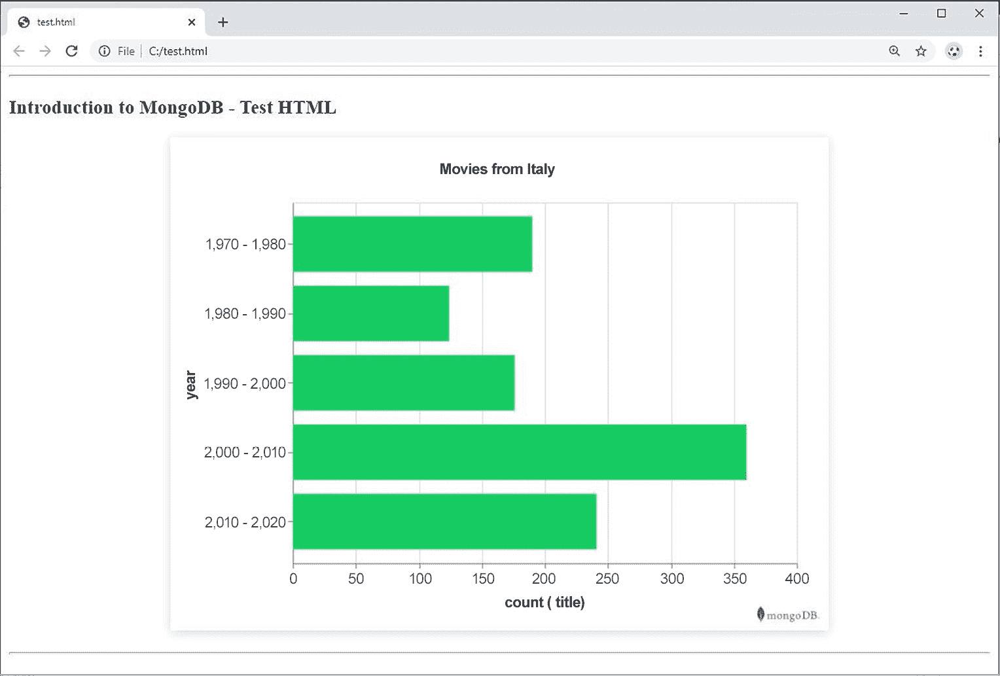

图 12.50：浏览器视图

这个练习是 MongoDB 图表如何集成到 HTML 网页中的一个很好的例子，这样内容在数据变化时可以动态更新。在这种情况下，如果数据库记录被更新并且图表被改变，网页也将在 1 分钟的间隔后更新，以反映这些变化。

在本节中，我们已经讨论了图表展示和与外部应用集成的选项。在大多数业务用例中，静态图像不适用于动态网页内容和应用程序。MongoDB 的`嵌入图表`选项允许用户在演示文稿和 Web 应用程序中集成图表。安全和非安全的图表发布选项都是可用的。然而，对于数据敏感的演示文稿，应始终使用安全选项。

## 活动 12.01：创建销售演示仪表板

在这个活动中，您将从样本数据库中创建一个新的销售统计图表。具体来说，分析必须帮助确定科罗拉多州丹佛市的销售，基于销售项目类型。以下步骤将帮助您完成此活动：

1.  创建一个甜甜圈图表，以绘制每个销售项目的销售总额。

1.  从`sample_supplies`数据库创建一个新的数据源。

1.  过滤数据，使报告中只考虑来自丹佛商店的文档。图表应显示一个甜甜圈，显示前 10 个项目（按价值），并应命名为`丹佛销售（百万美元）`。

1.  使用图表标签格式化以显示以百万为单位的值，并根据生成的图表解释数据。

最终输出应如下所示：

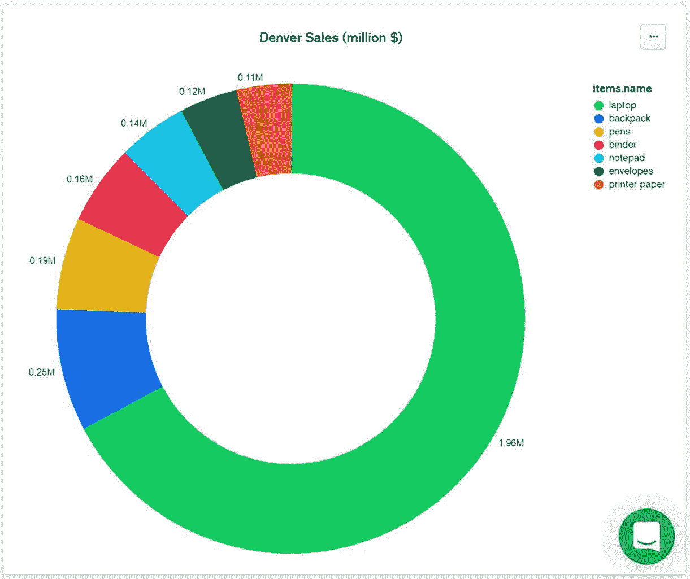

图 12.51：销售图表

注意

此活动的解决方案可以通过此链接找到。

# 总结

这一章与以往的章节不同，它侧重于图表用户界面而不是 MongoDB 编程。使用 Atlas 云图表模块可以实现令人印象深刻的结果，使用户能够专注于数据而不是编程和演示。

有各种图表类型和子类型可供选择，这使得图表更加有效且更易于使用。MongoDB 图表还可以很容易地使用`EMBED CODE`选项与其他 Web 应用程序集成，这对开发人员来说是一个优势，因为他们不需要处理另一个编程模块来在他们的应用程序中绘制图表。在下一章中，我们将看一个业务用例，其中 MongoDB 将用于管理后端。
