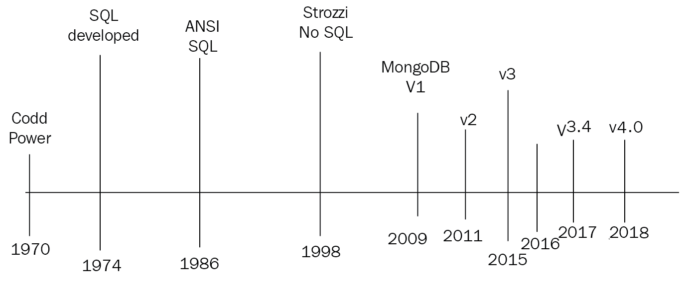
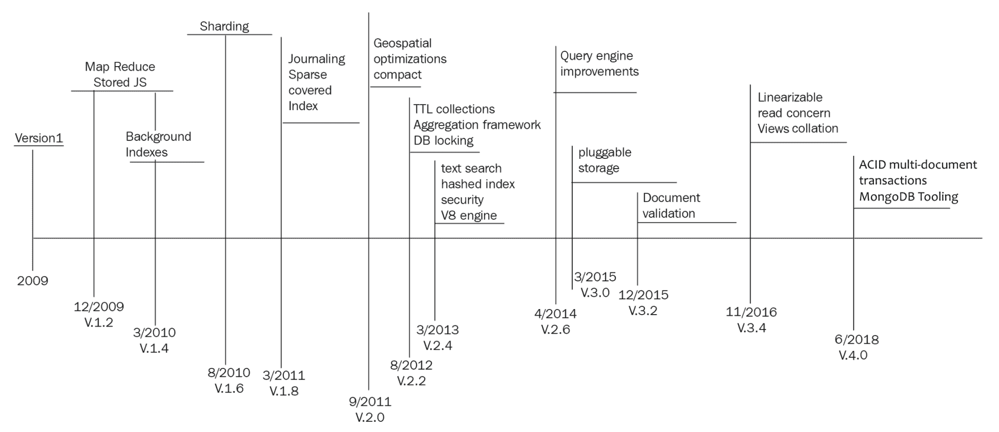

# 第一章：MongoDB - 为现代网络设计的数据库

在本章中，我们将奠定理解 MongoDB 的基础，以及它声称自己是为现代网络设计的数据库。首先学习和知道如何学习同样重要。我们将介绍有关 MongoDB 的最新信息的参考资料，适用于新用户和有经验的用户。我们将涵盖以下主题：

+   SQL 和 MongoDB 的历史和演变

+   从 SQL 和其他 NoSQL 技术用户的角度看 MongoDB

+   MongoDB 的常见用例及其重要性

+   MongoDB 的配置和最佳实践

# 技术要求

您需要安装 MongoDB 版本 4+、Apache Kafka、Apache Spark 和 Apache Hadoop 才能顺利完成本章内容。所有章节中使用的代码可以在以下链接找到：[`github.com/PacktPublishing/Mastering-MongoDB-4.x-Second-Edition`](https://github.com/PacktPublishing/Mastering-MongoDB-4.x-Second-Edition)。

# SQL 和 NoSQL 的演变

**结构化查询语言**（**SQL**）甚至早于万维网出现。E. F. Codd 博士最初在 1970 年 6 月在**计算机协会**（**ACM**）期刊**ACM 通讯**上发表了题为《用于大型共享数据库的关系数据模型》的论文。SQL 最初是由 IBM 的 Chamberlin 和 Boyce 于 1974 年开发的。关系软件（现在是 Oracle 公司）是第一个开发出商业可用的 SQL 实现的公司，目标是美国政府机构。

第一个**美国国家标准学会**（**ANSI**）SQL 标准于 1986 年发布。自那时起，已经进行了八次修订，最近一次是在 2016 年发布的（SQL:2016）。

SQL 在万维网刚开始时并不特别受欢迎。静态内容可以直接硬编码到 HTML 页面中而不费吹灰之力。然而，随着网站功能的增长，网站管理员希望生成由离线数据源驱动的网页内容，以便生成随时间变化而变化的内容，而无需重新部署代码。

**通用网关接口**（**CGI**）脚本，开发 Perl 或 Unix shell，驱动着 Web 1.0 时期的数据库驱动网站。随着 Web 2.0 的出现，网络从直接将 SQL 结果注入浏览器发展到使用两层和三层架构，将视图与业务和模型逻辑分离，使得 SQL 查询可以模块化并与网络应用的其余部分隔离开来。

另一方面，**Not only SQL**（**NoSQL**）是更现代的，是在 Web 2.0 技术兴起的同时出现的。该术语最早由 Carlo Strozzi 于 1998 年创造，用于描述他的开源数据库，该数据库不遵循 SQL 标准，但仍然是关系型的。

这并不是我们当前对 NoSQL 数据库的期望。Johan Oskarsson 在当时是 Last.fm 的开发人员，于 2009 年初重新引入了这个术语，以便对一组正在开发的分布式、非关系型数据存储进行分组。其中许多是基于 Google 的**Bigtable**和**MapReduce**论文，或者是亚马逊的**DynamoDB**，这是一个高度可用的基于键值的存储系统。

NoSQL 的基础建立在放松的**原子性、一致性、隔离性**和**持久性**（**ACID**）属性上，这些属性保证了性能、可伸缩性、灵活性和降低了复杂性。大多数 NoSQL 数据库在提供尽可能多的上述特性方面都有所作为，甚至为开发人员提供可调整的保证。以下图表描述了 SQL 和 NoSQL 的演变：

# MongoDB 的演变

10gen 于 2007 年开始开发云计算堆栈，并很快意识到最重要的创新是围绕他们构建的面向文档的数据库，即 MongoDB。MongoDB 最初于 2009 年 8 月 27 日发布。

MongoDB 的第 1 版在功能、授权和 ACID 保证方面非常基础，但通过性能和灵活性弥补了这些缺点。

在接下来的章节中，我们将突出 MongoDB 的主要功能，以及它们引入的版本号。

# 版本 1.0 和 1.2 的主要功能集

版本 1.0 和 1.2 的不同特性如下：

+   基于文档的模型

+   全局锁（进程级）

+   集合索引

+   文档的 CRUD 操作

+   无需认证（认证在服务器级别处理）

+   主从复制

+   `MapReduce`（自 v1.2 引入）

+   存储 JavaScript 函数（自 v1.2 引入）

# 第 2 版

第 2.0 版的不同特性如下：

+   后台索引创建（自 v1.4 以来）

+   分片（自 v1.6 以来）

+   更多的查询操作符（自 v1.6 以来）

+   日志记录（自 v1.8 以来）

+   稀疏和覆盖索引（自 v1.8 以来）

+   紧凑命令以减少磁盘使用

+   内存使用更高效

+   并发改进

+   索引性能增强

+   副本集现在更可配置，并且数据中心感知

+   `MapReduce`改进

+   认证（自 2.0 版，用于分片和大多数数据库命令）

+   引入地理空间功能

+   聚合框架（自 v2.2 以来）和增强（自 v2.6 以来）

+   TTL 集合（自 v2.2 以来）

+   并发改进，其中包括 DB 级别锁定（自 v2.2 以来）

+   文本搜索（自 v2.4 以来）和集成（自 v2.6 以来）

+   哈希索引（自 v2.4 以来）

+   安全增强和基于角色的访问（自 v2.4 以来）

+   V8 JavaScript 引擎取代 SpiderMonkey（自 v2.4 以来）

+   查询引擎改进（自 v2.6 以来）

+   可插拔存储引擎 API

+   引入 WiredTiger 存储引擎，具有文档级锁定，而以前的存储引擎（现在称为 MMAPv1）支持集合级锁定

# 第 3 版

3.0 版本的不同特性如下：

+   复制和分片增强（自 v3.2 以来）

+   文档验证（自 v3.2 以来）

+   聚合框架增强操作（自 v3.2 以来）

+   多个存储引擎（自 v3.2 以来，仅适用于企业版）

+   查询语言和索引排序（自 v3.4 以来）

+   只读数据库视图（自 v3.4 以来）

+   线性读关注（自 v3.4 以来）

# 第 4 版

4.0 版本的不同特性如下：

+   多文档 ACID 事务

+   变更流

+   MongoDB 工具（Stitch、Mobile、Sync 和 Kubernetes Operator）

以下图表显示了 MongoDB 的演变：

正如我们所看到的，第 1 版非常基础，而第 2 版引入了当前版本中的大多数功能，如分片、可用和特殊索引、地理空间功能以及内存和并发改进。

从第 2 版到第 3 版的过程中，聚合框架被引入，主要作为老化的（并且从未达到专用框架（如 Hadoop）的水平）MapReduce 框架的补充。然后，添加了文本搜索，并且慢慢但确定地，该框架正在改进性能、稳定性和安全性，以适应使用 MongoDB 的客户的不断增加的企业负载。

随着 WiredTiger 在第 3 版中的引入，对于 MongoDB 来说，锁定不再是一个问题，因为它从进程（全局锁）降至文档级别，几乎是可能的最粒度级别。

第 4 版标志着一个重大转变，通过引入多文档 ACID 事务，将 SQL 和 NoSQL 世界联系起来。这使得更广泛范围的应用程序可以使用 MongoDB，特别是需要强大的实时一致性保证的应用程序。此外，引入变更流允许使用 MongoDB 的实时应用程序更快地上市。还引入了一系列工具，以便于无服务器、移动和物联网开发。

在当前状态下，MongoDB 是一个可以处理从初始 MVP 和 POC 到拥有数百台服务器的企业应用程序的数据库。

# SQL 开发人员的 MongoDB

MongoDB 是在 Web 2.0 时代开发的。那时，大多数开发人员一直在使用 SQL 或他们选择的语言中的**对象关系映射**（**ORM**）工具来访问关系型数据库的数据。因此，这些开发人员需要一种从他们的关系背景中轻松了解 MongoDB 的方法。

值得庆幸的是，已经有几次尝试制作 SQL 到 MongoDB 的速查表，解释了 SQL 术语中的 MongoDB 术语。

在更高的层次上，我们有以下内容：

+   数据库和索引（SQL 数据库）

+   集合（SQL 表）

+   文档（SQL 行）

+   字段（SQL 列）

+   嵌入和链接文档（SQL 连接）

以下是一些常见操作的更多示例：

| **SQL** | **MongoDB** |
| --- | --- |
| 数据库 | 数据库 |
| 表 | 集合 |
| 索引 | 索引 |
| 行 | 文档 |
| 列 | 字段 |
| 连接 | 嵌入文档或通过`DBRef`链接 |
| `CREATE TABLE employee (name VARCHAR(100))` | `db.createCollection("employee")` |
| `INSERT INTO employees VALUES (Alex, 36)` | `db.employees.insert({name: "Alex", age: 36})` |
| `SELECT * FROM employees` | `db.employees.find()` |
| `SELECT * FROM employees LIMIT 1` | `db.employees.findOne()` |
| `SELECT DISTINCT name FROM employees` | `db.employees.distinct("name")` |
| `UPDATE employees SET age = 37 WHERE name = 'Alex'` | `db.employees.update({name: "Alex"}, {$set: {age: 37}}, {multi: true})` |
| `DELETE FROM employees WHERE name = 'Alex'` | `db.employees.remove({name: "Alex"})` |
| `CREATE INDEX ON employees (name ASC)` | `db.employees.ensureIndex({name: 1})` |

更多常见操作的示例可在[`s3.amazonaws.com/info-mongodb-com/sql_to_mongo.pd`](http://s3.amazonaws.com/info-mongodb-com/sql_to_mongo.pdf)[f](http://s3.amazonaws.com/info-mongodb-com/sql_to_mongo.pdf)[.](http://s3.amazonaws.com/info-mongodb-com/sql_to_mongo.pdf)中查看。

# NoSQL 开发人员的 MongoDB

随着 MongoDB 从一种小众数据库解决方案发展为 NoSQL 技术的瑞士军刀，越来越多的开发人员从 NoSQL 背景转向它。

将 SQL 转换为 NoSQL 的差异放在一边，面对最大挑战的是列式数据库的用户。随着 Cassandra 和 HBase 成为最受欢迎的列式数据库管理系统，我们将研究它们之间的差异以及开发人员如何将系统迁移到 MongoDB。MongoDB 针对 NoSQL 开发人员的不同特性如下：

+   **灵活性**：MongoDB 的文档概念可以包含在复杂层次结构中嵌套的子文档，这真的很表达和灵活。这类似于 MongoDB 和 SQL 之间的比较，但 MongoDB 更容易地映射到任何编程语言的普通对象，从而实现轻松的部署和维护。 

+   **灵活的查询模型**：用户可以选择性地索引每个文档的某些部分；基于属性值、正则表达式或范围进行查询；并且应用层可以拥有所需的任意多的对象属性。主索引和辅助索引，以及特殊类型的索引（如稀疏索引），可以极大地提高查询效率。使用 JavaScript shell 和 MapReduce 使大多数开发人员（以及许多数据分析师）能够快速查看数据并获得有价值的见解。

+   **本地聚合**：聚合框架为用户提供了一个**提取、转换、加载**（**ETL**）管道，用户可以从 MongoDB 中提取和转换数据，然后将其加载到新格式中，或者将其从 MongoDB 导出到其他数据源。这也可以帮助数据分析师和科学家在执行数据整理时获得他们需要的数据片段。

+   **无模式模型**：这是 MongoDB 设计理念的结果，它赋予应用程序解释集合文档中不同属性的权力和责任。与 Cassandra 或 HBase 的基于模式的方法相比，在 MongoDB 中，开发人员可以存储和处理动态生成的属性。

# MongoDB 的关键特点和用例

在本节中，我们将分析 MongoDB 作为数据库的特点。了解 MongoDB 提供的功能可以帮助开发人员和架构师评估手头的需求以及 MongoDB 如何帮助实现它们。此外，我们将从 MongoDB，Inc.的经验中介绍一些常见的用例，这些用例为其用户带来了最佳结果。

# 关键特点

MongoDB 已经发展成为一个通用的 NoSQL 数据库，提供了关系型数据库管理系统和 NoSQL 世界的最佳特性。一些关键特点如下：

+   **它是一个通用数据库**：与为特定目的（例如图形数据库）构建的其他 NoSQL 数据库相比，MongoDB 可以为应用程序中的异构负载和多个目的提供服务。在 4.0 版本引入多文档 ACID 事务后，这一点变得更加真实，进一步扩展了它可以有效使用的用例。

+   **灵活的模式设计**：文档导向的方法具有非定义属性，可以在运行时修改，这是 MongoDB 与关系数据库之间的关键对比。

+   **从头开始构建高可用性**：在我们这个五个九的可用性时代，这是必须的。配合服务器故障检测后的自动故障转移，这可以帮助实现高可用性。

+   **功能丰富**：提供全面的 SQL 等效操作符，以及诸如 MapReduce、聚合框架、生存时间和封闭集合、次要索引等功能，MongoDB 可以适应许多用例，无论需求多么多样化。

+   **可扩展性和负载平衡**：它被设计为垂直和（主要）水平扩展。使用分片，架构师可以在不同实例之间共享负载，并实现读写可扩展性。数据平衡通过分片平衡器自动发生（对用户透明）。

+   **聚合框架**：在数据库中内置 ETL 框架意味着开发人员可以在数据离开数据库之前执行大部分 ETL 逻辑，从而在许多情况下消除了复杂数据管道的需求。

+   **本地复制**：数据将在不复杂的设置情况下在副本集之间复制。

+   **安全功能**：考虑到了身份验证和授权，因此架构师可以保护他们的 MongoDB 实例。

+   **用于存储和传输文档的 JSON（BSON 和二进制 JSON）对象**：JSON 在网页前端和 API 通信中被广泛使用，因此当数据库使用相同的协议时会更容易。

+   **MapReduce**：尽管 MapReduce 引擎不像专用框架中那样先进，但它仍然是构建数据管道的好工具。

+   **在 2D 和 3D 中查询和地理空间信息**：对于许多应用程序来说可能并不重要，但如果对于您的用例而言，能够在同一个数据库中进行地理空间计算和数据存储是非常方便的。

+   **多文档 ACID 事务**：从 4.0 版本开始，MongoDB 支持跨多个文档的 ACID 事务。

+   **成熟的工具**：MongoDB 的工具已经发展，支持从 DBaaS 到 Sync、Mobile 和无服务器（Stitch）。

# MongoDB 的用例

由于 MongoDB 是一种非常流行的 NoSQL 数据库，因此已经有几个成功的用例，它成功支持了高质量的应用程序，并且交付时间很短。

许多最成功的用例都集中在以下领域：

+   整合孤立的数据，提供它们的单一视图

+   物联网

+   移动应用

+   实时分析

+   个性化

+   目录管理

+   内容管理

所有这些成功案例都有一些共同特点。我们将尝试按相对重要性的顺序来分解它们。

+   模式灵活性可能是最重要的特性。能够在集合中存储具有不同属性的文档可以帮助在开发阶段和从可能具有不同属性的异构来源摄取数据时。这与关系型数据库形成对比，在关系型数据库中，列需要预定义，而稀疏数据可能会受到惩罚。在 MongoDB 中，这是正常的，也是大多数用例共享的特性。能够深度嵌套属性到文档中，并将值数组添加到属性中，同时能够搜索和索引这些字段，有助于应用程序开发人员利用 MongoDB 的无模式特性。

+   扩展和分片是 MongoDB 用例中最常见的模式。使用内置分片轻松扩展，并使用副本集进行数据复制和卸载主服务器的读取负载，可以帮助开发人员有效地存储数据。

+   许多用例还使用 MongoDB 作为存档数据的一种方式。作为纯数据存储（而不需要定义模式），将数据倾倒到 MongoDB 中以供以后由业务分析人员分析，可以很容易地使用 shell 或一些可以轻松集成 MongoDB 的众多 BI 工具。根据时间限制或文档计数进一步分解数据，可以帮助从 RAM 中提供这些数据集，这是 MongoDB 最有效的用例。

+   将数据集保留在 RAM 中有助于性能，这也是实践中常用的方法。MongoDB 在大多数版本中使用 MMAP 存储（称为 MMAPv1），直到最近的版本，它将数据映射委托给底层操作系统。这意味着大多数基于 GNU/Linux 的系统，与可以存储在 RAM 中的集合一起工作，将大大提高性能。随着可插拔存储引擎的引入，如 WiredTiger（在第八章中将有更多介绍，*监控、备份和安全*），这个问题就不那么严重了。

+   封顶集合也是许多用例中使用的一个特性。封顶集合可以通过文档数量或集合的整体大小来限制集合中的文档。在后一种情况下，我们需要估计每个文档的大小，以便计算有多少文档可以适应我们的目标大小。封顶集合是快速而简单的解决方案，可以回答诸如“给我上一个小时的日志概览”之类的请求，而无需进行维护和运行异步后台作业来清理我们的集合。通常情况下，这些可能被用来快速构建和操作一个排队系统。开发人员可以使用集合来存储消息，然后使用 MongoDB 提供的本地可追加游标来迭代结果，以便在结果堆积并向外部系统提供数据时使用。

+   低运营开销也是许多用例中的常见模式。在敏捷团队中工作的开发人员可以操作和维护 MongoDB 服务器集群，而无需专门的数据库管理员。MongoDB 管理服务（MMS）可以极大地帮助减少管理开销，而 MongoDB Atlas，MongoDB 公司提供的托管解决方案，意味着开发人员不需要处理运营方面的问题。

+   在使用 MongoDB 的业务领域中，几乎所有行业都有各种各样的应用。然而，似乎更多的是在需要处理大量数据，但每个数据点的商业价值相对较低的情况下。例如，物联网等领域可以通过利用可用性而非一致性设计来获益，以成本效益的方式存储来自传感器的大量数据。另一方面，金融服务则绝对需要严格的一致性要求，符合适当的 ACID 特性，这使得 MongoDB 更具挑战性。金融交易可能规模较小，但影响巨大，这意味着我们不能不经过适当处理就放任一个消息。

+   基于位置的数据也是 MongoDB 蓬勃发展的领域之一，Foursquare 是最著名的早期客户之一。MongoDB 提供了丰富的二维和三维地理位置数据功能，包括按距离搜索、地理围栏和地理区域之间的交集等功能。

+   总的来说，丰富的功能集是不同用例中的共同模式。通过提供可以在许多不同行业和应用中使用的功能，MongoDB 可以成为所有业务需求的统一解决方案，为用户提供最小化运营开销的能力，同时在产品开发中快速迭代。

# MongoDB 的批评

MongoDB 的批评与以下几点有关：

+   多年来，MongoDB 一直备受批评。许多开发人员对其 Web 规模的主张持怀疑态度。反驳的观点是大多数情况下并不需要规模化，重点应该放在其他设计考虑上。虽然这有时可能是真的，但这是一个虚假的二分法，在理想的世界中，我们应该兼而有之。MongoDB 尽可能地将可伸缩性与功能、易用性和上市时间结合在一起。

+   MongoDB 的无模式特性也是一个很大的争论点。在许多用例中，无模式可以带来很多好处，因为它允许将异构数据倾入数据库，而无需复杂的清洗，也不会导致大量空列或文本块堆积在单个列中。另一方面，这是一把双刃剑，因为开发人员可能会在集合中拥有许多文档，这些文档在字段上具有松散的语义，而在代码级别提取这些语义可能会变得非常困难。如果我们的模式设计不够理想，我们可能最终得到的是一个数据存储，而不是一个数据库。

+   来自关系型数据库世界的一个经常的抱怨是缺乏适当的 ACID 保证。事实上，如果开发人员需要同时访问多个文档，要保证关系型数据库的特性并不容易，因为没有事务。没有事务，也意味着复杂的写操作需要应用级逻辑来回滚。如果需要更新两个集合中的三个文档以标记一个应用级事务完成，但第三个文档由于某种原因没有被更新，应用程序将需要撤销前两次写操作，这可能并不是一件简单的事情。

+   随着在 4.0 版本中引入多文档事务，MongoDB 可以应对 ACID 事务，但速度会受到影响。虽然这并不理想，事务并不适用于 MongoDB 中的每个 CRUD 操作，但它解决了主要的批评来源。

+   不赞成设置 MongoDB 的默认写入行为，但不在生产环境中进行操作。多年来，默认的写入行为是**写入并忘记**；发送写入操作不会在尝试下一个写入操作之前等待确认，导致写入速度极快，在发生故障时行为不佳。认证也是事后考虑，导致成千上万的 MongoDB 数据库在公共互联网上成为任何想要读取存储数据的人的猎物。尽管这些是有意识的设计决策，但它们影响了开发人员对 MongoDB 的看法。

# MongoDB 配置和最佳实践

在本节中，我们将介绍一些关于操作、模式设计、耐久性、复制、分片和安全性的最佳实践。关于何时实施这些最佳实践的进一步信息将在后面的章节中介绍。

# 运营最佳实践

作为数据库，MongoDB 是为开发人员而构建的，并且是在 Web 时代开发的，因此不需要像传统的关系型数据库管理系统那样多的运营开销。尽管如此，仍然需要遵循一些最佳实践，以积极主动并实现高可用性目标。

按重要性顺序，最佳实践如下：

+   **默认情况下打开日志记录**：日志记录使用预写式日志，以便在 MongoDB 服务器突然关闭时能够恢复。对于 MMAPv1 存储引擎，日志记录应始终打开。对于 WiredTiger 存储引擎，日志记录和检查点一起使用，以确保数据的耐久性。无论如何，使用日志记录并调整日志和检查点的大小和频率，以避免数据丢失，是一个好习惯。在 MMAPv1 中，默认情况下，日志每 100 毫秒刷新到磁盘一次。如果 MongoDB 在确认写操作之前等待日志记录，那么日志将在 30 毫秒内刷新到磁盘。

+   **您的工作集应该适合内存**：再次强调，特别是在使用 MMAPv1 时，工作集最好小于底层机器或虚拟机的 RAM。MMAPv1 使用来自底层操作系统的内存映射文件，如果 RAM 和磁盘之间没有太多的交换发生，这可能是一个很大的好处。另一方面，WiredTiger 在使用内存方面效率更高，但仍然极大地受益于相同的原则。工作集最大是由`db.stats()`报告的数据大小加上索引大小。

+   **注意数据文件的位置**：数据文件可以通过使用`--dbpath`命令行选项挂载到任何位置。确保数据文件存储在具有足够磁盘空间的分区中，最好是 XFS，或至少是**Ext4**，这一点非常重要。

+   **保持与版本的更新**：即使是主要编号的版本也是稳定的。因此，3.2 是稳定的，而 3.3 不是。在这个例子中，3.3 是将最终实现为稳定版本 3.4 的开发版本。始终更新到最新的安全更新版本（在撰写本书时为 4.0.2），并在下一个稳定版本发布时考虑更新（在这个例子中为 4.2）是一个好习惯。

+   **使用 Mongo MMS 图形监控您的服务**：免费的 MongoDB，Inc.监控服务是一个很好的工具，可以概览 MongoDB 集群、通知和警报，并积极应对潜在问题。

+   **如果您的指标显示出重度使用，请扩展规模**：不要等到为时已晚。利用超过 65%的 CPU 或 RAM，或开始注意到磁盘交换，都应该是开始考虑扩展的门槛，可以通过垂直扩展（使用更大的机器）或水平扩展（通过分片）。

+   分片时要小心：分片是对分片键的强烈承诺。如果做出错误决定，从操作角度来看可能会非常困难。在设计分片时，架构师需要深入考虑当前的工作负载（读/写）以及当前和预期的数据访问模式。

+   使用由 MongoDB 团队维护的应用程序驱动程序：这些驱动程序得到支持，并且往往比没有官方支持的驱动程序更新得更快。如果 MongoDB 尚不支持您使用的语言，请在 MongoDB 的 JIRA 跟踪系统中提交工单。

+   定期备份计划：无论您使用独立服务器、副本集还是分片，都应该使用定期备份策略作为第二级防止数据丢失的保护。XFS 是一个很好的文件系统选择，因为它可以执行快照备份。

+   手动备份应该避免：在可能的情况下应该使用定期自动备份。如果我们需要进行手动备份，那么我们可以使用副本集中的隐藏成员来进行备份。我们必须确保在该成员上使用`db.fsyncwithlock`，以获得节点的最大一致性，同时打开日志记录。如果这个卷在 AWS 上，我们可以立即进行 EBS 快照备份。

+   启用数据库访问控制：绝对不要在生产系统中放入没有访问控制的数据库。访问控制应该在节点级别实施，通过一个适当的防火墙，只允许特定应用服务器访问数据库，并在数据库级别使用内置角色或定义自定义角色。这必须在启动时使用`--auth`命令行参数进行初始化，并可以通过`admin`集合进行配置。

+   使用真实数据测试部署：由于 MongoDB 是一个无模式、面向文档的数据库，您可能有具有不同字段的文档。这意味着与关系数据库管理系统相比，使用尽可能接近生产数据的数据进行测试更加重要。具有意外值的额外字段的文档可能会导致应用程序在运行时顺利工作或崩溃之间的差异。尝试使用生产级数据部署一个分级服务器，或者至少在分级中使用适当的库（例如 Ruby 的 Faker）伪造生产数据。

# 模式设计最佳实践

MongoDB 是无模式的，您必须设计您的集合和索引以适应这一事实：

+   早期和频繁地建立索引：使用 MMS、Compass GUI 或日志识别常见的查询模式，并在项目开始时尽可能多地建立这些索引。

+   消除不必要的索引：与前面的建议有些相悖，监视数据库的查询模式变化，并删除未被使用的索引。索引将消耗内存和 I/O，因为它需要与数据库中的文档一起存储和更新。使用聚合管道和`$indexStats`，开发人员可以识别很少被使用的索引并将其删除。

+   使用复合索引，而不是索引交集：使用多个谓词（*A*和*B*，*C*或*D*和*E*等）进行查询，通常使用单个复合索引比使用多个简单索引更好。此外，复合索引将其数据按字段排序，我们可以在查询时利用这一点。在字段*A*、*B*和*C*上的索引将用于查询*A*、*(A,B)*、*(A,B,C)*，但不用于查询*(B,C)*或*(C)*。

+   低选择性索引：例如，在性别字段上建立索引，统计上会返回一半的文档，而在姓氏上建立索引只会返回少量具有相同姓氏的文档。

+   **使用正则表达式**：同样，由于索引是按值排序的，使用具有前置通配符的正则表达式（即`/.*BASE/`）将无法使用索引。使用具有尾随通配符的正则表达式（即`/DATA.*/`）可能是有效的，只要表达式中有足够的区分大小写的字符。

+   **避免在查询中使用否定**：索引是对值进行索引，而不是它们的缺失。在查询中使用`NOT`可能导致对整个表的扫描，而不是使用索引。

+   **使用部分索引**：如果我们需要对集合中的一部分文档进行索引，部分索引可以帮助我们最小化索引集并提高性能。部分索引将包括我们在所需查询中使用的过滤器上的条件。

+   **使用文档验证**：使用文档验证来监视插入文档中的新属性，并决定如何处理它们。通过将文档验证设置为警告，我们可以保留在设计阶段未预期插入具有任意属性的文档的日志，并决定这是设计的错误还是特性。

+   **使用 MongoDB Compass**：MongoDB 的免费可视化工具非常适合快速了解我们的数据以及随时间的增长。

+   **尊重 16MB 的最大文档大小**：MongoDB 的最大文档大小为 16MB。这是一个相当慷慨的限制，但在任何情况下都不应违反。允许文档无限增长不应是一个选项，尽管嵌入文档可能是高效的，但我们应始终记住这应该是受控制的。

+   **使用适当的存储引擎**：自 MongoDB 3.2 版本以来，MongoDB 引入了几个新的存储引擎。内存存储引擎应用于实时工作负载，而加密存储引擎应该是在对数据安全性有严格要求时的首选引擎。

# 写入耐久性的最佳实践

在 MongoDB 中，写入耐久性可以进行微调，并且根据我们的应用程序设计，应尽可能严格，而不影响我们的性能目标。

在 WiredTiger 存储引擎中微调数据并将其刷新到磁盘间隔，默认情况下是在最后一个检查点后每 60 秒将数据刷新到磁盘，或者在写入 2GB 数据后。这可以通过使用`--wiredTigerCheckpointDelaySecs`命令行选项进行更改。

在 MMAPv1 中，数据文件每 60 秒刷新到磁盘。这可以通过使用`--syncDelay`命令行选项进行更改。我们还可以执行各种任务，例如以下内容：

+   使用 WiredTiger，我们可以使用 XFS 文件系统进行多磁盘一致的快照

+   我们可以在数据卷中关闭`atime`和`diratime`

+   您可以确保有足够的交换空间（通常是内存大小的两倍）

+   如果在虚拟化环境中运行，可以使用 NOOP 调度程序

+   我们可以将文件描述符限制提高到数万个

+   我们可以禁用透明大页，并启用标准的 4-KVM 页

+   写入安全性应至少记录

+   SSD 读取默认应设置为 16 个块；HDD 应设置为 32 个块

+   我们可以在 BIOS 中关闭 NUMA

+   我们可以使用 RAID 10

+   您可以使用 NTP 同步主机之间的时间，特别是在分片环境中

+   只使用 64 位构建用于生产；32 位构建已过时，只能支持最多 2GB 的内存

# 复制的最佳实践

副本集是 MongoDB 提供冗余、高可用性和更高读取吞吐量的机制，在适当的条件下。在 MongoDB 中，复制易于配置并专注于操作术语：

+   **始终使用副本集**：即使您的数据集目前很小，而且您不指望它呈指数增长，您也永远不知道什么时候会发生。此外，至少有三个服务器的副本集有助于设计冗余，将工作负载分开为实时和分析（使用次要服务器），并从一开始就构建数据冗余。

+   **充分利用副本集**：副本集不仅用于数据复制。我们可以（而且在大多数情况下应该）使用主服务器进行写入，并从其中一个次要服务器进行偏好读取，以卸载主服务器。这可以通过为读取设置读取偏好和正确的写入关注来实现，以确保写入按需传播。

+   在 MongoDB 副本集中使用奇数个副本：如果一个服务器宕机或者与其他服务器失去连接（网络分区），其他服务器必须投票选举出主服务器。如果我们有奇数个副本集成员，我们可以保证每个服务器子集知道它们属于大多数还是少数的副本集成员。如果我们不能有奇数个副本，我们需要设置一个额外的主机作为仲裁者，唯一目的是在选举过程中进行投票。即使是 EC2 中的微型实例也可以完成这个任务。

# 分片的最佳实践

分片是 MongoDB 的水平扩展解决方案。在第八章中，*监控、备份和安全*，我们将更详细地介绍其使用，但以下是一些基于基础数据架构的最佳实践：

+   **考虑查询路由**：根据不同的分片键和技术，`mongos`查询路由器可能会将查询发送到一些（或全部）分片成员。在设计分片时，考虑我们的查询非常重要，这样我们的查询就不会命中所有的分片。

+   **使用标签感知分片**：标签可以在分片之间提供更精细的数据分布。使用每个分片的正确标签集，我们可以确保数据子集存储在特定的分片集中。这对于应用服务器、MongoDB 分片和用户之间的数据接近可能非常有用。

# 安全最佳实践

安全始终是多层次的方法，这些建议只是一些基本的需要在任何 MongoDB 数据库中完成的事项，它们并不构成详尽的清单：

+   应该禁用 HTTP 状态接口。

+   RESTful API 应该被禁用。

+   JSON API 应该被禁用。

+   使用 SSL 连接到 MongoDB。

+   审计系统活动。

+   使用专用系统用户访问 MongoDB，并具有适当的系统级访问权限。

+   如果不需要，禁用服务器端脚本。这将影响 MapReduce、内置的`db.group()`命令和`$where`操作。如果这些在您的代码库中没有使用，最好在启动时使用`--noscripting`参数禁用服务器端脚本。

# AWS 的最佳实践

当我们使用 MongoDB 时，我们可以在数据中心使用自己的服务器，使用 MongoDB Atlas 等 MongoDB 托管解决方案，或者通过 EC2 从亚马逊获取实例。EC2 实例是虚拟化的，并以透明的方式共享资源，在同一物理主机上放置 VM。因此，如果您选择这条路线，还有一些其他考虑因素需要考虑，如下所示：

+   使用 EBS 优化的 EC2 实例。

+   获取具有预留 IOPS 的 EBS 卷，以实现一致的性能。

+   使用 EBS 快照进行备份和恢复。

+   为了实现高可用性，可以使用不同的可用性区域，为了灾难恢复，可以使用不同的地区。在每个亚马逊提供的地区内使用不同的可用性区域可以保证我们的数据具有高可用性。不同的地区应该只用于灾难恢复，以防发生灾难性事件摧毁整个地区。一个地区可能是 EU-West-2（伦敦），而一个可用性区域是地区内的一个细分；目前，伦敦有两个可用性区域。

+   全球部署；本地访问。

+   对于真正的全球应用程序，用户来自不同的时区，我们应该在不同的地区拥有应用服务器，访问距离他们最近的数据，使用正确的读取偏好配置在每个服务器上。

# 参考文档

阅读一本书很棒（阅读这本书更棒），但持续学习是保持与 MongoDB 最新的方式。在接下来的章节中，我们将强调您应该去哪里获取更新和开发/运营参考资料。

# MongoDB 文档

[`docs.mongodb.com/manual/`](https://docs.mongodb.com/manual/)上的在线文档是每个开发人员的起点，无论是新手还是老手。

JIRA 跟踪器是查看已修复的错误和即将推出的功能的好地方：[`jira.mongodb.org/browse/SERVER/`](https://jira.mongodb.org/browse/SERVER/)。

# Packt 参考资料

关于 MongoDB 的其他好书如下：

+   *面向 Java 开发人员的 MongoDB*，Francesco Marchioni 著

+   *MongoDB 数据建模*，Wilson da Rocha França 著

+   Kristina Chodorow 的任何一本书

# 进一步阅读

MongoDB 用户组（[`groups.google.com/forum/#!forum/mongodb-user`](https://groups.google.com/forum/#!forum/mongodb-user)）有一个很好的用户问题存档，涉及功能和长期存在的错误。当某些功能不如预期时，这是一个可以去的地方。

在线论坛（Stack Overflow 和 Reddit 等）始终是知识的来源，但需要注意的是，某些内容可能是几年前发布的，可能已经不适用。在尝试之前一定要检查。

最后，MongoDB 大学是保持您的技能最新并了解最新功能和增加的好地方：[`university.mongodb.com/`](https://university.mongodb.com/)。

# 总结

在本章中，我们开始了我们的网络、SQL 和 NoSQL 技术之旅，从它们的起源到它们的当前状态。我们确定了 MongoDB 如何在多年来塑造 NoSQL 数据库的世界，以及它如何与其他 SQL 和 NoSQL 解决方案相比。

我们探讨了 MongoDB 的关键特性以及 MongoDB 在生产部署中的使用情况。我们确定了设计、部署和操作 MongoDB 的最佳实践。

最初，我们确定了如何通过查阅文档和在线资源来学习，这些资源可以帮助我们了解最新的功能和发展动态。

在下一章中，我们将深入探讨模式设计和数据建模，看看如何通过使用官方驱动程序和对象文档映射（ODM）来连接到 MongoDB，这是一种用于 NoSQL 数据库的对象关系映射器的变体。
