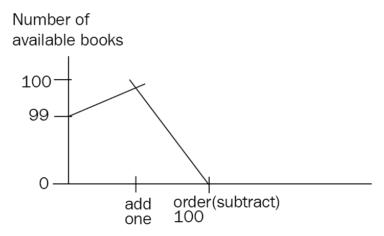
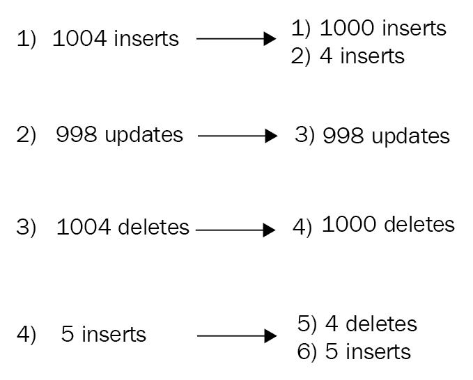
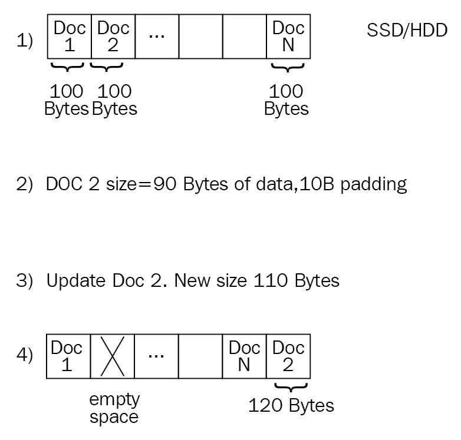

# 第三章：MongoDB CRUD 操作

在本章中，我们将学习如何使用 mongo shell 进行数据库管理操作。从简单的**创建**、**读取**、**更新**和**删除**（CRUD）操作开始，我们将掌握从 shell 进行脚本编写。我们还将学习如何从 shell 编写 MapReduce 脚本，并将其与聚合框架进行对比，我们将在第六章中深入探讨聚合。最后，我们将探讨使用 MongoDB 社区及其付费版本企业版进行身份验证和授权。

在本章中，我们将涵盖以下主题：

+   +   使用 shell 进行 CRUD

+   管理

+   聚合框架

+   保护 shell

+   使用 MongoDB 进行身份验证

# 使用 shell 进行 CRUD

mongo shell 相当于关系数据库使用的管理控制台。连接到 mongo shell 就像输入以下代码一样简单：

```go
$ mongo
```

对于独立服务器或副本集，请在命令行上键入此代码。在 shell 中，您可以通过输入以下代码简单查看可用的数据库：

```go
$ db
```

然后，您可以通过输入以下代码连接到数据库：

```go
> use <database_name>
```

mongo shell 可用于查询和更新我们的数据库中的数据。可以通过以下方式将此文档插入到`books`集合中：

```go
> db.books.insert({title: 'mastering mongoDB', isbn: '101'})
WriteResult({ "nInserted" : 1 })
```

然后，我们可以通过输入以下内容从名为`books`的集合中查找文档：

```go
> db.books.find()
{ "_id" : ObjectId("592033f6141daf984112d07c"), "title" : "mastering mongoDB", "isbn" : "101" }
```

我们从 MongoDB 得到的结果告诉我们写入成功，并在数据库中插入了一个新文档。

删除这个文档有类似的语法，并导致以下代码的结果：

```go
> db.books.remove({isbn: '101'})
WriteResult({ "nRemoved" : 1 })
```

您可以尝试按照以下代码块中所示更新相同的文档：

```go
> db.books.update({isbn:'101'}, {price: 30})
WriteResult({ "nMatched" : 1, "nUpserted" : 0, "nModified" : 1 })
> db.books.find()
{ "_id" : ObjectId("592034c7141daf984112d07d"), "price" : 30 }
```

在这里，我们注意到了一些事情：

+   `update`命令中的类似 JSON 格式的字段是我们搜索要更新的文档的查询

+   `WriteResult`对象通知我们查询匹配了一个文档并修改了一个文档

+   最重要的是，该文档的内容完全被第二个类似 JSON 格式的字段的内容替换，但我们丢失了`title`和`isbn`的信息

默认情况下，MongoDB 中的`update`命令将使用我们在第二个参数中指定的文档替换我们文档的内容。如果我们想要更新文档并向其添加新字段，我们需要使用`$set`运算符，如下所示：

```go
> db.books.update({isbn:'101'}, {$set: {price: 30}})
WriteResult({ "nMatched" : 1, "nUpserted" : 0, "nModified" : 1 })
```

现在，我们的文档与我们的预期相匹配：

```go
> db.books.find()
{ "_id" : ObjectId("592035f6141daf984112d07f"), "title" : "mastering mongoDB", "isbn" : "101", "price" : 30 }
```

但是，删除文档可以通过多种方式完成，最简单的方式是通过其唯一的`ObjectId`：

```go
> db.books.remove("592035f6141daf984112d07f")
WriteResult({ "nRemoved" : 1 })
> db.books.find()
>
```

您可以在这里看到，当没有结果时，mongo shell 除了 shell 提示本身之外不会返回任何内容：`>`。

# 为 mongo shell 编写脚本

使用内置命令管理数据库是有帮助的，但这并不是使用 shell 的主要原因。mongo shell 的真正强大之处在于它是一个 JavaScript shell。

我们可以在 shell 中声明和分配变量，如下所示：

```go
> var title = 'MongoDB in a nutshell'
> title
MongoDB in a nutshell
> db.books.insert({title: title, isbn: 102})
WriteResult({ "nInserted" : 1 })
> db.books.find()
{ "_id" : ObjectId("59203874141daf984112d080"), "title" : "MongoDB in a nutshell", "isbn" : 102 }
```

在前面的例子中，我们声明了一个名为`title`的新变量，值为`MongoDB in a nutshell`，并使用该变量将一个新文档插入到我们的`books`集合中，如下面的代码所示。

由于它是一个 JavaScript shell，我们可以使用它来生成复杂结果的函数和脚本：

```go
> queryBooksByIsbn = function(isbn) { return db.books.find({isbn: isbn})}
```

使用这个一行代码，我们创建了一个名为`queryBooksByIsbn`的新函数，它接受一个参数，即`isbn`值。有了我们在集合中的数据，我们可以使用我们的新函数并按`isbn`获取书籍，如下面的代码所示：

```go
> queryBooksByIsbn("101")
{ "_id" : ObjectId("592035f6141daf984112d07f"), "title" : "mastering mongoDB", "isbn" : "101", "price" : 30 }
```

使用 shell，我们可以编写和测试这些脚本。一旦我们满意，我们可以将它们存储在`.js`文件中，并直接从命令行调用它们：

```go
$ mongo <script_name>.js
```

以下是关于这些脚本的默认行为的一些有用注释：

+   写操作将使用默认的写关注`1`，这是 MongoDB 当前版本的全局默认值。写关注`1`将请求确认写操作已传播到独立的`mongod`服务器或副本集中的主服务器。

+   要将脚本中的操作结果返回到标准输出，我们必须使用 JavaScript 的内置`print()`函数或 mongo 特定的`printjson()`函数，它以 JSON 格式打印出结果。

# 脚本编写 mongo shell 和直接使用之间的区别

在为 mongo shell 编写脚本时，我们不能使用 shell 助手。MongoDB 的命令，如`use <database_name>`，`show collections`和其他助手内置在 shell 中，因此无法从 JavaScript 上下文中使用，而我们的脚本将在其中执行。幸运的是，有它们的等价物可以从 JavaScript 执行上下文中使用，如下表所示：

| **Shell helpers** | **JavaScript equivalents** |
| --- | --- |
| `show dbs, show databases` | `db.adminCommand('listDatabases')` |
| `use <database_name>` | `db = db.getSiblingDB('<database_name>')` |
| `show collections` | `db.getCollectionNames()` |
| `show users` | `db.getUsers()` |
| `show roles` | `db.getRoles({showBuiltinRoles: true})` |
| `show log <logname>` | `db.adminCommand({ 'getLog' : '<logname>' })` |
| `show logs` | `db.adminCommand({ 'getLog' : '*' })` |

| `it` | `cursor = db.collection.find()` `if ( cursor.hasNext() ){`

` cursor.next();`

`}` |

在上表中，`it`是迭代光标，当我们查询并返回太多结果以显示在一个批处理中时，mongo shell 返回的。

使用 mongo shell，我们可以编写几乎任何我们从客户端编写的脚本，这意味着我们有一个非常强大的原型工具，可以快速了解我们的数据。

# 使用 shell 进行批量插入

在使用 shell 时，我们经常需要以编程方式插入大量文档。由于我们有一个 JavaScript shell，最直接的实现方式是通过循环迭代，逐步生成每个文档，并在每次循环迭代中执行写操作，如下所示：

```go
> authorMongoFactory = function() {for(loop=0;loop<1000;loop++) {db.books.insert({name: "MongoDB factory book" + loop})}}
function () {for(loop=0;loop<1000;loop++) {db.books.insert({name: "MongoDB factory book" + loop})}}
```

在这个简单的例子中，我们为一个作者创建了一个`authorMongoFactory()`方法，他写了`1000`本关于 MongoDB 的书，每本书的名字略有不同：

```go
> authorMongoFactory()
```

这将导致向数据库发出`1000`次写入。虽然从开发的角度来看很简单，但这种方法会给数据库带来压力。

相反，使用`bulk`写入，我们可以使用事先准备好的`1000`个文档发出单个数据库`insert`命令，如下所示：

```go
> fastAuthorMongoFactory = function() {
var bulk = db.books.initializeUnorderedBulkOp();
for(loop=0;loop<1000;loop++) {bulk.insert({name: "MongoDB factory book" + loop})}
bulk.execute();
}
```

最终结果与之前相同，在我们的`books`集合中插入了`1000`个文档，结构如下：

```go
> db.books.find()
{ "_id" : ObjectId("59204251141daf984112d851"), "name" : "MongoDB factory book0" }
{ "_id" : ObjectId("59204251141daf984112d852"), "name" : "MongoDB factory book1" }
{ "_id" : ObjectId("59204251141daf984112d853"), "name" : "MongoDB factory book2" }
…
{ "_id" : ObjectId("59204251141daf984112d853"), "name" : "MongoDB factory book999" }
```

从用户的角度来看，区别在于执行速度和对数据库的减轻压力。

在前面的例子中，我们使用了`initializeUnorderedBulkOp()`来设置`bulk`操作构建器。我们这样做的原因是因为我们不关心插入的顺序与我们使用`bulk.insert()`命令将它们添加到我们的`bulk`变量的顺序相同。

当我们可以确保所有操作彼此无关或幂等时，这是有意义的。

如果我们关心插入的顺序相同，我们可以使用`initializeOrderedBulkOp()`；通过更改函数的第二行，我们得到以下代码片段：

```go
var bulk = db.books.initializeOrderedBulkOp();
```

# 使用 mongo shell 进行批量操作

在插入的情况下，我们通常可以期望操作的顺序并不重要。

然而，`bulk`可以用于比插入更多的操作。在下面的例子中，我们在`bookOrders`集合中有一本书，`isbn：101`，`name`为`Mastering MongoDB`，在`available`字段中有可购买的可用副本数量，有`99`本可供购买：

```go
> db.bookOrders.find()
{ "_id" : ObjectId("59204793141daf984112dc3c"), "isbn" : 101, "name" : "Mastering MongoDB", "available" : 99 }
```

通过一系列操作在单个`bulk`操作中，我们将向库存中添加一本书，然后订购`100`本书，最终总共可用的副本为零：

```go
> var bulk = db.bookOrders.initializeOrderedBulkOp();
> bulk.find({isbn: 101}).updateOne({$inc: {available : 1}});
> bulk.find({isbn: 101}).updateOne({$inc: {available : -100}});
> bulk.execute();
```

使用代码，我们将得到以下输出：



使用`initializeOrderedBulkOp()`，我们可以确保在订购`100`本书之前添加一本书，以便我们永远不会缺货。相反，如果我们使用`initializeUnorderedBulkOp()`，我们就无法得到这样的保证，我们可能会在添加新书之前收到 100 本书的订单，导致应用程序错误，因为我们没有那么多书来满足订单。

在执行有序操作列表时，MongoDB 将操作分成`1000`个批次，并按操作分组。例如，如果我们有`1002`个插入，`998`个更新，`1004`个删除，最后`5`个插入，我们最终会得到以下结果：

```go
[1000 inserts]
[2 inserts]
[998 updates]
[1000 deletes]
[4 deletes]
[5 inserts] 
```

前面的代码可以解释如下：



这不会影响操作系列，但隐含意味着我们的操作将以`1000`的批次离开数据库。这种行为不能保证在将来的版本中保持不变。

如果我们想要检查`bulk.execute()`命令的执行，我们可以在输入`execute()`后立即发出`bulk.getOperations()`。

自 3.2 版本以来，MongoDB 提供了批量写入的替代命令`bulkWrite()`。

`bulkWrite`参数是我们要执行的操作系列。`WriteConcern`（默认值再次为`1`），以及写操作系列是否应按照它们在数组中出现的顺序应用（默认情况下将按顺序排列）：

```go
> db.collection.bulkWrite(
 [ <operation 1>, <operation 2>, ... ],
 {
 writeConcern : <document>,
 ordered : <boolean>
 }
)
```

以下操作与`bulk`支持的操作相同：

+   `insertOne`

+   `updateOne`

+   `updateMany`

+   `deleteOne`

+   `deleteMany`

+   `replaceOne`

`updateOne`，`deleteOne`和`replaceOne`具有匹配的过滤器；如果它们匹配多个文档，它们只会对第一个文档进行操作。重要的是要设计这些查询，以便它们不匹配多个文档，否则行为将是未定义的。

# 管理

在大多数情况下，使用 MongoDB 应该对开发人员尽可能透明。由于没有模式，因此不需要迁移，通常情况下，开发人员发现自己在数据库世界中花费的时间较少。

也就是说，有几个任务是经验丰富的 MongoDB 开发人员或架构师可以执行以保持 MongoDB 的速度和性能。

管理通常在三个不同的级别上执行，从更通用到更具体：**进程**，**集合**和**索引**。

在进程级别上，有`shutDown`命令来关闭 MongoDB 服务器。

在数据库级别上，我们有以下命令：

+   `dropDatabase`

+   `listCollections`

+   `copyDB`或`clone`以在本地克隆远程数据库

+   `repairDatabase`：当我们的数据库由于不干净的关闭而处于不一致状态时

相比之下，在集合级别上，使用以下命令：

+   `drop`：删除集合

+   `create`：创建集合

+   `renameCollection`：重命名集合

+   `cloneCollection`：将远程集合克隆到我们的本地数据库

+   `cloneCollectionAsCapped`：将集合克隆到新的封顶集合

+   `convertToCapped`：将集合转换为封顶集合

在索引级别上，我们可以使用以下命令：

+   `createIndexes`

+   `listIndexes`

+   `dropIndexes`

+   `reIndex`

我们还将介绍一些更重要的管理命令。

# fsync

MongoDB 通常每 60 秒将所有操作写入磁盘。fsync 将强制数据立即和同步地持久保存到磁盘。

如果我们想备份数据库，我们还需要应用锁。在 fsync 操作时，锁定将阻止所有写入和一些读取。

在几乎所有情况下，最好使用日志记录，并参考我们的备份和恢复技术，这将在第八章*，* *监控、备份和安全*中进行介绍，以获得最大的可用性和性能。

# compact

MongoDB 文档在磁盘上占据指定的空间。如果我们执行一个更新，增加了文档的大小，这可能会导致它被移出存储块的顺序，在存储中创建一个空洞，导致此更新的执行时间增加，并可能导致它在运行查询时被忽略。紧缩操作将对空间进行碎片整理，并减少使用的空间。

我们可以通过添加额外的 10 个字节来更新一个文档，展示它将如何被移动到存储块的末尾，并在物理存储中创建一个空间：



`compact`也可以接受`paddingFactor`参数，如下所示：

```go
> db.runCommand ( { compact: '<collection>', paddingFactor: 2.0 } )
```

`paddingFactor`是每个文档中预分配的空间，范围从`1.0`（即没有填充，这是默认值）到`4.0`，用于计算每个文档空间的`100`字节所需的`300`字节填充。

添加填充可以帮助缓解更新移动文档的问题，但需要更多的磁盘空间来创建每个文档。通过为每个文档添加填充，我们为其分配了更多的空间，这将防止它被移动到预分配的存储空间的末尾，如果我们更新的文档仍然可以适应预分配的存储空间。

# currentOp 和 killOp

`db.currentOp()`将显示数据库中当前正在运行的操作，并尝试终止它。在运行`killOp()`之前，我们需要运行`use admin`命令。毋庸置疑，不建议或建议使用`killOp()`来终止内部 MongoDB 操作，因为数据库可能会处于未定义的状态。`killOp()`命令可以如下使用：

```go
> db.runCommand( { "killOp": 1, "op": <operationId> } )
```

# collMod

`collMod`用于通过修改底层数据库的行为来向集合传递标志。

自版本 3.2 以来，我们可以传递给集合的最有趣的一组标志是文档验证。

文档验证可以指定一组规则，应用于对集合的新更新和插入。这意味着如果修改了当前文档，将会对当前文档进行检查。

如果我们将`validationLevel`设置为`moderate`，我们只能对已经有效的文档应用验证。通过指定`validationAction`，我们可以通过将其设置为`warn`来记录无效的文档，或者通过将其设置为`error`来完全阻止更新。

例如，对于之前的`bookOrders`示例，我们可以在每次插入或更新时设置`isbn`和`name`字段的`validator`，如下面的代码所示：

```go
> db.runCommand( { collMod: "bookOrders",
"validator" : {
 "$and" : [
 {
 "isbn" : {
 "$exists" : true
 }
 },
 {
 "name" : {
 "$exists" : true
 }
 }
 ]
 }
})
```

在这里，我们得到了以下代码：

```go
{ "ok" : 1 }
```

然后，如果我们尝试插入一个只有`isbn`字段的新文档，我们会收到一个错误：

```go
> db.bookOrders.insert({isbn: 102})
WriteResult({
"nInserted" : 0,
"writeError" : {
"code" : 121,
"errmsg" : "Document failed validation"
}
})
>
```

我们收到错误是因为我们的验证失败了。从 shell 中管理验证非常有用，因为我们可以编写脚本来管理它，并确保一切就位。

# touch

`touch`命令将从存储中加载数据和/或索引数据到内存中。如果我们的脚本随后将使用这些数据，这通常是有用的，可以加快执行速度：

```go
> db.runCommand({ touch: "bookOrders", data: true/false, index: true/false })
```

在生产系统中应谨慎使用此命令，因为将数据和索引加载到内存中将会将现有数据从中移除。

# 在 mongo shell 中的 MapReduce

在整个 MongoDB 历史中，一个被低估并且没有得到广泛支持的最有趣的功能之一，是能够在 shell 中原生地编写 MapReduce。

MapReduce 是一种从大量数据中获取聚合结果的数据处理方法。其主要优势在于它本质上是可并行化的，这可以通过 Hadoop 等框架来证明。

当用于实现数据管道时，MapReduce 非常有用。多个 MapReduce 命令可以链接在一起产生不同的结果。一个例子是通过使用不同的报告周期（如小时、天、周、月和年）对数据进行聚合，我们使用每个更精细的报告周期的输出来生成一个不太精细的报告。

在我们的例子中，MapReduce 的一个简单示例是，假设我们的输入书籍集合如下：

```go
> db.books.find()
{ "_id" : ObjectId("592149c4aabac953a3a1e31e"), "isbn" : "101", "name" : "Mastering MongoDB", "price" : 30 }
{ "_id" : ObjectId("59214bc1aabac954263b24e0"), "isbn" : "102", "name" : "MongoDB in 7 years", "price" : 50 }
{ "_id" : ObjectId("59214bc1aabac954263b24e1"), "isbn" : "103", "name" : "MongoDB for experts", "price" : 40 }
```

我们的 map 和 reduce 函数定义如下：

```go
> var mapper = function() {
 emit(this.id, 1);
 };
```

在这个`mapper`中，我们只是输出每个文档的`id`键和值`1`：

```go
> var reducer = function(id, count) {
 return Array.sum(count);
 };
```

在`reducer`中，我们对所有值求和（每个值都是`1`）：

```go
> db.books.mapReduce(mapper, reducer, { out:"books_count" });
{
"result" : "books_count",
"timeMillis" : 16613,
"counts" : {
"input" : 3,
"emit" : 3,
"reduce" : 1,
"output" : 1
},
"ok" : 1
}
> db.books_count.find()
{ "_id" : null, "value" : 3 }
>
```

我们的最终输出将是一个没有 ID 的文档，因为我们没有输出任何 ID 的值，以及一个值为六的文档，因为输入数据集中有六个文档。

使用 MapReduce，MongoDB 将对每个输入文档应用映射，在映射阶段结束时发出键值对。然后，每个 reducer 将获得具有与输入相同键的键值对，处理所有多个值。reducer 的输出将是每个键的单个键值对。

可选地，我们可以使用`finalize`函数进一步处理`mapper`和`reducer`的结果。MapReduce 函数使用 JavaScript 并在`mongod`进程中运行。MapReduce 可以作为单个文档内联输出，受到 16MB 文档大小限制的限制，或者作为输出集合中的多个文档输出。输入和输出集合可以进行分片。

# MapReduce 并发

MapReduce 操作将放置几个短暂的锁，不应影响操作。然而，在`reduce`阶段结束时，如果我们将数据输出到现有集合，则`merge`、`reduce`和`replace`等输出操作将为整个服务器获取独占全局写锁，阻止对`db`实例的所有其他写入。如果我们想避免这种情况，那么我们应该以以下方式调用`mapReduce`：

```go
> db.collection.mapReduce(
 mapper,
 reducer,
 {
 out: { merge/reduce: bookOrders, nonAtomic: true  }
 })
```

我们只能将`nonAtomic`应用于`merge`或`reduce`操作。`replace`将只是替换`bookOrders`中文档的内容，这也不会花费太多时间。

使用`merge`操作，如果输出集合已经存在，新结果将与现有结果合并。如果现有文档具有与新结果相同的键，则它将覆盖现有文档。

使用`reduce`操作，如果输出集合已经存在，新结果将与现有结果一起处理。如果现有文档具有与新结果相同的键，则它将对新文档和现有文档应用`reduce`函数，并用结果覆盖现有文档。

尽管 MapReduce 自 MongoDB 的早期版本以来就存在，但它的发展不如数据库的其他部分，导致其使用量不及专门的 MapReduce 框架（如 Hadoop）多，我们将在第十一章中更多地了解有关*利用 MongoDB 进行大数据处理*。

# 增量 MapReduce

增量 MapReduce 是一种模式，我们使用 MapReduce 来聚合先前计算的值。一个例子是对不同的报告周期（即按小时、天或月）中的集合进行计数非不同用户，而无需每小时重新计算结果。

为了设置我们的数据进行增量 MapReduce，我们需要做以下工作：

+   将我们的减少数据输出到不同的集合

+   在每个小时结束时，只查询进入集合的数据

+   使用我们减少的数据输出，将我们的结果与上一个小时的计算结果合并

继续上一个例子，假设我们的输入数据集中每个文档都有一个`published`字段，如下所示：

```go
> db.books.find()
{ "_id" : ObjectId("592149c4aabac953a3a1e31e"), "isbn" : "101", "name" : "Mastering MongoDB", "price" : 30, "published" : ISODate("2017-06-25T00:00:00Z") }
{ "_id" : ObjectId("59214bc1aabac954263b24e0"), "isbn" : "102", "name" : "MongoDB in 7 years", "price" : 50, "published" : ISODate("2017-06-26T00:00:00Z") }
```

使用我们之前计算书籍数量的例子，我们将得到以下代码：

```go
var mapper = function() {
 emit(this.id, 1);
 };
var reducer = function(id, count) {
 return Array.sum(count);
 };
> db.books.mapReduce(mapper, reducer, { out: "books_count" })
{
"result" : "books_count",
"timeMillis" : 16700,
"counts" : {
"input" : 2,
"emit" : 2,
"reduce" : 1,
"output" : 1
},
"ok" : 1
}
> db.books_count.find()
{ "_id" : null, "value" : 2 }
```

现在我们在我们的`mongo_book`集合中得到了第三本书，内容如下：

```go
{ "_id" : ObjectId("59214bc1aabac954263b24e1"), "isbn" : "103", "name" : "MongoDB for experts", "price" : 40, "published" : ISODate("2017-07-01T00:00:00Z") }
> db.books.mapReduce( mapper, reducer, { query: { published: { $gte: ISODate('2017-07-01 00:00:00') } }, out: { reduce: "books_count" } } )
> db.books_count.find()
{ "_id" : null, "value" : 3 }
```

在前面的代码中发生的是，通过查询 2017 年 7 月的文档，我们只得到了查询中的新文档，然后使用它的值将值与我们的`books_count`文档中已经计算的值`2`进行减少，将`1`添加到最终的`3`文档的总和中。

这个例子虽然有些牵强，但展示了 MapReduce 的一个强大特性：能够重新减少结果以逐渐计算聚合。

# 故障排除 MapReduce

多年来，MapReduce 框架的主要缺点之一是与简单的非分布式模式相比，故障排除的固有困难。大多数时候，最有效的工具是使用`log`语句进行调试，以验证输出值是否与我们预期的值匹配。在 mongo shell 中，这是一个 JavaScript shell，只需使用`console.log（）`函数提供输出即可。

深入了解 MongoDB 中的 MapReduce，我们可以通过重载输出值来调试映射和减少阶段。

通过调试`mapper`阶段，我们可以重载“emit（）”函数来测试输出键值将是什么，如下所示：

```go
> var emit = function(key, value) {
 print("debugging mapper's emit");
 print("key: " + key + "  value: " + tojson(value));
}
```

然后我们可以手动调用它来验证我们得到了预期的键值对：

```go
> var myDoc = db.orders.findOne( { _id: ObjectId("50a8240b927d5d8b5891743c") } );
> mapper.apply(myDoc);
```

`reducer`函数有点复杂。MapReduce`reducer`函数必须满足以下标准：

+   它必须是幂等的

+   它必须是可交换的

+   来自`mapper`函数的值的顺序对于减少器的结果并不重要

+   `reducer`函数必须返回与`mapper`函数相同类型的结果

我们将分解以下每个要求，以了解它们真正的含义：

+   **它必须是幂等的**：MapReduce 的设计可能会多次调用`reducer`函数，对于来自`mapper`阶段的相同键的多个值。它也不需要减少键的单个实例，因为它只是添加到集合中。无论执行顺序如何，最终值应该是相同的。这可以通过编写我们自己的`verifier`函数并强制`reducer`重新减少，或者像下面的代码片段中所示执行多次`reducer`来验证：

```go
reduce( key, [ reduce(key, valuesArray) ] ) == reduce( key, valuesArray )
```

+   **它必须是可交换的**：由于对于相同的“键”，可能会多次调用`reducer`函数，如果它有多个值，以下代码应该成立：

```go
reduce(key, [ C, reduce(key, [ A, B ]) ] ) == reduce( key, [ C, A, B ] )
```

+   **来自 mapper 函数的值的顺序对于 reducer 的结果并不重要**：我们可以测试`mapper`的值的顺序是否改变了`reducer`的输出，通过以不同的顺序将文档传递给`mapper`并验证我们得到了相同的结果：

```go
reduce( key, [ A, B ] ) == reduce( key, [ B, A ] )
```

+   **减少函数必须返回与映射函数相同类型的结果**：与第一个要求紧密相关，`reduce`函数返回的对象类型应与`mapper`函数的输出相同。

# 聚合框架

自 2.2 版本以来，MongoDB 提供了一种更好的处理聚合的方式，这种方式一直得到支持、采用和定期增强。聚合框架是模仿数据处理管道的。

在数据处理管道中，有三个主要操作：像查询一样操作的过滤器，过滤文档，以及文档转换，以准备好进行下一阶段的转换。

# SQL 到聚合

聚合管道可以在 shell 中替换和增强查询操作。开发的常见模式如下：

+   验证我们是否有正确的数据结构，并使用一系列 shell 中的查询快速获得结果

+   使用聚合框架原型管道结果

+   根据需要进行细化和重构，可以通过 ETL 过程将数据放入专用数据仓库，也可以通过更广泛地使用应用程序层来获得所需的见解

在下表中，我们可以看到 SQL 命令如何映射到聚合框架操作符：

| SQL | 聚合框架 |
| --- | --- |
| WHERE / HAVING | $match |
| 分组 | $group |
| 选择 | $project |
| ORDER BY | $sort |
| LIMIT | $limit |
| sum() / count() | $sum |
| 连接 | $lookup |

# 聚合与 MapReduce

在 MongoDB 中，我们可以通过三种方法从数据库中获取数据：查询、聚合框架和 MapReduce。这三种方法都可以相互链接，很多时候这样做是有用的；然而，重要的是要理解何时应该使用聚合，何时 MapReduce 可能是更好的选择。

我们可以在分片数据库中同时使用聚合和 MapReduce。

聚合基于管道的概念。因此，能够对我们的数据进行建模，从输入到最终输出，在一系列的转换和处理中，可以让我们达到目标，这一点非常重要。当我们的中间结果可以单独使用或者供并行管道使用时，它也是非常有用的。我们的操作受到来自 MongoDB 的可用操作符的限制，因此确保我们可以使用可用的命令计算出所有需要的结果非常重要。

另一方面，MapReduce 可以通过将一个 MapReduce 作业的输出链接到下一个作业的输入，通过一个中间集合来构建管道，但这不是它的主要目的。

MapReduce 最常见的用例是定期计算大型数据集的聚合。有了 MongoDB 的查询，我们可以增量计算这些聚合，而无需每次都扫描整个输入表。此外，它的强大之处在于其灵活性，我们可以使用 JavaScript 定义映射器和减速器，完全灵活地计算中间结果。由于没有聚合框架提供的操作符，我们必须自己实现它们。

在许多情况下，答案不是二选一。我们可以（也应该）使用聚合框架来构建 ETL 管道，并在尚未得到足够支持的部分使用 MapReduce。

在《第六章》《聚合》中提供了一个完整的聚合和 MapReduce 用例。

# 保护 shell

MongoDB 是一个以开发便利性为目标开发的数据库。因此，数据库级别的安全性并不是从一开始就内置的，而是由开发人员和管理员来保护 MongoDB 主机不被外部应用服务器访问。

不幸的是，这意味着早在 2015 年，就发现有 39,890 个数据库对外开放，没有配置安全访问。其中许多是生产数据库，其中一个属于法国电信运营商，包含了超过 800 万条客户记录。

现在，没有任何借口可以让任何 MongoDB 服务器在任何开发阶段都保持默认的关闭认证设置。

# 认证和授权

认证和授权密切相关，有时会引起混淆。认证是验证用户对数据库的身份。认证的一个例子是安全套接字层（SSL），在这里，Web 服务器验证其身份——即它向用户所声称的身份。

授权是确定用户对资源可以执行哪些操作。在接下来的章节中，我们将根据这些定义讨论认证和授权。

# MongoDB 的授权

MongoDB 最基本的授权依赖于用户名/密码方法。默认情况下，MongoDB 不会启用授权。要启用它，我们需要使用`--auth`参数启动服务器。

```go
$ mongod --auth
```

为了设置授权，我们需要在没有授权的情况下启动服务器以设置用户。设置管理员用户很简单：

```go
> use admin
> db.createUser(
 {
 user: <adminUser>,
 pwd: <password>,
 roles: [ { role: <adminRole>, db: "admin" } ]
 }
)
```

在这里，`<adminUser>`是我们要创建的用户的名称，`<password>`是密码，`<adminRole>`可以是以下列表中从最强大到最弱的任何一个值：

+   `root`

+   `dbAdminAnyDatabase`

+   `userAdminAnyDatabase`

+   `readWriteAnyDatabase`

+   `readAnyDatabase`

+   `dbOwner`

+   `dbAdmin`

+   `userAdmin`

+   `readWrite`

+   `read`

在这些角色中，`root`是允许访问所有内容的超级用户。除了特殊情况，不建议使用这个角色。

所有的`AnyDatabase`角色都提供对所有数据库的访问权限，其中`dbAdminAnyDatabase`结合了`userAdminAnyDatabase`和`readWriteAnyDatabase`范围，再次成为所有数据库中的管理员。

其余的角色是在我们希望它们应用的数据库中定义的，通过更改前面的`db.createUser()`的角色子文档；例如，要为我们的`mongo_book`数据库创建`dbAdmin`，我们将使用以下代码：

```go
> db.createUser(
 {
 user: <adminUser>,
 pwd: <password>,
 roles: [ { role: "dbAdmin", db: "mongo_book" } ]
 }
)
```

集群管理还有更多的角色，我们将在第十二章 *复制*中更深入地介绍。

最后，当我们使用`--auth`标志重新启动我们的数据库时，我们可以使用命令行或连接字符串（来自任何驱动程序）作为`admin`连接并创建具有预定义或自定义角色的新用户：

```go
mongodb://[username:password@]host1[:port1][,host2[:port2],...[,hostN[:portN]]][/[database][?options]]
```

# MongoDB 的安全提示

常见的软件系统安全预防措施也适用于 MongoDB。我们将在这里概述其中一些，并学习如何启用它们。

# 使用 TLS/SSL 加密通信

`mongod`或`mongos`服务器与客户端 mongo shell 或应用程序之间的通信应该是加密的。这在大多数 MongoDB 发行版中从 3.0 版本开始就得到支持；但是，我们需要注意下载具有 SSL 支持的正确版本。

之后，我们需要从受信任的证书颁发机构获取签名证书，或者自己签名。对于预生产系统来说，使用自签名证书是可以的，但在生产中，这将意味着 MongoDB 服务器无法验证我们的身份，使我们容易受到中间人攻击的影响；因此强烈建议使用正确的证书。

要使用 SSL 启动我们的 MongoDB 服务器，我们需要以下代码：

```go
$ mongod --sslMode requireSSL --sslPEMKeyFile <pem> --sslCAFile <ca>
```

在这里，`<pem>`是我们的`.pem`签名证书文件，`<ca>`是证书颁发机构的`.pem`根证书，其中包含根证书链。

这些选项也可以在我们的配置文件`mongod.conf`或`mongos.conf`中以 YAML 文件格式定义如下：

```go
net:
  ssl:
     mode: requireSSL
     PEMKeyFile: /etc/ssl/mongodb.pem
     CAFile: /etc/ssl/ca.pem
     disabledProtocols: TLS1_0,TLS1_1,TLS1_2
```

在这里，我们指定了`PEMKeyFile`，`CAFile`，并且我们不允许服务器使用`TLS1_0`，`TLS1_1`或`TLS1_2`版本的证书启动。这些是当前可用的`disabledProtocols`版本。

# 加密数据

使用 WiredTiger 强烈建议用于对数据进行加密，因为它从 3.2 版本开始就原生支持。

对于社区版的用户，可以在他们选择的存储中实现这一点；例如，在**亚马逊网络服务**（**AWS**）中使用**弹性块存储**（**EBS**）加密存储卷。 

此功能仅适用于 MongoDB 企业版。

# 限制网络暴露

保护任何服务器的最古老的安全方法是禁止它接受来自未知来源的连接。在 MongoDB 中，这是在配置文件中通过一行简单的代码完成的，如下所示：

```go
net:
  bindIp: <string>
```

在这里，`<string>`是 MongoDB 服务器将接受连接的 IP 的逗号分隔列表。

# 防火墙和 VPN

除了在服务器端限制网络暴露之外，我们还可以使用防火墙阻止外部互联网对我们网络的访问。VPN 也可以在我们的服务器之间提供隧道流量，但无论如何，它们都不应该作为我们唯一的安全机制。

# 审计

无论系统有多安全，我们都需要从审计的角度密切关注系统，以确保我们及时发现可能的违规行为并尽快停止它们。

此功能仅适用于 MongoDB 企业版。

对于社区版用户，我们必须通过在应用程序层记录文档和集合的更改来手动设置审计，可能在完全不同的数据库中。这将在下一章中讨论，该章节涵盖了使用客户端驱动程序进行高级查询。

# 使用安全配置选项

毫无疑问，应该使用相同的配置选项。我们必须使用以下之一：

+   MapReduce

+   mongo shell 组操作或来自客户端驱动程序的组操作

+   `$where` JavaScript 服务器评估

如果我们不这样做，我们应该在启动服务器时使用命令行上的`--noscripting`选项来禁用服务器端脚本。

如前面的列表中所述，mongo shell 组操作可能会有些棘手，因为许多驱动程序在发出组命令时可能会使用 MongoDB 的`group()`命令。然而，考虑到`group()`在性能和输出文档方面的限制，我们应该重新考虑我们的设计，使用聚合框架或应用程序端的聚合。

还必须通过不使用以下任何命令来禁用 Web 界面：

+   `net.http.enabled`

+   `net.http.JSONPEnabled`

+   `net.http.RESTInterfaceEnabled`

相反，`wireObjectCheck`需要保持默认启用，以确保`mongod`实例存储的所有文档都是有效的 BSON。

# 使用 MongoDB 进行身份验证

默认情况下，MongoDB 使用 SCRAM-SHA-1 作为默认的挑战和响应身份验证机制。这是一种基于 SHA-1 的用户名/密码身份验证机制。所有驱动程序和 mongo shell 本身都具有内置方法来支持它。

自 MongoDB 3.0 版本以来，MongoDB 中的身份验证协议已经发生了变化。在旧版本中，使用了不太安全的 MONGODB-CR。

# 企业版

MongoDB 的企业版是一种付费订阅产品，提供了更多关于安全性和管理的功能。

# Kerberos 身份验证

MongoDB 企业版还提供 Kerberos 身份验证。Kerberos 是根据希腊神话中的角色 Kerberos（或 Cerberus）命名的，它是地府之神哈迪斯的凶猛的三头看门犬，专注于客户端和服务器之间的相互认证，防止窃听和重放攻击。

Kerberos 在 Windows 系统中广泛使用，通过与微软的 Active Directory 集成。要安装 Kerberos，我们需要启动未设置 Kerberos 的`mongod`，然后连接到`$external`数据库（而不是我们通常用于管理授权的 admin），并创建具有 Kerberos 角色和权限的用户：

```go
use $external
db.createUser(
  {
    user: "mongo_book_user@packt.net",
    roles: [ { role: "read", db: "mongo_book" } ]
  }
)
```

在上面的示例中，我们授权`mongo_book_user@packt.net`用户读取我们的`mongo_book`数据库，就像我们在管理系统中使用用户一样。

之后，我们需要通过传递`authenticationMechanisms`参数来启动支持 Kerberos 的服务器，如下所示：

```go
--setParameter authenticationMechanisms=GSSAPI
```

现在我们可以从我们的服务器或命令行连接，如下所示：

```go
$ mongo.exe --host <mongoserver> --authenticationMechanism=GSSAPI --authenticationDatabase='$external' --username mongo_book_user@packt.net
```

# LDAP 身份验证

与 Kerberos 身份验证类似，我们也只能在 MongoDB 企业版中使用轻量级目录访问协议（LDAP）。用户设置必须在`$external`数据库中完成，并且必须与身份验证 LDAP 名称匹配。名称可能需要经过转换，这可能会导致 LDAP 名称与`$external`数据库中的用户条目不匹配。

设置 LDAP 身份验证超出了本书的范围，但需要考虑的重要事情是 LDAP 服务器的任何更改可能需要对 MongoDB 服务器进行更改，这不会自动发生。

# 摘要

在本章中，我们只是触及了 CRUD 操作的冰山一角。从 mongo shell 开始，我们学习了如何插入、删除、读取和修改文档。我们还讨论了一次性插入和批量插入的性能差异。

接下来，我们讨论了管理任务以及如何在 mongo shell 中执行它们。本章还讨论了 MapReduce 及其后继者聚合框架，包括它们的比较、如何使用它们以及如何将 SQL 查询转换为聚合框架管道命令。

最后，我们讨论了 MongoDB 的安全性和认证。保护我们的数据库至关重要；我们将在第八章《监控、备份和安全》中学到更多内容。

在下一章中，我们将深入探讨使用三种最流行的 Web 开发语言进行 CRUD 操作：Ruby、Python 和 PHP（超文本预处理器）。
