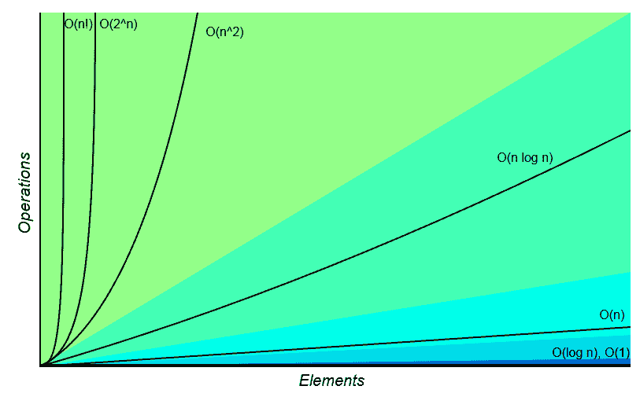
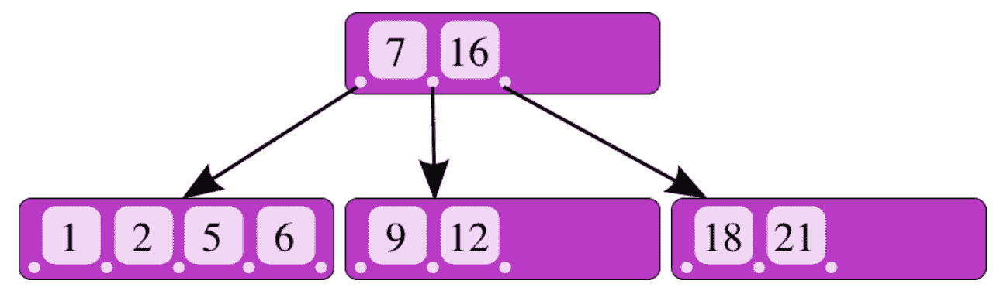
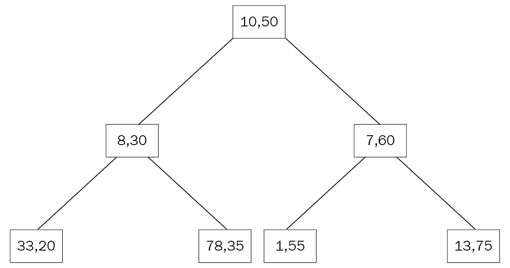

# 第七章：索引

本章将探讨任何数据库中最重要的属性之一：索引。与书籍索引类似，数据库索引可以加快数据检索速度。在关系型数据库管理系统中，索引被广泛使用（有时被滥用）以加快数据访问速度。在 MongoDB 中，索引在模式和查询设计中起着至关重要的作用。MongoDB 支持各种索引类型，您将在本章中了解到，包括单字段、复合、多键、地理空间、哈希、部分等等。除了审查不同类型的索引，我们还将向您展示如何为单服务器部署以及复杂的分片环境构建和管理索引。

在本章中，我们将涵盖以下主题：

+   索引内部

+   索引类型

+   构建和管理索引

+   索引的高效使用

# 索引内部

在大多数情况下，索引是 B 树数据结构的变体。由 Rudolf Bayer 和 Ed McCreight 于 1971 年在波音研究实验室工作时发明，**B 树**数据结构允许在对数时间内执行搜索、顺序访问、插入和删除。**对数时间**属性适用于平均情况性能和最坏情况性能，当应用程序无法容忍性能行为的意外变化时，这是一个很好的属性。

为了进一步说明对数时间的重要性，我们将向您展示 Big-O 复杂度图表，该图表来自[`bigocheatsheet.com/`](http://bigocheatsheet.com)：



在这个图表中，您可以看到对数时间性能作为图表的*x*轴平行的一条直线。随着元素数量的增加，常数时间（**O(n)**）算法表现更差，而二次时间算法（**O(n²)**）则超出了图表范围。对于我们依赖的算法来尽快将数据返回给我们，时间性能至关重要。

B 树的另一个有趣特性是它是自平衡的，这意味着它将自动调整以始终保持这些属性。它的前身和最接近的亲戚是二叉搜索树，这是一种数据结构，每个父节点只允许两个子节点。

从图表上看，B 树的结构如下图所示，也可以在[`commons.wikimedia.org/w/index.php?curid=11701365`](https://commons.wikimedia.org/w/index.php?curid=11701365)上看到：



在上图中，我们有一个父节点，其值为**7**和**16**，指向三个子节点。

如果我们搜索值为**9**，知道它大于**7**且小于**16**，我们将直接被引导到包含该值的中间子节点。

由于这种结构，我们在每一步都将搜索空间几乎减半，最终达到*log n*的时间复杂度。与顺序扫描每个元素相比，每一步将元素数量减半，使我们的收益呈指数增长，因为我们需要搜索的元素数量增加。

# 索引类型

MongoDB 为不同的需求提供了各种索引类型。在接下来的章节中，我们将确定不同类型的索引以及它们各自满足的需求。

# 单字段索引

最常见和简单的索引类型是单字段索引。单字段和键索引的一个例子是在每个 MongoDB 集合中默认生成的`ObjectId`（`_id`）索引。`ObjectId`索引也是唯一的，防止另一个文档在集合中具有相同的`ObjectId`。

基于我们在前几章中使用的`mongo_book`数据库的单字段索引定义如下：

```sql
> db.books.createIndex( { price: 1 } )
```

在这里，我们按照索引创建的顺序对字段名称创建索引。对于降序，相同的索引将如下创建：

```sql
> db.books.createIndex( { price: -1 } )
```

索引创建的顺序对于我们期望查询优先考虑存储在索引中的第一个文档的值的情况很重要。然而，由于索引具有极其高效的时间复杂度，这对于最常见的用例来说并不重要。

索引可以用于字段值的精确匹配查询或范围查询。在前一种情况下，一旦我们的指针在*O(log n)*时间后到达值，搜索就可以停止。

在范围查询中，由于我们在 B 树索引中按顺序存储值，一旦我们在 B 树的节点中找到范围查询的边界值，我们将知道其所有子节点中的所有值都将成为我们结果集的一部分，从而允许我们结束我们的搜索。

示例如下：



# 删除索引

删除索引与创建索引一样简单。我们可以通过名称或由其组成的字段引用索引：

```sql
> db.books.dropIndex( { price: -1 } ) > db.books.dropIndex( "price_index" )
```

# 索引嵌入字段

作为文档数据库，MongoDB 支持在同一文档的嵌套复杂层次结构中嵌入字段和整个文档。自然地，它也允许我们对这些字段进行索引。

在我们的`books`集合示例中，我们可以有以下类似的文档：

```sql
{
"_id" : ObjectId("5969ccb614ae9238fe76d7f1"),
"name" : "MongoDB Indexing Cookbook",
"isbn" : "1001",
"available" : 999,
"meta_data" : {
"page_count" : 256,
"average_customer_review" : 4.8
}
} 
```

在这里，`meta_data`字段本身是一个文档，具有`page_count`和`average_customer_review`字段。同样，我们可以按照以下方式在`page_count`上创建索引：

```sql
db.books.createIndex( { "meta_data.page_count": 1 } )
```

这可以回答关于`meta_data.page_count`字段的相等和范围比较的查询，如下所示：

```sql
> db.books.find({"meta_data.page_count": { $gte: 200 } })
> db.books.find({"meta_data.page_count": 256 })
```

要访问嵌入字段，我们使用点表示法，并且需要在字段名称周围包含引号（`""`）。

# 索引嵌入文档

我们还可以像索引嵌入字段一样索引整个嵌入文档：

```sql
> db.books.createIndex( { "meta_data": 1 } )
```

在这里，我们正在索引整个文档，期望针对其整体进行查询，如下所示：

```sql
> db.books.find({"meta_data": {"page_count":256, "average_customer_review":4.8}})
```

主要区别在于当我们索引嵌入字段时，我们可以使用索引对它们执行范围查询，而当我们索引嵌入文档时，我们只能使用索引执行比较查询。

`db.books.find({"meta_data.average_customer_review": { $gte: 4.8}, "meta_data.page_count": { $gte: 200 } })`命令不会使用我们的`meta_data`索引，而`db.books.find({"meta_data": {"page_count":256, "average_customer_review":4.8}})`会使用它。

# 后台索引

索引可以在前台创建，阻塞集合中的所有操作，直到它们建立完成，或者可以在后台创建，允许并发操作。通过传递`background: true`参数来在后台构建索引：

```sql
> db.books.createIndex( { price: 1 }, { background: true } )
```

后台索引在本章的最后一节*构建和管理索引*中有一些限制，我们将在最后一节中重新讨论。

# 复合索引

复合索引是单键索引的泛化，允许多个字段包含在同一个索引中。当我们期望查询跨多个字段的文档时，以及当我们开始在集合中拥有太多索引时，它们非常有用。

复合索引最多可以有 31 个字段。它们不能有散列索引类型。

复合索引的声明方式与单个索引类似，通过定义要索引的字段和索引的顺序来定义：

```sql
> db.books.createIndex({"name": 1, "isbn": 1})
```

# 使用复合索引进行排序

索引的顺序对于排序结果很有用。在单字段索引中，MongoDB 可以双向遍历索引，因此我们定义的顺序并不重要。

然而，在多字段索引中，排序可以决定我们是否可以使用此索引进行排序。在前面的示例中，与我们索引创建的排序方向匹配的查询将使用我们的索引，如下所示：

```sql
> db.books.find().sort( { "name": 1, "isbn": 1 })
```

它还将使用所有`sort`字段反转的`sort`查询：

```sql
> db.books.find().sort( { "name": -1, "isbn": -1 })
```

在这个查询中，由于我们否定了两个字段，MongoDB 可以使用相同的索引，从末尾到开头遍历它。

另外两种排序顺序如下：

```sql
> db.books.find().sort( { "name": -1, "isbn": 1 })
> db.books.find().sort( { "name": 1, "isbn": -1 })
```

它们不能使用索引进行遍历，因为我们想要的`sort`顺序在我们的索引 B 树数据结构中不存在。

# 重用复合索引

复合索引的一个重要属性是它们可以用于对索引字段的前缀进行多个查询。当我们想要在随着时间在我们的集合中堆积的索引进行合并时，这是有用的。

考虑我们之前创建的复合（多字段）索引：

```sql
> db.books.createIndex({"name": 1, "isbn": 1})
```

这可以用于对`name`或`{name, isbn}`进行查询：

```sql
> db.books.find({"name":"MongoDB Indexing"})
> db.books.find({"isbn": "1001", "name":"MongoDB Indexing"})
```

查询中字段的顺序并不重要；MongoDB 将重新排列字段以匹配我们的查询。

然而，我们索引中字段的顺序是重要的。仅针对`isbn`字段的查询无法使用我们的索引：

```sql
> db.books.find({"isbn": "1001"})
```

根本原因是我们字段的值存储在索引中作为次要、第三等等；每个值都嵌入在前一个值中，就像俄罗斯套娃一样。这意味着当我们在多字段索引的第一个字段上进行查询时，我们可以使用最外层的套娃来找到我们的模式，而当我们搜索前两个字段时，我们可以在最外层的套娃上匹配模式，然后深入到内部的套娃中。

这个概念被称为**前缀索引**，以及索引交集，它是索引合并的最强大工具，正如你将在本章后面看到的。

# 多键索引

在前面的部分中已经解释了标量（单一）值的索引。然而，我们从使用 MongoDB 中获得的优势之一是能够轻松地以数组的形式存储向量值。

在关系世界中，存储数组通常是不受欢迎的，因为它违反了正常形式。在 MongoDB 这样的面向文档的数据库中，它经常是我们设计的一部分，因为我们可以轻松地存储和查询数据的复杂结构。

通过使用多键索引可以对文档数组进行索引。多键索引可以存储标量值数组和嵌套文档数组。

创建多键索引与创建常规索引相同：

```sql
> db.books.createIndex({"tags":1})
```

假设我们已经在我们的`books`集合中创建了一个文档，使用以下命令：

```sql
> db.books.insert({"name": "MongoDB Multikeys Cheatsheet", "isbn": "1002", "available": 1, "meta_data": {"page_count":128, "average_customer_review":3.9}, "tags": ["mongodb", "index","cheatsheet","new"] })
```

我们的新索引将是一个多键索引，允许我们找到包含数组中任何标签的文档：

```sql
> db.books.find({tags:"new"})
{
"_id" : ObjectId("5969f4bc14ae9238fe76d7f2"),
"name" : "MongoDB Multikeys Cheatsheet",
"isbn" : "1002",
"available" : 1,
"meta_data" : {
"page_count" : 128,
"average_customer_review" : 3.9
},
"tags" : [
"mongodb",
"index",
"cheatsheet",
"new"
]
}
>
```

我们还可以使用多键索引创建复合索引，但每个索引文档中最多只能有一个数组。鉴于在 MongoDB 中我们不指定每个字段的类型，这意味着创建具有两个或更多字段的数组值的索引将在创建时失败，并且尝试插入具有两个或更多字段的数组的文档将在插入时失败。

例如，如果我们的数据库中有以下文档，那么在`tags`、`analytics_data`上创建的复合索引将无法创建：

```sql
{
"_id" : ObjectId("5969f71314ae9238fe76d7f3"),
"name": "Mastering parallel arrays indexing",
"tags" : [
"A",
"B"
],
"analytics_data" : [
"1001",
"1002"
]
}

> db.books.createIndex({tags:1, analytics_data:1})
{
"ok" : 0,
"errmsg" : "cannot index parallel arrays [analytics_data] [tags]",
"code" : 171,
"codeName" : "CannotIndexParallelArrays"
}
```

因此，如果我们首先在空集合上创建索引，然后尝试插入此文档，插入将失败，并显示以下错误：

```sql
> db.books.find({isbn:"1001"}).hint("international_standard_book_number_index").explain()
{
 "queryPlanner" : {
 "plannerVersion" : 1,
 "namespace" : "mongo_book.books",
 "indexFilterSet" : false,
 "parsedQuery" : {
 "isbn" : {
 "$eq" : "1001"
 }
 },
 "winningPlan" : {
 "stage" : "FETCH",
 "inputStage" : {
 "stage" : "IXSCAN",
 "keyPattern" : {
 "isbn" : 1
 },
 "indexName" : "international_standard_book_numbe
r_index",
 "isMultiKey" : false,
 "multiKeyPaths" : {
 "isbn" : [ ]
 },
 "isUnique" : false,
 "isSparse" : false,
 "isPartial" : false,
 "indexVersion" : 2,
 "direction" : "forward",
 "indexBounds" : {
 "isbn" : [
 "[\"1001\", \"1001\"]"
 ]
 }
 }
 },
 "rejectedPlans" : [ ]
 },
 "serverInfo" : {
 "host" : "PPMUMCPU0142",
 "port" : 27017,
 "version" : "3.4.7",
 "gitVersion" : "cf38c1b8a0a8dca4a11737581beafef4fe120bcd"
 },
 "ok" : 1
```

散列索引不能是多键索引。

当我们尝试微调我们的数据库时，我们可能会遇到的另一个限制是多键索引无法完全覆盖查询。使用索引覆盖查询意味着我们可以完全从索引中获取我们的结果数据，而根本不访问我们数据库中的数据。这可能会导致性能大幅提升，因为索引很可能存储在 RAM 中。

在多键索引中查询多个值将从索引的角度产生一个两步过程。

在第一步中，索引将用于检索数组的第一个值，然后顺序扫描将运行数组中其余的元素；示例如下：

```sql
> db.books.find({tags: [ "mongodb", "index", "cheatsheet", "new" ] })
```

这将首先搜索具有`mongodb`值的多键`index`标签的所有条目，然后顺序扫描它们以找到也具有`index`、`cheatsheet`和`new`标签的条目。

多键索引不能用作分片键。但是，如果分片键是多键索引的前缀索引，则可以使用。我们将在第十三章 *分片*中更多地介绍这一点。

# 特殊类型的索引

除了通用索引外，MongoDB 还支持特殊用例的索引。在本节中，我们将确定并探讨如何使用它们。

# 文本索引

文本索引是对字符串值字段的特殊索引，用于支持文本搜索。本书基于文本索引功能的第 3 版，自第 3.2 版起可用。

文本索引可以类似于常规索引进行指定，方法是用单词`text`替换索引排序顺序（`-1`，`1），如下所示：

```sql
> db.books.createIndex({"name": "text"})
```

一个集合最多可以有一个文本索引。这个文本索引可以支持多个字段，无论是文本还是其他。它不能支持其他特殊类型，如多键或地理空间。即使它们只是复合索引的一部分，文本索引也不能用于排序结果。

由于每个集合只有一个文本索引，因此我们需要明智地选择字段。重建此文本索引可能需要相当长的时间，并且每个集合只有一个文本索引使得维护非常棘手，正如您将在本章末尾看到的那样。

幸运的是，此索引也可以是复合索引：

```sql
> db.books.createIndex( { "available": 1, "meta_data.page_count": 1,  "$**": "text" } )
```

具有`text`字段的复合索引遵循本章前面解释的排序和前缀索引规则。我们可以使用此索引来查询`available`，或`available`和`meta_data.page_count`的组合，或者如果排序顺序允许在任何方向遍历我们的索引，则对它们进行排序。

我们还可以盲目地对包含字符串的每个字段进行`text`索引：

```sql
> db.books.createIndex( { "$**": "text" } )
```

这可能导致无限制的索引大小，应该避免使用；但是，如果我们有非结构化数据（例如，直接来自应用程序日志，我们不知道哪些字段可能有用，并且希望能够查询尽可能多的字段），这可能是有用的。

文本索引将应用词干处理（删除常见后缀，例如英语单词的复数`s`/`es`）并从索引中删除停用词（`a`，`an`，`the`等）。

文本索引支持 20 多种语言，包括西班牙语，中文，乌尔都语，波斯语和阿拉伯语。文本索引需要特殊配置才能正确地索引英语以外的语言。

文本索引的一些有趣属性如下所述：

+   大小写不敏感和变音符号不敏感：文本索引是大小写和变音符号不敏感的。文本索引的第 3 版（随第 3.4 版一起发布）支持常见的*C*，简单的*S*和特殊的*T*大小写折叠，如**Unicode 字符数据库**（**UCD**）8.0 大小写折叠中所述。除了大小写不敏感外，文本索引的第 3 版还支持变音符号不敏感。这将扩展对带有小写和大写字母形式的重音符号的字符的不敏感性。例如，*e*，*è*，*é*，*ê*，*ë*及其大写字母对应物，在使用文本索引进行比较时都可能相等。在文本索引的先前版本中，这些被视为不同的字符串。

+   **标记化分隔符：**文本索引的第 3 版支持标记化分隔符，定义为`Dash`，`Hyphen`，`Pattern_Syntax`，`Quotation_Mark`，`Terminal_Punctuation`和`White_Space`，如 UCD 8.0 大小写折叠中所述。

# 散列索引

散列索引包含索引字段的`hashed`值：

```sql
> db.books.createIndex( { name: "hashed" } )
```

这将在我们的`books`集合的每本书的名称上创建一个哈希索引。哈希索引非常适合相等匹配，但不能用于范围查询。如果我们希望对字段执行一系列查询，我们可以创建一个常规索引（或包含该字段的复合索引），并且还可以创建一个用于相等匹配的哈希索引。哈希索引在 MongoDB 内部用于基于哈希的分片，我们将在第十三章 *分片*中讨论。哈希索引将浮点字段截断为整数。在可能的情况下，应尽量避免对哈希字段使用浮点数。

# 生存时间索引

**生存时间**（**TTL**）索引用于在过期时间后自动删除文档。它们的语法如下：

```sql
> db.books.createIndex( { "created_at_date": 1 }, { expireAfterSeconds: 86400 } )
```

`created_at_date`字段的值必须是日期或日期数组（将使用最早的日期）。在这个例子中，文档将在`created_at_date`之后的一天（`86400`秒）被删除。

如果字段不存在或值不是日期，则文档将不会过期。换句话说，TTL 索引会默默失败，不会在失败时返回任何错误。

数据将通过每 60 秒运行一次的后台作业进行删除。因此，关于文档在其过期日期之后还会持续存在多长时间，没有明确的准确性保证。

TTL 索引是常规的单字段索引。它可以用于像常规索引一样的查询。TTL 索引不能是复合索引，不能在封顶集合上操作，也不能使用`_id`字段。`_id`字段隐含地包含了文档创建时间的时间戳，但不是一个`Date`字段。如果我们希望每个文档在不同的自定义日期点过期，我们必须设置`{expireAfterSeconds: 0}`，并手动设置 TTL 索引的`Date`字段为我们希望文档过期的日期。

# 部分索引

集合上的部分索引是仅适用于满足`partialFilterExpression`查询的文档的索引。

我们将使用我们熟悉的`books`集合，如下所示：

```sql
> db.books.createIndex(
 { price: 1, name: 1 },
 { partialFilterExpression: { price: { $gt: 30 } } }
)
```

使用这个，我们可以为只有价格大于`30`的书籍创建一个索引。部分索引的优点是在创建和维护上更轻量，并且使用更少的存储空间。

`partialFilterExpression`过滤器支持以下运算符：

+   相等表达式（即`field: value`，或使用`$eq`运算符）

+   `$exists: true`表达式

+   `$gt`，`$gte`，`$lt`和`$lte`表达式

+   `$type`表达式

+   `$and`运算符，仅在顶层

只有当查询可以完全满足部分索引时，才会使用部分索引。

如果我们的查询匹配或比`partialFilterExpression`过滤器更严格，那么将使用部分索引。如果结果可能不包含在部分索引中，则索引将被完全忽略。

`partialFilterExpression`不需要是稀疏索引字段的一部分。以下索引是有效的稀疏索引：

```sql

 > db.books.createIndex({ name: 1 },{ partialFilterExpression: { price: { $gt: 30 } } })
```

然而，要使用这个部分索引，我们需要查询`name`和`price`都等于或大于`30`。

优先选择部分索引而不是稀疏索引。稀疏索引提供了部分索引提供的功能的子集。部分索引是在 MongoDB 3.2 中引入的，因此如果您有早期版本的稀疏索引，升级它们可能是一个好主意。`_id`字段不能是部分索引的一部分。分片键索引不能是部分索引。`partialFilterExpression`不能与`sparse`选项结合使用。

# 稀疏索引

稀疏索引类似于部分索引，但比它早几年（自 1.8 版本以来就可用）。

`sparse`索引只索引包含以下字段的值：

```sql
> db.books.createIndex( { "price": 1 }, { sparse: true } )
```

它只会创建一个包含包含`price`字段的文档的索引。

由于其性质，有些索引始终是稀疏的：

+   `2d`，`2dsphere`（版本 2）

+   `geoHaystack`

+   `text`

稀疏和唯一的索引将允许多个文档缺少索引键。它不会允许具有相同索引字段值的文档。具有地理空间索引（`2d`，`2dsphere`和`geoHaystack`）的稀疏和复合索引将索引文档，只要它具有`geospatial`字段。

具有`text`字段的稀疏和复合索引将索引文档，只要它具有`text`字段。没有前两种情况的稀疏和复合索引将索引文档，只要它至少有一个字段。

在 MongoDB 的最新版本中避免创建新的稀疏索引；改用部分索引。

# 唯一索引

唯一索引类似于 RDBMS 唯一索引，禁止索引字段的重复值。MongoDB 默认在每个插入的文档的`_id`字段上创建唯一索引：

```sql
> db.books.createIndex( { "name": 1 }, { unique: true } )
```

这将在书的`name`上创建一个`unique`索引。唯一索引也可以是复合嵌入字段或嵌入文档索引。

在复合索引中，唯一性是在索引的所有字段的值的组合中强制执行的；例如，以下内容不会违反唯一索引：

```sql
> db.books.createIndex( { "name": 1, "isbn": 1 }, { unique: true } )
> db.books.insert({"name": "Mastering MongoDB", "isbn": "101"})
> db.books.insert({"name": "Mastering MongoDB", "isbn": "102"})
```

这是因为即使名称相同，我们的索引也在寻找`name`和`isbn`的唯一组合，而这两个条目在`isbn`上有所不同。

唯一索引不适用于散列索引。如果集合已包含索引字段的重复值，则无法创建唯一索引。唯一索引不会阻止同一文档具有多个值。

如果文档缺少索引字段，则将插入该字段。如果第二个文档缺少索引字段，则不会插入。这是因为 MongoDB 将缺少的字段值存储为 null，只允许字段中缺少一个文档。

唯一和部分组合的索引只会在应用部分索引后应用唯一索引。这意味着如果它们不是部分过滤的一部分，可能会有几个具有重复值的文档。

# 不区分大小写

大小写敏感是索引中的常见问题。我们可能会将数据存储在混合大小写中，并且需要索引在查找存储的数据时忽略大小写。直到 3.4 版本，这是在应用程序级别处理的，方法是创建所有小写字符的重复字段，并将所有小写字段索引以模拟不区分大小写的索引。

使用`collation`参数，我们可以创建不区分大小写的索引，甚至可以创建行为不区分大小写的集合。

通常，`collation`允许用户指定特定于语言的字符串比较规则。可能的（但不是唯一的）用法是用于不区分大小写的索引和查询。

使用我们熟悉的`books`集合，我们可以在名称上创建一个不区分大小写的索引，如下所示：

```sql
> db.books.createIndex( { "name" : 1 },
 { collation: {
 locale : 'en',
 strength : 1
 }
 } )
```

`strength`参数是`collation`参数之一：用于区分大小写比较的定义参数。强度级别遵循**国际 Unicode 组件**（**ICU**）比较级别。它接受的值如下：

| **强度值** | **描述** |
| --- | --- |
| `1a` | 比较的主要级别。基于字符串值的比较，忽略任何其他差异，如大小写和变音符。 |
| `2` | 比较的次要级别，基于主要级别的比较，如果相等，则比较变音符（即重音）。 |
| `3`（默认） | 第三级比较。与级别*2*相同，添加大小写和变体。 |
| `4` | 第四级。仅限于特定用例，考虑标点符号，当级别 1-3 忽略标点符号时，或用于处理日文文本。 |
| `5` | 相同级别。仅限于特定用例：决定胜负者。 |

使用`collation`创建索引不足以获得不区分大小写的结果。我们需要在查询中指定`collation`，如下所示：

```sql
> db.books.find( { name: "Mastering MongoDB" } ).collation( { locale: 'en', strength: 1 } )
```

如果我们在查询中指定与我们的索引相同级别的`collation`，那么将使用该索引。我们可以按如下方式指定不同级别的`collation`：

```sql
> db.books.find( { name: "Mastering MongoDB" } ).collation( { locale: 'en', strength: 2 } )
```

在这里，我们无法使用索引，因为我们的索引具有`collation`级别 1，而我们的查询寻找`collation`级别`2`。

如果我们在查询中不使用任何`collation`，我们将得到默认级别为 3 的结果，即区分大小写。

使用与默认不同的`collation`创建的集合中的索引将自动继承此`collation`级别。

假设我们创建了一个`collation`级别为 1 的集合，如下所示：

```sql
> db.createCollection("case_sensitive_books", { collation: { locale: 'en_US', strength: 1 } } )
```

以下索引也将具有`name: 1`的排序：

```sql
> db.case_sensitive_books.createIndex( { name: 1 } )
```

对该集合的默认查询将使用排序`strength: 1`，区分大小写。如果我们想在查询中覆盖这一点，我们需要在查询中指定不同级别的`collation`，或者完全忽略`strength`部分。以下两个查询将返回`case_sensitive_books`集合中不区分大小写的默认`collation`级别结果：

```sql
> db.case_sensitive_books.find( { name: "Mastering MongoDB" } ).collation( { locale: 'en', strength: 3 } ) // default collation strength value
> db.case_sensitive_books.find( { name: "Mastering MongoDB" } ).collation( { locale: 'en'  } ) // no value for collation, will reset to global default (3) instead of default for case_sensitive_books collection (1)
```

排序在 MongoDB 中是一个相当强大且相对较新的概念，因此我们将在不同章节中继续探讨它。

# 地理空间索引

地理空间索引在 MongoDB 早期就被引入，而 Foursquare 是 MongoDB（当时是 10gen Inc.）最早的客户和成功案例之一，这可能并非巧合。在本章中，我们将探讨三种不同类型的地理空间索引，并将在以下部分中进行介绍。

# 2D 地理空间索引

`2d`地理空间索引将地理空间数据存储为二维平面上的点。它主要用于传统原因，用于 MongoDB 2.2 之前创建的坐标对，并且在大多数情况下，不应该与最新版本一起使用。

# 2dsphere 地理空间索引

`2dsphere`地理空间索引支持在类似地球的平面上计算几何。它比简单的`2d`索引更精确，并且可以支持 GeoJSON 对象和坐标对作为输入。

自 MongoDB 3.2 以来的当前版本是版本 3。默认情况下，它是稀疏索引，只索引具有`2dsphere`字段值的文档。假设我们的`books`集合中有一个位置字段，跟踪每本书的主要作者的家庭地址，我们可以按如下方式在该字段上创建索引：

```sql
> db.books.createIndex( { "location" : "2dsphere" } )
```

`location`字段需要是一个 GeoJSON 对象，就像这样一个：

```sql
location : { type: "Point", coordinates: [ 51.5876, 0.1643 ] }
```

`2dsphere`索引也可以作为复合索引的一部分，作为第一个字段或其他字段：

```sql
> db.books.createIndex( { name: 1, location : "2dsphere" } )
```

# geoHaystack 索引

当我们需要在一个小区域内搜索基于地理位置的结果时，`geoHaystack`索引非常有用。就像在干草堆中搜索针一样，使用`geoHaystack`索引，我们可以定义地理位置点的存储桶，并返回属于该区域的所有结果。

我们将创建一个`geoHaystack`索引，如下所示：

```sql
> db.books.createIndex( { "location" : "geoHaystack" ,
 "name": 1 } ,
 { bucketSize: 2 } )
```

这将在每个文档周围的纬度或经度`2`单位内创建文档的存储桶。

在这里，使用前面的`location`示例：

```sql
location : { type: "Point", coordinates: [ 51.5876, 0.1643 ] }
```

基于`bucketSize: 2`，每个具有`location` `[49.5876..53.5876, -2.1643..2.1643]`的文档将属于与我们的位置相同的存储桶。

一个文档可以出现在多个存储桶中。如果我们想使用球面几何，`2dsphere`是一个更好的解决方案。`geoHaystack`索引默认是稀疏的。

如果我们需要计算最接近我们位置的文档，而它超出了我们的`bucketSize`（即，在我们的示例中大于 2 个纬度/经度单位），查询将是低效的，可能不准确。对于这样的查询，请使用`2dsphere`索引。

# 构建和管理索引

索引可以使用 MongoDB shell 或任何可用的驱动程序构建。默认情况下，索引是在前台构建的，会阻塞数据库中的所有其他操作。这样更快，但通常是不可取的，特别是在生产实例中。

我们还可以通过在 shell 中的索引命令中添加`{background: true}`参数来在后台构建索引。后台索引只会阻塞当前连接/线程。我们可以打开一个新连接（即在命令行中使用`mongo`）连接到同一个数据库：

```sql
> db.books.createIndex( { name: 1 }, { background: true } )
```

后台索引构建可能比前台索引构建需要更长的时间，特别是如果索引无法适应可用的 RAM。

尽早创建索引，并定期重新审视索引以进行合并。查询不会看到部分索引结果。只有在索引完全创建后，查询才会开始从索引中获取结果。

不要使用主要应用程序代码来创建索引，因为这可能会导致不可预测的延迟。相反，从应用程序获取索引列表，并在维护窗口期间标记这些索引进行创建。

# 强制使用索引

我们可以通过应用`hint()`参数来强制 MongoDB 使用索引：

```sql
> db.books.createIndex( { isbn: 1 }, { background: true } )
{
"createdCollectionAutomatically" : false,
"numIndexesBefore" : 8,
"numIndexesAfter" : 9,
"ok" : 1
}
```

`createIndex`的输出通知我们索引已创建（`"ok" : 1`），索引创建过程中没有自动创建集合（`"createdCollectionAutomatically" : false`），在此索引创建之前，该集合中的索引数量为`8`，现在总共有九个索引。

现在，如果我们尝试通过`isbn`搜索书籍，我们可以使用`explain()`命令来查看`winningPlan`子文档，从中我们可以找到使用的查询计划：

```sql
> db.books.find({isbn: "1001"}).explain()
…
"winningPlan" : {
"stage" : "FETCH",
"inputStage" : {
"stage" : "IXSCAN",
"keyPattern" : {
"isbn" : 1,
"name" : 1
},
"indexName" : "isbn_1_name_1",
...
```

这意味着使用了具有`isbn`为`1`和`name`为`1`的索引，而不是我们新创建的索引。我们还可以在输出的`rejectedPlans`子文档中查看我们的索引，如下所示：

```sql
…
"rejectedPlans" : [
{
"stage" : "FETCH",
"inputStage" : {
"stage" : "IXSCAN",
"keyPattern" : {
"isbn" : 1
},
"indexName" : "isbn_1",
...
```

事实上，这是正确的，因为 MongoDB 正在尝试重用比通用索引更具体的索引。

在我们的`isbn_1`索引表现比`isbn_1_name_1`更好的情况下，我们可能不确定。

我们可以强制 MongoDB 使用我们新创建的索引，如下所示：

```sql
> db.books.find({isbn: "1001"}).hint("international_standard_book_number_index")
.explain()
{
...
 "winningPlan" : {
 "stage" : "FETCH",
 "inputStage" : {
 "stage" : "IXSCAN",
 "keyPattern" : {
 "isbn" : 1
 },
...
```

现在，`winningPlan`子文档包含我们的索引`isbn_1`，并且没有`rejectedPlans`元素。结果集中是一个空数组。

我们不能在特殊类型的文本索引上使用`hint()`。

# 提示和稀疏索引

根据设计，稀疏索引不包括索引中的某些文档，根据字段的存在/缺失。可能包含不在索引中的文档的查询将不使用稀疏索引。

使用稀疏索引的`hint()`可能导致不正确的计数，因为它强制 MongoDB 使用可能不包含我们想要的所有结果的索引。

旧版本的`2dsphere`、`2d`、`geoHaystack`和文本索引默认是稀疏的。应谨慎使用`hint()`，并在仔细考虑其影响后使用。

# 在副本集上构建索引

在副本集中，如果我们发出`createIndex()`命令，主服务器完成创建后，次要服务器将开始创建索引。同样，在分片环境中，主服务器将开始构建索引，而分片的每个次要服务器将在主服务器完成后开始。

在副本集中构建索引的推荐方法如下：

+   停止副本集中的一个次要节点

+   在不同端口上重新启动为独立服务器

+   在 shell 中构建独立索引

+   重启副本集中的次要节点

+   允许次要节点赶上主节点

我们需要在主服务器中有足够大的 oplog 大小，以确保辅助服务器在重新连接后能够追赶上来。oplog 大小在配置中以 MB 定义，它定义了主服务器中日志中将保留多少个操作。如果 oplog 大小只能容纳主服务器中发生的最后 100 个操作，而发生了 101 个或更多的操作，这意味着辅助服务器将无法与主服务器同步。这是主服务器没有足够的内存来跟踪其操作并通知辅助服务器的后果。在副本集中构建索引是一个手动过程，涉及每个主服务器和辅助服务器的几个步骤。

这种方法可以在副本集中的每个辅助服务器上重复。然后，对于主服务器，我们可以执行以下操作之一：

+   在后台构建索引

+   使用`rs.stepDown()`将主服务器降级，然后使用服务器作为辅助服务器重复前面的过程

使用第二种方法时，当主服务器降级时，我们的集群将在一段时间内不接受任何写入。我们的应用程序在此期间不应该超时（通常不到 30-60 秒）。

在主服务器后台构建索引也会在辅助服务器上后台构建。这可能会影响索引创建期间我们服务器的写入，但好处是没有手动步骤。在生产环境中建立一个与生产环境相似的临时环境，并在其中运行影响实时集群的操作，以避免意外。

# 管理索引

在本节中，您将学习如何为您的索引指定人性化的名称，以及一些特殊的考虑和限制，我们必须牢记索引。

# 命名索引

默认情况下，索引名称是根据字段索引和索引方向（`1`，`-1`）自动分配的。如果我们想在创建时分配自己的`name`，我们可以这样做：

```sql
> db.books.createIndex( { isbn: 1 }, { name: "international_standard_book_number_index" } )
```

现在，我们有一个名为`international_standard_book_number_index`的新索引，而不是 MongoDB 将会命名的(`"isbn_1"`)。

我们可以使用`db.books.getIndexes()`来查看我们的`books`集合中的所有索引。完全限定的索引名称必须少于或等于 128 个字符。这也包括`database_name`，`collection_name`和它们之间的点。

# 特殊考虑

以下是一些关于索引的限制需要牢记：

+   索引条目必须少于 1,024 字节。这主要是一个内部考虑，但如果我们在索引方面遇到问题，我们可以牢记这一点。

+   一个集合最多可以有 64 个索引。

+   复合索引最多可以有 31 个字段。

+   特殊索引不能在查询中组合使用。这包括必须使用特殊索引的特殊查询操作符，例如文本索引的`$text`和地理空间索引的`$near`。这是因为 MongoDB 可以使用多个索引来满足查询，但并非在所有情况下都可以。关于这个问题将在*索引交集*部分有更多内容。

+   多键和地理空间索引无法覆盖查询。这意味着仅仅使用索引数据将不足以满足查询，MongoDB 需要处理底层文档才能获取完整的结果集。

+   索引对字段有唯一约束。我们不能在相同的字段上创建多个索引，只是选项不同。这是稀疏和部分索引的限制，因为我们不能创建多个这些索引的变体，这些变体只在过滤查询上有所不同。

# 高效使用索引

创建索引是一个不应轻率对待的决定。尽管通过 shell 创建索引很容易，但如果我们最终拥有太多或效率不高的索引，它可能会在后续出现问题。在本节中，您将学习如何测量现有索引的性能，一些改进性能的技巧，以及如何合并索引数量，以便拥有性能更好的索引。

# 测量性能

学习如何使用`explain()`命令将有助于您优化和理解索引的性能。当与查询一起使用时，`explain()`命令将返回 MongoDB 为此查询使用的查询计划，而不是实际结果。

通过在查询末尾链接它来调用它，如下所示：

```sql
> db.books.find().explain()
```

它可以有三个选项：`queryPlanner`（默认值），`executionStats`和`allPlansExecution`。

让我们使用最详细的输出，`allPlansExecution`：

```sql
> db.books.find().explain("allPlansExecution")
```

在这里，我们可以获取获胜查询计划的信息，以及在规划阶段考虑过但被拒绝的查询计划的部分信息，因为查询规划程序认为它们更慢。`explain()`命令无论如何都会返回相当冗长的输出，允许深入了解查询计划如何工作以返回我们的结果。

乍一看，我们需要关注应该使用的索引是否被使用，以及扫描的文档数量是否尽可能与返回的文档数量匹配。

对于第一个，我们可以检查`stage`字段并查找`IXSCAN`，这意味着使用了索引。然后，在兄弟`indexName`字段中，我们应该看到我们期望的索引名称。

对于第二个，我们需要比较`keysExamined`和`nReturned`字段。理想情况下，我们希望我们的索引在查询方面尽可能具有选择性，这意味着为了返回 100 个文档，这些将是我们的索引检查的 100 个文档。

当然，这是一个权衡，因为索引在我们的集合中数量和大小增加。我们每个集合可以有限数量的索引，而且我们的 RAM 可以容纳这些索引的数量是有限的，因此我们必须在拥有最佳可用索引和这些索引不适合我们的内存并变慢之间取得平衡。

# 提高性能

一旦我们开始熟悉测量用户最常见和重要查询的性能，我们就可以开始尝试改进它们。

总体思路是，当我们期望（或已经有）重复查询开始运行缓慢时，我们需要索引。索引并非免费，因为它们在创建和维护时会带来性能损失，但对于频繁查询来说，它们是非常值得的，并且可以减少数据库中的锁定百分比，如果设计正确的话。

回顾上一节的建议，我们希望我们的索引能够做到以下几点：

+   适应 RAM

+   确保选择性

+   用于对查询结果进行排序

+   用于我们最常见和重要的查询

通过在我们的集合中使用`getIndexes()`并确保我们不会通过检查系统级可用 RAM 和是否使用交换来创建大型索引来确保适应 RAM。

如前所述，通过比较每个查询的`IXSCAN`阶段中的`nReturned`和`keysExamined`来确保选择性。我们希望这两个数字尽可能接近。

确保我们的索引用于对查询结果进行排序是使用复合索引（将作为整体使用，也用于任何基于前缀的查询）并声明我们的索引方向与我们最常见的查询一致的组合。

最后，将索引与我们的查询对齐是应用使用模式的问题，这可以揭示大部分时间使用的查询，然后通过在这些查询上使用`explain()`来识别每次使用的查询计划。

# 索引交集

索引交集是指使用多个索引来满足查询的概念。这是最近添加的功能，还不完美；然而我们可以利用它来 consolodate 我们的索引。

我们可以通过在查询上使用`explain()`并在执行的查询计划中观察`AND_SORTED`或`AND_HASH`阶段来验证查询中是否发生了索引交集。

索引交集可能发生在我们使用`OR`(`$or`)查询时，通过为每个`OR`子句使用不同的索引。索引交集可能发生在我们使用`AND`查询时，我们对每个`AND`子句都有完整的索引或者对一些（或全部）子句有索引前缀。

例如，考虑对我们的`books`集合的查询如下：

```sql
> db.books.find({ "isbn":"101", "price": { $gt: 20 }})
```

在这里，使用两个索引（一个在`isbn`上，另一个在`price`上），MongoDB 可以使用每个索引来获取相关结果，然后在索引结果上进行交集运算以获取结果集。

使用复合索引，正如您在本章中之前学到的，我们可以使用索引前缀来支持包含复合索引的前 *1…n-1* 个字段的查询。

我们无法通过复合索引支持寻找复合索引中字段的查询，其中一个或多个之前定义的字段缺失。

复合索引中的顺序很重要。

为了满足这些查询，我们可以在各个字段上创建索引，然后使用索引交集来满足我们的需求。这种方法的缺点是，随着字段数（*n*）的增加，我们需要创建的索引数量呈指数增长，因此增加了我们对存储和内存的需求。

索引交集不适用于`sort()`。我们不能使用一个索引来查询，然后使用不同的索引对结果应用`sort()`。

然而，如果我们有一个索引可以满足查询的一部分和`sort()`字段，那么这个索引将被使用。

# 进一步阅读

您可以参考以下链接以获取更多信息：

+   [`bigocheatsheet.com/`](http://bigocheatsheet.com/)

+   [`commons.wikimedia.org/`](https://commons.wikimedia.org/)

+   [`docs.mongodb.com/manual/core/index-intersection/`](https://docs.mongodb.com/manual/core/index-intersection/)

# 总结

在本章中，您了解了索引和索引内部的基础知识。然后我们探讨了如何使用 MongoDB 中可用的不同索引类型，如单字段、复合和多键索引，以及一些特殊类型，如文本、哈希、TTL、部分、解析、唯一、不区分大小写和地理空间。

在本章的下一部分，您将学习如何使用 shell 构建和管理索引，这是管理和数据库管理的基本部分，即使对于 NoSQL 数据库也是如此。最后，我们讨论了如何在高层次上改进我们的索引，以及我们如何在实践中使用索引交集，以便 consolodate 索引数量。

在下一章中，我们将讨论如何监视我们的 MongoDB 集群并保持一致的备份。您还将学习如何处理 MongoDB 中的安全性。
