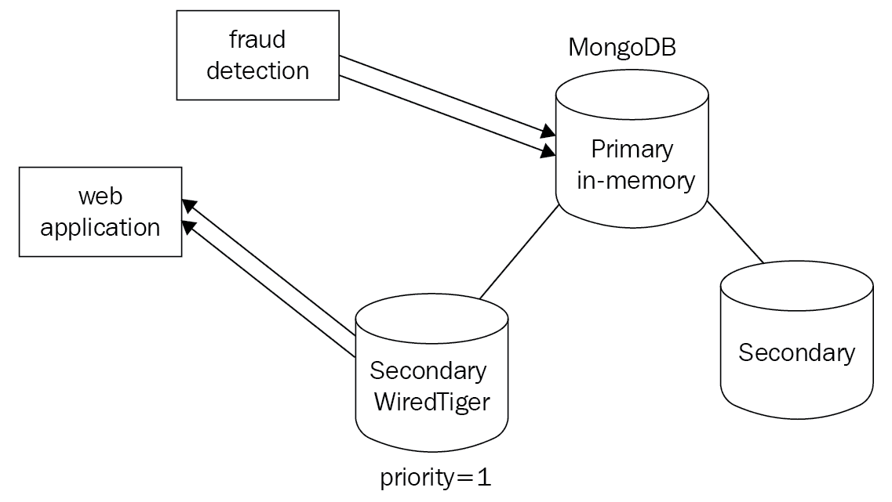
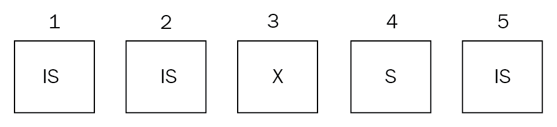
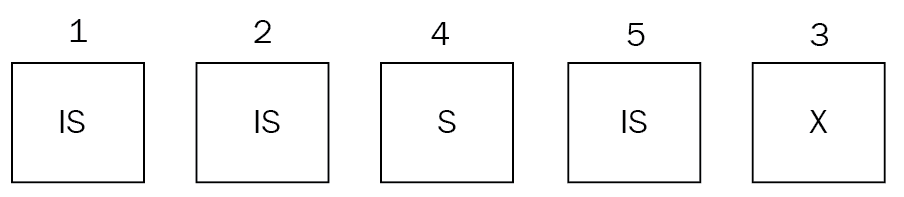
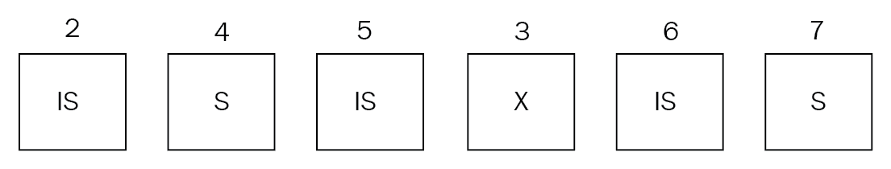
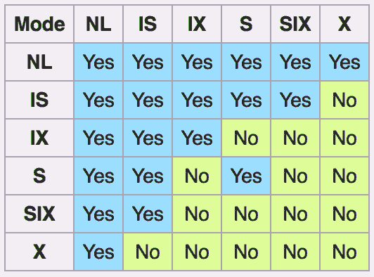

# 第九章：存储引擎

MongoDB 在 3.0 版本中引入了可插拔存储引擎的概念。在收购 WiredTiger 之后，它首先将其存储引擎作为可选引擎引入，然后作为当前版本 MongoDB 的默认存储引擎。在本章中，我们将深入探讨存储引擎的概念，它们的重要性以及如何根据我们的工作负载选择最佳存储引擎。

我们将涵盖以下主题：

+   可插拔存储引擎

+   WiredTiger

+   加密

+   内存中

+   MMAPv1

+   MongoDB 中的锁定

# 可插拔存储引擎

随着 MongoDB 从 Web 应用程序范式中分离出来进入具有不同要求的领域，存储已成为一个越来越重要的考虑因素。

使用多个存储引擎可以被视为使用基础架构堆栈中不同存储解决方案和数据库的替代方式。这样，我们可以减少操作复杂性，并且应用层对基础存储层是不可知的，从而缩短开发时间。

MongoDB 目前提供了四种不同的存储引擎，我们将在接下来的章节中更详细地讨论。

# WiredTiger

从版本 3.2 开始，WiredTiger 是默认的存储引擎，也是大多数工作负载的最佳选择。通过提供文档级别的锁定，它克服了 MongoDB 早期版本中最显著的缺点之一——在高负载下的锁争用。

我们将在接下来的章节中探讨一些 WiredTiger 的好处。

# 文档级别的锁定

锁定是如此重要，以至于我们将在本节末尾更详细地解释细粒度锁定的性能影响。与 MMAPv1 集合级别锁定相比，具有文档级别锁定可以在许多实际用例中产生巨大的差异，并且是选择 WiredTiger 而不是 MMAPv1 的主要原因之一。

# 快照和检查点

WiredTiger 使用**多版本并发控制**（**MVCC**）。MVCC 基于这样一个概念，即数据库保留对象的多个版本，以便读者能够查看在读取期间不会发生变化的一致数据。

在数据库中，如果我们有多个读者在写入者修改数据的同时访问数据，我们可能会出现读者查看此数据的不一致视图的情况。解决这个问题的最简单和最容易的方法是阻止所有读者，直到写入者完成对数据的修改。

这当然会导致严重的性能下降。MVCC 通过为每个读者提供数据库的快照来解决这个问题。当读取开始时，每个读者都保证查看数据与读取开始时的时间点完全一致。写入者进行的任何更改只有在写入完成后才会被读者看到，或者在数据库术语中，只有在事务提交后读者才能看到。

为了实现这个目标，当写入数据时，更新后的数据将被保存在磁盘的一个单独位置，并且 MongoDB 将标记受影响的文档为过时。MVCC 被认为提供了时点一致的视图。这相当于传统 RDBMS 系统中的读提交隔离级别。

对于每个操作，WiredTiger 将在发生操作的确切时刻对我们的数据进行快照，并为应用程序提供一致的应用程序数据视图。当我们写入数据时，WiredTiger 将在每 2GB 的日志数据或 60 秒内创建一个快照，以先到者为准。在故障情况下，WiredTiger 依赖于其内置日志来恢复最新检查点之后的任何数据。

我们可以使用 WiredTiger 禁用日志记录，但如果服务器崩溃，我们将丢失最后一个检查点之后的任何数据。

# 日志记录

正如在*快照和检查点*部分中所解释的，日志记录是 WiredTiger 崩溃恢复保护的基石。

WiredTiger 使用 snappy 压缩算法压缩日志。我们可以使用以下设置来设置不同的压缩算法：

```go
storage.wiredTiger.engineConfig.journalCompressor
```

我们还可以通过将以下设置为 `false` 来禁用 WiredTiger 的日志记录：

```go
storage.journal.enabled
```

如果我们使用副本集，我们可能能够从次要节点中恢复数据，该节点将被选举为主节点并开始接受写入，以防我们的主节点发生故障。建议始终使用日志记录，除非我们了解并能够承受不使用它的后果。

# 数据压缩

MongoDB 默认使用 snappy 压缩算法来压缩数据和索引前缀。索引前缀压缩意味着相同的索引键前缀仅存储一次在内存页中。压缩不仅减少了存储空间，还会增加每秒的 I/O 操作，因为需要存储和从磁盘移动的数据更少。如果我们的工作负载是 I/O 限制而不是 CPU 限制，使用更激进的压缩可以带来性能提升。

我们可以通过将以下参数设置为 `false` 来定义 `.zlib` 压缩而不是 snappy 或无压缩：

```go
storage.wiredTiger.collectionConfig.blockCompressor
```

数据压缩使用更少的存储空间，但会增加 CPU 的使用。`.zlib` 压缩以牺牲更高的 CPU 使用率来实现更好的压缩，与默认的 snappy 压缩算法相比。

我们可以通过将以下参数设置为 `false` 来禁用索引前缀压缩：

```go
storage.wiredTiger.indexConfig.prefixCompression
```

我们还可以在创建过程中使用以下参数为每个索引配置存储：

```go
{ <storage-engine-name>: <options> }
```

# 内存使用

WiredTiger 在使用 RAM 方面与 MMAPv1 有显著不同。MMAPv1 本质上是使用底层操作系统的文件系统缓存来将数据从磁盘分页到内存，反之亦然。

相反，WiredTiger 引入了 WiredTiger 内部缓存的新概念。

WiredTiger 内部缓存默认为以下两者中的较大者：

+   50% 的 RAM 减去 1 GB

+   256 MB

这意味着如果我们的服务器有 8 GB RAM，我们将得到以下结果：

*max(3 GB , 256 MB) = WiredTiger 将使用 3 GB 的 RAM*

如果我们的服务器有 2,512 MB RAM，我们将得到以下结果：

*max(256 MB, 256 MB) = WiredTiger 将使用 256 MB 的 RAM*

基本上，对于任何 RAM 小于 2,512 MB 的服务器，WiredTiger 将使用 256 MB 作为其内部缓存。

我们可以通过设置以下方式改变 WiredTiger 内部缓存的大小：

```go
storage.wiredTiger.engineConfig.cacheSizeGB
```

我们也可以使用以下命令行来执行此操作：

```go
--wiredTigerCacheSizeGB
```

除了未压缩以获得更高性能的 WiredTiger 内部缓存外，MongoDB 还使用了压缩的文件系统缓存，就像 MMAPv1 一样，在大多数情况下将使用所有可用内存。

WiredTiger 内部缓存可以提供类似于内存存储的性能。因此，尽可能地扩大它是很重要的。

使用多核处理器时，使用 WiredTiger 可以获得更好的性能。与 MMAPv1 相比，这也是一个很大的优势，因为后者的扩展性不如 WiredTiger。

我们可以，也应该，使用 Docker 或其他容器化技术来隔离 `mongod` 进程，并确保我们知道每个进程在生产环境中可以使用多少内存。不建议将 WiredTiger 内部缓存增加到其默认值以上。文件系统缓存不应少于总 RAM 的 20%。

# readConcern

WiredTiger 支持多个 `readConcern` 级别。就像 `writeConcern` 一样，它被 MongoDB 中的每个存储引擎支持，通过 `readConcern`，我们可以自定义副本集中必须确认查询结果的服务器数量，以便将文档返回到结果集中。

读关注的可用选项如下：

+   `local`：默认选项。将从服务器返回最近的数据。数据可能已经传播到副本集中的其他服务器，也可能没有，我们面临回滚的风险。

+   `线性化`：

+   仅适用于从主节点读取

+   仅适用于返回单个结果的查询

+   数据返回满足两个条件：

+   `majority`, ``writeConcern``

+   数据在读操作开始前已被确认

此外，如果我们将`writeConcernMajorityJournalDefault`设置为`true`，我们可以确保数据不会被回滚。

如果我们将`writeConcernMajorityJournalDefault`设置为`false`，MongoDB 在确认写入之前不会等待`majority`写入变得持久。在这种情况下，如果复制集中的成员丢失，我们的数据可能会被回滚。返回的数据已经从大多数服务器传播和确认后才开始读取。

当使用`linearizable`和`majority`读取关注级别时，我们需要使用`maxTimeMS`，以防我们无法建立`majority writeConcern`而永远等待响应。在这种情况下，操作将返回超时错误。

MMAPv1 是较旧的存储引擎，在许多方面被认为是废弃的，但仍然有许多部署在使用它。

`local`和`linearizable`读取关注对 MMAPv1 也可用。

# WiredTiger 集合级选项

当我们创建一个新的集合时，可以像这样向 WiredTiger 传递选项：

```go
> db.createCollection(
 "mongo_books",
 { storageEngine: { wiredTiger: { configString: "<key>=<value>" } } }
)
```

这有助于创建我们的`mongo_books`集合，并从 WiredTiger 通过其 API 公开的可用选项中选择一个键值对。一些最常用的键值对如下：

| **键** | **值** |
| --- | --- |
| `block_allocation` | 最佳或首选 |
| `allocation_size` | 512 字节到 4KB；默认 4KB |
| `block_compressor` | 无，`.lz4`，`.snappy`，`.zlib`，`.zstd`，或根据配置的自定义压缩器标识符字符串 |
| `memory_page_max` | 512 字节到 10TB；默认 5MB |
| `os_cache_max` | 大于零的整数；默认为零 |

这直接取自 WiredTiger 文档中的定义，位于[`source.wiredtiger.com/mongodb-3.4/struct_w_t___s_e_s_s_i_o_n.html`](http://source.wiredtiger.com/mongodb-3.4/struct_w_t___s_e_s_s_i_o_n.html)：

```go
int WT_SESSION::create()
```

集合级选项允许灵活配置存储，但应在开发/暂存环境中经过仔细测试后谨慎使用。

如果应用于复制集中的主要服务器，集合级选项将传播到辅助服务器。`block_compressor`也可以通过使用`--wiredTigerCollectionBlockCompressor`选项全局配置数据库的命令行来进行配置。

# WiredTiger 性能策略

正如本章前面讨论的，WiredTiger 使用内部缓存来优化性能。此外，操作系统（和 MMAPv1）使用文件系统缓存来从磁盘中获取数据。

默认情况下，我们将 50%的 RAM 专用于文件系统缓存，另外 50%专用于 WiredTiger 内部缓存。

文件系统缓存将保持数据在存储在磁盘上时的压缩状态。内部缓存将按如下方式解压缩：

+   **策略 1**：将 80%或更多分配给内部缓存。这样可以将我们的工作集适应 WiredTiger 的内部缓存中。

+   **策略 2**：将 80%或更多分配给文件系统缓存。我们的目标是尽可能避免使用内部缓存，并依赖文件系统缓存来满足我们的需求。

+   **策略 3**：使用 SSD 作为快速搜索时间的基础存储，并将默认值保持在 50-50%的分配。

+   **策略 4**：通过 MongoDB 的配置在我们的存储层启用压缩，以节省存储空间，并通过减小工作集大小来提高性能。

我们的工作负载将决定我们是否需要偏离默认的策略 1。一般来说，我们应该尽可能使用 SSD，并且通过 MongoDB 的可配置存储，我们甚至可以在需要最佳性能的一些节点上使用 SSD，并将 HDD 用于分析工作负载。

# WiredTiger B 树与 LSM 索引

B 树是不同数据库系统中索引的最常见数据结构。WiredTiger 提供了使用**日志结构合并**（**LSM**）树而不是 B 树进行索引的选项。

当我们有随机插入的工作负载时，LSM 树可以提供更好的性能，否则会导致页面缓存溢出，并开始从磁盘中分页数据以保持我们的索引最新。

LSM 索引可以像这样从命令行中选择：

```go
> mongod --wiredTigerIndexConfigString "type=lsm,block_compressor=zlib"
```

前面的命令选择`lsm`作为`type`，并且在这个`mongod`实例中，`block_compressor`是`zlib`。

# 加密

加密存储引擎是为支持一系列特殊用例而添加的，主要围绕金融、零售、医疗保健、教育和政府。

如果我们必须遵守一系列法规，包括以下内容，我们需要对其余数据进行加密：

+   处理信用卡信息的 PCI DSS

+   医疗保健应用的 HIPAA

+   政府的 NIST

+   政府的 FISMA

+   政府的 STIG

这可以通过几种方式来实现，云服务提供商（如 EC2）提供了内置加密的 EBS 存储卷。加密存储支持英特尔的 AES-NI 配备的 CPU，以加速加密/解密过程。

支持的加密算法如下：

+   AES-256，CBC（默认）

+   AES-256，GCM

+   FIPS，FIPS-140-2

加密支持页面级别的更好性能。当文档中进行更改时，只需修改受影响的页面，而不是重新加密/解密整个底层文件。

加密密钥管理是加密存储安全性的一个重要方面。大多数先前提到的规范要求至少每年进行一次密钥轮换。

MongoDB 的加密存储使用每个节点的内部数据库密钥。这个密钥由一个外部（主）密钥包装，必须用于启动节点的`mongod`进程。通过使用底层操作系统的保护机制，如`mlock`或`VirtualLock`，MongoDB 可以保证外部密钥永远不会因页面错误从内存泄漏到磁盘。

外部（主）密钥可以通过使用**密钥管理互操作性协议**（**KMIP**）或通过使用密钥文件进行本地密钥管理来管理。

MongoDB 可以通过对副本集成员执行滚动重启来实现密钥轮换。使用 KMIP，MongoDB 可以仅轮换外部密钥而不是底层数据库文件。这带来了显著的性能优势。

使用 KMIP 是加密数据存储的推荐方法。加密存储基于 WiredTiger，因此可以使用加密来享受其所有优势。加密存储是 MongoDB 企业版的一部分，这是 MongoDB 的付费产品。

使用 MongoDB 的加密存储可以提高性能，相对于加密存储卷。与第三方加密存储解决方案相比，MongoDB 的加密存储的开销约为 15%，而第三方加密存储解决方案的开销为 25%或更高。

在大多数情况下，如果我们需要使用加密存储，我们将在应用程序设计阶段提前知道，并且可以对不同的解决方案进行基准测试，以选择最适合我们用例的解决方案。

# 内存中

在内存中存储 MongoDB 是一项高风险的任务，但回报很高。将数据保留在内存中的速度可能比在磁盘上持久存储快 100,000 倍。

使用内存存储的另一个优势是，我们在写入或读取数据时可以实现可预测的延迟。一些用例要求延迟不论操作是什么都不偏离正常。

另一方面，通过将数据保留在内存中，我们面临断电和应用程序故障的风险，可能会丢失所有数据。使用副本集可以防范某些类别的错误，但如果我们将数据存储在内存中而不是存储在磁盘上，我们将始终更容易面临数据丢失。

然而，有一些用例，我们可能不太在乎丢失旧数据。例如，在金融领域，我们可能有以下情况：

+   高频交易/算法交易，高流量情况下更高的延迟可能导致交易无法完成

+   在欺诈检测系统中，我们关心的是尽可能快地进行实时检测，并且我们可以安全地将只需要进一步调查的案例或明确的阳性案例存储到持久存储中。

+   信用卡授权、交易订单对账和其他需要实时答复的高流量系统

在 Web 应用程序生态系统中，我们有以下内容：

+   在入侵检测系统中，如欺诈检测，我们关心的是尽可能快地检测入侵，而对假阳性案例并不那么关心。

+   在产品搜索缓存的情况下，数据丢失并不是使命关键，而是从客户的角度来看是一个小不便。

+   对于实时个性化产品推荐来说，数据丢失的风险较低。即使我们遭受数据丢失，我们也可以重新构建索引。

内存存储引擎的一个主要缺点是我们的数据集必须适合内存。这意味着我们必须了解并跟踪我们的数据使用情况，以免超出服务器的内存。

总的来说，在某些边缘用例中使用 MongoDB 内存存储引擎可能是有用的，但在数据库系统中缺乏耐久性可能是其采用的一个阻碍因素。

内存存储是 MongoDB 企业版的一部分，这是 MongoDB 的付费产品。

# MMAPv1

随着 WiredTiger 的引入及其许多好处，如文档级别锁定，许多 MongoDB 用户开始质疑是否还值得讨论 MMAPv1。

实际上，我们应该考虑在以下情况下使用 MMAPv1 而不是 WiredTiger：

+   **传统系统**：如果我们有一个适合我们需求的系统，我们可以升级到 MongoDB 3.0+，而不转换到 WiredTiger。

+   **版本降级**：一旦我们升级到 MongoDB 3.0+并将存储转换为 WiredTiger，我们就无法降级到低于 2.6.8 的版本。如果我们希望在以后有灵活性进行降级，这一点应该牢记在心。

正如前面所示，WiredTiger 比 MMAPv1 更好，我们应该在有机会时使用它。本书以 WiredTiger 为中心，并假设我们将能够使用 MongoDB 的最新稳定版本（写作时为 3.4）。

从 3.4 版本开始，MMAPv1 仅支持集合级别的锁定，而不支持 WiredTiger 支持的文档级别锁定。这可能会导致高争用数据库负载的性能损失，这是我们尽可能使用 WiredTiger 的主要原因之一。

# MMAPv1 存储优化

MongoDB 默认使用二次幂分配策略。创建文档时，它将被分配为二次幂大小。也就是说，`ceiling(document_size)`。

例如，如果我们创建一个 127 字节的文档，MongoDB 将分配 128 字节（*2⁷*），而如果我们创建一个 129 字节的文档，MongoDB 将分配 256 字节（*2⁸*）。这在更新文档时很有帮助，因为我们可以更新它们而不移动底层文档，直到超出分配的空间。

如果文档在磁盘上移动（即向文档的数组中添加一个新的子文档或元素，使其大小超过分配的存储空间），将使用新的二次幂分配大小。

如果操作不影响其大小（即将整数值从一个更改为两个），文档将保持存储在磁盘上的相同物理位置。这个概念被称为**填充**。我们也可以使用紧凑的管理命令来配置填充。

当我们在磁盘上移动文档时，我们存储的是非连续的数据块，实质上是存储中的空洞。我们可以通过在集合级别设置`paddingFactor`来防止这种情况发生。

`paddingFactor`的默认值为`1.0`（无填充），最大值为`4.0`（将文档大小扩展三倍）。例如，`paddingFactor`为`1.4`将允许文档在被移动到磁盘上的新位置之前扩展 40%。

例如，对于我们喜爱的`books`集合，要获得 40%的额外空间，我们将执行以下操作：

```go
> db.runCommand ( { compact: 'books', paddingFactor: 1.4 } )
```

我们还可以根据每个文档的字节设置填充。这样我们就可以从集合中每个文档的初始创建中获得*x*字节的填充：

```go
> db.runCommand ( { compact: 'books', paddingBytes: 300 } )
```

这将允许一个在 200 字节时创建的文档增长到 500 字节，而一个在 4000 字节时创建的文档将被允许增长到 4300 字节。

我们可以通过运行`compact`命令来完全消除空洞，但这意味着每次增加文档大小的更新都必须移动文档，从根本上在存储中创建新的空洞。

# 混合使用

当我们的应用程序以 MongoDB 作为基础数据库时，我们可以在应用程序级别为不同操作设置不同的副本集，以满足它们的需求。

例如，在我们的金融应用程序中，我们可以使用一个连接池来进行欺诈检测模块，利用内存节点，并为我们系统的其他部分使用另一个连接池，如下所示：



此外，MongoDB 中的存储引擎配置是针对每个节点应用的，这允许一些有趣的设置。

如前面的架构图所示，我们可以在副本集的不同成员中使用不同的存储引擎的混合。在这种情况下，我们在主节点中使用内存引擎以获得最佳性能，而其中一个从节点使用 WiredTiger 以确保数据的持久性。我们可以在内存从节点中使用`priority=1`来确保，如果主节点失败，从节点将立即被选中。如果我们不这样做，我们就有可能在系统负载很高时出现主服务器故障，而从节点没有及时跟上主服务器的内存写入。

混合存储方法广泛应用于微服务架构中。通过解耦服务和数据库，并针对每个用例使用适当的数据库，我们可以轻松地水平扩展我们的基础架构。

所有存储引擎都支持一些共同的基线功能，例如以下内容：

+   查询

+   索引

+   复制

+   分片

+   Ops 和 Cloud Manager 支持

+   认证和授权语义

# 其他存储引擎

模块化的 MongoDB 架构允许第三方开发他们自己的存储引擎。

# RocksDB

RocksDB 是一个用于键值数据的嵌入式数据库。它是`LevelDB`的一个分支，存储任意字节数组中的键值对。它于 2012 年在 Facebook 启动，现在作为名为**CockroachDB**的开源 DB 的后端服务，该 DB 受到 Google Spanner 的启发。

MongoRocks 是由 Percona 和 Facebook 支持的项目，旨在将 RocksDB 后端引入 MongoDB。对于某些工作负载，RocksDB 可以实现比 WiredTiger 更高的性能，并值得研究。

# TokuMX

另一个广泛使用的存储引擎是 Percona 的 TokuMX。TokuMX 是为 MySQL 和 MongoDB 设计的，但自 2016 年以来，Percona 已将其重点放在了 MySQL 版本上，而不是切换到**RocksDB**以支持 MongoDB 存储。

# MongoDB 中的锁定

文档级和集合级锁定在本章中以及本书的其他几章中都有提到。了解锁定的工作原理以及其重要性是很重要的。

数据库系统使用锁的概念来实现 ACID 属性。当有多个读取或写入请求并行进行时，我们需要锁定我们的数据，以便所有读者和写入者都能获得一致和可预测的结果。

MongoDB 使用多粒度锁定。可用的粒度级别按降序排列如下：

+   全局

+   数据库

+   集合

+   文档

MongoDB 和其他数据库使用的锁按粒度顺序如下：

+   *IS*：意向共享

+   *IX*：意向排他

+   *S*：共享

+   *X*：排他

如果我们在粒度级别使用*S*或*X*锁，那么所有更高级别都需要使用相同类型的意向锁进行锁定。

锁的其他规则如下：

+   一个数据库可以同时以*IS*和*IX*模式被锁定

+   排他（*X*）锁不能与任何其他锁共存

+   共享（*S*）锁只能与*IS*锁共存

读取和写入请求锁通常按照**先进先出**（**FIFO**）顺序排队。MongoDB 实际上会做的唯一优化是根据队列中的下一个请求重新排序请求以便服务。

这意味着，如果我们有一个*IS(1)*请求即将到来，而我们当前的队列如下*IS(1)->IS(2)->X(3)->S(4)->IS(5)*，如下截图所示：



然后 MongoDB 会重新排序请求，如下，*IS(1)->IS(2)->S(4)->IS(5)->X(3)*，如下截图所示：



如果在服务过程中，*IS(1)*请求、新的*IS*或*S*请求进来，比如*IS(6)*和*S(7)*，它们仍将被添加到队列的末尾，并且在*X(3)*请求完成之前不会被考虑。

我们的新队列现在看起来是*IS(2)->S(4)->IS(5)->X(3)->IS(6)->S(7)*：



这是为了防止*X(3)*请求被饿死，因为新的*IS*和*S*请求不断进来而不断被推迟。重要的是要理解意向锁和锁本身之间的区别。WiredTiger 存储引擎只会在全局、数据库和集合级别使用意向锁。

当新请求进来时，它在更高级别（即集合、数据库、全局）使用意向锁，并根据以下兼容性矩阵：



MongoDB 在获取文档本身的锁之前，会首先获取所有祖先的意向锁。这样，当新请求进来时，它可以快速确定是否无法基于更少粒度的锁提供服务。

WiredTiger 将在文档级别使用*S*和*X*锁。唯一的例外是通常不频繁和/或短暂的涉及多个数据库的操作。这些操作仍然需要全局锁，类似于 MongoDB 在 2.x 之前版本的行为。

管理操作，例如删除集合，仍然需要独占数据库锁。

正如之前解释的那样，MMAPv1 使用集合级别的锁。跨越单个集合但可能或可能不跨越单个文档的操作仍然会锁定整个集合。这是为什么 WiredTiger 是所有新部署的首选存储解决方案的主要原因。

# 锁报告

我们可以使用以下任何工具和命令来检查锁状态：

+   通过`locks`文档的`db.serverStatus()`

+   通过`locks`字段的`db.currentOp()`

+   `mongotop`

+   `mongostat`

+   MongoDB Cloud Manager

+   MongoDB Ops Manager

锁争用是一个非常重要的指标，因为如果它失控，可能会使我们的数据库陷入困境。

如果我们想终止一个操作，我们必须使用`db.killOp()` shell 命令。

# 锁让渡

具有数据库级别锁的数据库在压力下将不会真正有用，并且最终将大部分时间被锁定。在 MongoDB 早期版本中的一个聪明的解决方案是根据一些启发式原则使操作释放它们的锁。

影响多个文档的`update()`命令将释放它们的*X*锁以提高并发性。

在 MongoDB 早期版本中，MMAPv1 的前身会使用这些启发式方法来预测请求的操作之前数据是否已经在内存中。如果没有，它会释放锁，直到底层操作系统将数据加载到内存中，然后重新获取锁以继续处理请求。

最显著的例外是索引扫描，该操作不会释放其锁，并且会在等待数据从磁盘加载时阻塞。

由于 WiredTiger 仅在集合级别及以上使用意向锁，因此它实际上不需要这些启发式方法，因为意向锁不会阻塞其他读者和写者。

# 常用命令和锁

常用命令和锁如下：

| **命令** | **锁** |
| --- | --- |
| `find()` | *S* |
| `it() (查询游标)` | *S* |
| `insert()` | *X* |
| `remove()` | *X* |
| `update()` | *X* |
| `mapreduce()` | 根据情况为*S*和*X*。一些 MapReduce 块可以并行运行。 |
| `index()` |

+   **前台索引**：数据库锁。

+   **后台索引**：无锁，除了会返回错误的管理命令。此外，后台索引将花费更多的时间。

|

| `aggregate()` | *S* |
| --- | --- |

# 需要数据库锁的命令

以下命令需要数据库锁。在生产环境中发布这些命令之前，我们应该提前计划：

+   `db.collection.createIndex()` 使用（默认）前台模式

+   `reIndex`

+   `compact`

+   `db.repairDatabase()`

+   `db.createCollection()` 如果创建一个多 GB 的固定大小集合

+   `db.collection.validate()`

+   `db.copyDatabase()`，可能会锁定多个数据库

我们还有一些命令会在非常短的时间内锁定整个数据库：

+   `db.collection.dropIndex()`

+   `db.getLastError()`

+   `db.isMaster()`

+   任何`rs.status()`命令

+   `db.serverStatus()`

+   `db.auth()`

+   `db.addUser()`

这些命令不应该花费超过几毫秒的时间，所以我们不用担心，除非我们有使用这些命令的自动化脚本，那么我们必须注意限制它们发生的频率。

在分片环境中，每个`mongod`都会应用自己的锁，从而大大提高并发性。

在副本集中，我们的主服务器必须执行所有写操作。为了正确地将它们复制到辅助节点，我们必须同时锁定保存操作的 oplog 的本地数据库和我们的主要文档/集合/数据库。这通常是一个短暂的锁，我们不用担心。

副本集中的辅助节点将从主要本地数据库的 oplog 中获取写操作，应用适当的*X*锁，并在*X*锁完成后应用服务读取。

从前面的长篇解释中，很明显在 MongoDB 中应该尽量避免锁定。我们应该设计我们的数据库，以尽量避免尽可能多的*X*锁，并且当我们需要在一个或多个数据库上获取*X*锁时，在维护窗口中执行，并制定备份计划以防操作时间超出预期。

# 进一步阅读

您可以参考以下链接以获取更多信息：

+   [`docs.mongodb.com/manual/faq/concurrency/`](https://docs.mongodb.com/manual/faq/concurrency/)

+   [`docs.mongodb.com/manual/core/storage-engines/`](https://docs.mongodb.com/manual/core/storage-engines/)

+   [`www.mongodb.com/blog/post/building-applications-with-mongodbs-pluggable-storage-engines-part-1`](https://www.mongodb.com/blog/post/building-applications-with-mongodbs-pluggable-storage-engines-part-1)

+   [`www.mongodb.com/blog/post/building-applications-with-mongodbs-pluggable-storage-engines-part-2`](https://www.mongodb.com/blog/post/building-applications-with-mongodbs-pluggable-storage-engines-part-2?jmp=docs&_ga=2.154506616.1736193377.1502822527-355279797.1491859629)

+   [`docs.mongodb.com/manual/core/wiredtiger/`](https://docs.mongodb.com/manual/core/wiredtiger/)

+   [`docs.mongodb.com/manual/reference/method/db.collection.createIndex/#createindex-options`](https://docs.mongodb.com/manual/reference/method/db.collection.createIndex/#createindex-options)

+   [`docs.mongodb.com/manual/core/mmapv1/`](https://docs.mongodb.com/manual/core/mmapv1/)

+   [`docs.mongodb.com/manual/reference/method/db.createCollection/#create-collection-storage-engine-options`](https://docs.mongodb.com/manual/reference/method/db.createCollection/#create-collection-storage-engine-options)

+   [`source.wiredtiger.com/mongodb-3.4/struct_w_t___s_e_s_s_i_o_n.html`](http://source.wiredtiger.com/mongodb-3.4/struct_w_t___s_e_s_s_i_o_n.html)

+   [`webassets.mongodb.com/microservices_white_paper.pdf?_ga=2.158920114.90404900.1503061618-355279797.1491859629`](https://webassets.mongodb.com/microservices_white_paper.pdf?_ga=2.158920114.90404900.1503061618-355279797.1491859629)

+   [`webassets.mongodb.com/storage_engines_adress_wide_range_of_use_cases.pdf?_ga=2.125749506.90404900.1503061618-355279797.1491859629`](https://webassets.mongodb.com/storage_engines_adress_wide_range_of_use_cases.pdf?_ga=2.125749506.90404900.1503061618-355279797.1491859629)

+   [`docs.mongodb.com/manual/reference/method/db.createCollection/#create-collection-storage-engine-options`](https://docs.mongodb.com/manual/reference/method/db.createCollection/#create-collection-storage-engine-options)

+   [`source.wiredtiger.com/mongodb-3.4/struct_w_t___s_e_s_s_i_o_n.html`](http://source.wiredtiger.com/mongodb-3.4/struct_w_t___s_e_s_s_i_o_n.html)

+   [`docs.mongodb.com/manual/reference/read-concern/`](https://docs.mongodb.com/manual/reference/read-concern/)

+   [`www.percona.com/live/17/sessions/comparing-mongorocks-wiredtiger-and-mmapv1-performance-and-efficiency`](https://www.percona.com/live/17/sessions/comparing-mongorocks-wiredtiger-and-mmapv1-performance-and-efficiency)

+   [`www.percona.com/blog/2016/06/01/embracing-mongorocks/`](https://www.percona.com/blog/2016/06/01/embracing-mongorocks/)

+   [`www.percona.com/software/mongo-database/percona-tokumx`](https://www.percona.com/software/mongo-database/percona-tokumx)

+   [`www.slideshare.net/profyclub_ru/4-understanding-and-tuning-wired-tiger-the-new-high-performance-database-engine-in-mongodb-henrik-ingo-mongodb`](https://www.slideshare.net/profyclub_ru/4-understanding-and-tuning-wired-tiger-the-new-high-performance-database-engine-in-mongodb-henrik-ingo-mongodb/27)

# 总结

在本章中，我们学习了 MongoDB 中不同的存储引擎。我们确定了每种存储引擎的优缺点以及选择每种存储引擎的用例。

我们学习了如何使用多个存储引擎，我们如何使用它们以及它们的好处。本章的很大一部分也专门讨论了数据库锁定，它可能发生的原因，为什么它是不好的，以及我们如何避免它。

我们根据它们需要的锁将操作分开。这样，当我们设计和实现应用程序时，我们可以确保我们有一个尽可能少锁定我们数据库的设计。

在下一章中，我们将学习 MongoDB 以及如何使用它来摄取和处理大数据。
