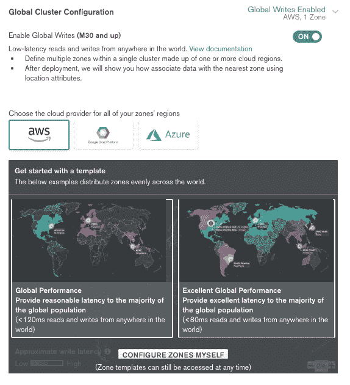
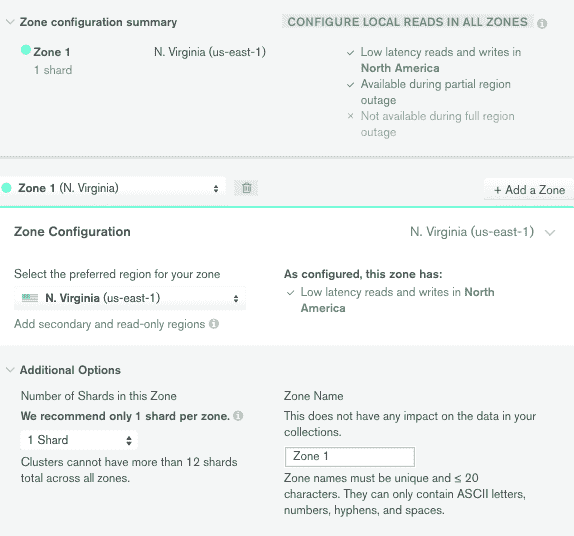
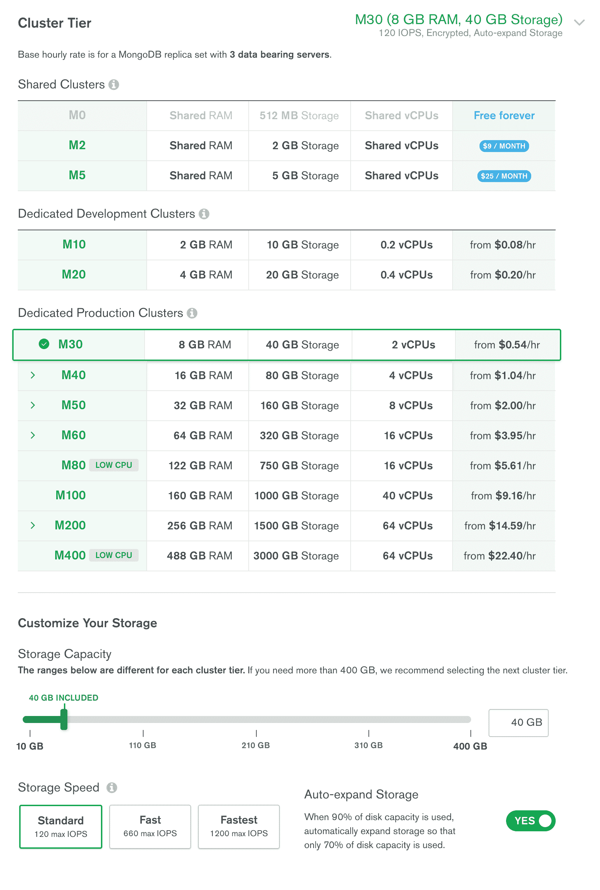
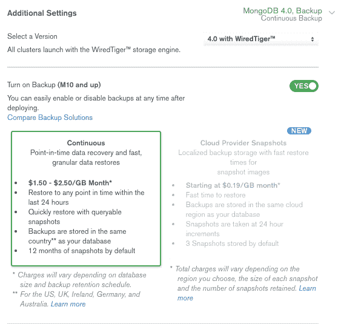
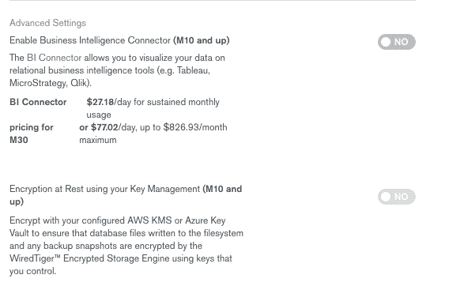
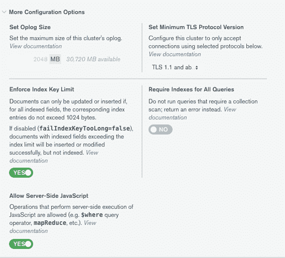
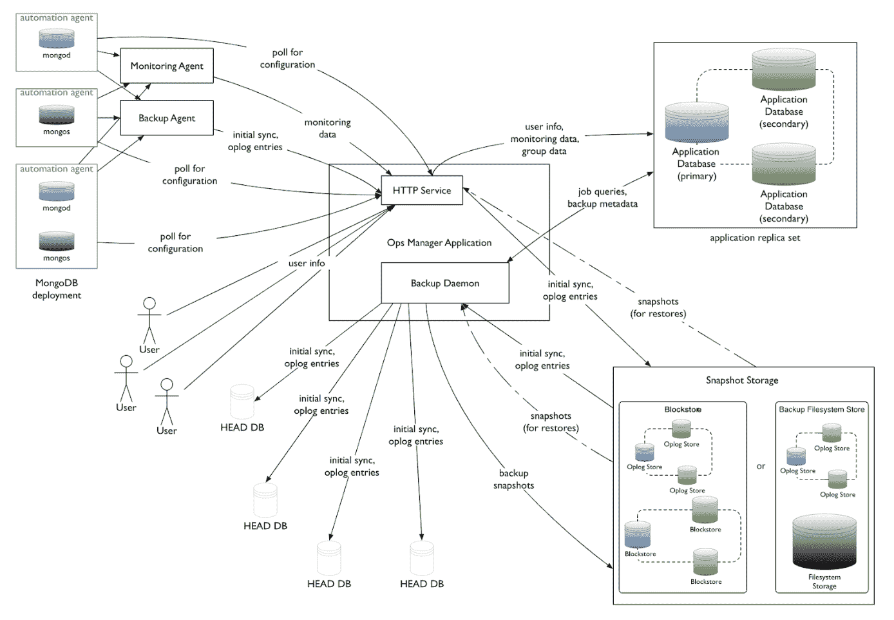

# 第十章：MongoDB Tooling

功能、稳定性和良好的驱动程序支持都很重要；然而，另一个对软件产品成功至关重要的领域是围绕它构建的生态系统。MongoDB（最初名为 10gen Inc.）在 8 年前的 2011 年推出了 MMS，并当时被视为一项创新。在本章中，我们将介绍 MongoDB 可用的一套不同工具，并探讨它们如何提高生产力：

+   MongoDB 企业 Kubernetes 运算符

+   MongoDB Mobile

+   MongoDB Stitch

+   MongoDB Sync

# 介绍

**MongoDB 监控服务**（**MMS**）是一个大多数免费的**软件即服务**（**SaaS**）解决方案，可以监视和访问任何注册到它的数据库的诊断信息。当它推出时，它极大地帮助了 10gen 的工程师解决客户遇到的任何问题。从那时起，工具已成为 MongoDB 演进的核心。

# MongoDB Atlas

MongoDB Atlas 是 MongoDB 的**数据库即服务**（**DBaaS**）产品。它作为多云产品提供，支持**亚马逊网络服务**（**AWS**）、微软 Azure 和谷歌云平台。

使用 DBaaS，补丁和小版本升级会自动应用，无需任何停机时间。使用**图形用户界面**（**GUI**），开发人员可以部署地理分布式数据库实例，以避免任何单点故障。对于访问量大的网站，这也可以通过将数据库服务器放置在接近访问其数据的用户的地方来帮助。这是 MongoDB 战略和产品的关键部分，因为他们支持让数据靠近用户。

与大多数 DBaaS 产品类似，Atlas 允许用户使用 GUI 扩展部署。每个部署都位于自己的**虚拟专用云**（**VPC**）上，并可以利用 MongoDB 企业服务器的功能，如加密密钥管理、**轻量目录访问协议**（**LDAP**）和审计功能。

实时迁移服务可用于从现有部署（本地部署、三个支持的云提供商之一或其他 DBaaS 服务，如**mLab**、**Compose**和**ObjectRocket**）迁移数据集，使用相同的 GUI。

# 创建新的集群

使用 MongoDB Atlas 创建新的集群就像点击并通过配置选项进行选择一样简单。在下面的屏幕截图中，我们可以看到创建新集群时可用的所有选项：



以下屏幕截图显示了区域配置摘要：



MongoDB Atlas 中的一个改变游戏规则的设置是能够立即在不同区域和日期中心（对于三个主要云提供商）之间提供地理分布式服务器，目标是使我们的数据尽可能靠近我们的用户。这对性能和法规原因（如**通用数据保护条例**（**GDPR**）对欧盟）都很有用。

通过启用全局写入，我们可以开始配置此设置。使用任何两个模板——全局性能或优秀的全局性能——管理员可以创建服务器配置，使其距离世界各地的任何用户都不到 120 毫秒或 80 毫秒。管理员还可以定义自己的自定义分配，从区域到数据中心。

在区域配置摘要中，我们可以看到我们的设置将如何影响性能的概述。M30 是启用了分片的 MongoDB Atlas 计划，该配置正在（在幕后）为每个区域创建一个分片。我们可以在每个区域创建更多的分片，但目前不建议这样做。

在所有区域启用本地读取配置将在除了用于写入数据的区域之外的每个区域创建本地只读副本集节点。因此，如果我们有三个区域（*A*，*B*和*C*），我们最终会发现*A*的写入会发送到*A*，但来自*A*的读取将在*A*区域的服务器上进行，或者*B*或*C*，取决于哪个服务器对用户更近。对于*B*和*C*区域也是一样的。

这一部分对于复杂的多区域部署可能是最重要的，应该非常小心对待。

接下来是配置我们想要用于我们集群的服务器：



这类似于我们在 EC2 或 Microsoft Azure 中选择服务器的方式。需要注意的主要点是我们可以选择自定义的 IOPS（每秒 I/O 操作数）性能，并且我们应该选择自动扩展存储选项，以避免磁盘容量不足。除此选项外，始终有必要关注存储分配，以避免在结算周期结束时产生过多费用。

在下一个面板中，我们可以为我们的集群配置备份和高级选项。以下截图显示了连续备份的附加设置：



以下截图显示了启用 BI 连接器的高级设置选项：



以下截图显示了可用的更多配置选项：



# 重要提示

MongoDB 在 MongoDB Atlas 中提供了一些有用的提示，包括以下内容：

+   尽可能使用最新版本的 MongoDB。

+   在撰写时，使用最新的**传输层安全性**（**TLS**）版本，即 1.3。

+   静态加密不能与连续备份一起使用。我们需要选择云提供商的快照才能使用此功能。

+   除非我们知道为什么需要，否则最好禁用服务器端 JavaScript，例如当我们有传统的 MapReduce 作业时。

+   对所有查询需要索引可能是有用的，如果我们有一个明确定义的业务案例和对如何使用数据库的要求，和/或者我们预期我们的数据集会非常大，以至于在没有索引的情况下查询几乎是不可能的。

+   最后，我们可以选择我们的集群名称。创建后无法更改，因此在单击“创建集群”按钮之前与团队成员达成一致意见非常重要。

经过一段时间的等待，我们的集群将投入运行，我们将能够通过普通的旧 MongoDB URI 连接到它。

# MongoDB Cloud Manager

Cloud Manager 以前被称为**MongoDB 管理服务**（**MMS**），在此之前被称为**MongoDB 监控服务**（**MMS**），是一个托管的 SaaS，用于本地部署的 MongoDB。

作为 DBaaS 解决方案的 Atlas 可以为数据库管理提供端到端的解决方案。对于许多用例来说，这可能是不可行的。在这种情况下，可能有意义以按需付费的方式使用一些功能。

Cloud Manager 有一个有限的免费层和几个付费层。

以下是 Cloud Manager 的一些关键特性：

+   自动备份

+   超过 100 个数据库指标和**关键绩效指标**（**KPIs**）可用于跟踪 MongoDB 的性能

+   定制的警报，可以与 PagerDuty、电子邮件和短信等第三方系统集成

+   统一的操作视图，可以通过直接查询其 JSON API，或者将其与 New Relic 等流行的性能跟踪解决方案集成

高级计划还提供关于性能和索引的建议。Cloud Manager 的唯一要求是在我们的应用程序中安装所需的代理。

# MongoDB Ops Manager

在许多方面，Ops Manager 与 Cloud Manager 不同。与 Cloud Manager 相比，它是一个可下载的可执行文件，适用于 Windows Server、**Red Hat Enterprise Linux**（**RHEL**）或 Ubuntu。

在此基础上，用户需要在自己的基础设施中安装和管理服务。

除了这个区别，Ops Manager 还可以帮助实现与 Cloud Manager 类似的目标：

+   监控超过 100 个性能指标

+   自动安装和升级集群；加索引维护可以实现零停机

+   用于连续、增量备份和恢复到特定时间点

+   查询优化

+   索引建议

Ops Manager 的一个示例拓扑如下：



除了 Ops Manager 和 MongoDB 节点，如果启用了备份，我们还需要快照存储。

如果我们需要一个本地解决方案来保障安全性或其他原因，Ops Manager 可能是 Cloud Manager 的更好选择。这是 MongoDB Enterprise Server 付费解决方案的一部分。

# MongoDB Charts

MongoDB Charts 是一个从 MongoDB 数据生成可视化的工具。它使非技术人员可以使用 GUI 查询 MongoDB 数据库，并与同事分享结果。

MongoDB Charts 可以创建一系列图表，包括以下内容：

+   柱状图和条形图参考

+   线性和面积图参考

+   网格图表：

+   热力图参考

+   散点图参考

+   圆环图参考

+   文本图表：数字图表参考

与 Ops Manager 类似，它是一个独立的可执行文件，利用 Docker 在本地安装和管理。

使用副本集辅助节点进行图表查询。理想情况下，使用辅助、隐藏、不可选举节点作为副本集中的分析节点。

# MongoDB Compass

MongoDB Compass 类似于 MongoDB Charts，但在图表功能方面功能较少，更加重视运行临时查询并连接到我们的数据库，而无需使用命令行界面。

Compass 提供了通过 GUI 查询 MongoDB 和可视化构建查询的功能。它可以对结果数据集提供丰富的可视化，并帮助通过点和点击界面构建聚合查询。

Compass 还为大多数围绕查询和索引性能的管理查询提供可视化，因此可以从数据库管理员的角度监视和排除集群。它公开了一个 API，可用于导入或开发插件。

非技术用户的一个有用功能是能够下载一个只读版本，以限制对非破坏性操作的访问。此工具还有一个隔离版本，可用于限制连接到单个选择的服务器。这些请求也将进行 TLS 加密。

Compass 可在 Windows、OSX、Red Hat 和 Ubuntu 上作为可执行下载文件提供。MongoDB Compass 有一个有限的免费版本，完整功能集可通过 MongoDB 订阅包获得。

# MongoDB 业务智能连接器（BI）

MongoDB Connector for BI 是非开发人员最有用的工具之一。它是 MongoDB Enterprise Advanced 订阅的一部分，可以使用标准 SQL 查询与 BI 工具集成。

它使 MongoDB 能够与 Tableau、Qlik、Spotfire、Cognos、MicroStrategy 和 SAP BusinessObjects 等企业工具集成。

它可作为可执行下载文件提供给 Amazon Linux、Debian、OSX、Red Hat、SUSE、Ubuntu 和 Windows 平台，并且可以与本地数据库和 MongoDB Atlas 一起使用。一旦安装和配置正确，它可以提供大多数 BI 工具可以使用的**开放数据库连接**（**ODBC**）**数据源名称**（**DSN**）。

# Kubernetes 简介

Kubernetes ([`kubernetes.io`](https://kubernetes.io))是一个用于自动化部署、扩展和管理容器化应用程序的开源容器编排系统。通俗地说，我们可以使用 Kubernetes（通常称为 k8s）来管理通过容器部署的应用程序。Kubernetes 最初是在 Google 开发的，现在由**Cloud Native Computing Foundation** (**CNCF**)维护。

最广泛使用的容器技术可能是 Docker。我们可以在任何 PC 上下载和安装 Docker，并通过几个命令安装一个与我们的主机系统隔离并包含我们的应用程序代码的 Docker 镜像。Docker 执行操作系统级虚拟化，所有容器都由主机的操作系统内核运行。这导致容器比完整虚拟机（VM）更轻量级。

可以使用**Docker Swarm**来编排多个 Docker 容器。这类似于 Kubernetes，有时这两个系统会直接进行比较。

MongoDB 提供了可以帮助管理员使用 Kubernetes 部署和管理 MongoDB 集群的工具。

# 企业 Kubernetes Operator

从 MongoDB 4.0 开始，**MongoDB Enterprise Operator for Kubernetes**使用户能够直接从 Kubernetes API 部署和管理 MongoDB 集群。这避免了直接连接到 Cloud Manager 或 Ops Manager 的需要，并简化了 Kubernetes 集群的部署和管理。

Cloud Manager 在大多数方面相当于 Ops Manager 的 SaaS 版本。

可以使用 Helm，Kubernetes 的软件包管理器，安装企业 Kubernetes Operator。首先，我们必须从 MongoDB 克隆 GitHub 存储库：[`github.com/mongodb/mongodb-enterprise-kubernetes.git`](https://github.com/mongodb/mongodb-enterprise-kubernetes.git)。

当我们将目录更改为我们的本地副本后，我们可以发出以下命令：

```sql
helm install helm_chart/ --name mongodb-enterprise
```

然后我们将安装本地副本；下一步是配置它。

通过配置我们的本地安装，我们需要应用一个 Kubernetes `ConfigMap`文件。我们需要从 Ops Manager 或 Cloud Manager 复制的配置设置如下：

+   **基本 URL**：Ops Manager 或 Cloud Manager 的 URL。对于 Cloud Manager，这将是[`cloud.mongodb.com`](http://cloud.mongodb.com)；对于 Ops Manager，这应该类似于`http://<MY_SERVER_NAME>:8080/`。

+   **项目 ID**：Ops Manager 项目的 ID，Enterprise Kubernetes Operator 将部署到该项目中。这应该在 Ops Manager 或 Cloud Manager 中创建，并且是用于组织 MongoDB 集群并为项目提供安全边界的唯一 ID。它应该是一个 24 位十六进制字符串。

+   **用户**：现有的 Ops Manager 用户名。这是 Ops Manager 中用户的电子邮件，我们希望 Enterprise Kubernetes Operator 在连接到 Ops Manager 时使用。

+   **公共 API 密钥**：这是 Enterprise Kubernetes Operator 用于连接到 Ops Manager REST API 端点的密钥。

这是通过在 Ops Manager 控制台上点击用户名并选择帐户来创建的。在下一个屏幕上，我们可以点击公共 API 访问，然后点击“生成”按钮并提供描述。下一个屏幕将显示我们需要的公共 API 密钥。

这是我们唯一一次查看此 API 密钥的机会，所以我们需要把它写下来，否则我们将需要重新生成一个新的密钥。

一旦我们有了这些值，我们就可以创建 Kubernetes `ConfigMap`文件，文件名可以任意，只要是`.yaml`文件即可。在我们的情况下，我们将命名为`mongodb-project.yaml`。

其结构将如下所示：

```sql
apiVersion: v1
kind: ConfigMap
metadata:
 name:<<any sample name we choose(1)>>
 namespace: mongodb
data:
 projectId:<<Project ID from above>>
 baseUrl: <<BaseURI from above>>
```

然后我们可以使用以下命令将此文件应用到 Kubernetes：

```sql
kubectl apply -f mongodb-project.yaml
```

我们需要采取的最后一步是创建 Kubernetes 秘钥。可以使用以下命令来完成：

```sql
kubectl -n mongodb create secret generic <<any sample name for credentials we choos>> --from-literal="user=<<User as above>>" --from-literal="publicApiKey=<<our public api key as above>>"
```

我们需要记下凭据名称，因为我们在后续步骤中会用到它。

现在我们准备使用 Kubernetes 部署我们的副本集！我们可以创建一个名为`replica-set.yaml`的文件，其结构如下：

```sql
apiVersion: mongodb.com/v1
kind: MongoDbReplicaSet
metadata:
 name: <<any replica set name we choose>>
 namespace: mongodb
spec:
 members: 3
 version: 3.6.5
persistent: false
project: <<the name value (1) that we chose in metadata.name of ConfigMap file above>>
credentials: <<the name of credentials secret that we chose above>>
```

我们使用`kubectl apply`应用新配置：

```sql
kubectl apply -f replica-set.yaml
```

我们将能够在 Ops Manager 中看到我们的新副本集。

要使用 Kubernetes 对 MongoDB 进行故障排除和识别问题，我们可以使用

`kubectl logs`用于检查日志，`kubectl exec`用于进入运行 MongoDB 的容器之一。

# MongoDB Mobile

MongoDB Mobile 是 MongoDB 数据库的移动版本。它针对智能手机和物联网传感器，通过嵌入式 MongoDB。MongoDB Mobile 有两个核心部分：

+   在设备上本地运行的 MongoDB 数据库服务器，实现对数据的离线访问。该数据库是 MongoDB Server Community Edition 的精简版本，不包含 Mobile 不需要的任何功能（例如复制）。

+   本机 Java 和 Android SDK 提供对数据库的低级访问，并与本地 Mobile 数据库和任何 MongoDB Stitch 后端进行交互。

Mobile SDK 有两种操作模式。在本地模式下，SDK 只允许访问本地 Mobile 数据库，并且无法与 Atlas 中的任何外部源进行同步。在远程模式下，SDK 可以访问 MongoDB Atlas 和 MongoDB Mobile 数据库，并在它们之间进行同步。

以下是 MongoDB Mobile 相对于服务器版本的一些限制：

+   不支持复制

+   不支持分片

+   没有数据库身份验证；但是，MongoDB Mobile 数据库只接受源自应用程序的连接

+   没有 SSL

+   静态加密

+   不支持更改流

+   没有服务器端 JavaScript 评估（出于性能原因）

+   没有多文档 ACID 事务

要设置 MongoDB Mobile，我们需要先下载并安装 MongoDB Stitch SDK。然后，创建和查询本地 MongoDB 数据库就像几行代码一样简单（此示例为 Android）：

```sql
Import packages:
// Base Stitch Packages
import com.mongodb.stitch.android.core.Stitch;
import com.mongodb.stitch.android.core.StitchAppClient;
// Packages needed to interact with MongoDB and Stitch
import com.mongodb.client.MongoClient;
import com.mongodb.client.MongoCollection;
// Necessary component for working with MongoDB Mobile
import com.mongodb.stitch.android.services.mongodb.local.LocalMongoDbService;
```

初始化数据库如下：

```sql
// Create the default Stitch Client
final StitchAppClient client =
  Stitch.initializeDefaultAppClient("<APP ID>");
// Create a Client for MongoDB Mobile (initializing MongoDB Mobile)
final MongoClient mobileClient =
  client.getServiceClient(LocalMongoDbService.clientFactory);
```

接下来，获取对数据库的引用：

```sql
MongoCollection<Document> localCollection =
  mobileClient.getDatabase("my_db").getCollection("my_collection");
```

插入`document`如下：

```sql
localCollection.insertOne(document);
```

然后，使用`first()`找到第一个文档：

```sql
Document doc = localCollection.find().first();
```

与 MongoDB Stitch 一起使用时，MongoDB Mobile 的功能最强大，我们将在下一节中探讨。

# MongoDB Stitch

MongoDB Stitch 是 MongoDB 的无服务器平台。它基于功能的四个不同领域：

+   第一个领域是 QueryAnywhere。QueryAnywhere 允许客户端应用程序使用其查询语言访问 MongoDB。我们可以在 Stitch 服务器上按照每个集合的基础定义数据访问规则，以允许我们根据用户数据（`userId`）过滤结果。

+   第二个领域是 Stitch 函数。这些是简单的 JavaScript 函数，可以在 Stitch 平台内部无需服务器执行。通过使用 Stitch 函数，我们可以实现应用程序逻辑，公开 API，并与第三方服务构建集成。这项服务与亚马逊的 AWS Lambda 非常相似。

+   第三个领域是 Stitch 触发器。类似于 MongoDB 服务器的更改流和触发器，它们用于关系数据库，Stitch 触发器通过响应数据库状态的变化实时执行用户定义的函数。

+   最后，还有 Stitch Mobile Sync，它将 Stitch 无服务器提供与 Mobile MongoDB 的桥接。通过使用它，我们可以开发一个在智能手机上具有本地 MongoDB 数据库的 Mobile 服务，该数据库与我们在云中的 MongoDB Atlas 数据库完美同步。

通过这种方式，我们可以在应用程序中本地查询数据，无需延迟，甚至在离线状态下，依靠 Stitch Mobile Sync 来保持我们的数据存储最新。

Stitch 可用于 Web（JavaScript）、Android 和 macOS（Swift）。

# QueryAnywhere

QueryAnywhere 允许直接从客户端应用程序查询 MongoDB 服务器数据。一个关键的区分和功能，允许我们安全地定义数据访问规则，以根据文档内容或登录用户过滤结果。

# 规则

MongoDB 规则是角色和分配给该角色的权限的组合。角色定义了一组用户，这些用户将具有对文档的相同读/写访问权限。Stitch 中的角色可以使用**apply-when**规则进行定义。

这可以使用`%%`变量表示法来定义：

```sql
{
  "createdBy": "%%user.id"
}
```

每个角色可以有一个或多个权限，定义了他们可以在文档中读取和/或写入哪些字段。

MongoDB Stitch 还提供了四个预定义角色和权限的模板，围绕最常见的用例。

+   用户只能读取和写入自己的数据。

+   用户可以读取所有数据，但只能写入自己的数据。

+   用户只能读取所有数据。

+   用户可以读取和写入自己的数据。属于共享列表的用户可以读取该数据。

授权在规则之前应用。如果用户未经授权访问集合，它们的规则将根本不会被评估。

# 函数

Stitch 函数可用于执行服务器端应用程序逻辑。它们是用 JavaScript ES6+编写的，不需要服务器。

以下是函数的一些关键限制：

+   它们一旦返回就停止执行

+   它们可以运行长达 60 秒，使用高达 256 MB 的内存

+   它们不能导入模块或使用一些核心 JavaScript 功能，例如全局对象类型、数学、数字、字符串、数组和对象 API

Stitch 函数可以通过 CLI 或从 Stitch UI 导入。对于我们命名为`multiply`的简单函数，我们可以在 UI 中添加以下代码：

```sql
exports = function(a, b) {
 return a * b;
};
```

然后我们可以从另一个函数、webhook 或 Stitch 中的触发器调用它：

```sql
context.functions.execute("multiply", a, b);
```

我们还可以在 Stitch JSON 表达式中使用`%function`触发其执行：

```sql
{
 "%%true": {
   "%function": {
     "name": "multiply",
     "arguments": [3,4]
   }
 }
}
```

我们甚至可以使用 Stitch SDK（JavaScript、Android 或 macOS）从我们的客户端应用程序调用此函数：

```sql
const client = Stitch.defaultAppClient;
client.callFunction("multiply", [3, 4]).then(result => {
console.log(result) // Output: 12
});
```

# 触发器

触发器是基于 Stitch 函数构建的，用于在数据库触发器发生数据库集合更改时执行，或者在使用身份验证触发器修改用户时执行身份验证逻辑。

数据库触发器可以在`INSERT`，`UPDATE`，`REPLACE`和`DELETE`数据库操作中执行。

所有这些值都需要区分大小写。

我们需要定义**链接函数**，即触发器触发后将执行的函数。对于`UPDATE`操作的一个有趣选项是`fullDocument`。当设置为`true`时，这将包括操作的完整结果。这始终受到 16 MB 文档大小限制的限制，因此接近 16 MB 限制的文档的更新可能会失败，因为结果将超出限制。

另一方面，身份验证触发器允许我们在身份验证事件上执行自定义代码。这些可以在以下提供程序的`CREATE`，`LOGIN`和`DELETE`操作类型上触发：

+   `oauth2-google`

+   `oauth2-facebook`

+   `custom-token`

+   `local-userpass`

+   `api-key`

+   `anon-user`

身份验证操作类型区分大小写，需要全部大写。最多可以同时执行 50 个触发器。如果我们尝试调用更多，它们将排队等待以**先进先出**（**FIFO**）的方式进行处理。

触发器与 RDBMS 触发器功能非常相似，而且它们易于灵活地通过 Stitch 触发器的 GUI 控制台进行管理。

# Mobile Sync

MongoDB Stitch Mobile Sync 中的最新添加之一可以在 MongoDB Mobile 和服务器后端之间无缝同步数据（在撰写本文时，它必须托管在 MongoDB Atlas 上）。Mobile Sync 还基于更改流来监听本地和远程数据库之间的数据更改。随着本地 Mobile 数据库中的数据更改，我们可能会遇到本地和远程状态之间的冲突。这就是为什么我们需要定义一些处理程序来指定在这种情况下应该发生什么。我们需要为我们的模型实现三个接口：

+   `ConflictHandler`

+   `ErrorListener`

+   `ChangeEventListener`

`ConflictHandler`有一个方法，参数是冲突本地和远程事件的`documentId`，返回冲突的解决方案，如下所示：

```sql
DocumentT resolveConflict(BsonValue documentId,
                         ChangeEvent<DocumentT> localEvent,
                         ChangeEvent<DocumentT> remoteEvent)
```

`ErrorListener`不返回任何内容，并在发生`documentId`和非网络相关异常的错误时调用：

```sql
void onError(BsonValue documentId,Exception error)
```

最后，`ChangeEventListener`也不返回任何值，并在给定`documentId`的任何更改`event`发生时调用：

```sql
void onEvent(BsonValue documentId, ChangeEvent<DocumentT> event)
```

# 总结

在这一章中，我们通过不同的 MongoDB 工具，并学习如何使用它们来提高生产力。从 MongoDB Atlas 开始，这是托管的 DBaaS 解决方案，我们接着介绍了 Cloud Manager 和 Ops Manager，并探讨了它们之间的区别。

然后，我们深入了解了 MongoDB Charts 和 MongoDB Compass——基于 GUI 的 MongoDB 管理工具。我们了解了 MongoDB Connector for BI 以及它如何对我们的目的有用。然后我们讨论了 Kubernetes，它与 Docker 和 Docker Swarm 的比较，以及我们如何将 Kubernetes 与 MongoDB Enterprise Operator 一起使用。接下来的部分专门介绍了 MongoDB Mobile 和 Stitch——MongoDB 4.0 中的两个重大增强。我们介绍了使用 Stitch 功能的实际示例，特别是 QueryAnywhere、触发器和函数。最后，我们简要介绍了 Mobile Sync，这是 MongoDB 武器库中最新的增加之一，并探讨了它如何用于将我们的移动应用程序与基于云的数据库同步。

在下一章中，我们将转变方向，处理如何使用 MongoDB 处理大数据，以摄取和处理大型流式和批处理数据集。
