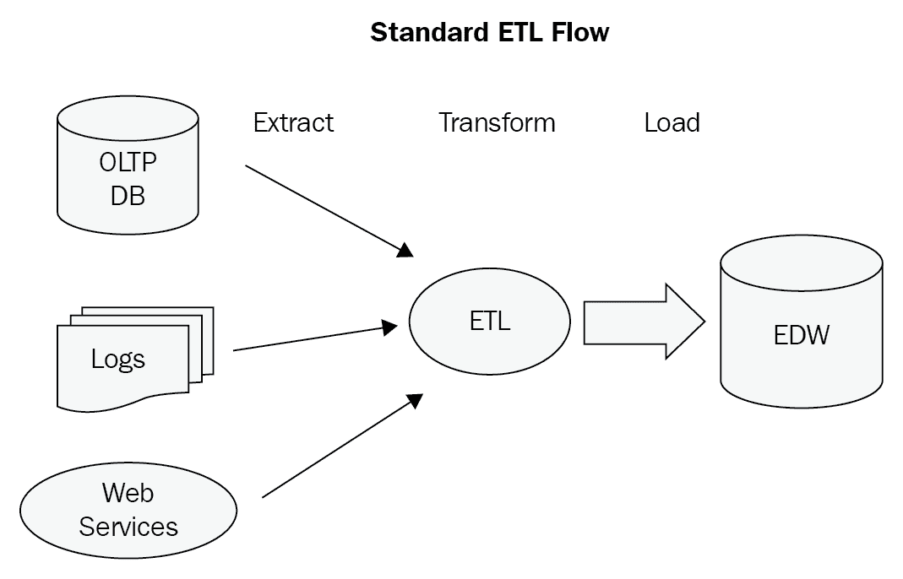
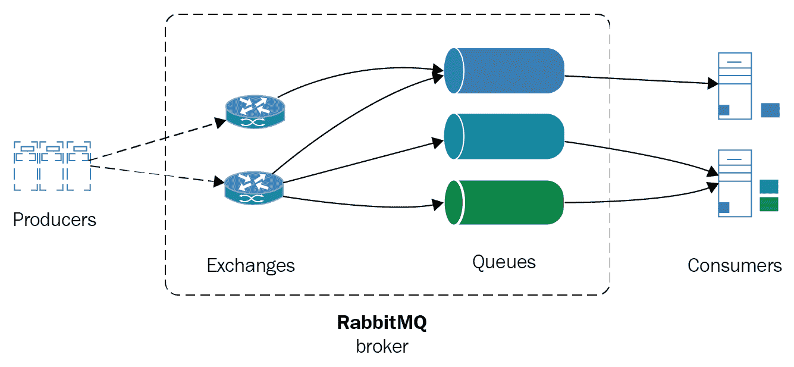
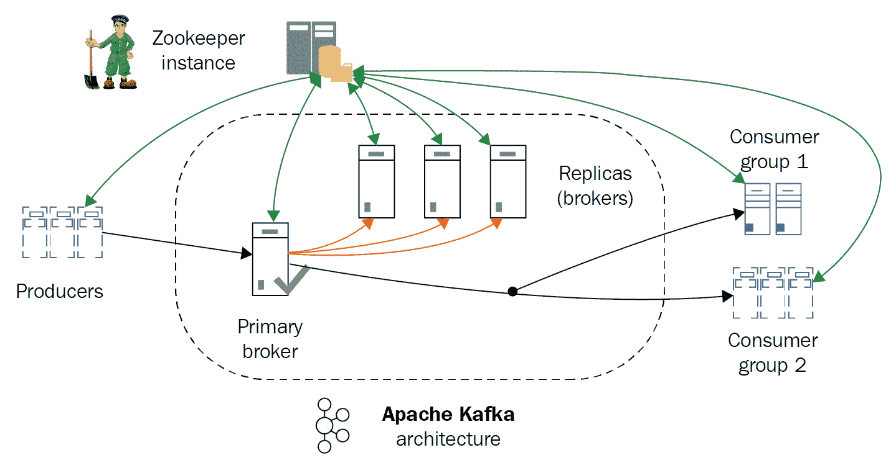
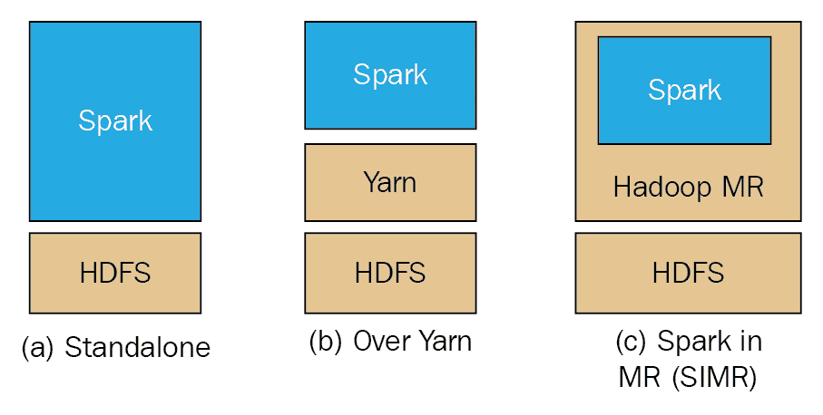
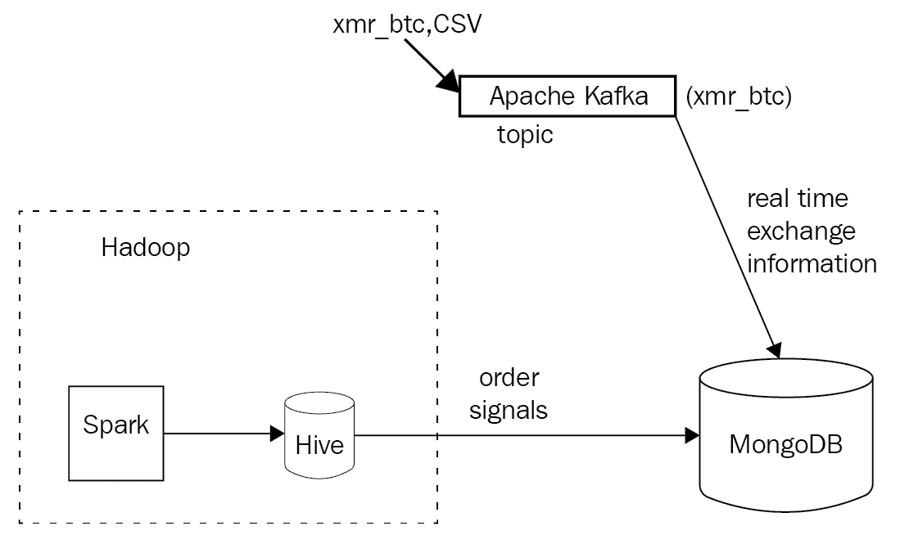

# 第十一章：利用 MongoDB 进行大数据处理

MongoDB 通常与大数据管道一起使用，因为它具有高性能、灵活性和缺乏严格的数据模式。本章将探讨大数据领域以及 MongoDB 如何与消息队列、数据仓库和 ETL 管道配合使用。

我们将在本章讨论以下主题：

+   什么是大数据？

+   消息队列系统

+   数据仓库

+   使用 Kafka、Spark 在 HDFS 上以及 MongoDB 的大数据用例

# 什么是大数据？

在过去的五年里，访问和使用互联网的人数几乎翻了一番，从不到 20 亿增加到约 37 亿。全球一半的人口现在都在网上。

随着互联网用户数量的增加，以及网络的发展，每年都会向现有数据集中添加更多的数据。2016 年，全球互联网流量为 1.2 泽字节（相当于 1.2 亿兆字节），预计到 2021 年将增长到 3.3 泽字节。

每年产生的大量数据意味着数据库和数据存储通常必须能够高效扩展和处理我们的数据。

**大数据**这个术语最早是由 John Mashey 在 1980 年代提出的（[`static.usenix.org/event/usenix99/invited_talks/mashey.pdf`](http://static.usenix.org/event/usenix99/invited_talks/mashey.pdf)），并且在过去的十年中随着互联网的爆炸性增长而开始流行起来。大数据通常指的是那些传统数据处理系统无法处理的过大和复杂的数据集，因此需要一些专门的系统架构来处理。

大数据的定义特征通常如下：

+   容量

+   多样性

+   速度

+   真实性

+   变异性

多样性和变异性指的是我们的数据以不同的形式出现，我们的数据集存在内部不一致性。这些需要通过数据清洗和规范化系统进行平滑处理，然后我们才能实际处理我们的数据。

真实性指的是数据质量的不确定性。数据质量可能会有所不同，对于某些日期来说是完美的数据，而对于其他日期来说则是缺失的数据集。这影响了我们的数据管道以及我们可以投入到数据平台中的数量，因为即使在今天，三分之一的商业领导人也不完全信任他们用来做出商业决策的信息。

最后，速度可能是大数据最重要的定义特征（除了明显的容量属性），它指的是大数据集不仅具有大量数据，而且增长速度加快。这使得传统的存储方式，比如索引，成为一项困难的任务。

# 大数据领域

大数据已经发展成一个影响经济各个领域的复杂生态系统。从炒作到不切实际的期望，再到现实，如今大多数财富 1000 强公司都实施和部署了大数据系统，为企业创造了真正的价值。

如果我们按行业对参与大数据领域的公司进行分段，可能会得出以下几个部分：

+   基础设施

+   分析

+   应用-企业

+   应用-行业

+   跨基础设施分析

+   数据来源和 API

+   数据资源

+   开源

从工程角度来看，我们可能更关心的是底层技术，而不是它们在不同行业领域的应用。

根据我们的业务领域，我们可能会从不同的来源获取数据，比如事务性数据库、物联网传感器、应用服务器日志、通过 Web 服务 API 的其他网站，或者只是纯粹的网页内容提取：



# 消息队列系统

在先前描述的大多数流程中，我们有数据被提取、转换、加载（ETL）到企业数据仓库（EDW）。为了提取和转换这些数据，我们需要一个消息队列系统来处理流量激增、临时不可用的端点以及可能影响系统可用性和可伸缩性的其他问题。

消息队列还可以在消息的生产者和消费者之间提供解耦。这通过将我们的消息分成不同的主题/队列来实现更好的可伸缩性。

最后，使用消息队列，我们可以拥有不关心消息生产者所在位置的位置不可知服务，这提供了不同系统之间的互操作性。

在消息队列世界中，目前在生产中最受欢迎的系统是 RabbitMQ、ActiveMQ 和 Kafka。在我们深入研究使用案例之前，我们将对它们进行简要概述。

# Apache ActiveMQ

Apache ActiveMQ 是一个用 Java 编写的开源消息代理，配有完整的 Java 消息服务（JMS）客户端。

它是我们在这里检查的三种实现中最成熟的，有着成功的生产部署的悠久历史。许多公司提供商业支持，包括 Red Hat。

这是一个相当简单的排队系统，可以轻松设置和管理。它基于 JMS 客户端协议，是 Java EE 系统的首选工具。

# RabbitMQ

另一方面，RabbitMQ 是用 Erlang 编写的，基于高级消息队列协议（AMQP）协议。AMQP 比 JMS 更强大和复杂，因为它允许点对点消息传递、请求/响应和发布/订阅模型，用于一对一或一对多的消息消费。

在过去的 5 年中，RabbitMQ 变得越来越受欢迎，现在是搜索量最大的排队系统。

RabbitMQ 的架构概述如下：



RabbitMQ 系统的扩展是通过创建一组 RabbitMQ 服务器集群来完成的。集群共享数据和状态，这些数据和状态是复制的，但消息队列在每个节点上是独立的。为了实现高可用性，我们还可以在不同节点中复制队列。

# Apache Kafka

另一方面，Kafka 是由 LinkedIn 首先为其自身内部目的开发的排队系统。它是用 Scala 编写的，从根本上设计为水平可伸缩和尽可能高的性能。

专注于性能是 Apache Kafka 的关键区别因素，但这意味着为了实现性能，我们需要牺牲一些东西。Kafka 中的消息没有唯一的 ID，而是通过它们在日志中的偏移量来寻址。Apache Kafka 消费者不受系统跟踪；这是应用程序设计的责任。消息排序是在分区级别实现的，消费者有责任确定消息是否已经被传递。

语义学是在 0.11 版本中引入的，并且是最新的 1.0 版本的一部分，因此消息现在可以在分区内严格排序，并且每个消费者始终只能到达一次：



# 数据仓库

使用消息队列系统只是我们数据管道设计的第一步。在消息队列的另一端，我们通常会有一个数据仓库来处理大量到达的数据。那里有很多选择，本书的重点不是讨论这些选择或进行比较。然而，我们将简要介绍 Apache 软件基金会中最广泛使用的两个选项：Apache Hadoop 和 Apache Spark。

# Apache Hadoop

第一个，也可能仍然是最广泛使用的大数据处理框架是 Apache Hadoop。它的基础是**Hadoop 分布式文件系统**（**HDFS**）。在 2000 年代由 Yahoo!开发，最初是作为**Google 文件系统**（**GFS**）的开源替代品，GFS 是谷歌用于分布式存储其搜索索引的文件系统。

Hadoop 还实现了一个 MapReduce 替代方案，用于谷歌专有系统的 Hadoop MapReduce。与 HDFS 一起，它们构成了一个分布式存储和计算的框架。用 Java 编写，具有大多数编程语言的绑定和许多提供抽象和简单功能的项目，有时基于 SQL 查询，这是一个可靠地用于存储和处理几十亿甚至拍它字节数据的系统。

在后续版本中，Hadoop 通过引入**Yet Another Resource Negotiator**（**YARN**）变得更加模块化，为应用程序提供了在 Hadoop 之上开发的抽象。这使得几个应用程序可以部署在 Hadoop 之上，例如**Storm**，**Tez**，**OpenMPI**，**Giraph**，当然还有**Apache Spark**，我们将在接下来的部分中看到。

Hadoop MapReduce 是一个面向批处理的系统，意味着它依赖于批量处理数据，并不适用于实时用例。

# Apache Spark

Apache Spark 是加州大学伯克利分校 AMPLab 的集群计算框架。Spark 并不是完整的 Hadoop 生态系统的替代品，而主要是 Hadoop 集群的 MapReduce 方面。而 Hadoop MapReduce 使用磁盘批处理操作来处理数据，Spark 则同时使用内存和磁盘操作。预期地，对于适合内存的数据集，Spark 更快。这就是为什么它对于实时流应用更有用，但也可以轻松处理不适合内存的数据集。

Apache Spark 可以在 HDFS 上使用 YARN 或独立模式运行，如下图所示：



这意味着在某些情况下（例如我们将在下面的用例中使用的情况），如果我们的问题确实在 Spark 的能力范围内得到了很好的定义和限制，我们可以完全放弃 Hadoop 而选择 Spark。

对于内存操作，Spark 可能比 Hadoop MapReduce 快 100 倍。Spark 为 Scala（其本地语言），Java，Python 和 Spark SQL（SQL92 规范的变体）提供了用户友好的 API。Spark 和 MapReduce 都具有容错性。Spark 使用分布在整个集群中的 RDD。

从总体上看，根据 Spark 的架构，我们可以有几个不同的 Spark 模块一起工作，满足不同的需求，从 SQL 查询到流处理和机器学习库。

# 将 Spark 与 Hadoop MapReduce 进行比较

Hadoop MapReduce 框架更常与 Apache Spark 进行比较，后者是一种旨在解决类似问题空间中问题的新技术。它们最重要的属性总结在下表中：

|  | **Hadoop MapReduce** | **Apache Spark** |
| --- | --- | --- |
| 编写语言 | Java | Scala |
| 编程模型 | MapReduce | RDD |
| 客户端绑定 | 大多数高级语言 | Java，Scala，Python |
| 使用便捷性 | 中等，具有高级抽象（Pig，Hive 等） | 良好 |
| 性能 | 批处理高吞吐量 | 流处理和批处理模式高吞吐量 |
| 使用 | 磁盘（I/O 受限） | 内存，如果需要磁盘会降低性能 |
| 典型节点 | 中等 | 中等大 |

从上述比较可以看出，这两种技术都有优缺点。Spark 在性能方面可能更好，特别是在使用较少节点的问题上。另一方面，Hadoop 是一个成熟的框架，具有出色的工具，几乎可以覆盖每种用例。

# MongoDB 作为数据仓库

Apache Hadoop 经常被描述为大数据框架中的 800 磅大猩猩。另一方面，Apache Spark 更像是一只 200 磅的猎豹，因为它的速度、敏捷性和性能特点，使其能够很好地解决 Hadoop 旨在解决的一部分问题。

另一方面，MongoDB 可以被描述为 NoSQL 世界中的 MySQL 等效物，因为它的采用和易用性。MongoDB 还提供聚合框架、MapReduce 功能和使用分片进行水平扩展，这实质上是在数据库级别进行数据分区。因此，一些人自然会想知道为什么我们不使用 MongoDB 作为我们的数据仓库来简化我们的架构。

这是一个相当有说服力的论点，也许使用 MongoDB 作为数据仓库是有道理的，也可能不是。这样做的优势如下：

+   更简单的架构

+   消息队列的需求减少，减少了系统的延迟

缺点如下：

+   MongoDB 的 MapReduce 框架不能替代 Hadoop 的 MapReduce。尽管它们都遵循相同的理念，但 Hadoop 可以扩展以容纳更大的工作负载。

+   使用分片来扩展 MongoDB 的文档存储将在某个时候遇到瓶颈。尽管 Yahoo!报告称其最大的 Hadoop 集群使用了 42,000 台服务器，但最大的 MongoDB 商业部署仅达到 50 亿（Craigslist），而百度的节点数和数据量达到了 600 个节点和 PB 级数据，这家互联网巨头主导着中国互联网搜索市场等领域。

在扩展方面存在一个数量级的差异。

MongoDB 主要设计为基于磁盘上存储数据的实时查询数据库，而 MapReduce 是围绕使用批处理设计的，Spark 是围绕使用数据流设计的。

# 一个大数据用例

将所有这些付诸实践，我们将开发一个完全工作的系统，使用数据源、Kafka 消息代理、在 HDFS 上运行的 Apache Spark 集群，供应 Hive 表，以及 MongoDB 数据库。我们的 Kafka 消息代理将从 API 摄取数据，为 XMR/BTC 货币对流动市场数据。这些数据将传递给 HDFS 上的 Apache Spark 算法，以根据以下内容计算下一个 ticker 时间戳的价格：

+   已经存储在 HDFS 上的历史价格语料库

+   从 API 到达的流动市场数据

然后，这个预测的价格将使用 MongoDB Connector for Hadoop 存储在 MongoDB 中。MongoDB 还将直接从 Kafka 消息代理接收数据，将其存储在一个特殊的集合中，文档过期日期设置为一分钟。这个集合将保存最新的订单，旨在被我们的系统用来购买或出售，使用来自 Spark ML 系统的信号。

例如，如果价格当前为 10，我们出价为 9.5，但我们预计下一个市场 tick 价格会下降，那么系统会等待。如果我们预计下一个市场 tick 价格会上涨，那么系统会将出价提高到 10.01 以匹配下一个 ticker 的价格。

同样，如果价格为 10，我们出价为 10.5，但预计价格会下降，我们会调整我们的出价为 9.99，以确保我们不会为此支付过多。但是，如果预计价格会上涨，我们会立即购买，以在下一个市场 tick 中获利。

在图表上，我们的架构如下：



API 通过将 JSON 消息发布到名为`xmr_btc`的 Kafka 主题来模拟。另一方面，我们有一个 Kafka 消费者将实时数据导入 MongoDB。

我们还有另一个 Kafka 消费者将数据导入 Hadoop，供我们的算法使用，发送推荐数据（信号）到 Hive 表。最后，我们将数据从 Hive 表导出到 MongoDB。

# 设置 Kafka

建立大数据用例环境的第一步是建立一个 Kafka 节点。Kafka 本质上是一个 FIFO 队列，因此我们将使用最简单的单节点（broker）设置。Kafka 使用主题、生产者、消费者和代理来组织数据。

重要的 Kafka 术语如下：

+   **代理**本质上是一个节点。

+   **生产者**本质上是一个写入数据到消息队列的过程。

+   **消费者**是从消息队列中读取数据的过程。

+   **主题**是我们写入和读取数据的特定队列。

Kafka 主题进一步分为多个分区。我们可以在写入主题时，以及在队列的另一端读取数据时，将特定主题的数据拆分为多个代理（节点）。

在我们的本地机器上安装 Kafka，或者选择任何云提供商（有很好的 EC2 教程可以找到），我们可以使用以下单个命令创建一个主题：

```sql
$ kafka-topics  --create --zookeeper localhost:2181 --replication-factor 1  --partitions 1 --topic xmr-btc
Created topic "xmr-btc".
```

这将创建一个名为`xmr-btc`的新主题。

删除主题与创建主题类似，使用以下命令：

```sql
$ kafka-topics --delete --zookeeper localhost:2181 --topic xmr-btc
```

我们可以通过发出以下命令来获取所有主题的列表：

```sql
$ kafka-topics --list --zookeeper localhost:2181
xmr-btc
```

然后我们可以为我们的主题创建一个命令行生产者，只是为了测试我们是否可以将消息发送到队列，就像这样：

```sql
$ kafka-console-producer --broker-list localhost:9092 --topic xmr-btc
```

每行的数据将作为字符串编码的消息发送到我们的主题，我们可以通过发送`SIGINT`信号（通常是*Ctrl* + *C*）来结束这个过程。

之后，我们可以通过启动一个消费者来查看等待在我们队列中的消息：

```sql
$ kafka-console-consumer --zookeeper localhost:2181 --topic xmr-btc --from-beginning
```

这个消费者将从我们的`xmr-btc`主题中读取所有消息，从历史的开始。这对我们的测试目的很有用，但在实际应用中我们会更改这个配置。

在命令中，除了提到`kafka`，您还会看到`zookeeper`。Apache Zookeeper 与 Apache Kafka 一起使用，是一个集中式服务，由 Kafka 内部用于维护配置信息、命名、提供分布式同步和提供组服务。

现在我们已经设置好了我们的代理，我们可以使用[`github.com/agiamas/mastering-mongodb/tree/master/chapter_9`](https://github.com/agiamas/mastering-mongodb/tree/master/chapter_9)上的代码来开始读取消息并将消息写入队列。对于我们的目的，我们使用了由 Zendesk 开发的`ruby-kafka` gem。

为简单起见，我们使用一个单一的类来从磁盘上存储的文件中读取数据，并将其写入我们的 Kafka 队列。

我们的`produce`方法将用于将消息写入 Kafka，如下所示：

```sql
def produce
  options = { converters: :numeric, headers: true }
   CSV.foreach('xmr_btc.csv', options) do |row|
    json_line = JSON.generate(row.to_hash)
    @kafka.deliver_message(json_line, topic: 'xmr-btc')
  end
end
```

我们的`consume`方法将从 Kafka 中读取消息，如下所示：

```sql
def consume
  consumer = @kafka.consumer(group_id: 'xmr-consumers')
  consumer.subscribe('xmr-btc', start_from_beginning: true)
  trap('TERM') { consumer.stop }
  consumer.each_message(automatically_mark_as_processed: false) do |message|
    puts message.value
    if valid_json?(message.value)
      MongoExchangeClient.new.insert(message.value)
      consumer.mark_message_as_processed(message)
    end
  end
  consumer.stop
end
```

请注意，我们使用了消费者组 API 功能（在 Kafka 0.9 中添加）来使多个消费者通过将每个分区分配给单个消费者来访问单个主题。在消费者故障的情况下，其分区将重新分配给组的其余成员。

下一步是将这些消息写入 MongoDB，如下所示：

1.  首先，我们创建我们的集合，以便我们的文档在一分钟后过期。在`mongo` shell 中输入以下内容：

```sql
> use exchange_data
> db.xmr_btc.createIndex( { "createdAt": 1 }, { expireAfterSeconds: 60 })
{
"createdCollectionAutomatically" : true,
"numIndexesBefore" : 1,
"numIndexesAfter" : 2,
"ok" : 1
}
```

这样，我们创建了一个名为`exchange_data`的新数据库，其中包含一个名为`xmr_btc`的新集合，该集合在一分钟后自动过期。要使 MongoDB 自动过期文档，我们需要提供一个带有`datetime`值的字段，以将其值与当前服务器时间进行比较。在我们的情况下，这是`createdAt`字段。

1.  对于我们的用例，我们将使用低级别的 MongoDB Ruby 驱动程序。`MongoExchangeClient`的代码如下：

```sql
class MongoExchangeClient
 def initialize
   @collection = Mongo::Client.new([ '127.0.0.1:27017' ], database: :exchange_data).database[:xmr_btc]
 end
 def insert(document)
   document = JSON.parse(document)
   document['createdAt'] = Time.now
   @collection.insert_one(document)
 end
end
```

此客户端连接到我们的本地数据库，为 TTL 文档过期设置`createdAt`字段，并将消息保存到我们的集合中。

有了这个设置，我们可以将消息写入 Kafka，在队列的另一端读取它们，并将它们写入我们的 MongoDB 集合。

# 设置 Hadoop

我们可以安装 Hadoop，并使用单个节点来完成本章的用例，使用 Apache Hadoop 网站上的说明[`hadoop.apache.org/docs/stable/hadoop-project-dist/hadoop-common/SingleCluster.html`](https://hadoop.apache.org/docs/stable/hadoop-project-dist/hadoop-common/SingleCluster.html)。

按照这些步骤后，我们可以在本地机器上的`http://localhost:50070/explorer.html#/`上浏览 HDFS 文件。假设我们的信号数据写在 HDFS 的`/user/<username>/signals`目录下，我们将使用 MongoDB Connector for Hadoop 将其导出并导入到 MongoDB 中。

MongoDB Connector for Hadoop 是官方支持的库，允许将 MongoDB 数据文件或 BSON 格式的 MongoDB 备份文件用作 Hadoop MapReduce 任务的源或目的地。

这意味着当我们使用更高级别的 Hadoop 生态系统工具时，例如 Pig（一种过程化高级语言）、Hive（一种类似 SQL 的高级语言）和 Spark（一种集群计算框架）时，我们也可以轻松地导出和导入数据到 MongoDB。

# Hadoop 设置步骤

设置 Hadoop 的不同步骤如下：

1.  从[Maven 库](http://repo1.maven.org/maven2/org/mongodb/mongo-hadoop/mongo-hadoop-core/2.0.2/)下载 JAR。

1.  从[`oss.sonatype.org/content/repositories/releases/org/mongodb/mongodb-driver/3.5.0/`](https://oss.sonatype.org/content/repositories/releases/org/mongodb/mongodb-driver/3.5.0/)下载`mongo-java-driver`。

1.  创建一个目录（在我们的情况下，命名为`mongo_lib`），并使用以下命令将这两个 JAR 复制到其中：

```sql
export HADOOP_CLASSPATH=$HADOOP_CLASSPATH:<path_to_directory>/mongo_lib/
```

或者，我们可以将这些 JAR 复制到`share/hadoop/common/`目录下。由于这些 JAR 需要在每个节点上都可用，对于集群部署，使用 Hadoop 的`DistributedCache`将 JAR 分发到所有节点更容易。

1.  下一步是从[`hive.apache.org/downloads.html`](https://hive.apache.org/downloads.html)安装 Hive。在本例中，我们使用了 MySQL 服务器来存储 Hive 的元数据。这可以是用于开发的本地 MySQL 服务器，但建议在生产环境中使用远程服务器。

1.  一旦我们设置好了 Hive，我们只需运行以下命令：

```sql
> hive
```

1.  然后，我们添加之前下载的三个 JAR（`mongo-hadoop-core`、`mongo-hadoop-driver`和`mongo-hadoop-hive`）：

```sql
hive> add jar /Users/dituser/code/hadoop-2.8.1/mongo-hadoop-core-2.0.2.jar;
Added [/Users/dituser/code/hadoop-2.8.1/mongo-hadoop-core-2.0.2.jar] to class path
Added resources: [/Users/dituser/code/hadoop-2.8.1/mongo-hadoop-core-2.0.2.jar]
hive> add jar /Users/dituser/code/hadoop-2.8.1/mongodb-driver-3.5.0.jar;
Added [/Users/dituser/code/hadoop-2.8.1/mongodb-driver-3.5.0.jar] to class path
Added resources: [/Users/dituser/code/hadoop-2.8.1/mongodb-driver-3.5.0.jar]
hive> add jar /Users/dituser/code/hadoop-2.8.1/mongo-hadoop-hive-2.0.2.jar;
Added [/Users/dituser/code/hadoop-2.8.1/mongo-hadoop-hive-2.0.2.jar] to class path
Added resources: [/Users/dituser/code/hadoop-2.8.1/mongo-hadoop-hive-2.0.2.jar]
hive>
```

然后，假设我们的数据在表交换中：

| **customerid                                             ** | **int** |
| --- | --- |
| `pair` | `String` |
| `time` | `TIMESTAMP` |
| `recommendation` | `int` |

我们还可以使用 Gradle 或 Maven 在我们的本地项目中下载 JAR。如果我们只需要 MapReduce，那么我们只需下载`mongo-hadoop-core` JAR。对于 Pig、Hive、Streaming 等，我们必须从

[`repo1.maven.org/maven2/org/mongodb/mongo-hadoop/`](http://repo1.maven.org/maven2/org/mongodb/mongo-hadoop/)。

一些有用的 Hive 命令包括：`show databases;`和

创建表交换（客户 ID int，对 String，时间时间戳，建议 int）;

1.  现在我们已经准备好了，我们可以创建一个由我们本地 Hive 数据支持的 MongoDB 集合：

```sql
hive> create external table exchanges_mongo (objectid STRING, customerid INT,pair STRING,time STRING, recommendation INT) STORED BY 'com.mongodb.hadoop.hive.MongoStorageHandler' WITH SERDEPROPERTIES('mongo.columns.mapping'='{"objectid":"_id", "customerid":"customerid","pair":"pair","time":"Timestamp", "recommendation":"recommendation"}') tblproperties('mongo.uri'='mongodb://localhost:27017/exchange_data.xmr_btc');
```

1.  最后，我们可以按照以下方式将`exchanges` Hive 表中的所有数据复制到 MongoDB 中：

```sql
hive> Insert into table exchanges_mongo select * from exchanges;
```

这样，我们已经建立了 Hadoop 和 MongoDB 之间的管道，使用 Hive，而不需要任何外部服务器。

# 使用 Hadoop 到 MongoDB 的管道

使用 MongoDB Connector for Hadoop 的替代方法是使用我们选择的编程语言从 Hadoop 中导出数据，然后使用低级驱动程序或 ODM 将数据写入 MongoDB，如前几章所述。

例如，在 Ruby 中，有一些选项：

+   在 GitHub 上的**WebHDFS**，它使用 WebHDFS 或**HttpFS** Hadoop API 从 HDFS 获取数据

+   系统调用，使用 Hadoop 命令行工具和 Ruby 的`system()`调用

而在 Python 中，我们可以使用以下命令：

+   **HdfsCLI**，它使用 WebHDFS 或 HttpFS Hadoop API

+   **libhdfs**，它使用基于 JNI 的本地 C 封装的 HDFS Java 客户端

所有这些选项都需要我们的 Hadoop 基础设施和 MongoDB 服务器之间的中间服务器，但另一方面，允许在导出/导入数据的 ETL 过程中更灵活。

# 设置 Spark 到 MongoDB

MongoDB 还提供了一个工具，可以直接查询 Spark 集群并将数据导出到 MongoDB。Spark 是一个集群计算框架，通常作为 Hadoop 中的 YARN 模块运行，但也可以独立在其他文件系统之上运行。

MongoDB Spark Connector 可以使用 Java、Scala、Python 和 R 从 Spark 读取和写入 MongoDB 集合。它还可以在创建由 Spark 支持的数据集的临时视图后，对 MongoDB 数据进行聚合和运行 SQL 查询。

使用 Scala，我们还可以使用 Spark Streaming，这是构建在 Apache Spark 之上的数据流应用程序的 Spark 框架。

# 进一步阅读

您可以参考以下参考资料获取更多信息：

+   [`www.cisco.com/c/en/us/solutions/collateral/service-provider/visual-networking-index-vni/vni-hyperconnectivity-wp.html`](https://www.cisco.com/c/en/us/solutions/collateral/service-provider/visual-networking-index-vni/vni-hyperconnectivity-wp.html)

+   [`www.ibmbigdatahub.com/infographic/four-vs-big-data`](http://www.ibmbigdatahub.com/infographic/four-vs-big-data)

+   [`spreadstreet.io/database/`](https://spreadstreet.io/database/)

+   [`mattturck.com/wp-content/uploads/2017/05/Matt-Turck-FirstMark-2017-Big-Data-Landscape.png`](http://mattturck.com/wp-content/uploads/2017/05/Matt-Turck-FirstMark-2017-Big-Data-Landscape.png)

+   [`mattturck.com/bigdata2017/`](http://mattturck.com/bigdata2017/)

+   [`dzone.com/articles/hadoop-t-etl`](https://dzone.com/articles/hadoop-t-etl)

+   [`www.cloudamqp.com/blog/2014-12-03-what-is-message-queuing.html`](https://www.cloudamqp.com/blog/2014-12-03-what-is-message-queuing.html)

+   [`www.linkedin.com/pulse/jms-vs-amqp-eran-shaham`](https://www.linkedin.com/pulse/jms-vs-amqp-eran-shaham)

+   [`www.cloudamqp.com/blog/2017-01-09-apachekafka-vs-rabbitmq.html`](https://www.cloudamqp.com/blog/2017-01-09-apachekafka-vs-rabbitmq.html)

+   [`trends.google.com/trends/explore?date=all&q=ActiveMQ,RabbitMQ,ZeroMQ`](https://trends.google.com/trends/explore?date=all&q=ActiveMQ,RabbitMQ,ZeroMQ)

+   [`thenextweb.com/insider/2017/03/06/the-incredible-growth-of-the-internet-over-the-past-five-years-explained-in-detail/#.tnw_ALaObAUG`](https://thenextweb.com/insider/2017/03/06/the-incredible-growth-of-the-internet-over-the-past-five-years-explained-in-detail/#.tnw_ALaObAUG)

+   [`static.googleusercontent.com/media/research.google.com/en//archive/mapreduce-osdi04.pdf`](https://static.googleusercontent.com/media/research.google.com/en//archive/mapreduce-osdi04.pdf)

+   [`en.wikipedia.org/wiki/Apache_Hadoop#Architecture`](https://en.wikipedia.org/wiki/Apache_Hadoop#Architecture)

+   [`wiki.apache.org/hadoop/PoweredByYarn`](https://wiki.apache.org/hadoop/PoweredByYarn)

+   [`www.slideshare.net/cloudera/introduction-to-yarn-and-mapreduce-2?next_slideshow=1`](https://www.slideshare.net/cloudera/introduction-to-yarn-and-mapreduce-2?next_slideshow=1)

+   [`www.mongodb.com/blog/post/mongodb-live-at-craigslist`](https://www.mongodb.com/blog/post/mongodb-live-at-craigslist)

+   [`www.mongodb.com/blog/post/mongodb-at-baidu-powering-100-apps-across-600-nodes-at-pb-scale`](https://www.mongodb.com/blog/post/mongodb-at-baidu-powering-100-apps-across-600-nodes-at-pb-scale)

+   [`www.datamation.com/data-center/hadoop-vs.-spark-the-new-age-of-big-data.html`](http://www.datamation.com/data-center/hadoop-vs.-spark-the-new-age-of-big-data.html)

+   [`www.mongodb.com/mongodb-data-warehouse-time-series-and-device-history-data-medtronic-transcript`](https://www.mongodb.com/mongodb-data-warehouse-time-series-and-device-history-data-medtronic-transcript)

+   [`www.mongodb.com/blog/post/mongodb-debuts-in-gartner-s-magic-quadrant-for-data-warehouse-and-data-management-solutions-for-analytics`](https://www.mongodb.com/blog/post/mongodb-debuts-in-gartner-s-magic-quadrant-for-data-warehouse-and-data-management-solutions-for-analytics)

+   [`www.infoworld.com/article/3014440/big-data/five-things-you-need-to-know-about-hadoop-v-apache-spark.html`](https://www.infoworld.com/article/3014440/big-data/five-things-you-need-to-know-about-hadoop-v-apache-spark.html)

+   [`www.quora.com/What-is-the-difference-between-Hadoop-and-Spark`](https://www.quora.com/What-is-the-difference-between-Hadoop-and-Spark)

+   [`iamsoftwareengineer.wordpress.com/2015/12/15/hadoop-vs-spark/?iframe=true&theme_preview=true`](https://iamsoftwareengineer.wordpress.com/2015/12/15/hadoop-vs-spark/?iframe=true&theme_preview=true)

+   [`www.infoq.com/articles/apache-kafka`](https://www.infoq.com/articles/apache-kafka)

+   [`stackoverflow.com/questions/42151544/is-there-any-reason-to-use-rabbitmq-over-kafka`](https://stackoverflow.com/questions/42151544/is-there-any-reason-to-use-rabbitmq-over-kafka)

+   [`medium.com/@jaykreps/exactly-once-support-in-apache-kafka-55e1fdd0a35f`](https://medium.com/@jaykreps/exactly-once-support-in-apache-kafka-55e1fdd0a35f)

+   [`www.slideshare.net/sbaltagi/apache-kafka-vs-rabbitmq-fit-for-purpose-decision-tree`](https://www.slideshare.net/sbaltagi/apache-kafka-vs-rabbitmq-fit-for-purpose-decision-tree)

+   [`techbeacon.com/what-apache-kafka-why-it-so-popular-should-you-use-it`](https://techbeacon.com/what-apache-kafka-why-it-so-popular-should-you-use-it)

+   [`github.com/zendesk/ruby-kafka`](https://github.com/zendesk/ruby-kafka#producing-messages-to-kafka)

+   [`zhongyaonan.com/hadoop-tutorial/setting-up-hadoop-2-6-on-mac-osx-yosemite.html`](http://zhongyaonan.com/hadoop-tutorial/setting-up-hadoop-2-6-on-mac-osx-yosemite.html)

+   [`github.com/mtth/hdfs`](https://github.com/mtth/hdfs)

+   [`wesmckinney.com/blog/outlook-for-2017/`](http://wesmckinney.com/blog/outlook-for-2017/)

+   [`wesmckinney.com/blog/python-hdfs-interfaces/`](http://wesmckinney.com/blog/python-hdfs-interfaces/)

+   [`acadgild.com/blog/how-to-export-data-from-hive-to-mongodb/`](https://acadgild.com/blog/how-to-export-data-from-hive-to-mongodb/)

+   [`sookocheff.com/post/kafka/kafka-in-a-nutshell/`](https://sookocheff.com/post/kafka/kafka-in-a-nutshell/)

+   [`www.codementor.io/jadianes/spark-mllib-logistic-regression-du107neto`](https://www.codementor.io/jadianes/spark-mllib-logistic-regression-du107neto)

+   [`ondra-m.github.io/ruby-spark/`](http://ondra-m.github.io/ruby-spark/)

+   [`amodernstory.com/2015/03/29/installing-hive-on-mac/`](https://amodernstory.com/2015/03/29/installing-hive-on-mac/)

+   [`www.infoq.com/articles/apache-spark-introduction`](https://www.infoq.com/articles/apache-spark-introduction)

+   [`cs.stanford.edu/~matei/papers/2010/hotcloud_spark.pdf`](https://cs.stanford.edu/~matei/papers/2010/hotcloud_spark.pdf)

# 摘要

在本章中，我们了解了大数据领域以及 MongoDB 与消息队列系统和数据仓库技术的比较和对比。通过一个大数据用例，我们从实际角度学习了如何将 MongoDB 与 Kafka 和 Hadoop 集成。

在下一章中，我们将转向复制和集群操作，并讨论副本集、选举的内部情况以及我们的 MongoDB 集群的设置和管理。
