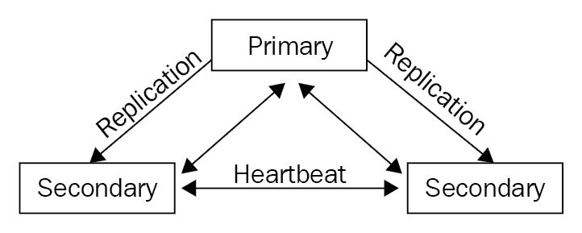
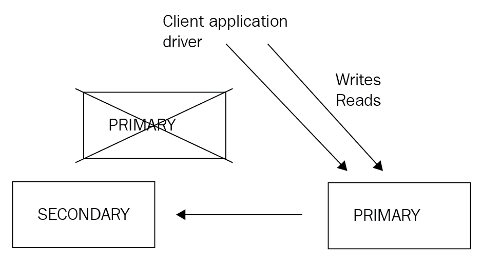
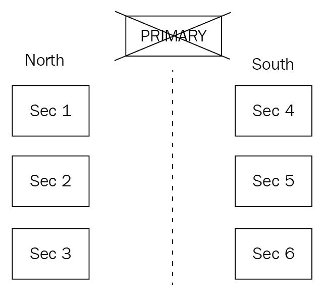
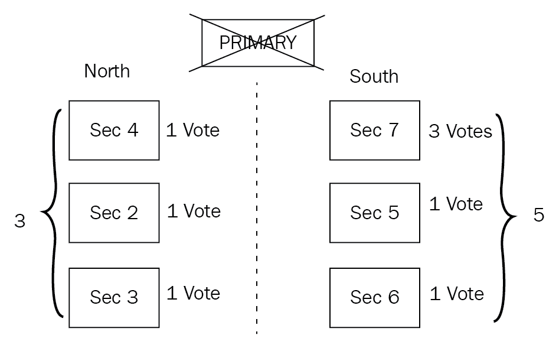

# 第十二章：复制

自从 MongoDB 的早期以来，复制一直是最有用的功能之一。 一般来说，复制是指在不同服务器之间同步数据的过程。 复制的好处包括防止数据丢失和数据的高可用性。 复制还提供灾难恢复，避免维护停机时间，扩展读取（因为我们可以从多个服务器读取）和扩展写入（只有我们可以写入多个服务器时）。

在本章中，我们将涵盖以下主题：

+   架构概述，选举和复制的用例

+   设置副本集

+   连接到副本集

+   副本集管理

+   使用云提供商部署副本集的最佳实践

+   副本集限制

# 复制

复制有不同的方法。 MongoDB 采取的方法是主从的逻辑复制，我们将在本章后面更详细地解释。

# 逻辑或物理复制

通过复制，我们在多个服务器之间同步数据，提供数据可用性和冗余。 即使由于硬件或软件故障而丢失服务器，通过使用复制，我们将有多个副本可以用来恢复我们的数据。 复制的另一个优点是我们可以使用其中一个服务器作为专用报告或备份服务器。

在逻辑复制中，我们的主/主服务器执行操作； 从/次要服务器从主服务器尾随操作队列，并按相同顺序应用相同的操作。 以 MongoDB 为例，**操作日志**（**oplog**）跟踪主服务器上发生的操作，并按相同顺序在次要服务器上应用它们。

逻辑复制对各种应用非常有用，例如信息共享，数据分析和**在线分析处理**（**OLAP**）报告。

在物理复制中，数据在物理级别上被复制，比数据库操作的更低级别。 这意味着我们不是应用操作，而是复制受这些操作影响的字节。 这也意味着我们可以获得更好的效率，因为我们使用低级结构来传输数据。 我们还可以确保数据库的状态完全相同，因为它们是相同的，逐字节相同。

物理复制通常缺少有关数据库结构的知识，这意味着更难（如果不是不可能）从数据库复制一些集合并忽略其他集合。

物理复制通常适用于更罕见的情况，例如灾难恢复，在这种情况下，一切（包括数据，索引，数据库内部状态在日志中的重做/撤消日志）的完整和精确副本对于将应用程序恢复到确切状态至关重要。

# 不同的高可用性类型

在高可用性中，有几种配置可以使用。 我们的主服务器称为**热服务器**，因为它可以处理每一个请求。 我们的次要服务器可以处于以下任何状态：

+   冷

+   温暖

+   热

**次要冷服务器**是一个服务器，仅在主服务器离线时存在，而不期望它保存主服务器的数据和状态。

**次要温暖服务器**定期从主服务器接收数据更新，但通常不会完全与主服务器同步。 它可以用于一些非实时分析报告，以卸载主服务器，但通常情况下，如果主服务器宕机，它将无法承担事务负载。

**次要热服务器**始终保持与主服务器的数据和状态的最新副本。 它通常处于热备状态，准备在主服务器宕机时接管。

MongoDB 具有热服务器和温服务器功能，我们将在接下来的部分中探讨。

大多数数据库系统都采用类似的主/次服务器概念，因此从概念上讲，MongoDB 的所有内容也适用于那里。

# 架构概述

MongoDB 的复制在以下图表中提供：



主服务器是唯一可以随时进行写入的服务器。次要服务器处于热备状态，一旦主服务器故障，它们就可以接管。一旦主服务器故障，就会进行选举，确定哪个次要服务器将成为主服务器。

我们还可以有**仲裁节点**。仲裁节点不保存任何数据，它们唯一的目的是参与选举过程。

我们必须始终有奇数个节点（包括仲裁者）。三、五和七都可以，这样在主服务器（或更多服务器）故障时，我们在选举过程中有多数选票。

当副本集的其他成员在 10 秒以上（可配置）没有收到来自主服务器的消息时，一个合格的次要成员将开始选举过程，投票选举出新的主服务器。首个进行选举并赢得多数的次要成员将成为新的主服务器。所有剩余的服务器现在将从新的主服务器复制，保持它们作为次要服务器的角色，但从新的主服务器同步。

从 MongoDB 3.6 开始，客户端驱动程序可以在检测到主服务器宕机时**重试一次**写操作。副本集最多可以有 50 个成员，但其中只有最多七个可以参与选举过程。

新选举后我们副本集的设置如下：



在下一节中，我们将讨论选举的工作原理。

# 选举是如何工作的？

副本集中的所有服务器都通过心跳定期与每个其他成员保持通信。心跳是一个小数据包，定期发送以验证所有成员是否正常运行。

次要成员还与主服务器通信，从 oplog 获取最新更新并将其应用于自己的数据。

这里的信息是指最新的复制选举协议，即版本 1，它是在 MongoDB v3.2 中引入的。

从图表中，我们可以看到它是如何工作的。

当主成员下线时，所有次要成员都会错过一个或多个心跳。它们将等待直到`settings.electionTimeoutMillis`时间过去（默认为 10 秒），然后次要成员将开始一轮或多轮选举，以找到新的主服务器。

要从次要服务器中选举出主服务器，它必须具备两个属性：

+   属于拥有*50% + 1*选票的选民组

+   成为这个组中最新的次要

在一个简单的例子中，有三个服务器，每个服务器一票，一旦我们失去主服务器，其他两个服务器将各自有一票（因此总共是三分之二），因此，拥有最新 oplog 的服务器将被选举为主服务器。

现在，考虑一个更复杂的设置，如下：

+   七个服务器（一个主服务器，六个次要服务器）

+   每个节点一票

我们失去了主服务器，剩下的六个服务器出现了网络连接问题，导致网络分区：



这些分区可以描述如下：

+   北区：三个服务器（每个一票）

+   南区：三个服务器（每个一票）

任何一个分区都不知道其他服务器发生了什么。现在，当它们进行选举时，没有一个分区能够建立多数，因为它们有七票中的三票。没有主服务器会从任何一个分区中被选举出来。这个问题可以通过例如拥有一个拥有三票的服务器来解决。

现在，我们的整体集群设置如下：

+   **服务器＃1**：一票

+   **服务器＃2**：一票

+   **服务器＃3**：一票

+   **服务器＃4**：一票

+   **服务器＃5**：一票

+   **服务器＃6**：一票

+   **服务器＃7**：三票

在失去服务器＃1 后，我们的分区现在如下：



北分区如下：

+   **服务器＃2**：一票

+   **服务器＃3**：一票

+   **服务器＃4**：一票

南分区如下：

+   **服务器＃5**：一票

+   **服务器＃6**：一票

+   **服务器＃7**：三票

南分区有三个服务器，共有九票中的五票。服务器＃5、＃6 和＃7 中最新（根据其 oplog 条目）的辅助服务器将被选为主服务器。

# 副本集的用例是什么？

MongoDB 提供了使用副本集的大部分优势，其中一些列举如下：

+   防止数据丢失

+   数据的高可用性

+   灾难恢复

+   避免维护停机时间

+   扩展读取，因为我们可以从多个服务器读取

+   帮助设计地理分散服务

+   数据隐私

从列表中缺少的最显着的项目是扩展写入。这是因为在 MongoDB 中，我们只能有一个主服务器，只有这个主服务器才能从我们的应用服务器接收写入。

当我们想要扩展写性能时，通常会设计和实现分片，这将是下一章的主题。MongoDB 复制实现的两个有趣特性是地理分散服务和数据隐私。

我们的应用服务器通常位于全球多个数据中心。使用复制，我们可以尽可能将辅助服务器靠近应用服务器。这意味着我们的读取将很快，就像本地一样，并且我们只会为写入获得延迟性能惩罚。当然，这需要在应用程序级别进行一些规划，以便我们可以维护两个不同的数据库连接池，这可以通过使用官方的 MongoDB 驱动程序或使用更高级别的 ODM 轻松完成。

MongoDB 复制设计的第二个有趣特性是实现数据隐私。当我们在不同数据中心地理分散的服务器上，我们可以启用每个数据库的复制。通过将数据库排除在复制过程之外，我们可以确保我们的数据保持在我们需要的数据中心内。我们还可以在同一个 MongoDB 服务器上为每个数据库设置不同的复制模式，以满足我们的数据隐私需求，如果某些服务器不符合我们的数据隐私规定，可以将其排除在副本集之外。

# 设置副本集

在本节中，我们将介绍设置副本集的最常见部署程序。这些包括将独立服务器转换为副本集或从头开始设置副本集。

# 将独立服务器转换为副本集

要将独立服务器转换为副本集，我们首先需要干净地关闭`mongo`服务器：

```go
> use admin
> db.shutdownServer()
```

然后，我们通过命令行使用`--replSet`配置选项启动服务器（我们将在这里执行），或者使用配置文件，如我们将在下一节中解释的那样：

1.  首先，我们通过 mongo shell 连接到新的启用了副本集的实例，如下所示：

```go
> rs.initiate()
```

1.  现在，我们有了副本集的第一个服务器。我们可以使用 mongo shell 添加其他服务器（这些服务器也必须使用`--replSet`启动），如下所示：

```go
> rs.add("<hostname><:port>")
```

通过使用`rs.conf()`来双重检查副本集配置。通过使用`rs.status()`来验证副本集状态。

# 创建副本集

作为副本集的一部分启动 MongoDB 服务器就像通过命令行在配置中设置它一样容易：

```go
> mongod --replSet "xmr_cluster"
```

这对开发目的来说是可以的。对于生产环境，建议使用配置文件：

```go
> mongod --config <path-to-config>
```

在这里，`<path-to-config>`可以如下：

```go
/etc/mongod.conf
```

此配置文件必须采用 YAML 格式。

YAML 不支持制表符。请使用您选择的编辑器将制表符转换为空格。

一个简单的配置文件示例如下：

```go
systemLog:
  destination: file
  path: "/var/log/mongodb/mongod.log"
  logAppend: true
storage:
  journal:
     enabled: true
processManagement:
  fork: true
net:
  bindIp: 127.0.0.1
  port: 27017
replication:
  oplogSizeMB: <int>
  replSetName: <string>
```

根级选项通过嵌套定义叶级选项适用于的部分。关于复制，强制选项是`oplogSizeMB`（成员的 oplog 大小，以 MB 为单位）和`replSetName`（副本集名称，例如`xmr_cluster`）。

我们还可以在与`replSetName`相同级别上设置以下内容：

```go
secondaryIndexPrefetch: <string>
```

这仅适用于 MMAPv1 存储引擎，并且指的是在应用操作之前将加载到内存中的次要服务器上的索引。

它默认为`all`，可用选项为`none`和`_id_only`，以便不将索引加载到内存中，只加载在`_id`字段上创建的默认索引：

```go
enableMajorityReadConcern: <boolean>
```

这是启用此成员的`majority`读取偏好的配置设置。

在不同节点上启动了所有副本集进程后，我们可以使用适当的`host:port`从命令行使用`mongo`登录到其中一个节点。然后，我们需要从一个成员初始化集群。

我们可以使用以下配置文件：

```go
> rs.initiate()
```

或者，我们可以将配置作为文档参数传递，如下所示：

```go
> rs.initiate( {
 _id : "xmr_cluster",
 members: [ { _id : 0, host : "host:port" } ]
})
```

我们可以使用`rs.conf()`在 shell 中验证集群是否已初始化。

接下来，我们通过使用我们在网络设置中定义的`host:port`，将每个其他成员添加到我们的副本集中：

```go
> rs.add("host2:port2")
> rs.add("host3:port3")
```

我们必须为 HA 副本集使用的最小服务器数量是`3`。我们可以用仲裁者替换其中一个服务器，但这并不推荐。一旦我们添加了所有服务器并等待了一会儿，我们可以使用`rs.status()`来检查我们集群的状态。默认情况下，oplog 将是空闲磁盘空间的 5%。如果我们想在创建副本集时定义它，我们可以通过传递命令行参数`--oplogSizeMB`或在配置文件中使用`replication.oplogSizeMB`来这样做。oplog 大小不能超过 50GB。

# 读取偏好

默认情况下，所有写入和读取都来自主服务器。次要服务器复制数据，但不用于查询。

在某些情况下，更改这一点并开始从次要服务器读取可能是有益的。

MongoDB 官方驱动程序支持五个级别的读取偏好：

| **读取偏好模式** | **描述** |
| --- | --- |
| `primary` | 这是默认模式，其中读取来自副本集的`primary`服务器。 |
| `primaryPreferred` | 使用此模式，应用程序将从`primary`读取数据，除非它不可用，在这种情况下，读取将来自`secondary`成员。 |
| `secondary` | 读取仅来自`secondary`服务器。 |
| `secondaryPreferred` | 使用此模式，应用程序将从`secondary`成员读取数据，除非它们不可用，在这种情况下，读取将来自`primary`成员。 |
| `nearest` | 应用程序将从副本集中在网络延迟方面最接近的成员读取数据，而不考虑成员的类型。 |

除了`primary`之外的任何读取偏好对于非常时间敏感的异步操作可能是有益的。例如，报告服务器可以从次要服务器读取，而不是从主服务器读取，因为我们可能对聚合数据的小延迟可以接受，而又能在主服务器上产生更多的读取负载。

地理分布的应用程序也将受益于从次要服务器读取，因为这些服务器的延迟会显著较低。尽管这可能有违直觉，但仅将读取偏好从`primary`更改为`secondary`不会显著增加集群的总读取容量。这是因为我们集群的所有成员都在承受来自客户端写入的相同写入负载，并分别复制主服务器和次要服务器的数据。

然而，从辅助节点读取可能会返回过期数据，这必须在应用程序级别处理。从可能具有可变复制延迟的不同辅助节点读取（与我们的主要写入相比）可能导致读取文档的插入顺序不一致（**非单调读取**）。

尽管存在所有上述警告，如果我们的应用程序设计支持，从辅助节点读取仍然是一个好主意。可以帮助我们避免读取过期数据的另一个配置选项是`maxStalenessSeconds`。

根据每个辅助节点对于与主节点相比落后程度的粗略估计，我们可以将其设置为 90（秒）或更高的值，以避免读取过期数据。鉴于辅助节点知道它们与主节点的落后程度（但并不准确或积极地估计），这应被视为一种近似，而不是我们设计的基础。

# 写关注

在 MongoDB 副本集中，默认情况下，写操作将在主服务器确认写入后得到确认。如果我们想要更改此行为，可以通过两种不同的方式进行：

+   在某些情况下，我们可以针对每个操作请求不同的写关注，以确保写入在标记为完成之前已传播到我们副本集的多个成员，如下所示：

```go
> db.mongo_books.insert(
 { name: "Mastering MongoDB", isbn: "1001" },
 { writeConcern: { w: 2, wtimeout: 5000 } }
)
```

在上面的示例中，我们正在等待两个服务器（主服务器加上任何一个辅助服务器）确认写入。我们还设置了`5000`毫秒的超时，以避免在网络速度慢或我们没有足够的服务器来确认请求的情况下阻塞我们的写入。

+   我们还可以通过以下方式更改整个副本集的默认写关注：

```go
> cfg = rs.conf()
> cfg.settings.getLastErrorDefaults = { w: "majority", wtimeout: 5000 }
> rs.reconfig(cfg)
```

在这里，我们将写关注设置为`majority`，超时为`5`秒。写关注`majority`确保我们的写入将传播到至少*n/2+1*个服务器，其中*n*是我们的副本集成员的数量。

写关注`majority`在我们的读取偏好为`majority`时非常有用，因为它确保每个带有`w: "majority"`的写入也将以相同的读取偏好可见。如果设置了`w>1`，还可以设置`wtimeout: <milliseconds>`。`wtimeout`将在达到超时后从我们的写操作返回，因此不会无限期地阻塞我们的客户端。建议还设置`j: true`。`j: true`将等待我们的写操作在确认之前写入日志。`w>1`与`j: true`一起将等待我们指定的服务器数量在确认之前写入日志。

# 自定义写关注

我们还可以使用不同的标签（即`reporting`，东海岸服务器和总部服务器）标识我们的副本集成员，并针对每个操作指定自定义写关注，如下所示：

1.  使用 mongo shell 连接到主服务器的常规过程如下：

```go
> conf = rs.conf()
> conf.members[0].tags = { "location": "UK", "use": "production", "location_uk":"true"  }
> conf.members[1].tags = { "location": "UK", "use": "reporting", "location_uk":"true"  }
> conf.members[2].tags = { "location": "Ireland", "use": "production"  }
```

1.  现在，我们可以设置自定义写关注，如下所示：

```go
> conf.settings = { getLastErrorModes: { UKWrites : { "location_uk": 2} } }
```

1.  应用此设置后，我们使用`reconfig`命令：

```go
> rs.reconfig(conf)
```

1.  现在，我们可以通过以下方式在我们的写入中设置`writeConcern`：

```go
> db.mongo_books.insert({<our insert object>}, { writeConcern: { w: "UKWrites" } })
```

这意味着我们的写入只有在满足`UKWrites`写关注时才会得到确认，而`UKWrites`写关注将由至少两个带有`location_uk`标签的服务器验证。由于我们只有两台位于英国的服务器，因此通过此自定义写关注，我们可以确保将数据写入到我们所有的英国服务器。

# 副本集成员的优先级设置

MongoDB 允许我们为每个成员设置不同的优先级级别。这允许实现一些有趣的应用程序和拓扑结构。

在设置完集群后更改优先级，我们必须使用 mongo shell 连接到我们的主服务器并获取配置对象（在本例中为`cfg`）：

```go
> cfg = rs.conf()
```

然后，我们可以将`members`子文档的`priority`属性更改为我们选择的值：

```go
> cfg.members[0].priority = 0.778
> cfg.members[1].priority = 999.9999
```

每个成员的默认`priority`为`1`。`priority`可以从`0`（永远不成为主要）设置为`1000`，以浮点精度。

优先级较高的成员将是主服务器下台时首先发起选举的成员，并且最有可能赢得选举。

应该考虑不同网络分区来配置自定义优先级。错误地设置优先级可能导致选举无法选举主服务器，从而停止所有对我们 MongoDB 副本集的写入。

如果我们想要阻止次要服务器成为主服务器，我们可以将其`priority`设置为`0`，如我们将在下一节中解释的那样。

# 零优先级副本集成员

在某些情况下（例如，如果我们有多个数据中心），我们将希望一些成员永远无法成为主服务器。

在具有多个数据中心复制的情况下，我们的主要数据中心可能有一个基于英国的主服务器和一个次要服务器，以及一个位于俄罗斯的次要服务器。在这种情况下，我们不希望我们基于俄罗斯的服务器成为主服务器，因为这将给我们位于英国的应用服务器带来延迟。在这种情况下，我们将设置我们基于俄罗斯的服务器的`priority`为`0`。

`priority`为`0`的副本集成员也不能触发选举。在所有其他方面，它们与副本集中的每个其他成员相同。要更改副本集成员的`priority`，我们必须首先通过连接（通过 mongo shell）到主服务器获取当前的副本集配置：

```go
> cfg = rs.conf()
```

这将提供包含副本集中每个成员配置的配置文档。在`members`子文档中，我们可以找到`priority`属性，我们必须将其设置为`0`：

```go
> cfg.members[2].priority = 0
```

最后，我们需要使用更新后的配置重新配置副本集：

```go
rs.reconfig(cfg)
```

确保每个节点中运行的 MongoDB 版本相同，否则可能会出现意外行为。避免在高流量时期重新配置副本集群。重新配置副本集可能会强制进行新主要选举，这将关闭所有活动连接，并可能导致 10-30 秒的停机时间。尝试识别最低流量时间窗口来运行维护操作，始终在发生故障时有恢复计划。

# 隐藏的副本集成员

隐藏的副本集成员用于特殊任务。它们对客户端不可见，在`db.isMaster()` mongo shell 命令和类似的管理命令中不会显示，并且对客户端不会被考虑（即读取首选项选项）。

它们可以投票选举，但永远不会成为主服务器。隐藏的副本集成员只会同步到主服务器，并不会从客户端读取。因此，它具有与主服务器相同的写入负载（用于复制目的），但自身没有读取负载。

由于前面提到的特性，报告是隐藏成员最常见的应用。我们可以直接连接到此成员并将其用作 OLAP 的数据源。

要设置隐藏的副本集成员，我们遵循与`priority`为`0`类似的过程。在通过 mongo shell 连接到我们的主服务器后，我们获取配置对象，识别在成员子文档中对应于我们想要设置为`hidden`的成员的成员，并随后将其`priority`设置为`0`，将其`hidden`属性设置为`true`。最后，我们必须通过调用`rs.reconfig(config_object)`并将`config_object`作为参数使用来应用新配置：

```go
> cfg = rs.conf()
> cfg.members[0].priority = 0
> cfg.members[0].hidden = true
> rs.reconfig(cfg)
```

`hidden`副本集成员也可以用于备份目的。然而，正如您将在下一节中看到的，我们可能希望在物理级别或逻辑级别复制数据时使用其他选项。在这些情况下，考虑使用延迟副本集。

# 延迟副本集成员

在许多情况下，我们希望有一个节点在较早的时间点保存我们的数据副本。这有助于从大量人为错误中恢复，比如意外删除集合或升级出现严重问题。

延迟的副本集成员必须是 `priority = 0` 和 `hidden = true`。延迟的副本集成员可以投票进行选举，但永远不会对客户端可见（`hidden = true`），也永远不会成为主服务器（`priority = 0`）。

一个示例如下：

```go
> cfg = rs.conf()
> cfg.members[0].priority = 0
> cfg.members[0].hidden = true
> cfg.members[0].slaveDelay = 7200
> rs.reconfig(cfg)
```

这将把 `members[0]` 设置为延迟 2 小时。决定主服务器和延迟次要服务器之间时间间隔的两个重要因素如下：

+   主要副本中足够的 oplog 大小

+   在延迟成员开始获取数据之前，足够的维护时间

下表显示了副本集的延迟时间（以小时为单位）：

| **维护窗口，以小时为单位** | **延迟** | **主要副本的 oplog 大小，以小时为单位** |
| --- | --- | --- |
| *0.5* | *[0.5,5)* | *5* |

# 生产考虑

在单独的物理主机上部署每个 `mongod` 实例。如果使用虚拟机，请确保它们映射到不同的基础物理主机。使用 `bind_ip` 选项确保服务器映射到特定的网络接口和端口地址。

使用防火墙阻止对任何其他端口的访问和/或仅允许应用程序服务器和 MongoDB 服务器之间的访问。更好的做法是设置 VPN，以便您的服务器以安全的加密方式相互通信。

# 连接到副本集

连接到副本集与连接到单个服务器本质上没有太大不同。在本节中，我们将展示一些使用官方 `mongo-ruby-driver` 的示例。我们将按以下步骤进行副本集的操作：

1.  首先，我们需要设置我们的 `host` 和 `options` 对象：

```go
client_host = ['hostname:port']
client_options = {
 database: 'signals',
 replica_set: 'xmr_btc'
}
```

在上述示例中，我们准备连接到 `hostname:port`，在 `replica_set xmr_btc` 数据库中的信号。

1.  在 `Mongo::Client` 上调用初始化器现在将返回一个包含连接到我们的副本集和数据库的 `client` 对象：

```go
client = Mongo::Client.new(client_host, client_options)
```

`client` 对象在连接到单个服务器时具有相同的选项。

连接到副本集后，MongoDB 在连接到我们的 `client_host` 后使用自动发现来识别副本集的其他成员，无论它们是主服务器还是次要服务器。`client` 对象应该作为单例使用，创建一次并在整个代码库中重复使用。

1.  在某些情况下，可以覆盖使用单例 `client` 对象的规则。如果我们有不同类别的连接到副本集，应该创建不同的 `client` 对象。

例如，对于大多数操作使用一个 `client` 对象，然后对于只从次要服务器读取的操作使用另一个 `client` 对象：

```go
client_reporting = client.with(:read => { :mode => :secondary })
```

1.  这个 Ruby MongoDB `client` 命令将返回一个包含读取偏好为次要的 `MongoDB:Client` 对象的副本，例如，用于报告目的。

我们在 `client_options` 初始化对象中可以使用的一些最有用的选项如下：

| **选项** | **描述** | **类型** | **默认** |
| --- | --- | --- | --- |
| `replica_set` | 在我们的示例中使用：副本集名称。 | 字符串 | 无 |
| `write` | `write` 关注选项作为 `hash` 对象；可用选项为 `w`、`wtimeout`、`j` 和 `fsync`。也就是说，要指定写入到两个服务器，启用日志记录，刷新到磁盘（`fsync`）为 `true`，并设置超时为 `1` 秒：`{ write: { w: 2, j: true, wtimeout: 1000, fsync: true } }` | 哈希 | `{ w: 1 }` |

| `read` | 读取偏好模式作为哈希。可用选项为 `mode` 和 `tag_sets`。也就是说，限制从具有标签 `UKWrites` 的次要服务器读取：`{ read:` ` { mode: :secondary,`

`   tag_sets: [ "UKWrites" ]`

` }`

`}` | 哈希 | `{ mode: primary }` |

| `user` | 要进行身份验证的用户的名称。 | 字符串 | 无 |
| --- | --- | --- | --- |
| `password` | 要进行身份验证的用户的密码。 | 字符串 | 无 |
| `connect` | 使用`:direct`，我们可以强制将副本集成员视为独立服务器，绕过自动发现。其他选项包括：`:direct`，`:replica_set`和`:sharded`。 | 符号 | 无 |
| `heartbeat_frequency` | 副本集成员定期通信以检查它们是否都存活的频率。 | 浮点数 | `10` |
| `database` | 数据库连接。 | 字符串 | `admin` |

与连接到独立服务器类似，SSL 和身份验证也有相同的选项。

我们还可以通过设置以下代码来配置连接池：

```go
min_pool_size(defaults to 1 connection),
max_pool_size(defaults to 5),
wait_queue_timeout(defaults to 1 in seconds).
```

如果可用，MongoDB 驱动程序将尝试重用现有连接，否则将打开新连接。一旦达到池限制，驱动程序将阻塞，等待连接被释放以使用它。

# 副本集管理

副本集的管理可能比单服务器部署所需的要复杂得多。在本节中，我们将重点放在一些最常见的管理任务上，而不是试图详尽地涵盖所有不同的情况，以及如何执行这些任务。

# 如何对副本集执行维护

如果我们有一些在副本集的每个成员中都必须执行的维护任务，我们总是从辅助节点开始。我们通过执行以下步骤来执行维护：

1.  首先，我们通过 mongo shell 连接到其中一个辅助节点。然后，我们停止该辅助节点：

```go
> use admin
> db.shutdownServer()
```

1.  然后，使用在上一步中连接到 mongo shell 的相同用户，我们在不同的端口上将 mongo 服务器重新启动为独立服务器：

```go
> mongod --port 95658 --dbpath <wherever our mongoDB data resides in this host>
```

1.  下一步是连接到使用`dbpath`的`mongod`服务器：

```go
> mongo --port 37017
```

1.  在这一点上，我们可以安全地执行所有独立服务器上的管理任务，而不会影响我们的副本集操作。完成后，我们以与第一步相同的方式关闭独立服务器。

1.  然后，我们可以通过使用命令行或我们通常使用的配置脚本来重新启动副本集中的服务器。最后一步是通过连接到副本集服务器并获取其副本集`status`来验证一切是否正常：

```go
> rs.status()
```

服务器最初应处于`state: RECOVERING`状态，一旦它赶上了辅助服务器，它应该回到`state: SECONDARY`状态，就像在开始维护之前一样。

我们将为每个辅助服务器重复相同的过程。最后，我们必须对主服务器进行维护。主服务器的过程唯一的不同之处在于，在每一步之前，我们将首先将主服务器降级为辅助服务器：

```go
> rs.stepDown(600)
```

通过使用上述参数，我们可以防止我们的辅助节点在 10 分钟内被选为主节点。这应该足够的时间来关闭服务器并继续进行维护，就像我们对辅助节点所做的那样。

# 重新同步副本集的成员

辅助节点通过重放 oplog 的内容与主节点同步。如果我们的 oplog 不够大，或者如果我们遇到网络问题（分区、网络性能不佳，或者辅助服务器的故障）的时间超过 oplog，那么 MongoDB 将无法使用 oplog 来赶上主节点。

在这一点上，我们有两个选择：

+   更直接的选择是删除我们的`dbpath`目录并重新启动`mongod`进程。在这种情况下，MongoDB 将从头开始进行初始同步。这种选择的缺点是对我们的副本集和网络造成压力。

+   更复杂（从操作角度）的选项是从副本集的另一个表现良好的成员复制数据文件。这回到了第八章的内容，*监控、备份和安全性*。要记住的重要事情是，简单的文件复制可能不够，因为数据文件在我们开始复制到复制结束的时间内已经发生了变化。

因此，我们需要能够在我们的`data`目录下拍摄文件系统的快照副本。

另一个需要考虑的问题是，当我们使用新复制的文件启动次要服务器时，我们的 MongoDB 次要服务器将尝试再次使用 oplog 与主服务器同步。因此，如果我们的 oplog 已经落后于主服务器，以至于它无法在主服务器上找到条目，这种方法也会失败。

保持足够大小的 oplog。不要让任何副本集成员的数据失控。尽早设计、测试和部署分片。

# 更改 oplog 的大小

与前面的操作提示相辅相成，随着数据的增长，我们可能需要重新考虑和调整 oplog 的大小。随着数据的增长，操作变得更加复杂和耗时，我们需要调整 oplog 的大小来适应。更改 oplog 大小的步骤如下：

1.  第一步是将我们的 MongoDB 次要服务器重新启动为独立服务器，这是在*如何对副本集执行维护*部分中描述的操作。

1.  然后我们备份我们现有的 oplog：

```go
> mongodump --db local --collection 'oplog.rs' --port 37017
```

1.  我们保留这些数据的副本，以防万一。然后我们连接到我们的独立数据库：

```go
> use local
> db = db.getSiblingDB('local')
> db.temp.drop()
```

到目前为止，我们已连接到`local`数据库并删除了`temp`集合，以防它有任何剩余文档。

1.  下一步是获取我们当前 oplog 的最后一个条目，并将其保存在`temp`集合中：

```go
> db.temp.save( db.oplog.rs.find( { }, { ts: 1, h: 1 } ).sort( {$natural : -1} ).limit(1).next() )
```

1.  当我们重新启动次要服务器时，将使用此条目，以跟踪它在 oplog 复制中的进度：

```go
> db = db.getSiblingDB('local')
> db.oplog.rs.drop()
```

1.  现在，我们删除我们现有的 oplog，在下一步中，我们将创建一个大小为`4`GB 的新 oplog：

```go
> db.runCommand( { create: "oplog.rs", capped: true, size: (4 * 1024 * 1024 * 1024) } )
```

1.  下一步是将我们的`temp`集合中的一个条目复制回我们的 oplog：

```go
> db.oplog.rs.save( db.temp.findOne() )
```

1.  最后，我们从`admin`数据库中干净地关闭服务器，使用`db.shutdownServer()`命令，然后将我们的次要服务器重新启动为副本集的成员。

1.  我们对所有次要服务器重复此过程，最后一步是对我们的主要成员重复该过程，这是在使用以下命令将主服务器降级之后完成的：

```go
> rs.stepDown(600)
```

# 在我们失去大多数服务器时重新配置副本集

这只是一个临时解决方案，也是在面临停机和集群操作中断时的最后手段。当我们失去大多数服务器，但仍有足够的服务器可以启动一个副本集（可能包括一些快速生成的仲裁者）时，我们可以强制只使用幸存成员进行重新配置。

首先，我们获取副本集配置文档：

```go
> cfg = rs.conf()
```

使用`printjson(cfg)`，我们确定仍在运行的成员。假设这些成员是`1`、`2`和`3`：

```go
> cfg.members = [cfg.members[1] , cfg.members[2] , cfg.members[3]]
> rs.reconfig(cfg, {force : true})
```

通过使用`force：true`，我们强制进行此重新配置。当然，我们需要至少有三个幸存成员在我们的副本集中才能使其工作。

尽快删除故障服务器非常重要，方法是终止进程和/或将它们从网络中移除，以避免意外后果；这些服务器可能认为它们仍然是集群的一部分，而集群已不再承认它们。

# 链式复制

在 MongoDB 中，复制通常发生在主服务器和次要服务器之间。在某些情况下，我们可能希望从另一个次要服务器复制，而不是从主服务器复制。链式复制有助于减轻主服务器的读取负载，但与此同时，它会增加选择从次要服务器复制的次要服务器的平均复制延迟。这是有道理的，因为复制必须从主服务器到次要服务器（1），然后从这台服务器到另一个次要服务器（2）。

可以使用以下`cfg`命令启用（或分别禁用）链式复制：

```go
> cfg.settings.chainingAllowed = true
```

在`printjson(cfg)`不显示设置子文档的情况下，我们需要首先创建一个空文档：

```go
> cfg.settings = { }
```

如果已经存在一个`settings`文档，上述命令将导致删除其设置，可能导致数据丢失。

# 副本集的云选项

我们可以从我们自己的服务器上设置和操作副本集，但是我们可以通过使用**数据库即服务**（**DBaaS**）提供商来减少我们的运营开销。最广泛使用的两个 MongoDB 云提供商是 mLab（以前是 MongoLab）和 MongoDB Atlas，后者是 MongoDB, Inc.的原生产品。

在本节中，我们将讨论这些选项以及它们与使用我们自己的硬件和数据中心相比的优劣。

# mLab

mLab 是 MongoDB 最受欢迎的云 DBaaS 提供商之一。自 2011 年以来一直提供，并被认为是一个稳定和成熟的提供商。

注册后，我们可以在一组云服务器上轻松部署副本集群，而无需任何运营开销。配置选项包括 AWS、Microsoft Azure 或 Google Cloud 作为基础服务器提供商。

最新的 MongoDB 版本有多个大小选项。在撰写本书时，MMAPv1 存储引擎没有支持。每个提供商都有多个地区（美国、欧洲和亚洲）。值得注意的是，缺少的地区是 AWS 中国、AWS 美国政府和 AWS 德国地区。

# MongoDB Atlas

MongoDB Atlas 是 MongoDB, Inc.的一个较新的产品，于 2016 年夏季推出。与 mLab 类似，它通过 Web 界面提供单服务器、副本集或分片集群的部署。

它提供了最新的 MongoDB 版本。唯一的存储选项是 WiredTiger。每个提供商都有多个地区（美国、欧洲和亚洲）。

值得注意的是，缺少的地区是 AWS 中国和 AWS 美国政府地区。

在这两个（以及大多数其他）提供商中，我们无法拥有跨区域的副本集。如果我们想要部署一个真正全球的服务，为来自全球多个数据中心的用户提供服务，并且希望我们的 MongoDB 服务器尽可能靠近应用服务器，这是不利的。

云托管服务的运行成本可能会比在我们自己的服务器上设置要高得多。我们在便利性和上市时间上所获得的可能需要以运营成本来支付。

# 副本集的限制

当我们了解为什么需要副本集以及它不能做什么时，副本集就非常好。副本集的不同限制如下：

+   它不会进行水平扩展；我们需要分片来实现。

+   如果我们的网络不稳定，我们将引入复制问题。

+   如果我们使用辅助服务器进行读取，那么调试问题将变得更加复杂，而且这些辅助服务器已经落后于我们的主服务器。

另一方面，正如我们在本章的前几节中所解释的，副本集对于复制、数据冗余、符合数据隐私、备份甚至从人为错误或其他原因引起的错误中恢复来说都是一个很好的选择。

# 总结

在本章中，我们讨论了副本集以及如何对其进行管理。从副本集的架构概述和涉及选举的副本集内部开始，我们深入到了设置和配置副本集。

您学会了如何使用副本集执行各种管理任务，并了解了将操作外包给云 DBaaS 提供商的主要选项。最后，我们确定了 MongoDB 目前副本集存在的一些限制。

在下一章中，我们将继续讨论 MongoDB 中最有趣的概念之一（帮助其实现水平扩展的概念）：分片。
