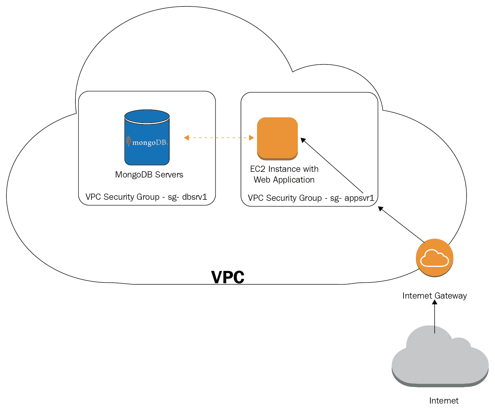

# 第十四章：容错和高可用性

在本章中，我们将尝试整合我们在之前章节中没有讨论的信息，并且我们将强调一些其他主题。在之前的 13 章中，我们从基本概念一直到有效查询，到管理和数据管理，到扩展和高可用性概念都有所涉及。

在本章中，我们将涵盖以下主题：

+   我们将讨论我们的应用程序设计应该如何适应和积极应对我们的数据库需求。

+   我们还将讨论日常运营，包括可以帮助我们避免未来不愉快的惊喜的提示和最佳实践。

+   鉴于勒索软件最近试图感染和挟持 MongoDB 服务器，我们将提供更多关于安全性的建议。

+   最后，我们将尝试总结已经给出的一系列应该遵循以确保最佳实践得到适当设置和遵循的建议清单。

# 应用程序设计

在本节中，我们将描述一些应用设计的有用提示，这些提示在之前的章节中我们没有涵盖或强调足够。

# 无模式并不意味着无模式设计

MongoDB 成功的一个重要原因是其 ORM/ODM 的日益流行。特别是对于像 JavaScript 和 MEAN 堆栈这样的语言，开发人员可以从前端（Angular/Express）到后端（Node.js）再到数据库（MongoDB）使用 JavaScript。这经常与一个 ODM 结合使用，它将数据库的内部抽象出来，将集合映射到 Node.js 模型。

主要优点是开发人员不需要纠缠数据库模式设计，因为这是由 ODM 自动提供的。缺点是数据库集合和模式设计留给了 ODM，它没有不同领域和访问模式的业务领域知识。

在 MongoDB 和其他基于 NoSQL 的数据库的情况下，这归结为基于不仅是即时需求，还有未来需求的架构决策。在架构层面上，这可能意味着我们可以通过使用图数据库进行图相关查询，使用关系数据库进行分层、无限数据的查询，以及使用 MongoDB 进行 JSON 检索、处理和存储，而不是采用单块方法。

事实上，MongoDB 成功的许多用例来自于它并不被用作一刀切的解决方案，而只用于有意义的用例。

# 读取性能优化

在本节中，我们将讨论一些优化读取性能的提示。读取性能与查询数量及其复杂性直接相关。在没有复杂嵌套数据结构和数组的模式中执行较少的查询通常会导致更好的读取性能。然而，很多时候，为了优化读取性能可能意味着写入性能会下降。这是需要记住并在进行 MongoDB 性能优化时不断测量的事情。

# 整合读取查询

我们应该尽量减少查询。这可以通过将信息嵌入子文档中而不是拥有单独的实体来实现。这可能会导致写入负载增加，因为我们必须在多个文档中保留相同的数据点，并在一个地方更改时在所有地方维护它们的值。

这里的设计考虑如下：

+   读取性能受益于数据复制/去规范化。

+   数据完整性受益于数据引用（`DBRef`或在应用程序代码中，使用属性作为外键）。

我们应该去规范化，特别是如果我们的读/写比太高（我们的数据很少更改值，但在中间被多次访问），如果我们的数据可以承受短暂时间的不一致，最重要的是，如果我们绝对需要我们的读取尽可能快，并且愿意以一致性/写入性能为代价。

我们应该对需要去规范化（嵌入）的字段进行特别处理。如果我们有一个属性或文档结构，我们不打算单独查询它，而只作为包含属性/文档的一部分，那么将其嵌入而不是放在单独的文档/集合中是有意义的。

使用我们的 MongoDB `books`示例，一本书可以有一个相关的数据结构，指的是书的读者的评论。如果我们最常见的用例是显示一本书以及其相关的评论，那么我们可以将评论嵌入到书的文档中。

这种设计的缺点是，当我们想要找到用户的所有书评时，这将是昂贵的，因为我们将不得不迭代所有书籍以获取相关的评论。对用户进行去规范化并嵌入他们的评论可以解决这个问题。

反例是可以无限增长的数据。在我们的例子中，将评论与大量元数据一起嵌入可能会导致问题，如果我们达到了 16 MB 文档大小限制。解决方案是区分我们预期会快速增长的数据结构和那些不会快速增长的数据结构，并通过监控过程来关注它们的大小，这些监控过程在非高峰时间查询我们的实时数据集，并报告可能会在未来造成风险的属性。

不要嵌入可以无限增长的数据。

当我们嵌入属性时，我们必须决定是使用子文档还是封闭数组。

当我们有一个唯一标识符来访问子文档时，我们应该将其嵌入为子文档。如果我们不确定如何访问它，或者我们需要灵活性来查询属性的值，那么我们应该将其嵌入到数组中。

例如，对于我们的 books 集合，如果我们决定将评论嵌入到每个书籍文档中，我们有以下两种设计选项：

+   带有数组的书籍文档：

```sql
{
Isbn: '1001',
Title: 'Mastering MongoDB',
Reviews: [
{ 'user_id': 1, text: 'great book', rating: 5 },
{ 'user_id': 2, text: 'not so bad book', rating: 3 },
]
}
```

+   嵌入文档的书籍：

```sql
{
Isbn: '1001',
Title: 'Mastering MongoDB',
Reviews:
{ 'user_id': 1, text: 'great book', rating: 5 },
{ 'user_id': 2, text: 'not so bad book', rating: 3 },
}
```

数组结构具有优势，我们可以通过嵌入的数组 reviews 直接查询 MongoDB 中所有评分大于 4 的评论。

另一方面，使用嵌入文档结构，我们可以以与使用数组相同的方式检索所有评论，但如果我们想要对其进行过滤，则必须在应用程序端进行，而不是在数据库端进行。

# 防御性编码

更多的是一个通用原则，**防御性编码**是指一组确保软件在意外情况下继续功能的实践和软件设计。

它优先考虑代码质量、可读性和*可预测性*。*可读性是由 John F. Woods 在 1991 年 9 月 24 日的*comp.lang.c++*帖子中最好地解释的：

“编码时要像最终维护您的代码的人是一个知道您住在哪里的暴力精神病患者一样编码。为了可读性而编码。”

我们的代码应该对人类可读和理解，也应该对机器可读。通过静态分析工具派生的代码质量指标、代码审查和报告/解决的错误，我们可以估计我们的代码库的质量，并在每个冲刺或准备发布时，以及在每个冲刺或准备发布时，都可以达到一定的阈值。另一方面，代码的可预测性意味着我们应该始终期望在意外输入和程序状态下获得结果。

这些原则适用于每个软件系统。在使用 MongoDB 进行系统编程的情况下，我们必须采取一些额外的步骤，以确保代码的可预测性，以及随后的质量由产生的错误数量来衡量。

应该定期监控并评估导致数据库功能丧失的 MongoDB 限制，如下所示：

+   **文档大小限制**：我们应该密切关注我们预计文档增长最多的集合，运行后台脚本来检查文档大小，并在接近限制（16 MB）的文档或平均大小自上次检查以来显着增长时向我们发出警报。

+   **数据完整性检查**：如果我们使用反规范化进行读取优化，那么检查数据完整性是一个很好的做法。通过软件错误或数据库错误，我们可能会在集合中得到不一致的重复数据。

+   **模式检查**：如果我们不想使用 MongoDB 的文档验证功能，而是想要一个宽松的文档模式，定期运行脚本来识别文档中存在的字段及其频率仍然是一个好主意。然后，结合相对访问模式，我们可以确定这些字段是否可以被识别和合并。如果我们从另一个系统中摄取数据，其中数据输入随时间变化，这可能导致我们端上文档结构变化很大，这个检查就非常有用。

+   **数据存储检查**：这主要适用于使用 MMAPv1 时，其中文档填充优化可以提高性能。通过关注文档大小相对于其填充的情况，我们可以确保我们的大小修改更新不会导致文档在物理存储中移动。

这些是我们在为 MongoDB 应用程序进行防御性编码时应该实施的基本检查。除此之外，我们还需要在应用程序级别的代码上进行防御性编码，以确保当 MongoDB 发生故障时，我们的应用程序将继续运行——可能会有性能下降，但仍然可以运行。

一个例子是副本集故障转移和故障恢复。当我们的副本集主服务器失败时，会有一个短暂的时间来检测这个故障，并选举、提升和运行新的主服务器。在这个短暂的时间内，我们应该确保我们的应用程序继续以只读模式运行，而不是抛出 500 错误。在大多数情况下，选举新的主服务器只需要几秒钟，但在某些情况下，我们可能会处于网络分区的少数端，并且长时间无法联系主服务器。同样，一些次要服务器可能会处于恢复状态（例如，如果它们在复制方面落后于主服务器）；在这种情况下，我们的应用程序应该能够选择另一个次要服务器。

设计用于次要访问的是防御性编码中最有用的例子之一。我们的应用程序应该权衡只能由主服务器访问的字段，以确保数据一致性，以及可以在几乎实时而不是实时更新的字段，在这种情况下，我们可以从次要服务器读取这些字段。通过使用自动化脚本跟踪我们次要服务器的复制延迟，我们可以了解我们集群的负载情况以及启用此功能的安全性。

另一个防御性编码实践是始终使用日志记录进行写入。日志记录有助于从服务器崩溃和电源故障中恢复。

最后，我们应该尽早使用副本集。除了性能和工作负载的改进外，它们还可以帮助我们从服务器故障中恢复。

# 监控集成

所有这些加起来都导致了对监控工具和服务的更广泛采用。尽管我们可以对其中一些进行脚本编写，但与云和本地监控工具集成可以帮助我们在更短的时间内取得更多成果。

我们跟踪的指标应该做到以下几点：

+   **检测故障**：故障检测是一个被动的过程，我们应该制定清晰的协议，以应对每个故障检测标志触发时会发生什么。例如，如果我们失去了一个服务器、一个副本集或一个分片，应该采取什么恢复步骤？

+   **预防故障**：另一方面，故障预防是一种积极的过程，旨在帮助我们在将来成为潜在故障源之前捕捉问题。例如，CPU/存储/内存使用情况应该被积极监控，并且应该制定清晰的流程，以确定在达到任一阈值时我们应该做什么。

# 操作

连接到我们的生产 MongoDB 服务器时，我们希望确保我们的操作尽可能轻量级（并且肯定不会破坏性地）并且不会以任何方式改变数据库状态。

我们可以将以下两个有用的实用程序链接到我们的查询中：

```sql
> db.collection.find(query).maxTimeMS(999)
```

我们的`query`将最多花费`999`毫秒的时间，然后返回超过时间限制的错误：

```sql
> db.collection.find(query).maxScan(1000)
```

我们的`query`将最多检查`1000`个文档，以查找结果然后返回（不会引发错误）。

在我们可以的情况下，我们应该通过时间或文档结果大小来限制我们的查询，以避免运行意外长时间的查询，这可能会影响我们的生产数据库。访问我们的生产数据库的常见原因是故障排除降级的集群性能。这可以通过云监控工具进行调查，正如我们在前几章中所描述的。

通过 MongoDB shell 的`db.currentOp()`命令，我们可以得到所有当前操作的列表。然后，我们可以分离出具有较大`.secs_running`值的操作，并通过`.query`字段对其进行识别。

如果我们想要终止长时间运行的操作，我们需要注意`.opid`字段的值，并将其传递给`db.killOp(<opid>)`。

最后，从运营的角度来看，重要的是要认识到一切都可能出错。我们必须有一个一致实施的备份策略。最重要的是，我们应该练习从备份中恢复，以确保它按预期工作。

# 安全

在最近的勒索软件波之后，这些勒索软件锁定了不安全的 MongoDB 服务器，并要求管理员以加密货币支付赎金来解锁 MongoDB 服务器，许多开发人员变得更加注重安全。安全是我们作为开发人员可能没有高度优先考虑的检查表上的一项，这是由于我们乐观地认为这种情况不会发生在我们身上。事实上，在现代互联网环境中，每个人都可能成为自动化或有针对性攻击的目标，因此安全性应该始终被考虑在内，从设计的早期阶段到生产部署之后。

# 默认情况下启用安全性

每个数据库（除了本地开发服务器，也许）都应该在`mongod.conf`文件中设置如下内容：

```sql
auth = true
```

应该始终启用 SSL，正如我们在相关第八章中所描述的，*监控、备份和安全*。

REST 和 HTTP 状态接口应通过向`mongod.conf`添加以下行来禁用：

```sql
nohttpinterface = true
rest = false
```

访问应该仅限于应用服务器和 MongoDB 服务器之间的通信，并且仅限于所需的接口。使用`bind_ip`，我们可以强制 MongoDB 监听特定接口，而不是默认绑定到每个可用接口的行为：

```sql
bind_ip = 10.10.0.10,10.10.0.20
```

# 隔离我们的服务器

我们应该使用 AWS VPC 或我们选择的云提供商的等效物来保护我们的基础设施边界。作为额外的安全层，我们应该将我们的服务器隔离在一个独立的云中，只允许外部连接到达我们的应用服务器，永远不允许它们直接连接到我们的 MongoDB 服务器：



我们应该投资于基于角色的授权。安全性不仅在于防止外部行为者造成的数据泄漏，还在于确保内部行为者对我们的数据具有适当的访问级别。通过 MongoDB 级别的基于角色的授权，我们可以确保我们的用户具有适当的访问级别。

考虑企业版用于大规模部署。企业版提供了一些方便的安全功能，更多地集成了知名工具，并且应该在大规模部署中进行评估，以满足随着我们从单个副本集过渡到企业复杂架构的不断变化的需求。

# 检查表

运营需要完成许多任务和复杂性。一个好的做法是保持一套包含所有需要执行的任务及其重要性顺序的检查表。这将确保我们不会漏掉任何事情。例如，部署和安全检查表可能如下所示：

+   **硬件**：

+   **存储**：每个节点需要多少磁盘空间？增长率是多少？

+   **存储技术**：我们是否需要 SSD 还是 HDD？我们的存储吞吐量是多少？

+   **RAM**：预期的工作集是多少？我们能否将其放入 RAM 中？如果不能，我们是否可以接受 SSD 而不是 HDD？增长率是多少？

+   **CPU**：这通常对 MongoDB 不是一个问题，但如果我们计划在我们的集群中运行 CPU 密集型作业（例如，聚合或 MapReduce），它可能是一个问题。

+   **网络**：服务器之间的网络链接是什么？如果我们使用单个数据中心，这通常是微不足道的，但如果我们有多个数据中心和/或用于灾难恢复的离站服务器，情况可能会变得复杂。

+   **安全**：

+   启用认证。

+   启用 SSL。

+   禁用 REST/HTTP 接口。

+   隔离我们的服务器（例如，VPC）。

+   已启用授权。伴随着强大的权力而来的是巨大的责任。确保强大的用户是您信任的用户。不要将潜在破坏性的权力赋予经验不足的用户。

监控和运营检查表可能如下所示：

+   **监控**：

+   使用硬件（CPU、内存、存储和网络）。

+   健康检查，使用 Pingdom 或等效服务，以确保我们在其中一个服务器失败时收到通知。

+   客户端性能监控：定期集成神秘购物者测试，以客户的方式手动或自动化地进行，从端到端的角度，以找出它是否表现如预期。我们不希望从客户那里了解应用性能问题。

+   使用 MongoDB Cloud Manager 监控；它有免费层，可以提供有用的指标，是 MongoDB 工程师在我们遇到问题并需要他们的帮助时可以查看的工具，特别是作为支持合同的一部分。

+   **灾难恢复**：

+   **评估风险**：从业务角度来看，丢失 MongoDB 数据的风险是多少？我们能否重新创建这个数据集？如果可以，从时间和精力方面来看，成本是多少？

+   **制定计划**：针对每种故障场景制定计划，包括我们需要采取的确切步骤。

+   **测试计划**：对每个恢复策略进行干预与实施一样重要。在灾难恢复中可能会出现许多问题，拥有一个不完整的计划（或者在每个目的中失败的计划）是我们在任何情况下都不应该允许发生的事情。

+   **制定计划的备选方案**：无论我们制定计划和测试计划有多么完善，计划、测试或执行过程中都可能出现问题。我们需要为我们的计划制定备用计划，以防我们无法使用计划 A 恢复我们的数据。这也被称为计划 B，或最后的后备计划。它不必高效，但应该减轻任何业务声誉风险。

+   **负载测试**：我们应该确保在部署之前对我们的应用进行端到端的负载测试，使用真实的工作负载。这是确保我们的应用行为符合预期的唯一方法。

# 进一步阅读

您可以参考以下链接获取更多信息：

+   [`mo.github.io/2017/01/22/mongo-db-tips-and-tricks.html`](http://mo.github.io/2017/01/22/mongo-db-tips-and-tricks.html)

+   [`studio3t.com/whats-new/tips-for-sql-users-new-to-mongodb/`](https://studio3t.com/whats-new/tips-for-sql-users-new-to-mongodb/)

+   [`www.hostreview.com/blog/170327-top-7-mongodb-performance-tips-must-know`](https://www.hostreview.com/blog/170327-top-7-mongodb-performance-tips-must-know)

+   [`groups.google.com/forum/#!msg/comp.lang.c++/rYCO5yn4lXw/oITtSkZOtoUJ`](https://groups.google.com/forum/#!msg/comp.lang.c++/rYCO5yn4lXw/oITtSkZOtoUJ)

# 摘要

在本章中，我们涵盖了一些在之前章节中没有详细介绍的主题。根据我们的工作负载要求，应用最佳实践非常重要。阅读性能通常是我们要优化的内容；这就是为什么我们讨论了查询合并和数据去规范化。

当我们从部署转向确保集群的持续性能和可用性时，运营也很重要。安全性是我们经常忽视直到它影响我们的东西。这就是为什么我们应该事先投入时间来计划，并确保我们已经采取措施足够安全。

最后，我们介绍了清单的概念，以跟踪我们的任务，并确保在主要运营事件（部署、集群升级、从副本集迁移到分片等）之前完成所有任务。
