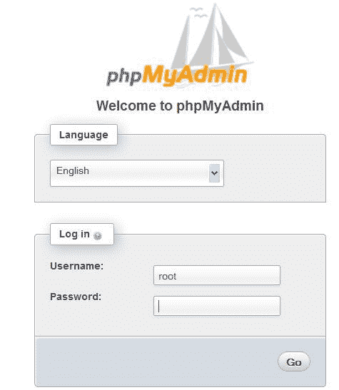
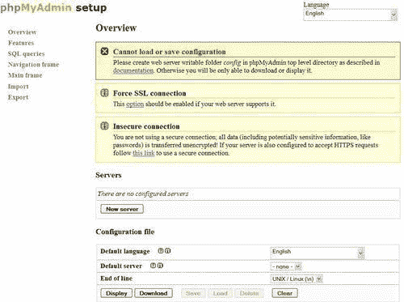
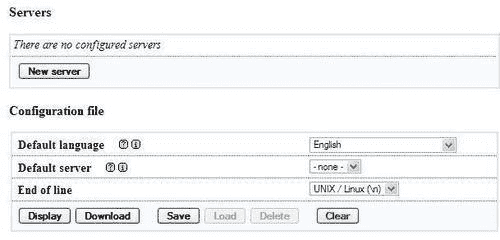
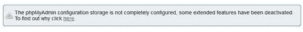

# 第一章：开始使用 phpMyAdmin

我在这本书中对你表示热烈的欢迎！本章的目标是：

+   了解这个软件产品在 Web 领域中的位置

+   了解它的所有功能

+   熟练安装和配置它

# PHP 和 MySQL：领先的开源组合

当我们看当前主机提供商提供的 Web 应用平台时，我们会发现最普遍的是 PHP/MySQL 组合。

得到各自主页的大力支持—[`www.php.net`](http://www.php.net)和[`www.mysql.com`](http://www.mysql.com) —这对组合使开发人员能够构建许多现成的开源 Web 应用程序，最重要的是，使内部开发人员能够快速建立稳固的 Web 解决方案。

MySQL，大多符合 SQL:2003 标准，是一个以其速度、稳健性和小的连接开销而闻名的数据库系统。在 Web 环境中，页面必须尽快提供的情况下，这一点非常重要。

PHP 通常安装在 Web 服务器内部作为一个模块，是一种流行的脚本语言，用于编写与 MySQL（或其他数据库系统）后端和浏览器前端通信的应用程序。具有讽刺意味的是，这个首字母缩略词的意义随着 Web 的发展而演变，从**个人主页**到**专业主页**再到其当前的递归定义——**PHP：超文本预处理器**。有关连续名称更改的博客文章可在[`blog.roshambo.org/how-the-php-acronym-was-reborn`](http://blog.roshambo.org/how-the-php-acronym-was-reborn)上找到。PHP 可以在数百万个 Web 域上使用，并为 Facebook、Yahoo!、YouTube 和 Wikipedia 等知名网站提供动力。

# 什么是 phpMyAdmin？

phpMyAdmin（官方主页在[`www.phpmyadmin.net`](http://www.phpmyadmin.net)）是一个用 PHP 编写的 Web 应用程序；它包含（像大多数 Web 应用程序一样）XHTML、CSS 和 JavaScript 客户端代码。该应用程序为管理 MySQL 数据库提供了完整的 Web 界面，并被广泛认为是该领域的领先应用程序。

自诞生以来就是开源的，得到了全球众多开发人员和翻译人员的支持（在撰写本书时已被翻译成 65 种语言）。该项目目前托管在 SourceForge.net 上，并由 phpMyAdmin 团队利用他们的设施进行开发。

全球各地的主机提供商都通过在他们的服务器上安装 phpMyAdmin 来表现对其的信任。流行的 cPanel（一个网站控制应用程序）包含 phpMyAdmin。此外，只要我们的提供商服务器满足最低要求（请参阅本章后面的*系统要求*部分），我们就可以在我们自己的 Web 服务器上安装我们自己的 phpMyAdmin 副本。

phpMyAdmin 的目标是提供对 MySQL 服务器和数据的完整基于 Web 的管理，并跟上 MySQL 和 Web 标准的发展。虽然产品不断发展，但它支持所有标准操作以及额外的功能。

开发团队根据报告的错误和请求的功能不断调整产品，定期发布新版本。

phpMyAdmin 提供了涵盖基本 MySQL 数据库和表操作的功能。它还有一个内部系统，用于维护元数据以支持高级功能。最后，系统管理员可以从 phpMyAdmin 管理用户和权限。重要的是要注意，phpMyAdmin 选择的可用操作取决于用户在特定 MySQL 服务器上的权限。

## 项目文档

有关 phpMyAdmin 的更多信息，请参阅主页文档页面，位于[`www.phpmyadmin.net/home_page/docs.php`](http://www.phpmyadmin.net/home_page/docs.php)。此外，开发团队在社区的帮助下维护着一个维基，位于[`wiki.phpmyadmin.net`](http://wiki.phpmyadmin.net)。

# 安装 phpMyAdmin

是时候安装产品并进行最少的首次使用配置了。

我们安装 phpMyAdmin 的原因可能是以下之一：

+   我们的主机提供商没有安装中央副本

+   我们的提供商安装了它，但安装的版本不是最新的

+   我们直接在企业的 Web 服务器上工作

请注意，如果我们选择安装通常包括 phpMyAdmin 作为其产品的一部分的 AMP 产品之一，我们可以省去 phpMyAdmin 安装步骤。更多详细信息请参见[`en.wikipedia.org/wiki/List_of_AMP_packages`](http://en.wikipedia.org/wiki/List_of_AMP_packages)。

## 所需信息

一些主机提供商提供了集成的 Web 面板，我们可以在其中管理帐户，包括 MySQL 帐户，还有一个文件管理器，可以用来上传 Web 内容。根据这一点，我们用于将 phpMyAdmin 源文件传输到我们的 Web 空间的机制可能会有所不同。在开始安装之前，我们需要一些以下特定信息：

+   Web 服务器的名称或地址。在这里，我们假设它是[www.mydomain.com](http://www.mydomain.com)。

+   我们的网页服务器帐户信息（用户名，密码）。此信息将用于 FTP 或 SFTP 传输，SSH 登录或 Web 控制面板登录。

+   MySQL 服务器的名称或 IP 地址。如果没有这些信息，一个很好的备选选择是`localhost`，这意味着 MySQL 服务器位于与 Web 服务器相同的机器上。我们假设这是`localhost`。

+   我们的 MySQL 服务器帐户信息（用户名，密码）。

## 系统要求

特定 phpMyAdmin 版本的最新要求始终在附带的`Documentation.html`中说明。对于 phpMyAdmin 3.4，所需的最低 PHP 版本是带有**session**支持的 PHP 5.2，**标准 PHP 库（SPL）**和**JSON**支持。此外，Web 服务器必须能够访问 MySQL 服务器（5.0 版本或更高版本）-可以是本地的，也可以是远程的。强烈建议在 cookie 身份验证模式下提高性能时，Web 服务器必须具有**PHP mcrypt**扩展（有关此内容，请参见第二章）。实际上，在 64 位服务器上，这个扩展是必需的。

在浏览器端，无论我们使用哪种身份验证模式，都必须激活 cookie 支持。

## 下载文件

[`www.phpmyadmin.net`](http://www.phpmyadmin.net)的**下载**部分提供了各种文件。这里可能提供了多个版本，最好下载最新的稳定版本。我们只需要下载一个文件，无论平台（浏览器，Web 服务器，MySQL 或 PHP 版本）如何，都可以使用。对于 3.4 版本，有两组文件-**english**和**all-languages**。如果我们只需要英文界面，可以下载文件名包含**english**的文件，例如**phpMyAdmin-3.4.5-english.zip**。另一方面，如果我们需要至少另一种语言，选择**all-languages**是合适的。

如果我们使用的是仅支持 PHP 4 的服务器-自 2007 年 12 月 31 日 PHP 团队停止支持以来，最新的稳定版本的 phpMyAdmin 不是一个好选择。我们可以使用 2.11.x 版本，这是支持 PHP 4 的最新分支，尽管 phpMyAdmin 团队也停止支持这个版本。

提供的文件具有各种扩展名：`.zip，.tar.bz2，.tar.gz，.tar.xz 和.7z`。下载具有您具有相应提取器的扩展名的文件。在 Windows 世界中，`.zip`是最通用的文件格式，尽管它比`.gz`或`.bz2`（在 Linux/Unix 世界中常见）要大。`.7z`扩展名表示 7-Zip 文件，这是一种比其他提供的格式具有更高压缩比的格式；提取器可在[`www.7-zip.org`](http://www.7-zip.org)上找到。在以下示例中，我们将假定所选文件是**phpMyAdmin-3.4.5-all-languages.zip**。

单击适当的文件后，SourceForge.net 会选择最近的镜像站点。文件将开始下载，我们可以将其保存在我们的计算机上。

## 在不同平台上安装

下一步取决于您使用的平台。以下各节详细介绍了一些常见平台的程序。您可以直接转到相关部分。

### 在 Windows 客户端上安装到远程服务器

使用 Windows 资源管理器，在 Windows 客户端上双击刚刚下载的`phpMyAdmin-3.4.5-all-languages.zip`文件。文件提取器应该会启动，显示主目录`phpMyAdmin-3.4.5-all-languages`中的所有脚本和目录。

使用文件提取器提供的任何机制将所有文件（包括子目录）保存到工作站上的某个位置。在这里，我们选择了`C:\`。因此，提取器创建了一个`C:\phpMyAdmin-3.4.5-all-languages`目录。

现在，是时候将整个目录结构`C:\phpMyAdmin-3.4.5-all-languages`传输到我们网页空间中的 Web 服务器了。我们可以使用我们喜欢的 SFTP 或 FTP 软件，或者使用 Web 控制面板进行传输。

我们传输 phpMyAdmin 的确切目录可能会有所不同。它可以是我们的`public_html`目录或我们通常传输 Web 文档的其他目录。有关要使用的确切目录或传输目录结构的最佳方法的进一步说明，我们可以咨询我们的主机提供商的帮助台。

传输完成后，这些文件可以从我们的 Windows 机器上删除，因为它们不再需要了。

### 在本地 Linux 服务器上安装

假设我们选择了`phpMyAdmin-3.4.5-all-languages.tar.gz`并直接下载到 Linux 服务器上的某个目录。我们将其移动到我们的 Web 服务器文档根目录（例如`/var/www/html`）或其子目录之一（例如`/var/www/html/utilities`）。然后，我们使用以下 shell 命令或使用窗口管理器提供的任何图形文件提取器进行提取：

```go
tar -xzvf phpMyAdmin-3.4.5-all-languages.tar.gz 

```

我们必须确保目录和文件的权限和所有权适合我们的 Web 服务器。Web 服务器用户或组必须能够读取它们。

### 在本地 Windows 服务器（Apache，IIS）上安装

这里的步骤与“在 Windows 客户端上安装到远程服务器”部分中描述的类似，只是目标目录将位于我们的`DocumentRoot`（对于 Apache）或我们的`wwwroot`（对于 IIS）下。当然，在对`config.inc.php`进行修改后，我们不需要传输任何内容（在下一节中描述），因为目录已经在 Web 空间中。

Apache 通常作为服务运行。因此，我们必须确保运行服务的用户具有正常的读取权限，以访问我们新创建的目录。相同的原则适用于使用`IUSR_machinename`用户的 IIS。该用户必须对目录具有读取权限。您可以在目录属性的`安全/权限`选项卡中调整权限。

# 配置 phpMyAdmin

在这里，我们学习如何准备和使用包含连接到 MySQL 的参数的配置文件，并且可以根据我们的要求进行自定义。

在配置之前，我们可以将目录`phpMyAdmin-3.4.5-all-languages`重命名为`phpMyAdmin`或其他更容易记住的名称。这样，我们和我们的用户可以访问一个容易记住的 URL 来启动 phpMyAdmin。在大多数服务器上，URL 的目录部分是区分大小写的，因此我们应该向用户传达确切的 URL。如果我们的服务器支持此功能，我们还可以使用符号链接。

在以下示例中，我们将假设该目录已重命名为`phpMyAdmin`。

## config.inc.php 文件

这个文件包含有效的 PHP 代码，定义了大部分参数（由 PHP 变量表示），我们可以更改以调整 phpMyAdmin 以满足我们自己的需求。文件中还有普通的 PHP 注释，我们可以注释我们的更改。

### 提示

注意不要在文件开头或结尾添加任何空行；这会妨碍 phpMyAdmin 的执行。

请注意，phpMyAdmin 在第一级目录中寻找此文件——与`index.php`位于同一目录。

包含一个`config.sample.inc.php`文件，可以复制并重命名为`config.inc.php`，作为起点。然而，建议您使用基于 Web 的安装脚本（在本章中解释）来代替，以获得更舒适的配置界面。

还有另一个文件——`layout.inc.php`——包含一些配置信息。由于 phpMyAdmin 提供主题管理，这个文件包含特定主题的颜色和设置。每个主题都有一个`layout.inc.php`文件，位于`themes/<themename>`，例如`themes/pmahomme`。我们将在第四章中介绍修改其中一些参数。

### 避免关于 config.inc.php 权限的虚假错误消息

在正常情况下，phpMyAdmin 会验证此文件的权限是否允许任何人修改。这意味着该文件不应该被世界写入。如果权限不正确，它还会显示警告。然而，在某些情况下（例如在非 Windows 服务器上挂载的 NTFS 文件系统），权限检测会失败。在这些情况下，您应该将以下配置参数设置为`false:`

```go
$cfg['CheckConfigurationPermissions'] = false;

```

以下各节将解释在`config.inc.php`中添加或更改参数的各种方法。

## 配置原则

phpMyAdmin 不维护自己的用户帐户；相反，它使用 MySQL 的权限系统。

### 注意

现在可能是浏览[`dev.mysql.com/doc/refman/5.1/en/privilege-system.html`](http://dev.mysql.com/doc/refman/5.1/en/privilege-system.html)的时候了，了解 MySQL 权限系统的基础知识。

由于缺少配置文件，phpMyAdmin 默认显示基于 cookie 的登录面板（有关此内容的更多详细信息，请参阅第二章），其中解释了默认配置下，无法使用空密码登录：



我们可以通过打开浏览器并访问`http://www.mydomain.com/phpMyAdmin`来验证这一事实，并替换域部分和目录部分的正确值。

如果我们能够登录，这意味着在与 Web 服务器相同的主机上有一个运行中的 MySQL 服务器（`localhost`），我们刚刚连接到它。然而，没有创建配置文件意味着我们将无法通过我们的 phpMyAdmin 安装管理其他主机。此外，许多高级的 phpMyAdmin 功能（例如查询书签、完整的关系支持、列转换等）将无法激活。

### 注意

基于 cookie 的身份验证方法使用 Blowfish 加密来存储浏览器 cookie 中的凭据。当没有配置文件存在时，会生成并存储一个 Blowfish 秘钥在会话数据中，这可能会导致安全问题。这就是为什么会显示以下警告消息的原因：

**配置文件现在需要一个秘密的密码（blowfish_secret）**

此时，我们有以下选择：

+   在没有配置文件的情况下使用 phpMyAdmin

+   使用基于 Web 的设置脚本生成`config.inc.php`文件

+   手动创建`config.inc.php`文件

这两个后续选项在以下部分中介绍。我们应该注意，即使使用基于 Web 的设置脚本，我们也应该熟悉`config.inc.php`文件的格式，因为设置脚本并没有涵盖所有可能的配置选项。

## 基于 Web 的设置脚本

强烈建议使用基于 Web 的设置机制，以避免手动创建配置文件可能导致的语法错误。此外，由于这个文件必须遵守 PHP 的语法，新用户在安装过程中可能会遇到问题。

### 注意

这里需要注意一点：当前版本的设置界面只有有限数量的翻译语言。

要访问设置脚本，我们必须访问[`www.mydomain.com/phpMyAdmin/setup`](http://www.mydomain.com/phpMyAdmin/setup)。在初始执行时，会出现以下截图：



在大多数情况下，每个参数旁边的图标指向相应的 phpMyAdmin 官方维基和文档，为您提供有关此参数及其可能值的更多信息。

如果出现**显示隐藏消息**并点击此链接，之前可能显示的消息将被显示出来。

这里有三个警告。由于处理第一条消息需要更多操作，我们稍后再处理。第二个警告鼓励您使用`ForceSSL`选项，在使用 phpMyAdmin 时自动切换到 HTTPS（与设置阶段无关）。

让我们来看看第三条消息——**不安全的连接**。如果我们通过不安全的协议 HTTP 访问 Web 服务器，就会出现这个消息。由于我们可能会在设置阶段输入机密信息，比如用户名和密码，建议至少在这个阶段使用 HTTPS 进行通信。HTTPS 使用 SSL（安全套接字层）来加密通信，使窃听线路变得不可能。如果我们的 Web 服务器支持 HTTPS，我们可以简单地按照建议的链接进行操作。这将重新启动设置过程，这次是通过 HTTPS 进行的。

第一个警告告诉我们，phpMyAdmin 没有找到一个名为`config`的可写目录。这是正常的，因为在下载的套件中没有这个目录。此外，由于目录还不存在，我们注意到界面中的**保存、加载**和**删除**按钮是灰色的。在这个`config`目录中，我们可以：

+   在设置过程中保存工作版本的配置文件

+   加载之前准备好的`config.inc.php`文件

我们并不一定需要创建这个配置目录，因为我们可以将设置过程生成的`config.inc.php`文件下载到客户端机器上。然后，我们可以通过与上传 phpMyAdmin 相同的机制（比如 FTP）将其上传到 phpMyAdmin 的一级目录中。在这个练习中，我们将创建这个目录。

这里的原则是 Web 服务器必须能够写入这个目录。有多种方法可以实现这一点。以下是在 Linux 服务器上可以使用的一种方法——在这个目录上为每个人添加读、写和执行权限。

```go
cd phpMyAdmin
mkdir config
chmod 777 config 

```

完成这些操作后，我们在浏览器中刷新页面，会看到一个类似以下截图的屏幕：



在配置对话框中，下拉菜单允许用户选择适当的行尾格式。我们应该选择与我们将在后来使用文本编辑器打开`config.inc.php`文件的平台（UNIX/Linux 或 Windows）相对应的格式。

一个 phpMyAdmin 的副本可以用来管理许多 MySQL 服务器，但是现在我们将定义描述我们的第一个 MySQL 服务器的参数。我们单击**新服务器**，然后显示服务器配置面板。

这些参数的完整解释可以在本章的以下部分找到。现在，我们注意到设置过程已检测到 PHP 支持`mysqli`扩展。因此，默认选择此扩展。此扩展是 PHP 用于与 MySQL 通信的编程库。

我们假设我们的 MySQL 服务器位于`localhost`上。因此，我们保持此值和所有建议的值不变，除了以下内容：

+   **基本设置 | 该服务器的详细名称** —我们输入 **我的服务器**

+   **认证 | 用于配置认证的用户** —我们删除**root**并将其留空，因为默认的认证类型是`cookie`，它会忽略在此输入的用户名

您可以看到任何更改为其默认值的参数都以不同的颜色显示。此外，会出现一个小箭头，其目的是将字段恢复为其默认值。因此，您可以放心地尝试更改参数，知道您可以轻松恢复到建议的值。此时，**基本设置**面板应该类似于以下屏幕截图：

基于 Web 的设置脚本

然后我们单击**保存**，并返回到**概述**面板。此保存操作尚未将任何内容保存到磁盘；更改已保存在内存中。我们收到警告，生成了一个 Blowfish 秘钥。但是，我们不必记住它，因为在登录过程中不需要输入它，而是在内部使用。对于好奇的人，您可以切换到**功能**面板，然后单击**安全**选项卡，以查看生成的秘钥。让我们回到**概述**面板。现在，我们的设置过程已知道一个 MySQL 服务器，并且有一些链接，使我们能够像下面的屏幕截图中显示的那样**编辑**或**删除**这些服务器设置：

基于 Web 的设置脚本

我们可以使用**显示**按钮查看生成的配置行；然后，我们可以使用本章后面的*一些配置参数的描述*部分中给出的解释来分析这些参数。

此时，此配置仍仅存储在内存中，因此我们需要保存它。这是通过**概述**面板上的**保存**按钮完成的。它将`config.inc.php`保存在我们之前创建的特殊`config`目录中。这是一个严格用于配置目的的目录。如果由于任何原因无法创建此`config`目录，您只需通过单击**下载**按钮将文件下载并上传到安装了 phpMyAdmin 的 Web 服务器目录。

最后一步是将`config.inc.php`从`config`目录复制到顶级目录 —— 包含`index.php`的目录。通过复制此文件，它将由用户拥有，而不是由 Web 服务器拥有，从而确保可以进行进一步的修改。可以通过 FTP 或通过以下命令进行此复制：

```go
cd config
cp config.inc.php .. 

```

作为安全措施，直到配置步骤完成之前，建议更改`config`目录的权限，例如使用以下命令：

```go
chmod ugo-rwx config 

```

这是为了阻止在此目录中进行任何未经授权的读写操作。

其他配置参数可以使用这些基于 Web 的设置页面进行设置。要这样做，我们需要：

1.  启用对`config`目录的读写访问权限。

1.  将`config.inc.php`复制到那里。

1.  确保为 Web 服务器提供了对该文件的读写访问权限。

1.  启动基于 Web 的设置工具。

配置步骤完成后，建议完全删除`config`目录，因为这个目录只被基于 Web 的安装脚本使用。如果 phpMyAdmin 检测到这个目录仍然存在，它会在主页上显示以下警告（参见第三章)：

**目录 config，被安装脚本使用，仍然存在于您的 phpMyAdmin 目录中。一旦 phpMyAdmin 配置完成，您应该删除它**。

您可以浏览剩余的菜单，了解可用的配置可能性，无论是现在还是在我们涵盖相关主题时。

为了使本书的文本更轻，我们将在接下来的章节中只提到参数的文本值。

## 手动创建 config.inc.php

我们可以使用我们喜欢的文本编辑器从头开始创建这个文本文件，或者使用`config.sample.inc.php`作为起点。确切的步骤取决于我们使用的客户端操作系统。我们可以参考下一节获取更多信息。

所有可能的配置参数的默认值都在`libraries/config.default.php`中定义。我们可以查看此文件，了解使用的语法以及有关配置的进一步注释。请参见本章*升级 phpMyAdmin*部分中关于此文件的重要说明。

## 在 Windows 客户端上编辑 config.inc.php 的提示

这个文件包含特殊字符（Unix 风格的行尾）。因此，我们必须使用理解这种格式的文本编辑器打开它。如果我们使用错误的文本编辑器，这个文件将显示非常长的行。最好的选择是标准的 PHP 编辑器，如 NetBeans 或 Zend Studio for Eclipse。另一个选择是 WordPad，Metapad 或 UltraEdit。

每次修改`config.inc.php`文件，都必须再次将其传输到我们的网络空间。这种传输是通过 FTP 或 SFTP 客户端完成的。您可以选择使用独立的 FTP/SFTP 客户端，如 FileZilla，或者如果您的 PHP 编辑器支持此功能，也可以直接通过 FTP/SFTP 保存。

## 一些配置参数的描述

在本章和下一章中，我们将集中讨论与连接和身份验证相关的参数。其他参数将在解释相应功能的章节中讨论。

### PmaAbsoluteUri

我们将首先查看的参数是`$cfg['PmaAbsoluteUri'] = ''`;

有时，phpMyAdmin 需要发送 HTTP `Location`头，并且必须知道其安装点的绝对 URI。在这种情况下，使用绝对 URI 是 RFC 2616 第 14.30 节要求的。

在大多数情况下，我们可以将此项留空，因为 phpMyAdmin 会尝试自动检测正确的值。如果我们稍后浏览表，然后编辑一行，并单击**保存**，我们将收到来自浏览器的错误消息，例如**此文档不存在**。这意味着 phpMyAdmin 为了到达预期页面而构建的绝对 URI 是错误的，表明我们必须手动在此参数中放入正确的值。

例如，我们会将其更改为：

```go
$cfg['PmaAbsoluteUri'] = 'http://www.mydomain.com/phpMyAdmin/';

```

### 特定于服务器的部分

文件的下一部分包含特定于服务器的配置，每个配置都以以下代码片段开头：

```go
$i++;
$cfg['Servers'][$i]['host'] = '';

```

如果我们只检查正常的服务器参数（其他参数在本章的*安装 phpMyAdmin 配置存储*部分中有介绍），我们会看到每个服务器的以下代码块：

```go
$i++;
$cfg['Servers'][$i]['host'] = '';
$cfg['Servers'][$i]['port'] = '';
$cfg['Servers'][$i]['socket'] = '';
$cfg['Servers'][$i]['connect_type'] = 'tcp';
$cfg['Servers'][$i]['extension'] = 'mysqli';
$cfg['Servers'][$i]['compress'] = FALSE;
$cfg['Servers'][$i]['controluser'] = '';
$cfg['Servers'][$i]['controlpass'] = '';
$cfg['Servers'][$i]['auth_type'] = 'cookie';
$cfg['Servers'][$i]['user'] = '';
$cfg['Servers'][$i]['password'] = '';
$cfg['Servers'][$i]['only_db'] = '';
$cfg['Servers'][$i]['hide_db'] = '';
$cfg['Servers'][$i]['verbose'] = '';

```

在这一部分，我们必须输入`$cfg['Servers'][$i]['host']`，MySQL 服务器的主机名或 IP 地址，例如，`mysql.mydomain.com`或`localhost`。如果此服务器在非标准端口或套接字上运行，我们在`$cfg['Servers'][$i]['port']`或`$cfg['Servers'][$i]['socket']`中填入正确的值。有关套接字的更多详细信息，请参见*connect_type, sockets, and port*部分。

在 phpMyAdmin 界面中显示的服务器名称将是`'host'`中输入的名称，除非我们在以下参数中输入非空值，例如：

```go
$cfg['Servers'][$i]['verbose'] = 'Test server';

```

因此，这个功能可以用来在登录面板和主页面上显示用户所看到的不同服务器主机名，尽管真实的服务器名称可以作为用户定义的一部分（例如，在主页面上是`root@localhost`）。

#### 扩展

PHP 与 MySQL 服务器通信的传统机制，在 PHP 5 之前可用的是`mysql`扩展。这个扩展在 PHP 5 中仍然可用。然而，一个名为`mysqli`的新扩展已经开发出来，并且应该在 PHP 5 中优先使用，因为它具有改进的性能并支持 MySQL 4.1.x 系列的全部功能。这个扩展被设计用于与 MySQL 版本 4.1.3 及更高版本一起使用。由于 phpMyAdmin 支持这两个扩展，我们可以为特定服务器选择其中一个。我们在`$cfg['Servers'][$i]['extension']`中指定我们想要使用的扩展。默认使用的值是`mysqli`。

#### connect_type、socket 和 port

`mysql`和`mysqli`扩展在连接到`localhost`上的 MySQL 时会自动使用套接字。考虑以下配置：

```go
$cfg['Servers'][$i]['host'] = 'localhost';
$cfg['Servers'][$i]['port'] = '';
$cfg['Servers'][$i]['socket'] = '';
$cfg['Servers'][$i]['connect_type'] = 'tcp';
$cfg['Servers'][$i]['extension'] = 'mysql';

```

`connect_type`的默认值是`tcp`。然而，扩展将使用套接字，因为它认为这样更有效率，因为`host`是`localhost`。所以在这种情况下，我们可以使用`tcp`或`socket`作为`connect_type`。要强制使用真正的 TCP 连接，可以在`host`参数中指定`127.0.0.1`而不是`localhost`。因为`socket`参数为空，扩展将尝试使用默认套接字。如果`php.ini`中定义的默认套接字与分配给 MySQL 服务器的真实套接字不对应，我们必须在`$cfg['Servers'][$i]['socket']`中放置套接字名称（例如`/tmp/mysql.sock`）。

如果主机名不是`localhost`，将发生 TCP 连接；在这种情况下，使用特殊端口`3307`。然而，将端口值留空将使用默认的`3306`端口：

```go
$cfg['Servers'][$i]['host'] = 'mysql.mydomain.com';
$cfg['Servers'][$i]['port'] = '3307';
$cfg['Servers'][$i]['socket'] = '';
$cfg['Servers'][$i]['connect_type'] = 'tcp';
$cfg['Servers'][$i]['extension'] = 'mysql';

```

#### 压缩

PHP 与 MySQL 之间通信所使用的协议允许压缩模式。使用此模式可以提高效率。要利用此模式，只需指定：

```go
$cfg['Servers'][$i]['compress'] = TRUE;

```

#### 持久连接

另一个重要的参数（不是特定于服务器的，但适用于所有服务器定义）是`$cfg['PersistentConnections']`。对于使用`mysql`扩展连接的每个服务器，当设置为`TRUE`时，此参数指示 PHP 保持与 MySQL 服务器的连接打开。这加快了 PHP 与 MySQL 之间的交互。然而，在`config.inc.php`中默认设置为`FALSE`，因为持久连接经常是服务器资源耗尽的原因（您会发现 MySQL 拒绝新连接）。因此，对于`mysqli`扩展，甚至不提供此选项。因此，如果您使用此扩展进行连接，则在这里将其设置为`TRUE`将不起作用。

#### 控制用户

定义控制用户有以下两个目的：

+   在运行`--skip-show-database`的 MySQL 服务器上，控制用户允许使用多用户身份验证，尽管使用此选项运行的服务器并不常见。这一方面在第二章中有描述。

+   在所有版本的 MySQL 服务器上，这个用户是必需的，才能使用 phpMyAdmin 的高级功能。

为了认证目的，`controluser`是一个特殊用户（我们选择的通常名称是`pma`），他有权读取`mysql`数据库中的一些字段（其中包含所有用户定义）。phpMyAdmin 仅为认证的特定需求发送带有这个特殊`controluser`的查询，而不是正常操作。创建控制用户的命令可以在 phpMyAdmin 的`Documentation.html`中找到，并且可能会因版本而异。这份文档包含了最新的命令。

当我们在 MySQL 服务器中创建`controluser`时，我们填写参数如下示例中的内容，将`xxx`替换为一个适当复杂的密码：

```go
$cfg['Servers'][$i]['controluser'] = 'pma';
$cfg['Servers'][$i]['controlpass'] = 'xxx';

```

这里适用标准密码指南。请参考[`en.wikipedia.org/wiki/Password_strength`](http://en.wikipedia.org/wiki/Password_strength)获取建议。

# 安装 phpMyAdmin 配置存储

除了基本的 MySQL 数据库维护外，phpMyAdmin 还提供了高级功能，我们将在接下来的章节中发现。这些功能需要安装 phpMyAdmin 配置存储。

## 配置存储的目标

配置存储由 phpMyAdmin 在幕后使用的一组表组成。它们保存元数据，其中包含支持特殊功能的信息，例如查询书签和数据转换。此外，对于使用不支持外键的存储引擎的表，表之间的关系保存在这个配置存储中。元数据是根据我们在界面上的操作由 phpMyAdmin 生成和维护的。

## 配置存储的位置

有两个可能的地方来存储这些表：

+   用户的数据库-以方便每个网页开发人员拥有一个数据库以从这些功能中受益。

+   一个名为 pmadb（phpMyAdmin 数据库）的专用数据库。在多用户安装中，这个数据库可能对许多用户可见，同时保持元数据私有。

由于这个存储默认情况下不存在，并且 phpMyAdmin 团队希望推广它，界面在主页上显示以下通知消息：



这条消息可以通过以下参数禁用（默认情况下设置为`FALSE`）：

```go
$cfg['PmaNoRelation_DisableWarning'] = TRUE;

```

## 执行安装

即使只有部分配置存储缺失，先前的错误消息也会显示。当然，在新安装中，所有部分都缺失-我们的数据库还没有听说过 phpMyAdmin，并且需要配备这个配置存储。在前一个截图中点击“here”链接会弹出一个面板，解释`pmadb`以及应该是其中一部分的表要么缺失要么未定义。

重要的是要意识到，只有满足以下两个条件，配置存储才能正常运行：

+   在`config.inc.php`中存在适当的定义

+   相应的表（也许是数据库）被创建

为了创建与我们当前版本的 phpMyAdmin 匹配的必要结构，phpMyAdmin 安装目录的`scripts`子目录中提供了一个名为`create_tables.sql`的命令文件。但是，在了解可能的选择-单用户安装或多用户安装之前，我们不应该盲目执行它。

### 注意

在后续章节中，我们将假设选择了多用户安装。

### 为单个用户安装

即使我们只有一个数据库的权限，我们仍然可以使用 phpMyAdmin 的所有高级功能。在这种设置中，我们将使用我们现有的数据库来存储元数据表。

我们需要修改`scripts/create_tables.sql`文件的本地副本，以便用所需的所有表填充我们的数据库。它们将具有前缀`pma_`以便于识别。我们需要删除以下行：

```go
CREATE DATABASE IF NOT EXISTS `phpmyadmin`
DEFAULT CHARACTER SET utf8 COLLATE utf8_bin;
USE phpmyadmin;

```

这样做是因为我们不会使用`phpmyadmin`数据库，而是我们自己的。接下来，我们应该在 phpMyAdmin 中打开我们自己的数据库。现在我们准备执行脚本了。有两种方法可以做到这一点：

+   由于我们已经在编辑器中有脚本，我们可以只需复制这些行并粘贴到**SQL**页面的查询框中。更多细节请参阅第十一章。

+   另一种方法是使用第七章中展示的导入技术。我们选择刚刚修改的`create_tables.sql`脚本。

创建后，导航面板会显示特殊的`pma_`表和我们的普通表。

现在是时候调整`config.inc.php`中所有与配置存储相关的参数了。这可以通过本章中的设置脚本轻松完成，也可以通过从`config.sample.inc.php`文件中粘贴适当的行来完成。数据库是我们自己的，表名是刚刚创建的表名：

```go
$cfg['Servers'][$i]['pmadb'] = 'mydatabase';
$cfg['Servers'][$i]['bookmarktable'] = 'pma_bookmark';
$cfg['Servers'][$i]['relation'] = 'pma_relation';
$cfg['Servers'][$i]['table_info'] = 'pma_table_info';
$cfg['Servers'][$i]['table_coords'] = 'pma_table_coords';
$cfg['Servers'][$i]['pdf_pages'] = 'pma_pdf_pages';
$cfg['Servers'][$i]['column_info'] = 'pma_column_info';
$cfg['Servers'][$i]['history'] = 'pma_history';
$cfg['Servers'][$i]['tracking'] = 'pma_tracking';
$cfg['Servers'][$i]['designer_coords'] = 'pma_designer_coords';
$cfg['Servers'][$i]['userconfig'] = 'pma_userconfig';

```

### 注意

由于表名区分大小写，我们必须使用与安装脚本创建的表相同的名称。我们可以自由更改表名（参见列出的配置指令的右侧部分），只要我们相应地在数据库中进行更改。

`pmadb`和每个表都有一个特定的功能，如下所列：

| 功能 | 描述 | 解释 |
| --- | --- | --- |
| `pmadb` | 定义所有表所在的数据库 | 本章 |
| `bookmarktable` | 包含查询书签 | 第十四章 |
| `relation` | 定义表间关系，用于 phpMyAdmin 的许多功能 | 第十章 |
| `table_info` | 包含显示字段 | 第十章 |
| `table_coords`和`pdf_pages` | 包含绘制 PDF 格式关系图所需的元数据 | 第十五章 |
| `column_info` | 用于列注释和基于 MIME 的转换 | 第十六章 |
| `history` | 包含 SQL 查询历史信息 | 第十一章 |
| `tracking` | 包含与被跟踪表相关的元数据和实际的 SQL 语句 | 第十八章 |
| `designer_coords` | 保存**Designer**功能使用的坐标 | 第十章 |
| `userconfig` | 保存用户的偏好设置 | 第三章 |

在每个 phpMyAdmin 版本之间，基础设施可能会得到增强——这些变化在`Documentation.html`中有解释。这就是为什么 phpMyAdmin 有各种检查来确定表的结构。如果我们知道我们使用的是最新结构，可以将`$cfg['Servers'][$i]['verbose_check']`设置为`FALSE`以避免检查，从而稍微提高 phpMyAdmin 的速度。

### 为多个用户安装

在这个设置中，我们将有一个独立的数据库`pmadb`来存储元数据表。我们的控制用户将有特定的权限访问这个数据库。每个用户将使用自己的登录名和密码来访问自己的数据库。然而，当 phpMyAdmin 本身访问`pmadb`以获取一些元数据时，它将使用控制用户的权限。

### 注意

设置多用户安装只有 MySQL 系统管理员才能做，他有权限给另一个用户（这里是`pma`用户）分配权限。

我们首先确保控制用户`pma`已经创建，并且在`config.inc.php`中的定义是合适的。然后我们将`scripts/create_tables.sql`复制到我们的本地工作站并进行编辑。我们替换以下行：

```go
-- GRANT SELECT, INSERT, DELETE, UPDATE ON `phpmyadmin`.* TO
-- 'pma'@localhost;

```

使用这些，删除注释字符（双破折号）：

```go
GRANT SELECT, INSERT, DELETE, UPDATE ON `phpmyadmin`.* TO
'pma'@localhost;

```

然后通过导入执行此脚本（参见[第七章)](ch07.html "第七章。导入结构和数据"）。其净效果是创建`phpmyadmin`数据库，为用户`pma`分配适当的权限，并用所有必要的表填充数据库。

最后一步是调整`config.inc.php`中与关系特性相关的所有参数。请参阅*为单个用户安装*部分，除了`pmadb`参数中的数据库名称，该名称将如下代码片段所示：

```go
$cfg['Servers'][$i]['pmadb'] = 'phpmyadmin';

```

安装现在已经完成。我们将在接下来的章节中测试功能。我们可以通过退出 phpMyAdmin，然后登录并显示主页来进行快速检查；警告消息应该消失。

# 升级 phpMyAdmin

通常，升级只是将新版本安装到一个单独的目录，并将先前版本的`config.inc.php`复制到新目录。

### 注意

升级路径或首次安装路径，**不应**采用的方法是将`libraries/config.default.php`复制到`config.inc.php`。这是因为默认配置文件是特定版本的，并不能保证适用于将来的版本。

从版本到版本会出现新参数。它们在`Documentation.html`中有文档记录，并在`libraries/config.default.php`中定义。如果配置参数在`config.inc.php`中不存在，则将使用`libraries/config.default.php`中的值。因此，如果默认值适合我们，我们就不必在`config.inc.php`中包含它。

必须特别注意传播我们可能对`layout.inc.php`文件所做的更改，这取决于所使用的主题。如果我们向结构中添加了自定义主题，我们将不得不复制我们的自定义主题子目录。

# 总结

本章介绍了 PHP/MySQL 在 Web 应用程序中的流行程度。该章还概述了为什么 phpMyAdmin 被认为是从 Web 界面访问 MySQL 的领先应用程序。然后讨论了安装 phpMyAdmin 的常见原因，从主要网站下载它的步骤，基本配置，将 phpMyAdmin 上传到我们的 Web 服务器以及升级。

基本安装已完成，下一章将深入探讨配置主题，探索认证和安全方面。
