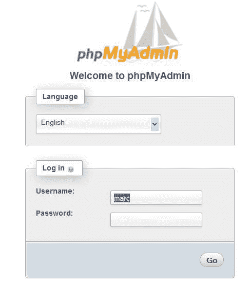
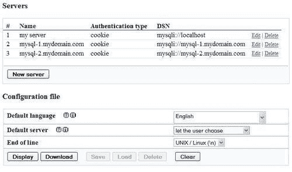
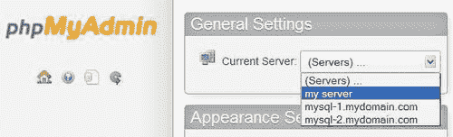
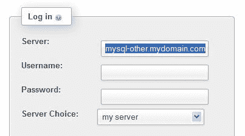

# 第二章。配置身份验证和安全

在 phpMyAdmin 中配置身份验证有许多种方式 - 取决于我们的目标、其他应用程序的存在以及我们需要的安全级别。本章探讨了可用的可能性。

# 通过 phpMyAdmin 登录 MySQL

当我们输入用户名和密码时，尽管看起来我们是在登录 phpMyAdmin，但实际上我们并没有！我们只是使用 phpMyAdmin（运行在 web 服务器上）作为一个界面，将我们的用户名和密码信息发送到 MySQL 服务器。严格来说，我们并没有登录*到*phpMyAdmin，而是*通过*phpMyAdmin。

### 注意

这就是为什么在关于 phpMyAdmin 的用户支持论坛中，询问身份验证帮助的人经常被引荐回他们的 MySQL 服务器管理员，因为丢失的 MySQL 用户名或密码不是 phpMyAdmin 的问题。

本节解释了 phpMyAdmin 提供的各种身份验证模式。

## 在没有密码的情况下登录账户

MySQL 的默认安装会使服务器容易受到入侵，因为它创建了一个名为`root`的 MySQL 账户，而不设置密码 - 除非 MySQL 分发商已经设置了密码。对于这种安全性弱点的推荐解决方法是为`root`账户设置密码。如果我们无法设置密码或不想设置密码，我们将不得不对 phpMyAdmin 进行配置更改。事实上，存在一个特定于服务器的配置参数，`$cfg['Servers'][$i]['AllowNoPassword']`。它的默认值是`false`，这意味着不允许没有密码的账户登录。通常，这个指令应该保持为`false`，以避免通过 phpMyAdmin 进行这种访问，因为黑客正在积极地探测 web 上的不安全的 MySQL 服务器。查看*保护 phpMyAdmin*部分，了解有关保护服务器的其他想法。

### 注意

如果`AllowNoPassword`参数保持为`false`，并且尝试登录而没有密码，则会显示**拒绝访问**消息。

## 使用`config`身份验证对单个用户进行身份验证

我们可能需要通过固定的用户名和密码自动连接到 MySQL 服务器，而无需甚至被要求。这就是`config`身份验证类型的确切目标。

对于我们的第一个示例，我们将使用`config`身份验证。然而，在*身份验证多个用户*部分，我们将看到更强大和多功能的身份验证方式。

### 注意

使用`config`身份验证类型会使我们的 phpMyAdmin 容易受到入侵，除非我们像本章的*保护 phpMyAdmin*部分所解释的那样保护它。

在这里，我们要求`config`身份验证，并为这个 MySQL 服务器输入我们的用户名和密码：

```go
$cfg['Servers'][$i]['auth_type'] = 'config';
$cfg['Servers'][$i]['user'] = 'marc';
$cfg['Servers'][$i]['password'] = 'xxx';

```

然后我们可以保存我们在`config.inc.php`中所做的更改。

### 测试 MySQL 连接

现在是时候启动 phpMyAdmin 并尝试使用我们配置的值连接到它。这将测试以下内容：

+   我们在`config`文件或基于 web 的设置中输入的值

+   PHP 组件在 web 服务器内的设置，如果我们进行了手动配置

+   web 和 MySQL 服务器之间的通信

我们启动浏览器，并将其指向我们安装 phpMyAdmin 的目录，如[`www.mydomain.com/phpMyAdmin/`](http://www.mydomain.com/phpMyAdmin/)。如果这不起作用，我们尝试[`www.mydomain.com/phpMyAdmin/index.php`](http://www.mydomain.com/phpMyAdmin/index.php)。（这意味着我们的 web 服务器没有配置为将`index.php`解释为默认的起始文档。）

如果仍然出现错误，请参考附录 A 进行故障排除和支持。现在我们应该看到 phpMyAdmin 的主页。第三章概述了现在看到的面板。

## 身份验证多个用户

我们可能希望允许一份 phpMyAdmin 副本被一组人使用，每个人都有自己的 MySQL 用户名和密码，并且只能看到他们有权限的数据库。或者我们可能更喜欢避免在`config.inc.php`中以明文形式存储我们的用户名和密码。

phpMyAdmin 不再依赖于`config.inc.php`中存储的用户名和密码，而是与浏览器通信，并从中获取认证数据。这使得所有在特定 MySQL 服务器中定义的用户都可以进行真正的登录，而无需在配置文件中定义它们。有三种模式可以允许通过 phpMyAdmin 对 MySQL 进行受控登录——`http，cookie`和`signon`。我们将不得不选择适合我们特定情况和环境的模式（稍后会详细介绍）。`http`和`cookie`模式可能需要我们首先定义一个控制用户，如第一章中所述。

### 使用 HTTP 进行身份验证

这种模式`—http—`是 HTTP 中提供的传统模式，其中浏览器请求用户名和密码，将它们发送到 phpMyAdmin，并一直发送直到所有浏览器窗口关闭。

要启用这种模式，我们只需使用以下行：

```go
$cfg['Servers'][$i]['auth_type'] = 'http';

```

我们还可以通过`$cfg['Servers'][$i]['auth_http_realm']`定义 HTTP 的**基本认证领域**（[`en.wikipedia.org/wiki/Basic_access_authentication`](http://en.wikipedia.org/wiki/Basic_access_authentication)），这是在登录时向用户显示的消息，这可以帮助指示此服务器的目的。

这种模式有以下限制：

+   根据版本不同，PHP 可能不支持所有类型的 Web 服务器的 HTTP 身份验证。

+   如果我们想要用`.htaccess`文件保护 phpMyAdmin 的目录（参考本章的*Securing phpMyAdmin*部分），这将干扰 HTTP 身份验证类型；我们不能同时使用两者。

+   浏览器通常会存储认证信息以节省重新输入凭据的时间，但请记住这些凭据是以未加密的格式保存的。

+   HTTP 协议中没有适当的注销支持；因此我们必须关闭所有浏览器窗口才能再次使用相同的用户名登录。

### 使用 cookie 值进行身份验证

`cookie`身份验证模式在提供的功能方面优于`http`。这种模式允许真正的登录和注销，并且可以与任何类型的 Web 服务器上运行的 PHP 一起使用。它在 phpMyAdmin 内部呈现登录面板（如下面的截图所示）。这可以根据应用程序源代码进行自定义。然而，正如你可能已经猜到的，对于`cookie`身份验证，浏览器必须接受来自 Web 服务器的 cookie——但无论如何，这对所有身份验证模式都是如此。

这种模式将登录屏幕中输入的用户名存储为我们浏览器中的永久 cookie，而密码则存储为临时 cookie。在多服务器配置中，与每个服务器对应的用户名和密码是分开存储的。为了防止针对 cookie 内容的攻击方法泄露用户名和密码的机密性，它们使用 Blowfish 密码进行加密。因此，要使用这种模式，我们必须在`config.inc.php`中定义（一次）一个秘密字符串，该字符串将用于安全加密从此 phpMyAdmin 安装中存储为 cookie 的所有密码。

这个字符串是通过`blowfish_secret`指令设置的：

```go
$cfg['blowfish_secret'] = 'jgjgRUD875G%/*';

```

在上面的例子中，使用了一串任意的字符；这个字符串可以非常复杂，因为没有人需要在登录面板上输入它。如果我们未能配置这个指令，phpMyAdmin 将生成一个随机的秘密字符串，但它只会持续当前的工作会话。因此，一些功能，比如在登录面板上回忆上一个用户名，将不可用。

然后，对于每个特定服务器的部分，使用以下内容：

```go
$cfg['Servers'][$i]['auth_type'] = 'cookie';

```

下次启动 phpMyAdmin 时，我们将看到如下截图所示的登录面板：



默认情况下，phpMyAdmin 在登录面板中显示上次成功登录到该特定服务器的用户名，从永久 cookie 中检索。如果这种行为不可接受（同一工作站上的其他用户不应该看到上一个用户名），我们可以将以下参数设置为`FALSE`：

```go
$cfg['LoginCookieRecall'] = FALSE;

```

有一个安全功能，可以为密码的有效性添加特定的时间限制。这个功能有助于保护工作会话。成功登录后，我们的密码（加密）与计时器一起存储在 cookie 中。phpMyAdmin 中的每个操作都会重置计时器。如果我们在一定数量的秒内保持不活动，就会被断开连接，必须重新登录，这个数量在`$cfg['LoginCookieValidity']`中定义。增加这个参数并不总是有效，因为 PHP 自己的`session.gc_maxlifetime`指令可能会有阻碍。请参考[`php.net/manual/en/session.configuration.php`](http://php.net/manual/en/session.configuration.php)来了解这个指令。因此，如果 phpMyAdmin 检测到`session.gc_maxlifetime`的值小于配置的`$cfg['LoginCookieValidity']`，则会在主页上显示警告。默认值为 1440 秒；这与`php.ini`中`session.gc_maxlifetime`参数的默认值相匹配。

### 注意

用于保护用户名和密码的 Blowfish 算法需要进行许多计算。为了实现最佳速度，我们的 Web 服务器上必须安装 PHP 的`mcrypt`扩展及其相应的库。

为了帮助用户意识到这个扩展是非常重要的，当 phpMyAdmin 检测到其缺失时，会在主页上显示一条消息。`$cfg['McryptDisableWarning']`指令控制这条消息。默认情况下，`false`的值意味着显示这条消息。

### 使用登录模式进行身份验证

在工作会话期间，用户可能会遇到来自不同 Web 应用程序的多个身份验证请求。原因是这些应用程序之间不会相互通信，这种情况会给大多数用户带来不便。

`signon`模式使我们能够使用另一个应用程序的凭据来跳过 phpMyAdmin 的身份验证阶段。为了使其工作，这个其他应用程序必须将正确的凭据存储到 PHP 的会话数据中，以便稍后由 phpMyAdmin 检索。

### 注意

根据 PHP 手册，将凭据存储在 PHP 会话中并不一定安全：[`php.net/manual/en/session.security.php`](http://php.net/manual/en/session.security.php)。

要启用这种模式，我们从以下指令开始：

```go
$cfg['Servers'][$i]['auth_type'] = 'signon';

```

假设认证应用程序已经使用名为`FirstApp`的会话来存储凭据。我们通过添加以下代码行告诉 phpMyAdmin：

```go
$cfg['Servers'][$i]['SignonSession'] = 'FirstApp';

```

我们必须注意那些在其他应用程序之前尝试访问 phpMyAdmin 的用户；在这种情况下，phpMyAdmin 将用户重定向到认证应用程序。这是通过以下方式完成的：

```go
$cfg['Servers'][$i]['SignonURL'] = 'http://www.mydomain.com/FirstApp';

```

认证应用程序如何以 phpMyAdmin 能够理解的格式存储凭据？一个示例包含在`scripts/signon.php`中。在这个脚本中，有一个简单的 HTML 表单来输入凭据和初始化会话的逻辑——我们将使用`FirstApp`作为会话名称，并将用户、密码、主机和端口信息创建到这个会话中，如下所示：

```go
$_SESSION['PMA_single_signon_user'] = $_POST['user'];
$_SESSION['PMA_single_signon_password'] = $_POST['password'];
$_SESSION['PMA_single_signon_host'] = $_POST['host'];
$_SESSION['PMA_single_signon_port'] = $_POST['port'];

```

### 注意

请注意，认证的第一个应用程序不需要向用户询问 MySQL 的凭据。这些可以在应用程序内部硬编码，因为它们是机密的，或者这个应用程序的凭据与 MySQL 的凭据之间有已知的对应关系。

要将附加的配置参数传递给`signon`模块，`$_SESSION['PMA_single_signon_cfgupdate']`可以接收一个包含在`$cfg['Servers'][$i]`中允许的任何附加服务器参数的数组。

然后，认证应用程序使用自己选择的方式——链接或按钮——让其用户启动 phpMyAdmin。如果在登录过程中发生错误（例如，拒绝访问），`signon`模块将适当的错误消息保存到`$_SESSION['PMA_single_signon_error_message']`中。

在另一个示例中，`scripts/openid.php`展示了如何使用流行的 OpenID 机制进行登录。

## 配置多服务器支持

`config.inc.php`文件至少包含一个特定服务器部分；但是，我们可以添加更多部分，使单个 phpMyAdmin 副本能够管理多个 MySQL 服务器。让我们看看如何配置更多服务器。

### 在配置文件中定义服务器

在`config.inc.php`文件的特定服务器部分，我们看到了每个服务器的`$cfg['Servers'][$i]`的引用行。在这里，变量`$i`被使用，以便可以轻松地剪切和粘贴整个配置文件的部分来配置更多服务器。在复制这些部分时，我们应该注意复制`$i++`指令，这是在每个部分之前并且对于界定服务器部分至关重要的。

然后，在各个部分的末尾，以下行控制启动：

```go
$cfg['ServerDefault'] = 1;

```

默认值`1`表示 phpMyAdmin 将默认使用第一个定义的服务器。我们可以指定任何数字，对应于特定服务器的部分。我们还可以输入值`0`，表示没有默认服务器；在这种情况下，登录时将呈现可用服务器的列表。

这个配置也可以通过基于 web 的设置来完成。这里给出了一个多服务器定义的示例，其中默认服务器设置为**让用户选择：**



如果没有定义默认服务器，phpMyAdmin 将呈现服务器选择：



### 通过任意服务器进行身份验证

如果我们想要能够连接到未定义的 MySQL 服务器，可以使用另一种机制。首先，我们必须设置以下参数：

```go
$cfg['AllowArbitraryServer'] = TRUE;

```

我们还需要将`$cfg['ServerDefault']`的默认值设置回`1`。然后，我们需要使用`cookie`认证类型。我们将能够选择服务器并输入用户名和密码。

### 注意

允许任意服务器意味着可以通过 phpMyAdmin 连接到我们的网页服务器可访问的任何 MySQL 服务器。因此，这个功能应该与加强的安全机制一起使用（参考*Securing phpMyAdmin*部分）。

正如在这里所看到的，我们仍然可以在**服务器选择**中选择一个已定义的服务器。此外，我们还可以输入一个任意的服务器名称、用户名和密码。



## 登出

有一个机制可以告诉 phpMyAdmin 用户注销后应该到达哪个 URL。这个功能可以方便地与其他应用程序集成，并适用于所有允许注销的认证类型。这里是一个例子：

```go
$cfg['Servers'][$i]['LogoutURL'] = 'http://www.mydomain.com';

```

这个指令必须包含一个绝对 URL，包括协议。

# 保护 phpMyAdmin

安全性可以在以下不同的级别进行检查：

+   如何保护 phpMyAdmin 安装目录

+   哪些工作站可以访问 phpMyAdmin

+   合法用户可以看到哪些数据库

## 在目录级别保护 phpMyAdmin

假设有人未经授权尝试使用我们的 phpMyAdmin 副本。如果我们使用简单的`config`认证类型，任何知道我们的 phpMyAdmin URL 的人都将具有与我们相同的数据访问权限。在这种情况下，我们应该使用网页服务器提供的目录保护机制（例如，`.htaccess`，以点开头的文件名）来增加一层保护。更多细节请参阅[`en.wikipedia.org/wiki/Basic_access_authentication`](http://en.wikipedia.org/wiki/Basic_access_authentication)。

如果我们决定使用`http`或`cookie`身份验证类型，我们的数据将足够安全。但是，我们应该对密码采取正常的预防措施（包括定期更改密码）。

phpMyAdmin 安装目录包含敏感数据。不仅配置文件，而且存储在那里的所有脚本都必须受到保护，以防止更改。我们应该确保除了我们之外，只有 Web 服务器有效用户可以读取该目录中包含的文件，并且只有我们可以对其进行写入。

### 注意

phpMyAdmin 的脚本永远不必修改此目录中的任何内容，除非我们使用**将导出文件保存到服务器**功能（在第六章中有解释）。

另一个建议是将默认的`phpMyAdmin`目录重命名为不太明显的名称；这可以阻止对我们服务器的探测。这被称为混淆安全，可以非常有效，但避免选择其他明显的名称，如`admin`。

另一个可能的攻击来自与我们在同一 Web 服务器上拥有帐户的其他开发人员。在这种攻击中，某人可以尝试打开我们的`config.inc.php`文件。由于 Web 服务器可以读取此文件，因此某人可以尝试从其 PHP 脚本中包含我们的文件。这就是为什么建议使用 PHP 的`open_basedir`功能，可能将其应用于可能发起此类攻击的所有目录。更多细节可以在[`php.net/manual/en/ini.core.php#ini.open-basedir`](http://php.net/manual/en/ini.core.php#ini.open-basedir)找到。

## 显示错误消息

phpMyAdmin 使用 PHP 的自定义错误处理机制。这个错误处理程序的好处之一是避免路径泄露，这被认为是一种安全弱点。与此相关的默认设置是：

```go
$cfg['Error_Handler'] = array();
$cfg['Error_Handler']['display'] = false;

```

除非您正在开发新的 phpMyAdmin 功能并希望看到所有 PHP 错误和警告，否则应该让显示的默认值为`false`。

## 使用基于 IP 的访问控制进行保护

可以实施额外的保护级别，这次验证接收请求的机器的**Internet Protocol (IP)**地址。为了实现这种保护级别，我们构建允许或拒绝访问的规则，并指定这些规则将被应用的顺序。

### 定义规则

规则的格式是：

```go
<'allow' | 'deny'> <username> [from] <source>

```

`from`关键字是可选的；以下是一些示例：

| 规则 | 描述 |
| --- | --- |
| `allow Bob from 1.2.3/24` | 用户`Bob`允许从匹配网络`1.2.3`的任何地址访问（这是 CIDR IP 匹配，更多细节请参见[`en.wikipedia.org/wiki/CIDR_notation)`](http://en.wikipedia.org/wiki/CIDR_notation)）。 |
| `deny Alice from 4.5/16` | 当用户`Alice`位于网络`4.5`时，无法访问。 |
| `allow Melanie from all` | 用户`Melanie`可以从任何地方登录。 |
| `deny % from all` | `all`可以等同于`0.0.0.0/0`，表示任何主机。在这里，`%`符号表示任何用户。 |

通常我们会有几个规则。假设我们希望有以下两个规则：

```go
allow Marc from 45.34.23.12
allow Melanie from all

```

我们必须将它们放在`config.inc.php`（在相关的特定服务器部分）中，如下所示：

```go
$cfg['Servers'][$i]['AllowDeny']['rules'] =
array('allow Marc from 45.34.23.12', 'allow Melanie from all');

```

在定义单个规则或多个规则时，使用 PHP 数组。我们必须遵循其语法，将每个完整规则括在单引号中，并用逗号分隔每个规则。因此，如果我们只有一个规则，仍然必须使用数组来指定它。下一个参数解释了规则解释的顺序。

### 规则解释的顺序

默认情况下，此参数为空：

```go
$cfg['Servers'][$i]['AllowDeny']['order'] = '';

```

这意味着不进行基于 IP 的验证。

假设我们希望默认情况下允许访问，只拒绝对某些用户名/IP 对的访问，我们应该使用：

```go
$cfg['Servers'][$i]['AllowDeny']['order'] = 'deny,allow';

```

在这种情况下，所有`deny`规则将首先应用，然后是`allow`规则。如果规则中没有提到的情况，将允许访问。为了更加严格，我们希望默认情况下拒绝。我们可以使用：

```go
$cfg['Servers'][$i]['AllowDeny']['order'] = 'allow,deny';

```

这次，所有`allow`规则首先应用，然后是`deny`规则。如果规则中没有提到的情况，访问将被拒绝。指定规则顺序的第三种（也是最严格的）方式是：

```go
$cfg['Servers'][$i]['AllowDeny']['order'] = 'explicit';

```

现在，`deny`规则会在`allow`规则之前应用。用户名/IP 地址对必须在`allow`规则中列出，并且不能在`deny`规则中列出，才能获得访问权限。

### 阻止 root 访问

由于`root`用户几乎存在于所有的 MySQL 安装中，因此经常成为攻击目标。一个参数允许我们轻松地阻止 MySQL 的`root`账户的所有 phpMyAdmin 登录，使用以下设置：

```go
$cfg['Servers'][$i]['AllowRoot'] = FALSE;

```

一些系统管理员更喜欢在 MySQL 服务器级别禁用`root`账户，创建另一个不太明显的账户，拥有相同的权限。这样做的好处是阻止了来自所有来源的`root`访问，而不仅仅是来自 phpMyAdmin。

## 保护传输中的数据

HTTP 本身并不免疫网络嗅探（从传输中获取敏感数据）。因此，如果我们不仅想保护用户名和密码，而且想保护在 Web 服务器和浏览器之间传输的所有数据，那么我们必须使用 HTTPS。

为此，假设我们的 Web 服务器支持 HTTPS，我们只需在 URL 中使用`https`而不是`http`来启动 phpMyAdmin，如下所示：

```go
https://www.mydomain.com/phpMyAdmin/

```

如果我们正在使用`PmaAbsoluteUri`自动检测，如下所示：

```go
$cfg['PmaAbsoluteUri'] = '';

```

phpMyAdmin 将看到我们在 URL 中使用了 HTTPS，并做出相应的反应。

如果没有，我们必须按照以下方式在此参数中加入`https`部分：

```go
$cfg['PmaAbsoluteUri'] = 'https://www.mydomain.com/phpMyAdmin';

```

我们可以通过以下设置自动将用户切换到 HTTPS 连接：

```go
$cfg['ForceSSL'] = TRUE;

```

# 摘要

本章概述了如何使用单个副本的 phpMyAdmin 来管理多个服务器，以及使用认证类型来满足用户组的需求，同时保护认证凭据。本章还涵盖了保护我们的 phpMyAdmin 安装的方法。

在下一章中，我们将看一下 phpMyAdmin 用户界面中包括的所有面板和窗口。
