# 第三章。概述界面

在进入以任务为导向的章节之前，例如搜索等，有必要先看一下 phpMyAdmin 界面的一般组织。我们还将看到影响整个界面的配置参数和设置。

# 概述面板和窗口

phpMyAdmin 界面由各种面板和窗口组成，每个面板都有特定的功能。我们将首先简要概述每个面板，然后在本章后面进行详细查看。

## 登录面板

出现的登录面板取决于所选择的身份验证类型。对于`http`类型，它将采用浏览器的 HTTP 身份验证弹出屏幕的形式。对于`cookie`类型，将显示 phpMyAdmin 特定的登录面板（在第二章中介绍）。对于外部身份验证（`signon`），登录面板由外部应用程序本身处理。默认情况下，此面板上有**服务器**选择对话框和**语言**选择器。

然而，如果我们使用`config`身份验证类型，则不会显示登录面板，第一个显示的界面包含导航和主面板。

## 导航和主面板

这些面板一起显示，并在我们使用 phpMyAdmin 的大部分工作会话期间显示。**导航面板**是我们在数据库和表之间的指南。**主面板**是数据管理和结果显示的工作区。其确切布局取决于从导航面板和执行的操作序列中所做的选择。对于大多数从左到右书写的语言，导航面板位于左侧，主面板位于右侧，但对于从右到左书写的语言，如希伯来语，这些面板是相反的。

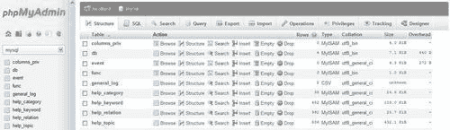

### 首页

主面板可以采用起始页的形式。起始页将包含与 MySQL 操作或 phpMyAdmin 信息相关的各种链接，一个**语言**选择器，可能还有**主题/样式**选择器。

### 视图

在主面板中，我们可以看到`数据库`视图——在这里我们可以对特定数据库执行各种操作，或者`表`视图——在这里我们可以访问许多管理表的功能。还有一个`服务器`视图，对系统管理员和非管理员用户都有用。所有这些视图都有一个顶部菜单，它以选项卡的形式呈现，导航到不同的页面，用于呈现按常见功能（表结构、权限等）重新组织的信息。

## 查询窗口

这是一个独立的窗口，通常从导航面板打开，有时也从主面板编辑 SQL 查询时打开。它的主要目的是方便查询工作，并在主面板上显示结果。

## 起始页

当我们启动 phpMyAdmin 时，我们将看到以下面板中的一个（取决于`config.inc.php`中指定的身份验证类型，以及其中是否定义了多个服务器）：

+   其中一个登录面板

+   导航和主面板显示在主面板中的起始页

# 自定义一般设置

本节描述了对许多面板产生影响的设置。这些设置修改了窗口标题的外观，信息图标的外观，以及表格列表的排序方式。所有页面的视觉风格都由主题系统控制，该系统也在本节中介绍。本节还涉及如何限制用户看到的数据库列表。

## 配置窗口标题

当导航和主面板显示时，窗口标题会更改以反映哪个 MySQL 服务器、数据库和表是活动的。这些指令控制要显示的信息量：`$cfg['TitleDefault'], $cfg['TitleServer'], $cfg['TitleDatabase']`和`$cfg['TitleTable']`。

如果没有选择服务器，则`$cfg['TitleDefault']`控制标题。当选择了服务器（但没有选择数据库）时，`$cfg['TitleServer']`控制标题栏中显示的内容。然后如果选择了数据库，则`$cfg['TitleDatabase']`起作用。最后，如果选择了表，则`$cfg['TitleTable']`生效。

这些指令包含控制显示哪些信息的格式字符串。例如，这是其中一个指令的默认值：

```go
$cfg['TitleTable'] = '@HTTP_HOST@ / @VSERVER@ / @DATABASE@ / @TABLE@ | @PHPMYADMIN@';

```

可能的格式字符串及其含义在`Documentation.html`的 FAQ 6.27 中有描述。

## 数据库和表名的自然排序

通常，计算机按词法顺序对项目进行排序，这会导致对表列表的以下结果：

```go
table1
table10
table2
table3

```

phpMyAdmin 默认实现**自然排序**，由`$cfg['NaturalOrder']`设置为`TRUE`来指定。因此导航和主面板中的数据库和表列表按以下方式排序：

```go
table1
table2
table3
table10

```

## 创建特定网站的页眉和页脚

一些用户可能希望在`phpMyAdmin`界面上显示公司标志、公司帮助台的链接或其他信息。为此，在主`phpMyAdmin`目录中，我们可以创建两个脚本`—config.header.inc.php`和`config.footer.inc.php`。我们可以在这些脚本中放入我们自己的 PHP 或 XHTML 代码，它将出现在`cookie`登录和主面板页面的开头（页眉）或结尾（页脚）。

例如，创建一个包含以下内容的`config.footer.inc.php`：

```go
<hr />
<em>All the information on this page is confidential.</em>

```

在页脚中使用这样的句子将在所有页面上产生预期的消息，如下截图所示：

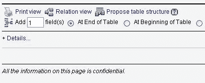

## 主题

phpMyAdmin 中提供了一个主题系统。颜色参数和各种图标位于`themes`子目录下的目录结构中。对于每个可用的主题，都有一个以主题命名的子目录。它包含：

+   主题参数的`layout.inc.php`

+   包含各种 CSS 脚本的`css`目录

+   包含任何图标或其他图像（例如标志）的`img`目录

+   `screen.png`，这个主题的屏幕截图

下载的套件包含两个主题，但在[`phpmyadmin.net/home_page/themes.php`](http://phpmyadmin.net/home_page/themes.php)上还有更多可用的主题。安装新主题只需下载相应的`.zip`文件并将其解压缩到`themes`子目录中。

### 注意

如果有人想要构建一个包含 JavaScript 代码的自定义主题，请注意所有 phpMyAdmin 3.4 页面都包含 jQuery 库。

### 配置主题

在`config.inc.php`中，`$cfg['ThemePath']`参数默认包含`'./themes'`，指示所需结构位于的子目录。这可以更改为指向另一个目录，其中包含您公司特定的 phpMyAdmin 主题。

默认选择的主题在`$cfg['ThemeDefault']`中指定，并设置为`'pmahomme'`。如果用户没有主题选择，将使用此主题。

### 选择主题

在主页上，我们可以向用户提供一个主题选择器。将`$cfg['ThemeManager']`设置为`TRUE`（默认值）会显示如下截图所示的选择器：

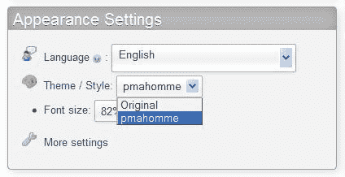

为了帮助选择合适的主题，**主题/样式**链接显示一个面板，其中包含可用主题的屏幕截图和**获取更多主题**链接。然后我们可以在想要的主题下点击**take it**。所选主题的引用将存储在一个 cookie 中，并且默认情况下将应用于我们连接的所有服务器。

为了使 phpMyAdmin 记住每个 MySQL 服务器的一个主题，我们将`$cfg['ThemePerServer']`设置为`TRUE`。

## 选择语言

登录面板（如果有）和主页上会出现一个**语言**选择器。phpMyAdmin 的默认行为是使用浏览器偏好设置中定义的语言，如果有对应版本的语言文件的话。

如果程序无法检测到语言，则使用的默认语言在`config.inc.php`中的`$cfg['DefaultLang']`参数中定义为`'en'`（英语）。这个值是可以改变的。语言名称的可能值在`libraries/select_lang.lib.php`脚本中的`PMA_langDetails()`函数中定义。

即使默认语言已经定义，每个用户（特别是在多用户安装中）都可以从选择器中选择自己喜欢的语言。用户的选择将在可能的情况下保存在 cookie 中。

我们还可以通过设置`$cfg['Lang']`参数的值（比如`'fr'`表示法语）来强制使用单一语言。另一个参数`$cfg['FilterLanguages']`也是可用的。假设我们想要缩短可用语言列表，只显示**英语**和**法语**，因为这些是 phpMyAdmin 实例的用户专门使用的语言。这可以通过构建一个正则表达式来实现，指示我们想要显示的语言基于这些语言的 ISO 639 代码。继续我们的例子，我们会使用：

```go
$cfg['FilterLanguages'] = '^(fr|en)';

```

在这个表达式中，插入符（^）表示“以…开头”，竖线（|）表示“或”。这个表达式表示我们将语言列表限制在对应的 ISO 代码以`fr`或`en`开头的语言。

默认情况下，这个参数是空的，意味着没有对可用语言列表应用任何过滤器。

## 滑块

在一些页面上，你会看到一个小加号，后面跟着一个控制标签——要么是**选项**，要么是**详情**。点击标签会打开一个滑块，显示界面的一个部分，这部分在日常工作中很少使用。由于很少有人愿意立即看到整个界面而牺牲屏幕空间，因此有一个配置参数来控制滑块的初始设置方式：

```go
$cfg['InitialSlidersState'] = 'closed';

```

`closed`的默认值意味着滑块必须通过点击标签来打开；你可能已经猜到了相反的值是`open`。第三个值`disabled`可以被滑块过敏的用户使用。

## 限制数据库列表

有时候，避免在导航面板中显示用户可以访问的所有数据库是有用的。phpMyAdmin 提供了两种限制的方式——`only_db`和`hide_db`。

为了指定可以看到的内容列表，使用`only_db`参数。它可以包含一个数据库名称或一个数据库名称列表。只有这些数据库将在导航面板中显示：

```go
$cfg['Servers'][$i]['only_db'] = 'payroll';
$cfg['Servers'][$i]['only_db'] = array('payroll', 'hr);

```

数据库名称可以包含 MySQL 通配符，比如`_`和`%`。这些通配符在[`dev.mysql.com/doc/refman/5.1/en/account-names.html`](http://dev.mysql.com/doc/refman/5.1/en/account-names.html)中有描述。如果使用数组来指定多个数据库，它们将按照数组中的顺序在界面上显示。

`only_db`的另一个特性是，你可以使用它来不限制列表，而是强调将显示在列表顶部的某些名称。在这里，`myspecial`数据库名称将首先显示，然后是所有其他名称：

```go
$cfg['Servers'][$i]['only_db'] = array('myspecial', '*');

```

我们还可以使用`hide_db`参数指定哪些数据库名称必须被隐藏。它包含一个正则表达式（[`en.wikipedia.org/wiki/Regular_expression`](http://en.wikipedia.org/wiki/Regular_expression)），表示要排除的内容。如果我们不希望用户看到任何以`'secret'`开头的数据库，我们会使用：

```go
$cfg['Servers'][$i]['hide_db'] = '^secret';

```

这些参数适用于此服务器特定配置的所有用户。

### 注意

这些机制不会取代 MySQL 权限系统。用户对其他数据库的权限仍然适用，但他们不能使用 phpMyAdmin 的导航面板来访问他们的其他数据库或表。

## 停用 Ajax

某些页面使用**异步**JavaScript 来改善用户体验。我们可以通过将`$cfg['AjaxEnable']`设置为`false`来停用此行为；在这种情况下，已经编程为非 Ajax 行为的页面将停止使用 Ajax，而是执行完全刷新。用户可能会感觉这样的体验不够流畅。

# 字符集和排序规则

**字符集**描述了特定语言或方言的符号是如何编码的。**排序规则**包含了比较和排序字符集中字符的规则。用于存储我们的数据的字符集可能与用于显示它的字符集不同，导致数据不一致。因此，需要进行数据转换。

自从 MySQL 4.1.x 以来，MySQL 服务器为我们进行字符重编码工作。此外，MySQL 使我们能够指示每个数据库、每个表甚至每个字段的字符集和排序规则。数据库的默认字符集适用于其每个表，除非在表级别被覆盖。相同的原则适用于每一列。

## 有效的字符集和排序规则

在主页上，我们可以看到**MySQL 字符集**信息和**MySQL 连接排序规则**选择器。这是**MySQL 字符集**信息：

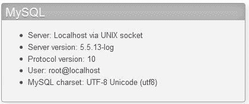

字符集信息（在**MySQL 字符集**之后所见）用于生成 HTML 信息，告诉浏览器页面的字符集是什么。

我们还可以使用**MySQL 连接排序规则**对话框选择连接到 MySQL 服务器时要使用的字符集和排序规则。这将传递给 MySQL 服务器。MySQL 然后将要发送到我们的浏览器的字符转换为此字符集。MySQL 还根据字符集信息解释从浏览器接收到的内容。请记住，所有表和列都有描述其数据编码方式的字符集信息。

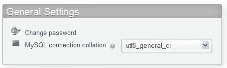

通常情况下，默认值应该有效。但是，如果我们使用不同的字符集输入一些字符，我们可以在此对话框中选择适当的字符集。

以下参数定义了默认连接排序规则和字符集：

```go
$cfg['DefaultConnectionCollation'] = 'utf8_unicode_ci';

```

# 导航面板

导航面板包含以下元素：

+   标志

+   服务器列表（如果`$cfg['LeftDisplayServers']`设置为`TRUE`）

+   **主页**链接或图标（返回到 phpMyAdmin 主页）

+   **注销**链接或图标（如果可以注销）

+   指向**查询窗口**的链接或图标

+   显示 phpMyAdmin 和 MySQL 文档的图标

+   **重新加载**链接或图标（仅刷新此面板）

+   表名过滤器（在某些条件下，请参见*表名过滤器*部分）

+   数据库和表的名称

如果`$cfg['MainPageIconic']`设置为`TRUE`（默认值），我们会看到图标。但是，如果设置为`FALSE`，我们会看到链接。

导航面板可以通过点击并移动垂直分隔线来调整大小，以向首选方向显示更多数据，以防数据库或表名对于默认导航面板大小太长。

我们可以自定义此面板的外观。许多与外观相关的参数位于`themes/<themename>/layout.inc.php`中。`$cfg['NaviWidth']`参数包含导航面板的默认宽度（以像素为单位）。背景颜色在`$cfg['NaviBackground']`中定义。`$cfg['NaviPointerColor']`参数定义了指针颜色。要激活正在使用的任何主题的导航指针，`config.inc.php`中存在一个主设置`$cfg['LeftPointerEnable']`。其默认值为`TRUE`。

## 配置标志

标志显示行为由多个参数控制。首先，`$cfg['LeftDisplayLogo']`必须设置为`TRUE`，才能启用标志的任何显示。默认情况下是`true`。单击此标志将界面带到`$cfg['LeftLogoLink']`参数中列出的页面，通常是 phpMyAdmin 的主页面（默认值`main.php`），但可以更改为任何 URL。最后，`$cfg['LeftLogoLinkWindow']`参数指示单击标志后新页面出现在哪个窗口。默认情况下，它在主页面上（值为`main`）。但是，通过使用值`new`，它可以在全新的窗口上。

logo_left.png 文件本身来自于每个特定主题目录结构中的位置。

## 数据库和表列表

以下示例显示尚未选择任何数据库：

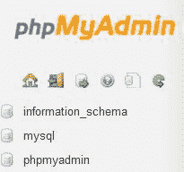

也可能看到**没有数据库**消息，而不是数据库列表。这意味着我们当前的 MySQL 权限不允许我们查看任何现有数据库。

### 注意

MySQL 服务器始终至少有一个数据库（名为**mysql**），但可能存在我们无权查看它的情况。此外，从 MySQL 5.0.2 开始，除非通过`$cfg['Servers'][$i]['only_db']`或`$cfg['Servers'][$i]['hide_db']`机制隐藏，否则数据库列表中始终会出现一个名为**information_schema**的特殊数据库。它包含一组描述已登录用户可见的元数据的视图。

我们可能有权创建一个，如第四章中所述。

### 轻模式

导航面板可以以两种方式显示——**轻模式**和**完整模式**。轻模式是默认使用的，由`$cfg['LeftFrameLight']`中的`TRUE`值定义。此模式显示可用数据库的下拉列表，并且仅显示当前选择数据库的表。它比完整模式更有效；原因在本章后面的*完整模式*部分中解释。在下面的屏幕截图中，我们选择了**mysql**数据库：

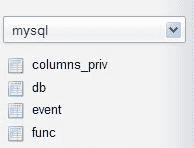

单击数据库名称或选择它会在`Database`视图中打开主面板，单击表名会在`Table`视图中打开主面板以浏览此表。（有关详细信息，请参阅*主面板*部分。）

#### 数据库名称的树形显示

例如，用户可能被允许只在一个数据库上工作**marc**。一些系统管理员通过允许用户**marc**创建许多数据库，前提是所有数据库的名称都以**marc**开头，例如**marc_airline**和**marc_car**，提供了更灵活的方案。在这种情况下，导航面板可以设置为显示这些数据库名称的树，如下面的屏幕截图所示：

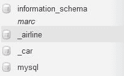

此功能由以下参数控制：

```go
$cfg['LeftFrameDBTree'] = TRUE;
$cfg['LeftFrameDBSeparator'] = '_';

```

`$cfg['LeftFrameDBTree']`中的`TRUE`的默认值确保了此功能的激活。分隔符的常用值是`'_'`。如果我们需要多个字符集作为分隔符，我们只需使用一个数组：

```go
$cfg['LeftFrameDBSeparator'] = array('_', '+');

```

#### 表名过滤器

如果数据库中有太多表，我们可能只想显示其中的一部分，基于过滤文本字符串。仅在轻模式下，如果当前选择了数据库，则会显示一个表名过滤器，前提是表的数量超过了`$cfg['LeftDisplayTableFilterMinimum']`的值，默认值为`30`。当我们在此过滤器中输入表名的子集时，表的列表将减少以匹配此子集。要尝试此功能，我们将指令的值设置为`15`，并在过滤字段中输入**time**：

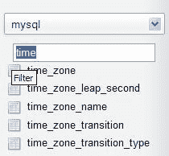

### 完整模式

先前的示例是在 Light 模式下显示的，但是将`$cfg['LeftFrameLight']`参数设置为`FALSE`会使用可折叠菜单（如果浏览器支持）完整布局我们的数据库和表格，如下截图所示：

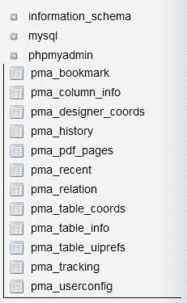

默认情况下，未选择全模式；如果我们当前的权限允许我们访问大量数据库和表格，它可能会增加网络流量和服务器负载。必须在导航面板中生成链接，以启用对表格的访问和快速访问每个表格。

### 表格简略统计

将光标移动到表格名称上会显示关于该表格的注释（如果有的话），以及当前其中的行数，如下截图所示：

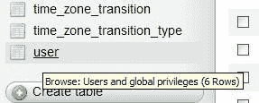

### 表格快速访问图标

已经确定，表格上最常见的操作必须是浏览。因此，单击表格名称本身会以浏览模式打开它。每个表格名称旁边的图标是在每个表格上执行另一个操作的快捷方式，默认情况下，它会将我们带到“结构”视图。

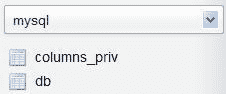

`$cfg['LeftDefaultTabTable']`参数控制此操作。它的默认值是`'tbl_structure.php'`，这是显示表格结构的脚本。此参数的其他可能值在`Documentation.html`中列出。如果我们更喜欢设置，其中单击表格名称会在**结构**页面中打开它，而单击快速访问图标会导航到**浏览**页面，我们必须设置这些指令：

```go
$cfg['LeftDefaultTabTable'] = 'sql.php';
$cfg['DefaultTabTable'] = 'tbl_structure.php';

```

### 数据库中表格的嵌套显示

MySQL 的数据结构基于两个级别——数据库和表格。这不允许对表格进行项目划分。要按项目工作，用户必须依靠拥有多个数据库，但这并不总是由他们的提供商允许。为了帮助他们解决这个问题，phpMyAdmin 支持基于表格命名的**嵌套级别**功能。

假设我们可以访问**db1**数据库，并且我们想要表示两个项目，**营销**和**工资单**。在项目名称和表格名称之间使用特殊分隔符（默认为双下划线），我们创建**marketing, payroll__employees**和**payroll__jobs**表格，实现如下截图所示的视觉效果：

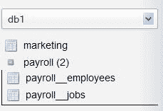

此功能是通过`$cfg['LeftFrameTableSeparator']`（此处设置为`'__'`）进行参数化，以选择标记每个级别更改的字符，以及`$cfg['LeftFrameTableLevel']`（此处设置为`'1'）`用于子级的数量。

### 注意

嵌套级别功能仅用于改进导航面板的外观。在 MySQL 语句中引用表格的正确方法保持不变，例如，`db1.payroll__jobs`。

单击导航面板上的项目名称（这里是**payroll**）会在主面板中打开此项目，仅显示与该项目关联的表格。

### 计算表格数量

默认情况下，`$cfg['Servers'][$i]['CountTables']`设置为`false`，以加快显示速度，不统计每个数据库的表格数量。如果设置为`true`，则在导航面板中显示此计数，显示在每个数据库名称旁边。

## 从服务器列表中选择

如果我们必须从同一个 phpMyAdmin 窗口管理多个服务器，并且经常需要在服务器之间切换，始终在导航面板中具有服务器列表是有用的。

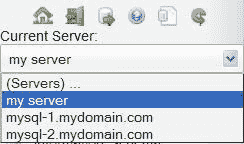

为此，必须将`$cfg['LeftDisplayServers']`参数设置为`TRUE`。服务器列表可以有两种形式——下拉列表或链接。显示哪种形式取决于`$cfg['DisplayServersList']`。默认情况下，此参数设置为`FALSE`，因此我们看到服务器的下拉列表。将`$cfg['DisplayServersList']`设置为`TRUE`会生成到所有定义的服务器的链接列表。

## 处理多个数据库或表格

本节描述了一些应对持有大量数据库和表的服务器的技术。

### 界面上的限制

如果我们可以访问数百甚至数千个数据库，或者在同一个数据库中有数百个表，那么要使用界面将会很困难。这里显示了两个参数及其默认值，它们通过添加页面选择器和导航链接来限制显示的数据库和表的数量：

```go
$cfg['MaxDbList'] = 100;
$cfg['MaxTableList'] = 250;

```

将`$cfg['MaxTableList']`设置为`5`的效果可以在导航面板上看到，如下所示，对于具有超过五个表的数据库：

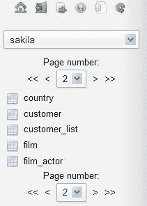

页面选择器和导航链接也出现在主面板中。

### 提高获取速度

三个配置参数会影响数据库名称检索和表计数的速度。第一个是：

```go
$cfg['Servers'][$i]['ShowDatabasesCommand'] = 'SHOW DATABASES';

```

每当 phpMyAdmin 需要从服务器获取数据库列表时，它都会使用此参数中列出的命令。默认命令`SHOW DATABASES`在普通情况下是可以的。但是，在具有许多数据库的服务器上，通过尝试其他命令，例如以下之一，可以观察到速度的提高：

```go
SHOW DATABASES LIKE '#user#\_%'
SELECT DISTINCT TABLE_SCHEMA FROM information_schema.SCHEMA_PRIVILEGES'
SELECT SCHEMA_NAME FROM information_schema.SCHEMATA

```

在第一个示例中，`#user#`被当前用户名替换。

在极端情况下（成千上万个数据库），安装自己的 phpMyAdmin 副本的用户应该在此参数中放入`false`。这将阻止任何数据库名称的获取，并要求将`$cfg['Servers'][$i]['only_db']`参数填充为此用户的数据库列表。

最后，一些用户在从`INFORMATION_SCHEMA`中检索信息时（至少在 MySQL 5.1 下）遇到速度问题。因此，`$cfg['Servers'][$i]['DisableIS']`指令，默认值为`TRUE`，禁用了 phpMyAdmin 代码的大部分部分使用`INFORMATION_SCHEMA`。对于您的服务器，将其设置为`FALSE`可能值得一试，以查看响应时间是否有所改善。

# 主面板

**主面板**是主要的工作区域，所有可能的视图都在以下部分中解释。它的外观可以自定义。背景颜色在`$cfg['MainBackground']`中定义。

## 首页

主页的链接数量可能会根据登录模式和用户权限而有所不同。导航面板上的**首页**链接用于显示此页面。它显示了 phpMyAdmin 和 MySQL 的版本，MySQL 服务器名称以及登录用户。为了减少有关我们的 Web 服务器和 MySQL 服务器的信息，我们可以将`$cfg['ShowServerInfo']`设置为`FALSE`。另一个设置`$cfg['ShowPhpInfo']`，如果我们想在主页上看到**显示 PHP 信息**链接，可以将其设置为`TRUE`——默认情况下其值为`FALSE`。在某些情况下，这里可能会出现**无权限**消息；如何解决此问题以及如何修复此条件在第四章中有介绍。

在此示例中，普通用户可以通过使用**更改密码**链接从界面更改他/她的密码，从而带来以下对话框：

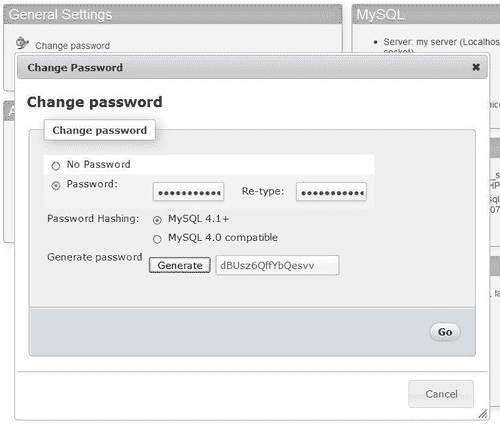

我们可以通过两次输入新密码或使用**生成**按钮（仅在启用 JavaScript 的浏览器中可用）来选择新密码；在这种情况下，新密码将显示在一个清晰的字段中，供我们好好记下，并自动填入更改密码的对话框中。强烈建议以这种方式生成密码，因为它们很可能比人为选择的密码更安全。要禁止从主页上的**更改密码**链接，我们将`$cfg['ShowChgPassword']`设置为`FALSE`。特权用户在主页上有更多选项。他们有更多链接来管理整个服务器，例如**权限**链接（有关此内容，请参见第十九章）。

## 数据库视图

每次我们从导航面板点击数据库名称时，phpMyAdmin 都会进入“数据库”视图（如下截图所示）。

这里我们可以看到数据库的概述——现有的表，创建表的对话框，到“数据库”视图页面的选项卡，以及我们可能在此数据库上执行的一些特殊操作，以生成文档和统计信息。每个表旁边都有一个复选框，用于对该表执行全局操作（在第九章中介绍）。通过复选框或单击行背景的任何位置来选择表。如果`$cfg['ShowStats']`设置为`TRUE`，我们还可以看到每个表的大小。此参数还控制“表”视图中表特定统计信息的显示。

这里出现的初始屏幕是数据库的**结构**页面。我们注意到几乎每个列标题——如**表，记录**和**大小**——都是链接，可以用来对应的列进行排序（第第四章介绍了排序）。虽然按降序表名排序可能不太有用，但按降序大小排序绝对是我们应该偶尔做的事情。

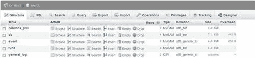

当进入“数据库”视图时，我们可能希望出现不同的初始页面。这由`$cfg['DefaultTabDatabase']`参数控制，在配置文件中的注释中给出了可用选项。

行数是使用快速方法获取的，即`SHOW TABLE STATUS`语句，而不是使用`SELECT COUNT(*) FROM TABLENAME`。这种快速方法通常是准确的，但对于`InnoDB`表来说，它返回的是近似记录数。为了帮助获取正确的记录数，即使对于`InnoDB`，也可以使用`$cfg['MaxExactCount']`参数。如果近似记录数低于此参数的值——默认为 20000——将使用较慢的`SELECT COUNT(*)`方法。

不要为`MaxExactCount`参数设置过高的值。如果您的`InnoDB`表中有成千上万行数据，您将得到正确的结果，但需要等待几分钟。要查看显示的`InnoDB`行数，请参阅第十章，在那里我们实际上有一个`InnoDB`表可以使用。

当在“大小”和“开销”列中看到术语**KiB**时，用户可能会感到惊讶。phpMyAdmin 采用了**国际电工委员会（IEC）**的二进制前缀（参见[`en.wikipedia.org/wiki/Binary_prefix)`](http://en.wikipedia.org/wiki/Binary_prefix)）。显示的值在每个语言文件中定义。

## 表视图

这是一个常用的视图，可以访问所有特定于表的页面。默认情况下，初始屏幕是表的**浏览**屏幕，显示此表数据的第一页。请注意，此屏幕的标题始终显示当前数据库和表名称。我们还可以看到为表设置的注释，显示在表名旁边：

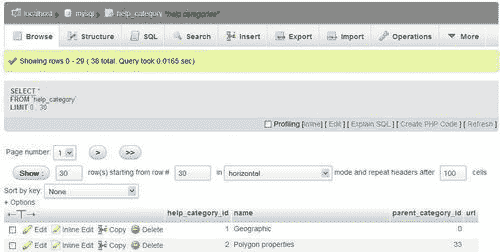

`$cfg['DefaultTabTable']`参数定义了“表”视图的初始页面。一些用户可能希望避免看到第一页的数据，因为在生产中他们通常运行保存的查询或进入**搜索**页面（在第八章中解释）。

## 服务器视图

每次返回主页时都会进入此视图。当然，特权用户在“服务器”视图中会看到更多选项。创建“服务器”视图面板是为了将相关的服务器管理页面分组，并在它们之间实现轻松导航。

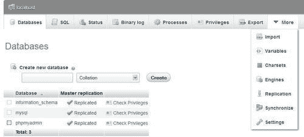

默认的“服务器”页面由`$cfg['DefaultTabServer']`参数控制。此参数定义了初始起始页面。对于多用户安装，建议保持默认值`(main.php)`，显示传统的主页。我们可以选择通过将此参数更改为`server_status.php`来显示服务器统计信息，或者通过`server_privileges.php`来查看用户列表。其他可能的选择在配置文件中有解释，并且服务器管理页面在第十九章中有介绍。

## 主页和菜单选项卡的图标

一个配置参数`$cfg['MainPageIconic']`控制主面板各处图标的外观：

+   在主页上

+   在列出“服务器，数据库”和“表”信息时的页面顶部

+   在“数据库，表”和“服务器”视图的菜单选项卡上

当参数设置为`TRUE`时，默认情况下，您将看到以下截图：


## 打开新的 phpMyAdmin 窗口

有时我们希望同时比较两个表的数据或者有其他需要使用多个 phpMyAdmin 窗口的情况。几乎每个页面的底部都有一个小图标，可以打开另一个带有当前面板内容的 phpMyAdmin 窗口。此外，此图标还可以用于创建一个指向当前 phpMyAdmin 页面的浏览器书签（但我们应该登录以访问数据）。

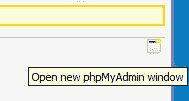

# 用户偏好

一个 phpMyAdmin 实例可以安装为多个用户提供服务；但是，在 3.4.0 版本之前，这些用户必须接受由负责此实例的人选择的参数值。

确实，界面上的一些页面允许调整特定参数，并且其中一些参数被记住在 cookie 中，例如所选语言；但这个版本是第一个提供全局机制来调整和记住每个用户的偏好。

即使在实例只有一个用户的情况下，从界面微调偏好比操作配置文件更方便。

## 访问用户偏好

从主页，我们点击“更多设置”。从“服务器”视图中的任何页面，我们点击“设置”菜单选项卡。进入“设置”面板后，我们看到“管理您的设置”子页面：

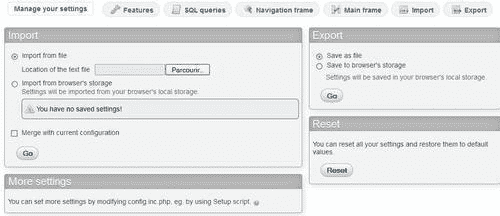

这个子页面是我们全局处理偏好的地方。其他子页面，如“功能”和“主框架”，用于更改特定偏好-请参考“更改设置”部分。

“导入”和“导出”对话框将在“保存偏好的可能位置”部分中介绍。 “更多设置”对话框提醒我们，`config.inc.php`是配置所有可能性的地方，例如指定服务器和认证模式超出了用户偏好的范围。

“重置”对话框使我们可以一键返回所有用户偏好的默认值。

## 保存偏好的可能位置

有三个可能的位置可以保存用户偏好。每个位置都有优缺点；本节涵盖了这些模式。

### 在 phpMyAdmin 配置存储中保存

要启用此模式，必须使用包含这些偏好的表的名称对`$cfg['Servers'][$i]['userconfig']`进行配置，并且该表必须存在。这个保存位置非常有用，因为设置在登录后立即应用于运行的实例；此外，它会跟随用户在任何浏览器上使用。

如果未配置此存储，设置页面会显示以下消息：

“您的偏好将仅保存当前会话。要永久保存它们，需要进行 phpMyAdmin 配置存储”。

### 保存在文件中

我们始终有可能将我们的设置导出到文件中，然后再导入。该文件遵循 JSON 格式（参见[`json.org)`](http://json.org)）。在以下情况下，这种方法可能很方便：

+   我们计划在另一个 phpMyAdmin 实例上使用这些设置

+   我们希望保留我们的设置历史记录；因此，不时地将它们保存在几个文件中

### 保存在浏览器的本地存储中

最近的浏览器，例如 Firefox 6 和 Internet Explorer 9，提供了一种在会话之间持久存在的本地存储机制。第一次进入**管理您的设置**子页面时，我们会在**从浏览器的存储中导入**对话框中看到**您没有保存的设置！**消息。然而，将设置导出到浏览器的本地存储后，**导入**部分会告诉我们使用此机制上次保存设置的日期和时间。

此外，当在浏览器的存储中找到 phpMyAdmin 设置并且 phpMyAdmin 配置存储不可用时，每个 phpMyAdmin 页面顶部都有以下消息：

**您的浏览器为此域名配置了 phpMyAdmin。您想要为当前会话导入吗？是/否**

使用此方法的一个缺点是，我们的设置仅在使用此浏览器时才可用；此外，如果我们更改工作站时我们的浏览器设置不跟随我们，那么设置将绑定到此特定工作站（并适用于在其上运行 phpMyAdmin 的任何其他用户）。

## 更改设置

在进入特定偏好的子页面时，例如**主框架**子页面，我们会看到与此主题相关的第三级菜单：

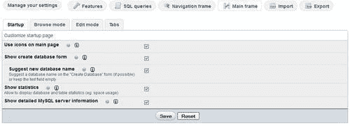

如果偏好已从其默认值更改，则复选框或数据字段具有不同的背景颜色，并且旁边显示了一个回收图标，以便快速将此偏好重置为其默认值。对每个指令都提供了快速解释，并且链接指向文档和官方维基。作为一般建议，我们需要在切换到不同的子页面之前保存我们在页面上所做的任何更改；然而，在这个例子中，我们可以在**启动**和其他第三级菜单之间切换，如**浏览模式**，而不会丢失我们的更改。

## 禁止特定偏好

负责`config.inc.php`的人对用户偏好中可以更改哪些设置有最终决定权。为了禁止某些设置，我们使用`$cfg['UserprefsDisallow']`指令。我们将一个包含代表要禁止的`$cfg`中的键的数组放入其中。例如，我们将此指令设置为：

```go
$cfg['UserprefsDisallow'] = array('AjaxEnable', 'MaxDbList');

```

这会产生如下截图所示的警告：

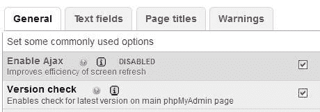

## 显示开发人员设置

某些设置是敏感的，仅供开发 phpMyAdmin 的人员使用。例如，显示所有错误的可能性，包括 PHP 通知，可能会导致公开 phpMyAdmin 实例的完整路径。因此，在**功能**子选项卡中，只有在`$cfg['UserprefsDeveloperTab']`设置为`true`时，才会显示**开发人员**菜单。

# 查询窗口

通常情况下，我们可以在一个独立的窗口中输入和调整查询，并且与主面板同步是非常方便的。这个窗口被称为**查询窗口**。我们可以通过使用小的**SQL**图标或导航面板的图标或链接区域中的**查询窗口**链接来打开此窗口。此功能仅适用于启用 JavaScript 的浏览器。

**查询窗口**本身有子页面，并且如下截图所示，它出现在主面板上方：

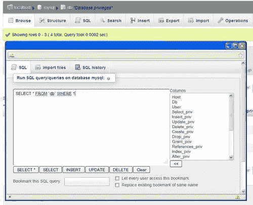

我们可以使用`$cfg['QueryWindowWidth']`和`$cfg['QueryWindowHeight']`选择此窗口的尺寸（以像素为单位）。第十一章更详细地解释了查询窗口，包括可用的 SQL 查询历史记录功能。

# 总结

本章涵盖了：

+   语言选择系统

+   导航和主面板的目的

+   导航面板的内容，包括轻模式和完整模式

+   主面板的内容，根据上下文的不同有不同的视图

+   用户偏好功能

+   查询窗口

下一章将指导您通过简单的步骤来完成一个新安装的 phpMyAdmin——初始表创建、数据插入和检索。
