# 第四章：创建和浏览表

在看到了 phpMyAdmin 的整体布局之后，我们准备创建一个数据库，创建我们的第一个表，向其中插入一些数据，并浏览它。这些第一步是故意简单的，但它们将为您提供更复杂操作的基础。在本章结束时，我们将拥有两个基本表，这是后续练习的基础。

# 创建数据库

在创建表之前，我们必须确保我们有一个数据库，MySQL 服务器的管理员已经给了我们`CREATE`权限。存在以下可能性：

+   管理员已经为我们创建了一个数据库，并且我们在导航面板中看到了它的名称；我们没有权利创建额外的数据库。

+   我们有权从 phpMyAdmin 创建数据库。

+   我们在一个共享主机上，主机提供商已经安装了一个通用的网络界面（例如 cPanel）来创建 MySQL 数据库和账户；在这种情况下，我们现在应该访问这个网络界面，确保我们至少创建了一个数据库和一个 MySQL 账户。

`Server`视图中的**数据库**面板是查找数据库创建对话框的地方。请注意，配置参数`$cfg['ShowCreateDb']`控制**创建新数据库**对话框的显示。默认情况下，它设置为`true`，显示对话框。

## 无权限

如果您没有创建数据库的权限，面板在**创建新数据库**标签下显示**无权限**消息。这意味着您必须使用已为您创建的数据库，或者要求 MySQL 服务器的管理员给您必要的`CREATE`权限。

### 注意

如果您是 MySQL 服务器的管理员，请参阅第十九章。

## 第一个数据库创建已被授权

如果 phpMyAdmin 检测到我们有权创建数据库，则对话框将显示如下截图所示：

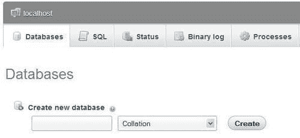

在输入字段中，如果`$cfg['SuggestDBName']`参数设置为`TRUE`，则会出现建议的数据库名称，这是默认设置。建议的数据库名称是根据我们拥有的权限构建的。

如果我们受限于使用前缀，前缀可能会在输入字段中建议。在这种情况下，前缀后面可能会跟着一个省略号，由 phpMyAdmin 添加。我们应该删除这个省略号，并用适当的名称完成输入字段。


**排序**选择现在可以保持不变。通过这个对话框，我们可以为这个数据库选择一个默认的字符集和排序规则。这个设置可以稍后更改（参考第九章了解更多信息）。

我们假设我们有权创建一个名为**marc_book**的数据库。我们在输入字段中输入**marc_book**并点击**创建**。一旦数据库创建完成，我们将看到以下屏幕：

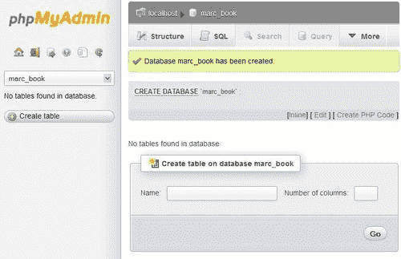

请注意以下内容：

+   主面板的标题已经更改，以反映我们现在位于这个数据库中

+   显示有关创建的确认消息

+   导航面板已更新；我们看到**marc_book**

+   默认情况下，phpMyAdmin 向服务器发送的用于创建数据库的 SQL 查询以彩色显示

### 注意

phpMyAdmin 显示它生成的查询，因为`$cfg['ShowSQL']`设置为`TRUE`。查看生成的查询可以是学习 SQL 的好方法。

由于生成的查询可能很大并且占用屏幕空间很多，`$cfg['MaxCharactersInDisplayedSQL']`充当一个限制。其默认值为`1000`应该是在查看查询时看到太少或太多查询之间的一个良好平衡，特别是在进行大量导入时。

检查 phpMyAdmin 的反馈以确定我们通过界面进行的操作的有效性是很重要的。这样，我们可以检测到错误，比如名称中的拼写错误，或者在错误的数据库中创建表。phpMyAdmin 从 MySQL 服务器检索错误消息并在界面上显示它们。

# 创建我们的第一个表

现在我们有了一个新的数据库，是时候在其中创建一个表了。我们将创建的示例表名为**book**。

## 选择列

在创建表之前，我们应该计划我们想要存储的信息。这通常是在数据库设计期间完成的。在我们的情况下，简单的分析导致我们想要保留以下与书籍相关的数据：

+   国际标准图书编号（ISBN）

+   标题

+   页数

+   作者识别

现在，对于我们的**book**表来说，拥有完整的列列表并不重要。我们将通过原型设计结构，然后稍后进行修改。在本章结束时，我们将添加第二个表`author`，其中包含有关每个作者的信息。

## 创建表

我们已经选择了我们的表名，并且知道了列的数量。我们在“创建表”对话框中输入这些信息，然后点击“Go”开始创建表。此时，列的数量是否完全知道并不重要，因为后续的面板将允许我们在创建表时添加列。

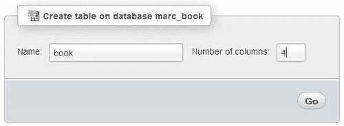

然后我们看到一个指定列信息的面板。因为我们要求四列，所以我们得到了四个输入行。每一行都指的是一个特定列的信息。下面的屏幕截图代表了这个面板的左侧：

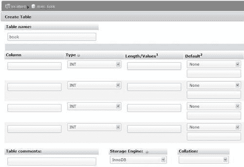

接下来的内容代表右侧：

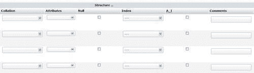

MySQL 文档解释了表和列名的有效字符（如果我们搜索“合法名称”）。这可能会根据 MySQL 版本而有所不同。通常，文件名中允许的任何字符（除了点和斜杠）在表名中都是可以接受的，名称的长度不能超过 64 个字符。列名也存在 64 个字符的限制，但我们可以使用任何字符。

我们在“列”列下输入我们的列名。每个列都有一个类型，最常用的类型位于下拉列表的开头。

当列的内容是字母数字时，**VARCHAR**（可变字符）类型被广泛使用，因为内容只会占用所需的空间。这种类型需要一个最大长度，我们需要指定。如果忘记这样做，当我们保存时会有一个小弹出消息提醒我们。对于页面计数和作者识别，我们选择了**INT**类型（整数），如下面的屏幕截图所示：

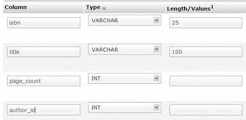

列还有其他属性，但在这个例子中我们将它们留空。您可能会注意到屏幕底部的“添加 1 列”对话框。我们可以使用它通过输入适当的值并点击“Go”来向这个创建表面板添加一些列。输入行的数量会根据新的列数而改变，但已经输入的关于前四列的信息不变。在保存页面之前，让我们定义一些键。

## 选择键

表通常应该有一个主键（具有唯一内容的列，代表每一行）。拥有主键对于行标识、更好的性能和可能的跨表关系是推荐的。在这里一个很好的值是 ISBN；因此，在**索引**对话框中，我们选择**PRIMARY**作为**isbn**列的索引类型。索引类型的其他可能性包括**INDEX, UNIQUE**和**FULLTEXT**（在第五章中有更多关于此的内容）。

### 注意

**索引管理**（也称为键管理）可以在初始表创建时进行，也可以在`Table`视图的**结构**页面中进行。

为了提高我们将通过**author_id**进行的查询的速度，我们应该在该列上添加一个索引。我们屏幕右侧现在的样子如下截图所示：

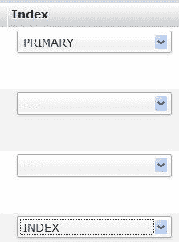

此时，我们可以从相应的下拉菜单中选择不同的**存储引擎**。但是，目前我们将接受默认的存储引擎。

现在，我们点击**保存**来创建表。如果一切顺利，下一个屏幕将确认表已创建；我们现在位于当前数据库的**结构**页面。

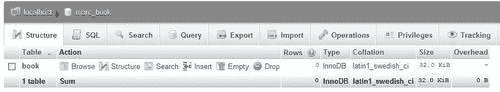

在**book**表的各种链接中，有些是不活跃的，因为如果其中没有行，则浏览或搜索表是没有意义的。

# 手动插入数据

既然我们有了一张表，让我们手动在其中插入一些数据。在这样做之前，这本书中有一些有用的关于数据操作的参考资料：

+   第五章介绍了如何更改数据和结构，包括如何使用**Function**选择器

+   第七章解释了如何从现有文件导入数据

+   第九章解释了如何从其他表复制数据

+   第十章介绍了关系系统（在我们的情况下，我们将要链接到`author`表）

现在，点击**插入**链接，这将带我们进入数据输入（或编辑）面板。该屏幕有空间可以输入两行信息，也就是说，在我们的示例中有两本书。这是因为`$cfg['InsertRows']`的默认值是`2`。在屏幕的下部，如果默认的行数不适合我们的需求，可以使用对话框**继续插入 2 行**。默认情况下，**忽略**复选框被选中，这意味着第二组输入字段将被忽略。一旦我们在该组的一个字段中输入一些信息并退出该字段，如果浏览器中启用了 JavaScript，则**忽略**框将自动取消选中。

我们可以为两本书输入以下示例信息：

+   ISBN：1-234567-89-0，标题：一百年的电影（第 1 卷），600 页，作者 ID：1

+   ISBN：1-234567-22-0，标题：未来的纪念品，200 页，作者 ID：2

**值**列的宽度遵循字符列的最大长度。在这个例子中，我们将较低的下拉选择器保持为**插入为新行**的默认值。然后，我们点击**Go**来插入数据。在每组代表一行的列后面都有一个**Go**按钮，屏幕的下部也有一个。所有这些都有相同的效果，即保存输入的数据，但为了方便起见提供了这些按钮。

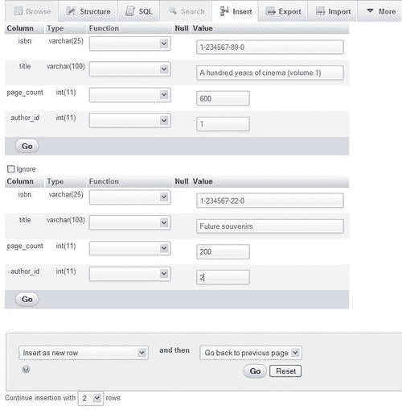

如果我们的意图是在这两本书之后输入更多书的数据，我们将在点击**Go**之前从第二个下拉菜单中选择**插入另一行**。然后这将插入我们提供的数据并重新加载屏幕以插入更多数据。

## CHAR 和 VARCHAR 的数据输入面板调整

默认情况下，phpMyAdmin 为`CHAR`和`VARCHAR`列类型显示单行输入字段。通过将`$cfg['CharEditing']`设置为`'input'`来控制。有时，我们可能希望在字段内插入换行符（新行）。这可以通过将`$cfg['CharEditing']`设置为`'textarea'`来实现。这是一个全局设置，将适用于此副本的所有用户的所有表的所有列。在此模式下，可以通过*Enter*键手动插入换行符，或者通过从屏幕上的其他源复制和粘贴文本行来完成。应用此设置将生成不同的**插入**屏幕，如下所示：

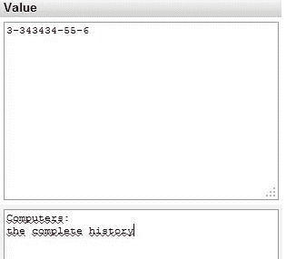

使用此输入模式，每个列的最大长度在视觉上不再适用。它将在插入时由 MySQL 强制执行。

# 浏览模式

有许多种方式可以进入这种模式。实际上，每次显示查询结果时都会使用这种模式。我们可以通过在导航面板上点击表名，或者在特定表的`表`视图中点击**浏览**来进入这种模式。

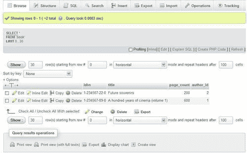

## SQL 查询链接

在**浏览**结果中，显示的第一部分是查询本身，以及一些链接。显示的链接可能会根据我们的操作和一些配置参数而有所不同。

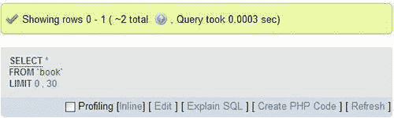

以下几点描述了每个链接的功能：

+   **分析**复选框在本章的*分析查询*部分中有详细介绍。

+   **内联**链接允许将查询放入文本区域，而无需重新加载页面；然后可以编辑查询并执行新的查询。

+   如果将`$cfg['SQLQuery']['Edit']`设置为`TRUE`，则会显示**编辑**链接。其目的是打开**查询窗口**，以便编辑此查询（有关详细信息，请参阅第十一章）。

+   如果将`$cfg['SQLQuery']['Explain']`设置为`TRUE`，则会显示**解释 SQL**。我们将在第五章中看到此链接可以用于什么。 

+   可以点击**创建 PHP 代码**链接，将查询重新格式化为 PHP 脚本中预期的语法。然后可以直接复制并粘贴到我们正在工作的 PHP 脚本中需要查询的地方。请注意，点击后，此链接会更改为**无 PHP 代码**（如下截图所示），这将恢复正常的查询显示。如果将`$cfg['SQLQuery']['ShowAsPHP']`设置为`TRUE`，则此链接可用。

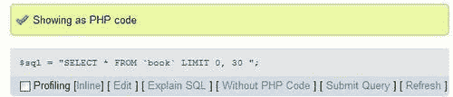

+   **刷新**用于再次执行相同的查询。结果可能会发生变化，因为 MySQL 服务器是多用户服务器，其他用户或进程可能正在修改相同的表。如果将`$cfg['SQLQuery']['Refresh']`设置为`TRUE`，则会显示此链接。

## 导航栏

导航栏显示在结果的顶部和底部。根据**重复标题后**字段中输入的值，列标题可以在结果中的某些间隔中重复显示。


该栏使我们能够从一页导航到另一页，显示任意数量的行，从结果的某一点开始。通过点击**浏览**进入浏览模式，生成结果的基础查询包括整个表。但是，情况并非总是如此。

我们目前正在使用包含少量行的表。对于更大的表，我们可能会看到更完整的导航按钮集。为了模拟这种情况，让我们使用**显示**对话框将默认行数从**30**更改为**1**；然后点击**显示**。我们可以看到导航栏会自适应，如下截图所示：

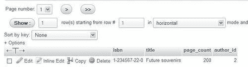

这一次，有标有**<<, <, >**和**>>**的按钮，用于方便地访问结果的第一页、上一页、下一页和最后一页。这些按钮仅在必要时显示；例如，如果我们已经在第一页上，则不会显示**第一页**按钮。这些符号以这种方式显示，因为`$cfg['NavigationBarIconic']`的默认设置为`TRUE`。在这里的`FALSE`会产生诸如**下一页**和**结束**的按钮，而`'both'`的值会显示**> 下一页**和**>> 结束**。

### 注意

请注意，`$cfg['NavigationBarIconic']`指令仅控制这些导航按钮的行为；其他按钮和链接（如**编辑**）由其他配置指令控制。

还有一个**页码**下拉菜单，可以直接转到靠近当前页的页面之一。由于可能有数百或数千页，因此该菜单保持较小，并包含常请求的页面：当前页面前后的几页，开头和结尾的几页，以及基于计算间隔的页面编号示例。

按设计，phpMyAdmin 始终尝试提供快速结果，实现此结果的一种方法是在`SELECT`中添加`LIMIT`子句。如果原始查询中已经有`LIMIT`子句，phpMyAdmin 将予以尊重。默认限制是 30 行，设置在`$cfg['MaxRows']`中。如果服务器上有许多用户，限制返回的行数有助于将服务器负载保持在最低水平。

导航栏上还有一个按钮，但必须通过将`$cfg['ShowAll']`设置为`TRUE`来激活。用户很容易会经常使用这个按钮。因此，在 phpMyAdmin 的多用户安装中，建议将按钮保持为其默认值禁用（FALSE）。启用时，导航栏将增加一个**显示全部**按钮。单击此按钮将检索当前结果集的所有行，这可能会达到 PHP 的执行时间限制或服务器的内存限制；当要求显示数千行时，大多数浏览器也会崩溃。可以安全显示的确切行数无法预测，因为它取决于列中实际存在的数据以及浏览器的功能。

### 注意

如果在**显示 __ 行**对话框中输入一个大数字，将会获得相同的结果（并且可能会面临相同的问题）。

## 查询结果操作

一个名为**查询结果操作**的部分位于结果下方。它包含打印结果的链接（带有或不带有`FULL TEXT`列），导出这些结果的链接（参考第六章中的*导出部分查询结果*部分），或者从此查询创建一个视图的链接（关于这一点在第十七章中有更多信息）。

### 显示数据为图表

另一个可用的操作是**显示图表**。为了练习这个，我们将使用一个选择只有两列的不同查询。为此，我们可以使用查询旁边显示的**内联**链接，并将查询更改为：

```go
SELECT page_count, author_id from book

```

单击**Go**会生成一个只有这两列的结果集；接下来我们点击**显示图表**，会生成以下面板：

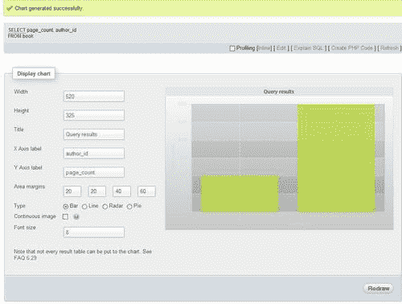

更多详细信息请参阅[`wiki.phpmyadmin.net/pma/Charts`](http://wiki.phpmyadmin.net/pma/Charts)。

## 排序结果

在 SQL 中，除非我们明确地对数据进行排序，否则我们无法确定数据检索的顺序。检索引擎的一些实现可能以与输入数据顺序相同的顺序显示结果，或者根据主键的顺序显示结果。然而，以明确排序的方式获取我们想要的结果是一种确定的方法。

当浏览结果显示时，可以单击任何列标题以对该列进行排序，即使它不是索引的一部分。让我们点击**author_id**列标题。

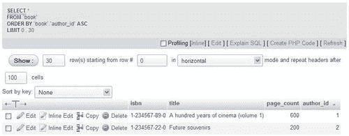

我们可以确认排序已经发生，通过观察屏幕顶部的 SQL 查询；它包含一个**ORDER BY**子句。

现在我们在**author_id**标题旁边看到一个小三角形指向上方。这意味着当前的排序顺序是“升序”。将鼠标悬停在**author_id**标题上会使三角形改变方向，以指示如果再次点击标题会发生什么——按**author_id**值降序排序。

另一种排序的方法是按键排序。**排序**对话框显示了已经定义的所有键。在这里，我们看到一个名为**PRIMARY**的键——这是我们在创建时为**isbn**列检查**Primary**时给出的主键的名称：

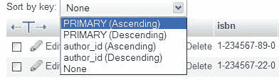

这可能是一次对多列进行排序的唯一方法（用于多列索引）。

初始排序顺序在`$cfg['Order']`中定义，使用`ASC`表示升序，`DESC`表示降序，或者`SMART`；后者是默认排序顺序，这意味着`DATE, TIME, DATETIME`和`TIMESTAMP`类型的列将按降序排序，而其他列类型将按升序排序。

### 头词

因为我们可以更改页面上显示的行数，很可能我们看不到所有数据。在这种情况下，看到**头词**会有所帮助——关于显示数据的第一行和最后一行的指示。这样，您可以点击**下一个**或**上一个**，而不必滚动到窗口底部。

然而，phpMyAdmin 应该基于哪一列生成头词？一个简单的假设已经被提出：如果您点击列标题表示您打算对该列进行排序，phpMyAdmin 将使用该列的数据作为头词。对于我们当前的**book**表，我们没有足够的数据来清楚地注意到这种技术的好处。然而，我们仍然可以看到排序后，屏幕顶部现在包含这条消息：

**显示行 0 - 1（共 2 行，查询耗时 0.0006 秒）[author_id: 1 - 2]**

在这里，方括号中的消息表示**author_id**编号**1**在第一行显示，编号**2**在最后一行显示。

## 颜色标记行或列

当鼠标在行之间移动（或在列标题之间移动）时，行（或列）的背景颜色可能会改变为`$cfg['BrowsePointerColor']`中定义的颜色。此参数可以在`themes/<themename>/layout.inc.php`中找到。要启用此功能，所有主题的浏览指针`$cfg['BrowsePointerEnable']`必须在`config.inc.php`中设置为`TRUE`（默认值）。

当我们在表中有许多列并且必须不断向左和向右滚动以读取数据时，可以有趣地标记一些行。另一个用途是突出一些行的重要性，以进行个人数据比较，或者向他人展示数据时。通过点击行来进行突出显示。再次点击会取消对行的标记。所选颜色由`$cfg['BrowseMarkerColor']`（参见`themes/<themename>/layout.inc.php`）定义。此功能必须通过在`config.inc.php`中将`$cfg['BrowseMarkerEnable']`设置为`TRUE`来启用。这将为所有主题设置该功能。我们可以标记多行。标记行还会激活该行的复选框。


通过点击列标题（而不是列名本身）来标记列。

## 限制每列的长度

在前面的例子中，我们总是看到每列的完整内容，因为每列的字符数都在`$cfg['LimitChars']`定义的限制内。这是对所有非数字列强制执行的限制。如果这个限制很低（比如`10`），显示将如下所示：

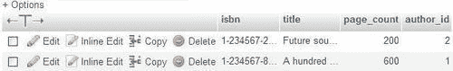

这将帮助我们同时看到更多列（以减少每列的显示量）。

### 显示选项

为了看到完整的文本，我们现在将使用**选项**滑块，它会显示一些显示选项。所有这些选项将在涵盖相应概念的章节中进行解释。目前关注我们的选项是**部分文本/完整文本**对；我们可以选择**完整文本**来查看所有被截断的文本。即使我们选择不改变`$cfg['LimitChars']`参数，也会有一个时候要求完整文本会很有用（当我们使用`TEXT`列类型时——更多内容请参阅第五章）。

查看完整文本的更快方法是点击位于**编辑**和**删除**图标正上方的大**T**。再次点击此**T**会将显示从完整切换到部分。

## 浏览不同的值

有一种快速的方法可以显示所有不同的值以及每个列值的出现次数。这个功能在表的**结构**页面上可用。例如，我们想知道我们的书表中有多少不同的作者，以及每个作者写了多少本书。在描述我们想要浏览的列（这里是**author_id**）的行上，我们打开**更多**菜单，然后点击**浏览不同的值**链接。

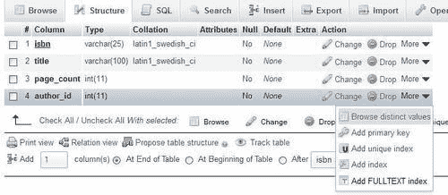

我们有一个有限的测试集，但仍然可以看到结果。

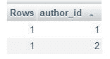

# 性能分析查询

在 MySQL 版本 5.0.37 和 5.1.28 中添加了性能支持。我们之前已经看到**性能分析**复选框出现在查询结果中。

当选中此框时，phpMyAdmin 将分析每个查询（包括当前查询），并显示有关每个 MySQL 内部操作的执行时间的报告，如下面的屏幕截图所示：

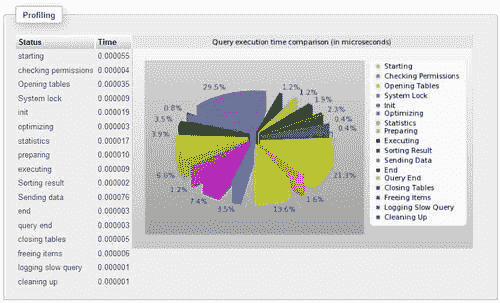

尽管性能分析系统可以报告有关操作的其他信息（如 CPU 时间，甚至是内部服务器的函数名称），但 phpMyAdmin 目前只显示操作的名称和持续时间。

# 创建一个额外的表

在我们（简单）的设计中，我们知道我们需要另一个表——**author**表。**author**表将包含：

+   作者识别

+   全名

+   电话号码

要创建此表，我们返回到**marc_book**的`数据库`视图，并请求创建另一个具有如下屏幕截图所示的三列的表：

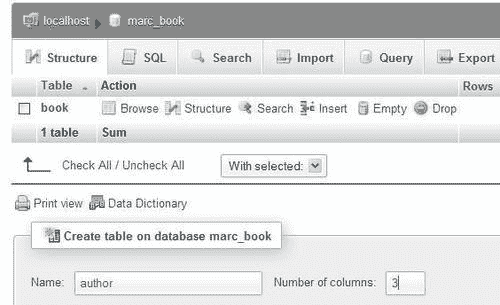

使用创建第一个表时使用的相同技术，我们输入以下内容：

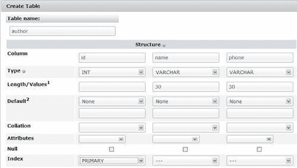

由于我们只有三列或更少，显示现在处于垂直模式（有关更多详细信息，请参阅第五章中的*垂直模式*部分）。

列名**id**，它是我们新表中的主键，与`book`表中的`author_id`列相关联。保存表结构后，我们为作者 1 和 2 输入一些数据。为此，请发挥您的想象！

# 总结

本章解释了如何创建数据库和表，以及如何在表中手动输入数据。它还涵盖了如何通过使用浏览模式来确认数据的存在，其中包括 SQL 查询链接、导航栏、排序选项和行标记。

下一章将解释如何编辑数据行，并涵盖删除行、表和数据库的各个方面。
